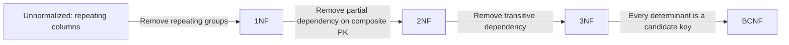
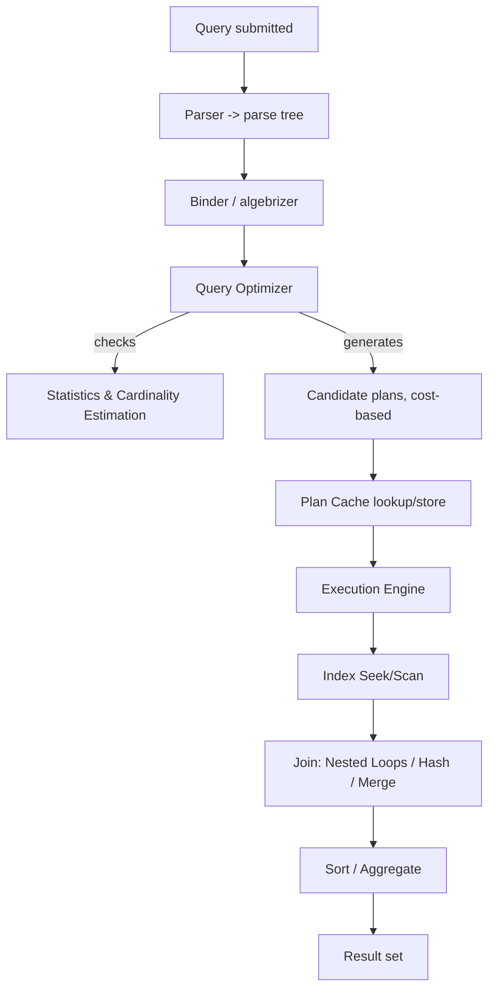
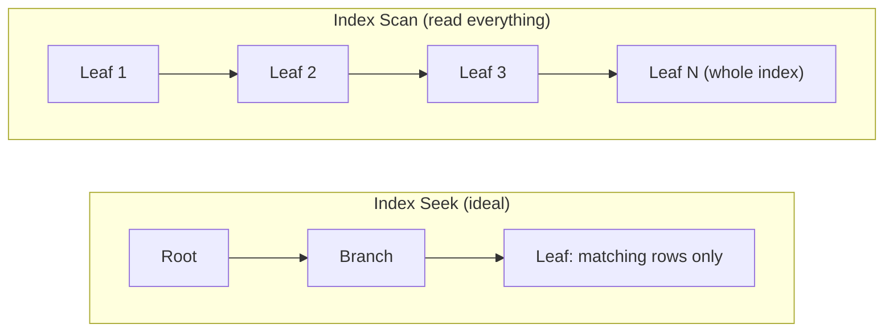
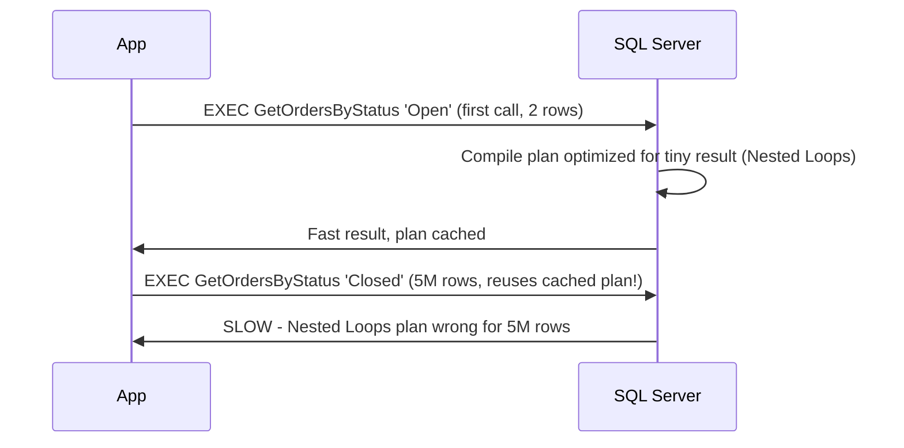
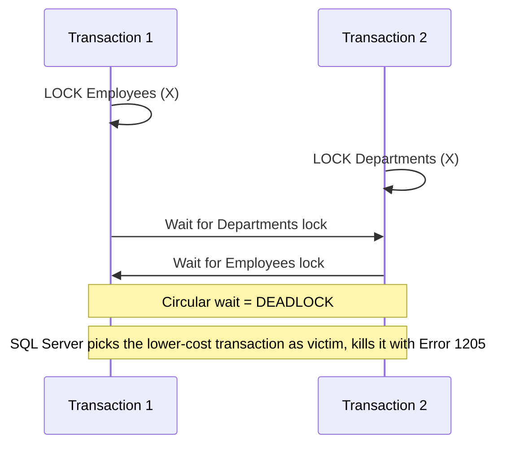

# SQL Server Interview Guide (Senior / Lead .NET Full-Stack)

> Consolidated from personal notes + gap-filled for senior-level 2026 interviews.
> Additions carry the **[new content]** tag in their heading so you can see at a glance what was added beyond your original notes.

## Table of Contents

- [Core Concepts](#core-concepts)
  - [RDBMS Basics & Keys](#rdbms-basics--keys)
  - [DELETE vs TRUNCATE vs DROP](#delete-vs-truncate-vs-drop)
  - [WHERE vs HAVING](#where-vs-having)
  - [CHAR vs VARCHAR vs NCHAR/NVARCHAR](#char-vs-varchar-vs-ncharnvarchar)
  - [Views (Normal, Indexed/Materialized)](#views-normal-indexedmaterialized)
  - [Stored Procedures vs Functions](#stored-procedures-vs-functions)
  - [Triggers & Magic Tables (inserted/deleted)](#triggers--magic-tables-insereddeleted)
  - [Normalization & Denormalization (1NF–BCNF)](#normalization--denormalization-1nfbcnf)
  - [[new content] OLTP vs OLAP](#new-content-oltp-vs-olap)
- [Intermediate](#intermediate)
  - [Joins: INNER, OUTER, CROSS, SELF](#joins-inner-outer-cross-self)
  - [UNION vs UNION ALL](#union-vs-union-all)
  - [CTE vs Temp Table vs Table Variable vs View](#cte-vs-temp-table-vs-table-variable-vs-view)
  - [Subqueries: Scalar, Correlated, EXISTS vs IN vs JOIN](#subqueries-scalar-correlated-exists-vs-in-vs-join)
  - [Cursors and Why to Avoid Them](#cursors-and-why-to-avoid-them)
  - [Dynamic SQL](#dynamic-sql)
  - [TRY...CATCH, THROW vs RAISERROR](#trycatch-throw-vs-raiserror)
  - [Window Functions Deep Dive](#window-functions-deep-dive)
  - [[new content] SARGability](#new-content-sargability)
- [Advanced](#advanced)
  - [Execution Plans & Join Operators](#execution-plans--join-operators)
  - [[new content] Index Seek vs Scan, Key Lookup, Covering Indexes](#new-content-index-seek-vs-scan-key-lookup-covering-indexes)
  - [[new content] Statistics & Cardinality Estimation](#new-content-statistics--cardinality-estimation)
  - [[new content] Parameter Sniffing](#new-content-parameter-sniffing)
  - [Transactions & ACID](#transactions--acid)
  - [Isolation Levels & Concurrency](#isolation-levels--concurrency)
  - [[new content] RCSI vs Snapshot Isolation (Optimistic Concurrency)](#new-content-rcsi-vs-snapshot-isolation-optimistic-concurrency)
  - [Locking: Types, Granularity, and Deadlocks](#locking-types-granularity-and-deadlocks)
  - [[new content] TempDB Contention & Configuration](#new-content-tempdb-contention--configuration)
  - [[new content] Query Store in Depth](#new-content-query-store-in-depth)
  - [[new content] Columnstore Indexes for Analytics](#new-content-columnstore-indexes-for-analytics)
  - [[new content] Table Partitioning](#new-content-table-partitioning)
  - [High Availability & Disaster Recovery](#high-availability--disaster-recovery)
  - [Backup & Restore](#backup--restore)
  - [Full-Text Search](#full-text-search)
  - [Security: Encryption, RBAC](#security-encryption-rbac)
- [Performance Tuning](#performance-tuning)
  - [[new content] Index Fragmentation & Maintenance](#new-content-index-fragmentation--maintenance)
  - [Query Optimization Checklist](#query-optimization-checklist)
  - [DMVs and Monitoring Tools](#dmvs-and-monitoring-tools)
  - [Real-World Troubleshooting Scenarios](#real-world-troubleshooting-scenarios)
- [Best Practices](#best-practices)
- [Common Pitfalls](#common-pitfalls)
- [Sample Interview Q&A (Answered)](#sample-interview-qa-answered)
  - [Practical Query Challenges (Fully Solved)](#practical-query-challenges-fully-solved)
- [Summary of Additions](#summary-of-additions)

---

## Core Concepts

### RDBMS Basics & Keys

- **SQL Server** is Microsoft's RDBMS. Core components: Database Engine, SQL Server Agent, SSMS, SSRS, SSIS, SSAS.
- **Primary Key**: uniquely identifies a row, disallows NULL, creates a clustered index by default (unless you explicitly specify nonclustered).
- **Foreign Key**: enforces referential integrity between a child column and a parent's primary/unique key. Does **not** automatically create an index on the child column — you must add one yourself if you join/filter/delete on it frequently (otherwise deletes/updates on the parent cause table scans on the child while checking the constraint).
- **Unique Key**: enforces uniqueness, allows exactly one NULL (NULL is not considered equal to NULL in a unique index), creates a nonclustered index by default.
- **Constraints**: `PRIMARY KEY`, `FOREIGN KEY`, `UNIQUE`, `CHECK`, `DEFAULT`, `NOT NULL`, `IDENTITY`.

```sql
CREATE TABLE dbo.OrdersDemo (
  OrderID INT IDENTITY(1,1) NOT NULL,
  OrderNumber NVARCHAR(30) NOT NULL,
  CustomerID INT NOT NULL,
  OrderDate DATE NOT NULL CONSTRAINT CK_OrdersDemo_OrderDate CHECK (OrderDate <= CAST(GETDATE() AS DATE)),
  Quantity INT NOT NULL CONSTRAINT CK_OrdersDemo_Quantity CHECK (Quantity > 0),
  UnitPrice MONEY NOT NULL CONSTRAINT CK_OrdersDemo_Price CHECK (UnitPrice >= 0),
  Status NVARCHAR(20) NOT NULL CONSTRAINT DF_OrdersDemo_Status DEFAULT ('Open'),
  LineTotal AS (Quantity * CONVERT(DECIMAL(18,2), UnitPrice)) PERSISTED,
  CONSTRAINT PK_OrdersDemo PRIMARY KEY CLUSTERED (OrderID),
  CONSTRAINT UQ_OrdersDemo_OrderNumber UNIQUE (OrderNumber),
  CONSTRAINT FK_OrdersDemo_Customers FOREIGN KEY (CustomerID)
    REFERENCES dbo.Customers(CustomerID)
    ON DELETE NO ACTION
    ON UPDATE NO ACTION
);
-- Index the FK column explicitly — SQL Server does not do this for you
CREATE NONCLUSTERED INDEX IX_OrdersDemo_CustomerID ON dbo.OrdersDemo(CustomerID);
```

- **Computed columns**: derived from an expression; `PERSISTED` materializes the value on disk so it can be indexed, but the expression must be deterministic. You cannot insert/update a computed column directly.
- **Cascading actions**: `ON DELETE CASCADE` / `ON UPDATE CASCADE` propagate parent deletes/updates to children automatically. Use with caution in production — always test cascade behavior against a copy of real data first, since an unexpected cascade can wipe out far more data than intended.

### DELETE vs TRUNCATE vs DROP

| Feature | DELETE | TRUNCATE | DROP |
|---|---|---|---|
| Type | DML | DDL | DDL |
| Scope | Specific rows (WHERE) | All rows | Entire table + structure |
| Logging | Full row-level logging (slower) | Minimal, page-deallocation logging (faster) | Minimal |
| Rollback | Yes, fully transactional | Yes, if inside an explicit transaction (contrary to popular belief — it **is** transactional and can be rolled back before COMMIT; it just doesn't log individual row deletes) | Yes, if inside an explicit transaction |
| Resets IDENTITY | No | Yes, resets to seed | N/A (table gone) |
| Triggers fired | Yes (AFTER triggers) | No | No |
| FK constraints | Checked per row | Table must have no active FK references pointing to it (or must truncate children first) | Must drop dependent objects first |
| Use case | Remove specific rows | Fast wipe + identity reset | Permanently remove object |

> **Correction to a common myth in interview notes:** "TRUNCATE cannot be rolled back" is only true if it runs as an *auto-committed* standalone statement outside a transaction. Inside `BEGIN TRAN ... ROLLBACK`, `TRUNCATE TABLE` **is** rolled back. The real difference vs DELETE is the *logging granularity* (page deallocations vs row-by-row), not transactional capability.

### WHERE vs HAVING

- `WHERE` filters rows **before** grouping/aggregation; cannot reference aggregate functions (mostly).
- `HAVING` filters groups **after** `GROUP BY`/aggregation; used to filter on aggregate results (e.g., `HAVING COUNT(*) > 1`).

### CHAR vs VARCHAR vs NCHAR/NVARCHAR

| Feature | CHAR | VARCHAR | NCHAR | NVARCHAR |
|---|---|---|---|---|
| Length | Fixed | Variable | Fixed | Variable |
| Encoding | Non-Unicode (1 byte/char) | Non-Unicode | Unicode (2 bytes/char) | Unicode |
| Padding | Space-padded | No padding | Space-padded | No padding |
| `CHAR(10)` storage | Always 10 bytes | — | Always 20 bytes | — |
| Best for | Fixed codes (country code, status flag) | Variable text | Fixed-length multilingual data | Variable multilingual text (names, free text) |

**[new content] Gotcha interviewers probe on:** mixing `VARCHAR` literals with `NVARCHAR` columns forces an implicit conversion that can silently disable an index seek (the optimizer may need to convert every row or, worse, convert the column side of a predicate). Always prefix Unicode string literals with `N'...'` when comparing against `NVARCHAR` columns.

### Views (Normal, Indexed/Materialized)

A view is a saved `SELECT` — virtual, no physical storage (except indexed views).

- **Simple view**: single table.
- **Complex view**: joins/aggregations.
- **Indexed (materialized) view**: created `WITH SCHEMABINDING`, then given a `UNIQUE CLUSTERED INDEX`. Data is physically persisted and automatically, synchronously maintained on every INSERT/UPDATE/DELETE against the base tables — this is the key exam point: **it never shows stale data**, unlike materialized views in some other RDBMSs that require manual/scheduled refresh. The cost is write amplification: every DML against base tables also updates the view's index.

```sql
CREATE OR ALTER VIEW dbo.vOrderTotals
WITH SCHEMABINDING
AS
SELECT o.OrderID, SUM(oi.Quantity * oi.UnitPrice) AS OrderTotal
FROM dbo.Orders o
JOIN dbo.OrderItems oi ON o.OrderID = oi.OrderID
GROUP BY o.OrderID;
GO
CREATE UNIQUE CLUSTERED INDEX IX_vOrderTotals_OrderID ON dbo.vOrderTotals(OrderID);
```

Indexed view restrictions (senior-level detail interviewers expect): requires `SCHEMABINDING`; all referenced functions/expressions must be deterministic; specific `SET` options must be fixed at the session level (`ANSI_NULLS`, `QUOTED_IDENTIFIER`, etc.); no outer joins, `SUM`/`COUNT` on nullable expressions need extra care (`COUNT_BIG` is often required internally); Standard Edition (2016 SP1+) can use indexed views but the optimizer only auto-matches them with `NOEXPAND` hint on non-Enterprise in some versions — verify against your exact edition/version (verify).

**Pros/cons at a glance:**

| | Normal View | Indexed View |
|---|---|---|
| Storage | None | Persisted |
| Read performance | No inherent gain | Fast, precomputed |
| Write cost | None | Higher (maintained on every DML) |
| Restrictions | Few | Many (schemabinding, determinism, SET options) |
| Data freshness | Always current | Always current (synchronously maintained) |

### Stored Procedures vs Functions

| Feature | Stored Procedure | Scalar Function | Table-Valued Function |
|---|---|---|---|
| Return | 0+ result sets, OUTPUT params, int return code | Single scalar value | Table |
| Usable in SELECT/JOIN | No | Yes | Yes |
| Can modify data | Yes | No (unless via `SCHEMABINDING`-free tricks — generally treat as read-only) | No |
| Transactions | Yes | No | No |
| Error handling | Full TRY/CATCH | Limited | Limited |
| Performance | Compiled, plan cached, reused | **Historically slow when scalar and called per-row** (pre-2019); see note below | Inline TVFs are inlined into the query plan (fast); multi-statement TVFs are not (slow, like a black box to the optimizer) |

```sql
CREATE OR ALTER PROCEDURE dbo.uspCreateOrder
  @orderNumber NVARCHAR(30), @customerID INT, @orderDate DATE,
  @quantity INT, @unitPrice MONEY, @newOrderID INT OUTPUT
AS
BEGIN
  SET NOCOUNT ON;
  BEGIN TRY
    INSERT INTO dbo.Orders (OrderNumber, CustomerID, OrderDate, Quantity, UnitPrice)
    VALUES (@orderNumber, @customerID, @orderDate, @quantity, @unitPrice);
    SET @newOrderID = SCOPE_IDENTITY();  -- NOT @@IDENTITY (see pitfalls)
    RETURN 0;
  END TRY
  BEGIN CATCH
    SET @newOrderID = -1;
    THROW;
  END CATCH;
END;
```

**[new content] Scalar UDF inlining (SQL Server 2019+):** Prior to 2019, scalar UDFs referenced in a query were executed row-by-row (RBAR) regardless of how the surrounding query was structured, killing parallelism and making them one of the top hidden performance killers in OLTP code review. SQL Server 2019 introduced **Scalar UDF Inlining**, which transforms eligible T-SQL scalar functions into equivalent relational expressions/subqueries at compile time, allowing set-based execution and parallelism. Eligibility rules: no `TRY/CATCH`, no non-deterministic functions with side effects like `RAND()`/temp tables, and other restrictions. You can check `sys.sql_modules.is_inlineable`. Compatibility level must be 150+. This is a very common senior-interview "gotcha" question: *"Are scalar functions always slow?"* — the honest answer is "no longer necessarily, depending on version and function shape."

### Triggers & Magic Tables (inserted/deleted)

Types: **AFTER** (fires post-DML, cannot run on views), **INSTEAD OF** (replaces the DML, commonly used for soft deletes or updatable views), **DDL triggers** (schema changes like `CREATE`/`DROP`), **LOGON triggers** (server-level, fire on login).

`inserted` and `deleted` are virtual, in-memory pseudo-tables scoped to the trigger:

| Operation | `inserted` | `deleted` |
|---|---|---|
| INSERT | new rows | empty |
| DELETE | empty | old rows |
| UPDATE | new values | old values |

```sql
CREATE TRIGGER trg_AuditOrders ON Orders
AFTER INSERT, UPDATE, DELETE
AS
BEGIN
  SET NOCOUNT ON;
  INSERT INTO OrderAudit(OrderId, ActionType, ActionDate)
  SELECT COALESCE(i.OrderId, d.OrderId),
    CASE WHEN i.OrderId IS NOT NULL AND d.OrderId IS NULL THEN 'INSERT'
         WHEN i.OrderId IS NOT NULL AND d.OrderId IS NOT NULL THEN 'UPDATE'
         ELSE 'DELETE' END,
    SYSUTCDATETIME()
  FROM inserted i
  FULL OUTER JOIN deleted d ON i.OrderId = d.OrderId;
END;
```

**Critical pitfall (must-know for seniors):** triggers fire **once per statement, not once per row**. Code that does `SELECT @id = OrderId FROM inserted` silently only picks up one arbitrary row on multi-row inserts — a classic production bug. Always treat `inserted`/`deleted` as sets and join/aggregate against them.

Other pitfalls: recursive triggers (a trigger updating the same table it's defined on, causing re-entry — guard with `TRIGGER_NESTED_LEVEL()` or disable `RECURSIVE_TRIGGERS`), triggers run in the same transaction as the DML (a slow or failing trigger blocks/rolls back the caller silently), execution order among multiple triggers on the same table/event is not guaranteed (unless you use `sp_settriggerorder` for first/last), and triggers add overhead to bulk loads (often disabled during ETL: `ALTER TABLE ... DISABLE TRIGGER ALL`).

### Normalization & Denormalization (1NF–BCNF)

| Level | Fixes | Rule |
|---|---|---|
| 1NF | Repeating groups | Atomic values, unique row identifier |
| 2NF | Partial dependency | Every non-key column depends on the **whole** composite PK |
| 3NF | Transitive dependency | Non-key columns depend only on the PK, not on other non-key columns |
| BCNF | Anomalies 3NF misses | Every determinant is a candidate key |

**Denormalization** intentionally reintroduces redundancy to cut joins and speed up reads — common in reporting/OLAP/dashboards, at the cost of write complexity and potential inconsistency.



### [new content] OLTP vs OLAP

| | OLTP | OLAP |
|---|---|---|
| Purpose | Transaction processing | Analytical reporting |
| Workload | Many small, fast reads/writes | Few large, complex read-heavy queries |
| Schema | Normalized (3NF) | Denormalized (star/snowflake schema) |
| Example | Order entry system | Data warehouse / BI dashboard |
| Indexing strategy | Selective nonclustered indexes for point lookups | Columnstore indexes, wide scans, aggregates |
| Concurrency concern | Locking/blocking, deadlocks | Query concurrency, resource governance |

Why this matters at senior level: interviewers want to hear that you separate OLTP and OLAP workloads (e.g., via read replicas, Always On readable secondaries, or a dedicated reporting/warehouse database) rather than letting heavy analytical queries starve the transactional system's buffer pool and locks.

---

## Intermediate

### Joins: INNER, OUTER, CROSS, SELF

| Join | Behavior |
|---|---|
| INNER JOIN | Only matching rows from both sides |
| LEFT (OUTER) JOIN | All left rows + matches from right (NULL if none) |
| RIGHT (OUTER) JOIN | All right rows + matches from left |
| FULL (OUTER) JOIN | All rows from both sides, NULLs where unmatched |
| CROSS JOIN | Cartesian product (every row × every row) |
| SELF JOIN | Table joined to itself via alias (e.g., employee → manager) |

```sql
-- Self join: employee -> manager
SELECT e.EmployeeID, e.Name AS Employee, m.Name AS Manager
FROM dbo.Employees e
LEFT JOIN dbo.Employees m ON e.ManagerID = m.EmployeeID;
```

### UNION vs UNION ALL

- `UNION` de-duplicates (implicit sort/hash distinct — costs CPU/memory).
- `UNION ALL` keeps all rows, no dedup step — always prefer it when duplicates are acceptable or impossible.
- Column count and (implicitly convertible) types must match across all SELECTs.
- `ORDER BY` applies to the **combined** result and must appear only after the final SELECT.

### CTE vs Temp Table vs Table Variable vs View

| Feature | CTE | Temp Table (`#t`) | Table Variable (`@t`) | View |
|---|---|---|---|---|
| Lifetime | Single statement | Session / until dropped | Batch/procedure scope | Permanent (schema object) |
| Storage | Not materialized (usually) | tempdb, physical | tempdb, physical (lighter) | None (unless indexed) |
| Indexes | None | Yes (explicit) | Only PK/UNIQUE inline (2016+ allows nonclustered too) | Only via indexed view |
| Statistics | None | Full column/index stats maintained | Historically none (pre-2019 estimated as 1 row!) — SQL Server 2019+ adds deferred compilation with better cardinality estimates | Normal (on base tables) |
| Recursion | Yes | No | No | No |
| Recompilation | N/A | Can cause recompiles if schema changes mid-proc | Doesn't cause recompiles (major reason to prefer for hot procs pre-2019) | N/A |
| Best for | Recursive/readability, single use | Large intermediate sets needing indexes/stats | Small sets, avoiding recompilation | Reusable, security abstraction |

**[new content] Why this table matters more than the notes captured:** the classic advice "table variables never cause recompiles, temp tables might" is real but the flip side — **table variables had no real statistics prior to SQL Server 2019**, so the optimizer always assumed ~1 row for a table variable, which could produce catastrophic plans (e.g., a nested loop against a table variable that actually holds 500K rows). SQL Server 2019's **table variable deferred compilation** fixes this by delaying compilation until first execution so actual row counts are known — bringing table variable cardinality estimation roughly in line with temp tables. This is a common trap question: *"Why would you ever use a temp table instead of a table variable for a large intermediate set on SQL Server 2016?"* Answer: because the table variable's estimate-of-1 assumption could cause disastrous execution plans; the temp table has real, cardinality-aware statistics.

```sql
-- Recursive CTE: employee hierarchy
WITH EmployeeHierarchy AS (
    SELECT EmployeeID, Name, ManagerID, 1 AS Level
    FROM Employees WHERE ManagerID IS NULL
    UNION ALL
    SELECT e.EmployeeID, e.Name, e.ManagerID, eh.Level + 1
    FROM Employees e
    INNER JOIN EmployeeHierarchy eh ON e.ManagerID = eh.EmployeeID
)
SELECT * FROM EmployeeHierarchy;
```

### Subqueries: Scalar, Correlated, EXISTS vs IN vs JOIN

- **Scalar subquery**: must return 0 or 1 value per outer row, else "Subquery returned more than 1 value" error.
- **Correlated subquery**: references the outer query, logically re-evaluated per outer row (the optimizer may or may not literally loop — it can rewrite into a join internally).
- **EXISTS vs IN**: `EXISTS` short-circuits on first match and handles NULLs safely; `IN` materializes the full candidate list and is dangerous with NULLs.

```sql
-- Classic NULL trap: NOT IN with a NULL in the subquery returns ZERO rows unexpectedly
SELECT CustomerName FROM dbo.Customers
WHERE CustomerID NOT IN (SELECT CustomerID FROM (VALUES (100),(101),(NULL)) AS x(CustomerID));
-- returns nothing, because comparing against NULL yields UNKNOWN, not FALSE

-- Safe alternative
SELECT c.CustomerName FROM dbo.Customers c
WHERE NOT EXISTS (SELECT 1 FROM dbo.Orders o WHERE o.CustomerID = c.CustomerID);
```

- Modern optimizer usually rewrites correlated `EXISTS`/`IN` subqueries into semi-joins with equivalent plans to explicit joins — but always verify via execution plan rather than assuming; on older SQL Server versions or complex predicates, an explicit `JOIN`/`GROUP BY` can still outperform a correlated subquery evaluated per row.

### Cursors and Why to Avoid Them

Row-by-row processing (RBAR). Types: **static**, **dynamic**, **forward-only** (fastest), **keyset-driven**.

```sql
DECLARE @EmployeeID INT, @Salary INT;
DECLARE EmployeeCursor CURSOR FOR SELECT EmployeeID, Salary FROM Employees;
OPEN EmployeeCursor;
FETCH NEXT FROM EmployeeCursor INTO @EmployeeID, @Salary;
WHILE @@FETCH_STATUS = 0
BEGIN
    -- row-by-row work
    FETCH NEXT FROM EmployeeCursor INTO @EmployeeID, @Salary;
END;
CLOSE EmployeeCursor;
DEALLOCATE EmployeeCursor;
```

Prefer set-based equivalents:

```sql
UPDATE Employees SET Salary = Salary * 1.10 WHERE Salary < 70000;
```

Cursors are legitimate only when a genuinely procedural, order-dependent operation can't be expressed relationally (e.g., calling an external stored proc per row, sequential state machines). Otherwise: slow, memory-heavy, and can hold locks longer, worsening blocking/deadlocks.

### Dynamic SQL

```sql
DECLARE @sql NVARCHAR(MAX) = N'SELECT * FROM Users WHERE Id = @Id';
EXEC sp_executesql @sql, N'@Id INT', @Id = 5;
```

Always use `sp_executesql` with parameters (never string-concatenate user input — SQL injection) so the plan is parameterized and reusable. `EXEC()` on a concatenated string is both an injection risk and produces a fresh, non-reusable plan almost every time (cache pollution).

### TRY...CATCH, THROW vs RAISERROR

```sql
BEGIN TRY
    BEGIN TRAN;
    -- statements
    COMMIT TRAN;
END TRY
BEGIN CATCH
    IF XACT_STATE() <> 0 ROLLBACK TRAN;
    THROW;  -- re-raises original error with original number/line/severity
END CATCH;
```

- `ERROR_NUMBER()`, `ERROR_MESSAGE()`, `ERROR_SEVERITY()`, `ERROR_STATE()`, `ERROR_LINE()`, `ERROR_PROCEDURE()` — valid only inside CATCH.
- `XACT_STATE()`: `1` = active/committable, `0` = none, `-1` = doomed/uncommittable (must rollback — attempting COMMIT throws another error).
- `THROW` (2012+) preserves the original error context and is simpler; `RAISERROR` is legacy, needs manual formatting, and does not automatically preserve line/procedure info the same way. **Use THROW in new code.**
- TRY/CATCH does **not** catch: compile-time errors, syntax errors, "object not found" resolved at parse time, or errors severe enough to terminate the connection (severity ≥ 20).

### Window Functions Deep Dive

| Function | Behavior |
|---|---|
| `ROW_NUMBER()` | Unique sequential number per partition, always distinct even for ties |
| `RANK()` | Ties share rank; **skips** numbers after a tie (1,2,2,4) |
| `DENSE_RANK()` | Ties share rank; **no gaps** (1,2,2,3) |
| `NTILE(n)` | Splits partition into n roughly-equal buckets |
| `LAG(col, offset, default)` | Value from a prior row in the partition |
| `LEAD(col, offset, default)` | Value from a following row |
| `FIRST_VALUE()` / `LAST_VALUE()` | First/last value in the window frame — **`LAST_VALUE` is a classic trap** |
| `NTH_VALUE()` | Nth value in ordering (2019+; use a `ROW_NUMBER` + `MAX(CASE...)` trick on older versions) |

```sql
-- Running total, deterministic with ROWS not RANGE
SELECT *, SUM(amount) OVER (
  PARTITION BY region ORDER BY sale_date
  ROWS BETWEEN UNBOUNDED PRECEDING AND CURRENT ROW
) AS running_total
FROM sales;
```

**Key gotchas:**
1. **`LAST_VALUE` surprise**: the default frame is `RANGE BETWEEN UNBOUNDED PRECEDING AND CURRENT ROW`, so `LAST_VALUE` returns the *current row's* value, not the partition's true last value — you must explicitly expand the frame: `ROWS BETWEEN UNBOUNDED PRECEDING AND UNBOUNDED FOLLOWING`.
2. **RANGE vs ROWS**: `RANGE` groups peer rows sharing the same `ORDER BY` value into one logical frame (surprising with ties); `ROWS` is strictly row-count based and predictable — prefer `ROWS` for running totals.
3. Always specify a deterministic `ORDER BY` (with tiebreaker column) inside `OVER()`, or ordering/results become non-deterministic across executions.
4. Window aggregates (`SUM() OVER(...)`) keep row-level granularity, unlike `GROUP BY` which collapses rows — this is the most common "why do I have duplicate totals in every row" confusion for people new to window functions.
5. Window functions can't be used directly in `WHERE`/`HAVING` — wrap in a CTE/subquery and filter the alias.

```sql
-- Nth highest salary via DENSE_RANK (fastest common approach)
SELECT Salary FROM (
  SELECT Salary, DENSE_RANK() OVER (ORDER BY Salary DESC) AS rnk
  FROM Employees
) t WHERE rnk = @N;
```

### [new content] SARGability

**SARG** = **S**earch **ARG**ument — a predicate the query optimizer can convert into an efficient index seek. A non-SARGable predicate forces a scan even when a perfectly good index exists.

Common SARGability killers and fixes:

```sql
-- NOT SARGable: function wraps the indexed column
SELECT * FROM Orders WHERE YEAR(OrderDate) = 2025;

-- SARGable rewrite: leave the column bare, push the range into literals
SELECT * FROM Orders
WHERE OrderDate >= '2025-01-01' AND OrderDate < '2026-01-01';
```

| Non-SARGable pattern | SARGable fix |
|---|---|
| `WHERE YEAR(OrderDate) = 2025` | `WHERE OrderDate >= '2025-01-01' AND OrderDate < '2026-01-01'` |
| `WHERE ISNULL(Status,'') = 'Open'` | `WHERE Status = 'Open' OR Status IS NULL` (or redesign to avoid NULL) |
| `WHERE LTRIM(RTRIM(Name)) = 'Bob'` | Clean data at write time; compare raw column |
| `WHERE Column LIKE '%abc%'` | Leading wildcard defeats a b-tree seek — needs full-text search or a different data model |
| `WHERE CAST(SomeVarcharCol AS INT) = 5` | Fix data types at the schema level; don't cast the column side |
| `WHERE Salary * 1.1 > 50000` | `WHERE Salary > 50000 / 1.1` — keep the column isolated on one side |
| `WHERE Col1 + Col2 = @x` | Compute `@x - Col2` on the parameter side instead |

The universal rule: **never wrap the indexed column in a function or expression** — the optimizer can't use an index on a computed transformation of a column unless that exact computed expression itself has a matching computed-column index. This is one of the single most common senior-level "spot the bug" interview questions.

---

## Advanced

### Execution Plans & Join Operators

**Estimated vs Actual plan**: Estimated (`Ctrl+L`) shows the optimizer's guess without running the query — cheap, safe on production. Actual (`Ctrl+M`) runs the query and shows real row counts alongside estimates — the single most valuable diagnostic when a plan "looks fine" but the query is slow: a huge **estimated vs actual row count mismatch** signals stale/missing statistics or parameter sniffing.

Key operators:

| Operator | Meaning |
|---|---|
| Table Scan | Reads every row of a heap — usually bad at scale |
| Index Scan | Reads every row of an index (can still be fine if it's a small/covering index scan) |
| Index Seek | Uses index b-tree to jump directly to matching rows — ideal |
| Key Lookup | Extra seek into the clustered index to fetch columns not in a nonclustered index — expensive per row at volume; fix with a covering index |
| Sort | Explicit sort operator — often removable via a supporting index order |
| Nested Loops | For each outer row, seek/scan the inner input — great when outer set is small and inner is indexed |
| Hash Match | Builds an in-memory hash table from the smaller input, probes with the larger — good for large, unsorted, unindexed sets; risk of tempdb spill under memory pressure |
| Merge Join | Zipper-merges two already-sorted inputs — cheapest join when both sides are pre-sorted (e.g., both driven by the same indexed key) |
| Parallelism (gather streams) | Query executed across multiple threads/cores |



**Join operator decision table:**

| Scenario | Likely operator | Why |
|---|---|---|
| Small outer input, indexed inner input | Nested Loops | Few seeks against a b-tree |
| Large, unsorted, unindexed both sides | Hash Match | No sort/index dependency; builds hash once |
| Both inputs already sorted on join key (e.g., clustered index order) | Merge Join | Sequential zipper scan, minimal memory |
| Outer input unexpectedly large (1M+ rows) with Nested Loops chosen | Red flag — parameter sniffing or stale stats likely | Millions of index seeks is a symptom, not a cause |

```sql
SELECT * FROM Employees WHERE Age > 30;             -- Table Scan without index
CREATE INDEX IDX_Employees_Age ON Employees(Age);
SELECT * FROM Employees WHERE Age > 30;             -- Now Index Seek
```

How to capture plans: SSMS `Ctrl+L` / `Ctrl+M`; `SET STATISTICS IO, TIME ON`; Query Store; Extended Events (`query_post_execution_showplan`).

### [new content] Index Seek vs Scan, Key Lookup, Covering Indexes



- **Index Seek**: b-tree navigation directly to the needed rows/range — O(log n) style access. Best for highly selective predicates.
- **Index Scan**: reads the whole index leaf level — acceptable when returning most/all rows, or on a small table where a seek's overhead isn't worth it.
- **Key Lookup**: when a nonclustered index doesn't contain all requested columns, SQL Server does an extra seek into the clustered index (or heap RID lookup) per matching row to fetch the rest. At high row counts, a `Nested Loops + Key Lookup` combo (visible as a distinctive "seek + lookup" pattern in the plan) is often *more expensive than a table scan* — a classic tuning trap. Fix with a covering index.

```sql
-- Query needing OrderDate filter + CustomerName, Status in the SELECT
SELECT OrderDate, CustomerName, Status FROM Orders WHERE OrderDate > '2025-01-01';

-- Non-covering index -> seek + key lookup per row
CREATE NONCLUSTERED INDEX IX_Orders_OrderDate ON Orders(OrderDate);

-- Covering index: INCLUDE columns needed only in the SELECT (not used for seeking/filtering)
CREATE NONCLUSTERED INDEX IX_Orders_OrderDate_Covering
  ON Orders(OrderDate)
  INCLUDE (CustomerName, Status);
```

**Why `INCLUDE` instead of adding columns to the key**: included columns are stored only at the leaf level, not in the b-tree's intermediate levels, so they don't bloat seek navigation or force wider intermediate pages, and they can include data types not allowed as key columns (e.g., large `VARCHAR(MAX)` in some contexts). Composite key column order matters for seeks (leftmost-prefix rule, like a phone book — you can search by last name, then first name, but not by first name alone), while `INCLUDE` column order does not.

### [new content] Statistics & Cardinality Estimation

The optimizer chooses plans based on **estimated row counts**, derived from column/index **statistics** (histograms + density info), not from scanning the actual table at compile time. Stale or missing statistics are one of the top real-world causes of bad plans.

```sql
-- Inspect statistics
DBCC SHOW_STATISTICS ('dbo.Orders', 'IX_Orders_OrderDate');

-- Manually update (usually automatic, but useful after bulk loads)
UPDATE STATISTICS dbo.Orders IX_Orders_OrderDate WITH FULLSCAN;

-- Check auto-update settings
SELECT name, is_auto_update_stats_on, is_auto_create_stats_on FROM sys.databases WHERE name = DB_NAME();
```

- Auto-update triggers on a threshold of modified rows (historically ~20% of table rows for `AUTO_UPDATE_STATISTICS`; SQL Server 2016+ compat level 130+ uses a lower, size-dependent dynamic threshold for large tables — meaning big tables get statistics refreshed proportionally sooner).
- The **Cardinality Estimator (CE)** changed significantly in SQL Server 2014 (new CE vs "legacy" pre-2012 CE). Database compatibility level controls which CE model is used — a classic "why did my plan change after a migration" root cause. You can force the legacy CE via trace flag 9481 or `ALTER DATABASE SCOPED CONFIGURATION SET LEGACY_CARDINALITY_ESTIMATION = ON` for troubleshooting/compat.
- Ascending-key problem: for a column that only ever grows (e.g., an `IDENTITY` or `SYSDATETIME()` timestamp), statistics can under-estimate rows for values *newer* than the last stats update, because the histogram has no data past its last sampled max. Trace flag 2371 or more frequent stats updates mitigate this.

### [new content] Parameter Sniffing

SQL Server **compiles and caches a plan for a parameterized query (stored proc, `sp_executesql`) based on the parameter values supplied on the first call**. That plan is then reused for all subsequent calls, even with very different parameter values/selectivity — this is "parameter sniffing," and it's usually beneficial (plan reuse), but becomes a serious problem with **skewed data distributions**.

Classic symptom: "the same stored proc is fast for most customers but takes 30 seconds for one big customer" (or vice versa — compiled on the big customer, now slow for everyone else).

```sql
CREATE OR ALTER PROCEDURE dbo.GetOrdersByStatus @Status VARCHAR(20)
AS
BEGIN
  SELECT * FROM Orders WHERE Status = @Status;
  -- If 'Open' = 2 rows and 'Closed' = 5,000,000 rows, whichever value
  -- compiles the plan first "sniffs" that selectivity into the cached plan.
END;
```

Fixes, roughly in order of preference:

| Fix | How | Trade-off |
|---|---|---|
| `OPTION (RECOMPILE)` | Recompiles every execution using actual runtime parameter values | No plan reuse — CPU cost per call, but always optimal per-call plan |
| `OPTIMIZE FOR (@Status = 'typical value')` | Pins compilation to a representative value | Good for "one common case, few outliers" |
| `OPTIMIZE FOR UNKNOWN` | Uses average/density-based estimate instead of sniffing any specific value | Balanced, "safe average" plan — avoids best-case and worst-case extremes |
| Local variables trick | Copy parameter into a local variable, filter on the local variable | Forces the optimizer to use density-vector average estimate (same effect as `OPTIMIZE FOR UNKNOWN` but via an older trick) — use the explicit hint instead in new code |
| Split into separate procs per case | `IF @Status = 'Closed' EXEC procA ELSE EXEC procB` | Each gets its own cached, optimal plan; more code to maintain |
| Query Store "Force Plan" | Pin a known-good historical plan | Good stop-gap in production incidents |



### Transactions & ACID

- **Atomicity**: all-or-nothing.
- **Consistency**: data satisfies all constraints/rules before and after.
- **Isolation**: concurrent transactions don't see each other's uncommitted intermediate state (degree depends on isolation level).
- **Durability**: committed changes survive crashes (via the write-ahead transaction log).

```sql
BEGIN TRAN;
  INSERT INTO Orders VALUES (1);
  UPDATE Stock SET Qty = Qty - 1;
  SAVE TRAN Step1;
  -- optional partial work
  -- ROLLBACK TRAN Step1;  -- rolls back only to savepoint, not entire transaction
COMMIT;
```

Savepoints (`SAVE TRAN`) allow partial rollback within a larger transaction but do **not** release any locks already acquired — a common misconception. Nested `BEGIN TRAN` calls don't create true independent sub-transactions; `@@TRANCOUNT` just increments, and only the outermost `COMMIT` actually commits (but any `ROLLBACK` at any nesting level rolls back everything, ignoring savepoints unless targeted explicitly).

### Isolation Levels & Concurrency

| Isolation Level | Dirty Read | Non-Repeatable Read | Phantom Read | Mechanism |
|---|---|---|---|---|
| Read Uncommitted | Possible | Possible | Possible | No locks on reads (`NOLOCK`) |
| Read Committed (default) | Prevented | Possible | Possible | Short-lived read locks, released immediately |
| Repeatable Read | Prevented | Prevented | Possible | Read locks held until end of transaction |
| Serializable | Prevented | Prevented | Prevented | Range locks — blocks inserts into the read range |
| Snapshot | Prevented | Prevented | Prevented | Row versioning (optimistic), no blocking reads |
| Read Committed Snapshot (RCSI) | Prevented | Possible | Possible | Row versioning applied per-statement instead of per-transaction |

- **Dirty read**: reading another transaction's uncommitted change.
- **Non-repeatable read**: re-reading the same row within a transaction returns different data because another transaction committed a change in between.
- **Phantom read**: a repeated range query returns new/missing rows because another transaction inserted/deleted matching rows in between.

```sql
SELECT * FROM Employees WITH (NOLOCK);  -- Read Uncommitted for this query only; may see dirty/inconsistent data
```

### [new content] RCSI vs Snapshot Isolation (Optimistic Concurrency)

This is one of the most-tested senior SQL Server topics and is only thinly covered ("Snapshot" listed as one bullet) in the source notes — expanding it fully here.

Both use **row versioning** (old row versions stored in the version store in tempdb) instead of locking to give readers a consistent view without blocking writers, and vice versa. The difference is the **scope of the consistent snapshot**:

| | RCSI (`READ_COMMITTED_SNAPSHOT`) | Snapshot Isolation (`SNAPSHOT`) |
|---|---|---|
| Snapshot taken | Per **statement** | Per **transaction** (at BEGIN TRAN) |
| Enable | `ALTER DATABASE x SET READ_COMMITTED_SNAPSHOT ON` — becomes the new behavior of the existing `READ COMMITTED` default, transparent to app code | `ALTER DATABASE x SET ALLOW_SNAPSHOT_ISOLATION ON`, then app must explicitly `SET TRANSACTION ISOLATION LEVEL SNAPSHOT` |
| App changes required | None — drop-in replacement for default isolation | Yes — explicit opt-in per session/transaction |
| Non-repeatable reads | Still possible (each statement sees latest committed data as of that statement) | Prevented (same transaction always sees data as of transaction start) |
| Write conflict detection | N/A (doesn't add write-write conflict checks) | Update conflict error 3960 if another transaction modified the same row since your snapshot began — you must retry |
| TempDB cost | Version store overhead | Version store overhead (potentially larger, since versions must be retained for the whole transaction duration) |

```sql
-- RCSI: transparent, most common production choice to reduce blocking
ALTER DATABASE MyDB SET READ_COMMITTED_SNAPSHOT ON;

-- True Snapshot Isolation: explicit opt-in, needed when you want the same
-- consistent view across multiple statements in one transaction
ALTER DATABASE MyDB SET ALLOW_SNAPSHOT_ISOLATION ON;
SET TRANSACTION ISOLATION LEVEL SNAPSHOT;
BEGIN TRAN;
  SELECT * FROM Orders WHERE CustomerID = 100;  -- consistent as of tran start
  -- ... other logic ...
  SELECT * FROM Orders WHERE CustomerID = 100;  -- same snapshot, even if another session committed changes meanwhile
COMMIT;
```

Trade-offs to state explicitly in an interview: readers never block writers and writers never block readers under either model (huge win for read-heavy OLTP + reporting mix) — but you pay in tempdb space/IO for the version store, and Snapshot Isolation adds the possibility of update-conflict errors that your application must retry. RCSI does not have this conflict-detection behavior because it re-reads the latest committed version per statement rather than holding a whole-transaction view.

### Locking: Types, Granularity, and Deadlocks

| Lock type | Purpose |
|---|---|
| Shared (S) | Reads |
| Exclusive (X) | Writes |
| Update (U) | Used while deciding to upgrade to X; prevents a common deadlock pattern between two readers both trying to upgrade to X |
| Intent locks (IS/IX/SIX) | Signal intent at a coarser granularity (table/page) before taking a fine-grained lock, so other transactions can detect conflicts without inspecting every row |

Granularity: row → page → table. SQL Server automatically escalates row/page locks to a table lock under certain thresholds (**lock escalation**, roughly ~5,000 locks on a single object by default) to save memory — this can unexpectedly increase blocking on large batch updates; `ALTER TABLE ... SET (LOCK_ESCALATION = DISABLE)` is a rarely-needed override (verify current default threshold per version).

**Deadlock**: circular wait between two+ transactions, each holding a resource the other needs.



```sql
-- Detection
DBCC TRACEON (1204, 1222, -1);          -- legacy trace flags for deadlock graphs in error log
SELECT * FROM sys.dm_tran_locks;         -- current lock waits
-- Modern approach: the built-in "system_health" Extended Events session already
-- captures deadlock graphs by default — no extra setup needed.
```

Prevention checklist:
1. Access tables/rows in a **consistent order** across all transactions (breaks circular wait).
2. Keep transactions **short** — commit/rollback quickly, avoid user interaction or network calls mid-transaction.
3. Use the **narrowest lock granularity** needed (`ROWLOCK` hint) rather than table locks, though be aware hints can be ignored/escalated.
4. Add **covering indexes** so scans (which take broader/longer locks) become seeks.
5. Consider **RCSI/Snapshot Isolation** to remove read-vs-write blocking entirely.
6. Implement **retry logic** for error 1205 (deadlock victim) — deadlocks are normal in high-concurrency OLTP systems and should be handled gracefully, not treated as bugs to eliminate 100%.

```sql
DECLARE @RetryCount INT = 3, @TryAgain BIT = 1;
WHILE @TryAgain = 1 AND @RetryCount > 0
BEGIN
    BEGIN TRY
        BEGIN TRAN;
        UPDATE Employees SET Salary = Salary + 500 WHERE EmployeeID = 1;
        UPDATE Departments SET Budget = Budget - 1000 WHERE DepartmentID = 2;
        COMMIT;
        SET @TryAgain = 0;
    END TRY
    BEGIN CATCH
        IF XACT_STATE() <> 0 ROLLBACK;
        IF ERROR_NUMBER() = 1205
        BEGIN
            SET @RetryCount -= 1;
        END
        ELSE
        BEGIN
            THROW;
        END
    END CATCH
END;
```

> **Interview framing that lands well:** "Deadlocks are almost always a design/access-pattern issue, not a database bug — the fix is usually in application code (access ordering, transaction scope), not a DBA setting."

### [new content] TempDB Contention & Configuration

TempDB backs temp tables, table variables, sort/hash spills, version stores (RCSI/Snapshot), and worktables for cursors — it's a shared, high-traffic system resource, so contention here affects the *entire instance*, not just one database.

Common contention sources: **PFS/GAM/SGAM allocation page contention** (many sessions creating/dropping temp objects concurrently hit the same metadata pages), a single tempdb data file forcing serialized allocation, and heavy hash/sort spills from under-provisioned `work_mem`-equivalent grants.

```sql
-- Check tempdb file layout
SELECT name, physical_name, size/128.0 AS SizeMB FROM tempdb.sys.database_files;

-- Recommended: multiple equally-sized data files (commonly 1 file per 4 logical CPUs,
-- up to ~8 files, then reassess) to spread allocation contention across files
ALTER DATABASE tempdb MODIFY FILE (NAME = tempdev, SIZE = 4096MB, FILEGROWTH = 512MB);
-- Add additional equally sized files via ALTER DATABASE tempdb ADD FILE (...)

-- Diagnose allocation contention (PAGELATCH waits on tempdb pages)
SELECT * FROM sys.dm_os_waiting_tasks WHERE wait_type LIKE 'PAGELATCH%';

-- Diagnose spills to tempdb (sort/hash warnings visible in actual execution plan too)
SELECT * FROM sys.dm_db_session_space_usage ORDER BY user_objects_alloc_page_count DESC;
```

Best practices: multiple tempdb data files of equal size (trace flag 1117/1118 behavior is now largely automatic in modern versions — verify per version), pre-size tempdb generously to avoid autogrow stalls, put tempdb on the fastest storage available, and minimize unnecessary temp table/table variable churn in hot code paths.

### [new content] Query Store in Depth

Query Store (2016+) is a built-in, per-database "flight data recorder": it persists query text, execution plans (including plan history when they change), and runtime statistics (duration, CPU, logical reads, etc.) directly in the database, surviving restarts and plan cache eviction — a huge upgrade over relying on the volatile plan cache or ad-hoc Profiler traces.

```sql
ALTER DATABASE MyDB SET QUERY_STORE = ON;
ALTER DATABASE MyDB SET QUERY_STORE (
    OPERATION_MODE = READ_WRITE,
    CLEANUP_POLICY = (STALE_QUERY_THRESHOLD_DAYS = 30),
    DATA_FLUSH_INTERVAL_SECONDS = 900,
    MAX_STORAGE_SIZE_MB = 1024,
    QUERY_CAPTURE_MODE = AUTO   -- ignores trivial/one-off queries, reduces noise
);

-- Force a previously good plan (requires the plan_id from Query Store views)
EXEC sp_query_store_force_plan @query_id = 42, @plan_id = 101;

-- Find regressed queries: compare average duration across recent vs prior interval
SELECT * FROM sys.query_store_runtime_stats ORDER BY avg_duration DESC;
```

Use cases: plan regression detection after deployments/stats updates, capacity planning from historical trends, and "force plan" as an emergency stabilizer while you investigate the root cause (parameter sniffing, stale stats, schema change). Pitfall: forcing a plan is a band-aid — if data volume/shape keeps changing, a forced plan can itself become suboptimal later; treat it as temporary, not a permanent fix. Also watch storage growth and set a sane retention/cleanup policy.

### [new content] Columnstore Indexes for Analytics

Columnstore indexes store data column-by-column (rather than row-by-row) with heavy compression, purpose-built for scan-heavy analytical/aggregation workloads (data warehouses, reporting) rather than singleton row lookups.

```sql
-- Clustered columnstore: replaces the traditional rowstore structure entirely
CREATE CLUSTERED COLUMNSTORE INDEX CCI_FactSales ON dbo.FactSales;

-- Nonclustered columnstore: keep the base table as rowstore (OLTP), add a
-- columnstore copy for analytical queries to run alongside operational ones
CREATE NONCLUSTERED COLUMNSTORE INDEX NCCI_Orders_Analytics
  ON dbo.Orders (OrderDate, CustomerID, Amount, Status);
```

Why it's fast for analytics: **batch-mode execution** (processes ~900 rows at a time instead of row-at-a-time), extreme compression (often 5-10x smaller on disk, meaning far less IO), and **segment elimination** (min/max metadata per compressed row-group lets the engine skip entire row-groups that can't match a filter, similar in spirit to partition elimination).

Trade-offs: not ideal for singleton point lookups/frequent single-row updates (each row modification interacts with the delta store and can trigger rowgroup reorganization); best suited to fact tables in a star schema, large append-mostly datasets, or hybrid **operational analytics** where a nonclustered columnstore index sits alongside normal OLTP rowstore indexes on the same table (real-time operational analytics, 2016+).

### [new content] Table Partitioning

Splits one logical table into multiple physical partitions (typically by a date range) for manageability and, in some cases, query performance via **partition elimination**.

```sql
CREATE PARTITION FUNCTION PF_OrderDate (DATE)
AS RANGE RIGHT FOR VALUES ('2023-01-01', '2024-01-01', '2025-01-01');

CREATE PARTITION SCHEME PS_OrderDate
AS PARTITION PF_OrderDate ALL TO ([PRIMARY]);   -- or map each range to its own filegroup

CREATE TABLE dbo.Orders (
    OrderID INT NOT NULL,
    OrderDate DATE NOT NULL,
    ...
) ON PS_OrderDate(OrderDate);
```

Key benefits at senior level: **partition switching** (`ALTER TABLE ... SWITCH PARTITION`) is a near-instant metadata-only operation, making it the standard pattern for sliding-window archival (load new month into a staging table, `SWITCH IN`; `SWITCH OUT` the oldest partition to purge/archive) instead of a slow, log-heavy `DELETE`. Partition elimination lets the optimizer skip entire partitions when the query's `WHERE` clause can be statically restricted to a subset of partition boundaries. Maintenance (index rebuilds, statistics) can be done per-partition, reducing the blast radius and duration of maintenance windows on huge tables.

Common misconception to correct: **partitioning is primarily a manageability feature (fast archival, targeted maintenance), not a guaranteed query-speed feature** — for pure query performance, a well-designed index usually helps more than partitioning alone, and partitioning without a partition-aligned filter in your queries won't help at all (the optimizer must be able to eliminate partitions statically from the predicate).

### High Availability & Disaster Recovery

| Feature | Model | Sync | Failover | Use Case |
|---|---|---|---|---|
| Log Shipping | Backup/restore of tx log backups | Delayed (scheduled) | Manual | Cheap, simple DR/warm standby |
| Database Mirroring (deprecated) | Log stream to mirror | Sync or async | Automatic (sync mode w/ witness) | Legacy — superseded by Always On |
| Transactional Replication | Publisher pushes committed changes | Near real-time | N/A (not HA, it's distribution) | Reporting copies, data distribution |
| Merge Replication | Bi-directional sync w/ conflict resolution | Periodic | N/A | Disconnected/mobile clients |
| Always On Availability Groups | Log stream to replicas, group of DBs | Sync (no data loss) or async | Automatic (sync) | Modern HA/DR standard, readable secondaries |

**Conclusion the notes already had right:** Log Shipping = simple backup-based DR with acceptable delay; Replication = real-time distribution for reporting/scale-out, not primarily HA; **Always On Availability Groups is the modern default answer** for HA+DR combined, and should be your first mention in an interview unless the question specifically asks about legacy/cost-constrained environments.

### Backup & Restore

```sql
BACKUP DATABASE MyDB TO DISK = 'C:\Backup\MyDB.bak';
RESTORE DATABASE MyDB FROM DISK = 'C:\Backup\MyDB.bak';

-- Point-in-time recovery using log backups
RESTORE DATABASE MyDB FROM DISK = 'C:\Backup\MyDB.bak' WITH NORECOVERY;
RESTORE LOG MyDB FROM DISK = 'C:\Backup\MyDB.trn'
  WITH STOPAT = '2024-03-08 12:30:00', RECOVERY;
```

| Backup type | Captures | Recovery role |
|---|---|---|
| Full | Entire database at that point | Base for all restores |
| Differential | Changes since last full | Faster than repeated fulls |
| Transaction Log | Log records since last log backup | Enables point-in-time recovery; **required** for `FULL`/`BULK_LOGGED` recovery models to truncate the log |

Recovery model matters here (not explicit in original notes): `SIMPLE` (no log backups, no point-in-time recovery, log auto-truncates), `FULL` (full point-in-time recovery, requires regular log backups or the log grows unbounded), `BULK_LOGGED` (minimally logs certain bulk operations for performance, still supports log backups but not to an arbitrary point inside a minimally-logged operation).

### Full-Text Search

Purpose-built inverted-index search for linguistic queries (inflections, proximity, ranking) that `LIKE '%...%'` cannot do efficiently (leading wildcard forces a full scan).

```sql
CREATE FULLTEXT CATALOG ArticleFTCatalog;
CREATE FULLTEXT INDEX ON Articles (Title LANGUAGE 1033, Body LANGUAGE 1033)
  KEY INDEX PK_Articles ON ArticleFTCatalog;

SELECT * FROM Articles WHERE CONTAINS(Body, '"cloud computing"');
SELECT * FROM Articles WHERE CONTAINS(Body, '"microserv*"');            -- prefix search
SELECT * FROM Articles WHERE CONTAINS(Body, 'NEAR((api, performance), 5)'); -- proximity
SELECT * FROM Articles WHERE FREETEXT(Body, 'improve api performance');    -- natural-language

SELECT A.*, FT.RANK
FROM CONTAINSTABLE(Articles, Body, '"microservices"') FT
JOIN Articles A ON A.Id = FT.[KEY]
ORDER BY FT.RANK DESC;
```

Use when data volume/text size makes `LIKE` too slow, or when linguistic/ranked search is a real requirement; avoid for tiny tables, exact-match-only needs, or extremely write-heavy tables (index maintenance overhead — though incremental population minimizes this vs full rebuilds).

### Security: Encryption, RBAC

- **TDE (Transparent Data Encryption)**: encrypts data at rest (data/log files, backups) transparently to queries — protects against stolen disk/backup files, not against a compromised login with query access.
- **Always Encrypted**: encrypts specific column data client-side before it ever reaches SQL Server; the server never sees plaintext or the encryption keys — protects even from DBAs/sysadmins, at the cost of restricted query capability on encrypted columns (equality only, unless using randomized vs deterministic encryption trade-offs).
- **Column-level encryption** (`ENCRYPTBYKEY`/certificates): symmetric (same key both ways, fast) vs asymmetric (public/private key pair, slower, used to protect the symmetric keys themselves in practice).
- **RBAC**: grant permissions to roles, add users to roles, rather than granting directly to individual logins — auditability and maintainability.
- Principle of least privilege: application logins should not be `db_owner`; use `EXECUTE` on stored procedures instead of direct table `SELECT/INSERT/UPDATE` grants where feasible (also mitigates injection blast radius).

---

## Performance Tuning

### [new content] Index Fragmentation & Maintenance

Fragmentation happens as data churns (inserts/updates/deletes cause page splits and out-of-order pages), degrading the sequential-read efficiency that range scans rely on.

```sql
-- Check fragmentation (run sparingly on huge tables; DETAILED mode scans all pages)
SELECT ips.avg_fragmentation_in_percent, ips.page_count, i.name
FROM sys.dm_db_index_physical_stats(DB_ID(), NULL, NULL, NULL, 'LIMITED') ips
JOIN sys.indexes i ON ips.object_id = i.object_id AND ips.index_id = i.index_id
WHERE ips.avg_fragmentation_in_percent > 5
ORDER BY ips.avg_fragmentation_in_percent DESC;
```

| Fragmentation % | Action |
|---|---|
| < 5–10% | Usually leave alone |
| 10–30% | `ALTER INDEX ... REORGANIZE` (online, low-impact, defragments leaf level in place) |
| > 30% | `ALTER INDEX ... REBUILD` (rebuilds from scratch; can run `ONLINE = ON` in Enterprise/Azure SQL to avoid blocking, otherwise takes a schema lock) |

```sql
ALTER INDEX ALL ON dbo.Orders REORGANIZE;
ALTER INDEX IX_Orders_OrderDate ON dbo.Orders REBUILD WITH (ONLINE = ON, FILLFACTOR = 90);
```

- **Fill factor**: leaves free space per page on rebuild (e.g., `FILLFACTOR = 90` leaves 10% free) to absorb future inserts before triggering page splits — trades some extra storage/IO now for fewer expensive page splits later. Default (100 or 0) packs pages fully, which is fine for mostly-static/append-only data but bad for tables with frequent random inserts into the middle of the key range.
- Rebuilding also refreshes statistics with a full scan as a side effect (though not the same as a targeted `UPDATE STATISTICS WITH FULLSCAN` call) — don't rely on this alone for stats freshness between maintenance windows on high-churn tables.
- `DBCC DBREINDEX` is the deprecated legacy equivalent — use `ALTER INDEX` instead in current code.

### Query Optimization Checklist

- Prefer index seeks over scans; ensure predicates are SARGable.
- Avoid `SELECT *` — fetch only needed columns (reduces IO, enables narrower covering indexes, avoids unnecessary Key Lookups).
- Use `JOIN` over correlated subqueries when performance-equivalent readability is available; verify with the actual plan rather than assuming.
- Watch estimated vs actual row count mismatches in plans — signals stats/parameter sniffing issues.
- Avoid implicit conversions (mismatched types between parameter and column, missing `N'...'` prefix for Unicode).
- Use covering indexes for hot, frequently-run queries.
- Batch large DML operations instead of one giant transaction (`DELETE TOP (10000) ... WHILE @@ROWCOUNT > 0`).
- Keep transactions short; don't do network/user-interaction work mid-transaction.
- Consider `OPTION (RECOMPILE)` / query hints only after confirming parameter sniffing is the actual cause, not as a first resort.

```sql
-- Safe large-scale delete pattern (avoids one giant transaction/log growth/lock escalation)
WHILE 1 = 1
BEGIN
    DELETE TOP (10000) FROM dbo.StaleAudit WHERE CreatedAt < DATEADD(YEAR, -2, GETDATE());
    IF @@ROWCOUNT = 0 BREAK;
END;
```

### DMVs and Monitoring Tools

```sql
SELECT * FROM sys.dm_exec_requests WHERE status = 'running';   -- currently executing requests
SELECT * FROM sys.dm_exec_query_stats ORDER BY total_worker_time DESC; -- top CPU consumers historically (plan cache lifetime)
SELECT * FROM sys.dm_os_waiting_tasks;                          -- current wait types (diagnose blocking/contention)
SELECT * FROM sys.dm_tran_locks;                                -- current lock state
SELECT * FROM sys.dm_db_index_usage_stats;                      -- index usage: seeks/scans/lookups/updates, find unused indexes
```

- **SQL Server Profiler**: legacy, heavy overhead, deprecated in favor of **Extended Events**, which is lightweight, more granular, and the recommended tool for both ad-hoc and production-safe tracing (including capturing deadlock graphs and query plans with far less overhead).
- **Query Store**: see dedicated section above — the modern, persistent alternative to relying on volatile plan cache DMVs alone.

### Real-World Troubleshooting Scenarios

| # | Symptom | Root Cause | Fix |
|---|---|---|---|
| 1 | API slow right after deployment, no code change | Plan regression (stats update or parameter sniffing) | Query Store: compare plans, force last good plan, update stats |
| 2 | Blocking/deadlocks at peak hours | Long transactions holding locks, missing indexes causing scans, inconsistent table access order | Shorten transactions, add indexes, enforce consistent access order, consider RCSI |
| 3 | High CPU, table scans in plan | Missing index or non-SARGable predicate | Add covering index, rewrite predicate to be SARGable |
| 4 | Same query sometimes fast, sometimes slow | Parameter sniffing on skewed data | `OPTION (RECOMPILE)`, `OPTIMIZE FOR`, or split procs |
| 5 | High waits on TempDB | Single tempdb data file, heavy temp table/table-variable usage | Add equally-sized tempdb files, reduce temp object churn |
| 6 | Disk fills up, log backups lagging | Large transactions, missing/rare log backups, wrong recovery model | Schedule log backups, break up large transactions, review recovery model |
| 7 | Reporting queries slow down OLTP | Heavy scans/locks from reports contending with transactional workload | Move reports to a read replica/Always On readable secondary, use indexed/columnstore views, consider snapshot isolation |
| 8 | Unexpected cloud logging cost spike | Excessive debug-level logging | Reduce log verbosity, add retention policy, filter noisy logs |
| 9 | ETL/bulk load slow | Indexes/triggers active during load | Disable nonessential indexes/triggers during load, batch inserts, re-enable/rebuild after |
| 10 | App times out connecting to DB | Connection pool exhaustion (leaked connections, long-running queries holding connections) | Ensure proper connection disposal (`using`/`Dispose`), reduce query duration, review pool size vs concurrency |

---

## Best Practices

- Index for your actual query patterns; validate with execution plans and DMV usage stats, not guesswork.
- Prefer set-based operations over cursors/RBAR loops.
- Always parameterize dynamic SQL (`sp_executesql`); never concatenate untrusted input.
- Use `THROW` over `RAISERROR`; always check `XACT_STATE()` before COMMIT/ROLLBACK in CATCH blocks.
- Keep triggers minimal, set-based, and free of external calls; prefer constraints when they suffice.
- Choose the isolation level deliberately — default `READ COMMITTED` is fine for most OLTP, but consider RCSI proactively if blocking is a recurring issue.
- Use covering indexes for hot read paths; periodically review and remove unused indexes (write cost is not free).
- Separate OLTP and OLAP/reporting workloads physically (read replicas / Always On readable secondaries) rather than tuning around contention forever.
- Maintain indexes (reorganize/rebuild) and keep statistics fresh, especially after large data loads.
- Use Query Store in every production database — it is low-overhead and pays for itself the first time you need to explain a regression.
- Batch large DML; avoid single giant transactions on millions of rows.

## Common Pitfalls

- Wrapping an indexed column in a function/expression in `WHERE` (breaks SARGability, forces a scan).
- Assuming `TRUNCATE` can never be rolled back (it can, inside an explicit transaction — the real difference from DELETE is logging granularity).
- Using `NOT IN` against a subquery that can contain `NULL` (silently returns zero rows).
- Trusting a table variable's row estimate on pre-2019 compatibility levels (always estimated as 1 row without deferred compilation).
- Assuming scalar UDFs are always slow — true pre-2019, often fixed by Scalar UDF Inlining on compat level 150+ for eligible functions.
- Forgetting `LAST_VALUE()`'s default frame only looks back to the current row, not the whole partition.
- Believing triggers fire per row — they fire per statement; `inserted`/`deleted` can hold many rows.
- Over-indexing: every additional nonclustered index adds write cost (insert/update/delete must maintain it) — index for actual, observed query patterns.
- Treating parameter sniffing as a bug to "fix once" rather than an ongoing trade-off to actively manage per query.
- Ignoring `Key Lookup` operators in a plan — at volume they're often worse than a scan; add `INCLUDE` columns to make the index covering.
- Running Profiler traces on production for extended periods — use Extended Events instead.
- Forgetting that foreign keys don't auto-index the child column, leading to scans on every parent delete/update cascade check.

---

## Sample Interview Q&A (Answered)

**Q: What's the difference between Read Committed and RCSI, and why would you enable RCSI in an existing production system?**
A: Default Read Committed uses short-lived shared locks — readers can block behind writers and vice versa. RCSI keeps the same isolation *semantics* (still allows non-repeatable reads, still calls itself "Read Committed") but implements it via row versioning instead of locking, so readers see the last-committed version per statement without blocking, and writers aren't blocked by readers. You'd enable it to eliminate reader/writer blocking in a busy OLTP system without having to touch application code (it's a database-level, transparent switch), at the cost of tempdb version-store overhead.

**Q: Why might `ROW_NUMBER()`, `RANK()`, and `DENSE_RANK()` all return different results on the same data, and when would you choose each?**
A: They differ on how ties in the `ORDER BY` are handled: `ROW_NUMBER()` gives every row a unique number regardless of ties (arbitrary order among ties) — use when you need a strictly unique sequence (e.g., de-duplication, paging). `RANK()` gives tied rows the same rank but skips subsequent numbers (1,2,2,4) — use when gaps should reflect the number of tied competitors. `DENSE_RANK()` gives tied rows the same rank with no gaps (1,2,2,3) — use for "distinct rank tiers" reporting (e.g., top 3 distinct price tiers, even if multiple products share a price).

**Q: Explain what happens end-to-end when you run a query for the first time versus the second time (plan caching).**
A: First execution: parse → bind/algebrize → optimizer generates and cost-compares candidate plans using statistics-based cardinality estimates → the chosen plan is stored in the plan cache keyed by a hash of the query text (and, for parameterized queries, the same cached plan can be reused across different parameter values — this is exactly where parameter sniffing originates) → plan executes, results returned. Second execution with the same query text/parameterization: SQL Server does a plan cache lookup and, if a valid cached plan is found (no recompile triggers like schema change, stats change beyond threshold, or `SET` option differences), reuses it directly, skipping the optimization step entirely — the main reason ad-hoc, non-parameterized SQL scattered across an app is expensive: each slightly different literal produces a different cache key and a fresh compile.

**Q: A stored procedure runs fast in dev/QA but slow in production on the same query — what do you check first?**
A: In order: (1) data volume/distribution differences — production has more rows or more skew than dev; (2) parameter sniffing — check if the cached plan was compiled against an atypical parameter value using Query Store or `sys.dm_exec_query_stats`; (3) statistics freshness — production may have stale stats after large loads if `AUTO_UPDATE_STATISTICS` hasn't caught up; (4) missing indexes present in one environment but not the other (schema drift); (5) compare actual execution plans side-by-side, focusing on estimated-vs-actual row count mismatches, which point straight at (2) or (3).

**Q: What's the real difference between a CTE and a temp table, beyond "one is in-memory and one is on disk"?**
A: A CTE is not a materialized object — it's macro-like query text substituted inline (mostly; recursive CTEs execute iteratively but non-recursive CTEs are typically just inlined by the optimizer, unless referenced multiple times where some versions may spool it). It has **no statistics of its own** and can't be indexed. A temp table (`#t`) is a real, physical table in tempdb with its own **statistics and indexes**, so the optimizer can make properly cardinality-aware decisions about it, and it persists across multiple statements/batches in the same session, letting you break a complex pipeline into indexed intermediate steps. Rule of thumb: CTE for one-shot readability/recursion; temp table when you need to reuse an intermediate result multiple times or need it indexed/statistics-backed for a large row count.

### Practical Query Challenges (Fully Solved)

The following bare prompts appeared unanswered in the original notes ("Level 1–10" practice list). Full solutions below.

```sql
-- Q1: Employees earning more than average salary
SELECT * FROM Employees
WHERE Salary > (SELECT AVG(Salary) FROM Employees);

-- Q2: Second highest salary (three idiomatic approaches)
-- a) OFFSET/FETCH (simplest, SQL Server 2012+)
SELECT DISTINCT Salary FROM Employees
ORDER BY Salary DESC
OFFSET 1 ROWS FETCH NEXT 1 ROWS ONLY;
-- b) DENSE_RANK (handles ties as "the second distinct salary value")
SELECT Salary FROM (
  SELECT Salary, DENSE_RANK() OVER (ORDER BY Salary DESC) AS rnk FROM Employees
) t WHERE rnk = 2;
-- c) Correlated subquery (classic, slowest at scale, but common interview ask)
SELECT DISTINCT Salary FROM Employees e1
WHERE 1 = (SELECT COUNT(DISTINCT Salary) FROM Employees e2 WHERE e2.Salary > e1.Salary);

-- Q3: Top 5 highest paid employees
SELECT TOP (5) * FROM Employees ORDER BY Salary DESC;

-- Q4: Employees joined in the last 6 months
SELECT * FROM Employees WHERE HireDate >= DATEADD(MONTH, -6, CAST(GETDATE() AS DATE));

-- Q5: Count employees per department
SELECT d.DeptName, COUNT(e.EmployeeID) AS EmpCount
FROM Departments d
LEFT JOIN Employees e ON e.DeptID = d.DeptID
GROUP BY d.DeptName;

-- Q6: Departments with more than 5 employees
SELECT d.DeptName, COUNT(e.EmployeeID) AS EmpCount
FROM Departments d
JOIN Employees e ON e.DeptID = d.DeptID
GROUP BY d.DeptName
HAVING COUNT(e.EmployeeID) > 5;

-- Q7: Duplicate employee names
SELECT Name FROM Employees GROUP BY Name HAVING COUNT(*) > 1;

-- Q8: Employee name with department name
SELECT e.Name, d.DeptName FROM Employees e JOIN Departments d ON e.DeptID = d.DeptID;

-- Q9: Departments with no employees
SELECT d.* FROM Departments d
LEFT JOIN Employees e ON e.DeptID = d.DeptID
WHERE e.EmployeeID IS NULL;

-- Q10: Employees whose department does not exist (orphaned FK data / referential drift)
SELECT e.* FROM Employees e
LEFT JOIN Departments d ON e.DeptID = d.DeptID
WHERE e.DeptID IS NOT NULL AND d.DeptID IS NULL;

-- Q11: Customers who never placed an order
SELECT c.* FROM Customers c
WHERE NOT EXISTS (SELECT 1 FROM Orders o WHERE o.CustomerID = c.CustomerID);

-- Q12: Orders with customer details
SELECT o.*, c.CustomerName FROM Orders o INNER JOIN Customers c ON o.CustomerID = c.CustomerID;

-- Q13: Highest salary per department
SELECT d.DeptName, MAX(e.Salary) AS MaxSalary
FROM Departments d JOIN Employees e ON e.DeptID = d.DeptID
GROUP BY d.DeptName;

-- Q14: Employee(s) having the highest salary in each department (ties included -- NOT just MAX)
WITH Ranked AS (
  SELECT *, RANK() OVER (PARTITION BY DeptID ORDER BY Salary DESC) AS rnk
  FROM Employees
)
SELECT * FROM Ranked WHERE rnk = 1;   -- RANK (not ROW_NUMBER) so genuine ties both surface

-- Q15: Average salary per department
SELECT DeptID, AVG(Salary) AS AvgSalary FROM Employees GROUP BY DeptID;

-- Q16: Departments where average salary exceeds 100000
SELECT DeptID, AVG(Salary) AS AvgSalary FROM Employees
GROUP BY DeptID HAVING AVG(Salary) > 100000;

-- Q17: Customer spending
SELECT c.CustomerName, SUM(oi.Quantity * oi.UnitPrice) AS TotalSpent
FROM Customers c
JOIN Orders o ON o.CustomerID = c.CustomerID
JOIN OrderItems oi ON oi.OrderID = o.OrderID
GROUP BY c.CustomerName;

-- Q18: Top spending customer
SELECT TOP (1) c.CustomerName, SUM(oi.Quantity * oi.UnitPrice) AS TotalSpent
FROM Customers c
JOIN Orders o ON o.CustomerID = c.CustomerID
JOIN OrderItems oi ON oi.OrderID = o.OrderID
GROUP BY c.CustomerName
ORDER BY TotalSpent DESC;

-- Q19: Top spending customer per city (senior favorite -- PARTITION BY + RANK)
WITH Spend AS (
  SELECT c.City, c.CustomerName, SUM(oi.Quantity * oi.UnitPrice) AS TotalSpent
  FROM Customers c
  JOIN Orders o ON o.CustomerID = c.CustomerID
  JOIN OrderItems oi ON oi.OrderID = o.OrderID
  GROUP BY c.City, c.CustomerName
),
Ranked AS (
  SELECT *, ROW_NUMBER() OVER (PARTITION BY City ORDER BY TotalSpent DESC) AS rn
  FROM Spend
)
SELECT City, CustomerName, TotalSpent FROM Ranked WHERE rn = 1;

-- Q20: Row numbers by salary descending
SELECT Name, Salary, ROW_NUMBER() OVER (ORDER BY Salary DESC) AS rn FROM Employees;

-- Q21/Q22: Rank / Dense rank employees by salary (see Window Functions section for RANK vs DENSE_RANK distinction)
SELECT Name, Salary,
  RANK() OVER (ORDER BY Salary DESC) AS rnk,
  DENSE_RANK() OVER (ORDER BY Salary DESC) AS dense_rnk
FROM Employees;

-- Q23: Second highest salary using window functions (see Q2b above)

-- Q24: Top 3 salaries in each department
WITH Ranked AS (
  SELECT *, DENSE_RANK() OVER (PARTITION BY DeptID ORDER BY Salary DESC) AS rnk
  FROM Employees
)
SELECT * FROM Ranked WHERE rnk <= 3;

-- Q25: Highest paid employee in each department (single row per dept even on ties)
WITH Ranked AS (
  SELECT *, ROW_NUMBER() OVER (PARTITION BY DeptID ORDER BY Salary DESC) AS rn
  FROM Employees
)
SELECT * FROM Ranked WHERE rn = 1;

-- Q26: Running salary total
SELECT Name, Salary,
  SUM(Salary) OVER (ORDER BY EmployeeID ROWS BETWEEN UNBOUNDED PRECEDING AND CURRENT ROW) AS RunningTotal
FROM Employees;

-- Q27: Cumulative monthly revenue
SELECT OrderMonth, SUM(Amount) OVER (ORDER BY OrderMonth ROWS BETWEEN UNBOUNDED PRECEDING AND CURRENT ROW) AS CumulativeRevenue
FROM (
  SELECT DATEFROMPARTS(YEAR(OrderDate), MONTH(OrderDate), 1) AS OrderMonth, SUM(Amount) AS Amount
  FROM Orders GROUP BY DATEFROMPARTS(YEAR(OrderDate), MONTH(OrderDate), 1)
) m;

-- Q28/Q29: Previous / next employee salary
SELECT Name, Salary,
  LAG(Salary)  OVER (ORDER BY EmployeeID) AS PrevSalary,
  LEAD(Salary) OVER (ORDER BY EmployeeID) AS NextSalary
FROM Employees;

-- Q30: Salary difference from previous employee
SELECT Name, Salary,
  Salary - LAG(Salary) OVER (ORDER BY EmployeeID) AS Difference
FROM Employees;

-- Q31: Employees earning above department average
SELECT e.* FROM Employees e
WHERE e.Salary > (SELECT AVG(e2.Salary) FROM Employees e2 WHERE e2.DeptID = e.DeptID);

-- Q32: Duplicate employees using CTE
WITH Dupes AS (
  SELECT *, ROW_NUMBER() OVER (PARTITION BY Name, DeptID ORDER BY EmployeeID) AS rn
  FROM Employees
)
SELECT * FROM Dupes WHERE rn > 1;

-- Q33: Top customer by revenue using CTE (see Q18/Q19 patterns)

-- Q34: Multi-CTE composition example
WITH RevenueCTE AS (
  SELECT CustomerID, SUM(Quantity * UnitPrice) AS Revenue
  FROM Orders o JOIN OrderItems oi ON oi.OrderID = o.OrderID
  GROUP BY CustomerID
),
RankingCTE AS (
  SELECT *, RANK() OVER (ORDER BY Revenue DESC) AS rnk FROM RevenueCTE
),
FinalCTE AS (
  SELECT * FROM RankingCTE WHERE rnk <= 10
)
SELECT c.CustomerName, f.Revenue, f.rnk
FROM FinalCTE f JOIN Customers c ON c.CustomerID = f.CustomerID
ORDER BY f.rnk;

-- Q35: Employee hierarchy (recursive CTE) -- returns all reports under a given manager
WITH RecursiveCTE AS (
  SELECT EmployeeID, Name, ManagerID, 0 AS Lvl
  FROM Employees WHERE ManagerID IS NULL
  UNION ALL
  SELECT e.EmployeeID, e.Name, e.ManagerID, r.Lvl + 1
  FROM Employees e JOIN RecursiveCTE r ON e.ManagerID = r.EmployeeID
)
SELECT * FROM RecursiveCTE ORDER BY Lvl;

-- Q36: Hierarchy level -- same recursive CTE already returns Lvl as 0,1,2,...

-- Q37: Reporting path as a string (recursive CTE building a path)
WITH PathCTE AS (
  SELECT EmployeeID, Name, ManagerID, CAST(Name AS NVARCHAR(4000)) AS Path
  FROM Employees WHERE ManagerID IS NULL
  UNION ALL
  SELECT e.EmployeeID, e.Name, e.ManagerID, CAST(p.Path + ' > ' + e.Name AS NVARCHAR(4000))
  FROM Employees e JOIN PathCTE p ON e.ManagerID = p.EmployeeID
)
SELECT Path FROM PathCTE;

-- Q38: Customers who ordered on consecutive days
WITH Ordered AS (
  SELECT CustomerID, OrderDate,
    LAG(OrderDate) OVER (PARTITION BY CustomerID ORDER BY OrderDate) AS PrevDate
  FROM Orders
)
SELECT * FROM Ordered WHERE DATEDIFF(DAY, PrevDate, OrderDate) = 1;

-- Q39: Longest gap between a customer's orders
WITH Ordered AS (
  SELECT CustomerID, OrderDate,
    LAG(OrderDate) OVER (PARTITION BY CustomerID ORDER BY OrderDate) AS PrevDate
  FROM Orders
),
Gaps AS (
  SELECT CustomerID, DATEDIFF(DAY, PrevDate, OrderDate) AS GapDays
  FROM Ordered WHERE PrevDate IS NOT NULL
)
SELECT CustomerID, MAX(GapDays) AS LongestGap FROM Gaps GROUP BY CustomerID;

-- Q40: Generate a calendar table for a month (recursive CTE)
WITH Calendar AS (
  SELECT CAST('2025-01-01' AS DATE) AS d
  UNION ALL
  SELECT DATEADD(DAY, 1, d) FROM Calendar WHERE d < '2025-01-31'
)
SELECT d FROM Calendar OPTION (MAXRECURSION 31);
-- Note: MAXRECURSION defaults to 100; must raise/override for longer ranges, 0 = unlimited (use cautiously)

-- Q41: Top 3 customers by revenue per year
WITH Yearly AS (
  SELECT YEAR(o.OrderDate) AS Yr, c.CustomerName, SUM(oi.Quantity * oi.UnitPrice) AS Revenue
  FROM Orders o
  JOIN Customers c ON c.CustomerID = o.CustomerID
  JOIN OrderItems oi ON oi.OrderID = o.OrderID
  GROUP BY YEAR(o.OrderDate), c.CustomerName
),
Ranked AS (
  SELECT *, RANK() OVER (PARTITION BY Yr ORDER BY Revenue DESC) AS rnk FROM Yearly
)
SELECT * FROM Ranked WHERE rnk <= 3 ORDER BY Yr, rnk;

-- Q42: Employees whose salary increased vs the previous employee (by hire order, e.g.)
SELECT * FROM (
  SELECT *, Salary - LAG(Salary) OVER (ORDER BY HireDate) AS Delta FROM Employees
) t WHERE Delta > 0;

-- Q43: Pivot order counts by month
SELECT CustomerID, [1] AS Jan, [2] AS Feb, [3] AS Mar
FROM (
  SELECT CustomerID, MONTH(OrderDate) AS Mo FROM Orders
) src
PIVOT (COUNT(Mo) FOR Mo IN ([1],[2],[3])) AS pvt;

-- Q44: Unpivot monthly sales data
SELECT CustomerID, Month, SalesAmount
FROM MonthlySales
UNPIVOT (SalesAmount FOR Month IN (Jan, Feb, Mar)) AS unpvt;

-- Q45: Find gaps in a numeric sequence (classic senior favorite)
WITH Nums AS (SELECT n FROM (VALUES (1),(2),(3),(5),(7),(8),(10)) AS x(n)),
Bounds AS (SELECT MIN(n) AS lo, MAX(n) AS hi FROM Nums),
AllNums AS (
  SELECT lo AS n FROM Bounds
  UNION ALL
  SELECT n + 1 FROM AllNums, Bounds WHERE n + 1 <= hi
)
SELECT a.n AS MissingNumber
FROM AllNums a
LEFT JOIN Nums nu ON a.n = nu.n
WHERE nu.n IS NULL
OPTION (MAXRECURSION 0);

-- Q46: Why "WHERE YEAR(OrderDate) = 2025" is slow -- see [new content] SARGability section:
-- wrapping the column in YEAR() defeats index seeks; SQL Server must evaluate YEAR() per row (scan).

-- Q47: SARGable rewrite
SELECT * FROM Orders WHERE OrderDate >= '2025-01-01' AND OrderDate < '2026-01-01';

-- Q48: DELETE vs TRUNCATE vs DROP -- see dedicated table earlier in this guide.

-- Q49: Clustered vs Nonclustered -- when to use each
-- Clustered: one per table, defines physical row order; ideal on the column(s) most often used
--   for range scans/ORDER BY (e.g., a surrogate identity key or a date for time-series access).
-- Nonclustered: many per table, separate structure with a pointer (RID or clustering key) back
--   to the base row; ideal for selective lookups on non-key columns; add INCLUDE columns to
--   make it covering and avoid Key Lookups.

-- Q50: Execution plan challenge
-- SELECT * FROM Orders O JOIN Customers C ON O.CustomerId = C.Id WHERE O.Amount > 50000
-- Indexes to create:
--   1) Nonclustered index on Orders(Amount) [or Orders(Amount) INCLUDE (CustomerId) if Amount
--      is selective] to seek the filtered rows instead of scanning all Orders.
--   2) Index/PK on Customers(Id) (likely already the clustered PK) to support the join as a seek.
-- Expected operators: Index Seek on Orders.Amount predicate -> Nested Loops join (small filtered
-- outer set, indexed inner Customers.Id) -> Key Lookup on Orders if SELECT * needs columns
-- beyond the Amount index (which it will, since SELECT * pulls everything) -- a strong argument
-- for either accepting the Key Lookup (fine if the filtered row count is small) or adding a
-- covering index if this query runs very frequently at scale.
```

---

## Summary of Additions

The following sections were added beyond the original notes, tagged **[new content]** in-place, because they are commonly probed at the senior/lead .NET interview level and were missing or only thinly covered in the source material:

- **OLTP vs OLAP** — foundational framing for why workload separation and indexing strategy differ; interviewers expect this vocabulary.
- **SARGability** — the single most common "why is this simple query slow" root cause and code-review finding; was implicit in scattered notes but never named or systematized.
- **Index Seek vs Scan, Key Lookup, Covering Indexes** — the mechanics behind "add an index" advice; Key Lookup cost is a frequent senior-level trap question.
- **Statistics & Cardinality Estimation** — explains *why* plans go bad, not just that they do; covers the CE version change and the ascending-key problem.
- **Parameter Sniffing** — dedicated deep-dive with fixes ranked by trade-off; only mentioned in passing ("common in OLTP systems") in the source.
- **RCSI vs Snapshot Isolation** — the source only listed "Snapshot" as one bullet in an isolation-levels list; this is one of the most-asked senior concurrency topics and needed full treatment (enable mechanics, conflict detection differences, tempdb cost).
- **TempDB Contention & Configuration** — appeared only as a one-line "Scenario 5" symptom/fix; expanded with diagnostic queries and file configuration guidance.
- **Query Store in Depth** — the source had a short definition; added force-plan syntax, capture-mode tuning, and regression-detection workflow.
- **Columnstore Indexes for Analytics** — entirely absent from source notes; essential for any conversation about reporting/analytics workloads on modern SQL Server.
- **Table Partitioning** — source had only 4 bullet points; expanded with partition switching, elimination, and the "manageability vs performance" misconception correction.
- **Index Fragmentation & Maintenance** — fill factor and REBUILD/REORGANIZE thresholds were absent; added as a Performance Tuning section.

**Contradiction flagged:** the source notes state in multiple places that TRUNCATE "cannot be rolled back" as an absolute rule, while also correctly noting elsewhere that DDL/DML inside an explicit transaction can be rolled back. This guide resolves it explicitly: TRUNCATE **is** rollback-capable inside an explicit transaction; the real, durable distinction from DELETE is *logging granularity* (page deallocation vs per-row logging), not transactional capability. No other substantive factual contradictions were found between the multiple duplicate/overlapping note sections (e.g., the three near-identical copies of `practice_views_updates.sql` content were de-duplicated into one).
