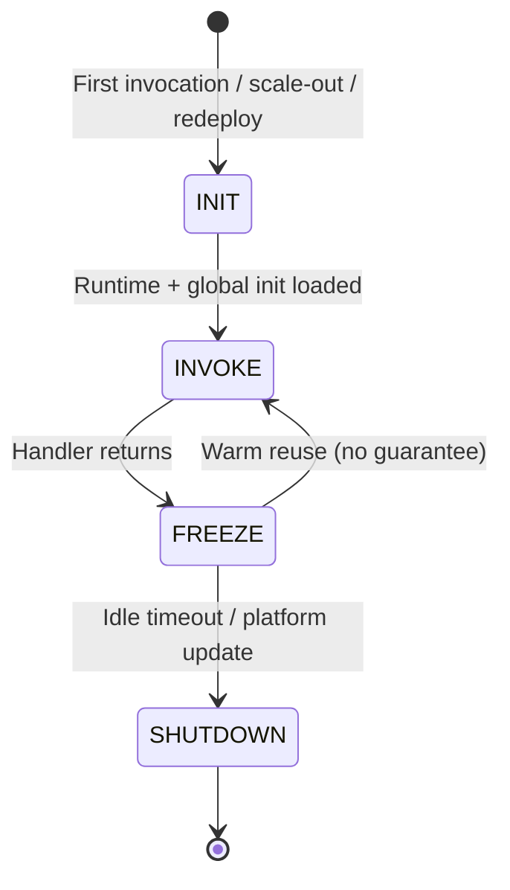
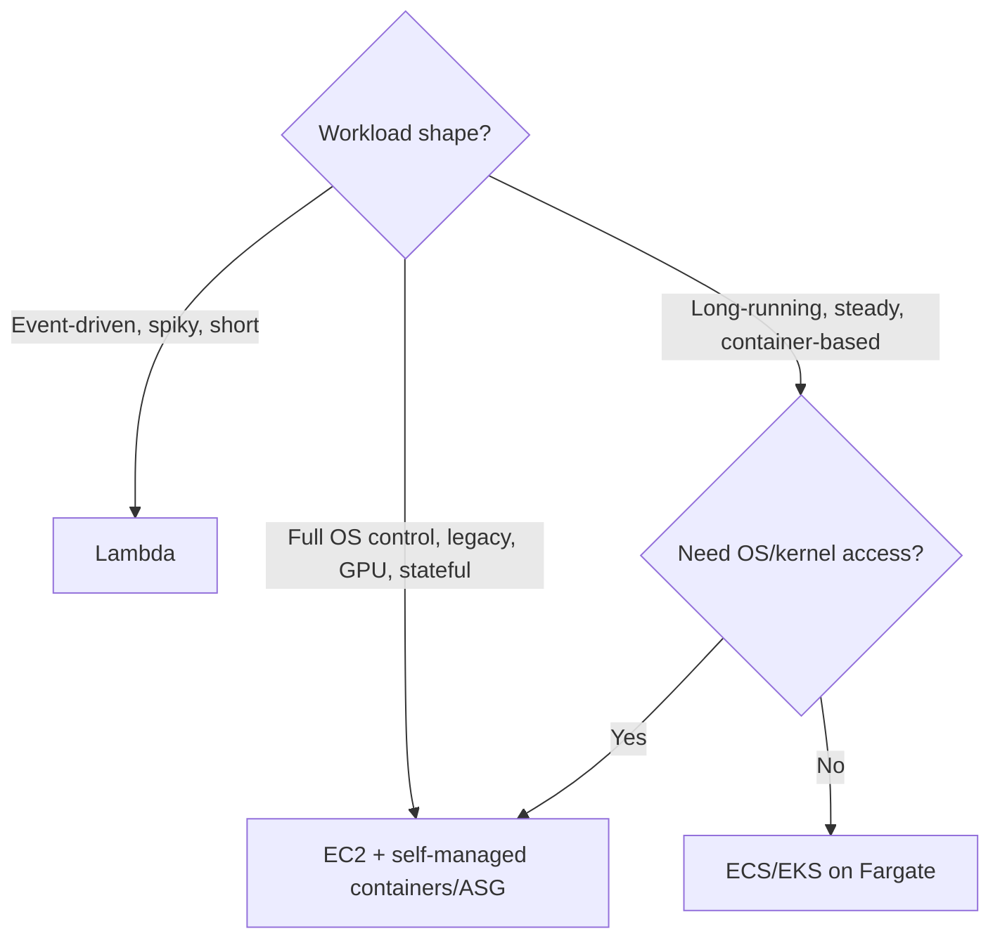
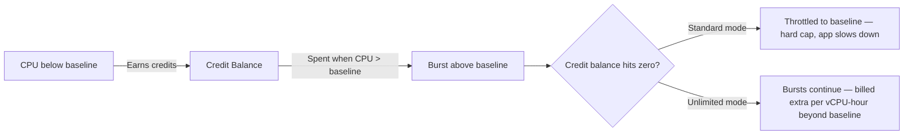
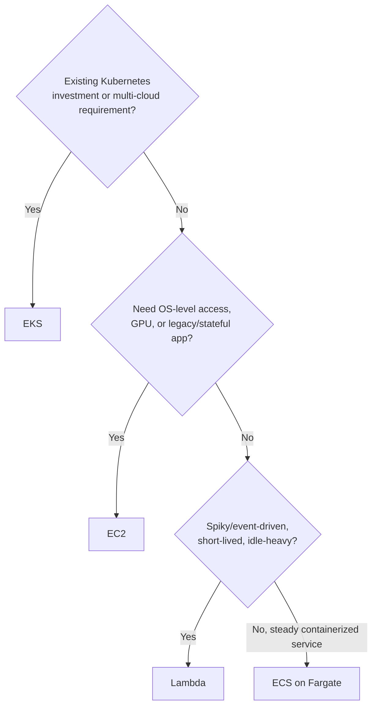
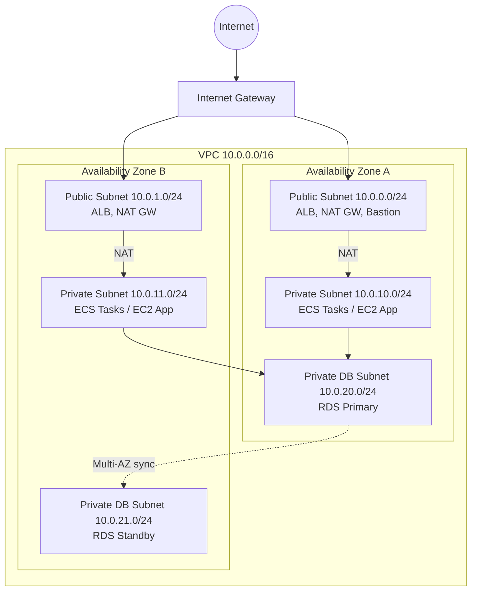
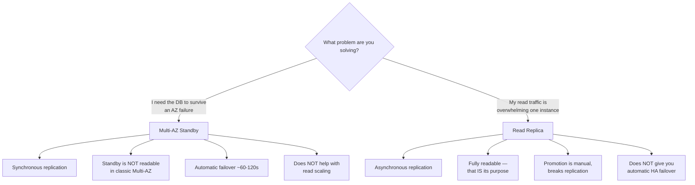
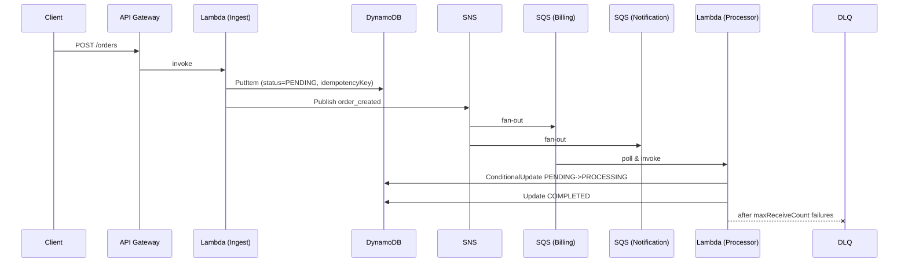

# AWS Interview Guide (Senior .NET Full-Stack / Lead Level)

> Consolidated from personal notes. Audience: 10-year .NET full-stack developer deploying workloads to AWS, prepping for senior/lead interviews. Fundamentals assumed; focus is on nuance, trade-offs, "why", gotchas, and interviewer follow-ups.
>
> Sections marked **[new content]** were added during consolidation to fill gaps versus current (2026) senior AWS interview expectations. Everything else is reorganized/de-duplicated from the original notes with technically correct content preserved.

## Table of Contents

1. [Compute](#compute)
   - [AWS Lambda Deep Dive](#lambda-deep-dive)
   - [Lambda Concurrency Model](#lambda-concurrency)
   - [Lambda vs ECS vs EC2 vs Fargate](#lambda-vs-ecs-vs-ec2)
   - [EC2 Fundamentals](#ec2-fundamentals)
   - [[gaps] EC2 Sizing, Pricing Decisions & CPU Credit Gotchas](#ec2-pricing-gaps)
   - [AWS Fargate](#fargate)
   - [EC2 vs Fargate Cost & Trap Scenarios](#ec2-vs-fargate-cost)
   - [[new content] ECS vs EKS vs Fargate vs Lambda for .NET Workloads](#dotnet-compute-decision)
   - [[gaps] Fargate/ECS/EKS Trade-offs — Reasoning Without Hands-On Time](#fargate-ecs-eks-gaps)
   - [[new content] Deploying .NET to AWS: Elastic Beanstalk vs ECS vs Lambda Custom Runtime](#dotnet-deployment-options)
2. [Storage](#storage)
   - [[new content] S3 Storage Classes & Lifecycle Policies](#s3-storage-classes)
   - [[gaps] S3 Lifecycle Rules in Practice — Real Patterns & Terraform](#s3-lifecycle-gaps)
   - [[new content] EBS vs EFS vs S3](#ebs-efs-s3)
3. [Networking](#networking)
   - [VPC, Subnets, NAT — Complete Model](#vpc-deep-dive)
   - [Route 53](#route53)
   - [ALB vs API Gateway vs ELB (NLB/GWLB/CLB)](#alb-vs-apigw-vs-elb)
   - [[new content] VPC Design Reference Architecture](#vpc-reference-architecture)
   - [[gaps] VPC/Subnet/NAT/SG Rapid-Fire Drill Sheet](#vpc-rapid-fire-gaps)
4. [Databases](#databases)
   - [DynamoDB Deep Dive](#dynamodb-deep-dive)
   - [DynamoDB Trick Questions](#dynamodb-trick-questions)
   - [[new content] RDS Multi-AZ vs Read Replicas vs Aurora](#rds-multi-az)
   - [[gaps] Multi-AZ vs Read Replica — The #1 Confused Pair](#rds-multi-az-gaps)
5. [Messaging & Event-Driven Architecture](#messaging)
   - [SQS & SNS Fundamentals](#sqs-sns-fundamentals)
   - [CQRS with SNS/SQS in .NET](#cqrs-sns-sqs-dotnet)
   - [CQRS + SNS/SQS Interview Pitfalls](#cqrs-pitfalls)
   - [[new content] EventBridge Deep Dive](#eventbridge-deep-dive)
   - [[new content] Event-Driven Architecture Reference Flow](#event-driven-reference-flow)
6. [IAM & Security](#iam-security)
   - [IAM Roles, Policies, AssumeRole](#iam-roles-policies)
   - [IAM Pitfalls](#iam-pitfalls)
   - [Cross-Account & Trust Policy Scenarios](#cross-account-scenarios)
   - [[new content] Secrets Manager vs Parameter Store](#secrets-vs-parameter-store)
   - [[new content] Least Privilege & Permission Boundaries in Practice](#least-privilege-practice)
7. [CI/CD](#cicd)
   - [AWS CodeBuild](#codebuild)
   - [AWS CodePipeline](#codepipeline)
   - [CodePipeline/CodeBuild Trap Scenarios](#cicd-trap-scenarios)
   - [[gaps] CloudFormation vs Terraform/CDKTF](#cfn-vs-terraform-gaps)
8. [Observability](#observability)
   - [CloudWatch Deep Dive](#cloudwatch-deep-dive)
   - [[new content] CloudWatch vs X-Ray: Complementary, Not Competing](#cloudwatch-vs-xray)
9. [Cost & Performance](#cost-performance)
   - [[new content] Cost Optimization: Savings Plans, Reserved, Spot](#cost-optimization)
10. [Well-Architected & Resilience](#well-architected)
    - [[new content] AWS Well-Architected Framework — 6 Pillars](#well-architected-pillars)
    - [[gaps] Well-Architected 6 Pillars — Rapid Recall Version](#well-architected-rapid-gaps)
    - [[new content] Disaster Recovery Strategies](#dr-strategies)
11. [Best Practices](#best-practices)
12. [Common Pitfalls (Cross-Cutting)](#common-pitfalls)
13. [Sample Interview Q&A](#sample-qa)
14. [Summary of Additions](#summary-of-additions)
    - [Summary of [gaps] Additions (This Pass)](#summary-of-gaps-additions)

---

## Compute

### AWS Lambda Deep Dive {#lambda-deep-dive}

**What it is:** Serverless compute — upload code, AWS runs it on trigger, you pay per invocation + duration. No server/patch/scale management.

**Key characteristics**
- Event-driven (API Gateway, S3, SNS, DynamoDB Streams, SQS, EventBridge, etc.)
- Fully managed, auto-scales per concurrent request
- Billed per invocation count + duration(ms) × memory
- Runtimes: Node.js, Python, .NET 6/8 (AOT + arm64), Java, Go, custom runtime via Lambda Runtime API (Rust etc.)

**Real-world use cases**
| Category | Example |
|---|---|
| API backend | API Gateway + Lambda for low/medium traffic APIs |
| Event processing | S3 upload → resize/scan; DynamoDB Streams → audit log; Kinesis/Kafka → real-time |
| Automation/cron | EventBridge schedule → cleanup Lambda |
| Orchestration glue | Step Functions + Lambda for multi-service workflows |
| Data transformation | Small/medium ETL, CSV→JSON |
| Edge | Lambda@Edge for CloudFront customization |

**Execution model — Firecracker micro-VM lifecycle**



1. **INIT (cold start):** new micro-VM, runtime bootstrap, static initializers, DI container build, DB connection setup — all in your "outside the handler" code.
2. **INVOKE:** handler runs with event + context; must finish inside configured timeout (max 15 min).
3. **FREEZE (warm reuse):** environment frozen after response; globals, connections, `/tmp` persist — this is why warm invocations are 1–10ms.
4. **SHUTDOWN:** AWS reclaims idle/outdated environments. No shutdown hook — state is lost, not rolled back.

**Cold start vs warm start**
- Cold: Java/.NET (JIT) → 300–1500ms; Node/Python → 50–200ms; **.NET Native AOT** → 50–100ms (huge win over JIT-based .NET).
- Warm: 1–10ms — reused environment, init code already executed.
- Mitigations: .NET AOT, small deployment package, avoid heavy DI container graphs, avoid VPC unless required, use Provisioned Concurrency for latency-sensitive APIs.

**Triggers**
| Type | Examples | Failure semantics |
|---|---|---|
| Synchronous | API Gateway, ALB, Step Functions, direct Invoke | Caller sees the error; caller must retry |
| Asynchronous | S3, SNS, CloudWatch Events, SES, EventBridge | Lambda retries automatically; DLQ on exhaustion |
| Poll-based (event source mapping) | DynamoDB Streams, Kinesis, MSK, SQS | Lambda polls internally; retries until success or maxReceiveCount/DLQ |

**Pros**
- Zero server management, auto-scale, pay-per-use, multi-AZ by default, deep AWS integration, trivial deployment (zip/image).

**Cons / when NOT to use**
- Cold start latency unsuitable for <50ms SLA APIs at the tail
- 15-minute hard timeout — no long-running jobs
- Vendor lock-in to AWS event model
- Max 10GB memory, 10GB ephemeral `/tmp` — not for ML training/huge batch
- Harder observability across distributed functions (need X-Ray + structured logging)

**Cost model:** invocations + GB-seconds (duration × memory) + optional Provisioned Concurrency hourly charge + data transfer if outside AWS network.

**[new content] .NET-specific Lambda considerations**
- Prefer **.NET 8 Native AOT** for latency-sensitive Lambdas — eliminates JIT warm-up, smaller deployment package, but: no runtime reflection-based DI magic (source-generated JSON serialization required via `System.Text.Json` source generators), some third-party libraries using reflection may break under trimming.
- `Amazon.Lambda.AspNetCoreServer` lets you host a full minimal API/ASP.NET Core app behind API Gateway/ALB with almost no code changes — useful for lift-and-shift of existing Web APIs, at the cost of a heavier cold start than a pure function handler.
- Avoid building a full `IServiceCollection`/`IServiceProvider` graph per cold start if you don't need it — construct dependencies manually or cache the `IServiceProvider` as a static field so it survives across warm invocations.
- EF Core inside Lambda: create the `DbContext`/connection pool **outside** the handler (static/singleton) to reuse across warm invocations; be careful with RDS Proxy or connection pool exhaustion at high concurrency (each concurrent execution environment = its own connection footprint).

**Interview-ready lifecycle answer:** "Each Lambda invocation runs in a Firecracker micro-VM. On cold start AWS provisions the VM, loads the runtime and executes global/static initializers before the handler runs. After the handler returns, AWS may freeze and reuse that environment for a subsequent invocation (warm start) — this reuse is an optimization, not a guarantee. Idle or replaced environments are torn down with no shutdown hook, so any unflushed state is lost."

---

### Lambda Concurrency Model {#lambda-concurrency}

**Reserved vs Provisioned Concurrency**

| | Reserved Concurrency | Provisioned Concurrency |
|---|---|---|
| Purpose | Guarantee + cap capacity for one function | Eliminate cold starts |
| Mechanism | Carves out part of account/region concurrency pool | Pre-initializes N warm environments |
| Cost | None extra | Billed hourly regardless of invocation |
| Effect above limit | Throttled | Falls back to normal (cold) scaling |

One-liner: **Reserved = guarantee capacity. Provisioned = eliminate cold starts.**

**Burst scaling rules**
- Default regional concurrency limit: 1,000 concurrent executions (increasable).
- Burst behavior: first ~1,000 concurrent executions scale instantly; beyond that, +500 new environments/minute until the account/region limit is hit.
- Concurrency limit = **how far** you can scale; burst rate = **how fast**.

**Multi-region concurrency**
- Each region has an independent concurrency pool and independent burst behavior.
- Active-active: split traffic and provision reserved/provisioned concurrency separately per region.
- Active-passive (DR): pre-raise the concurrency limit in the DR region *before* failover — a cold DR region with default limits will throttle under failover load.

**Sizing formula**

```
Required Concurrency ≈ Peak RPS × Avg Duration (seconds) × Safety Factor (1.3–2.0)
```

Example: 500 msgs/sec × 1.2s duration ≈ 600 concurrency (before safety factor).

- Latency-critical APIs: Reserved ≈ required concurrency; Provisioned ≈ p95 load.
- SQS-driven async Lambdas: you can *cap* concurrency below theoretical peak — SQS absorbs the backlog as back-pressure, protecting downstream DBs.

**Interview traps and correct answers (condensed)**
| Trap question | Correct senior answer |
|---|---|
| Why did Lambda run faster the 2nd time? | Warm start — execution environment reused; not caching of "logic". |
| Why did it time out despite fast code? | Timeout is wall-clock, includes network waits (DB, downstream API), not CPU-only. |
| Why did SQS message get reprocessed? | Message is deleted only after successful execution; failures make it visible again after the visibility timeout. |
| Lambda crashed after a DB write — rollback? | No transaction awareness. Partial writes persist; idempotency required. |
| Can Lambda guarantee exactly-once? | No — at-least-once only. Idempotency is mandatory, not optional. |
| Why is Lambda slower in a VPC? | ENI attachment adds cold-start latency (mitigated significantly since the 2019 Hyperplane ENI improvements, but still non-zero, especially for infrequently-invoked functions). |
| Should Lambda hold business logic? | No — "fat Lambda" anti-pattern; orchestrate/validate/delegate to testable services/libraries. |
| Can Lambda run forever? | No — 15-minute hard cap; use Step Functions/ECS/Batch for longer work. |

**ENI vs VPC Endpoint (mental model)**
- **ENI**: network interface Lambda attaches when placed inside a VPC — required to reach private resources (RDS, internal ALB). Adds cold-start overhead.
- **VPC Endpoint** (Gateway for S3/DynamoDB, Interface/PrivateLink for most others): lets a VPC-bound Lambda reach AWS services *without* NAT/internet — lower latency, lower cost, no public exposure.
- Rule: use ENI only when you must reach private VPC resources; use VPC Endpoints to avoid NAT costs/latency once you're in a VPC anyway.

---

### Lambda vs ECS vs EC2 vs Fargate {#lambda-vs-ecs-vs-ec2}



| Dimension | Lambda | ECS/EKS (Fargate) | EC2 |
|---|---|---|---|
| Server mgmt | None | None (Fargate) | You |
| Max run time | 15 min | Unbounded | Unbounded |
| Cold start | Yes (ms–s) | Minimal (containers stay up) | N/A once running |
| Scaling | Automatic, per-request | Service auto-scaling policies | ASG, manual or policy-based |
| Pricing | Per invocation + duration | Per vCPU/GB-hour while running | Per instance-hour regardless of load |
| Best for | Spiky/event-driven, glue code | Predictable microservices, long tasks | Legacy, stateful, custom kernel/GPU |
| Control over runtime | Minimal | Container-level | Full |

**Key senior talking points**
- Lambda "optimizes for speed, scale, minimal ops"; ECS/EC2 "optimize for control, predictability, long-running work." The right choice is workload-shape-driven, not preference-driven.
- Both Lambda and ECS/Fargate can be triggered by/consume from SQS.
- Lambda scales in seconds; ECS/Fargate task scaling takes longer (container pull, boot); EC2 ASG scaling is the slowest (OS boot, storage attach, service start).
- Cost inversion: Lambda cheaper at low/spiky traffic; ECS/EC2 cheaper at steady high traffic due to per-request/duration billing vs flat capacity billing.
- IAM model differs: Lambda uses an *execution role*; ECS tasks use a *task role* (and a separate *task execution role* for pulling images/writing logs) — a common interview trap is conflating the two ECS roles.

---

### EC2 Fundamentals {#ec2-fundamentals}

**Core concepts**
- **Instance** — running VM. **AMI** — template (OS + software) used to launch it.
- **Instance families**: `t` (burstable, e.g. t3/t4g), `m` (balanced), `c` (compute-optimized), `r` (memory-optimized), plus GPU (`g`/`p`) and storage-optimized (`i`/`d`) families.
- **Storage**: EBS (persistent, network-attached) vs Instance Store (ephemeral, physically attached, lost on stop/terminate).
- **Networking**: ENI, Security Groups (stateful), subnets.

**Lifecycle:** Launch → Running → Stop/Start → Terminate.
- **Stop**: EBS-backed data persists; instance ID kept; you stop paying compute (but still pay for EBS).
- **Terminate**: instance and (by default) root EBS volume destroyed.

**Pricing models**
| Model | Commitment | Relative cost | Risk |
|---|---|---|---|
| On-Demand | None | Highest | None |
| Reserved Instances | 1–3 yrs | Lower | Locked in |
| Savings Plans | 1–3 yrs $/hr commitment | Lower, more flexible than RI | Locked in $ amount |
| Spot | None | Cheapest | Can be reclaimed with 2-min warning |

**When to choose EC2:** full OS control, custom kernel modules, legacy apps, stateful workloads, GPU/specialized hardware, long-running services with steady utilization.

**Limitations:** you own patching/scaling; idle instances still cost money; more moving parts operationally than serverless/Fargate.

---

### [gaps] EC2 Sizing, Pricing Decisions & CPU Credit Gotchas {#ec2-pricing-gaps}

The existing EC2 section covers the pricing model *names* but not how a senior engineer actually reasons about **sizing** a box or **choosing** between the purchase options for a real workload — and it's missing the T-family CPU credit gotcha, which is one of the most commonly asked "explain a production incident" EC2 questions.

**How to actually pick an instance size (not just a family)**

Sizing is a vCPU-to-memory *ratio* decision, not a "pick the biggest one that fits the budget" decision:
- Start from the **workload shape**: CPU-bound (video encoding, compilation, hashing) → `c`-family (2 GiB RAM per vCPU); memory-bound (in-memory caches, large JVM/.NET heaps, big EF Core result sets) → `r`-family (8 GiB per vCPU); general-purpose web/API tier with no strong lean either way → `m`-family (4 GiB per vCPU); dev/test, low/bursty CPU with idle troughs → `t`-family (also ~4 GiB per vCPU, but *burstable*, see below).
- Benchmark before committing: use CloudWatch `CPUUtilization`, memory (via CloudWatch Agent — memory isn't a default EC2 metric), and network metrics under real/representative load, then size to a target steady-state utilization of roughly 40–60% average — leaving headroom for spikes without being so oversized that you're paying for idle capacity.
- AWS Compute Optimizer will do this analysis for you from actual usage history and recommend a right-sized family/size — worth name-dropping as the "don't guess, measure" answer.
- Vertical (bigger instance) vs horizontal (more instances behind an ALB/ASG) scaling trade-off: horizontal scaling is almost always preferred for stateless web/API tiers (better fault tolerance, finer-grained cost control, supports rolling deploys); vertical scaling is sometimes unavoidable for workloads that can't be distributed (a single large in-memory cache node, some legacy monoliths).

**The T-family CPU credit gotcha (a favorite interview trap)**

Burstable (`t3`, `t4g`, `t2`) instances are cheap because they're provisioned with a *baseline* CPU performance (e.g., 20–40% of a full core, family/size-dependent) and earn **CPU credits** while running below that baseline. Credits are spent to burst above baseline when needed.



- **Standard mode**: once the credit balance is exhausted, CPU is hard-throttled back down to the baseline percentage — this is the classic "app was fine for hours, then suddenly became sluggish/unresponsive for no obvious reason" production incident. The root cause is almost always a sustained load period (batch job, traffic spike, backup/reindex) that outlasted the accumulated credit balance.
- **Unlimited mode**: bursts are allowed to continue indefinitely, but AWS bills you extra (per vCPU-hour) for sustained usage beyond baseline — protects availability but can produce a cost surprise if a T-instance is quietly running hot 24/7 (a sign you've outgrown the T-family and should move to `m`/`c`).
- **Diagnosis in an interview scenario:** "Our T3 instance got slow under sustained load, but CPUUtilization graphs don't look pegged at 100%" → check the `CPUCreditBalance` and `CPUSurplusCreditBalance` CloudWatch metrics, not just `CPUUtilization` — a throttled T-instance can show CPU capped well below 100% because it's being held at baseline, which looks deceptively "healthy" unless you know to look at credits specifically.
- **Rule of thumb:** T-family is right for workloads with genuine idle troughs (dev/test, low-traffic APIs, bursty-but-brief admin jobs); it is the *wrong* choice for anything with a sustained high-CPU period (nightly batch processing, backup windows, steady-state compute-heavy services) — those belong on `m`/`c`/`r` family instances with no credit mechanism to run out of.

**On-Demand vs Reserved vs Spot vs Savings Plans — how you actually decide (not just what they are)**

The Cost Optimization section later in this guide already tables out the discount percentages; the senior-level skill being tested here is the **decision process**, not the definitions:

| Question to ask yourself | Points toward |
|---|---|
| Is this workload's capacity need predictable 12+ months out? | Savings Plan / Reserved Instance |
| Could this workload be interrupted with ~2 minutes' notice without breaking correctness? | Spot |
| Is this a brand-new workload with unknown steady-state yet? | On-Demand first, commit later once usage data exists |
| Does the workload span multiple compute types (EC2 + Fargate + Lambda)? | Compute Savings Plan (flexible across compute types) over EC2 Instance Savings Plan/RI |
| Is this dev/test that's only running business hours? | On-Demand + scheduled stop/start (Instance Scheduler) — commitment-based discounts don't help if the instance isn't running most of the time anyway |
| Is the workload stateful with no cheap way to checkpoint/resume? | Avoid Spot — the 2-minute reclaim notice isn't enough to gracefully drain long-lived state |

**Interview-ready answer:** "I wouldn't jump straight to 'buy Savings Plans' — I'd first confirm the workload is stable and predictable enough to commit to, check whether it can tolerate interruption (Spot candidate), and only then choose between a Compute Savings Plan (flexible, spans EC2/Fargate/Lambda) versus an EC2/Instance Savings Plan (deeper discount, less flexible) based on how confident I am in the instance family staying fixed."

**When is EC2 the right compute choice vs Lambda/Fargate — the decision an interviewer actually wants**

This guide already has a Lambda-vs-ECS-vs-EC2-vs-Fargate comparison table and a dedicated .NET compute-decision section — the angle worth adding here is how to *justify* EC2 specifically when you're the one who provisioned it via Terraform/CDKTF rather than picking a serverless default:

- **Full OS/kernel access is a hard requirement** — custom kernel modules, specific driver versions, GPU workloads, or software that assumes it owns the host (some legacy .NET Framework/COM-interop scenarios) — Fargate and Lambda both abstract the OS away, which is a feature until it's a blocker.
- **Steady, high, predictable utilization** — if a service runs at 70–90% CPU 24/7, EC2 (especially with a Savings Plan) is usually the cheapest option; Fargate's per-task premium and Lambda's per-invocation billing both lose that comparison once utilization is consistently high.
- **You already have the IaC investment** — "I'm provisioning EC2 via Terraform/CDKTF already, so the operational tooling (state, modules, CI plan/apply pipeline) is a sunk cost that makes EC2 marginally cheaper to *operate*, not just to run" is a legitimate, honest talking point — but it should never be the *primary* justification. An interviewer will push back on "because that's what I already know" as the main reason, and rightly so — lead with the workload-shape argument (steady utilization, OS-level requirement) and mention existing Terraform tooling as a secondary, practical factor.
- **Long-running processes with in-memory state that can't be trivially externalized** — e.g., a stateful cache or a process holding a large warmed-up in-memory model — favors EC2 over Lambda's stateless-between-invocations model, though ECS/Fargate with EFS or a sticky task can sometimes also satisfy this.
- **Counter-signal to watch for:** if you find yourself justifying EC2 purely on "it's simpler to reason about" or "I don't want to learn containers," that's a comfort-driven answer, not a workload-driven one — senior interviewers are specifically listening for whether you separate "what I know" from "what the workload needs."

---

### AWS Fargate {#fargate}

**Definition:** Serverless compute engine for containers — you supply a Docker image + CPU/memory; AWS handles the underlying servers, scaling, OS, and patching. Fargate is not an orchestrator itself — it's a launch type for **ECS** or **EKS**.

**Core concepts**
- **Task** — one running container (or co-located group). **Task Definition** — blueprint (image, CPU/memory, env vars, IAM role). **Service** — keeps N tasks running/healthy.
- Networking: `awsvpc` mode only — every task gets its own ENI (strong isolation, but IP exhaustion is a real capacity constraint in small subnets).
- No SSH/host access; task-level IAM role instead of instance role.

**Pricing:** pay for vCPU-seconds + GB-seconds only while the task runs — zero idle cost.

**EC2 vs Fargate**
| Aspect | EC2 | Fargate |
|---|---|---|
| Server management | You | AWS |
| OS/SSH access | Yes | No |
| Scaling | ASG (minutes) | Automatic (faster) |
| Pricing | Instance-hour, idle cost | Per task, no idle cost |
| Security isolation | Shared host possible | Strong (dedicated ENI/kernel per task) |
| Best for | Steady/high utilization, legacy, GPU | Bursty/microservices, ops simplicity priority |

**Cost trap (interview favorite):** "Fargate is always cheaper" is **false**. Fargate wins for bursty/low-utilization workloads; EC2 wins for steady, high-utilization workloads because you're not paying the Fargate per-task premium on idle-free capacity you'd have used anyway. Numeric rule of thumb from the notes: a 24×7 1 vCPU/2GB service costs roughly $17–20/mo on EC2 (t3.small) vs $35–40/mo on Fargate; a job running 2 hrs/day at the same size flips to ~$20/mo (EC2, mostly idle) vs ~$6–8/mo (Fargate).

**Common false interview claims:** "Fargate is always cheaper", "Fargate replaces EC2", "You can SSH into Fargate", "Fargate has no networking limits" — all false.

---

### EC2 vs Fargate Cost & Trap Scenarios {#ec2-vs-fargate-cost}

**Sample EC2 trap Q&A**
- *CPU is low but app is slow* → bottleneck likely disk I/O, network latency, or a single-threaded hot path — CPU% alone is misleading.
- *Public IP changed after restart* → public IPs aren't static unless you attach an Elastic IP.
- *ASG didn't scale during a spike* → check scaling policy metric choice and cooldown period length.
- *Instance unreachable despite "running"* → check security group, NACL, route table, and whether it even has a public IP.
- *Spot instance terminated suddenly* → expected behavior; AWS can reclaim spot capacity anytime (2-minute warning via EventBridge).

**Sample Fargate trap Q&A**
- *Task stopped unexpectedly* → app crashed, failed health check, or hit its memory limit (OOM-killed).
- *"Healthy" task but service marks it unhealthy* → container health check failing despite the process being alive (e.g., wrong health check path/port).
- *Fargate task can't reach internet* → it's in a private subnet with no NAT Gateway/VPC endpoint.
- *Works in dev, fails in prod* → almost always IAM role, secrets, or networking (subnet/SG) differences between environments.

**Final mental model:** Steady load → EC2. Bursty load → Fargate. Need control → EC2. Need simplicity → Fargate. Idle-cost sensitive → Fargate. High, constant utilization → EC2.

---

### [new content] ECS vs EKS vs Fargate vs Lambda for .NET Workloads {#dotnet-compute-decision}

The original notes cover Lambda-vs-ECS and EC2-vs-Fargate individually but never directly answer the very common senior .NET-on-AWS question: *"You're moving a .NET microservices platform to AWS — how do you choose the compute layer?"*

| Criterion | Lambda | ECS (Fargate) | EKS (Fargate or managed nodes) | EC2 (self-managed) |
|---|---|---|---|---|
| .NET fit | Great for event handlers, APIs with ASP.NET Core minimal hosting via `Amazon.Lambda.AspNetCoreServer`, but cold starts hurt latency-sensitive sync APIs unless AOT + Provisioned Concurrency | Great — standard container deployment, no code changes, full ASP.NET Core hosting model | Same as ECS but adds Kubernetes complexity — only worth it if you already run K8s elsewhere (multi-cloud, existing manifests, team expertise) | Full control, good for Windows containers/.NET Framework (legacy) workloads needing IIS |
| Operational overhead | Lowest | Low (no cluster to manage) | Highest (control plane concepts, CRDs, Helm, networking) | Highest (patching, scaling, OS) |
| Team skill fit | Any .NET team | Any .NET/DevOps team | Needs existing K8s expertise | Needs sysadmin/infra expertise |
| Cost at steady state | Poor (per-invocation billing adds up) | Good | Good | Best (if fully utilized) |
| .NET Framework (not Core) support | No (Lambda requires .NET Core/5+) | Yes, via Windows containers on EC2 launch type (not Fargate) | Yes, Windows node groups | Yes |
| Startup-latency-sensitive sync API | Risky without Provisioned Concurrency + AOT | Best default choice | Best default choice | Best default choice |
| Best use case | Webhooks, S3/SQS/DynamoDB Stream processors, cron, glue | Line-of-business APIs, internal microservices | Only if already multi-cloud/K8s-standardized | Legacy .NET Framework/IIS lift-and-shift |

**Senior-level recommendation pattern:** default new .NET microservices to **ECS on Fargate** (best balance of operational simplicity and control for a typical .NET shop). Use **Lambda** for event-driven glue and spiky/idle-heavy workloads. Reach for **EKS** only when there's an existing organizational Kubernetes investment — introducing K8s purely for a .NET-on-AWS migration is usually over-engineering. Use **EC2** (with Windows containers or full Windows Server) only for .NET Framework workloads that can't be ported to .NET Core/8+, or for workloads needing GPU/specialized hardware.

**Interviewer follow-up to expect:** "Your team knows only .NET/C#, no Kubernetes — would you still pick EKS for a green-field microservices platform?" Correct senior answer: no — pick ECS/Fargate unless there's a concrete multi-cloud or portability requirement that justifies the K8s learning curve and operational tax.

---

### [gaps] Fargate/ECS/EKS Trade-offs — Reasoning Without Hands-On Time {#fargate-ecs-eks-gaps}

Honesty framing up front, since this is worth stating explicitly in an interview: my hands-on AWS provisioning experience (via Terraform/CDKTF) is Lambda, DynamoDB, EC2, and S3 — I haven't personally run Fargate, ECS, or EKS in production. What follows is how I'd reason through the trade-offs if asked to make this decision, not a claim of direct operational experience with the container orchestrators themselves.

**Expanded comparison — operational overhead, cost model, cold start, and use-case fit**

| Dimension | EC2 (self-managed) | ECS on Fargate | EKS (managed control plane) | Lambda |
|---|---|---|---|---|
| Who patches the OS/kernel | You | AWS | AWS (nodes) or you (self-managed node groups) | AWS (fully abstracted) |
| Who manages the orchestrator/control plane | N/A (no orchestrator) or you (self-hosted) | AWS (ECS control plane is free, always managed) | AWS manages the control plane (charged hourly per cluster), but you still manage node groups unless using Fargate profiles | N/A |
| Cost model | Instance-hour, regardless of load | Per-task vCPU/GB-second, while running | Cluster fee + node/Fargate task cost | Per-invocation + duration |
| Cold start behavior | None once running; ASG scale-out takes minutes (boot OS, attach storage, register) | Task startup is seconds (pull image, start container) — no "cold start" in the Lambda sense, but not instant either | Similar to Fargate for Fargate-backed pods; for managed EC2 node groups, bounded by node/ASG scale-out time like raw EC2 | True cold start on first/scaled-out invocation (ms–low seconds), mitigated by Provisioned Concurrency |
| Operational overhead | Highest — patching, scaling policy tuning, capacity planning | Low — no servers, no cluster; you manage task definitions/services | Highest of the container options — cluster upgrades, CRDs, networking plugins (CNI), Helm charts, IAM-to-Kubernetes-RBAC mapping (IRSA) | Lowest — no infrastructure concept at all |
| Best use-case fit | Steady, high utilization; OS-level requirements; legacy/stateful; GPU | Standard containerized microservices with no existing K8s investment | Organizations already standardized on Kubernetes (often multi-cloud, or migrating from on-prem K8s) | Event-driven, spiky, short-lived work |
| Multi-cloud portability | Low (AWS-specific tooling even if OS is portable) | Low (ECS is AWS-proprietary) | High (Kubernetes API is portable across clouds/on-prem) | Lowest (heavily AWS-event-model-coupled) |

**How I'd frame the trade-off conversation if asked "why not EKS for everything, since Kubernetes is the industry standard":**

Kubernetes' biggest selling point — portability and a rich ecosystem (Helm, operators, service mesh) — is also its biggest cost: a real control-plane learning curve (CRDs, RBAC, networking/CNI, admission controllers) that a pure ECS or Fargate user never has to pay. For a .NET shop without existing Kubernetes investment, that operational tax usually isn't justified unless there's a concrete multi-cloud requirement or the org already has platform engineers who live in Kubernetes daily. I'd frame my recommendation the same way AWS itself frames the ECS-vs-EKS choice: ECS if you want AWS-native simplicity and don't need portability; EKS if you need Kubernetes-API compatibility for tooling, multi-cloud strategy, or existing team expertise.

**A decision flow I'd talk through out loud in an interview:**



**What I'd want to learn hands-on before claiming deep Fargate/ECS/EKS expertise:** task definition/service tuning under real load (deployment circuit breakers, min/max healthy percent during rolling deploys), service discovery (Cloud Map/App Mesh), and — for EKS specifically — IRSA (IAM Roles for Service Accounts) mapping and cluster upgrade mechanics. Naming this gap directly, rather than overstating familiarity, is itself the senior-level move here.

---

### [new content] Deploying .NET to AWS: Elastic Beanstalk vs ECS vs Lambda Custom Runtime {#dotnet-deployment-options}

The original notes never directly discuss Elastic Beanstalk, despite it being a common AWS Certified/senior-interview topic and a legitimate, low-effort .NET deployment path.

| Option | What it is | Pros | Cons | When to use |
|---|---|---|---|---|
| **Elastic Beanstalk** | PaaS wrapper around EC2/ASG/ELB/RDS with a managed platform (incl. .NET on Windows/Linux) | Fastest path from `dotnet publish` to a running, load-balanced, auto-scaled app; AWS manages the underlying EC2/ASG/ELB stack; supports blue/green via environment swap | Less control than raw ECS; platform upgrades can be disruptive; "PaaS lock-in" feel; scaling granularity coarser than ECS | Small-to-mid teams wanting managed infra without container/K8s investment; quick MVPs; teams new to AWS |
| **ECS (Fargate or EC2 launch type)** | Container orchestration, AWS-native | Full control over container spec, fine-grained scaling, no idle cost (Fargate), integrates cleanly with CodePipeline/CodeBuild | Requires Docker packaging discipline, task definition management | Default choice for most modern .NET microservices |
| **Lambda (ASP.NET Core minimal API hosting or custom runtime)** | Serverless — package as zip or container image | No infra at all, scales to zero, cheap for spiky traffic | Cold starts, 15-min limit, harder local debugging parity, connection pooling nuances (RDS Proxy often needed) | Event-driven APIs, low/spiky traffic, backend-for-frontend functions |

**Nuance interviewers probe for:** Elastic Beanstalk is *not* a separate compute primitive — under the hood it still provisions EC2 + ASG + ELB (or ECS, for the Docker platform). The value-add is the deployment/orchestration tooling (`eb deploy`, environment configs, rolling/immutable/blue-green deployment policies), not a new runtime. Knowing this distinction (Beanstalk = orchestration layer, not new infrastructure) is what separates a mid-level from a senior answer.

**Deployment strategy comparison (all three support some form of zero/low-downtime deploy):**
- Elastic Beanstalk: rolling, rolling-with-additional-batch, immutable, or blue/green (swap CNAME between environments).
- ECS: rolling update via service deployment configuration, or blue/green via CodeDeploy + two target groups.
- Lambda: versions + aliases, with linear/canary traffic shifting via CodeDeploy.

---

## Storage

> The original notes did not cover S3/EBS/EFS in depth — this entire section is new, added to close a material gap for a senior AWS interview (S3 storage classes and lifecycle policies are near-universal interview topics).

### [new content] S3 Storage Classes & Lifecycle Policies {#s3-storage-classes}

| Storage Class | Use Case | Availability | Min Storage Duration | Retrieval |
|---|---|---|---|---|
| S3 Standard | Frequently accessed, general purpose | 99.99% | None | Immediate |
| S3 Intelligent-Tiering | Unknown/changing access patterns | 99.9% | None | Immediate (auto-moves between tiers) |
| S3 Standard-IA | Infrequent access, needs millisecond retrieval | 99.9% | 30 days | Immediate |
| S3 One Zone-IA | Infrequent, re-creatable data, single AZ | 99.5% | 30 days | Immediate |
| S3 Glacier Instant Retrieval | Archive needing millisecond access | 99.9% | 90 days | Immediate |
| S3 Glacier Flexible Retrieval | Archive, occasional access | 99.99% | 90 days | Minutes–hours |
| S3 Glacier Deep Archive | Long-term compliance archive | 99.99% | 180 days | ~12 hours |

**Lifecycle policy pattern (typical senior answer):**
```json
{
  "Rules": [
    {
      "ID": "MoveToIAThenGlacier",
      "Status": "Enabled",
      "Filter": { "Prefix": "logs/" },
      "Transitions": [
        { "Days": 30, "StorageClass": "STANDARD_IA" },
        { "Days": 90, "StorageClass": "GLACIER" }
      ],
      "Expiration": { "Days": 365 }
    }
  ]
}
```

**Gotchas an interviewer expects you to know**
- Standard-IA/One Zone-IA charge a *retrieval fee* — cheap storage, expensive if you read often; only use for genuinely infrequent access.
- Minimum storage duration charges apply even if you delete/transition early (e.g., deleting a Glacier object after 10 days still bills for 90 days).
- Intelligent-Tiering has a small monthly monitoring fee per object but removes the guesswork — good default for unpredictable access patterns.
- Versioning + lifecycle rules can interact unexpectedly: old versions also need their own transition/expiration rules, or you silently keep paying for every historical version.
- S3 is strongly consistent for all operations since Dec 2020 (no more "eventual consistency for overwrite PUTS" caveat — a common outdated interview answer to avoid).

### [gaps] S3 Lifecycle Rules in Practice — Real Patterns & Terraform {#s3-lifecycle-gaps}

The existing storage-class table above is the "what" — this section adds the "which rule, for which data, and why," since interviewers commonly ask for a concrete lifecycle policy rather than just the class definitions. It also adds a Terraform example, since that's the candidate's actual provisioning tool for AWS infrastructure.

**Common real-world lifecycle patterns, by data category**

| Data category | Typical rule | Why |
|---|---|---|
| Application/access logs | Standard → Standard-IA at 30 days → Glacier Flexible Retrieval at 90 days → Expire at 365 days | Logs are read frequently in the first month (debugging recent issues), rarely after that, and usually have a compliance/retention window rather than indefinite value |
| Database/system backups | Standard → Glacier Deep Archive at 1–7 days (often immediately) | Backups are "insurance" — you hope to never read them; Deep Archive's ~12-hour retrieval time is acceptable for a disaster-recovery restore, and it's the cheapest tier by far for long-term retention |
| Frequently changing / unpredictable access datasets | Intelligent-Tiering from day 1 | When you genuinely don't know the access pattern (shared data lake, multi-team bucket, user-uploaded content of unknown popularity), Intelligent-Tiering removes the guesswork at the cost of a small per-object monitoring fee — cheaper than guessing wrong and paying retrieval fees on Standard-IA |
| Compliance/audit records (e.g., financial, healthcare retention mandates) | Standard-IA or Glacier Flexible Retrieval → Glacier Deep Archive, with **no** expiration rule (or expiration tied to the legal retention period, often 7+ years) | Regulatory retention periods override normal cost-optimization instincts — get the retention period from legal/compliance, not from "what feels efficient" |
| Temporary/staging data (e.g., ETL intermediate files, upload scratch space) | Standard → Expire at 1–7 days, no transition at all | If data is genuinely disposable within days, transitioning it to a cheaper class isn't worth the complexity — just expire it; transitions have their own minimum-duration billing gotcha (see below) that can backfire on very short-lived data |

**The minimum-duration billing trap, restated concretely:** if you transition an object to Standard-IA (30-day minimum) or Glacier (90-day minimum) and then delete or transition it again before that minimum elapses, you're still billed as if it sat there the full minimum duration. This means aggressive, short-interval lifecycle rules on data that's actually deleted quickly can end up *costing more* than just leaving it on Standard and expiring it directly — always sanity-check the actual object lifetime against the target class's minimum duration before adding a transition rule.

**Terraform example — `aws_s3_bucket_lifecycle_configuration` (the resource the candidate would actually write):**

```hcl
resource "aws_s3_bucket" "logs" {
  bucket = "my-app-logs-prod"
}

resource "aws_s3_bucket_lifecycle_configuration" "logs_lifecycle" {
  bucket = aws_s3_bucket.logs.id

  rule {
    id     = "logs-tiering"
    status = "Enabled"

    filter {
      prefix = "logs/"
    }

    transition {
      days          = 30
      storage_class = "STANDARD_IA"
    }

    transition {
      days          = 90
      storage_class = "GLACIER"
    }

    expiration {
      days = 365
    }
  }

  rule {
    id     = "backups-to-deep-archive"
    status = "Enabled"

    filter {
      prefix = "backups/"
    }

    transition {
      days          = 1
      storage_class = "DEEP_ARCHIVE"
    }

    # No expiration — backups are retained indefinitely (or tie to a compliance-driven expiration instead)
  }

  rule {
    id     = "expire-noncurrent-versions"
    status = "Enabled"

    filter {}

    noncurrent_version_expiration {
      noncurrent_days = 90
    }
  }
}
```

Note the third rule — this directly addresses the versioning gotcha already flagged in the notes above: if versioning is enabled on the bucket, noncurrent (old) versions accumulate and need their own expiration rule, or every historical version silently keeps costing money forever. `noncurrent_version_expiration` is the Terraform-level fix for that specific trap.

**Interview-ready one-liner:** "I'd pick the lifecycle rule from the data's actual read pattern, not its age alone — logs decay in value fast so they tier down and expire; backups go straight to Deep Archive because I never expect to read them until disaster recovery; anything with an unpredictable access pattern goes to Intelligent-Tiering so I'm not guessing. And I always check a class's minimum storage duration against the object's real lifetime before adding a transition, since transitioning something that gets deleted almost immediately after can cost more than not transitioning it at all."

### [new content] EBS vs EFS vs S3 {#ebs-efs-s3}

| | EBS | EFS | S3 |
|---|---|---|---|
| Type | Block storage | Managed NFS (file) | Object storage |
| Attach model | One EC2 instance (or Multi-Attach for specific volume types) | Many instances/AZs concurrently | HTTP API, unlimited clients |
| Use case | DB data volumes, boot volumes | Shared config/content across a fleet, Lambda file storage extension | Static assets, backups, data lake, logs |
| Scaling | Manual resize | Elastic, auto-scales | Effectively unlimited |
| .NET relevance | RDS/self-managed SQL Server data files | Shared session state/uploads across ECS tasks | Blob storage equivalent to Azure Blob Storage |

---

## Networking

### VPC, Subnets, NAT — Complete Model {#vpc-deep-dive}

**What a VPC is:** a logically isolated virtual network — "your own private data center inside AWS." You control IP range, subnets, routing, internet access, and security boundary (Security Groups + NACLs).

**CIDR block:** defined at VPC creation (e.g., `10.0.0.0/16`); cannot be changed after creation (you can add secondary CIDR blocks, but the original design constraint stands — plan IP space carefully up front, especially for future VPC peering/Transit Gateway where overlapping CIDRs cause real pain).

**Subnets**
- A subnet is a slice of the VPC CIDR, tied to exactly one Availability Zone.
- **There is no such thing as an inherently "public" or "private" subnet** — that behavior comes entirely from the subnet's route table, not its name or any flag.

**Public vs private subnet — the real rule**
| | Public Subnet | Private Subnet |
|---|---|---|
| Route to Internet Gateway? | Yes | No |
| Inbound from internet? | Possible (if resource has public IP + SG allows) | No |
| Outbound to internet? | Yes, directly | Only via NAT Gateway/Instance |

**Internet Gateway (IGW):** one per VPC, must be attached to the VPC; the public subnet's route table must have a `0.0.0.0/0 → igw-xxxx` route.

**Route tables:** every subnet is associated with exactly one route table; a route table can be shared by multiple subnets. Typical routes: `0.0.0.0/0 → IGW` (public) or `0.0.0.0/0 → NAT Gateway` (private).

**NAT (Network Address Translation)**
- Purpose: let private-subnet resources reach the internet **outbound only** — inbound internet traffic is always blocked regardless of NAT.
- Flow: `Private Subnet → NAT Gateway (in a PUBLIC subnet) → Internet Gateway → Internet`.
- **NAT Gateway must live in a public subnet** — a NAT Gateway placed in a private subnet is simply invalid/non-functional.

| | NAT Gateway | NAT Instance |
|---|---|---|
| Management | Fully managed | Self-managed EC2 |
| HA | Built-in within AZ | You build it |
| Scaling | Automatic | Manual |
| Recommendation | **Default choice** | Legacy/very specific cost cases only |

**Cost gotcha:** NAT Gateway bills per-hour *plus* per-GB processed — high outbound traffic from private resources is a common surprise cost spike. For AWS-service-only traffic (S3, DynamoDB, Secrets Manager, SQS, etc.), use **VPC Endpoints** instead of routing through NAT — cheaper, lower latency, and keeps traffic off the public internet entirely.

**Security layers**
| | Security Group | Network ACL |
|---|---|---|
| Statefulness | Stateful (return traffic auto-allowed) | Stateless (must explicitly allow both directions) |
| Attached to | ENI/instance | Subnet |
| Rule type | Allow only | Allow AND deny |
| Typical usage | Primary defense — use heavily | Sparingly, for coarse subnet-level blocking |

**Placement rules of thumb**
- Public subnet: load balancers, bastion hosts, NAT Gateways.
- Private subnet: application servers, ECS tasks, RDS — **never put a database directly in a public subnet.**

**Common misconceptions (explicitly false)**
- "Public subnet = automatic internet access" — false; needs a public IP *and* a route to an IGW *and* permissive SG.
- "NAT allows inbound traffic" — false; NAT is outbound-only by design.
- "Subnet name/tag decides security behavior" — false; only route tables and SGs/NACLs matter.
- "One route table per VPC" — false; a VPC can (and usually does) have multiple route tables, one per subnet-group.

**High-availability note:** NAT Gateways are AZ-scoped. For proper HA, deploy one NAT Gateway per AZ so an AZ failure doesn't take down outbound internet access for every private subnet in the VPC (a single shared NAT Gateway across AZs works but creates a cross-AZ dependency and extra data-transfer cost).

### [new content] VPC Reference Architecture {#vpc-reference-architecture}



This is the canonical 3-tier VPC layout senior interviewers expect: public subnet per AZ (ALB + NAT), private app subnet per AZ (compute), private isolated data subnet per AZ (RDS with no route to NAT/IGW at all — DB subnets typically don't even need outbound internet).

### [gaps] VPC/Subnet/NAT/SG Rapid-Fire Drill Sheet {#vpc-rapid-fire-gaps}

The prose above already covers the VPC networking model in depth — this is a condensed, last-minute-review version of the same fundamentals, formatted as quick-recall drill Q&A rather than explanatory prose. Use this the morning of an interview; use the sections above to actually *understand* it first.

| Drill question | One-line answer |
|---|---|
| What makes a subnet "public"? | Its route table has a `0.0.0.0/0 → Internet Gateway` route — nothing else. |
| What makes a subnet "private"? | No direct route to an Internet Gateway; outbound internet (if any) goes through a NAT Gateway/Instance instead. |
| NAT Gateway vs Internet Gateway — one-line difference? | IGW = two-way internet access for public-subnet resources; NAT Gateway = outbound-only internet access for private-subnet resources. |
| Where must a NAT Gateway live? | In a **public** subnet — a NAT Gateway in a private subnet doesn't work. |
| Can NAT allow inbound traffic from the internet? | No — NAT is outbound-only by design, always. |
| Security Group vs NACL — statefulness? | SG is stateful (return traffic auto-allowed); NACL is stateless (must explicitly allow both directions). |
| Security Group vs NACL — attaches to what? | SG attaches to an ENI/instance; NACL attaches to a subnet. |
| Security Group vs NACL — can either explicitly Deny? | SG: allow-only. NACL: allow AND deny rules. |
| Which is the primary defense layer in practice? | Security Groups — use heavily; NACLs sparingly for coarse subnet-level blocking. |
| Where should a database subnet route to? | Nowhere on the internet — no route to IGW or NAT at all, ideally (isolated private/data subnet). |
| Does a route table belong to a VPC or a subnet? | Each subnet is associated with exactly one route table; a VPC typically has multiple route tables (not just one). |
| Is a NAT Gateway AZ-scoped or region-scoped? | AZ-scoped — deploy one per AZ for HA, or accept a cross-AZ dependency with a single shared one. |
| What's the #1 wrong assumption about "public subnet"? | That it grants automatic internet access — it still needs a resource with a public IP *and* a permissive Security Group on top of the IGW route. |

---

### Route 53 {#route53}

**What it is:** highly available, scalable DNS service that is also a traffic-control layer (health checks, routing policies, failover) — not just static DNS.

**Core concepts:** Domain Name, Hosted Zone (public = internet-resolvable, private = VPC-only), DNS Records (A/AAAA, CNAME, ALIAS, MX, TXT, NS, SOA).

**Why ALIAS > CNAME for AWS targets:** ALIAS records are free, resolve at the DNS layer without an extra lookup, and — critically — **work at the zone apex** (`example.com`, not just `www.example.com`), which a CNAME cannot do by DNS spec.

**Routing policies**
| Policy | Use case |
|---|---|
| Simple | Single endpoint, no failover |
| Weighted | Canary/A-B traffic shifting (e.g., 90/10 split) |
| Failover | Primary/secondary HA via health checks |
| Latency-based | Route to the AWS region with lowest measured latency |
| Geolocation | Legal/regional content restrictions |
| Multi-value answer | Simple client-side load distribution (not a real load balancer) |

**Health checks:** monitor HTTP/HTTPS/TCP endpoints, can integrate with CloudWatch alarms; health checks alone do **not** reroute traffic — you still need a Failover (or similar) routing policy attached.

**Route 53 vs Load Balancer** — they operate at different layers and are complementary, not competing:
- Route 53: DNS-level, global, region-aware, coarse-grained.
- ALB/NLB: request-level, regional, fine-grained (per-request routing, sticky sessions, real-time health-based removal).

**Critical trap-question theme:** DNS is **not** instant. TTL caching at resolvers/ISPs/clients means:
- Updating a record doesn't immediately redirect all clients.
- Failover routing is not instant — it's bounded by TTL plus client-side caching behavior.
- Route 53 should never be your *only* HA mechanism for sub-second failover requirements — combine with ALB/NLB-level health-based removal for fast reaction, and Route 53 for macro/region-level failover.

**Private Hosted Zones:** internal DNS resolvable only inside associated VPC(s) — e.g., `db.internal → RDS endpoint`. A private hosted zone must be explicitly associated with each VPC that needs to resolve it (a common trap: "works in one VPC, not another" = missing association).

### ALB vs API Gateway vs ELB (NLB/GWLB/CLB) {#alb-vs-apigw-vs-elb}

**ELB family**
| Type | Layer | Protocols | Best for |
|---|---|---|---|
| ALB (Application LB) | 7 | HTTP/HTTPS/WebSocket | Host/path routing, microservices, Lambda targets |
| NLB (Network LB) | 4 | TCP/UDP/TLS | Extreme throughput, static IP, low latency |
| GWLB (Gateway LB) | 3 | IP | Transparent traffic inspection (firewalls/IDS appliances) |
| CLB (Classic, deprecated) | 4/7 | Basic | Legacy only |

**ALB core concepts:** Listener (port/protocol) → Rules (host/path/header conditions) → Target Group (EC2, ECS, IP, **Lambda**) with health checks. Supports TLS termination with SNI (multiple certs on one listener), WebSocket, HTTP/2, and direct Lambda invocation as a target (Lambda returns an HTTP-shaped response, similar to API Gateway proxy integration).

**API Gateway core concepts:** REST API (feature-rich, more expensive — API keys, usage plans, request/response VTL mapping templates, caching) vs HTTP API (cheaper, lower latency, JWT/IAM auth, good default for Lambda-backed serverless) vs WebSocket API (connection-managed real-time).

**ALB vs API Gateway — the mental model that wins interviews**
> "ALB is a smart Layer-7 load balancer: I have services, route and balance traffic between them. API Gateway is a full API front door: I'm exposing an API to external clients and need auth, throttling, quotas, versioning, transformation, and monitoring built in."

| Aspect | ALB | API Gateway |
|---|---|---|
| Primary purpose | Load balancing between backend services | Publishing/managing APIs for consumers |
| Targets | EC2, ECS/EKS, IP, Lambda | Lambda, HTTP endpoints, AWS service integrations |
| Built-in throttling/quotas | No (app-level only) | Yes (usage plans, rate limits) |
| Request transformation | Limited (routing only) | Advanced (VTL mapping templates) |
| Caching | No | Yes (REST API only) |
| Pricing | Per-hour + LCU | Per-million-requests (+ cache if enabled) |
| Typical client | Internal/browser | Mobile/web/3rd-party API consumers |

**Decision examples**
- Public REST API for a mobile app needing auth/throttling/API keys, Lambda+DynamoDB backend → **API Gateway**.
- Internal microservices on ECS needing only path/host routing + TLS termination → **ALB**.
- Real-time chat: fully serverless → **API Gateway WebSocket API**; already on containers → **ALB WebSocket**.

---

## Databases

### DynamoDB Deep Dive {#dynamodb-deep-dive}

**What it is:** fully managed NoSQL key-value/document store with consistent single-digit-millisecond latency at effectively unlimited scale — *if* the key design is correct. Schema-less: each item can have different attributes, which suits fast-evolving microservices but shifts correctness burden onto the application.

**Partitioning**
- The **Partition Key (PK)** hash decides which physical partition stores an item. Each partition has bounded throughput (historically documented around 3,000 RCU / 1,000 WCU per partition — exact numbers are internal and AWS doesn't guarantee them contractually, treat as directional).
- A good PK has **high cardinality** and **even access distribution**. Bad PK choice (low cardinality, time-based, or one "celebrity" key getting disproportionate traffic) → **hot partition** → throttling even when table-level metrics look fine.
- **Adaptive Capacity** shifts unused capacity from cold partitions to hot ones automatically — it smooths real-world unevenness but does **not** fix a fundamentally bad key design.

**Sort Key (SK) — what it actually unlocks**
| Pattern | Example |
|---|---|
| Range queries | `PK=USER#123, SK BETWEEN ORDER#2025-01-01 AND ORDER#2025-01-31` |
| Time-series | `PK=DEVICE#A100, SK=<ISO timestamp>`, query `SK > now-1h` |
| One-to-many | `PK=USER#123, SK=ORDER#<date>` (multiple orders under one user) |
| Hierarchical/single-table | `PK=ORDER#555, SK=META# / ITEM#1 / EVENT#CREATED` — fetch whole aggregate in one Query |
| Sorted views | SK encodes priority/rank for deterministic ordering |

**GSI vs LSI**
| | GSI (Global Secondary Index) | LSI (Local Secondary Index) |
|---|---|---|
| Partition key | Different from base table | Same as base table |
| Sort key | Own, optional | Different from base table |
| Created | Any time | Only at table creation |
| Consistency | Eventual only | Can be strongly consistent |
| Capacity | Own throughput | Shares base table capacity |
| Cost consideration | Every base write may also write to GSI (write amplification) — project only needed attributes | Rarely used due to creation-time constraint |

**Capacity modes**
| | On-Demand | Provisioned (+ Auto Scaling) |
|---|---|---|
| Planning | None | RCU/WCU sizing required |
| Cost | Pay-per-request | Cheaper at steady, predictable volume; supports Reserved Capacity discount |
| Best for | Spiky/unknown traffic (serverless, SQS bursts) | Stable, forecastable load |

**Query vs Scan**
- **Query**: PK-targeted (optionally SK range/filter) — O(matched items), the operation you should always be optimizing for.
- **Scan**: reads the *entire* table/index, filters after the fact — expensive, slow, avoid in hot paths; acceptable only for rare admin/analytics jobs.

**Conditional writes — the underrated superpower**
- Idempotency: `PutItem` with `ConditionExpression: attribute_not_exists(idempotencyKey)`.
- Optimistic locking / state machine transitions: `UpdateItem ... ConditionExpression: status = :pending` before flipping to `PROCESSING` — server-side atomic check, no distributed lock needed.
- This gets you concurrency control **without** paying the 2× cost of full Transactions.

**Transactions (`TransactWriteItems`/`TransactGetItems`)**
- ACID across up to 25 items/tables in one call.
- Use only for genuine all-or-nothing business invariants (inventory decrement + order creation, money transfer) — costs ~2× capacity and added latency, so don't reach for it by default.

**TTL:** attribute-driven, best-effort async deletion — can lag by hours in practice (notes explicitly flag up to ~48 hours in some documented cases), not exact-to-the-second. Good for idempotency keys, sessions, dedup records, temporary workflow state. **Do not** rely on TTL for time-sensitive compliance deletion deadlines.

**Streams:** time-ordered change log (insert/update/delete), retained ~24 hours. The backbone pattern for:
- CQRS read-model projections (normalized write table → Streams → Lambda → denormalized read table/GSI)
- Event-driven pipelines (Streams → Lambda → SNS/SQS/EventBridge)
- Change-data-capture / audit trails / search-index sync (OpenSearch, S3)

**Global Tables:** multi-region, multi-active replication; users read/write nearest region; conflict resolution is **last-writer-wins**, replication is asynchronous/eventually consistent — design writes to be idempotent/conflict-tolerant.

**Single-table design**
- Multiple entity types (User, Order, Item, Event) in one table via PK/SK convention — trades upfront modeling effort for far fewer round-trips and no joins.
- Real pattern from the notes: `PK=ORDER#123` with `SK=META# / ITEM#1 / EVENT#<ts>` returns the entire order aggregate (header + items + event history) in a single Query.

**400 KB item limit:** hard cap including attribute names+values. Large objects (images, big docs) → store the blob in S3, keep only a pointer/key in DynamoDB; or vertically partition into multiple items under the same PK.

**Limitations to state plainly in an interview (shows maturity, not weakness):**
- No joins, no ad hoc SQL-style queries, no `LIKE`.
- Large scans are expensive; bad PK design silently degrades performance.
- Uniqueness is enforceable only on the primary key, not arbitrary attributes.
- Not suited for complex reporting/analytics — export to Redshift/Athena/OpenSearch via Streams for that.

**Pagination:** results paginate at a 1MB page boundary; API returns `LastEvaluatedKey`, which you resend as `ExclusiveStartKey`. In your public API, base64-encode this as an opaque cursor token.

**Interview-ready 2-line summary:** "DynamoDB is a fully managed, low-latency, horizontally scalable NoSQL database. The real power comes from good key design, GSIs, conditional writes, and Streams to drive event-driven microservice workflows."

### DynamoDB Trick Questions {#dynamodb-trick-questions}

| Question | Answer |
|---|---|
| Is DynamoDB relational? | No — NoSQL key-value/document, no joins/FKs. |
| Is Scan faster than Query? | No — Scan reads the whole table; Query is index-optimized. |
| Can a PK be duplicated? | Yes, if SKs differ (that's the point of composite keys). |
| Strongly consistent by default? | No — eventually consistent reads by default; strong consistency must be explicitly requested (and GSIs can **never** be strongly consistent). |
| Can a GSI be added after table creation? | Yes. LSI cannot — LSIs must be defined at table creation. |
| Max item size? | 400 KB. |
| Do transactions cost more? | Yes — roughly 2× the capacity of equivalent non-transactional writes/reads. |
| Does TTL delete instantly? | No — best-effort, can take hours. |

**Senior-level summary (memorize):** "DynamoDB trades query flexibility for massive, predictable scalability. Efficient usage depends on correct partition key design, denormalized access-pattern-first modeling, and avoiding scans, hot partitions, and unnecessary indexes."

### [new content] RDS Multi-AZ vs Read Replicas vs Aurora {#rds-multi-az}

The original notes never covered RDS despite it being one of the most common .NET-on-AWS database choices (SQL Server/PostgreSQL/MySQL via RDS is far more common for .NET shops than DynamoDB for primary OLTP workloads) — this is a material gap for a senior interview.

| Feature | Multi-AZ (standby) | Read Replica | Aurora (Multi-AZ cluster) |
|---|---|---|---|
| Purpose | High availability / DR | Read scalability, offload reporting | HA + scalability, AWS-native distributed storage |
| Replication | Synchronous to standby | Asynchronous | Semi-synchronous within storage layer |
| Standby usable for reads? | No (classic Multi-AZ) — **Multi-AZ DB Cluster** (newer) does allow reader endpoints | Yes — that's its purpose | Yes, via reader endpoint |
| Failover | Automatic (typically 60–120s) | Manual promotion (breaks replication) | Automatic, typically faster (<30s) |
| Cross-region | No (classic Multi-AZ is single-region) | Yes (cross-region read replicas supported) | Yes (Aurora Global Database) |
| .NET connection string implication | App connects to one endpoint; failover is transparent (DNS-based) but requires connection retry logic (Polly, EF Core resiliency) | App must route read-only queries to replica endpoint explicitly (read/write splitting in code or via a proxy) | Similar — reader/writer endpoints, RDS Proxy recommended for connection pooling across failover |

**Interview nuance to land:** Multi-AZ is for **availability**, not scalability — the standby doesn't serve traffic in classic Multi-AZ. Read replicas are for **scaling reads**, not HA — promoting one is a manual, replication-breaking operation and shouldn't be your primary DR plan. A senior answer distinguishes these instead of conflating "Multi-AZ" and "read replica" as interchangeable resilience mechanisms — a very common junior-level confusion this fills.

**RDS Proxy** (worth name-dropping): pools and multiplexes connections in front of RDS/Aurora — critical for Lambda-to-RDS patterns where each concurrent execution environment would otherwise open its own DB connection and exhaust the database's max connection limit under burst concurrency.

### [gaps] Multi-AZ vs Read Replica — The #1 Confused Pair {#rds-multi-az-gaps}

Framing note: RDS is not part of my confirmed hands-on AWS experience (Lambda, DynamoDB, EC2, and S3 via Terraform/CDKTF are) — the following is conceptual/comparative knowledge I'd bring to a discussion of relational database strategy on AWS, not a claim of having operated RDS/Aurora in production myself.

This pairing is, by a wide margin, the most commonly confused RDS concept at every seniority level, so it earns a dedicated, drill-style callout beyond the comparison table above.

**The mistake, stated plainly:** candidates (and even some production architectures) treat "Multi-AZ" and "Read Replica" as if either one gives you both high availability *and* read scaling. They don't — each does exactly one of those two jobs, and reaching for the wrong one is a real, recurring production design mistake.



| | Multi-AZ (Standby) | Read Replica |
|---|---|---|
| Solves | Availability / disaster recovery | Read throughput / reporting offload |
| Does **not** solve | Read scaling (classic Multi-AZ standby serves no traffic) | Automatic HA (promotion is manual and breaks the replication link) |
| Replication mode | Synchronous | Asynchronous |
| Can you query the secondary? | No, in classic Multi-AZ (the newer **Multi-AZ DB Cluster** feature does add readable reader endpoints — know this distinction, it's a common "gotcha, that changed" follow-up) | Yes — that's the entire point |
| What happens on primary failure? | Automatic failover to standby, transparent via the same DNS endpoint | Nothing automatic — you must manually promote a replica, and promotion permanently breaks its replication relationship to the old primary |
| Can it span regions? | No (classic Multi-AZ is single-region only) | Yes — cross-region read replicas are explicitly supported |

**The drill answer to have ready verbatim:** "Multi-AZ is about *surviving failure* — it's a synchronous standby that AWS fails over to automatically, but in the classic (non-cluster) form it doesn't serve any read traffic, so it does nothing for scaling. Read Replicas are about *scaling reads* — asynchronous copies you explicitly route reporting/read traffic to, but promoting one to primary is a manual, replication-breaking operation, so it's not a substitute for real HA. Using a read replica as your DR plan, or expecting a Multi-AZ standby to absorb read load, are both the same category of mistake: conflating two mechanisms that solve different problems."

**Aurora, introduced more fully:** Aurora is AWS's own MySQL- and PostgreSQL-compatible relational engine (not a distinct SQL dialect — client drivers/ORMs like EF Core's Npgsql or MySQL providers work against it unchanged). Its key architectural difference from standard RDS is that replication happens at the **storage layer**, not by shipping database logs between full instances — Aurora separates compute from a shared, distributed, auto-scaling storage volume that replicates across AZs beneath the engine. This is why Aurora replica lag is typically much lower than standard RDS read-replica lag — commonly cited as sub-10-seconds, and often near-instant in practice — though exact lag is workload-dependent and should be treated as directional rather than a guaranteed number. Aurora also auto-scales storage (no manual volume resizing the way standard RDS requires) and supports both a Multi-AZ cluster mode (fast automatic failover, typically well under the classic Multi-AZ failover window) and Aurora Global Database (cross-region, for the Warm Standby/Active-Active DR strategies covered later in this guide).

**How I'd frame Aurora vs standard RDS if asked which I'd choose:** Aurora generally wins when you want RDS-compatible tooling/ORM support but with better availability characteristics, faster failover, and less manual storage management — at a higher cost per compute unit than equivalent standard RDS. Standard RDS (or RDS for SQL Server specifically, which Aurora does not support — Aurora is MySQL/PostgreSQL-compatible only) remains the right call for SQL Server-based .NET shops, or when Aurora's cost premium isn't justified by the workload's availability/scale needs.

---

## Messaging & Event-Driven Architecture

### SQS & SNS Fundamentals {#sqs-sns-fundamentals}

**SQS (Simple Queue Service) — pull-based queue**
- Decouples producers/consumers asynchronously; at-least-once delivery; durable (replicated across AZs); scales automatically.
- Flow: producer sends → stored durably → consumer polls → message hidden via **visibility timeout** while processing → on success, consumer deletes it → on failure, it becomes visible again → after `maxReceiveCount` retries, moves to **DLQ**.

| | Standard Queue | FIFO Queue |
|---|---|---|
| Delivery | At-least-once, possible duplicates | Exactly-once processing (with dedup) |
| Ordering | Not guaranteed | Guaranteed (per Message Group) |
| Throughput | Very high | Lower (throughput quota per message group, though high-throughput mode raises this) |
| Use case | Most workloads | Orders, payments, anything requiring strict per-entity order |

- **Long polling** (`WaitTimeSeconds` up to 20s): reduces empty-receive cost and improves latency vs short polling.

**SNS (Simple Notification Service) — push-based pub/sub**
- Publisher → topic → SNS pushes to *all* subscribers (fan-out) instantly. Subscribers: SQS, Lambda, HTTP(S), email/SMS, mobile push.
- Delivery retries use exponential backoff on the SNS side, but **durability and retry semantics for asynchronous processing should come from SQS**, not SNS alone — SNS→Lambda direct has no built-in DLQ-backed retry buffer the way SNS→SQS→consumer does.

| Feature | SNS | SQS |
|---|---|---|
| Pattern | Pub/Sub | Queue |
| Delivery | Push | Pull |
| Use case | Fan-out, notifications | Decoupling, buffering, guaranteed processing |
| Real-time | Yes | No (polling-based) |
| Ordering | No (Standard) | FIFO optional |
| Durability | Depends on subscriber/retry policy | High (queue itself is durable) |

**SNS → SQS fan-out pattern** (the most common AWS microservices pattern in the notes): one publisher emits a domain event (`order_created`) to an SNS topic; each interested microservice (Billing, Notification, Analytics, Inventory) has its **own** SQS queue subscribed to that topic. Benefits: no message loss if one consumer is down, independent scaling/failure per consumer, no risk of one slow consumer blocking others.

**When to use SQS alone:** async processing, retry+DLQ, buffering bursty load, worker-pool consumption (file processing, transcoding, batch/ETL).

**When to use SNS alone:** broadcasting to multiple heterogeneous consumer types, low-latency pub/sub, email/SMS/mobile notifications.

**When to combine (recommended default for event-driven microservices):** SNS gives fan-out; SQS gives durability, retries, and per-consumer isolation.

### CQRS with SNS/SQS in .NET {#cqrs-sns-sqs-dotnet}

**Golden rule:** publish the domain event to SNS **only after** the write-side DB transaction commits successfully — never publish speculatively before commit.

```csharp
public record OrderCreatedEvent(Guid EventId, Guid OrderId, decimal Amount, DateTime CreatedAt);

public class SnsPublisher
{
    private readonly IAmazonSimpleNotificationService _sns;
    private readonly string _topicArn;

    public SnsPublisher(IAmazonSimpleNotificationService sns, IConfiguration config)
    {
        _sns = sns;
        _topicArn = config["AWS:SNS:OrderCreatedTopicArn"];
    }

    public async Task PublishAsync(OrderCreatedEvent evt)
    {
        var message = JsonSerializer.Serialize(evt);
        var request = new PublishRequest
        {
            TopicArn = _topicArn,
            Message = message,
            MessageAttributes =
            {
                ["eventType"] = new MessageAttributeValue { DataType = "String", StringValue = "OrderCreated" }
            }
        };
        await _sns.PublishAsync(request);
    }
}

// Command handler
public async Task CreateOrderAsync(CreateOrderCommand cmd)
{
    await _db.SaveChangesAsync();               // 1. commit write DB first
    await _snsPublisher.PublishAsync(            // 2. publish AFTER commit succeeds
        new OrderCreatedEvent(Guid.NewGuid(), cmd.OrderId, cmd.Amount, DateTime.UtcNow));
}
```

**Consumer (BackgroundService) with the critical SNS envelope detail:**

```csharp
public class OrderCreatedConsumer : BackgroundService
{
    private readonly IAmazonSQS _sqs;
    private readonly string _queueUrl;

    protected override async Task ExecuteAsync(CancellationToken stoppingToken)
    {
        while (!stoppingToken.IsCancellationRequested)
        {
            var response = await _sqs.ReceiveMessageAsync(new ReceiveMessageRequest
            {
                QueueUrl = _queueUrl,
                MaxNumberOfMessages = 5,
                WaitTimeSeconds = 20 // long polling
            });

            foreach (var message in response.Messages)
            {
                try
                {
                    await ProcessMessageAsync(message);
                    await _sqs.DeleteMessageAsync(_queueUrl, message.ReceiptHandle); // delete only after success
                }
                catch (Exception ex)
                {
                    // do NOT delete — SQS will retry, then DLQ after maxReceiveCount
                    Console.WriteLine(ex.Message);
                }
            }
        }
    }

    private async Task ProcessMessageAsync(Message message)
    {
        // SNS wraps the real payload inside an envelope — a classic interview detail
        var snsEnvelope = JsonSerializer.Deserialize<SnsEnvelope>(message.Body);
        var evt = JsonSerializer.Deserialize<OrderCreatedEvent>(snsEnvelope.Message);

        if (await AlreadyProcessed(evt.EventId)) return;   // idempotency check — mandatory
        await UpdateReadDatabase(evt);
    }
}

public class SnsEnvelope
{
    public string Type { get; set; }
    public string Message { get; set; }
    public string MessageId { get; set; }
    public string TopicArn { get; set; }
}
```

**Idempotency tracking:**
```csharp
private async Task<bool> AlreadyProcessed(Guid eventId) =>
    await _db.ProcessedEvents.AnyAsync(x => x.EventId == eventId);
```

**DLQ mechanics:** configure `maxReceiveCount` (e.g., 5); after that many failed receives without deletion, SQS auto-moves the message to the configured DLQ. Recovery is inspect → fix root cause → redrive to source queue (console or automation).

**Registration (`Program.cs`):**
```csharp
builder.Services.AddAWSService<IAmazonSimpleNotificationService>();
builder.Services.AddAWSService<IAmazonSQS>();
builder.Services.AddSingleton<SnsPublisher>();
builder.Services.AddHostedService<OrderCreatedConsumer>();
```

**Common interview traps for this pattern:** publishing to SNS *before* DB commit; sharing one SQS queue across multiple unrelated consumers; forgetting to unwrap the SNS envelope; no idempotency tracking; deleting the SQS message before processing completes (guarantees message loss on crash).

### CQRS + SNS/SQS Interview Pitfalls {#cqrs-pitfalls}

| Pitfall / Question | Wrong instinct | Correct senior answer |
|---|---|---|
| "Read DB should reflect writes immediately" | Expecting strong consistency | CQRS is eventually consistent by design; UI should show pending/optimistic state, use polling/WebSocket/read-your-own-write cache |
| "Why not SQS directly instead of SNS?" | "One queue is enough" | SNS decouples producer from N consumers; each gets its own queue and fails/scales independently |
| "SNS published but DB commit failed" | Publish first, DB later | Publish only after commit; for stronger guarantees use the **Outbox Pattern** (write event + data in the same DB transaction, a separate relay publishes it) |
| "Same message processed twice" | "AWS guarantees once" | SQS is at-least-once; consumers must be idempotent (EventId tracking, upserts, or FIFO + `MessageDeduplicationId`) |
| "What causes DLQ delivery?" | "DLQ is manual" | Consumer exception, message not deleted, `maxReceiveCount` exceeded, or visibility timeout misconfiguration |
| "Delete before or after processing?" | Delete first to dedupe | Delete only **after** success — deleting first risks silent data loss on crash |
| "Why one queue per consumer?" | Shared queue is simpler | Shared queues cause consumer interference and coupled scaling/retry behavior |
| "How do you version events?" | Change schema in place | Version explicitly (`OrderCreated_v2`) or keep changes backward-compatible; events are contracts |
| "Can commands be async like events?" | Everything async | Commands are synchronous (caller needs a result); only side-effect events are async |
| "Why not DB triggers instead of events?" | "Triggers are simpler" | Triggers are invisible, hard to version, non-portable; explicit events are observable and testable |

**60-second wrap-up answer:** "The biggest pitfalls in CQRS with SNS/SQS are assuming immediate consistency, exactly-once delivery, or shared queues. Events must publish only after successful commits, consumers must be idempotent, and each consumer needs its own queue with a DLQ. Ordering, retries, and replay have to be designed explicitly — otherwise you get silent data loss or duplicate side effects."

### [new content] EventBridge Deep Dive {#eventbridge-deep-dive}

The original notes mention EventBridge only in passing (as "CloudWatch Events renamed" and as a Lambda trigger) — given how central EventBridge is to modern event-driven .NET architectures on AWS, it deserves its own treatment.

**What it adds over plain SNS/SQS:**
- **Event buses** — default bus (AWS service events), custom buses (your application events), and partner buses (SaaS integrations like Stripe, Auth0, PagerDuty, Datadog).
- **Content-based filtering** at the rule level — route based on JSON event pattern matching (field values, prefixes, numeric ranges) without writing filtering code in every consumer.
- **Schema Registry** — discover and version event schemas, generate strongly-typed code bindings (including for .NET) from a schema.
- **Archive & Replay** — record all events matching a pattern and replay them later (very useful for reprocessing after a downstream bug fix, without needing to keep messages in SQS indefinitely).
- **Targets**: Lambda, SQS, SNS, Step Functions, ECS RunTask, Kinesis, API destinations (arbitrary HTTPS endpoints with managed retries — great for calling third-party/legacy .NET webhooks).

**EventBridge vs SNS — when to pick which**
| | EventBridge | SNS |
|---|---|---|
| Routing logic | Rich content-based filtering per rule | Coarse (topic-level, optional filter policies on subscriptions) |
| Schema management | Built-in registry/versioning | None |
| Scheduled/cron | Native (`schedule: cron(...)`) | No |
| SaaS source integration | Native partner event buses | No |
| Latency | Slightly higher (near-real-time, not always sub-second) | Real-time |
| Simplicity | More moving parts | Simpler mental model |

**.NET example — scheduled cleanup rule (CLI/CloudFormation snippet):**
```yaml
Resources:
  NightlyCleanupRule:
    Type: AWS::Events::Rule
    Properties:
      ScheduleExpression: "cron(0 1 * * ? *)"
      Targets:
        - Arn: !GetAtt CleanupFunction.Arn
          Id: "CleanupTarget"
```

**Interview takeaway:** EventBridge is the right default for **cross-service domain events with routing logic** and scheduled jobs; SNS+SQS remains the right default for simple, high-throughput fan-out where you don't need content filtering or a schema registry. Many real architectures use both — EventBridge for coarse routing between bounded contexts, SNS/SQS within a bounded context for fan-out to same-team consumers.

### [new content] Event-Driven Architecture Reference Flow {#event-driven-reference-flow}



This single diagram ties together the order-processing pattern from the original notes (Lambda + SQS + DynamoDB) with the SNS fan-out pattern — the two were documented separately in the source material but are almost always combined in real systems, and interviewers expect you to explain how they compose.

**Production readiness checklist (from the original notes, preserved in full — this is genuinely senior-level and worth keeping verbatim as a mental checklist):**
- Idempotency on ingest (dedupe via idempotency key)
- DLQ + alerting configured (CloudWatch alarm on DLQ depth > 0)
- Conditional updates in DynamoDB to prevent races
- Monitoring/alarms on queue depth, Lambda errors, DynamoDB throttling
- Least-privilege IAM + SSE-KMS encryption on DynamoDB/SQS
- Load testing for throughput/throttling behavior
- On-demand or autoscaled DynamoDB capacity
- SQS visibility timeout > Lambda max execution time
- Idempotent external integrations (payment/fulfillment)
- X-Ray/OpenTelemetry tracing end-to-end
- Documented operational runbooks for DLQ handling/replay
- Cost monitoring/budget alerts
- IAM Access Analyzer + secret scanning
- Backup/PITR + tested restore
- Documented schema evolution strategy

---

## IAM & Security

### IAM Roles, Policies, AssumeRole {#iam-roles-policies}

**Why IAM exists:** AWS secures the infrastructure (shared responsibility model); you control *who* can do *what* on *which resource*. IAM does not store data, process requests, or run workloads — it only decides permission.

**Three building blocks:** Identity (User/Role/Service) → Policy (JSON rules) → Authentication (who are you) vs Authorization (what can you do).

**Policy anatomy:**
```json
{
  "Version": "2012-10-17",
  "Statement": [
    { "Effect": "Allow", "Action": "s3:GetObject", "Resource": "arn:aws:s3:::my-bucket/*" }
  ]
}
```
`Effect` (Allow/Deny), `Action` (API call), `Resource` (ARN), optional `Condition`.

**Policy types**
- **Identity-based**: attached to User/Role/Group.
- **Resource-based**: attached to the resource itself (S3 bucket policy, SQS queue policy, KMS key policy) — this is what enables **cross-account access** without the caller having any identity-based grant on their own side beyond `sts:AssumeRole` permission.

**Evaluation order (memorize):** Explicit Deny → Explicit Allow → implicit Default Deny. No matching policy = no access. An explicit Deny **always wins**, even over `AdministratorAccess`.

**IAM Role vs IAM User**
| | IAM User | IAM Role |
|---|---|---|
| Credentials | Long-lived access keys | Temporary (STS), auto-rotated |
| Best for | Rare — human break-glass access | Services, automation, cross-account, CI/CD |
| Security posture | Higher risk (leak-prone, manual rotation) | Lower risk, auditable via CloudTrail |

**Trust Policy vs Permission Policy — the #1 confusion point**
| | Trust Policy | Permission Policy |
|---|---|---|
| Lives | On the role (trust relationship) | Attached to the role |
| Answers | *Who* can assume this role? | *What* can the role do once assumed? |
| Example principal | `lambda.amazonaws.com`, another account ARN, OIDC provider | `dynamodb:GetItem` on a specific table ARN |

Both are **required** and evaluated **separately** — you cannot merge them into one statement (AWS will reject `sts:AssumeRole` and a resource action combined in a single trust-policy statement with the error "Policy contains invalid principal").

**AssumeRole mechanics (via STS):**
1. Caller authenticates.
2. STS checks the target role's trust policy.
3. STS issues temporary credentials (Access Key, Secret Key, Session Token, expiring in 15 min–12 hrs).
4. Caller uses those credentials; the role's permission policy governs what they can actually do.

**Example — Lambda execution role trust policy:**
```json
{
  "Version": "2012-10-17",
  "Statement": [
    { "Effect": "Allow", "Principal": { "Service": "lambda.amazonaws.com" }, "Action": "sts:AssumeRole" }
  ]
}
```

**Cross-account access pattern (the most interview-relevant IAM scenario):**
1. Account B creates a role with a trust policy allowing Account A's root/specific role ARN to assume it.
2. Account B attaches a permission policy scoping what that role can do (e.g., `s3:GetObject` on one bucket).
3. Account A's caller needs its **own** `sts:AssumeRole` permission targeting that specific role ARN — without this, AssumeRole fails even if Account B's trust policy is correct.
4. Caller calls `sts:AssumeRole`, gets temporary credentials, uses them against Account B's resource.

```csharp
var stsClient = new AmazonSecurityTokenServiceClient();
var request = new AssumeRoleRequest
{
    RoleArn = "arn:aws:iam::222222222222:role/CrossAccountReadRole",
    RoleSessionName = "CrossAccountSession"
};
var response = await stsClient.AssumeRoleAsync(request);
var creds = response.Credentials; // use against Account B resources
```

**External ID (vendor/third-party access — prevents "confused deputy" attacks):**
```json
{
  "Effect": "Allow",
  "Principal": { "AWS": "arn:aws:iam::111111111111:root" },
  "Action": "sts:AssumeRole",
  "Condition": { "StringEquals": { "sts:ExternalId": "vendor-unique-id-123" } }
}
```

**GitHub Actions → AWS via OIDC (modern, keyless CI/CD — expect this in senior interviews):**
```json
{
  "Effect": "Allow",
  "Principal": { "Federated": "arn:aws:iam::111111111111:oidc-provider/token.actions.githubusercontent.com" },
  "Action": "sts:AssumeRoleWithWebIdentity",
  "Condition": {
    "StringEquals": { "token.actions.githubusercontent.com:aud": "sts.amazonaws.com" },
    "StringLike": { "token.actions.githubusercontent.com:sub": "repo:my-org/my-repo:*" }
  }
}
```
No static AWS keys stored in GitHub secrets; short-lived, auditable, scoped per repo/branch.

**Mental model to recite in interviews:** "Trust Policy = who's allowed to enter the building. Permission Policy = which rooms they can access once inside. AssumeRole = the temporary access badge issued at the door."

### IAM Pitfalls {#iam-pitfalls}

| Pitfall | Why it happens | Fix |
|---|---|---|
| Confusing trust vs permission policy | "I gave S3 access but AssumeRole still fails" | Both are required; check trust policy `sts:AssumeRole` grant separately from the action permissions |
| Overusing `AdministratorAccess` | "Just to make it work" | Start read-only, add incrementally, scope by action+resource |
| Forgetting explicit Deny always wins | SCPs, permission boundaries, resource policies can silently override an Allow | When debugging: check SCP → permission boundary → resource policy → identity policy, in that order |
| Hardcoding credentials | Convenience | Use roles; let the SDK fetch credentials automatically; OIDC for CI/CD |
| Single-AZ Lambda ENIs in a VPC | Function fails during an AZ outage | Configure the Lambda's VPC config across multiple subnets/AZs — IAM itself is AZ-agnostic, execution is not |
| Reusing one role across many services | Permissions creep, hard to audit, blast radius if compromised | One role per service, clear naming convention |
| Overly broad trust principal (`"Principal": "*"`) | Anyone can assume the role | Restrict to specific account/service/OIDC provider, add `aws:SourceArn`/`aws:SourceAccount` conditions |
| No conditions on policies | Allowing an action without scoping resource/context | Use `aws:SourceArn`, `aws:SourceVpc`, `s3:prefix`, `kms:EncryptionContext` |
| Ignoring permission boundaries | "Why can't my role do X even though its policy allows it?" | Boundary defines the *maximum* possible permission — role policy is a subset of the boundary, common in enterprise AWS orgs |
| Assuming roles never expire | App breaks after a few hours | STS credentials expire (15 min–12 hrs); let the SDK auto-refresh, never cache manually |
| Deep role chaining (A→B→C→D) | Debugging nightmare, shrinking max session duration | Keep chains shallow, prefer direct trust relationships |
| No CloudTrail auditing of AssumeRole | No visibility into who assumed what | Enable CloudTrail, alert on unusual `AssumeRole`/`AssumeRoleWithWebIdentity` activity |
| Forgetting resource-based policy is also required | Identity policy allows it, but SQS/KMS/S3 resource policy doesn't | Some services require **both sides** to allow access (S3 cross-account, SQS, KMS, SNS) |
| Poor role naming (`test-role`, `my-role`) | Confusing audits, risky reuse | Use `service-env-purpose-role`, e.g. `lambda-prod-order-writer-role` |
| "Set and forget" IAM | Permissions creep as services are added/removed over time | Periodic reviews + IAM Access Analyzer |

**Golden debugging checklist for "my role has permission but access still fails":** execution role permission → trust policy → resource-based policy (bucket/queue/key policy) → KMS key policy (if encrypted) → SCP/permission boundary.

### Cross-Account & Trust Policy Scenarios {#cross-account-scenarios}

Covered in depth above (see [IAM Roles, Policies, AssumeRole](#iam-roles-policies)). Key scenario patterns worth having ready:
1. AWS service assuming a role (Lambda, EC2) — service principal in trust policy.
2. Cross-account access — target account's role trust policy names the calling account/role ARN; caller needs `sts:AssumeRole` permission on their side too.
3. Cross-account + External ID — third-party/vendor access, prevents confused-deputy.
4. Condition-restricted trust — narrow trust to a specific source Lambda/service/account via `aws:SourceArn`/`aws:SourceAccount`.
5. OIDC federation — GitHub Actions/other CI systems, no long-lived keys.

### [new content] Secrets Manager vs Parameter Store {#secrets-vs-parameter-store}

The original notes reference "Secrets Manager or Parameter Store" for securing secrets in multiple places (Lambda/ECS/CodeBuild sections) but never actually compare them — a direct comparison is a very common senior AWS interview question.

| | Secrets Manager | SSM Parameter Store |
|---|---|---|
| Cost | Per-secret + per-API-call charge | Standard tier free; Advanced tier has a small charge |
| Automatic rotation | Built-in (native RDS/Redshift/DocumentDB integrations, or custom Lambda rotation function) | No native rotation — must build it yourself |
| Versioning | Yes | Yes |
| Encryption | KMS, always encrypted | KMS optional (SecureString) or plaintext (String) |
| Max size | 64 KB | 4 KB (Standard) / 8 KB (Advanced) |
| Cross-account/cross-region replication | Native replication support | Manual/custom |
| Typical .NET use | DB connection strings, API keys needing rotation | App config, feature flags, non-rotating settings |

**Senior-level guidance:** use **Secrets Manager** for anything that needs rotation or is a genuine credential (DB passwords, third-party API keys); use **Parameter Store** for configuration values and secrets that don't need automatic rotation, to control cost at scale (hundreds/thousands of config values). A common cost-optimization talking point: many teams over-use Secrets Manager for pure configuration, paying rotation/API-call overhead for values that never rotate — Parameter Store (SecureString) is the correct, cheaper tool there.

**.NET retrieval example:**
```csharp
var client = new AmazonSecretsManagerClient();
var response = await client.GetSecretValueAsync(new GetSecretValueRequest { SecretId = "prod/orders/db" });
var connectionString = response.SecretString;
```

### [new content] Least Privilege & Permission Boundaries in Practice {#least-privilege-practice}

The notes mention "least privilege" as a principle repeatedly but never show a concrete before/after example — adding one closes that gap.

**Anti-pattern (seen constantly in real .NET/Lambda code):**
```json
{ "Effect": "Allow", "Action": "dynamodb:*", "Resource": "*" }
```

**Least-privilege version:**
```json
{
  "Effect": "Allow",
  "Action": ["dynamodb:GetItem", "dynamodb:PutItem", "dynamodb:UpdateItem"],
  "Resource": "arn:aws:dynamodb:us-east-1:123456789012:table/Orders",
  "Condition": { "ForAllValues:StringEquals": { "dynamodb:LeadingKeys": ["${aws:PrincipalTag/TenantId}"] } }
}
```

**Permission boundaries** are a separate mechanism from SCPs: a boundary is attached to a *role or user* and defines the maximum permissions that identity can ever have, regardless of what its attached policies say — commonly used by platform/security teams to let application teams create their own roles/policies within a safe ceiling (e.g., "you may create any role, but it can never exceed this boundary policy"). This is different from an **SCP** (Service Control Policy), which applies at the AWS Organizations level to entire accounts/OUs, not individual identities.

---

## CI/CD

### AWS CodeBuild {#codebuild}

**What it is:** fully managed CI service — compiles code, runs tests, produces build artifacts (JAR/DLL/Docker image/zip) in on-demand, isolated build containers. No Jenkins servers to patch/scale.

**Core concepts**
- **Build Project**: config for source, environment, build steps, artifact destination.
- **Build Environment**: OS + runtime + compute size + privileged mode (needed for Docker-in-Docker builds).
- **buildspec.yml**: the build's script-as-YAML.

```yaml
version: 0.2
phases:
  install:
    commands: [echo Installing dependencies]
  pre_build:
    commands: [echo Pre-build steps]
  build:
    commands: [echo Building application]
  post_build:
    commands: [echo Build completed]
artifacts:
  files: ['**/*']
```

**Phases:** INSTALL (deps/runtime) → PRE_BUILD (ECR login, validation) → BUILD (compile/test) → POST_BUILD (package, push image).

**IAM:** each project has a service role granting source read, CloudWatch log write, S3 artifact upload, ECR push. Never embed AWS credentials in buildspec.

**VPC builds:** needed to reach private RDS/APIs — requires subnets, security groups, and (commonly forgotten) a **NAT Gateway** for internet access; forgetting NAT is the #1 "works standalone, fails in VPC" bug.

**Cost model:** pay for build minutes × compute size only — no idle cost. Optimize via smallest sufficient compute type, failing fast, and dependency caching (S3 or local cache — Maven/npm/NuGet packages).

**Interview-ready summary:** "CodeBuild compiles code, runs tests, and produces artifacts using buildspec files, in isolated on-demand containers, scaling automatically and integrating with CodePipeline without managing build servers."

### AWS CodePipeline {#codepipeline}

**What it is:** fully managed CD **orchestrator** — it does not compile, test, or deploy itself; it coordinates Source → Build → Test → Deploy stages across other services (CodeBuild, CodeDeploy, ECS, Lambda, CloudFormation).

**Core concepts:** Pipeline (workflow definition) → Stage (Source/Build/Test/Deploy/Approval, run sequentially) → Action (single task within a stage, e.g., "run CodeBuild", "manual approval"; multiple actions within a stage can run in parallel).

**Deploy targets:** ECS/Fargate, EC2 via CodeDeploy, Lambda, Elastic Beanstalk, CloudFormation — with rolling, blue-green, or canary (Lambda) strategies.

**Manual approval stage:** pauses the pipeline pending human sign-off — standard practice before production deploys/compliance gates.

**IAM roles involved:** the **pipeline service role** (lets CodePipeline invoke CodeBuild/CodeDeploy/access S3 artifacts) is distinct from **action roles** used by individual integrated services — least privilege on both.

**CodePipeline + ECS flow:** Source → Build (Docker build in CodeBuild) → push to ECR → Deploy stage updates the ECS service to pull the new image tag.

**Cost model:** billed per active pipeline per month, **not** per execution — number of runs is free at the CodePipeline layer (CodeBuild/ECS costs are separate).

**CodePipeline vs CodeDeploy vs Jenkins**
| | CodePipeline | CodeDeploy | Jenkins |
|---|---|---|---|
| Scope | Orchestrates whole release workflow | Only the deployment step | Fully custom, self-hosted |
| Management | AWS-managed | AWS-managed | Self-managed |
| Flexibility | AWS-native integrations only | Deployment-specific | Maximum (any plugin/script) |

**Interview-ready summary:** "CodePipeline automates the build/test/deploy workflow by orchestrating other AWS services through stages and actions, ensuring reliable, repeatable, auditable releases — it doesn't build or deploy anything itself."

### CodePipeline/CodeBuild Trap Scenarios {#cicd-trap-scenarios}

| Symptom | Root cause |
|---|---|
| Pipeline triggers but CodeBuild doesn't start |