# System Design Interview Guide (.NET Full-Stack, Senior/Lead Level)

> Consolidated from personal notes + gap-filled for 2026 senior/lead .NET interviews.
> `[new content]` marks anything added beyond the original notes — everything else is your original material, reorganized.

## Table of Contents

- [Core Concepts](#core-concepts)
  - [What "System Design" Interviews Actually Test](#what-system-design-interviews-actually-test-new-content)
  - [Scalability, Availability, Reliability — Definitions That Matter](#scalability-availability-reliability--definitions-that-matter-new-content)
  - [CAP Theorem in Practice](#cap-theorem-in-practice-new-content)
  - [Back-of-the-Envelope Capacity Estimation](#back-of-the-envelope-capacity-estimation-new-content)
- [Intermediate: Building Blocks](#intermediate-building-blocks)
  - [Caching Strategy](#caching-strategy)
  - [Load Balancing](#load-balancing-new-content)
  - [API Gateway / BFF Pattern](#api-gateway--bff-pattern)
  - [Database Read Replicas](#database-read-replicas)
  - [Database Sharding vs Partitioning](#database-sharding-vs-partitioning-new-content)
  - [Consistent Hashing](#consistent-hashing-new-content)
  - [Message Queues & Event-Driven Architecture](#message-queues--event-driven-architecture-new-content)
- [Advanced Architecture Patterns](#advanced-architecture-patterns)
  - [CQRS + BFF + Read Replicas (Reference Architecture)](#cqrs--bff--read-replicas-reference-architecture)
  - [Monolith → Microservices Migration (Strangler Fig)](#monolith--microservices-migration-strangler-fig)
  - [CQRS & Event Sourcing (Full Pattern)](#cqrs--event-sourcing-full-pattern-new-content)
  - [Outbox Pattern & Transactional Messaging](#outbox-pattern--transactional-messaging-new-content)
  - [Sagas / Distributed Transactions](#sagas--distributed-transactions-new-content)
  - [Resilience Patterns: Circuit Breaker, Retry, Bulkhead (Polly)](#resilience-patterns-circuit-breaker-retry-bulkhead-polly-new-content)
  - [Idempotency Keys](#idempotency-keys-new-content)
  - [Rate Limiting Algorithms](#rate-limiting-algorithms-new-content)
- [Kestrel & ASP.NET Core Server Internals](#kestrel--aspnet-core-server-internals)
- [API Performance Optimization](#api-performance-optimization)
- [Scalability & Performance Deep Dive](#scalability--performance-deep-dive)
- [Best Practices](#best-practices)
- [Common Pitfalls](#common-pitfalls)
- [Worked Examples](#worked-examples-new-content)
  - [Design a URL Shortener](#design-a-url-shortener-new-content)
  - [Design a Rate Limiter Service](#design-a-rate-limiter-service-new-content)
  - [Design a Notification System](#design-a-notification-system-new-content)
- [Sample Interview Q&A](#sample-interview-qa)
- [Summary of Additions](#summary-of-additions)

---

## Core Concepts

### What System Design Interviews Actually Test [new content]

At the senior/lead level, interviewers are rarely checking whether you know a pattern name — they're checking:

- **Requirements clarification** — do you ask about read/write ratio, consistency needs, latency SLAs, scale (users, RPS, data volume) before designing?
- **Trade-off reasoning** — every choice (SQL vs NoSQL, sync vs async, strong vs eventual consistency) has a cost. Can you articulate it instead of reciting a "correct" answer?
- **Depth on demand** — can you zoom into any box in your diagram (e.g., "how exactly does the cache invalidate?") without hand-waving?
- **Failure-mode thinking** — what happens when the cache is down, the queue backs up, a replica lags, a network partition happens?
- **Pragmatism** — knowing when *not* to use a pattern (e.g., CQRS/event sourcing/microservices are frequently the wrong answer for CRUD apps) is a stronger signal than always reaching for the fanciest tool.

A good structure for any "design X" question: **Clarify requirements → estimate scale → high-level architecture → deep-dive on 1-2 hard components → discuss trade-offs/bottlenecks → discuss failure modes & monitoring.**

### Scalability, Availability, Reliability — Definitions That Matter [new content]

| Term | Definition | Senior-level nuance |
|---|---|---|
| **Scalability** | Ability to handle growth by adding resources | Vertical (bigger box) vs horizontal (more boxes) — horizontal is the default answer for web-scale, but adds coordination cost (state, sessions, consistency) |
| **Availability** | System responds successfully, expressed as "nines" (99.9%, 99.99%) | 99.9% = ~8.7 hrs downtime/year; 99.99% = ~52 min/year. Every extra nine costs disproportionately more engineering effort |
| **Reliability** | System performs correctly over time without failure | Distinct from availability — a system can be "up" (available) but returning wrong data (unreliable) |
| **Durability** | Data survives failures once acknowledged | RDS multi-AZ, replication factor, WAL/journaling |
| **Fault tolerance** | System continues operating despite component failure | Requires redundancy + no single point of failure (SPOF) |
| **Latency vs Throughput** | Time per request vs requests per unit time | Optimizing one can hurt the other (e.g., batching improves throughput but increases per-item latency) |

**Interviewer follow-up:** "How would you design for 99.99% availability?" → Answer: eliminate SPOFs (multi-AZ/multi-region), health checks + auto-failover, graceful degradation (serve stale cache instead of erroring), circuit breakers to stop cascading failures, and blast-radius-limiting deploys (canary/blue-green).

### CAP Theorem in Practice [new content]

CAP theorem states a distributed system can only guarantee two of three properties **during a network partition**:

- **C**onsistency — every read gets the latest write
- **A**vailability — every request gets a (non-error) response
- **P**artition tolerance — system keeps working despite network partitions

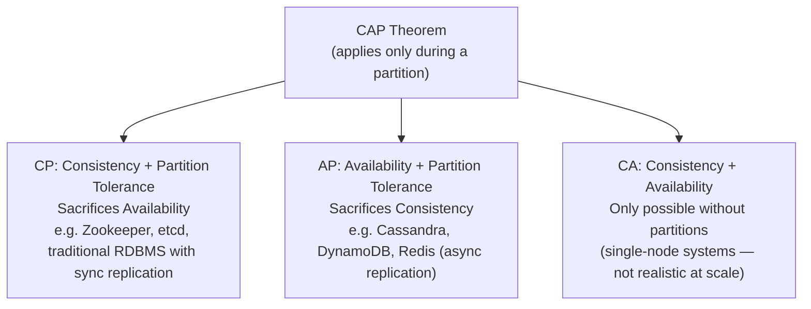

**Why this matters practically:** Partitions are rare, but *latency* is the day-to-day version of this trade-off. This is why **PACELC** is the more useful mental model for interviews:

> **P**artition → choose **A** or **C**; **E**lse (normal operation) → choose **L**atency or **C**onsistency.

- RDS with synchronous multi-AZ replication: favors C over L (write waits for replica ack).
- The CQRS+read-replica architecture in this guide is an explicit **PA/EL** choice: during normal operation it takes lower latency (read from replica) over strict consistency (replica lag), and it's documented via the "read-after-write" handling section below.

**Follow-up interviewers ask:** "Give a concrete example of AP vs CP in a system you built." — Tie it to something real: e.g., "Our RDS read replicas are AP/eventually-consistent by design; our payment write path is CP because we can't risk double-charging."

### Back-of-the-Envelope Capacity Estimation [new content]

Senior interviews frequently want you to *size* a system, not just draw boxes. Have these numbers memorized:

| Quantity | Rule of thumb |
|---|---|
| 1 million requests/day | ≈ 12 requests/second average |
| Peak traffic | Usually 2–5x average; design for peak, not average |
| 1 KB × 1M requests/day | ≈ 1 GB/day, ≈ 30 GB/month |
| SSD read | ~ tens of µs–1ms |
| Network round trip, same region | ~0.5–2 ms |
| Network round trip, cross-continent | ~100–150 ms |
| Redis GET | ~0.5–1 ms |
| SQL query (indexed) | ~1–10 ms |
| SQL query (unindexed/full scan) | ~100ms–seconds |

**Method for interview:**
1. Ask/estimate DAU (daily active users) and requests per user per day.
2. Compute average RPS, then multiply by a peak factor (e.g., 3x).
3. Estimate storage: `avg record size × records/day × retention period`.
4. Estimate bandwidth: `avg payload size × RPS`.
5. Decide if a single DB/server can handle it, or if you need caching, replicas, sharding, or a CDN.

Example: "500K DAU, each hitting the API 20x/day" → 10M requests/day → ~116 RPS average → ~350-500 RPS peak. A well-tuned Kestrel instance easily handles that; the bottleneck will be the database, which is exactly why caching/read-replicas (see below) become necessary, not optional.

---

## Intermediate: Building Blocks

### Caching Strategy

*(Original notes: "How to Make APIs Fast")*

Cache at multiple layers:

**a. In-memory cache** (single node, small/short-lived data)
```csharp
services.AddMemoryCache();
```

**b. Distributed cache (Redis)** — for multi-node deployments; cache DB lookups, dropdown data, access tokens. Use the **cache-aside pattern**:

```csharp
var cached = await _redis.GetStringAsync(key);
if (cached != null) return JsonSerializer.Deserialize<User>(cached);

var user = await _db.Users.FindAsync(id);
await _redis.SetStringAsync(key, JsonSerializer.Serialize(user));
return user;
```

**c. Response caching**
```csharp
[ResponseCache(Duration = 60)]
```

**[new content] Cache invalidation strategies (interviewer's favorite follow-up: "caching is easy, invalidation is the hard part"):**

| Strategy | How it works | Trade-off |
|---|---|---|
| TTL / expiration | Key auto-expires after N seconds | Simple, but can serve stale data within the window |
| Write-through | Write to cache and DB synchronously | Cache always fresh, but adds write latency |
| Write-behind (write-back) | Write to cache, async flush to DB | Fast writes, risk of data loss if cache crashes before flush |
| Explicit invalidation on write | App code deletes/updates the key after a DB write | Most correct, but easy to miss a code path (cache goes stale silently) |
| Event-driven invalidation | Publish an event on write; subscribers evict their cache | Scales across services, but adds infra (message broker) and eventual-consistency lag |

**[new content] Cache stampede / thundering herd:** When a hot key expires, many concurrent requests miss simultaneously and hammer the DB. Mitigations: request coalescing (single in-flight fetch, others await it), jittered TTLs (avoid synchronized expiry), and probabilistic early refresh.

**[new content] Cache-aside vs read-through:** Cache-aside (shown above) puts caching logic in application code — most common in .NET with `IDistributedCache`/Redis. Read-through puts the cache in front of the DB as a library/proxy that fetches on miss transparently — less app code, but less control over serialization/edge cases. Know the distinction; interviewers use "read-through" and "cache-aside" almost interchangeably in casual conversation but they are different responsibilities.

### Load Balancing [new content]

Not explicitly in the original notes, but essential — every architecture diagram in this guide implicitly needs one in front of the BFF/API layer.

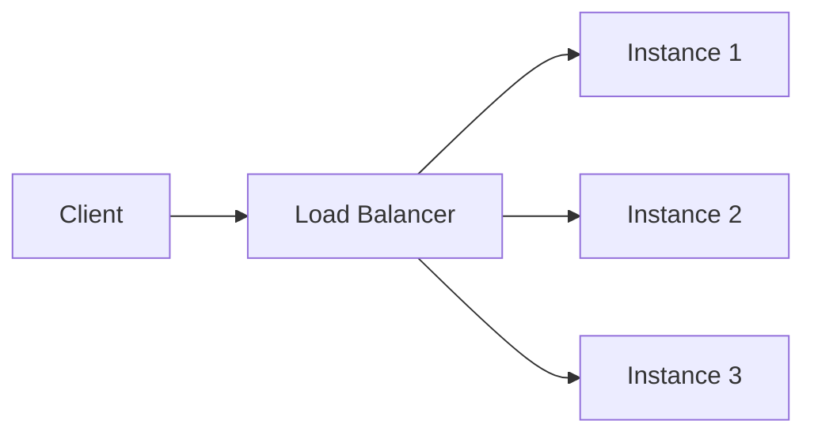

| Algorithm | Behavior | When to use |
|---|---|---|
| Round robin | Cycles through servers evenly | Uniform request cost, stateless servers |
| Least connections | Sends to server with fewest active connections | Variable request duration |
| IP hash / consistent hash | Same client → same server | Sticky sessions, cache locality |
| Weighted | Distributes proportional to server capacity | Mixed instance sizes, gradual rollout (canary) |

**L4 vs L7 load balancing:** L4 (transport layer, e.g., AWS NLB) routes on IP/port — fast, protocol-agnostic. L7 (application layer, e.g., ALB, Nginx, YARP) routes on HTTP path/headers — enables path-based routing (used heavily in the strangler-fig migration below), but adds overhead since it terminates/inspects HTTP.

**Health checks matter as much as the algorithm** — a LB is only as good as its ability to detect and stop routing to unhealthy instances (active health checks/liveness probes + passive circuit-breaking on repeated failures).

### API Gateway / BFF Pattern

*(Original notes: CQRS + BFF section)*

The **Backend for Frontend (BFF)** is a UI-specific API layer that Angular talks to exclusively:

- Authentication and authorization
- Aggregates backend calls
- Shapes responses for the UI
- Decides read vs write path (routes to Command vs Query APIs)

**Why BFF, not direct calls from Angular to microservices:**
- Prevents Angular from calling multiple backend services directly
- Centralizes auth (avoids duplicating token validation logic across every service the SPA would otherwise call)
- Decouples UI iteration speed from backend service structure

**[new content] BFF vs generic API Gateway:** These are often confused. An API Gateway (e.g., Ocelot, YARP, Azure APIM, Kong) is a *shared, generic* front door for many consumers (mobile, web, partners) doing routing/auth/rate-limiting. A BFF is *one per frontend/client type* — e.g., a separate BFF for the Angular web app vs a mobile BFF — because different clients need different response shapes and aggregation. In practice, many .NET shops build a BFF *behind* a shared API Gateway: Gateway handles cross-cutting infra concerns (TLS, WAF, global rate limits), BFF handles UI-specific aggregation/shaping. Conflating the two in an interview answer is a minor red flag.

### Database Read Replicas

*(Original notes: CQRS + BFF section)*

- Allow horizontal scaling for read traffic
- Offload reporting/dashboard queries from the primary
- Improve read performance without changing the write model
- **Are eventually consistent** — never assume immediate consistency after a write

### Database Sharding vs Partitioning [new content]

A genuinely thin spot in the original notes — sharding comes up in nearly every senior system design interview once "scale" is mentioned.

**Partitioning** = splitting one large table/dataset into smaller pieces, which can live on the *same* server (e.g., SQL Server table partitioning by date range) purely to make it manageable.

**Sharding** = a form of horizontal partitioning where the pieces (shards) live on *different servers/databases entirely*, specifically to scale writes and storage beyond one machine's capacity.

| Sharding strategy | How | Pros | Cons |
|---|---|---|---|
| Range-based | Shard by key range (e.g., user ID 1-1M, 1M-2M) | Simple, good for range queries | Hotspotting if data/traffic skewed (new users always hit the last shard) |
| Hash-based | `hash(key) % N` decides shard | Even distribution | Resharding is painful — changing N remaps almost everything |
| Consistent hashing | Ring-based hash (see below) | Minimal remapping on resize | More complex to implement |
| Directory-based | Lookup service maps key → shard | Flexible, easy rebalancing | Lookup service is a new SPOF/bottleneck |
| Geo-based | Shard by region/tenant | Data locality, compliance (GDPR) | Cross-region queries are expensive |

**Cross-shard problems to raise proactively:**
- Joins across shards require app-level fan-out or denormalization
- Transactions across shards need sagas or 2PC (both have costs — see Sagas section)
- Rebalancing (adding a shard) is the hardest operational problem — this is exactly why consistent hashing exists

**Interviewer follow-up:** "How would you shard a multi-tenant SaaS DB?" → Shard by `tenant_id` (geo- or hash-based); keep each tenant's data on one shard to avoid cross-shard joins entirely — this is the single biggest simplification available in tenant-based systems.

### Consistent Hashing [new content]

Solves the resharding problem of naive `hash(key) % N`: when you add/remove a node with modulo hashing, *almost every* key remaps, causing a cache/data stampede.

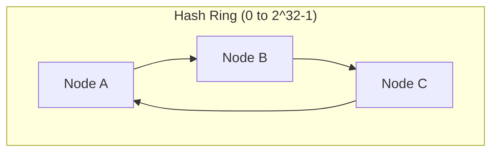

**How it works:** Both nodes and keys are hashed onto a circular ring (0 to 2^32-1). A key belongs to the first node clockwise from its position. Adding/removing a node only affects the keys between it and the *previous* node on the ring — not the whole keyspace.

**Virtual nodes:** Real implementations (e.g., Redis Cluster, DynamoDB, Cassandra) assign each physical node multiple positions on the ring ("virtual nodes") to avoid uneven load distribution when node count is small.

**Where it shows up in .NET interviews:** Redis Cluster client-side sharding, distributed cache partitioning, load balancer session affinity, and CDN edge-node selection all use consistent hashing under the hood. Knowing *why* it beats modulo hashing is the actual signal interviewers want — not the ring math.

### Message Queues & Event-Driven Architecture [new content]

The original notes mention RabbitMQ/Kafka/Azure Service Bus once in passing ("Service-to-service communication") without depth — this deserves real treatment since event-driven architecture underlies the Outbox/Saga/CQRS patterns below.

**Why decouple with a queue instead of direct calls:**
- Producer and consumer scale independently
- Consumer downtime doesn't block the producer (messages buffer)
- Natural retry/backoff and dead-letter handling
- Enables fan-out (one event, many subscribers) without producer knowing consumers

**Queue vs Topic/Pub-Sub:**

| | Point-to-point queue | Pub/Sub (topic) |
|---|---|---|
| Consumers | One consumer processes each message (competing consumers) | Every subscriber gets a copy |
| Example | Azure Service Bus Queue, SQS | Azure Service Bus Topic, Kafka, RabbitMQ exchange (fanout) |
| Use case | Work distribution (e.g., process an order) | Broadcasting a state change (e.g., "OrderPlaced" to Billing, Shipping, Analytics) |

**Kafka vs RabbitMQ vs Azure Service Bus (senior-level distinction, often asked directly):**

| | Kafka | RabbitMQ | Azure Service Bus |
|---|---|---|---|
| Model | Distributed log, partitioned, consumers track offset | Traditional broker, smart broker/dumb consumer | Managed broker (queues + topics), enterprise features |
| Throughput | Very high (millions/sec) | Moderate-high | Moderate |
| Message retention | Retains messages (replay possible) | Removed once acked (unless configured) | Time-boxed retention |
| Ordering | Per-partition ordering guaranteed | Per-queue ordering (mostly) | FIFO sessions available |
| Best for | Event streaming, event sourcing, high-volume telemetry | Task queues, RPC-style messaging, complex routing | Enterprise .NET-native integration, hybrid cloud |
| .NET fit | Confluent.Kafka client | RabbitMQ.Client / MassTransit | Azure.Messaging.ServiceBus, first-class Azure SDK support |

**At-least-once vs exactly-once vs at-most-once delivery:** Most brokers guarantee **at-least-once** by default (message redelivered if ack is lost) — meaning **consumers must be idempotent** (see Idempotency Keys below). True exactly-once is expensive/rare in practice; the pragmatic senior answer is "design for at-least-once + idempotent handlers" rather than chasing exactly-once semantics.

---

## Advanced Architecture Patterns

### CQRS + BFF + Read Replicas (Reference Architecture)

*(Original notes, preserved and reorganized)*

**30-second elevator pitch:**

We use CQRS to separate writes and reads. Command APIs handle business logic and write to the primary RDS database, while Query APIs serve read-only data from RDS read replicas. Angular never calls backend services directly; it talks to a Backend for Frontend (BFF), which handles authentication, response shaping, and decides whether a request is a read or a write. This improves scalability, performance, and keeps UI and domain logic cleanly separated.

**High-level architecture flow:**

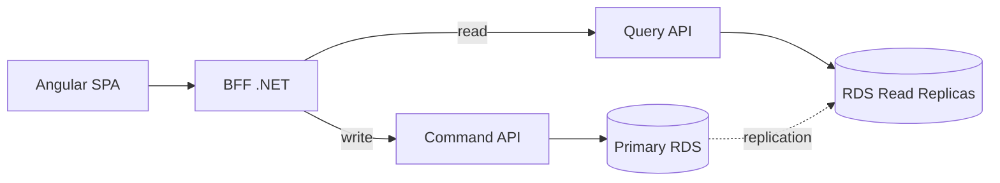

**Responsibility split:**

| Layer | Responsibility |
|---|---|
| Angular | UI only, no business logic, calls only the BFF |
| BFF | AuthN/AuthZ, aggregates backend calls, shapes responses, decides read vs write path |
| Command APIs | Business rules, validation, transactions, writes to primary RDS |
| Query APIs | Read-only, optimized queries, reads from RDS replicas |
| Primary RDS | All writes |
| RDS Read Replicas | All reads |

**Why each piece exists:**
- **Why CQRS:** Writes are complex, transactional, and require strong consistency. Reads are frequent, performance-critical, and scale much faster than writes. Separating them lets each side be optimized independently.
- **Why RDS read replicas:** Horizontal scaling for read traffic; offloads reporting/dashboard queries from primary; improves performance without changing the write model.
- **Why BFF:** UI-specific API; aggregates data from multiple services; centralizes auth; prevents Angular from calling multiple backend services directly.

**Handling read-after-write consistency:** RDS read replicas are eventually consistent. To handle this: after a write, either (a) return the command response directly to the UI (don't re-query), or (b) temporarily read from the primary database via the BFF for that specific follow-up read. **Never assume replicas are immediately consistent.**

**.NET implementation talking points:**
- Separate APIs for Command and Query, separate `DbContext`s
- Writes use EF Core with change tracking enabled
- Reads use EF Core `.AsNoTracking()` or Dapper for raw speed
- BFF never accesses the database directly — always goes through Command/Query APIs

**Common interviewer follow-ups (answered):**

- **"Is this 'true' CQRS?"** — This is *pragmatic* CQRS: we separate read/write paths and scaling, but both sides can still hit the same logical database (via primary/replica). Event-driven projections (separate read-optimized schema/store, populated via events) can be added later if read patterns diverge further from the write model — that's when it becomes "full" CQRS.
- **"Why not let Angular call Query APIs directly?"** — Couples the UI to backend structure, duplicates auth logic, makes UI changes expensive and fragile.
- **"When would you avoid this architecture?"** — Small CRUD apps or simple admin panels where the complexity outweighs the benefit.
- **"How does this scale?"** — Angular via CDN; BFF scales horizontally; Query APIs scale horizontally; read replicas can be added independently; write side remains controlled and consistent.

**Red flags to avoid in your own answer:** Angular talking directly to microservices; BFF containing business logic; claiming read replicas are strongly consistent; a single API handling both reads and writes at real scale.

**Closing line:** "CQRS with a BFF allows us to scale reads safely, keep writes consistent, and give the UI exactly what it needs without coupling it to backend complexity."

### Monolith → Microservices Migration (Strangler Fig)

*(Original notes, preserved and reorganized)*

**1. Start with why** — validate microservices are actually needed before jumping in. Typical valid reasons: independent deployment of modules (Orders, Billing, Inventory), different scalability needs (Search vs Admin), team autonomy/parallel development, tech heterogeneity. If none of these problems exist, **a modular monolith may be enough** — say this in the interview; it signals maturity.

**2. Identify service boundaries (DDD / bounded contexts)** — before cutting code, know where to cut. Use bounded contexts (Orders, Payments, Catalog, Shipping), each with its own model/language. Look at: separate teams? separate DB schemas? modules that change together?

> Interview line: "I use domain & change boundaries (DDD bounded contexts) to decide microservices, not just controllers or tables."

**3. Migration strategy — Strangler Fig Pattern.** Never do a big-bang rewrite.

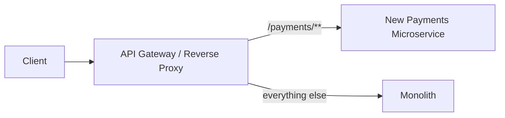

- Put an API Gateway/reverse proxy in front (YARP, Ocelot, Nginx, APIM)
- Route all traffic initially to the monolith
- Extract one capability (e.g., Payments) into a new microservice
- Change routing so `/payments/**` goes to the new service, rest stays on monolith
- Repeat for other modules until the monolith is mostly hollow

**4. Prepare the monolith (modularize first)** — if it's a mess, refactor first: separate projects (`MyApp.Orders`, `MyApp.Payments`, `MyApp.Shipping`), clear interfaces between modules (application services, events), tests around critical flows to avoid regressions during extraction. This makes later extraction closer to "cut & paste + adaptation."

**5. Extract one service end-to-end** (example: Order Management):
- New repo, own CI/CD pipeline
- Separate data: either a new DB/schema, or (temporary compromise) same DB but only that service writes to its tables
- Expose API (`POST /orders`, `GET /orders/{id}`)
- Update callers to go through the gateway
- Turn off old code in the monolith once stable
- Repeat with other modules

**6. Data migration strategy (usually the hardest part).** Database-per-service is the goal (no shared write DB). Migration path: start with shared DB but isolated ownership → move data gradually using ETL/one-time migration or Change Data Capture (CDC)/event streams to keep data in sync. To maintain cross-service consistency, **prefer event-driven/eventual consistency over distributed transactions**; use Outbox and Saga/process-manager patterns for complex workflows (Order + Payment + Inventory).

**7. Introduce platform components while extracting:**
- API Gateway (routing, auth, rate limiting, request/response shaping)
- Service-to-service communication: REST/gRPC + message broker (RabbitMQ, Kafka, Azure Service Bus)
- Observability: centralized logging (Serilog + ELK/App Insights), distributed tracing (correlation IDs), metrics & health checks
- CI/CD: each microservice has its own build/deploy pipeline for independent deployments

**8. Deployment & risk management** — start with one small, low-risk module (e.g., Notifications). Use feature toggles to turn new paths on/off. Deploy with canary/blue-green where possible, with a rollback plan (gateway flips traffic back to monolith quickly).

**9. Common pitfalls:**
- Splitting too fine-grained → chatty network calls, high latency
- Keeping a shared database forever → tightly coupled "distributed monolith"
- No proper observability → debugging becomes a nightmare
- Tech explosion (every service in a different stack) → ops complexity

**Short interview version:** "I would not do a big-bang rewrite. I start by identifying bounded contexts and modularizing the monolith. Then I put an API gateway in front and follow the Strangler Fig pattern to extract one business capability at a time into independent ASP.NET Core microservices with their own data. Initially, some services may still share the DB, but long term each service owns its schema. I introduce cross-cutting concerns like centralized logging, tracing, and CI/CD per service, and prefer async, event-driven communication and eventual consistency for workflows. This incremental approach reduces risk and allows us to deliver value while we're still migrating."

### CQRS & Event Sourcing (Full Pattern) [new content]

The original notes cover *pragmatic* CQRS (separate read/write paths over the same logical data) well, but don't cover **full CQRS with event sourcing**, which senior interviewers often probe as a follow-up ("how would you evolve this if read models diverge further?").

**Full CQRS:** Write side and read side use *physically different data stores/schemas*. The write side persists the source-of-truth (often as an event stream); the read side maintains one or more denormalized "projections" optimized for specific queries, updated asynchronously by consuming events.

**Event Sourcing:** Instead of storing current state, you store the sequence of events that led to it (`OrderCreated`, `ItemAdded`, `OrderShipped`). Current state is derived by replaying events (or from a cached snapshot + recent events).

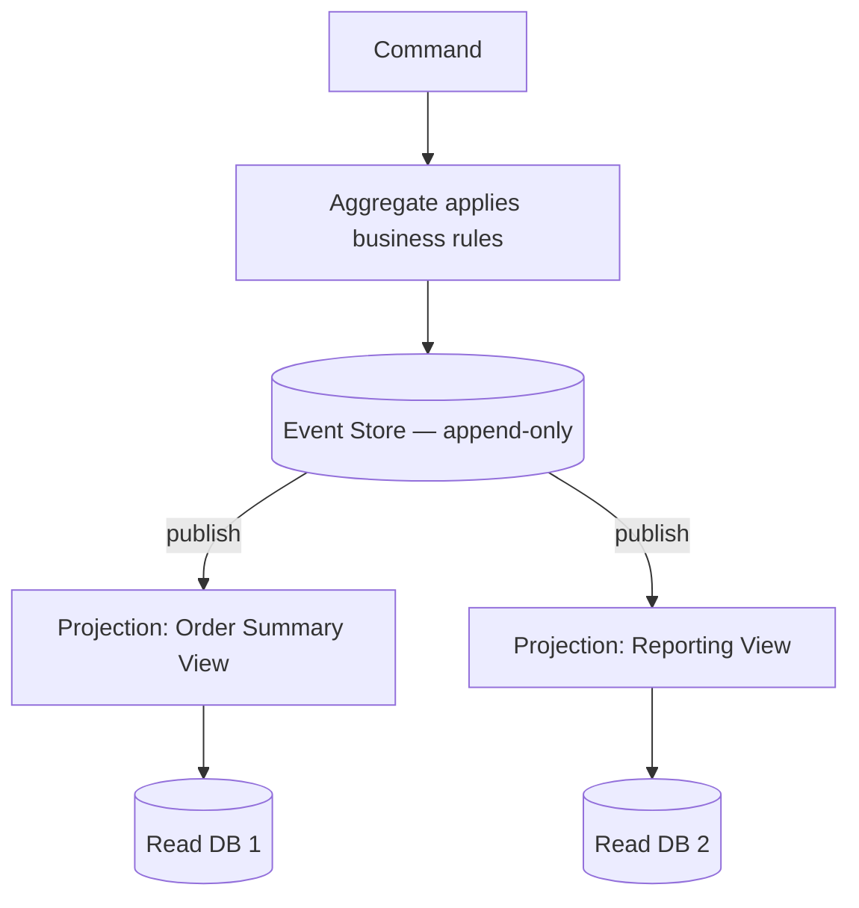

**Trade-offs (this is what the interview is actually testing):**

| Benefit | Cost |
|---|---|
| Full audit trail / temporal queries ("what did this look like last Tuesday?") | Significant complexity — most teams underestimate this |
| Read models tailored exactly to each query (multiple projections) | Eventual consistency between write and every read model |
| Natural fit for event-driven integration with other services | Replaying large event streams for rebuilds needs snapshotting strategy |
| Decouples read scaling entirely from write scaling | Schema evolution of events over time is a real, ongoing tax (versioning event contracts) |

**Senior-level guidance to give in an interview:** Don't reach for event sourcing by default. It earns its complexity when you need audit history/temporal queries as a first-class feature, or when read requirements are so varied that one normalized write model can't reasonably serve them all. For the vast majority of systems (including the CQRS+BFF+RDS architecture above), "pragmatic CQRS" with synchronous replicas is the right level of complexity — full event sourcing is the escalation path, not the starting point.

### Outbox Pattern & Transactional Messaging [new content]

Directly relevant to the "Data Migration Strategy" and Saga sections in the original notes, which reference the Outbox pattern by name but don't explain it — this closes that gap.

**The problem it solves:** You need to update your database *and* publish an event, and both must happen atomically — but a DB transaction and a message broker publish can't share a single ACID transaction. If you publish first and the DB write fails, consumers act on an event that never really happened. If you write to DB first and the publish fails, downstream services never find out.

**The solution:** Write the event to an `Outbox` table in the *same database transaction* as the business data change. A separate background process (or CDC tool like Debezium) polls/reads the outbox table and publishes those events to the broker, then marks them as sent.

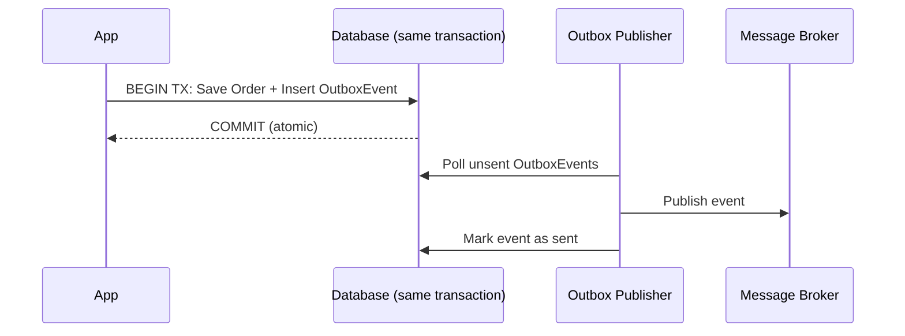

**.NET implementation notes:** EF Core `SaveChangesAsync()` writes both the business entity and the `OutboxMessage` row in one transaction (same `DbContext`, same `SaveChanges` call). A `BackgroundService` or Hangfire job polls the outbox table on an interval (or is triggered by CDC) and publishes to Kafka/RabbitMQ/Service Bus, then updates the row's status. This guarantees **at-least-once** delivery — the consumer side must be idempotent (see below) since the publisher may retry.

### Sagas / Distributed Transactions [new content]

Referenced by name in the original notes ("Saga / process manager for complex workflows like Order + Payment + Inventory") but not explained — filling that gap.

**Why not just use a distributed transaction (2PC)?** Two-phase commit works but requires all participants to hold locks until every participant votes to commit — this doesn't scale across services/network boundaries and creates tight coupling + availability risk (one slow/down service blocks everyone). Virtually no modern microservices architecture uses 2PC for this reason.

**Saga pattern:** Break the distributed transaction into a sequence of local transactions, each with a **compensating action** to undo it if a later step fails.

| Style | How it works | Trade-off |
|---|---|---|
| **Choreography** | Each service publishes events; other services react independently (no central coordinator) | Simple for few steps; hard to trace/understand as steps grow ("where's the logic?") |
| **Orchestration** | A central saga orchestrator explicitly calls each step and issues compensations on failure | Clear, testable, traceable; orchestrator itself is a new component to build/scale/monitor |

**Worked example — Order + Payment + Inventory:**
1. Order service creates order (status: `Pending`) → publishes `OrderCreated`
2. Payment service charges card → publishes `PaymentCompleted` or `PaymentFailed`
3. If `PaymentCompleted`: Inventory service reserves stock → publishes `StockReserved` or `StockUnavailable`
4. If `StockUnavailable`: compensate — Payment service issues a refund, Order service marks order `Cancelled`

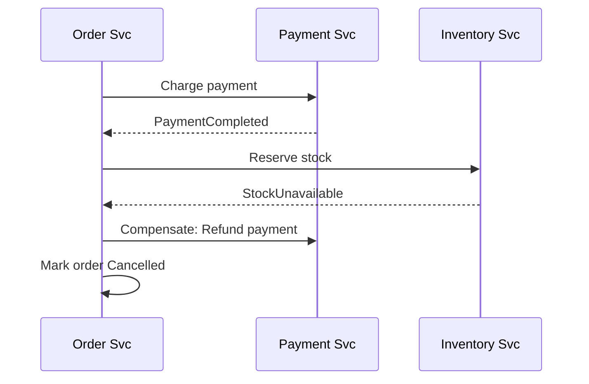

**Interview follow-up: "What if a compensating action itself fails?"** — This is the honest hard part of sagas. Answer: compensations must be retried (idempotent, with backoff); if they exhaust retries, escalate to a dead-letter queue for manual/ops intervention. There is no fully automatic answer to "what if undo also fails" — acknowledging this rather than hand-waving is a strong signal.

### Resilience Patterns: Circuit Breaker, Retry, Bulkhead (Polly) [new content]

Not present in the original notes at all — this is one of the most commonly asked "how do you handle a downstream service failing" questions for senior .NET candidates, and it's the standard library (Polly) they'll expect you to know.

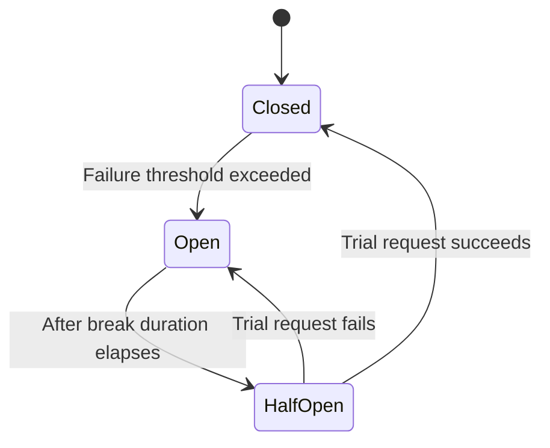

- **Retry** — re-attempt a transient failure, ideally with **exponential backoff + jitter** (jitter avoids synchronized retry storms across many clients hitting the same recovering service).
- **Circuit Breaker** — after N consecutive failures, "open" the circuit and fail fast for a cooldown period instead of hammering a struggling dependency; after cooldown, allow a trial ("half-open") request through to test recovery.
- **Bulkhead isolation** — cap concurrent calls/resources per dependency (named after ship compartments) so one slow/failing downstream can't exhaust the thread pool or connection pool and take down unrelated features.
- **Timeout** — always pair with the above; a retry or circuit breaker without a timeout policy just waits longer to fail.

**.NET implementation with Polly (v8, resilience pipelines):**
```csharp
var pipeline = new ResiliencePipelineBuilder<HttpResponseMessage>()
    .AddRetry(new RetryStrategyOptions<HttpResponseMessage>
    {
        MaxRetryAttempts = 3,
        BackoffType = DelayBackoffType.Exponential,
        UseJitter = true
    })
    .AddCircuitBreaker(new CircuitBreakerStrategyOptions<HttpResponseMessage>
    {
        FailureRatio = 0.5,
        SamplingDuration = TimeSpan.FromSeconds(30),
        BreakDuration = TimeSpan.FromSeconds(15)
    })
    .AddTimeout(TimeSpan.FromSeconds(5))
    .Build();
```

In modern .NET, this integrates directly with `HttpClientFactory` via `Microsoft.Extensions.Http.Resilience`, which wraps Polly v8 pipelines onto named/typed clients with one call (`AddStandardResilienceHandler()`).

**Interview framing:** "I wrap outbound calls to unreliable dependencies with Polly: retry with exponential backoff + jitter for transient faults, a circuit breaker so we fail fast instead of piling up requests against a dependency that's already down, a timeout so we never wait forever, and bulkhead isolation so a slow third-party API can't starve threads needed by unrelated features."

### Idempotency Keys [new content]

Not covered in the original notes, but essential once you've introduced at-least-once message delivery (Outbox/queues above) and retries (Polly above) — both mean the *same* operation can be triggered more than once, and non-idempotent handlers (e.g., "charge card," "send email") will double-execute.

**Idempotency key pattern:** Client generates a unique key (GUID) per logical operation and sends it in a header (e.g., `Idempotency-Key`). Server stores completed keys (with the response) in a fast store (Redis/DB with unique index) for a retention window. On retry with the same key, server returns the cached original response instead of re-executing the operation.

```csharp
[HttpPost("payments")]
public async Task<IActionResult> ChargeCard(
    [FromHeader(Name = "Idempotency-Key")] string idempotencyKey,
    PaymentRequest request)
{
    var existing = await _idempotencyStore.GetAsync(idempotencyKey);
    if (existing is not null) return Ok(existing.Response); // replay, don't re-execute

    var result = await _paymentService.ChargeAsync(request);
    await _idempotencyStore.SaveAsync(idempotencyKey, result);
    return Ok(result);
}
```

**Where this matters most:** payment APIs, order creation, any POST that isn't naturally idempotent, and message consumers reading from an at-least-once queue (the outbox publisher above will redeliver on crash-before-ack).

**Interviewer follow-up: "Isn't a database unique constraint enough?"** — Sometimes, if the operation has a natural business key (e.g., `OrderId` unique constraint prevents duplicate orders). Idempotency keys are the general solution when there's no natural business key, or when you need to return the *exact original response* (not just prevent a duplicate row) on retry.

### Rate Limiting Algorithms [new content]

Mentioned once in passing in the original notes ("API Gateway: auth, rate limiting") with zero depth — this is a near-guaranteed system-design interview topic ("design a rate limiter") and deserves full treatment (see also the worked example below).

| Algorithm | How it works | Pros | Cons |
|---|---|---|---|
| Fixed window counter | Count requests in a fixed time window (e.g., per minute), reset at boundary | Simple, cheap | Bursts at window edges can allow 2x the limit (e.g., 100 at 11:59:59, another 100 at 12:00:01) |
| Sliding window log | Store timestamp of every request, count within rolling window | Accurate | Memory-heavy at high volume |
| Sliding window counter | Weighted average of current + previous fixed window | Good accuracy, low memory | Slight approximation |
| Token bucket | Bucket holds tokens, refills at fixed rate; request consumes a token; empty bucket = reject/queue | Allows controlled bursts, smooths traffic | Slightly more complex to implement |
| Leaky bucket | Requests enter a queue, processed at a fixed output rate | Smooths bursts into a constant rate | Adds latency for bursty clients |

**.NET built-in support:** `Microsoft.AspNetCore.RateLimiting` middleware (since .NET 7) provides all four policies (Fixed Window, Sliding Window, Token Bucket, Concurrency limiter) out of the box:
```csharp
builder.Services.AddRateLimiter(options =>
{
    options.AddTokenBucketLimiter("api", opt =>
    {
        opt.TokenLimit = 100;
        opt.TokensPerPeriod = 20;
        opt.ReplenishmentPeriod = TimeSpan.FromSeconds(10);
    });
});
```

**Distributed rate limiting:** In a multi-instance deployment, in-memory counters per instance don't enforce a *global* limit. Use Redis (`INCR` + `EXPIRE`, or a Lua script for atomicity) as the shared counter store so the limit is enforced across all instances — this is exactly the kind of follow-up ("what if you have 10 pods behind a load balancer?") that separates senior from mid-level answers.

---

## Kestrel & ASP.NET Core Server Internals

*(Original notes, preserved)*

### What is Kestrel?

Kestrel is the default cross-platform web server for ASP.NET Core — a high-performance, event-driven, asynchronous web server built on top of .NET's Socket APIs, using I/O Completion Ports (IOCP) on Windows and epoll/kqueue on Linux/macOS. Optimized to handle thousands of concurrent connections with very low overhead.

### Why was Kestrel created?

Before .NET Core, ASP.NET used IIS with `System.Web`: a thread-per-request model that caused thread starvation, tight coupling with Windows, and was slow for real-time web apps. Kestrel was created to be platform-independent, use async I/O from the ground up, provide raw performance similar to Node.js/Nginx, and remove the overhead of `System.Web`/the IIS pipeline.

### Kestrel Features

- **Cross-platform:** Windows, Linux, macOS, containers
- **Asynchronous pipeline:** request reading/writing/routing all async, uses very few threads, avoids thread-per-request
- **High performance:** consistently ranks among the fastest web servers in TechEmpower Benchmarks
- **HTTPS, HTTP/1.1, HTTP/2, HTTP/3 support:** built-in TLS termination, HTTP/3 via QUIC
- **WebSockets support**
- **Endpoint routing:** bind to multiple URLs (`http://localhost:5000`, `https://localhost:5001`)

### Kestrel Architecture (Internal Flow)

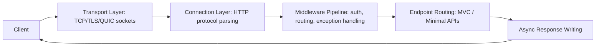

Kestrel's event loop is optimized to efficiently handle high concurrent I/O.

### How Kestrel Handles Concurrency

Kestrel is event-loop-based, similar to Node.js but with multiple loops. Key concepts:
- Uses I/O Completion Ports (Windows) / epoll/kqueue (Linux/macOS)
- Minimal threads → high throughput
- Async context-switching avoids blocking the ThreadPool

Example: if 10,000 connections are open, only a small number of threads are active; all I/O is asynchronous; requests are processed via callbacks + async/await. **This is why async code makes your API faster — Kestrel can reuse threads efficiently.**

### Configure Kestrel (Real-World Example)

```csharp
var builder = WebApplication.CreateBuilder(args);

builder.WebHost.ConfigureKestrel(options =>
{
    options.Limits.MaxRequestBodySize = 10 * 1024 * 1024; // 10 MB
    options.Limits.KeepAliveTimeout = TimeSpan.FromMinutes(2);
    options.Limits.RequestHeadersTimeout = TimeSpan.FromSeconds(30);

    options.ListenAnyIP(5000);
    options.ListenAnyIP(5001, listenOptions =>
    {
        listenOptions.UseHttps();
    });
});

var app = builder.Build();
app.Run();
```

### Standalone vs Reverse Proxy Mode

- **Standalone:** Client → Kestrel → ASP.NET Core. Used in development, containers, simple deployments.
- **Reverse proxy (recommended for production):** Client → Nginx/Apache/IIS → Kestrel.

**Why use a reverse proxy?** Better security, better load balancing, better connection handling, static files served faster by Nginx/IIS, protects Kestrel from direct exposure.

### Performance Features

- **Zero-copy memory** — uses `Span<T>`, `Memory<T>`, pipelines API
- **Optimized header & body parsing** — no unnecessary allocations
- **HTTP/2 multiplexing** — multiple streams on one connection
- **IIS Integration Middleware** — when hosting on Windows with IIS reverse proxy

### Memory Management in Kestrel

Kestrel uses memory pools, shared buffers, and reusable arrays — reduces GC pressure → faster response times.

### Common Interview Q&A (Kestrel)

**Q: Why is Kestrel faster than IIS/System.Web?**
A: Async I/O, minimal pipeline, no `System.Web`, lightweight request handling, event-driven model.

**Q: Should Kestrel be exposed directly to the internet?**
A: No — use Nginx/IIS/a cloud load balancer as a reverse proxy for production (security, static files, connection management). **[new content]** In modern containerized deployments (AKS/EKS behind an ingress controller, or Azure App Service), the "reverse proxy" is often the ingress controller or platform load balancer rather than a hand-configured Nginx box — the principle (don't expose Kestrel raw) still holds.

**Q: How does Kestrel handle thread starvation?**
A: It doesn't create a thread per request. It uses async I/O + an event loop, so far fewer threads are required than the classic IIS/System.Web model.

**Q: Does Kestrel run on Windows?**
A: Yes — but request processing still uses .NET's cross-platform async I/O model rather than legacy Windows-specific APIs.

**[new content] Q: What's `MinRequestBodyDataRate` / `MinResponseDataRate` and why would you tune it?**
A: Kestrel enforces a minimum data rate on request/response bodies (default ~240 bytes/sec) to protect against slow-client attacks (slowloris-style) that hold connections open by trickling data. You'd raise the limit or disable it (`options.Limits.MinRequestBodyDataRate = null`) for legitimately slow clients (e.g., large uploads over poor mobile connections), and you'd never disable it for public-facing endpoints without another mitigation (WAF, reverse proxy timeout) in front.

**[new content] Q: HTTP/2 vs HTTP/3 — why would you enable HTTP/3 (QUIC)?**
A: HTTP/2 multiplexes multiple streams over one TCP connection but still suffers from TCP-level head-of-line blocking (one lost packet stalls all streams on that connection). HTTP/3 runs over QUIC (UDP-based), which multiplexes at the transport layer so a lost packet only stalls its own stream — meaningful latency improvement on lossy networks (mobile). Trade-off: QUIC/UDP can be blocked by restrictive corporate firewalls/proxies that only allow TCP 443, so HTTP/2 fallback must remain available.

### Senior-Level Summary (Kestrel, interview-ready)

"Kestrel is ASP.NET Core's default high-performance web server. It uses asynchronous I/O, event-driven architecture, and memory-efficient pipelines to handle thousands of concurrent connections. It supports HTTP/1.1, HTTP/2, and HTTP/3, TLS termination, WebSockets, and cross-platform hosting. In production, I usually run Kestrel behind a reverse proxy like Nginx or IIS (or a platform ingress/load balancer in containers) for security, load balancing, static file serving, and better connection management. Because it's async-first, APIs perform significantly better compared to classic IIS/System.Web models."

---

## API Performance Optimization

*(Original notes: "How to Make APIs Fast", preserved and reorganized)*

### 1. Reduce I/O & Database Latency

**a. Proper indexing** — composite indexes for frequent filters; avoid `SELECT *`, fetch only required fields; analyze slow queries with SQL Server Query Store or `EXPLAIN` execution plans.

**b. Pagination & projection** — avoid returning huge datasets; use `Select()` projections in EF Core to avoid loading unnecessary columns.

**c. Async EF Core:**
```csharp
var data = await _dbContext.Users
    .Where(x => x.IsActive)
    .ToListAsync();
```
Prevents thread starvation in ASP.NET Core Kestrel.

### 2. Caching at Multiple Layers

See [Caching Strategy](#caching-strategy) above for the full treatment (in-memory, Redis cache-aside, response caching, invalidation strategies, cache stampede).

### 3. Reduce Serialization Time

- Use `System.Text.Json` instead of `Newtonsoft.Json`
- Pre-define response types (DTOs)
- Avoid serializing EF entities directly

**[new content]** `System.Text.Json` is source-generator-capable (`System.Text.Json.Serialization.JsonSerializerContext`) since .NET 6+ — using source-generated serialization contexts avoids reflection entirely and is a meaningful win under high throughput; worth naming explicitly if asked "how would you go even faster than the default STJ."

### 4. Asynchronous & Non-Blocking Architecture

Kestrel is optimized for async workloads. Avoid synchronous calls like `.Result`/`.Wait()` — they block the thread pool. Use async all the way down (no "sync over async").

### 5. Minimize Middleware & Pipeline Overhead

Keep only required middleware (routing, authentication, structured logging). Disable unused services, verbose logging in production, and large exception stack traces.

### 6. Compression, HTTP/2, and gRPC

**Response compression:**
```csharp
services.AddResponseCompression();
```

**gRPC for internal microservice calls** — 5-10x faster than REST, binary protocol, useful for high-throughput systems.

**[new content]** gRPC's speed advantage comes from HTTP/2 + Protobuf binary serialization + strongly-typed contracts (no reflection-based JSON parsing), but the trade-off is worth stating explicitly: gRPC is harder to debug/inspect manually (not human-readable on the wire), has weaker browser support (needs grpc-web + a proxy), and versioning/tooling is less universally familiar than REST/OpenAPI. The standard senior answer: gRPC for internal service-to-service calls, REST/JSON (or GraphQL) for public/browser-facing APIs.

### 7. Improve Application Architecture

**a. CQRS for high-read systems** — reads from read DB, commands from write DB, reduces load. (Full treatment above.)

**b. Background processing** — move heavy work to Hangfire, Azure Functions, or `BackgroundService`; APIs return fast while processing continues async.

### 8. Connection Pooling & HttpClientFactory

`HttpClientFactory` prevents socket exhaustion:
```csharp
services.AddHttpClient("external", c =>
{
    c.Timeout = TimeSpan.FromSeconds(5);
});
```
For databases: use minimal DB contexts, avoid long-running transactions.

### 9. Reduce Payload Size

Compress JSON, remove unused fields, return lightweight DTOs, use OData or filtering APIs if required.

### 10. Profiling & Monitoring

Tools: Application Insights, New Relic, CloudWatch, Datadog, MiniProfiler for .NET, EF Core logging (to track N+1 queries).

Track: API latency (p50, p90, p99), slow SQL queries, serialization time, GC pauses.

### Senior-Level Summary (API Performance, interview-ready)

"To make APIs fast, I optimize at multiple layers: database (indexes, projections, pagination), caching (Redis, memory, response caching), async architecture, Kestrel tuning, minimized middleware, payload optimization, and proper observability to detect bottlenecks. For high-scale systems, I also use CQRS, background processing, and gRPC. Performance is a cross-layer concern, not a single fix."

---

## Scalability & Performance Deep Dive

**[new content]** This section ties the individual performance tips above into a coherent "where's the bottleneck" mental model, which is what interviewers are really probing for when they ask "the API is slow, walk me through how you'd debug it."

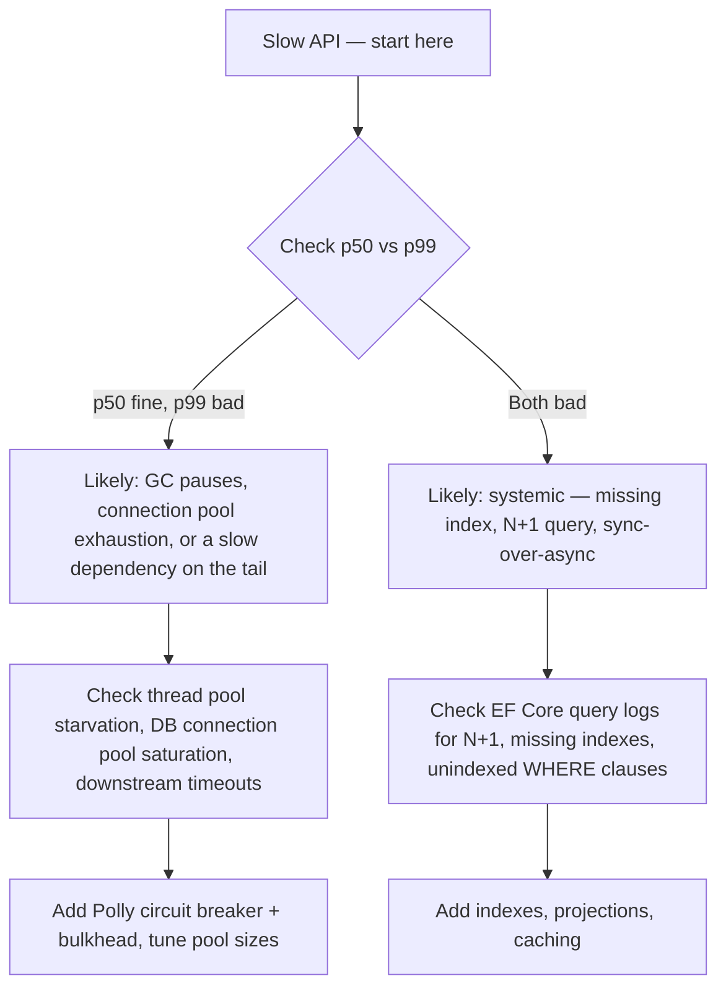

**Vertical vs horizontal scaling trade-off (a direct question you should be ready for):** Vertical scaling (bigger instance) is simpler — no code changes, no distributed-systems complexity — but has a hard ceiling and a single point of failure. Horizontal scaling (more instances) is the standard answer for internet-scale systems but requires the app to be stateless (or externalize state to Redis/DB), needs a load balancer, and introduces distributed-system problems (data consistency, distributed caching, session affinity). The senior answer: default to horizontal for anything customer-facing at scale, but don't over-engineer a low-traffic internal tool into a distributed system just because it's fashionable.

**N+1 query problem** — the single most common real-world EF Core performance bug: iterating a collection and lazy-loading a related entity per item causes N+1 round trips instead of 1. Fix with eager loading (`.Include()`), projection (`.Select()` to shape exactly what's needed), or a single batched query. EF Core's `AsSplitQuery()` is also relevant for one-to-many `Include` scenarios that would otherwise produce a cartesian-product explosion in a single SQL query — know when to reach for split queries vs a single query.

---

## Best Practices

- Validate business need before adopting microservices/CQRS/event sourcing — complexity should be earned, not defaulted to.
- Design for **async all the way down**; never mix `.Result`/`.Wait()` into an async call chain.
- Cache at the layer closest to the client that's still correct (CDN > response cache > distributed cache > in-memory > DB).
- Treat read replicas and distributed caches as **eventually consistent by default** — design read-after-write flows explicitly, don't assume.
- Make consumers of queues/webhooks/retries idempotent — at-least-once delivery is the realistic default, not exactly-once.
- Put resilience (retry/circuit breaker/timeout/bulkhead) around every outbound call to a dependency you don't control.
- Observability (structured logs, correlation IDs, distributed tracing, p50/p90/p99 latency) is not optional at any real scale — build it in from day one, not after the first incident.
- Prefer a modular monolith with clean internal boundaries over premature microservices — it's a legitimate, defensible end-state, not just a stepping stone.
- When sharding/partitioning, choose a shard key that keeps related data (and transactions) together to avoid cross-shard joins/transactions.

## Common Pitfalls

- Splitting microservices too fine-grained → chatty network calls, high latency (from original notes).
- Keeping a shared database forever across "microservices" → tightly coupled "distributed monolith" (from original notes).
- No proper observability → debugging becomes a nightmare (from original notes).
- Tech stack explosion (every service in a different language/framework) → ops complexity (from original notes).
- Assuming RDS read replicas / distributed caches are strongly consistent (from original notes — explicitly called out as a "red flag" to avoid saying).
- Using `.Result`/`.Wait()` on async calls, causing thread pool starvation under Kestrel (from original notes).
- **[new content]** Retrying non-idempotent operations (e.g., "charge card") without an idempotency key, causing duplicate side effects under at-least-once delivery.
- **[new content]** Adding a circuit breaker/retry without a timeout — you just fail slower instead of failing fast.
- **[new content]** Choosing a sharding key that doesn't match your actual query/transaction patterns, forcing expensive cross-shard fan-out later.
- **[new content]** Reaching for Kafka/event sourcing/full CQRS because they're "correct," when a simpler pattern would have shipped faster with less ongoing operational tax.

---

## Worked Examples [new content]

Senior/staff-level system design interviews frequently ask you to design a specific system end-to-end. These three are among the most common. Each follows: requirements → estimation → high-level design → deep dive → trade-offs.

### Design a URL Shortener [new content]

**Requirements:** Shorten a long URL to a short code; redirect short code → original URL; ~100M new URLs/month, ~10:1 read:write ratio (redirects far outnumber creations); low-latency redirects.

**Estimation:** 100M writes/month ≈ 40 writes/sec average; reads ≈ 400/sec average (higher at peak). Storage: URL + metadata ≈ 500 bytes; 100M/month × 500B ≈ 50GB/month — grows but manageable with archiving of old/unused links.

**Core design decision — short code generation:**

| Approach | How | Trade-off |
|---|---|---|
| Base62 encode an auto-increment DB ID | `id=125 → "cb"` | Simple, no collisions, but reveals creation order/volume and needs a centralized ID generator (or a range allocator per app instance to avoid a DB round trip per request) |
| Hash the URL (MD5/SHA) + truncate | First 6-8 chars of hash | No central counter needed, but collisions possible — needs a check-and-retry or a longer code |
| Random string + collision check | Generate random 6-7 chars, check DB uniqueness | Simple, but wasted lookups as the keyspace fills up |

Senior answer: base62 of a distributed ID generator (e.g., Snowflake-style ID or pre-allocated ID ranges per node) avoids both the central-counter bottleneck and collision handling.

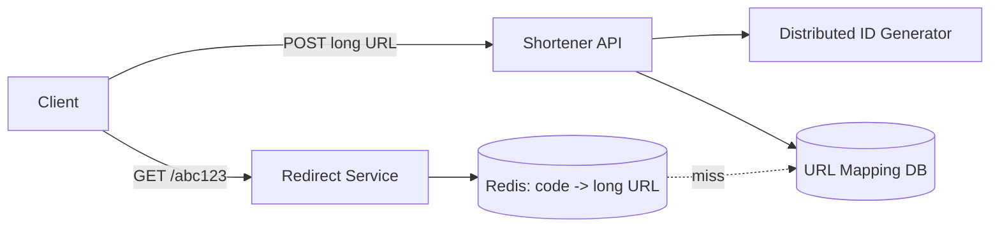

**Deep dive — redirect path is the hot path:** Cache short-code → long-URL mappings in Redis (read-through or cache-aside); DB is only hit on cache miss. Use a 301 vs 302 redirect trade-off: 301 (permanent) lets browsers cache it client-side (fewer hits to your service, but you lose click-analytics and can't easily change the destination later); 302 (temporary) keeps every click hitting your service (enables analytics, A/B redirects) at the cost of more load. Most production shorteners use 302 specifically to retain click tracking.

**Trade-offs to raise proactively:** custom short domains/vanity URLs need a uniqueness check against user-chosen codes; expiring/rate-limiting link creation to prevent abuse (spam link generation) ties directly into the Rate Limiting section above.

### Design a Rate Limiter Service [new content]

**Requirements:** Limit requests per client (by API key or IP) to N requests per time window; must work across many API server instances (distributed); low added latency.

**Design:** Centralize the counter in Redis (not per-instance memory) so the limit is global across all API instances behind the load balancer. Use the **token bucket** algorithm (see [Rate Limiting Algorithms](#rate-limiting-algorithms-new-content) above) for its ability to absorb bursts while enforcing an average rate.

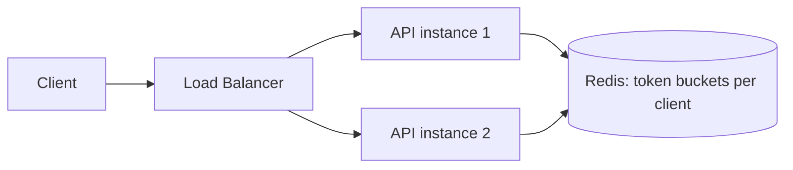

**Implementation detail that separates senior answers:** Use a single Redis Lua script (or `MULTI`/`EXEC`) to read-and-decrement the token count atomically — doing a separate `GET` then `SET` from application code is a race condition under concurrent requests (two requests both read "1 token left," both proceed, bucket goes negative).

**What happens when Redis is down?** This is the critical failure-mode question. Options: fail open (allow all requests — risk of abuse during the outage) or fail closed (reject all requests — risk of a full outage caused by your safety mechanism). Most production systems fail open for rate limiting specifically, because a rate limiter's job is to protect against abuse, not to be a hard security boundary — an outage-caused traffic spike is a lesser risk than rejecting 100% of legitimate traffic.

**Where to enforce it:** At the API Gateway/edge (cheapest, stops abusive traffic before it costs you any backend compute) rather than deep in each service — though per-service/per-endpoint limits can still layer on top for finer-grained protection (e.g., a stricter limit specifically on an expensive search endpoint).

### Design a Notification System [new content]

**Requirements:** Send notifications via multiple channels (push, email, SMS) triggered by events from many upstream services; must not block the upstream service; must handle retries/failures per channel independently; potentially huge fan-out (e.g., "notify all followers").

**High-level design:**

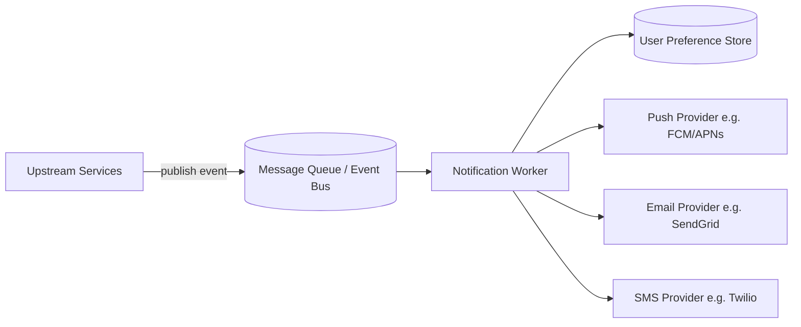

**Why a queue, not a direct call:** The triggering service (e.g., Orders) shouldn't block on notification delivery, and shouldn't know/care about SMS provider outages — decoupling via a queue means the order completes instantly and notification delivery/retries happen independently (ties directly into the [Message Queues](#message-queues--event-driven-architecture-new-content) section above).

**Deep dive — fan-out at scale ("notify all 1M followers"):** Don't create 1M individual queue messages synchronously from the triggering request. Instead, publish one "fan-out" event; a dedicated fan-out worker expands it into per-user work items (possibly itself pushing into a second queue) — this keeps the originating request fast and isolates the expensive fan-out work into a scalable background process.

**Per-channel resilience:** Each channel (push/email/SMS) has its own failure modes and rate limits from the provider — wrap each provider call in its own Polly policy (retry + circuit breaker) so an SMS provider outage doesn't stall email/push delivery. Use dead-letter queues per channel for messages that exhaust retries, with alerting.

**User preferences & idempotency:** Check user notification preferences (opt-outs, quiet hours, channel preference) before sending — cache this lookup since it's read far more than it changes. Use an idempotency key per (event, channel) so a redelivered queue message (at-least-once delivery) doesn't send a duplicate notification.

**Trade-off to name explicitly:** Real-time push vs batched/digest notifications — sending every event immediately maximizes immediacy but risks notification fatigue and higher provider cost; batching/digesting (e.g., "5 new comments" instead of 5 separate pushes) trades latency for both better UX and lower cost at scale. Worth mentioning you'd clarify this requirement rather than assume.

---

## Sample Interview Q&A

**Q: Why is Kestrel faster than IIS?**
A: Async I/O, minimal pipeline, no `System.Web`, lightweight request handling, event-driven model.

**Q: Should Kestrel be exposed directly to the internet?**
A: No — use a reverse proxy (Nginx/IIS/ingress controller) for production.

**Q: How does Kestrel handle thread starvation?**
A: No thread-per-request; async I/O + event loop means far fewer threads are needed.

**Q: Is CQRS with shared RDS + replicas "true" CQRS?**
A: No — it's pragmatic CQRS (separated read/write paths and scaling over the same logical data store). Full CQRS/event sourcing with separate projections is an escalation path if read requirements diverge further.

**Q: Why not let the Angular frontend call Query APIs directly instead of going through a BFF?**
A: Couples the UI to backend structure, duplicates auth logic, makes UI changes fragile and expensive.

**Q: When would you avoid microservices entirely?**
A: When you don't have genuinely independent scaling/deployment/team needs — a well-modularized monolith is often the right, defensible answer.

**[new content] Q: What's the difference between availability and consistency trade-offs during a network partition vs during normal operation?**
A: CAP theorem only strictly applies during a partition (choose A or C). During normal operation (no partition), the real trade-off is latency vs consistency (PACELC) — e.g., synchronous multi-AZ replication adds latency to guarantee consistency, while async replication (like RDS read replicas here) favors latency at the cost of temporary staleness.

**[new content] Q: How would you make a payment API safe to retry?**
A: Require an idempotency key from the client per logical payment attempt; store completed keys with their response; on retry with the same key, return the cached response instead of re-charging. Combine with Polly retry policies on the client side and a database-level uniqueness constraint on the business key as defense-in-depth.

**[new content] Q: Your circuit breaker is open and failing fast — what do you tell users, and what do you tell on-call?**
A: To users: return a graceful degraded response if possible (cached/stale data, or a clear "temporarily unavailable" rather than a raw 500) rather than a hung request. To on-call: alert on circuit state transitions specifically (not just error rate) so they know it's a downstream dependency issue, not your service's own bug — this cuts diagnosis time significantly.

**[new content] Q: How would you scale the URL shortener redirect path to 50,000 reads/sec?**
A: Cache aggressively (Redis, potentially a CDN/edge cache for very hot links), ensure the redirect path never touches the write DB, and consider a read replica or dedicated read store if cache miss volume alone still exceeds one DB's capacity — the redirect path should be nearly all cache hits given the skewed read:write ratio typical of URL shorteners.

---

## Summary of Additions

The following `[new content]` topics were added because they are commonly probed in 2026 senior/lead .NET system design interviews but were missing or only named-in-passing in the original notes:

- **What System Design Interviews Actually Test** — frames the rest of the guide around trade-off reasoning, not pattern recitation.
- **Scalability/Availability/Reliability definitions** — precise vocabulary interviewers expect distinguished cleanly (esp. availability vs reliability).
- **CAP Theorem in Practice (+ PACELC)** — the original notes' read-replica design is implicitly an AP/EL choice; this makes that trade-off explicit and interview-ready.
- **Back-of-the-Envelope Capacity Estimation** — nearly every system design interview asks you to size something; this was entirely absent.
- **Load Balancing** — a foundational building block implicit in every architecture diagram but never covered.
- **Database Sharding vs Partitioning** — a top-tier "how do you scale writes" follow-up question, previously missing entirely.
- **Consistent Hashing** — the standard answer to "how does sharding/caching survive adding a node," missing entirely.
- **Message Queues & Event-Driven Architecture (Kafka vs RabbitMQ vs Service Bus)** — only named in passing; this is load-bearing for the Outbox/Saga/CQRS patterns.
- **CQRS & Event Sourcing (Full Pattern)** — the original notes cover pragmatic CQRS well but not the "full" pattern interviewers ask about as an escalation/follow-up.
- **Outbox Pattern & Transactional Messaging** — named but unexplained in the original notes ("Outbox" appeared with zero detail); now fully explained with the dual-write problem it solves.
- **Sagas / Distributed Transactions** — same gap: named but unexplained; now covers choreography vs orchestration and the "what if compensation fails" follow-up.
- **Resilience Patterns: Circuit Breaker, Retry, Bulkhead (Polly)** — completely absent; one of the most common senior .NET resilience questions.
- **Idempotency Keys** — completely absent; necessary once at-least-once delivery and retries are in play.
- **Rate Limiting Algorithms** — named once with zero depth; added full algorithm comparison plus .NET 7+ built-in middleware and distributed (Redis-backed) enforcement.
- **Scalability & Performance Deep Dive (bottleneck decision tree, N+1 queries)** — ties the performance tips into a debugging framework interviewers explicitly test ("the API is slow, walk me through it").
- **Worked Examples (URL Shortener, Rate Limiter, Notification System)** — full worked "design X" examples, a near-guaranteed interview format not represented at all in the original notes.
- Several **Kestrel Q&A additions** (`MinRequestBodyDataRate`, HTTP/2 vs HTTP/3 trade-offs) and **serialization/gRPC nuance** additions, layered into existing sections rather than new top-level headings.

**Contradictions flagged:** None found. The original notes are internally consistent — the CQRS+BFF section and the microservices-migration section complement each other (the latter explicitly recommends the patterns detailed pragmatically in the former, e.g., Outbox/Saga), and no conflicting technical claims were found across the source material.
