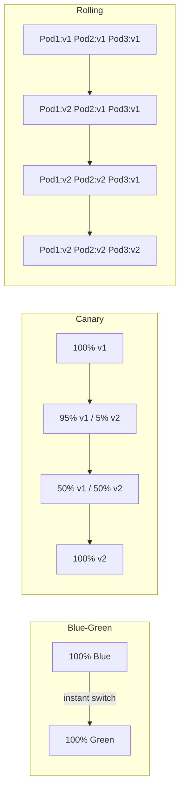
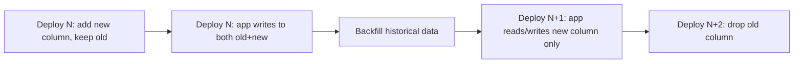
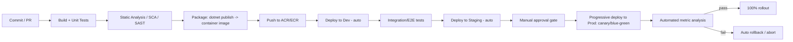

# Deployment Strategies — Senior .NET Interview Guide

> Consolidated from personal notes + gap-filled for senior/lead-level .NET full-stack interviews (2026).

## Table of Contents

1. [Core Concepts](#core-concepts)
   - [What "Deployment Strategy" Actually Means](#what-deployment-strategy-actually-means)
   - [Blue-Green Deployment](#blue-green-deployment)
   - [Canary Deployment](#canary-deployment)
   - [Rolling Deployment](#rolling-deployment)
   - [[new content] Comparison Table: Blue-Green vs Canary vs Rolling vs Recreate](#new-content-comparison-table-blue-green-vs-canary-vs-rolling-vs-recreate)
2. [Feature Flags / Feature Toggles](#feature-flags--feature-toggles)
   - [What Is a Feature Toggle](#what-is-a-feature-toggle)
   - [Why Use Feature Toggles](#why-use-feature-toggles)
   - [Implementing Feature Toggles with LaunchDarkly in .NET](#implementing-feature-toggles-with-launchdarkly-in-net)
   - [Testing Feature Toggles](#testing-feature-toggles)
   - [Real-World Use Cases](#real-world-use-cases)
   - [[new content] Feature Flags in a Microservices Architecture](#new-content-feature-flags-in-a-microservices-architecture)
   - [[new content] Feature Flag Types and Anti-Patterns](#new-content-feature-flag-types-and-anti-patterns)
3. [Intermediate Topics](#intermediate-topics)
   - [[new content] Zero-Downtime Database Migrations](#new-content-zero-downtime-database-migrations)
   - [[new content] Rollback Strategy for Stateful Services](#new-content-rollback-strategy-for-stateful-services)
   - [[new content] Deployment in Kubernetes / AKS / EKS](#new-content-deployment-in-kubernetes--aks--eks)
4. [Advanced Topics](#advanced-topics)
   - [[new content] Progressive Delivery](#new-content-progressive-delivery)
   - [[new content] GitOps](#new-content-gitops)
   - [[new content] Deployment Strategies: Microservices vs Monolith](#new-content-deployment-strategies-microservices-vs-monolith)
   - [[new content] Dark Launches / Shadow Traffic / A-B Testing at Infrastructure Level](#new-content-dark-launches--shadow-traffic--ab-testing-at-infrastructure-level)
   - [[new content] CI/CD Pipeline Design for .NET (Azure DevOps / GitHub Actions)](#new-content-cicd-pipeline-design-for-net-azure-devops--github-actions)
5. [Best Practices](#best-practices)
6. [Common Pitfalls](#common-pitfalls)
7. [Sample Interview Q&A](#sample-interview-qa)
8. [Summary of Additions](#summary-of-additions)

---

## Core Concepts

### What "Deployment Strategy" Actually Means

Deployment strategies exist to answer three questions simultaneously: how do we ship changes to production **without downtime**, how do we **limit blast radius** when something goes wrong, and how do we **roll back fast** when it does. Every strategy below is a different trade-off between infrastructure cost, deployment speed, and risk exposure — there's no single "best" strategy; the right one depends on statefulness of the service, regulatory/compliance constraints, team maturity (monitoring, automation), and cost tolerance.

An interviewer asking about deployment strategies is rarely just asking "define blue-green." They're probing whether you've actually operated a production system through a bad deploy — do you understand traffic shifting mechanics, session affinity, database compatibility windows, and observability requirements that make each strategy work in practice.

### Blue-Green Deployment

**How it works:**
- Two identical, fully-provisioned environments: **Blue** (current production) and **Green** (new version).
- Green is deployed and tested in isolation (smoke tests, synthetic traffic) while Blue continues serving all real traffic.
- Once Green is verified stable, traffic is switched from Blue to Green — usually atomically, via a router/load balancer/DNS/CNAME swap.
- If issues arise post-switch, rollback is just flipping traffic back to Blue.

**Advantages**
- Zero downtime during the cutover itself.
- Instant rollback (traffic switch, not a redeploy).
- Full testing/validation of Green against production-like infrastructure before any real user sees it.

**Disadvantages**
- Expensive — you pay for double the infrastructure (even if only briefly).
- Needs a reliable traffic-switching mechanism (load balancer, service mesh, DNS) — DNS-based switching in particular suffers from TTL/caching delays, which is a common gotcha.
- Database/schema state is shared or must be handled carefully (see [Zero-Downtime Database Migrations](#new-content-zero-downtime-database-migrations) below) — the "two identical environments" model breaks down fast once you have a shared, stateful backing store.

**Real-world example — AWS Elastic Beanstalk:**

```bash
# Deploy the new version in Green
eb create green-environment

# Swap Blue and Green environments (CNAME swap)
eb swap-environment-cnames --source-environment blue-environment --destination-environment green-environment
```

Scenario walkthrough (banking app):
1. Blue (v1.0) is live and serving all traffic.
2. v2.0 is deployed into Green.
3. Automated + manual tests run against Green.
4. If Green passes, swap traffic to Green.
5. If v2.0 misbehaves, swap back to Blue instantly.

**Interviewer follow-ups to expect:** "What happens to in-flight requests during the swap?" (connection draining / graceful shutdown needed), "What about the database?" (usually shared, so this is really blue-green at the *app tier* only, not full-stack), "How do you handle session state?" (sticky sessions break blue-green — prefer stateless services + distributed cache/session store).

### Canary Deployment

**How it works:**
- Deploy the new version to a small slice of users/traffic (e.g., 5–10%).
- Monitor error rates, latency, business metrics.
- If healthy, progressively increase traffic (e.g., 5% → 25% → 50% → 100%).
- If problems surface at any stage, halt and roll back that slice.

**Advantages**
- Minimizes blast radius — only a small user cohort is exposed to a bad release.
- Data-driven rollout: real production signals (not just synthetic tests) gate promotion.
- Gradual, controlled exposure instead of an all-or-nothing cutover.

**Disadvantages**
- Slower to reach 100% rollout — multiple stages, each needing a soak/bake period.
- Requires real traffic-splitting infrastructure (service mesh, ingress with weighted routing, or an API gateway) plus solid observability to detect regressions at a statistically meaningful sample size.

**Real-world example — Netflix**, rolling out a new streaming feature:
1. Deploy v2.0 to 5% of users.
2. Monitor performance, error logs, user feedback.
3. If healthy, bump to 50%.
4. If still healthy, go to 100%.

**Kubernetes implementation (from notes):**

```yaml
apiVersion: apps/v1
kind: Deployment
metadata:
  name: my-app
spec:
  replicas: 10
  selector:
    matchLabels:
      app: my-app
  template:
    metadata:
      labels:
        app: my-app
        version: canary
    spec:
      containers:
      - name: my-app
        image: my-app:v2.0
        ports:
        - containerPort: 80
```

Weighted traffic split via Ingress:

```yaml
apiVersion: networking.k8s.io/v1
kind: Ingress
metadata:
  name: my-app-ingress
spec:
  rules:
  - http:
      paths:
      - path: /my-app
        backend:
          service:
            name: my-app
            port:
              number: 80
        weight: 20 # Send 20% traffic to Canary
```

> **Note (accuracy flag):** Plain Kubernetes `Ingress` (networking.k8s.io/v1) does not natively support traffic-weight annotations — the `weight` field shown is not part of the vanilla Ingress spec. Weighted canary routing like this is typically achieved via an ingress controller extension (e.g., **NGINX Ingress** `nginx.ingress.kubernetes.io/canary-weight` annotation), a service mesh (**Istio VirtualService** weighted routing), or a progressive-delivery controller (**Flagger**, **Argo Rollouts**). The YAML in the original notes illustrates *intent* correctly but the raw manifest as written would not work unmodified on stock Kubernetes — flagging this as a simplification rather than a contradiction, since it's the only source describing it. (verify against your ingress controller's actual annotation syntax before using in a real cluster.)

**Interviewer follow-ups:** "How do you decide the traffic split increments and bake time?" (SLO-based automated gates, not gut feel), "How do you pick which users see canary?" (random sampling vs. sticky-by-user-id — consistency matters for UX), "What's your automatic rollback trigger?" (error rate / latency SLO breach → auto-abort, ideally via a controller like Flagger/Argo Rollouts, not a human watching a dashboard).

### Rolling Deployment

> **[new content]** — not in original notes; this is a core comparison point interviewers expect you to know alongside blue-green/canary.

- Instances of the old version are replaced by the new version incrementally, a few at a time (e.g., Kubernetes `Deployment` default `RollingUpdate` strategy with `maxSurge`/`maxUnavailable`).
- No second full environment needed — cheaper than blue-green.
- Rollback is *not instant* — you have to roll the same incremental process in reverse, which takes time proportional to fleet size.
- Mid-rollout, **two versions run simultaneously** serving live traffic — this has the same "N and N+1 compatibility" requirement as canary and blue-green (API/schema backward compatibility is mandatory during the transition window).
- Good default for stateless services where cost matters more than instant rollback.

### [new content] Comparison Table: Blue-Green vs Canary vs Rolling vs Recreate

| Strategy | Infra Cost | Rollout Speed | Rollback Speed | Risk Exposure | Needs Traffic Splitting? | Typical Use Case |
|---|---|---|---|---|---|---|
| **Recreate** (stop old, start new) | Low | Fast | Slow (redeploy old) | High (downtime) | No | Dev/test environments, non-critical batch jobs |
| **Rolling** | Low–Medium | Medium | Medium (reverse rollout) | Medium | No (LB just drains) | Default for stateless microservices, cost-sensitive teams |
| **Blue-Green** | High (2x infra) | Fast cutover | Instant (flip traffic back) | Low (fully tested before switch) | Yes (router/DNS/LB swap) | Regulated/critical systems needing instant, clean rollback |
| **Canary** | Medium (extra small fleet) | Slow (staged) | Fast (stop rollout, drain canary) | Lowest (limited blast radius) | Yes (weighted routing) | High-traffic consumer apps, gradual validated rollout |



---

## Feature Flags / Feature Toggles

### What Is a Feature Toggle

A Feature Toggle (Feature Flag) decouples **deployment** from **release**: code ships to production dark (disabled), and is turned on independently — for specific users, percentages, or environments — without a redeploy. This is the mechanism that underlies trunk-based development and continuous delivery: you can merge and deploy incomplete or risky work continuously as long as it's flag-guarded.

Feature toggles let teams:
- Gradually roll out features to specific users.
- Test in production without affecting everyone.
- Instantly disable a feature if an issue occurs — no redeploy required.

### Why Use Feature Toggles

- **Risk-free deployments** — features are off by default, enabled progressively.
- **Instant rollback** — disable the flag instead of rolling back the whole deployment (much faster MTTR than any deployment-strategy-level rollback).
- **A/B testing** — enable features for different cohorts and measure impact.
- **Continuous delivery** — ship incomplete work behind a flag, finish it later, flip it on when ready.

### Implementing Feature Toggles with LaunchDarkly in .NET

**1. Create a LaunchDarkly account**, create a project, get the SDK key.

**2. Install the SDK:**

```bash
dotnet add package LaunchDarkly.ServerSdk
```

**3. Configure the SDK key** in `appsettings.json`:

```json
{
  "LaunchDarkly": {
    "SdkKey": "your-launchdarkly-sdk-key"
  }
}
```

> **Note (secrets handling — gap flagged):** Never commit a real SDK key into `appsettings.json` in source control. In production, use **Azure Key Vault**, **User Secrets** (dev), or environment variables/App Configuration, and bind via `IConfiguration` as shown — just don't check the literal key in.

**4. Initialize the LaunchDarkly client:**

```csharp
using LaunchDarkly.Sdk;
using LaunchDarkly.Sdk.Server;
using Microsoft.Extensions.Configuration;
using System;

public class LaunchDarklyService : IDisposable
{
    private readonly LdClient _ldClient;

    public LaunchDarklyService(IConfiguration configuration)
    {
        var sdkKey = configuration["LaunchDarkly:SdkKey"];
        _ldClient = new LdClient(sdkKey);
    }

    public bool IsFeatureEnabled(string featureFlagKey, string userKey)
    {
        var user = User.WithKey(userKey);
        return _ldClient.BoolVariation(featureFlagKey, user, false); // Default is false
    }

    public void Dispose()
    {
        _ldClient.Dispose();
    }
}
```

> **Note (lifetime gotcha — gap flagged):** `LdClient` maintains a persistent streaming connection and internal caches; it is expensive to construct and must be a **singleton** for the lifetime of the app, not created per-request. Register it as `services.AddSingleton<LaunchDarklyService>()` in DI. Constructing a new `LdClient` per request (a mistake beginners make) will exhaust connections and add multi-second startup latency to every call, since `LdClient` blocks briefly on initial connection by default.

**5. Use the toggle in a controller:**

```csharp
using Microsoft.AspNetCore.Mvc;

[Route("api/feature")]
[ApiController]
public class FeatureController : ControllerBase
{
    private readonly LaunchDarklyService _ldService;

    public FeatureController(LaunchDarklyService ldService)
    {
        _ldService = ldService;
    }

    [HttpGet("dark-mode")]
    public IActionResult GetFeatureStatus()
    {
        string featureFlagKey = "dark-mode";
        string userKey = "user-123"; // dynamic, from the authenticated user

        bool isEnabled = _ldService.IsFeatureEnabled(featureFlagKey, userKey);

        return Ok(new
        {
            message = isEnabled
                ? "Dark Mode is ENABLED for you!"
                : "Dark Mode is DISABLED for you."
        });
    }
}
```

### Testing Feature Toggles

1. In the LaunchDarkly dashboard, create a flag with key `dark-mode` and target a specific user (`user-123`).
2. Call the endpoint: `GET http://localhost:5000/api/feature/dark-mode`.
3. Enabled → `{ "message": "Dark Mode is ENABLED for you!" }`
4. Disabled → `{ "message": "Dark Mode is DISABLED for you." }`

### Real-World Use Cases

- **Facebook Dark Mode** — limited rollout before general availability.
- **Netflix UI updates** — A/B testing UI variants across user segments.
- **Amazon promotions** — discounts scoped to Prime members only.

### [new content] Feature Flags in a Microservices Architecture

The original notes end with an open, unanswered question: *"Would you like help setting up feature flags in a microservices architecture?"* Here's the complete senior-level answer.

In a microservices architecture, feature flags introduce cross-service consistency problems that don't exist in a monolith:

- **Centralize flag evaluation.** Don't let each service maintain its own ad-hoc flag logic. Use a shared flag platform (LaunchDarkly, Azure App Configuration + Feature Management, Unleash, Split) so all services agree on flag state, targeting rules, and audit history.
- **Propagate flag context consistently.** If a user-facing request fans out to five downstream services, the *same* targeting context (user ID, tenant, region) must be passed along (e.g., via a header or the distributed trace context) so all services evaluate the flag the same way for that request. Inconsistent evaluation across services in the same request is a classic bug — e.g., Service A shows the new checkout UI but Service B's API still validates against the old contract.
- **Version/contract compatibility.** A flag toggling a new feature in Service A often requires Service B to already support the new contract. This means the flag's "on" state has a **dependency graph** — document and, where possible, enforce flag dependencies (some platforms support prerequisite flags).
- **Local caching + streaming updates.** Each service's SDK should cache flag values locally (in-memory) and get push updates via streaming/polling, not call the flag service synchronously per request — that would add a network hop and single point of failure to every request path.
- **Kill switches vs. release flags vs. experiment flags** — in a microservices setup, kill switches (see below) are especially important because a bad release in one service can cascade failures through the call graph; being able to instantly disable one feature without a coordinated multi-service rollback is a major operational win.
- **Flag lifecycle/cleanup governance matters more** at scale — with dozens of services each accumulating flags, stale flags become a distributed technical-debt and security-audit problem (old flags gating deprecated code paths that nobody remembers exist).

### [new content] Feature Flag Types and Anti-Patterns

Interviewers often probe whether you understand that "feature flag" isn't one thing:

| Flag Type | Lifespan | Purpose |
|---|---|---|
| **Release flag** | Short (days–weeks) | Decouple deploy from release; removed after full rollout |
| **Experiment flag** (A/B) | Medium | Drive experimentation/analytics; removed after experiment concludes |
| **Ops / kill switch** | Long-lived | Circuit-breaker for a feature/dependency; kept permanently for operability |
| **Permission / entitlement flag** | Permanent | Gate features by plan/tier (e.g., Prime-only discounts) — business logic, not a deploy mechanism |

**Common anti-patterns:**
- **Flag debt** — never removing release flags after 100% rollout, leading to a codebase littered with dead `if` branches and combinatorial testing explosion.
- **Flags wrapping non-idempotent side effects** (e.g., toggling a flag mid-transaction that has already written half its state) — flags should gate *behavior*, not be flipped inside a unit of work.
- **Testing only the "on" and "off" paths, never both in combination** with other active flags — flag interaction bugs are a real production risk at scale.

---

## Intermediate Topics

### [new content] Zero-Downtime Database Migrations

This is arguably the single most commonly-missed topic in notes that only cover app-tier deployment strategies — and a favorite senior-level interview question, because blue-green/canary/rolling all assume the **database is shared** across old and new versions during the transition window.

**The core rule: expand/contract (a.k.a. parallel change).**

1. **Expand** — add the new schema element (column, table) without removing or renaming anything old. Both old and new app code must work against this schema.
2. **Migrate/backfill** — backfill data into the new structure, dual-write if needed (old code writes old+new, or a background job syncs).
3. **Contract** — once all instances run the new code and are verified, remove the old schema element in a later, separate deployment.



**Concrete rules of thumb:**
- Never do a breaking rename in one step — it's always "add new" → "migrate" → "remove old" across multiple deploys.
- Additive changes (`ADD COLUMN` nullable, new table) are generally safe mid-rollout.
- Destructive changes (`DROP COLUMN`, `NOT NULL` without a default, renaming) must wait until **all** instances (100% of the fleet) run code that no longer references the old shape.
- For EF Core specifically: avoid `Database.Migrate()` running automatically on app startup in a multi-instance rolling deployment — multiple instances racing to apply migrations concurrently can deadlock or corrupt state. Run migrations as a **separate, single pre-deploy step** (CI/CD migration job) before the new app version starts receiving traffic.
- Large table migrations (adding indexes, backfills) should be done **online/incrementally** (batched updates, `CREATE INDEX ONLINE`/concurrently) to avoid locking production tables.
- For blue-green specifically: since Blue and Green typically point at the **same database**, "blue-green for the database" is a much harder, different problem (often solved via read replicas + cutover, or by treating the DB as append-only during transition). Don't conflate app-tier blue-green with DB-tier blue-green in an answer — call out explicitly that they're usually decoupled.

### [new content] Rollback Strategy for Stateful Services

Rollback is trivial to describe for stateless services ("redeploy old image" / "flip traffic back") but the harder senior-level question is: **what happens to state?**

- **Schema compatibility** — per expand/contract above, rollback only works cleanly if the *previous* version of the code can still run against the *current* state of the schema/data. This is why destructive migrations must lag behind code deploys by a full contract cycle — it preserves your ability to roll back.
- **Message queue / event-driven state** — if the new version changed a message schema (e.g., a new required field in a Kafka/Service Bus event), rolling back the consumer without also handling in-flight messages produced by the new version can cause deserialization failures. Use schema versioning/tolerant readers (ignore unknown fields) to keep rollback safe.
- **Cache poisoning** — if the new version wrote data to a shared cache (Redis) in a new shape, rolling back code without invalidating/flushing the affected cache keys can cause the old code to crash on unexpected shapes. Version your cache keys (e.g., `user:v2:{id}`) so old and new code don't collide.
- **Idempotency for replays** — rollback often means replaying/retrying operations; ensure operations are idempotent (idempotency keys on payment/order APIs) so a rollback-triggered retry doesn't double-charge or double-write.
- **Stateful sets in Kubernetes** (databases, brokers running in-cluster) — rolling back a `StatefulSet` is fundamentally different from a `Deployment`: ordered, one-at-a-time rollback, and you must consider whether the persistent volume's data is still compatible with the older container image.
- **Feature-flag-first rollback** — the fastest, safest "rollback" for many production incidents is disabling the feature flag guarding the risky code path, rather than a full deployment rollback. This should be your first lever, with infrastructure rollback as the fallback for issues flags can't cover (e.g., a bad container image, not bad logic).

### [new content] Deployment in Kubernetes / AKS / EKS

Since a large chunk of the source notes' YAML examples target Kubernetes, this section fills in the platform-level context a senior .NET/cloud interview expects:

- **Deployment object** — default strategy is `RollingUpdate` with configurable `maxSurge` (how many extra pods above desired count during rollout) and `maxUnavailable` (how many can be down). Tuning these controls rollout speed vs. resource headroom vs. availability.
- **Readiness vs. liveness probes** — a rolling update only routes traffic to pods that pass **readiness** checks; a pod can be "alive" (liveness passes) but not yet ready to serve (still warming caches/connections). Misconfigured probes are the #1 cause of "rolling deploy caused a brief outage" incidents — traffic gets sent to pods before they're actually ready, or `livenessProbe` kills healthy-but-slow-starting .NET pods (cold JIT/ReadyToRun startup) before they ever become ready.
- **PodDisruptionBudget (PDB)** — guarantees a minimum number of healthy replicas during voluntary disruptions (node drains, cluster upgrades) — separate from, but interacting with, your deployment strategy.
- **Managed cluster specifics (AKS/EKS):**
  - **AKS**: integrates with Azure Load Balancer / Application Gateway Ingress Controller (AGIC) for weighted/canary routing; Azure DevOps and GitHub Actions both have first-class AKS deploy tasks (`kubectl`, Helm, or `azure/k8s-deploy`).
  - **EKS**: typically paired with AWS ALB Ingress Controller or App Mesh/Istio for traffic shaping; often driven via CodeDeploy's native Blue/Green and Canary support for ECS/EKS, or Argo Rollouts.
  - Both support **Flagger** or **Argo Rollouts** as progressive-delivery controllers layered on top of raw Kubernetes primitives — this is what most real canary/blue-green implementations actually use in 2026, rather than hand-rolled Ingress weight annotations.
- **Helm / Kustomize** — templating for environment-specific manifests (dev/stage/prod) — expect a question on how you avoid config drift across environments; answer: single source of templated manifests + environment-specific values files, promoted through environments via CI, not hand-edited per environment.

---

## Advanced Topics

### [new content] Progressive Delivery

"Progressive delivery" is the umbrella term (coined by Weaveworks/James Governor) for canary + feature flags + automated analysis combined — it's the term you should use in a senior interview to show you're current, rather than treating canary/blue-green/flags as three unrelated ideas.

- **Automated analysis/gating** — tools like **Flagger** or **Argo Rollouts** watch Prometheus/Datadog metrics (error rate, latency, custom business metrics) during a canary stage and automatically promote or abort — removing the human-watching-a-dashboard step.
- **Combines with feature flags** — you can canary-deploy the *infrastructure* (new pods) while separately flag-gating the *feature* — two independent risk levers.
- **Traffic mirroring/shadowing** — send a copy of production traffic to the new version without returning its response to the user, to validate behavior/performance under real load with zero user-facing risk (see Dark Launches below).
- Expect an interviewer to ask: "How is progressive delivery different from canary?" — answer: canary is a *technique*; progressive delivery is the *practice* of automating canary analysis, flags, and rollback decisions end-to-end so releases require no manual gate-watching.

### [new content] GitOps

- **Definition**: the desired state of your infrastructure/deployments is declared in Git (manifests, Helm values, Kustomize overlays); a controller (**ArgoCD**, **Flux**) continuously reconciles the live cluster state to match Git, rather than a CI pipeline imperatively running `kubectl apply`.
- **Why it matters for deployment strategy**: Git becomes the single audit trail and rollback mechanism — a bad deploy's rollback is literally `git revert` on the manifest, and the GitOps controller reconciles the cluster back automatically. This is a stronger, more auditable rollback story than "re-run the old pipeline."
- **Push vs. pull model**: traditional CI/CD *pushes* changes to the cluster (CI has cluster credentials — a security surface). GitOps controllers *pull* from Git and reconcile from inside the cluster — no external system needs prod cluster credentials, which is a common security/compliance talking point.
- **Drift detection**: GitOps continuously detects and can auto-correct manual `kubectl` changes made outside of Git ("configuration drift") — valuable in regulated environments where you need guaranteed state.
- Ties directly into canary/progressive delivery: **Argo Rollouts** integrates with ArgoCD to make canary/blue-green a GitOps-native, declarative resource (`Rollout` CRD replacing `Deployment`).

### [new content] Deployment Strategies: Microservices vs Monolith

A senior/lead-level differentiator question:

| Aspect | Monolith | Microservices |
|---|---|---|
| **Unit of deployment** | Whole app, one artifact | Each service independently |
| **Blue-green cost** | One large environment duplicated (simpler, but expensive to double) | Can blue-green per-service (cheaper per-service, but coordinating N services' versions is complex) |
| **Canary granularity** | Coarse — canary the whole app | Fine-grained — canary one service without touching others |
| **Contract/versioning risk** | Low (single deployable, internal calls are in-process) | High — every service boundary needs backward/forward-compatible contracts during independent rollouts (see API versioning, consumer-driven contracts) |
| **Rollback blast radius** | All-or-nothing rollback of the whole app | Can roll back just the offending service |
| **Database migration coordination** | Single DB, single migration path (still needs expand/contract) | Potentially many DBs (database-per-service) — migrations are independent per service, but cross-service data consistency during a partial rollout is a real design problem (sagas/eventual consistency) |
| **Deployment frequency** | Often lower (bigger, riskier releases) | Higher (small, frequent, isolated releases) — this is a primary reason teams adopt microservices |
| **Tooling complexity** | Lower — one pipeline | Higher — orchestration, service mesh, distributed tracing become near-mandatory to safely operate independent deploys |

Key interview point: microservices don't make deployment *strategies* different in kind — blue-green/canary/rolling all still apply — but they multiply the **coordination problem**: independent deploy cadence per service means you must design for N and N+1 version compatibility *continuously*, not just during a deploy window, because at any moment some services are ahead of others.

### [new content] Dark Launches / Shadow Traffic / A-B Testing at Infrastructure Level

- **Dark launch**: deploy and run new code in production, but don't expose its output to real users yet — e.g., run the new recommendation engine in parallel, log its results, compare against the current engine's results offline, without ever showing dark-launch output to a user. This is a validation technique, distinct from canary (which *does* expose real users) and distinct from a feature flag (which is an on/off switch, not a shadow comparison).
- **Traffic mirroring/shadowing**: infrastructure-level dark launch — the load balancer/service mesh duplicates a request to both old and new versions; only the old version's response is returned to the client. Istio and some API gateways support this natively (`mirror` in a VirtualService).
- **A/B testing vs. canary**: canary is a *risk-mitigation* rollout mechanism (temporary, converges to 100% or 0%); A/B testing is an *experimentation* mechanism (can run indefinitely, both variants are "correct," you're measuring a business metric, not safety). Don't conflate them in an answer — interviewers listen for this distinction.

### [new content] CI/CD Pipeline Design for .NET (Azure DevOps / GitHub Actions)

A concrete, current pipeline shape senior .NET candidates should be able to sketch:



- **Immutable artifacts**: build once, promote the *same* container image/artifact through Dev → Staging → Prod — never rebuild per environment (eliminates "works in staging, different bits in prod" class of bugs).
- **Environment-specific config**, not environment-specific builds: use `appsettings.{Environment}.json`, Azure App Configuration, or environment variables/K8s ConfigMaps/Secrets injected at deploy time.
- **Approval gates**: Azure DevOps environments / GitHub Actions environments support required reviewers before a prod deploy job runs — standard for regulated .NET shops (banking, healthcare).
- **Migrations as a pipeline stage**, run once, before the new version receives traffic (ties back to the zero-downtime migration section above).

---

## Best Practices

- **Automate the rollback decision, don't rely on humans watching dashboards** — wire canary/progressive delivery to SLO-based automated analysis (Flagger, Argo Rollouts, or custom pipeline gates on Application Insights/Datadog metrics).
- **Decouple deploy from release using feature flags** wherever the risk is in *logic*, and reserve deployment-strategy rollback (blue-green/canary abort) for risk in the *runtime/infrastructure* (bad image, crash loops, resource exhaustion).
- **Design for N/N+1 compatibility always** — any rolling, canary, or blue-green strategy implies two versions coexist temporarily; API contracts and DB schemas must tolerate this, not just "the deploy day."
- **Treat database migrations as a separate, ordered pipeline stage** using expand/contract, never bundled into app startup in a multi-instance deployment.
- **Instrument before you need it** — canary/progressive delivery is worthless without per-version metrics (error rate, latency, business KPIs) segmented by version/cohort.
- **Practice rollback, don't just plan it** — regularly exercise the rollback path (game days/chaos exercises) so it's proven to work under pressure, not theoretical.
- **Keep flag lifecycle hygiene** — track flag age, alert on stale flags, remove release flags promptly after full rollout.
- **Prefer immutable infrastructure/artifacts** — containers/images built once and promoted, not mutated in place.

## Common Pitfalls

- Using DNS-based blue-green switching and forgetting DNS TTL/client-side caching means "instant" cutover isn't actually instant for all clients.
- Running EF Core auto-migrations on every instance's startup during a rolling deployment — race conditions and partial-migration states.
- Confusing canary (risk mitigation, converges to 0/100%) with A/B testing (experimentation, can run indefinitely).
- Treating feature flags as free — accumulating flag debt, untested flag combinations, and flags left in code long after the experiment/rollout ended.
- Assuming blue-green gives you a clean database story "for free" — it doesn't; the DB is usually shared and needs its own expand/contract discipline.
- Misconfigured Kubernetes readiness probes causing rolling updates to send traffic to unready pods (brief user-facing errors during a deploy that was supposed to be zero-downtime).
- Rolling back application code without considering schema/message/cache compatibility with the older version — the rollback itself causes an outage.
- Copy-pasting Ingress YAML with a bare `weight` field (as in many tutorials/notes) and assuming vanilla Kubernetes Ingress supports canary weighting out of the box — it doesn't; you need an ingress controller extension, mesh, or progressive-delivery controller.

## Sample Interview Q&A

**Q: Walk me through how you'd deploy a breaking database schema change with zero downtime.**
A: Never ship the breaking change in one step. Use expand/contract: (1) add the new column/table additively while old code keeps working; (2) deploy new app code that writes to both old and new (dual-write) or backfills asynchronously; (3) once 100% of instances run code that only needs the new shape, deploy again to stop writing to the old column; (4) in a final, later deploy, drop the old column. Each step is independently deployable and rollback-safe because the schema is always a superset that both old and new code can tolerate.

**Q: Blue-green deployment gives you instant rollback — what's the catch?**
A: The instant rollback claim is really about the *app tier* only. If Blue and Green share the same database (the common case), any data written by Green that's incompatible with Blue's expectations (new schema, new message formats) means "switching traffic back" doesn't actually undo that state. True instant, safe rollback requires the schema/API to already be backward compatible — the traffic switch is the easy part; the compatibility discipline is the hard part.

**Q: When would you choose canary over blue-green, or vice versa?**
A: Canary when you want the smallest possible blast radius and have strong per-cohort metrics/traffic-splitting infrastructure — good for high-traffic consumer services where a small percentage of affected users is an acceptable trade for gradual confidence-building. Blue-green when you need a clean, fully-tested cutover with instant total rollback and can tolerate (or already have) duplicate infrastructure — common in regulated environments (e.g., banking) where partial exposure to a broken version for *any* user is unacceptable, but a full pre-switch validation window is achievable. Cost-sensitive teams with mature CI/CD often default to rolling deployments instead of either, accepting slightly slower rollback for much lower infra cost.

**Q: How do feature flags change your incident response?**
A: They give you a sub-second "rollback" lever that doesn't require touching the deployment pipeline at all — disable the flag, and the risky code path stops executing immediately for all users, no redeploy, no waiting for a rolling/canary process to reverse. This should typically be your first response for a *logic* bug behind a flag; full deployment rollback remains necessary for issues the flag doesn't cover (bad binary, crash loops, infra misconfiguration).

**Q: How does feature-flag evaluation change in a microservices architecture versus a monolith?**
A: In a monolith, flag evaluation is a single in-process call with consistent state. In microservices, the same logical request may hit multiple services, and each needs to evaluate the flag *consistently* for that request — which requires propagating targeting context (user/tenant ID) across service boundaries, typically via headers or trace context, and relying on a centralized flag platform so all services agree on current flag state rather than each polling/caching independently and drifting out of sync.

**Q: What would you monitor to decide whether to promote or abort a canary?**
A: Golden signals segmented by version: error rate, p95/p99 latency, saturation (CPU/memory/thread pool), plus at least one business metric relevant to the feature (conversion rate, checkout completion) — compared statistically between canary and baseline cohorts, not eyeballed. Ideally wired to an automated analysis tool (Flagger/Argo Rollouts) with defined SLO thresholds that auto-abort, rather than a human on-call watching a dashboard during the bake window.

---

## Summary of Additions

The following `[new content]` sections were added because they're standard senior/lead-level deployment-strategy topics that were missing or only implicitly present in the original notes (which focused on blue-green, canary, and LaunchDarkly feature flags only):

- **Comparison Table: Blue-Green vs Canary vs Rolling vs Recreate** — interviewers expect a side-by-side trade-off view (cost, speed, rollback, risk), not three isolated definitions.
- **Feature Flags in a Microservices Architecture** — directly answers the open question left dangling at the end of the source notes ("Would you like help setting up feature flags in a microservices architecture?").
- **Feature Flag Types and Anti-Patterns** — distinguishes release/experiment/ops/permission flags and flags common flag-debt mistakes; a frequent senior-level probe.
- **Zero-Downtime Database Migrations** — the biggest gap in the original notes; blue-green/canary/rolling all assume a compatible shared database, which none of the source material addressed.
- **Rollback Strategy for Stateful Services** — rollback is trivial for stateless apps but the real senior question is state (schema, queues, cache) compatibility during rollback.
- **Deployment in Kubernetes / AKS / EKS** — platform-level detail (probes, PDBs, managed-cluster specifics) behind the raw YAML the notes already included.
- **Progressive Delivery** — the current (2026) umbrella term combining canary + flags + automated analysis; shows currency with modern practice.
- **GitOps** — ArgoCD/Flux-driven declarative deployment and rollback via Git, a now-standard part of Kubernetes-based delivery pipelines.
- **Deployment Strategies: Microservices vs Monolith** — explicit trade-off comparison requested as a gap-analysis topic.
- **Dark Launches / Shadow Traffic / A-B Testing at Infrastructure Level** — clarifies distinctions interviewers listen for (validation vs. rollout vs. experimentation).
- **CI/CD Pipeline Design for .NET (Azure DevOps / GitHub Actions)** — concrete, current pipeline shape tying together build-once/promote-everywhere, approval gates, and migration-as-a-stage.

**Contradictions/accuracy flags noted inline (not true contradictions between notes, but corrections to the source):**
1. The Kubernetes `Ingress` YAML with a bare `weight: 20` field is not valid on vanilla Kubernetes Ingress — canary traffic weighting requires an ingress controller extension (e.g., NGINX canary annotations), a service mesh (Istio), or a progressive-delivery controller (Flagger/Argo Rollouts). Flagged inline in the Canary section.
2. The LaunchDarkly `appsettings.json` example stores the SDK key directly — flagged as a secrets-management gap; use Key Vault/User Secrets/environment variables in real deployments, not a literal key in a checked-in config file.
