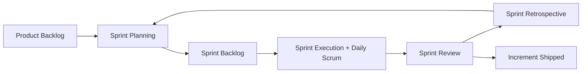
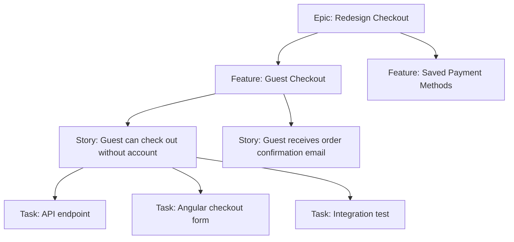
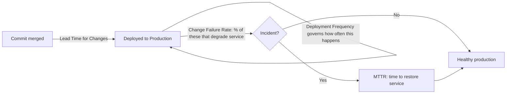
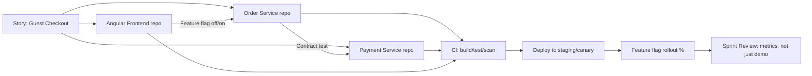
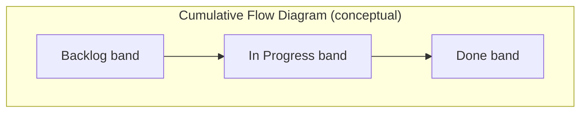

# Agile Interview Guide (Senior .NET Full-Stack / Lead Level)

Consolidated from personal notes ("Agile & Requirements Interview Q&A" and "Advanced Agile Interview Questions — 5+ Years Exp"). Restructured, de-duplicated, fully answered, and expanded with senior-level gap topics for a 10-year .NET full-stack developer prepping for lead/senior interviews.

## Table of Contents

- [Core Concepts](#core-concepts)
  - [What is Agile?](#what-is-agile)
  - [What is Scrum?](#what-is-scrum)
  - [What is a User Story?](#what-is-a-user-story)
  - [Functional vs Technical (Non-Functional) Requirements](#functional-vs-technical-non-functional-requirements)
  - [Who Defines Functional vs Technical Requirements](#who-defines-functional-vs-technical-requirements)
  - [Core Scrum Ceremonies](#core-scrum-ceremonies)
  - [Definition of Done (DoD)](#definition-of-done-dod)
  - [Backlog Refinement](#backlog-refinement)
  - [Agile vs Waterfall](#agile-vs-waterfall)
- [Intermediate Concepts](#intermediate-concepts)
  - [Story Point Estimation](#story-point-estimation)
  - [Handling Changing Requirements](#handling-changing-requirements)
  - [Definition of Ready (DoR)](#definition-of-ready-dor)
  - [[new content] DoD vs DoR — Why Both Matter](#new-content-dod-vs-dor--why-both-matter)
  - [Epic vs Feature vs Story vs Task](#epic-vs-feature-vs-story-vs-task)
  - [INVEST Principle for User Stories](#invest-principle-for-user-stories)
  - [Cross-Functional Teams](#cross-functional-teams)
  - [Agile Documentation Philosophy](#agile-documentation-philosophy)
- [Advanced Concepts](#advanced-concepts)
  - [Scrum vs Kanban](#scrum-vs-kanban)
  - [[new content] Scrum vs Kanban vs SAFe vs Scrumban](#new-content-scrum-vs-kanban-vs-safe-vs-scrumban)
  - [Handling Scope Change Mid-Sprint](#handling-scope-change-mid-sprint)
  - [Velocity and Its Use](#velocity-and-its-use)
  - [[new content] Velocity vs Throughput vs Cycle Time](#new-content-velocity-vs-throughput-vs-cycle-time)
  - [Managing Technical Debt in Agile](#managing-technical-debt-in-agile)
  - [Backlog Prioritization](#backlog-prioritization)
  - [[new content] Prioritization Frameworks (WSJF, MoSCoW, Kano, RICE)](#new-content-prioritization-frameworks-wsjf-moscow-kano-rice)
  - [Agile Metrics](#agile-metrics)
  - [[gaps] DORA Metrics](#gaps-dora-metrics)
  - [Handling Blockers](#handling-blockers)
  - [Role of the Developer in Estimation](#role-of-the-developer-in-estimation)
  - [[new content] Estimation Techniques Beyond Planning Poker](#new-content-estimation-techniques-beyond-planning-poker)
  - [When Sprint Goals Are Not Achieved](#when-sprint-goals-are-not-achieved)
  - [Real-World Challenge: PO Adds Urgent Work Mid-Sprint](#real-world-challenge-po-adds-urgent-work-mid-sprint)
  - [[new content] Agile in a Microservices / CI-CD Context](#new-content-agile-in-a-microservices--cicd-context)
  - [[new content] Scaling Agile: SAFe, LeSS, and Spotify Model](#new-content-scaling-agile-safe-less-and-spotify-model)
- [Best Practices](#best-practices)
- [[new content] Agile Anti-Patterns](#new-content-agile-anti-patterns)
- [Common Pitfalls](#common-pitfalls)
- [[new content] Agile Metrics Dashboards and Reporting to Leadership](#new-content-agile-metrics-dashboards-and-reporting-to-leadership)
- [Sample Interview Q&A](#sample-interview-qa)
- [Summary of Additions](#summary-of-additions)
- [Summary of \[gaps\] Additions (This Pass)](#summary-of-gaps-additions-this-pass)

---

## Core Concepts

### What is Agile?

Agile is an iterative and incremental approach to software development where work is delivered in small cycles (sprints/iterations), with continuous feedback, collaboration, and adaptability to change. It is a *mindset and set of values* (see the Agile Manifesto: individuals and interactions over processes and tools; working software over comprehensive documentation; customer collaboration over contract negotiation; responding to change over following a plan) — Scrum, Kanban, XP, and SAFe are all *frameworks/methodologies that implement* that mindset.

**Senior-level nuance:** Interviewers at the 10-year mark rarely want the textbook definition — they want to see that you understand Agile is a *philosophy*, not a rigid process, and that you can articulate when strict-by-the-book Scrum is the wrong tool (e.g., a small maintenance team supporting a legacy system is often better served by Kanban than by sprints).

### What is Scrum?

Scrum is an Agile framework where development happens in fixed-length sprints (typically 1–4 weeks, most commonly 2). It defines:

- **Roles**: Product Owner, Scrum Master, Development Team (in Scrum Guide 2020+, "Developers" — the PO and SM are not separate from "the Scrum Team," they're part of it).
- **Artifacts**: Product Backlog, Sprint Backlog, Increment.
- **Ceremonies (Events)**: Sprint Planning, Daily Scrum, Sprint Review, Sprint Retrospective, and the Sprint itself as a container event.



### What is a User Story?

A simple description of a feature from the end user's perspective, used to capture requirements in a lightweight, conversation-driving format rather than an exhaustive spec.

**Format:**
```
As a [user/role], I want [feature/capability], so that [benefit/value].
```

**Senior nuance:** A user story is a *placeholder for a conversation*, not a contract. Interviewers may probe whether you know the difference between a story and a fully-specified requirement — the acceptance criteria (often in Given/When/Then / Gherkin format) is what actually makes it testable and "done."

```gherkin
Given a registered user on the login page
When they submit valid credentials
Then they are redirected to the dashboard
And a session token is issued
```

### Functional vs Technical (Non-Functional) Requirements

**Functional Requirements** describe *what* the system should do — the features it must provide.

Examples: user login, add to cart, generate report, reset password.

**Technical (Non-Functional) Requirements** describe *how* the system should perform — quality attributes like performance, security, scalability, and technology constraints.

Examples: API response under 500ms, data encryption at rest/in transit, support for 10,000 concurrent users, mandated use of Angular + .NET stack.

| Aspect | Functional Requirement | Non-Functional Requirement |
|---|---|---|
| Answers | What does the system do? | How well does the system do it? |
| Example | User can reset password | Password reset email must send within 2s |
| Testing | Behavioral/acceptance tests | Load, security, performance, chaos tests |
| Owner (typical) | BA / Product Owner | Architect / Tech Lead |
| Visibility to end user | Directly visible | Often invisible unless violated |

### Who Defines Functional vs Technical Requirements

- **Functional requirements**: Business Analyst or Product Owner, with input from stakeholders and end users.
- **Technical requirements**: Architect, Tech Lead, or the Development Team, based on system design, NFRs (non-functional requirements), and platform constraints.

**Senior nuance interviewers probe for:** In mature teams, this isn't a hard wall — developers should be pushing back on functional requirements when they have technical implications (e.g., "this feature as described won't scale past X users without a redesign"), and POs should understand enough technical constraint to prioritize NFR work. The best senior engineers *translate* business requirements into technical ones and surface trade-offs early, not after the sprint starts.

### Core Scrum Ceremonies

**Sprint Planning** — A meeting where the team selects backlog items (usually from a refined, prioritized backlog) and plans the work for the upcoming sprint. Produces a Sprint Goal and Sprint Backlog.

**Daily Standup (Daily Scrum)** — A short (≤15 min), timeboxed daily sync. Classic three questions:
- What was done yesterday?
- What will be done today?
- Any blockers?

> **Senior nuance:** The "3 questions" format is now considered somewhat dated by the Scrum Guide itself — modern guidance frames the Daily Scrum around inspecting progress toward the *Sprint Goal* and re-planning, not a status report to the Scrum Master. If asked, mention this shift — it signals you keep current with the framework rather than reciting 2011-era Scrum.

**Sprint Review** — End-of-sprint demo of the increment to stakeholders, used to inspect the product and adapt the backlog. Not just a demo — it's a collaborative working session.

**Sprint Retrospective** — Held after the sprint (after review, before next planning) to discuss what went well, what didn't, and concrete improvement actions for the *process* (not the product).

### Definition of Done (DoD)

A shared, team-agreed checklist ensuring a backlog item is truly complete — coded, tested, reviewed, integrated, documented as needed, and potentially shippable. Typical DoD for a .NET/Angular shop:

- Code complete and merged to main/trunk
- Unit tests written and passing (coverage threshold met)
- Code review / PR approved
- Integration tests pass in CI pipeline
- No new critical/high static-analysis or security findings (SonarQube, etc.)
- Deployed and verified in a test/staging environment
- Acceptance criteria verified against the story
- Documentation/README/API contract updated if applicable

**Gotcha:** DoD is a *team-wide, per-increment* standard applied to every story. It should not be renegotiated story-by-story — if it is, it signals a maturity problem the interviewer wants to hear you diagnose.

### Backlog Refinement

The ongoing process (also called "grooming") of reviewing, clarifying, splitting, estimating, and re-prioritizing backlog items *before* they enter a sprint. Usually a recurring event (e.g., weekly, mid-sprint) rather than a one-time activity — this keeps the top of the backlog always "sprint-ready."

### Agile vs Waterfall

| Aspect | Agile | Waterfall |
|---|---|---|
| Delivery | Iterative, incremental (every sprint) | Sequential, delivered at the end |
| Requirements | Evolve, embrace change | Fixed upfront, change is costly |
| Feedback loop | Continuous (every sprint/demo) | Only at the end (or major milestones) |
| Risk | Discovered/mitigated early | Discovered late, expensive to fix |
| Documentation | Lightweight, just enough | Heavy, comprehensive upfront |
| Best fit | Uncertain/evolving requirements, digital products | Fixed-scope, regulatory/contractual, hardware-coupled projects |

---

## Intermediate Concepts

### Story Point Estimation

A relative (not absolute) estimation method sizing stories by complexity, effort, uncertainty, and risk — not literal hours. Commonly uses a Fibonacci-like scale (1, 2, 3, 5, 8, 13, 21…) because the widening gaps force meaningful differentiation between larger, less-understood items rather than false precision.

**Why Fibonacci/relative sizing, not hours:** Humans are bad at absolute time estimation but good at relative comparison ("is this bigger or smaller than that story we did last week?"). It also decouples estimation from any single developer's speed, which matters once velocity is used across a team.

### Handling Changing Requirements

Agile expects change. Changes are accepted and managed through **backlog reprioritization by the Product Owner** — new/changed requirements become new or modified backlog items, re-ranked against everything else, rather than injected disruptively into a locked sprint. The team is protected from churn *within* an active sprint; the *backlog* absorbs the change between sprints.

### Definition of Ready (DoR)

Criteria a story must satisfy before it's allowed into a sprint (i.e., before Sprint Planning pulls it in):

- Clear, testable acceptance criteria
- Dependencies identified and ideally resolved/sequenced
- Estimated by the team
- Small enough to complete within a sprint
- UX/designs attached if relevant
- No open questions blocking implementation

### [new content] DoD vs DoR — Why Both Matter

This distinction is a favorite senior-interview trap because candidates often only know one of the two.

| | Definition of Ready (DoR) | Definition of Done (DoD) |
|---|---|---|
| Applies to | A story *before* it enters a sprint | A story/increment *after* work is complete |
| Purpose | Prevents starting on ill-defined work | Prevents calling unfinished/untested work "done" |
| Owned by | Team, enforced mainly by PO + team during refinement | Team, enforced during review/PR/CI |
| Failure mode if missing | Mid-sprint churn, blocked stories, re-estimation | "Done" work that isn't shippable, hidden technical debt, QA surprises |

**Why it matters for a senior/lead:** DoR failures are usually a *refinement* discipline problem; DoD failures are usually a *quality/engineering* discipline problem. Being able to diagnose which one is broken (and fix the right ceremony) is exactly the kind of judgment a lead is expected to have.

### Epic vs Feature vs Story vs Task

- **Epic** = Large initiative, spans multiple sprints/releases, often maps to a business goal (e.g., "Redesign checkout flow").
- **Feature** = A functional grouping within an epic, still potentially multi-sprint (e.g., "Guest checkout").
- **Story** = A user-focused, sprint-sized requirement with acceptance criteria (e.g., "As a guest, I want to check out without an account").
- **Task** = Technical, implementation-level work, usually a sub-unit of a story (e.g., "Add `GuestCheckoutController` endpoint", "Write EF Core migration for `GuestOrder` table").



### INVEST Principle for User Stories

A checklist for writing well-formed stories:

- **I**ndependent — can be developed/delivered without hard sequencing on other stories
- **N**egotiable — details are open for discussion, not a rigid contract
- **V**aluable — delivers clear value to a user or the business
- **E**stimable — team has enough clarity to size it
- **S**mall — fits comfortably within a sprint
- **T**estable — has clear, verifiable acceptance criteria

### Cross-Functional Teams

A team with all the skills needed to take a feature from idea to production without depending on an external team for every increment — typically developers, QA, UX/UI, and DevOps, sometimes embedded DBAs/SREs.

**Senior nuance:** the point of cross-functional teams is to minimize *hand-off latency* and *queueing* between specialties — every hand-off to another team introduces wait time and context loss. Interviewers may ask how you'd structure a team when full cross-functionality isn't possible (e.g., a shared DBA/security team) — the answer is usually embedding a rotating liaison or building explicit SLAs with that shared team, not ignoring the constraint.

### Agile Documentation Philosophy

Agile favors "just enough" documentation over comprehensive upfront specs — "working software over comprehensive documentation" (Agile Manifesto), but this is frequently misquoted as "no documentation." In practice for a .NET/Angular shop: living API contracts (OpenAPI/Swagger), ADRs (Architecture Decision Records) for significant technical decisions, and story-level acceptance criteria typically *replace* large requirement documents — they don't eliminate documentation, they make it lighter, more current, and closer to the code.

---

## Advanced Concepts

### Scrum vs Kanban

| Aspect | Scrum | Kanban |
|---|---|---|
| Cadence | Fixed-length sprints | Continuous flow, no fixed iteration |
| Roles | Defined (PO, SM, Dev Team) | No prescribed roles |
| Ceremonies | Sprint planning, standup, review, retro | Optional; often just a standup + periodic replenishment |
| Work commitment | Commit to a sprint's worth of items | Pull work continuously as capacity frees up |
| Key constraint | Sprint length/capacity | **WIP (Work-In-Progress) limits** per column |
| Change mid-cycle | Discouraged mid-sprint | Naturally accommodated |
| Best fit | Product teams with plannable feature work | Support/ops/maintenance teams, unpredictable inflow |
| Core metric | Velocity (points/sprint) | Cycle time / lead time, throughput |

### [new content] Scrum vs Kanban vs SAFe vs Scrumban

This is a very common senior/lead-level question because it tests whether you can pick the right framework rather than cargo-culting Scrum everywhere.

| Framework | Best for | Trade-off |
|---|---|---|
| **Scrum** | Product teams building new features with plannable scope | Rigid cadence can be a poor fit for interrupt-driven work (support, ops) |
| **Kanban** | Support/maintenance teams, ops, unpredictable inbound work | Lacks built-in cadence for retros/planning unless deliberately added |
| **Scrumban** | Teams transitioning from Scrum to flow-based work, or teams with both planned feature work and unplanned support tickets | Hybrid — sprints + WIP limits; can feel like "neither" if not tuned |
| **SAFe (Scaled Agile Framework)** | Large orgs (50+ engineers, multiple teams) needing cross-team coordination and portfolio alignment | Heavyweight; risks becoming "Waterfall in Agile clothing" if PI Planning turns into big upfront planning |

**Interviewer follow-up to expect:** "You've used Scrum — when would you *not* use it?" Good answer: a production-support/BAU team with constant unplanned interrupts is a poor fit for 2-week sprint commitments; Kanban with WIP limits and SLA-based classes of service fits better. Also: early-stage discovery/spike work sometimes fits better under a Kanban-style flow than being forced into a sprint box.

### Handling Scope Change Mid-Sprint

Scope changes should ideally be avoided during an active sprint — the sprint is a protected commitment. If a change is truly required:

1. Product Owner re-evaluates priority against the sprint goal.
2. Team discusses impact (capacity, dependencies, risk).
3. Either the item is added to the *next* sprint, or an existing (lower-value) item is *swapped out* if the new item is critical enough — you don't just pile more work onto the sprint.

**Gotcha interviewers look for:** candidates who say "we just squeeze it in." The correct instinct is trade-off, not addition — protecting the sprint's integrity and the team's sustainable pace.

### Velocity and Its Use

Velocity is the amount of work (in story points) a team completes in a sprint, averaged over recent sprints. Used for:

- Sprint planning (how much to pull in)
- Predicting delivery timelines/release forecasting
- Capacity/staffing conversations

**Gotcha (very common senior trap):** Velocity is a *team-specific, relative* planning tool — never a productivity or performance metric, and never comparable across teams (different teams calibrate points differently). Using velocity to compare people or teams is a textbook Agile anti-pattern and a red flag if a candidate endorses it.

### [new content] Velocity vs Throughput vs Cycle Time

A senior interviewer will often ask you to distinguish these because it reveals whether you understand flow metrics beyond Scrum-specific ones.

| Metric | Definition | Framework | What it tells you |
|---|---|---|---|
| **Velocity** | Story points completed per sprint | Scrum | Capacity for *planning* future sprints (same team only) |
| **Throughput** | Number of items (regardless of size) completed per unit time | Kanban/flow | Predictability of delivery rate, independent of estimation |
| **Cycle Time** | Time from when work *starts* to when it's *done* | Kanban/flow (Little's Law: WIP = Throughput × Cycle Time) | Responsiveness/flow efficiency; the metric customers actually feel |
| **Lead Time** | Time from when work is *requested* to when it's *delivered* | Both | End-to-end customer-facing responsiveness, includes queue time before work starts |

**Why it matters:** Velocity can look great while cycle time balloons (team is "busy" but items sit half-done in progress due to too much WIP). A lead who only watches velocity misses this — Little's Law and WIP limits are the actual lever to fix it.

### Managing Technical Debt in Agile

- Add technical debt items explicitly to the backlog (make it visible — invisible debt never gets prioritized).
- Allocate dedicated sprint capacity for refactoring (a common pattern: reserve 10–20% of each sprint, or dedicate periodic "tech debt sprints").
- Improve code quality continuously via code reviews, static analysis (SonarQube/Roslyn analyzers), and automated tests, rather than relying on big-bang cleanup efforts.
- Tie debt items to business impact where possible ("this debt is slowing feature X by Y%") — makes it easier for a PO to prioritize against feature work.

**Senior nuance:** the interviewer wants to hear that you *quantify and communicate* tech debt in terms a PO/stakeholder cares about (velocity drag, incident rate, onboarding time for new devs), not just "we need to refactor because it's messy."

### Backlog Prioritization

Process where the Product Owner orders backlog items based on:

- Business value
- Risk
- Dependencies
- Customer needs

### [new content] Prioritization Frameworks (WSJF, MoSCoW, Kano, RICE)

The original notes name the *inputs* to prioritization (value, risk, dependencies) but not the *frameworks* used to formalize it — a common senior-interview gap.

- **WSJF (Weighted Shortest Job First)** — used heavily in SAFe: `WSJF = Cost of Delay / Job Size`. Cost of Delay = user/business value + time criticality + risk reduction/opportunity enablement. Favors high-value, low-effort, time-sensitive work.
- **MoSCoW** — Must have / Should have / Could have / Won't have. Simple, good for scope negotiation and MVP definition.
- **Kano Model** — classifies features as Basic (expected), Performance (more is better), Delighters (unexpected value), and Indifferent/Reverse. Useful for UX-driven prioritization discussions.
- **RICE** — `Score = (Reach × Impact × Confidence) / Effort`. Popular in product-led orgs; forces explicit confidence estimation, which surfaces assumption risk.

**Interviewer angle:** naming WSJF specifically signals SAFe/scaled-Agile exposure, which is increasingly common in enterprise .NET shops.

### Agile Metrics

- Velocity
- Burn-down chart (remaining work vs time within a sprint/release)
- Cycle time
- Lead time
- Sprint predictability (committed vs completed)

*(See [new content] additions above for throughput and Little's Law, and below for dashboard/reporting nuance.)*

### [gaps] DORA Metrics

The Agile Metrics list above (velocity, burn-down, cycle time, lead time, sprint predictability) is Scrum/flow-focused. A gap-analysis review flagged that this guide never mentions **DORA metrics**, which have become the industry-standard way engineering *organizations* (not just individual teams) measure delivery performance — and a near-certain topic in any senior/lead interview that touches DevOps maturity, not just Agile ceremonies.

**Origin**: DORA (DevOps Research and Assessment) is the Google-run research program (now part of Google Cloud) that, via years of large-scale survey data across thousands of organizations, identified four metrics that correlate most strongly with high-performing software delivery organizations — distinct from Scrum-specific metrics because they're framework-agnostic and measure outcomes at the *delivery pipeline* level, applicable whether a team runs Scrum, Kanban, or something else entirely.

**The four key metrics:**

| Metric | Definition | What it measures |
|---|---|---|
| **Deployment Frequency** | How often an organization successfully releases to production | Batch size / release cadence — elite performers deploy on-demand (multiple times per day); low performers deploy less than once per month |
| **Lead Time for Changes** | Time from a commit being merged to that change running successfully in production | End-to-end delivery pipeline speed — distinct from the Agile "Lead Time" metric (request-to-delivery for a *story*); DORA's version is specifically commit-to-production, a CI/CD pipeline efficiency measure |
| **Change Failure Rate** | Percentage of deployments to production that result in a degraded service requiring remediation (rollback, hotfix, patch) | Deployment quality/risk — not "bugs found in testing," specifically failures that manifest *after* reaching production |
| **Mean Time to Recovery (MTTR)** | How long it takes to restore service after a production incident/failure | Resilience/operational recovery capability — a *reliability engineering* metric, not a development-speed one |



**Why these four, and why they're the standard**: DORA's research found these four metrics cluster into two axes that matter independently — **throughput** (Deployment Frequency + Lead Time for Changes: how fast can you ship) and **stability** (Change Failure Rate + MTTR: how safely can you ship) — and, critically, the research found that high-performing orgs are strong on *both* axes simultaneously; speed and stability are not actually a trade-off at the elite-performer level, which contradicts the intuitive assumption that "moving faster means breaking more things." This finding is itself a strong thing to cite in an interview — it reframes "we need to slow down to be safe" as a sign of *low* DevOps maturity, not caution.

**How DORA metrics connect to Agile ceremonies and backlog health** — this is the senior-level synthesis point a gap-analysis-driven interview question would be probing for, and the reason this topic belongs in an Agile guide rather than purely a DevOps one:

- **A team can have great velocity but poor MTTR, and velocity alone won't surface that** — velocity measures story points completed per sprint; it says nothing about what happens to those stories once they reach production. A team can be shipping a high, healthy-looking velocity every sprint while quietly accumulating production instability (rising Change Failure Rate, lengthening MTTR) that the Scrum-level metrics never expose. This is exactly the blind spot DORA metrics are meant to close — they measure what happens *after* "Done," which Scrum's own artifacts (burn-down, velocity) structurally don't cover.
- **Retrospectives should look at DORA trends, not just sprint-level velocity** — a lead who only reviews velocity/burn-down in retro is optimizing for throughput of *work started*, not health of *work delivered*. Pulling Change Failure Rate and MTTR trends into the retro (or a dedicated reliability review) surfaces exactly the "busy but fragile" pattern that plain Agile metrics miss.
- **Backlog health ties in directly**: a rising Change Failure Rate or lengthening MTTR is itself a backlog-prioritization signal — it should generate technical-debt/reliability backlog items (see [Managing Technical Debt in Agile](#managing-technical-debt-in-agile) above) with real priority, not be treated as a separate "ops problem" divorced from the product backlog. A PO who doesn't see DORA trends has no way to weigh "one more feature" against "we need to invest in deployment safety" with real data.
- **Deployment Frequency as a proxy for batch size health**: low deployment frequency usually means large, risky batches (ties back to this candidate's Deployment Strategies knowledge — big-bang releases vs. small, frequent, low-risk ones) — and large batches are themselves a leading indicator of *future* Change Failure Rate problems, not just a speed metric in isolation.
- **Practical senior framing for an interview**: "Velocity tells you if the team is predictable at *starting and finishing* work inside a sprint. DORA tells you if that work is actually *safe and fast to ship*. A lead needs both — a team optimizing only for velocity can look highly productive on a burn-down chart while DORA metrics quietly reveal a fragile, slow-to-recover production system underneath."

### Handling Blockers

- Raise immediately in daily standup — don't wait.
- Collaborate with the team first (pair up, unblock via peer knowledge).
- Escalate via the Scrum Master if the blocker is external/organizational (e.g., waiting on another team, infra access, a vendor).

### Role of the Developer in Estimation

- Participate actively in planning poker / estimation sessions.
- Provide technical complexity and risk insight the PO can't (e.g., "this touches a legacy payment integration, that's a hidden 5, not a 2").
- Break stories into technical tasks during sprint planning.

### [new content] Estimation Techniques Beyond Planning Poker

Notes only mention planning poker and Fibonacci story points. Senior interviews often probe whether you know alternatives and when to use them:

- **Planning Poker** — classic, discussion-driven consensus estimation; good for calibration and surfacing hidden complexity through discussion.
- **T-Shirt Sizing (XS/S/M/L/XL)** — fast, coarse-grained; good for early backlog/epic-level sizing before detailed refinement.
- **Affinity Estimation / Silent Grouping** — team silently places stories into relative-size buckets without discussion first, then discusses outliers only — much faster for large backlogs (e.g., 50+ stories in a quarterly planning session).
- **Bucket System** — similar to affinity, with predefined point buckets, used for very large-scale estimation (SAFe PI Planning).
- **#NoEstimates movement** — an intentionally provocative counter-approach: instead of estimating story points, slice stories small enough that they're all roughly similar size, and use *throughput* (item count/week) for forecasting instead of point-based velocity. Worth mentioning to show awareness of estimation critique/debate, even if your team doesn't practice it — it signals you understand estimation is a means, not an end.

### When Sprint Goals Are Not Achieved

- Analyze root cause during the retrospective — don't just note it and move on.
- Distinguish *planning/estimation* failures (over-committed, poor refinement) from *execution* failures (unexpected complexity, blockers, absenteeism) from *external* failures (dependency delays, environment issues).
- Adjust future planning — e.g., tighten DoR, add buffer for known risk categories, address the specific root cause rather than generically "estimating more conservatively."
- If it's a repeated pattern, that's itself a signal for the Scrum Master to address as a systemic issue, not a one-off retro action item.

### Real-World Challenge: PO Adds Urgent Work Mid-Sprint

- Discuss impact with the team openly (capacity, current commitments, risk to sprint goal).
- Evaluate true priority/urgency against what's already committed — "urgent" from the PO's perspective doesn't automatically override the sprint.
- Resolution is a *trade*, not an addition: either replace an existing (lower-priority) item, or defer the new work to the next sprint unless it's genuinely sprint-goal-threatening (e.g., a production incident, which is a different category from "new urgent feature work").

**Senior nuance:** distinguish "urgent business request" from "production incident/hotfix." The latter legitimately interrupts a sprint (and most teams' DoD/process explicitly carves out an exception for P1 incidents); the former should still go through the trade-off conversation above.

### [new content] Agile in a Microservices / CI-CD Context

This is one of the most likely "modernize your Agile knowledge" gaps for a .NET dev in 2026 — the original notes describe generic Scrum ceremonies but say nothing about how Agile delivery actually works once you have microservices, trunk-based development, and CI/CD.

- **Story slicing across service boundaries**: a "vertical slice" story (e.g., "guest checkout") often spans multiple microservices/repos. Senior practice is to slice stories so each is deliverable and independently testable within *one* service/repo where possible, using contract tests (e.g., Pact) to decouple cross-service dependencies rather than forcing lockstep releases.
- **Trunk-based development + feature flags** replace long-lived feature branches in high-maturity Agile/DevOps shops — this lets a story be "done" (merged, deployed) without being *released* (exposed to users), decoupling deployment from release and enabling true continuous delivery within a sprint.
- **Definition of Done expands** to include: passes automated pipeline gates (build, unit, integration, security scan), deployed to at least a staging/canary environment, and (if flagged) verified behind a feature flag — not just "code complete."
- **Sprint Review becomes less meaningful as a release gate** — with CI/CD, software may already be in production before the review; the review shifts toward validating outcomes/metrics (e.g., A/B test results, adoption) rather than a first-time demo.
- **Cross-team dependency management** becomes the dominant coordination problem once a "story" needs coordinated changes in 3+ microservices owned by different teams — this is exactly the problem SAFe's Program Increment (PI) Planning and dependency boards try to solve at scale.



### [new content] Scaling Agile: SAFe, LeSS, and Spotify Model

The notes only describe single-team Scrum. For a 10-year candidate, "have you worked in a multi-team Agile org?" is almost guaranteed at senior/lead level.

- **SAFe (Scaled Agile Framework)** — adds Program (Agile Release Train, PI Planning every 8–12 weeks), and Portfolio layers on top of team-level Scrum/Kanban. Strength: coordinates many teams with shared roadmaps and dependencies; Weakness: can reintroduce Waterfall-like upfront planning if PI Planning isn't handled well.
- **LeSS (Large-Scale Scrum)** — extends Scrum's rules directly to multiple teams sharing one Product Backlog and one Sprint, deliberately minimizing added process/roles (unlike SAFe's many new roles). Favors "descaling" the organization over adding coordination layers.
- **Spotify Model (Squads/Tribes/Chapters/Guilds)** — not a prescriptive framework but an organizational topology emphasizing autonomous, cross-functional squads aligned to business domains, with chapters/guilds for cross-cutting skill communities. Widely referenced, but Spotify itself has publicly moved away from parts of it — good to know if asked, so you don't over-cite it as current best practice.
- **Practical senior take:** the *scaling problem* is really a *dependency-management and communication* problem — the specific framework matters less than whether the org actively manages cross-team dependencies visibly (dependency boards, PI Planning, or lightweight Scrum-of-Scrums) rather than discovering them mid-sprint.

---

## Best Practices

- Keep sprints protected — avoid mid-sprint scope injection except for genuine incidents.
- Make technical debt visible on the backlog with business-impact framing, not just "cleanup."
- Enforce DoR before Sprint Planning and DoD before calling anything "done" — both, consistently, not case-by-case.
- Use velocity only for the *same team's* forward planning — never for cross-team comparison or as a productivity metric.
- Slice stories vertically (thin end-to-end slices) rather than horizontally (all-UI story, then all-API story) so each story delivers demonstrable value.
- Automate DoD verification where possible (CI gates for tests/coverage/security scans) rather than relying on manual checklist honesty.
- Treat retrospectives as action-oriented — track action items to completion, revisit them, don't let retros become venting sessions with no follow-through.
- In scaled/multi-team contexts, make cross-team dependencies visible early (dependency boards, PI Planning) rather than discovering them at integration time.

## [new content] Agile Anti-Patterns

A gap in the original notes — recognizing anti-patterns is a strong signal of real (not just textbook) Agile experience, and interviewers love asking "what's gone wrong with Agile on a team you were on?"

- **Water-Scrum-Fall** — Scrum ceremonies bolted onto an org that still does upfront big design and a hardening/UAT phase at the end; sprints become status theater, not real iterative delivery.
- **Zombie Scrum** — team goes through the motions (standups, retros) without any real inspect-and-adapt; retro action items never change anything.
- **Velocity as a productivity metric / point inflation** — teams inflate story points over time to show "improving" velocity, or management compares velocity across teams, incentivizing gaming instead of honest estimation.
- **Standup as status report to management** — turns the Daily Scrum into a top-down reporting ritual instead of a peer-to-peer re-planning session, killing psychological safety.
- **PO-as-bottleneck / absent PO** — either the PO approves every micro-decision (bottleneck) or is unavailable for clarification (team blocked/guessing), both violate the collaborative intent of the role.
- **Scope creep disguised as "just one more thing"** — small additions mid-sprint that individually seem harmless but cumulatively blow the sprint goal; the fix is the same trade-off discipline covered above, applied consistently.
- **Retrospective without action** — identifying problems repeatedly without assigning owners/deadlines to improvement actions.
- **Estimation theater** — running planning poker for form's sake while a manager has already committed a delivery date externally, making the estimate meaningless.
- **Copy-pasted "Agile at scale"** — adopting SAFe/LeSS terminology and ceremonies wholesale without addressing the underlying dependency/communication problem they're meant to solve.

## Common Pitfalls

- Treating story points as hours (breaks relative estimation and cross-team comparability).
- Letting the Sprint Review become "just a demo" instead of a genuine inspect-and-adapt session with stakeholders.
- Skipping backlog refinement, leading to under-specified stories entering sprint planning (DoR violated).
- Conflating Definition of Done with acceptance criteria — DoD is story-agnostic and team-wide; acceptance criteria are story-specific.
- Ignoring technical debt until it causes a production incident, rather than continuously tracking and paying it down.
- Using Scrum dogmatically for work (e.g., pure support/ops) that fits a flow-based (Kanban) model far better.
- Overloading a sprint because "the team said yes" under pressure, rather than respecting capacity/velocity data.

## [new content] Agile Metrics Dashboards and Reporting to Leadership

A thin spot in the original notes: metrics are listed, but not *how a senior/lead uses them when reporting upward*, which is a realistic lead-level interview question ("How do you report team health/progress to a VP who doesn't care about story points?").

- Translate team-level metrics (velocity, burn-down) into business-facing ones for leadership: **predictability** (committed vs delivered %), **lead time to production** (how fast can we ship a change once decided), and **defect escape rate** (quality signal), rather than raw point counts leadership can't interpret.
- Beware Goodhart's Law ("when a measure becomes a target, it ceases to be a good measure") — publishing velocity to leadership almost always leads to point inflation; consider reporting throughput/cycle-time trends instead, which are harder to game.
- Cumulative Flow Diagrams (CFDs) are undervalued in most .NET shops' reporting but are excellent for visually showing leadership *where work is stuck* (a widening "in progress" band signals a bottleneck) without needing them to understand story points at all.



---

## Sample Interview Q&A

**Q: Walk me through how you'd introduce Scrum to a team curren