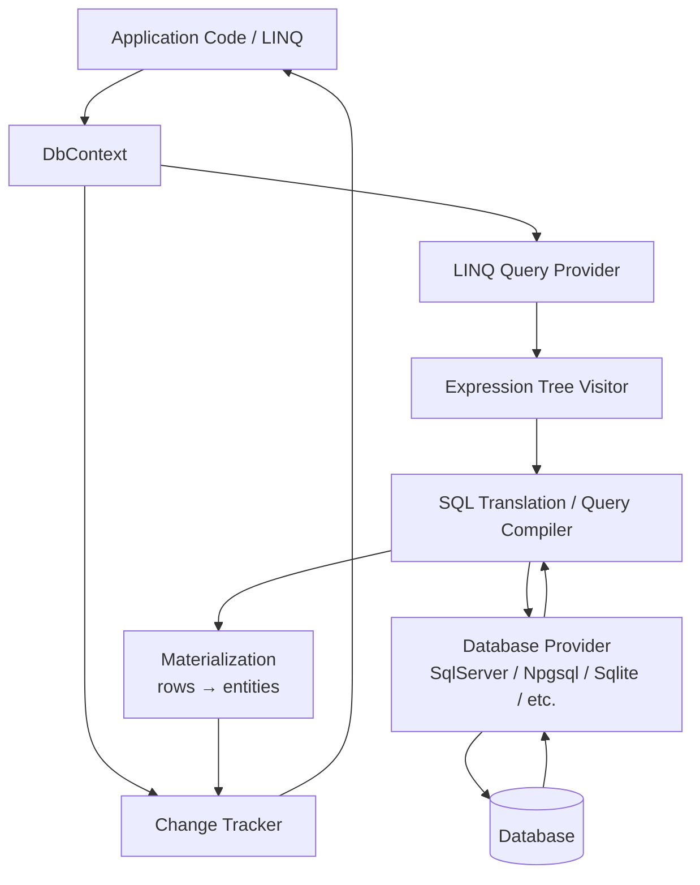
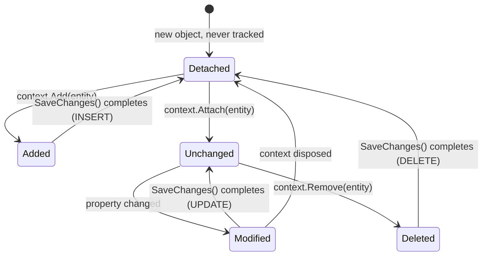
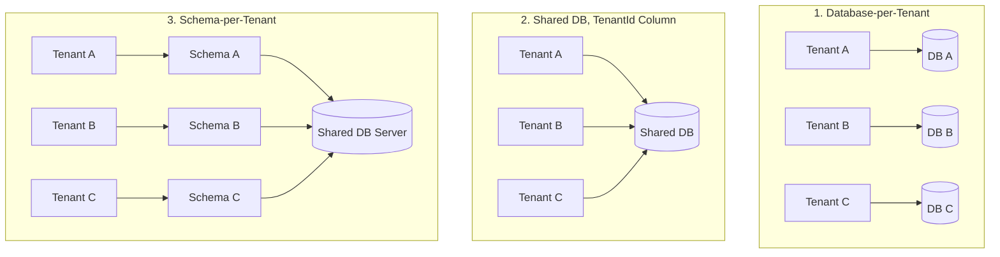

# EF Core – Senior/Lead Interview Guide

> Consolidated from personal notes + gap-filled for senior .NET interviews (2026, EF Core 8/9 idioms).

## Table of Contents

- [1. Core Concepts](#1-core-concepts)
  - [1.1 What is EF Core and Why It Exists](#11-what-is-ef-core-and-why-it-exists)
  - [1.2 DbContext](#12-dbcontext)
  - [1.3 Entity, DbSet, and Conventions](#13-entity-dbset-and-conventions)
  - [1.4 EF Core Architecture](#14-ef-core-architecture)
  - [1.5 LINQ, Query Translation, and Deferred Execution](#15-linq-query-translation-and-deferred-execution)
- [2. Change Tracking](#2-change-tracking)
  - [2.1 Entity States and the Change Tracker](#21-entity-states-and-the-change-tracker)
  - [2.2 [new content] Change Tracker Internals — Snapshots vs Proxies](#22-new-content-change-tracker-internals--snapshots-vs-proxies)
  - [2.3 AsNoTracking vs AsNoTrackingWithIdentityResolution](#23-asnotracking-vs-asnotrackingwithidentityresolution)
  - [2.4 SaveChanges Internals](#24-savechanges-internals)
- [3. Relationships and Loading Strategies](#3-relationships-and-loading-strategies)
  - [3.1 Relationship Types & Configuration](#31-relationship-types--configuration)
  - [3.2 Eager, Lazy, and Explicit Loading](#32-eager-lazy-and-explicit-loading)
  - [3.3 [new content] Split Queries vs Single Query for Collection Includes](#33-new-content-split-queries-vs-single-query-for-collection-includes)
  - [3.4 [new content] The N+1 Problem — Spotting and Fixing It](#34-new-content-the-n1-problem--spotting-and-fixing-it)
- [4. Migrations](#4-migrations)
  - [4.1 Migration Fundamentals](#41-migration-fundamentals)
  - [4.2 [new content] Migrations in a Team / CI-CD Workflow](#42-new-content-migrations-in-a-team--cicd-workflow)
  - [4.3 Migration Disaster Recovery Scenarios](#43-migration-disaster-recovery-scenarios)
- [5. Intermediate Topics](#5-intermediate-topics)
  - [5.1 Concurrency Handling](#51-concurrency-handling)
  - [5.2 Transactions](#52-transactions)
  - [5.3 [new content] Shadow Properties](#53-new-content-shadow-properties)
  - [5.4 [new content] Value Converters and Owned Types](#54-new-content-value-converters-and-owned-types)
  - [5.5 [new content] Global Query Filters](#55-new-content-global-query-filters)
  - [5.6 [gaps] Multi-Tenancy Architectures — Which One Would You Choose?](#56-gaps-multi-tenancy-architectures--which-one-would-you-choose)
- [6. Advanced Topics](#6-advanced-topics)
  - [6.1 [new content] DbContext Pooling](#61-new-content-dbcontext-pooling)
  - [6.2 [new content] Compiled Queries](#62-new-content-compiled-queries)
  - [6.3 [new content] EF Core Interceptors](#63-new-content-ef-core-interceptors)
  - [6.4 [new content] Bulk Operations — ExecuteUpdate / ExecuteDelete](#64-new-content-bulk-operations--executeupdate--executedelete)
  - [6.5 [new content] EF Core vs Dapper — Choosing Deliberately](#65-new-content-ef-core-vs-dapper--choosing-deliberately)
- [7. Performance Best Practices](#7-performance-best-practices)
- [8. Common Pitfalls / Real Production Mistakes](#8-common-pitfalls--real-production-mistakes)
- [9. Troubleshooting Scenarios (Interview Style)](#9-troubleshooting-scenarios-interview-style)
- [10. Sample Interview Q&A](#10-sample-interview-qa)
- [11. One-Minute Interview Summaries](#11-one-minute-interview-summaries)
- [Summary of Additions](#summary-of-additions)
- [Summary of \[gaps\] Additions (This Pass)](#summary-of-gaps-additions-this-pass)

---

## 1. Core Concepts

### 1.1 What is EF Core and Why It Exists

EF Core is Microsoft's ORM (Object-Relational Mapper) for .NET. It lets you work with a relational database using C# objects instead of raw SQL, handling SQL generation, connection management, change tracking, and relationship mapping for you.

**Without EF Core:**
```sql
SELECT * FROM Users WHERE Id = 1
```

**With EF Core:**
```csharp
var user = context.Users.Find(1);
```

**Why it exists (the "why" an interviewer wants):**
- Removes repetitive boilerplate SQL and manual row↔object mapping.
- Centralizes schema evolution via migrations (version control for the DB).
- Provides a LINQ-based, strongly-typed query surface that's refactor-safe (rename a property, get compiler errors instead of silently broken SQL strings).
- Trade-off: you give up some query control and add an abstraction layer — which is exactly why senior engineers must know when to drop to raw SQL/Dapper.

### 1.2 DbContext

DbContext is the central class of EF Core — a **Unit of Work** + **Repository**-like abstraction combined. It represents a session with the database.

```csharp
public class AppDbContext : DbContext
{
    public AppDbContext(DbContextOptions<AppDbContext> options) : base(options) { }

    public DbSet<User> Users { get; set; }
}
```

**Responsibilities:**
- Opens/manages the underlying connection
- Executes queries (via the LINQ provider → SQL translation pipeline)
- Tracks entity changes (Change Tracker)
- Persists changes as SQL (`SaveChanges`)
- Manages transactions

**Key interview points:**
- One `DbContext` instance = one unit of work / one logical database session.
- `DbContext` is **not thread-safe** — never share one instance across concurrent operations or requests.
- In ASP.NET Core, register with **Scoped** lifetime (one instance per HTTP request) via `AddDbContext<T>`.
- `DbContext` is lightweight to construct but **not free** — internally it wraps a connection, model cache lookup, and change tracker; that's why **pooling** exists (see [6.1](#61-new-content-dbcontext-pooling)).

### 1.3 Entity, DbSet, and Conventions

An **entity** is a POCO mapped to a table — no database logic should live inside it.

```csharp
public class User
{
    public int Id { get; set; }        // Primary key by convention
    public string Name { get; set; }
    public string Email { get; set; }
}
```

**Convention-based mapping:**
- Class name → table name (pluralized in EF Core, e.g. `User` → `Users`)
- `Id` or `<ClassName>Id` → primary key

**DbSet<T>** represents a queryable/updatable gateway to a table — it is *not* the data itself, it's an `IQueryable<T>` entry point.

```csharp
context.Users.Add(new User { Name = "John" });   // INSERT (staged)
var users = context.Users.ToList();               // SELECT
var user = context.Users.First(u => u.Id == 1);
user.Name = "Updated";                            // UPDATE (staged, tracked)
context.Users.Remove(user);                       // DELETE (staged)
context.SaveChanges();                             // flush everything above
```

**`Find()` vs `FirstOrDefault()` (classic trap):**
- `Find()` checks the change tracker **first** by primary key — if the entity is already tracked, it returns it without hitting the DB.
- `FirstOrDefault()`/`First()` **always** issues a query, regardless of tracking state.

**`Add()` vs `Attach()`:**
- `Add()` marks the entity (and its untracked graph) as `Added` → generates `INSERT`.
- `Attach()` marks the entity as `Unchanged` (tracked, no DB hit) — used when you already have an entity with a known key and want EF to track it without re-inserting. A common bug: calling `Add()` on an entity that already exists in the DB causes a duplicate-key insert; the fix is `Attach()` + explicitly setting state, or `Update()`.

### 1.4 EF Core Architecture



- The **LINQ provider** captures your expression tree (it does not execute C# delegates against the DB — it translates the *expression*, which is why arbitrary C# methods often can't be translated; see pitfall in [§9](#9-troubleshooting-scenarios-interview-style)).
- The **database provider** (SqlServer, Npgsql for PostgreSQL, Sqlite, InMemory for tests) supplies the provider-specific SQL dialect and type mappings.
- Materialized rows are handed to the **Change Tracker** if tracking is enabled.

### 1.5 LINQ, Query Translation, and Deferred Execution

```csharp
var query = context.Users.Where(u => u.Id > 5);
// No SQL executed yet — query is an expression tree (IQueryable<User>)

var list = query.ToList();
// SQL executes NOW
```

**Deferred execution** is one of the most commonly probed concepts: a query is not sent to the database until a terminal operator is invoked — `ToList()`, `ToArray()`, `First()`, `FirstOrDefault()`, `Single()`, `Count()`, `Any()`, `Sum()`, foreach enumeration, etc.

**Common LINQ → SQL mapping:**

| LINQ | SQL Equivalent |
|---|---|
| `Where` | `WHERE` |
| `Select` | `SELECT` (projection) |
| `First`/`FirstOrDefault` | `SELECT TOP(1)` / `LIMIT 1` |
| `Any` | `EXISTS` |
| `Count` | `COUNT` |
| `OrderBy`/`Skip`/`Take` | `ORDER BY` / `OFFSET` / `FETCH NEXT` |

**Projection is a first-class performance tool**, not just syntax sugar:
```csharp
var names = context.Users.Select(u => u.Name).ToList(); // only Name column fetched
```

**Gotcha:** calling `.ToList()` too early materializes the full result set into memory, and any further LINQ (`.Where`, `.OrderBy`) after that runs client-side in memory — not as SQL. This is a favorite "spot the bug" interview trap:
```csharp
// BAD — pulls entire table into memory, then filters in-process
context.Users.ToList().Where(u => u.IsActive);

// GOOD — filter translated to SQL, only matching rows come back
context.Users.Where(u => u.IsActive).ToList();
```

---

## 2. Change Tracking

### 2.1 Entity States and the Change Tracker

EF Core tracks every entity it materializes (unless told not to), recording original values, current values, and an explicit state.



| State | Meaning | SQL on SaveChanges |
|---|---|---|
| `Added` | New entity, not yet in DB | `INSERT` |
| `Modified` | Tracked entity with changed property values | `UPDATE` |
| `Deleted` | Marked for removal | `DELETE` |
| `Unchanged` | Tracked, no detected changes | none |
| `Detached` | Not tracked by this context at all | none |

```csharp
var user = context.Users.First(u => u.Id == 1);
user.Name = "Updated Name";
context.SaveChanges();
// UPDATE Users SET Name = 'Updated Name' WHERE Id = 1
// No explicit "update" call needed — EF diffs current vs original values.
```

**Interview traps:**
- ❌ "EF updates every column automatically." ✔ EF generates `UPDATE` statements only for **changed** columns (based on the snapshot comparison), unless you've configured full-column updates.
- ❌ "Tracking is free." ✔ Tracking has real memory/CPU cost — a snapshot of original values is kept per tracked entity, and every `SaveChanges()` call walks the entire tracked graph to detect changes (`DetectChanges()`), which is O(n) in tracked entities.

### 2.2 [new content] Change Tracker Internals — Snapshots vs Proxies

There are two change-detection strategies, and knowing the difference signals real depth:

- **Snapshot-based tracking (default):** For each tracked entity, EF keeps an internal snapshot of original property values captured at query time (or `Attach`/`Add` time). `DetectChanges()` compares current vs snapshot values. This works with plain POCOs but means change detection is a full-graph scan — potentially expensive with thousands of tracked entities.
- **Notification-based tracking (proxies):** If entities implement `INotifyPropertyChanged`/`INotifyPropertyChanging` (or you use EF's dynamic proxies via `UseChangeTrackingProxies()`), EF is notified immediately on property mutation and doesn't need to rescan the whole graph. Faster for very large tracked sets, but requires either implementing the interfaces yourself or accepting runtime-generated proxy types (which have their own gotchas: virtual properties, no `sealed` classes, can't easily unit test with `new Entity()`).
- `ChangeTracker.DetectChanges()` is called automatically before `SaveChanges()` and before most tracked LINQ queries execute — you can call it manually, and you can disable auto-detection (`context.ChangeTracker.AutoDetectChangesEnabled = false`) around a bulk in-memory operation and call `DetectChanges()` once at the end for a meaningful speedup in tight loops.
- `ChangeTracker.Entries()` lets you inspect/iterate all tracked entities and their states — useful for generic audit logging (e.g., set `CreatedAt`/`ModifiedAt` in a `SaveChanges` override by iterating `ChangeTracker.Entries<IAuditable>()`).

### 2.3 AsNoTracking vs AsNoTrackingWithIdentityResolution

```csharp
context.Users.AsNoTracking().ToList();   // no snapshot kept, no change tracker entries
```

- `AsNoTracking()` — fastest read path; every row is materialized as an independent object, even if the same entity appears twice via joins (no identity resolution). Fine for flat, single-entity read APIs.
- `AsNoTrackingWithIdentityResolution()` **[new content within this section — thin in original notes]** — still untracked (no snapshots, no `SaveChanges` participation), but EF *does* deduplicate entities with the same key within a single query result, so if `User` appears twice via a join it's materialized once and both references point to the same object. Use this when projecting graphs with `Include()` for read-only display purposes and you need correct object identity (e.g., binding to a UI tree) without paying full change-tracking cost.
- Rule of thumb: default to `AsNoTracking()` for all read-only/GET endpoints; only pay for tracking when you intend to call `SaveChanges()` against those entities.

### 2.4 SaveChanges Internals

```csharp
context.SaveChanges();
```

**What happens internally:**
1. `DetectChanges()` walks the tracked graph, diffing snapshots.
2. EF builds the set of `INSERT`/`UPDATE`/`DELETE` commands needed, respecting FK dependency order (inserts of parent rows before dependent rows, deletes of dependents before parents).
3. All commands execute inside an implicit transaction (unless one is already open).
4. Commits on success; rolls back entirely on failure (e.g., constraint violation, concurrency conflict) and throws (`DbUpdateException`, `DbUpdateConcurrencyException`).
5. On success, `Added` entities transition to `Unchanged` (and get DB-generated key values populated back onto the object), `Deleted` entities become `Detached`.

**Async matters — not just style:**
```csharp
await context.SaveChangesAsync();
```
`SaveChangesAsync` frees the thread while waiting on I/O — critical for ASP.NET Core throughput under load (avoids thread-pool starvation). Forgetting `await` on an async call is a real bug class: the `Task` is fired, control returns immediately, and the request can complete (or the method can move on) *before* the write is durable — worse, an unawaited faulted task can go unobserved and swallow exceptions.

---

## 3. Relationships and Loading Strategies

### 3.1 Relationship Types & Configuration

EF Core supports One-to-One, One-to-Many, and Many-to-Many relationships, discovered by convention or configured explicitly via Fluent API (preferred over data annotations for anything beyond trivial cases, since Fluent API is the only way to express certain configurations like composite keys or `ExecuteUpdate` shadow FK mapping).

```csharp
public class User
{
    public int Id { get; set; }
    public string Name { get; set; }
    public List<Order> Orders { get; set; }
}

public class Order
{
    public int Id { get; set; }
    public int UserId { get; set; }
    public User User { get; set; }
}
```

```csharp
modelBuilder.Entity<Order>()
    .HasOne(o => o.User)
    .WithMany(u => u.Orders)
    .HasForeignKey(o => o.UserId);
```

**Key point:** a navigation property is **not** the same thing as a foreign key. The FK column enforces referential integrity at the DB level; the navigation property is a convenience for object-graph traversal in code. EF Core (since 5.0) also supports many-to-many without an explicit join entity (it creates a shadow join table automatically), though for anything with payload data on the join table (e.g., `EnrolledAt`), model the join entity explicitly.

### 3.2 Eager, Lazy, and Explicit Loading

EF Core does **not** load related data by default — you must opt in.

| Strategy | Mechanism | DB Round Trips | API Suitability |
|---|---|---|---|
| Eager | `.Include(u => u.Orders)` | 1 (or more with split query) | ✅ Preferred for APIs |
| Lazy | Proxy auto-loads on navigation access | 1 per access (N+1 risk) | ❌ Avoid in APIs |
| Explicit | `context.Entry(user).Collection(u => u.Orders).Load()` | 1 per explicit call, controlled | ✅ Fine for targeted, conditional loading |

```csharp
// Eager
context.Users.Include(u => u.Orders).ToList();

// Lazy (requires Microsoft.EntityFrameworkCore.Proxies + UseLazyLoadingProxies())
user.Orders; // triggers a DB call the moment this is touched

// Explicit
context.Entry(user).Collection(u => u.Orders).Load();
```

**Interview rule:** default to eager loading (or better, projection) for web APIs; lazy loading is dangerous because it hides DB calls behind ordinary property access, making performance bugs invisible in code review.

### 3.3 [new content] Split Queries vs Single Query for Collection Includes

When you `Include()` multiple collection navigations, EF Core by default generates a **single query** with `JOIN`s — which causes a **cartesian explosion**: if a `User` has 10 `Orders` and 5 `Addresses`, the single-query approach returns up to 50 rows of duplicated `User` data to reconstruct the graph client-side.

```csharp
// Single query (default) — one round trip, but row count = Orders × Addresses
context.Users
    .Include(u => u.Orders)
    .Include(u => u.Addresses)
    .ToList();

// Split query — one query per collection Include, avoids the multiplication
context.Users
    .Include(u => u.Orders)
    .Include(u => u.Addresses)
    .AsSplitQuery()
    .ToList();
```

**Trade-offs:**
- **Single query:** one round trip (lower latency for small graphs), but risks huge duplicated result sets and slower transfer for large "fan-out" collections. Also, without an explicit transaction, a single query is atomic/consistent by nature.
- **Split query:** avoids the row explosion, transfers far less data for large collections, but issues multiple round trips — and because they're separate queries, there's a small window where data could change between them if not wrapped in an explicit transaction (usually acceptable for read scenarios, but call it out as a trade-off in interviews).
- You can set this globally (`UseSqlServer(connStr, o => o.UseQuerySplittingBehavior(QuerySplittingBehavior.SplitQuery))`) or per-query with `.AsSplitQuery()` / `.AsSingleQuery()`. EF Core logs a warning if you use multiple collection `Include`s without explicitly choosing a splitting behavior — that warning itself is a good interview callout ("EF actually tells you about this risk").

### 3.4 [new content] The N+1 Problem — Spotting and Fixing It

The **N+1 problem**: 1 query to fetch N parent rows, then N additional queries (one per row) to fetch related data — typically caused by lazy loading inside a loop, or by naive code that queries per item instead of batching.

```csharp
// N+1 — 1 query for users, then 1 query per user for Orders
var users = context.Users.ToList();
foreach (var user in users)
{
    user.Orders.Count();   // lazy-load trigger per iteration
}
```

**How to spot it in the wild (senior-level signal):**
- Enable EF Core query logging (`.LogTo(Console.WriteLine, LogLevel.Information)`) or hook up an APM tool (Application Insights, MiniProfiler, Datadog) and look for a repeating identical query pattern with only the parameter value changing.
- SQL Server Profiler / extended events showing a burst of near-identical `SELECT ... WHERE UserId = @p0` statements.
- Code review heuristic: any property access on a navigation collection inside a `foreach`/`Select` over a queried list is a red flag if lazy loading is enabled.

**Fixes, in order of preference:**
1. **Eager load** what you need: `.Include(u => u.Orders)`.
2. **Project** instead of loading full graphs when you only need aggregates: `.Select(u => new { u.Id, OrderCount = u.Orders.Count() })` — this translates to a single SQL query with a correlated subquery/`GROUP BY`, no client loop at all.
3. Disable lazy loading entirely in API projects (don't reference `Microsoft.EntityFrameworkCore.Proxies` / don't call `UseLazyLoadingProxies()`), forcing explicit `Include()` everywhere — makes N+1 bugs visible at compile/review time instead of at runtime.

```csharp
// Fix
var users = context.Users
    .Include(u => u.Orders)
    .AsNoTracking()
    .ToList();
```

---

## 4. Migrations

### 4.1 Migration Fundamentals

Migrations are version control for your database schema — analogous to Git commits, but for DDL.

```powershell
Add-Migration InitialCreate
Update-Database
```
(or CLI equivalents: `dotnet ef migrations add InitialCreate`, `dotnet ef database update`)

**What happens internally:**
1. EF compares the current model snapshot against the last recorded model snapshot (stored in the `Migrations` folder's `*.Designer.cs` / snapshot file).
2. Generates a migration class with `Up()`/`Down()` methods containing `MigrationBuilder` calls (`AddColumn`, `DropColumn`, `CreateTable`, etc.).
3. `Update-Database` executes pending migrations in order, recording each in the `__EFMigrationsHistory` table.

```csharp
migrationBuilder.AddColumn<string>(
    name: "Email",
    table: "Users",
    nullable: true);
```

**Traps:**
- ❌ Editing the database schema manually, bypassing migrations → causes model/DB drift, and EF's own snapshot comparison becomes unreliable.
- ❌ Assuming "one migration per code change" is a hard rule — batch logically-related schema changes into a coherent migration per feature/PR, not per keystroke.
- ✔ EF Core *can* run without migrations (`EnsureCreated()`), but that's for tests/prototypes only — it doesn't support incremental schema evolution and cannot coexist with migrations on the same model.

### 4.2 [new content] Migrations in a Team / CI-CD Workflow

This is thin in the original notes and is a very common senior-level line of questioning ("how do you manage EF migrations across a team and pipeline?").

- **Never call `Database.Migrate()` from application startup in production** for anything beyond a single-instance toy app — with multiple instances/pods scaling up simultaneously, you can get concurrent migration attempts racing against each other. Prefer a dedicated migration step in the CI/CD pipeline (a one-shot job/container that runs `dotnet ef database update` or executes the idempotent SQL script) that runs **before** the new app version is deployed.
- **Generate idempotent SQL scripts for review and audit** instead of trusting `Update-Database` blindly in prod:
  ```powershell
  dotnet ef migrations script --idempotent -o migrate.sql
  ```
  This produces a script guarded by checks against `__EFMigrationsHistory`, safe to re-run, and reviewable by a DBA before execution — a strong practice to mention.
- **Backward-compatible ("expand/contract") schema changes** for zero-downtime deploys: when old and new app versions may run simultaneously (rolling deployment), a migration must not break the currently-running old version.
  - Adding a nullable column: safe.
  - Adding a NOT NULL column: do it in phases — add nullable, backfill, then add constraint in a later migration/deploy.
  - Renaming a column: EF Core's default diffing generates `DROP` + `ADD` (data loss!) for a perceived rename unless you explicitly use `migrationBuilder.RenameColumn(...)` — always hand-edit generated migrations for renames.
  - Dropping a column: deprecate first (stop reading/writing it in code, deploy), then drop in a subsequent migration once you're sure nothing depends on it.
- **Merge conflicts in migrations** (two branches each add a migration) — resolve by rebasing: regenerate the migration on top of the merged model snapshot rather than trying to hand-merge two migration files; delete the redundant one and regenerate if needed, but only before either has been applied to a shared/prod environment.
- **PR review discipline:** always review the generated `Up`/`Down` SQL (via `Script-Migration` or reading the generated file) before merging — silently-generated `DROP COLUMN`/`DROP TABLE` is the single most common cause of migration-related data loss incidents.
- **Environment safety:** separate connection strings/credentials per environment, least-privilege DB accounts for the app (no schema-alter rights in prod for the running app identity — the migration step uses a separate elevated credential), and staging validation against production-like data volume before applying to prod (a migration that's instant on a 100-row staging table can lock a 100M-row prod table for minutes).

### 4.3 Migration Disaster Recovery Scenarios

Real production scenarios worth having ready as war stories:

| Scenario | Root Cause | Recovery | Prevention |
|---|---|---|---|
| Migration applied but app code rolled back | DB schema ahead of running code → "Invalid column name" errors | Re-deploy matching app version (preferred); or `Update-Database PreviousMigration` if reversible | Blue-green deploys; never roll back code without considering DB state |
| Column dropped, data lost | `DropColumn` migration ran in prod | Restore from backup, re-add column, reinsert data if possible | Never drop directly — deprecate first; always back up before prod migrations |
| Migration fails halfway | Long/complex migration interrupted mid-execution | Check `__EFMigrationsHistory`, manually reconcile schema to last successful step, re-run | Test on staging, keep migrations small and atomic where the DB engine allows |
| Conflicting migrations from two devs | Parallel branches both added migrations | Rebase, generate one combined migration, delete conflicting ones (only pre-prod) | One migration per feature branch; review in PRs; sync frequently |
| Emergency hotfix needs schema change | No time for standard pipeline | Apply SQL manually (controlled), then immediately generate/backfill a matching EF migration to resync the model | Avoid hotfix DB changes; always backfill migrations afterward |
| Migration causes table lock/downtime | Adding a column with a default value locks a large table | Cancel; apply in steps — nullable column → batched backfill → add NOT NULL constraint | Plan large schema changes in phases; avoid blocking DDL on hot tables |
| Migration applied to wrong environment | Prod migration run against QA or vice versa | Restore DB from correct backup, re-apply correct migrations | Environment-specific connection strings, CI/CD safeguards, least-privilege creds |
| Manual DB change without migration | DBA changed schema directly | `Add-Migration SyncWithDb`, carefully validate generated SQL | No manual DB changes — EF migrations are the single source of truth |
| Migration generates unexpected SQL (e.g., rename → drop+recreate) | EF's model diff can't distinguish "rename" from "drop old, add new" | Hand-edit migration to use `RenameColumn` explicitly | Always review generated migration code before applying |

**What interviewers want to hear:** "I always review generated migration SQL," "I test migrations against staging with production-like data volume," "I avoid destructive migrations and prefer expand/contract," "I keep DB schema and code in sync via CI/CD, not manual changes."

---

## 5. Intermediate Topics

### 5.1 Concurrency Handling

EF Core supports **optimistic concurrency** out of the box via a concurrency token / row-version column.

```csharp
public class User
{
    public int Id { get; set; }
    public string Name { get; set; }

    [Timestamp]
    public byte[] RowVersion { get; set; }
}
```

- On `UPDATE`/`DELETE`, EF includes the original `RowVersion` value in the `WHERE` clause.
- If another transaction already updated the row (row version changed), zero rows match → EF detects `0` affected rows and throws `DbUpdateConcurrencyException`.
- **Resolution strategies you should be able to discuss:** "database wins" (reload and discard local changes), "client wins" (re-apply local values and retry with the fresh row version), or a merge UI presenting both versions to the user. Handle this by catching `DbUpdateConcurrencyException`, inspecting `ex.Entries`, and calling `entry.OriginalValues.SetValues(entry.GetDatabaseValues())` before retrying (database-wins) or `entry.OriginalValues.SetValues(...)` + re-save (client-wins).
- `[Timestamp]` is SQL Server-specific (`rowversion` type). On providers without a native rowversion type, use `[ConcurrencyCheck]` on any column, or configure `.IsRowVersion()` / `.IsConcurrencyToken()` via Fluent API, or use a `uint`/`byte[]` shadow property with a computed value.

### 5.2 Transactions

```csharp
using var tx = context.Database.BeginTransaction();
context.SaveChanges();
tx.Commit();
```

- `SaveChanges()` **already wraps its own operations in an implicit transaction** — you only need an explicit transaction when you must span **multiple** `SaveChanges()` calls (or mix EF operations with raw ADO.NET/Dapper calls) atomically.
- Keep transactions short — long-running transactions under load are the classic cause of lock contention/deadlocks/timeouts in production. Batch large bulk operations instead of wrapping everything in one giant transaction.
- **[new content] Distributed transactions and why to avoid them:** spanning a transaction across two different databases or a DB + a message queue requires a distributed transaction coordinator (e.g., MSDTC) or the two-phase commit protocol, which is slow, fragile, and often unsupported by cloud-managed databases and modern brokers. The modern alternative is the **Saga pattern** — a sequence of local transactions, each with a compensating action if a later step fails (e.g., "reserve inventory" → "charge payment" → if charge fails, compensate by "release inventory reservation"). For most systems, prefer eventual consistency via the outbox pattern (write the domain change and an "event to publish" row in the *same* local transaction, then a background process publishes it) over distributed transactions.

### 5.3 [new content] Shadow Properties

A **shadow property** is a property that exists in the EF model and maps to a database column, but is **not** declared on the CLR entity class. EF tracks its value internally.

```csharp
modelBuilder.Entity<Order>()
    .Property<DateTime>("LastModified");

// Access via the change tracker API, not a C# property:
context.Entry(order).Property("LastModified").CurrentValue = DateTime.UtcNow;
```

**Where these show up in real code:**
- Foreign key properties are often shadow properties when you model only the navigation property without an explicit FK property on the dependent class.
- Common for audit columns (`CreatedAt`, `ModifiedBy`) you want tracked by EF/interceptors but don't want cluttering your domain model.
- Discoverable via `context.Model.FindEntityType(typeof(Order)).GetProperties()` — useful debugging tip to mention if asked "how would you find hidden/shadow columns on an entity?"

### 5.4 [new content] Value Converters and Owned Types

Two related but distinct features for mapping beyond simple scalar columns — commonly probed in senior interviews around "how do you map a value object/enum/JSON column?"

**Value Converters** — map a CLR type to/from a different type for storage (e.g., enum ↔ string, or a custom value object ↔ primitive):
```csharp
modelBuilder.Entity<Order>()
    .Property(o => o.Status)
    .HasConversion<string>();   // store enum as string instead of int

// Custom converter
modelBuilder.Entity<Order>()
    .Property(o => o.Amount)
    .HasConversion(
        v => v.Value,                     // to provider
        v => new Money(v));               // from provider
```

**Owned Types** (`OwnsOne`/`OwnsMany`) — model a value object that has no independent identity/table of its own; by default its properties are mapped as columns on the owner's table (or a separate table with `ToTable` if using `OwnsMany`):
```csharp
public class Address
{
    public string Street { get; set; }
    public string City { get; set; }
}

modelBuilder.Entity<User>()
    .OwnsOne(u => u.Address);
// Produces columns: Address_Street, Address_City on Users table
```

- Owned types have no separate identity — they're always loaded/saved with the owner, can't be queried independently, and support nesting.
- Since EF Core 7+, you can map an owned type (or a whole entity) to a JSON column (`ToJson()`) — useful for semi-structured data without a full normalized schema, and increasingly common in interview discussions about "hybrid relational/document" modeling:
```csharp
modelBuilder.Entity<User>()
    .OwnsOne(u => u.Address, a => a.ToJson());
```

### 5.5 [new content] Global Query Filters

A **global query filter** is a `Where` predicate automatically applied to every query for a given entity type — unless explicitly bypassed. The canonical use cases are **soft delete** and **multi-tenancy**.

```csharp
modelBuilder.Entity<User>()
    .HasQueryFilter(u => !u.IsDeleted);

// Multi-tenant example
modelBuilder.Entity<Order>()
    .HasQueryFilter(o => o.TenantId == _currentTenantService.TenantId);
```

- Applies automatically to LINQ queries, `Include()`d navigations, and even queries generated for the entity via relationships — you don't need to remember to add `.Where(u => !u.IsDeleted)` at every call site, which is exactly the point (defense against forgetting it).
- Bypass explicitly with `.IgnoreQueryFilters()` when you genuinely need everything (e.g., an admin "show deleted records" screen).
- **Gotchas to raise in an interview:** filters referencing a service/DbContext field (like current tenant ID) must be careful about when that value is evaluated — it's evaluated per-query at translation time using the context instance's current field value, so a filter capturing `this.TenantId` works correctly per-request with a scoped context, but be wary of caching a `DbContext` or compiled query across tenants. Also, global filters can only reference properties on the entity itself, related entity properties (via navigation), or fields/properties on the `DbContext` — not arbitrary external state.

### 5.6 [gaps] Multi-Tenancy Architectures — Which One Would You Choose?

The global query filter above is the **EF Core mechanism** for the shared-database multi-tenancy model — but it only answers "how do you scope queries by tenant *within* a shared database." It doesn't answer the broader architectural question senior interviewers actually lead with: *"You're designing a new multi-tenant SaaS product — which multi-tenancy architecture would you choose, and why?"* That's a system-design trade-off question one level up from the EF mechanism, and it belongs right next to §5.5 because the query-filter technique above is specifically the implementation detail of option 2 below.

**The three standard architectures:**



| Dimension | DB-per-Tenant | Shared DB + `TenantId` column | Schema-per-Tenant |
|---|---|---|---|
| **Data isolation** | Strongest — physically separate databases, impossible to leak across tenants via a missing WHERE clause | Weakest — a single missing/bypassed query filter (`IgnoreQueryFilters()` misuse, raw SQL, a new code path that forgets the filter) leaks another tenant's data. EF's global query filter (§5.5) mitigates but does not eliminate this risk | Medium — schema boundary provides real DB-level separation without a full separate database; a bug in application code can't cross schemas the way it can cross rows in one table |
| **Cost / resource efficiency** | Most expensive — N databases means N sets of connections, backups, compute overhead, and often N sets of idle capacity for low-usage tenants | Cheapest — one database, one connection pool, shared compute; scales tenant count with minimal marginal cost per tenant | Middle — one database server, but N schemas each with their own table set; more DB objects to manage than shared-table but still one physical database's compute/connection budget |
| **Operational complexity** | High — migrations must run against every tenant database individually (or via an orchestrated fan-out), backup/restore is per-tenant, monitoring must aggregate across N databases | Low — one schema, one migration run, one set of monitoring dashboards | High — migrations must run against every schema (similar fan-out problem to DB-per-tenant, just within one physical server), and most ORMs (including EF Core) don't have first-class "run this migration against N schemas" tooling, so it's often hand-rolled |
| **Blast radius of a bug/incident** | Smallest — a bug, runaway query, or even a full database outage affects exactly one tenant | Largest — a bad migration, a lock-contention incident, a noisy-neighbor tenant running expensive queries, or a data-leak bug potentially affects **all** tenants simultaneously | Medium — a schema-level issue affects one tenant; a server-level outage (the shared instance going down) still affects all tenants, same as shared-DB for infra-level (not application-level) incidents |
| **"Noisy neighbor" risk** | None — tenants don't share compute/IO at the database level | Real risk — one tenant's heavy query load can degrade performance for all others sharing the same database/connection pool | Reduced vs shared-table (separate tables per schema avoid lock contention on the same rows) but still shares the underlying server's CPU/IO/connection budget |
| **Per-tenant customization** (custom fields, different retention/compliance needs) | Easiest — each DB can literally have a different schema version if needed (though this itself becomes an operational burden) | Hardest — all tenants share one schema; per-tenant customization requires generic extensibility patterns (EAV tables, JSON columns) rather than real schema differences | Possible but awkward — schemas *can* diverge, but most implementations keep them identical for sane tooling, defeating some of the flexibility benefit |
| **Onboarding a new tenant** | Slowest — provisioning a new database (even automated) has real latency and infra cost | Fastest — literally just a new `TenantId` value, no new infrastructure | Medium — provisioning a new schema is lighter than a new database but still a DDL operation per tenant |
| **Regulatory/compliance fit** (data residency, "must be able to fully delete a tenant's data") | Best — dropping a tenant's database is a clean, complete, auditable deletion; trivially satisfies data-residency requirements by placing specific tenants' DBs in specific regions | Worst — deleting "all of tenant X's data" means deleting rows across every table correctly (easy to miss one), and data residency per-tenant is very difficult since all tenants share one physical database/region | Medium — dropping a schema is cleaner than deleting rows, though still within one physical server/region, so per-tenant data residency is as constrained as shared-DB |
| **EF Core support quality** | Straightforward — a different connection string per tenant, resolved in a tenant-resolution middleware/service and passed to `DbContextOptionsBuilder` | Best native EF Core support — this is exactly what `HasQueryFilter()` (§5.5) is built for | Workable via `HasDefaultSchema()` set dynamically per tenant, but weaker tooling support than the other two — migrations and model caching per schema require more manual engineering |

**How to actually answer "which would you choose" in an interview** (this is the part that separates senior from mid-level — naming the three isn't enough):

- **Start with the business/compliance constraint, not the technology.** If tenants are enterprise customers with contractual/regulatory data-isolation requirements (healthcare, finance, government), or if a single tenant could be "big enough" that its load must never affect others, **DB-per-tenant** is usually the right default despite the operational cost — the isolation and blast-radius properties are the whole point.
- **If the product is a high-volume, low-touch-per-tenant SaaS** (thousands to millions of small tenants — think a B2C-ish multi-tenant app, or an internal platform with many small teams as "tenants"), **shared DB with `TenantId`** is almost always the pragmatic choice — DB-per-tenant at that scale becomes an operational nightmare (imagine running migrations against 50,000 databases), and the query-filter mechanism in §5.5 is the standard, well-supported way to make the isolation risk manageable (not eliminated) in code.
- **Schema-per-tenant is the least commonly chosen in new EF Core designs** specifically *because* EF Core's tooling story for it is weaker than the other two — it's more often seen in legacy systems or platforms built around a database engine/ORM with better native schema-per-tenant support. Mention it for completeness, but be honest that it's a narrower-fit choice today.
- **Hybrid approaches are a valid senior-level answer, not a cop-out**: e.g., shared DB for the "long tail" of small/free-tier tenants, with an explicit migration path to a dedicated database for large/enterprise tenants once they justify the operational cost — this is a common real-world evolution, not a purely theoretical middle ground.
- **Always mention the mitigation for the shared-DB model's biggest weakness**: EF Core's global query filter (§5.5) is necessary but not sufficient — pair it with defense-in-depth (integration tests that specifically assert cross-tenant isolation, code review discipline around `IgnoreQueryFilters()` usage, and ideally a database-level safeguard like row-level security in PostgreSQL/SQL Server as a backstop against an application bug).

**Follow-up interviewers ask:** *"What happens when a shared-DB tenant outgrows the shared model?"* — This is the hybrid-migration scenario: you need a plan to move one tenant's rows into a dedicated database without downtime, which is a real data-migration project (extract, transform tenant-scoped rows, re-point that tenant's connection resolution, backfill/verify, cut over) — worth mentioning that this migration path is far easier to have designed for from day one (e.g., keeping `TenantId` consistently on every table, avoiding cross-tenant foreign keys) than to retrofit after the fact.

---

## 6. Advanced Topics

### 6.1 [new content] DbContext Pooling

Mentioned only as a one-line Q&A in the original notes ("reuses DbContext instances to reduce allocations") — worth expanding since it's a real perf lever interviewers probe on.

```csharp
builder.Services.AddDbContextPool<AppDbContext>(options =>
    options.UseSqlServer(connectionString), poolSize: 128);
```

- Instead of allocating a new `DbContext` (and its internal services) per request, EF Core maintains a pool; on request start an instance is rented from the pool and its state is **reset** (change tracker cleared, etc.); on disposal it's returned to the pool instead of being GC'd.
- **Benefit:** reduces allocation overhead for the `DbContext` and its internal service dependencies (useful at high request volume).
- **Constraints/gotchas:**
  - Your `DbContext` constructor must only take a `DbContextOptions<T>` — no other injected scoped services with per-request state, because the context instance now outlives a single logical "scope" from the DI container's perspective (it's reused across requests).
  - If you need other scoped services inside the context (e.g., a `ICurrentUserService` for auditing), you must inject them via a method call or a mutable property set at the start of each request/use, not via the constructor tied to a specific request's DI scope.
  - Any static/instance state you add to your derived `DbContext` class must be explicitly reset (override and extend `DbContext` reset behavior isn't automatic for your custom fields) — a classic pooling bug is stale state leaking from one request into the next.
  - Pooling helps CPU/allocation overhead, not query performance — it doesn't reduce round trips or SQL cost.

### 6.2 [new content] Compiled Queries

Mentioned only as a definition in the original notes ("Precompiled LINQ → faster execution for repeated queries") — here's the how/why/when.

```csharp
private static readonly Func<AppDbContext, int, User> _getUserById =
    EF.CompileQuery((AppDbContext ctx, int id) =>
        ctx.Users.FirstOrDefault(u => u.Id == id));

var user = _getUserById(context, 5);

// Async version
private static readonly Func<AppDbContext, int, Task<User>> _getUserByIdAsync =
    EF.CompileAsyncQuery((AppDbContext ctx, int id) =>
        ctx.Users.FirstOrDefault(u => u.Id == id));
```

- EF Core already caches the compiled expression-tree-to-SQL translation internally per unique query shape (this is why the *first* execution of a given LINQ shape is more expensive than subsequent ones) — `EF.CompileQuery` skips even that internal cache lookup overhead by binding the delegate once, ahead of time.
- **When it actually matters:** hot-path queries executed extremely frequently (thousands+ times/sec) where the microseconds of cache lookup/expression-tree matching are measurable — not a general "use this everywhere" recommendation. For typical CRUD API endpoints, the internal query caching EF already does is sufficient; reach for `EF.CompileQuery` only after profiling shows query-compilation/lookup overhead is meaningful.
- Compiled queries must have a stable shape — parameters can vary, but the LINQ structure itself cannot (no dynamically-built `Where` clauses).

### 6.3 [new content] EF Core Interceptors

Not present in the original notes at all — a genuinely hot senior topic (cross-cutting concerns: auditing, soft-delete enforcement, logging, multi-tenancy, retry logic).

Interceptors let you hook into EF Core's pipeline at specific points: command execution, `SaveChanges`, connection open/close, transaction events.

```csharp
public class AuditSaveChangesInterceptor : SaveChangesInterceptor
{
    public override InterceptionResult<int> SavingChanges(
        DbContextEventData eventData, InterceptionResult<int> result)
    {
        var context = eventData.Context;
        foreach (var entry in context.ChangeTracker.Entries<IAuditable>())
        {
            if (entry.State == EntityState.Added)
                entry.Entity.CreatedAt = DateTime.UtcNow;
            if (entry.State is EntityState.Added or EntityState.Modified)
                entry.Entity.ModifiedAt = DateTime.UtcNow;
        }
        return result;
    }
}

// Registration
options.AddInterceptors(new AuditSaveChangesInterceptor());
```

- **`ISaveChangesInterceptor`** — hook before/after `SaveChanges`/`SaveChangesAsync`; classic use: automatic audit columns, soft-delete conversion (turn a `Remove()` into setting `IsDeleted = true` + state `Modified` instead of an actual `DELETE`), domain event dispatching after successful commit.
- **`DbCommandInterceptor`** — inspect/modify the raw `DbCommand` before execution; useful for query tagging, injecting query hints, or logging exact SQL with parameter values for diagnostics.
- **`DbConnectionInterceptor`** — hook connection open/close; useful for connection-level diagnostics or enforcing read-only replicas for certain contexts.
- Compare to the older `SaveChanges()` override approach (still valid, simpler for single-context-type logic) — interceptors are preferred when the cross-cutting logic needs to apply across multiple `DbContext` types, or you want composability/testability without subclassing.

### 6.4 [new content] Bulk Operations — ExecuteUpdate / ExecuteDelete

Not present in the original notes — a major EF Core 7+ feature that directly addresses the "large transactions" and "over-tracking" pitfalls the notes already flag, so it belongs here as the modern fix.

Traditionally, updating/deleting many rows required loading entities into memory, mutating them, and calling `SaveChanges()` — which means full change tracking overhead and a `SELECT` before every `UPDATE`/`DELETE`. EF Core 7 introduced set-based bulk operations that translate directly to a single `UPDATE`/`DELETE` statement, bypassing the change tracker entirely.

```csharp
// Bulk update — single SQL UPDATE, no entities loaded into memory
await context.Users
    .Where(u => u.LastLoginDate < cutoff)
    .ExecuteUpdateAsync(setters => setters
        .SetProperty(u => u.IsActive, false)
        .SetProperty(u => u.ModifiedAt, DateTime.UtcNow));

// Bulk delete — single SQL DELETE
await context.Orders
    .Where(o => o.Status == OrderStatus.Cancelled && o.CreatedAt < cutoff)
    .ExecuteDeleteAsync();
```

Generated SQL is roughly:
```sql
UPDATE Users SET IsActive = 0, ModifiedAt = @p0 WHERE LastLoginDate < @p1;
```

- **No change tracking involved** — these bypass `SaveChanges()` entirely, execute immediately when called, and don't respect any currently-tracked in-memory modifications to the same rows (know this ordering gotcha: if you've modified tracked entities and not yet called `SaveChanges()`, an `ExecuteUpdate` on overlapping rows can produce surprising results since it hits the DB directly).
- **Interceptors and `SaveChanges`-based interceptors (§6.3) do NOT run** for `ExecuteUpdate`/`ExecuteDelete` — if you rely on a `SaveChangesInterceptor` for audit columns or soft-delete conversion, bulk operations bypass that logic entirely; you must set audit fields explicitly in the `SetProperty` calls, and soft-delete needs to be done via `ExecuteUpdate` setting the flag rather than `ExecuteDelete`.
- **Global query filters still apply** to the `Where` clause building the target set, unless you `.IgnoreQueryFilters()`.
- This is the correct modern answer to "how do you avoid loading 100k rows into memory just to update one column on all of them" — a common senior interview scenario question.

### 6.5 [new content] EF Core vs Dapper — Choosing Deliberately

The original notes have a comparison table but it's shallow (just feature checkmarks). Here's the deeper trade-off framing an interviewer wants:

| Dimension | EF Core | Dapper |
|---|---|---|
| Abstraction | Full ORM — LINQ, change tracking, migrations, relationship mapping | Micro-ORM — you write SQL, it maps results to objects |
| Productivity | High for CRUD-heavy domain logic | Lower — you write/maintain SQL by hand |
| Performance ceiling | Good, but overhead from tracking/materialization/translation | Near-ADO.NET raw performance |
| Query control | LINQ must translate cleanly; complex SQL (CTEs, window functions, hints) can be awkward or impossible to express | Full control — any SQL the DB supports |
| Schema evolution | Migrations give you tracked, versioned schema history | No built-in schema management — pair with a separate migration tool (or use EF's migrations even if Dapper does the querying) |
| Testability | `InMemory`/SQLite provider enables reasonably realistic integration tests | Requires a real DB (or test containers) since there's no query-translation layer to fake |
| Best fit | Transactional/CRUD business logic, aggregate writes needing change tracking & concurrency tokens | Reporting, analytics, dashboards, high-throughput read paths, complex hand-tuned SQL |

**The senior answer isn't "EF vs Dapper," it's "both, deliberately":** use EF Core for the transactional write-side of the domain where you benefit from change tracking, concurrency tokens, and migrations; drop to Dapper (or raw ADO.NET, or EF's `FromSqlRaw`/`SqlQuery<T>`) for read-heavy reporting/analytics paths where hand-tuned SQL and minimal overhead matter more than productivity. Many production systems mix both within the same codebase, often the same `DbContext`'s underlying connection reused by Dapper via `context.Database.GetDbConnection()`.

---

## 7. Performance Best Practices

**Do:**
- Use `AsNoTracking()` (or `AsNoTrackingWithIdentityResolution()`) for read-only queries.
- Project (`Select`) to fetch only needed columns instead of full entities.
- Use pagination (`OrderBy().Skip().Take()`) — and always `OrderBy` before `Skip`/`Take`, otherwise row order (and therefore page contents) is undefined and can vary between calls.
- Use proper indexes, especially on foreign keys used in joins/filters.
- Use `AsSplitQuery()` for multi-collection `Include()`s.
- Use `ExecuteUpdate`/`ExecuteDelete` for set-based bulk writes.
- Enable query logging (`.LogTo(...)`) or APM instrumentation in non-prod to catch N+1s and unexpectedly expensive SQL before they ship.
- Use `ToQueryString()` on an `IQueryable` to inspect the generated SQL without executing it — great for debugging and for interview whiteboard answers.

**Don't:**
- Call `.ToList()` before filtering (`.Where` after `.ToList()` runs in memory).
- Use lazy loading in API projects.
- Load entire object graphs with `Include()` when a projection would do.
- Loop DB calls (classic N+1: `foreach (var id in ids) context.Users.Find(id);` → fix with `context.Users.Where(u => ids.Contains(u.Id)).ToList()`).
- Run long transactions across bulk operations — batch instead.
- Assume EF Core itself is inherently slow — most "EF is slow" complaints trace back to bad LINQ, over-tracking, or missing indexes, not the framework.

---

## 8. Common Pitfalls / Real Production Mistakes

| # | Mistake | Problem | Fix |
|---|---|---|---|
| 1 | Lazy loading in APIs | N+1 queries | `Include()` or projections |
| 2 | Forgetting `AsNoTracking()` on GET APIs | High memory/CPU | No-tracking for reads |
| 3 | `ToList()` too early | Filters run in memory | Filter before materializing |
| 4 | Loading entire entity graphs | Huge joins/cartesian explosion | Projections, split queries |
| 5 | Sharing one `DbContext` across requests | Threading bugs, data corruption | Scoped lifetime |
| 6 | Ignoring generated SQL | Hidden perf issues | Review via logging/`ToQueryString()` |
| 7 | Manual DB changes, no migration | Schema drift | Migrations only, single source of truth |
| 8 | Looping DB calls | N+1 | Batch fetch with `Contains`/`In` |
| 9 | Missing indexes on FKs | Slow joins | Add DB indexes |
| 10 | Large transactions | Locks/timeouts | Keep transactions short, batch |
| 11 | Not handling concurrency conflicts | Silent overwrites | RowVersion/concurrency tokens |
| 12 | Overusing EF for reporting | Slow analytics | Dapper/raw SQL for reporting |
| 13 | Forgetting pagination | Huge result sets | `Skip()`/`Take()` with `OrderBy` |
| 14 | Assuming EF is always slow | Misattributed root cause | Bad LINQ is slow, not EF itself |
| 15 | No monitoring on EF queries | Blind to regressions | Query logging + APM |
| 16 *(new)* | Relying on `SaveChanges`-based interceptors for audit fields while also using `ExecuteUpdate`/`ExecuteDelete` | Audit logic silently skipped for bulk ops | Set audit fields explicitly in `SetProperty`, or accept bulk ops bypass hooks |
| 17 *(new)* | Registering scoped, per-request services in a pooled `DbContext` constructor | Stale state leaks across requests | Only `DbContextOptions<T>` in ctor; pass per-request state via method/property |

---

## 9. Troubleshooting Scenarios (Interview Style)

**Scenario: API is slow fetching users with orders**
```csharp
// Problem — N+1 via lazy loading
var users = context.Users.ToList();
foreach (var user in users) { user.Orders.Count(); }

// Fix
var users = context.Users.Include(u => u.Orders).AsNoTracking().ToList();
```
Say: "eager loading" and "N+1 problem."

**Scenario: GET APIs consuming high memory** — root cause: unnecessary tracking. Fix: `AsNoTracking()`. Key phrase: "no-tracking queries for read-only operations."

**Scenario: Duplicate records inserted unexpectedly** — cause: `Add()` called on an entity that already exists in the DB. Fix: `Attach()` (or `Update()` if you want it marked `Modified`) instead of `Add()`.

**Scenario: Data not saved, no exception thrown** — cause: forgot to `await SaveChangesAsync()` (fire-and-forget task). Fix: always `await` it, and consider enabling analyzers (`CA2007`/`VSTHRD` rules) that flag un-awaited tasks.

**Scenario: Deadlocks during bulk updates** — cause: one giant long-running transaction. Fix: batch processing, short transactions, or `ExecuteUpdate` for set-based writes that avoid loading rows at all.

**Scenario: Huge SQL with multiple joins times out** — cause: over-using `Include()` → cartesian explosion. Fix: project instead of including, or use `AsSplitQuery()`. Interview keyword: "projection over Include."

**Scenario: Query behaves differently in prod vs dev** — cause: different DB versions/indexes/collation. Fix: compare execution plans, review indexes, check `ToQueryString()` output against both environments.

**Scenario: Two users overwrite each other's updates** — cause: missing concurrency control. Fix: `[Timestamp]`/`RowVersion` + handle `DbUpdateConcurrencyException`.

**Scenario: Runtime exception — "could not be translated"** — cause: LINQ expression calls a method EF can't translate to SQL (e.g., a custom C# method, complex string formatting).
```csharp
.Where(u => CustomMethod(u.Name))   // throws at runtime, not compile time
```
Fix: rewrite using translatable expressions/EF functions, or materialize first (`AsEnumerable()`/`ToList()`) then apply the custom method client-side — with the trade-off of pulling more data into memory, so only do this after filtering as much as possible in SQL first.

**Scenario: Very slow repeated queries** — cause: query compilation/translation overhead on a hot path. Fix: `EF.CompileQuery` after confirming via profiling that this is the actual bottleneck.

**Scenario: Memory leak / weird cross-request state under load** — cause: `DbContext` registered as Singleton instead of Scoped (or pooled context with per-request state leaking). Fix: `services.AddDbContext<AppDbContext>()` defaults to Scoped; verify no explicit `ServiceLifetime.Singleton` override; if pooled, ensure no request-specific state stored on the context instance.

**Scenario: Pagination returns inconsistent data** — cause: missing `OrderBy()` before `Skip()`/`Take()` — row order isn't guaranteed without it. Fix: always sort by a stable key before paging.

**Scenario: API returns too much sensitive data** — cause: returning entities directly instead of DTOs. Fix: project to DTOs; never serialize EF entities straight out of a controller (also avoids over-posting/circular-reference serialization issues).

**Scenario: Reporting queries are slow** — cause: ORM overhead unsuitable for heavy aggregation. Fix: Dapper or raw SQL for reporting/analytics paths.

**Scenario: Migration fails in production** — cause: manual DB changes or missing migration ordering. Fix: never manually edit prod DB; apply migrations sequentially via the pipeline; see §4.3 for the full disaster-recovery table.

---

## 10. Sample Interview Q&A

**Q: When does EF Core execute a query?**
A: At a terminal operation — `ToList()`, `First()`/`FirstOrDefault()`, `Single()`, `Count()`, `Any()`, foreach enumeration, etc. Before that, the query is just an unexecuted expression tree (`IQueryable<T>`) — this is deferred execution.

**Q: What is deferred execution, and why does it matter?**
A: LINQ builds up the query as an expression tree; nothing is sent to the database until a terminal operation runs. It matters because chaining multiple `Where`/`Select` calls composes into a *single* SQL query if done before materializing — but calling `.ToList()` early and then chaining LINQ afterward switches you to slow, memory-hungry LINQ-to-Objects execution.

**Q: What happens internally during `SaveChanges()`?**
A: `DetectChanges()` diffs tracked entities against their snapshots → EF builds ordered INSERT/UPDATE/DELETE commands respecting FK dependency order → executes them in an implicit transaction → commits on success or rolls back and throws (`DbUpdateException`/`DbUpdateConcurrencyException`) on failure.

**Q: Is `DbContext` thread-safe?**
A: No. One logical operation/request should use one `DbContext` instance; concurrent use from multiple threads throws `InvalidOperationException` (or produces corrupted state). Register as Scoped in DI.

**Q: `Find()` vs `FirstOrDefault()`?**
A: `Find()` checks the change tracker by primary key first and only queries the DB on a cache miss; `FirstOrDefault()` always issues a query regardless of tracking state.

**Q: What is the Change Tracker?**
A: The subsystem that records each tracked entity's original and current property values plus its `EntityState`, used to compute the minimal set of SQL statements needed at `SaveChanges()` time.

**Q: When should `AsNoTracking()` be used?**
A: Any read-only scenario — GET endpoints, reports, dashboards — anywhere you won't call `SaveChanges()` against the returned entities. Saves memory and the `DetectChanges()` CPU cost.

**Q: What is the N+1 problem?**
A: One query to fetch a parent set, then one additional query per parent row to fetch related data — typically from lazy loading inside a loop. Fixed via eager loading (`Include`) or projections.

**Q: Eager vs Lazy vs Explicit loading?**
A: Eager (`Include()`) loads related data in the same/split query up front — preferred for APIs. Lazy loads on first property access via a dynamic proxy — dangerous, hides DB calls in ordinary code. Explicit loads on demand via `context.Entry(...).Collection(...).Load()` — controlled, useful for conditional graph loading.

**Q: Does EF Core always load all columns?**
A: No — only columns needed to materialize the shape you asked for. A `Select` projection to an anonymous type/DTO only pulls the referenced columns; 