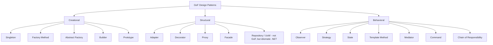
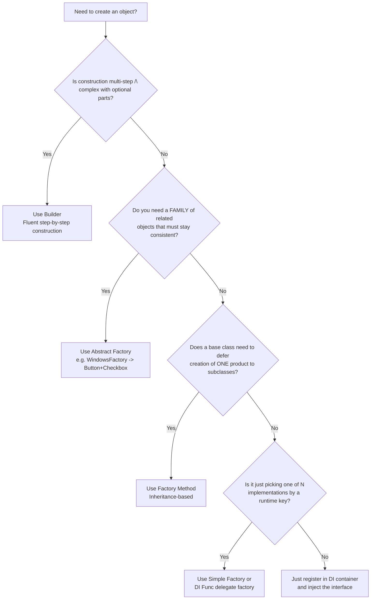
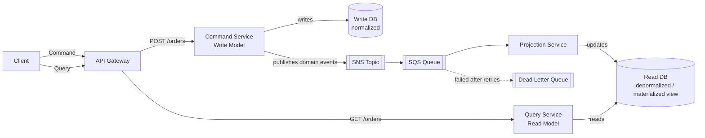
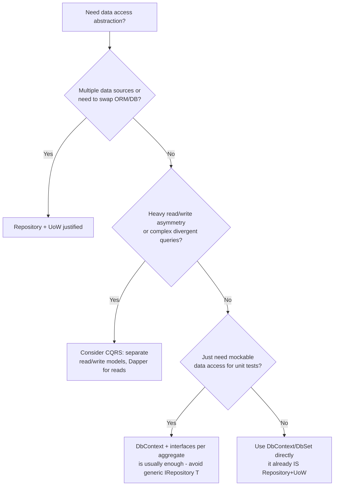

# Design Patterns — Senior .NET Interview Guide

> Audience: 10-year .NET full-stack engineer prepping for senior/lead interviews. Focus is on trade-offs, "why," gotchas, and follow-up questions — not tutorials.

## Table of Contents

1. [Core Concepts](#core-concepts)
2. [Creational Patterns](#creational-patterns)
   - [Singleton](#singleton)
   - [Factory Method, Simple Factory, Abstract Factory](#factory-patterns)
   - [[new content] Builder](#new-content-builder)
   - [[new content] Builder vs Factory vs Abstract Factory Decision Tree](#new-content-builder-vs-factory-vs-abstract-factory-decision-tree)
   - [[new content] Prototype](#new-content-prototype)
3. [Structural Patterns](#structural-patterns)
   - [Dependency Injection (as a pattern)](#dependency-injection-as-a-pattern)
   - [Repository Pattern](#repository-pattern)
   - [Unit of Work Pattern](#unit-of-work-pattern)
   - [[new content] Decorator vs Proxy vs Adapter](#new-content-decorator-vs-proxy-vs-adapter)
   - [[new content] Facade](#new-content-facade)
   - [[new content] Specification Pattern](#new-content-specification-pattern)
4. [Behavioral Patterns](#behavioral-patterns)
   - [Observer](#observer)
   - [Mediator Pattern (MediatR)](#mediator-pattern-mediatr)
   - [[new content] Strategy vs State](#new-content-strategy-vs-state)
   - [[new content] Template Method](#new-content-template-method)
   - [[new content] Command Pattern](#new-content-command-pattern)
   - [[new content] Chain of Responsibility](#new-content-chain-of-responsibility)
5. [Architectural Patterns](#architectural-patterns)
   - [CQRS](#cqrs)
   - [Projection Service](#projection-service)
   - [Distributed Locks / Leases](#distributed-locks--leases)
   - [[new content] Options Pattern in .NET](#new-content-options-pattern-in-net)
   - [[new content] Repository + Unit of Work vs Raw EF Core / CQRS](#new-content-repository--unit-of-work-vs-raw-ef-core--cqrs)
6. [SOLID Principles](#solid-principles)
   - [[new content] SOLID in Practice — Violation-to-Fix Walkthroughs](#new-content-solid-in-practice--violation-to-fix-walkthroughs)
7. [Anti-Patterns](#anti-patterns)
   - [[new content] God Object, Anemic Domain Model, Service Locator, and Other Overused/Misapplied Patterns](#new-content-god-object-anemic-domain-model-service-locator-and-other-overusedmisapplied-patterns)
8. [Performance Considerations](#performance-considerations)
9. [Best Practices](#best-practices)
10. [Common Pitfalls](#common-pitfalls)
11. [Sample Interview Q&A](#sample-interview-qa)
12. [Summary of Additions](#summary-of-additions)

---

## Core Concepts

Design patterns are reusable, named solutions to recurring software design problems. They exist to give teams a **shared vocabulary** ("just use a Decorator here") and to encode hard-won trade-offs so you don't have to rediscover them. The GoF (Gang of Four) book classifies 23 patterns into three categories:

| Category | Purpose | Examples |
|---|---|---|
| Creational | Control **how objects are created** | Singleton, Factory Method, Abstract Factory, Builder, Prototype |
| Structural | Control **how objects/classes are composed** | Adapter, Decorator, Proxy, Facade, Composite, Bridge, Flyweight |
| Behavioral | Control **how objects communicate/collaborate** | Observer, Strategy, State, Template Method, Command, Chain of Responsibility, Mediator, Iterator, Visitor, Memento |



**Senior-level framing an interviewer wants to hear:** patterns are not goals — they are trade-offs you accept to solve a specific force (variability, coupling, lifecycle, testability). If you can't name the force a pattern resolves, you're probably over-engineering. The best senior answer to "what pattern would you use here?" often starts with "what problem are we actually solving — do we need a pattern at all, or does a simple function/DI registration solve it?"

---

## Creational Patterns

### Singleton

**Intent:** Ensure a class has exactly one instance and provide a global access point to it.

**When to use:** shared, expensive-to-create, effectively stateless (or read-only state) resources — logging, in-memory cache wrappers, configuration snapshots, connection pool managers.

#### Implementations compared

| Approach | Thread-safe | Lazy? | Best for | Notes |
|---|---|---|---|---|
| Naive (`if (_instance == null)`) | ❌ No | ✔ Yes | Never (demo only) | Race condition creates multiple instances |
| `lock` on every access | ✔ Yes | ✔ Yes | Legacy code | Locking overhead on every call |
| Double-checked locking | ✔ Yes | ✔ Yes | Showing threading knowledge | Verbose; needs `volatile` to prevent reordering |
| Static field / static constructor | ✔ Yes (CLR guarantees) | ❌ No (eager) | Simple, cheap objects | CLR runs type initializer exactly once per AppDomain |
| `Lazy<T>` | ✔ Yes | ✔ Yes | **Modern default** | Cleanest, safest, supports `LazyThreadSafetyMode` |
| `LazyInitializer.EnsureInitialized` | ✔ Yes | ✔ Yes | Perf-critical, multiple lazy fields | Lower allocation than `Lazy<T>`, more verbose |

```csharp
// Recommended modern approach
public sealed class Logger
{
    private static readonly Lazy<Logger> _instance = new(() => new Logger());
    public static Logger Instance => _instance.Value;
    private Logger() { }

    public void Log(string message) =>
        Console.WriteLine($"[{DateTime.UtcNow:O}] {message}");
}
```

```csharp
// Double-checked locking — must use `volatile` or memory reordering can expose
// a partially-constructed object to another thread.
public sealed class Singleton
{
    private static volatile Singleton? _instance;
    private static readonly object _lock = new();
    private Singleton() { }

    public static Singleton Instance
    {
        get
        {
            if (_instance == null)
            {
                lock (_lock)
                {
                    _instance ??= new Singleton();
                }
            }
            return _instance;
        }
    }
}
```

**Anti-pattern trap (common interview trick question):**

```csharp
public sealed class Singleton
{
    private static Singleton? _instance;
    public static Singleton Instance => _instance ??= new Singleton();
}
```
This is **not thread-safe** — `??=` is not atomic; two threads can both observe `null` and construct two instances.

#### Singleton in ASP.NET Core DI

Prefer container-managed singletons over hand-rolled ones:
```csharp
builder.Services.AddSingleton<ILogger, Logger>();
```
This gets you testability (interface + constructor injection instead of a static accessor), and the container handles disposal via `IDisposable`/`IAsyncDisposable` at shutdown.

#### Singleton vs Static Class

| Singleton | Static Class |
|---|---|
| Instance-based | No instance |
| Can implement interfaces | Cannot |
| Works with DI / mocking | Cannot be injected or mocked |
| Can hold state deliberately, with control | Effectively global mutable state by default |

#### When NOT to use Singleton

- You need per-request or per-user state → **stateful Singletons in a web app are a classic bug**: `CurrentUser` on a Singleton is shared across every concurrent request, causing data leakage between users.
- Testing: global state makes tests order-dependent and hard to isolate/mock.
- Violates **SRP** (mixes creation-control logic with business behavior) and often **DIP** (callers reach for a concrete global instead of an abstraction).
- Distributed/cloud environments: a Singleton is scoped to **one process**, not the system. Scale out to 5 pods = 5 independent Singletons. Don't use it to coordinate cluster-wide behavior — that requires a **distributed lock/lease** (see below).
- Never store `HttpContext`, database connections, or other short-lived/request-scoped objects inside a Singleton — it causes captured-context bugs and leaks (classic **captive dependency** problem: a Singleton that captures a Scoped/Transient service in its constructor keeps that instance alive forever).

#### Preventing Singleton breakage via reflection/serialization

- Mark the class `sealed`.
- Keep the constructor `private`.
- For serialization, implement custom `GetObjectData`/deserialization hooks (or mark `[NonSerialized]`) to avoid creating a second instance on deserialize; reflection can still bypass a private constructor via `Activator.CreateInstance(type, nonPublic: true)` — there is no 100% reflection-proof singleton in .NET short of hardening via `ModuleInitializer` checks or forgoing manual Singleton for DI-managed singletons entirely (recommended: just don't fight reflection, use DI).

#### Singleton Logger — end-to-end example

```csharp
public sealed class Logger
{
    private static readonly Lazy<Logger> _instance = new(() => new Logger());
    private readonly string _logFilePath = "log.txt";

    private Logger() { }
    public static Logger Instance => _instance.Value;

    public void Log(string message)
    {
        using var writer = new StreamWriter(_logFilePath, append: true);
        writer.WriteLine($"{DateTime.Now}: {message}");
    }
}
```
> **Note (original source used a `lock`-based Instance property alongside a separate `Lazy<T>` example for the same Logger class — kept both here as they represent the "before/after" best-practice progression, not a contradiction.)**

---

### Factory Patterns

#### Simple Factory (not a formal GoF pattern)

A static method/class that returns an implementation based on input. Cheap, common, and often "good enough":

```csharp
public interface INotification { void Send(string message); }

public class EmailNotification : INotification
{
    public void Send(string message) => Console.WriteLine("Email: " + message);
}
public class SmsNotification : INotification
{
    public void Send(string message) => Console.WriteLine("SMS: " + message);
}

public static class NotificationFactory
{
    public static INotification Create(string type) => type switch
    {
        "email" => new EmailNotification(),
        "sms"   => new SmsNotification(),
        _       => throw new ArgumentException("Invalid notification type")
    };
}
```

#### Factory Method (GoF)

Base `Creator` defines an invariant workflow; subclasses override the factory method to decide *what* concrete product gets created. Uses **inheritance**.

```csharp
public interface IProduct { string Operation(); }
public class ConcreteProductA : IProduct { public string Operation() => "Result A"; }
public class ConcreteProductB : IProduct { public string Operation() => "Result B"; }

public abstract class Creator
{
    protected abstract IProduct FactoryMethod();
    public string SomeOperation() => $"Creator: working with {FactoryMethod().Operation()}";
}

public class ConcreteCreatorA : Creator
{
    protected override IProduct FactoryMethod() => new ConcreteProductA();
}
```

**Trade-offs:** keeps the invariant algorithm centralized (good for OCP — add new `CreatorX`/`ProductX` pairs without touching existing code), but relies on inheritance, which is more rigid than composition and can lead to subclass explosion.

#### Abstract Factory (GoF)

An interface that creates **families of related objects** that must be used together (consistency guarantee).

```csharp
public interface IButton { void Paint(); }
public interface ICheckbox { void Paint(); }

public class WindowsButton : IButton { public void Paint() => Console.WriteLine("Windows Button"); }
public class WindowsCheckbox : ICheckbox { public void Paint() => Console.WriteLine("Windows Checkbox"); }
public class MacButton : IButton { public void Paint() => Console.WriteLine("Mac Button"); }
public class MacCheckbox : ICheckbox { public void Paint() => Console.WriteLine("Mac Checkbox"); }

public interface IGuiFactory
{
    IButton CreateButton();
    ICheckbox CreateCheckbox();
}

public class WindowsFactory : IGuiFactory
{
    public IButton CreateButton() => new WindowsButton();
    public ICheckbox CreateCheckbox() => new WindowsCheckbox();
}

public class MacFactory : IGuiFactory
{
    public IButton CreateButton() => new MacButton();
    public ICheckbox CreateCheckbox() => new MacCheckbox();
}

public class Application
{
    private readonly IButton _button;
    private readonly ICheckbox _checkbox;
    public Application(IGuiFactory factory)
    {
        _button = factory.CreateButton();
        _checkbox = factory.CreateCheckbox();
    }
    public void RenderUI() { _button.Paint(); _checkbox.Paint(); }
}
```

Wiring the concrete family at runtime via DI:
```csharp
services.AddTransient<IGuiFactory>(sp =>
{
    var platform = configuration["Ui:Platform"];
    return platform == "windows" ? new WindowsFactory() : (IGuiFactory)new MacFactory();
});
```

| | Factory Method | Abstract Factory |
|---|---|---|
| Scope | One product | Family of related products |
| Mechanism | Inheritance (override a method) | Composition (hold a factory object) |
| Use case | Vary a single product's concrete type | Guarantee compatibility across several products |
| Extension | Add new `Creator` subclass | Add new concrete factory implementing the family interface |

#### How DI containers reduce the need for hand-rolled factories

Modern DI containers already provide object creation, lifetime management (Singleton/Scoped/Transient), and implementation selection — the exact responsibilities of a factory:

```csharp
// Instead of:
var service = ServiceFactory.Create("email");
// Do:
var service = provider.GetRequiredService<INotificationService>();
```

For **runtime-parameterized** creation, inject a factory delegate instead of writing a factory class:
```csharp
services.AddTransient<EmailService>();
services.AddTransient<SmsService>();
services.AddTransient<Func<string, IService>>(provider => key => key switch
{
    "email" => provider.GetRequiredService<EmailService>(),
    "sms"   => provider.GetRequiredService<SmsService>(),
    _       => throw new ArgumentException("Invalid type")
});
```

**Interview line:** "DI containers act as automatic factories with lifetime management built in — a hand-written Factory class is only justified when creation logic is genuinely complex, needs to be pluggable outside the container (e.g., third-party plugin DLLs), or needs to enforce a family/consistency guarantee (Abstract Factory)."

**Real ASP.NET Core factory examples to cite in interviews:**

| Factory | Purpose |
|---|---|
| `IHttpClientFactory` | Manages `HttpClient`/`HttpMessageHandler` pooling to avoid socket exhaustion; supports named/typed clients, Polly policies |
| `ILoggerFactory` | Creates category-typed `ILogger<T>` instances; centralizes provider config (Console, Serilog, App Insights) |
| `IServiceScopeFactory` | Creates a DI scope manually (e.g., inside a `BackgroundService`) so Scoped services can be resolved outside an HTTP request |
| `IMiddlewareFactory` | Creates `IMiddleware` instances via DI instead of the convention-based middleware pattern, enabling scoped dependency use |

```csharp
using var scope = scopeFactory.CreateScope();
var service = scope.ServiceProvider.GetRequiredService<IMyScopedService>();
```

**Plugin architecture (dynamic assembly loading)** — senior-level factory extension:
```csharp
public interface IPlugin { string Name { get; } void Execute(); }

var pluginFolder = Path.Combine(AppContext.BaseDirectory, "Plugins");
foreach (var dll in Directory.GetFiles(pluginFolder, "*.dll"))
    Assembly.LoadFrom(dll);

var plugins = AppDomain.CurrentDomain.GetAssemblies()
    .SelectMany(a => a.GetTypes())
    .Where(t => typeof(IPlugin).IsAssignableFrom(t) && !t.IsInterface && !t.IsAbstract)
    .Select(t => (IPlugin)Activator.CreateInstance(t)!)
    .ToList();

foreach (var plugin in plugins) plugin.Execute();
```
> Modern alternative (verify against your target runtime): `System.Runtime.Loader.AssemblyLoadContext` for isolated/unloadable plugin contexts, and `System.Composition`/MEF for attribute-based discovery, are more robust than raw `Assembly.LoadFrom` + `Activator.CreateInstance` in production plugin systems because they support unloading and version isolation.

---

### [new content] Builder

**Gap identified:** the source notes never covered the Builder pattern, despite it being a GoF creational pattern frequently confused with Factory in interviews.

**Intent:** separate the construction of a complex object from its representation, allowing step-by-step construction and multiple representations from the same construction process.

**Why it matters for .NET seniors:** you already use it constantly — `HostBuilder`, `WebApplicationBuilder`, `DbContextOptionsBuilder`, EF Core's Fluent API (`modelBuilder.Entity<T>()...`), and string-building via `StringBuilder` are all Builder-pattern instances. Being able to name this in an interview signals framework fluency.

```csharp
public class Pizza
{
    public string Size { get; set; } = "Medium";
    public List<string> Toppings { get; } = new();
    public bool ExtraCheese { get; set; }
}

public class PizzaBuilder
{
    private readonly Pizza _pizza = new();

    public PizzaBuilder WithSize(string size) { _pizza.Size = size; return this; }
    public PizzaBuilder AddTopping(string topping) { _pizza.Toppings.Add(topping); return this; }
    public PizzaBuilder WithExtraCheese() { _pizza.ExtraCheese = true; return this; }
    public Pizza Build() => _pizza;
}

// Fluent usage
var pizza = new PizzaBuilder()
    .WithSize("Large")
    .AddTopping("Pepperoni")
    .WithExtraCheese()
    .Build();
```

Modern C# alternative for immutable objects — **records with `with` expressions** often replace Builder for simple cases:
```csharp
public record Pizza(string Size, IReadOnlyList<string> Toppings, bool ExtraCheese);

var basePizza = new Pizza("Medium", Array.Empty<string>(), false);
var custom = basePizza with { Size = "Large", ExtraCheese = true };
```

**When Builder still wins over records:** when construction is genuinely multi-step, involves validation between steps, needs a fluent API for readability with many optional parameters (avoiding telescoping constructors), or must produce different representations (Director pattern variant) from the same steps.

---

### [new content] Builder vs Factory vs Abstract Factory Decision Tree



---

### [new content] Prototype

**Gap identified:** not covered in source notes; occasionally asked as "how do you clone an object deeply vs shallowly in C#, and when would that be a design pattern?"

**Intent:** create new objects by copying an existing instance ("prototype") rather than instantiating from scratch — useful when construction is expensive or when you need variations of a preconfigured object.

```csharp
public class Prototype : ICloneable
{
    public string Name { get; set; } = "";
    public List<string> Tags { get; set; } = new();

    // Shallow clone: MemberwiseClone copies value types and reference-type
    // fields as REFERENCES — Tags would be shared between clones unless
    // explicitly deep-copied here.
    public object Clone()
    {
        var clone = (Prototype)MemberwiseClone();
        clone.Tags = new List<string>(Tags); // manual deep copy of mutable ref members
        return clone;
    }
}
```

**.NET-relevant nuance:** `ICloneable` is largely discouraged in the BCL (its contract doesn't specify shallow vs deep, and it's not generic) — prefer explicit `Clone()`/copy-constructor methods, or records' built-in shallow-copy `with` expression semantics. In distributed/microservices contexts, "prototype" thinking shows up as templated configuration objects (e.g., a base `HttpRequestMessage` cloned per retry).

---

## Structural Patterns

### Dependency Injection (as a pattern)

DI is a *technique*, not strictly a GoF pattern, but it's foundational and frequently tested. Dependencies are provided to a class rather than constructed inside it, inverting control of dependency creation (Inversion of Control).

```csharp
public class Service { }
public class Client
{
    private readonly Service _service;
    public Client(Service service) => _service = service;
}
```

**DI pattern vs DI container** — a distinction interviewers specifically probe for at senior level:

- **DI (the pattern):** a design principle — depend on abstractions, inject them via constructor/property/method. You can do DI with zero libraries (manual "poor man's DI" via `new`-ing dependencies in `Program.cs` and passing them down).
- **DI container (the tool):** a runtime component (`Microsoft.Extensions.DependencyInjection`, Autofac, etc.) that automates *resolving* the object graph, manages **lifetimes** (Singleton/Scoped/Transient), and can add features like decoration, interception, and assembly scanning.

| Lifetime | Instances | Typical use |
|---|---|---|
| Singleton | 1 per application | Caches, configuration snapshots, stateless services |
| Scoped | 1 per request/scope | EF Core `DbContext`, per-request unit of work |
| Transient | New every resolution | Lightweight, stateless, cheap-to-construct services |

**Common gotcha (captive dependency):** injecting a Scoped/Transient service into a Singleton's constructor causes the container to capture that instance for the Singleton's lifetime — silently breaking the intended shorter lifetime and potentially leaking a disposed `DbContext`. Detect via `ServiceProviderOptions.ValidateScopes = true` in `Program.cs` in Development.

---

### Repository Pattern

**Intent:** abstract the data-access layer from business logic so the domain/service layer isn't tightly coupled to EF Core, Dapper, or a specific store.

```csharp
public interface IRepository<T> where T : class
{
    Task<IEnumerable<T>> GetAllAsync();
    Task<T> GetByIdAsync(int id);
    Task AddAsync(T entity);
    Task UpdateAsync(T entity);
    Task DeleteAsync(int id);
}

public class Repository<T> : IRepository<T> where T : class
{
    private readonly AppDbContext _context;
    private readonly DbSet<T> _dbSet;

    public Repository(AppDbContext context)
    {
        _context = context;
        _dbSet = context.Set<T>();
    }

    public async Task<IEnumerable<T>> GetAllAsync() => await _dbSet.ToListAsync();
    public async Task<T> GetByIdAsync(int id) => await _dbSet.FindAsync(id);

    public async Task AddAsync(T entity)
    {
        await _dbSet.AddAsync(entity);
        await _context.SaveChangesAsync();
    }

    public async Task UpdateAsync(T entity)
    {
        _dbSet.Update(entity);
        await _context.SaveChangesAsync();
    }

    public async Task DeleteAsync(int id)
    {
        var entity = await _dbSet.FindAsync(id);
        if (entity != null)
        {
            _dbSet.Remove(entity);
            await _context.SaveChangesAsync();
        }
    }
}
```

Specific repositories extend the generic one for custom queries:
```csharp
public interface IEmployeeRepository : IRepository<Employee>
{
    Task<IEnumerable<Employee>> GetEmployeesByDepartmentAsync(string department);
}

public class EmployeeRepository : Repository<Employee>, IEmployeeRepository
{
    private readonly AppDbContext _context;
    public EmployeeRepository(AppDbContext context) : base(context) => _context = context;

    public async Task<IEnumerable<Employee>> GetEmployeesByDepartmentAsync(string department) =>
        await _context.Employees.Where(e => e.Department == department).ToListAsync();
}
```

```csharp
builder.Services.AddScoped(typeof(IRepository<>), typeof(Repository<>));
builder.Services.AddScoped<IEmployeeRepository, EmployeeRepository>();
```

**Use it when:** DDD-style architecture, you genuinely need swappable persistence, or you need mockable data access for unit tests without hitting a database.

**Avoid it when:** the app is small, `DbContext`/`DbSet<T>` already **is** a repository + unit of work (EF Core's `DbSet<T>` implements `IQueryable`, tracks changes, and `SaveChanges` is your commit) — wrapping it in a generic repository often just adds an indirection layer that leaks `IQueryable` anyway or forces you to re-invent filtering/paging/`Include()` support on top of your interface. This is one of the most contested topics in .NET interviews — be ready to argue **both sides**.

---

### Unit of Work Pattern

**Intent:** coordinate multiple repository operations into a single atomic transaction/commit, minimizing round-trips and keeping consistency.

```csharp
public interface IUnitOfWork : IDisposable
{
    IProductRepository Products { get; }
    ICustomerRepository Customers { get; }
    int Complete();
}

public class UnitOfWork : IUnitOfWork
{
    private readonly ApplicationDbContext _context;
    public IProductRepository Products { get; }
    public ICustomerRepository Customers { get; }

    public UnitOfWork(ApplicationDbContext context)
    {
        _context = context;
        Products = new ProductRepository(_context);
        Customers = new CustomerRepository(_context);
    }

    public int Complete() => _context.SaveChanges();
    public void Dispose() => _context.Dispose();
}
```

```csharp
public class OrderService
{
    private readonly IUnitOfWork _unitOfWork;
    public OrderService(IUnitOfWork unitOfWork) => _unitOfWork = unitOfWork;

    public void ProcessOrder(int productId, int customerId)
    {
        var product = _unitOfWork.Products.GetById(productId);
        var customer = _unitOfWork.Customers.GetById(customerId);
        if (product == null || customer == null) throw new Exception("Invalid product or customer.");
        // domain logic...
        _unitOfWork.Complete();
    }
}
```

```csharp
builder.Services.AddScoped<IUnitOfWork, UnitOfWork>();
```

**Key senior nuance:** in EF Core, the `DbContext` **already is** a Unit of Work (it tracks all changes across all `DbSet<T>` and commits them atomically on `SaveChanges()`). A hand-rolled `IUnitOfWork` wrapping multiple repositories on top of one shared `DbContext` is mostly a **testability/DI-ergonomics wrapper**, not a new transactional capability — know this distinction, it's a very common trap question ("doesn't EF Core already do this?").

---

### [new content] Decorator vs Proxy vs Adapter

**Gap identified:** the source notes never distinguished these three structural patterns despite them being one of the most common senior-level "compare and contrast" interview questions (all three wrap another object behind the same-shaped interface, which is exactly why people confuse them).

| | Adapter | Decorator | Proxy |
|---|---|---|---|
| **Intent** | Convert one interface into another the client expects | Add responsibility/behavior dynamically without changing the interface | Control access to an object (lazy load, security, remoting, caching) |
| **Interface relationship** | Target interface differs from adaptee | Same interface as wrapped object | Same interface as real subject |
| **Adds new behavior?** | No — just translates calls | Yes — layers behavior (logging, caching, validation) | Sometimes — access control, not core behavior |
| **Typical .NET example** | Wrapping a 3rd-party SDK behind your own `IPaymentGateway` | `Stream` decorators (`GZipStream` wrapping a `FileStream`); middleware pipeline | `DbConnection` connection pooling proxy; `Lazy<T>` as a virtual proxy; EF Core change-tracking proxies |
| **Composability** | Usually one adapter per adaptee | Freely stackable (decorator chains) | Usually one proxy per real subject |

```csharp
// Adapter: your app expects IPaymentGateway, but the SDK exposes ThirdPartySdk
public interface IPaymentGateway { bool Charge(decimal amount); }

public class StripeSdkAdapter : IPaymentGateway
{
    private readonly ThirdPartyStripeClient _client;
    public StripeSdkAdapter(ThirdPartyStripeClient client) => _client = client;
    public bool Charge(decimal amount) => _client.CreateCharge(amount * 100, "usd") == "succeeded";
}
```

```csharp
// Decorator: add caching to an existing IProductService without changing callers
public interface IProductService { Product Get(int id); }

public class CachingProductServiceDecorator : IProductService
{
    private readonly IProductService _inner;
    private readonly IMemoryCache _cache;
    public CachingProductServiceDecorator(IProductService inner, IMemoryCache cache)
    { _inner = inner; _cache = cache; }

    public Product Get(int id) =>
        _cache.GetOrCreate($"product:{id}", _ => _inner.Get(id))!;
}

// Registration (Scrutor package makes DI-based decoration idiomatic in .NET):
// services.AddScoped<IProductService, ProductService>();
// services.Decorate<IProductService, CachingProductServiceDecorator>();
```

```csharp
// Proxy: lazy/virtual proxy delaying expensive construction
public interface IReportGenerator { string Generate(); }

public class RealReportGenerator : IReportGenerator
{
    public RealReportGenerator() => Thread.Sleep(2000); // expensive init
    public string Generate() => "Report data";
}

public class LazyReportGeneratorProxy : IReportGenerator
{
    private readonly Lazy<RealReportGenerator> _real = new(() => new RealReportGenerator());
    public string Generate() => _real.Value.Generate();
}
```

**Interview one-liner:** "Adapter changes the *shape* of an interface; Decorator adds *behavior* while keeping the same shape; Proxy controls *access* to the same shape. ASP.NET Core middleware is essentially a live Decorator chain over `RequestDelegate`."

---

### [new content] Facade

**Gap identified:** mentioned nowhere in source, but commonly asked as a quick "name a pattern you use to simplify a complex subsystem."

**Intent:** provide a single simplified interface over a complex subsystem of classes, without hiding the subsystem's power from callers who need it directly.

```csharp
// Subsystem: multiple services with intricate coordination
public class InventoryService { public bool Reserve(int sku, int qty) => true; }
public class PaymentService { public bool Charge(decimal amount) => true; }
public class ShippingService { public string Schedule(int orderId) => "TRACK123"; }

// Facade
public class OrderFacade
{
    private readonly InventoryService _inventory = new();
    private readonly PaymentService _payment = new();
    private readonly ShippingService _shipping = new();

    public string PlaceOrder(int sku, int qty, decimal amount, int orderId)
    {
        if (!_inventory.Reserve(sku, qty)) throw new InvalidOperationException("Out of stock");
        if (!_payment.Charge(amount)) throw new InvalidOperationException("Payment failed");
        return _shipping.Schedule(orderId);
    }
}
```
Real-world .NET example: `HttpClient` is itself a facade over `HttpMessageHandler`, socket management, and connection pooling.

---

### [new content] Specification Pattern

**Gap identified:** explicitly requested — frequently discussed alongside Repository in DDD-flavored senior interviews as a way to keep query logic out of repositories.

**Intent:** encapsulate a business rule/query predicate as a composable object (`IsSatisfiedBy`) instead of scattering `Where()` lambdas across services or bloating repository interfaces with one method per query variation.

```csharp
public interface ISpecification<T>
{
    Expression<Func<T, bool>> ToExpression();
}

public class ActiveCustomerSpecification : ISpecification<Customer>
{
    public Expression<Func<Customer, bool>> ToExpression() => c => c.IsActive;
}

public class HighValueCustomerSpecification : ISpecification<Customer>
{
    private readonly decimal _threshold;
    public HighValueCustomerSpecification(decimal threshold) => _threshold = threshold;
    public Expression<Func<Customer, bool>> ToExpression() => c => c.LifetimeValue >= _threshold;
}

// Combinator support (AND) — the real payoff of the pattern
public class AndSpecification<T> : ISpecification<T>
{
    private readonly ISpecification<T> _left, _right;
    public AndSpecification(ISpecification<T> left, ISpecification<T> right) { _left = left; _right = right; }

    public Expression<Func<T, bool>> ToExpression()
    {
        var param = Expression.Parameter(typeof(T));
        var body = Expression.AndAlso(
            Expression.Invoke(_left.ToExpression(), param),
            Expression.Invoke(_right.ToExpression(), param));
        return Expression.Lambda<Func<T, bool>>(body, param);
    }
}

// Repository accepts specifications instead of growing bespoke query methods
public async Task<List<Customer>> FindAsync(ISpecification<Customer> spec) =>
    await _dbSet.Where(spec.ToExpression()).ToListAsync();
```

**Trade-off:** great for reusable, testable, composable business rules and avoiding repository interface bloat; overkill for CRUD-only apps — adds an abstraction layer and expression-tree complexity that most small services don't need. EF Core can translate simple specification expressions to SQL directly since they're just `Expression<Func<T,bool>>`.

---

## Behavioral Patterns

### Observer

**Intent:** notify multiple dependent objects when a subject's state changes, without the subject knowing concrete subscriber types.

```csharp
public class NewsPublisher
{
    public event Action<string>? NewsUpdated;
    public void PublishNews(string news) => NewsUpdated?.Invoke(news);
}

public class Subscriber
{
    public void OnNewsReceived(string news) => Console.WriteLine($"Received: {news}");
}
```

Used in event-driven code, UI data-binding (`INotifyPropertyChanged`), and pub/sub messaging. In distributed systems, Observer conceptually scales up into **domain events + message brokers** (see CQRS/Projection Service below) — same intent, different transport (in-memory delegate vs. SNS/SQS/Kafka).

---

### Mediator Pattern (MediatR)

**Intent:** reduce direct coupling between components by routing communication through a central mediator object instead of components referencing each other directly.

**Without MediatR** (Controller → Service, tightly coupled):
```csharp
public class OrdersController : ControllerBase
{
    private readonly IOrderService _orderService;
    public OrdersController(IOrderService orderService) => _orderService = orderService;

    [HttpGet("{id}")]
    public async Task<IActionResult> GetOrderById(int id) =>
        Ok(await _orderService.GetOrderByIdAsync(id));
}
```

**With MediatR** (Controller → Mediator → Handler):
```csharp
public class GetOrderByIdQuery : IRequest<OrderDto>
{
    public int OrderId { get; }
    public GetOrderByIdQuery(int orderId) => OrderId = orderId;
}

public class GetOrderByIdQueryHandler : IRequestHandler<GetOrderByIdQuery, OrderDto>
{
    private readonly IOrderRepository _orderRepository;
    public GetOrderByIdQueryHandler(IOrderRepository orderRepository) => _orderRepository = orderRepository;

    public async Task<OrderDto> Handle(GetOrderByIdQuery request, CancellationToken ct) =>
        await _orderRepository.GetOrderByIdAsync(request.OrderId);
}

public class OrdersController : ControllerBase
{
    private readonly IMediator _mediator;
    public OrdersController(IMediator mediator) => _mediator = mediator;

    [HttpGet("{id}")]
    public async Task<IActionResult> GetOrderById(int id) =>
        Ok(await _mediator.Send(new GetOrderByIdQuery(id)));

    [HttpPost]
    public async Task<IActionResult> CreateOrder(CreateOrderCommand command)
    {
        var orderId = await _mediator.Send(command);
        return CreatedAtAction(nameof(GetOrderById), new { id = orderId }, orderId);
    }
}
```

Registration:
```csharp
builder.Services.AddMediatR(cfg => cfg.RegisterServicesFromAssembly(Assembly.GetExecutingAssembly()));
```
> **(verify)** — `AddMediatR(Assembly)` (older overload) still works in some versions, but MediatR 12+ uses the `cfg =>` configuration-delegate overload; check the installed package version, as MediatR has changed its registration API and licensing model across major versions.

| Pros | Cons |
|---|---|
| Decouples controller from concrete service/repository | Adds indirection — harder to "jump to definition" and trace a call |
| Each handler is a small, independently testable unit | Overkill for small/simple CRUD apps |
| Natural fit for CQRS (separate Command/Query objects) | Runtime dispatch makes debugging/stack traces less obvious |
| Cross-cutting concerns via pipeline behaviors (validation, logging, transactions) | Yet another package/convention to onboard new devs to |

**When to use:** large apps with many modules, CQRS-style separation, DDD, or when you want composable cross-cutting behavior (`IPipelineBehavior<TRequest,TResponse>` for validation/logging/caching without decorating every handler manually).

**Mediator vs plain service layer — the real trade-off senior interviewers probe:** MediatR doesn't remove coupling, it relocates it — the controller no longer depends on `IOrderService`, but now every handler still depends on whatever it needs. The actual win is **discoverability and consistency of cross-cutting concerns** (one pipeline behavior applies to all requests) and **thinner controllers**, not "no coupling."

---

### [new content] Strategy vs State

**Gap identified:** the source notes never covered Strategy or State individually, yet "what's the difference between Strategy and State?" is one of the most frequently asked behavioral-pattern comparison questions at senior level — both patterns look structurally identical (an interface + swappable implementations held by a context) but differ in *intent* and *who controls the transition*.

| | Strategy | State |
|---|---|---|
| **Intent** | Choose an *algorithm/behavior* at runtime, selected by the **client** | Change behavior based on **internal state transitions**, decided by the object itself |
| **Who switches implementation** | Caller/config picks the strategy up front (or per call) | The state objects themselves trigger transitions to the next state |
| **Awareness between implementations** | Strategies are independent, don't know about each other | States often know about (and transition to) other states |
| **Typical .NET example** | `IComparer<T>`, pricing/discount algorithms, payment gateway selection | Order lifecycle (`Pending → Shipped → Delivered → Cancelled`), TCP connection states, workflow engines |

```csharp
// Strategy: caller picks the algorithm
public interface IDiscountStrategy { decimal Apply(decimal total); }
public class NoDiscount : IDiscountStrategy { public decimal Apply(decimal total) => total; }
public class TenPercentOff : IDiscountStrategy { public decimal Apply(decimal total) => total * 0.9m; }

public class Checkout
{
    private readonly IDiscountStrategy _strategy;
    public Checkout(IDiscountStrategy strategy) => _strategy = strategy; // injected/chosen externally
    public decimal Total(decimal amount) => _strategy.Apply(amount);
}
```

```csharp
// State: the object drives its own transitions
public interface IOrderState
{
    IOrderState Next(Order order);
    string Name { get; }
}

public class PendingState : IOrderState
{
    public string Name => "Pending";
    public IOrderState Next(Order order) => new ShippedState(); // state decides what's next
}

public class ShippedState : IOrderState
{
    public string Name => "Shipped";
    public IOrderState Next(Order order) => new DeliveredState();
}

public class DeliveredState : IOrderState
{
    public string Name => "Delivered";
    public IOrderState Next(Order order) => this; // terminal
}

public class Order
{
    public IOrderState State { get; private set; } = new PendingState();
    public void Advance() => State = State.Next(this);
}
```

**Interview one-liner:** "Strategy answers 'which algorithm should run', chosen externally; State answers 'what should this object do now', decided internally as part of a lifecycle. If you see transition logic living *inside* the swappable classes, it's State; if the classes are peers with zero transition awareness, it's Strategy."

---

### [new content] Template Method

**Gap identified:** the original source file ends abruptly with only the heading "Template Method:" and no content — a bare, unanswered stub. Completed here in full.

**Intent:** define the skeleton of an algorithm in a base class method, deferring specific steps to subclasses — without letting subclasses change the overall algorithm structure. Uses inheritance (contrast with Strategy, which uses composition to achieve a similar "swap a step" goal).

```csharp
public abstract class ReportGenerator
{
    // Template method — defines the invariant skeleton; sealed to prevent
    // subclasses from breaking the overall algorithm shape.
    public sealed string Generate()
    {
        var data = FetchData();
        var formatted = FormatData(data);
        return WrapWithHeaderFooter(formatted);
    }

    protected abstract string FetchData();
    protected abstract string FormatData(string rawData);

    // Optional step with a default — a "hook" subclasses may override
    protected virtual string WrapWithHeaderFooter(string body) =>
        $"--- Report ---\n{body}\n--- End ---";
}

public class SalesReportGenerator : ReportGenerator
{
    protected override string FetchData() => "raw sales rows...";
    protected override string FormatData(string rawData) => $"Formatted Sales: {rawData}";
}

public class InventoryReportGenerator : ReportGenerator
{
    protected override string FetchData() => "raw inventory rows...";
    protected override string FormatData(string rawData) => $"Formatted Inventory: {rawData}";
    protected override string WrapWithHeaderFooter(string body) => $"[INVENTORY]\n{body}"; // overrides the hook
}
```

**Template Method vs Strategy (a natural interview follow-up):**

| | Template Method | Strategy |
|---|---|---|
| Mechanism | Inheritance — subclass overrides abstract steps | Composition — inject a different implementation object |
| Flexibility | Fixed algorithm shape, variable steps | Entire algorithm/behavior is swappable |
| Runtime swap | No — type is fixed at compile time (unless combined with a factory) | Yes — swap the strategy instance at runtime |
| ASP.NET Core example | `ControllerBase` action filters/lifecycle hooks; `WebApplicationFactory`'s configurable pipeline steps | `IAuthorizationHandler` chains, pluggable payment strategies |

**Common pitfall:** overriding the template method itself (if not `sealed`) defeats the purpose — always seal the skeleton method and expose only well-named hook methods for extension.

---

### [new content] Command Pattern

**Gap identified:** not present in source; relevant because MediatR's `IRequest`/`IRequestHandler` (heavily covered in source) is literally an implementation of Command (for commands) + a variant of it for queries — interviewers often ask "what GoF pattern is MediatR built on?" and expect "Command + Mediator."

**Intent:** encapsulate a request (action + parameters) as an object, enabling queuing, logging, undo/redo, and decoupling the invoker from the executor.

```csharp
public interface ICommand { void Execute(); void Undo(); }

public class AddItemCommand : ICommand
{
    private readonly List<string> _cart;
    private readonly string _item;
    public AddItemCommand(List<string> cart, string item) { _cart = cart; _item = item; }
    public void Execute() => _cart.Add(_item);
    public void Undo() => _cart.Remove(_item);
}

public class CommandInvoker
{
    private readonly Stack<ICommand> _history = new();
    public void Run(ICommand command) { command.Execute(); _history.Push(command); }
    public void UndoLast() { if (_history.TryPop(out var cmd)) cmd.Undo(); }
}
```

**Connection to MediatR:** `IRequest<TResponse>` + `IRequestHandler<TRequest,TResponse>` is Command (encapsulated request object + separate handler) wired through a Mediator for dispatch. Recognizing/saying this in an interview is a strong senior signal.

---

### [new content] Chain of Responsibility

**Gap identified:** not present in source; directly relevant because ASP.NET Core middleware — which most .NET developers use daily — **is** Chain of Responsibility, and interviewers like asking "name the GoF pattern behind ASP.NET Core middleware."

**Intent:** pass a request along a chain of handlers until one handles it (or all get a chance to act), decoupling sender from receivers.

```csharp
public abstract class Handler
{
    protected Handler? Next;
    public Handler SetNext(Handler next) { Next = next; return next; }
    public abstract Task HandleAsync(HttpContext ctx);
}

public class AuthHandler : Handler
{
    public override async Task HandleAsync(HttpContext ctx)
    {
        Console.WriteLine("Checking auth...");
        if (Next != null) await Next.HandleAsync(ctx);
    }
}

public class LoggingHandler : Handler
{
    public override async Task HandleAsync(HttpContext ctx)
    {
        Console.WriteLine("Logging request...");
        if (Next != null) await Next.HandleAsync(ctx);
    }
}
```

**Direct real-world mapping:** ASP.NET Core's `app.Use(...)` middleware pipeline, each middleware calling `await next(context)`, is exactly this pattern — each link decides to act, pass through, or short-circuit the chain.

---

## Architectural Patterns

### CQRS

**Intent:** separate the parts of a system that **change state** (Commands) from the parts that **read state** (Queries), allowing each side to use different models, optimizations, and even different data stores.

- **Commands** = intent to change state (`CreateOrder`, `UpdateProfile`) — typically return only success/failure or an ID, not the entity.
- **Queries** = read-only, never mutate state, return data.



**Why use it:** better read performance via denormalized/materialized views, simpler focused write-side logic, independent scaling of reads vs writes, cleaner separation for testing, and a natural fit for event-driven/eventually-consistent systems.

**Cost:** added complexity — multiple models, replication lag, eventual consistency the UI/UX must accommodate. Best suited to complex domains, high read/write asymmetry, many divergent query shapes, or auditability/event-history requirements.

**CQRS vs Event Sourcing** — a frequent point of confusion:
- CQRS = separate read/write **models**. Does not require Event Sourcing.
- Event Sourcing (ES) = persist state as an ordered sequence of events; current state is rebuilt by replaying them.
- You can have CQRS **without** ES (write model updates a normal DB and publishes events only to update the read side), or CQRS **with** ES (the write model's source of truth *is* the event stream).

**.NET example — command handler (write side):**
```csharp
public record PlaceOrderCommand(Guid OrderId, Guid CustomerId, List<OrderItem> Items);

public class PlaceOrderHandler : IRequestHandler<PlaceOrderCommand, Unit>
{
    private readonly WriteDbContext _db;
    private readonly IEventPublisher _events;

    public async Task<Unit> Handle(PlaceOrderCommand cmd, CancellationToken ct)
    {
        var order = Order.Create(cmd.OrderId, cmd.CustomerId, cmd.Items);
        _db.Orders.Add(order);
        await _db.SaveChangesAsync(ct);

        await _events.PublishAsync(new OrderPlacedEvent(order.Id, order.Total));
        return Unit.Value;
    }
}
```

**Projection handler (read side), with idempotency check:**
```csharp
public class OrderPlacedProjectionHandler : IEventHandler<OrderPlacedEvent>
{
    private readonly ReadDbContext _readDb;

    public async Task Handle(OrderPlacedEvent evt)
    {
        var existing = await _readDb.Orders.FindAsync(evt.OrderId);
        if (existing != null) return; // idempotent — event may be delivered more than once

        _readDb.Orders.Add(new OrderReadModel
        {
            Id = evt.OrderId, Total = evt.Total, Status = "Placed", CreatedAt = evt.Timestamp
        });
        await _readDb.SaveChangesAsync();
    }
}
```

**Operational must-knows (frequently probed):**

1. **Outbox pattern** — persist events to an outbox table in the *same DB transaction* as the write, then a background dispatcher reliably publishes them. Prevents "wrote to DB but crashed before publishing the event" event loss.
2. **Idempotency** — handlers must tolerate duplicate delivery (at-least-once messaging is the norm); track processed event IDs or use upsert semantics.
3. **Event ordering** — use partition/message-group keys (e.g., `OrderId`) so events for the same entity process in order (e.g., SQS FIFO with `MessageGroupId`).
4. **Schema evolution** — version events; add fields as nullable/optional to avoid breaking older consumers.
5. **Eventual consistency UX** — decide how the UI communicates "processing" vs. immediately-consistent reads; consider read-your-writes fallbacks for critical flows.
6. **Sagas** — for multi-service transactions, use choreography (services react to each other's events) or orchestration (a saga coordinator issues commands and tracks state) with compensating actions instead of distributed 2PC transactions.

**Checklist — is CQRS worth it here?**
- Many expensive/divergent read queries? Complex write-side domain logic? Asymmetric read/write scaling needs? Need for audit/event history? If most are "yes," CQRS fits; otherwise it's likely over-engineering for the problem size.

**Common pitfalls:** splitting read/write for trivial CRUD services; skipping the outbox (silent event loss); non-idempotent projections (duplicate side effects); ignoring projection lag/DLQ monitoring; expecting strong consistency across services (CQRS embraces eventual consistency, not strict consistency).

---

### Projection Service

A Projection Service is the CQRS component that **listens to domain events and materializes the read model** — the "translator" turning normalized write-side events into denormalized, query-optimized views.

```
OrderPlaced        → write into OrderSummaryView
PaymentCompleted    → update OrderStatusView
ItemAdded           → adjust OrderItemsView
```

**Why AWS SNS/SQS (or equivalent broker) between write and read sides:**

| Guarantee | How the broker provides it |
|---|---|
| Decoupling | Write API only publishes; doesn't wait on read-side processing |
| Durability | Events persisted across AZs; at-least-once delivery |
| Retry/backoff | Broker retries transient projection failures automatically |
| Poison-message isolation | After N retries, message routes to a Dead Letter Queue (DLQ) instead of blocking the queue forever |
| Buffering/elasticity | Queue absorbs traffic spikes; projection workers autoscale on queue depth |
| Ordering | FIFO queues / partition keys (`MessageGroupId = OrderId`) preserve per-entity order |

**Interview-ready one-liner:** "The Projection Service subscribes to domain events (via SNS/SQS or equivalent) and builds materialized read models; the broker gives reliability, retries, ordering, and fault isolation, which is what makes CQRS practical at scale rather than just a theoretical split."

---

### Distributed Locks / Leases

**Definition:** a distributed lock is a lock shared across multiple service instances/nodes/pods so only one performs a critical operation at a time — a Singleton's guarantee ("one instance in this process") does **not** extend across a horizontally scaled, multi-pod deployment. A **lease** is a lock with a TTL that auto-expires if the holder crashes, preventing permanent deadlock.

**Use cases:** running one instance of a scheduled job cluster-wide; ensuring only one worker processes a given queue message; leader election; guaranteeing unique ID/invoice generation across replicas.

**Mechanics:**
1. A node attempts to atomically acquire a lock from a shared store (Redis, SQL Server, etcd/Kubernetes Lease object, etc.).
2. Success → node becomes leader and proceeds.
3. Others wait/retry/back off.
4. Lock carries a TTL; the leader must periodically **renew** it to retain leadership.
5. If the leader dies without renewing, the lease expires and another node takes over.

```csharp
// Redis RedLock example
using var redLock = await redlockFactory.CreateLockAsync("critical-job", TimeSpan.FromSeconds(30));
if (redLock.IsAcquired)
{
    await RunJobAsync();
}
```

```sql
-- SQL Server application lock
EXEC sp_getapplock @Resource = 'job-lock', @LockMode = 'Exclusive', @LockTimeout = 0;
```

Kubernetes also offers a native `Lease` object (stored in etcd) for leader election among pods.

**Key properties interviewers probe:** atomicity of acquisition (otherwise "split brain" — two leaders), TTL/expiry to avoid permanent deadlock on crash, renewal protocol, idempotency of the guarded job (since a lease can expire mid-job and another node may start the same work), and graceful failure handling if the lock store itself is unavailable.

**Trade-offs:** adds an external dependency (Redis/DB/etcd) and network-partition risk; the Redis RedLock algorithm specifically has had publicized correctness critiques from distributed-systems researchers regarding timing assumptions **(verify current consensus/version before citing details in an interview — this is a nuanced, debated area)**; still, it's the standard pragmatic tool for this problem in most .NET cloud shops.

**Direct tie-back to Singleton:** "In-process Singleton ensures one instance per process; a distributed lock/lease is the cluster-wide equivalent when you scale that process horizontally" — a great way to bridge these two topics if asked back-to-back.

---

### [new content] Options Pattern in .NET

**Gap identified:** not mentioned in source at all, but the Options pattern is a staple senior ASP.NET Core question — it's the idiomatic .NET analogue of strongly-typed, validated configuration objects and ties directly into DI lifetimes already discussed above.

**Intent:** bind configuration sections to strongly typed POCOs instead of scattering `IConfiguration["Key:SubKey"]` string lookups through the codebase, and integrate configuration with DI lifetimes.

```csharp
public class SmtpOptions
{
    public string Host { get; set; } = "";
    public int Port { get; set; } = 587;
    public bool UseSsl { get; set; } = true;
}
```

```csharp
builder.Services.Configure<SmtpOptions>(builder.Configuration.GetSection("Smtp"));
```

```csharp
public class EmailSender
{
    private readonly SmtpOptions _options;
    public EmailSender(IOptions<SmtpOptions> options) => _options = options.Value;
}
```

| Interface | Reload behavior | Lifetime fit | Use case |
|---|---|---|---|
| `IOptions<T>` | Snapshot at first resolution — does **not** pick up config changes at runtime | Works with Singleton | Simple, static-for-app-lifetime settings |
| `IOptionsSnapshot<T>` | Recomputed per Scoped resolution (e.g., per request) if config source supports reload | Scoped only | Settings that may change and should apply per-request |
| `IOptionsMonitor<T>` | Live-reloads and supports `OnChange` callbacks | Works with Singleton | Long-lived services (e.g., background workers) that must react to config changes without restarting |

**Validation (senior-level add-on):**
```csharp
builder.Services.AddOptions<SmtpOptions>()
    .Bind(builder.Configuration.GetSection("Smtp"))
    .Validate(o => o.Port > 0, "Port must be positive")
    .ValidateDataAnnotations()
    .ValidateOnStart(); // fail fast at startup instead of first use
```

**Why this matters architecturally:** Options is effectively a **typed Factory + Strategy hybrid for configuration** — `IOptionsMonitor<T>` is conceptually an Observer over configuration changes. Being able to connect Options back to the patterns above (DI lifetimes, Observer-like change notification) is a strong signal of pattern fluency rather than rote memorization.

---

### [new content] Repository + Unit of Work vs Raw EF Core / CQRS

**Gap identified:** source covered Repository and Unit of Work individually but never directly addressed the "should we even use these with EF Core, or is that redundant/anti-pattern in 2026?" debate — one of the most common senior .NET interview traps.



**The core tension:**
- `DbContext` already implements **Unit of Work** (change tracking + atomic `SaveChanges`) and each `DbSet<T>` already is close to a **Repository** (`IQueryable<T>` + CRUD).
- A generic `IRepository<T>` wrapping `DbSet<T>` often just **hides** `IQueryable` behind a leaky abstraction (you either expose `IQueryable` on the interface — defeating the abstraction purpose — or you end up adding one bespoke method per query shape, which balloons the interface).
- Legitimate reasons to still add Repository/UoW: enforcing DDD aggregate boundaries (repository per aggregate root, not per table), swappable persistence technology, or centralizing complex query composition (pairs well with **Specification pattern**, above).
- In CQRS-style systems, many teams **skip Repository entirely on the read side** — Dapper/raw SQL/`AsNoTracking()` projections direct to DTOs is often faster and simpler than repository abstraction for pure reads; Repository stays relevant mainly on the write/command side to enforce invariants.

**Strong senior answer:** "I don't reach for generic Repository + UoW by default with EF Core — `DbContext` already gives me both. I introduce Repository when I need to enforce aggregate boundaries in DDD, isolate the domain from persistence tech for testing, or centralize complex specifications. On the read side, especially in CQRS, I favor direct, no-tracking projections or Dapper over repository abstraction because the abstraction doesn't pay for itself there."

---

## SOLID Principles

| Principle | One-line definition | Design pattern that helps enforce it |
|---|---|---|
| **S** — Single Responsibility | A class should have one reason to change | Facade, Decorator (separates concerns into layers) |
| **O** — Open/Closed | Open for extension, closed for modification | Strategy, Factory Method, Decorator, Chain of Responsibility |
| **L** — Liskov Substitution | Subtypes must be substitutable for their base types without breaking behavior | Template Method (when done correctly), careful inheritance design |
| **I** — Interface Segregation | Prefer many small, client-specific interfaces over one fat interface | Adapter, role interfaces (`IReader`/`IWriter` vs a monolithic `IRepository`) |
| **D** — Dependency Inversion | High-level modules should depend on abstractions, not concretions | DI, Abstract Factory, Strategy |

### [new content] SOLID in Practice — Violation-to-Fix Walkthroughs

**Gap identified:** the source notes mention SOLID only in passing (e.g., "Singleton violates SRP/DIP") without concrete violation→fix code walkthroughs — a format senior interviews frequently use ("here's some code, what SOLID principle does it violate, how would you fix it?").

**1. SRP violation:**
```csharp
// ❌ Violates SRP: validation, persistence, and email notification all in one method
public class OrderService
{
    public void PlaceOrder(Order order)
    {
        if (order.Items.Count == 0) throw new ArgumentException("Empty order");
        using var conn = new SqlConnection("...");
        conn.Execute("INSERT INTO Orders ...", order);
        SmtpClient.Send("customer@example.com", "Order placed");
    }
}
```
```csharp
// ✅ Fixed: each responsibility extracted, orchestrated by a thin service
public class OrderValidator { public void Validate(Order order) { /* ... */ } }
public class OrderRepository { public Task SaveAsync(Order order) { /* ... */ return Task.CompletedTask; } }
public class OrderNotifier { public Task NotifyAsync(Order order) { /* ... */ return Task.CompletedTask; } }

public class OrderService
{
    private readonly OrderValidator _validator;
    private readonly OrderRepository _repository;
    private readonly OrderNotifier _notifier;
    // constructor injection...

    public async Task PlaceOrderAsync(Order order)
    {
        _validator.Validate(order);
        await _repository.SaveAsync(order);
        await _notifier.NotifyAsync(order);
    }
}
```

**2. OCP violation:**
```csharp
// ❌ Every new discount type requires modifying this method
public decimal CalculateDiscount(string customerType, decimal total) => customerType switch
{
    "Gold"   => total * 0.8m,
    "Silver" => total * 0.9m,
    _        => total
};
```
```csharp
// ✅ Fixed with Strategy — new discount types = new class, no existing code touched
public interface IDiscountStrategy { decimal Apply(decimal total); }
public class GoldDiscount : IDiscountStrategy { public decimal Apply(decimal total) => total * 0.8m; }
public class SilverDiscount : IDiscountStrategy { public decimal Apply(decimal total) => total * 0.9m; }
```

**3. LSP violation:**
```csharp
// ❌ Square "is-a" Rectangle in math, but breaks LSP: setting Width unexpectedly changes Height
public class Rectangle { public virtual int Width { get; set; } public virtual int Height { get; set; } }
public class Square : Rectangle
{
    public override int Width { set { base.Width = base.Height = value; } }
}
```
```csharp
// ✅ Fixed: don't force an inheritance relationship that doesn't hold behaviorally
public interface IShape { int Area(); }
public class Rectangle : IShape { public int Width; public int Height; public int Area() => Width * Height; }
public class Square : IShape { public int Side; public int Area() => Side * Side; }
```

**4. ISP violation:**
```csharp
// ❌ Fat interface forces unrelated implementers to implement methods they don't need
public interface IWorker { void Work(); void Eat(); }
public class RobotWorker : IWorker
{
    public void Work() => Console.WriteLine("Working");
    public void Eat() => throw new NotSupportedException(); // robots don't eat!
}
```
```csharp
// ✅ Fixed: segregate into role interfaces
public interface IWorkable { void Work(); }
public interface IFeedable { void Eat(); }
public class RobotWorker : IWorkable { public void Work() => Console.WriteLine("Working"); }
public class HumanWorker : IWorkable, IFeedable
{
    public void Work() => Console.WriteLine("Working");
    public void Eat() => Console.WriteLine("Eating");
}
```

**5. DIP violation:**
```csharp
// ❌ High-level OrderProcessor depends directly on a concrete low-level SqlOrderRepository
public class OrderProcessor
{
    private readonly SqlOrderRepository _repo = new SqlOrderRepository();
    public void Process(Order order) => _repo.Save(order);
}
```
```csharp
// ✅ Fixed: depend on abstraction, inject concrete implementation
public interface IOrderRepository { void Save(Order order); }
public class SqlOrderRepository : IOrderRepository { public void Save(Order order) { /* ... */ } }

public class OrderProcessor
{
    private readonly IOrderRepository _repo;
    public OrderProcessor(IOrderRepository repo) => _repo = repo;
    public void Process(Order order) => _repo.Save(order);
}
```

---

## Anti-Patterns

### [new content] God Object, Anemic Domain Model, Service Locator, and Other Overused/Misapplied Patterns

**Gap identified:** the source notes never discuss anti-patterns as a category, despite "what anti-patterns have you seen/fixed?" being a near-guaranteed senior/lead interview question.

**God Object (aka God Class):** a class that knows/does too much — often a `Manager`, `Helper`, or `Utils` class that accretes unrelated responsibilities over years. Symptom of ignoring SRP long-term. Fix incrementally via **Extract Class**/Facade, not a big-bang rewrite.

**Anemic Domain Model:** entities that are pure data bags (`{ get; set; }` everywhere) with all business logic pushed into separate "Service" classes. Common in EF Core codebases because it's the path of least resistance, but it violates OO encapsulation — invariants can be violated anywhere since nothing protects entity state. Fix: push behavior onto the entity itself (rich domain model) — e.g., `order.Cancel()` which enforces "can't cancel a shipped order" internally, rather than `OrderService.Cancel(order)` performing that check externally where it can be forgotten/duplicated.
```csharp
// ❌ Anemic
public class Order { public OrderStatus Status { get; set; } }
if (order.Status != OrderStatus.Shipped) order.Status = OrderStatus.Cancelled; // check can be forgotten elsewhere

// ✅ Rich domain model enforces the invariant itself
public class Order
{
    public OrderStatus Status { get; private set; }
    public void Cancel()
    {
        if (Status == OrderStatus.Shipped) throw new InvalidOperationException("Cannot cancel a shipped order");
        Status = OrderStatus.Cancelled;
    }
}
```

**Service Locator:** a global registry (`ServiceLocator.Resolve<T>()`) called from inside classes to fetch dependencies at will, instead of receiving them via constructor injection. Looks like DI but isn't — it **hides** a class's real dependencies from its public API, making them undiscoverable without reading the implementation, and makes unit testing require locator setup/mocking gymnastics. `IServiceProvider` used *pervasively inside business logic* (rather than at composition-root/factory boundaries) is Service Locator in disguise — the fix is to inject the specific dependencies a class needs, reserving `IServiceProvider` for genuine factory scenarios (see Factory section).

**Other commonly overused/misapplied patterns to be ready to discuss:**
- **Singleton for mutable shared state** in web apps (covered above) — the single most common real-world Singleton misuse.
- **Repository/UoW cargo-culted onto EF Core** without a reason (covered above) — adds ceremony without benefit for simple CRUD.
- **Overusing MediatR/CQRS for trivial CRUD apps** — indirection tax without payoff when there's no real read/write divergence.
- **Premature Abstract Factory / Strategy for a single implementation** — "just in case we need another payment provider someday" is a YAGNI smell; add the abstraction when the second implementation actually shows up.
- **Interface for every class ("Java-itis")** — creating `IFoo` for every `Foo` with only one implementation, "for testability," when the real testability lever is separating pure logic from I/O, not blanket interface creation.

---

## Performance Considerations

- **Singleton locking overhead:** prefer `Lazy<T>` or static init over manual `lock` on every access — locking on every call (not just initialization) is a needless bottleneck under contention.
- **Decorator/Proxy chains:** each layer adds a virtual call + potential allocation; deep decorator stacks (common with cross-cutting concerns like logging+caching+retry+circuit-breaker) can add measurable overhead in hot paths — consider source-generated or compiled pipelines (e.g., `Microsoft.Extensions.Http.Resilience`/Polly's `ResiliencePipeline`) over hand-stacked decorators for very hot code.
- **MediatR/Mediator dispatch:** reflection-based handler resolution has a cost; MediatR caches handler lookups, but very hot paths (thousands of req/sec) should benchmark mediator overhead vs. direct method calls — usually negligible relative to I/O, but worth knowing how to answer "does MediatR add latency?" (answer: yes, small and typically dwarfed by I/O, but non-zero — measure, don't assume).
- **CQRS/Projection lag:** read-model staleness under load is a real performance/consistency trade-off, not free — monitor queue depth as your leading indicator of user-visible staleness.
- **Repository over-abstraction:** wrapping `IQueryable` behind non-queryable repository methods forces materializing full result sets in memory before filtering, killing SQL-side filtering/paging — a very real, very common EF Core perf bug caused directly by Repository misuse.
- **Distributed locks:** each acquire/renew round-trip is a network call; overly fine-grained distributed locking (e.g., per-row) can dominate latency — batch or coarsen lock granularity where correctness allows.

---

## Best Practices

- Choose patterns to resolve a **named force** (variability point, lifecycle concern, coupling problem) — be able to say which force a pattern in your code solves.
- Prefer **composition over inheritance** by default (Strategy/Decorator over deep class hierarchies) — easier to test, extend, and reason about.
- Let the **DI container be your factory** by default; write explicit Factory/Abstract Factory classes only when creation logic is genuinely complex or must live outside the container.
- Keep **Repository/UoW usage intentional** — introduce them for DDD aggregate boundaries or swappable persistence, not by default with EF Core.
- Make cross-cutting concerns (logging, caching, retries, validation) **pipeline behaviors or decorators**, not copy-pasted into every handler/service.
- Seal Template Method skeletons; expose only named hook methods for extension.
- Treat **eventual consistency** (CQRS, event-driven projections) as a UX decision, not just a technical implementation detail — decide and communicate staleness tolerance up front.
- Favor **records + `with` expressions** over classic Builder/Prototype for simple immutable data; reserve Builder for genuinely multi-step, validated construction.

---

## Common Pitfalls

- Non-thread-safe Singleton via `??=` or unsynchronized null-checks.
- Storing per-request/mutable state (`HttpContext`, `CurrentUser`) inside a Singleton.
- Captive dependency: Scoped/Transient service injected into a Singleton's constructor, silently extending its lifetime.
- Generic `IRepository<T>` leaking `IQueryable` or forcing bespoke methods per query shape.
- Treating `DbContext` + hand-rolled `IUnitOfWork` as adding new transactional guarantees it doesn't (EF Core's `SaveChanges` already is the transaction boundary).
- Missing outbox pattern in CQRS → silently lost domain events on crash.
- Non-idempotent event/projection handlers → duplicated side effects on at-least-once redelivery.
- Confusing Strategy and State because they look structurally identical — forgetting the "who decides the transition" distinction.
- Overriding a Template Method's skeleton method because it wasn't sealed.
- Reaching for MediatR/CQRS on a simple CRUD service "because it's best practice" rather than because read/write divergence justifies it.
- `IServiceProvider` used as a general-purpose Service Locator throughout business logic instead of at true factory/composition-root boundaries.

---

## Sample Interview Q&A

**Q: What's the difference between Singleton and a static class, and when would you pick one over the other?**
A: Singleton is instance-based, can implement interfaces, can be injected/mocked via DI, and can carry (careful, ideally read-only) state with lifecycle control; a static class has no instance, can't implement interfaces, can't be substituted in tests, and its state (if any) is effectively uncontrolled global state. Prefer container-managed Singleton registration (`AddSingleton<TInterface, TImpl>`) over hand-rolled static/Singleton classes in almost all modern ASP.NET Core code, reserving static classes for pure, stateless utility functions.

**Q: How would you implement a cluster-wide "only one worker runs this job" guarantee across 5 replicas?**
A: In-process Singleton doesn't help — each pod has its own. Use a distributed lock/lease (Redis RedLock, SQL Server `sp_getapplock`, or a Kubernetes `Lease` object) with a TTL; the pod that acquires it becomes leader and must periodically renew the lease; if it dies, the lease expires and another pod takes over. The job itself must be idempotent since a lease can expire mid-execution.

**Q: When would you NOT use the Repository pattern with EF Core?**
A: When `DbContext`/`DbSet<T>` already gives you everything a repository would (querying, tracking, `SaveChanges` as UoW) and you have no need to swap persistence technology, enforce DDD aggregate boundaries, or centralize complex specifications. Wrapping EF in a generic `IRepository<T>` without one of those reasons usually adds ceremony and can degrade performance by hiding `IQueryable` composability.

**Q: What's the difference between Strategy and State?**
A: Strategy lets a caller choose an algorithm/behavior externally, and the strategies are independent of each other. State represents an object's internal lifecycle, where the state objects themselves decide and drive transitions to the next state. Structurally near-identical (interface + swappable implementations); the difference is intent and who controls transitions.

**Q: What GoF pattern is MediatR built on, and what's the actual benefit of using it?**
A: It combines Command (each `IRequest`/handler pair encapsulates a request as an object) with Mediator (the `IMediator` dispatches to the right handler without sender/receiver knowing each other). The real benefit isn't "zero coupling" — handlers still depend on what they need — it's thinner controllers and consistent cross-cutting behavior via pipeline behaviors applied uniformly to every request.

**Q: Your team is debating adding CQRS to a service. How do you decide?**
A: Check whether reads and writes genuinely diverge: many expensive/different read shapes, complex write-side domain logic, asymmetric scaling needs, or a real audit/event-history requirement. If most are "no," plain CRUD with a well-modeled domain is simpler and cheaper to maintain — CQRS's eventual consistency and dual-model complexity is a cost you should only pay when the benefits are concrete, not speculative.

**Q: What's an Anemic Domain Model, and why is it a problem?**
A: Entities that are pure property bags with all business rules externalized into "Service" classes. It's a problem because nothing prevents an invalid state transition from being triggered from some other code path that forgot the check — the class doesn't protect its own invariants. Fix: move behavior onto the entity (e.g., `order.Cancel()` enforcing its own business rule) for a rich domain model.

**Q: Explain the Outbox pattern and why CQRS/event-driven systems need it.**
A: When a command handler both writes to a database and publishes a domain event, a crash between the DB commit and the publish call loses the event, leaving the read side permanently stale. The Outbox pattern persists the event to an "outbox" table in the *same* DB transaction as the business write, then a separate reliable dispatcher reads unsent outbox rows and publishes them, retrying until acknowledged — guaranteeing at-least-once delivery without a distributed transaction.

**Q: Is `IServiceProvider` a Service Locator anti-pattern?**
A: It depends on where it's used. Used pervasively *inside business logic* to fetch arbitrary dependencies at will, it is Service Locator — it hides real dependencies from the class's public constructor signature. Used at legitimate factory/composition-root boundaries (e.g., building a `DI scope` in a background worker via `IServiceScopeFactory`, or a plugin loader resolving types discovered at runtime) it's an accepted, idiomatic use of the container as a factory.

---

## Summary of Additions

The following `[new content]` sections were added because they were missing or too thin in the source notes but are commonly probed at senior/lead .NET interviews:

- **Builder** — a core GoF creational pattern absent from the notes; ties directly to `WebApplicationBuilder`/`DbContextOptionsBuilder` fluency and modern record `with`-expression alternatives.
- **Builder vs Factory vs Abstract Factory Decision Tree** — interviewers often ask "which would you pick and why"; a decision framework demonstrates judgment, not just recall.
- **Prototype** — the remaining uncovered GoF creational pattern; relevant to shallow vs. deep clone questions.
- **Decorator vs Proxy vs Adapter** — one of the most common structural-pattern comparison questions; these three look alike and are frequently confused.
- **Facade** — quick, commonly-asked pattern for simplifying subsystem access; used to frame `HttpClient` and similar BCL types.
- **Specification Pattern** — explicitly requested; complements Repository/DDD discussions and keeps query logic composable and out of repository interfaces.
- **Strategy vs State** — both look structurally identical but differ in intent/control of transitions; a very common "compare these two" senior question, absent from source.
- **Template Method** — the source file ended on a bare, completely unanswered "Template Method:" stub; fully written out per the "answer everything" requirement, including comparison to Strategy.
- **Command Pattern** — connects directly to MediatR (already heavily covered) since MediatR's `IRequest`/handler is a Command implementation; interviewers ask "what pattern is MediatR built on."
- **Chain of Responsibility** — maps directly to ASP.NET Core middleware, a daily-use feature; a very likely "name the pattern behind X" question.
- **Options Pattern in .NET** — idiomatic strongly-typed configuration binding, ties into DI lifetimes already discussed; a staple modern ASP.NET Core question absent from source.
- **Repository + Unit of Work vs Raw EF Core / CQRS** — source covered each pattern individually but never the "is this redundant with EF Core?" debate, a very common senior trap question.
- **SOLID in Practice — Violation-to-Fix Walkthroughs** — source only mentioned SOLID in passing (re: Singleton); added full violation→fix code for all five principles since "spot the SOLID violation" is a frequent live-coding interview format.
- **God Object, Anemic Domain Model, Service Locator, and Other Overused/Misapplied Patterns** — anti-patterns were entirely absent from source despite being near-guaranteed senior/lead interview material.

**Contradictions flagged:** one minor inconsistency was found — the source presents two different Singleton `Logger` implementations (one using `lock`, one using `Lazy<T>`) as if sequentially superseding each other rather than conflicting; both are technically correct, so both were preserved with a note framing them as a before/after best-practice progression rather than a genuine contradiction. No other factual contradictions were found between sections; where the source was uncertain (e.g., current MediatR registration API version, RedLock correctness debate specifics), this guide marks those points with **(verify)** rather than asserting unverified details.
