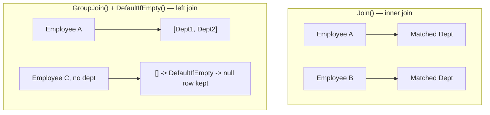
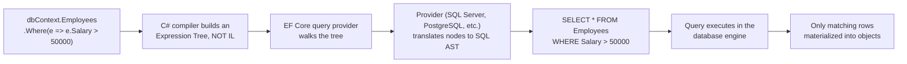

# LINQ — Senior .NET Interview Guide

> Audience: 10+ YOE .NET full-stack developer prepping for senior/lead interviews. Assumes fundamentals; focuses on nuance, trade-offs, "why," gotchas, and interviewer follow-ups.

## Table of Contents

- [Core Concepts](#core-concepts)
  - [What LINQ Is and Why It Exists](#what-linq-is-and-why-it-exists)
  - [LINQ Flavors](#linq-flavors)
  - [Query Syntax vs Method Syntax](#query-syntax-vs-method-syntax)
  - [Deferred vs Immediate Execution](#deferred-vs-immediate-execution)
  - [[new content] Closures Over Variables — The Classic Deferred Execution Trap](#new-content-closures-over-variables--the-classic-deferred-execution-trap)
- [Intermediate Concepts](#intermediate-concepts)
  - [Select vs SelectMany](#select-vs-selectmany)
  - [First/FirstOrDefault/Single/SingleOrDefault](#firstfirstordefaultsinglesingleordefault)
  - [Any / All](#any--all)
  - [GroupBy](#groupby)
  - [Join vs GroupJoin (Left Join)](#join-vs-groupjoin-left-join)
  - [Aggregate Functions and Aggregate()](#aggregate-functions-and-aggregate)
  - [Distinct, Except, Intersect, Union](#distinct-except-intersect-union)
  - [ToLookup() vs GroupBy()](#tolookup-vs-groupby)
  - [MaxBy, MinBy, DistinctBy, and Chunk (.NET 6+) [gaps]](#maxby-minby-distinctby-and-chunk-net-6-gaps)
  - [Take/Skip, Pagination, DefaultIfEmpty, Zip](#takeskip-pagination-defaultifempty-zip)
  - [ToDictionary and Non-Generic Collections](#todictionary-and-non-generic-collections)
  - [Let Clause](#let-clause)
  - [Cross Join](#cross-join)
- [Advanced Concepts](#advanced-concepts)
  - [IEnumerable\<T\> vs IQueryable\<T\>](#ienumerablet-vs-iqueryablet)
  - [[new content] Expression Trees and How LINQ-to-Entities Translates to SQL](#new-content-expression-trees-and-how-linq-to-entities-translates-to-sql)
  - [[new content] Client-Eval Fallback and Query Translation Limits (EF Core)](#new-content-client-eval-fallback-and-query-translation-limits-ef-core)
  - [[new content] yield return and Custom Iterators](#new-content-yield-return-and-custom-iterators)
  - [Custom LINQ Extension Methods](#custom-linq-extension-methods)
  - [Dynamic LINQ](#dynamic-linq)
  - [[new content] LINQ Method Chaining vs Query Syntax — When to Use Which](#new-content-linq-method-chaining-vs-query-syntax--when-to-use-which)
- [Performance](#performance)
  - [General Optimization Rules](#general-optimization-rules)
  - [[new content] The Multiple Enumeration Pitfall](#new-content-the-multiple-enumeration-pitfall)
  - [[new content] Hidden O(n²) Traps — Nested Where/Any Inside Select](#new-content-hidden-on²-traps--nested-whereany-inside-select)
  - [Parallel LINQ (PLINQ)](#parallel-linq-plinq)
  - [[new content] IAsyncEnumerable and System.Linq.Async](#new-content-iasyncenumerable-and-systemlinqasync)
  - [[new content] EF Core: AsNoTracking, Split Queries, and Compiled Queries](#new-content-ef-core-asnotracking-split-queries-and-compiled-queries)
  - [Window-Function Alternatives for Ranking Queries (Nth Highest Salary in Production) [gaps]](#window-function-alternatives-for-ranking-queries-nth-highest-salary-in-production-gaps)
- [Best Practices](#best-practices)
- [Common Pitfalls](#common-pitfalls)
- [Worked Coding Exercises](#worked-coding-exercises)
- [Senior-Level Query Challenges (with Solutions)](#senior-level-query-challenges-with-solutions)
- [Sample Interview Q&A](#sample-interview-qa)
- [Summary of Additions](#summary-of-additions)
- [Summary of [gaps] Additions (This Pass)](#summary-of-gaps-additions-this-pass)

---

## Core Concepts

### What LINQ Is and Why It Exists

LINQ (Language-Integrated Query) is a set of query operators baked into .NET that let you query in-memory collections, databases, XML, and other data sources using a single, consistent, strongly-typed syntax, instead of writing bespoke loops or hand-written SQL strings.

**Why it matters at senior level:** the interviewer isn't testing whether you know `Where()` exists — they're testing whether you understand that LINQ is really two things wearing the same syntax:
1. **LINQ to Objects** — ordinary delegates (`Func<T,bool>`) executed in-memory, one item at a time.
2. **LINQ to Entities / LINQ to SQL** — **expression trees** that get *translated* into another language (SQL) and executed remotely.

Conflating these two is the single most common source of production bugs and performance incidents involving LINQ (see [Client-Eval Fallback](#new-content-client-eval-fallback-and-query-translation-limits-ef-core) below).

**Key benefits:**
- Readability — declarative queries read closer to intent than imperative loops.
- Compile-time type safety and IntelliSense — typos become compiler errors, not runtime surprises.
- A uniform query surface across very different back ends (objects, SQL, XML, JSON).
- Deferred execution enables composable queries and, for `IQueryable`, query optimization before anything actually runs.

### LINQ Flavors

| Flavor | Target | Underlying Interface |
|---|---|---|
| LINQ to Objects | In-memory collections (arrays, `List<T>`, etc.) | `IEnumerable<T>` |
| LINQ to Entities | EF / EF Core databases | `IQueryable<T>` |
| LINQ to SQL | SQL Server (legacy ORM) | `IQueryable<T>` |
| LINQ to XML (XLinq) | XML documents (`XDocument`) | `IEnumerable<T>` |
| LINQ to JSON | JSON (via Newtonsoft `JToken`/System.Text.Json) | `IEnumerable<T>` |

```csharp
// LINQ to XML
XDocument xml = XDocument.Load("employees.xml");
var names = xml.Descendants("Employee").Select(e => e.Element("Name").Value);

// LINQ to JSON-derived objects — once deserialized, it's just LINQ to Objects
var users = JsonConvert.DeserializeObject<List<User>>(jsonData);
var activeUsers = users.Where(u => u.IsActive).ToList();
```

### Query Syntax vs Method Syntax

```csharp
// Query syntax (SQL-like)
var result = from emp in employees
             where emp.Age > 30
             select emp;

// Method syntax (fluent API)
var result = employees.Where(emp => emp.Age > 30);
```

Both compile to the same IL — query syntax is pure syntactic sugar translated by the compiler into method calls. Method syntax dominates in real codebases because it supports the full operator surface (`Sum`, `Count`, `Take`, etc., which have no query-syntax keyword) and composes better with method chaining. See the [dedicated comparison](#new-content-linq-method-chaining-vs-query-syntax--when-to-use-which) below for when query syntax genuinely wins.

### Deferred vs Immediate Execution

This is the single most-tested LINQ concept at every level, and the one most candidates can recite but not truly explain.

- **Deferred execution**: the query variable holds a *description* of the work (an iterator, or for `IQueryable`, an expression tree) — nothing runs until you enumerate it (`foreach`, `.ToList()`, `.Count()`, `.First()`, etc.).
- **Immediate execution**: methods that must produce a concrete answer right away — `.ToList()`, `.ToArray()`, `.ToDictionary()`, `.Count()`, `.Sum()`, `.First()`, `.Any()` when called directly (not chained further) — force enumeration on the spot.

```csharp
var result = employees.Where(emp => emp.Age > 30); // deferred — nothing has run yet
Console.WriteLine(result.Count());                  // query executes HERE

var result2 = employees.Where(emp => emp.Age > 30).ToList(); // executes immediately
```


**Why interviewers probe this:** deferred execution means the *same* query variable can produce *different* results each time you enumerate it if the underlying collection or captured variables changed in between — a classic "gotcha" question.

```csharp
var numbers = new List<int> { 1, 2, 3 };
var query = numbers.Where(n => n > 1);   // deferred
numbers.Add(4);
Console.WriteLine(string.Join(",", query)); // prints 2,3,4 — NOT 2,3
```

### [new content] Closures Over Variables — The Classic Deferred Execution Trap

This is the natural, more dangerous extension of deferred execution that the original notes only hinted at, and it's a favorite senior-level "gotcha" question because it also intersects with the infamous pre-C# 5 `foreach` variable-capture bug.

Deferred execution means the *lambda closes over variables by reference*, not by value at the time the query was written. If the captured variable changes before enumeration, the query sees the new value.

```csharp
int threshold = 30;
var query = employees.Where(e => e.Age > threshold); // captures 'threshold' by reference
threshold = 50;
var result = query.ToList(); // filters using 50, NOT 30 — surprises people every time
```

The historical version of this bug (fixed since C# 5.0 for `foreach`, but **still very much alive** for plain `for` loops and any manually-scoped mutable capture):

```csharp
var actions = new List<Action>();
for (int i = 0; i < 3; i++)
{
    actions.Add(() => Console.WriteLine(i)); // captures the SAME 'i' variable across iterations
}
actions.ForEach(a => a()); // prints 3, 3, 3 in old semantics for 'for'; NOT 0,1,2
```

Fix: capture a local copy inside the loop body.

```csharp
for (int i = 0; i < 3; i++)
{
    int local = i; // new variable per iteration
    actions.Add(() => Console.WriteLine(local));
}
```

Note: `foreach` loop variables have been effectively "new variable per iteration" since C# 5.0, so this specific trap doesn't apply to `foreach` anymore — but it's exactly this history that interviewers use to test whether you understand *why* the fix works, not just that it does. It's a direct real-world consequence of the closures behind deferred LINQ execution.

---

## Intermediate Concepts

### Select vs SelectMany

| | `Select()` | `SelectMany()` |
|---|---|---|
| Output shape | Preserves nesting — a collection of collections | Flattens one level of nesting into a single sequence |
| Typical use | Simple 1:1 projection | Projecting + flattening (e.g., all skills across all employees) |

```csharp
var result1 = students.Select(s => s.Courses);     // IEnumerable<List<string>>
var result2 = students.SelectMany(s => s.Courses); // IEnumerable<string>, flattened

var allSkills = employees.SelectMany(e => e.Skills); // flattened list of all skills across all employees
```

`SelectMany` is also how LINQ implements a **cross join** and how monadic "flatMap" composition works across nested collections — worth mentioning if the interviewer probes functional-programming parallels.

### First/FirstOrDefault/Single/SingleOrDefault

| Method | Behavior | Throws? |
|---|---|---|
| `First()` | Returns first matching element | Yes, if no match / sequence empty |
| `FirstOrDefault()` | Returns first match or `default(T)` | No |
| `Single()` | Expects exactly one match | Yes, if zero or more than one match |
| `SingleOrDefault()` | Expects zero or one match | Yes, if more than one match; returns default if zero |

```csharp
var firstUser = users.FirstOrDefault(u => u.Age > 30); // safe, no exception risk
var singleEmp = employees.Single(e => e.Id == 101);     // asserts uniqueness — use for PK lookups
```

**Senior nuance:** `Single()` is a good *assertion* — use it when the business rule genuinely guarantees uniqueness (e.g., primary key lookup) so that a data-integrity bug surfaces loudly instead of silently picking "the first one." Using `First()`/`FirstOrDefault()` when you actually mean "there should be exactly one" hides bugs.

### Any / All

```csharp
bool hasAdults = users.Any(u => u.Age >= 18);
bool allAdults = users.All(u => u.Age >= 18);
```

- `Any()` with no predicate is the idiomatic existence check — always prefer `collection.Any()` over `collection.Count() > 0` (see [Best Practices](#best-practices)).
- `All()` on an **empty sequence returns `true`** (vacuous truth) — a classic gotcha. `Any()` on an empty sequence returns `false`.

### GroupBy

```csharp
var groupedUsers = users.GroupBy(u => u.City);
foreach (var group in groupedUsers)
{
    Console.WriteLine($"City: {group.Key}, Count: {group.Count()}");
}
```

`GroupBy` returns `IEnumerable<IGrouping<TKey, TElement>>` — each `IGrouping` is itself an `IEnumerable<TElement>` with a `.Key`. It is **deferred**, and importantly, in LINQ-to-Objects it must buffer the *entire* source into groups before yielding the first group (it can't truly stream), which matters for large in-memory sets.

### Join vs GroupJoin (Left Join)

- `Join()` — inner join; produces one flat row per matching pair.
- `GroupJoin()` — produces one row *per left element*, with a nested collection of matches (naturally models a "left join" / one-to-many shape); combine with `.SelectMany(...DefaultIfEmpty())` to flatten into a true SQL-style left outer join.

```csharp
// Inner join
var result = employees.Join(departments,
    e => e.DeptID,
    d => d.ID,
    (e, d) => new { e.Name, d.Name });

// Left join (query syntax) — DefaultIfEmpty() includes unmatched left rows
var result2 = from emp in employees
              join dept in departments
                  on emp.DeptID equals dept.ID into empDept
              from d in empDept.DefaultIfEmpty()
              select new { emp.Name, Department = d?.Name ?? "No Department" };
```



### Aggregate Functions and Aggregate()

```csharp
int totalSalary = employees.Sum(emp => emp.Salary);
double avgSalary = employees.Average(emp => emp.Salary);

int product = numbers.Aggregate((a, b) => a * b); // custom cumulative operation
```

`Aggregate()` is LINQ's generic fold/reduce — useful when no built-in aggregate (`Sum`/`Max`/`Count`) fits, e.g., building a running string, computing a custom rolling metric, or composing objects. In EF Core, `Aggregate()` almost always **cannot** be translated to SQL and will force client evaluation or throw — know this trade-off before reaching for it against an `IQueryable`.

### Distinct, Except, Intersect, Union

| Method | Description |
|---|---|
| `Except()` | Elements in the first collection but not the second |
| `Intersect()` | Elements common to both collections |
| `Union()` | All unique elements from both collections (implicitly de-duplicates) |

```csharp
int[] a = { 1, 2, 3, 4 };
int[] b = { 3, 4, 5, 6 };
var except = a.Except(b);       // 1, 2
var intersect = a.Intersect(b); // 3, 4
var union = a.Union(b);         // 1, 2, 3, 4, 5, 6
```

All three use `EqualityComparer<T>.Default` unless you pass a custom `IEqualityComparer<T>` — for reference types with custom equality semantics (e.g., comparing DTOs by a subset of properties), forgetting the comparer is a common bug.

### ToLookup() vs GroupBy()

| Feature | `GroupBy()` | `ToLookup()` |
|---|---|---|
| Execution | Deferred | Immediate |
| Return type | `IEnumerable<IGrouping<K,V>>` | `ILookup<K,V>` |
| Indexable by key | No | Yes (`lookup["HR"]`) |
| Missing key behavior | N/A | Returns empty sequence, not an exception |

```csharp
var lookup = employees.ToLookup(e => e.Department);
Console.WriteLine(lookup["HR"].Count());
```

### MaxBy, MinBy, DistinctBy, and Chunk (.NET 6+) [gaps]

The original notes reference `MaxBy` and `DistinctBy` in a couple of places ("or `MaxBy` — see gap below", "or `.DistinctBy(...)` (see .NET 6+ gap below)") without ever actually covering them — these four operators (`MaxBy`, `MinBy`, `DistinctBy`, `Chunk`) shipped in `System.Linq` with .NET 6 and are now fair game in any current senior interview, since they replace verbose, easy-to-get-wrong idioms that predate them.

- **`MaxBy` / `MinBy`** — return the *element* with the max/min projected key, instead of `Max()`/`Min()` which return only the projected value itself. This directly fixes the Q6/Q15-style bug flagged earlier in this guide (using `.Max(f => f.AverageSalary)` and losing the associated department).
- **`DistinctBy`** — de-duplicates by a projected key instead of the whole element, without needing a custom `IEqualityComparer<T>`.
- **`Chunk`** — splits a sequence into fixed-size batches (the last batch may be smaller), returning `IEnumerable<T[]>`. Common use: batching bulk inserts/API calls to respect a max-batch-size limit.

```csharp
// MaxBy / MinBy — keeps the whole element, not just the projected value
var highestPaid = employees.MaxBy(e => e.Salary);   // Employee, not decimal
var lowestPaid = employees.MinBy(e => e.Salary);     // Employee, not decimal

// Equivalent to the older, more verbose idiom:
var highestPaidOld = employees.OrderByDescending(e => e.Salary).First();

// DistinctBy — de-dup by a key selector, no custom IEqualityComparer needed
var oneEmployeePerDept = employees.DistinctBy(e => e.DepartmentId);

// Chunk — batch a sequence into arrays of at most N elements
foreach (int[] batch in employeeIds.Chunk(100))
{
    await bulkApiClient.ProcessBatchAsync(batch); // e.g., respecting a 100-item API limit
}
```

**Gotchas/follow-ups an interviewer might raise:**
- `MaxBy`/`MinBy` return `default(T)` (e.g., `null` for reference types) on an empty sequence rather than throwing — unlike `Max()`/`Min()`, which throw `InvalidOperationException` on an empty sequence of a non-nullable value type. Know this asymmetry.
- If multiple elements tie for the max/min key, `MaxBy`/`MinBy` return the **first** one encountered — same tie-breaking semantics as `OrderBy...First()`, not an arbitrary/undefined pick.
- As of EF Core 8, `MaxBy`/`MinBy`/`DistinctBy`/`Chunk` translation support against `IQueryable` varies by provider and version — verify against your EF Core version and the generated SQL before assuming these push down to the database rather than triggering client evaluation.
- `Chunk`'s last batch can be shorter than the requested size — always handle a partial final batch rather than assuming a fixed length.

### Take/Skip, Pagination, DefaultIfEmpty, Zip

```csharp
// Pagination
int pageSize = 5, pageNumber = 2;
var pagedEmployees = employees.Skip((pageNumber - 1) * pageSize).Take(pageSize);

// DefaultIfEmpty
var result = employees.Where(e => e.ID == 100).DefaultIfEmpty(new Employee { Name = "Not Found" });

// Zip — merges two sequences element-wise, stops at the shorter one
var combined = names.Zip(ages, (name, age) => $"{name} is {age} years old.");
```

**Senior gotcha with `Skip`/`Take` pagination against `IQueryable`:** always pair with `OrderBy` — SQL makes no ordering guarantee without one, so paging without an explicit sort produces non-deterministic page contents/duplicates across pages under concurrent writes.

### ToDictionary and Non-Generic Collections

```csharp
var empDict = employees.ToDictionary(e => e.ID, e => e.Name);

// Non-generic collections need casting
ArrayList list = new ArrayList { 1, 2, 3, 4 };
var numbers = list.Cast<int>().Where(n => n > 2);
```

`ToDictionary` throws `ArgumentException` on duplicate keys — a very common runtime surprise when the "unique key" assumption doesn't hold in real data. Consider `GroupBy` + `ToDictionary(g => g.Key, g => g.ToList())` or `.DistinctBy(...)` (see .NET 6+ gap below) when duplicates are possible.

### Let Clause

```csharp
var result = from e in employees
             let bonus = e.Salary * 0.1m
             select new { e.Name, Bonus = bonus };
```

`let` only exists in query syntax; the method-syntax equivalent is an intermediate `Select` projecting an anonymous type, or simply inlining the calculation. It's mainly a readability aid to avoid recomputing an expression multiple times within the same query.

### Cross Join

```csharp
var result = from e in employees
             from d in departments
             select new { e.Name, d.Name };
```

Equivalent to `employees.SelectMany(e => departments, (e, d) => new { e.Name, d.Name })` — the Cartesian product of both sequences. Rare in practice; usually a bug when it appears unintentionally (e.g., forgetting a `where` correlating the two sequences).

---

## Advanced Concepts

### IEnumerable\<T\> vs IQueryable\<T\>

This is the highest-signal LINQ question at senior level — it separates people who've memorized flash cards from people who've actually debugged a slow EF query in production.

| Feature | `IEnumerable<T>` | `IQueryable<T>` |
|---|---|---|
| Represents | A sequence + a delegate (`Func<T,...>`) | A sequence + an **expression tree** (`Expression<Func<T,...>>`) |
| Typical source | In-memory collections (LINQ to Objects) | ORMs — EF Core, LINQ to SQL (LINQ to Entities) |
| Where filtering happens | In application memory, after the full source is materialized/iterated | Translated to the target query language (SQL) and executed at the source |
| Deferred execution | Yes | Yes |
| Composability | Each `.Where()` adds a delegate to a chain executed per item | Each `.Where()` adds a node to the expression tree; the *whole* tree is translated once, at enumeration time |
| Performance for large remote datasets | Poor — pulls everything into memory first | Good — filtering/sorting/paging pushed to the database |
| Can it call arbitrary C# methods in the predicate? | Yes, anything | No — only what the provider (e.g., EF Core) knows how to translate to SQL |

```csharp
IEnumerable<int> data1 = numbers.Where(n => n > 5);                       // in-memory
IQueryable<int> data2 = dbContext.Employees.Where(e => e.Salary > 50000); // translated to SQL, runs in DB
```

**The trap interviewers dig for:** if you call `.AsEnumerable()` (or accidentally trigger an implicit cast to `IEnumerable<T>`, e.g., by calling a non-translatable method) *before* your final `Where()`, that filter now runs client-side, in-memory, after pulling the *entire* table across the wire. This is quietly catastrophic on large tables and is one of the most common EF performance bugs in real codebases.

```csharp
// BAD: pulls all employees into memory, then filters in C#
var result = dbContext.Employees.AsEnumerable().Where(e => e.Salary > 50000);

// GOOD: filter is translated to SQL WHERE clause, only matching rows come back
var result = dbContext.Employees.Where(e => e.Salary > 50000);
```

### [new content] Expression Trees and How LINQ-to-Entities Translates to SQL

The original notes mention expression trees in one line (`Expression<Func<int,bool>> isEven = n => n % 2 == 0;`) without explaining *why* they exist or how the SQL translation pipeline actually works — this is exactly the follow-up a senior interviewer will ask after the `IEnumerable` vs `IQueryable` question.

A lambda assigned to a `Func<T,...>` compiles to **IL** — an executable delegate. A lambda assigned to an `Expression<Func<T,...>>` compiles to **data**: a tree of `Expression` node objects (`BinaryExpression`, `MemberExpression`, `ConstantExpression`, etc.) that *describes* the code without running it.



This is *why* `IQueryable<T>`'s `Where` parameter type is `Expression<Func<T,bool>>` while `IEnumerable<T>`'s is a plain `Func<T,bool>` — the provider needs the *tree*, not a compiled delegate, to be able to translate it into another language.

```csharp
Expression<Func<Employee, bool>> isHighEarner = e => e.Salary > 50000;
// isHighEarner.Body, .Parameters, etc. can be inspected/rewritten at runtime —
// this is what libraries like AutoMapper's ProjectTo, Dynamic LINQ, and
// custom query-builder abstractions rely on.
```

Practical implication: any C# construct with no SQL equivalent (custom methods, most string-formatting helpers, complex pattern matching) either throws `InvalidOperationException` (older EF/strict providers) or triggers client evaluation (EF Core, with a warning) if used inside a predicate that must be translated.

### [new content] Client-Eval Fallback and Query Translation Limits (EF Core)

This is arguably the highest real-world-impact LINQ gap in the original notes — "how EF handles large datasets" is mentioned, but the actual danger of **silent client-side evaluation** is not.

EF Core (unlike EF6, which threw hard errors) will, by default, try to translate as much of a query to SQL as possible, and **silently pull the untranslatable part into memory** and evaluate it client-side — logging only a warning (which is easy to miss in production without proper logging configuration).

```csharp
// Looks fine, but Regex.IsMatch has no SQL translation.
var result = dbContext.Employees
    .Where(e => Regex.IsMatch(e.Name, "^A"))   // EF Core: client-eval warning, pulls ALL rows first
    .ToList();
```

Common untranslatable constructs to know cold:
- Calls to arbitrary instance/static C# methods without a provider-specific translation (custom validators, most regex, culture-specific string ops).
- `Aggregate()`, most LINQ operators requiring a custom `IComparer`/`IEqualityComparer`.
- Complex nested ternary/pattern-matching in some provider versions (verify against your EF Core version — translation support expands every release).
- Anything after you've already dropped to `IEnumerable` (e.g., via `.AsEnumerable()`, `.ToList()`, or a method that only exists on `IEnumerable`).

**Mitigation:**
- In EF Core 3.0+, configure `QueryTrackingBehavior`/logging so client evaluation warnings become **errors** in non-production environments: `optionsBuilder.ConfigureWarnings(w => w.Throw(RelationalEventId.QueryClientEvaluationWarning))` (exact API surface varies by EF Core version — verify against the version in use).
- Push as much filtering/projection into the part of the query that stays `IQueryable`; only call `.AsEnumerable()`/`.ToList()` as the *last* step.
- Use `.Select()` to project onto exactly the columns needed before materializing — reduces both translation risk and network/memory cost.

### [new content] yield return and Custom Iterators

The notes ask "how do you write a custom LINQ extension method?" but only show a wrapper around `Where()` — the real senior-level question is "how would you write one that streams and defers, the way built-in operators do?" The answer is `yield return`.

```csharp
public static IEnumerable<TSource> WhereGreaterThan<TSource, TKey>(
    this IEnumerable<TSource> source,
    Func<TSource, TKey> selector,
    TKey threshold) where TKey : IComparable<TKey>
{
    foreach (var item in source)
    {
        if (selector(item).CompareTo(threshold) > 0)
            yield return item; // pauses here; resumes on next MoveNext()
    }
}
```

The C# compiler rewrites a `yield return` method into a compiler-generated state machine implementing `IEnumerator<T>` — this is *how* `Where`, `Select`, and friends achieve deferred, streaming (one-item-at-a-time) execution without buffering the whole sequence in memory. Understanding this explains:
- Why LINQ-to-Objects operators are memory-efficient for streaming large sequences (no full materialization needed for a simple `Where().Select()` chain).
- Why exceptions thrown inside a `yield return` iterator surface only when `MoveNext()` is called during enumeration, not when the method is called — a common source of confusing stack traces ("the exception looks like it's thrown far from where the query was built").
- A subtle gotcha: argument validation inside an iterator method **doesn't run until first enumeration**, since the method body doesn't execute until `MoveNext()` — to get eager validation, split into a public non-iterator wrapper that validates, then calls a private iterator.

```csharp
public static IEnumerable<T> SafeWhere<T>(this IEnumerable<T> source, Func<T, bool> predicate)
{
    if (source is null) throw new ArgumentNullException(nameof(source)); // validated eagerly
    if (predicate is null) throw new ArgumentNullException(nameof(predicate));
    return SafeWhereIterator(source, predicate); // deferred part factored out
}

private static IEnumerable<T> SafeWhereIterator<T>(IEnumerable<T> source, Func<T, bool> predicate)
{
    foreach (var item in source)
        if (predicate(item))
            yield return item;
}
```

### Custom LINQ Extension Methods

```csharp
public static class MyExtensions
{
    public static IEnumerable<int> GetEvens(this IEnumerable<int> numbers)
        => numbers.Where(n => n % 2 == 0);
}

// Usage
var evens = numbers.GetEvens();
```

### Dynamic LINQ

```csharp
// Requires System.Linq.Dynamic.Core
var result = employees.AsQueryable().Where("Salary > 50000").ToList();
```

Useful for building filters/sorts from runtime configuration (e.g., a search UI with user-selectable filter fields) without hand-rolling expression-tree construction. Trade-off: string-based predicates lose compile-time safety and are a potential injection surface if field names/operators come directly from untrusted user input — always validate against an allow-list of column names.

### [new content] LINQ Method Chaining vs Query Syntax — When to Use Which

The original notes present query syntax and method syntax as simply "two ways to write the same thing" without giving a real decision rule — a senior interviewer will want the "why," not just "both work."

| Scenario | Prefer |
|---|---|
| Simple filter/projection/sort chains | Method syntax — reads naturally left-to-right, composes with any operator |
| Queries with multiple `join`s, especially `GroupJoin` + `DefaultIfEmpty` (left join) | Query syntax — the `into`/`from` shape is meaningfully more readable than nested `Join`/`SelectMany` calls |
| Queries needing `let` for an intermediate named value used multiple times | Query syntax — no clean method-syntax equivalent without an extra explicit `Select` |
| Anything using operators with no query-syntax keyword: `Sum`, `Count`, `Take`, `Skip`, `Distinct`, `Any`, `Aggregate`, etc. | Method syntax — mandatory, since query syntax has no keyword for these |
| Fluent, incrementally-built queries (e.g., conditionally appending `.Where()` based on filter flags) | Method syntax — trivially composable by reassigning the query variable |

```csharp
// Conditional composition — natural in method syntax, awkward in query syntax
IQueryable<Employee> query = dbContext.Employees;
if (minSalary.HasValue) query = query.Where(e => e.Salary >= minSalary.Value);
if (!string.IsNullOrEmpty(department)) query = query.Where(e => e.Department == department);
```

In practice, most production code is method syntax by default, dropping into query syntax specifically for multi-join or `let`-heavy queries, then converting back — you can mix both in the same expression via query syntax's implicit method-call translation.

---

## Performance

### General Optimization Rules

- Use `.AsEnumerable()` deliberately (and only after all possible server-side filtering is done) to switch from LINQ-to-Entities to LINQ-to-Objects for the remainder of the pipeline.
- Avoid calling `.ToList()`/`.ToArray()` prematurely — it forces immediate execution and materializes the *entire* result, defeating further query composition and provider-side optimization (e.g., you lose the ability to add another `Where` that would've been pushed to SQL).
- Prefer `.Any()` over `.Count() > 0` for existence checks — `Any()` short-circuits on the first match; `Count()` (especially against `IQueryable`) may require a full `COUNT(*)` scan or full enumeration.
- Filter early with `Where()` before `Select()`/`OrderBy()` — reduces the working set as early as possible in the pipeline, and against `IQueryable`, produces a smaller/cheaper translated query.
- For `IQueryable`, always pair `Skip`/`Take` paging with `OrderBy` for deterministic results.

### [new content] The Multiple Enumeration Pitfall

This is one of the most common real-world LINQ performance bugs and is entirely absent from the original notes, despite being a near-guaranteed senior-interview question ("what's wrong with this code?").

```csharp
IEnumerable<Employee> highEarners = employees.Where(e => e.Salary > 50000); // deferred, not yet run

int count = highEarners.Count();       // enumeration #1 — full pass over 'employees'
var list = highEarners.ToList();       // enumeration #2 — full pass AGAIN
if (highEarners.Any()) { ... }         // enumeration #3 — full pass AGAIN
```

Each of `Count()`, `ToList()`, `Any()` re-runs the `Where` predicate from scratch against the *original* source, because the variable holds an undecided iterator, not a cached result. Consequences:
- **Performance**: for LINQ-to-Objects, 3x the work for no reason. For LINQ-to-Entities, this is **3 separate round trips to the database**, each re-running the query.
- **Correctness**: if the source is something that changes between enumerations (a live collection, a non-deterministic generator, or a database that's being written to concurrently), each enumeration can return *different* results — inconsistent counts, list contents, and `Any()` results that don't agree with each other.

**Fix:** materialize once with `.ToList()` (or `.ToArray()`) as soon as you know you'll need the results more than once, then work off that materialized snapshot.

```csharp
var highEarners = employees.Where(e => e.Salary > 50000).ToList(); // ONE enumeration, cached

int count = highEarners.Count;   // property on List<T>, no re-enumeration
var list = highEarners;          // already a list
if (highEarners.Any()) { ... }   // cheap, operates on the materialized list
```

Static analysis tools (Roslyn analyzers, ReSharper) flag this as "possible multiple enumeration of IEnumerable" — worth mentioning if asked how you'd catch this class of bug at scale/in code review.

### [new content] Hidden O(n²) Traps — Nested Where/Any Inside Select

Not covered in the original notes at all, and a very common real "why is this endpoint slow" root cause once collections grow past a few thousand items.

```csharp
// O(n * m): for every employee, linearly scans the entire departments list
var result = employees.Select(e => new
{
    e.Name,
    DeptName = departments.FirstOrDefault(d => d.Id == e.DepartmentId)?.Name
});

// Similarly O(n * m): Any() inside Select/Where re-scans 'blockedIds' for every item
var filtered = employees.Where(e => !blockedIds.Any(b => b == e.Id));
```

If `employees` has n rows and `departments`/`blockedIds` has m rows, this is O(n·m) — fine for small m, disastrous once both collections scale (e.g., a report joining 50,000 orders against 50,000 customers linearly is 2.5 billion comparisons).

**Fix:** pre-index the lookup side into a `Dictionary`/`HashSet`/`ILookup` (O(1) or O(log n) lookups), or better, use an actual `Join`/`GroupJoin` which LINQ (and especially LINQ-to-Entities/SQL) can execute far more efficiently (hash join / indexed join at the database level).

```csharp
// O(n + m): build the lookup once, then O(1) per employee
var deptById = departments.ToDictionary(d => d.Id, d => d.Name);
var result = employees.Select(e => new
{
    e.Name,
    DeptName = deptById.TryGetValue(e.DepartmentId, out var name) ? name : null
});

// O(n + m) with a HashSet
var blockedSet = blockedIds.ToHashSet();
var filtered = employees.Where(e => !blockedSet.Contains(e.Id));

// Or, idiomatically, just use Join — same O(n+m) hash-join semantics, and
// translates to an efficient SQL JOIN against IQueryable
var result2 = employees.Join(departments, e => e.DepartmentId, d => d.Id,
    (e, d) => new { e.Name, DeptName = d.Name });
```

This exact pattern — "nested lambda re-scanning a second collection inside `Select`/`Where`" — is the most common LINQ-specific complexity bug interviewers ask candidates to spot in a code-review-style question.

### Parallel LINQ (PLINQ)

```csharp
var results = users.AsParallel().Where(u => u.Age > 30).ToList();
```

PLINQ partitions the source across multiple threads/cores and merges results, which can significantly speed up CPU-bound, embarrassingly-parallel work on large in-memory collections.

**Trade-offs an interviewer expects you to raise unprompted:**
- **Overhead** — for small collections or cheap predicates, the partitioning/merging overhead exceeds the benefit; PLINQ can be *slower* than sequential LINQ. Benchmark, don't assume.
- **Ordering** — results are unordered by default; use `.AsOrdered()` if order must be preserved (at a performance cost).
- **Not for I/O-bound or database work** — `IQueryable` against EF is not meant to be parallelized this way; PLINQ is a LINQ-to-Objects (in-memory, CPU-bound) tool. `DbContext` is also not thread-safe — never fan out EF queries via PLINQ against the same context.
- **Side effects / thread safety** — predicates/projections used inside `AsParallel()` must be side-effect-free or properly synchronized; mutating shared state from parallel lambdas is a race condition waiting to happen.
- **Exception handling** — exceptions from multiple partitions are aggregated into an `AggregateException`, not surfaced individually — code must be ready to unwrap it.
- Use `.WithDegreeOfParallelism(n)` to cap thread usage in shared/server environments where unconstrained parallelism could starve other work.

### [new content] IAsyncEnumerable and System.Linq.Async

The original notes have no mention of async streaming, which is now a standard senior-level EF Core / high-throughput API question given `IAsyncEnumerable<T>` has been mainstream since C# 8 / .NET Core 3.0.

`IEnumerable<T>`/`IQueryable<T>` enumeration is synchronous — pulling the next item blocks the calling thread. `IAsyncEnumerable<T>` (consumed via `await foreach`) allows each `MoveNextAsync()` to yield the thread back while waiting on I/O (e.g., waiting for the next batch of rows from the database), which matters for scalability under load.

```csharp
// EF Core: streams rows as they arrive from the DB instead of blocking until all are read
await foreach (var employee in dbContext.Employees.Where(e => e.Salary > 50000).AsAsyncEnumerable())
{
    Process(employee);
}
```

For LINQ-to-Objects style composition over async streams (`Select`, `Where`, `SelectMany` on an `IAsyncEnumerable<T>`), the **`System.Linq.Async`** NuGet package (from `dotnet/reactive`) provides the async LINQ operator set, since the BCL's own LINQ operators only target `IEnumerable<T>`/`IQueryable<T>`.

```csharp
using System.Linq; // System.Linq.Async extension methods on IAsyncEnumerable<T>

var filtered = dbContext.Employees.AsAsyncEnumerable()
    .Where(e => e.IsActive)
    .Select(e => e.Name);

await foreach (var name in filtered) { ... }
```

Know the distinction for interviews: `Task<IEnumerable<T>>` (one big async wait, then a synchronous in-memory sequence) vs `IAsyncEnumerable<T>` (a genuinely async *stream*, items delivered incrementally) — the latter is the right tool for large result sets or server-streaming scenarios (e.g., gRPC streaming, paged API responses, Minimal API endpoints returning huge datasets without buffering them all in memory first).

### [new content] EF Core: AsNoTracking, Split Queries, and Compiled Queries

The notes mention "how does LINQ handle large datasets efficiently" only at a generic level (`IQueryable`, `AsEnumerable`, deferred execution) — these are the concrete, current (EF Core 5+) levers senior engineers are expected to know by name.

- **`.AsNoTracking()`** — for read-only queries, skips EF Core's change-tracking overhead (no snapshot comparison, no identity map maintenance). Significant win for reporting/read-heavy endpoints. `.AsNoTrackingWithIdentityResolution()` keeps identity resolution (same entity instance for repeated references) without full change tracking.
- **Split queries (`.AsSplitQuery()`)** — when eager-loading multiple `Include()` collection navigations, EF Core defaults to a single SQL query with JOINs, which can produce a "cartesian explosion" (row count multiplies across each included collection). `.AsSplitQuery()` issues separate SQL queries per collection instead, trading round trips for avoiding the multiplication blow-up. Know both directions of this trade-off — more round trips vs quadratic row bloat — since it's genuinely context-dependent which is faster.
- **Compiled queries (`EF.CompileQuery` / `EF.CompileAsyncQuery`)** — pre-compiles the expression-tree-to-SQL translation once, bypassing that translation cost on every subsequent call. Matters for hot-path queries executed extremely frequently; usually unnecessary micro-optimization elsewhere since EF Core already caches query plans internally by default.
- **Projection over full-entity loading** — `.Select(e => new EmployeeDto { ... })` before materializing avoids pulling unused columns and skips change tracking machinery entirely for the unselected shape — often a bigger win than any of the above for read-only API endpoints.

```csharp
var dtos = await dbContext.Employees
    .AsNoTracking()
    .Where(e => e.IsActive)
    .Select(e => new EmployeeDto { Id = e.Id, Name = e.Name })
    .ToListAsync();
```

### Window-Function Alternatives for Ranking Queries (Nth Highest Salary in Production) [gaps]

The Worked Coding Exercises and Senior-Level Query Challenges sections above solve "Nth highest salary" and "top/Nth per group" problems with `Distinct().OrderByDescending().Skip(n).FirstOrDefault()` (Q2, "Second highest salary") and a nested `GroupBy` + `Distinct().OrderByDescending().Skip(n)` (Q11, "Third highest salary per department"). Those are the right answers for LINQ-to-Objects (in-memory) or as an interview warm-up, but a senior interviewer will follow up with: **"how would you do this against a production database with millions of rows?"** The honest answer is: you usually don't — you push ranking down to the database's native window functions instead of pulling rows into memory to rank them in C#.

**Why pushing down to SQL window functions is usually better:**
- **Avoids full materialization** — `Skip(n)` translated against `IQueryable` still generally requires the database to compute and order the *entire* qualifying result set before skipping; a window function like `ROW_NUMBER()` lets the query optimizer use an index on the ordering column and, in many plans, avoid a full sort/scan entirely.
- **Set-based, not row-by-row** — `RANK()`/`DENSE_RANK()`/`ROW_NUMBER() OVER (PARTITION BY ... ORDER BY ...)` is exactly the primitive the database engine was built to optimize; nested nested-`GroupBy`-then-rank shapes (like Q11's per-department third-highest) are historically some of the hardest patterns for EF Core to translate correctly (see the note under Q30 above) and often silently fall back to client evaluation on older EF Core/EF6 versions.
- **One round trip, one query plan** — instead of pulling a department's worth (or the whole table's worth) of rows across the wire and ranking in C#, you get back exactly the N rows you asked for.
- **Correct handling of ties is explicit** — `RANK()` (ties share a rank, leaving gaps), `DENSE_RANK()` (ties share a rank, no gaps), and `ROW_NUMBER()` (strict, arbitrary tie-break by the `ORDER BY`) map to three genuinely different business rules for "Nth highest" that are easy to get subtly wrong when hand-rolled with `Distinct()`/`Skip()` in LINQ.

```sql
-- Nth highest salary per department using window functions (SQL Server dialect)
-- Compare against Q11's LINQ GroupBy + Distinct().OrderByDescending().Skip(2) equivalent
WITH RankedSalaries AS (
    SELECT
        e.DepartmentId,
        e.Name,
        e.Salary,
        DENSE_RANK() OVER (PARTITION BY e.DepartmentId ORDER BY e.Salary DESC) AS SalaryRank
    FROM Employees e
)
SELECT DepartmentId, Name, Salary
FROM RankedSalaries
WHERE SalaryRank = 3; -- "third highest salary per department" — DENSE_RANK avoids skipping ranks on ties
```

```csharp
// EF Core: raw SQL for the ranking, still returned as strongly-typed rows.
// FromSqlRaw works when mapping to an existing entity/keyless type; SqlQuery<T> (EF Core 8+)
// is the newer, more flexible option for arbitrary projections that aren't a full tracked entity.

// EF Core 8+ : SqlQuery<T> — no need for a DbSet-mapped entity, works for scalar/DTO projections
var thirdHighestPerDept = await dbContext.Database
    .SqlQuery<DeptSalaryRankDto>($"""
        WITH RankedSalaries AS (
            SELECT DepartmentId, Name, Salary,
                   DENSE_RANK() OVER (PARTITION BY DepartmentId ORDER BY Salary DESC) AS SalaryRank
            FROM Employees
        )
        SELECT DepartmentId, Name, Salary FROM RankedSalaries WHERE SalaryRank = 3
        """)
    .ToListAsync();

// Pre-EF Core 8 / entity-shaped result: FromSqlRaw against a mapped (or keyless) entity type
var thirdHighestPerDeptLegacy = await dbContext.Employees
    .FromSqlRaw(@"
        WITH RankedSalaries AS (
            SELECT e.*, DENSE_RANK() OVER (PARTITION BY DepartmentId ORDER BY Salary DESC) AS SalaryRank
            FROM Employees e
        )
        SELECT * FROM RankedSalaries WHERE SalaryRank = 3")
    .ToListAsync();

public record DeptSalaryRankDto(int DepartmentId, string Name, decimal Salary);
```

**When the LINQ/in-memory version (Q2, Q11) is still fine:** small, already-materialized collections (config data, a page's worth of results already fetched, unit tests), or a genuine LINQ-to-Objects scenario with no database involved at all. The trade-off flips once the source is an `IQueryable` over a real, growing table — that's when window functions via raw SQL (or, in modern EF Core, the provider's own translation of `GroupBy`+ranking where supported) become the production-grade answer. Always verify the actual generated SQL/execution plan either way — don't assume translation happened just because the LINQ compiled.

---

## Best Practices

- Prefer method syntax by default; use query syntax for multi-join / `let`-heavy queries (see comparison above).
- Materialize (`.ToList()`/`.ToArray()`) exactly once, at the point you know you'll enumerate more than once — avoid the [multiple enumeration pitfall](#new-content-the-multiple-enumeration-pitfall).
- Filter (`Where`) as early as possible in the chain, especially against `IQueryable`, to push work to the database.
- Use `Any()` instead of `Count() > 0` for existence checks.
- Keep everything you need translated to SQL inside the `IQueryable` portion of the pipeline; only call `.AsEnumerable()`/`.ToList()` as the final step, and be alert to [client-eval fallback](#new-content-client-eval-fallback-and-query-translation-limits-ef-core).
- Pre-index lookup collections (`Dictionary`/`HashSet`/`ToLookup`) before nesting a scan inside `Select`/`Where` — avoid [O(n²) traps](#new-content-hidden-on²-traps--nested-whereany-inside-select).
- Use `AsNoTracking()` for read-only EF Core queries.
- Project onto DTOs with `Select()` before materializing to avoid over-fetching columns and unnecessary change tracking.
- Always pair `Skip`/`Take` with `OrderBy` against `IQueryable` sources for deterministic pagination.
- Benchmark before reaching for `AsParallel()` — it's not free, and it's the wrong tool for I/O-bound/database work.
- Use `.ToList()` before mutating a collection you're currently iterating with `foreach` (removes/inserts during iteration throw `InvalidOperationException` otherwise).

---

## Common Pitfalls

- **Multiple enumeration** of a deferred `IEnumerable`/`IQueryable` — silently re-runs the query (and, for EF, re-hits the database) every time. See dedicated section above.
- **Closures over mutable variables** captured by reference in deferred queries producing unexpected results after the variable changes. See dedicated section above.
- **Client-side evaluation fallback** in EF Core silently pulling entire tables into memory when a predicate can't be translated to SQL.
- **`All()` on an empty sequence returns `true`** (vacuous truth) — easy to get backwards versus `Any()` returning `false` on empty.
- **`ToDictionary()` throws on duplicate keys** — don't assume uniqueness without verifying, especially against live/dirty data.
- **Modifying a collection while iterating it** throws `InvalidOperationException`; snapshot with `.ToList()` first.
- **Forgetting `OrderBy` before `Skip`/`Take`** against a database — paging is non-deterministic without an explicit sort.
- **Nested `Where`/`Any`/`FirstOrDefault` scans inside `Select`** causing hidden O(n²) behavior at scale.
- **Confusing `IEnumerable` and `IQueryable`** — calling `.AsEnumerable()` (or any non-translatable method) too early, moving filtering from the database to application memory.
- **Assuming `GroupBy` streams like `Where`/`Select`** — in LINQ-to-Objects it must buffer the whole source before yielding the first group.

---

## Worked Coding Exercises

These are foundational patterns; know them cold, they're the building blocks for the harder senior challenges below.

```csharp
// 1. Even numbers
var evenNumbers = numbers.Where(n => n % 2 == 0).ToList();

// 2. Employees earning > 50,000
var highEarners = employees.Where(e => e.Salary > 50000).Select(e => e.Name);

// 3. Duplicate numbers
var duplicates = numbers.GroupBy(n => n).Where(g => g.Count() > 1).Select(g => g.Key).ToList();

// 4. Word frequency count
var wordCount = sentence.Split(' ').GroupBy(w => w).Select(g => new { Word = g.Key, Count = g.Count() });

// 5. Second highest salary (single sort, no duplicate sort pass)
var secondHighest = salaries.Distinct().OrderByDescending(s => s).Skip(1).FirstOrDefault();

// 6. Top 3 expensive products
var top3Expensive = products.OrderByDescending(p => p.Price).Take(3).Select(p => p.Name);

// 7. Group employees by department (see GroupBy section above)

// 8. Uppercase transform
var upperNames = names.Select(name => name.ToUpper());

// 9. Names starting with 'A'
var aNames = employees.Where(name => name.StartsWith("A")).ToList();

// 10. Inner join students to scores
var studentScores = students.Join(scores,
    student => student,
    score => score.StudentId,
    (student, score) => new { StudentId = student, Score = score.Score });
```

---

## Senior-Level Query Challenges (with Solutions)

Dataset used throughout (as in source notes):

```csharp
public class Employee
{
    public int Id { get; set; }
    public string Name { get; set; }
    public int DepartmentId { get; set; }
    public decimal Salary { get; set; }
    public DateTime JoiningDate { get; set; }
}

public class Department
{
    public int Id { get; set; }
    public string Name { get; set; }
}

public class Order
{
    public int Id { get; set; }
    public int CustomerId { get; set; }
    public decimal Amount { get; set; }
    public DateTime OrderDate { get; set; }
}

public class Customer
{
    public int Id { get; set; }
    public string Name { get; set; }
    public string City { get; set; }
}
```

### Level 1 — Medium

**Q1. Employees earning more than the average salary.**
```csharp
var avg = employees.Average(e => e.Salary);
var result = employees.Where(e => e.Salary > avg);
```
*Gotcha:* against `IQueryable`, this requires two round trips (or EF Core translating it into a subquery) — verify the generated SQL if performance matters; sometimes better expressed as a single query with a windowed average.

**Q2. Second highest salary — do not sort twice.**
```csharp
var secondHighest = salaries.Distinct().OrderByDescending(s => s).Skip(1).FirstOrDefault();
```
One `OrderByDescending`, `Distinct()` first to collapse ties before ranking.

**Q3. Employees who joined in the last 6 months.**
```csharp
var cutoff = DateTime.Today.AddMonths(-6);
var recentJoiners = employees.Where(e => e.JoiningDate >= cutoff);
```

**Q4. Names ordered by DepartmentId ascending, Salary descending.**
```csharp
var ordered = employees.OrderBy(e => e.DepartmentId).ThenByDescending(e => e.Salary).Select(e => e.Name);
```

**Q5. Top 5 highest paid employees.**
```csharp
var top5 = employees.OrderByDescending(e => e.Salary).Take(5);
```

### Level 2 — Upper Medium

**Q6. Department with the highest average salary.**
```csharp
var topDept = employees.GroupBy(e => e.DepartmentId)
    .Select(g => new { DeptId = g.Key, AvgSalary = g.Average(e => e.Salary) })
    .OrderByDescending(x => x.AvgSalary)
    .First(); // do NOT use Max() here if you need the department, not just the value — see note below
```
*Note on the original source:* the notes' `Day2` sample computed `.Max(f => f.AverageSalary)` which returns only the **numeric max**, discarding which department it belongs to. Use `OrderByDescending(...).First()` (or `MaxBy` — see gap below) to keep the associated key.

**Q7. Highest paid employee per department (joined to department name).**
```csharp
var highestPaidByDept = employees.GroupBy(e => e.DepartmentId)
    .Select(g => new { DeptId = g.Key, Top = g.OrderByDescending(e => e.Salary).First() })
    .Join(departments, x => x.DeptId, d => d.Id, (x, d) => new { Dept = d.Name, x.Top.Name, x.Top.Salary });
```

**Q8. Duplicate employee names.**
```csharp
var dupNames = employees.GroupBy(e => e.Name).Where(g => g.Count() > 1).Select(g => g.Key);
```

**Q9. Employees joined per year.**
```csharp
var perYear = employees.GroupBy(e => e.JoiningDate.Year)
    .Select(g => new { Year = g.Key, Count = g.Count() });
```

**Q10. Employees whose salary is above their department average.** (classic — expect this in nearly every senior interview)
```csharp
var aboveDeptAvg = employees.GroupBy(e => e.DepartmentId)
    .SelectMany(g =>
    {
        var avg = g.Average(e => e.Salary);
        return g.Where(e => e.Salary > avg);
    });
```
Using `SelectMany` here (rather than `Select` returning a nested `Emp` collection, as the raw notes did) directly flattens to a single sequence of qualifying employees — cleaner if you just need the list, not the grouping structure.

### Level 3 — Hard

**Q11. Third highest salary per department.**
```csharp
var thirdHighestByDept = employees.GroupBy(e => e.DepartmentId)
    .Select(g => new
    {
        DeptId = g.Key,
        ThirdHighest = g.Select(e => e.Salary).Distinct().OrderByDescending(s => s).Skip(2).FirstOrDefault()
    });
```

**Q12. Employees with the same salary as someone in another department.**
```csharp
var crossDeptSameSalary = employees.GroupBy(e => e.Salary)
    .Where(g => g.Select(e => e.DepartmentId).Distinct().Count() > 1)
    .SelectMany(g => g);
```

**Q13. Departments where every employee earns more than 50,000.**
```csharp
var allAbove50k = employees.GroupBy(e => e.DepartmentId)
    .Where(g => g.All(e => e.Salary > 50000))
    .Select(g => g.Key);
```
*Correction vs. source:* the raw notes' `Day2`/`Run()` code used `.TakeWhile(u => u.Emps.Min(x => x.Salary) >= 70000)` for this — `TakeWhile` is **wrong** here; it stops at the *first* group that fails the condition and silently discards all groups after it, even ones that would pass. The correct operator is `.Where(...)` combined with `.All()`, as shown above. **Flagging this as a genuine bug in the original notes, not a stylistic difference.**

**Q14. Departments with at least one employee earning > 200,000.**
```csharp
var anyAbove200k = employees.GroupBy(e => e.DepartmentId)
    .Where(g => g.Any(e => e.Salary > 200000))
    .Select(g => g.Key);
```

**Q15. Employees earning the max salary in their department.**
```csharp
var maxEarners = employees.GroupBy(e => e.DepartmentId)
    .SelectMany(g =>
    {
        var max = g.Max(e => e.Salary);
        return g.Where(e => e.Salary == max);
    });
```

### Level 4 — Advanced Joins

**Q16. Employees with department names.**
```csharp
var withDeptNames = employees.Join(departments, e => e.DepartmentId, d => d.Id,
    (e, d) => new { e.Name, DeptName = d.Name });
```

**Q17. Departments with no employees.** (favorite interview question, per notes — correctly flagged)
```csharp
var emptyDepartments = departments.GroupJoin(employees, d => d.Id, e => e.DepartmentId,
        (d, emps) => new { Dept = d.Name, Emps = emps })
    .Where(x => !x.Emps.Any()) // prefer !Any() over Count() < 1 — avoids a full count when Any() short-circuits
    .Select(x => x.Dept);
```

**Q18. Employees whose department does not exist.**
```csharp
var orphanEmployees = employees.GroupJoin(departments, e => e.DepartmentId, d => d.Id,
        (e, depts) => new { e.Name, DeptMatches = depts })
    .Where(x => !x.DeptMatches.Any())
    .Select(x => x.Name);
```

**Q19. Per-department count, average, max, min salary.**
```csharp
var deptStats = departments.GroupJoin(employees, d => d.Id, e => e.DepartmentId,
    (d, emps) => new
    {
        Dept = d.Name,
        Count = emps.Count(),
        Average = emps.Any() ? emps.Average(e => e.Salary) : 0,
        Max = emps.Any() ? emps.Max(e => e.Salary) : 0,
        Min = emps.Any() ? emps.Min(e => e.Salary) : 0
    });
```
*Correction vs. source:* the raw notes called `e.Average(...)`/`.Max(...)`/`.Min(...)` directly on the `GroupJoin` result without guarding for empty groups — `Average`/`Max`/`Min` **throw `InvalidOperationException` on an empty sequence**. The `emps.Any() ? ... : 0` guard above is required for departments with zero employees. **Flagging this as a genuine bug in the original notes.**

### Level 5 — Real Production Style

**Q20. Customers who never placed an order.**
```csharp
var noOrderCustomers = customers.GroupJoin(orders, c => c.Id, o => o.CustomerId,
        (c, custOrders) => new { c.Name, custOrders })
    .Where(x => !x.custOrders.Any())
    .Select(x => x.Name);
```

**Q21. Customer who spent the most overall.**
```csharp
var topSpender = orders.GroupBy(o => o.CustomerId)
    .Select(g => new { CustomerId = g.Key, Total = g.Sum(o => o.Amount) })
    .OrderByDescending(x => x.Total)
    .First();
```

**Q22. Top customer in each city by spending.** (commonly asked in senior interviews, per notes — correctly flagged)
```csharp
var topCustomerPerCity = customers.Join(orders, c => c.Id, o => o.CustomerId,
        (c, o) => new { c.City, c.Name, o.Amount })
    .GroupBy(x => x.City)
    .Select(cityGroup => new
    {
        City = cityGroup.Key,
        TopCustomer = cityGroup.GroupBy(x => x.Name)
            .Select(custGroup => new { Name = custGroup.Key, Total = custGroup.Sum(x => x.Amount) })
            .OrderByDescending(x => x.Total)
            .First()
    });
```
This is a **nested GroupBy** — group by city, then within each city group by customer and rank. This exact shape ("top N per group") is the pattern behind Q22 and Q30 both.

**Q23. Per-month total orders, total revenue, average order value.**
```csharp
var monthlyStats = orders.GroupBy(o => new { o.OrderDate.Year, o.OrderDate.Month })
    .Select(g => new
    {
        g.Key.Year,
        g.Key.Month,
        TotalOrders = g.Count(),
        TotalRevenue = g.Sum(o => o.Amount),
        AvgOrderValue = g.Average(o => o.Amount)
    })
    .OrderBy(x => x.Year).ThenBy(x => x.Month);
```

**Q24. Customers who placed orders on consecutive days.** (surprisingly tricky, per notes — correctly flagged; here's the full answer)
```csharp
var consecutiveDayCustomers = orders
    .GroupBy(o => o.CustomerId)
    .Where(g =>
    {
        var dates = g.Select(o => o.OrderDate.Date).Distinct().OrderBy(d => d).ToList();
        for (int i = 1; i < dates.Count; i++)
            if ((dates[i] - dates[i - 1]).Days == 1)
                return true;
        return false;
    })
    .Select(g => g.Key);
```
Why it's tricky: there's no built-in LINQ operator for "adjacent pairwise comparison" — you need either an explicit index loop (above) or `Zip` (next question) to compare each element with its neighbor. Pure declarative LINQ doesn't cleanly express "look at the previous item" without materializing to a list first.

**Q25. Longest gap between orders per customer.**
```csharp
var longestGapPerCustomer = orders.GroupBy(o => o.CustomerId)
    .Select(g =>
    {
        var dates = g.Select(o => o.OrderDate.Date).Distinct().OrderBy(d => d).ToList();
        var gaps = dates.Zip(dates.Skip(1), (earlier, later) => (later - earlier).Days);
        return new { CustomerId = g.Key, LongestGap = gaps.DefaultIfEmpty(0).Max() };
    });
```
`dates.Zip(dates.Skip(1), ...)` is the idiomatic LINQ way to generate consecutive pairs — zipping a sequence with itself offset by one. `DefaultIfEmpty(0)` guards customers with a single order (no gaps, `Max()` would otherwise throw on empty).

### Level 6 — Senior Developer Challenges

**Q26. Numbers appearing more than once, preserving original order.**
```csharp
var seen = new HashSet<int>();
var emitted = new HashSet<int>();
var duplicatesInOrder = numbers.Where(n => !seen.Add(n) && emitted.Add(n));
```
`HashSet<T>.Add` returns `false` if the item already exists — `!seen.Add(n)` is `true` exactly when `n` has been seen before; `emitted.Add(n)` ensures each duplicate value is only yielded once, in first-seen order. This is a good example of a query that *relies on side effects inside a predicate* — flag to the interviewer that this is intentionally impure LINQ, not idiomatic, but a pragmatic solution to an ordering constraint LINQ has no clean declarative answer for.

**Q27. Missing numbers in a sequence.**
```csharp
var missing = Enumerable.Range(numbers.Min(), numbers.Max() - numbers.Min() + 1).Except(numbers);
```

**Q28. Merge overlapping date ranges.** (notes explicitly flag: "many people try LINQ first and then realize where LINQ stops being the right tool" — correct and worth internalizing)
```csharp
public static List<(DateTime Start, DateTime End)> MergeRanges(List<(DateTime Start, DateTime End)> ranges)
{
    var sorted = ranges.OrderBy(r => r.Start).ToList(); // LINQ handles the sort
    var merged = new List<(DateTime Start, DateTime End)>();
    foreach (var range in sorted) // but the merge itself needs stateful imperative logic
    {
        if (merged.Count > 0 && range.Start <= merged[^1].End)
        {
            var last = merged[^1];
            merged[^1] = (last.Start, range.End > last.End ? range.End : last.End);
        }
        else
        {
            merged.Add(range);
        }
    }
    return merged;
}
```
**Why LINQ isn't the right tool here:** merging is inherently *stateful* — whether a range merges into the previous one depends on the running "current merged range," which changes as you go. LINQ operators are designed around pure, stateless, item-independent transformations (`Aggregate` can technically force this into one expression, but it becomes far less readable than a plain loop). Recognizing when to *drop* LINQ in favor of an imperative loop is itself a senior-level signal — over-using LINQ for inherently sequential/stateful logic is a code smell.

**Q29. Recursive reporting hierarchy under a manager.** (notes flag: "teaches where LINQ alone is insufficient" — correct)
```csharp
public static IEnumerable<Employee> GetAllReports(int managerId, List<Employee> allEmployees)
{
    var directReports = allEmployees.Where(e => e.ManagerId == managerId).ToList(); // LINQ for one level
    foreach (var report in directReports)
    {
        yield return report;
        foreach (var indirect in GetAllReports(report.Id, allEmployees)) // recursion for depth
            yield return indirect;
    }
}
```
LINQ has no native recursive/hierarchical traversal operator (no equivalent of SQL's recursive CTE) — you must combine LINQ with explicit recursion (as above) or an iterative stack/queue-based traversal. If the hierarchy lives in a database, prefer pushing the traversal into a SQL **recursive CTE** and mapping results, rather than N+1 querying level-by-level in C#.

**Q30 (Very Hard). Top 3 customers by revenue for each year.**
```csharp
var top3PerYear = orders.GroupBy(o => o.OrderDate.Year)
    .Select(yearGroup => new
    {
        Year = yearGroup.Key,
        TopCustomers = yearGroup.GroupBy(o => o.CustomerId)
            .Select(custGroup => new { CustomerId = custGroup.Key, Total = custGroup.Sum(o => o.Amount) })
            .OrderByDescending(x => x.Total)
            .Take(3)
            .ToList()
    });
```
This is the general "top N per group" pattern — nested `GroupBy` (outer key = partition, inner key = ranking dimension), rank within each partition, `Take(N)`. The same shape solves Q22 (top customer per city) and this question; recognizing that both are instances of one pattern is exactly the kind of abstraction senior interviewers are listening for.

**Note on translating "top N per group" to SQL/EF Core:** this pattern (window functions like `ROW_NUMBER() OVER (PARTITION BY ... ORDER BY ..