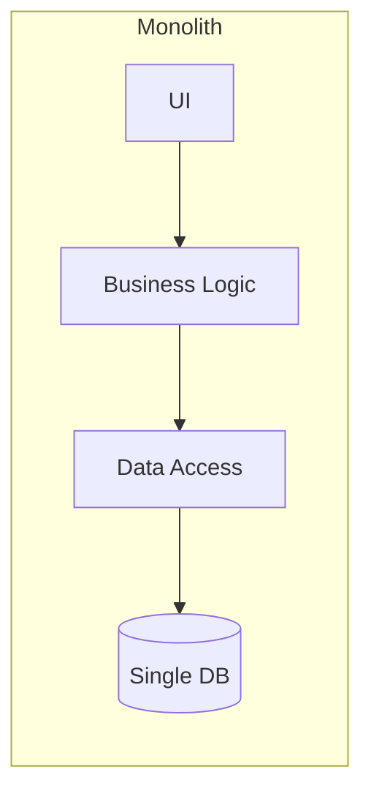
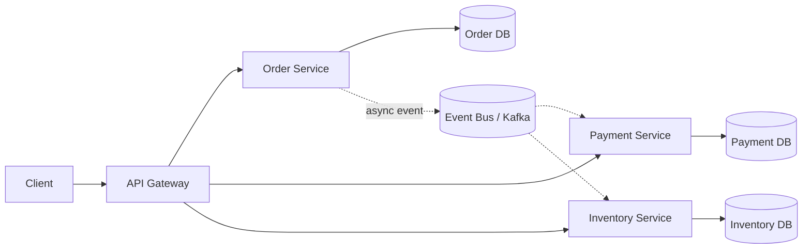
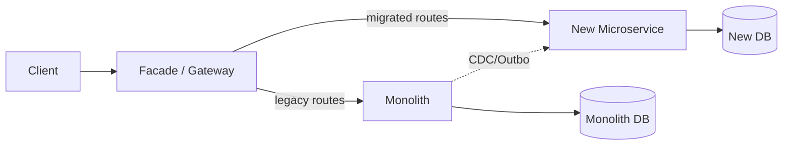
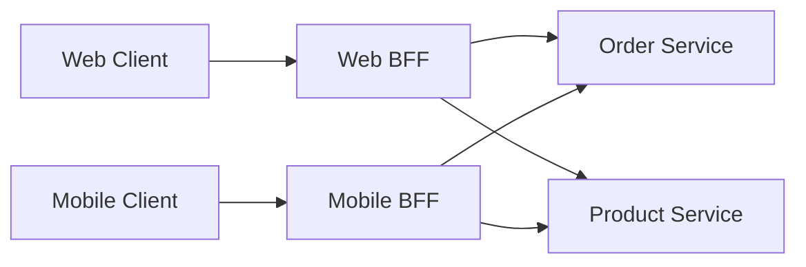
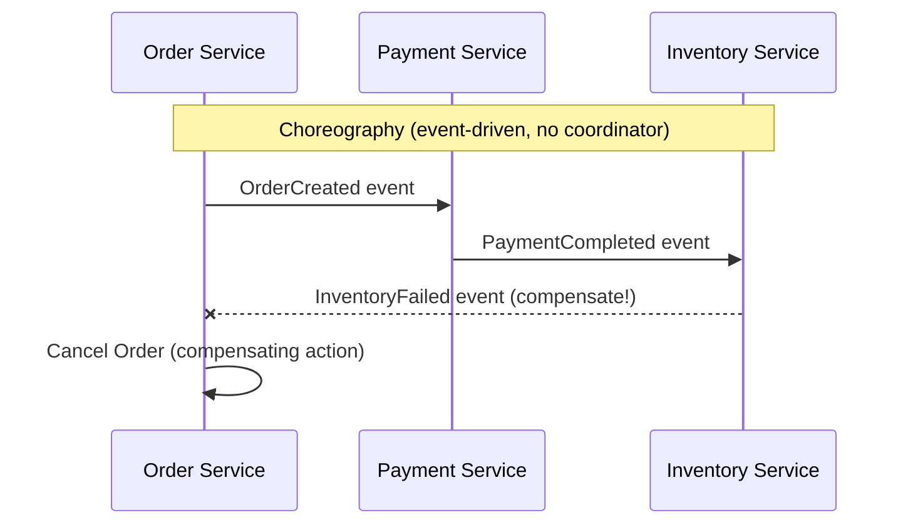
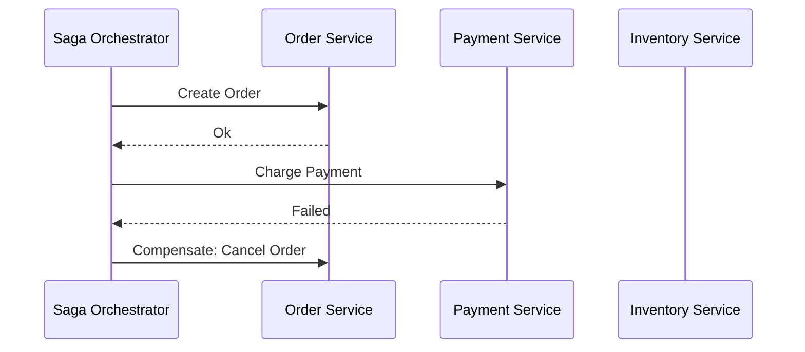
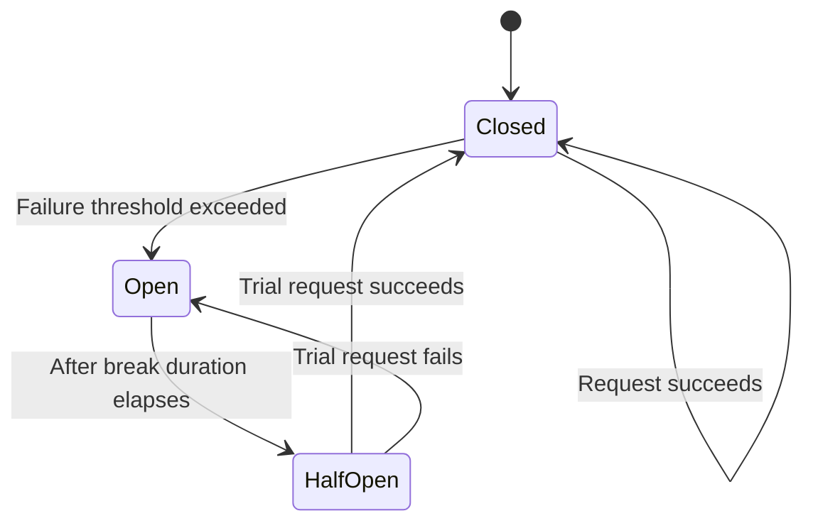
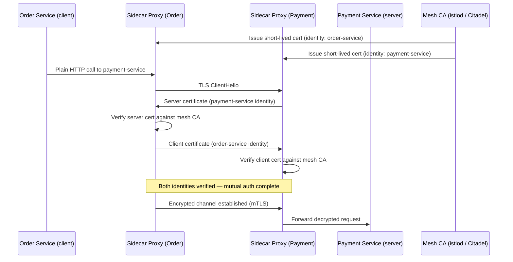
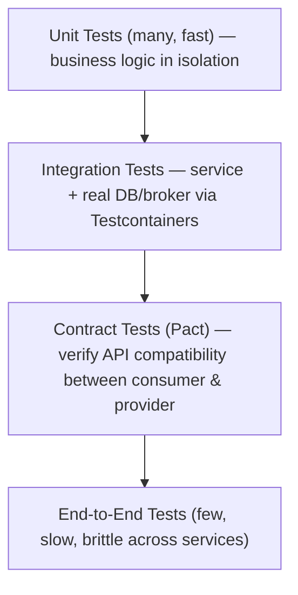

# Microservices — Senior .NET Interview Guide

> Consolidated from personal notes (100 Q&A source items) + gap-filled for senior/lead-level 2026 interviews.
> Additions are tagged **[new content]** so original material stays distinguishable.

## Table of Contents

1. [Core Concepts](#core-concepts)
2. [Service Design & Boundaries](#service-design--boundaries)
3. [Communication Patterns](#communication-patterns)
4. [Data Management & Consistency](#data-management--consistency)
5. [Resilience & Fault Tolerance](#resilience--fault-tolerance)
6. [Security](#security)
    - [Zero Trust Architecture & mTLS Deep Dive \[gaps\]](#zero-trust-mtls-gaps)
7. [Observability](#observability)
8. [Deployment & Infrastructure](#deployment--infrastructure)
9. [API Management](#api-management)
10. [Testing Strategies](#testing-strategies)
11. [Advanced Patterns](#advanced-patterns)
12. [Performance](#performance)
13. [Best Practices](#best-practices)
14. [Common Pitfalls / Anti-Patterns](#common-pitfalls--anti-patterns)
15. [Sample Interview Q&A](#sample-interview-qa)
16. [Summary of Additions](#summary-of-additions)

---

## Core Concepts

### What are microservices?

An architectural style where an application is composed of small, independently deployable services, each owning a single business capability, communicating over a network (not in-process calls). Each service can be developed, deployed, scaled, and — critically at senior level — **owned by a single team** independently.

**Example decomposition (e-commerce):**
- Order Service — order creation/lifecycle
- Payment Service — transactions
- Inventory Service — stock management
- Shipping Service — logistics

### Monolith vs Microservices

| Aspect | Monolithic | Microservices |
|---|---|---|
| Deployment | Entire app deploys as one unit | Each service deploys independently |
| Scalability | Scales as a whole | Scales per service |
| Technology | Single tech stack | Polyglot — different stacks per service |
| Failure Impact | A crash affects the entire app | A failure in one service does not (necessarily) impact others |
| Development Speed | Slower due to tight coupling/dependencies | Faster with independent teams — but only past a certain org size |
| Data | Single shared database | Database-per-service |
| Testing | Simpler (single process) | Harder — requires contract/integration tests, service virtualization |
| Operational overhead | Low | High (orchestration, tracing, service mesh) |





### Advantages

- **Scalability** — scale only the hot service (e.g., scale Inventory during a flash sale, not the whole app).
- **Technology independence** — polyglot persistence and runtimes per bounded context.
- **Fault isolation** — a crash in Shipping shouldn't take down Checkout (assuming resilience patterns are actually applied — this is not automatic).
- **Faster, parallel development** — teams ship independently (Conway's Law in action).
- **Independent deployability** — deploy only the changed service.

### Challenges

- **Distributed systems complexity** — service discovery, network partitions, partial failures, debugging across process boundaries.
- **Network latency** — chatty inter-service calls add up; N+1 style fan-out is a common perf killer.
- **Data consistency** — no more ACID transactions spanning services; must reason about eventual consistency.
- **Security surface** — many more network-exposed endpoints than a monolith.
- **Operational cost** — you now need CI/CD per service, centralized logging, tracing, a service mesh or client-side resilience libraries, and much more infrastructure maturity than a monolith needs.

**[new content] When NOT to use microservices**

This is one of the most common senior-level trick questions ("would you always recommend microservices?"). The honest answer: no.
- If your team is small (<2 pizza teams) or the domain isn't well understood yet, a **modular monolith** (well-factored, clear internal boundaries, single deployable) gives most of the maintainability benefit without the distributed-systems tax.
- Microservices trade development-time complexity for run-time/operational complexity. You need mature DevOps (CI/CD, containers, observability) *before* microservices pay off, not after.
- Premature decomposition is a bigger risk than staying monolithic too long — bounded contexts discovered too early tend to be wrong, and splitting a wrong boundary later means distributed refactoring (much harder than in-process refactoring).
- Rule of thumb interviewers like: "Start monolith-first (or modular monolith), extract services once boundaries are proven and a specific scaling/team-autonomy pain is real."

---

## Service Design & Boundaries

**[new content] Service decomposition strategy & DDD bounded contexts**

This is arguably the single most-asked *senior* microservices question, and the original notes only mention DDD building blocks (Entities, Value Objects, Aggregates, Repositories) without covering how decomposition actually happens.

- **Decompose by business capability**, not by technical layer (never "UI service", "DB service"). Ask "what does the business do?" (Order Management, Payments, Fulfillment) rather than "what tables do we have?"
- **Bounded Context** (DDD) is the actual unit of decomposition — a boundary within which a domain model and its ubiquitous language are consistent. Two contexts can have a "Customer" that means different things (Sales' Customer vs Support's Customer) — that's fine and expected; don't force a single shared model.
- **Context Mapping** patterns describe the relationship between bounded contexts:
  - *Shared Kernel* — small shared model, tightly coupled, use sparingly.
  - *Customer/Supplier* — upstream/downstream relationship with negotiated contracts.
  - *Conformist* — downstream just accepts upstream's model as-is.
  - *Anti-Corruption Layer (ACL)* — translate between an external/legacy model and your clean internal model (critical during strangler-fig migrations).
- **Event Storming** is the common workshop technique to discover bounded contexts collaboratively with domain experts before writing code.
- Aggregates define transactional consistency boundaries — **a transaction should never span more than one aggregate**, and by extension rarely more than one service. If you find yourself needing a transaction across two services, that's a signal either the boundary is wrong or you need a Saga.
- Interviewers will probe: "How big should a microservice be?" — Answer: sized by bounded context and team ownership, not lines of code. "Big enough to be useful, small enough to be independently deployable and owned by one team" (roughly a 2-pizza team owning it end-to-end).

### DDD Building Blocks (original content, retained)

- **Entities** — objects with identity (e.g., `Order`, `Customer`).
- **Value Objects** — immutable, no identity (e.g., `Address`).
- **Aggregates** — cluster of entities/value objects with a root that enforces invariants (e.g., `Order` containing `OrderItem`s).
- **Repositories** — abstract data access per aggregate root.

```csharp
public class Order
{
    public int Id { get; set; }
    public List<OrderItem> Items { get; set; } = new();
}
```

### Hexagonal Architecture (Ports & Adapters)

Separates core business logic from infrastructure concerns.

1. **Core business logic** — independent of DB/API/frameworks.
2. **Ports** — interfaces abstracting dependencies (e.g., `IOrderRepository`).
3. **Adapters** — concrete implementations (EF Core repository, REST controller, message consumer).

Why interviewers care: this is what makes a service *testable* (swap adapters for test doubles) and *framework-agnostic* — directly related to Clean Architecture, which most senior .NET shops now use as the default project template.

**[new content] Strangler Fig migration — expanded**

The notes cover this at a one-line level (route old vs new traffic, phase out monolith). Senior interviews expect the mechanics:

1. **Facade/Gateway in front of the monolith** intercepts calls.
2. Pick a **vertical slice** (one bounded context) to extract first — usually the one with clearest boundaries or highest business value/pain (e.g., Search, Notifications — read-heavy, low write-coupling).
3. New microservice is built; the gateway routes matching requests to it while everything else still goes to the monolith.
4. Data migration is the hard part — often the monolith's DB is temporarily read by both old and new code (via views/CDC) until the new service has full ownership; then cut over writes.
5. Repeat, incrementally shrinking the monolith, until it's "strangled."
6. Key risk interviewers probe: **dual-write inconsistency** during the transition window — mitigated with the Outbox pattern or Change Data Capture (Debezium) rather than naive dual writes.



---

## Communication Patterns

### Synchronous vs Asynchronous

- **Synchronous** (REST, gRPC) — caller blocks/awaits a response. Simple mental model, but creates temporal coupling: if the callee is down, the caller fails too (unless you add resilience patterns).
- **Asynchronous** (message queues, event bus) — caller fires and continues; response (if any) arrives later. Decouples availability of caller and callee, but adds complexity: eventual consistency, message ordering, idempotency, debugging.

**[new content] Choosing sync vs async — the actual trade-off table interviewers want**

| Concern | Synchronous (REST/gRPC) | Asynchronous (Queue/Event) |
|---|---|---|
| Coupling | Temporal — callee must be up | Decoupled — callee can be down/slow |
| Latency perception | Immediate (or fails immediately) | Higher perceived latency, but non-blocking |
| Failure handling | Needs retry/circuit breaker on caller | Needs DLQ, redelivery, idempotent consumers |
| Consistency | Can be strongly consistent within the call | Eventual consistency by default |
| Complexity | Lower to reason about | Higher — ordering, dedup, poison messages |
| Best for | Read-heavy, request/response UX flows (e.g., "get product details") | Write-heavy workflows, cross-service side effects (e.g., "order placed → notify shipping, update inventory, send email") |

Rule of thumb: use synchronous calls for queries where the client needs an immediate answer; use asynchronous events for anything that's really "this happened, react if you care" — this also naturally reduces the fan-out/cascading-failure risk of long sync call chains.

### REST vs gRPC

| Feature | REST | gRPC |
|---|---|---|
| Protocol | HTTP/1.1 (typically) | HTTP/2 |
| Data Format | JSON/XML (text) | Protocol Buffers (binary) |
| Performance | Slower (text parsing, HTTP/1.1 overhead) | Faster (binary, multiplexed streams) |
| Contract | OpenAPI/Swagger (looser) | `.proto` file (strict, code-generated) |
| Streaming | Limited (SSE/WebSockets bolted on) | Native (unary, server, client, bidi streaming) |
| Browser support | Native | Needs grpc-web proxy |
| Use Case | Public/external APIs, broad interoperability | Internal service-to-service, low-latency, streaming |

**[new content]** Follow-up interviewers ask: "Would you expose gRPC to a public API?" — Generally no; browser/client support is weak and human-debuggability is poor. Common pattern: **gRPC internally between services, REST/GraphQL at the edge** (via gateway translation).

### Message Queue vs Event Bus

| Feature | Message Queue (RabbitMQ) | Event Bus (Kafka) |
|---|---|---|
| Communication | Point-to-point (competing consumers) | Publish/Subscribe (fan-out) |
| Message Storage | Short-term, removed after consumption | Persistent log, replayable, retention-based |
| Ordering | FIFO per queue | Partition-based ordering |
| Consumer model | One message → one consumer (typically) | Many consumer groups can read the same stream independently |
| Replay | Not typically possible | Yes — re-read from any offset |

**[new content]** Follow-up: "When would you pick Kafka over RabbitMQ?" — Kafka when you need event replay, high-throughput log-based event sourcing, multiple independent consumer groups reading the same stream (analytics + fraud detection + notifications all reading "OrderPlaced"). RabbitMQ when you want simpler routing semantics (topic/direct/fanout exchanges), lower operational footprint, and true work-queue (competing consumer) semantics without needing the full log/replay model.

### Event-Driven Architecture

Services publish events on state changes; interested subscribers react — decoupled, asynchronous.

```csharp
channel.BasicPublish(exchange: "", routingKey: "order-placed",
    body: Encoding.UTF8.GetBytes("Order ID: 1234"));
```

Benefits: asynchronous, decoupled services, natural audit trail. Downsides (often skipped in notes, worth raising proactively): harder to trace a business flow ("what triggered this?"), eventual consistency, and event schema evolution becomes a cross-team contract problem.

### API Composition

When data is split across services, the aggregator pattern combines results:

```csharp
var orders = await httpClient.GetFromJsonAsync<List<Order>>("orders-service/orders");
var customers = await httpClient.GetFromJsonAsync<List<Customer>>("customer-service/customers");
```

Trade-off: simple to implement but doesn't scale well with large joins/filters across services — that's when **CQRS with a denormalized read model** (see below) becomes the better answer.

**[new content] API Gateway vs Backend-for-Frontend (BFF)**

The notes cover "API Gateway vs Reverse Proxy" but miss BFF, which is a very common senior follow-up.

- **API Gateway** — one gateway serving all client types (web, mobile, partner) with generic routing/auth/rate-limiting.
- **BFF (Backend-for-Frontend)** — a dedicated gateway *per client type* (e.g., `web-bff`, `mobile-bff`), each shaping/aggregating responses specifically for that client's needs (mobile wants smaller payloads, web wants richer ones).
- Why it matters: a single generic gateway tends to accumulate client-specific branching logic ("if mobile then...") which becomes a shared bottleneck/anti-pattern. BFFs let each frontend team own their aggregation layer independently, avoiding a shared-gateway contention point.
- Trade-off: more services to run and maintain vs. a single generic gateway; teams need discipline to avoid duplicating cross-cutting logic (auth, logging) across BFFs — usually solved by still fronting BFFs with a thin edge gateway/ingress for those cross-cutting concerns.



### API Gateway (core pattern, original content)

Single entry point routing requests to backend services; centralizes auth, rate limiting, load balancing, request transformation.

```json
{
  "Routes": [
    {
      "DownstreamPathTemplate": "/api/products",
      "DownstreamScheme": "http",
      "DownstreamHostAndPorts": [ { "Host": "localhost", "Port": 5001 } ],
      "UpstreamPathTemplate": "/products",
      "UpstreamHttpMethod": [ "GET" ]
    }
  ]
}
```
*(Ocelot config — Ocelot is the classic .NET-native gateway; also common: YARP (Microsoft's own reverse-proxy toolkit, now the more actively recommended choice for .NET), Kong, Nginx, Azure API Management, AWS API Gateway.)*

**[new content]** Note: Ocelot's contributor activity has slowed; many current .NET shops default to **YARP** (Yet Another Reverse Proxy) for build-your-own gateways because it's maintained by Microsoft and integrates natively with ASP.NET Core middleware pipelines, or they use a managed gateway (Azure APIM, Kong, AWS API Gateway) for a fully-featured product. Worth mentioning YARP by name if asked "what would you actually use today."

### API Gateway vs Reverse Proxy

| Feature | API Gateway | Reverse Proxy |
|---|---|---|
| Purpose | Manages multiple APIs, application-aware | Directs traffic to backend services, mostly protocol-aware |
| Functionality | AuthN/AuthZ, rate limiting, request/response transformation, aggregation | Load balancing, TLS termination, basic routing |

### Request Aggregation / API Gateway Caching

- **Aggregation** — gateway combines multiple downstream calls into one client-facing response (e.g., `/api/orders/123` returns order + customer details together).
- **Caching** — gateway caches responses to cut load on backend services.

```nginx
proxy_cache_path /var/cache/nginx levels=1:2 keys_zone=mycache:10m;
```

---

## Data Management & Consistency

### Database per Service

Each microservice owns its own database/schema; no direct cross-service DB access. Enables independent schema evolution and technology choice (SQL for Orders, NoSQL for Catalog, etc.) but forces you to solve cross-service queries and transactions explicitly.

```csharp
public class OrderContext : DbContext
{
    public DbSet<Order> Orders { get; set; }
}
```

**[new content] Handling queries that need data from multiple services**

Beyond simple API Composition (above), the two other standard answers interviewers expect:
- **CQRS with materialized read models** — a dedicated read-side service subscribes to domain events from Order/Customer/Product services and builds a denormalized, query-optimized view (e.g., in Elasticsearch/Redis/a reporting DB). Reads never fan out to multiple services at request time.
- **Backend-for-Frontend aggregation** — as above, when the aggregation is client-specific rather than a general reporting need.

### CQRS (Command Query Responsibility Segregation)

Separates write model (commands) from read model (queries) — often backed by different data stores optimized for each access pattern.

- **Command Handler** → validates & updates the write store.
- **Query Handler** → reads from a separate (often denormalized/replica) store.

```csharp
// Write
POST /orders   // handled by Command Handler → writes to primary DB

// Read
GET /orders    // handled by Query Handler → reads from read replica / projection
```

**[new content]** Common follow-up: "Does CQRS require Event Sourcing?" — No, they're independent patterns often used together but not required to be. You can do CQRS with two relational tables/views. Event Sourcing (storing state as a sequence of events rather than current state) is a complementary pattern that pairs well with CQRS because the event stream naturally feeds read-model projections, but plain CQRS with a read replica is far more common in practice and much simpler operationally.

### Distributed Transactions — Saga Pattern

2PC (Two-Phase Commit) doesn't scale well across autonomous services/databases (blocking, availability trade-offs, most modern message brokers/NoSQL stores don't even support it) — **Saga** is the standard alternative: a sequence of local transactions, each with a corresponding **compensating transaction** to undo it on failure.

**Choreography** — services react to each other's events directly (no central coordinator); each service knows what to do when it hears an event, and what compensation to publish on failure.

**Orchestration** — a central saga orchestrator explicitly tells each service what to do next and handles compensation logic centrally.





**[new content] Choreography vs Orchestration — trade-offs (this comparison was implicit in notes but never actually laid out)**

| Aspect | Choreography | Orchestration |
|---|---|---|
| Coupling | Loose — services only know events, not each other | Coordinator knows the whole workflow; participants are dumber |
| Visibility of overall flow | Poor — logic is smeared across services, hard to see "the saga" in one place | Good — flow is explicit in one place (the orchestrator) |
| Complexity growth | Gets messy fast as steps increase (cyclic event dependencies) | Scales better for complex flows, but orchestrator can become a god-service |
| Failure/compensation logic | Distributed across each service | Centralized in the orchestrator |
| Tooling | Plain pub/sub (Kafka/RabbitMQ) | Often a dedicated engine — e.g., **MassTransit's saga state machine**, **Temporal**, **Azure Durable Functions**, **AWS Step Functions**, **Camunda** |
| Best for | 2-3 step simple workflows | Long-running, multi-step business processes with complex branching |

Compensating transaction example (original content):

```csharp
if (!PaymentService.ProcessPayment(order.Id))
{
    OrderService.RollbackOrder(order.Id);
}
```

### Outbox Pattern

Solves the classic **dual-write problem**: you cannot atomically (a) update your database and (b) publish a message to a broker as two separate operations without risking one succeeding and the other failing.

**Mechanism:**
1. Within the *same local DB transaction* as the business update, insert the event/message into an `Outbox` table.
2. A separate background process (poller or CDC-based, e.g., Debezium) reads unpublished outbox rows and publishes them to the broker (Kafka/RabbitMQ).
3. Mark the row published (or delete it) once broker ack is received.

This guarantees **at-least-once delivery** aligned with the DB transaction — the event is never lost even if the process crashes right after committing, because it's durably stored alongside the business data.

**[new content] Transactional Outbox implementation nuance**

- Consumers must be **idempotent** since outbox delivery is at-least-once, not exactly-once — a redelivered message must not double-process (see Idempotency below).
- Two implementation styles: **polling publisher** (a background job queries the outbox table on an interval — simple, adds latency, adds DB load) vs **CDC-based** (Debezium tails the DB transaction log and streams outbox inserts directly to Kafka — near real-time, no polling overhead, but adds operational complexity of running Debezium/Kafka Connect).
- Directly pairs with Saga (choreography): each saga step's local transaction commit + event publish is exactly the dual-write problem the Outbox pattern solves.

### Idempotency

Ensures repeating the same request produces the same effect — critical because at-least-once delivery (retries, redeliveries) is the norm in distributed systems.

```
POST /api/orders?IdempotencyKey=abcd1234
```

**[new content] How to actually implement idempotency (notes only state the concept)**

- Client generates a unique idempotency key per logical operation (GUID) and sends it in header/query/body.
- Server stores `(IdempotencyKey, ResponseHash/Result)` in a dedicated table/cache with a TTL.
- On a repeat request with the same key: server short-circuits and returns the *original* stored response instead of re-executing the operation.
- For message consumers (not just HTTP): dedupe using the message's unique ID against a "processed messages" store (or rely on natural idempotency — e.g., `UPSERT` instead of `INSERT`, or set-based operations that are naturally idempotent like "set status = Shipped" rather than "increment counter").

### Concurrency Control

- **Optimistic locking** — assume conflicts are rare; detect via a version/rowversion column and retry on conflict.
- **Pessimistic locking** — lock the record up front to block concurrent writers; simpler correctness but hurts throughput/availability, generally discouraged across service/network boundaries.
- **Eventual consistency** — accept temporary staleness, reconcile via events.

```csharp
public class Order
{
    public int Id { get; set; }
    [ConcurrencyCheck]
    public int Version { get; set; }
}
```

### Read Replicas & Sharding

- **Read replica** — secondary DB copy serving read traffic to offload the primary (writes still go to primary). Trade-off: replicas can lag (replication delay), so "read-your-own-write" scenarios need care (read from primary right after a write, or route reads for that session to primary temporarily).
- **Sharding strategies:**
  - *Range-based* — e.g., Customers A–M → DB1, N–Z → DB2. Simple but risks hot shards.
  - *Hash-based* — distribute by a hash of the key; more even distribution, harder range queries.
  - *Geo-based* — split by region; good for data residency/latency, but cross-region joins are expensive.

### Database Migrations

- Use **EF Core Migrations** or **Flyway/Liquibase** (language-agnostic, common in polyglot shops), store them in version control.

```bash
dotnet ef migrations add InitDatabase
dotnet ef database update
```

**[new content]** In a live microservices environment, migrations must be **backward-compatible during rollout** — because old and new versions of a service run simultaneously during a rolling deployment. Standard technique: **expand/contract** (a.k.a. parallel change) — add new columns/tables without removing old ones (expand), deploy code that writes to both, then once fully rolled out, remove the old schema (contract). Never do a breaking schema change in a single deploy step for a service with >1 replica.

---

## Resilience & Fault Tolerance

### Circuit Breaker Pattern

Prevents a system from repeatedly calling a failing dependency, giving it time to recover and protecting the caller from cascading failure/thread exhaustion.

```csharp
services.AddHttpClient("OrderService")
    .AddTransientHttpErrorPolicy(policy =>
        policy.CircuitBreakerAsync(2, TimeSpan.FromSeconds(30)));
```

If 2 failures occur, the circuit opens for 30 seconds before allowing a trial request through again.

**[new content] Circuit breaker state machine (the notes describe the effect but never the states — this is a very common whiteboard ask)**



- **Closed** — requests flow normally; failures are counted.
- **Open** — requests fail fast immediately (no call attempted) for the break duration — protects the failing service from further load and the caller from wasting threads/timeouts.
- **Half-Open** — after the timeout, a limited trial request is allowed through; success → Closed, failure → back to Open.

**[new content] Polly v8+ resilience pipelines**

Notes reference the older Polly `CircuitBreakerAsync`/policy API. Current Polly (v8, used via `Microsoft.Extensions.Http.Resilience` in .NET 8+) uses the **ResiliencePipeline** builder model and integrates with `IHttpClientFactory` via `AddStandardResilienceHandler()`:

```csharp
services.AddHttpClient("OrderService")
    .AddResilienceHandler("standard", builder =>
    {
        builder.AddRetry(new RetryStrategyOptions
        {
            MaxRetryAttempts = 3,
            BackoffType = DelayBackoffType.Exponential
        });
        builder.AddCircuitBreaker(new CircuitBreakerStrategyOptions
        {
            FailureRatio = 0.5,
            SamplingDuration = TimeSpan.FromSeconds(30)
        });
        builder.AddTimeout(TimeSpan.FromSeconds(5));
    });
```

Interviewers in 2026 expect awareness that Polly v8 changed its API surface (pipelines, not chained policies) and that `Microsoft.Extensions.Http.Resilience` bundles retry + circuit breaker + timeout as "standard resilience handler" out of the box.

### Retry Pattern

**[new content]** Curiously absent as its own topic in the notes (only implied via Polly circuit breaker). Retry is foundational:
- Always pair retries with **exponential backoff + jitter** to avoid synchronized retry storms ("thundering herd") against a recovering service.
- Only retry **idempotent** operations (or ones protected by an idempotency key) — retrying a non-idempotent POST blindly can create duplicate orders/charges.
- Cap total retry attempts and combine with a circuit breaker so retries don't themselves overwhelm a struggling downstream.

### Bulkhead Pattern

Isolates resources (thread pools/connection pools) per dependency so a slow/failing one can't exhaust resources needed by others — named after ship compartments that stop one flooded section from sinking the whole vessel.

```csharp
services.AddHttpClient("PaymentService")
    .AddBulkheadPolicy(100, 10); // 100 concurrent, 10 queued requests
```

### Rate Limiting / Throttling

Prevents abuse/overload by capping requests per client/time window.

```csharp
services.AddRateLimiter(options =>
{
    options.GlobalLimiter = RateLimitPartition.GetFixedWindowLimiter(
        TimeSpan.FromSeconds(10), 100);  // 100 requests per 10 sec
});
```

*(ASP.NET Core's built-in `Microsoft.AspNetCore.RateLimiting` middleware, introduced in .NET 7, is now the standard choice over third-party packages like `AspNetCoreRateLimit` for new projects.)*

**[new content] Rate limiter algorithms — a common follow-up**

| Algorithm | Behavior | .NET support |
|---|---|---|
| Fixed Window | N requests per fixed time window; resets at boundary (can allow 2x burst at window edges) | `GetFixedWindowLimiter` |
| Sliding Window | Smooths the fixed-window edge-burst problem | `GetSlidingWindowLimiter` |
| Token Bucket | Tokens refill at a steady rate; requests consume tokens, allows controlled bursts | `GetTokenBucketLimiter` |
| Concurrency | Caps concurrent in-flight requests rather than a time window | `GetConcurrencyLimiter` |

### Dead Letter Queue (DLQ)

Stores messages that failed processing after exceeding retry limits, for later inspection/reprocessing rather than silently dropping or endlessly retrying (poison message problem).

- RabbitMQ: implemented via a **Dead Letter Exchange (DLX)**.
- AWS SQS: native DLQ configuration with a max-receive-count redrive policy.

**[new content]** Always alert/monitor on DLQ depth — a growing DLQ is a silent failure signal that's easy to miss without dashboards/alerts wired up.

### Sidecar & Ambassador Patterns

- **Sidecar** — a helper container/process deployed alongside the main service (same pod in Kubernetes) handling cross-cutting concerns like logging, monitoring, proxying, TLS termination — without polluting the main service's code.
- **Ambassador** — a specialization of Sidecar focused on proxying outbound/inbound network calls (auth, retries, circuit breaking) on the service's behalf — this is exactly what an Envoy sidecar in a service mesh does.

```yaml
containers:
- name: order-service
  image: order-service:v1
- name: envoy
  image: envoyproxy/envoy
```

**[new content] Service Mesh vs library-based resilience — the architecture-level trade-off the notes never make explicit**

The notes mention Istio/Linkerd/Consul as "service mesh tools" but never contrast the approach against Polly/library-based resilience, which is a standard senior question ("would you use Polly or a service mesh, and why?").

| Aspect | Library-based (Polly, in-process) | Service Mesh (Istio/Linkerd, sidecar-based) |
|---|---|---|
| Where logic lives | In application code, per language/stack | In infrastructure (sidecar proxy), language-agnostic |
| Polyglot support | Must reimplement per language | Works uniformly across all services regardless of language |
| Consistency | Depends on every team applying it correctly | Enforced centrally/uniformly by platform team |
| Operational overhead | Low — just a NuGet package | High — sidecar per pod, mesh control plane, added latency hop |
| Observability | App-level metrics only | Uniform mesh-wide telemetry (mTLS, traffic, retries) "for free" |
| Debuggability | Easier — it's just code | Harder — behavior lives outside app code, needs mesh-specific tooling |
| Best for | Smaller orgs, single/few stacks, want simplicity | Large polyglot orgs, platform teams wanting uniform policy enforcement |

Pragmatic answer interviewers want: many .NET-heavy shops use Polly/`Microsoft.Extensions.Http.Resilience` because it's simpler and sufficient when the stack is mostly one language; service mesh earns its complexity at larger polyglot scale or when uniform mTLS/traffic policy across many teams is a hard requirement.

### Circuit Breaker at the Mesh Layer (Istio)

```yaml
apiVersion: networking.istio.io/v1alpha3
kind: DestinationRule
metadata:
  name: order-service
spec:
  host: order-service
  trafficPolicy:
    outlierDetection:
      consecutiveErrors: 5
      interval: 10s
      baseEjectionTime: 30s
```
If 5 errors occur within 10s, the instance is ejected from the load-balancing pool for 30s — same concept as Polly's circuit breaker, enforced at the infrastructure layer instead of in application code.

---

## Security

### Authentication & Authorization

- **JWT (JSON Web Tokens)** — self-contained token carrying identity/claims, verified via signature (no round-trip to an auth server needed per request).
- **OAuth 2.0** — authorization framework/protocol for delegated, token-based access.
- **API Gateway authentication** — centralize AuthN at the edge rather than duplicating it in every service.

```csharp
services.AddAuthentication(JwtBearerDefaults.AuthenticationScheme)
    .AddJwtBearer(options =>
    {
        options.Authority = "https://your-auth-server";
        options.Audience = "your-api";
    });
```

**[new content] OAuth 2.0 vs OpenID Connect vs JWT — commonly conflated, commonly asked to disambiguate**

- **OAuth 2.0** is an *authorization* framework (delegated access — "can this app act on my behalf with this scope?"). It does not define identity/authentication by itself.
- **OpenID Connect (OIDC)** is an identity layer built on top of OAuth 2.0 — adds the **ID token** (a JWT with standardized identity claims) so the client actually knows *who* the user is, not just that it has a token.
- **JWT** is just a token *format* (a signed/optionally encrypted claims payload) — it's the vehicle, not the protocol. OAuth access tokens and OIDC ID tokens are commonly, but not necessarily, JWTs (opaque tokens are also valid OAuth access tokens).
- Senior-level gotcha to raise proactively: **never put sensitive/PII data in a JWT payload unencrypted** — JWTs are typically signed, not encrypted, so the payload is base64-readable by anyone who has the token (e.g., a browser).

### Access Token Example

```json
{
  "access_token": "eyJhbGciOiJIUzI1NiIsInR5cCI6IkpXVCJ9...",
  "expires_in": 3600,
  "token_type": "Bearer"
}
```

### Securing Internal (East-West) Communication

- **mTLS (Mutual TLS)** — both client and server present certificates; standard for zero-trust internal service-to-service auth, usually enforced by a service mesh rather than hand-rolled per service.
- **JWT propagation** — pass the user's/service's token along the call chain (service-to-service tokens, often via a client-credentials OAuth flow for service identity, distinct from the end-user's token).

```yaml
apiVersion: networking.istio.io/v1alpha3
kind: DestinationRule
spec:
  host: order-service
  trafficPolicy:
    tls:
      mode: MUTUAL
```

**[new content] Zero Trust networking**

The broader principle behind mTLS + per-request auth internally: **never trust the network perimeter alone** — every service-to-service call is authenticated and authorized regardless of whether it originates "inside" the cluster/VPC. This is now the default assumption in senior architecture discussions (vs the older "trusted internal network" model), and service meshes are the common enabler since hand-rolling mTLS per service doesn't scale.

### Zero Trust Architecture & mTLS Deep Dive [gaps] {#zero-trust-mtls-gaps}

> **Framing note:** this subsection is conceptual/trade-off knowledge for interview purposes — I have not run a service mesh (Istio/Linkerd) hands-on, but understand the architecture well enough to reason about when it's worth the operational investment (see the **[new content] Service Mesh vs library-based resilience** table earlier in this guide). The original notes covered Zero Trust and mTLS in one short paragraph each; this pass adds the actual mechanics an interviewer will probe for once you name-drop either term.

**Castle-and-moat vs Zero Trust — why the model shifted**

- **Castle-and-moat (the old model):** a strong perimeter (firewall, VPN, network segmentation) guards the boundary; anything that made it "inside" the corporate network or VPC was implicitly trusted. Internal service-to-service traffic often ran in plaintext with no per-call auth, because "it's all inside our network anyway."
- **Zero Trust (the current model):** there is no trusted network location. Every request — regardless of whether it originates from a pod in the same cluster, the same VPC, or the public internet — must be independently authenticated (who is calling?) and authorized (are they allowed to call *this*?). Trust is derived from cryptographic identity, not IP address or subnet membership.
- **Why the shift happened:**
  - **Cloud-native, ephemeral infrastructure** — pods/containers are created and destroyed constantly with dynamic IPs; there's no stable "inside the firewall" boundary to defend the way there was with a fixed on-prem network.
  - **Lateral movement risk** — the dominant real-world breach pattern is: attacker compromises one low-value service (or a single credential/pod), then moves laterally through the "trusted" internal network to reach high-value data, because nothing internally was re-checking identity. Zero Trust specifically closes this by requiring auth at every hop, not just at the edge.
  - **Compliance/regulatory drivers** — regulated industries (finance, healthcare, government) increasingly have explicit zero-trust mandates (e.g., US federal guidance following executive orders on cybersecurity) that push "verify every request" from a best practice into an audit requirement.
  - **Multi-tenant/shared infrastructure** — in a Kubernetes cluster shared across teams, "inside the cluster" is not a meaningful trust boundary at all; namespace isolation alone is not authentication.

**How mTLS actually implements service-to-service auth**

Normal (one-way) TLS only proves the *server's* identity to the client — the classic padlock-in-the-browser model. **Mutual TLS (mTLS) makes both sides prove identity:**

1. Each service is issued its own **X.509 certificate** representing its workload identity (not a human/user identity — a *service* identity, e.g. "this is genuinely the `order-service`").
2. A **private Certificate Authority (CA)** — in a service mesh this is typically run by the control plane (Istio's `istiod`, formerly Citadel; Linkerd's `identity` component) — issues these certificates automatically per workload.
3. Certificates are deliberately **short-lived** (often hours, not months/years) and **rotated automatically** by the mesh's control plane, with no manual renewal step and a much smaller window of exposure if one leaks.
4. On every connection, both sides present their certificate during the TLS handshake; each verifies the other's certificate against the shared private CA before any application traffic flows. The result is: mutual authentication (both ends cryptographically proven) **and** encryption-in-transit, in a single handshake.



**The operational pain this solves:** hand-rolling mTLS per service in application code means every team must manage certificate issuance, secure distribution, rotation before expiry, and revocation on compromise — for every service, in every language. Get rotation wrong once and services start failing auth cluster-wide at 3am. This is precisely why mTLS at scale is almost always pushed down into infrastructure rather than implemented per-service.

**Where the service mesh fits in**

- In practice, teams don't write mTLS logic into `order-service`'s code at all. A **service mesh's sidecar proxy** (e.g., **Envoy** in Istio, the Linkerd2-proxy in Linkerd) sits next to every service instance and **transparently terminates and originates TLS** on its behalf — the application only ever speaks plain HTTP to its own local sidecar; the sidecar-to-sidecar hop is where mTLS actually happens.
- The mesh's **control plane** is what makes this "automatic": it issues, distributes, and rotates the certificates for every sidecar without any application code awareness. This is the concrete mechanism behind the "Zero Trust networking" principle stated above — it's what makes per-call authentication achievable *at scale* instead of only in theory.

| Aspect | Istio | Linkerd |
|---|---|---|
| Data plane proxy | Envoy (general-purpose, feature-rich) | Linkerd2-proxy (purpose-built, lightweight, written in Rust) |
| Feature surface | Very broad (traffic mgmt, mTLS, policy, telemetry, multi-cluster) | Narrower, focused on the core mesh problems (mTLS, reliability, observability) |
| Complexity / learning curve | Higher — more CRDs, more moving parts, more to misconfigure | Lower — reputation for "just works" with minimal config |
| Resource overhead per sidecar | Higher (Envoy is heavier) | Lower (deliberately minimal footprint) |
| Best fit | Large orgs needing fine-grained traffic policy and are willing to invest in the complexity | Teams wanting mTLS + reliability + observability with the least operational overhead |

This is the same fundamental "is the complexity worth it" trade-off already captured in the **Service Mesh vs library-based resilience** comparison earlier in this guide — mTLS/Zero Trust is simply the specific capability where that trade-off is hardest to replicate with an in-process library, since certificate issuance/rotation genuinely needs a control plane, not just a NuGet package.

### API Key Authentication

```csharp
if (!Request.Headers.TryGetValue("X-API-KEY", out var apiKey) || apiKey != "my-secret-key")
{
    return Unauthorized();
}
```
Simple but weak on its own (static, no expiry, no scoping) — acceptable for service-to-service or partner integrations behind a gateway that also does rate limiting/IP allow-listing; not a substitute for OAuth for user-facing APIs.

### Secrets Management

Never store secrets in code/config committed to source control.

```csharp
var secret = await secretsManagerClient.GetSecretValueAsync(
    new GetSecretValueRequest { SecretId = "MyDatabaseSecret" });
```
Tools: AWS Secrets Manager, Azure Key Vault, HashiCorp Vault.

### CORS

```csharp
services.AddCors(options =>
{
    options.AddPolicy("AllowAll", builder =>
        builder.AllowAnyOrigin().AllowAnyMethod().AllowAnyHeader());
});
```
**Gotcha to flag proactively:** `AllowAnyOrigin()` combined with credentials (cookies/auth headers) is disallowed by browsers for good reason and is a common misconfiguration in interviews/code review — always scope CORS to explicit trusted origins in production, never wildcard.

### General Security Checklist (original content, retained)

- AuthN: OAuth, JWT
- AuthZ: Role/claims-based
- Encryption: TLS/HTTPS everywhere, encrypt sensitive data at rest
- Static analysis/security scanning: SonarQube, dependency vulnerability scanning (Dependabot/Snyk)

---

## Observability

**[new content] Observability is thin/scattered in the original notes (logging, tracing mentioned separately) — consolidating under the modern "three pillars" framing plus the current standard tool, since this is now a first-class senior interview topic.**

### The Three Pillars

| Pillar | Answers | Tools |
|---|---|---|
| **Logs** | What happened, in detail, at a point in time | Serilog, NLog, ELK/Elastic Stack, Seq |
| **Metrics** | Aggregate numeric trends over time (rates, latencies, error %) | Prometheus, Grafana, Azure Monitor |
| **Traces** | The path of a single request across service boundaries | OpenTelemetry, Jaeger, Zipkin |

### Distributed Tracing

Tracks a single logical request as it flows across multiple services, correlating spans into one trace.

```csharp
services.AddOpenTelemetryTracing(builder =>
    builder.AddAspNetCoreInstrumentation()
           .AddHttpClientInstrumentation()
           .AddJaegerExporter());
```

**[new content] OpenTelemetry is now the de facto standard (not just one option among several)**

- OpenTelemetry (OTel) unified what used to be fragmented (OpenTracing + OpenCensus) into a single vendor-neutral standard for traces, metrics, *and* logs.
- .NET's `System.Diagnostics.Activity`/`ActivitySource` is natively compatible with OTel — modern ASP.NET Core apps get distributed tracing largely "for free" via `AddOpenTelemetry()` with `.WithTracing(...)`, and can export to any OTel-compatible backend (Jaeger, Zipkin, Azure Monitor, Datadog, Honeycomb) via the OTLP protocol — meaning you're no longer locked into a specific vendor's SDK.
- Interviewers may ask "how would you correlate a trace across an async message boundary (e.g., through Kafka)?" — Answer: propagate the **trace context** (`traceparent` header, W3C Trace Context standard) in message headers/metadata, not just HTTP headers, so the trace continues even across a queue hop.

### Correlation IDs

For simpler cross-service log correlation without full tracing infrastructure:

```csharp
var correlationId = Guid.NewGuid().ToString();
HttpContext.Response.Headers.Add("X-Correlation-ID", correlationId);
```

**[new content]** In practice, prefer full distributed tracing (OTel trace/span IDs) over hand-rolled correlation IDs where possible — correlation IDs give you "these logs belong together" but not causality/timing/parent-child relationships between calls, which traces give you natively.

### Centralized Logging

```csharp
Log.Logger = new LoggerConfiguration()
    .WriteTo.Console()
    .WriteTo.File("logs/log.txt")
    .CreateLogger();
```
In production this `WriteTo.File` pattern is really just a local sink — logs still need to be shipped centrally (ELK/Elastic, Seq, Azure Log Analytics, Datadog) since containers/pods are ephemeral and local files disappear on restart.

---

## Deployment & Infrastructure

### Docker

```dockerfile
FROM mcr.microsoft.com/dotnet/aspnet:8.0
COPY ./publish /app
WORKDIR /app
ENTRYPOINT ["dotnet", "MyMicroservice.dll"]
```
*(Notes originally referenced .NET 6 — updated to current LTS baseline; verify against your actual target framework.)*

**[new content]** For production Dockerfiles, use a **multi-stage build** (SDK image to build/publish, slim aspnet runtime image for the final layer) to keep images small and avoid shipping the SDK/build tools:

```dockerfile
FROM mcr.microsoft.com/dotnet/sdk:8.0 AS build
WORKDIR /src
COPY . .
RUN dotnet publish -c Release -o /app/publish

FROM mcr.microsoft.com/dotnet/aspnet:8.0 AS final
WORKDIR /app
COPY --from=build /app/publish .
ENTRYPOINT ["dotnet", "MyMicroservice.dll"]
```

### Kubernetes

Orchestrates containers: scaling, self-healing, load balancing, rolling updates.

```yaml
apiVersion: apps/v1
kind: Deployment
metadata:
  name: product-service
spec:
  replicas: 3
  selector:
    matchLabels:
      app: product-service
  template:
    metadata:
      labels:
        app: product-service
    spec:
      containers:
      - name: product-service
        image: myproductservice:latest
        ports:
        - containerPort: 80
```

### Service Discovery in Kubernetes

- **ClusterIP** — internal-only exposure.
- **NodePort** — exposes on a static port on each node.
- **LoadBalancer** — provisions a cloud load balancer.

```yaml
apiVersion: v1
kind: Service
metadata:
  name: order-service
spec:
  type: LoadBalancer
  selector:
    app: order-service
  ports:
    - port: 80
      targetPort: 5001
```

### Service Discovery (general) & Registry

Beyond Kubernetes' native mechanism, standalone registries: **Consul, Eureka**.

```json
{ "service": { "name": "order-service", "port": 5001 } }
```
**[new content]** In modern Kubernetes-native deployments, a standalone service registry (Consul/Eureka) is largely unnecessary — Kubernetes' own DNS-based service discovery (ClusterIP + kube-dns/CoreDNS) replaces what Eureka/Consul did in the older Netflix-OSS/Spring Cloud style stacks. Consul still earns its place mainly when you need multi-cluster/multi-datacenter service discovery or its service-mesh capabilities, not just basic in-cluster discovery.

### Horizontal Pod Autoscaler (HPA)

```yaml
apiVersion: autoscaling/v2
kind: HorizontalPodAutoscaler
spec:
  minReplicas: 2
  maxReplicas: 10
  metrics:
    - type: Resource
      resource:
        name: cpu
        target:
          type: Utilization
          averageUtilization: 50
```
*(`autoscaling/v2beta2` from the notes is deprecated — `autoscaling/v2` is the stable/current API version; verify against your cluster's Kubernetes version.)*

### Deployment Strategies

| Strategy | Mechanism | Rollback speed | Risk |
|---|---|---|---|
| Blue-Green | Two full environments; switch traffic entirely once validated | Instant (switch back) | Needs 2x infra during cutover |
| Canary | Gradually shift a % of traffic to new version | Fast (scale down canary) | Needs traffic-splitting infra + good metrics to judge "stable" |
| Rolling update | Replace instances incrementally (K8s default) | Moderate | Both versions run simultaneously — must be backward compatible |
| Shadow traffic | Mirror real traffic to new version without affecting users, compare responses | N/A (no user impact) | Extra infra cost; write-side shadowing needs care (don't double-charge!) |

```nginx
server {
  listen 80;
  location / {
    proxy_pass http://green-version;
  }
}
```

```yaml
spec:
  trafficRouting:
    weighted:
      blue: 80
      green: 20
```

### Feature Toggles

Enable/disable functionality without redeploying.

```csharp
if (_featureManager.IsEnabledAsync("NewFeature").Result)
{
    Console.WriteLine("New Feature Enabled");
}
```
*(Uses `Microsoft.FeatureManagement` — prefer the fully-async `IsEnabledAsync` awaited properly rather than `.Result`, which risks deadlocks in ASP.NET Core sync contexts; a senior reviewer should flag `.Result`/`.Wait()` on async calls as a code-smell regardless of context.)*

### Monorepo vs Polyrepo

| Feature | Monorepo | Polyrepo |
|---|---|---|
| Storage | All microservices in one repo | Each service in its own repo |
| Management | Easier cross-service refactors, atomic commits across services | Better isolation, independent versioning |
| CI/CD | Single pipeline (often with path-based triggers) | Independent pipelines per service |
| Scalability (repo tooling) | Needs tooling at scale (Bazel, Nx, Turborepo) or it gets slow | Scales naturally per repo, but cross-cutting changes need coordinated PRs across many repos |
| Dependency management | Easy to share code/versions consistently | Risk of version drift between services |

**[new content]** Neither is "correct" — this is a genuinely debated senior-level trade-off. Monorepos favor orgs that value atomic cross-service changes and shared tooling (Google, Meta style) but need investment in build tooling to avoid CI slowness at scale. Polyrepos favor strict team autonomy and independent release cadences but make coordinated multi-service changes (e.g., a breaking contract change) logistically harder — you end up needing careful versioning/backward-compat discipline instead.

### Azure Deployment Options (original content)

- **Azure Kubernetes Service (AKS)** — managed K8s.
- **Azure API Management** — API gateway/security layer.
- **Azure Service Bus** — managed async messaging (queues + topics).

---

## API Management

### API Versioning & Backward Compatibility

```csharp
[ApiVersion("1.0")]
[Route("api/v{version:apiVersion}/orders")]
public class OrdersController : ControllerBase
{
    [HttpGet]
    public IActionResult GetOrders() => Ok("Version 1 Orders");
}
```

**[new content] Versioning strategies compared — notes only show URL versioning**

| Strategy | Example | Pros | Cons |
|---|---|---|---|
| URI versioning | `/api/v1/orders` | Explicit, cache-friendly, easy to test in browser | "Pollutes" the URI; resource identity arguably shouldn't include version |
| Query string | `/api/orders?api-version=1.0` | Easy to add without route changes | Easy to omit accidentally, less visible |
| Header versioning | `Api-Version: 1.0` header | Keeps URIs clean | Less discoverable, harder to test casually (needs tooling) |
| Media type (content negotiation) | `Accept: application/vnd.myapi.v1+json` | RESTfully "correct" | Least intuitive for consumers, more ceremony |

Senior-level point to raise: **prefer additive, backward-compatible changes over versioning whenever possible** — add new optional fields rather than bumping a version; reserve major version bumps for genuinely breaking contract changes. Combine with **Consumer-Driven Contract testing** (below) to catch breaking changes before they reach production.

### OpenAPI / Swagger

```csharp
services.AddSwaggerGen();
```
Generates interactive API docs and can drive client SDK generation. In .NET 9, `Microsoft.AspNetCore.OpenApi` is built into the framework for generating the OpenAPI document natively (Swashbuckle/Swagger UI remains common for the interactive UI layer) — worth mentioning if asked about the current toolchain.

---

## Testing Strategies

**[new content] This is one of the thinnest areas in the original notes — only a one-line mention of Pact/CDC. Senior interviews expect a full picture of the testing pyramid adapted to microservices.**

### The Microservices Testing Pyramid



- **Unit tests** — as in any codebase; test domain logic in isolation (this is unchanged by microservices).
- **Integration tests** — verify a service against its *real* dependencies (DB, cache, broker) rather than mocks, typically using **Testcontainers** to spin up ephemeral Docker containers (Postgres, Kafka, Redis) for the test run — this has become the standard replacement for hand-rolled in-memory fakes because it tests against the real engine's actual behavior (SQL dialect quirks, index behavior, etc.).
- **Consumer-Driven Contract testing (Pact)** — the consumer defines the contract it expects from a provider (request/response shape); the provider verifies it still satisfies all known consumer contracts in CI, *without* needing to spin up the consumer or run a full E2E test. This catches breaking API changes early and is far cheaper than E2E tests.
- **End-to-end tests** — exercise a full user journey across real (or close-to-real) deployed services. Necessarily few, slow, and flaky — used sparingly for critical business flows only, not as the primary safety net.

**[new content] Service virtualization / mocking downstream services**

For local development and integration tests where spinning up every real dependency is impractical, tools like **WireMock.NET** stub downstream HTTP APIs with canned responses — lets you test a service's behavior against specific downstream failure/edge-case scenarios (timeouts, 500s, malformed payloads) that are hard to reliably trigger against a real dependency.

### API Consumer-Driven Contracts (original content, expanded above)

```
Using Pact.io for contract testing between consumer and provider.
```

---

## Advanced Patterns

### Event Sourcing

**[new content]** Referenced only implicitly via CQRS/Outbox in the notes — worth defining explicitly since it's a common follow-up to CQRS questions.

Instead of persisting current state, persist the full sequence of **domain events** that led to that state; current state is derived by replaying events (or reading a snapshot + replaying events since).

- Pros: full audit trail "for free," can rebuild any past state, natural fit for event-driven/CQRS systems.
- Cons: querying current state directly is harder (needs projections), event schema evolution/versioning is a real long-term maintenance burden, and it's a significant complexity investment — **don't reach for it by default**; it earns its keep for domains where audit history/temporal queries are a genuine business requirement (e.g., financial ledgers), not as a default persistence style.

### Sharding Strategies (expanded from Data Management section — cross-referenced)

See [Read Replicas & Sharding](#read-management--consistency) above.

### Sidecar / Ambassador / Service Mesh

See [Resilience & Fault Tolerance](#resilience--fault-tolerance) above for full coverage — cross-referenced here since notes originally listed these as a separate "advanced" bucket.

---

## Performance

- **gRPC over REST internally** for latency-sensitive service-to-service calls (binary payload, HTTP/2 multiplexing).
- **Distributed caching** (Redis/Memcached) to cut redundant DB round-trips for frequently-read, rarely-changed data.

```csharp
services.AddStackExchangeRedisCache(options =>
{
    options.Configuration = "localhost:6379";
});
```

- **Read replicas** for read-heavy services to offload the primary write DB.
- **API Gateway response caching** for frequently requested, cacheable responses.
- **Async/non-blocking I/O** throughout (`async`/`await` end-to-end, avoid sync-over-async which causes thread pool starvation under load — a very common .NET-specific gotcha interviewers probe: "why is `.Result`/`.Wait()` dangerous in ASP.NET Core?").
- **Connection pooling** for HTTP clients (`IHttpClientFactory`) and DB connections — avoid socket exhaustion from creating a new `HttpClient` per request.
- **[new content] Backpressure** — when a service is overwhelmed, it should signal upstream to slow down (via 429s, queue depth limits, or reactive streams) rather than silently queueing unboundedly until it OOMs. Combine with bulkhead + rate limiting for a complete picture of "what happens when this service is under load."

---

## Best Practices

- Database-per-service — no shared database, no direct cross-service DB access.
- Design around **business capabilities/bounded contexts**, not technical layers.
- Prefer **asynchronous, event-driven** communication for cross-service side effects; reserve synchronous calls for request/response reads.
- Make every operation **idempotent** wherever retries/redelivery are possible (which is basically everywhere in a distributed system).
- Centralize cross-cutting concerns (auth, rate limiting, logging correlation) at the gateway/mesh layer rather than duplicating per service.
- Version APIs deliberately; prefer additive/backward-compatible changes; use contract testing to catch breakage before prod.
- Instrument everything with **structured logs + metrics + distributed traces** from day one — retrofitting observability after an incident is much harder than building it in.
- Automate CI/CD per service with independent pipelines so deployability stays truly independent.
- Apply resilience patterns (retry, circuit breaker, bulkhead, timeout) at every network boundary — assume every downstream call can and will fail.
- Use the **Outbox pattern** whenever a business transaction must be atomically paired with publishing an event.
- Start with a **modular monolith** if bounded contexts and team structure aren't proven yet; extract services once real scaling/ownership pain justifies the operational cost.

---

## Common Pitfalls / Anti-Patterns

- **Shared database across services** — breaks service autonomy, the single most common "why is your microservices project actually a distributed monolith" root cause.
- **Too many synchronous calls / deep call chains** — creates cascading latency and cascading failure risk (service A calls B calls C calls D synchronously — one slow link stalls the whole chain).
- **Improper/absent API versioning** — breaking changes silently break consumers.
- **Distributed monolith** — services that are technically separate deployables but so tightly coupled (via shared DB, synchronous chains, or a shared library that changes together) that they must be deployed in lockstep — you get all the operational cost of microservices with none of the independence benefit.
- **Chatty APIs / N+1 across service boundaries** — fine-grained calls repeated in a loop across a network hop, instead of batching or restructuring the API.
- **[new content] Premature decomposition** — splitting into microservices before bounded contexts are well understood, resulting in wrong boundaries that require expensive distributed refactoring later. "You ain't gonna need microservices (YAGNI applied to architecture)" is a legitimate senior-level position to hold, not a cop-out.
- **[new content] Not planning for eventual consistency in the UI/UX** — if Order Service confirms an order before Inventory Service has actually decremented stock, the UI/business process must be designed to tolerate and communicate that temporary inconsistency (e.g., "order confirmed, processing" states) rather than assuming instant global consistency.
- **[new content] Ignoring the data migration problem during Strangler Fig migrations** — dual-write inconsistency between old and new stores during a long migration window is a frequent real-world production incident source; needs CDC/Outbox discipline, not ad hoc dual writes.
- Ignoring DLQ growth / not monitoring poison messages.
- Skipping idempotency, leading to duplicate side effects (double-charged payments, duplicate orders) under retries.

---

## Sample Interview Q&A

**Q: How would you decide where to draw service boundaries for a new e-commerce platform?**
A: Start with Event Storming / domain modeling with business stakeholders to identify bounded contexts (Ordering, Payments, Inventory, Shipping, Catalog). Boundaries should align with team ownership and align with where transactional consistency is actually required (aggregates) — never split a single aggregate's invariants across two services. If unsure, start as a modular monolith with clean internal module boundaries and extract into real services once a specific scaling or team-autonomy pain justifies the operational cost of doing so.

**Q: A downstream payment service is intermittently slow. What do you put in place, end to end?**
A: Timeout on the HTTP client call, retry with exponential backoff + jitter (only if the call is idempotent, ideally with an idempotency key), circuit breaker to stop hammering a failing service, bulkhead to isolate the payment client's resource pool from other outbound calls, and a fallback/degraded response path (e.g., queue the payment for async