# C# / .NET Interview Guide (Senior / Lead Level)

*Consolidated from 6 source files: `c#.txt`, `C# .NET Interview Notes - Consolidated.docx`, `C#.docx`, `C#2.docx`, `c# Async.docx`, `C# Swagger.docx`.*
*Audience: 10-year .NET full-stack developer prepping for senior/lead interviews in 2026. Fundamentals are assumed — this guide emphasizes nuance, trade-offs, "why", gotchas, and likely interviewer follow-ups.*
*Sections tagged **[new content]** were added during consolidation to cover topics that were missing or thin across all six source files. Everything else is reorganized/de-duplicated from your original notes.*

---

## Table of Contents

- [Part I — Core Concepts: Type System & CLR](#part-i--core-concepts-type-system--clr)
  - [What Is C# / .NET, and How Does the CLR Fit In](#what-is-c--net-and-how-does-the-clr-fit-in)
  - [.NET Framework vs .NET Core vs .NET 5–10](#net-framework-vs-net-core-vs-net-510)
  - [The .NET Build & Execution Pipeline](#the-net-build--execution-pipeline)
  - [Value Types vs Reference Types](#value-types-vs-reference-types)
  - [var, object, dynamic](#var-object-dynamic)
  - [== vs Equals() vs ReferenceEquals()](#-vs-equals-vs-referenceequals)
  - [Nullable Value Types & Nullable Reference Types](#nullable-value-types--nullable-reference-types-nrts)
  - [Implicit vs Explicit Conversion](#implicit-vs-explicit-conversion)
  - [Boxing & Unboxing](#boxing--unboxing)
- [Part II — Core Concepts: OOP](#part-ii--core-concepts-oop)
  - [The Four Pillars](#the-four-pillars)
  - [Inheritance vs Composition](#inheritance-vs-composition)
  - [Polymorphism: Compile-Time vs Runtime](#polymorphism-compile-time-vs-runtime)
  - [Overloading vs Overriding vs Hiding (new)](#overloading-vs-overriding-vs-hiding-new)
  - [Interface vs Abstract Class](#interface-vs-abstract-class)
  - [struct vs class](#struct-vs-class)
  - [sealed, static, and partial classes](#sealed-static-and-partial-classes)
  - [Access Modifiers](#access-modifiers)
  - [[new content] Records & record struct](#new-content-records--record-struct)
  - [[new content] Pattern Matching & Switch Expressions](#new-content-pattern-matching--switch-expressions)
- [Part III — Constructors & Object Creation](#part-iii--constructors--object-creation)
  - [Types of Constructors](#types-of-constructors)
  - [Constructors in Abstract Classes](#constructors-in-abstract-classes)
  - [Step-by-Step Object Creation Process](#step-by-step-object-creation-process)
  - [[new content] init, required, and Primary Constructors (C# 11/12)](#new-content-init-required-and-primary-constructors-c-1112)
- [Part IV — Intermediate: Members & Language Features](#part-iv--intermediate-members--language-features)
  - [Properties vs Fields](#properties-vs-fields)
  - [const vs readonly vs static](#const-vs-readonly-vs-static)
  - [ref vs out vs in](#ref-vs-out-vs-in)
  - [params, Named Parameters, Indexers](#params-named-parameters-indexers)
  - [Extension Methods](#extension-methods)
  - [Generics — Why They're Not Slow](#generics--why-theyre-not-slow)
  - [Tuples & Anonymous Types](#tuples--anonymous-types)
  - [Reflection, Attributes, dynamic, ExpandoObject](#reflection-attributes-dynamic-expandoobject)
  - [yield return and Iterators](#yield-return-and-iterators)
  - [Fluent Interfaces](#fluent-interfaces)
  - [Deep Copy vs Shallow Copy](#deep-copy-vs-shallow-copy)
  - [[new content] Static Abstract/Virtual Interface Members & Generic Math (C# 11)](#new-content-static-abstractvirtual-interface-members--generic-math-c-11)
  - [[new content] Source Generators](#new-content-source-generators)
- [Part V — Delegates, Events & Lambdas](#part-v--delegates-events--lambdas)
  - [Delegates](#delegates)
  - [Func, Action, Predicate](#func-action-predicate)
  - [Events](#events)
  - [Delegate vs Event](#delegate-vs-event)
  - [Lambda Expressions & Anonymous Methods](#lambda-expressions--anonymous-methods)
- [Part VI — Collections & LINQ](#part-vi--collections--linq)
  - [LINQ Fundamentals](#linq-fundamentals)
  - [IEnumerable vs IQueryable](#ienumerable-vs-iqueryable)
  - [IEnumerable vs ICollection vs IList vs IReadOnlyList](#ienumerable-vs-icollection-vs-ilist-vs-ireadonlylist)
  - [List vs Array](#list-vs-array)
  - [Dictionary vs Hashtable](#dictionary-vs-hashtable)
  - [ReadOnlyCollection vs List](#readonlycollection-vs-list)
  - [Jagged vs Multidimensional Arrays](#jagged-vs-multidimensional-arrays)
  - [Covariance & Contravariance](#covariance--contravariance)
  - [String vs StringBuilder](#string-vs-stringbuilder)
  - [[gaps] Expression Trees & How EF Core Translates LINQ to SQL](#expression-trees--how-ef-core-translates-linq-to-sql-gaps)
  - [[gaps] PLINQ / AsParallel() Trade-offs](#plinq--asparallel-trade-offs-gaps)
  - [[gaps] .NET 6+ LINQ Additions: MinBy/MaxBy/Chunk/DistinctBy/Order/OrderDescending](#net-6-linq-additions-minbymaxbychunkdistinctbyorderorderdescending-gaps)
  - [[new content] LINQ Gotchas Every Senior Dev Should Know](#new-content-linq-gotchas-every-senior-dev-should-know)
- [Part VII — Memory Management & Garbage Collection](#part-vii--memory-management--garbage-collection)
  - [Stack vs Heap](#stack-vs-heap-in-the-net-memory-model)
  - [Garbage Collection Mechanics](#garbage-collection-gc)
  - [[gaps] GC Diagnostics Tooling for Production](#gc-diagnostics-tooling-for-production-gaps)
  - [Dispose() vs Finalize()](#dispose-vs-finalize)
  - [Weak References](#weak-references)
  - [Memory Leaks in .NET](#memory-leaks-in-net)
  - [[new content] IAsyncDisposable](#new-content-iasyncdisposable)
- [Part VIII — Advanced: Multithreading & Async](#part-viii--advanced-multithreading--async)
  - [Thread vs Task](#thread-vs-task-tpl)
  - [Task Lifecycle & Exception Handling](#task-lifecycle--exception-handling)
  - [Thread Safety Primitives](#thread-safety-primitives)
  - [async/await Fundamentals](#asyncawait-fundamentals)
  - [[gaps] Async State-Machine Internals](#async-state-machine-internals-gaps)
  - [Asynchrony vs Multithreading](#asynchrony-vs-multithreading)
  - [Deadlocks & Race Conditions](#deadlocks--race-conditions)
  - [Task Parallel Library (TPL)](#task-parallel-library-tpl)
  - [[gaps] Task.Run vs Task.Factory.StartNew(LongRunning) vs Parallel.ForEachAsync](#taskrun-vs-taskfactorystartnewlongrunning-vs-parallelforeachasync-gaps)
  - [How the "Main Thread" Works in ASP.NET Core](#how-the-main-thread-works-in-aspnet-core)
  - [Async Streams (IAsyncEnumerable\<T\>)](#async-streams-iasyncenumerablet)
  - [[new content] ConfigureAwait(false) and SynchronizationContext](#new-content-configureawaitfalse-and-synchronizationcontext)
  - [[new content] The Classic Sync-Over-Async Deadlock](#new-content-the-classic-sync-over-async-deadlock)
  - [[new content] async void — Why It's Dangerous](#new-content-async-void--why-its-dangerous)
  - [[new content] Task vs ValueTask](#new-content-task-vs-valuetask)
- [Part IX — Data Access: ADO.NET](#part-ix--data-access-adonet)
- [Part X — Design Principles & Patterns](#part-x--design-principles--patterns)
  - [SOLID Principles](#solid-principles)
  - [Dependency Injection](#dependency-injection-di)
  - [Serialization & Deserialization](#serialization--deserialization)
  - [AutoMapper](#automapper)
  - [Architectural Patterns](#architectural-patterns)
  - [Microservices](#microservices)
  - [[new content] The Captive Dependency Problem](#new-content-the-captive-dependency-problem)
  - [[new content] Keyed DI Services (.NET 8+)](#new-content-keyed-di-services-net-8)
- [Part XI — Cross-Cutting Concerns: Logging & Exceptions](#part-xi--cross-cutting-concerns-logging--exceptions)
- [Part XII — Modern C# Language Features (C# 9–14)](#part-xii--modern-c-language-features-c-914)
- [Part XIII — Minimal APIs, EF Core & Caching](#part-xiii--minimal-apis-ef-core--caching)
- [Part XIV — Resilience, Auth & Security](#part-xiv--resilience-auth--security)
- [Part XV — Performance & Low-Allocation Programming](#part-xv--performance--low-allocation-programming)
- [Part XVI — Advanced Concurrency Primitives](#part-xvi--advanced-concurrency-primitives)
  - [[gaps] Low-Level Concurrency Primitives: Monitor, SpinLock, False Sharing, Thread-Pool Starvation](#low-level-concurrency-primitives-monitor-spinlock-false-sharing-thread-pool-starvation-gaps)
- [Part XVII — Microservices, Messaging & CQRS](#part-xvii--microservices-messaging--cqrs)
- [Part XVIII — Observability, Testing & Full-Stack Integration](#part-xviii--observability-testing--full-stack-integration)
- [Part XIX — Swagger / OpenAPI & API Documentation](#part-xix--swagger--openapi--api-documentation)
- [Part XX — Terminology Reference](#part-xx--terminology-reference)
- [Best Practices Checklist](#best-practices-checklist)
- [Common Pitfalls Checklist](#common-pitfalls-checklist)
- [Sample Interview Q&A (Rapid Fire)](#sample-interview-qa-rapid-fire)
- [Summary of Additions](#summary-of-additions)
- [Summary of [gaps] Additions (This Pass)](#summary-of-gaps-additions-this-pass)

---

## Part I — Core Concepts: Type System & CLR

### What Is C# / .NET, and How Does the CLR Fit In

C# is a modern, object-oriented, strongly typed language from Microsoft, part of the .NET platform, used for web, desktop, cloud, and mobile apps. Key features: OOP, strong typing, automatic garbage collection, structured exception handling, LINQ, and async/await.

**Strongly typed** means every variable/expression has a specific type fixed at compile time; the compiler rejects incompatible assignments without an explicit conversion.

| Feature | C# | Java |
|---|---|---|
| Platform | Windows, Linux, macOS (via .NET) | Cross-platform (JVM) |
| Memory Management | Garbage Collection | Garbage Collection |
| Multiple Inheritance | Not supported (uses interfaces) | Not supported (uses interfaces) |
| Properties | First-class `get`/`set` properties | Getter/setter methods |

**The CLR (Common Language Runtime)** is .NET's execution engine. Responsibilities:

- **Memory management** — allocates/deallocates on the managed heap automatically; no manual `malloc`/`free`; prevents leaks and dangling pointers.
- **Security** — enforces type safety; managed code (C#, VB.NET, F#) compiles to MSIL and runs under CLR supervision.
- **Exception handling** — a structured model; unhandled exceptions are caught by the CLR instead of crashing at the OS level.
- **Garbage collection** — automatic, generational (Gen 0/1/2) reclamation of unreferenced objects.

> **Correction/currency flag:** older notes describe CLR security in terms of **Code Access Security (CAS)**. CAS is legacy — it was de-emphasized starting with .NET Framework 4 and does **not exist** in .NET Core/.NET 5+. Modern .NET security is enforced through OS-level process/user permissions, sandboxing (containers), and code signing — not CAS policy. Don't cite CAS as a current CLR feature in a 2026 interview.

### .NET Framework vs .NET Core vs .NET 5–10

| Feature | .NET Framework | .NET Core (2.x/3.x) | .NET 5/6/7/8/9/10 |
|---|---|---|---|
| Platform | Windows only | Cross-platform | Cross-platform |
| Release | Legacy (2002–2019) | 2016–2019 | .NET 5 (2020) → .NET 10 (2025) |
| Performance | Baseline | Good | Progressively faster (JIT/GC improvements each release) |
| LTS | N/A (in maintenance) | Core 3.1 (ended Dec 2022) | .NET 6 (LTS), .NET 8 (LTS), **.NET 10 (LTS, Nov 2025)** |
| Desktop (WPF/WinForms) | Full | Limited early on | Full support (Windows) |
| Blazor | No | No (introduced .NET 5) | Yes (WASM, Server, Hybrid) |
| Mobile | No | No | .NET MAUI |
| Cloud-Native/Microservices | Limited | Yes | Yes (better containers, gRPC, Minimal APIs) |

As of mid-2026, **.NET 10 is the current LTS release** (shipped November 2025, alongside C# 14); .NET 9 was a Standard Term Support (STS) release that reached end-of-support in May 2026 — a senior candidate should know that STS releases have a ~18-month window vs ~3 years for LTS, and plan upgrade cadence accordingly *(verify exact EOL dates against current Microsoft lifecycle docs at interview time, since support windows are occasionally adjusted)*.

### The .NET Build & Execution Pipeline

1. **Source compilation** — `.cs`/`.vb`/`.fs` compiled by the Roslyn compiler (`csc.exe` for C#).
2. **IL generation** — source becomes CPU-independent MSIL plus metadata inside `.dll`/`.exe`.
3. **Assembly linking** — dependent assemblies resolved/linked. Assemblies contain IL, not machine code yet.
4. **JIT compilation** — at runtime, the CLR's Just-In-Time compiler converts IL to native machine code; native code is cached.
5. **Execution & memory management** — CLR handles GC, exception handling, security checks, threading.
6. **Runtime optimization** — AOT compilation, tiered compilation (optimizing hot paths), NGEN pre-compilation in some scenarios.


> One-liner: **Compile → IL (.dll/.exe) → Link → JIT/AOT to machine code → Execute under CLR.**

### Value Types vs Reference Types

- **Value types**: `int, float, char, bool, struct, enum` — store data directly, typically on the stack (unless boxed or captured as a field of a heap object).
- **Reference types**: `string, object, arrays, class, interface` — store a reference (pointer) to data on the heap.

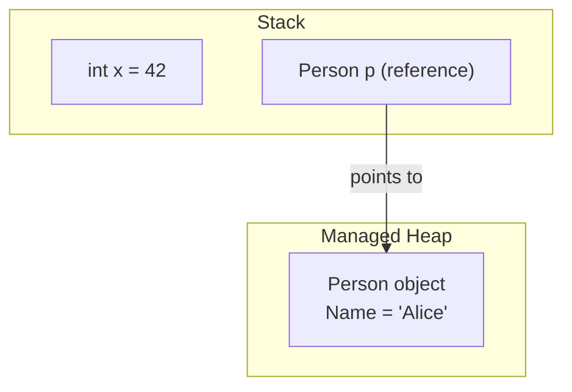

### var, object, dynamic

| Type | Description | Example |
|---|---|---|
| `var` | Statically typed, inferred at compile time | `var x = 5;` |
| `object` | Base type of all types; requires casting | `object obj = "Hello";` |
| `dynamic` | Resolved at runtime, no compile-time checking | `dynamic d = 5;` |

Rules for `var`: cannot be assigned `null` at declaration without a type hint; must be initialized at declaration; inferred type cannot change afterward; local-scope only (never a class field). Use `var` when the type is obvious, with anonymous types, and in LINQ; avoid it when it hurts readability (`var x = GetData();` — what type?).

### == vs Equals() vs ReferenceEquals()

`==` compares values for value types and references for reference types **by default**. `Equals()` checks value equality and can be overridden. `==` can also be **operator-overloaded**.

```csharp
string a = "hello", b = "hello";
Console.WriteLine(a == b);       // True (string overloads == for value comparison)
Console.WriteLine(a.Equals(b));  // True

public class Employee
{
    public int Id { get; set; }
    public override bool Equals(object obj) => obj is Employee e && e.Id == Id;
    public override int GetHashCode() => Id.GetHashCode();
    public static bool operator ==(Employee e1, Employee e2) => e1.Id == e2.Id;
    public static bool operator !=(Employee e1, Employee e2) => !(e1 == e2);
}
```

> **Gotcha an interviewer will probe:** if you override `Equals()`, you **must** also override `GetHashCode()` — otherwise the type breaks in `Dictionary`/`HashSet` (objects that are `Equals`-equal must return the same hash code, or lookups silently fail to find them). `object.ReferenceEquals(a, b)` bypasses any overload and always compares raw references — useful when you specifically need identity comparison regardless of overridden `Equals`.

### Nullable Value Types & Nullable Reference Types (NRTs)

```csharp
int? age = null;                 // nullable value type — wraps in Nullable<int>
Console.WriteLine(age ?? 18);    // 18

string? name = null;             // nullable reference type (C# 8+, opt-in via <Nullable>enable</Nullable>)
```

**[new content] NRTs in practice — the real-world adoption pain.** Nullable reference types are a *compile-time, opt-in* analysis feature — they add **no runtime null-checking**; `string?` vs `string` is enforced only by compiler warnings (CS8600-series), which by default are warnings, not errors. Consequences senior candidates should be ready to discuss:

- **Not retrofit-friendly.** Enabling `<Nullable>enable</Nullable>` on a large legacy codebase floods the build with hundreds/thousands of warnings, since every parameter, field, and return type must now be annotated correctly. Most teams do a file-by-file or project-by-project rollout using `#nullable enable` pragmas rather than a big-bang flip.
- **NRTs don't prove non-null at runtime.** A `string` annotated as non-nullable can *still* be null at runtime (e.g., via reflection, deserialization from JSON with missing fields, or an un-annotated third-party library) — the compiler's confidence is only as good as its analysis, which is why `NullReferenceException` still happens in NRT-enabled code.
- **Escape hatches are used more than teams admit**: the null-forgiving operator `!` (e.g., `user!.Name`) silences the compiler without adding a runtime check — overusing `!` reintroduces the exact bug class NRTs exist to prevent.
- Interviewers may ask: *"Your team enabled nullable reference types and now has 3,000 warnings — how do you roll it out?"* A strong answer: enable per-project via `.csproj`, fix top-down starting with public APIs/DTOs at trust boundaries, treat warnings as errors only once a project is clean, and use `[NotNull]`/`[MaybeNull]`/`[AllowNull]` attributes for cases the compiler can't infer (e.g., `TryGetValue`-style patterns).

### Implicit vs Explicit Conversion

| | Implicit | Explicit |
|---|---|---|
| Data loss? | No | Possible |
| Syntax | Automatic | Manual `(type)` cast |

```csharp
int x = 10;
double y = x;      // implicit
int z = (int)y;    // explicit
```

### Boxing & Unboxing

| Concept | Description | Example |
|---|---|---|
| Boxing | Value type → object (stack → heap copy) | `object obj = 10;` |
| Unboxing | object → value type | `int num = (int)obj;` |

Boxing causes extra heap allocation and GC pressure — relevant whenever a `struct` is passed as `object`, stored in a non-generic collection (`ArrayList`), or passed to a method expecting an `interface` it implements. **Performance cost, concretely:** each boxing operation allocates a new heap object (with object header + sync block, typically 16–24 bytes overhead even for a 4-byte `int`), and every unboxing operation performs a runtime type check before copying the value back. In a hot loop, this shows up as GC Gen0 pressure — a classic "why is this slow" interview scenario is `ArrayList` full of boxed `int`s vs `List<int>` (generic, no boxing).

---

## Part II — Core Concepts: OOP

### The Four Pillars

Encapsulation, Inheritance, Polymorphism, Abstraction.

**Encapsulation** — restricting direct access to object data, exposing controlled access via properties/methods.

```csharp
class Person
{
    private string name;
    public string Name { get => name; set => name = value; }
}
```

### Inheritance vs Composition

**Inheritance** ("is-a"): a class acquires the properties/behavior of another. C# supports only **single class inheritance**. Problems with deep inheritance: tight coupling, base-class changes ripple into subclasses.

```csharp
class Animal { public void Eat() => Console.WriteLine("Eating..."); }
class Dog : Animal { public void Bark() => Console.WriteLine("Barking..."); }
```

**Composition** ("has-a"): build behavior by combining smaller components — since a class can implement multiple interfaces, you compose behaviors instead of being locked into a rigid hierarchy.

```csharp
interface IFly { void Fly(); }
interface ISwim { void Swim(); }

class Duck : IFly, ISwim   // composed abilities, no deep hierarchy
{
    public void Fly() => Console.WriteLine("Flying");
    public void Swim() => Console.WriteLine("Swimming");
}
```

In .NET, small focused interfaces (`IDisposable`, `IEnumerable<T>`, `IComparable`) let any class opt into a behavior without a shared base class — `List<T>` and `Dictionary<TKey,TValue>` both implement `IEnumerable<T>` without being in the same inheritance tree.

> **Guideline:** favor composition over inheritance for flexibility; reach for inheritance only when there's a genuine "is-a" relationship with shared invariants.

### Polymorphism: Compile-Time vs Runtime

**Compile-time (static) polymorphism** — resolved by the compiler via method/operator overloading.

```csharp
class Calculator
{
    public int Add(int a, int b) => a + b;
    public double Add(double a, double b) => a + b;
}
```
Pros: readability, no virtual-dispatch overhead, code reuse. Cons: fixed at compile time, possible duplication, ambiguity errors (e.g. `Print(null)` when overloads accept `object`/`string`).

**Runtime (dynamic) polymorphism** — resolved by the CLR at runtime via `virtual`/`override` or interface implementation.

```csharp
class Animal { public virtual void Speak() => Console.WriteLine("Animal sound"); }
class Dog : Animal { public override void Speak() => Console.WriteLine("Bark"); }
class Cat : Animal { public override void Speak() => Console.WriteLine("Meow"); }

Animal a1 = new Dog();   // compiler sees Animal; CLR resolves Dog.Speak at runtime
a1.Speak();              // Bark
```
Enables plugging in new implementations against a stable abstraction (`IPaymentProcessor` with `CreditCardProcessor`/`UPIProcessor`), avoids type-check chains, underlies Factory/Strategy/Template Method. Cons: slight dispatch overhead, harder debugging in deep hierarchies, weaker JIT inlining.

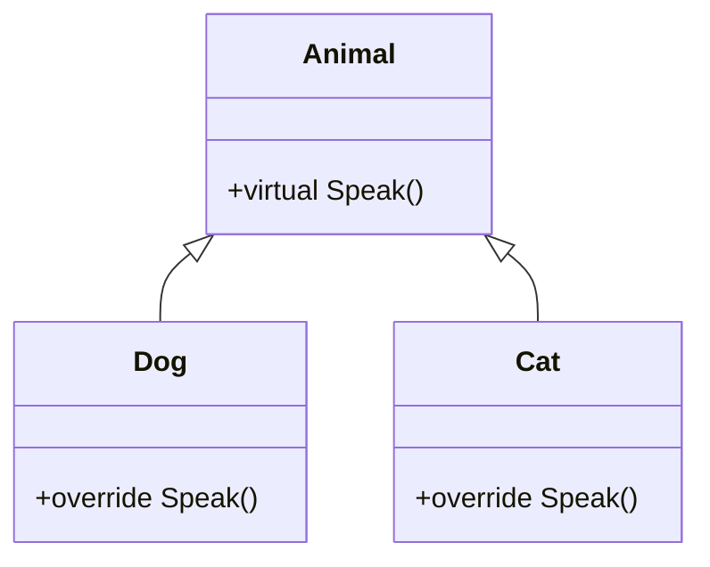

### Overloading vs Overriding vs Hiding (new)

| Keyword | Meaning |
|---|---|
| `virtual` | Declares a method that can be overridden |
| `override` | Provides a new implementation of a virtual method |
| `new` | Hides a base-class method instead of overriding it |

```csharp
class Base { public void Show() => Console.WriteLine("Base"); }
class Derived : Base { public new void Show() => Console.WriteLine("Derived"); }
```

Hiding resolution depends on the **reference type**, not the object's runtime type — this is the classic trap:

```csharp
Base b = new Derived();
b.Show();       // "Base" — resolved by reference type (Base), not object type
((Derived)b).Show(); // "Derived"
```

Real-world reasons to use `new` instead of `override`:
- **Backward compatibility** in legacy code you can't change — old callers of `LegacyLogger.Log()` keep working while a new hiding method improves behavior for new consumers.
- The base method **isn't virtual**, so it literally can't be overridden.
- You want base behavior when accessed as the base type but specialized behavior via the derived type (e.g., a watermarking `ConfidentialDocument`).
- Customizing a framework class whose method isn't `virtual` (e.g., a custom `MyButton : Button` hiding a non-virtual `Refresh()`).

> If you control the base class, prefer `virtual` + `override` — it is almost always the better design.

### Interface vs Abstract Class

```csharp
public interface IAnimal { void Speak(); }
public class Dog : IAnimal { public void Speak() => Console.WriteLine("Bark"); }

public abstract class Animal
{
    public abstract void Speak();               // must override
    public void Eat() => Console.WriteLine("Eating..."); // shared default
}
```

| Aspect | Interface | Abstract Class |
|---|---|---|
| Core idea | What a class CAN DO (capability) | What a class IS (identity) |
| Methods | No implementation (default methods since C# 8) | Both abstract and implemented |
| Fields / Constructors | No | Yes |
| Inheritance | Multiple | Single |

**Interface pros:** multiple inheritance, loose coupling (`IRepository` not `SqlRepository`), flexibility/polymorphism across unrelated classes, great for DI & mocking, encourages composition, default implementations since C# 8. **Cons:** no shared implementation pre-C#8, versioning issues when adding members pre-C#8, no fields/constructors, weaker encapsulation, risk of interface over-engineering (`IService`, `IHelper`, `IManager` everywhere).

**Abstract class pros:** code reuse via concrete methods, can hold shared state (fields/constructors), polymorphism, organized hierarchy. **Cons:** single-inheritance limitation, tighter coupling, cannot be instantiated directly (though its constructor still runs when a derived object is created — see Part III).

> **Design guideline:** start with an interface; use an abstract class only when shared state or behavior is genuinely required.

### struct vs class

```csharp
struct Point
{
    public int X { get; }
    public int Y { get; }
    public Point(int x, int y) { X = x; Y = y; }
}
Point p1 = new Point(2, 3);
Point p2 = p1;          // value copy
p2 = new Point(5, 6);
// p1.X == 2 (unchanged), p2.X == 5
```

| Feature | struct (value type) | class (reference type) |
|---|---|---|
| Memory | Stack (unless boxed or a field of a class) | Heap |
| Passing | By value (copy) | By reference |
| Inheritance | Interfaces only, no class inheritance | Supports inheritance |
| GC | No GC overhead | Managed by GC |
| Mutability | Should usually be immutable | Mutable |

Facts to have ready: passed by value (a copy is passed, so method mutations don't affect the original); before C# 10, structs couldn't have parameterless constructors (allowed from C# 10); should usually be immutable (copy-on-assignment makes mutable structs a common bug source); boxing occurs when a struct converts to `object`/an interface it implements (stack → heap copy); Microsoft recommends keeping structs small (**≤ 16 bytes** is the commonly cited guideline) since large structs are expensive to copy on every pass/assignment.

### sealed, static, and partial classes

```csharp
sealed class MyClass { }   // cannot be inherited

static class MathHelper    // cannot be instantiated; only static members
{
    public static int Square(int n) => n * n;
}
```

A `static` class cannot be instantiated, has only static members, cannot inherit from other classes (can implement interfaces since C# 8+... actually static classes still cannot implement instance interfaces since they have no instance — this applies to extension-method-style static classes only), can have a static constructor, and is ideal for utility methods.

`partial` classes split a class across multiple files — useful for large classes, separating generated code (e.g., EF Core scaffolding, WinForms designer) from hand-written code, and letting multiple developers work without merge conflicts.

### Access Modifiers

| Modifier | Inside class | Derived (same asm) | Same asm (non-derived) | Derived (diff asm) | Outside asm |
|---|---|---|---|---|---|
| `public` | Yes | Yes | Yes | Yes | Yes |
| `private` | Yes | No | No | No | No |
| `protected` | Yes | Yes | No | Yes | No |
| `internal` | Yes | Yes | Yes | No | No |
| `protected internal` | Yes | Yes | Yes | Yes | No |
| `private protected` | Yes | Yes | No | No | No |

Top-level (non-nested) classes can only be `public` or `internal`; nested classes may use any modifier.

### [new content] Records & record struct

A `record` is a reference type with built-in **value-based equality**, `ToString()`, and (by convention) immutability — ideal for DTOs and domain value objects.

```csharp
public record Product(int Id, string Name, decimal Price);

var p1 = new Product(1, "Laptop", 999.99m);
var p2 = new Product(1, "Laptop", 999.99m);
Console.WriteLine(p1 == p2);              // True — value equality, unlike class
var p3 = p1 with { Price = 899.99m };     // non-destructive mutation
```

`record struct` (C# 10) gives the same value-equality semantics but as a value type, avoiding heap allocation — useful for small, frequently-created value objects (`Money`, `Coordinates`).

| | class | record | record struct |
|---|---|---|---|
| Equality | Reference | Value (member-wise) | Value (member-wise) |
| Storage | Heap | Heap | Stack (usually) |
| Mutability | Mutable by default | Immutable by convention (init-only) | Mutable unless `readonly` |
| Best for | Behavior-rich entities | DTOs, domain value objects | Small, hot-path value objects |

> **Common interview question:** "What's the difference between a record and a class?" — lead with value equality + the `with` expression for non-destructive updates, then mention `record struct` for allocation-sensitive scenarios.

### [new content] Pattern Matching & Switch Expressions

```csharp
// Switch expression (C# 8+) replaces verbose switch statements
string Describe(object obj) => obj switch
{
    int n when n < 0 => "negative number",
    int n => $"number {n}",
    string s => $"string of length {s.Length}",
    Product { Price: > 1000 } => "expensive product",   // property pattern
    null => "nothing",
    _ => "unknown"
};

// Relational and logical patterns (C# 9)
bool IsAdult(int age) => age is >= 18 and < 120;

// List patterns (C# 11)
int[] numbers = { 1, 2, 3 };
if (numbers is [1, 2, 3]) Console.WriteLine("matched exact sequence");
if (numbers is [var first, .., var last]) Console.WriteLine($"{first}..{last}");
```

Property patterns and switch expressions are now the idiomatic way to replace nested `if/else` and type-checking chains — interviewers use this to gauge how current your day-to-day style is.

---

## Part III — Constructors & Object Creation

A constructor is a special method, same name as the class, no return type (not even `void`), that runs automatically on object creation to bring it into a valid, usable state and enforce invariants (preventing partially-constructed objects).

### Types of Constructors

1. **Default** — no parameters; if you define no constructor, C# supplies an implicit one; defining *any* constructor removes the implicit default.
2. **Parameterized** — enforces mandatory data; commonly used with DI.
3. **Overloaded** — multiple constructors, different parameter lists; use `: this(...)` chaining to avoid duplication.
   ```csharp
   public Order() : this(0, "Default") { }
   public Order(int id, string type) { Id = id; Type = type; }
   ```
4. **Static** — initializes static members; runs once per type, before the first instance creation or static member access; no parameters, no access modifiers; **only one allowed per class**; an exception inside it crashes the app, so keep it light.
5. **Private** — prevents external instantiation; used for Singleton, static utility classes, or factory-controlled creation.
   ```csharp
   public class Logger
   {
       private static Logger _instance;
       private Logger() { }
       public static Logger Instance => _instance ??= new Logger();
   }
   ```
6. **Copy** — C# provides **no** built-in copy constructor; you must hand-write one for cloning/defensive-copy/immutable patterns.

### Constructors in Abstract Classes

Abstract classes can have constructors even though they can't be instantiated directly — the constructor runs first when a *derived* object is created, to initialize shared state and enforce setup.

> *"Abstract class constructors run during derived object creation to initialize shared state and enforce required setup."*

### Step-by-Step Object Creation Process

```csharp
Employee emp = new Employee(10, "John");
```

1. `new` is encountered — the CLR determines it must create an `Employee`.
2. Memory allocated on the managed heap — size computed (fields + object header); fields **zero-initialized** (`Id = 0`, `Name = null`) **before any constructor runs**.
3. Object reference created (stack/register) — `emp` holds the heap address; the object itself is not on the stack.
4. Constructor resolution (compile time) — chosen by argument count/types/order.
5. Base constructor runs first — every class ultimately derives from `object`; call order is `object()` → derived.
6. Instance field initializers run — before the constructor body.
7. Constructor body executes.
8. Reference is assigned — object is now ready to use.
9. Lifetime & GC — stays alive while reachable; eligible for non-deterministic GC once unreachable.

> One-liner: **Memory allocation → zero initialization → constructor selection → base constructor → field initializers → constructor body → reference assignment.**

**Common interview Q&A (fully answered):**
- *Can constructors be virtual?* No — never virtual, abstract, or overridable.
- *Can constructors throw exceptions?* Yes, but generally only for argument-validation failures.
- *Static vs instance constructor?* Static runs once per type; instance runs per object.
- *Can a class have multiple static constructors?* No — only one is allowed.

Constructor best practices (senior level): keep constructors lightweight (no I/O/DB calls); validate arguments early; prefer immutability; avoid multiple public constructors in DI scenarios (the container needs one unambiguous constructor to call); use factory patterns for complex initialization.

### [new content] init, required, and Primary Constructors (C# 11/12)

```csharp
public class Person
{
    public string Name { get; init; }        // settable only during object initialization
    public required int Age { get; set; }    // C# 11 — compiler enforces it's set
}
var person = new Person { Name = "Alice", Age = 30 }; // fine
// person.Name = "Bob";  // compile error — init-only after construction
```

`init` allows a property to be set only at construction time (object initializer or constructor), giving immutability without needing a constructor overload for every combination of properties. `required` (C# 11) forces callers to set the property, catching missing-data bugs at compile time instead of runtime.

**Primary constructors** (extended from records to ordinary classes/structs in C# 12) put constructor parameters in scope throughout the class body without redeclaring fields:

```csharp
public class ProductService(IRepository repo, ILogger<ProductService> logger)
{
    public async Task<Product> GetAsync(int id)
    {
        logger.LogInformation("Fetching {Id}", id);
        return await repo.GetProductAsync(id);
    }
}
// no explicit constructor or private readonly fields needed
```
> *Caution: primary constructor parameters are not automatically fields — if you need to store a value for later use beyond what's referenced directly, the compiler synthesizes a hidden backing field only when the parameter is captured in a method body; don't rely on this implicitly if clarity matters.*

---

## Part IV — Intermediate: Members & Language Features

### Properties vs Fields

```csharp
public int MyField;                          // no encapsulation
public int MyProperty { get; set; }           // encapsulated access
```

| Feature | Field | Property |
|---|---|---|
| Encapsulation | No | Yes (get/set) |

### const vs readonly vs static

```csharp
const int ConstValue = 10;
readonly int ReadOnlyValue;    // assignable in constructor
static int StaticValue;
```

| Feature | const | readonly | static |
|---|---|---|---|
| Value set | Compile-time, at declaration | Runtime, in constructor | Shared across instances |
| Can change after init? | No | No, once constructor finishes | n/a |
| Storage | Baked into assembly metadata (IL) | Instance/type storage like any field | One copy per type |

### ref vs out vs in

```csharp
void RefExample(ref int num) { num += 5; }
void OutExample(out int num) { num = 10; }
void InExample(in int num) { /* read-only, cannot modify num */ }
```

| Feature | `ref` | `out` | `in` |
|---|---|---|---|
| Initialization | Must be initialized before passing | Doesn't need initialization | Must be initialized before passing |
| Used for | Read and modify an existing value | Returning additional value(s), e.g. `int.TryParse` | Passing large structs by reference **without** allowing mutation (avoids a copy while staying read-only) |

### params, Named Parameters, Indexers

```csharp
void PrintNumbers(params int[] numbers) { foreach (int n in numbers) Console.Write(n + " "); }
PrintNumbers(1, 2, 3, 4, 5); // 1 2 3 4 5

void Greet(string name, int age) => Console.WriteLine($"{name} is {age}");
Greet(age: 25, name: "Alice");     // named parameters — order-independent

class Sample
{
    private int[] arr = new int[5];
    public int this[int index] { get => arr[index]; set => arr[index] = value; }
}
```

### Extension Methods

A static method that "adds" a method to an existing type without modifying it — marked by `this` on the first parameter.

```csharp
public static class MyExtensions
{
    public static bool IsEven(this int number) => number % 2 == 0;
}
int x = 10;
Console.WriteLine(x.IsEven());   // True
```

The compiler rewrites `name.IsLongerThan(3)` into `StringExtensions.IsLongerThan(name, 3)` — it looks like an instance method but is a static call under the hood. Used to extend built-in types (`string`, `int`, `DateTime`), honor the Open/Closed Principle, and keep call sites readable. LINQ's `Where`/`Select`/`OrderBy` are all extension methods on `IEnumerable<T>`.

### Generics — Why They're Not Slow

```csharp
public class Box<T> { public T Value { get; set; } }
Box<int> intBox = new Box<int> { Value = 10 };
Box<string> strBox = new Box<string> { Value = "Hello" };
```

- **Compile-time:** one generic definition is type-checked once; no boxing/unboxing for value types (unlike `ArrayList`).
- **Runtime:** the CLR **shares one implementation** across all reference-type instantiations (since references are all the same size/shape), but **generates a specialized native implementation per distinct value-type instantiation** (`Box<int>` and `Box<double>` each get their own JIT-compiled code; `Box<string>` shares code with every other reference type).
- **Net effect:** avoids boxing, reduces memory overhead, and allows the JIT to inline more aggressively than it could through a non-generic `object`-based API.

### Tuples & Anonymous Types

```csharp
var person = ("John", 30);
Console.WriteLine(person.Item1);              // John

(string Name, int Age) named = ("John", 30);
Console.WriteLine(named.Name);                // named tuple elements — more readable

var p = new { Name = "John", Age = 30 };      // anonymous type
Console.WriteLine(p.Name);
```

### Reflection, Attributes, dynamic, ExpandoObject

```csharp
Type type = typeof(string);          // compile-time type retrieval
Console.WriteLine(type.FullName);

Type t2 = Type.GetType("System.String"); // runtime type retrieval (e.g. from a string)

[Obsolete("This method is deprecated.")]
void OldMethod() { }

dynamic value = "Hello";
value = 10;                          // no compile-time error — resolved at runtime (late binding)

dynamic expando = new ExpandoObject();
expando.Name = "John";               // properties added dynamically at runtime
```

`dynamic` skips compile-time type checking entirely (late binding); this trades compile-time safety for flexibility (e.g., COM interop, dynamic JSON, scripting scenarios) and comes with a real performance cost (each `dynamic` operation goes through the DLR — Dynamic Language Runtime — call-site caching, which is slower than a direct static call).

### yield return and Iterators

```csharp
IEnumerable<int> GetNumbers() { yield return 1; yield return 2; }
```

The compiler rewrites a `yield return` method into a state machine implementing `IEnumerable<T>`/`IEnumerator<T>` — execution is deferred until the caller enumerates (`foreach`, `.ToList()`, etc.), and each `MoveNext()` call resumes exactly where the previous one left off.

### Fluent Interfaces

A design style where methods return the same/related object so calls chain into readable, sentence-like code. Every fluent interface uses method chaining, but not every method chain is a fluent interface — a fluent interface specifically aims at a readable DSL.

```csharp
class Calculator
{
    private int _result;
    public Calculator Add(int x) { _result += x; return this; }
    public Calculator Multiply(int x) { _result *= x; return this; }
    public int Result() => _result;
}
```

.NET examples: `StringBuilder`, LINQ (`Where`/`Select`/`OrderBy`), ASP.NET Core middleware:
```csharp
app.UseRouting().UseAuthentication().UseAuthorization().MapControllers();
```

### Deep Copy vs Shallow Copy

| | Shallow Copy | Deep Copy |
|---|---|---|
| Copies | References (nested objects shared) | New instances (fully independent) |

```csharp
Person clone = (Person)this.MemberwiseClone(); // shallow copy — nested reference fields still shared
```

A deep copy typically requires either a hand-written recursive clone, serialize/deserialize round-trip (JSON or binary), or a copy constructor that itself deep-copies nested reference members. There's no built-in "deep clone" in .NET — every approach has trade-offs (serialization is simple but slow and requires all nested types to be serializable; a hand-written deep-copy constructor is fastest but must be kept in sync with the class shape).

### [new content] Static Abstract/Virtual Interface Members & Generic Math (C# 11)

Before C# 11, interfaces could only declare *instance* members. C# 11 allows `static abstract`/`static virtual` members, enabling **generic math** and operator-based generic constraints:

```csharp
public interface IShape<T> where T : IShape<T>
{
    static abstract T Create(double size);
    static abstract double Area(T shape);
}

public readonly struct Square : IShape<Square>
{
    public double Side { get; }
    private Square(double side) => Side = side;
    public static Square Create(double size) => new Square(size);
    public static double Area(Square s) => s.Side * s.Side;
}
```

The headline use case is `System.Numerics.INumber<T>` and related interfaces, which let you write a single generic method that works across `int`, `double`, `decimal`, and custom numeric types with real operators (`+`, `-`, `*`, comparisons) instead of duplicating math logic per type or falling back to `dynamic`/reflection.

### [new content] Source Generators

A source generator is a Roslyn-based compiler plugin that **inspects your code at compile time and emits additional C# source files** that get compiled alongside it — a modern alternative to reflection-heavy runtime metaprogramming.

- Used heavily in modern .NET: `System.Text.Json`'s `[JsonSerializable]` + `JsonSerializerContext` (source-generated serialization, no reflection, Native-AOT-friendly), the `LoggerMessage` source generator for zero-allocation structured logging, regex source generation (`[GeneratedRegex]`), and MVVM/DI-container community libraries.
- **Why it matters for senior interviews:** the industry direction (Native AOT, trimming, faster cold starts) is pushing away from reflection-based frameworks toward compile-time code generation. Being able to say "I'd use a source generator instead of reflection here for AOT compatibility and startup performance" is a strong senior signal.

```csharp
[JsonSerializable(typeof(Product))]
internal partial class AppJsonContext : JsonSerializerContext { }

// Usage — no reflection at runtime:
var json = JsonSerializer.Serialize(product, AppJsonContext.Default.Product);
```

---

## Part V — Delegates, Events & Lambdas

### Delegates

A delegate is a type-safe function pointer — unlike C/C++ function pointers, delegates are secure and type-checked, and you can pass methods as parameters.

```csharp
public delegate void Notify(string message);

public class Process
{
    public void StartProcess(Notify notifier) => notifier("Process Started...");
}

Notify notifyDelegate = Console.WriteLine;
new Process().StartProcess(notifyDelegate); // "Process Started..."
```

Types: **single-cast** (references one method) and **multicast** (`+=`, references multiple methods, invoked in registration order).

### Func, Action, Predicate

| Delegate | Inputs | Returns | Use case |
|---|---|---|---|
| `Func<T,TResult>` | 0–16 | A value | Computations, LINQ `Select`/`Where`/`OrderBy` |
| `Action<T>` | 0–16 | `void` | Logging, printing, `ForEach` |
| `Predicate<T>` | 1 | `bool` | Conditions, `FindAll` |

```csharp
Action<string> log = msg => Console.WriteLine("Log: " + msg);
Func<int,int,int> add = (a, b) => a + b;         // add(5,10) -> 15
Predicate<int> isEven = n => n % 2 == 0;         // isEven(4) -> true
```

**Pros of delegates:** loose coupling, callbacks/event-driven programming, multicast, foundation for LINQ/async continuations. **Cons:** overuse hurts traceability; multicast misuse causes unintended multiple executions; a null delegate call throws (`?.Invoke()` guards against this).

### Events

An event wraps a delegate and implements the **Publisher–Subscriber** pattern: the `event` keyword restricts external code to `+=`/`-=` only — it **cannot invoke or overwrite** the underlying delegate directly. This is the core encapsulation benefit over a raw public delegate field.

```csharp
public class Alarm
{
    public delegate void AlarmEventHandler(string message);
    public event AlarmEventHandler OnAlarm;
    public void Ring()
    {
        Console.WriteLine("Alarm ringing...");
        OnAlarm?.Invoke("Wake up! It's 7 AM");
    }
}
var alarm = new Alarm();
alarm.OnAlarm += msg => Console.WriteLine("Subscriber 1: " + msg);
alarm.OnAlarm += msg => Console.WriteLine("Subscriber 2: " + msg);
alarm.Ring();
```

**Real-life scenarios:** UI events (`Button.Click`, `TextBox.TextChanged`); stock-price notification (`PriceChanged` firing only `if (price != value)` to avoid redundant notifications — a good nuance); e-commerce `OrderPlaced` decoupling the order service from email/inventory/shipping listeners; microservices/messaging where domain events map to Kafka/RabbitMQ/AWS SNS/SQS pub-sub.

**Pros:** loose coupling, multicast, reusability (add subscribers without touching the publisher), stronger encapsulation than raw delegates. **Cons:** un-unsubscribed handlers are a classic **memory-leak** source (a long-lived publisher holds a reference to every subscriber via its invocation list — if a short-lived subscriber never unsubscribes, it can't be GC'd); harder debugging with many subscribers; overuse obscures control flow.

### Delegate vs Event

| Feature | Delegate | Event |
|---|---|---|
| Assignable? | Yes | No — only `+=` / `-=` |
| Who can invoke? | Any code with access | Only the publisher class |
| Encapsulation | Weaker (can be misused/overwritten) | Stronger (compiler-enforced) |
| Usage | Callbacks, passing functions, LINQ, async | Notifications, decoupled communication |

> *Analogy: a delegate hands someone your car keys (they can drive anytime); an event invites them along for the ride (you, the publisher, decide when it happens). Best practice: expose **events**, not raw delegates, in reusable libraries/APIs.*

### Lambda Expressions & Anonymous Methods

```csharp
Func<int,int> square = x => x * x;
Console.WriteLine(square(5)); // 25

Action<int> squarePrint = delegate(int x) { Console.WriteLine(x * x); }; // older anonymous-method syntax
```

Lambdas are the modern idiomatic form; the `delegate(...)` anonymous-method syntax still compiles but is rarely written by hand today.

---

## Part VI — Collections & LINQ

### LINQ Fundamentals

```csharp
var numbers = new[] { 1, 2, 3, 4, 5 };
var evens = numbers.Where(n => n % 2 == 0);   // deferred — not executed until enumerated
```

### IEnumerable vs IQueryable

```csharp
// IEnumerable — filtering happens in memory
List<int> numbers = new() { 1, 2, 3, 4, 5, 6 };
IEnumerable<int> result = numbers.Where(n => n > 3);

// IQueryable — translated to SQL: SELECT * FROM Customers WHERE Age > 30
IQueryable<Customer> q = context.Customers.Where(c => c.Age > 30);
```

| | IEnumerable | IQueryable |
|---|---|---|
| Namespace | `System.Collections` | `System.Linq` |
| Execution | In-memory (client-side) | At the data source (server-side) |
| Best for | In-memory collections (`List<T>`, arrays) | Remote data (EF Core, LINQ-to-SQL) |
| Mechanism | LINQ to Objects — filters after loading into memory | Expression trees translated to SQL |
| Performance | Loads all rows first, then filters | Fetches only matching rows |
| Deferred execution | Supported | Supported |

### Expression Trees & How EF Core Translates LINQ to SQL [gaps]

A near-guaranteed senior follow-up to "what's the difference between `IEnumerable` and `IQueryable`" is **"okay, but how does EF Core actually turn my LINQ into SQL?"** The answer is expression trees.

When a LINQ method is called on an `IQueryable<T>`, the compiler does **not** compile the lambda into IL that runs the code — instead, for `Expression<Func<T,bool>>`-typed parameters, it builds a **data structure describing the code** (an abstract syntax tree of the expression), which the LINQ provider can inspect and translate at runtime.

```csharp
Expression<Func<Customer, bool>> predicate = c => c.Age > 30 && c.City == "Seattle";
```

This compiles to something you can inspect and walk at runtime:
```csharp
Console.WriteLine(predicate.Body);   // (c.Age > 30) AndAlso (c.City == "Seattle")
// predicate.Parameters[0].Name -> "c"
// predicate.Body is a BinaryExpression with Left/Right sub-expressions, recursively walkable
```

**The key contrast that answers the interview question directly:**

| | `Func<T,bool>` | `Expression<Func<T,bool>>` |
|---|---|---|
| What the compiler produces | Compiled IL — a delegate you can invoke directly | An object graph (`Expression` tree) describing the lambda's structure |
| Where it runs | In-process, immediately | Nowhere by itself — a provider must walk the tree and translate it |
| Used by | `IEnumerable<T>`/LINQ to Objects | `IQueryable<T>`/EF Core, LINQ to SQL, any remote-query provider |

**The EF Core translation pipeline, concretely:**

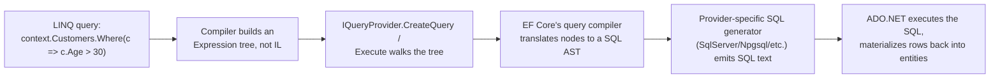

1. Each `Where`/`Select`/`OrderBy` call on an `IQueryable<T>` doesn't execute anything — it wraps the *previous* expression tree in a new node representing "call `Where` with this predicate expression," building up a bigger tree. This is why LINQ-to-SQL queries are **deferred**: nothing runs until the query is enumerated (`ToList()`, `foreach`, `FirstAsync()`, etc.).
2. On enumeration, EF Core's `IQueryProvider` walks the full accumulated expression tree, matches recognized patterns (property access, comparisons, method calls it knows how to translate), and builds an internal relational query model.
3. That model is handed to a provider-specific SQL generator (different for SQL Server, PostgreSQL/Npgsql, SQLite, etc.) which emits the actual `SELECT ... WHERE ...` text.
4. **Anything EF Core's translator doesn't recognize throws at runtime** (or, in older EF Core versions, silently fell back to client-side evaluation — EF Core 3.0+ made this an error by default specifically because silent client-evaluation was a major source of the "why is this so slow" N+1-style bugs). A classic gotcha: calling a non-translatable custom C# method inside a `Where()` predicate (`c => MyHelper.IsValid(c)`) fails to translate — EF Core has no way to turn an arbitrary compiled method into SQL, since it never runs the method, it only ever inspects the expression tree describing the call.
5. This is also exactly why `.ToList()` "too early" (covered under LINQ Gotchas below) breaks translation entirely — once you've materialized to an in-memory `List<T>`, every subsequent LINQ call binds against `IEnumerable<T>`/`Func<T,bool>`, not `IQueryable<T>`/`Expression<Func<T,bool>>`, so nothing after that point can be pushed down to SQL.

> **Interview one-liner:** "`IQueryable` methods take `Expression<Func<...>>` instead of `Func<...>` — the compiler hands the provider a *description* of your lambda instead of compiled code, and the provider (EF Core) walks that description to generate SQL. That's the entire mechanism — there's no magic beyond tree-walking and pattern-matching against known translatable shapes."

### PLINQ / AsParallel() Trade-offs [gaps]

PLINQ (`System.Linq.ParallelEnumerable`, exposed via `.AsParallel()`) parallelizes LINQ-to-Objects queries across multiple cores using the ThreadPool, partitioning the source sequence and merging results. It is **not** a free performance win — it's a targeted tool with real overhead, and misusing it is a common senior-level trap question ("I added `.AsParallel()` and it got slower — why?").

```csharp
var result = numbers
    .AsParallel()
    .Where(n => IsExpensivePredicate(n))   // CPU-bound work per element — good PLINQ candidate
    .Select(n => Transform(n))
    .ToList();                              // forces materialization/merge
```

**When PLINQ helps:**
- The per-element work is genuinely **CPU-bound and non-trivial** (a cheap predicate like `n % 2 == 0` parallelized over a small collection is pure overhead with no payoff).
- The source collection is **large enough** to amortize partitioning and thread-coordination cost — PLINQ's own heuristics (`WithExecutionMode(ParallelExecutionMode.ForceParallelism)` to override them) sometimes decide *not* to parallelize a query it judges too cheap to bother with.
- Operations are **independent per element** — no shared mutable state, no ordering dependency.

**When PLINQ hurts (the trade-offs an interviewer wants to hear):**
- **Partitioning overhead** — PLINQ must split the source into chunks and schedule/coordinate worker tasks; for small collections or cheap per-element work, this coordination cost exceeds any parallelism benefit.
- **Result merging cost** — by default PLINQ preserves order-sensitive merging behavior for some operators, which itself has overhead; `.AsUnordered()` relaxes this when order doesn't matter, often meaningfully faster.
- **Over-subscription** — running PLINQ queries concurrently with other CPU-bound work (including other PLINQ queries, or a Server-GC background thread) causes contention over a fixed number of cores — you can end up with *more* total threads than cores, causing context-switch thrashing rather than genuine parallelism.
- **I/O-bound work is the wrong fit entirely** — PLINQ parallelizes CPU work across cores; for I/O-bound per-element work, `Parallel.ForEachAsync` (see Part VIII) is the correct tool, not PLINQ.
- **Exceptions** are aggregated into an `AggregateException` (same as `Task`-based parallelism), which changes your catch-block shape versus a normal sequential LINQ query.

> **Strong senior answer:** "I'd only reach for PLINQ after profiling shows a specific CPU-bound LINQ-to-Objects operation is a bottleneck on a sufficiently large in-memory collection — it's not a default, and for I/O-bound fan-out work I'd use `Parallel.ForEachAsync` or `Task.WhenAll` instead, since PLINQ is specifically about spreading CPU-bound per-element work across cores."

### IEnumerable vs ICollection vs IList vs IReadOnlyList

- **`IEnumerable<T>`** — read-only forward iteration only (`foreach`); no `Count`, no indexer.
- **`ICollection<T>`** — adds `Add`, `Remove`, `Count`, `Contains`.
- **`IList<T>`** — adds index-based access (`this[int]`), `Insert`, `RemoveAt`.
- **`IReadOnlyList<T>` / `IReadOnlyCollection<T>`** — expose read-only indexed access/count **without** exposing mutation methods — the correct return type for a public API that hands back an internal list without letting callers mutate it (safer than returning `List<T>` directly, and cheaper than `.ToList().AsReadOnly()` since it doesn't force a defensive copy by itself — though callers can still cast back to the concrete mutable type if they're determined to, so it's a signal/contract, not a hard guarantee).

### List vs Array

```csharp
int[] numbers = new int[5];
List<int> numList = new List<int>();
```

| Feature | Array | List |
|---|---|---|
| Fixed size? | Yes | No |
| Performance | Faster | Slightly slower |

`List<T>` is slower than an array because it wraps an array internally and adds resizing (amortized doubling), bounds checking, and safety features that introduce overhead.

### Dictionary vs Hashtable

```csharp
Dictionary<int,string> students = new();
students[1] = "Alice";
```

| Feature | Hashtable | Dictionary\<TKey,TValue\> |
|---|---|---|
| Type safety | No (boxes value types, stores as `object`) | Yes (generic) |
| Thread safety | Legacy: safe for single-writer/multiple-reader without locking | Not thread-safe — use `ConcurrentDictionary` for concurrent access |
| Recommendation | Legacy/avoid in new code | Preferred |

### ReadOnlyCollection vs List

```csharp
ReadOnlyCollection<int> numbers = new List<int> { 1, 2, 3 }.AsReadOnly();
```

| Feature | ReadOnlyCollection | List |
|---|---|---|
| Modification | No | Yes |
| Usage | Safety / immutability at API boundaries | General-purpose |

### Jagged vs Multidimensional Arrays

```csharp
// Jagged array — array of arrays, independently-sized rows
int[][] jagged = new int[2][];
jagged[0] = new int[] { 1, 2 };
jagged[1] = new int[] { 3, 4, 5 };

// Multidimensional (rectangular) array — fixed rectangular shape, single memory block
int[,] grid = new int[2, 3];
grid[0, 0] = 1;
```

Jagged arrays are more flexible (rows of different lengths) and are actually arrays-of-references (extra indirection per row); rectangular multidimensional arrays store all elements contiguously in a single block, which can be faster for genuinely rectangular data (e.g., a fixed grid or matrix) since there's one allocation instead of N+1.

### Covariance & Contravariance

**Covariance (`out`)** — a more-derived type can be assigned to a base-typed reference (output positions only). **Contravariance (`in`)** — a base type can be assigned where a derived type is expected (input positions only).

```csharp
public interface IEnumerable<out T> : IEnumerable { IEnumerator<T> GetEnumerator(); }

IEnumerable<string> strings = new List<string> { "A", "B", "C" };
IEnumerable<object> objects = strings;    // allowed thanks to out T
```

The `out` modifier tells the compiler `T` can only appear in **output** positions (e.g., returned by `GetEnumerator()`) and never as a method parameter — which is exactly why `IEnumerable<T>` can be safely covariant: you can read items out of it, but there's no `Add(T item)` method that could let you put an incompatible type in.

### String vs StringBuilder

```csharp
StringBuilder sb = new StringBuilder("Hello");
sb.Append(" World");
```

| Feature | String | StringBuilder |
|---|---|---|
| Mutable? | No (new instance each change) | Yes (modifies in place) |
| Performance | Slower for repeated edits | Faster for repeated edits |

`string` is immutable — every apparent "modification" (`+=`, `Replace`, `Substring`) allocates a brand-new string object. .NET also **interns** string literals (identical literals in the assembly can share one instance via the intern pool), which is why `"abc" == "abc"` by reference for literals — but strings built at runtime (e.g., via concatenation) are **not** automatically interned. `StringBuilder` maintains an internal mutable char buffer and should be **pre-sized** (`new StringBuilder(capacity)`) when the approximate final length is known, to avoid repeated internal buffer resizes.

### .NET 6+ LINQ Additions: MinBy/MaxBy/Chunk/DistinctBy/Order/OrderDescending [gaps]

.NET 6 through 9 added several LINQ operators that replace verbose, easy-to-get-wrong workarounds from older code — worth knowing cold since interviewers use them to gauge whether your day-to-day LINQ usage is current.

```csharp
var products = new[]
{
    new Product("Laptop", 999.99m, "Electronics"),
    new Product("Mouse", 25.00m, "Electronics"),
    new Product("Desk", 250.00m, "Furniture"),
};

// MinBy / MaxBy (.NET 6) — select the element with the min/max key, not just the key itself.
// Old way: products.OrderBy(p => p.Price).First();  (sorts the whole sequence just to get one element)
Product cheapest = products.MinBy(p => p.Price);       // Mouse
Product priciest = products.MaxBy(p => p.Price);       // Laptop

// Chunk (.NET 6) — splits a sequence into fixed-size batches, last batch may be smaller.
foreach (Product[] batch in products.Chunk(2))
    await ProcessBatchAsync(batch);                     // e.g., batched bulk-insert calls

// DistinctBy (.NET 6) — de-duplicate by a key selector instead of the whole object/a custom IEqualityComparer.
var onePerCategory = products.DistinctBy(p => p.Category);  // first product seen per category

// Order / OrderDescending (.NET 7) — shorthand for OrderBy(x => x) when sorting by the element itself.
var sorted = new[] { 3, 1, 2 }.Order();                 // [1, 2, 3] — no need for OrderBy(x => x)
var sortedDesc = products.Select(p => p.Price).OrderDescending();
```

| Method | Replaces | Introduced |
|---|---|---|
| `MinBy(keySelector)` / `MaxBy(keySelector)` | `OrderBy(key).First()` / `OrderByDescending(key).First()` — avoids sorting the whole sequence for one element | .NET 6 |
| `Chunk(size)` | Hand-rolled batching loops with manual index math | .NET 6 |
| `DistinctBy(keySelector)` | `GroupBy(key).Select(g => g.First())`, or a custom `IEqualityComparer<T>` just to de-dupe by one property | .NET 6 |
| `Order()` / `OrderDescending()` | `OrderBy(x => x)` / `OrderByDescending(x => x)` when the element itself is the sort key | .NET 7 |

> **Nuance worth mentioning:** `MinBy`/`MaxBy` return the **element**, not the key (unlike `Min()`/`Max()`, which return the key/value itself when called with a selector on some overloads) — mixing these up is an easy mistake. Also, on a tie, `MinBy`/`MaxBy` return the **first** matching element in iteration order, mirroring `First()` semantics.

### [new content] LINQ Gotchas Every Senior Dev Should Know

- **Multiple enumeration.** Calling `.Count()` then `.First()` on the same `IEnumerable<T>` query (not yet materialized) can execute the underlying query **twice** — expensive for `IQueryable` (two round-trips to the DB) and dangerous for a lazily-evaluated sequence with side effects. Fix: materialize once with `.ToList()`/`.ToArray()` if you need to inspect it more than once.
- **Deferred execution + captured variables in loops.** A classic bug:
  ```csharp
  var funcs = new List<Func<int>>();
  for (int i = 0; i < 3; i++) funcs.Add(() => i);   // C# 5+: each iteration has its own 'i' — this is actually fine now
  ```
  Prior to C# 5, `foreach`/`for` loop variables were captured by reference and shared across closures, causing every lambda to return the *final* value. **C# 5 changed `foreach` to give each iteration its own variable** — but a classic-`for` loop's index variable is still a single variable shared across all captured lambdas *unless* you copy it into a loop-local variable. Interviewers still ask this because the C# 5 fix only covers `foreach`, not `for`.
- **`First()`/`FirstOrDefault()`/`Single()`/`SingleOrDefault()` semantics**: `First()` throws `InvalidOperationException` on an empty sequence; `FirstOrDefault()` returns `default(T)` (null/0/etc.); `Single()` throws if there is **zero or more than one** match (use it to assert uniqueness, e.g., a primary-key lookup you expect to be unambiguous); `SingleOrDefault()` throws only on more-than-one, returns default on zero.
- **`ToList()`/`ToArray()` on `IQueryable` too early.** Materializing before applying further `Where`/`OrderBy` forces EF Core to pull the full table into memory and filter client-side — the classic "why is this endpoint slow" root cause in code review.
- **Custom equality in LINQ** (`Distinct()`, `GroupBy()`, `Except()`) requires either overriding `Equals`/`GetHashCode` on the element type or supplying an `IEqualityComparer<T>` — silently using reference equality on a custom class is a common bug (`Distinct()` "not working").

---

## Part VII — Memory Management & Garbage Collection

### Stack vs Heap in the .NET Memory Model

**Stack** — fast, temporary, LIFO storage. Holds local value-type variables, reference variables (pointers to heap objects), and call-frame details (return address, parameters). Freed automatically when a method returns; no fragmentation.

**Heap (managed heap)** — flexible storage for reference-type objects, controlled by the GC. Freed when objects are no longer reachable; slower than the stack; can fragment (the GC compacts it during collection).

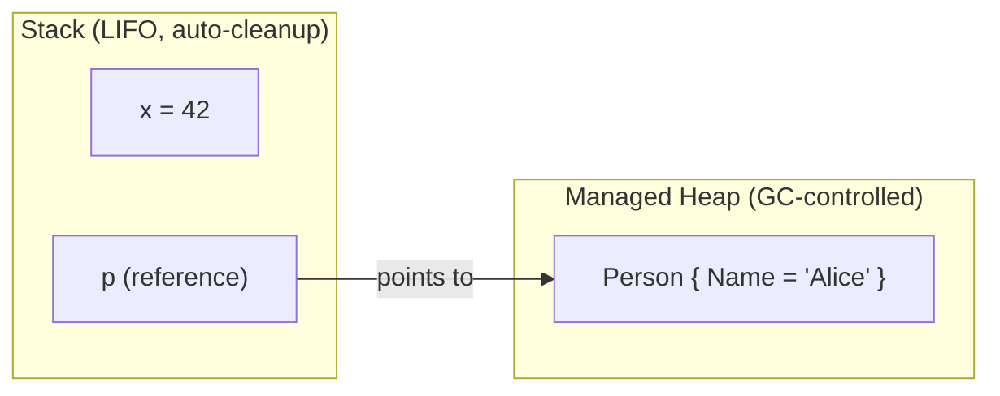

| Feature | Stack | Heap |
|---|---|---|
| Stores | Value types, references, call frames | Objects, reference-type data |
| Memory mgmt | Automatic, scope-based | Garbage Collector |
| Speed | Very fast | Slower (GC overhead) |
| Lifetime | Scoped to method/block | Until no longer referenced |
| Fragmentation | None | Possible (GC compacts) |

### Garbage Collection (GC)

The GC reclaims memory used by unreferenced objects. Mechanics: **Mark** (identify reachable objects from GC roots) → **Sweep** (remove unreachable ones) → **Compact** (optional, reduces fragmentation).

**Generational GC** — objects start in Gen 0 and are promoted as they survive collections:

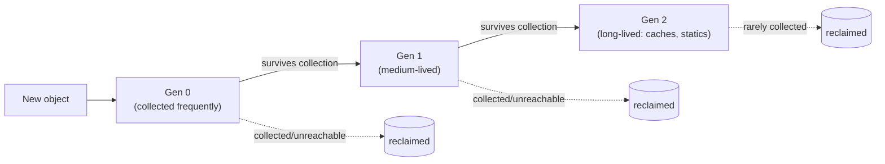

| Generation | Description | Example |
|---|---|---|
| Gen 0 | Newly created, collected frequently | Method-local variables |
| Gen 1 | Survived Gen 0, medium-lived | Objects promoted from Gen 0 |
| Gen 2 | Long-lived, collected least often | Caches, static/global references |

**GC triggers:** memory pressure, allocation threshold reached, or explicit `GC.Collect()` (discouraged — hurts performance by forcing an out-of-schedule full collection). **Large Object Heap (LOH):** objects > 85 KB go on the LOH, collected with Gen 2, and historically not compacted automatically (for performance) — `GCSettings.LargeObjectHeapCompactionMode` can request compaction on the next collection if fragmentation becomes a real problem.

| Mode | Description |
|---|---|
| Workstation GC | Default; single-threaded apps |
| Server GC | Multi-threaded apps (e.g. ASP.NET Core — default in server contexts) |
| Concurrent/Background GC | Runs Gen 2 collection on a background thread without fully freezing the app |

> Avoid `GC.Collect()` unless truly necessary (e.g., after a known-large, one-off allocation burst in a batch job) — manual collection defeats the GC's own heuristics and hurts throughput.

### GC Diagnostics Tooling for Production [gaps]

"Walk me through debugging a production memory leak" is one of the most common senior .NET prompts (it appears elsewhere in this guide as a sample scenario) — and a strong answer names actual tools, not just concepts like "generations" and "roots." The modern .NET diagnostics toolchain (`dotnet-counters`, `dotnet-gcdump`, `dotnet-trace`) is installed via `dotnet tool install -g <name>` and attaches to a **running process by PID**, with no code changes or restarts required — critical for production, where you often can't attach a debugger or redeploy just to investigate.

| Tool | What it does | When to reach for it |
|---|---|---|
| `dotnet-counters` | Live-streams performance counters (GC heap size per generation, allocation rate, ThreadPool queue length, exception count, GC pause time) to the console in real time | **First step** — cheap, low-overhead, tells you *whether* there's a real problem and roughly what kind (steadily growing Gen 2 heap? high allocation rate? ThreadPool starvation?) before you commit to a heavier capture |
| `dotnet-gcdump` | Captures a point-in-time snapshot of the managed heap (object graph, counts, and retention paths) without pausing the process for long — analyzed in a tool like PerfView or Visual Studio's heap-diff viewer | **Second step**, once counters show heap growth — used to answer "what specific objects are accumulating, and what's rooting them" |
| `dotnet-trace` | Captures a broader CPU/runtime event trace (GC events, JIT, exceptions, allocations tagged by call stack) over a time window, analyzed in PerfView/Speedscope/Visual Studio | Used when you need **allocation call stacks** (not just object counts) or need to correlate GC pauses with CPU activity/latency spikes over time |

**A realistic walkthrough — "production memory usage keeps climbing, diagnose it":**

```bash
# 1. Find the process
dotnet-counters ps

# 2. Watch live GC/heap counters against the running process — cheap, safe, no pause
dotnet-counters monitor --process-id <pid> System.Runtime
#    Look at: gc-heap-size, gen-0/1/2-size, gen-0/1/2-gc-count, alloc-rate, gc-committed-bytes
#    A Gen 2 heap that keeps climbing across repeated GC cycles (never shrinking back down after
#    a full collection) is the actual signature of a leak, as opposed to just high-but-stable
#    allocation churn — this distinction matters and is worth stating explicitly.

# 3. Take two heap snapshots several minutes apart under normal load
dotnet-gcdump collect --process-id <pid> -o snapshot1.gcdump
#    ...wait, let more traffic accumulate...
dotnet-gcdump collect --process-id <pid> -o snapshot2.gcdump

# 4. Diff the two dumps (e.g., in the PerfView heap-diff view, or `dotnet-gcdump report`)
#    Look for object types whose *count* grew between snapshots disproportionately to traffic —
#    e.g., 50,000 more HttpRequestMessage or EventHandler-captured closures than expected.
#    Then inspect the retention/GC-root path for that type: what's holding a reference?
#    Classic culprits (all covered elsewhere in this guide): un-unsubscribed event handlers,
#    a static/singleton cache with no eviction, a captive DbContext, closures captured into a
#    long-lived delegate.

# 5. If the heap diff alone isn't conclusive, capture a trace to get allocation call stacks
dotnet-trace collect --process-id <pid> --providers Microsoft-DotNETCore-SampleProfiler
#    Analyze in PerfView/Speedscope: which call stack is doing the allocating, not just which
#    type is accumulating — pinpoints the actual line of code, not just the symptom.
```

> **Why this sequencing matters for a senior answer:** `dotnet-counters` first (cheap, tells you *if* and roughly *what kind* of problem), then `dotnet-gcdump` (tells you *what* objects and *what's rooting them*), then `dotnet-trace` only if you still need *where in the code* the allocations originate. Jumping straight to a full trace on a production box under load is heavier-handed than necessary for most leak investigations — sequencing your tool usage from cheapest/safest to most invasive is itself a signal of production experience.

### Dispose() vs Finalize()

`Dispose()` (`IDisposable`) is **explicit, deterministic** cleanup of unmanaged resources (file handles, DB connections, sockets, OS handles, native memory). `Finalize()` (the `~ClassName()` destructor) is called by the GC, **non-deterministic** and slower — a last-resort safety net if `Dispose()` was never called.

> **GC is about memory. Dispose() is about resources.** The GC does not promptly release unmanaged resources — it only knows about managed memory.

```csharp
using var fs = new FileStream("test.txt", FileMode.Open); // Dispose() guaranteed even on exception
```

Full Dispose pattern (Dispose + finalizer backup):

```csharp
public class ResourceHolder : IDisposable
{
    private bool disposed = false;
    public void Dispose() { Dispose(true); GC.SuppressFinalize(this); }
    protected virtual void Dispose(bool disposing)
    {
        if (!disposed)
        {
            if (disposing) { /* free managed resources (other IDisposables) */ }
            // free unmanaged resources (native handles) unconditionally
            disposed = true;
        }
    }
    ~ResourceHolder() { Dispose(false); }
}
```

| | Dispose() | Finalize() |
|---|---|---|
| Defined in | `IDisposable` | `object` (via destructor syntax) |
| Called by | Developer (or `using`) | GC |
| Determinism | Deterministic | Non-deterministic |
| Reusability | Safe to call multiple times (idempotent) | Called once by GC |

Common disposable types: `FileStream`, `SqlConnection`, `SqlCommand`, `StreamReader`/`StreamWriter`. **`HttpClient` should be reused/DI-managed (via `IHttpClientFactory`), not disposed per request** — a very common gotcha question (disposing/recreating `HttpClient` per call can exhaust sockets under load due to how the underlying `SocketsHttpHandler` manages connections).

Best practices: prefer `using`/`using var`; dispose only what you own; don't dispose injected dependencies unless ownership is explicit; keep `Dispose()` lightweight; never throw from `Dispose()`.

### Weak References

A `WeakReference<T>` lets the GC collect an object while the app can still retrieve it *if it happens to still be alive* — the reference doesn't keep the object rooted.

```csharp
WeakReference<object> weakRef = new WeakReference<object>(new object());
if (weakRef.TryGetTarget(out var target)) { /* still alive */ }
```

Real use cases: large caches where you want entries to be reclaimable under memory pressure without an explicit eviction policy; event-subscriber patterns to avoid the classic "publisher keeps subscriber alive forever" leak (`ConditionalWeakTable<TKey,TValue>` is the related tool for attaching extra data to an object's lifetime without extending it — used internally by some caching and interop scenarios).

### Memory Leaks in .NET

Because .NET is garbage-collected, "leaks" are really **unintentional rooting** — something keeps a reference alive that should have been released. Classic sources, roughly in order of how often they actually bite production code:

```csharp
static List<byte[]> list = new List<byte[]>();
void LeakMemory() => list.Add(new byte[100000]); // static root never released
```

1. **Un-unsubscribed event handlers** — a long-lived publisher's invocation list holds a reference to every subscriber.
2. **Captured closures in long-lived delegates** — a lambda registered with a static event or long-lived cache that captures `this` keeps the whole containing object alive.
3. **Static caches without eviction** — a `static Dictionary` that only grows.
4. **[new content] DI captive dependencies** — see Part X.
5. `HttpClient` misuse (see above).

---

### [new content] IAsyncDisposable

`IDisposable.Dispose()` is synchronous — but some cleanup is inherently asynchronous (flushing a network stream, closing a DB connection that requires an async round-trip). C# 8 added `IAsyncDisposable` + `await using`:

```csharp
public class AsyncResource : IAsyncDisposable
{
    private readonly Stream _stream;
    public async ValueTask DisposeAsync()
    {
        await _stream.FlushAsync();
        await _stream.DisposeAsync();
    }
}

await using var resource = new AsyncResource(); // calls DisposeAsync() at scope exit, asynchronously
```

A type can implement **both** `IDisposable` and `IAsyncDisposable` for callers who can't `await` (e.g., synchronous legacy call sites) — the synchronous `Dispose()` should still do its best to release resources (often by blocking on the async cleanup) as a fallback, but `await using` is preferred whenever the call site is already `async`. `DbContext`, `SqlConnection`, and `Stream` subclasses in modern .NET all implement `IAsyncDisposable`.

---

## Part VIII — Advanced: Multithreading & Async

### Thread vs Task (TPL)

| Feature | Thread | Task (TPL) |
|---|---|---|
| Abstraction level | Low-level (OS-managed) | High-level (.NET runtime-managed) |
| Execution | Dedicated OS thread | Runs on a ThreadPool-managed thread |
| Creation cost | Expensive | Optimized (reuses pooled threads) |
| Return value | None | Can return values (`Task<T>`) |
| Synchronization | Manual (`lock`, `Monitor`) | Easier via async/await |
| Exception handling | Manual | Built-in (`Task.Exception`, `AggregateException`) |
| Best use case | Long-running background operations | Parallel/short-lived, I/O-bound work |

### Task Lifecycle & Exception Handling

**Task states:** `Created` → `WaitingToRun` → `Running` → `WaitingForChildrenToComplete` → `RanToCompletion` / `Faulted` / `Canceled`.

| Feature | Thread | Task |
|---|---|---|
| Exception propagation | Doesn't propagate automatically; must handle inside the thread | Captured; (re)thrown when awaited/`.Wait()`/`.Result` observed |
| Crashes application if uncaught? | Yes | No — stays inside the Task until observed |
| Multiple exceptions | No built-in aggregation | `AggregateException.InnerExceptions` |
| Works with async/await? | No | Yes |

**Cancellation** — cooperative cancellation via `CancellationToken`/`CancellationTokenSource`:

```csharp
using var cts = new CancellationTokenSource(TimeSpan.FromSeconds(5)); // auto-cancel after 5s
try
{
    await DoWorkAsync(cts.Token);
}
catch (OperationCanceledException)
{
    // expected on cancellation — not necessarily an error
}

async Task DoWorkAsync(CancellationToken token)
{
    for (int i = 0; i < 100; i++)
    {
        token.ThrowIfCancellationRequested();   // cooperative check
        await Task.Delay(100, token);
    }
}
```
`CancellationTokenSource.CreateLinkedTokenSource(tokenA, tokenB)` combines multiple cancellation sources (e.g., a per-request token plus an app-shutdown token) into one — cancels if *either* source cancels.

### Thread Safety Primitives

**Critical section** — code accessed/written by multiple threads concurrently. `lock` serializes access.

```csharp
private readonly object _lockObj = new();
lock (_lockObj) { /* critical section */ }
```

`lock` is **synchronous only** — it cannot be held across an `await` (the compiler forbids `await` inside a `lock` block). For async-compatible mutual exclusion, use `SemaphoreSlim` (see Part XVI).

### async/await Fundamentals

`async` marks a method as asynchronous and enables `await` inside it. `await` asynchronously suspends execution until the awaited operation completes, **without blocking the calling thread**.

```csharp
public async Task<string> GetDataAsync()
{
    using var client = new HttpClient();
    string data = await client.GetStringAsync("https://example.com");
    return data;
}
```

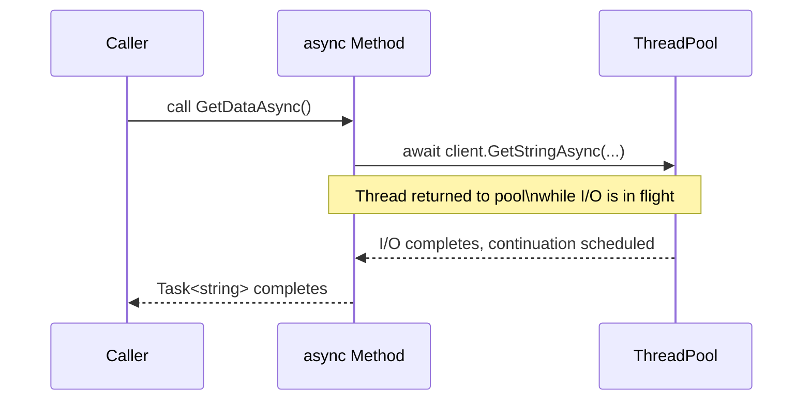

### Async State-Machine Internals [gaps]

This is the topic that separates candidates who memorized "await doesn't block a thread" from those who can actually explain *how*. The C# compiler rewrites every `async` method into a compiler-generated class (a struct for some cases, to reduce allocations) implementing `IAsyncStateMachine`, with the method body transformed into a jump-table-driven `MoveNext()` method.

**What the compiler generates, conceptually, for:**
```csharp
public async Task<string> GetDataAsync()
{
    var response = await _httpClient.GetStringAsync(url);
    return response.ToUpper();
}
```

...is roughly equivalent to:

```csharp
private struct GetDataAsyncStateMachine : IAsyncStateMachine
{
    public int _state;                                   // tracks which await we're resuming after
    public AsyncTaskMethodBuilder<string> _builder;       // manages the returned Task<string>
    public HttpClient _httpClient;
    private TaskAwaiter<string> _awaiter;                 // captured awaiter, survives across suspension

    void IAsyncStateMachine.MoveNext()
    {
        string result;
        try
        {
            if (_state == 0)   // resuming after the await
            {
                result = _awaiter.GetResult();            // rethrows if the task faulted
                goto AfterAwait;
            }

            // first entry — call the async operation
            var task = _httpClient.GetStringAsync(url);
            _awaiter = task.GetAwaiter();
            if (!_awaiter.IsCompleted)
            {
                _state = 0;
                _builder.AwaitUnsafeOnCompleted(ref _awaiter, ref this);  // registers continuation, returns to caller
                return;                                    // <-- this is the "suspend" point; thread is freed here
            }
            result = _awaiter.GetResult();                 // synchronous fast path — already completed

            AfterAwait:
            var final = result.ToUpper();
            _builder.SetResult(final);                     // completes the returned Task<string>
        }
        catch (Exception ex)
        {
            _builder.SetException(ex);                     // exception captured onto the Task, not thrown here
        }
    }

    void IAsyncStateMachine.SetStateMachine(IAsyncStateMachine sm) { }
}
```

**The mechanics an interviewer is actually probing for:**

1. **Calling the async method doesn't run the whole body.** It runs synchronously up to the *first* `await` whose awaited operation isn't already complete. `AsyncTaskMethodBuilder<T>` creates the `Task<T>` that's returned to the caller immediately — this is the same `Task` object that eventually gets `SetResult`/`SetException` called on it.
2. **`awaiter.IsCompleted` is checked first, synchronously**, as a fast-path optimization — if the awaited operation is already done (e.g., a cache-hit `ValueTask`, or `Task.CompletedTask`), the state machine never actually suspends; it just calls `GetResult()` inline and keeps running. This is why "await" doesn't *guarantee* a context switch or thread hop.
3. **If not completed**, the state machine registers itself as the continuation via `OnCompleted`/`UnsafeOnCompleted` on the awaiter, then **returns control to the caller** — this is the actual point where "the thread is freed." The method hasn't finished; it's suspended, and `MoveNext()` will be invoked again later by whatever completes the awaited operation (I/O completion port callback, timer, ThreadPool work item).
4. **Resuming** means some other piece of infrastructure code (not "the same thread waiting") calls `MoveNext()` again. The `_state` field is how the rewritten method knows to jump past the setup code and go straight to consuming `_awaiter.GetResult()` and continuing after the `await`.
5. **Exceptions never propagate via a normal `throw` up the call stack from `MoveNext()`.** They're caught inside `MoveNext()` and stored on the `Task` via `_builder.SetException(ex)` — which is *why* an exception inside an `async Task` method surfaces only when the caller awaits/observes that `Task`, and why `async void` (no `Task` to store the exception on) is dangerous (see below).
6. **Awaiter contract**: any type usable with `await` needs `GetAwaiter()` returning something with `bool IsCompleted`, `void GetResult()` (or `T GetResult()`), and `OnCompleted(Action)`/`UnsafeOnCompleted(Action)` implementing `INotifyCompletion`/`ICriticalNotifyCompletion` — this is a compile-time duck-typed pattern, not an interface requirement on the awaited type itself, which is how you can `await` a `Task`, a `ValueTask`, a `YieldAwaitable`, or a custom awaitable type.

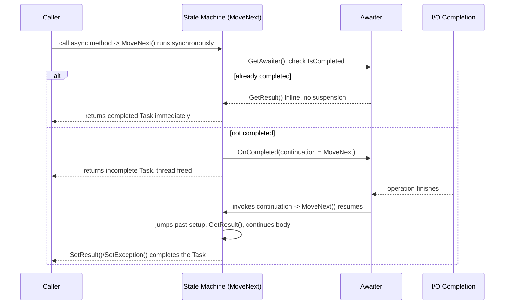

> **Interviewer follow-up: "Is the state machine a class or a struct?"** By default the compiler emits a `struct` for the state machine (to avoid a heap allocation in the common case where the method completes synchronously), boxed to the heap only the first time it actually needs to suspend (i.e., the first `await` that doesn't complete synchronously) — this is one of several allocation-avoidance tricks the compiler applies (along with reusing cached, already-completed `Task`/`ValueTask` instances) that make `async`/`await` cheaper than it looks from the syntax alone.

### Asynchrony vs Multithreading

| Feature | Asynchrony (async/await) | Multithreading (Thread, Task, Parallel) |
|---|---|---|
| Threading model | Single thread, avoids blocking | Multiple explicit threads |
| Best for | I/O-bound tasks (file, network, DB) | CPU-bound tasks (computation) |
| Resource usage | Efficient — doesn't tie up threads | Costlier — more threads consume resources |
| Complexity | Easier to write and manage | Requires synchronization, deadlock/race handling |
| Parallel execution? | Not necessarily — just non-blocking | Truly parallel across cores |

Use async/await when waiting on I/O; use multithreading (or `Parallel`/PLINQ) for CPU-bound parallel work; the two are frequently combined (e.g., `await Task.Run(() => CpuBoundWork())` to move CPU work off a thread that must stay responsive — see the ASP.NET Core caveat below).

### Deadlocks & Race Conditions

**Classic lock-ordering deadlock:**
```csharp
// Thread A: lock(obj1) then lock(obj2)
// Thread B: lock(obj2) then lock(obj1)  <-- inconsistent order = deadlock risk
lock (obj1) { lock (obj2) { /* ... */ } }
```

**Race condition:**
```csharp
int count = 0;
Parallel.For(0, 1000, _ => count++); // non-atomic increment — lost updates, wrong total
```

> See **[new content] The Classic Sync-Over-Async Deadlock** below for the async-specific deadlock pattern — the single most common senior async interview question, and a genuinely different mechanism from the lock-ordering deadlock above.

### Task Parallel Library (TPL)

TPL (`System.Threading.Tasks`) is a higher-level abstraction over raw threads for concurrent/parallel code — instead of manually creating/managing threads, you use `Task`s, which run on the ThreadPool.

> *Interview definition: "The Task Parallel Library simplifies writing concurrent and parallel code by providing the Task and Parallel classes. Instead of manually managing threads, developers use tasks, which are lightweight, efficient, and automatically scheduled by the .NET ThreadPool."*

```csharp
Task task = Task.Run(() => Console.WriteLine("Running on thread: " + Task.CurrentId));
task.Wait();

Parallel.For(1, 5, i => Console.WriteLine($"Processing {i} on thread {Task.CurrentId}"));
```

**TPL vs async/await:** TPL is a set of APIs (`Task`, `Parallel`, `TaskFactory`) for creating/managing concurrent work — low-level control. `async`/`await` is *language syntactic sugar built on top of TPL* that makes asynchronous code read sequentially.

```csharp
// TPL version — "plumbing heavy"
Task<string> task1 = Task.Run(() => DownloadData("API 1", 2000));
Task<string> task2 = Task.Run(() => DownloadData("API 2", 3000));
Task.WaitAll(task1, task2);
Console.WriteLine(task1.Result);
Console.WriteLine(task2.Result);

// async/await version — idiomatic, exceptions propagate naturally via try/catch
var t1 = DownloadDataAsync("API 1", 2000);
var t2 = DownloadDataAsync("API 2", 3000);
var results = await Task.WhenAll(t1, t2);
```

> *Analogy: TPL = the engine (raw power to run tasks). async/await = the automatic transmission (makes it easy to drive the engine). They're used together, not as alternatives.*

**Commonly used TPL functions:**

| Method | Purpose |
|---|---|
| `Task.Run()` | Run code on a background thread; can return a value |
| `Task.Wait()` / `.Result` | **Blocks** until a task completes — avoid in ASP.NET/UI code (see deadlock section) |
| `Task.WhenAll()` | Await multiple tasks concurrently until all finish |
| `Task.WhenAny()` | Returns when the first task completes |
| `Task.Delay()` | Non-blocking delay |
| `Task.FromResult()` | Wraps an already-available value in a completed `Task<T>` |
| `Task.CompletedTask` | An already-completed `Task` (void-equivalent) |
| `ContinueWith()` | Runs a continuation after a task (mostly replaced by `await` in modern C#) |
| `Parallel.For()` / `Parallel.ForEach()` | CPU-bound parallel loops |
| `Task.Factory.StartNew()` | Older, lower-level task starter — **not** a drop-in replacement for `Task.Run`: it defaults to *not* unwrapping a nested `Task` (so `StartNew(() => SomeAsyncMethod())` gives you a `Task<Task>` unless you add `.Unwrap()`), and its default scheduling options differ. `Task.Run` is the correct default for "just run this asynchronously" in virtually all modern code. |

### Task.Run vs Task.Factory.StartNew(LongRunning) vs Parallel.ForEachAsync [gaps]

`Task.Run` is the correct default for "run this on the ThreadPool" in over 95% of cases — it uses sensible defaults (`TaskScheduler.Default`, `DenyChildAttach`) and automatically unwraps a nested `Task`. The remaining cases are worth knowing precisely:

```csharp
// Task.Run — the default. Uses a pooled thread; fine for short/medium CPU-bound work.
Task.Run(() => ProcessBatch(data));

// Task.Factory.StartNew with LongRunning — opts OUT of the pool for a genuinely
// long-lived, dedicated thread (the TaskScheduler hints the underlying thread
// shouldn't be reused/reclaimed the way pooled worker threads are).
Task.Factory.StartNew(
    () => RunForeverPollingLoop(),
    CancellationToken.None,
    TaskCreationOptions.LongRunning,
    TaskScheduler.Default);
```

| | `Task.Run` | `Task.Factory.StartNew(..., LongRunning)` |
|---|---|---|
| Thread source | ThreadPool (shared, reused) | Hints the scheduler to create a dedicated thread, bypassing normal pool heuristics |
| Nested `Task` unwrapping | Automatic | Manual — must call `.Unwrap()` or you get `Task<Task>` |
| When to use | Default choice for CPU-bound work, background offload | A **long-running, blocking loop** that would otherwise occupy (and starve) a pool thread for its entire lifetime — e.g., a dedicated polling/consumer loop that blocks on a `BlockingCollection.Take()` for the life of the application |
| Overuse risk | None — it's the safe default | Creating many `LongRunning` tasks defeats the purpose of pooling and can exhaust OS thread resources just like raw `Thread` objects |

**Rule of thumb:** if the work is bounded and will finish, use `Task.Run`. If the work is an unbounded, blocking loop that would otherwise tie up a pool thread indefinitely (starving other queued work), use `TaskCreationOptions.LongRunning` — it's functionally closer to spinning up a raw dedicated `Thread` than to a normal pooled task.

**`Parallel.ForEachAsync` (.NET 6+)** is the modern, built-in answer to "I need bounded concurrency over an async operation" — replacing the common hand-rolled pattern of a `SemaphoreSlim` plus a list of tasks:

```csharp
// Old pattern — manual SemaphoreSlim throttling
var semaphore = new SemaphoreSlim(maxDegreeOfParallelism: 8);
var tasks = urls.Select(async url =>
{
    await semaphore.WaitAsync();
    try { await DownloadAsync(url); }
    finally { semaphore.Release(); }
});
await Task.WhenAll(tasks);

// Modern equivalent — Parallel.ForEachAsync
await Parallel.ForEachAsync(urls,
    new ParallelOptions { MaxDegreeOfParallelism = 8, CancellationToken = ct },
    async (url, token) => await DownloadAsync(url, token));
```

`Parallel.ForEachAsync` handles the throttling, cancellation propagation, and exception aggregation (`AggregateException` if multiple iterations fail) for you — it's the go-to for "process N items with bounded async concurrency" in modern .NET, and a strong senior answer to "how would you limit concurrent outbound calls to a downstream API" now leads with this before reaching for a manual semaphore.

### How the "Main Thread" Works in ASP.NET Core

One of the most misunderstood ASP.NET Core topics. Unlike WinForms/WPF, **ASP.NET Core has no dedicated UI thread or request thread**.

```csharp
var builder = WebApplication.CreateBuilder(args);
builder.Services.AddScoped<IProductService, ProductService>();
var app = builder.Build();
app.MapControllers();
app.Run();
```

A single startup thread executes `Program.cs`; after `app.Run()`, that thread's job is essentially done — Kestrel listens for requests, and each request is handled by a **ThreadPool thread**, not the startup thread.

```csharp
// Synchronous — blocks Thread #17 for 5 seconds, unavailable to serve other requests
public Product GetProduct(int id) { Thread.Sleep(5000); return new Product(); }

// Async — releases Thread #17 back to the pool immediately while waiting
public async Task<Product> GetProduct(int id) { await Task.Delay(5000); return new Product(); }
```

With `await`, the thread is returned to the pool the moment the `await` is reached; a **possibly different thread** resumes execution once the awaited operation completes — there is **no thread affinity** in ASP.NET Core (unlike WinForms, where `button.Text = "Done"` must run on the UI thread).

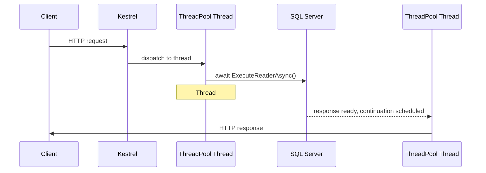

100 concurrent requests do **not** mean 100 dedicated threads — threads are shared/reused across the entire middleware pipeline (Kestrel → Auth → Authz → Logging → Controller → Service → Repository → SQL). `BackgroundService` also runs on ThreadPool threads, not a dedicated one. Under the hood, Kestrel uses **I/O Completion Ports** (Windows) / **epoll** (Linux) to dispatch work to the ThreadPool.

> **Nuance often missing from notes:** wrapping CPU-bound work in `Task.Run()` *inside* a controller action (e.g., `await Task.Run(() => CreatePdf())`) is a **mild anti-pattern in ASP.NET Core**. It just moves work from one pool thread to another pool thread and adds scheduling/context-switch overhead — there's no dedicated UI thread here to "free up," unlike in WinForms/WPF where `Task.Run` genuinely frees the UI thread. Prefer a truly async I/O-bound API where one exists, or run genuinely CPU-heavy work on a background worker/queue rather than inline in the request path.

**Key takeaways:** ASP.NET Core has no UI thread; requests are handled by shared ThreadPool threads; `await` releases the thread during I/O; continuations may resume on a different thread; scalability comes from avoiding blocked threads; Kestrel + ThreadPool together enable high throughput. This model underpins `Task`, async/await, `Task.Run`, `ThreadPool`, `Parallel.ForEach`, `Channels`, `BackgroundService`, `SemaphoreSlim`, TPL Dataflow, and producer-consumer patterns (several of these are covered in Part XVI).

### Async Streams (IAsyncEnumerable\<T\>)

```csharp
public static async IAsyncEnumerable<int> GenerateNumbers()
{
    for (int i = 1; i <= 5; i++)
    {
        await Task.Delay(1000);
        yield return i;
    }
}

await foreach (var number in GenerateNumbers())
    Console.WriteLine(number);
```

Processes data asynchronously as it arrives rather than materializing an entire collection first — useful for streaming large result sets or paging through an API without buffering everything in memory.

---

### [new content] ConfigureAwait(false) and SynchronizationContext

A `SynchronizationContext` captures "where" a continuation after `await` should resume. In **UI frameworks** (WPF, WinForms, older ASP.NET Framework/MVC with a request `SynchronizationContext`), there is a captured context — the continuation is marshaled back to it (e.g., back to the UI thread) so that touching UI controls after an `await` "just works."

**ASP.NET Core has no `SynchronizationContext`** (removed starting with ASP.NET Core 1.0) — continuations resume on *any* available ThreadPool thread, which is why the "no thread affinity" behavior described above holds.

`ConfigureAwait(false)` tells the awaiter **not** to try to resume on the captured context, if one exists:

```csharp
public async Task<string> GetDataAsync()
{
    var response = await _httpClient.GetAsync(url).ConfigureAwait(false);
    return await response.Content.ReadAsStringAsync().ConfigureAwait(false);
}
```

**Current, nuanced guidance (2026):**
- In **library code** that has no reason to know or care about a UI context (NuGet packages, shared class libraries, business-logic layers), `ConfigureAwait(false)` is still good practice on every `await` — it avoids forcing a context-marshal cost and avoids being a *cause* of a sync-over-async deadlock in a caller that blocks on your `Task` (see below).
- In **ASP.NET Core application code**, `ConfigureAwait(false)` is largely **unnecessary** since there's no `SynchronizationContext` to capture in the first place — many teams have dropped the "always add ConfigureAwait(false)" rule for ASP.NET Core-only codebases, keeping it only where the same code might run in a context-sensitive host (e.g., a shared library also consumed by a WPF app).
- It's a nuance an interviewer will probe: *"do you still need ConfigureAwait(false) in ASP.NET Core?"* — the strong senior answer is "not strictly, since Core has no SynchronizationContext, but I still use it in shared library code that might be consumed by a context-capturing host, and it's cheap insurance."

### [new content] The Classic Sync-Over-Async Deadlock

This is the **#1 most commonly asked senior async question** — and it's a fundamentally different mechanism from a lock-ordering deadlock.

```csharp
// WPF / WinForms / ASP.NET (classic, pre-Core) button click handler:
void Button_Click(object sender, EventArgs e)
{
    var result = GetDataAsync().Result;  // BLOCKS the UI thread, waiting for GetDataAsync to finish
}

async Task<string> GetDataAsync()
{
    await Task.Delay(1000);   // by default, captures the current SynchronizationContext
    return "done";            // this continuation needs to resume ON the UI thread
}
```

**Why it deadlocks:**
1. The UI thread calls `.Result`, which **blocks** the UI thread until `GetDataAsync()` completes.
2. Inside `GetDataAsync`, after `await Task.Delay(1000)`, the continuation (`return "done";`) is scheduled to resume **on the captured `SynchronizationContext`** — i.e., back on the UI thread.
3. But the UI thread is **blocked** waiting on `.Result` — it can never get around to running that continuation.
4. Deadlock: the continuation is waiting for the UI thread to be free; the UI thread is waiting for the continuation to finish.

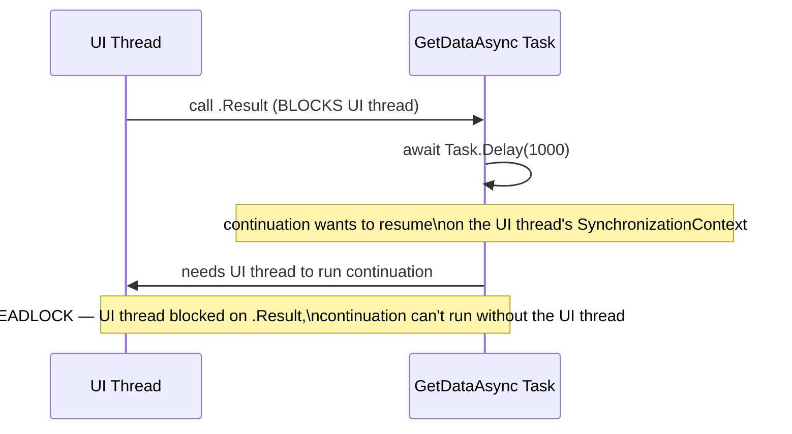

**This does NOT happen in ASP.NET Core** in the same way, because there's no `SynchronizationContext` to capture — the continuation can run on any ThreadPool thread. It *can* still cause **thread-pool starvation** under load (blocking a pool thread on `.Result` while its continuation needs another pool thread), which is a related but distinct problem — under enough concurrent load, you can still exhaust the pool.

**Fixes, in order of preference:**
1. **Await all the way up** — make the caller `async` too; never call `.Result`/`.Wait()` on an async method from sync code if you can avoid it.
2. If you truly must call async code from a sync context (e.g., a legacy sync interface you can't change), use `ConfigureAwait(false)` throughout the async call chain so no continuation needs the original context — this avoids the deadlock (though it's still blocking a thread, so it's a workaround, not a fix for the underlying design smell).
3. `Task.Run(() => AsyncMethod()).Result` — offloads the async call to a ThreadPool thread with no captured context, sidestepping the specific UI-context deadlock (still blocks the calling thread, still not ideal, but breaks the deadlock).

### [new content] async void — Why It's Dangerous

```csharp
async void ProcessOrder()  // DANGER
{
    await Task.Delay(100);
    throw new Exception("boom");
}
```

- **Exceptions thrown inside an `async void` method cannot be caught by the caller** — there's no `Task` to observe, so the exception is instead thrown directly on the `SynchronizationContext` that was active when the method started, which typically **crashes the process** (or is silently swallowed depending on host) rather than propagating to a `try/catch` around the call site.
- `async void` methods can't be `await`ed — the caller has no way to know when the operation finishes, making sequencing, testing, and error handling all significantly harder.
- **The one legitimate use case: top-level event handlers** (e.g., a WinForms/WPF `Button_Click`), because event-handler delegates have a `void`-returning signature the framework dictates and you can't change. Even there, best practice is to have the handler immediately delegate to an `async Task` method and wrap it in a `try/catch` internally.
- **Rule of thumb: always prefer `async Task`, even for methods that logically "return nothing."** `async Task` gives you a `Task` the caller *can* await and observe exceptions from; `async void` gives the caller nothing to hook into.
- This also matters in tests — an `async void` test method silently passes even if an awaited call inside it throws, because the test runner never sees the exception. xUnit/NUnit test methods should always be `async Task`.

### [new content] Task vs ValueTask

`Task`/`Task<T>` is a heap-allocated reference type — every call to an `async Task<T>` method that doesn't hit a fast synchronous path still allocates a `Task<T>` object. `ValueTask<T>` is a `struct` that can represent either a synchronously-available result (no heap allocation) or wrap an underlying `Task<T>` when the operation is genuinely asynchronous.

```csharp
public ValueTask<int> GetCachedOrComputeAsync(int key)
{
    if (_cache.TryGetValue(key, out var value))
        return new ValueTask<int>(value);          // synchronous path — zero allocation

    return new ValueTask<int>(ComputeAsync(key));   // async path — wraps a Task<int>
}
```

| | `Task<T>` | `ValueTask<T>` |
|---|---|---|
| Type | Reference type (heap-allocated) | Struct (stack, unless it wraps a Task) |
| Best for | General-purpose async APIs | Hot paths where the result is *frequently* already available synchronously (e.g., cache hits) |
| Can be awaited multiple times? | Yes | **No** — awaiting a `ValueTask` more than once, or accessing `.Result` before checking completion, is undefined/unsafe |
| Can be stored and awaited later? | Yes, freely | Should be awaited once, immediately — don't cache a `ValueTask` for later |
| API surface | Rich (`.WhenAll`, `.WhenAny`, continuations) | Deliberately minimal — convert to `Task` via `.AsTask()` if you need the richer API |

> **Interviewer follow-up: "So should I just use ValueTask everywhere for performance?"** No — the strong senior answer is *no, default to `Task<T>`* unless profiling shows a specific hot path where a large percentage of calls complete synchronously (classic case: a caching layer, or a buffered stream reader). `ValueTask`'s restrictions (no multiple awaits, no `.Result` access before completion checks, awkward with `Task.WhenAll`) make it easy to misuse, and its benefit (avoiding one small heap allocation) rarely matters outside genuinely hot, high-throughput code paths. Microsoft's own guidance is to use `Task` by default and reach for `ValueTask` only when you have evidence it's worth the added complexity.

---

## Part IX — Data Access: ADO.NET

**What is ADO.NET?** A low-level data-access framework for opening connections, executing SQL, retrieving/manipulating data, handling transactions, and working with disconnected data. Full control over SQL execution; faster/lighter than EF Core because there's no object tracking or LINQ-translation layer. Common in high-performance apps, microservices needing fine-grained control, and legacy systems.

**Core architecture:**
- **Connected model** — `Application → Connection → Command → DataReader → Database`; data read while the connection stays open.
- **Disconnected model** — `Application → DataAdapter → DataSet/DataTable → Database`; data loaded into memory, connection can close.

**Data providers:** `SqlConnection`, `SqlCommand`, `SqlDataReader`, `SqlDataAdapter`, `SqlTransaction`. Modern SQL Server provider: **`Microsoft.Data.SqlClient`** (the older `System.Data.SqlClient` is legacy/deprecated — a currency point worth stating explicitly in an interview).

**Connection pooling** is enabled by default — connections are reused (not destroyed) on `Close()`/`Dispose()`. Best practice: "open late, close early" via `using`; improper management (leaked open connections) can exhaust the pool under load.

**Command execution methods:**

| Method | Returns | Use for |
|---|---|---|
| `ExecuteReader()` | `SqlDataReader` (forward-only) | Streaming/reading large datasets — fastest |
| `ExecuteNonQuery()` | Affected row count | INSERT, UPDATE, DELETE |
| `ExecuteScalar()` | Single value | Aggregates, existence checks |

**Parameterized queries** prevent SQL injection and enable query-plan reuse:
```csharp
cmd.Parameters.Add("@Id", SqlDbType.Int).Value = id;   // correct
// "SELECT * FROM Users WHERE Id=" + id                // WRONG — injection risk
```
Prefer explicit `SqlDbType` over `.AddWithValue()` — `AddWithValue` infers type/size from the .NET value, which can cause query-plan cache bloat (slightly different inferred sizes produce different cached plans for what's logically the same query) and occasional implicit-conversion index scans.

**Transactions** — ACID guarantees via `BeginTransaction()`/`Commit()`/`Rollback()`. Keep transaction scope small; be ready to discuss **isolation levels**:

| Isolation Level | Dirty Reads | Non-Repeatable Reads | Phantom Reads | Notes |
|---|---|---|---|---|
| Read Uncommitted | Possible | Possible | Possible | Fastest, least safe |
| Read Committed (SQL Server default) | Prevented | Possible | Possible | Common default |
| Repeatable Read | Prevented | Prevented | Possible | Holds read locks longer |
| Serializable | Prevented | Prevented | Prevented | Slowest, fully isolated |
| Snapshot | Prevented | Prevented | Prevented | Row-versioning based, no blocking reads |

**Async operations** (`OpenAsync`, `ExecuteReaderAsync`, etc.) improve **throughput** (freeing threads under concurrent load), not single-query latency.

**ADO.NET vs Dapper vs EF Core** — a senior answer gives a decision framework, not just "it depends":

| | ADO.NET | Dapper | EF Core |
|---|---|---|---|
| Abstraction | None — raw SQL + manual mapping | Micro-ORM — raw SQL + automatic mapping | Full ORM — LINQ, change tracking, migrations |
| Performance | Fastest | Very fast (close to ADO.NET) | Slower, improving each release |
| Productivity | Lowest | Medium | Highest |
| Best for | Performance-critical hot paths | High-performance apps that still want mapping convenience | CRUD-heavy business apps, rapid development |

> Default to EF Core for most business logic; drop to Dapper (or raw ADO.NET) for specific hot-path queries once profiling actually shows EF Core overhead matters — don't pre-optimize by avoiding EF Core everywhere out of principle.

**Common pitfalls:** not understanding connection pooling; string-concatenated SQL; connections left open; not disposing readers; ignoring async (thread-pool starvation under load); overusing `DataSet` where a `DataReader` would do; not discussing isolation levels/transaction scope when asked.

**High-scale composite example** — async order-creation combining a transaction, parameterized queries, and a `CancellationToken`:

```csharp
public async Task<OrderResult> CreateOrderAsync(int productId, int quantity, CancellationToken token)
{
    using SqlConnection conn = new SqlConnection(_cs);
    await conn.OpenAsync(token);
    using SqlTransaction transaction = conn.BeginTransaction();
    try
    {
        var productCmd = new SqlCommand(
            "SELECT Id, Name, Price, Stock FROM Products WHERE Id = @ProductId", conn, transaction);
        productCmd.Parameters.Add("@ProductId", SqlDbType.Int).Value = productId;

        Product product = null;
        using (var reader = await productCmd.ExecuteReaderAsync(token))
            if (await reader.ReadAsync(token))
                product = new Product { Id = reader.GetInt32(0), Name = reader.GetString(1),
                                         Price = reader.GetDecimal(2), Stock = reader.GetInt32(3) };

        if (product == null) throw new Exception("Product not found");
        if (product.Stock < quantity) throw new Exception("Insufficient stock");

        var orderCmd = new SqlCommand(
            "INSERT INTO Orders(ProductId, Quantity, TotalAmount) OUTPUT INSERTED.Id " +
            "VALUES(@ProductId, @Qty, @Total)", conn, transaction);
        orderCmd.Parameters.Add("@ProductId", SqlDbType.Int).Value = productId;
        orderCmd.Parameters.Add("@Qty", SqlDbType.Int).Value = quantity;
        orderCmd.Parameters.Add("@Total", SqlDbType.Decimal).Value = product.Price * quantity;
        int orderId = (int)await orderCmd.ExecuteScalarAsync(token);

        var stockCmd = new SqlCommand(
            "UPDATE Products SET Stock = Stock - @Qty WHERE Id = @ProductId", conn, transaction);
        stockCmd.Parameters.Add("@Qty", SqlDbType.Int).Value = quantity;
        stockCmd.Parameters.Add("@ProductId", SqlDbType.Int).Value = productId;
        await stockCmd.ExecuteNonQueryAsync(token);

        transaction.Commit();
        return new OrderResult { OrderId = orderId, ProductName = product.Name, Quantity = quantity };
    }
    catch { transaction.Rollback(); throw; }
}
```

---

## Part X — Design Principles & Patterns

### SOLID Principles

| Principle | Purpose |
|---|---|
| **S**RP | One responsibility per class |
| **O**CP | Open for extension, closed for modification |
| **L**SP | Subtypes substitutable for their base type |
| **I**SP | Don't force unused methods on implementers |
| **D**IP | Depend on abstractions, not concretions |

- **SRP** — a class doing both salary calculation and report generation should be split into `SalaryCalculator` and `ReportGenerator`.
- **OCP** — replace a `ProcessPayment()` `if/else` chain with an `IPayment` interface and one class per payment method, so new methods are added without touching existing code.
- **LSP** — a `Square : Rectangle` that forces `Width == Height` breaks `Rectangle`'s contract (setting `Width` unexpectedly changes `Height`); instead, both should implement a `Shape` abstraction independently.
- **ISP** — split a fat `Worker { Work(); Eat(); }` into `IWorkable`/`IEatable` so a `Robot` only implements `IWorkable`.
- **DIP** — a `Computer` should depend on `IKeyboard`/`IMonitor` injected via constructor, not concrete `Keyboard`/`Monitor` classes.

> **Note:** one raw source file (`c#.txt`) had its SOLID code examples written in Java syntax (`implements`, `extends`, `System.out.println`) despite being C# interview notes — this guide uses the correct, idiomatic C# framing above throughout.

### Dependency Injection (DI)

```csharp
public interface IService { void Serve(); }
public class MyService : IService { public void Serve() => Console.WriteLine("Serving..."); }
public class Client
{
    private readonly IService _service;
    public Client(IService service) { _service = service; }
}
```

**How .NET's built-in DI container actually works** (`Microsoft.Extensions.DependencyInjection`):

1. **Service registration** builds a service map (interface → implementation):
   ```csharp
   builder.Services.AddScoped<INotificationService, EmailService>();
   builder.Services.AddScoped<ReportService>();
   ```
2. **Service resolution** — when `ReportService` needs `INotificationService`, the container finds `EmailService`, creates it, and injects it (constructor injection is the standard mechanism).
3. **Object lifetime** — the container manages lifetime for you:

| Lifetime | Behavior |
|---|---|
| Transient | New instance every time it's requested |
| Scoped | One instance per HTTP request (or per scope) |
| Singleton | One instance for the whole application lifetime |

4. **Mechanism** — the C# compiler does **not** rewrite your code for DI. At runtime, the container inspects constructors via **reflection**, matches parameters to registered services, and recursively resolves all dependencies. This all happens at runtime, not compile time.

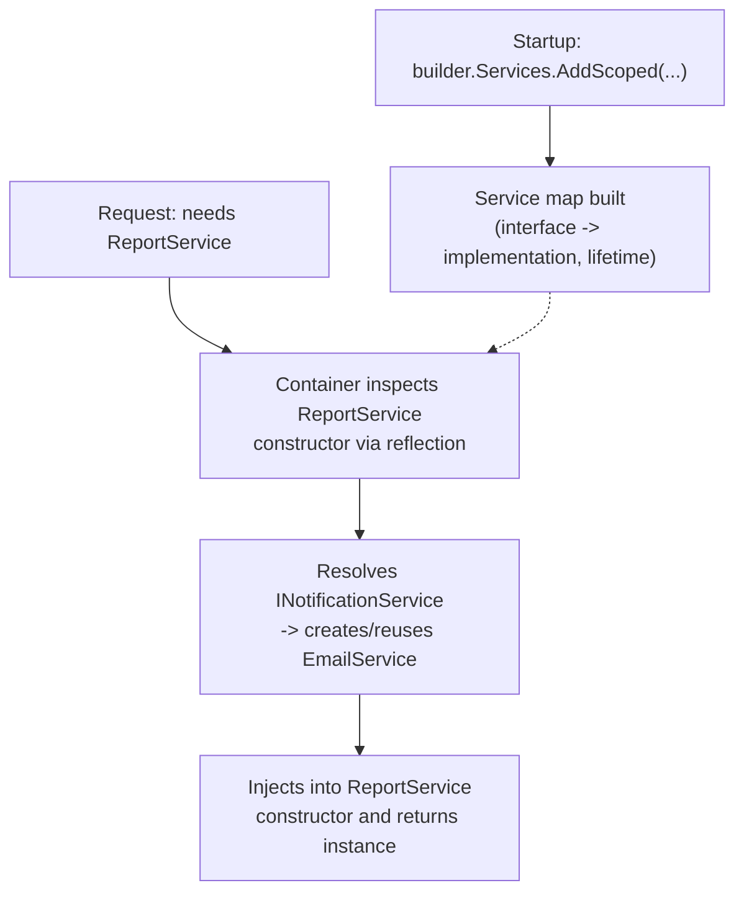

### Serialization & Deserialization

```csharp
string json = JsonSerializer.Serialize(myObject);
Person p = JsonSerializer.Deserialize<Person>(jsonString);
```

`[Serializable]` + `BinaryFormatter` is the legacy binary approach; `System.Text.Json` is the modern, explicit JSON approach. **Security note (Microsoft's own guidance): do NOT use `BinaryFormatter`/`[Serializable]` for untrusted data** — `BinaryFormatter` is obsolete and disabled by default in modern .NET due to deserialization-based remote-code-execution vulnerabilities. Modern .NET APIs avoid it entirely.

**[new content]** For performance/AOT scenarios, `System.Text.Json` source generators (`JsonSerializerContext` + `[JsonSerializable]`) eliminate reflection from serialization entirely — see Part IV's Source Generators section. `Newtonsoft.Json` remains common in older codebases and has a richer feature set in some edge cases (e.g., more flexible custom converters historically), but `System.Text.Json` is the modern default for new code due to performance and native AOT support.

### AutoMapper

```csharp
var config = new MapperConfiguration(cfg => cfg.CreateMap<Person, PersonDTO>());
var mapper = config.CreateMapper();
```

**[new content] The AutoMapper debate.** AutoMapper is convenient for simple entity↔DTO mapping but has real, debated downsides at senior level: reflection-based mapping has a runtime cost; mapping bugs (wrong property matched, silently `null`) surface at runtime instead of compile time; complex mapping configurations become their own hard-to-debug DSL. Many senior teams have moved to **explicit manual mapping** (extension methods or static factory methods) or **source-generated mappers** (e.g., Mapperly) that produce compile-time-checked, allocation-free mapping code with full IntelliSense/refactoring support. A strong senior answer: "AutoMapper is fine for simple, low-stakes mapping, but for anything business-critical or performance-sensitive, I prefer explicit mapping or a source-generated mapper — the compile-time safety and debuggability outweigh AutoMapper's convenience."

### Architectural Patterns

- **MVC** (Model-View-Controller) — web applications.
- **MVVM** (Model-View-ViewModel) — WPF, Xamarin, Blazor.
- **Command** — encapsulates a request as an object; supports undo/redo.
- **CQRS** — separates read and write operations for scalability (see Part XVII for the MediatR-based .NET implementation).

**[new content]** Also expected at senior level: **Repository + Unit of Work** — a `Repository<T>` abstracts persistence per aggregate, and a `Unit of Work` coordinates multiple repository operations into one atomic save (EF Core's `DbContext` already *is* a Unit of Work, which is why hand-rolling a generic repository over EF Core is often criticized as a redundant abstraction layer — a nuance worth raising if asked "would you build a repository layer over EF Core?"). **Mediator** (via MediatR) decouples request senders from handlers, commonly paired with CQRS. **Clean/Onion Architecture** — concentric layers (Domain at the center, then Application, then Infrastructure/Presentation at the edges) enforcing that dependencies point inward, so business logic doesn't depend on frameworks/DB/UI.

### Microservices

Small, independently deployable services. In .NET: ASP.NET Core + Docker + Kubernetes + an API Gateway. (Expanded substantially in Part XVII with messaging, gRPC, and the Saga pattern.)

### [new content] The Captive Dependency Problem

A subtle DI bug that's a favorite senior "gotcha" question: a **Singleton**-lifetime service that captures a constructor-injected **Scoped** (or Transient) dependency.

```csharp
public class CacheService  // registered as Singleton
{
    private readonly AppDbContext _db;  // Scoped — captured once, held forever!
    public CacheService(AppDbContext db) => _db = db;
}
```

Because `CacheService` is a Singleton, it's constructed **once** — and whatever `AppDbContext` instance the container hands it at that moment is held for the **lifetime of the application**, not just one request. That `DbContext` becomes a de facto singleton too — outside its intended per-request scope, causing thread-safety violations (EF Core `DbContext` is not thread-safe) and stale/leaked state.

**The built-in DI container actually detects and throws on this in `AddScoped`/`AddTransient` validation** (`ValidateScopes = true`, on by default in the Development environment via `CreateDefaultBuilder`) — but it's still worth knowing the *fix* if asked: inject `IServiceScopeFactory` into the Singleton and create a new scope (and resolve the scoped dependency fresh) each time it's needed:

```csharp
public class CacheService(IServiceScopeFactory scopeFactory)
{
    public async Task DoWorkAsync()
    {
        using var scope = scopeFactory.CreateScope();
        var db = scope.ServiceProvider.GetRequiredService<AppDbContext>();
        // use db safely within this scope's lifetime
    }
}
```

### [new content] Keyed DI Services (.NET 8+)

.NET 8 introduced **keyed services** — registering multiple implementations of the same interface, distinguished by a key, without needing a factory/wrapper pattern:

```csharp
builder.Services.AddKeyedScoped<INotificationService, EmailService>("email");
builder.Services.AddKeyedScoped<INotificationService, SmsService>("sms");

public class OrderService([FromKeyedServices("email")] INotificationService notifier) { ... }
```

Useful whenever you previously reached for a factory delegate or a manual `Dictionary<string, IService>` just to pick an implementation by name at resolution time.

---

## Part XI — Cross-Cutting Concerns: Logging & Exceptions

`ILogger<T>` (`Microsoft.Extensions.Logging`) provides structured logging with a category based on the class name. Built-in providers: Console, Debug, EventLog, Application Insights; common third-party providers: Serilog, NLog.

```csharp
public class HomeController : ControllerBase
{
    private readonly ILogger<HomeController> _logger;
    public HomeController(ILogger<HomeController> logger) => _logger = logger;

    [HttpGet]
    public IActionResult Get()
    {
        _logger.LogInformation("HomeController: Get method called.");
        return Ok("Logging example");
    }
}
```

**Log levels** (least → most severe): `Trace`, `Debug`, `Information`, `Warning`, `Error`, `Critical`.

**Structured logging** (preferred over string concatenation — produces searchable, queryable, JSON-capable logs):
```csharp
_logger.LogInformation("User {UserId} with name {UserName} logged in.", userId, user);
```

**Serilog** for file/console sinks:
```csharp
Log.Logger = new LoggerConfiguration()
    .WriteTo.Console()
    .WriteTo.File("logs/log.txt", rollingInterval: RollingInterval.Day)
    .CreateLogger();
builder.Host.UseSerilog();
```

**Exception logging** — always pass the exception object so providers capture the full stack trace:
```csharp
catch (Exception ex) { _logger.LogError(ex, "An error occurred while processing the request."); }
```

**Exception-handling architecture:** prefer a **global exception-handling middleware** as the single place for unhandled exceptions — it keeps controllers/services clean, ensures consistent error responses, and centralizes logging. Use local `try/catch` only when you can genuinely recover, provide a fallback, add meaningful context, or need cleanup; otherwise let exceptions propagate to the middleware.

**[new content]** .NET 8 introduced `IExceptionHandler` as a typed alternative to the older `UseExceptionHandler` middleware delegate pattern — you implement `TryHandleAsync` and register multiple handlers in priority order, which composes better than one large middleware lambda:

```csharp
public class ValidationExceptionHandler : IExceptionHandler
{
    public async ValueTask<bool> TryHandleAsync(HttpContext context, Exception exception, CancellationToken ct)
    {
        if (exception is not ValidationException ve) return false; // not handled — try next handler
        context.Response.StatusCode = StatusCodes.Status400BadRequest;
        await context.Response.WriteAsJsonAsync(new ProblemDetails { Title = "Validation failed", Detail = ve.Message }, ct);
        return true;
    }
}
// builder.Services.AddExceptionHandler<ValidationExceptionHandler>();
// app.UseExceptionHandler();
```
Pair this with `ProblemDetails` (RFC 7807) as the standard error-response shape — see Part XIX.

---

## Part XII — Modern C# Language Features (C# 9–14)

*Gap note: raw source notes stopped around C# 8–10 features; interviewers in 2026 routinely probe C# 9–14/.NET 9–10 syntax since it's now common in day-to-day production code. (Records and pattern matching were covered in Part II since they're core-concept-adjacent; the remaining modern-syntax features are grouped here.)*

**Collection Expressions (C# 12):**
```csharp
int[] numbers = [1, 2, 3, 4, 5];        // replaces new int[] {...}
List<string> names = ["Alice", "Bob"];
int[] combined = [..numbers, 6, 7];      // spread operator
```

**The field keyword (C# 14):** lets you add validation/logic to an auto-property accessor without manually declaring a backing field:
```csharp
public class Person
{
    public string Name
    {
        get => field;
        set => field = value?.Trim() ?? throw new ArgumentNullException(nameof(value));
    }
}
```
This directly solves a long-standing pain point — previously, adding any getter/setter guard meant giving up the auto-property entirely and manually declaring `_name`.

**Extension Members (C# 14):** extends the extension-method concept to extension properties, static extension members, and operators:
```csharp
public static class StringExtensions
{
    extension(string s)
    {
        public bool IsPalindrome => s.SequenceEqual(s.Reverse());
    }
}
Console.WriteLine("level".IsPalindrome); // True
```

**Other notable additions:**
- **File-scoped namespaces (C# 10)** — `namespace MyApp;` instead of a wrapping `{ }` block, reducing indentation across a file.
- **Global usings (C# 10)** — `global using System;` in one file (often `GlobalUsings.cs`) applies project-wide, cutting repetitive `using` boilerplate.
- **Top-level statements (C# 9) & minimal hosting** — `Program.cs` no longer needs an explicit `Main` method or class wrapper; combined with `WebApplication.CreateBuilder(args)`, this is the modern minimal-hosting-model entry point for ASP.NET Core apps (replacing the old `Startup.cs` + `Program.cs` split from .NET 5 and earlier).
  ```csharp
  // Entire Program.cs, C# 9+ top-level statements + minimal hosting:
  var builder = WebApplication.CreateBuilder(args);
  builder.Services.AddControllers();
  var app = builder.Build();
  app.MapControllers();
  app.Run();
  ```
- **Raw string literals (C# 11)** — `"""..."""` triple-quoted strings for embedding JSON/regex/multi-line text without escaping.
- **Native AOT** — compiles straight to native code ahead of time; see Part XV for trade-offs.

---

## Part XIII — Minimal APIs, EF Core & Caching

### Minimal APIs vs Controllers

```csharp
app.MapGet("/products/{id}", async (int id, IProductService svc) => await svc.GetAsync(id))
   .Produces<Product>(200)
   .Produces(404);
```

| | Minimal APIs | MVC Controllers |
|---|---|---|
| Boilerplate | Very low — endpoints as lambdas | Higher — classes, attributes, base class |
| Best for | Microservices, small/simple APIs, high-throughput endpoints | Large APIs, complex model binding, filter/versioning-heavy apps |
| Startup performance | Faster (less reflection) | Slower (more MVC pipeline overhead) |
| Native AOT support | First-class | Historically weaker (improving) |

Group endpoints for shared prefixes/policies/OpenAPI metadata:
```csharp
var products = app.MapGroup("/products").RequireAuthorization();
products.MapGet("/", GetAllProducts);
products.MapPost("/", CreateProduct);
```
`IEndpointFilter` adds cross-cutting behavior (logging, validation, exception mapping) to minimal APIs, similar to MVC action filters:
```csharp
app.MapPost("/products", CreateProduct).AddEndpointFilter<ValidationFilter<ProductDto>>();
```

### EF Core Deep Dive

**The N+1 query problem** — one of the most common EF Core senior interview questions:
```csharp
// BAD — triggers N+1: one query for orders, then one query per order for Customer
var orders = context.Orders.ToList();
foreach (var o in orders) Console.WriteLine(o.Customer.Name); // lazy-loads per iteration

// GOOD — eager load with Include, single query with a JOIN
var orders = context.Orders.Include(o => o.Customer).ToList();

// GOOD — projection pulls only the fields you need
var summaries = context.Orders.Select(o => new { o.Id, CustomerName = o.Customer.Name }).ToList();
```
Detect it via EF Core query logging/SQL counting in tests or profiling tools; mention `AsSplitQuery()` for multiple `Include` collections to avoid a cartesian-explosion join.

**Tracking vs no-tracking:**
```csharp
var product = context.Products.First(p => p.Id == 1);  // tracked (default) — needed before SaveChanges()
product.Price = 10;
context.SaveChanges();

var products = context.Products.AsNoTracking().ToList(); // faster for read-only queries
```
Rule of thumb: use `AsNoTracking()` for any query whose results won't be modified and saved back.

**Migrations:** `dotnet ef migrations add AddProductDiscount` / `dotnet ef database update`. Keep migrations small and reversible; never edit an already-applied migration (add a new one instead); review generated SQL before running against production; use `dotnet ef migrations script --idempotent` for CI/CD pipelines.

**EF Core vs Dapper vs ADO.NET** — see the comparison table in Part IX; same decision framework applies.

### Caching Strategies

| Cache Type | Scope | Example |
|---|---|---|
| `IMemoryCache` | In-process (single server instance) | Caching a computed value per node |
| `IDistributedCache` | Shared across instances (Redis, SQL Server) | Session state, shared lookup data behind a load balancer |
| `HybridCache` (.NET 9+) | Combines both — L1 in-memory + L2 distributed | API responses needing speed + cross-instance consistency |
| Output Caching (middleware) | Caches full HTTP responses | Public GET endpoints with infrequently changing data |

**HybridCache** unifies in-memory (L1) and distributed (L2) caching behind one API and solves the **cache stampede** problem — when many concurrent requests miss the cache for the same key at once, only one recomputes the value while the rest wait for that result:

```csharp
builder.Services.AddHybridCache();

public class ProductService(HybridCache cache, IRepository repo)
{
    public async Task<Product> GetAsync(int id) =>
        await cache.GetOrCreateAsync($"product:{id}",
            async token => await repo.GetProductAsync(id),
            new HybridCacheEntryOptions { Expiration = TimeSpan.FromMinutes(10) });
}
```

**Output caching middleware** caches the entire rendered HTTP response:
```csharp
builder.Services.AddOutputCache(options =>
    options.AddPolicy("Products", b => b.Expire(TimeSpan.FromSeconds(30)).Tag("products")));
app.UseOutputCache();
app.MapGet("/products", GetProducts).CacheOutput("Products");
```

**Distributed cache with Redis:**
```csharp
builder.Services.AddStackExchangeRedisCache(options =>
    options.Configuration = builder.Configuration["Redis:ConnectionString"]);
```

> **Common senior interview scenario: "Design a caching strategy for a product catalog API."** A strong answer covers: **cache-aside pattern** (check cache → fall back to DB on miss → populate cache), sensible TTLs vs explicit invalidation on writes, **stampede protection** (HybridCache or a distributed lock), and cache-key design that avoids collisions across tenants/versions.

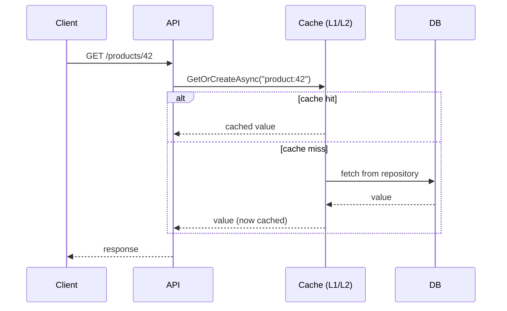

---

## Part XIV — Resilience, Auth & Security

### Resilience & Rate Limiting

System-design-style questions ("design a rate limiter," "design a resilient call to a flaky payment API") are now common at senior level — testing reasoning about scale and failure, not just syntax.

**Built-in rate limiting middleware (.NET 7+):**
```csharp
builder.Services.AddRateLimiter(options =>
    options.AddFixedWindowLimiter("fixed", opt => { opt.Window = TimeSpan.FromSeconds(10); opt.PermitLimit = 5; opt.QueueLimit = 2; }));
app.UseRateLimiter();
app.MapGet("/products", GetProducts).RequireRateLimiting("fixed");
```

| Algorithm | Behavior | Good for |
|---|---|---|
| Fixed Window | N requests per fixed time window | Simple quota enforcement |
| Sliding Window | Smooths bursts at window boundaries | Fairer than fixed window |
| Token Bucket | Tokens refill over time; burst up to bucket size | Allowing short bursts while capping sustained rate |
| Concurrency Limiter | Caps simultaneous in-flight requests | Protecting limited downstream resources |

**Polly** (retry/circuit breaker/timeout), now wired directly into `HttpClientFactory` via `Microsoft.Extensions.Http.Resilience`:
```csharp
builder.Services.AddHttpClient<PaymentClient>()
    .AddResilienceHandler("payment-pipeline", b =>
    {
        b.AddRetry(new RetryStrategyOptions { MaxRetryAttempts = 3, BackoffType = DelayBackoffType.Exponential });
        b.AddCircuitBreaker(new CircuitBreakerStrategyOptions { FailureRatio = 0.5, MinimumThroughput = 10 });
        b.AddTimeout(TimeSpan.FromSeconds(5));
    });
```
- **Retry** — re-attempts a failed call, ideally with exponential backoff + jitter to avoid a thundering herd against an already-struggling service.
- **Circuit Breaker** — after a failure threshold, stops calling the downstream service for a cooldown period, failing fast instead of piling up timeouts.
- **Timeout** — bounds how long a call can hang, freeing threads/connections.
- **Bulkhead** — isolates resource pools so one failing dependency can't exhaust resources needed by unrelated calls.

> *"Why not just retry forever?"* — because retrying against a genuinely down/overloaded service makes the outage worse; combine retry with a circuit breaker so the system fails fast and recovers on its own schedule.

**Idempotency for safe retries** — retrying `POST /orders` safely requires the endpoint to be idempotent: client sends an `Idempotency-Key` header; the server persists a mapping of key → result and short-circuits duplicate requests within a time window.

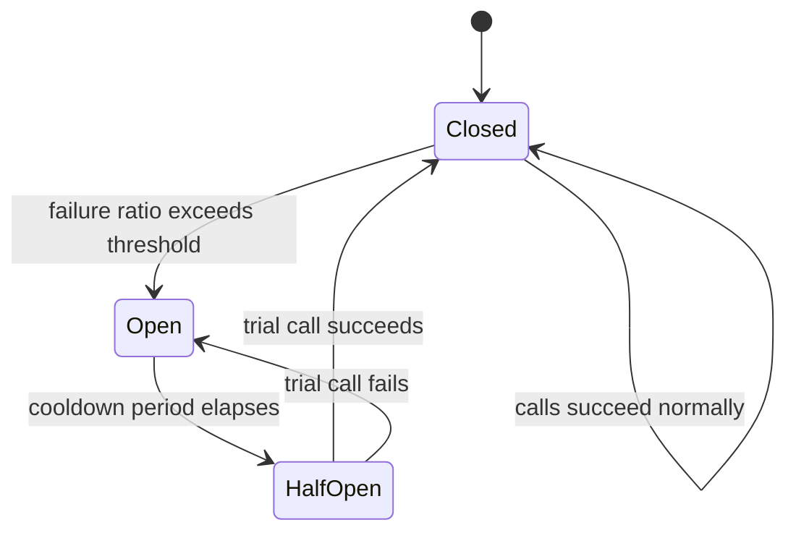

### Authentication & Authorization

**JWT Bearer authentication** — stateless, scales horizontally (no server-side session store), travels naturally to SPA/mobile clients via an `Authorization: Bearer` header:
```csharp
builder.Services.AddAuthentication(JwtBearerDefaults.AuthenticationScheme)
    .AddJwtBearer(options => options.TokenValidationParameters = new TokenValidationParameters
    {
        ValidateIssuer = true, ValidateAudience = true, ValidateLifetime = true, ValidateIssuerSigningKey = true,
        ValidIssuer = config["Jwt:Issuer"], ValidAudience = config["Jwt:Audience"],
        IssuerSigningKey = new SymmetricSecurityKey(Encoding.UTF8.GetBytes(config["Jwt:Key"]))
    });
builder.Services.AddAuthorization();
app.UseAuthentication();
app.UseAuthorization();
```

**OAuth2 vs OpenID Connect:** OAuth2 is an *authorization* framework (who can access what); OIDC is an *identity* layer on top (who the user is). Most full-stack .NET apps delegate to an external identity provider (Entra ID, Auth0, Keycloak, Duende IdentityServer) rather than rolling their own login.

| Grant/Flow | Typical use |
|---|---|
| Authorization Code + PKCE | SPA and mobile apps (modern default — avoid the deprecated Implicit flow) |
| Client Credentials | Service-to-service (machine-to-machine), no user involved |
| Refresh Token | Silently renewing an access token without re-prompting login |

**Claims/policy-based authorization** (preferred over hardcoded role checks):
```csharp
builder.Services.AddAuthorization(options =>
    options.AddPolicy("CanEditProducts", policy => policy.RequireClaim("permission", "products.edit")));

[Authorize(Policy = "CanEditProducts")]
[HttpPut("{id}")]
public IActionResult Update(int id, ProductDto dto) { /* ... */ }
```
This decouples "what a user can do" from "what role they happen to have," which scales far better as permission models grow beyond a handful of roles.

**Other security topics:** CORS must be explicitly configured (`AddCors`/`UseCors`) for any SPA on a different origin; CSRF mainly matters for cookie-based auth (token-based JWT in an `Authorization` header is inherently less exposed, but cookie-authenticated form posts still need antiforgery tokens); the **Data Protection API** is ASP.NET Core's built-in key-management system for encrypting cookies/tokens at rest; **never** store secrets in `appsettings.json` in source control — use User Secrets locally and Key Vault/Secrets Manager/environment variables in production.

---

## Part XV — Performance & Low-Allocation Programming

At senior level, interviewers assess whether you can reduce allocations in hot paths — commonly framed as "how would you optimize this hot loop/high-throughput endpoint?"

**`Span<T>` and `Memory<T>`** — `Span<T>` is a stack-only, allocation-free view over contiguous memory (array, string, or stack-allocated memory), enabling slicing without copying:
```csharp
ReadOnlySpan<char> text = "Hello, World!";
ReadOnlySpan<char> hello = text.Slice(0, 5);      // no allocation — a view, not a copy

Span<int> numbers = stackalloc int[5];             // stack-allocated, zero heap allocation
for (int i = 0; i < numbers.Length; i++) numbers[i] = i * i;
```
`Memory<T>` is the heap-friendly counterpart, usable across `async` boundaries — `Span<T>` is a `ref struct` and therefore **cannot** be used inside `async` methods or stored as a field.

**`ArrayPool<T>`** rents/returns arrays from a shared pool instead of allocating/discarding on every call — common in high-throughput networking/serialization (Kestrel itself uses this internally):
```csharp
byte[] buffer = ArrayPool<byte>.Shared.Rent(1024);
try { /* use buffer */ } finally { ArrayPool<byte>.Shared.Return(buffer); }
```

**`string.Create()`** writes directly into a destination buffer, avoiding intermediate allocations for programmatic string construction.

**`record struct`/plain `struct`** for small, frequently-created, short-lived value objects (`Money`, `Point`, RGB color) keeps them off the heap entirely, avoiding GC pressure in hot loops.

**BenchmarkDotNet** is the de-facto standard micro-benchmarking library — a strong senior answer to "how would you make this faster" mentions *measuring* before/after, not just intuition:
```csharp
[MemoryDiagnoser]
public class StringBenchmarks
{
    [Benchmark(Baseline = true)]
    public string Concat() => "a" + "b" + "c";

    [Benchmark]
    public string StringBuilderVersion() => new StringBuilder().Append("a").Append("b").Append("c").ToString();
}
```

**Native AOT** compiles straight to native machine code ahead of time — no JIT warm-up, smaller memory footprint, startup times under 50ms in many cases. Trade-offs: no runtime reflection-based dynamic code generation (so reflection-heavy libraries need source-generator alternatives — see Part IV); some older libraries aren't fully AOT-compatible yet. Prime use cases: containers, serverless functions, CLI tools where cold-start latency matters.

| Technique | Problem it solves |
|---|---|
| `Span<T>`/`Memory<T>` | Avoids copying when slicing/processing buffers |
| `ArrayPool<T>` | Avoids repeated array allocation/GC churn |
| `ValueTask<T>` | Avoids `Task` allocation on frequently-synchronous hot paths |
| `record struct` | Keeps small value objects off the heap |
| Native AOT | Eliminates JIT warm-up, shrinks memory/startup footprint |
| Source generators | Eliminates reflection at runtime |

---

## Part XVI — Advanced Concurrency Primitives

*Gap note: basic notes covered `lock`, `Thread`, `Task`, and the ThreadPool, but not the finer-grained synchronization primitives senior interviewers ask about once a simple `lock` isn't the right tool.*

### Low-Level Concurrency Primitives: Monitor, SpinLock, False Sharing, Thread-Pool Starvation [gaps]

**What `lock` actually compiles down to.** The `lock (obj) { ... }` keyword is syntactic sugar over `System.Threading.Monitor`:

```csharp
lock (_lockObj)
{
    // critical section
}

// is (approximately) equivalent to:
bool lockTaken = false;
try
{
    Monitor.Enter(_lockObj, ref lockTaken);
    // critical section
}
finally
{
    if (lockTaken) Monitor.Exit(_lockObj);
}
```

`Monitor.Enter`/`Monitor.Exit` acquire/release an exclusive lock associated with an object's **sync block** (part of the object header) — this is why the lock object must be a reference type, and why locking on a boxed value type, a string literal (which may be interned and shared unexpectedly across unrelated code), or `this` in a public class (any external code with a reference to your object could lock on it too) are all classic mistakes. `Monitor` also exposes `Monitor.Wait`/`Monitor.Pulse`/`Monitor.PulseAll` — lower-level signaling primitives for building custom condition-variable-style coordination (a thread calls `Wait()` to release the lock and block until signaled; another thread holding the lock calls `Pulse()`/`PulseAll()` to wake one/all waiters). This is the mechanism underneath some producer-consumer patterns that predate `BlockingCollection`/`Channels` — modern code should prefer those higher-level types, but understanding `Wait`/`Pulse` is what "I understand what `lock` actually does" means at a senior level.

**`SpinLock` and `SpinWait`.** A `lock`/`Monitor` puts a blocked thread to sleep (a full context switch, relatively expensive — on the order of microseconds). For a **very short** critical section where the wait is expected to be brief, that context-switch overhead can exceed the cost of just spinning (busy-waiting, repeatedly checking a flag) until the lock frees up:

```csharp
private SpinLock _spinLock = new SpinLock();

bool lockTaken = false;
try
{
    _spinLock.Enter(ref lockTaken);
    // extremely short critical section — a few instructions, not a DB call
}
finally
{
    if (lockTaken) _spinLock.Exit();
}
```

`SpinWait` is the lower-level building block `SpinLock` (and parts of the ThreadPool/Task infrastructure) use internally — it spins briefly, then falls back to yielding the thread/sleeping if the wait goes on too long, avoiding pegging a core at 100% indefinitely for a lock that turned out to be held longer than expected. **Rule of thumb: `SpinLock`/`SpinWait` are for very specific, measured, ultra-short-duration contention scenarios (some low-level runtime/library code) — reaching for them in typical application code is almost always a premature optimization; `lock`/`Monitor` is correct by default**, and this is exactly the kind of "know when NOT to use the fancy tool" answer that signals seniority.

**False sharing / cache-line contention.** CPUs cache memory in fixed-size lines (commonly 64 bytes). If two *unrelated* fields used by different threads happen to land on the **same cache line**, writes to one field force the CPU cache to invalidate and resync the entire line on every core touching it — even though the threads aren't logically sharing data, they're contending on the cache line itself, causing a real (and confusing) performance cliff:

```csharp
// Naive: Counter1 and Counter2 likely share a cache line — a thread hammering
// Counter1 forces cache invalidation that also stalls a thread hammering Counter2.
public class Counters
{
    public long Counter1;
    public long Counter2;
}

// Fixed: pad so each counter gets its own cache line (64 bytes is the common line size).
[StructLayout(LayoutKind.Explicit, Size = 128)]
public struct PaddedCounters
{
    [FieldOffset(0)]  public long Counter1;
    [FieldOffset(64)] public long Counter2;
}
```
.NET also ships `System.Runtime.CompilerServices.PaddingHelpers`-style tricks and, more practically, **`[StructLayout]` padding or splitting hot counters into separate heap-allocated objects** are the usual fixes; this is niche but a real senior differentiator — "why does this lock-free counter under heavy multi-core contention still perform worse than expected" is exactly the kind of question false sharing answers.

**ThreadPool starvation — symptoms and diagnosis.** The ThreadPool grows its worker-thread count slowly (roughly one new thread per ~500ms-ish under sustained demand, by design, to avoid over-provisioning threads for a transient burst) — this "slow ramp-up" is by far the most common real-world cause of mysterious latency spikes under load:

- **Symptoms:** requests/tasks queue up and their latency climbs even though CPU usage looks *low* (the bottleneck is thread availability, not compute) — `dotnet-counters`' `ThreadPool Queue Length` and `ThreadPool Thread Count` counters are the direct diagnostic signal (see the GC diagnostics section in Part VII for the broader tooling workflow). Root causes are almost always **blocking calls on pool threads** — synchronous I/O (`.Result`/`.Wait()` on an async call), `Task.Run()` wrapping something that itself blocks, or a `LongRunning`-style workload mistakenly run as a plain pooled task.
- **`ThreadPool.SetMinThreads(workerThreads, completionPortThreads)`** raises the *minimum* thread count so the pool starts closer to the actual demand instead of ramping up gradually from a small baseline — a common mitigation (sometimes seen as a startup-time tuning knob in high-throughput services) but it's a **band-aid**, not a fix: it papers over the symptom while the real fix is removing the blocking calls that are starving the pool in the first place.
  ```csharp
  ThreadPool.SetMinThreads(workerThreads: 200, completionPortThreads: 200);
  ```
- **Strong senior framing:** "If I see latency spikes correlating with low CPU and a growing ThreadPool queue length, I look for blocking calls on pool threads first — `SetMinThreads` can mask the symptom short-term, but the actual fix is almost always making the blocking call path properly async."

**`SemaphoreSlim`** — throttles concurrent access; unlike `lock`, it supports async/await (`WaitAsync`) and allows more than one caller through at once:
```csharp
private static readonly SemaphoreSlim _semaphore = new(maxCount: 3);
async Task CallDownstreamAsync()
{
    await _semaphore.WaitAsync();
    try { await CallApiAsync(); } finally { _semaphore.Release(); }
}
```

**`ReaderWriterLockSlim`** — allows many concurrent readers **or** one exclusive writer; better than a plain `lock` for read-heavy shared state (e.g., an in-memory cache with occasional writes).

**`Interlocked` & `volatile`:**
```csharp
private static int _counter;
Interlocked.Increment(ref _counter);   // atomic increment, no lock needed

private volatile bool _isRunning;      // prevents per-core caching from hiding updates from other threads
```
`Interlocked` provides lock-free atomic operations (`Increment`, `Decrement`, `CompareExchange`) — much cheaper than a full `lock` for simple counters/flags. `volatile` is rarely needed directly in modern C# (most synchronization goes through higher-level primitives), but is still asked about conceptually.

**Concurrent collections:**

| Type | Use case |
|---|---|
| `ConcurrentDictionary<TKey,TValue>` | Thread-safe key/value cache without manual locking |
| `ConcurrentQueue<T>` / `ConcurrentStack<T>` | Thread-safe FIFO/LIFO producer-consumer buffers |
| `BlockingCollection<T>` | Bounded producer-consumer with blocking `Add`/`Take` |

**`System.Threading.Channels`** — a modern, high-performance async producer-consumer pipeline, replacing older `BlockingCollection`-based patterns in many new designs:
```csharp
var channel = Channel.CreateUnbounded<int>();
await channel.Writer.WriteAsync(42);         // producer
channel.Writer.Complete();
await foreach (var item in channel.Reader.ReadAllAsync()) Console.WriteLine(item); // consumer
```
Common use case: a `BackgroundService` reading work items off a channel populated by an API endpoint, decoupling request handling from slower processing.

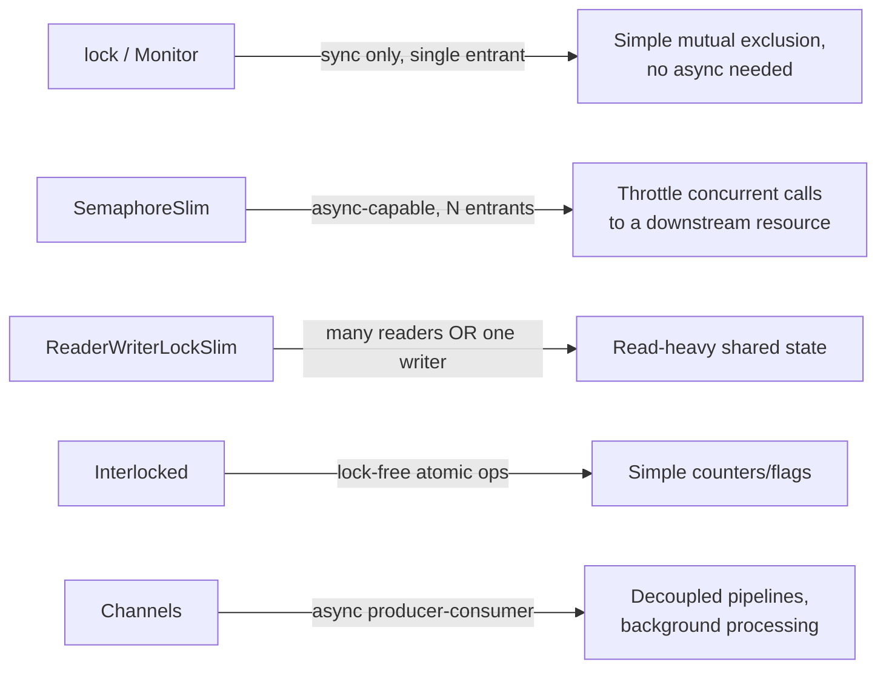

---

## Part XVII — Microservices, Messaging & CQRS

**REST vs gRPC:**

| | REST/OpenAPI | gRPC |
|---|---|---|
| Transport | HTTP/1.1 (typically), JSON | HTTP/2, binary Protobuf |
| Performance | Good | Faster — smaller payloads, multiplexed streams |
| Contract | OpenAPI (optional/loose) | `.proto` file (strict, code-generated) |
| Streaming | Limited (SSE, polling) | First-class bidirectional streaming |
| Browser support | Native | Needs grpc-web / a proxy |
| Best for | Public APIs, browser clients | Internal service-to-service calls, low-latency needs |

**Message brokers:**

| Broker | Model | Typical use |
|---|---|---|
| RabbitMQ | Traditional message queue (AMQP) | Task queues, work distribution, routing by topic/exchange |
| Kafka | Distributed log / event streaming | High-throughput event streams, event sourcing, replayable history |
| Azure Service Bus | Managed queue/topic service | Enterprise .NET-native messaging, dead-lettering, sessions |

Know the difference between a **queue** (message consumed once, then removed) and a **topic/pub-sub** (message delivered to every subscriber) — and be ready to describe a design (e.g., `OrderPlaced` → Inventory + Shipping services both react independently) using pub-sub for decoupling.

**CQRS with MediatR:**
```csharp
public record CreateOrderCommand(int ProductId, int Quantity) : IRequest<int>;

public class CreateOrderHandler : IRequestHandler<CreateOrderCommand, int>
{
    public async Task<int> Handle(CreateOrderCommand request, CancellationToken ct)
    {
        // validate, persist, publish domain event...
        return newOrderId;
    }
}
// var orderId = await mediator.Send(new CreateOrderCommand(productId, quantity));
```
Benefits: thin controllers/endpoints, each use case isolated in its own testable handler, `IPipelineBehavior<>` gives a clean place for cross-cutting concerns (validation, logging, transactions).

**Saga pattern** — since microservices can't share one ACID transaction, a Saga coordinates a sequence of local transactions with compensating actions if a later step fails (reserve inventory → charge payment → confirm order; if payment fails, release the inventory reservation).

| Style | Description |
|---|---|
| Orchestration | A central coordinator explicitly calls each service and triggers compensations |
| Choreography | Each service reacts to events from others; no central coordinator, but harder to trace end-to-end |

**Domain-Driven Design vocabulary** worth having ready: **Entity** (has identity persisting across state changes), **Value Object** (defined entirely by its values, no identity — a natural fit for `record`/`record struct`), **Aggregate** (a cluster of entities/value objects treated as one consistency boundary with a single Aggregate Root), **Bounded Context** (the boundary within which a specific model/vocabulary is valid — often maps 1:1 to a microservice), **Domain Event** (something that happened that other parts of the system may care about, e.g. `OrderPlaced`).

---

## Part XVIII — Observability, Testing & Full-Stack Integration

### Observability & Health Checks

In distributed systems, a single request spans many services — per-service logs alone make it hard to reconstruct the full picture. Modern observability adds **distributed tracing** and **metrics** alongside logs (the "three pillars").

**OpenTelemetry** is the current vendor-neutral standard for collecting traces/metrics/logs and exporting to a backend (Azure Monitor, Jaeger, Prometheus/Grafana, Datadog):
```csharp
builder.Services.AddOpenTelemetry()
    .WithTracing(t => t.AddAspNetCoreInstrumentation().AddHttpClientInstrumentation().AddSource("MyApp").AddOtlpExporter())
    .WithMetrics(m => m.AddAspNetCoreInstrumentation().AddRuntimeInstrumentation());
```
Distributed tracing propagates a trace/correlation ID across service boundaries so a single request can be followed end-to-end — essential for debugging latency and failures in production.

**Health checks:**
```csharp
builder.Services.AddHealthChecks().AddSqlServer(connectionString).AddCheck<RedisHealthCheck>("redis");
app.MapHealthChecks("/health");
```
Kubernetes/load balancers poll a health endpoint to decide readiness (should this instance receive traffic?) and liveness (should this instance be restarted?).

### Testing Strategy

| Layer | Tooling | Covers |
|---|---|---|
| Unit tests | xUnit/NUnit + Moq or NSubstitute | Business logic in isolation, mocked dependencies |
| Integration tests | `WebApplicationFactory<T>`, Testcontainers | API + real (or containerized) DB/cache working together |
| E2E/UI tests | Playwright, Selenium | Full user flows through the actual frontend |

```csharp
public class OrderServiceTests
{
    [Fact]
    public async Task CreateOrder_Should_Throw_When_Stock_Is_Insufficient()
    {
        var repoMock = new Mock<IProductRepository>();
        repoMock.Setup(r => r.GetAsync(1)).ReturnsAsync(new Product { Id = 1, Stock = 0 });
        var service = new OrderService(repoMock.Object);

        await Assert.ThrowsAsync<InsufficientStockException>(
            () => service.CreateOrderAsync(productId: 1, quantity: 1));
    }
}

public class ProductsApiTests : IClassFixture<WebApplicationFactory<Program>>
{
    private readonly HttpClient _client;
    public ProductsApiTests(WebApplicationFactory<Program> factory) => _client = factory.CreateClient();

    [Fact]
    public async Task Get_Products_Returns_Ok()
    {
        var response = await _client.GetAsync("/products");
        response.EnsureSuccessStatusCode();
    }
}
```
**Testcontainers** spins up a real, disposable DB/Redis instance in Docker for a test run — giving integration tests real fidelity without a shared, stateful test environment.

**Testing philosophy talking points:** mock at architectural boundaries (repositories, external HTTP clients), not internal implementation details, or tests become brittle to refactors; prefer testing behavior/outcomes over verifying exact internal calls; AAA structure (Arrange, Act, Assert); **`async void` is dangerous in test methods too** — always use `async Task` so the test runner can observe exceptions thrown inside (see Part VIII).

### Full-Stack Integration

**SignalR** abstracts WebSockets (with SSE/long-polling fallbacks) for real-time, bidirectional communication:
```csharp
public class NotificationHub : Hub
{
    public async Task SendMessage(string user, string message) =>
        await Clients.All.SendAsync("ReceiveMessage", user, message);
}
// app.MapHub<NotificationHub>("/hubs/notifications");
```

**Blazor hosting models:**

| Model | Where code runs | Notes |
|---|---|---|
| Blazor Server | On the server; UI pushed over SignalR | Small download, needs a persistent connection |
| Blazor WebAssembly (WASM) | In the browser via WASM | True client-side C#, works offline, larger initial download |
| Blazor Hybrid/MAUI | Native app shell hosting a Blazor UI | Shared UI code across web and native mobile/desktop |

**Backend-for-Frontend (BFF)** — a dedicated backend layer (often ASP.NET Core) tailored to a specific frontend's needs: aggregates calls to multiple downstream microservices, handles auth token exchange, shapes responses exactly as the SPA needs — the browser never talks directly to internal services.

**CORS in practice** — a near-guaranteed practical question: *"Your React app on `localhost:3000` can't call the API on `localhost:5001` — why, and how do you fix it?"* Answer: same-origin policy blocks cross-origin requests by default; the API must explicitly opt in specific origins via CORS middleware:
```csharp
builder.Services.AddCors(options => options.AddPolicy("SpaPolicy",
    p => p.WithOrigins("https://myapp.com").AllowAnyHeader().AllowAnyMethod().AllowCredentials()));
app.UseCors("SpaPolicy");
```

### What's Different About Senior-Level Interviews

- Less "define X" trivia, more scenario-based reasoning: "Design a rate limiter," "Design a notification service," "Walk me through debugging a production memory leak" (see **GC Diagnostics Tooling for Production** in Part VII for a concrete `dotnet-counters` → `dotnet-gcdump` → `dotnet-trace` walkthrough — naming actual tools here is what separates a senior answer from a conceptual one).
- Interviewers weight production experience and architectural judgment heavily, not just correct syntax.
- A common signal of weakness: answering "it depends" without a follow-up. A strong answer says "it depends" and then gives a **decision framework plus a default recommendation** (e.g., the EF Core vs Dapper framing in Part IX).
- Expect "why not X instead?" probing on almost every answer — this tests whether you understand trade-offs, not just the happy path.

Sample system-design-style prompts worth rehearsing: design a URL shortener/rate limiter/notification service (practice sketching API, cache, DB, queue and talking through scaling/failure modes out loud); "how would you reduce P99 latency of an endpoint calling three downstream services sequentially?" (parallelize independent calls with `Task.WhenAll`, add caching, consider a circuit breaker for the slowest dependency); "how would you migrate a monolith's Products module to a microservice without downtime?" (strangler-fig pattern, dual-write or CDC-based data sync, feature-flag cutover).

---

## Part XIX — Swagger / OpenAPI & API Documentation

> **Framing note:** this topic is fundamentally an **ASP.NET Core / Web API tooling** subject, not a C# language feature — it's included here because the source material (`C# Swagger.docx`) lived in the C# notes folder. The genuinely C#-language-relevant slice is XML doc-comment syntax (`///`, `<summary>`, `<param>`) and attribute usage in general; everything else below is Web API tooling/configuration knowledge that a full-stack interview will still expect you to know.

**OpenAPI vs Swagger:** OpenAPI Specification (OAS) is the standard for describing REST APIs in machine-readable JSON/YAML — the API contract. Swagger is the tooling ecosystem built around it (Swagger UI, Swagger Editor, Swagger Codegen). Swagger *implements* OpenAPI.

**Swagger in .NET (Swashbuckle):**
```csharp
// dotnet add package Swashbuckle.AspNetCore
builder.Services.AddEndpointsApiExplorer();
builder.Services.AddSwaggerGen();
app.UseSwagger();
app.UseSwaggerUI();     // https://localhost:5001/swagger
```

**JWT auth in Swagger UI:**
```csharp
builder.Services.AddSwaggerGen(options =>
{
    options.AddSecurityDefinition("Bearer", new OpenApiSecurityScheme
    {
        Name = "Authorization", Type = SecuritySchemeType.Http, Scheme = "bearer", BearerFormat = "JWT",
        In = ParameterLocation.Header, Description = "Enter your JWT token (without the 'Bearer' prefix)."
    });
    options.AddSecurityRequirement(new OpenApiSecurityRequirement
    {
        { new OpenApiSecurityScheme { Reference = new OpenApiReference { Type = ReferenceType.SecurityScheme, Id = "Bearer" } },
          Array.Empty<string>() }
    });
});
```
Two parts to remember: the **security definition** declares the scheme exists (the Authorize button); the **security requirement** declares which operations require it (the padlocks). A very common pitfall: wiring JWT into the auth middleware but forgetting the OpenAPI security scheme, so the Authorize button never appears.

**Swashbuckle removed as default in .NET 9+ (current hot topic — a great "do you keep up with the platform" signal):**

| Version | OpenAPI behavior |
|---|---|
| .NET 8 and earlier | Swashbuckle included by default; generates OpenAPI 3.0 |
| .NET 9 | Built-in `Microsoft.AspNetCore.OpenApi`; OpenAPI 3.0; no UI, no XML comment support at launch |
| .NET 10 | Built-in generator emits OpenAPI 3.1 by default; Native AOT friendly |

*(Verify exact per-version behavior against current Microsoft docs at interview time — tooling details like this shift between preview and RTM.)* Reasons for the change: Swashbuckle's maintenance gaps and the need for Native AOT compatibility, which reflection-heavy Swashbuckle struggled with. Swashbuckle isn't dead — it remains an actively maintained community package you can add manually.

```csharp
builder.Services.AddOpenApi();     // register generation only — no UI shipped
var app = builder.Build();
app.MapOpenApi();                  // serves /openapi/v1.json
```

| UI tool | Role |
|---|---|
| Swagger UI (`Swashbuckle.AspNetCore.SwaggerUI`) | Classic interactive UI, point at `/openapi/v1.json` |
| Scalar (`Scalar.AspNetCore`) | Modern UI — dark mode, multi-language snippets, `MapScalarApiReference()` |
| NSwag | Client SDK generation (TypeScript, C#) |
| ReDoc | Clean, read-only reference documentation |

**OpenAPI document structure:** `openapi` (spec version), `info`, `servers`, `paths`, `components` (reusable schemas/responses/parameters/securitySchemes, referenced via `$ref`), `security` (global requirements), `tags` (UI grouping). OpenAPI 3.1 aligns with JSON Schema draft 2020-12, adds webhooks as a top-level element, and describes nullability via `type: [string, null]` instead of 3.0's `nullable: true`.

**API versioning:** URL path (`/api/v1/products`), query string (`?api-version=1.0`), header (`api-version: 1.0`), or media type (`Accept: application/json;v=1.0`) — `Asp.Versioning.Mvc` plus the API explorer exposes a Swagger document per version. Never make breaking changes to an existing version's contract; ship a new version instead.

**Documenting responses/errors:**
```csharp
[ProducesResponseType(typeof(Product), StatusCodes.Status200OK)]
[ProducesResponseType(typeof(ProblemDetails), StatusCodes.Status404NotFound)]
public async Task<IActionResult> Get(int id) { /* ... */ }
```
Prefer `ProblemDetails` (RFC 7807) for all error responses instead of anonymous/dynamic objects, which produce no usable schema. Enable `<GenerateDocumentationFile>true</GenerateDocumentationFile>` and feed the generated XML into the generator so `<summary>`/`<param>` text appears in the UI.

**Quick-fire comparisons:** Swagger UI (always reflects live code) vs Postman (standalone collections that can drift); code-first (fast, doc can lag intent) vs contract-first (better for parallel teams/public APIs, contract is the source of truth); REST/OpenAPI (fixed endpoints, mature tooling/caching) vs GraphQL (client-specified fields, reduces over/under-fetching).

**Securing Swagger in production** — go beyond "just disable it": serve the spec/UI only in Development (or behind a toggle); if the UI must be exposed, put it behind auth (e.g., an admin policy); restrict by network (IP allow-lists, VPN, internal-only ingress); for internal APIs, consider serving only the raw JSON with no UI at all, since a public UI is free reconnaissance for attackers; never leak secrets/sample tokens in examples.

**[new content] The remaining thin/unelaborated "advanced topics" from the raw notes, answered:**
- **API linting** — validating an OpenAPI document against style/consistency rules (naming conventions, required fields, forbidden patterns) using tools like Spectral, catching contract problems in CI before they reach consumers.
- **Mock server generation** — tools like Prism or WireMock can spin up a working mock HTTP server directly from an OpenAPI document, letting frontend teams build against a contract before the real backend exists.
- **OpenAPI validation pipelines** — CI steps that lint the spec, diff it against the previous version to catch breaking changes, and optionally run contract tests against the running service to ensure the implementation matches the documented contract.
- **AsyncAPI** — a sibling specification to OpenAPI, purpose-built for describing **event-driven/asynchronous APIs** (message queues, WebSockets, Kafka topics) where OpenAPI's request/response model doesn't fit; worth naming if a microservices-messaging question comes up alongside OpenAPI.
- **Schema evolution strategies** — favor additive-only changes (new optional fields) over removing/renaming fields; use `deprecated: true` before removal; never change a field's type or make an optional field required without a new API version; consider consumer-driven contract testing (e.g., Pact) so breaking changes are caught by tests before shipping, not by downstream consumers in production.

---

## Part XX — Terminology Reference

| Term | What It Is | Runs on Its Own? | Example |
|---|---|---|---|
| Library | Reusable code | No | `System.Collections` |
| DLL | Compiled binary of a library | No | `Newtonsoft.Json.dll` |
| EXE | Executable application | Yes | `MyApp.exe` |
| Framework/SDK | Libraries + runtime (SDK adds tooling: compilers, templates, CLI) | No (needs an app) | .NET 8, .NET 10 |
| Package | NuGet distribution format (`.nupkg`) | No | `Newtonsoft.Json` (NuGet) |

**Managed vs unmanaged code:** managed code is written in a .NET language, compiled to MSIL, and runs under CLR supervision (memory management, type safety, security). Unmanaged resources are outside the CLR (file handles, DB connections, sockets, OS handles, native memory) and must be released explicitly via `Dispose()`.

---

## Best Practices Checklist

- Favor composition over inheritance; keep inheritance hierarchies shallow.
- Start with an interface; reach for an abstract class only when shared state/behavior is genuinely needed.
- Keep constructors lightweight — no I/O/DB calls; validate arguments early; prefer immutability.
- Override `Equals()` and `GetHashCode()` together, never one without the other.
- Prefer `AsNoTracking()` for read-only EF Core queries; eager-load with `Include()` to avoid N+1.
- Prefer `Task` by default; reach for `ValueTask` only with profiling evidence of benefit.
- Always `async Task`, never `async void`, except for framework-mandated event handlers.
- Use `ConfigureAwait(false)` in shared library code; it's largely optional in ASP.NET Core application code.
- Use a global exception-handling middleware / `IExceptionHandler`, not scattered `try/catch`.
- Expose **events**, not raw delegates, from reusable APIs.
- Use structured logging (`{PlaceholderName}`) over string concatenation.
- Prefer `ProblemDetails` (RFC 7807) for API error responses.
- Never store secrets in source control; use User Secrets locally, Key Vault/Secrets Manager in production.
- Combine retry with a circuit breaker for downstream calls — never retry indefinitely.
- Benchmark before/after any performance change (BenchmarkDotNet) rather than trusting intuition.
- Keep EF Core migrations small, reversible, and reviewed before running against production.

## Common Pitfalls Checklist

- Blocking on async code with `.Result`/`.Wait()` from a context that captures a `SynchronizationContext` → deadlock.
- `async void` swallowing exceptions silently (including in test methods).
- Disposing/recreating `HttpClient` per request instead of using `IHttpClientFactory`.
- Singleton services capturing Scoped/Transient dependencies (captive dependency).
- Multiple enumeration of the same `IQueryable`/lazily-evaluated `IEnumerable`.
- Materializing (`.ToList()`) an `IQueryable` before applying further filters, forcing client-side evaluation.
- String-concatenated SQL (`AddWithValue` overuse, or worse, raw concatenation) — injection risk and plan-cache bloat.
- Un-unsubscribed event handlers leaking memory.
- Overusing `dynamic`/reflection where a source generator or static typing would do.
- Exposing Swagger/OpenAPI UI in production without restricting access.
- Treating `GC.Collect()` as a routine performance tool.

---

## Sample Interview Q&A (Rapid Fire)

**Q: What's the difference between a record and a class?**
A: Records give value-based equality and `ToString()` for free, and support non-destructive mutation via `with` expressions; classes have reference equality and are mutable by default. Use records for DTOs/domain value objects; use `record struct` for small, allocation-sensitive value types.

**Q: Why does `.Result` sometimes deadlock and sometimes not?**
A: It deadlocks when the calling thread blocks on `.Result` while the awaited method's continuation needs to resume on a `SynchronizationContext` captured by that same thread (classic in WPF/WinForms/old ASP.NET). ASP.NET Core has no `SynchronizationContext`, so this specific deadlock doesn't occur there — though blocking on `.Result` under load can still starve the ThreadPool.

**Q: When would you use ValueTask instead of Task?**
A: Only on a proven hot path where results are frequently already available synchronously (e.g., a cache-hit path) — and only after profiling shows the `Task` allocation actually matters. Default to `Task` otherwise; `ValueTask`'s single-await restriction makes it easy to misuse.

**Q: Why override GetHashCode() whenever you override Equals()?**
A: `Dictionary`/`HashSet` bucket objects by hash code first, then use `Equals()` to disambiguate within a bucket. If two objects are `Equals`-equal but have different hash codes, lookups silently fail to find them.

**Q: What's the N+1 query problem and how do you fix it?**
A: Fetching a parent collection, then lazily triggering one additional query per row to fetch related data. Fix with eager loading (`Include()`), projection (`Select()` to pull only needed fields), or `AsSplitQuery()` for multiple `Include`s.

**Q: Why is AutoMapper controversial at senior level?**
A: It trades compile-time safety and debuggability for convenience — mapping bugs surface at runtime, not compile time, and complex configurations become their own hard-to-maintain DSL. Many senior teams prefer explicit manual mapping or a source-generated mapper for anything business-critical.

**Q: What's a captive dependency in DI?**
A: A longer-lived service (typically Singleton) that captures a shorter-lived dependency (Scoped/Transient) in its constructor, holding it far beyond its intended lifetime — commonly causing thread-safety bugs with `DbContext`. Fixed via `IServiceScopeFactory` to create a fresh scope when the dependency is actually needed.

**Q: How do you secure a Swagger/OpenAPI endpoint in production?**
A: Restrict to Development environment or gate behind auth/network controls (IP allow-list, VPN); for internal APIs, consider serving only the raw JSON document with no UI, since a public UI is free reconnaissance; never leak real tokens/hostnames in examples.

**Q: Async vs multithreading — what's the actual difference?**
A: Async/await is about not blocking a thread while waiting on I/O — it doesn't inherently create parallelism and is ideal for I/O-bound work. Multithreading explicitly runs code on multiple threads concurrently for true parallelism — ideal for CPU-bound work, at the cost of needing synchronization.

**Q: Walk me through debugging a production memory leak. [gaps]**
A: Start cheap and non-invasive: `dotnet-counters monitor` against the live PID to see whether Gen 2 heap size trends upward across GC cycles (the actual leak signature, vs. just high allocation churn). If it's climbing, take two `dotnet-gcdump` snapshots minutes apart and diff them to see which object types grew disproportionately and what's rooting them — usually an un-unsubscribed event handler, an unbounded static cache, a captive `DbContext`, or a closure captured into a long-lived delegate. Only reach for a full `dotnet-trace` capture if you still need allocation call stacks to pinpoint the exact line of code. Full details in Part VII.

**Q: What changed with Swagger in .NET 9?**
A: Swashbuckle was dropped as the default Web API template dependency, replaced by the built-in `Microsoft.AspNetCore.OpenApi` package (document generation only, no UI shipped) — driven by Swashbuckle's maintenance gaps and Native AOT incompatibility. You now separately choose a UI (Swagger UI, Scalar, ReDoc, NSwag).

---

## Summary of Additions

All headings below were added during consolidation because the topic was missing or too thin across the six source files, based on what senior .NET interviews commonly probe in 2026 (C# 12–14 / .NET 9–10 era):

| [new content] Heading | Why it matters |
|---|---|
| Records & record struct | Now the default choice for DTOs/value objects; a near-guaranteed "what's new in C#" question. |
| Pattern Matching & Switch Expressions | Idiomatic replacement for `if/else`/type-check chains; signals current coding style. |
| init, required, and Primary Constructors (C# 11/12) | Extremely common in modern minimal-API/DI code; original notes stopped around C# 8–10. |
| Static Abstract/Virtual Interface Members & Generic Math (C# 11) | Powers `INumber<T>`-style generics; a genuinely new capability with no prior C# equivalent. |
| Source Generators | The modern, AOT-friendly alternative to reflection; a strong current-knowledge signal. |
| LINQ Gotchas Every Senior Dev Should Know | Multiple-enumeration, closure-capture, and First/Single semantics were entirely absent but are classic senior traps. |
| IAsyncDisposable | `await using`/async cleanup wasn't covered at all despite being standard in modern `DbContext`/`Stream` usage. |
| ConfigureAwait(false) and SynchronizationContext | Named nowhere in any of the six sources despite being one of the most-asked async nuances. |
| The Classic Sync-Over-Async Deadlock | The single most common senior async interview question; source only had a generic lock-ordering deadlock, not this one. |
| async void — Why It's Dangerous | Only a passing one-line mention existed; this is a top-tier async gotcha deserving full treatment. |
| Task vs ValueTask | `ValueTask` was never mentioned in any source despite being a common senior performance question. |
| The Captive Dependency Problem | A classic senior DI gotcha (Singleton capturing Scoped) absent from all DI coverage in the sources. |
| Keyed DI Services (.NET 8+) | Current DI feature; natural follow-up once captive dependencies are discussed. |
| NRTs in practice — the real-world adoption pain (Part I) | Sources mentioned `string?` syntax but not the real rollout pain/escape hatches interviewers probe. |
| The AutoMapper debate | Sources presented AutoMapper uncritically; senior interviews expect awareness of its trade-offs/alternatives. |
| Also expected... Repository/Unit of Work/Mediator/Clean Architecture (Part X) | Architectural patterns section was a one-liner list with no Repository/UoW/Mediator/Clean Architecture content. |

**Contradictions/issues flagged and resolved:**
- **CAS (Code Access Security)** was listed in raw notes as a current CLR security responsibility — flagged as legacy/deprecated (absent since .NET Framework 4 / entirely absent from .NET Core+) rather than presented as current.
- **SOLID code examples** in `c#.txt` were written in Java syntax (`implements`, `extends`) despite being C# notes — this guide uses the correct C# versions throughout (sourced from the more complete consolidated docx).
- **.NET version currency**: source tables stopped at .NET 9; updated to reflect .NET 10 as the current LTS release as of this guide's writing (mid-2026) — flagged with a "verify exact dates" caveat since Microsoft's lifecycle pages are the authoritative source.
- **OpenAPI 3.0/3.1 version-to-.NET-version mapping** (Part XIX) is stated as fact per the source but flagged for verification against current Microsoft docs, since exact tooling behavior can shift between preview and RTM.

**Source-file contribution to overlap:** `c#.txt` (raw, ~100 numbered Q&A plus appendices) and the pre-consolidated `C# .NET Interview Notes - Consolidated.docx` overlapped almost completely for foundational topics (OOP, CLR, delegates/events, collections, memory/GC, ADO.NET, Swagger) — the Consolidated docx had already absorbed and reorganized `C#.docx`, `C#2.docx`, `c# Async.docx`, and `C# Swagger.docx` in a prior pass, and additionally contained substantial pre-existing `[NEW CONTENT]`-tagged material (EF Core, caching, resilience, auth, performance, concurrency primitives, microservices, observability, testing, full-stack integration) not present in any raw source. `C#.docx` and `C#2.docx` overlapped heavily with each other (stack/heap, constructors, delegates/events, DI, interface-vs-abstract-class — often near word-for-word, including identical analogies like the "car keys vs invited for a ride" delegate/event comparison). `c# Async.docx` contributed the ASP.NET Core threading deep-dive (preserved in Part VIII) but was thin on `ConfigureAwait`, the sync-over-async deadlock, `async void`, and `ValueTask` — all filled in as new content here. `C# Swagger.docx` was the most self-contained and already fairly current, needing only the API-linting/AsyncAPI/schema-evolution gaps filled.

---

## Summary of [gaps] Additions (This Pass)

This is a second gap-fill pass, run against a **formal gap-analysis review** that identified six specific missing/thin topics in the guide (as it stood after the `[new content]` consolidation pass above). Unlike that first pass, this list was handed down directly rather than re-derived — the items below are exactly what was specified, written up in full and inserted next to the most relevant existing sections:

| [gaps] Heading | Location | Why it matters |
|---|---|---|
| Async State-Machine Internals | Part VIII, after async/await Fundamentals | Explains *how* the compiler rewrites `async` methods into an `IAsyncStateMachine`/`MoveNext()` implementation and how `IsCompleted`/`OnCompleted`/`GetResult()` actually get invoked — this is the mechanical understanding that separates candidates who memorized async rules from those who can explain why they're true. |
| Task.Run vs Task.Factory.StartNew(LongRunning) vs Parallel.ForEachAsync | Part VIII, after Task Parallel Library (TPL) | Clarifies the one real remaining use case for `StartNew(..., LongRunning)`, and introduces `Parallel.ForEachAsync` (.NET 6+) as the modern built-in replacement for hand-rolled `SemaphoreSlim` throttling — a pattern this guide previously only showed the manual way. |
| Expression Trees & How EF Core Translates LINQ to SQL | Part VI, before IEnumerable vs ICollection/IList/IReadOnlyList | Directly answers the near-guaranteed follow-up to "IEnumerable vs IQueryable": *how* does `Expression<Func<T,bool>>` actually become SQL — the guide previously named the mechanism ("expression trees translated to SQL") without ever explaining it. |
| PLINQ / AsParallel() Trade-offs | Part VI, alongside the expression-trees section | The guide had no PLINQ coverage at all; this fills in when parallelizing LINQ genuinely helps vs. when partitioning/merging overhead makes it a net loss — a common "I tried this and it got slower" senior trap question. |
| .NET 6+ LINQ Additions: MinBy/MaxBy/Chunk/DistinctBy/Order/OrderDescending | Part VI, before LINQ Gotchas | Modern, frequently-used LINQ operators that were entirely absent from the guide despite being standard in current-day .NET code — a quick, high-value currency signal. |
| GC Diagnostics Tooling for Production | Part VII, before Dispose() vs Finalize() | The guide's own sample question ("walk me through debugging a production memory leak") previously had no tooling-based answer anywhere in the document; this adds `dotnet-counters` → `dotnet-gcdump` → `dotnet-trace` as a concrete, sequenced walkthrough, and the sample-question references elsewhere were updated to point here. |
| Low-Level Concurrency Primitives: Monitor, SpinLock, False Sharing, Thread-Pool Starvation | Part XVI, before SemaphoreSlim | Explains what `lock` actually compiles down to (`Monitor.Enter`/`Exit`/`Wait`/`Pulse`), when `SpinLock`/`SpinWait` are (rarely) appropriate, the false-sharing/cache-line-contention performance trap, and how to recognize and reason about ThreadPool starvation (`ThreadPool.SetMinThreads` as a band-aid, not a fix) — all previously missing from the concurrency coverage. |

No contradictions were found between this pass's additions and the existing `[new content]` material — the two passes are complementary (the first pass covered missing *features*; this pass covers missing *mechanisms and tooling* underneath features the guide already documented, such as async/await, LINQ, GC, and locking).
</content>
