# C# — Interview Revision Notes

> Quick-revision Q&A derived from `A. C#-Interview-Guide.md`. Covers every section of the source.

## Part I — Core Concepts: Type System & CLR

### What Is C# / .NET, and How Does the CLR Fit In

**Q: What is C#/.NET and what are its key features?**

A: C# is a modern, object-oriented, strongly typed Microsoft language on the .NET platform for web/desktop/cloud/mobile apps. Key features: OOP, strong typing, automatic garbage collection, structured exception handling, LINQ, async/await.

**Q: What does "strongly typed" mean?**

A: Every variable/expression has a specific type fixed at compile time; the compiler rejects incompatible assignments without an explicit conversion.

**Q: What is the CLR and what does it do?**

A: The Common Language Runtime is .NET's execution engine. Responsibilities:

- Automatic memory management (managed heap, no manual malloc/free).
- Enforcing type safety/security for managed code (compiled to MSIL).
- Structured exception handling.
- Generational garbage collection.

**Q: Is Code Access Security (CAS) still a current CLR feature to cite in interviews?**

A: No — CAS is legacy, de-emphasized since .NET Framework 4 and entirely absent from .NET Core/.NET 5+. Modern security relies on OS-level process/user permissions, sandboxing/containers, and code signing, not CAS policy.

### .NET Framework vs .NET Core vs .NET 5–10

**Q: How do .NET Framework, .NET Core, and .NET 5+ differ?**

A: .NET Framework is legacy and Windows-only. .NET Core (2.x/3.x) is cross-platform. .NET 5 onward unifies everything as cross-platform, with progressively better performance, full desktop (WPF/WinForms) support, Blazor, MAUI, and stronger cloud-native/microservices support.

**Q: What is the current LTS release as of mid-2026, and how do LTS/STS windows differ?**

A: .NET 10 (shipped Nov 2025, with C# 14) is the current LTS. LTS releases get roughly 3 years of support; Standard Term Support (STS) releases like .NET 9 get roughly 18 months (reaching EOL May 2026) — plan upgrade cadence accordingly and verify exact dates against Microsoft's lifecycle docs.

### The .NET Build & Execution Pipeline

**Q: Walk through the .NET build & execution pipeline.**

A:
- Source (`.cs`) is compiled by Roslyn into MSIL + metadata (`.dll`/`.exe`).
- Assemblies are linked; they contain IL, not machine code yet.
- At runtime, the CLR's JIT compiles IL to native code (cached).
- The CLR executes with GC, security checks, and threading.
- Tiered compilation/AOT/NGEN further optimize hot paths.


**Q: What's the one-liner summary of the pipeline?**

A: Compile → IL (.dll/.exe) → Link → JIT/AOT to machine code → Execute under CLR.

### Value Types vs Reference Types

**Q: What's the core difference between value types and reference types?**

A: Value types (`int`, `float`, `char`, `bool`, `struct`, `enum`) store data directly, typically on the stack unless boxed or embedded as a field of a heap object. Reference types (`string`, `object`, arrays, `class`, `interface`) store a reference/pointer to data on the heap.

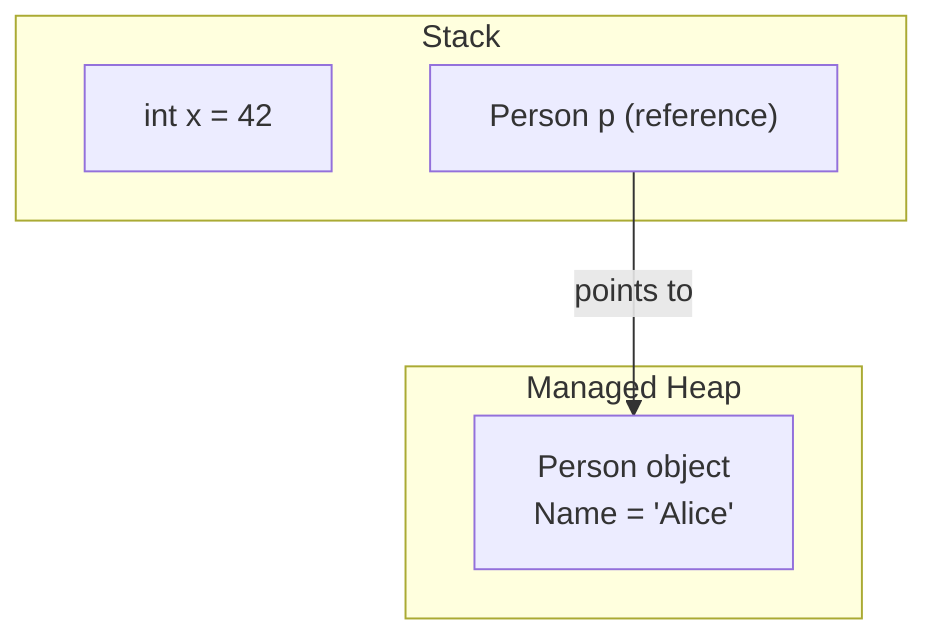

### var, object, dynamic

**Q: Contrast var, object, and dynamic.**

A: `var` is statically typed, inferred at compile time (`var x = 5;`). `object` is the base type of everything and requires casting to use as its real type. `dynamic` is resolved at runtime with no compile-time type checking.

**Q: What are the rules/best practices for using var?**

A: Must be initialized at declaration (can't be assigned bare `null`); its inferred type can't change afterward; local-scope only, never a class field. Use it when the type is obvious, with anonymous types, and in LINQ; avoid it when it hurts readability (e.g., `var x = GetData();`).

### == vs Equals() vs ReferenceEquals()

**Q: How do ==, Equals(), and ReferenceEquals() differ?**

A: `==` compares values for value types and references for reference types by default, but can be operator-overloaded (as `string` does). `Equals()` checks value equality and can be overridden. `object.ReferenceEquals()` always bypasses overloads and compares raw identity.

```csharp
string a = "hello", b = "hello";
Console.WriteLine(a == b);       // True (string overloads == for value comparison)
Console.WriteLine(a.Equals(b));  // True

public class Employee
{
    public int Id { get; set; }
    public override bool Equals(object obj) => obj is Employee e && e.Id == Id;
    public override int GetHashCode() => Id.GetHashCode();
    public static bool operator ==(Employee e1, Employee e2) => e1.Id == e2.Id;
    public static bool operator !=(Employee e1, Employee e2) => !(e1 == e2);
}
```

**Q: Why must you override GetHashCode() whenever you override Equals()?**

A: `Dictionary`/`HashSet` bucket objects by hash code first, then use `Equals()` to disambiguate within a bucket. If `Equals`-equal objects return different hash codes, lookups silently fail to find them.

### Nullable Value Types & Nullable Reference Types (NRTs)

**Q: What's the difference between int? and string? (nullable value type vs NRT)?**

A: `int?` wraps a value type in `Nullable<int>`, a real runtime construct. `string?` (C# 8+, opt-in via `<Nullable>enable</Nullable>`) is purely a compile-time annotation/analysis feature — it adds no runtime null-checking.

```csharp
int? age = null;                 // nullable value type — wraps in Nullable<int>
Console.WriteLine(age ?? 18);    // 18

string? name = null;             // nullable reference type (C# 8+, opt-in via <Nullable>enable</Nullable>)
```

**Q: Why is enabling NRTs on a large legacy codebase painful?**

A: It's not retrofit-friendly — flipping `<Nullable>enable</Nullable>` floods the build with hundreds/thousands of CS8600-series warnings since every parameter, field, and return type must be correctly annotated. Most teams roll out per-file/per-project via `#nullable enable` pragmas instead of a big-bang flip.

**Q: Do NRTs prevent NullReferenceException at runtime?**

A: No — they're compile-time analysis only. A non-nullable `string` can still be null at runtime via reflection, JSON deserialization with missing fields, or an un-annotated third-party library. The null-forgiving `!` operator also silences the compiler without adding a runtime check.

**Q: How would you roll out NRTs on a codebase that now has 3,000 warnings?**

A: Enable per-project via `.csproj`; fix top-down starting with public APIs/DTOs at trust boundaries; only turn warnings into errors once a project is clean; use `[NotNull]`/`[MaybeNull]`/`[AllowNull]` attributes where the compiler can't infer correctly (e.g., `TryGetValue`-style patterns).

### Implicit vs Explicit Conversion

**Q: Implicit vs explicit conversion — what's the difference?**

A: Implicit conversions happen automatically with no data loss (e.g., `int` → `double`). Explicit conversions require a manual `(type)` cast and can lose data (e.g., `double` → `int` truncates).

```csharp
int x = 10;
double y = x;      // implicit
int z = (int)y;    // explicit
```

### Boxing & Unboxing

**Q: What are boxing and unboxing?**

A: Boxing copies a value type onto the heap wrapped as an `object` (`object obj = 10;`). Unboxing copies it back out into a value-type variable with a runtime type check (`int num = (int)obj;`).

**Q: What's the real performance cost of boxing?**

A: Each boxing operation allocates a new heap object (object header + sync block, ~16–24 bytes overhead even for a 4-byte `int`); unboxing does a runtime type check before copying back. In a hot loop this shows up as Gen0 GC pressure — the classic example is an `ArrayList` of boxed `int`s vs a `List<int>` (generic, no boxing).

---

## Part II — Core Concepts: OOP

### The Four Pillars

**Q: What are the four pillars of OOP, and what does encapsulation mean in C#?**

A: Encapsulation, Inheritance, Polymorphism, Abstraction. Encapsulation restricts direct access to object data, exposing controlled access via properties/methods — e.g., a private field wrapped by a public property.

```csharp
class Person
{
    private string name;
    public string Name { get => name; set => name = value; }
}
```

### Inheritance vs Composition

**Q: What's the difference between inheritance and composition, and why prefer composition?**

A: Inheritance ("is-a") acquires a base class's behavior but C# only supports single class inheritance, and it creates tight coupling that ripples when the base changes. Composition ("has-a") combines small interfaces/components. Favor composition for flexibility; reach for inheritance only for a genuine "is-a" relationship with shared invariants.

```csharp
class Animal { public void Eat() => Console.WriteLine("Eating..."); }
class Dog : Animal { public void Bark() => Console.WriteLine("Barking..."); }
```

**Q: How does .NET use small interfaces to enable composition?**

A: Interfaces like `IDisposable`, `IEnumerable<T>`, and `IComparable` let unrelated classes (e.g., `List<T>` and `Dictionary<TKey,TValue>`) opt into shared behavior without sharing a base class or inheritance tree.

```csharp
interface IFly { void Fly(); }
interface ISwim { void Swim(); }

class Duck : IFly, ISwim   // composed abilities, no deep hierarchy
{
    public void Fly() => Console.WriteLine("Flying");
    public void Swim() => Console.WriteLine("Swimming");
}
```

### Polymorphism: Compile-Time vs Runtime

**Q: Compile-time vs runtime polymorphism — what resolves each, and what are the trade-offs?**

A: Compile-time (static) polymorphism is resolved by the compiler via method/operator overloading — readable, no virtual-dispatch overhead, but fixed at compile time and can cause ambiguity errors. Runtime (dynamic) polymorphism is resolved by the CLR via `virtual`/`override` or interface implementation — enables plugging in new implementations against a stable abstraction (e.g., `IPaymentProcessor`), at the cost of slight dispatch overhead and harder debugging in deep hierarchies.

```csharp
class Calculator
{
    public int Add(int a, int b) => a + b;
    public double Add(double a, double b) => a + b;
}
```

```csharp
class Animal { public virtual void Speak() => Console.WriteLine("Animal sound"); }
class Dog : Animal { public override void Speak() => Console.WriteLine("Bark"); }
class Cat : Animal { public override void Speak() => Console.WriteLine("Meow"); }

Animal a1 = new Dog();   // compiler sees Animal; CLR resolves Dog.Speak at runtime
a1.Speak();              // Bark
```

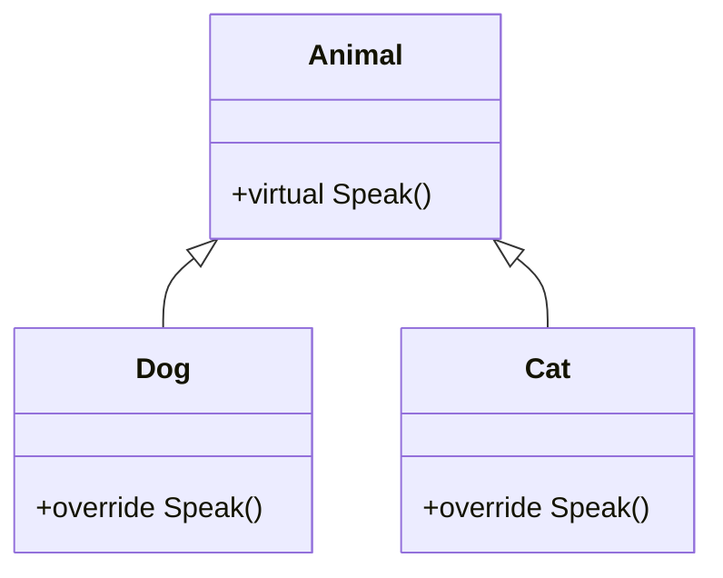

### Overloading vs Overriding vs Hiding (new)

**Q: What do virtual, override, and new mean respectively?**

A: `virtual` declares a method that can be overridden. `override` provides a new implementation of a virtual method. `new` hides a base-class method instead of overriding it.

```csharp
class Base { public void Show() => Console.WriteLine("Base"); }
class Derived : Base { public new void Show() => Console.WriteLine("Derived"); }
```

**Q: What's the classic "new" hiding trap?**

A: Hiding resolves by the reference type, not the runtime object type:

```csharp
Base b = new Derived();
b.Show();             // "Base" — resolved by reference type
((Derived)b).Show();  // "Derived"
```

**Q: Give real reasons to use new instead of override.**

A: Backward compatibility for legacy callers you can't change; the base method isn't `virtual` so it literally can't be overridden; you want behavior to depend on the static reference type; customizing a non-virtual framework method. If you control the base class, prefer `virtual` + `override`.

### Interface vs Abstract Class

**Q: Interface vs abstract class — how do you decide which to use?**

A: An interface defines what a class CAN DO (capability, supports multiple inheritance, no fields/constructors, default methods since C# 8). An abstract class defines what a class IS (identity, single inheritance, can hold state/constructors, mixes abstract and concrete methods). Start with an interface; use an abstract class only when shared state/behavior is genuinely required.

```csharp
public interface IAnimal { void Speak(); }
public class Dog : IAnimal { public void Speak() => Console.WriteLine("Bark"); }

public abstract class Animal
{
    public abstract void Speak();               // must override
    public void Eat() => Console.WriteLine("Eating..."); // shared default
}
```

**Q: Can an abstract class have a constructor if it can't be instantiated directly?**

A: Yes — it runs when a derived class is instantiated, to initialize shared state and enforce required setup.

### struct vs class

**Q: struct vs class — what are the key differences?**

A: `struct` is a value type: stack-allocated (unless boxed or a field of a class), passed by value/copy, interface-only "inheritance," no GC overhead, should usually be immutable. `class` is a reference type: heap-allocated, passed by reference, supports full inheritance, GC-managed, typically mutable.

```csharp
struct Point
{
    public int X { get; }
    public int Y { get; }
    public Point(int x, int y) { X = x; Y = y; }
}
Point p1 = new Point(2, 3);
Point p2 = p1;          // value copy
p2 = new Point(5, 6);
// p1.X == 2 (unchanged), p2.X == 5
```

**Q: What's the recommended size limit for structs, and why?**

A: Microsoft's commonly cited guideline is ≤ 16 bytes, since structs are copied on every pass/assignment and large structs make that expensive.

**Q: When does a struct get boxed?**

A: When it's converted to `object` or to an interface it implements — this copies it from the stack to the heap.

### sealed, static, and partial classes

**Q: What do sealed, static, and partial classes do?**

A: `sealed` prevents further inheritance. `static` classes can't be instantiated, hold only static members, can have a static constructor, and are ideal for utility methods. `partial` classes split one class across multiple files — e.g., separating EF Core/designer-generated code from hand-written code, or letting multiple developers work without merge conflicts.

```csharp
sealed class MyClass { }   // cannot be inherited

static class MathHelper    // cannot be instantiated; only static members
{
    public static int Square(int n) => n * n;
}
```

### Access Modifiers

**Q: List C#'s access modifiers and their visibility.**

A:
- `public` — visible everywhere.
- `private` — declaring class only.
- `protected` — declaring class + derived classes.
- `internal` — same assembly.
- `protected internal` — derived classes OR same assembly.
- `private protected` — derived classes AND same assembly.

Top-level (non-nested) classes can only be `public`/`internal`; nested classes can use any modifier.

### Records & record struct

**Q: What is a record, and how does it differ from a class?**

A: A `record` is a reference type with built-in value-based equality, `ToString()`, and by-convention immutability — ideal for DTOs/domain value objects. Unlike a class (reference equality), two records with identical property values are `==` equal, and `with` expressions allow non-destructive copy-and-mutate:

```csharp
public record Product(int Id, string Name, decimal Price);

var p1 = new Product(1, "Laptop", 999.99m);
var p2 = new Product(1, "Laptop", 999.99m);
Console.WriteLine(p1 == p2);              // True — value equality, unlike class
var p3 = p1 with { Price = 899.99m };     // non-destructive mutation
```

**Q: What is record struct, and when would you use one?**

A: A value-type version of a record (C# 10) — same value-equality semantics but stack-allocated, avoiding heap allocation. Good for small, frequently-created value objects like `Money` or `Coordinates`.

### Pattern Matching & Switch Expressions

**Q: How do switch expressions and pattern matching modernize type-checking code?**

A: Switch expressions (C# 8+) replace verbose switch statements with one expression. Property patterns (`Product { Price: > 1000 }`), relational/logical patterns (`age is >= 18 and < 120`), and list patterns (C# 11, `numbers is [1, 2, 3]`) replace nested `if/else` and type-check chains — a strong signal of current coding style.

```csharp
// Switch expression (C# 8+) replaces verbose switch statements
string Describe(object obj) => obj switch
{
    int n when n < 0 => "negative number",
    int n => $"number {n}",
    string s => $"string of length {s.Length}",
    Product { Price: > 1000 } => "expensive product",   // property pattern
    null => "nothing",
    _ => "unknown"
};

// Relational and logical patterns (C# 9)
bool IsAdult(int age) => age is >= 18 and < 120;

// List patterns (C# 11)
int[] numbers = { 1, 2, 3 };
if (numbers is [1, 2, 3]) Console.WriteLine("matched exact sequence");
if (numbers is [var first, .., var last]) Console.WriteLine($"{first}..{last}");
```

---

## Part III — Constructors & Object Creation

**Q: What is a constructor and what's its purpose?**

A: A special method with the class's name, no return type, that runs automatically on object creation to bring the object into a valid, usable state and enforce invariants — preventing partially-constructed objects.

### Types of Constructors

**Q: List the types of constructors in C# and what each is for.**

A:
- **Default** — no parameters; implicit if you define no constructor; defining any constructor removes the implicit default.
- **Parameterized** — enforces mandatory data; common with DI.
- **Overloaded** — multiple signatures, chained via `: this(...)` to avoid duplication.
  ```csharp
  public Order() : this(0, "Default") { }
  public Order(int id, string type) { Id = id; Type = type; }
  ```
- **Static** — initializes static members, runs once per type before first use, no params/modifiers, only one allowed, keep it light (an exception inside it crashes the app).
- **Private** — blocks external instantiation (Singleton, static utility, factory-controlled creation).
  ```csharp
  public class Logger
  {
      private static Logger _instance;
      private Logger() { }
      public static Logger Instance => _instance ??= new Logger();
  }
  ```
- **Copy** — C# has none built-in; you must hand-write one for cloning/defensive-copy/immutable patterns.

**Q: Can a class have multiple static constructors?**

A: No — only one static constructor is allowed per class.

**Q: Can constructors be virtual, or throw exceptions?**

A: Constructors are never virtual, abstract, or overridable. They can throw exceptions, but generally only for argument-validation failures.

### Constructors in Abstract Classes

**Q: When does an abstract class's constructor run?**

A: During derived-object creation, to initialize shared state and enforce required setup — even though the abstract class itself can never be instantiated directly.

### Step-by-Step Object Creation Process

**Q: Walk through what happens when `new Employee(10, "John")` executes.**

```csharp
Employee emp = new Employee(10, "John");
```

A:
1. CLR determines the type to create.
2. Heap memory is allocated; fields are zero-initialized before any constructor runs.
3. An object reference is created on the stack/register.
4. The constructor overload is resolved at compile time.
5. The base constructor runs first (ultimately `object()`).
6. Instance field initializers run.
7. The constructor body executes.
8. The reference is assigned — the object is ready.
9. The object lives while reachable, then becomes GC-eligible.

**Q: What's the one-liner summary of object creation order?**

A: Memory allocation → zero initialization → constructor selection → base constructor → field initializers → constructor body → reference assignment.

### init, required, and Primary Constructors (C# 11/12)

**Q: What does the init accessor do?**

A: Allows a property to be set only during construction (constructor or object initializer), giving immutability without needing a constructor overload for every combination of properties.

```csharp
public class Person
{
    public string Name { get; init; }        // settable only during object initialization
    public required int Age { get; set; }    // C# 11 — compiler enforces it's set
}
var person = new Person { Name = "Alice", Age = 30 }; // fine
// person.Name = "Bob";  // compile error — init-only after construction
```

**Q: What does required (C# 11) enforce?**

A: The compiler forces callers to set the property at construction, catching missing-data bugs at compile time instead of at runtime.

**Q: What are primary constructors (C# 12), and what's the catch?**

A: They put constructor parameters in scope throughout a class/struct body (extended from records) without redeclaring fields or writing an explicit constructor:

```csharp
public class ProductService(IRepository repo, ILogger<ProductService> logger)
{
    public async Task<Product> GetAsync(int id)
    {
        logger.LogInformation("Fetching {Id}", id);
        return await repo.GetProductAsync(id);
    }
}
// no explicit constructor or private readonly fields needed
```

Catch: parameters aren't automatically fields — the compiler only synthesizes a hidden backing field when a parameter is captured inside a method body, so don't rely on that implicitly if clarity matters.

---

## Part IV — Intermediate: Members & Language Features

### Properties vs Fields

**Q: Properties vs fields — what's the difference?**

A: A field is a raw member variable with no encapsulation. A property wraps access via `get`/`set` accessors, allowing validation/logic while keeping clean call-site syntax.

```csharp
public int MyField;                          // no encapsulation
public int MyProperty { get; set; }           // encapsulated access
```

### const vs readonly vs static

**Q: const vs readonly vs static?**

A: `const` is a compile-time value baked into assembly metadata (IL) and can never change. `readonly` is set at runtime, typically in the constructor, and can't change after the constructor finishes. `static` means one shared copy per type, not per instance.

```csharp
const int ConstValue = 10;
readonly int ReadOnlyValue;    // assignable in constructor
static int StaticValue;
```

### ref vs out vs in

**Q: ref vs out vs in parameters — how do they differ?**

A:
- `ref` — must be initialized before passing; allows read and modify.
- `out` — doesn't need initialization before passing; used to return additional values (e.g., `int.TryParse`).
- `in` — must be initialized before passing; passes large structs by reference **without** allowing mutation, avoiding a copy while staying read-only.

```csharp
void RefExample(ref int num) { num += 5; }
void OutExample(out int num) { num = 10; }
void InExample(in int num) { /* read-only, cannot modify num */ }
```

### params, Named Parameters, Indexers

**Q: What do params, named parameters, and indexers give you?**

A: `params` allows a variable number of arguments as an array (`params int[] numbers`). Named parameters let callers pass arguments by name, order-independent (`Greet(age: 25, name: "Alice")`). Indexers (`this[int index] { get; set; }`) let a type support array-like `obj[i]` access.

```csharp
void PrintNumbers(params int[] numbers) { foreach (int n in numbers) Console.Write(n + " "); }
PrintNumbers(1, 2, 3, 4, 5); // 1 2 3 4 5

void Greet(string name, int age) => Console.WriteLine($"{name} is {age}");
Greet(age: 25, name: "Alice");     // named parameters — order-independent

class Sample
{
    private int[] arr = new int[5];
    public int this[int index] { get => arr[index]; set => arr[index] = value; }
}
```

### Extension Methods

**Q: What is an extension method, and how does the compiler treat it under the hood?**

A: A static method marked with `this` on its first parameter that appears to "add" a method to an existing type without modifying it. The compiler rewrites `name.IsLongerThan(3)` into `StringExtensions.IsLongerThan(name, 3)` — a static call disguised as an instance call. LINQ's `Where`/`Select`/`OrderBy` are all extension methods on `IEnumerable<T>`.

```csharp
public static class MyExtensions
{
    public static bool IsEven(this int number) => number % 2 == 0;
}
int x = 10;
Console.WriteLine(x.IsEven());   // True
```

### Generics — Why They're Not Slow

**Q: Why aren't generics slow in C#, and how does the CLR implement them under the hood?**

A: At compile time, one generic definition is type-checked once, avoiding boxing/unboxing for value types (unlike `ArrayList`). At runtime, the CLR shares one implementation across all reference-type instantiations, but generates a specialized native implementation per distinct value-type instantiation (`Box<int>` and `Box<double>` each get their own JIT code; `Box<string>` shares code with other reference types) — net effect: no boxing, less memory overhead, better JIT inlining.

```csharp
public class Box<T> { public T Value { get; set; } }
Box<int> intBox = new Box<int> { Value = 10 };
Box<string> strBox = new Box<string> { Value = "Hello" };
```

### Tuples & Anonymous Types

**Q: Tuples vs named tuples vs anonymous types?**

A: `var t = ("John", 30);` gives unnamed `Item1`/`Item2` access. `(string Name, int Age) named = (...)` gives readable, named-element access. `var p = new { Name = "John", Age = 30 };` creates an anonymous type with compiler-generated properties, commonly used in LINQ projections.

```csharp
var person = ("John", 30);
Console.WriteLine(person.Item1);              // John

(string Name, int Age) named = ("John", 30);
Console.WriteLine(named.Name);                // named tuple elements — more readable

var p = new { Name = "John", Age = 30 };      // anonymous type
Console.WriteLine(p.Name);
```

### Reflection, Attributes, dynamic, ExpandoObject

**Q: What's the difference between typeof and Type.GetType, and what does dynamic trade off?**

A: `typeof(string)` is compile-time type retrieval. `Type.GetType("System.String")` retrieves a type at runtime, e.g. from a string. `dynamic` skips compile-time type checking entirely (late binding via the DLR) — flexible for COM interop/dynamic JSON/scripting, but each `dynamic` operation goes through DLR call-site caching, which is slower than a static call.

```csharp
Type type = typeof(string);          // compile-time type retrieval
Console.WriteLine(type.FullName);

Type t2 = Type.GetType("System.String"); // runtime type retrieval (e.g. from a string)

[Obsolete("This method is deprecated.")]
void OldMethod() { }

dynamic value = "Hello";
value = 10;                          // no compile-time error — resolved at runtime (late binding)

dynamic expando = new ExpandoObject();
expando.Name = "John";               // properties added dynamically at runtime
```

**Q: What is ExpandoObject used for?**

A: A dynamic object that lets you add properties at runtime (`expando.Name = "John";`) without a predefined class — useful for dynamic/loosely-structured data.

### yield return and Iterators

**Q: How does yield return work under the hood?**

A: The compiler rewrites the method into a state machine implementing `IEnumerable<T>`/`IEnumerator<T>`. Execution is deferred until the caller enumerates (`foreach`, `.ToList()`), and each `MoveNext()` call resumes exactly where the previous one left off.

```csharp
IEnumerable<int> GetNumbers() { yield return 1; yield return 2; }
```

### Fluent Interfaces

**Q: What is a fluent interface, and how does it differ from plain method chaining?**

A: A design style where methods return the same/related object so calls chain into readable, sentence-like code. Every fluent interface uses method chaining, but a fluent interface specifically targets a readable DSL — examples: `StringBuilder`, LINQ, ASP.NET Core middleware (`app.UseRouting().UseAuthentication().UseAuthorization()...`).

```csharp
class Calculator
{
    private int _result;
    public Calculator Add(int x) { _result += x; return this; }
    public Calculator Multiply(int x) { _result *= x; return this; }
    public int Result() => _result;
}
```

```csharp
app.UseRouting().UseAuthentication().UseAuthorization().MapControllers();
```

### Deep Copy vs Shallow Copy

**Q: Shallow copy vs deep copy — how do you achieve each in C#?**

A: Shallow copy (e.g., `MemberwiseClone()`) copies the object but nested reference fields still point to the same shared objects. Deep copy creates fully independent nested objects. .NET has no built-in "deep clone" — you must hand-write a recursive clone/copy constructor or use a serialize/deserialize round-trip, each with trade-offs (serialization is simple but slow; hand-written is fastest but must track the class shape).

```csharp
Person clone = (Person)this.MemberwiseClone(); // shallow copy — nested reference fields still shared
```

### Static Abstract/Virtual Interface Members & Generic Math (C# 11)

**Q: What did C# 11's static abstract/virtual interface members enable?**

A: Before C# 11, interfaces could only declare instance members. C# 11 allows `static abstract`/`static virtual` members, enabling "generic math" — a single generic method that works across `int`, `double`, `decimal`, and custom numeric types using real operators, via `System.Numerics.INumber<T>` and related interfaces, instead of duplicating logic per type or using `dynamic`/reflection.

```csharp
public interface IShape<T> where T : IShape<T>
{
    static abstract T Create(double size);
    static abstract double Area(T shape);
}

public readonly struct Square : IShape<Square>
{
    public double Side { get; }
    private Square(double side) => Side = side;
    public static Square Create(double size) => new Square(size);
    public static double Area(Square s) => s.Side * s.Side;
}
```

### Source Generators

**Q: What is a source generator, and why does it matter for senior interviews?**

A: A Roslyn compiler plugin that inspects your code at compile time and emits additional C# source that gets compiled alongside it — a modern, reflection-free alternative to runtime metaprogramming. Used by `System.Text.Json`'s `JsonSerializerContext`, the `LoggerMessage` generator, and `[GeneratedRegex]`. It matters because the industry (Native AOT, trimming, faster cold starts) is moving away from reflection-heavy frameworks toward compile-time codegen.

```csharp
[JsonSerializable(typeof(Product))]
internal partial class AppJsonContext : JsonSerializerContext { }

// Usage — no reflection at runtime:
var json = JsonSerializer.Serialize(product, AppJsonContext.Default.Product);
```

---

## Part V — Delegates, Events & Lambdas

### Delegates

**Q: What is a delegate, and what are the two delegate types?**

A: A type-safe function pointer — you can pass methods as parameters, and unlike C/C++ function pointers, delegates are secure and type-checked. Single-cast delegates reference one method; multicast delegates (`+=`) reference multiple methods, invoked in registration order.

```csharp
public delegate void Notify(string message);

public class Process
{
    public void StartProcess(Notify notifier) => notifier("Process Started...");
}

Notify notifyDelegate = Console.WriteLine;
new Process().StartProcess(notifyDelegate); // "Process Started..."
```

### Func, Action, Predicate

**Q: Func vs Action vs Predicate?**

A: `Func<T,TResult>` takes 0–16 inputs and returns a value (LINQ `Select`/`Where`). `Action<T>` takes inputs and returns `void` (logging, `ForEach`). `Predicate<T>` takes one input and returns `bool` (conditions, `FindAll`).

```csharp
Action<string> log = msg => Console.WriteLine("Log: " + msg);
Func<int,int,int> add = (a, b) => a + b;         // add(5,10) -> 15
Predicate<int> isEven = n => n % 2 == 0;         // isEven(4) -> true
```

**Q: What are the pros and cons of delegates?**

A: Pros: loose coupling, callbacks/event-driven programming, multicast, foundation for LINQ/async continuations. Cons: overuse hurts traceability; multicast misuse causes unintended multiple executions; calling a null delegate throws (guard with `?.Invoke()`).

### Events

**Q: What does the event keyword add on top of a raw delegate?**

A: It restricts external code to `+=`/`-=` only — external code cannot invoke or overwrite the underlying delegate directly, giving stronger encapsulation than a public delegate field (the Publisher–Subscriber pattern).

```csharp
public class Alarm
{
    public delegate void AlarmEventHandler(string message);
    public event AlarmEventHandler OnAlarm;
    public void Ring()
    {
        Console.WriteLine("Alarm ringing...");
        OnAlarm?.Invoke("Wake up! It's 7 AM");
    }
}
var alarm = new Alarm();
alarm.OnAlarm += msg => Console.WriteLine("Subscriber 1: " + msg);
alarm.OnAlarm += msg => Console.WriteLine("Subscriber 2: " + msg);
alarm.Ring();
```

**Q: Why are un-unsubscribed event handlers a classic memory-leak source?**

A: A long-lived publisher's invocation list holds a reference to every subscriber; if a short-lived subscriber never unsubscribes, the publisher keeps it alive and it can never be garbage collected.

### Delegate vs Event

**Q: Delegate vs event — when should a public API expose which?**

A: A delegate is freely assignable/invokable by any code with access (weaker encapsulation). An event can only be invoked by the publisher class and only subscribed/unsubscribed via `+=`/`-=` (stronger, compiler-enforced encapsulation). Best practice: expose events, not raw delegates, in reusable libraries/APIs.

### Lambda Expressions & Anonymous Methods

**Q: Lambda expressions vs the older anonymous-method syntax?**

A: Lambdas (`x => x * x`) are the modern idiomatic form; the `delegate(int x) { ... }` anonymous-method syntax still compiles but is rarely hand-written today.

```csharp
Func<int,int> square = x => x * x;
Console.WriteLine(square(5)); // 25

Action<int> squarePrint = delegate(int x) { Console.WriteLine(x * x); }; // older anonymous-method syntax
```

---

## Part VI — Collections & LINQ

### LINQ Fundamentals

**Q: What does "deferred execution" mean in LINQ?**

A: A query like `numbers.Where(n => n % 2 == 0)` isn't executed when defined — it only runs when enumerated (`foreach`, `.ToList()`, etc.).

```csharp
var numbers = new[] { 1, 2, 3, 4, 5 };
var evens = numbers.Where(n => n % 2 == 0);   // deferred — not executed until enumerated
```

### IEnumerable vs IQueryable

**Q: IEnumerable vs IQueryable — what's the core difference?**

A: `IEnumerable` filters in-memory/client-side (LINQ to Objects) — best for `List<T>`/arrays. `IQueryable` builds an expression tree translated to the data source (e.g., SQL) — best for EF Core/remote data, fetching only matching rows instead of loading everything first.

```csharp
// IEnumerable — filtering happens in memory
List<int> numbers = new() { 1, 2, 3, 4, 5, 6 };
IEnumerable<int> result = numbers.Where(n => n > 3);

// IQueryable — translated to SQL: SELECT * FROM Customers WHERE Age > 30
IQueryable<Customer> q = context.Customers.Where(c => c.Age > 30);
```

### Expression Trees & How EF Core Translates LINQ to SQL

**Q: How does a Func<T,bool> differ from an Expression<Func<T,bool>>?**

A: `Func<T,bool>` compiles to IL — a directly invocable delegate. `Expression<Func<T,bool>>` compiles to an object graph (an `Expression` tree) describing the lambda's structure; nothing runs by itself until a provider (e.g., EF Core) walks the tree and translates it.

```csharp
Expression<Func<Customer, bool>> predicate = c => c.Age > 30 && c.City == "Seattle";
```

This compiles to something you can inspect and walk at runtime:

```csharp
Console.WriteLine(predicate.Body);   // (c.Age > 30) AndAlso (c.City == "Seattle")
// predicate.Parameters[0].Name -> "c"
// predicate.Body is a BinaryExpression with Left/Right sub-expressions, recursively walkable
```

**Q: Describe the EF Core LINQ-to-SQL translation pipeline.**

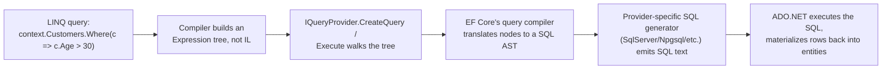

A:
1. Each `Where`/`Select`/`OrderBy` call on an `IQueryable<T>` wraps the prior expression tree in a new node — no execution yet.
2. On enumeration, EF Core's `IQueryProvider` walks the accumulated tree and builds a relational query model.
3. A provider-specific SQL generator (SQL Server/Npgsql/etc.) emits the actual `SELECT ... WHERE ...` text.
4. ADO.NET executes it and materializes rows back into entities.

**Q: What happens when you call a non-translatable custom C# method inside a Where() predicate against IQueryable?**

A: It fails to translate and throws at runtime (EF Core 3.0+ made this a hard error instead of silently falling back to client-side evaluation, since silent client-eval was a major cause of "why is this so slow" N+1-style bugs) — EF Core never runs the method, it only inspects the expression describing the call.

**Q: Why does calling .ToList() too early break further query translation?**

A: Once materialized to an in-memory `List<T>`, every subsequent LINQ call binds against `IEnumerable<T>`/`Func<T,bool>`, not `IQueryable<T>`/`Expression<Func<T,bool>>`, so nothing after that point can be pushed down to SQL.

### PLINQ / AsParallel() Trade-offs

**Q: When does PLINQ (.AsParallel()) actually help?**

A: When the per-element work is genuinely CPU-bound and non-trivial, the source collection is large enough to amortize partitioning cost, and operations are independent per element with no shared mutable state.

```csharp
var result = numbers
    .AsParallel()
    .Where(n => IsExpensivePredicate(n))   // CPU-bound work per element — good PLINQ candidate
    .Select(n => Transform(n))
    .ToList();                              // forces materialization/merge
```

**Q: Why can .AsParallel() make code slower?**

A: Partitioning/coordination overhead can exceed the parallelism benefit on small collections or cheap work; result-merging preserves order by default (`.AsUnordered()` can help); over-subscription causes context-switch thrashing; it's the wrong tool for I/O-bound work (use `Parallel.ForEachAsync` instead); exceptions get wrapped in `AggregateException`.

### IEnumerable vs ICollection vs IList vs IReadOnlyList

**Q: How do IEnumerable, ICollection, IList, and IReadOnlyList build on each other?**

A: `IEnumerable<T>` — forward-only iteration, no `Count`/indexer. `ICollection<T>` adds `Add`/`Remove`/`Count`/`Contains`. `IList<T>` adds index-based access/`Insert`/`RemoveAt`. `IReadOnlyList<T>`/`IReadOnlyCollection<T>` expose read-only indexed access/count without mutation methods — the right return type for a public API handing back an internal list.

### List vs Array

**Q: Why is List<T> slightly slower than an array?**

A: `List<T>` wraps an array internally and adds amortized-doubling resizing, bounds checking, and safety features on top.

```csharp
int[] numbers = new int[5];
List<int> numList = new List<int>();
```

### Dictionary vs Hashtable

**Q: Dictionary<TKey,TValue> vs Hashtable — which should you use today?**

A: `Hashtable` is legacy and non-generic (boxes value types, stores as `object`) but is safe for a single writer with multiple readers without locking; `Dictionary` is generic/type-safe and preferred but isn't thread-safe at all for concurrent access — use `ConcurrentDictionary` for that.

```csharp
Dictionary<int,string> students = new();
students[1] = "Alice";
```

### ReadOnlyCollection vs List

**Q: ReadOnlyCollection<T> vs List<T>?**

A: `ReadOnlyCollection` wraps a list to prevent modification through that reference — used for safety/immutability at API boundaries. `List<T>` is the general-purpose mutable collection.

```csharp
ReadOnlyCollection<int> numbers = new List<int> { 1, 2, 3 }.AsReadOnly();
```

### Jagged vs Multidimensional Arrays

**Q: Jagged vs rectangular multidimensional arrays?**

A: Jagged (`int[][]`) is an array of arrays with independently-sized rows — more flexible but with extra indirection per row. Rectangular (`int[,]`) stores all elements contiguously in one block — faster for genuinely rectangular data since there's one allocation instead of N+1.

```csharp
// Jagged array — array of arrays, independently-sized rows
int[][] jagged = new int[2][];
jagged[0] = new int[] { 1, 2 };
jagged[1] = new int[] { 3, 4, 5 };

// Multidimensional (rectangular) array — fixed rectangular shape, single memory block
int[,] grid = new int[2, 3];
grid[0, 0] = 1;
```

### Covariance & Contravariance

**Q: What do the out/in generic modifiers enable?**

A: `out T` enables covariance — a more-derived type can be assigned to a base-typed reference (e.g., `IEnumerable<string>` to `IEnumerable<object>`) because `T` only appears in output positions. `in T` enables contravariance — a base type can be used where a derived type is expected, for input-only positions.

```csharp
public interface IEnumerable<out T> : IEnumerable { IEnumerator<T> GetEnumerator(); }

IEnumerable<string> strings = new List<string> { "A", "B", "C" };
IEnumerable<object> objects = strings;    // allowed thanks to out T
```

### String vs StringBuilder

**Q: Why is StringBuilder faster for repeated string edits?**

A: `string` is immutable — every apparent modification (`+=`, `Replace`, `Substring`) allocates a brand-new string object. `StringBuilder` maintains a mutable internal char buffer, modified in place; pre-size it (`new StringBuilder(capacity)`) when the final length is roughly known to avoid repeated resizes.

```csharp
StringBuilder sb = new StringBuilder("Hello");
sb.Append(" World");
```

**Q: What is string interning?**

A: .NET interns string literals so identical literals share one instance via the intern pool (`"abc" == "abc"` by reference for literals) — but strings built at runtime (e.g., via concatenation) aren't automatically interned.

### .NET 6+ LINQ Additions: MinBy/MaxBy/Chunk/DistinctBy/Order/OrderDescending

```csharp
var products = new[]
{
    new Product("Laptop", 999.99m, "Electronics"),
    new Product("Mouse", 25.00m, "Electronics"),
    new Product("Desk", 250.00m, "Furniture"),
};

// MinBy / MaxBy (.NET 6) — select the element with the min/max key, not just the key itself.
// Old way: products.OrderBy(p => p.Price).First();  (sorts the whole sequence just to get one element)
Product cheapest = products.MinBy(p => p.Price);       // Mouse
Product priciest = products.MaxBy(p => p.Price);       // Laptop

// Chunk (.NET 6) — splits a sequence into fixed-size batches, last batch may be smaller.
foreach (Product[] batch in products.Chunk(2))
    await ProcessBatchAsync(batch);                     // e.g., batched bulk-insert calls

// DistinctBy (.NET 6) — de-duplicate by a key selector instead of the whole object/a custom IEqualityComparer.
var onePerCategory = products.DistinctBy(p => p.Category);  // first product seen per category

// Order / OrderDescending (.NET 7) — shorthand for OrderBy(x => x) when sorting by the element itself.
var sorted = new[] { 3, 1, 2 }.Order();                 // [1, 2, 3] — no need for OrderBy(x => x)
var sortedDesc = products.Select(p => p.Price).OrderDescending();
```

**Q: What do MinBy/MaxBy replace, and what's the gotcha?**

A: They replace `OrderBy(key).First()`, returning the element (not just the key) with the min/max key without sorting the whole sequence. Gotcha: on a tie, they return the first matching element in iteration order, like `First()`.

**Q: What do Chunk, DistinctBy, and Order/OrderDescending do?**

A: `Chunk(size)` (.NET 6) splits a sequence into fixed-size batches (the last batch may be smaller) — good for batched bulk-insert calls. `DistinctBy(keySelector)` (.NET 6) de-dupes by a key instead of the whole object or a custom `IEqualityComparer`. `Order()`/`OrderDescending()` (.NET 7) are shorthand for `OrderBy(x => x)` when sorting by the element itself.

### LINQ Gotchas Every Senior Dev Should Know

**Q: Why is calling .Count() then .First() on the same un-materialized query dangerous?**

A: It can execute the underlying query twice — expensive for `IQueryable` (two DB round-trips) and dangerous for a lazily-evaluated sequence with side effects. Fix: materialize once with `.ToList()`/`.ToArray()` if you need to inspect it more than once.

**Q: How does closure capture differ between foreach and classic for loops?**

A: C# 5+ gives each `foreach` iteration its own loop variable, so captured lambdas each see their own value. A classic `for` loop's index variable is still a single variable shared across all captured lambdas unless you copy it into a loop-local variable first — interviewers still ask this because the C# 5 fix only covers `foreach`.

```csharp
var funcs = new List<Func<int>>();
for (int i = 0; i < 3; i++) funcs.Add(() => i);   // C# 5+: each iteration has its own 'i' — this is actually fine now
```

**Q: Differentiate First()/FirstOrDefault()/Single()/SingleOrDefault().**

A: `First()` throws `InvalidOperationException` on an empty sequence. `FirstOrDefault()` returns `default(T)`. `Single()` throws if there is zero OR more than one match (use it to assert uniqueness). `SingleOrDefault()` throws only on more-than-one, returns default on zero.

**Q: Why does custom equality matter for Distinct()/GroupBy()/Except()?**

A: They require either overriding `Equals`/`GetHashCode` on the element type or supplying an `IEqualityComparer<T>` — otherwise they silently use reference equality on a custom class, a common "Distinct() not working" bug.

---

## Part VII — Memory Management & Garbage Collection

### Stack vs Heap in the .NET Memory Model

**Q: Stack vs heap in .NET — how do they differ?**

A: Stack — fast, LIFO, holds local value types, references (pointers), and call-frame data; freed automatically on method return, no fragmentation. Heap — flexible storage for reference-type objects, GC-controlled, slower, can fragment (the GC compacts during collection).

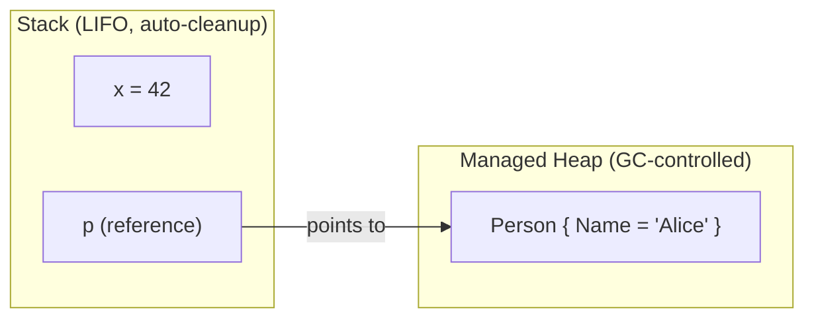

### Garbage Collection (GC)

**Q: What are the GC's core mechanics?**

A: Mark (find reachable objects from GC roots) → Sweep (remove unreachable ones) → Compact (optional, reduces fragmentation).

**Q: Explain generational GC.**

A: Objects start in Gen 0 (collected frequently); survivors are promoted to Gen 1 (medium-lived), then Gen 2 (long-lived — caches, statics), which is collected least often.

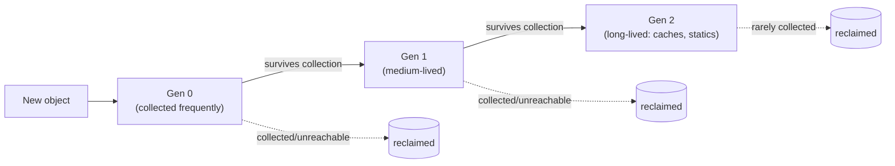

**Q: What triggers a GC, and why avoid GC.Collect()?**

A: Memory pressure, allocation threshold, or an explicit `GC.Collect()` call — discouraged, since it forces an out-of-schedule full collection and hurts throughput by defeating the GC's own heuristics. Acceptable only after a known, one-off large allocation burst.

**Q: What is the Large Object Heap (LOH)?**

A: Objects > 85 KB go on the LOH, collected with Gen 2, and historically not auto-compacted for performance — `GCSettings.LargeObjectHeapCompactionMode` can request compaction if fragmentation becomes a real problem.

**Q: Workstation vs Server vs Concurrent/Background GC?**

A: Workstation GC is the default for single-threaded apps. Server GC is for multi-threaded apps (default in ASP.NET Core server contexts). Concurrent/Background GC runs Gen 2 collection on a background thread without fully freezing the app.

### GC Diagnostics Tooling for Production

**Q: What's the recommended tool sequence for diagnosing a production memory leak?**

A:
1. `dotnet-counters` first — cheap, live GC/heap/ThreadPool counters, tells you if/what kind of problem exists.
2. `dotnet-gcdump` — heap snapshots, diffed to find growing object types and what's rooting them.
3. `dotnet-trace` — only if you still need allocation call stacks to pinpoint the exact code.

```bash
# 1. Find the process
dotnet-counters ps

# 2. Watch live GC/heap counters against the running process — cheap, safe, no pause
dotnet-counters monitor --process-id <pid> System.Runtime
#    Look at: gc-heap-size, gen-0/1/2-size, gen-0/1/2-gc-count, alloc-rate, gc-committed-bytes
#    A Gen 2 heap that keeps climbing across repeated GC cycles (never shrinking back down after
#    a full collection) is the actual signature of a leak, as opposed to just high-but-stable
#    allocation churn — this distinction matters and is worth stating explicitly.

# 3. Take two heap snapshots several minutes apart under normal load
dotnet-gcdump collect --process-id <pid> -o snapshot1.gcdump
#    ...wait, let more traffic accumulate...
dotnet-gcdump collect --process-id <pid> -o snapshot2.gcdump

# 4. Diff the two dumps (e.g., in the PerfView heap-diff view, or `dotnet-gcdump report`)
#    Look for object types whose *count* grew between snapshots disproportionately to traffic —
#    e.g., 50,000 more HttpRequestMessage or EventHandler-captured closures than expected.
#    Then inspect the retention/GC-root path for that type: what's holding a reference?
#    Classic culprits (all covered elsewhere in this guide): un-unsubscribed event handlers,
#    a static/singleton cache with no eviction, a captive DbContext, closures captured into a
#    long-lived delegate.

# 5. If the heap diff alone isn't conclusive, capture a trace to get allocation call stacks
dotnet-trace collect --process-id <pid> --providers Microsoft-DotNETCore-SampleProfiler
#    Analyze in PerfView/Speedscope: which call stack is doing the allocating, not just which
#    type is accumulating — pinpoints the actual line of code, not just the symptom.
```

**Q: How do you distinguish a real leak from high-but-stable allocation churn using dotnet-counters?**

A: A Gen 2 heap size that keeps climbing across repeated GC cycles (never shrinking back after a full collection) is the leak signature — as opposed to a high allocation rate with a stable heap size, which is just churn.

**Q: What do these diagnostics tools attach to, and why does that matter for production?**

A: They attach to a running process by PID with no code changes or restarts required — critical since you often can't attach a debugger or redeploy just to investigate a production issue.

### Dispose() vs Finalize()

**Q: Dispose() vs Finalize() — how do they differ?**

A: `Dispose()` (`IDisposable`) is explicit, deterministic cleanup of unmanaged resources, callable by the developer (or `using`), and safe to call multiple times. `Finalize()` (`~ClassName()`) is called by the GC, non-deterministic, slower, and a last-resort safety net if `Dispose()` was never called.

```csharp
using var fs = new FileStream("test.txt", FileMode.Open); // Dispose() guaranteed even on exception
```

**Q: What's the full Dispose pattern with a finalizer backup?**

A: `Dispose()` calls `Dispose(true)` then `GC.SuppressFinalize(this)`; `protected virtual Dispose(bool disposing)` frees managed resources only if `disposing` is true, and frees unmanaged resources unconditionally; the finalizer `~ClassName()` calls `Dispose(false)` as a backup.

```csharp
public class ResourceHolder : IDisposable
{
    private bool disposed = false;
    public void Dispose() { Dispose(true); GC.SuppressFinalize(this); }
    protected virtual void Dispose(bool disposing)
    {
        if (!disposed)
        {
            if (disposing) { /* free managed resources (other IDisposables) */ }
            // free unmanaged resources (native handles) unconditionally
            disposed = true;
        }
    }
    ~ResourceHolder() { Dispose(false); }
}
```

**Q: Why shouldn't HttpClient be disposed per request?**

A: It should be reused/DI-managed via `IHttpClientFactory` — disposing/recreating it per call can exhaust sockets under load due to how the underlying `SocketsHttpHandler` manages connections.

### Weak References

**Q: What does WeakReference<T> let you do?**

A: Lets the GC collect an object while the app can still retrieve it if it happens to still be alive — the reference itself doesn't keep the object rooted. Used for large reclaimable caches and avoiding "publisher keeps subscriber alive forever" leaks.

```csharp
WeakReference<object> weakRef = new WeakReference<object>(new object());
if (weakRef.TryGetTarget(out var target)) { /* still alive */ }
```

### Memory Leaks in .NET

**Q: Since .NET is garbage-collected, what does a "memory leak" actually mean?**

A: Unintentional rooting — something keeps a reference alive that should have been released. Common sources: un-unsubscribed event handlers, closures captured into long-lived delegates, static caches without eviction, DI captive dependencies, and `HttpClient` misuse.

```csharp
static List<byte[]> list = new List<byte[]>();
void LeakMemory() => list.Add(new byte[100000]); // static root never released
```

### IAsyncDisposable

**Q: Why does IAsyncDisposable exist, and how do you use it?**

A: `IDisposable.Dispose()` is synchronous, but some cleanup is inherently async (flushing a network stream, an async DB close). C# 8's `IAsyncDisposable` + `await using` lets `DisposeAsync()` perform that cleanup asynchronously at scope exit. `DbContext`, `SqlConnection`, and `Stream` subclasses all implement it.

```csharp
public class AsyncResource : IAsyncDisposable
{
    private readonly Stream _stream;
    public async ValueTask DisposeAsync()
    {
        await _stream.FlushAsync();
        await _stream.DisposeAsync();
    }
}

await using var resource = new AsyncResource(); // calls DisposeAsync() at scope exit, asynchronously
```

---

## Part VIII — Advanced: Multithreading & Async

### Thread vs Task (TPL)

**Q: Thread vs Task — what are the key contrasts?**

A: `Thread` is low-level/OS-managed, expensive to create, a dedicated OS thread, no built-in return value, manual exception handling — best for long-running background work. `Task` is high-level/runtime-managed, runs on a pooled thread, optimized/reused, can return values (`Task<T>`), has built-in exception handling — best for parallel/short-lived, I/O-bound work.

### Task Lifecycle & Exception Handling

**Q: What are the Task states?**

A: `Created` → `WaitingToRun` → `Running` → `WaitingForChildrenToComplete` → `RanToCompletion` / `Faulted` / `Canceled`.

**Q: How does exception propagation differ between a raw Thread and a Task?**

A: A `Thread` doesn't propagate exceptions automatically (must handle inside the thread, or it crashes the app if uncaught). A `Task` captures exceptions and (re)throws them only when awaited/`.Wait()`/`.Result` is observed; multiple exceptions aggregate into `AggregateException.InnerExceptions`.

**Q: How does cooperative cancellation work with CancellationToken?**

A: A `CancellationTokenSource` issues a token; the async method periodically calls `token.ThrowIfCancellationRequested()` or passes the token into awaitable calls (e.g., `Task.Delay(100, token)`); catching `OperationCanceledException` is the expected outcome, not necessarily an error. `CreateLinkedTokenSource` combines multiple sources, cancelling if either cancels.

```csharp
using var cts = new CancellationTokenSource(TimeSpan.FromSeconds(5)); // auto-cancel after 5s
try
{
    await DoWorkAsync(cts.Token);
}
catch (OperationCanceledException)
{
    // expected on cancellation — not necessarily an error
}

async Task DoWorkAsync(CancellationToken token)
{
    for (int i = 0; i < 100; i++)
    {
        token.ThrowIfCancellationRequested();   // cooperative check
        await Task.Delay(100, token);
    }
}
```

### Thread Safety Primitives

**Q: What is a critical section, and how does lock behave with async code?**

A: A critical section is code accessed/modified by multiple threads concurrently; `lock` serializes access to it. `lock` is synchronous only — the compiler forbids `await` inside a `lock` block; use `SemaphoreSlim` for async-compatible mutual exclusion.

```csharp
private readonly object _lockObj = new();
lock (_lockObj) { /* critical section */ }
```

### async/await Fundamentals

**Q: What do async and await actually do?**

A: `async` marks a method as asynchronous, enabling `await` inside it. `await` asynchronously suspends execution until the awaited operation completes, without blocking the calling thread — the thread is returned to the pool while I/O is in flight.

```csharp
public async Task<string> GetDataAsync()
{
    using var client = new HttpClient();
    string data = await client.GetStringAsync("https://example.com");
    return data;
}
```

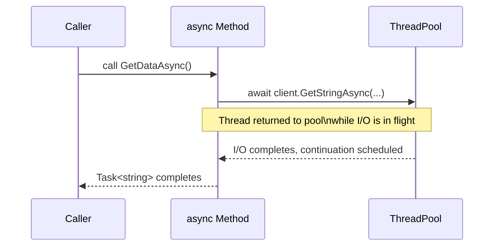

### Async State-Machine Internals

**Q: What does the compiler actually generate for an async method?**

A: A compiler-generated struct/class implementing `IAsyncStateMachine`, with the method body rewritten into a jump-table-driven `MoveNext()`. An `AsyncTaskMethodBuilder<T>` creates and returns the `Task<T>` immediately; a `_state` field tracks which await point to resume after.

```csharp
public async Task<string> GetDataAsync()
{
    var response = await _httpClient.GetStringAsync(url);
    return response.ToUpper();
}
```

...is roughly equivalent to:

```csharp
private struct GetDataAsyncStateMachine : IAsyncStateMachine
{
    public int _state;                                   // tracks which await we're resuming after
    public AsyncTaskMethodBuilder<string> _builder;       // manages the returned Task<string>
    public HttpClient _httpClient;
    private TaskAwaiter<string> _awaiter;                 // captured awaiter, survives across suspension

    void IAsyncStateMachine.MoveNext()
    {
        string result;
        try
        {
            if (_state == 0)   // resuming after the await
            {
                result = _awaiter.GetResult();            // rethrows if the task faulted
                goto AfterAwait;
            }

            // first entry — call the async operation
            var task = _httpClient.GetStringAsync(url);
            _awaiter = task.GetAwaiter();
            if (!_awaiter.IsCompleted)
            {
                _state = 0;
                _builder.AwaitUnsafeOnCompleted(ref _awaiter, ref this);  // registers continuation, returns to caller
                return;                                    // <-- this is the "suspend" point; thread is freed here
            }
            result = _awaiter.GetResult();                 // synchronous fast path — already completed

            AfterAwait:
            var final = result.ToUpper();
            _builder.SetResult(final);                     // completes the returned Task<string>
        }
        catch (Exception ex)
        {
            _builder.SetException(ex);                     // exception captured onto the Task, not thrown here
        }
    }

    void IAsyncStateMachine.SetStateMachine(IAsyncStateMachine sm) { }
}
```

**Q: Walk through what happens when the awaited operation isn't complete yet.**

A: `MoveNext()` checks `awaiter.IsCompleted` synchronously first (a fast path if already done, e.g. a cache hit). If not complete, it registers itself as the continuation via `OnCompleted`/`UnsafeOnCompleted` and returns control to the caller — this is the actual point the thread is freed. Some other piece of infrastructure later calls `MoveNext()` again to resume.

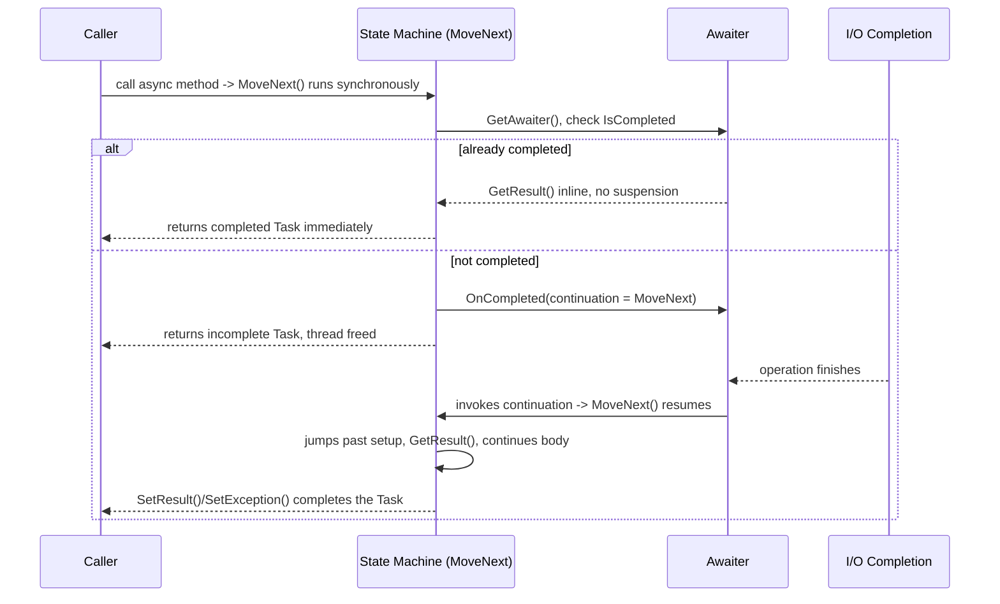

**Q: How are exceptions handled inside the generated state machine?**

A: They're caught inside `MoveNext()` and stored on the `Task` via `_builder.SetException(ex)` rather than thrown up the call stack — which is why an exception in an `async Task` method only surfaces when the caller awaits/observes that `Task`, and why `async void` (no `Task` to store the exception on) is dangerous.

**Q: Is the compiler-generated state machine a class or a struct?**

A: By default a struct, to avoid a heap allocation when the method completes synchronously — boxed to the heap only the first time it actually needs to suspend. This is one of several allocation-avoidance tricks (along with cached completed `Task`/`ValueTask` instances) that make `async`/`await` cheaper than it looks from the syntax alone.

**Q: What's the minimal "awaiter contract" a type needs to be awaitable?**

A: `GetAwaiter()` returning something with `bool IsCompleted`, `GetResult()`, and `OnCompleted`/`UnsafeOnCompleted` implementing `INotifyCompletion`/`ICriticalNotifyCompletion` — a compile-time duck-typed pattern, not a required interface on the awaited type itself, which is how you can `await` a `Task`, a `ValueTask`, a `YieldAwaitable`, or a custom awaitable.

### Asynchrony vs Multithreading

**Q: Asynchrony vs multithreading — when do you use each?**

A: Async/await uses a single thread and avoids blocking — best for I/O-bound work, efficient, not necessarily parallel. Multithreading uses multiple explicit threads for true parallelism — best for CPU-bound work, at the cost of needing synchronization. The two are frequently combined (`await Task.Run(() => CpuBoundWork())`).

### Deadlocks & Race Conditions

**Q: Give an example of a classic lock-ordering deadlock, and a race condition.**

A: Deadlock: Thread A locks `obj1` then `obj2`; Thread B locks `obj2` then `obj1` — inconsistent lock order risks deadlock. Race condition: `Parallel.For(0, 1000, _ => count++)` on a shared `int count` — non-atomic increments cause lost updates and a wrong total.

```csharp
// Thread A: lock(obj1) then lock(obj2)
// Thread B: lock(obj2) then lock(obj1)  <-- inconsistent order = deadlock risk
lock (obj1) { lock (obj2) { /* ... */ } }
```

```csharp
int count = 0;
Parallel.For(0, 1000, _ => count++); // non-atomic increment — lost updates, wrong total
```

### Task Parallel Library (TPL)

**Q: What is the TPL, and how does it relate to async/await?**

A: TPL (`System.Threading.Tasks`) is a higher-level abstraction over raw threads — `Task`/`Parallel`/`TaskFactory` scheduled by the ThreadPool. `async`/`await` is language syntactic sugar built on top of TPL that makes asynchronous code read sequentially — they're used together, not as alternatives (engine vs automatic transmission analogy).

```csharp
Task task = Task.Run(() => Console.WriteLine("Running on thread: " + Task.CurrentId));
task.Wait();

Parallel.For(1, 5, i => Console.WriteLine($"Processing {i} on thread {Task.CurrentId}"));
```

```csharp
// TPL version — "plumbing heavy"
Task<string> task1 = Task.Run(() => DownloadData("API 1", 2000));
Task<string> task2 = Task.Run(() => DownloadData("API 2", 3000));
Task.WaitAll(task1, task2);
Console.WriteLine(task1.Result);
Console.WriteLine(task2.Result);

// async/await version — idiomatic, exceptions propagate naturally via try/catch
var t1 = DownloadDataAsync("API 1", 2000);
var t2 = DownloadDataAsync("API 2", 3000);
var results = await Task.WhenAll(t1, t2);
```

**Q: Name key TPL methods and their purposes.**

A: `Task.Run()` (background work, can return a value), `Task.Wait()`/`.Result` (blocks — avoid in ASP.NET/UI code), `Task.WhenAll()`/`WhenAny()`, `Task.Delay()` (non-blocking), `Task.FromResult()`/`CompletedTask` (already-completed wrappers), `ContinueWith()` (mostly replaced by `await`), `Parallel.For()`/`ForEach()` (CPU-bound loops), `Task.Factory.StartNew()` (older, lower-level, doesn't auto-unwrap a nested `Task`).

**Q: Why isn't Task.Factory.StartNew a drop-in replacement for Task.Run?**

A: It defaults to NOT unwrapping a nested `Task` (so wrapping an async method gives you `Task<Task>` unless you call `.Unwrap()`) and has different default scheduling options — `Task.Run` is the correct default for "just run this asynchronously."

### Task.Run vs Task.Factory.StartNew(LongRunning) vs Parallel.ForEachAsync

**Q: When would you use Task.Factory.StartNew with LongRunning instead of Task.Run?**

A: For a genuinely long-lived, dedicated, often-blocking loop (e.g., a polling/consumer loop blocking on `BlockingCollection.Take()` for the app's lifetime) that would otherwise occupy and starve a pooled thread — `LongRunning` hints the scheduler to use a dedicated thread outside normal pool heuristics. Overusing it defeats pooling and can exhaust OS threads.

```csharp
// Task.Run — the default. Uses a pooled thread; fine for short/medium CPU-bound work.
Task.Run(() => ProcessBatch(data));

// Task.Factory.StartNew with LongRunning — opts OUT of the pool for a genuinely
// long-lived, dedicated thread (the TaskScheduler hints the underlying thread
// shouldn't be reused/reclaimed the way pooled worker threads are).
Task.Factory.StartNew(
    () => RunForeverPollingLoop(),
    CancellationToken.None,
    TaskCreationOptions.LongRunning,
    TaskScheduler.Default);
```

**Q: What does Parallel.ForEachAsync (.NET 6+) replace, and what does it handle for you?**

A: It replaces the hand-rolled `SemaphoreSlim`-plus-list-of-tasks pattern for bounded async concurrency — handling throttling (`MaxDegreeOfParallelism`), cancellation propagation, and exception aggregation automatically. It's the modern go-to answer for "limit concurrent outbound calls to a downstream API."

```csharp
// Old pattern — manual SemaphoreSlim throttling
var semaphore = new SemaphoreSlim(maxDegreeOfParallelism: 8);
var tasks = urls.Select(async url =>
{
    await semaphore.WaitAsync();
    try { await DownloadAsync(url); }
    finally { semaphore.Release(); }
});
await Task.WhenAll(tasks);

// Modern equivalent — Parallel.ForEachAsync
await Parallel.ForEachAsync(urls,
    new ParallelOptions { MaxDegreeOfParallelism = 8, CancellationToken = ct },
    async (url, token) => await DownloadAsync(url, token));
```

### How the "Main Thread" Works in ASP.NET Core

**Q: Does ASP.NET Core have a dedicated request thread like WinForms has a UI thread?**

A: No — a single startup thread runs `Program.cs`, then Kestrel listens for requests and each request is handled by a ThreadPool thread. There's no thread affinity: with `await`, the thread returns to the pool immediately, and a possibly different thread resumes the continuation.

```csharp
var builder = WebApplication.CreateBuilder(args);
builder.Services.AddScoped<IProductService, ProductService>();
var app = builder.Build();
app.MapControllers();
app.Run();
```

```csharp
// Synchronous — blocks Thread #17 for 5 seconds, unavailable to serve other requests
public Product GetProduct(int id) { Thread.Sleep(5000); return new Product(); }

// Async — releases Thread #17 back to the pool immediately while waiting
public async Task<Product> GetProduct(int id) { await Task.Delay(5000); return new Product(); }
```

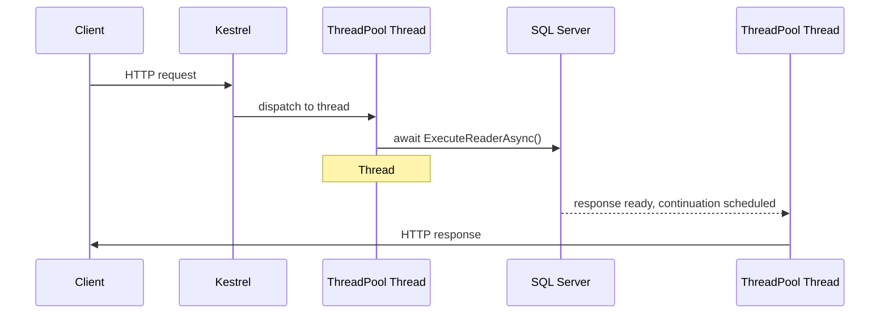

**Q: Why is wrapping CPU-bound work in Task.Run() inside an ASP.NET Core controller action a mild anti-pattern?**

A: It just moves work from one pool thread to another and adds scheduling/context-switch overhead — unlike WinForms/WPF, there's no dedicated UI thread being "freed." Prefer a truly async I/O API, or offload genuinely CPU-heavy work to a background worker/queue.

**Q: What does Kestrel use under the hood to dispatch work to the ThreadPool?**

A: I/O Completion Ports on Windows / epoll on Linux.

### Async Streams (IAsyncEnumerable\<T\>)

**Q: What problem do async streams (IAsyncEnumerable<T>) solve?**

A: They process data asynchronously as it arrives instead of materializing an entire collection first — useful for streaming large result sets or paging an API without buffering everything in memory, consumed via `await foreach`.

```csharp
public static async IAsyncEnumerable<int> GenerateNumbers()
{
    for (int i = 1; i <= 5; i++)
    {
        await Task.Delay(1000);
        yield return i;
    }
}

await foreach (var number in GenerateNumbers())
    Console.WriteLine(number);
```

### ConfigureAwait(false) and SynchronizationContext

**Q: What does SynchronizationContext capture, and where does it exist?**

A: "Where" a continuation after `await` should resume. UI frameworks (WPF, WinForms, older ASP.NET Framework/MVC) capture a context so continuations marshal back (e.g., to the UI thread). ASP.NET Core has no `SynchronizationContext` (removed since Core 1.0) — continuations resume on any ThreadPool thread.

**Q: What does ConfigureAwait(false) do, and where should you still use it in 2026?**

A: It tells the awaiter not to try to resume on the captured context, if one exists. In library code with no reason to know about a UI context, it's still good practice on every `await` (avoids context-marshal cost, avoids being a deadlock cause for a blocking caller). In pure ASP.NET Core application code it's largely unnecessary since there's no context to capture, though it's cheap insurance if the code might also run in a context-sensitive host.

```csharp
public async Task<string> GetDataAsync()
{
    var response = await _httpClient.GetAsync(url).ConfigureAwait(false);
    return await response.Content.ReadAsStringAsync().ConfigureAwait(false);
}
```

### The Classic Sync-Over-Async Deadlock

**Q: Explain the classic sync-over-async deadlock (.Result from a UI thread).**

A: The UI thread calls `.Result`, blocking itself until the async method finishes. Inside that method, after `await Task.Delay(...)`, the continuation is scheduled to resume on the captured `SynchronizationContext` (the UI thread) — but that thread is blocked on `.Result` and can never run the continuation. Deadlock.

```csharp
// WPF / WinForms / ASP.NET (classic, pre-Core) button click handler:
void Button_Click(object sender, EventArgs e)
{
    var result = GetDataAsync().Result;  // BLOCKS the UI thread, waiting for GetDataAsync to finish
}

async Task<string> GetDataAsync()
{
    await Task.Delay(1000);   // by default, captures the current SynchronizationContext
    return "done";            // this continuation needs to resume ON the UI thread
}
```

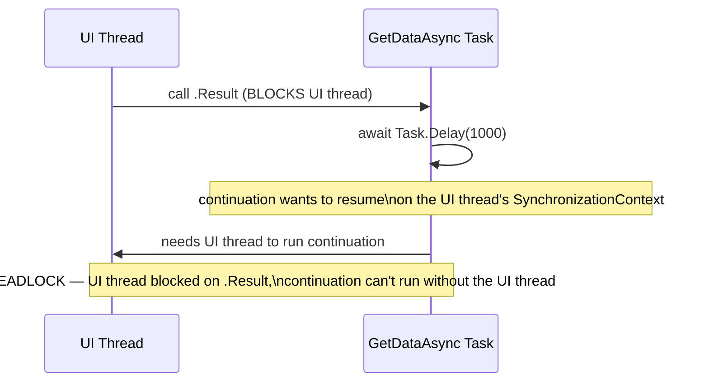

**Q: Does this deadlock happen in ASP.NET Core? What can still go wrong there?**

A: Not in the same way, since there's no `SynchronizationContext` to capture, so the continuation can run on any pool thread. It can still cause ThreadPool starvation under load (blocking a pool thread on `.Result` while its continuation needs another pool thread) — a related but distinct problem.

**Q: What are the fixes for sync-over-async deadlocks, in order of preference?**

A:
1. Await all the way up — make the caller `async` too.
2. If you must call async from sync code, use `ConfigureAwait(false)` throughout the chain so no continuation needs the original context.
3. `Task.Run(() => AsyncMethod()).Result` offloads to a pool thread with no captured context, sidestepping the specific deadlock (still blocking, still not ideal).

### async void — Why It's Dangerous

**Q: Why can't a caller catch exceptions thrown inside an async void method?**

A: There's no `Task` to observe — the exception is instead thrown directly on the `SynchronizationContext` active when the method started, typically crashing the process (or being silently swallowed depending on host) instead of propagating to a surrounding `try/catch`.

```csharp
async void ProcessOrder()  // DANGER
{
    await Task.Delay(100);
    throw new Exception("boom");
}
```

**Q: What's the one legitimate use case for async void, and how should it be handled?**

A: Top-level event handlers (e.g., WinForms/WPF `Button_Click`) whose void-returning signature is dictated by the framework. Even there, best practice is to delegate immediately to an `async Task` method and wrap it in `try/catch` internally.

**Q: Why does async void matter for test methods specifically?**

A: An `async void` test method silently passes even if an awaited call inside it throws, because the test runner never observes the exception — xUnit/NUnit test methods should always be `async Task`.

### Task vs ValueTask

**Q: Task<T> vs ValueTask<T> — structural difference and when to use ValueTask?**

A: `Task<T>` is a heap-allocated reference type — every call that doesn't hit a fast synchronous path allocates one. `ValueTask<T>` is a struct that can represent a synchronously-available result (zero allocation) or wrap an underlying `Task<T>`. Default to `Task<T>`; use `ValueTask` only on a proven hot path (e.g., a cache-hit path) where profiling shows the allocation matters.

```csharp
public ValueTask<int> GetCachedOrComputeAsync(int key)
{
    if (_cache.TryGetValue(key, out var value))
        return new ValueTask<int>(value);          // synchronous path — zero allocation

    return new ValueTask<int>(ComputeAsync(key));   // async path — wraps a Task<int>
}
```

**Q: What are ValueTask's restrictions that make it easy to misuse?**

A: It shouldn't be awaited more than once, `.Result` shouldn't be accessed before checking completion, and it shouldn't be cached/awaited later — its API surface is deliberately minimal; convert via `.AsTask()` if you need the richer `Task` API.

---

## Part IX — Data Access: ADO.NET

**Q: What is ADO.NET, and when would you choose it over an ORM?**

A: A low-level data-access framework for connections, SQL execution, transactions, and disconnected data — full control, faster/lighter than EF Core since there's no object tracking or LINQ-translation layer. Good for performance-critical hot paths, fine-grained microservices, and legacy systems.

**Q: Connected vs disconnected ADO.NET model?**

A: Connected: `Application → Connection → Command → DataReader → Database`, reading while the connection stays open. Disconnected: `Application → DataAdapter → DataSet/DataTable → Database`, loading into memory so the connection can close.

**Q: What's the modern SQL Server data provider, and what's legacy?**

A: `Microsoft.Data.SqlClient` is the current provider; the older `System.Data.SqlClient` is legacy/deprecated.

**Q: What is connection pooling, and what's the best practice?**

A: Enabled by default — connections are reused, not destroyed, on `Close()`/`Dispose()`. Best practice: "open late, close early" via `using`; leaked open connections exhaust the pool under load.

**Q: Contrast ExecuteReader, ExecuteNonQuery, and ExecuteScalar.**

A: `ExecuteReader()` returns a forward-only `SqlDataReader` for streaming large datasets (fastest for reads). `ExecuteNonQuery()` returns the affected row count for INSERT/UPDATE/DELETE. `ExecuteScalar()` returns a single value for aggregates/existence checks.

**Q: Why prefer explicit SqlDbType parameters over AddWithValue()?**

A: `AddWithValue` infers type/size from the .NET value, which can bloat the query-plan cache (slightly different inferred sizes produce different cached plans for logically the same query) and cause implicit-conversion index scans.

```csharp
cmd.Parameters.Add("@Id", SqlDbType.Int).Value = id;   // correct
// "SELECT * FROM Users WHERE Id=" + id                // WRONG — injection risk
```

**Q: List SQL isolation levels from least to most strict, and what each prevents.**

A:
- **Read Uncommitted** — nothing prevented; fastest, least safe.
- **Read Committed** — prevents dirty reads (SQL Server default).
- **Repeatable Read** — also prevents non-repeatable reads; holds read locks longer.
- **Serializable** — prevents dirty, non-repeatable, and phantom reads; slowest.
- **Snapshot** — prevents all three via row-versioning, with no blocking reads.

**Q: Do async ADO.NET calls (OpenAsync, ExecuteReaderAsync) reduce single-query latency?**

A: No — they improve throughput by freeing threads under concurrent load, not the latency of a single query.

**Q: ADO.NET vs Dapper vs EF Core — what's the decision framework?**

A: ADO.NET — no abstraction, fastest, lowest productivity — performance-critical hot paths. Dapper — micro-ORM, very fast (close to ADO.NET), medium productivity — high-performance apps that still want mapping convenience. EF Core — full ORM (LINQ, tracking, migrations), slower but improving, highest productivity — CRUD-heavy business apps. Default to EF Core; drop to Dapper/ADO.NET only where profiling shows it matters.

**Q: What are common ADO.NET pitfalls?**

A: Not understanding connection pooling; string-concatenated SQL (injection risk); leaked open connections; not disposing readers; ignoring async under concurrent load (ThreadPool starvation); overusing `DataSet` where a `DataReader` would do; not discussing isolation levels/transaction scope when asked.

**Q: Show a high-scale composite example combining a transaction, parameterized queries, and a CancellationToken.**

A: An async order-creation method that opens a connection, begins a transaction, reads the product with a parameterized `SELECT`, validates stock, inserts the order, updates stock, and commits — rolling back on any exception:

```csharp
public async Task<OrderResult> CreateOrderAsync(int productId, int quantity, CancellationToken token)
{
    using SqlConnection conn = new SqlConnection(_cs);
    await conn.OpenAsync(token);
    using SqlTransaction transaction = conn.BeginTransaction();
    try
    {
        var productCmd = new SqlCommand(
            "SELECT Id, Name, Price, Stock FROM Products WHERE Id = @ProductId", conn, transaction);
        productCmd.Parameters.Add("@ProductId", SqlDbType.Int).Value = productId;

        Product product = null;
        using (var reader = await productCmd.ExecuteReaderAsync(token))
            if (await reader.ReadAsync(token))
                product = new Product { Id = reader.GetInt32(0), Name = reader.GetString(1),
                                         Price = reader.GetDecimal(2), Stock = reader.GetInt32(3) };

        if (product == null) throw new Exception("Product not found");
        if (product.Stock < quantity) throw new Exception("Insufficient stock");

        var orderCmd = new SqlCommand(
            "INSERT INTO Orders(ProductId, Quantity, TotalAmount) OUTPUT INSERTED.Id " +
            "VALUES(@ProductId, @Qty, @Total)", conn, transaction);
        orderCmd.Parameters.Add("@ProductId", SqlDbType.Int).Value = productId;
        orderCmd.Parameters.Add("@Qty", SqlDbType.Int).Value = quantity;
        orderCmd.Parameters.Add("@Total", SqlDbType.Decimal).Value = product.Price * quantity;
        int orderId = (int)await orderCmd.ExecuteScalarAsync(token);

        var stockCmd = new SqlCommand(
            "UPDATE Products SET Stock = Stock - @Qty WHERE Id = @ProductId", conn, transaction);
        stockCmd.Parameters.Add("@Qty", SqlDbType.Int).Value = quantity;
        stockCmd.Parameters.Add("@ProductId", SqlDbType.Int).Value = productId;
        await stockCmd.ExecuteNonQueryAsync(token);

        transaction.Commit();
        return new OrderResult { OrderId = orderId, ProductName = product.Name, Quantity = quantity };
    }
    catch { transaction.Rollback(); throw; }
}
```

---

## Part X — Design Principles & Patterns

### SOLID Principles

**Q: Summarize SOLID with one C# example each.**

A:
- **SRP** — split a class doing both salary calculation and reporting into `SalaryCalculator` and `ReportGenerator`.
- **OCP** — replace an if/else payment-method chain with an `IPayment` interface and one class per method.
- **LSP** — a `Square : Rectangle` that forces `Width == Height` breaks the contract; model both independently via a `Shape` abstraction.
- **ISP** — split a fat `Worker { Work(); Eat(); }` into `IWorkable`/`IEatable` so a `Robot` only implements `IWorkable`.
- **DIP** — a `Computer` should depend on `IKeyboard`/`IMonitor` injected via constructor, not concrete classes.

### Dependency Injection (DI)

**Q: How does .NET's built-in DI container actually resolve dependencies?**

A: Service registration builds an interface→implementation map (`AddScoped`/`AddTransient`/`AddSingleton`). On resolution, the container inspects the requesting type's constructor via reflection, matches parameters to registered services, and recursively resolves dependencies — all at runtime, not compile time (the compiler doesn't rewrite your code for DI).

```csharp
public interface IService { void Serve(); }
public class MyService : IService { public void Serve() => Console.WriteLine("Serving..."); }
public class Client
{
    private readonly IService _service;
    public Client(IService service) { _service = service; }
}
```

Service registration builds the map:

```csharp
builder.Services.AddScoped<INotificationService, EmailService>();
builder.Services.AddScoped<ReportService>();
```

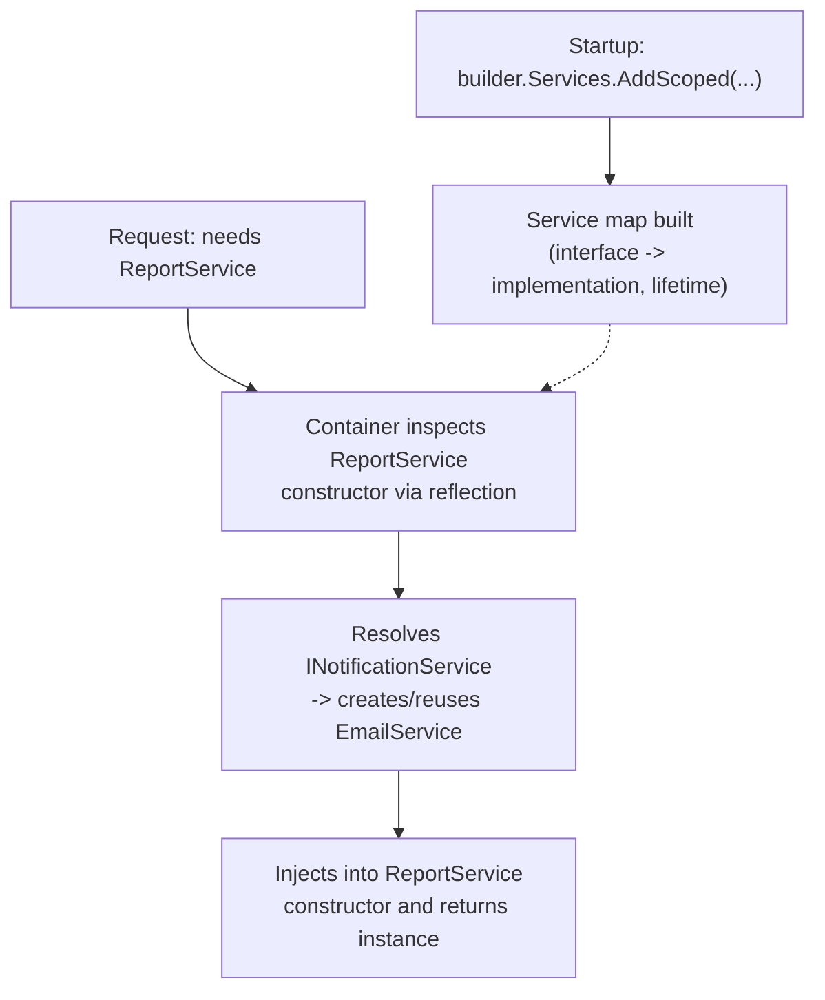

**Q: Contrast Transient, Scoped, and Singleton lifetimes.**

A: Transient — a new instance every time it's requested. Scoped — one instance per HTTP request/scope. Singleton — one instance for the whole application lifetime.

### Serialization & Deserialization

**Q: Why should you avoid BinaryFormatter/[Serializable] for untrusted data?**

A: It's obsolete and disabled by default in modern .NET due to deserialization-based remote-code-execution vulnerabilities — this is Microsoft's own guidance. `System.Text.Json` is the modern, explicit approach.

```csharp
string json = JsonSerializer.Serialize(myObject);
Person p = JsonSerializer.Deserialize<Person>(jsonString);
```

**Q: System.Text.Json vs Newtonsoft.Json in 2026?**

A: `System.Text.Json` is the modern default for new code (performance, native AOT support via source-generated `JsonSerializerContext`, eliminating reflection). `Newtonsoft.Json` remains common in older codebases and historically has had a richer feature set for some edge cases.

### AutoMapper

**Q: Why is AutoMapper controversial at senior level, and what's the alternative?**

A: Reflection-based mapping has a runtime cost; mapping bugs (wrong property matched, silently null) surface at runtime, not compile time; complex configurations become their own hard-to-debug DSL. Many senior teams prefer explicit manual mapping or a source-generated mapper (e.g., Mapperly) for compile-time-checked, allocation-free, IntelliSense-friendly mapping.

```csharp
var config = new MapperConfiguration(cfg => cfg.CreateMap<Person, PersonDTO>());
var mapper = config.CreateMapper();
```

### Architectural Patterns

**Q: Name common architectural patterns beyond MVC/MVVM.**

A: Command (encapsulates a request as an object, supports undo/redo); CQRS (separates reads/writes for scalability); Repository + Unit of Work (per-aggregate persistence abstraction + atomic multi-repo save); Mediator/MediatR (decouples senders from handlers, pairs with CQRS); Clean/Onion Architecture (concentric layers, dependencies point inward toward the Domain).

**Q: Would you build a generic repository layer over EF Core?**

A: It's often criticized as a redundant abstraction, since EF Core's `DbContext` already implements the Unit of Work pattern and provides querying/change-tracking — worth raising this nuance if asked.

### Microservices

**Q: What's the typical .NET microservices stack?**

A: ASP.NET Core + Docker + Kubernetes + an API Gateway, with messaging/gRPC/Saga patterns layered in (expanded in Part XVII).

### The Captive Dependency Problem

**Q: What is a captive dependency, and give an example.**

A: A longer-lived service (typically Singleton) that captures a shorter-lived (Scoped/Transient) dependency in its constructor, holding it far beyond its intended lifetime — e.g., a Singleton `CacheService` capturing a Scoped `AppDbContext`, making that `DbContext` instance a de facto singleton (thread-unsafe, stale state).

```csharp
public class CacheService  // registered as Singleton
{
    private readonly AppDbContext _db;  // Scoped — captured once, held forever!
    public CacheService(AppDbContext db) => _db = db;
}
```

**Q: How do you fix a captive dependency?**

A: Inject `IServiceScopeFactory` into the Singleton and create a new scope (resolving the scoped dependency fresh) each time it's needed, rather than capturing it in the constructor. The built-in DI container's scope validation (on by default in Development) also detects and throws on this.

```csharp
public class CacheService(IServiceScopeFactory scopeFactory)
{
    public async Task DoWorkAsync()
    {
        using var scope = scopeFactory.CreateScope();
        var db = scope.ServiceProvider.GetRequiredService<AppDbContext>();
        // use db safely within this scope's lifetime
    }
}
```

### Keyed DI Services (.NET 8+)

**Q: What do keyed DI services (.NET 8+) solve?**

A: Registering multiple implementations of the same interface distinguished by a key (`AddKeyedScoped<INotificationService, EmailService>("email")`), resolved via `[FromKeyedServices("email")]` — replaces the previous need for a factory delegate or a manual `Dictionary<string, IService>`.

```csharp
builder.Services.AddKeyedScoped<INotificationService, EmailService>("email");
builder.Services.AddKeyedScoped<INotificationService, SmsService>("sms");

public class OrderService([FromKeyedServices("email")] INotificationService notifier) { ... }
```

---

## Part XI — Cross-Cutting Concerns: Logging & Exceptions

**Q: What does ILogger<T> provide, and what are the built-in/common third-party providers?**

A: Structured logging with a category based on the class name. Built-in: Console, Debug, EventLog, Application Insights. Common third-party: Serilog, NLog.

```csharp
public class HomeController : ControllerBase
{
    private readonly ILogger<HomeController> _logger;
    public HomeController(ILogger<HomeController> logger) => _logger = logger;

    [HttpGet]
    public IActionResult Get()
    {
        _logger.LogInformation("HomeController: Get method called.");
        return Ok("Logging example");
    }
}
```

**Q: List the log levels from least to most severe.**

A: `Trace`, `Debug`, `Information`, `Warning`, `Error`, `Critical`.

**Q: Why is structured logging ({PlaceholderName}) preferred over string concatenation?**

A: It produces searchable, queryable, JSON-capable logs, preserving parameter values as structured fields instead of baking them into a flat string.

```csharp
_logger.LogInformation("User {UserId} with name {UserName} logged in.", userId, user);
```

Serilog for file/console sinks:

```csharp
Log.Logger = new LoggerConfiguration()
    .WriteTo.Console()
    .WriteTo.File("logs/log.txt", rollingInterval: RollingInterval.Day)
    .CreateLogger();
builder.Host.UseSerilog();
```

**Q: Why always pass the exception object to LogError, not just its message?**

A: So logging providers capture the full stack trace (`_logger.LogError(ex, "message")`), not just a text summary.

```csharp
catch (Exception ex) { _logger.LogError(ex, "An error occurred while processing the request."); }
```

**Q: What's the recommended exception-handling architecture, and when should local try/catch still be used?**

A: Prefer a single global exception-handling middleware for unhandled exceptions — keeps controllers/services clean, ensures consistent error responses, centralizes logging. Use local `try/catch` only when you can genuinely recover, provide a fallback, add meaningful context, or need cleanup.

**Q: What is IExceptionHandler (.NET 8+) and how does it improve on UseExceptionHandler middleware?**

A: A typed alternative where you implement `TryHandleAsync` and register multiple handlers in priority order — composes better than one large middleware lambda; returning `false` lets the next handler try. Pair with `ProblemDetails` (RFC 7807) as the standard error shape.

```csharp
public class ValidationExceptionHandler : IExceptionHandler
{
    public async ValueTask<bool> TryHandleAsync(HttpContext context, Exception exception, CancellationToken ct)
    {
        if (exception is not ValidationException ve) return false; // not handled — try next handler
        context.Response.StatusCode = StatusCodes.Status400BadRequest;
        await context.Response.WriteAsJsonAsync(new ProblemDetails { Title = "Validation failed", Detail = ve.Message }, ct);
        return true;
    }
}
// builder.Services.AddExceptionHandler<ValidationExceptionHandler>();
// app.UseExceptionHandler();
```

---

## Part XII — Modern C# Language Features (C# 9–14)

**Q: What are collection expressions (C# 12)?**

A: `int[] numbers = [1, 2, 3, 4, 5];` replaces `new int[] {...}`; they support a spread operator, e.g. `int[] combined = [..numbers, 6, 7];`.

```csharp
int[] numbers = [1, 2, 3, 4, 5];        // replaces new int[] {...}
List<string> names = ["Alice", "Bob"];
int[] combined = [..numbers, 6, 7];      // spread operator
```

**Q: What does the field keyword (C# 14) solve?**

A: Lets you add validation/logic to an auto-property accessor (`get => field; set => field = value?.Trim() ?? throw ...;`) without manually declaring a backing field — previously any guard logic meant giving up the auto-property entirely.

```csharp
public class Person
{
    public string Name
    {
        get => field;
        set => field = value?.Trim() ?? throw new ArgumentNullException(nameof(value));
    }
}
```

**Q: What are extension members (C# 14)?**

A: They extend the extension-method concept to extension properties, static extension members, and operators, e.g. `extension(string s) { public bool IsPalindrome => ...; }`.

```csharp
public static class StringExtensions
{
    extension(string s)
    {
        public bool IsPalindrome => s.SequenceEqual(s.Reverse());
    }
}
Console.WriteLine("level".IsPalindrome); // True
```

**Q: What are file-scoped namespaces and global usings (C# 10)?**

A: `namespace MyApp;` replaces the wrapping `{ }` block, reducing indentation. `global using System;` in one file (e.g. `GlobalUsings.cs`) applies project-wide, cutting repetitive `using` boilerplate.

**Q: What are top-level statements and minimal hosting (C# 9)?**

A: `Program.cs` no longer needs an explicit `Main` method or class wrapper; combined with `WebApplication.CreateBuilder(args)`, this is the modern minimal-hosting entry point, replacing the old `Startup.cs` + `Program.cs` split.

  ```csharp
  // Entire Program.cs, C# 9+ top-level statements + minimal hosting:
  var builder = WebApplication.CreateBuilder(args);
  builder.Services.AddControllers();
  var app = builder.Build();
  app.MapControllers();
  app.Run();
  ```

**Q: What are raw string literals (C# 11) for?**

A: Triple-quoted `"""..."""` strings for embedding JSON/regex/multi-line text without escaping.

---

## Part XIII — Minimal APIs, EF Core & Caching

### Minimal APIs vs Controllers

**Q: Minimal APIs vs MVC Controllers — how do you choose?**

A: Minimal APIs: very low boilerplate (lambda endpoints), best for microservices/small APIs/high-throughput endpoints, faster startup (less reflection), first-class Native AOT support. MVC Controllers: more boilerplate but better for large APIs, complex model binding, filter/versioning-heavy apps.

```csharp
app.MapGet("/products/{id}", async (int id, IProductService svc) => await svc.GetAsync(id))
   .Produces<Product>(200)
   .Produces(404);
```

**Q: How do you group minimal API endpoints for shared prefixes/policies/OpenAPI metadata?**

A: Use `MapGroup()` to create a group that shares a route prefix and can require authorization or share metadata across all its endpoints.

```csharp
var products = app.MapGroup("/products").RequireAuthorization();
products.MapGet("/", GetAllProducts);
products.MapPost("/", CreateProduct);
```

**Q: What does IEndpointFilter do for minimal APIs?**

A: Adds cross-cutting behavior (logging, validation, exception mapping) to minimal API endpoints, similar to MVC action filters — e.g. `.AddEndpointFilter<ValidationFilter<ProductDto>>()`.

```csharp
app.MapPost("/products", CreateProduct).AddEndpointFilter<ValidationFilter<ProductDto>>();
```

### EF Core Deep Dive

**Q: What is the N+1 query problem, and how do you fix it?**

A: Fetching a parent collection then triggering one additional query per row for related data (e.g., lazy-loading `o.Customer.Name` inside a foreach). Fix with eager loading (`Include()`), projection (`Select()` for only needed fields), or `AsSplitQuery()` for multiple `Include`s to avoid a cartesian-explosion join.

```csharp
// BAD — triggers N+1: one query for orders, then one query per order for Customer
var orders = context.Orders.ToList();
foreach (var o in orders) Console.WriteLine(o.Customer.Name); // lazy-loads per iteration

// GOOD — eager load with Include, single query with a JOIN
var orders = context.Orders.Include(o => o.Customer).ToList();

// GOOD — projection pulls only the fields you need
var summaries = context.Orders.Select(o => new { o.Id, CustomerName = o.Customer.Name }).ToList();
```

**Q: Tracking vs no-tracking queries in EF Core — when to use AsNoTracking()?**

A: Tracked queries (default) are needed when you'll modify and `SaveChanges()`. Use `AsNoTracking()` for any read-only query whose results won't be modified/saved — it's faster since EF Core skips change-tracking bookkeeping.

```csharp
var product = context.Products.First(p => p.Id == 1);  // tracked (default) — needed before SaveChanges()
product.Price = 10;
context.SaveChanges();

var products = context.Products.AsNoTracking().ToList(); // faster for read-only queries
```

**Q: What are EF Core migration best practices?**

A: Keep migrations small and reversible; never edit an already-applied migration (add a new one instead); review generated SQL before running against production; use `dotnet ef migrations script --idempotent` for CI/CD.

### Caching Strategies

**Q: Contrast IMemoryCache, IDistributedCache, HybridCache, and Output Caching.**

A: `IMemoryCache` — in-process, single server instance. `IDistributedCache` — shared across instances (Redis, SQL Server), e.g. session state behind a load balancer. `HybridCache` (.NET 9+) — combines in-memory L1 + distributed L2. Output Caching (middleware) — caches full HTTP responses for public GET endpoints.

**Q: What problem does HybridCache solve beyond unifying L1/L2?**

A: The cache-stampede problem — when many concurrent requests miss the cache for the same key at once, `HybridCache` lets only one recompute the value while the rest wait for that result.

```csharp
builder.Services.AddHybridCache();

public class ProductService(HybridCache cache, IRepository repo)
{
    public async Task<Product> GetAsync(int id) =>
        await cache.GetOrCreateAsync($"product:{id}",
            async token => await repo.GetProductAsync(id),
            new HybridCacheEntryOptions { Expiration = TimeSpan.FromMinutes(10) });
}
```

**Q: How do you set up output caching middleware and a distributed Redis cache?**

A: Output caching middleware caches the entire rendered HTTP response via policies; `AddStackExchangeRedisCache` wires up Redis as an `IDistributedCache` implementation.

```csharp
builder.Services.AddOutputCache(options =>
    options.AddPolicy("Products", b => b.Expire(TimeSpan.FromSeconds(30)).Tag("products")));
app.UseOutputCache();
app.MapGet("/products", GetProducts).CacheOutput("Products");
```

```csharp
builder.Services.AddStackExchangeRedisCache(options =>
    options.Configuration = builder.Configuration["Redis:ConnectionString"]);
```

**Q: What should a strong answer to "design a caching strategy for a product catalog API" cover?**

A: Cache-aside pattern (check cache → fall back to DB on miss → populate cache), sensible TTLs vs explicit invalidation on writes, stampede protection (`HybridCache` or a distributed lock), and cache-key design that avoids collisions across tenants/versions.

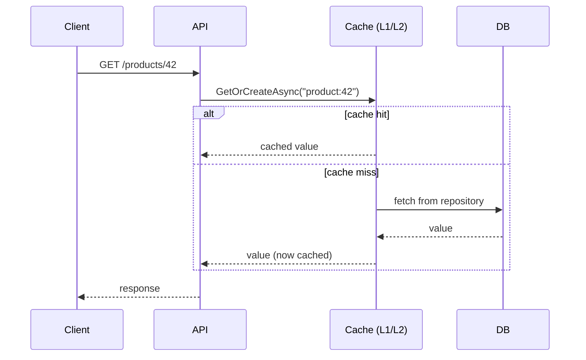

---

## Part XIV — Resilience, Auth & Security

### Resilience & Rate Limiting

**Q: What are the four common rate-limiting algorithms in .NET 7+'s built-in middleware?**

A: Fixed Window (N requests per fixed window — simple quota); Sliding Window (smooths bursts at window boundaries); Token Bucket (tokens refill over time, allows bursts up to bucket size); Concurrency Limiter (caps simultaneous in-flight requests).

```csharp
builder.Services.AddRateLimiter(options =>
    options.AddFixedWindowLimiter("fixed", opt => { opt.Window = TimeSpan.FromSeconds(10); opt.PermitLimit = 5; opt.QueueLimit = 2; }));
app.UseRateLimiter();
app.MapGet("/products", GetProducts).RequireRateLimiting("fixed");
```

**Q: What do Polly's Retry, Circuit Breaker, Timeout, and Bulkhead policies each do?**

A: Retry — re-attempts a failed call, ideally with exponential backoff + jitter. Circuit Breaker — after a failure threshold, stops calling the downstream service for a cooldown, failing fast. Timeout — bounds how long a call can hang. Bulkhead — isolates resource pools so one failing dependency can't exhaust resources needed elsewhere.

```csharp
builder.Services.AddHttpClient<PaymentClient>()
    .AddResilienceHandler("payment-pipeline", b =>
    {
        b.AddRetry(new RetryStrategyOptions { MaxRetryAttempts = 3, BackoffType = DelayBackoffType.Exponential });
        b.AddCircuitBreaker(new CircuitBreakerStrategyOptions { FailureRatio = 0.5, MinimumThroughput = 10 });
        b.AddTimeout(TimeSpan.FromSeconds(5));
    });
```

**Q: Why combine retry with a circuit breaker instead of retrying forever?**

A: Retrying against a genuinely down/overloaded service makes the outage worse; a circuit breaker lets the system fail fast and recover on its own schedule.

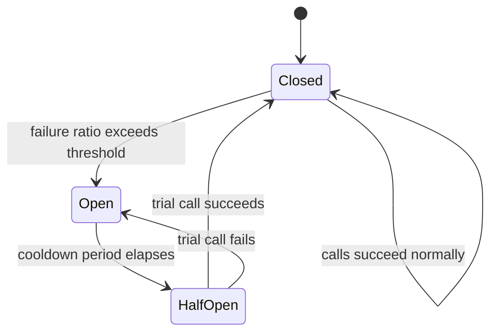

**Q: How do you make a POST endpoint safe to retry (idempotency)?**

A: The client sends an `Idempotency-Key` header; the server persists a mapping of key → result and short-circuits duplicate requests within a time window.

### Authentication & Authorization

**Q: Why is JWT Bearer auth a good fit for APIs consumed by SPA/mobile clients?**

A: It's stateless (no server-side session store) and scales horizontally, traveling naturally via an `Authorization: Bearer` header.

```csharp
builder.Services.AddAuthentication(JwtBearerDefaults.AuthenticationScheme)
    .AddJwtBearer(options => options.TokenValidationParameters = new TokenValidationParameters
    {
        ValidateIssuer = true, ValidateAudience = true, ValidateLifetime = true, ValidateIssuerSigningKey = true,
        ValidIssuer = config["Jwt:Issuer"], ValidAudience = config["Jwt:Audience"],
        IssuerSigningKey = new SymmetricSecurityKey(Encoding.UTF8.GetBytes(config["Jwt:Key"]))
    });
builder.Services.AddAuthorization();
app.UseAuthentication();
app.UseAuthorization();
```

**Q: OAuth2 vs OpenID Connect?**

A: OAuth2 is an authorization framework (who can access what); OIDC is an identity layer on top of it (who the user is). Most full-stack .NET apps delegate to an external identity provider (Entra ID, Auth0, Keycloak, Duende IdentityServer) rather than rolling their own login.

**Q: Contrast Authorization Code + PKCE, Client Credentials, and Refresh Token grants.**

A: Authorization Code + PKCE — SPA/mobile apps (the modern default; avoid the deprecated Implicit flow). Client Credentials — service-to-service, no user involved. Refresh Token — silently renews an access token without re-prompting login.

**Q: Why is claims/policy-based authorization preferred over hardcoded role checks?**

A: It decouples "what a user can do" from "what role they happen to have," scaling far better as permission models grow beyond a handful of roles (`RequireClaim("permission", "products.edit")`).

```csharp
builder.Services.AddAuthorization(options =>
    options.AddPolicy("CanEditProducts", policy => policy.RequireClaim("permission", "products.edit")));

[Authorize(Policy = "CanEditProducts")]
[HttpPut("{id}")]
public IActionResult Update(int id, ProductDto dto) { /* ... */ }
```

**Q: What are other key security topics to be ready for?**

A: CORS must be explicitly configured for any cross-origin SPA; CSRF mainly matters for cookie-based auth (JWT in an Authorization header is inherently less exposed, but cookie-authenticated form posts still need antiforgery tokens); the Data Protection API is ASP.NET Core's built-in key-management for encrypting cookies/tokens at rest; never store secrets in `appsettings.json` in source control — use User Secrets locally and Key Vault/Secrets Manager/environment variables in production.

---

## Part XV — Performance & Low-Allocation Programming

**Q: What is Span<T>, and why can't it be used in async methods?**

A: A stack-only, allocation-free view over contiguous memory (array/string/stackalloc), enabling slicing without copying. It's a `ref struct`, so it can't be used inside async methods or stored as a field — `Memory<T>` is the heap-friendly counterpart usable across async boundaries.

```csharp
ReadOnlySpan<char> text = "Hello, World!";
ReadOnlySpan<char> hello = text.Slice(0, 5);      // no allocation — a view, not a copy

Span<int> numbers = stackalloc int[5];             // stack-allocated, zero heap allocation
for (int i = 0; i < numbers.Length; i++) numbers[i] = i * i;
```

**Q: What does ArrayPool<T> solve?**

A: Renting/returning arrays from a shared pool instead of allocating/discarding on every call — common in high-throughput networking/serialization (Kestrel uses it internally): `ArrayPool<byte>.Shared.Rent(1024)` / `.Return(buffer)`.

```csharp
byte[] buffer = ArrayPool<byte>.Shared.Rent(1024);
try { /* use buffer */ } finally { ArrayPool<byte>.Shared.Return(buffer); }
```

**Q: What does string.Create() do?**

A: Writes directly into a destination buffer, avoiding intermediate allocations for programmatic string construction.

**Q: Why use record struct/plain struct for small hot-path objects like Money or Point?**

A: It keeps them off the heap entirely, avoiding GC pressure in hot loops, since they're small, frequently-created, and short-lived.

**Q: What is BenchmarkDotNet used for, and why does a strong senior answer mention it?**

A: The de-facto micro-benchmarking library for .NET — a strong "how would you make this faster" answer measures before/after with it rather than trusting intuition.

```csharp
[MemoryDiagnoser]
public class StringBenchmarks
{
    [Benchmark(Baseline = true)]
    public string Concat() => "a" + "b" + "c";

    [Benchmark]
    public string StringBuilderVersion() => new StringBuilder().Append("a").Append("b").Append("c").ToString();
}
```

**Q: What is Native AOT, and what are its trade-offs?**

A: Compiles straight to native machine code ahead of time — no JIT warm-up, smaller memory footprint, sub-50ms startup in many cases. Trade-offs: no runtime reflection-based dynamic code generation (needs source-generator alternatives), and some older libraries aren't fully AOT-compatible yet. Best for containers, serverless functions, and CLI tools where cold-start latency matters.

---

## Part XVI — Advanced Concurrency Primitives

### Low-Level Concurrency Primitives: Monitor, SpinLock, False Sharing, Thread-Pool Starvation

**Q: What does lock actually compile down to?**

A: Syntactic sugar over `Monitor.Enter(_lockObj, ref lockTaken)` in a try block and `Monitor.Exit(_lockObj)` in a finally block, operating on the lock object's sync block (part of the object header) — which is why the lock object must be a reference type, and why locking on a boxed value, an interned string literal, or `this` in a public class are classic mistakes.

```csharp
lock (_lockObj)
{
    // critical section
}

// is (approximately) equivalent to:
bool lockTaken = false;
try
{
    Monitor.Enter(_lockObj, ref lockTaken);
    // critical section
}
finally
{
    if (lockTaken) Monitor.Exit(_lockObj);
}
```

**Q: What are Monitor.Wait/Pulse/PulseAll used for?**

A: Lower-level, condition-variable-style signaling: a thread calls `Wait()` to release the lock and block until signaled; another thread holding the lock calls `Pulse()`/`PulseAll()` to wake one/all waiters — the mechanism underneath some producer-consumer patterns that predate `BlockingCollection`/`Channels`.

**Q: When (rarely) would you use SpinLock/SpinWait instead of lock/Monitor?**

A: Only for a very short critical section where the expected wait is brief enough that busy-waiting costs less than a full context switch (on the order of microseconds). Reaching for them in typical application code is almost always premature optimization — `lock`/`Monitor` is correct by default.

```csharp
private SpinLock _spinLock = new SpinLock();

bool lockTaken = false;
try
{
    _spinLock.Enter(ref lockTaken);
    // extremely short critical section — a few instructions, not a DB call
}
finally
{
    if (lockTaken) _spinLock.Exit();
}
```

**Q: What is false sharing / cache-line contention?**

A: When two unrelated fields used by different threads land on the same CPU cache line (commonly 64 bytes), writes to one field invalidate the whole line for every core touching it, causing a confusing performance cliff even though the threads aren't logically sharing data. Fix: pad fields onto separate cache lines (e.g., `[StructLayout(LayoutKind.Explicit)]` with `FieldOffset` spacing).

```csharp
// Naive: Counter1 and Counter2 likely share a cache line — a thread hammering
// Counter1 forces cache invalidation that also stalls a thread hammering Counter2.
public class Counters
{
    public long Counter1;
    public long Counter2;
}

// Fixed: pad so each counter gets its own cache line (64 bytes is the common line size).
[StructLayout(LayoutKind.Explicit, Size = 128)]
public struct PaddedCounters
{
    [FieldOffset(0)]  public long Counter1;
    [FieldOffset(64)] public long Counter2;
}
```

**Q: What are the symptoms and root cause of ThreadPool starvation?**

A: Symptoms: request/task latency climbs while CPU usage looks low. Root cause: almost always blocking calls on pool threads (`.Result`/`.Wait()` on async code, `Task.Run` wrapping something that blocks, or a `LongRunning` workload mistakenly run as a plain pooled task) combined with the pool's slow, deliberate thread-count ramp-up.

**Q: Is ThreadPool.SetMinThreads a fix for ThreadPool starvation?**

A: No — it's a band-aid that raises the minimum thread count so the pool starts closer to demand, but the actual fix is removing the blocking calls that are starving the pool.

  ```csharp
  ThreadPool.SetMinThreads(workerThreads: 200, completionPortThreads: 200);
  ```

**Q: SemaphoreSlim vs lock — why use SemaphoreSlim?**

A: `SemaphoreSlim` supports async/await (`WaitAsync`) and allows more than one caller through at once (a configurable max count) — `lock` is synchronous-only and single-entrant.

```csharp
private static readonly SemaphoreSlim _semaphore = new(maxCount: 3);
async Task CallDownstreamAsync()
{
    await _semaphore.WaitAsync();
    try { await CallApiAsync(); } finally { _semaphore.Release(); }
}
```

**Q: When is ReaderWriterLockSlim better than a plain lock?**

A: For read-heavy shared state (e.g., an in-memory cache with occasional writes) — it allows many concurrent readers or one exclusive writer, instead of serializing all access like a plain `lock`.

**Q: What does Interlocked provide, and how does volatile differ?**

A: `Interlocked` gives lock-free atomic operations (`Increment`, `Decrement`, `CompareExchange`) — cheaper than a full `lock` for simple counters/flags. `volatile` prevents per-core caching from hiding updates to a field from other threads; rarely needed directly since most synchronization goes through higher-level primitives, but still asked about conceptually.

```csharp
private static int _counter;
Interlocked.Increment(ref _counter);   // atomic increment, no lock needed

private volatile bool _isRunning;      // prevents per-core caching from hiding updates from other threads
```

**Q: Name the key concurrent collections and their use cases.**

A: `ConcurrentDictionary<TKey,TValue>` — thread-safe cache without manual locking. `ConcurrentQueue<T>`/`ConcurrentStack<T>` — thread-safe FIFO/LIFO producer-consumer buffers. `BlockingCollection<T>` — bounded producer-consumer with blocking `Add`/`Take`.

**Q: What is System.Threading.Channels, and what does it replace?**

A: A modern, high-performance async producer-consumer pipeline (`Channel.CreateUnbounded<T>()`, `Writer.WriteAsync`/`Reader.ReadAllAsync`), replacing older `BlockingCollection`-based patterns — common for a `BackgroundService` reading work items populated by an API endpoint.

```csharp
var channel = Channel.CreateUnbounded<int>();
await channel.Writer.WriteAsync(42);         // producer
channel.Writer.Complete();
await foreach (var item in channel.Reader.ReadAllAsync()) Console.WriteLine(item); // consumer
```

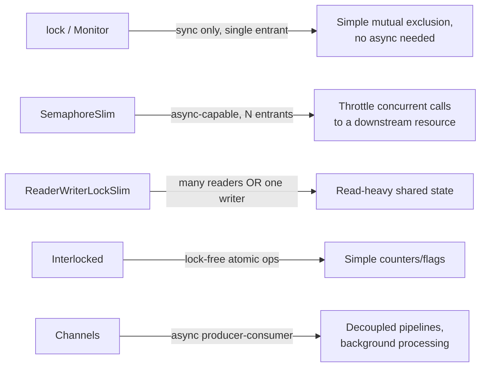

---

## Part XVII — Microservices, Messaging & CQRS

**Q: REST/OpenAPI vs gRPC — when would you choose each?**

A: REST/OpenAPI: HTTP/1.1, JSON, good performance, loose/optional contract, native browser support — best for public APIs/browser clients. gRPC: HTTP/2, binary Protobuf, faster with smaller payloads and first-class bidirectional streaming, strict `.proto` contract — best for internal service-to-service calls needing low latency (needs grpc-web/a proxy for browsers).

**Q: RabbitMQ vs Kafka vs Azure Service Bus?**

A: RabbitMQ — traditional AMQP message queue for task queues/routing. Kafka — distributed log/event streaming for high-throughput, replayable event history. Azure Service Bus — managed queue/topic service for enterprise .NET-native messaging with dead-lettering/sessions.

**Q: Queue vs topic/pub-sub messaging model?**

A: A queue delivers a message to one consumer, then removes it. A topic/pub-sub delivers the message to every subscriber — e.g. `OrderPlaced` fanning out to Inventory and Shipping services independently.

**Q: How does CQRS with MediatR structure a use case?**

A: A command/query record (e.g. `CreateOrderCommand : IRequest<int>`) is handled by a dedicated `IRequestHandler<TCommand,TResult>`, dispatched via `mediator.Send(...)` — keeps controllers thin, isolates each use case in a testable handler, and `IPipelineBehavior<>` gives a clean place for cross-cutting concerns like validation/logging/transactions.

```csharp
public record CreateOrderCommand(int ProductId, int Quantity) : IRequest<int>;

public class CreateOrderHandler : IRequestHandler<CreateOrderCommand, int>
{
    public async Task<int> Handle(CreateOrderCommand request, CancellationToken ct)
    {
        // validate, persist, publish domain event...
        return newOrderId;
    }
}
// var orderId = await mediator.Send(new CreateOrderCommand(productId, quantity));
```

**Q: What problem does the Saga pattern solve, and what are its two styles?**

A: Since microservices can't share one ACID transaction, a Saga coordinates a sequence of local transactions with compensating actions if a later step fails (e.g., release an inventory reservation if payment fails). Orchestration uses a central coordinator; Choreography has each service react to others' events with no central coordinator (harder to trace end-to-end).

**Q: Define the key DDD vocabulary terms.**

A: Entity (identity persists across state changes); Value Object (defined entirely by its values, no identity — a natural fit for `record`/`record struct`); Aggregate (a cluster of entities/value objects with one consistency boundary and a single Aggregate Root); Bounded Context (the boundary within which a specific model/vocabulary is valid, often maps 1:1 to a microservice); Domain Event (something that happened that other parts of the system may care about, e.g. `OrderPlaced`).

---

## Part XVIII — Observability, Testing & Full-Stack Integration

### Observability & Health Checks

**Q: What are the "three pillars" of observability, and what does OpenTelemetry provide?**

A: Logs, traces, and metrics. OpenTelemetry is the current vendor-neutral standard for collecting all three and exporting to a backend (Azure Monitor, Jaeger, Prometheus/Grafana, Datadog); distributed tracing propagates a trace/correlation ID across service boundaries so a single request can be followed end-to-end.

```csharp
builder.Services.AddOpenTelemetry()
    .WithTracing(t => t.AddAspNetCoreInstrumentation().AddHttpClientInstrumentation().AddSource("MyApp").AddOtlpExporter())
    .WithMetrics(m => m.AddAspNetCoreInstrumentation().AddRuntimeInstrumentation());
```

**Q: What's the difference between readiness and liveness health checks?**

A: Readiness — should this instance receive traffic right now? Liveness — should this instance be restarted? Kubernetes/load balancers poll a health endpoint (`app.MapHealthChecks("/health")`) to decide both.

```csharp
builder.Services.AddHealthChecks().AddSqlServer(connectionString).AddCheck<RedisHealthCheck>("redis");
app.MapHealthChecks("/health");
```

### Testing Strategy

**Q: What does each testing layer cover, and what tooling is typical?**

A: Unit tests (xUnit/NUnit + Moq/NSubstitute) — business logic in isolation, mocked dependencies. Integration tests (`WebApplicationFactory<T>`, Testcontainers) — API + real/containerized DB/cache together. E2E/UI tests (Playwright, Selenium) — full user flows through the actual frontend.

```csharp
public class OrderServiceTests
{
    [Fact]
    public async Task CreateOrder_Should_Throw_When_Stock_Is_Insufficient()
    {
        var repoMock = new Mock<IProductRepository>();
        repoMock.Setup(r => r.GetAsync(1)).ReturnsAsync(new Product { Id = 1, Stock = 0 });
        var service = new OrderService(repoMock.Object);

        await Assert.ThrowsAsync<InsufficientStockException>(
            () => service.CreateOrderAsync(productId: 1, quantity: 1));
    }
}

public class ProductsApiTests : IClassFixture<WebApplicationFactory<Program>>
{
    private readonly HttpClient _client;
    public ProductsApiTests(WebApplicationFactory<Program> factory) => _client = factory.CreateClient();

    [Fact]
    public async Task Get_Products_Returns_Ok()
    {
        var response = await _client.GetAsync("/products");
        response.EnsureSuccessStatusCode();
    }
}
```

**Q: What does Testcontainers give you that a shared test environment doesn't?**

A: A real, disposable DB/Redis instance spun up in Docker per test run, giving integration tests real fidelity without a shared, stateful (and flaky) test environment.

**Q: What are the key testing philosophy talking points?**

A: Mock at architectural boundaries (repositories, external HTTP clients), not internal implementation details, or tests become brittle to refactors; prefer testing behavior/outcomes over exact internal calls; use AAA structure (Arrange, Act, Assert); always use `async Task` (never `async void`) in test methods so the runner observes thrown exceptions.

### Full-Stack Integration

**Q: What does SignalR abstract, and how is a hub used?**

A: WebSockets with SSE/long-polling fallbacks for real-time bidirectional communication; a `Hub` class exposes server methods clients can call and can push to clients via `Clients.All.SendAsync(...)`.

```csharp
public class NotificationHub : Hub
{
    public async Task SendMessage(string user, string message) =>
        await Clients.All.SendAsync("ReceiveMessage", user, message);
}
// app.MapHub<NotificationHub>("/hubs/notifications");
```

**Q: Contrast the three Blazor hosting models.**

A: Blazor Server — code runs server-side, UI pushed over SignalR (small download, needs a persistent connection). Blazor WebAssembly — runs in-browser via WASM (true client-side C#, works offline, larger initial download). Blazor Hybrid/MAUI — native app shell hosting a Blazor UI, sharing code across web and native.

**Q: What is a Backend-for-Frontend (BFF), and why use one?**

A: A dedicated backend layer tailored to a specific frontend's needs — aggregates calls to multiple downstream microservices, handles auth token exchange, and shapes responses exactly as the SPA needs, so the browser never talks directly to internal services.

**Q: Why does a React app on localhost:3000 fail to call an API on localhost:5001, and how do you fix it?**

A: The same-origin policy blocks cross-origin requests by default; the API must explicitly opt in specific origins via CORS middleware (`AddCors`/`UseCors`).

```csharp
builder.Services.AddCors(options => options.AddPolicy("SpaPolicy",
    p => p.WithOrigins("https://myapp.com").AllowAnyHeader().AllowAnyMethod().AllowCredentials()));
app.UseCors("SpaPolicy");
```

### What's Different About Senior-Level Interviews

**Q: What distinguishes senior-level .NET interviews from junior ones?**

A: Less "define X" trivia, more scenario-based reasoning (design a rate limiter/notification service, debug a production memory leak); heavier weight on production experience and architectural judgment; a weak "it depends" answer needs a decision framework plus a default recommendation; expect "why not X instead?" probing on nearly every answer.

---

## Part XIX — Swagger / OpenAPI & API Documentation

**Q: OpenAPI vs Swagger — what's the relationship?**

A: OpenAPI Specification (OAS) is the standard machine-readable API-contract format (JSON/YAML). Swagger is the tooling ecosystem built around it (Swagger UI, Editor, Codegen) — Swagger implements OpenAPI.

**Q: How do you wire up Swagger (Swashbuckle) in an ASP.NET Core app?**

A: `AddEndpointsApiExplorer()` + `AddSwaggerGen()` at registration, then `UseSwagger()` + `UseSwaggerUI()` in the pipeline, exposing the UI at `/swagger`.

```csharp
// dotnet add package Swashbuckle.AspNetCore
builder.Services.AddEndpointsApiExplorer();
builder.Services.AddSwaggerGen();
app.UseSwagger();
app.UseSwaggerUI();     // https://localhost:5001/swagger
```

**Q: What are the two parts needed to get a working "Authorize" JWT button in Swagger UI?**

A: A security definition (declares the Bearer scheme exists — the Authorize button) and a security requirement (declares which operations require it — the padlocks). A common pitfall is wiring JWT into auth middleware but forgetting the OpenAPI security scheme.

```csharp
builder.Services.AddSwaggerGen(options =>
{
    options.AddSecurityDefinition("Bearer", new OpenApiSecurityScheme
    {
        Name = "Authorization", Type = SecuritySchemeType.Http, Scheme = "bearer", BearerFormat = "JWT",
        In = ParameterLocation.Header, Description = "Enter your JWT token (without the 'Bearer' prefix)."
    });
    options.AddSecurityRequirement(new OpenApiSecurityRequirement
    {
        { new OpenApiSecurityScheme { Reference = new OpenApiReference { Type = ReferenceType.SecurityScheme, Id = "Bearer" } },
          Array.Empty<string>() }
    });
});
```

**Q: What changed with Swagger/OpenAPI defaults starting in .NET 9?**

A: Swashbuckle was dropped as the default dependency, replaced by the built-in `Microsoft.AspNetCore.OpenApi` (document generation only, no UI shipped) — driven by Swashbuckle's maintenance gaps and Native AOT incompatibility (reflection-heavy). .NET 10's built-in generator emits OpenAPI 3.1 by default. Swashbuckle remains an actively maintained package you can add manually.

```csharp
builder.Services.AddOpenApi();     // register generation only — no UI shipped
var app = builder.Build();
app.MapOpenApi();                  // serves /openapi/v1.json
```

**Q: What UI options exist once you're on the built-in OpenAPI generator (no bundled UI)?**

A: Swagger UI (classic, points at the JSON doc), Scalar (modern UI, dark mode, multi-language snippets via `MapScalarApiReference()`), NSwag (client SDK generation), ReDoc (clean read-only reference docs).

**Q: What are the top-level elements of an OpenAPI document?**

A: `openapi` (spec version), `info`, `servers`, `paths`, `components` (reusable schemas/responses/parameters/securitySchemes via `$ref`), `security` (global requirements), `tags` (UI grouping). OpenAPI 3.1 aligns with JSON Schema 2020-12, adds webhooks, and expresses nullability as `type: [string, null]` instead of 3.0's `nullable: true`.

**Q: What are the common API-versioning strategies?**

A: URL path (`/api/v1/products`), query string (`?api-version=1.0`), header (`api-version: 1.0`), or media type (`Accept: application/json;v=1.0`) — `Asp.Versioning.Mvc` plus the API explorer exposes a Swagger doc per version. Never make breaking changes to an existing version; ship a new version instead.

**Q: What's the recommended shape for API error responses, and how do you document them?**

A: `ProblemDetails` (RFC 7807) instead of anonymous/dynamic objects (which produce no usable schema), documented via `[ProducesResponseType(typeof(ProblemDetails), StatusCodes.Status404NotFound)]`; enable `GenerateDocumentationFile` and feed the XML comments into the generator for `<summary>`/`<param>` text in the UI.

```csharp
[ProducesResponseType(typeof(Product), StatusCodes.Status200OK)]
[ProducesResponseType(typeof(ProblemDetails), StatusCodes.Status404NotFound)]
public async Task<IActionResult> Get(int id) { /* ... */ }
```

**Q: Code-first vs contract-first API design?**

A: Code-first is fast but the doc can lag actual intent; contract-first is better for parallel teams/public APIs since the contract is the agreed source of truth.

**Q: How do you secure a Swagger/OpenAPI endpoint in production?**

A: Serve the spec/UI only in Development (or behind a toggle); if exposed, gate behind auth (e.g. an admin policy) and/or network restriction (IP allow-list, VPN, internal-only ingress); for internal APIs, consider serving only the raw JSON with no UI (a public UI is free reconnaissance); never leak secrets/sample tokens in examples.

**Q: What is API linting, and what tools support it?**

A: Validating an OpenAPI document against style/consistency rules (naming conventions, required fields, forbidden patterns) using tools like Spectral, catching contract problems in CI before they reach consumers.

**Q: What do mock-server-generation tools like Prism/WireMock do?**

A: Spin up a working mock HTTP server directly from an OpenAPI document, letting frontend teams build against a contract before the real backend exists.

**Q: What is AsyncAPI, and when would you mention it?**

A: A sibling spec to OpenAPI purpose-built for describing event-driven/async APIs (message queues, WebSockets, Kafka topics) where OpenAPI's request/response model doesn't fit — worth naming alongside OpenAPI in a microservices-messaging discussion.

**Q: What are safe schema-evolution practices for an API contract?**

A: Favor additive-only changes (new optional fields) over removing/renaming fields; mark fields `deprecated: true` before removal; never change a field's type or make an optional field required without a new API version; consider consumer-driven contract testing (e.g., Pact) to catch breaking changes before they ship.

---

## Part XX — Terminology Reference

**Q: Distinguish Library, DLL, EXE, Framework/SDK, and Package.**

A: Library — reusable code, doesn't run alone (e.g. `System.Collections`). DLL — a compiled library binary. EXE — a runnable executable application. Framework/SDK — libraries + runtime, with the SDK adding tooling (compilers, templates, CLI) — needs an app to run. Package — the NuGet distribution format (`.nupkg`).

**Q: Managed vs unmanaged code/resources?**

A: Managed code is written in a .NET language, compiled to MSIL, and runs under CLR supervision (memory management, type safety, security). Unmanaged resources (file handles, DB connections, sockets, native memory) live outside CLR control and must be released explicitly via `Dispose()`.

---

## Best Practices Checklist

**Q: What are the core OOP/design best practices from this guide?**

A: Favor composition over inheritance and keep hierarchies shallow; start with an interface, reach for an abstract class only when shared state/behavior is genuinely needed; keep constructors lightweight (no I/O/DB calls), validate arguments early, and prefer immutability.

**Q: What equality/EF Core best practices should you remember?**

A: Override `Equals()` and `GetHashCode()` together, never one without the other; prefer `AsNoTracking()` for read-only EF Core queries and eager-load with `Include()` to avoid N+1; keep EF Core migrations small, reversible, and reviewed before running against production.

**Q: What async best practices does the guide emphasize?**

A: Prefer `Task` by default, reaching for `ValueTask` only with profiling evidence; always use `async Task`, never `async void` except for framework-mandated event handlers; use `ConfigureAwait(false)` in shared library code (largely optional in ASP.NET Core application code).

**Q: What cross-cutting/API best practices are recommended?**

A: Use a global exception-handling middleware/`IExceptionHandler` instead of scattered `try/catch`; expose events, not raw delegates, from reusable APIs; use structured logging over string concatenation; prefer `ProblemDetails` (RFC 7807) for API error responses.

**Q: What operational/security best practices round out the checklist?**

A: Never store secrets in source control (User Secrets locally, Key Vault/Secrets Manager in production); combine retry with a circuit breaker for downstream calls, never retry indefinitely; benchmark before/after any performance change with BenchmarkDotNet rather than trusting intuition.

---

## Common Pitfalls Checklist

**Q: What are the top async-related pitfalls to avoid?**

A: Blocking on async code with `.Result`/`.Wait()` from a context that captures a `SynchronizationContext` (deadlock); `async void` swallowing exceptions silently, including in test methods; disposing/recreating `HttpClient` per request instead of using `IHttpClientFactory`.

**Q: What are the top DI/EF Core/LINQ pitfalls to avoid?**

A: Singleton services capturing Scoped/Transient dependencies (captive dependency); multiple enumeration of the same `IQueryable`/lazily-evaluated `IEnumerable`; materializing (`.ToList()`) an `IQueryable` before applying further filters, forcing client-side evaluation.

**Q: What other common pitfalls round out the checklist?**

A: String-concatenated SQL or `AddWithValue` overuse (injection risk and plan-cache bloat); un-unsubscribed event handlers leaking memory; overusing `dynamic`/reflection where a source generator or static typing would do; exposing Swagger/OpenAPI UI in production without restricting access; treating `GC.Collect()` as a routine performance tool.

---

## Sample Interview Q&A (Rapid Fire)

**Q: What's the difference between a record and a class?**

A: Records give value-based equality and `ToString()` for free, and support non-destructive mutation via `with` expressions; classes have reference equality and are mutable by default. Use records for DTOs/domain value objects; use `record struct` for small, allocation-sensitive value types.

**Q: Why does .Result sometimes deadlock and sometimes not?**

A: It deadlocks when the calling thread blocks on `.Result` while the awaited method's continuation needs to resume on a `SynchronizationContext` captured by that same thread (classic in WPF/WinForms/old ASP.NET). ASP.NET Core has no `SynchronizationContext`, so this specific deadlock doesn't occur there — though blocking on `.Result` under load can still starve the ThreadPool.

**Q: When would you use ValueTask instead of Task?**

A: Only on a proven hot path where results are frequently already available synchronously (e.g., a cache-hit path) — and only after profiling shows the `Task` allocation actually matters. Default to `Task` otherwise; `ValueTask`'s single-await restriction makes it easy to misuse.

**Q: Why override GetHashCode() whenever you override Equals()?**

A: `Dictionary`/`HashSet` bucket objects by hash code first, then use `Equals()` to disambiguate within a bucket. If two objects are `Equals`-equal but have different hash codes, lookups silently fail to find them.

**Q: What's the N+1 query problem and how do you fix it?**

A: Fetching a parent collection, then lazily triggering one additional query per row to fetch related data. Fix with eager loading (`Include()`), projection (`Select()` to pull only needed fields), or `AsSplitQuery()` for multiple `Include`s.

**Q: Why is AutoMapper controversial at senior level?**

A: It trades compile-time safety and debuggability for convenience — mapping bugs surface at runtime, not compile time, and complex configurations become their own hard-to-maintain DSL. Many senior teams prefer explicit manual mapping or a source-generated mapper for anything business-critical.

**Q: What's a captive dependency in DI?**

A: A longer-lived service (typically Singleton) that captures a shorter-lived dependency (Scoped/Transient) in its constructor, holding it far beyond its intended lifetime — commonly causing thread-safety bugs with `DbContext`. Fixed via `IServiceScopeFactory` to create a fresh scope when the dependency is actually needed.

**Q: How do you secure a Swagger/OpenAPI endpoint in production?**

A: Restrict to Development environment or gate behind auth/network controls (IP allow-list, VPN); for internal APIs, consider serving only the raw JSON document with no UI, since a public UI is free reconnaissance; never leak real tokens/hostnames in examples.

**Q: Async vs multithreading — what's the actual difference?**

A: Async/await is about not blocking a thread while waiting on I/O — it doesn't inherently create parallelism and is ideal for I/O-bound work. Multithreading explicitly runs code on multiple threads concurrently for true parallelism — ideal for CPU-bound work, at the cost of needing synchronization.

**Q: Walk me through debugging a production memory leak.**

A: Start cheap and non-invasive: `dotnet-counters monitor` against the live PID to see whether Gen 2 heap size trends upward across GC cycles (the actual leak signature, vs. just high allocation churn). If it's climbing, take two `dotnet-gcdump` snapshots minutes apart and diff them to see which object types grew disproportionately and what's rooting them — usually an un-unsubscribed event handler, an unbounded static cache, a captive `DbContext`, or a closure captured into a long-lived delegate. Only reach for a full `dotnet-trace` capture if you still need allocation call stacks to pinpoint the exact line of code.

**Q: What changed with Swagger in .NET 9?**

A: Swashbuckle was dropped as the default Web API template dependency, replaced by the built-in `Microsoft.AspNetCore.OpenApi` package (document generation only, no UI shipped) — driven by Swashbuckle's maintenance gaps and Native AOT incompatibility. You now separately choose a UI (Swagger UI, Scalar, ReDoc, NSwag).
