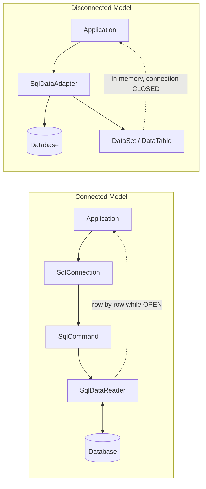
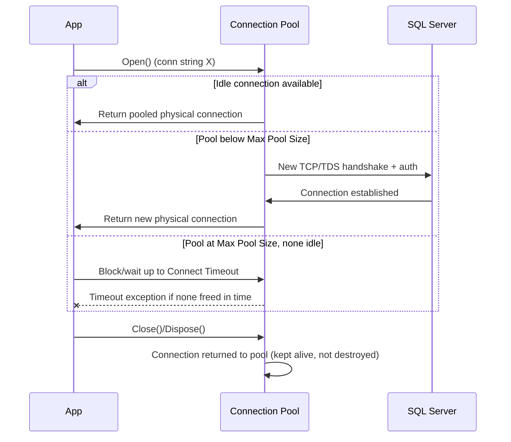
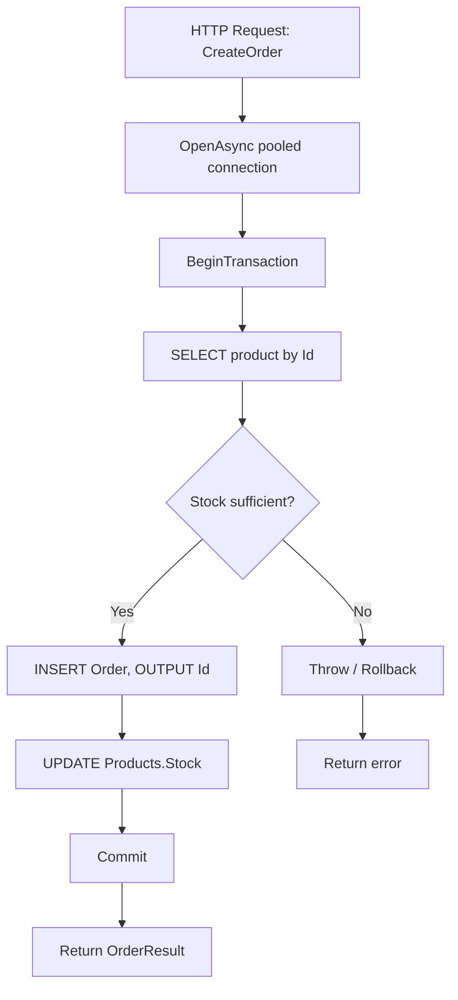

# ADO.NET Interview Guide (Senior / Lead Level)

> Audience: 10+ year .NET full-stack developer prepping for senior/lead interviews. Fundamentals assumed — this guide emphasizes nuance, trade-offs, "why", gotchas, and likely follow-ups.

## Table of Contents

- [1. Core Concepts](#1-core-concepts)
  - [1.1 What Is ADO.NET](#11-what-is-adonet)
  - [1.2 Core Architecture: Connected vs Disconnected](#12-core-architecture-connected-vs-disconnected)
  - [1.3 Data Providers](#13-data-providers)
  - [1.4 Connection Management & Connection Strings](#14-connection-management--connection-strings)
  - [1.5 Command Execution](#15-command-execution)
  - [1.6 Execution Methods (ExecuteReader / ExecuteNonQuery / ExecuteScalar)](#16-execution-methods-executereader--executenonquery--executescalar)
- [2. Intermediate Topics](#2-intermediate-topics)
  - [2.1 Parameterized Queries & SQL Injection Prevention](#21-parameterized-queries--sql-injection-prevention)
  - [2.2 DataReader (Connected Model) Deep Dive](#22-datareader-connected-model-deep-dive)
  - [2.3 DataSet / DataTable / DataAdapter (Disconnected Model) Deep Dive](#23-dataset--datatable--dataadapter-disconnected-model-deep-dive)
  - [2.4 Transactions & ACID](#24-transactions--acid)
  - [2.5 Error Handling](#25-error-handling)
- [3. Advanced Topics](#3-advanced-topics)
  - [3.1 [new content] Connection Pooling Internals & Tuning](#31-new-content-connection-pooling-internals--tuning)
  - [3.2 Async ADO.NET & CancellationToken](#32-async-adonet--cancellationtoken)
  - [3.3 [new content] Transaction Isolation Levels & TransactionScope (Ambient Transactions)](#33-new-content-transaction-isolation-levels--transactionscope-ambient-transactions)
  - [3.4 [new content] Multiple Active Result Sets (MARS)](#34-new-content-multiple-active-result-sets-mars)
  - [3.5 [new content] SqlBulkCopy for High-Volume Inserts](#35-new-content-sqlbulkcopy-for-high-volume-inserts)
  - [3.6 [new content] Reading & Streaming Large Objects (BLOBs/CLOBs)](#36-new-content-reading--streaming-large-objects-blobsclobs)
  - [3.7 [new content] Retry & Resilience for Transient Faults](#37-new-content-retry--resilience-for-transient-faults)
  - [3.8 High-Scale End-to-End Example](#38-high-scale-end-to-end-example)
- [4. Performance](#4-performance)
  - [4.1 Performance Best Practices](#41-performance-best-practices)
  - [4.2 [new content] ADO.NET vs Dapper vs EF Core Trade-offs](#42-new-content-ado.net-vs-dapper-vs-ef-core-trade-offs)
  - [4.3 ExecuteUpdate / ExecuteDelete (EF Core 7+) — Closing the Bulk-Operation Gap [gaps]](#43-executeupdate--executedelete-ef-core-7-closing-the-bulk-operation-gap-gaps)
  - [4.4 Managed Identity / Azure AD Authentication with Microsoft.Data.SqlClient [gaps]](#44-managed-identity--azure-ad-authentication-with-microsoftdatasqlclient-gaps)
- [5. Best Practices](#5-best-practices)
- [6. Common Pitfalls](#6-common-pitfalls)
- [7. Sample Interview Q&A](#7-sample-interview-qa)
- [Summary of Additions](#summary-of-additions)
- [Summary of [gaps] Additions (This Pass)](#summary-of-gaps-additions-this-pass)

---

## 1. Core Concepts

### 1.1 What Is ADO.NET

ADO.NET is the low-level, provider-based data access framework in .NET for communicating with relational (and some non-relational) data sources. It gives you:

- Direct connection management
- Direct SQL/stored-procedure execution
- Raw result retrieval (no automatic object materialization unless you write it)
- Manual transaction control
- Both a **connected** (streaming) and **disconnected** (in-memory) data model

Because it skips the mapping/change-tracking/LINQ-translation layers that ORMs add, ADO.NET is generally faster and more memory-efficient — at the cost of writing more boilerplate mapping code yourself.

**Common usage today:** high-throughput APIs, reporting/analytics endpoints, bulk data pipelines, microservices with tight latency budgets, and legacy enterprise systems that predate EF. It's also the substrate that Dapper and EF Core themselves are built on — `DbConnection`/`DbCommand` are still there under any ORM.

### 1.2 Core Architecture: Connected vs Disconnected

ADO.NET has two operating models:

**A) Connected architecture**
- Live connection held open for the duration of the read.
- Data streamed row-by-row.
- Implemented via `DataReader`.

**B) Disconnected architecture**
- Data pulled once into an in-memory structure (`DataSet`/`DataTable`).
- Connection can be closed immediately after the fill.
- Implemented via `DataAdapter`.



**Interviewer follow-up:** "Which do you default to today?" Senior answer: connected (`DataReader`) for read paths, or better, an ORM/micro-ORM built on the connected model (Dapper/EF Core) for anything beyond the simplest CRUD — hand-rolled `DataSet` usage is now rare in modern greenfield code and mostly seen in legacy WinForms/data-binding scenarios.

### 1.3 Data Providers

A **Data Provider** is the set of ADO.NET classes targeting one specific database engine (SQL Server, Oracle, MySQL, PostgreSQL, etc.). ADO.NET's provider model means the object model (`Connection`, `Command`, `DataReader`, `DataAdapter`, `Transaction`) is consistent across providers, but the concrete implementation differs per database.

Common SQL Server classes:
- `SqlConnection`
- `SqlCommand`
- `SqlDataReader`
- `SqlDataAdapter`
- `SqlTransaction`

**Modern provider note:** `System.Data.SqlClient` is legacy/in maintenance mode. The actively developed, recommended provider is **`Microsoft.Data.SqlClient`** (NuGet package), which supports newer SQL Server/Azure SQL features (Always Encrypted, Azure AD auth, TDS 8.0/strict encryption, UTF-8 support, newer TLS). Senior-level expectation: know to reference `Microsoft.Data.SqlClient`, not the old `System.Data.SqlClient`, in any new project.

### 1.4 Connection Management & Connection Strings

**Purpose:** establish and describe how the app talks to the database.

**Typical connection string components:**
- Server / Data Source
- Initial Catalog (database)
- Authentication (Windows/Integrated vs SQL login vs Azure AD/Managed Identity)
- Timeout (`Connect Timeout`)
- Encryption (`Encrypt=True`, `TrustServerCertificate`)
- Pooling settings (`Pooling`, `Min Pool Size`, `Max Pool Size`)

```
Server=myServer;Database=myDb;Trusted_Connection=True;
```

**Opening a connection:**

```csharp
using (SqlConnection conn = new SqlConnection(connectionString))
{
    conn.Open();
    // work
}
```

**Best practices:**
- Open as late as possible, close as early as possible.
- Always wrap in `using`/`using var` so `Dispose()` runs even on exceptions.
- Never cache/share a single long-lived `SqlConnection` instance across requests — let pooling do that job for you.

### 1.5 Command Execution

`SqlCommand` represents a SQL statement or stored procedure to run against a connection.

**Command types (`CommandType`):**
1. `Text` — raw SQL (default)
2. `StoredProcedure`
3. `TableDirect` — rarely used, provider-specific (mainly OLE DB); not supported for `SqlCommand` against SQL Server in practice (verify — table-direct is largely an Access/OLE DB/ODBC concept, not commonly used with `Microsoft.Data.SqlClient`)

```csharp
SqlCommand cmd = new SqlCommand("SELECT * FROM Users", conn);
```

**Interviewer follow-up:** "Why avoid `SELECT *`?" — schema drift breaks column-ordinal-based reads, wastes bandwidth on unused columns, and can prevent covering-index usage on the server.

### 1.6 Execution Methods (ExecuteReader / ExecuteNonQuery / ExecuteScalar)

| Method | Returns | Typical Use |
|---|---|---|
| `ExecuteReader()` | `SqlDataReader` (forward-only, streaming) | SELECT with multiple rows/columns; large or streamed results |
| `ExecuteNonQuery()` | `int` (rows affected) | INSERT / UPDATE / DELETE / DDL |
| `ExecuteScalar()` | `object` (first column of first row) | Aggregates (`COUNT`, `SUM`), existence checks |

```csharp
// ExecuteReader
using (SqlDataReader reader = cmd.ExecuteReader())
{
    while (reader.Read())
    {
        string name = reader["Name"].ToString();
    }
}

// ExecuteScalar
SqlCommand countCmd = new SqlCommand("SELECT COUNT(*) FROM Users", conn);
int count = (int)countCmd.ExecuteScalar();
```

**Gotcha:** `ExecuteScalar()` returns `object`; a `NULL` result or empty result set returns C# `null`, not `DBNull.Value` in the no-rows case — but a `NULL` value in the selected cell returns `DBNull.Value`. Always guard against both before casting.

---

## 2. Intermediate Topics

### 2.1 Parameterized Queries & SQL Injection Prevention

**Purpose:** prevent SQL injection and let SQL Server reuse cached execution plans instead of recompiling for every literal value.

**Wrong (vulnerable, and defeats plan caching):**

```csharp
string sql = "SELECT * FROM Users WHERE Name = '" + userInput + "'";
```

**Correct:**

```csharp
cmd.Parameters.Add("@Name", SqlDbType.VarChar, 100).Value = userInput;
```

**`AddWithValue` vs explicit typing — a real gotcha, not just style:**

```csharp
// Works, but infers SqlDbType from the CLR value at runtime
cmd.Parameters.AddWithValue("@UserId", 1);

// Preferred: explicit type/size avoids plan-cache bloat and type-mismatch surprises
cmd.Parameters.Add("@UserId", SqlDbType.Int).Value = 1;
```

Why this matters at a senior level: `AddWithValue` infers the parameter's SQL type/length from the .NET value each call. Passing a `string` of varying lengths can generate a *different* parameter signature (e.g., implicit `nvarchar(4)` vs `nvarchar(12)`) per call, which defeats plan cache reuse and can bloat the plan cache with near-duplicate query plans. Explicit `SqlDbType` + size pins the signature so SQL Server reuses one cached plan.

**Benefits recap:** security, performance (plan reuse), safe type handling, no manual string concatenation/escaping bugs.

### 2.2 DataReader (Connected Model) Deep Dive

**Characteristics:**
- Requires an open connection for the duration of iteration.
- Forward-only, read-only cursor — cannot seek backward or modify rows in place.
- Lowest memory footprint of the ADO.NET data-retrieval options — only the current row is materialized.

**Advantages:** best raw throughput; ideal for streaming large result sets to a consumer (e.g., writing straight to an HTTP response or CSV).

**Limitations:** no random access, no data binding without extra work, connection must remain open (ties up a pooled connection for the whole read).

```csharp
using (SqlDataReader reader = cmd.ExecuteReader())
{
    while (reader.Read())
    {
        string name = reader["Name"].ToString();
    }
}
```

**Follow-up interviewers ask:** "How do you avoid the ordinal/column-name lookup cost in a hot loop?" — Cache ordinals via `reader.GetOrdinal("Name")` once, then use typed accessors (`GetString(ordinal)`, `GetInt32(ordinal)`) instead of the indexer, which boxes and does a name lookup every row.

### 2.3 DataSet / DataTable / DataAdapter (Disconnected Model) Deep Dive

**DataSet:**
- In-memory, can hold multiple related `DataTable`s with relations/constraints.
- No active connection required once filled — good for offline processing, caching, or classic WinForms/WebForms data binding.

**DataAdapter:**

```csharp
SqlDataAdapter adapter = new SqlDataAdapter(query, conn);
DataTable table = new DataTable();
adapter.Fill(table);
```

**Advantages:** offline processing, built-in change tracking (`AcceptChanges`/`RejectChanges`), native data-binding support (WinForms/legacy WebForms), and `adapter.Update()` can push edits back with auto-generated INSERT/UPDATE/DELETE commands via `SqlCommandBuilder`.

**Disadvantages:** significantly higher memory usage (every column boxed as `object` inside `DataRow`), slower than `DataReader`, and the API feels dated against modern async/LINQ-friendly patterns.

**Senior framing:** `DataSet`/`DataAdapter` is largely legacy-maintenance territory now. New code should reach for `DataReader` + manual mapping, Dapper, or EF Core rather than `DataSet`, unless you're extending an existing WinForms/WebForms codebase that's already built around it.

### 2.4 Transactions & ACID

**Purpose:** guarantee atomic, all-or-nothing execution across one or more statements.

**ACID:**
- **Atomicity** — all operations in the transaction succeed or none do.
- **Consistency** — the DB moves from one valid state to another; constraints are never violated mid-way.
- **Isolation** — concurrent transactions don't see each other's uncommitted changes (degree configurable — see [3.3](#33-new-content-transaction-isolation-levels--transactionscope-ambient-transactions)).
- **Durability** — once committed, changes survive a crash (write-ahead log/journal).

```csharp
SqlTransaction transaction = conn.BeginTransaction();

try
{
    cmd.Transaction = transaction;
    cmd.ExecuteNonQuery();
    transaction.Commit();
}
catch
{
    transaction.Rollback();
    throw; // don't swallow — rethrow after rollback
}
```

**Use cases:** financial postings, multi-table updates (e.g., order + inventory + payment), any operation where a partial write would corrupt business invariants.

**Senior tips:**
- Keep the transaction scope as small as possible — only the statements that truly need atomicity.
- Never do network calls, user I/O, or long computation inside an open transaction — it holds locks and blocks other sessions.
- Always rethrow after `Rollback()` unless you're deliberately converting the failure into a different outcome.

### 2.5 Error Handling

Always wrap DB calls and catch the provider-specific exception type, not just generic `Exception`, so you can branch on transient vs permanent failures:

```csharp
try
{
    // DB operation
}
catch (SqlException ex)
{
    // Inspect ex.Number for specific SQL Server error codes
    // (e.g., 1205 = deadlock victim, -2 = timeout, 4060 = invalid DB)
    // log error with correlation id
    throw;
}
```

**Senior-level nuance:** `SqlException.Number` tells you *what kind* of failure happened. Deadlock victims (1205) and timeouts are often safe to retry; constraint violations (2627/2601 unique key) or permission errors (229/230) are not. This distinction feeds directly into [3.7 Retry & Resilience](#37-new-content-retry--resilience-for-transient-faults).

---

## 3. Advanced Topics

### 3.1 [new content] Connection Pooling Internals & Tuning

Connection pooling is a mechanism where the ADO.NET provider maintains a pool of already-established physical connections per unique connection string ("pool key"), reusing them instead of opening a new TCP/TDS handshake and re-authenticating for every logical `Open()`.

**How it actually works:**
- The pool is keyed by the **exact connection string** (plus a few identity-related settings). Two connection strings that differ by even a space or a case difference can create *separate* pools — a subtle bug source when connection strings are built dynamically per tenant/user.
- `conn.Open()` asks the pool for an idle physical connection; if one exists and is still valid, it's handed back immediately (no handshake).
- `conn.Close()`/`Dispose()` **returns the connection to the pool** — it does not tear down the TCP connection. This is exactly why the "open late, close early" guidance works: closing is cheap because it's not a real disconnect.
- If no idle connection is available and the pool is below `Max Pool Size` (default 100), a new physical connection is created.
- If the pool is at `Max Pool Size` and none are free, the caller **blocks** waiting up to `Connect Timeout` seconds, then throws `InvalidOperationException: Timeout expired. The timeout period elapsed prior to obtaining a connection from the pool.` This is the classic symptom of a **connection leak** (code that opens connections but never disposes them under some code path, often an unawaited exception path).
- Idle connections beyond `Min Pool Size` can be pruned after ~4-8 minutes of inactivity (implementation detail, provider-version dependent).

**Tuning knobs (connection-string keywords):**

| Keyword | Effect |
|---|---|
| `Pooling=true/false` | Disable only for diagnostics; pooling should stay on in production |
| `Max Pool Size` | Ceiling on concurrent physical connections per pool; raise cautiously — the DB server has its own max connection limit too |
| `Min Pool Size` | Pre-warms N connections; helps avoid cold-start latency spikes after idle periods |
| `Connect Timeout` | How long `Open()` waits for a free pooled/new connection before failing |
| `Connection Lifetime` | Forces recycling of connections older than N seconds — useful for load-balanced failover scenarios (verify exact keyword name per provider version) |

**Interview-grade insight:** pool exhaustion is almost always an application bug (leaked connections, or opening one connection per item in a loop without disposing), not a "need bigger pool" problem — the fix is almost never "raise Max Pool Size" as a first move; it's finding the leak.



### 3.2 Async ADO.NET & CancellationToken

Modern best practice: use the `*Async` overloads everywhere in server-side code (ASP.NET Core APIs, background services) to avoid tying up a thread-pool thread while waiting on network I/O to the database.

```csharp
await conn.OpenAsync(token);
using SqlCommand cmd = new SqlCommand(sql, conn);
using SqlDataReader reader = await cmd.ExecuteReaderAsync(token);
while (await reader.ReadAsync(token))
{
    // ...
}
```

Key async members: `OpenAsync`, `ExecuteReaderAsync`, `ExecuteNonQueryAsync`, `ExecuteScalarAsync`, `ReadAsync`, `NextResultAsync`.

**Benefits:** non-blocking threads, better scalability under concurrent load, improved API responsiveness — the classic ASP.NET thread-pool-starvation-under-load scenario is largely solved by making the full call chain async.

**Senior-level nuance (important, often mis-stated):** async improves **throughput/scalability** (how many concurrent requests the server can handle), not the **latency of a single query**. A single async call to the DB is not "faster" than sync — it just frees the thread to do other work while waiting. Don't claim async makes queries faster; it makes the *server* handle more of them concurrently.

**CancellationToken propagation:** pass the token through to every async DB call so that client disconnects/timeouts in an ASP.NET Core request actually abort the in-flight SQL command rather than letting it run to completion uselessly. This also matters for `HttpContext.RequestAborted` wiring.

**Common mistake:** mixing sync and async (`.Result`, `.Wait()`, or `GetAwaiter().GetResult()` on an async DB call) — this can deadlock in contexts with a synchronization context and defeats the entire purpose.

### 3.3 [new content] Transaction Isolation Levels & TransactionScope (Ambient Transactions)

**Why this matters:** "Isolation" in ACID is not binary — it's a spectrum trading correctness guarantees against concurrency/throughput. Senior interviewers frequently probe this because it reveals whether you've actually debugged a deadlock or phantom-read issue in production.

| Isolation Level | Dirty Read | Non-Repeatable Read | Phantom Read | Notes |
|---|---|---|---|---|
| `ReadUncommitted` | Possible | Possible | Possible | "NOLOCK" behavior; avoid for anything transactional |
| `ReadCommitted` (SQL Server default) | Prevented | Possible | Possible | Locks released after each statement |
| `RepeatableRead` | Prevented | Prevented | Possible | Holds shared locks until transaction end — higher blocking |
| `Serializable` | Prevented | Prevented | Prevented | Highest isolation, highest contention/deadlock risk |
| `Snapshot` | Prevented | Prevented | Prevented | Row-versioning based (no blocking readers/writers), requires `ALLOW_SNAPSHOT_ISOLATION` on the DB |

```csharp
using SqlTransaction tx = conn.BeginTransaction(IsolationLevel.ReadCommitted);
```

**`TransactionScope` / ambient transactions:** lets you wrap ADO.NET calls (and even multiple resources) in a transaction without manually threading a `SqlTransaction` object through every command — the `System.Transactions` infrastructure detects the ambient transaction and enlists connections automatically.

```csharp
using (var scope = new TransactionScope(
           TransactionScopeAsyncFlowOption.Enabled)) // required for async code paths
{
    using var conn = new SqlConnection(connectionString);
    await conn.OpenAsync();
    // command automatically enlists in the ambient transaction
    await cmd.ExecuteNonQueryAsync();

    scope.Complete(); // marks success; omit/throw to roll back
}
```

**Gotchas:**
- Forgetting `TransactionScopeAsyncFlowOption.Enabled` causes the ambient transaction to not flow correctly across `await` boundaries (pre-.NET-Core behavior could even throw).
- If **two different connections** (even to the same database) enlist in one `TransactionScope`, it escalates to a **Distributed Transaction Coordinator (DTC/MSDTC)** transaction — heavier, and on Linux/containers DTC support is limited/unavailable (verify current state per your SQL Server version — this has historically been a Windows-only pain point).
- `TransactionScope` defaults to `Serializable` isolation if you don't specify `TransactionOptions.IsolationLevel` — a very common source of unexpected blocking/deadlocks for developers who assumed it matched the DB default (`ReadCommitted`).

### 3.4 [new content] Multiple Active Result Sets (MARS)

By default, a single `SqlConnection` can have only **one** active `DataReader` open at a time — trying to open a second while the first is still being read throws an `InvalidOperationException`.

**MARS** (`MultipleActiveResultSets=True` in the connection string) allows multiple batches/readers to be interleaved on a single physical connection, which is useful when, e.g., you're iterating a reader and need to issue a lookup query per row without opening a second connection.

```
Server=.;Database=ShopDB;Trusted_Connection=True;MultipleActiveResultSets=True;
```

**Senior-level trade-off framing:** MARS is a convenience, not a performance feature — interleaved MARS operations are still serialized on the wire (it's cooperative multiplexing over one connection, not true parallel execution), and it adds server-side session overhead. Most senior engineers prefer restructuring the code (e.g., load lookup data first, or use a JOIN) over relying on MARS, and reserve it for ORM internals (EF Core enables it by default for exactly this kind of scenario) rather than hand-written ADO.NET.

### 3.5 [new content] SqlBulkCopy for High-Volume Inserts

For inserting thousands-to-millions of rows, row-by-row `INSERT` via `ExecuteNonQuery` (even parameterized, even batched) is dramatically slower than SQL Server's native bulk-load path. `SqlBulkCopy` wraps that native path.

```csharp
using var bulkCopy = new SqlBulkCopy(connection, SqlBulkCopyOptions.Default, transaction)
{
    DestinationTableName = "dbo.Orders",
    BatchSize = 5000,
    BulkCopyTimeout = 60
};

bulkCopy.ColumnMappings.Add("OrderId", "OrderId");
bulkCopy.ColumnMappings.Add("ProductId", "ProductId");

await bulkCopy.WriteToServerAsync(dataTable /* or IDataReader */, cancellationToken);
```

**Why it's fast:** it streams rows to the server using the TDS bulk insert protocol, largely bypassing per-row transaction log overhead patterns of individual INSERTs (especially with `SqlBulkCopyOptions.TableLock` and a target table/index configuration that supports minimal logging).

**Senior-level talking points:**
- Source can be a `DataTable`, an array of `DataRow`, or (more memory-efficiently) any `IDataReader` — streaming from one query straight into another table without materializing everything in memory.
- `SqlBulkCopyOptions.KeepIdentity`, `CheckConstraints`, `FireTriggers` control default-off behaviors — bulk copy skips constraint checks and triggers by default for speed, which is a real correctness gotcha if your business logic depends on triggers firing.
- Interviewers may ask "when would you NOT use it?" — for small batches, or when you need per-row error handling/business validation, plain parameterized batched inserts are simpler and safer.

### 3.6 [new content] Reading & Streaming Large Objects (BLOBs/CLOBs)

Loading a large `VARBINARY(MAX)`/`NVARCHAR(MAX)` column (files, images, large JSON/XML blobs) fully into memory via a normal `reader["Column"]` cast can blow up memory for large payloads. ADO.NET supports streaming access:

```csharp
using SqlDataReader reader = await cmd.ExecuteReaderAsync(
    CommandBehavior.SequentialAccess, token); // required for true streaming

if (await reader.ReadAsync(token))
{
    using Stream blobStream = reader.GetStream(reader.GetOrdinal("FileContent"));
    using Stream output = File.Create(destinationPath);
    await blobStream.CopyToAsync(output, token);
}
```

**Key points:**
- `CommandBehavior.SequentialAccess` is required to stream — it tells the reader to give up random column access in exchange for not buffering the whole row, letting you read column data (especially large columns) as a `Stream`/`TextReader` incrementally.
- `reader.GetStream()`, `GetTextReader()`, `GetSqlBytes()` are the streaming-friendly accessors; with `SequentialAccess`, columns must be read in ordinal order and only once.
- This matters for file-serving APIs, large document export, and avoiding LOH (Large Object Heap) pressure from `byte[]` allocations for big blobs.

### 3.7 [new content] Retry & Resilience for Transient Faults

Cloud SQL (Azure SQL specifically) and even on-prem SQL Server under load can throw **transient** errors: throttling, failover, network blips, deadlock victim selection. A senior implementation distinguishes retryable from non-retryable failures and retries with backoff — never retries blindly.

**Approach:**
- Use `Microsoft.Data.SqlClient`'s built-in **configurable retry logic** (`SqlRetryLogicBaseProvider`, available from `Microsoft.Data.SqlClient` v3+) or wrap calls with **Polly** for a provider-agnostic policy.
- Classify by `SqlException.Number`: common Azure SQL transient codes include 40613 (database unavailable), 40501 (service busy), 40197, 4060, 1205 (deadlock victim), -2 (timeout). Non-transient: constraint violations (2627), auth failures (18456), syntax errors.
- Use exponential backoff with jitter to avoid thundering-herd retries against an already-struggling server.
- **Idempotency matters**: only safely auto-retry operations that are idempotent, or wrap the retryable unit in a transaction so a retry after a failed commit doesn't double-apply. Retrying a bare `INSERT` without a dedupe key/transaction boundary can create duplicate rows if the failure happened after the server committed but before the client got the ack.

```csharp
// Example: Polly-based retry around a transient SqlException
var retryPolicy = Policy
    .Handle<SqlException>(ex => IsTransient(ex.Number))
    .WaitAndRetryAsync(3, attempt =>
        TimeSpan.FromMilliseconds(200 * Math.Pow(2, attempt)) +
        TimeSpan.FromMilliseconds(Random.Shared.Next(0, 100))); // jitter

await retryPolicy.ExecuteAsync(async ct =>
{
    await conn.OpenAsync(ct);
    await cmd.ExecuteNonQueryAsync(ct);
}, token);
```

**Interview follow-up:** "Why not just retry everything?" — because retrying a non-idempotent write against a server that actually succeeded but the ack was lost can duplicate side effects; and retrying non-transient errors (bad SQL, permission errors) just wastes time and hides real bugs.

### 3.8 High-Scale End-to-End Example

Realistic order-processing endpoint demonstrating async calls, pooling, a transaction spanning three statements, parameterization, and cancellation — combining the practices above into one flow.



```csharp
public async Task<OrderResult> CreateOrderAsync(
    int productId,
    int quantity,
    CancellationToken token)
{
    string connectionString = "Server=.;Database=ShopDB;Trusted_Connection=True;";

    using SqlConnection conn = new SqlConnection(connectionString);
    await conn.OpenAsync(token);

    using SqlTransaction transaction = conn.BeginTransaction();

    try
    {
        // 1. Read product information
        SqlCommand productCmd = new SqlCommand(
            @"SELECT Id, Name, Price, Stock
              FROM Products
              WHERE Id = @ProductId",
            conn,
            transaction);

        productCmd.Parameters.Add("@ProductId", SqlDbType.Int).Value = productId;

        Product product = null;

        using (SqlDataReader reader = await productCmd.ExecuteReaderAsync(token))
        {
            if (await reader.ReadAsync(token))
            {
                product = new Product
                {
                    Id = reader.GetInt32(0),
                    Name = reader.GetString(1),
                    Price = reader.GetDecimal(2),
                    Stock = reader.GetInt32(3)
                };
            }
        }

        if (product == null)
            throw new Exception("Product not found");

        if (product.Stock < quantity)
            throw new Exception("Insufficient stock");

        // 2. Insert order
        SqlCommand orderCmd = new SqlCommand(
            @"INSERT INTO Orders(ProductId, Quantity, TotalAmount)
              OUTPUT INSERTED.Id
              VALUES(@ProductId, @Qty, @Total)",
            conn,
            transaction);

        orderCmd.Parameters.Add("@ProductId", SqlDbType.Int).Value = productId;
        orderCmd.Parameters.Add("@Qty", SqlDbType.Int).Value = quantity;
        orderCmd.Parameters.Add("@Total", SqlDbType.Decimal).Value = product.Price * quantity;

        int orderId = (int)await orderCmd.ExecuteScalarAsync(token);

        // 3. Update inventory
        SqlCommand stockCmd = new SqlCommand(
            @"UPDATE Products
              SET Stock = Stock - @Qty
              WHERE Id = @ProductId",
            conn,
            transaction);

        stockCmd.Parameters.Add("@Qty", SqlDbType.Int).Value = quantity;
        stockCmd.Parameters.Add("@ProductId", SqlDbType.Int).Value = productId;

        await stockCmd.ExecuteNonQueryAsync(token);

        transaction.Commit();

        return new OrderResult
        {
            OrderId = orderId,
            ProductName = product.Name,
            Quantity = quantity
        };
    }
    catch
    {
        transaction.Rollback();
        throw;
    }
}
```

Supporting models:

```csharp
public class Product
{
    public int Id;
    public string Name;
    public decimal Price;
    public int Stock;
}

public class OrderResult
{
    public int OrderId;
    public string ProductName;
    public int Quantity;
}
```

Batch retrieval via `SqlDataAdapter` (disconnected model example):

```csharp
public DataTable GetProducts()
{
    using SqlConnection conn = new SqlConnection(_connectionString);

    SqlCommand cmd = new SqlCommand(
        "SELECT Id, Name, Price, Stock FROM Products",
        conn);

    SqlDataAdapter adapter = new SqlDataAdapter(cmd);
    DataTable table = new DataTable();
    adapter.Fill(table);

    return table;
}
```

**Practices demonstrated:** async DB calls end-to-end, transactions for multi-statement consistency, minimal connection lifetime, parameterized queries, connection pooling (implicit/automatic), `CancellationToken` propagation, and `using` blocks for deterministic disposal.

---

## 4. Performance

### 4.1 Performance Best Practices

- Always use parameterized queries (security + plan-cache reuse).
- Avoid `SELECT *` — name columns explicitly.
- Design/verify indexes support your WHERE/JOIN/ORDER BY predicates.
- Prefer `DataReader` (or a thin mapper over it) for read-heavy, high-throughput paths.
- Minimize connection open time — open late, close early, let pooling absorb the churn.
- Avoid `DataSet`/`DataTable` unless you specifically need disconnected/data-binding semantics.
- Batch operations where possible (multi-row inserts, table-valued parameters, or `SqlBulkCopy` for large volumes — see [3.5](#35-new-content-sqlbulkcopy-for-high-volume-inserts)).
- Cache reader column ordinals in hot loops; use typed `Get*` accessors instead of the string indexer.
- Use `CommandBehavior.SequentialAccess` + streaming for large columns (see [3.6](#36-new-content-reading--streaming-large-objects-blobsclobs)).
- Prefer async all the way through the call stack in server-side code for scalability under concurrent load.

### 4.2 [new content] ADO.NET vs Dapper vs EF Core Trade-offs

This comparison is one of the most common senior .NET interview questions — "when would you reach for raw ADO.NET vs Dapper vs EF Core?" A shallow answer ("EF for CRUD, ADO.NET for performance") is table stakes; a senior answer talks about team velocity, maintainability, and where the abstraction cost actually shows up.


| Aspect | ADO.NET (raw) | Dapper | EF Core |
|---|---|---|---|
| Abstraction level | None — you write SQL and mapping | Minimal — you write SQL, it maps to objects | High — LINQ-to-SQL translation, change tracking |
| Performance | Fastest (no mapping overhead) | Very close to raw ADO.NET (~5-10% overhead, verify per benchmark/version) | Slower for pure reads; overhead from change tracking, query compilation cache misses on cold start |
| Productivity | Lowest — most boilerplate | Medium — still hand-write SQL | Highest — LINQ, no-SQL-needed CRUD, migrations |
| Change tracking / unit of work | Manual | None built-in | Built-in `DbContext` change tracker |
| Migrations | None (manage schema separately) | None | Built-in (`dotnet ef migrations`) |
| Complex relationships/graphs | Manual joins + manual mapping | Manual joins + manual mapping (or multi-mapping) | Navigation properties, `Include()`, automatic |
| Best fit | Bulk operations, streaming, ultra-hot paths, legacy systems | Reporting/read-heavy APIs, microservices wanting SQL control with less boilerplate than raw ADO.NET | CRUD-heavy business apps, rapid iteration, teams prioritizing maintainability over micro-optimized latency |
| Learning curve for new team members | High (need strong SQL + manual mapping discipline) | Medium | Lower for CRUD; high for advanced LINQ translation debugging |

**Senior talking points:**
- Dapper is often the "sweet spot" many senior teams land on for APIs: keeps SQL explicit and reviewable, avoids EF's change-tracking/query-translation surprises, and benchmarks very close to hand-written ADO.NET.
- EF Core's overhead mostly matters in high-throughput read paths and large graphs; for typical CRUD volumes (hundreds/thousands of ops/sec, not hundreds of thousands), EF Core is fast enough and the productivity win dominates.
- It's common and legitimate to **mix** them in one codebase: EF Core for the transactional/CRUD core, raw ADO.NET or Dapper for reporting queries, bulk jobs, and hot paths — a good answer to "would you rewrite everything in ADO.NET for performance?" is "no, profile first, then selectively drop to a lower abstraction only where it's proven to matter."
- EF Core `AsNoTracking()`, compiled queries, and `ExecuteUpdate`/`ExecuteDelete` (EF Core 7+) close much of the historical performance gap for read-only and bulk-update scenarios without abandoning the ORM.

### 4.3 ExecuteUpdate / ExecuteDelete (EF Core 7+) — Closing the Bulk-Operation Gap [gaps]

Historically, a top reason senior teams dropped from EF Core to raw ADO.NET/Dapper for bulk writes was EF Core's change-tracking model: updating or deleting many rows required loading each entity into the change tracker, mutating it, and calling `SaveChanges()` — one round trip per entity's worth of state, plus tracker overhead, even when the actual intent was a single set-based SQL statement.

**EF Core 7 introduced `ExecuteUpdateAsync`/`ExecuteDeleteAsync`**, which compile a LINQ query directly into a single set-based `UPDATE`/`DELETE` SQL statement, executed immediately — bypassing the change tracker and `SaveChanges()` entirely for that operation.

```csharp
// Single UPDATE statement, no entities loaded into the change tracker
await dbContext.Products
    .Where(p => p.CategoryId == 5)
    .ExecuteUpdateAsync(s => s.SetProperty(p => p.Discontinued, true));

// Single DELETE statement, same principle
await dbContext.Orders
    .Where(o => o.CreatedAt < cutoffDate)
    .ExecuteDeleteAsync();
```

**Why this matters for the ADO.NET vs Dapper vs EF Core comparison in [4.2](#42-new-content-ado.net-vs-dapper-vs-ef-core-trade-offs):** this feature directly closes much of the performance gap that used to justify dropping to raw ADO.NET for bulk `UPDATE`/`DELETE` operations. You get EF Core's LINQ ergonomics and strong typing while still issuing one efficient, set-based statement against the database — no entity materialization, no per-row change-tracking snapshotting, no N-round-trip `SaveChanges()` pattern.

**Remaining gap — this does not replace `SqlBulkCopy`:** `ExecuteUpdate`/`ExecuteDelete` only address set-based `UPDATE`/`DELETE`. For very large bulk **INSERTs** (loading thousands-to-millions of new rows), `SqlBulkCopy` (see [3.5](#35-new-content-sqlbulkcopy-for-high-volume-inserts)) remains meaningfully faster — it streams rows over the native TDS bulk-load protocol, which is a fundamentally different code path from anything EF Core's LINQ-to-SQL translation produces for inserts. A senior answer distinguishes the two: "EF Core 7+ closed the gap for bulk updates/deletes; it did not close the gap for bulk inserts — that's still `SqlBulkCopy` territory."

**Interviewer follow-up:** "Does `ExecuteUpdate` respect global query filters and interceptors?" — yes, it still goes through EF Core's query pipeline (model, filters, value converters), it just skips the change tracker and produces a single SQL statement instead of per-entity round trips.

### 4.4 Managed Identity / Azure AD Authentication with Microsoft.Data.SqlClient [gaps]

Section [1.4](#14-connection-management--connection-strings) lists "Azure AD/Managed Identity" as one bullet under connection-string authentication options with no elaboration — this section is that elaboration, and it's a topic senior interviewers increasingly probe given the push toward passwordless/secret-free cloud architectures.

**What Managed Identity is:** an identity in Azure AD (Entra ID) that Azure automatically provisions and binds to a specific Azure resource — an App Service, VM, Azure Function, Container App, AKS pod, etc. The application authenticates *as that resource's identity* with no connection-string password, no client secret, and no certificate for you to store, rotate, or leak. Azure transparently issues and rotates the underlying credentials/tokens; your code never sees them directly unless you choose to inspect them.

- **System-assigned** managed identity: tied 1:1 to the resource's lifecycle (deleted when the resource is deleted).
- **User-assigned** managed identity: a standalone Azure resource you create once and attach to one or more compute resources — useful when several services should share one identity/permission set.

**How `Microsoft.Data.SqlClient` supports it:** via the `Authentication` connection-string keyword, which tells the driver to acquire an Azure AD access token instead of sending a SQL login/password.

```
Server=tcp:myserver.database.windows.net,1433;Database=myDb;Authentication=Active Directory Managed Identity;Encrypt=True;
```

```
# For user-assigned managed identity, also specify the identity's client ID:
Server=tcp:myserver.database.windows.net,1433;Database=myDb;Authentication=Active Directory Managed Identity;User Id=<managed-identity-client-id>;Encrypt=True;
```

`Authentication=Active Directory Default` is a broader variant: it delegates to a credential-discovery chain (managed identity when running in Azure, falling back to environment variables, Visual Studio/Azure CLI login, etc. when running locally) — convenient for code that must run both in Azure and on a developer's machine without branching connection strings.

```csharp
using Microsoft.Data.SqlClient;

var connectionString =
    "Server=tcp:myserver.database.windows.net,1433;Database=myDb;" +
    "Authentication=Active Directory Managed Identity;Encrypt=True;";

using SqlConnection conn = new SqlConnection(connectionString);
await conn.OpenAsync(); // driver acquires the AAD token transparently on Open()
```

**Alternative token-acquisition path (`Azure.Identity`):** when you need more control over how the token is obtained — custom credential chains, explicit tenant targeting, caching behavior, or acquiring tokens for other Azure resources in the same process — use `Azure.Identity`'s `DefaultAzureCredential` (or a more specific credential type) to fetch the token yourself and assign it to `SqlConnection.AccessToken` before opening:

```csharp
using Azure.Identity;
using Azure.Core;
using Microsoft.Data.SqlClient;

var credential = new DefaultAzureCredential();
var tokenRequestContext = new TokenRequestContext(new[] { "https://database.windows.net/.default" });
AccessToken token = await credential.GetTokenAsync(tokenRequestContext);

using SqlConnection conn = new SqlConnection(
    "Server=tcp:myserver.database.windows.net,1433;Database=myDb;Encrypt=True;");
conn.AccessToken = token.Token;
await conn.OpenAsync();
```

**Why this is the modern recommended alternative to SQL-login credentials in connection strings/`appsettings.json`:**
- **Eliminates secret sprawl** — no SQL password or connection-string secret to store in `appsettings.json`, Key Vault references, CI/CD variables, or developer machines; nothing to accidentally commit to source control.
- **Automatic credential rotation** — Azure manages the underlying credential lifecycle for the managed identity; there's no password-expiry rotation project for this connection path.
- **Centralized access control** — database permissions are granted to the Azure AD identity (`CREATE USER [my-app-identity] FROM EXTERNAL PROVIDER;` plus role membership) and governed through Entra ID/Azure RBAC, rather than a separate universe of SQL logins to audit, disable, and track independently of your identity provider.
- **Reduced blast radius** — a compromised app doesn't expose a reusable password; the token is short-lived and scoped, and identity assignment can be revoked at the Azure resource level.

**Interviewer follow-up:** "What happens locally, off Azure, where there's no managed identity to assume?" — `Authentication=Active Directory Default` (or `Azure.Identity`'s `DefaultAzureCredential`) falls back to developer-context credentials (Azure CLI/`az login`, Visual Studio sign-in, environment variables), so the same code path works in both environments without hardcoding a different auth story for local development.

---

## 5. Best Practices

- Use `using`/`using var` for every `IDisposable` ADO.NET object (`SqlConnection`, `SqlCommand`, `SqlDataReader`, `SqlTransaction`).
- Always parameterize — never concatenate user input into SQL text.
- Open connections late, close/dispose early; trust connection pooling to absorb the churn.
- Keep transactions short — no network calls, user waits, or heavy computation inside an open transaction.
- Prefer async DB APIs in all server-side/API code; propagate `CancellationToken`.
- Choose the right tool per operation: `DataReader`/Dapper for read-heavy hot paths, EF Core for CRUD-heavy business logic, `SqlBulkCopy` for bulk loads.
- Explicitly type and size parameters (`SqlDbType` + length) rather than relying purely on `AddWithValue` inference.
- Catch `SqlException` specifically (not bare `Exception`) so you can branch on error number for retry/no-retry decisions.
- Rethrow after `Rollback()` — don't swallow transaction failures.
- Set `CommandTimeout` deliberately for long-running reports/batch jobs rather than accepting the default blindly.

---

## 6. Common Pitfalls

1. **Not understanding connection pooling** — misreading "open late, close early" as wasteful, when closing just returns the connection to the pool rather than tearing it down.
2. **String concatenation SQL** — SQL injection risk, defeats plan-cache reuse.
3. **Keeping connections open unnecessarily** — blocks other requests, risks pool exhaustion, hurts scalability.
4. **Not disposing readers/connections/transactions** — leaks, pool starvation, lingering locks.
5. **Ignoring async programming** — sync DB calls on a web API's request thread cause thread-pool starvation under load.
6. **Using `DataSet`/`DataTable` by default/habit** — heavier, slower; pick the connected model or a mapper unless disconnected semantics are actually needed.
7. **Not handling transactions** — partial multi-statement writes leave the DB in an inconsistent state.
8. **Not being able to explain performance differences** — DataReader vs DataSet, ADO.NET vs ORM, parameterized vs inline SQL, sync vs async throughput impact.
9. **[new content] Blind retries on transient faults** — retrying non-idempotent writes without a transaction/dedupe boundary, or retrying non-transient errors and masking real bugs.
10. **[new content] Assuming async makes a single query faster** — async buys concurrency/scalability, not lower latency for one call.
11. **[new content] Forgetting `TransactionScopeAsyncFlowOption.Enabled`** — ambient transaction doesn't flow correctly across `await`, or enlisting two connections unexpectedly escalates to a DTC distributed transaction.

---

## 7. Sample Interview Q&A

**Q: Why is ADO.NET faster than an ORM like EF Core?**
A: No change-tracking overhead, no LINQ-to-SQL translation layer, no entity materialization/proxying — you execute SQL directly and map only the columns you asked for. The trade-off is you write and maintain that mapping and SQL yourself, and lose migrations, navigation properties, and LINQ composability.

**Q: When would you choose `DataReader` over EF Core?**
A: High-throughput read scenarios, large/streamed result sets, reporting queries, or any hot path where profiling shows ORM overhead matters. For CRUD-heavy business logic where maintainability and development speed matter more than micro-level latency, EF Core wins.

**Q: Explain the impact of connection pooling, including a failure mode you've seen.**
A: Pooling reuses physical connections keyed by connection string, avoiding the cost of a new TCP/TDS handshake and auth per logical `Open()`. `Close()`/`Dispose()` returns the connection to the pool rather than destroying it — that's why "open late, close early" is cheap and correct. The failure mode is a connection leak: code that opens a connection but fails to dispose it on some exception path exhausts the pool, and every subsequent `Open()` call blocks until `Connect Timeout` and then throws.

**Q: How do you handle transactions correctly, and what do isolation levels have to do with it?**
A: Keep the transaction scope minimal — only the statements that must be atomic — commit or rollback promptly, and always rethrow after rollback. Isolation level controls how much concurrent transactions can see of each other's uncommitted/committed-but-changing data; `ReadCommitted` is SQL Server's default and a reasonable baseline, but `Serializable` or `Snapshot` may be needed to prevent phantom reads or non-repeatable reads in specific business scenarios, at the cost of more blocking/versioning overhead.

**Q: Does async ADO.NET make a single query run faster?**
A: No — the query itself takes the same time on the server. Async frees the calling thread from blocking on I/O wait, so the *server* can handle more concurrent requests with the same thread pool. The win is throughput/scalability under load, not per-call latency.

**Q: How would you insert 2 million rows efficiently?**
A: Not row-by-row `INSERT` via `ExecuteNonQuery` — use `SqlBulkCopy`, which streams rows via SQL Server's native bulk-load protocol, bypassing much of the per-row overhead. Stream from an `IDataReader` source rather than materializing everything into a `DataTable` first if memory is a concern. Be aware it skips triggers and constraint checks by default unless you opt in via `SqlBulkCopyOptions`.

**Q: What's the difference between `AddWithValue` and explicitly-typed parameters, and why does it matter?**
A: `AddWithValue` infers `SqlDbType` and size from the runtime value, which can produce different parameter signatures (e.g., varying `nvarchar` lengths) across calls with the same query text, fragmenting the plan cache. Explicit `Add(name, SqlDbType, size)` pins the signature so SQL Server reuses one execution plan — better performance and more predictable behavior at scale.

**Q: When would you use `TransactionScope` instead of `SqlTransaction`?**
A: When a logical unit of work spans multiple `SqlConnection` instances (or even multiple resource managers), or when you want to keep transaction-demarcation code separate from the data-access code (`scope.Complete()` at the outer service layer without threading a `SqlTransaction` object through every method). Watch for accidental DTC escalation if two distinct connections enlist, and remember it defaults to `Serializable` isolation unless overridden.

---

## Summary of Additions

The following sections were added because they are commonly probed at a senior .NET interview level and were missing or only lightly covered in the original notes:

- **[new content] Connection Pooling Internals & Tuning** — the original notes stated pooling exists and should be used correctly, but didn't explain the pool-key mechanism, blocking/timeout behavior at exhaustion, or tuning keywords (`Max Pool Size`, `Min Pool Size`, `Connection Lifetime`) — this is exactly the depth senior interviewers probe for.
- **[new content] Transaction Isolation Levels & TransactionScope (Ambient Transactions)** — original notes said "mention isolation levels if asked" without defining them; added the full isolation-level comparison table plus `TransactionScope`/ambient-transaction mechanics and its DTC-escalation and default-`Serializable` gotchas.
- **[new content] Multiple Active Result Sets (MARS)** — not mentioned at all in source notes; a real gotcha (`InvalidOperationException` with concurrent readers) and a common connection-string interview question.
- **[new content] SqlBulkCopy for High-Volume Inserts** — bulk loading is a standard senior ADO.NET topic (how do you insert millions of rows efficiently) and was entirely absent from the source.
- **[new content] Reading & Streaming Large Objects (BLOBs/CLOBs)** — `CommandBehavior.SequentialAccess` and streaming accessors were missing; relevant for file-serving/large-payload interview scenarios.
- **[new content] Retry & Resilience for Transient Faults** — cloud/Azure SQL resiliency (transient fault classification, idempotency concerns, Polly/`SqlRetryLogicBaseProvider`) is a hot modern topic not covered in the original notes.
- **[new content] ADO.NET vs Dapper vs EF Core Trade-offs** — original notes only compared ADO.NET vs EF Core in passing; Dapper (a near-universal middle-ground choice in senior teams) was entirely absent, so a full three-way comparison table and guidance were added.

**Contradictions flagged:** none of genuine substance were found — the "Common Interview Pitfalls" section and the later "Detailed Explanation" section covered the same eight pitfalls twice with consistent content; these were merged rather than duplicated. One factual nuance was clarified rather than contradicted: the notes' claim that "async improves API performance" was refined to explicitly distinguish throughput/scalability gains from (the absence of) single-query latency gains, since interviewers specifically probe that distinction.

## Summary of [gaps] Additions (This Pass)

This second pass targeted two specific gaps identified in the ADO.NET vs Dapper vs EF Core comparison and in the connection-string authentication coverage:

- **[gaps] ExecuteUpdate / ExecuteDelete (EF Core 7+) — Closing the Bulk-Operation Gap** — section 4.2 previously only had a single passing line mentioning `ExecuteUpdate`/`ExecuteDelete`. This pass expanded it into a full dedicated subsection (4.3) with a working code example, an explicit explanation of how it bypasses change tracking/`SaveChanges()` for set-based bulk writes, and — critically — the nuance that this closes the performance gap only for `UPDATE`/`DELETE`, not bulk `INSERT` (which still favors `SqlBulkCopy`). This matters at a senior level because "EF Core is always slower for bulk ops" is now an outdated blanket answer, and interviewers probing current EF Core versions expect the update/delete-vs-insert distinction.
- **[gaps] Managed Identity / Azure AD Authentication with Microsoft.Data.SqlClient** — section 1.4 listed "Azure AD/Managed Identity" as a bare bullet with no elaboration. This pass added a full subsection (4.4) explaining what managed identity is, how the `Authentication` connection-string keyword and `Azure.Identity`'s `DefaultAzureCredential` acquire tokens in place of SQL login credentials, and why this is the modern recommended posture (no secret sprawl, automatic rotation, centralized Entra ID-based access control). This matters because passwordless/secretless cloud data access is now a standard senior-level expectation for anyone deploying to Azure, and interviewers commonly probe whether a candidate still defaults to SQL-login-in-a-connection-string thinking.

**Contradictions flagged:** none — both additions are elaborations of existing bullets/lines, not corrections.
