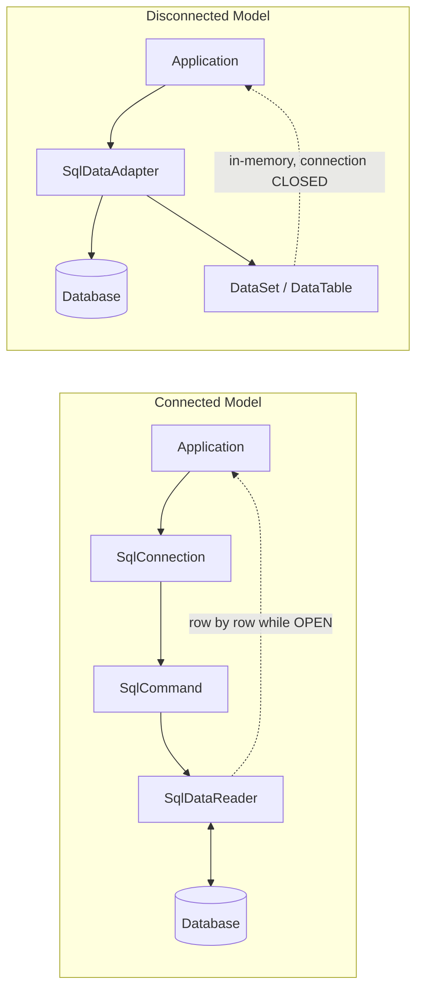
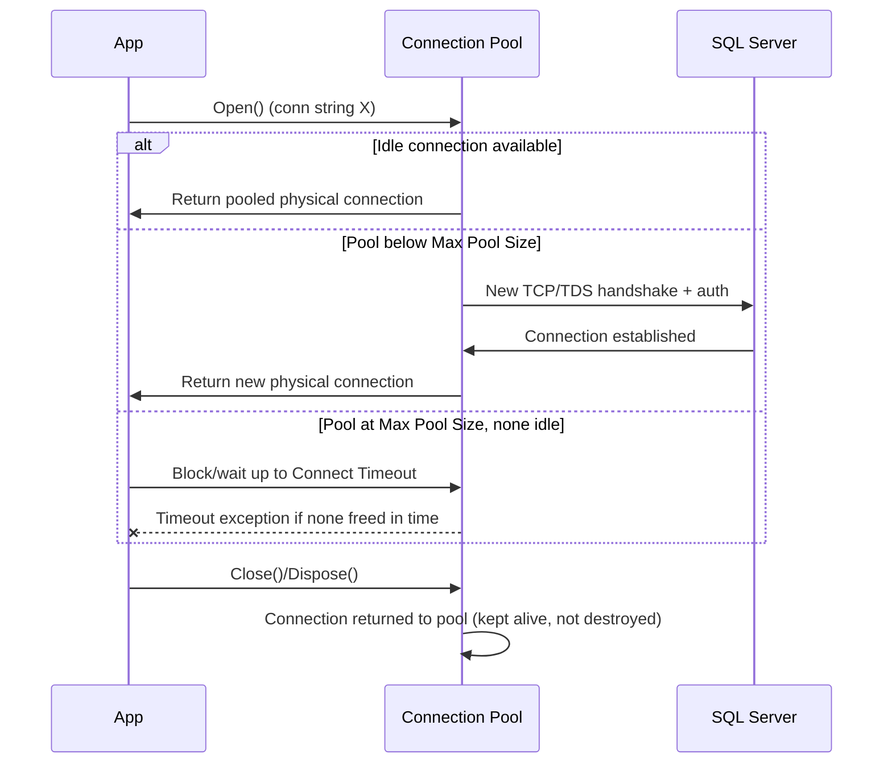
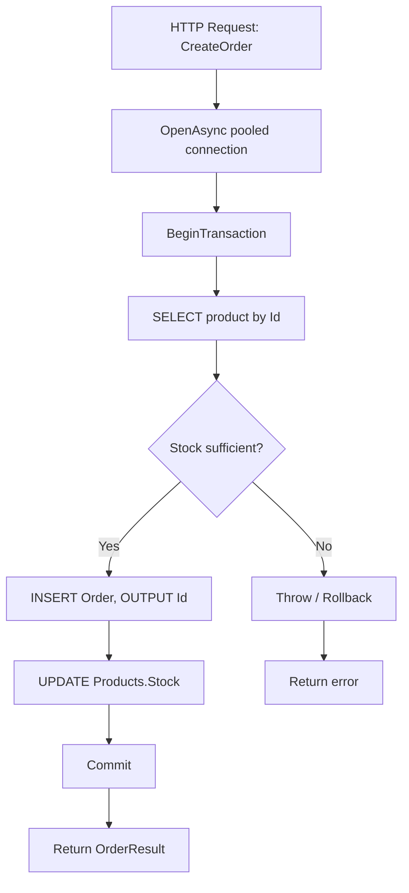

# ADO.NET — Interview Revision Notes

> Quick-revision Q&A derived from `B. ADO.NET-Interview-Guide.md`. Covers every section of the source.

## 1. Core Concepts

### 1.1 What Is ADO.NET

**Q: What is ADO.NET and what does it give you directly?**

A:
- Low-level, provider-based data access framework in .NET for relational (and some non-relational) sources.
- Direct connection management, direct SQL/stored-procedure execution, raw result retrieval, manual transaction control.
- Offers both a connected (streaming) and disconnected (in-memory) data model.

**Q: Why is ADO.NET generally faster/leaner than an ORM?**

A: It skips the mapping, change-tracking, and LINQ-translation layers ORMs add — you write mapping code yourself, trading boilerplate for speed and lower memory use.

**Q: Where is ADO.NET typically used today?**

A: High-throughput APIs, reporting/analytics endpoints, bulk data pipelines, latency-sensitive microservices, and legacy enterprise systems. It's also the substrate `Dapper` and `EF Core` are built on (`DbConnection`/`DbCommand` underneath).

### 1.2 Core Architecture: Connected vs Disconnected

**Q: What are the two ADO.NET architecture models?**

A:
- **Connected**: live connection held open, data streamed row-by-row, implemented via `DataReader`.
- **Disconnected**: data pulled once into an in-memory `DataSet`/`DataTable`, connection can close right after the fill, implemented via `DataAdapter`.



**Q: Which model do senior engineers default to today?**

A: The connected model (`DataReader`), or better, a micro-ORM/ORM built on it (Dapper/EF Core) for anything beyond trivial CRUD. Hand-rolled `DataSet` usage is now rare and mostly seen in legacy WinForms/data-binding code.

### 1.3 Data Providers

**Q: What is a Data Provider in ADO.NET?**

A: The set of classes targeting one specific database engine (SQL Server, Oracle, MySQL, PostgreSQL...). The object model (`Connection`, `Command`, `DataReader`, `DataAdapter`, `Transaction`) is consistent across providers; the implementation differs per engine.

**Q: Which SQL Server provider should new projects use, and why not the older one?**

A: Use **`Microsoft.Data.SqlClient`** (actively developed) instead of legacy **`System.Data.SqlClient`** (maintenance mode). The newer package supports Always Encrypted, Azure AD auth, TDS 8.0/strict encryption, UTF-8, and newer TLS.

### 1.4 Connection Management & Connection Strings

**Q: What are the typical connection-string components?**

A:
- Server/Data Source, Initial Catalog (database)
- Authentication (Windows/Integrated, SQL login, Azure AD/Managed Identity)
- `Connect Timeout`
- Encryption (`Encrypt=True`, `TrustServerCertificate`)
- Pooling settings (`Pooling`, `Min Pool Size`, `Max Pool Size`)

```
Server=myServer;Database=myDb;Trusted_Connection=True;
```

**Q: What are the connection-management best practices?**

A:
- Open as late as possible, close as early as possible.
- Always wrap in `using`/`using var` so `Dispose()` runs even on exceptions.
- Never cache/share one long-lived `SqlConnection` across requests — let pooling handle reuse.

```csharp
using (SqlConnection conn = new SqlConnection(connectionString))
{
    conn.Open();
    // work
}
```

### 1.5 Command Execution

**Q: What `CommandType` options exist for `SqlCommand`?**

A:
- `Text` — raw SQL (default)
- `StoredProcedure`
- `TableDirect` — rarely used, mainly an Access/OLE DB/ODBC concept, not practically used with `Microsoft.Data.SqlClient` against SQL Server

```csharp
SqlCommand cmd = new SqlCommand("SELECT * FROM Users", conn);
```

**Q: Why avoid `SELECT *`?**

A: Schema drift breaks column-ordinal-based reads, wastes bandwidth on unused columns, and can prevent covering-index usage on the server.

### 1.6 Execution Methods (ExecuteReader / ExecuteNonQuery / ExecuteScalar)

**Q: What does each core execution method return and when do you use it?**

A:

| Method | Returns | Typical Use |
|---|---|---|
| `ExecuteReader()` | `SqlDataReader` (streaming) | SELECT with multiple rows/columns |
| `ExecuteNonQuery()` | `int` (rows affected) | INSERT/UPDATE/DELETE/DDL |
| `ExecuteScalar()` | `object` (first column, first row) | Aggregates, existence checks |

```csharp
// ExecuteReader
using (SqlDataReader reader = cmd.ExecuteReader())
{
    while (reader.Read())
    {
        string name = reader["Name"].ToString();
    }
}

// ExecuteScalar
SqlCommand countCmd = new SqlCommand("SELECT COUNT(*) FROM Users", conn);
int count = (int)countCmd.ExecuteScalar();
```

**Q: What's the `ExecuteScalar()` null gotcha?**

A: An empty result set returns C# `null`; a `NULL` value in the selected cell returns `DBNull.Value`. Guard against both before casting.

## 2. Intermediate Topics

### 2.1 Parameterized Queries & SQL Injection Prevention

**Q: Why use parameterized queries beyond just preventing SQL injection?**

A: They also let SQL Server reuse cached execution plans instead of recompiling for every literal value — concatenated SQL text defeats plan caching entirely.

**Wrong (vulnerable, and defeats plan caching):**

```csharp
string sql = "SELECT * FROM Users WHERE Name = '" + userInput + "'";
```

**Correct:**

```csharp
cmd.Parameters.Add("@Name", SqlDbType.VarChar, 100).Value = userInput;
```

**Q: What's the real gotcha with `AddWithValue` vs explicit typing?**

A: `AddWithValue` infers `SqlDbType`/length from the CLR value at runtime; a `string` of varying lengths can generate a different parameter signature per call (e.g., implicit `nvarchar(4)` vs `nvarchar(12)`), fragmenting/bloating the plan cache. Explicit typing pins the signature so SQL Server reuses one plan:

```csharp
// Works, but infers SqlDbType from the CLR value at runtime
cmd.Parameters.AddWithValue("@UserId", 1);

// Preferred: explicit type/size avoids plan-cache bloat and type-mismatch surprises
cmd.Parameters.Add("@UserId", SqlDbType.Int).Value = 1;
```

### 2.2 DataReader (Connected Model) Deep Dive

**Q: What are `DataReader`'s core characteristics?**

A: Requires an open connection for the whole iteration; forward-only, read-only cursor (no seeking/in-place edits); lowest memory footprint since only the current row is materialized.

```csharp
using (SqlDataReader reader = cmd.ExecuteReader())
{
    while (reader.Read())
    {
        string name = reader["Name"].ToString();
    }
}
```

**Q: How do you avoid ordinal/column-name lookup cost in a hot loop?**

A: Cache the ordinal once via `reader.GetOrdinal("Name")`, then use typed accessors (`GetString(ordinal)`, `GetInt32(ordinal)`) instead of the string indexer, which boxes and does a name lookup every row.

### 2.3 DataSet / DataTable / DataAdapter (Disconnected Model) Deep Dive

```csharp
SqlDataAdapter adapter = new SqlDataAdapter(query, conn);
DataTable table = new DataTable();
adapter.Fill(table);
```

**Q: What are the advantages of `DataSet`/`DataAdapter`?**

A: Offline processing, built-in change tracking (`AcceptChanges`/`RejectChanges`), native data-binding (WinForms/legacy WebForms), and `adapter.Update()` can push edits back via auto-generated INSERT/UPDATE/DELETE from `SqlCommandBuilder`.

**Q: What are the disadvantages, and when is this model still appropriate?**

A: Significantly higher memory use (every column boxed as `object` in `DataRow`), slower than `DataReader`, dated API. Reserve it for extending an existing WinForms/WebForms codebase already built around it — new code should use `DataReader` + mapping, Dapper, or EF Core.

### 2.4 Transactions & ACID

**Q: What does ACID stand for?**

A:
- **Atomicity** — all operations succeed or none do.
- **Consistency** — DB moves between valid states; constraints never violated mid-way.
- **Isolation** — concurrent transactions don't see each other's uncommitted changes (degree configurable).
- **Durability** — committed changes survive a crash (write-ahead log).

**Q: What are the senior-level rules for handling transactions correctly?**

A:
- Keep the transaction scope as small as possible.
- Never do network calls, user I/O, or long computation inside an open transaction — it holds locks and blocks other sessions.
- Always rethrow after `Rollback()` unless deliberately converting the failure into a different outcome.

```csharp
SqlTransaction transaction = conn.BeginTransaction();

try
{
    cmd.Transaction = transaction;
    cmd.ExecuteNonQuery();
    transaction.Commit();
}
catch
{
    transaction.Rollback();
    throw; // don't swallow — rethrow after rollback
}
```

### 2.5 Error Handling

**Q: Why catch `SqlException` specifically instead of generic `Exception`?**

A: It lets you branch on `ex.Number` for specific error codes (e.g., 1205 = deadlock victim, -2 = timeout, 4060 = invalid DB) to distinguish transient (often safely retryable) from permanent failures like constraint violations (2627/2601) or permission errors (229/230).

```csharp
try
{
    // DB operation
}
catch (SqlException ex)
{
    // Inspect ex.Number for specific SQL Server error codes
    // (e.g., 1205 = deadlock victim, -2 = timeout, 4060 = invalid DB)
    // log error with correlation id
    throw;
}
```

## 3. Advanced Topics

### 3.1 Connection Pooling Internals & Tuning

**Q: How does connection pooling actually work?**

A:
- Pool is keyed by the **exact connection string** (plus identity settings) — even a space or case difference creates a *separate* pool.
- `Open()` asks the pool for an idle connection; if valid, it's returned instantly (no handshake).
- `Close()`/`Dispose()` **returns the connection to the pool**, it does not tear down the TCP connection — this is why "open late, close early" is cheap.
- If none idle and pool is below `Max Pool Size` (default 100), a new physical connection is created.
- If at `Max Pool Size` with none free, the caller **blocks** up to `Connect Timeout`, then throws `InvalidOperationException` — the classic symptom of a **connection leak**.
- Idle connections above `Min Pool Size` can be pruned after ~4-8 minutes of inactivity.



**Q: What are the key pooling tuning knobs?**

A:

| Keyword | Effect |
|---|---|
| `Pooling` | Disable only for diagnostics |
| `Max Pool Size` | Ceiling on concurrent physical connections (default 100) |
| `Min Pool Size` | Pre-warms N connections to avoid cold-start latency |
| `Connect Timeout` | How long `Open()` waits before failing |
| `Connection Lifetime` | Forces recycling of older connections (useful for failover) |

**Q: What's the senior-level insight about pool exhaustion?**

A: It's almost always an application bug — leaked/undisposed connections, or one connection opened per loop item — not a "raise `Max Pool Size`" problem. Find the leak first.

### 3.2 Async ADO.NET & CancellationToken

**Q: Does async ADO.NET make a single query faster?**

A: No. Async improves **throughput/scalability** (how many concurrent requests the server handles), not the latency of one call — it frees the thread to do other work while waiting, it doesn't speed up the DB round trip itself.

**Q: What are the key async members, and how should `CancellationToken` be used?**

A: `OpenAsync`, `ExecuteReaderAsync`, `ExecuteNonQueryAsync`, `ExecuteScalarAsync`, `ReadAsync`, `NextResultAsync`. Propagate the token through every async DB call (wire to `HttpContext.RequestAborted`) so client disconnects actually abort the in-flight SQL command.

```csharp
await conn.OpenAsync(token);
using SqlCommand cmd = new SqlCommand(sql, conn);
using SqlDataReader reader = await cmd.ExecuteReaderAsync(token);
while (await reader.ReadAsync(token))
{
    // ...
}
```

**Q: What's a common async mistake?**

A: Mixing sync and async — calling `.Result`, `.Wait()`, or `GetAwaiter().GetResult()` on an async DB call. This can deadlock under a synchronization context and defeats the purpose of going async.

### 3.3 Transaction Isolation Levels & TransactionScope (Ambient Transactions)

**Q: What do the standard isolation levels prevent?**

A:

| Isolation Level | Dirty Read | Non-Repeatable Read | Phantom Read |
|---|---|---|---|
| `ReadUncommitted` | Possible | Possible | Possible |
| `ReadCommitted` (SQL Server default) | Prevented | Possible | Possible |
| `RepeatableRead` | Prevented | Prevented | Possible |
| `Serializable` | Prevented | Prevented | Prevented |
| `Snapshot` (row-versioning) | Prevented | Prevented | Prevented |

```csharp
using SqlTransaction tx = conn.BeginTransaction(IsolationLevel.ReadCommitted);
```

**Q: What is `TransactionScope` and why use it?**

A: It wraps ADO.NET calls (even multiple resources) in a transaction without manually threading a `SqlTransaction` object through every command — `System.Transactions` auto-detects the ambient transaction and enlists connections.

```csharp
using (var scope = new TransactionScope(
           TransactionScopeAsyncFlowOption.Enabled)) // required for async code paths
{
    using var conn = new SqlConnection(connectionString);
    await conn.OpenAsync();
    // command automatically enlists in the ambient transaction
    await cmd.ExecuteNonQueryAsync();

    scope.Complete(); // marks success; omit/throw to roll back
}
```

**Q: What are the `TransactionScope` gotchas?**

A:
- Forgetting `TransactionScopeAsyncFlowOption.Enabled` breaks the ambient transaction flowing across `await` boundaries.
- Two different connections enlisting in one scope escalates to a heavier **DTC/MSDTC** distributed transaction — historically a Windows-only limitation on Linux/containers (verify current state for your SQL Server version).
- Defaults to **`Serializable`** isolation if not overridden — a common source of unexpected blocking vs the DB's `ReadCommitted` default.

### 3.4 Multiple Active Result Sets (MARS)

**Q: What problem does MARS solve?**

A: By default a single `SqlConnection` allows only one active `DataReader` at a time (a second throws `InvalidOperationException`). `MultipleActiveResultSets=True` allows interleaved batches/readers on one physical connection.

```
Server=.;Database=ShopDB;Trusted_Connection=True;MultipleActiveResultSets=True;
```

**Q: Is MARS a performance feature?**

A: No — it's a convenience. Interleaved operations are still serialized on the wire (cooperative multiplexing, not true parallelism) and add server-side session overhead. Most seniors prefer restructuring code (load lookups first, use a JOIN) over relying on MARS; EF Core enables it internally by default for exactly this scenario.

### 3.5 SqlBulkCopy for High-Volume Inserts

**Q: How do you efficiently insert millions of rows?**

A: Use `SqlBulkCopy` instead of row-by-row `ExecuteNonQuery` — it streams rows via SQL Server's native TDS bulk-load protocol, bypassing per-row overhead:

```csharp
using var bulkCopy = new SqlBulkCopy(connection, SqlBulkCopyOptions.Default, transaction)
{ DestinationTableName = "dbo.Orders", BatchSize = 5000 };
await bulkCopy.WriteToServerAsync(dataTable, cancellationToken);
```

**Q: What correctness gotcha does `SqlBulkCopy` have by default?**

A: It skips constraint checks and trigger firing by default for speed (`SqlBulkCopyOptions.KeepIdentity`, `CheckConstraints`, `FireTriggers` control this) — a real gotcha if business logic depends on triggers.

**Q: When would you NOT use `SqlBulkCopy`?**

A: For small batches, or when you need per-row error handling/business validation — plain parameterized batched inserts are simpler and safer.

### 3.6 Reading & Streaming Large Objects (BLOBs/CLOBs)

**Q: How do you stream a large BLOB column without loading it fully into memory?**

A: Use `CommandBehavior.SequentialAccess` on `ExecuteReaderAsync`, then `reader.GetStream()` (or `GetTextReader()`/`GetSqlBytes()`) to copy incrementally instead of casting the whole column via the indexer.

```csharp
using SqlDataReader reader = await cmd.ExecuteReaderAsync(
    CommandBehavior.SequentialAccess, token); // required for true streaming

if (await reader.ReadAsync(token))
{
    using Stream blobStream = reader.GetStream(reader.GetOrdinal("FileContent"));
    using Stream output = File.Create(destinationPath);
    await blobStream.CopyToAsync(output, token);
}
```

**Q: What's the constraint when using `SequentialAccess`?**

A: Columns must be read in ordinal order and only once — you trade random column access for not buffering the whole row, avoiding Large Object Heap pressure from big `byte[]` allocations.

### 3.7 Retry & Resilience for Transient Faults

**Q: How should a senior implementation handle transient SQL faults?**

A:
- Classify by `SqlException.Number`: transient (40613, 40501, 40197, 4060, 1205 deadlock, -2 timeout) vs non-transient (2627 constraint, 18456 auth, syntax errors).
- Use `Microsoft.Data.SqlClient`'s `SqlRetryLogicBaseProvider` (v3+) or Polly for a provider-agnostic policy.
- Use exponential backoff with jitter to avoid thundering-herd retries.
- Never retry blindly.

```csharp
// Example: Polly-based retry around a transient SqlException
var retryPolicy = Policy
    .Handle<SqlException>(ex => IsTransient(ex.Number))
    .WaitAndRetryAsync(3, attempt =>
        TimeSpan.FromMilliseconds(200 * Math.Pow(2, attempt)) +
        TimeSpan.FromMilliseconds(Random.Shared.Next(0, 100))); // jitter

await retryPolicy.ExecuteAsync(async ct =>
{
    await conn.OpenAsync(ct);
    await cmd.ExecuteNonQueryAsync(ct);
}, token);
```

**Q: Why does idempotency matter for retries?**

A: Retrying a non-idempotent write (e.g., a bare `INSERT`) after a lost ack — when the server actually committed — can duplicate rows/side effects. Wrap the retryable unit in a transaction or use a dedupe key.

### 3.8 High-Scale End-to-End Example

**Q: What does the `CreateOrderAsync` example demonstrate?**

A: Async calls end-to-end, a pooled connection, one transaction spanning a stock-check SELECT + an INSERT (`OUTPUT INSERTED.Id`) + an UPDATE, parameterized commands, `CancellationToken` propagation, `using` blocks for deterministic disposal, and rollback+rethrow on failure.



```csharp
public async Task<OrderResult> CreateOrderAsync(
    int productId,
    int quantity,
    CancellationToken token)
{
    string connectionString = "Server=.;Database=ShopDB;Trusted_Connection=True;";

    using SqlConnection conn = new SqlConnection(connectionString);
    await conn.OpenAsync(token);

    using SqlTransaction transaction = conn.BeginTransaction();

    try
    {
        // 1. Read product information
        SqlCommand productCmd = new SqlCommand(
            @"SELECT Id, Name, Price, Stock
              FROM Products
              WHERE Id = @ProductId",
            conn,
            transaction);

        productCmd.Parameters.Add("@ProductId", SqlDbType.Int).Value = productId;

        Product product = null;

        using (SqlDataReader reader = await productCmd.ExecuteReaderAsync(token))
        {
            if (await reader.ReadAsync(token))
            {
                product = new Product
                {
                    Id = reader.GetInt32(0),
                    Name = reader.GetString(1),
                    Price = reader.GetDecimal(2),
                    Stock = reader.GetInt32(3)
                };
            }
        }

        if (product == null)
            throw new Exception("Product not found");

        if (product.Stock < quantity)
            throw new Exception("Insufficient stock");

        // 2. Insert order
        SqlCommand orderCmd = new SqlCommand(
            @"INSERT INTO Orders(ProductId, Quantity, TotalAmount)
              OUTPUT INSERTED.Id
              VALUES(@ProductId, @Qty, @Total)",
            conn,
            transaction);

        orderCmd.Parameters.Add("@ProductId", SqlDbType.Int).Value = productId;
        orderCmd.Parameters.Add("@Qty", SqlDbType.Int).Value = quantity;
        orderCmd.Parameters.Add("@Total", SqlDbType.Decimal).Value = product.Price * quantity;

        int orderId = (int)await orderCmd.ExecuteScalarAsync(token);

        // 3. Update inventory
        SqlCommand stockCmd = new SqlCommand(
            @"UPDATE Products
              SET Stock = Stock - @Qty
              WHERE Id = @ProductId",
            conn,
            transaction);

        stockCmd.Parameters.Add("@Qty", SqlDbType.Int).Value = quantity;
        stockCmd.Parameters.Add("@ProductId", SqlDbType.Int).Value = productId;

        await stockCmd.ExecuteNonQueryAsync(token);

        transaction.Commit();

        return new OrderResult
        {
            OrderId = orderId,
            ProductName = product.Name,
            Quantity = quantity
        };
    }
    catch
    {
        transaction.Rollback();
        throw;
    }
}
```

Supporting models:

```csharp
public class Product
{
    public int Id;
    public string Name;
    public decimal Price;
    public int Stock;
}

public class OrderResult
{
    public int OrderId;
    public string ProductName;
    public int Quantity;
}
```

**Q: What does the companion `GetProducts` example show?**

A: The disconnected model — `SqlDataAdapter.Fill(DataTable)` as a batch-retrieval alternative to `DataReader`.

```csharp
public DataTable GetProducts()
{
    using SqlConnection conn = new SqlConnection(_connectionString);

    SqlCommand cmd = new SqlCommand(
        "SELECT Id, Name, Price, Stock FROM Products",
        conn);

    SqlDataAdapter adapter = new SqlDataAdapter(cmd);
    DataTable table = new DataTable();
    adapter.Fill(table);

    return table;
}
```

## 4. Performance

### 4.1 Performance Best Practices

**Q: What are the core ADO.NET performance best practices?**

A:
- Always use parameterized queries (security + plan-cache reuse).
- Avoid `SELECT *`; name columns explicitly.
- Verify indexes support WHERE/JOIN/ORDER BY predicates.
- Prefer `DataReader` (or a thin mapper) for read-heavy, high-throughput paths.
- Minimize connection open time; let pooling absorb churn.
- Avoid `DataSet`/`DataTable` unless disconnected/data-binding semantics are truly needed.
- Batch operations (multi-row inserts, table-valued parameters, `SqlBulkCopy` for large volumes).
- Cache reader ordinals in hot loops; use typed `Get*` accessors.
- Use `CommandBehavior.SequentialAccess` + streaming for large columns.
- Prefer async all the way through the call stack server-side.

### 4.2 ADO.NET vs Dapper vs EF Core Trade-offs

**Q: How do ADO.NET, Dapper, and EF Core compare?**

A:

| Aspect | ADO.NET | Dapper | EF Core |
|---|---|---|---|
| Abstraction | None | Minimal (maps to objects) | High (LINQ, change tracking) |
| Performance | Fastest | ~5-10% overhead vs raw | Slower for pure reads |
| Productivity | Lowest | Medium | Highest |
| Change tracking | Manual | None | Built-in `DbContext` |
| Migrations | None | None | Built-in |
| Best fit | Bulk ops, streaming, hot paths | Reporting/read-heavy APIs | CRUD-heavy business apps |


**Q: What's the senior talking point on mixing these technologies?**

A: It's common and legitimate to mix them — EF Core for the transactional/CRUD core, ADO.NET/Dapper for reporting, bulk jobs, and hot paths. Don't rewrite everything for performance; profile first, then selectively drop abstraction only where it's proven to matter.

**Q: What EF Core features close much of the historical performance gap?**

A: `AsNoTracking()`, compiled queries, and `ExecuteUpdate`/`ExecuteDelete` (EF Core 7+) — for read-only and bulk-update scenarios, without abandoning the ORM.

### 4.3 ExecuteUpdate / ExecuteDelete (EF Core 7+) — Closing the Bulk-Operation Gap

**Q: What problem did EF Core's change-tracking model create for bulk updates/deletes historically?**

A: Updating/deleting many rows required loading each entity into the change tracker, mutating it, and calling `SaveChanges()` — one round trip per entity's worth of state, plus tracker overhead, for what was conceptually a single set-based statement.

**Q: What do `ExecuteUpdateAsync`/`ExecuteDeleteAsync` do?**

A: Compile a LINQ query directly into a single set-based `UPDATE`/`DELETE` SQL statement executed immediately, bypassing the change tracker and `SaveChanges()`:

```csharp
// Single UPDATE statement, no entities loaded into the change tracker
await dbContext.Products
    .Where(p => p.CategoryId == 5)
    .ExecuteUpdateAsync(s => s.SetProperty(p => p.Discontinued, true));

// Single DELETE statement, same principle
await dbContext.Orders
    .Where(o => o.CreatedAt < cutoffDate)
    .ExecuteDeleteAsync();
```

**Q: Does this close the performance gap for bulk INSERTs too?**

A: No — only `UPDATE`/`DELETE`. Bulk **INSERT** still favors `SqlBulkCopy`, which streams over the native TDS bulk-load protocol, a fundamentally different code path than EF Core's LINQ-to-SQL translation.

**Q: Does `ExecuteUpdate` still respect global query filters and interceptors?**

A: Yes — it still goes through EF Core's query pipeline (model, filters, value converters); it just skips the change tracker and produces one SQL statement instead of per-entity round trips.

### 4.4 Managed Identity / Azure AD Authentication with Microsoft.Data.SqlClient

**Q: What is a Managed Identity, and why does it matter for SQL auth?**

A: An Azure AD (Entra ID) identity Azure auto-provisions and binds to a specific resource (App Service, VM, Function, etc.). The app authenticates as that resource's identity with no password/secret/certificate to store or rotate.

**Q: System-assigned vs user-assigned managed identity?**

A: System-assigned is tied 1:1 to the resource's lifecycle (deleted with it). User-assigned is a standalone resource you create once and attach to multiple compute resources — useful for a shared identity/permission set.

**Q: How does `Microsoft.Data.SqlClient` use managed identity?**

A: Via the `Authentication` connection-string keyword:

```
Authentication=Active Directory Managed Identity;
```

For user-assigned identity, also add `User Id=<managed-identity-client-id>`. The driver acquires the AAD token transparently on `Open()`.

```
# For user-assigned managed identity, also specify the identity's client ID:
Server=tcp:myserver.database.windows.net,1433;Database=myDb;Authentication=Active Directory Managed Identity;User Id=<managed-identity-client-id>;Encrypt=True;
```

```csharp
using Microsoft.Data.SqlClient;

var connectionString =
    "Server=tcp:myserver.database.windows.net,1433;Database=myDb;" +
    "Authentication=Active Directory Managed Identity;Encrypt=True;";

using SqlConnection conn = new SqlConnection(connectionString);
await conn.OpenAsync(); // driver acquires the AAD token transparently on Open()
```

**Q: What does `Authentication=Active Directory Default` do?**

A: Delegates to a credential-discovery chain (managed identity in Azure, falling back to environment variables/Azure CLI/Visual Studio login locally) — the same connection string works in Azure and on a dev machine.

**Q: When would you use `Azure.Identity`'s `DefaultAzureCredential` directly instead of the `Authentication` keyword?**

A: When you need more control — custom credential chains, explicit tenant targeting, caching, or acquiring tokens for other Azure resources. Fetch the token yourself and assign it to `SqlConnection.AccessToken` before `Open()`.

```csharp
using Azure.Identity;
using Azure.Core;
using Microsoft.Data.SqlClient;

var credential = new DefaultAzureCredential();
var tokenRequestContext = new TokenRequestContext(new[] { "https://database.windows.net/.default" });
AccessToken token = await credential.GetTokenAsync(tokenRequestContext);

using SqlConnection conn = new SqlConnection(
    "Server=tcp:myserver.database.windows.net,1433;Database=myDb;Encrypt=True;");
conn.AccessToken = token.Token;
await conn.OpenAsync();
```

**Q: Why is managed identity the modern recommended posture over SQL-login credentials?**

A:
- Eliminates secret sprawl (no password in `appsettings.json`/CI variables to leak).
- Automatic credential rotation managed by Azure.
- Centralized access control via Entra ID/Azure RBAC (`CREATE USER ... FROM EXTERNAL PROVIDER`).
- Reduced blast radius — tokens are short-lived, scoped, and revocable at the resource level.

## 5. Best Practices

**Q: What are the core disposal, parameterization, and connection rules?**

A:
- Use `using`/`using var` for every `IDisposable` (`SqlConnection`, `SqlCommand`, `SqlDataReader`, `SqlTransaction`).
- Always parameterize — never concatenate user input into SQL text.
- Explicitly type/size parameters (`SqlDbType` + length) rather than relying purely on `AddWithValue`.
- Open connections late, dispose early; trust pooling to absorb churn.

**Q: What are the transaction and async best practices?**

A:
- Keep transactions short — no network calls, user waits, or heavy computation inside an open transaction.
- Rethrow after `Rollback()` — don't swallow transaction failures.
- Prefer async DB APIs everywhere server-side; propagate `CancellationToken`.

**Q: What are the tooling and error-handling best practices?**

A:
- Choose the right tool per operation: `DataReader`/Dapper for read-heavy hot paths, EF Core for CRUD-heavy logic, `SqlBulkCopy` for bulk loads.
- Catch `SqlException` specifically (not bare `Exception`) to branch on error number for retry decisions.
- Set `CommandTimeout` deliberately for long-running reports/batch jobs.

## 6. Common Pitfalls

**Q: What are the classic ADO.NET pitfalls (1-8)?**

A:
1. Misreading "open late, close early" as wasteful — closing just returns the connection to the pool.
2. String-concatenated SQL — injection risk, defeats plan-cache reuse.
3. Keeping connections open unnecessarily — risks pool exhaustion, hurts scalability.
4. Not disposing readers/connections/transactions — leaks, pool starvation, lingering locks.
5. Ignoring async — sync DB calls on a web API thread cause thread-pool starvation under load.
6. Using `DataSet`/`DataTable` out of habit — heavier and slower than needed.
7. Not handling transactions — partial multi-statement writes leave the DB inconsistent.
8. Not being able to explain performance differences (DataReader vs DataSet, ADO.NET vs ORM, parameterized vs inline SQL, sync vs async throughput impact).

**Q: What are the newer pitfalls added around resilience and async (9-11)?**

A:
9. **Blind retries on transient faults** — retrying non-idempotent writes without a transaction/dedupe boundary, or retrying non-transient errors and masking real bugs.
10. **Assuming async makes a single query faster** — async buys concurrency/scalability, not lower latency for one call.
11. **Forgetting `TransactionScopeAsyncFlowOption.Enabled`** — ambient transaction doesn't flow across `await`, or two enlisted connections unexpectedly escalate to a DTC distributed transaction.

## 7. Sample Interview Q&A

**Q: Why is ADO.NET faster than an ORM like EF Core?**

A: No change-tracking, no LINQ-to-SQL translation, no entity materialization/proxying — you execute SQL directly and map only what you asked for. Trade-off: you own the mapping/SQL, and lose migrations/navigation properties/LINQ composability.

**Q: When would you choose `DataReader` over EF Core?**

A: High-throughput reads, large/streamed result sets, reporting queries, or any hot path where profiling shows ORM overhead matters. For CRUD-heavy business logic, EF Core wins on maintainability/dev speed.

**Q: Explain connection pooling's impact, including a failure mode you've seen.**

A: Pooling reuses physical connections keyed by connection string, avoiding a new TCP/TDS handshake per `Open()`. `Close()`/`Dispose()` returns the connection rather than destroying it. Failure mode: a connection leak (undisposed connection on some exception path) exhausts the pool — every subsequent `Open()` blocks until `Connect Timeout` and throws.

**Q: How do you handle transactions correctly, and how do isolation levels relate?**

A: Keep scope minimal, commit/rollback promptly, always rethrow after rollback. Isolation level controls how much concurrent transactions see of each other's changes; `ReadCommitted` is the SQL Server default baseline, while `Serializable`/`Snapshot` prevent phantom/non-repeatable reads at the cost of more blocking/versioning overhead.

**Q: Does async ADO.NET make a single query run faster?**

A: No — the query takes the same time server-side. Async frees the calling thread from blocking on I/O, so the server handles more concurrent requests with the same thread pool. The win is throughput, not per-call latency.

**Q: How would you insert 2 million rows efficiently?**

A: Not row-by-row `ExecuteNonQuery` — use `SqlBulkCopy`, streaming via SQL Server's native bulk-load protocol. Stream from an `IDataReader` source rather than materializing a full `DataTable` if memory is a concern. Remember it skips triggers/constraint checks by default unless opted in.

**Q: What's the difference between `AddWithValue` and explicitly-typed parameters, and why does it matter?**

A: `AddWithValue` infers type/size from the runtime value, producing varying parameter signatures across calls and fragmenting the plan cache. Explicit `Add(name, SqlDbType, size)` pins the signature so SQL Server reuses one execution plan.

**Q: When would you use `TransactionScope` instead of `SqlTransaction`?**

A: When a logical unit of work spans multiple `SqlConnection` instances (or resource managers), or to keep transaction demarcation separate from data-access code. Watch for accidental DTC escalation with two enlisted connections, and remember the default is `Serializable` isolation unless overridden.
