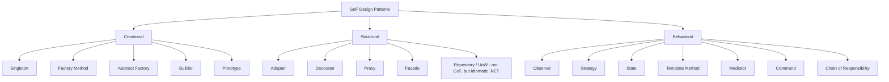
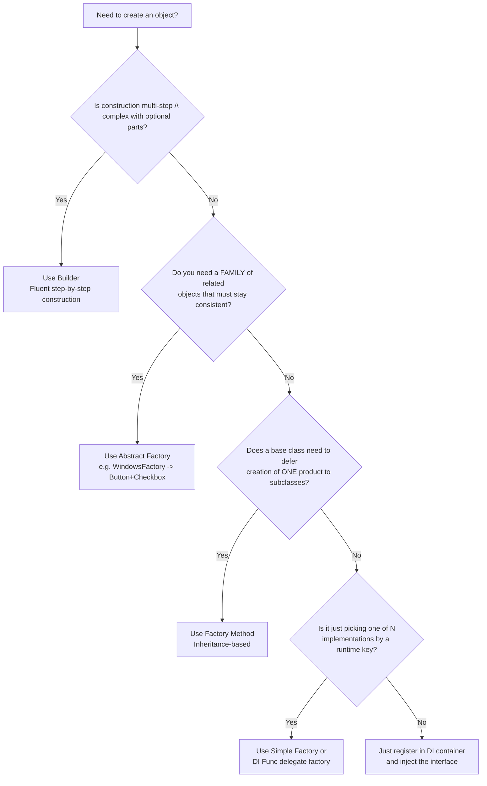
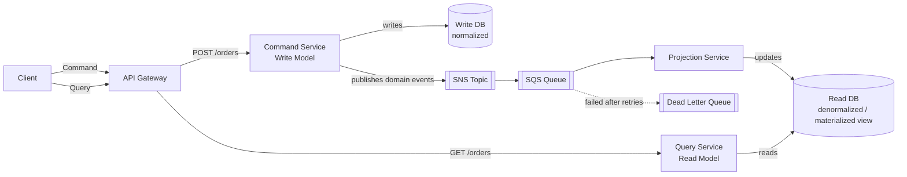
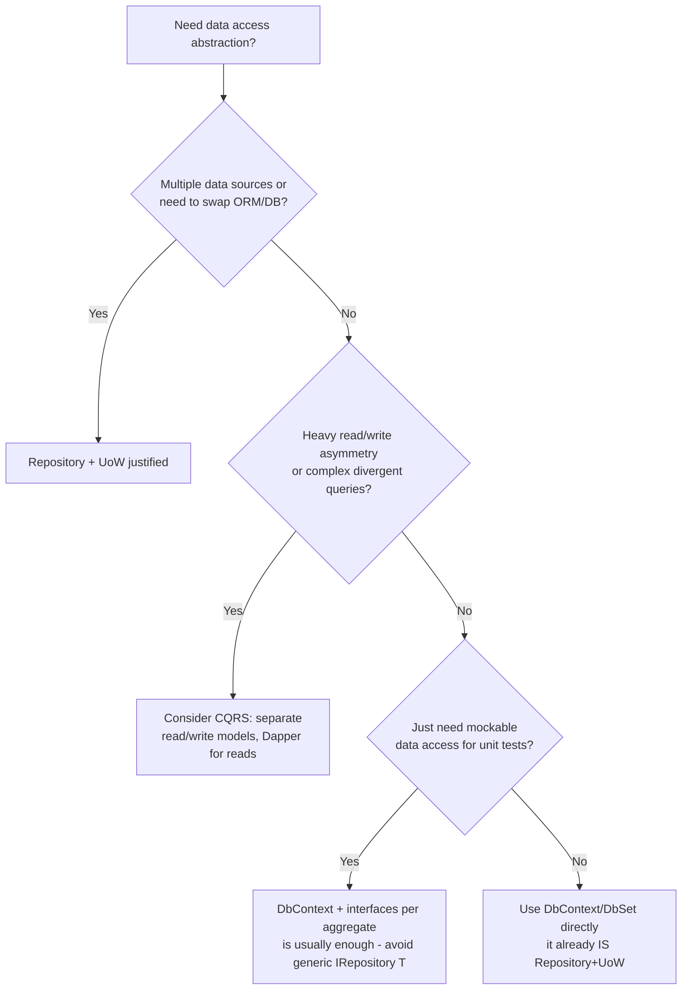

# Design Patterns — Interview Revision Notes

> Quick-revision Q&A derived from `C. Design-Patterns-Interview-Guide.md`. Covers every section of the source.

## Core Concepts

**Q: What is a design pattern, and why do teams use them?**

A: A reusable, named solution to a recurring design problem. They give teams shared vocabulary and encode hard-won trade-offs so problems don't get rediscovered from scratch.

**Q: How does the GoF book classify the 23 patterns?**

A:
- Creational — control how objects are created (Singleton, Factory Method, Abstract Factory, Builder, Prototype).
- Structural — control how objects/classes are composed (Adapter, Decorator, Proxy, Facade, Composite, Bridge, Flyweight).
- Behavioral — control how objects communicate/collaborate (Observer, Strategy, State, Template Method, Command, Chain of Responsibility, Mediator, Iterator, Visitor, Memento).



**Q: What's the senior-level framing an interviewer wants to hear when asked "what pattern would you use here?"**

A: Patterns are trade-offs accepted to resolve a specific force (variability, coupling, lifecycle, testability) — not goals in themselves. A strong answer starts with "what problem are we solving — do we need a pattern at all, or does a simple function/DI registration suffice?"

## Creational Patterns

### Singleton

**Q: What is the Singleton pattern's intent, and when should you use it?**

A: Ensure a class has exactly one instance with a global access point. Use for shared, expensive-to-create, effectively stateless/read-only resources — logging, cache wrappers, config snapshots, connection pool managers.

#### Implementations compared

**Q: Which Singleton implementation should you default to in modern C#, and why?**

A: `Lazy<T>` — thread-safe, lazy, cleanest, supports `LazyThreadSafetyMode`. Example:
```csharp
public sealed class Logger
{
    private static readonly Lazy<Logger> _instance = new(() => new Logger());
    public static Logger Instance => _instance.Value;
    private Logger() { }
}
```

**Q: Why is the naive `if (_instance == null)` Singleton broken, and why does double-checked locking need `volatile`?**

A: The naive check has a race condition — two threads can both see null and construct separate instances. Double-checked locking needs `volatile` on the backing field to prevent memory reordering from exposing a partially-constructed object to another thread.

```csharp
// Double-checked locking — must use `volatile` or memory reordering can expose
// a partially-constructed object to another thread.
public sealed class Singleton
{
    private static volatile Singleton? _instance;
    private static readonly object _lock = new();
    private Singleton() { }

    public static Singleton Instance
    {
        get
        {
            if (_instance == null)
            {
                lock (_lock)
                {
                    _instance ??= new Singleton();
                }
            }
            return _instance;
        }
    }
}
```

**Q: Is `_instance ??= new Singleton()` thread-safe?**

A: No — this is a classic interview trick question. `??=` is not atomic; two threads can both observe null and each construct an instance.

```csharp
public sealed class Singleton
{
    private static Singleton? _instance;
    public static Singleton Instance => _instance ??= new Singleton();
}
```
This is **not thread-safe** — `??=` is not atomic; two threads can both observe `null` and construct two instances.

**Q: How do static field/static constructor Singletons differ from `Lazy<T>`?**

A: Static constructors are eager (CLR guarantees single execution per AppDomain) vs `Lazy<T>` which is lazy. `LazyInitializer.EnsureInitialized` is a lower-allocation, more verbose alternative to `Lazy<T>` for perf-critical, multiple-lazy-field scenarios.

#### Singleton in ASP.NET Core DI

**Q: Why prefer a container-managed singleton over a hand-rolled one?**

A: `builder.Services.AddSingleton<ILogger, Logger>()` gives testability (interface + constructor injection instead of static accessor) and the container handles disposal via `IDisposable`/`IAsyncDisposable` at shutdown.

```csharp
builder.Services.AddSingleton<ILogger, Logger>();
```

#### Singleton vs Static Class

**Q: How does Singleton differ from a static class?**

A: Singleton is instance-based, can implement interfaces, and works with DI/mocking; a static class has no instance, can't implement interfaces, and can't be injected or mocked. Singleton can hold state deliberately with control; static classes default to uncontrolled global mutable state.

#### When NOT to use Singleton

**Q: What are the classic misuse scenarios for Singleton?**

A:
- Per-request/per-user state on a Singleton in a web app — `CurrentUser` shared across concurrent requests causes data leakage between users.
- Global state makes tests order-dependent and hard to isolate/mock.
- Violates SRP (mixes creation control with business behavior) and often DIP.
- Distributed/cloud: a Singleton is scoped to one process — 5 pods means 5 independent Singletons; use a distributed lock/lease for cluster-wide coordination instead.
- Never store `HttpContext`/DB connections/short-lived objects in a Singleton — causes the **captive dependency** problem (a Singleton capturing a Scoped/Transient service keeps it alive forever).

#### Preventing Singleton breakage via reflection/serialization

**Q: How do you harden a hand-rolled Singleton against reflection or deserialization creating a second instance?**

A: Mark the class `sealed`, keep the constructor `private`, and implement custom serialization hooks (or `[NonSerialized]`). Reflection can still bypass a private constructor via `Activator.CreateInstance(type, nonPublic: true)` — there's no 100% reflection-proof singleton; the pragmatic fix is to not fight reflection and use DI-managed singletons instead.

#### Singleton Logger — end-to-end example

**Q: What does a full Singleton Logger implementation look like, and why might a guide show both a `lock`-based and a `Lazy<T>`-based version?**

A: Both are shown as a before/after best-practice progression (not a contradiction) — `Lazy<T>` is the modern recommended approach:
```csharp
public sealed class Logger
{
    private static readonly Lazy<Logger> _instance = new(() => new Logger());
    private Logger() { }
    public static Logger Instance => _instance.Value;
    public void Log(string message) { /* write to file */ }
}
```

### Factory Patterns

#### Simple Factory (not a formal GoF pattern)

**Q: What is a Simple Factory, and is it a GoF pattern?**

A: Not formal GoF — just a static method/class returning an implementation based on input (e.g., a `switch` expression returning `INotification` implementations). Cheap and often "good enough."

```csharp
public interface INotification { void Send(string message); }

public class EmailNotification : INotification
{
    public void Send(string message) => Console.WriteLine("Email: " + message);
}
public class SmsNotification : INotification
{
    public void Send(string message) => Console.WriteLine("SMS: " + message);
}

public static class NotificationFactory
{
    public static INotification Create(string type) => type switch
    {
        "email" => new EmailNotification(),
        "sms"   => new SmsNotification(),
        _       => throw new ArgumentException("Invalid notification type")
    };
}
```

#### Factory Method (GoF)

**Q: What is Factory Method's mechanism and trade-off?**

A: A base `Creator` defines an invariant workflow; subclasses override the factory method to decide which concrete product gets created — uses **inheritance**. Keeps the algorithm centralized (good OCP — add new Creator/Product pairs without touching existing code), but inheritance is more rigid than composition and can cause subclass explosion.

```csharp
public interface IProduct { string Operation(); }
public class ConcreteProductA : IProduct { public string Operation() => "Result A"; }
public class ConcreteProductB : IProduct { public string Operation() => "Result B"; }

public abstract class Creator
{
    protected abstract IProduct FactoryMethod();
    public string SomeOperation() => $"Creator: working with {FactoryMethod().Operation()}";
}

public class ConcreteCreatorA : Creator
{
    protected override IProduct FactoryMethod() => new ConcreteProductA();
}
```

#### Abstract Factory (GoF)

**Q: What does Abstract Factory add over Factory Method?**

A: It creates **families of related objects** that must be used together consistently (e.g., `IGuiFactory` producing matching `IButton`+`ICheckbox` for Windows or Mac), wired at runtime via DI/config rather than a single product.

```csharp
public interface IButton { void Paint(); }
public interface ICheckbox { void Paint(); }

public class WindowsButton : IButton { public void Paint() => Console.WriteLine("Windows Button"); }
public class WindowsCheckbox : ICheckbox { public void Paint() => Console.WriteLine("Windows Checkbox"); }
public class MacButton : IButton { public void Paint() => Console.WriteLine("Mac Button"); }
public class MacCheckbox : ICheckbox { public void Paint() => Console.WriteLine("Mac Checkbox"); }

public interface IGuiFactory
{
    IButton CreateButton();
    ICheckbox CreateCheckbox();
}

public class WindowsFactory : IGuiFactory
{
    public IButton CreateButton() => new WindowsButton();
    public ICheckbox CreateCheckbox() => new WindowsCheckbox();
}

public class MacFactory : IGuiFactory
{
    public IButton CreateButton() => new MacButton();
    public ICheckbox CreateCheckbox() => new MacCheckbox();
}

public class Application
{
    private readonly IButton _button;
    private readonly ICheckbox _checkbox;
    public Application(IGuiFactory factory)
    {
        _button = factory.CreateButton();
        _checkbox = factory.CreateCheckbox();
    }
    public void RenderUI() { _button.Paint(); _checkbox.Paint(); }
}
```

Wiring the concrete family at runtime via DI:
```csharp
services.AddTransient<IGuiFactory>(sp =>
{
    var platform = configuration["Ui:Platform"];
    return platform == "windows" ? new WindowsFactory() : (IGuiFactory)new MacFactory();
});
```

**Q: Factory Method vs Abstract Factory — key differences?**

A:
- Scope: one product vs a family of related products.
- Mechanism: inheritance (override a method) vs composition (hold a factory object).
- Extension: add a new Creator subclass vs a new concrete factory implementing the family interface.

#### Factory vs Strategy

**Q: Factory and Strategy both hide a concrete type behind an interface — what's actually different?**

A: Factory decides *how/what object gets created* (chosen by a creation-time key/config), producing a new instance. Strategy decides *which algorithm/behavior runs*, chosen by the client per call, executing behavior on existing collaborators. They compose constantly — a factory often constructs and hands back the chosen Strategy implementation.

```csharp
// Factory picks WHICH strategy to construct...
public static IDiscountStrategy DiscountStrategyFactory(string customerTier) => customerTier switch
{
    "Gold"   => new GoldDiscount(),
    "Silver" => new SilverDiscount(),
    _        => new NoDiscount()
};

// ...Strategy then decides HOW the chosen behavior executes
var strategy = DiscountStrategyFactory(customer.Tier);
var finalTotal = strategy.Apply(orderTotal);
```

#### How DI containers reduce the need for hand-rolled factories

**Q: When is a hand-written Factory class still justified given modern DI containers?**

A: DI containers already provide creation, lifetime management, and implementation selection. A Factory class is justified only when creation logic is genuinely complex, must be pluggable outside the container (e.g., third-party plugin DLLs), or must enforce a family/consistency guarantee (Abstract Factory). For runtime-parameterized creation, inject a `Func<string, IService>` delegate factory instead of writing a factory class.

```csharp
// Instead of:
var service = ServiceFactory.Create("email");
// Do:
var service = provider.GetRequiredService<INotificationService>();
```

```csharp
services.AddTransient<EmailService>();
services.AddTransient<SmsService>();
services.AddTransient<Func<string, IService>>(provider => key => key switch
{
    "email" => provider.GetRequiredService<EmailService>(),
    "sms"   => provider.GetRequiredService<SmsService>(),
    _       => throw new ArgumentException("Invalid type")
});
```

**Q: Name real ASP.NET Core factories you'd cite in an interview.**

A: `IHttpClientFactory` (pools `HttpClient`/handlers, avoids socket exhaustion), `ILoggerFactory` (creates `ILogger<T>`), `IServiceScopeFactory` (creates a DI scope manually, e.g. in a `BackgroundService`), `IMiddlewareFactory` (creates `IMiddleware` via DI).

```csharp
using var scope = scopeFactory.CreateScope();
var service = scope.ServiceProvider.GetRequiredService<IMyScopedService>();
```

**Q: How would you build a plugin architecture that discovers implementations dynamically at runtime?**

A: Scan a plugins folder, load each assembly, then reflect over loaded types for anything implementing the plugin contract:

```csharp
public interface IPlugin { string Name { get; } void Execute(); }

var pluginFolder = Path.Combine(AppContext.BaseDirectory, "Plugins");
foreach (var dll in Directory.GetFiles(pluginFolder, "*.dll"))
    Assembly.LoadFrom(dll);

var plugins = AppDomain.CurrentDomain.GetAssemblies()
    .SelectMany(a => a.GetTypes())
    .Where(t => typeof(IPlugin).IsAssignableFrom(t) && !t.IsInterface && !t.IsAbstract)
    .Select(t => (IPlugin)Activator.CreateInstance(t)!)
    .ToList();

foreach (var plugin in plugins) plugin.Execute();
```
Modern alternative (verify against your target runtime): `System.Runtime.Loader.AssemblyLoadContext` for isolated/unloadable plugin contexts, and `System.Composition`/MEF for attribute-based discovery, are more robust than raw `Assembly.LoadFrom` + `Activator.CreateInstance` in production plugin systems because they support unloading and version isolation.

#### Plugin Factory Versioning & Backward Compatibility

**Q: What four techniques handle plugin versions evolving independently of the host?**

A:
- Adapter layers — wrap an older plugin's interface behind the current contract.
- Versioned interfaces — ship `IPlugin`, `IPluginV2`, etc. instead of silently breaking old plugins.
- Feature negotiation — small optional capability interfaces (`ISupportsAsyncExecute`) probed via `is`/`as`.
- Fallback factories — return a safe Null Object default (e.g., `NoOpPlugin`) instead of throwing when a plugin fails/is incompatible/missing.

**Q: What are the two real risks in plugin factories at scale?**

A: Class explosion and version drift — versioned interfaces plus capability interfaces let host and plugins evolve independently, while adapters and fallback factories prevent one bad plugin from taking down the host process.

```csharp
public interface IPluginV1 { string Name { get; } void Execute(); }
public interface IPluginV2 : IPluginV1 { Task ExecuteAsync(CancellationToken ct); }

// Adapter layer: bridges an old sync-only plugin onto the current async contract
public class PluginAdapter : IPluginV2
{
    private readonly IPluginV1 _legacy;
    public PluginAdapter(IPluginV1 legacy) => _legacy = legacy;
    public string Name => _legacy.Name;
    public void Execute() => _legacy.Execute();
    public Task ExecuteAsync(CancellationToken ct) { _legacy.Execute(); return Task.CompletedTask; }
}

// Fallback factory target: a Null Object plugin, never a thrown exception
public class NoOpPlugin : IPluginV2
{
    public string Name => "NoOp";
    public void Execute() { }
    public Task ExecuteAsync(CancellationToken ct) => Task.CompletedTask;
}

public static IPluginV2 LoadPluginWithFallback(Type pluginType)
{
    try
    {
        var instance = Activator.CreateInstance(pluginType);
        return instance switch
        {
            IPluginV2 v2 => v2,
            IPluginV1 v1 => new PluginAdapter(v1), // versioned interface + adapter layer
            _            => new NoOpPlugin()       // unrecognized/incompatible — fall back safely
        };
    }
    catch
    {
        return new NoOpPlugin(); // load failure (bad DLL, missing dependency) also falls back safely
    }
}
```

### Builder

**Q: What is the Builder pattern's intent, and where do you already use it in .NET?**

A: Separate construction of a complex object from its representation, enabling step-by-step, fluent construction. You already use it via `HostBuilder`, `WebApplicationBuilder`, `DbContextOptionsBuilder`, EF Core Fluent API, and `StringBuilder`.

```csharp
public class Pizza
{
    public string Size { get; set; } = "Medium";
    public List<string> Toppings { get; } = new();
    public bool ExtraCheese { get; set; }
}

public class PizzaBuilder
{
    private readonly Pizza _pizza = new();

    public PizzaBuilder WithSize(string size) { _pizza.Size = size; return this; }
    public PizzaBuilder AddTopping(string topping) { _pizza.Toppings.Add(topping); return this; }
    public PizzaBuilder WithExtraCheese() { _pizza.ExtraCheese = true; return this; }
    public Pizza Build() => _pizza;
}

// Fluent usage
var pizza = new PizzaBuilder()
    .WithSize("Large")
    .AddTopping("Pepperoni")
    .WithExtraCheese()
    .Build();
```

**Q: When do records with `with` expressions replace Builder, and when does Builder still win?**

A: Records + `with` work for simple immutable objects. Builder still wins when construction is genuinely multi-step, needs inter-step validation, needs a fluent API to avoid telescoping constructors, or must produce different representations from the same steps (Director variant).

```csharp
public record Pizza(string Size, IReadOnlyList<string> Toppings, bool ExtraCheese);

var basePizza = new Pizza("Medium", Array.Empty<string>(), false);
var custom = basePizza with { Size = "Large", ExtraCheese = true };
```

### Builder vs Factory vs Abstract Factory Decision Tree

**Q: Walk through the decision tree for choosing among Builder, Abstract Factory, Factory Method, Simple Factory, and plain DI.**

A:
1. Multi-step/complex construction with optional parts? → Builder.
2. Need a family of related objects that must stay consistent? → Abstract Factory.
3. Base class must defer creation of one product to subclasses? → Factory Method.
4. Just picking one of N implementations by a runtime key? → Simple Factory or DI `Func` delegate.
5. Otherwise → just register in DI and inject the interface.



### Prototype

**Q: What is the Prototype pattern's intent?**

A: Create new objects by copying an existing instance rather than instantiating from scratch — useful when construction is expensive or you need variations of a preconfigured object.

```csharp
public class Prototype : ICloneable
{
    public string Name { get; set; } = "";
    public List<string> Tags { get; set; } = new();

    // Shallow clone: MemberwiseClone copies value types and reference-type
    // fields as REFERENCES — Tags would be shared between clones unless
    // explicitly deep-copied here.
    public object Clone()
    {
        var clone = (Prototype)MemberwiseClone();
        clone.Tags = new List<string>(Tags); // manual deep copy of mutable ref members
        return clone;
    }
}
```

**Q: What's the danger of `MemberwiseClone`, and why is `ICloneable` discouraged in the BCL?**

A: `MemberwiseClone` performs a shallow clone — reference-type fields (e.g., a `List<string>`) are shared between the original and the clone unless manually deep-copied. `ICloneable` is discouraged because its contract doesn't specify shallow vs deep and it's not generic; prefer explicit `Clone()`/copy-constructor methods or records' `with` semantics.

## Structural Patterns

### Dependency Injection (as a pattern)

**Q: Is DI a GoF pattern? What does it actually do?**

A: No — it's a technique/principle, not formal GoF, but foundational. Dependencies are provided to a class rather than constructed inside it (Inversion of Control), typically via constructor injection.

```csharp
public class Service { }
public class Client
{
    private readonly Service _service;
    public Client(Service service) => _service = service;
}
```

**Q: Distinguish "DI the pattern" from "DI container the tool."**

A: DI (pattern) = depend on abstractions, inject via constructor/property/method; doable with zero libraries ("poor man's DI"). DI container (tool) = a runtime component (`Microsoft.Extensions.DependencyInjection`, Autofac) that automates resolving the object graph, manages lifetimes (Singleton/Scoped/Transient), and can add decoration/interception/assembly scanning.

**Q: What is the captive dependency gotcha, and how do you detect it?**

A: Injecting a Scoped/Transient service into a Singleton's constructor causes the container to capture that instance for the Singleton's lifetime, silently breaking the intended shorter lifetime (e.g., leaking a disposed `DbContext`). Detect via `ServiceProviderOptions.ValidateScopes = true` in Development.

### Repository Pattern

**Q: What is the Repository pattern's intent?**

A: Abstract the data-access layer from business logic so the domain/service layer isn't tightly coupled to EF Core, Dapper, or a specific store — typically an `IRepository<T>` with CRUD methods, plus specific repositories (e.g., `IEmployeeRepository`) extending it for custom queries.

```csharp
public interface IRepository<T> where T : class
{
    Task<IEnumerable<T>> GetAllAsync();
    Task<T> GetByIdAsync(int id);
    Task AddAsync(T entity);
    Task UpdateAsync(T entity);
    Task DeleteAsync(int id);
}

public class Repository<T> : IRepository<T> where T : class
{
    private readonly AppDbContext _context;
    private readonly DbSet<T> _dbSet;

    public Repository(AppDbContext context)
    {
        _context = context;
        _dbSet = context.Set<T>();
    }

    public async Task<IEnumerable<T>> GetAllAsync() => await _dbSet.ToListAsync();
    public async Task<T> GetByIdAsync(int id) => await _dbSet.FindAsync(id);

    public async Task AddAsync(T entity)
    {
        await _dbSet.AddAsync(entity);
        await _context.SaveChangesAsync();
    }

    public async Task UpdateAsync(T entity)
    {
        _dbSet.Update(entity);
        await _context.SaveChangesAsync();
    }

    public async Task DeleteAsync(int id)
    {
        var entity = await _dbSet.FindAsync(id);
        if (entity != null)
        {
            _dbSet.Remove(entity);
            await _context.SaveChangesAsync();
        }
    }
}
```

Specific repositories extend the generic one for custom queries:
```csharp
public interface IEmployeeRepository : IRepository<Employee>
{
    Task<IEnumerable<Employee>> GetEmployeesByDepartmentAsync(string department);
}

public class EmployeeRepository : Repository<Employee>, IEmployeeRepository
{
    private readonly AppDbContext _context;
    public EmployeeRepository(AppDbContext context) : base(context) => _context = context;

    public async Task<IEnumerable<Employee>> GetEmployeesByDepartmentAsync(string department) =>
        await _context.Employees.Where(e => e.Department == department).ToListAsync();
}
```

```csharp
builder.Services.AddScoped(typeof(IRepository<>), typeof(Repository<>));
builder.Services.AddScoped<IEmployeeRepository, EmployeeRepository>();
```

**Q: When should you use Repository, and when should you avoid it with EF Core?**

A: Use for DDD-style architecture, genuinely swappable persistence, or mockable data access for unit tests. Avoid for small apps — `DbSet<T>` already implements `IQueryable`, tracks changes, and `SaveChanges` is your commit, so a generic repository often just adds indirection that leaks `IQueryable` or forces reinventing filtering/paging/`Include()`. This is one of the most contested .NET interview topics — be ready to argue both sides.

### Unit of Work Pattern

**Q: What is Unit of Work's intent?**

A: Coordinate multiple repository operations into a single atomic transaction/commit, minimizing round-trips and keeping consistency — typically an `IUnitOfWork` exposing repositories plus a `Complete()`/`SaveChanges()` method.

```csharp
public interface IUnitOfWork : IDisposable
{
    IProductRepository Products { get; }
    ICustomerRepository Customers { get; }
    int Complete();
}

public class UnitOfWork : IUnitOfWork
{
    private readonly ApplicationDbContext _context;
    public IProductRepository Products { get; }
    public ICustomerRepository Customers { get; }

    public UnitOfWork(ApplicationDbContext context)
    {
        _context = context;
        Products = new ProductRepository(_context);
        Customers = new CustomerRepository(_context);
    }

    public int Complete() => _context.SaveChanges();
    public void Dispose() => _context.Dispose();
}
```

```csharp
public class OrderService
{
    private readonly IUnitOfWork _unitOfWork;
    public OrderService(IUnitOfWork unitOfWork) => _unitOfWork = unitOfWork;

    public void ProcessOrder(int productId, int customerId)
    {
        var product = _unitOfWork.Products.GetById(productId);
        var customer = _unitOfWork.Customers.GetById(customerId);
        if (product == null || customer == null) throw new Exception("Invalid product or customer.");
        // domain logic...
        _unitOfWork.Complete();
    }
}
```

```csharp
builder.Services.AddScoped<IUnitOfWork, UnitOfWork>();
```

**Q: What's the senior nuance about Unit of Work and EF Core?**

A: `DbContext` already **is** a Unit of Work — it tracks all changes across all `DbSet<T>` and commits atomically on `SaveChanges()`. A hand-rolled `IUnitOfWork` wrapping repositories on one shared `DbContext` is mostly a testability/DI-ergonomics wrapper, not a new transactional capability. Very common trap question: "doesn't EF Core already do this?"

### Decorator vs Proxy vs Adapter

**Q: All three wrap another object behind the same-shaped interface — how do you distinguish Adapter, Decorator, and Proxy?**

A:
- Adapter — converts one interface into another the client expects; no new behavior, just translation (e.g., wrapping a 3rd-party SDK behind `IPaymentGateway`).
- Decorator — adds responsibility/behavior dynamically, same interface, freely stackable (e.g., `GZipStream` wrapping `FileStream`; ASP.NET Core middleware pipeline; a caching decorator over `IProductService`).
- Proxy — controls access to an object (lazy load, security, remoting, caching), same interface as the real subject, usually one proxy per subject (e.g., `Lazy<T>` as a virtual proxy, EF Core change-tracking proxies).

```csharp
// Adapter: your app expects IPaymentGateway, but the SDK exposes ThirdPartySdk
public interface IPaymentGateway { bool Charge(decimal amount); }

public class StripeSdkAdapter : IPaymentGateway
{
    private readonly ThirdPartyStripeClient _client;
    public StripeSdkAdapter(ThirdPartyStripeClient client) => _client = client;
    public bool Charge(decimal amount) => _client.CreateCharge(amount * 100, "usd") == "succeeded";
}
```

```csharp
// Decorator: add caching to an existing IProductService without changing callers
public interface IProductService { Product Get(int id); }

public class CachingProductServiceDecorator : IProductService
{
    private readonly IProductService _inner;
    private readonly IMemoryCache _cache;
    public CachingProductServiceDecorator(IProductService inner, IMemoryCache cache)
    { _inner = inner; _cache = cache; }

    public Product Get(int id) =>
        _cache.GetOrCreate($"product:{id}", _ => _inner.Get(id))!;
}

// Registration (Scrutor package makes DI-based decoration idiomatic in .NET):
// services.AddScoped<IProductService, ProductService>();
// services.Decorate<IProductService, CachingProductServiceDecorator>();
```

```csharp
// Proxy: lazy/virtual proxy delaying expensive construction
public interface IReportGenerator { string Generate(); }

public class RealReportGenerator : IReportGenerator
{
    public RealReportGenerator() => Thread.Sleep(2000); // expensive init
    public string Generate() => "Report data";
}

public class LazyReportGeneratorProxy : IReportGenerator
{
    private readonly Lazy<RealReportGenerator> _real = new(() => new RealReportGenerator());
    public string Generate() => _real.Value.Generate();
}
```

**Q: Give the one-liner distinguishing the three.**

A: "Adapter changes the *shape* of an interface; Decorator adds *behavior* while keeping the same shape; Proxy controls *access* to the same shape. ASP.NET Core middleware is essentially a live Decorator chain over `RequestDelegate`."

### Facade

**Q: What is the Facade pattern's intent, and give a real .NET example.**

A: Provide a single simplified interface over a complex subsystem of classes, without hiding the subsystem's power from callers who need it directly (e.g., an `OrderFacade.PlaceOrder()` coordinating Inventory, Payment, and Shipping services). `HttpClient` itself is a facade over `HttpMessageHandler`, socket management, and connection pooling.

```csharp
// Subsystem: multiple services with intricate coordination
public class InventoryService { public bool Reserve(int sku, int qty) => true; }
public class PaymentService { public bool Charge(decimal amount) => true; }
public class ShippingService { public string Schedule(int orderId) => "TRACK123"; }

// Facade
public class OrderFacade
{
    private readonly InventoryService _inventory = new();
    private readonly PaymentService _payment = new();
    private readonly ShippingService _shipping = new();

    public string PlaceOrder(int sku, int qty, decimal amount, int orderId)
    {
        if (!_inventory.Reserve(sku, qty)) throw new InvalidOperationException("Out of stock");
        if (!_payment.Charge(amount)) throw new InvalidOperationException("Payment failed");
        return _shipping.Schedule(orderId);
    }
}
```

### Specification Pattern

**Q: What problem does the Specification pattern solve, and how does it complement Repository?**

A: Encapsulates a business rule/query predicate as a composable object (`ISpecification<T>.ToExpression()`) instead of scattering `Where()` lambdas or bloating repository interfaces with one method per query variation. Repositories can accept a specification (`FindAsync(ISpecification<Customer> spec)`) instead of growing bespoke query methods; specifications compose via combinators like `AndSpecification<T>`.

```csharp
public interface ISpecification<T>
{
    Expression<Func<T, bool>> ToExpression();
}

public class ActiveCustomerSpecification : ISpecification<Customer>
{
    public Expression<Func<Customer, bool>> ToExpression() => c => c.IsActive;
}

public class HighValueCustomerSpecification : ISpecification<Customer>
{
    private readonly decimal _threshold;
    public HighValueCustomerSpecification(decimal threshold) => _threshold = threshold;
    public Expression<Func<Customer, bool>> ToExpression() => c => c.LifetimeValue >= _threshold;
}

// Combinator support (AND) — the real payoff of the pattern
public class AndSpecification<T> : ISpecification<T>
{
    private readonly ISpecification<T> _left, _right;
    public AndSpecification(ISpecification<T> left, ISpecification<T> right) { _left = left; _right = right; }

    public Expression<Func<T, bool>> ToExpression()
    {
        var param = Expression.Parameter(typeof(T));
        var body = Expression.AndAlso(
            Expression.Invoke(_left.ToExpression(), param),
            Expression.Invoke(_right.ToExpression(), param));
        return Expression.Lambda<Func<T, bool>>(body, param);
    }
}

// Repository accepts specifications instead of growing bespoke query methods
public async Task<List<Customer>> FindAsync(ISpecification<Customer> spec) =>
    await _dbSet.Where(spec.ToExpression()).ToListAsync();
```

**Q: What's the trade-off?**

A: Great for reusable, testable, composable business rules and avoiding repository interface bloat; overkill for CRUD-only apps due to added abstraction and expression-tree complexity. EF Core can translate simple specification expressions directly to SQL since they're just `Expression<Func<T,bool>>`.

### Bridge, Composite, and Flyweight

#### Bridge

**Q: What is Bridge's intent, and what problem does it avoid?**

A: Separates an abstraction from its implementation so both vary independently, avoiding combinatorial subclass explosion across two orthogonal dimensions (e.g., notification-type × channel: Alert/Reminder × Email/SMS = 4 combos without 4 subclasses like `AlertEmail`, `AlertSms`).

```csharp
// Implementation hierarchy (the "how")
public interface IChannel { void Send(string message); }
public class EmailChannel : IChannel { public void Send(string m) => Console.WriteLine($"Email: {m}"); }
public class SmsChannel : IChannel { public void Send(string m) => Console.WriteLine($"SMS: {m}"); }

// Abstraction hierarchy (the "what") — holds a reference to the implementation
public abstract class Notification
{
    protected readonly IChannel Channel;
    protected Notification(IChannel channel) => Channel = channel;
    public abstract void Notify(string content);
}

public class Alert : Notification
{
    public Alert(IChannel channel) : base(channel) { }
    public override void Notify(string content) => Channel.Send($"[ALERT] {content}");
}

public class Reminder : Notification
{
    public Reminder(IChannel channel) : base(channel) { }
    public override void Notify(string content) => Channel.Send($"[REMINDER] {content}");
}

// 2 abstractions x 2 channels = 4 combinations without 4 subclasses
var alert = new Alert(new SmsChannel());
alert.Notify("Server down");
```

**Q: Bridge vs Adapter — what's the difference?**

A: Adapter is typically retrofitted to make an existing incompatible interface fit; Bridge is designed up front to let two hierarchies (abstraction and implementation) vary independently from the start.

#### Composite

**Q: What is Composite's intent, and when do you reach for it?**

A: Lets clients treat a single object and a composition of objects uniformly through a shared component interface — the classic fit for tree-shaped data (file systems, UI trees, org charts, nested validation rules). A `CompositeRule` implements the same `IValidationRule` interface as a leaf rule, so callers don't know or care if they're holding one rule or a tree.

```csharp
public interface IValidationRule
{
    bool IsValid(object input);
}

public class RequiredFieldRule : IValidationRule
{
    public bool IsValid(object input) => input is not null;
}

// Composite: aggregates children but exposes the exact same interface as a leaf
public class CompositeRule : IValidationRule
{
    private readonly List<IValidationRule> _children = new();
    public CompositeRule Add(IValidationRule rule) { _children.Add(rule); return this; }
    public bool IsValid(object input) => _children.All(r => r.IsValid(input));
}

// Caller doesn't know or care whether it's holding one rule or a whole tree of rules
IValidationRule rules = new CompositeRule()
    .Add(new RequiredFieldRule())
    .Add(new CompositeRule().Add(new RequiredFieldRule()));
```

#### Flyweight

**Q: What is Flyweight's intent, and what's the trade-off?**

A: Minimizes memory footprint for large numbers of similar objects by sharing intrinsic (context-independent) state across instances while keeping extrinsic (context-specific) state per object — a space/time trade-off that matters once object counts reach thousands to millions. `string.Intern` is a built-in Flyweight example.

```csharp
// Intrinsic state (shared, immutable) — the "flyweight"
public class CharacterGlyph
{
    public char Symbol { get; }
    public string FontFamily { get; }
    public CharacterGlyph(char symbol, string fontFamily) { Symbol = symbol; FontFamily = fontFamily; }
}

public class GlyphFactory
{
    private readonly Dictionary<(char, string), CharacterGlyph> _cache = new();

    public CharacterGlyph GetGlyph(char symbol, string fontFamily)
    {
        var key = (symbol, fontFamily);
        if (!_cache.TryGetValue(key, out var glyph))
        {
            glyph = new CharacterGlyph(symbol, fontFamily);
            _cache[key] = glyph;
        }
        return glyph;
    }
}

// Extrinsic state (per-occurrence: position) stays outside the shared glyph
public record RenderedCharacter(CharacterGlyph Glyph, int X, int Y);
```

## Behavioral Patterns

### Observer

**Q: What is Observer's intent, and where does it show up in .NET?**

A: Notify multiple dependent objects when a subject's state changes, without the subject knowing concrete subscriber types — implemented via C# events/delegates. Shows up in event-driven code, `INotifyPropertyChanged` data-binding, and pub/sub messaging. At distributed scale, Observer's intent becomes domain events + message brokers (same intent, different transport).

```csharp
public class NewsPublisher
{
    public event Action<string>? NewsUpdated;
    public void PublishNews(string news) => NewsUpdated?.Invoke(news);
}

public class Subscriber
{
    public void OnNewsReceived(string news) => Console.WriteLine($"Received: {news}");
}
```

### Mediator Pattern (MediatR)

**Q: What is Mediator's intent, and how does MediatR implement it?**

A: Reduce direct coupling between components by routing communication through a central mediator instead of components referencing each other directly. MediatR: controller sends an `IRequest` (e.g., `GetOrderByIdQuery`) via `IMediator.Send()`, which dispatches to the matching `IRequestHandler<TRequest,TResponse>` — the controller never references the handler/repository directly.

**Without MediatR** (Controller → Service, tightly coupled):
```csharp
public class OrdersController : ControllerBase
{
    private readonly IOrderService _orderService;
    public OrdersController(IOrderService orderService) => _orderService = orderService;

    [HttpGet("{id}")]
    public async Task<IActionResult> GetOrderById(int id) =>
        Ok(await _orderService.GetOrderByIdAsync(id));
}
```

**With MediatR** (Controller → Mediator → Handler):
```csharp
public class GetOrderByIdQuery : IRequest<OrderDto>
{
    public int OrderId { get; }
    public GetOrderByIdQuery(int orderId) => OrderId = orderId;
}

public class GetOrderByIdQueryHandler : IRequestHandler<GetOrderByIdQuery, OrderDto>
{
    private readonly IOrderRepository _orderRepository;
    public GetOrderByIdQueryHandler(IOrderRepository orderRepository) => _orderRepository = orderRepository;

    public async Task<OrderDto> Handle(GetOrderByIdQuery request, CancellationToken ct) =>
        await _orderRepository.GetOrderByIdAsync(request.OrderId);
}

public class OrdersController : ControllerBase
{
    private readonly IMediator _mediator;
    public OrdersController(IMediator mediator) => _mediator = mediator;

    [HttpGet("{id}")]
    public async Task<IActionResult> GetOrderById(int id) =>
        Ok(await _mediator.Send(new GetOrderByIdQuery(id)));

    [HttpPost]
    public async Task<IActionResult> CreateOrder(CreateOrderCommand command)
    {
        var orderId = await _mediator.Send(command);
        return CreatedAtAction(nameof(GetOrderById), new { id = orderId }, orderId);
    }
}
```

Registration:
```csharp
builder.Services.AddMediatR(cfg => cfg.RegisterServicesFromAssembly(Assembly.GetExecutingAssembly()));
```
> **(verify)** — `AddMediatR(Assembly)` (older overload) still works in some versions, but MediatR 12+ uses the `cfg =>` configuration-delegate overload; check the installed package version, as MediatR has changed its registration API and licensing model across major versions.

**Q: What are MediatR's pros/cons?**

A: Pros — decouples controller from concrete service, small independently testable handlers, natural fit for CQRS, composable cross-cutting concerns via `IPipelineBehavior<TRequest,TResponse>`. Cons — adds indirection (harder to "jump to definition"), overkill for small CRUD apps, runtime dispatch obscures stack traces, another convention to onboard.

**Q: What's the real trade-off senior interviewers probe with Mediator vs a plain service layer?**

A: MediatR doesn't remove coupling, it relocates it — the controller no longer depends on `IOrderService`, but each handler still depends on what it needs. The real win is discoverability and consistency of cross-cutting concerns (one pipeline behavior applies to all requests) and thinner controllers, not "no coupling."

### Strategy vs State

**Q: Strategy and State look structurally identical — what actually differs?**

A:
- Intent: Strategy chooses an algorithm/behavior at runtime, selected by the **client**; State changes behavior based on internal state transitions, decided by the **object itself**.
- Who switches: caller/config picks a Strategy up front or per call; State objects trigger their own transitions.
- Awareness: Strategies are independent of each other; States often know about and transition to other states.
- .NET examples: `IComparer<T>`/discount strategies (Strategy) vs order lifecycle `Pending→Shipped→Delivered` (State).

```csharp
// Strategy: caller picks the algorithm
public interface IDiscountStrategy { decimal Apply(decimal total); }
public class NoDiscount : IDiscountStrategy { public decimal Apply(decimal total) => total; }
public class TenPercentOff : IDiscountStrategy { public decimal Apply(decimal total) => total * 0.9m; }

public class Checkout
{
    private readonly IDiscountStrategy _strategy;
    public Checkout(IDiscountStrategy strategy) => _strategy = strategy; // injected/chosen externally
    public decimal Total(decimal amount) => _strategy.Apply(amount);
}
```

```csharp
// State: the object drives its own transitions
public interface IOrderState
{
    IOrderState Next(Order order);
    string Name { get; }
}

public class PendingState : IOrderState
{
    public string Name => "Pending";
    public IOrderState Next(Order order) => new ShippedState(); // state decides what's next
}

public class ShippedState : IOrderState
{
    public string Name => "Shipped";
    public IOrderState Next(Order order) => new DeliveredState();
}

public class DeliveredState : IOrderState
{
    public string Name => "Delivered";
    public IOrderState Next(Order order) => this; // terminal
}

public class Order
{
    public IOrderState State { get; private set; } = new PendingState();
    public void Advance() => State = State.Next(this);
}
```

**Q: Give the interview one-liner distinguishing them.**

A: "Strategy answers 'which algorithm should run', chosen externally; State answers 'what should this object do now', decided internally as part of a lifecycle. If transition logic lives inside the swappable classes, it's State; if the classes are peers with zero transition awareness, it's Strategy."

### Template Method

**Q: What is Template Method's intent, and what mechanism does it use?**

A: Define the skeleton of an algorithm in a base class method, deferring specific steps to subclasses without letting them change the overall structure — uses **inheritance** (contrast Strategy's composition). The template method should be `sealed`; subclasses override abstract steps and may override virtual "hook" methods.

```csharp
public abstract class ReportGenerator
{
    // Template method — defines the invariant skeleton; sealed to prevent
    // subclasses from breaking the overall algorithm shape.
    public sealed string Generate()
    {
        var data = FetchData();
        var formatted = FormatData(data);
        return WrapWithHeaderFooter(formatted);
    }

    protected abstract string FetchData();
    protected abstract string FormatData(string rawData);

    // Optional step with a default — a "hook" subclasses may override
    protected virtual string WrapWithHeaderFooter(string body) =>
        $"--- Report ---\n{body}\n--- End ---";
}

public class SalesReportGenerator : ReportGenerator
{
    protected override string FetchData() => "raw sales rows...";
    protected override string FormatData(string rawData) => $"Formatted Sales: {rawData}";
}

public class InventoryReportGenerator : ReportGenerator
{
    protected override string FetchData() => "raw inventory rows...";
    protected override string FormatData(string rawData) => $"Formatted Inventory: {rawData}";
    protected override string WrapWithHeaderFooter(string body) => $"[INVENTORY]\n{body}"; // overrides the hook
}
```

**Q: Template Method vs Strategy?**

A: Template Method uses inheritance with a fixed algorithm shape and variable steps, fixed at compile time; Strategy uses composition and the entire algorithm/behavior is swappable at runtime.

**Q: What's the common pitfall?**

A: Not sealing the skeleton method lets subclasses override the template method itself, defeating the pattern's purpose — always seal it and expose only named hooks for extension.

### Command Pattern

**Q: What is Command's intent?**

A: Encapsulate a request (action + parameters) as an object, enabling queuing, logging, undo/redo, and decoupling the invoker from the executor (e.g., `ICommand` with `Execute()`/`Undo()`, run through a `CommandInvoker` that maintains a history stack).

```csharp
public interface ICommand { void Execute(); void Undo(); }

public class AddItemCommand : ICommand
{
    private readonly List<string> _cart;
    private readonly string _item;
    public AddItemCommand(List<string> cart, string item) { _cart = cart; _item = item; }
    public void Execute() => _cart.Add(_item);
    public void Undo() => _cart.Remove(_item);
}

public class CommandInvoker
{
    private readonly Stack<ICommand> _history = new();
    public void Run(ICommand command) { command.Execute(); _history.Push(command); }
    public void UndoLast() { if (_history.TryPop(out var cmd)) cmd.Undo(); }
}
```

**Q: How does Command relate to MediatR — a common interviewer trap?**

A: MediatR's `IRequest<TResponse>` + `IRequestHandler<TRequest,TResponse>` **is** Command (encapsulated request object + separate handler) wired through a Mediator for dispatch. Interviewers ask "what GoF pattern is MediatR built on?" — the answer is Command + Mediator.

### Chain of Responsibility

**Q: What is Chain of Responsibility's intent, and what's the direct ASP.NET Core mapping?**

A: Pass a request along a chain of handlers until one handles it (or all act), decoupling sender from receivers — each handler holds a reference to `Next` and decides to act, pass through, or short-circuit. ASP.NET Core's `app.Use(...)` middleware pipeline, where each middleware calls `await next(context)`, **is** this pattern.

```csharp
public abstract class Handler
{
    protected Handler? Next;
    public Handler SetNext(Handler next) { Next = next; return next; }
    public abstract Task HandleAsync(HttpContext ctx);
}

public class AuthHandler : Handler
{
    public override async Task HandleAsync(HttpContext ctx)
    {
        Console.WriteLine("Checking auth...");
        if (Next != null) await Next.HandleAsync(ctx);
    }
}

public class LoggingHandler : Handler
{
    public override async Task HandleAsync(HttpContext ctx)
    {
        Console.WriteLine("Logging request...");
        if (Next != null) await Next.HandleAsync(ctx);
    }
}
```

### Visitor and Memento

#### Visitor

**Q: What is Visitor's intent, and what's its extensibility trade-off?**

A: Add a new operation over a heterogeneous object structure (e.g., an AST, shape hierarchy) without modifying the element classes — elements `Accept` a visitor and double-dispatch to the matching `Visit` overload. Trade-off is the inverse of Strategy/Template Method: adding a new **operation** is easy (one new visitor class), but adding a new **element type** requires touching every existing visitor.

```csharp
public interface IShapeVisitor
{
    void Visit(Circle circle);
    void Visit(Square square);
}

public abstract class Shape { public abstract void Accept(IShapeVisitor visitor); }

public class Circle : Shape
{
    public double Radius { get; init; }
    public override void Accept(IShapeVisitor visitor) => visitor.Visit(this);
}

public class Square : Shape
{
    public double Side { get; init; }
    public override void Accept(IShapeVisitor visitor) => visitor.Visit(this);
}

// New operation added without touching Circle/Square
public class AreaVisitor : IShapeVisitor
{
    public double TotalArea { get; private set; }
    public void Visit(Circle circle) => TotalArea += Math.PI * circle.Radius * circle.Radius;
    public void Visit(Square square) => TotalArea += square.Side * square.Side;
}
```

**Q: Where does Visitor show up in the .NET BCL?**

A: `System.Linq.Expressions.ExpressionVisitor` for walking/rewriting expression trees.

#### Memento

**Q: What is Memento's intent?**

A: Capture and externalize an object's internal state so it can be restored later without violating encapsulation — the originator decides what goes into the snapshot and hands back an opaque token (e.g., `EditorMemento`) that only it knows how to reapply; a caretaker (`UndoStack`) stores/retrieves mementos without inspecting them.

```csharp
public class EditorMemento
{
    // Internal representation; caretaker never inspects this
    internal string Content { get; }
    internal EditorMemento(string content) => Content = content;
}

public class TextEditor
{
    public string Content { get; private set; } = string.Empty;
    public void Type(string text) => Content += text;
    public EditorMemento Save() => new EditorMemento(Content);
    public void Restore(EditorMemento memento) => Content = memento.Content;
}

// Caretaker only stores/retrieves opaque mementos — never touches TextEditor internals directly
public class UndoStack
{
    private readonly Stack<EditorMemento> _history = new();
    public void Push(EditorMemento m) => _history.Push(m);
    public EditorMemento Pop() => _history.Pop();
}
```

**Q: Do you always need the formal Memento pattern in modern C#?**

A: No — an immutable `record` or JSON serialization often gives a "free" memento. The formal pattern earns its ceremony only when the originator's true internal state is richer than a simple immutable copy, or you need to control exactly what's exposed to the caretaker.

### Null Object Pattern

**Q: What is the Null Object pattern?**

A: A no-op "do nothing" implementation of an interface substituted wherever a null reference would otherwise be used, so calling code never needs a defensive null check (e.g., `NullNotifier : ICustomerNotifier`). Real BCL example: `NullLogger`/`NullLogger<T>`.

```csharp
public interface ICustomerNotifier
{
    void Notify(string message);
}

public class EmailNotifier : ICustomerNotifier
{
    public void Notify(string message) => Console.WriteLine($"Emailing: {message}");
}

// The Null Object — safe to call, does nothing
public class NullNotifier : ICustomerNotifier
{
    public void Notify(string message) { /* intentionally no-op */ }
}

public class Customer
{
    public ICustomerNotifier Notifier { get; init; } = new NullNotifier(); // never null
}

// Calling code has zero null checks, regardless of whether a real notifier was configured
void SendPromo(Customer customer) => customer.Notifier.Notify("20% off today!");
```

**Q: How does Null Object compare to nullable reference types and Option/Maybe types?**

A:
| Approach | Absence is... | Compiler enforces handling? |
|---|---|---|
| Null Object | Hidden behind polymorphism | No |
| Nullable reference types | Explicit, typed possibility | Yes (warnings-as-errors) |
| Option/Maybe`<T>` | Explicit value composed functionally | Yes, by construction |

Null Object can mask bugs (no signal something's missing); nullable refs force compile-time handling (though `!` can suppress); Option/Maybe make absence a composable value.

**Q: When would you still choose Null Object over nullable refs/Option types today?**

A: When you want genuine polymorphic no-op behavior applied uniformly across many call sites (avoiding scattered null checks in legacy/imperative code), or when "doing nothing safely" is itself valid behavior (e.g., `NullLogger` intentionally discarding). For new code, nullable reference types or Option/Maybe are generally the better default since they surface absence rather than swallow it.

## Architectural Patterns

### CQRS

**Q: What is CQRS's intent?**

A: Separate the parts of a system that change state (Commands) from the parts that read state (Queries), allowing each side to use different models, optimizations, and even different data stores. Commands return only success/failure or an ID; Queries are read-only and return data.



**.NET example — command handler (write side):**
```csharp
public record PlaceOrderCommand(Guid OrderId, Guid CustomerId, List<OrderItem> Items);

public class PlaceOrderHandler : IRequestHandler<PlaceOrderCommand, Unit>
{
    private readonly WriteDbContext _db;
    private readonly IEventPublisher _events;

    public async Task<Unit> Handle(PlaceOrderCommand cmd, CancellationToken ct)
    {
        var order = Order.Create(cmd.OrderId, cmd.CustomerId, cmd.Items);
        _db.Orders.Add(order);
        await _db.SaveChangesAsync(ct);

        await _events.PublishAsync(new OrderPlacedEvent(order.Id, order.Total));
        return Unit.Value;
    }
}
```

**Projection handler (read side), with idempotency check:**
```csharp
public class OrderPlacedProjectionHandler : IEventHandler<OrderPlacedEvent>
{
    private readonly ReadDbContext _readDb;

    public async Task Handle(OrderPlacedEvent evt)
    {
        var existing = await _readDb.Orders.FindAsync(evt.OrderId);
        if (existing != null) return; // idempotent — event may be delivered more than once

        _readDb.Orders.Add(new OrderReadModel
        {
            Id = evt.OrderId, Total = evt.Total, Status = "Placed", CreatedAt = evt.Timestamp
        });
        await _readDb.SaveChangesAsync();
    }
}
```

**Q: Why use CQRS, and what does it cost?**

A: Benefits — better read performance via denormalized views, simpler focused write-side logic, independent scaling of reads vs writes, natural fit for event-driven/eventually-consistent systems. Cost — added complexity: multiple models, replication lag, eventual consistency the UI must accommodate. Best suited to complex domains, high read/write asymmetry, many divergent query shapes, or audit/event-history needs.

**Q: CQRS vs Event Sourcing — how do they relate?**

A: CQRS separates read/write **models** and does not require Event Sourcing. Event Sourcing persists state as an ordered event sequence, rebuilding current state by replay. You can have CQRS without ES (write model updates a normal DB, publishes events only to update the read side) or CQRS with ES (the event stream is the write model's source of truth).

**Q: List the operational must-knows for CQRS in production.**

A:
- Outbox pattern — persist events to an outbox table in the same DB transaction as the write; a background dispatcher publishes reliably, preventing event loss on crash.
- Idempotency — handlers must tolerate duplicate delivery (at-least-once messaging).
- Event ordering — partition/message-group keys (e.g., `OrderId`) so per-entity events process in order.
- Schema evolution — version events; add fields as nullable/optional.
- Eventual consistency UX — decide how the UI communicates "processing" vs immediately-consistent reads.
- Sagas — for multi-service transactions, use choreography or orchestration with compensating actions instead of distributed 2PC.

**Q: What's the checklist for "is CQRS worth it here"?**

A: Many expensive/divergent read queries? Complex write-side domain logic? Asymmetric read/write scaling? Need for audit/event history? Mostly "yes" → CQRS fits; otherwise it's likely over-engineering.

#### Incremental Rollout

**Q: How would you introduce CQRS without a big-bang rewrite?**

A: A phased rollout per bounded context (~4-6 weeks): (1) design commands/events/queries, stand up write API + write DB; (2) implement command handlers, outbox table, event publisher; (3) implement projection service, read DB, query API; (4) wire the broker end-to-end, add idempotency, integration test; (5) add observability (projection-lag metrics, DLQ alerting) before declaring production-ready; (6) add saga/orchestration only if cross-service workflows actually exist.

**Q: What are the common CQRS pitfalls?**

A: Splitting read/write for trivial CRUD; skipping the outbox (silent event loss); non-idempotent projections (duplicated side effects); ignoring projection lag/DLQ monitoring; expecting strong consistency across services.

### Projection Service

**Q: What does a Projection Service do?**

A: The CQRS component that listens to domain events and materializes the read model — translating normalized write-side events (`OrderPlaced`, `PaymentCompleted`) into denormalized, query-optimized views.

```
OrderPlaced        → write into OrderSummaryView
PaymentCompleted    → update OrderStatusView
ItemAdded           → adjust OrderItemsView
```

**Q: Why put a broker (SNS/SQS or equivalent) between write and read sides?**

A: It provides decoupling (write API doesn't wait on read-side processing), durability (at-least-once delivery across AZs), retry/backoff for transient failures, poison-message isolation via DLQ, buffering/elasticity for traffic spikes, and ordering via FIFO/partition keys.

#### Choosing the Read Store by Query Shape

**Q: How do you pick a read store for a projection?**

A: Match the store to the query shape: Elasticsearch/OpenSearch for complex search/filtering/faceting; Redis for fast key-value lookups; a read-optimized RDBMS or data warehouse for analytical/aggregation/reporting queries. It's often correct to run multiple read stores off the same event stream, each tuned to one query shape.

### Distributed Locks / Leases

**Q: What is a distributed lock/lease, and how does it relate to Singleton?**

A: A lock shared across multiple service instances/pods so only one performs a critical operation — a Singleton's "one instance per process" guarantee does not extend across a horizontally scaled deployment. A lease is a lock with a TTL that auto-expires if the holder crashes, preventing permanent deadlock. "In-process Singleton ensures one instance per process; a distributed lock/lease is the cluster-wide equivalent when scaling horizontally."

**Q: Walk through the mechanics of acquiring and holding a distributed lock.**

A: A node atomically attempts to acquire the lock from a shared store (Redis, SQL Server, etcd/K8s Lease); on success it becomes leader; others wait/retry/back off; the lock carries a TTL and the leader must periodically renew it; if the leader dies without renewing, the lease expires and another node takes over.

**Q: What key properties do interviewers probe on distributed locks?**

A: Atomicity of acquisition (otherwise split-brain — two leaders), TTL/expiry to avoid deadlock, renewal protocol, idempotency of the guarded job (a lease can expire mid-job), and graceful handling if the lock store is unavailable. Note: Redis RedLock has had publicized correctness critiques from distributed-systems researchers — verify current consensus before citing details.

```csharp
// Redis RedLock example
using var redLock = await redlockFactory.CreateLockAsync("critical-job", TimeSpan.FromSeconds(30));
if (redLock.IsAcquired)
{
    await RunJobAsync();
}
```

```sql
-- SQL Server application lock
EXEC sp_getapplock @Resource = 'job-lock', @LockMode = 'Exclusive', @LockTimeout = 0;
```

Kubernetes also offers a native `Lease` object (stored in etcd) for leader election among pods.

### Options Pattern in .NET

**Q: What problem does the Options pattern solve?**

A: Binds configuration sections to strongly typed POCOs instead of scattering `IConfiguration["Key:SubKey"]` string lookups, integrating configuration with DI lifetimes:
```csharp
public class SmtpOptions
{
    public string Host { get; set; } = "";
    public int Port { get; set; } = 587;
    public bool UseSsl { get; set; } = true;
}
```

```csharp
builder.Services.Configure<SmtpOptions>(builder.Configuration.GetSection("Smtp"));
```

```csharp
public class EmailSender
{
    private readonly SmtpOptions _options;
    public EmailSender(IOptions<SmtpOptions> options) => _options = options.Value;
}
```

**Q: Distinguish `IOptions<T>`, `IOptionsSnapshot<T>`, and `IOptionsMonitor<T>`.**

A:
- `IOptions<T>` — snapshot at first resolution, doesn't pick up runtime changes; works with Singleton.
- `IOptionsSnapshot<T>` — recomputed per Scoped resolution if the config source supports reload; Scoped only.
- `IOptionsMonitor<T>` — live-reloads with `OnChange` callbacks; works with Singleton, ideal for long-lived background workers.

**Q: How do you add validation and fail-fast startup checks to Options?**

A: `.AddOptions<T>().Bind(...).Validate(...).ValidateDataAnnotations().ValidateOnStart()` — fails fast at startup instead of at first use.

```csharp
builder.Services.AddOptions<SmtpOptions>()
    .Bind(builder.Configuration.GetSection("Smtp"))
    .Validate(o => o.Port > 0, "Port must be positive")
    .ValidateDataAnnotations()
    .ValidateOnStart(); // fail fast at startup instead of first use
```

**Q: How does Options connect back to other patterns?**

A: It's effectively a typed Factory + Strategy hybrid for configuration; `IOptionsMonitor<T>` is conceptually an Observer over configuration changes.

### Repository + Unit of Work vs Raw EF Core / CQRS

**Q: Should you use Repository + UoW with EF Core, or is that redundant?**

A: `DbContext` already implements Unit of Work (change tracking + atomic `SaveChanges`), and each `DbSet<T>` is already close to a Repository (`IQueryable<T>` + CRUD). A generic `IRepository<T>` wrapping `DbSet<T>` often just hides `IQueryable` behind a leaky abstraction. Legitimate reasons to still add them: enforcing DDD aggregate boundaries, swappable persistence technology, or centralizing complex query composition (pairs with Specification).



**Q: How does this play out in CQRS systems specifically?**

A: Many teams skip Repository entirely on the read side — Dapper/raw SQL/`AsNoTracking()` projections direct to DTOs is often simpler and faster than repository abstraction for pure reads; Repository stays relevant mainly on the write/command side to enforce invariants.

## SOLID Principles

**Q: Match each SOLID principle to a design pattern that helps enforce it.**

A:
| Principle | Pattern(s) |
|---|---|
| SRP | Facade, Decorator |
| OCP | Strategy, Factory Method, Decorator, Chain of Responsibility |
| LSP | Template Method (done correctly), careful inheritance |
| ISP | Adapter, role interfaces |
| DIP | DI, Abstract Factory, Strategy |

### SOLID in Practice — Violation-to-Fix Walkthroughs

**Q: Show an SRP violation and its fix.**

A: Violation — `OrderService.PlaceOrder` does validation, DB insert, and email send all in one method. Fix — extract `OrderValidator`, `OrderRepository`, `OrderNotifier`; a thin `OrderService` orchestrates them via constructor injection.

```csharp
// ❌ Violates SRP: validation, persistence, and email notification all in one method
public class OrderService
{
    public void PlaceOrder(Order order)
    {
        if (order.Items.Count == 0) throw new ArgumentException("Empty order");
        using var conn = new SqlConnection("...");
        conn.Execute("INSERT INTO Orders ...", order);
        SmtpClient.Send("customer@example.com", "Order placed");
    }
}
```
```csharp
// ✅ Fixed: each responsibility extracted, orchestrated by a thin service
public class OrderValidator { public void Validate(Order order) { /* ... */ } }
public class OrderRepository { public Task SaveAsync(Order order) { /* ... */ return Task.CompletedTask; } }
public class OrderNotifier { public Task NotifyAsync(Order order) { /* ... */ return Task.CompletedTask; } }

public class OrderService
{
    private readonly OrderValidator _validator;
    private readonly OrderRepository _repository;
    private readonly OrderNotifier _notifier;
    // constructor injection...

    public async Task PlaceOrderAsync(Order order)
    {
        _validator.Validate(order);
        await _repository.SaveAsync(order);
        await _notifier.NotifyAsync(order);
    }
}
```

**Q: Show an OCP violation and its fix.**

A: Violation — a `switch` on `customerType` inside `CalculateDiscount` requires modifying the method for every new discount type. Fix — `IDiscountStrategy` with `GoldDiscount`/`SilverDiscount` classes; new discount types = new class, no existing code touched.

```csharp
// ❌ Every new discount type requires modifying this method
public decimal CalculateDiscount(string customerType, decimal total) => customerType switch
{
    "Gold"   => total * 0.8m,
    "Silver" => total * 0.9m,
    _        => total
};
```
```csharp
// ✅ Fixed with Strategy — new discount types = new class, no existing code touched
public interface IDiscountStrategy { decimal Apply(decimal total); }
public class GoldDiscount : IDiscountStrategy { public decimal Apply(decimal total) => total * 0.8m; }
public class SilverDiscount : IDiscountStrategy { public decimal Apply(decimal total) => total * 0.9m; }
```

**Q: Show an LSP violation and its fix.**

A: Violation — `Square : Rectangle` overrides `Width` to also set `Height`, breaking callers that assume setting Width doesn't change Height. Fix — don't force the inheritance relationship; both implement an `IShape` interface with independent `Area()` instead.

```csharp
// ❌ Square "is-a" Rectangle in math, but breaks LSP: setting Width unexpectedly changes Height
public class Rectangle { public virtual int Width { get; set; } public virtual int Height { get; set; } }
public class Square : Rectangle
{
    public override int Width { set { base.Width = base.Height = value; } }
}
```
```csharp
// ✅ Fixed: don't force an inheritance relationship that doesn't hold behaviorally
public interface IShape { int Area(); }
public class Rectangle : IShape { public int Width; public int Height; public int Area() => Width * Height; }
public class Square : IShape { public int Side; public int Area() => Side * Side; }
```

**Q: Show an ISP violation and its fix.**

A: Violation — a fat `IWorker { Work(); Eat(); }` forces `RobotWorker` to throw `NotSupportedException` on `Eat()`. Fix — segregate into `IWorkable`/`IFeedable` role interfaces; `RobotWorker` implements only `IWorkable`.

```csharp
// ❌ Fat interface forces unrelated implementers to implement methods they don't need
public interface IWorker { void Work(); void Eat(); }
public class RobotWorker : IWorker
{
    public void Work() => Console.WriteLine("Working");
    public void Eat() => throw new NotSupportedException(); // robots don't eat!
}
```
```csharp
// ✅ Fixed: segregate into role interfaces
public interface IWorkable { void Work(); }
public interface IFeedable { void Eat(); }
public class RobotWorker : IWorkable { public void Work() => Console.WriteLine("Working"); }
public class HumanWorker : IWorkable, IFeedable
{
    public void Work() => Console.WriteLine("Working");
    public void Eat() => Console.WriteLine("Eating");
}
```

**Q: Show a DIP violation and its fix.**

A: Violation — `OrderProcessor` directly `new`s a concrete `SqlOrderRepository`. Fix — depend on `IOrderRepository`, inject the concrete implementation via constructor.

```csharp
// ❌ High-level OrderProcessor depends directly on a concrete low-level SqlOrderRepository
public class OrderProcessor
{
    private readonly SqlOrderRepository _repo = new SqlOrderRepository();
    public void Process(Order order) => _repo.Save(order);
}
```
```csharp
// ✅ Fixed: depend on abstraction, inject concrete implementation
public interface IOrderRepository { void Save(Order order); }
public class SqlOrderRepository : IOrderRepository { public void Save(Order order) { /* ... */ } }

public class OrderProcessor
{
    private readonly IOrderRepository _repo;
    public OrderProcessor(IOrderRepository repo) => _repo = repo;
    public void Process(Order order) => _repo.Save(order);
}
```

## Anti-Patterns

### God Object, Anemic Domain Model, Service Locator, and Other Overused/Misapplied Patterns

**Q: What is a God Object, and how do you fix one?**

A: A class that knows/does too much — often a `Manager`/`Helper`/`Utils` class that accretes unrelated responsibilities over years; a long-term symptom of ignoring SRP. Fix incrementally via Extract Class/Facade, not a big-bang rewrite.

**Q: What is an Anemic Domain Model, and why is it a problem?**

A: Entities that are pure `{ get; set; }` data bags with all business logic pushed into separate Service classes — common in EF Core codebases as the path of least resistance, but it violates encapsulation since nothing protects invariants. Fix — push behavior onto the entity itself (rich domain model), e.g. `order.Cancel()` enforcing "can't cancel a shipped order" internally rather than an external service performing that check (which can be forgotten/duplicated elsewhere).

```csharp
// ❌ Anemic
public class Order { public OrderStatus Status { get; set; } }
if (order.Status != OrderStatus.Shipped) order.Status = OrderStatus.Cancelled; // check can be forgotten elsewhere

// ✅ Rich domain model enforces the invariant itself
public class Order
{
    public OrderStatus Status { get; private set; }
    public void Cancel()
    {
        if (Status == OrderStatus.Shipped) throw new InvalidOperationException("Cannot cancel a shipped order");
        Status = OrderStatus.Cancelled;
    }
}
```

**Q: What is the Service Locator anti-pattern, and how does it differ from real DI?**

A: A global registry (`ServiceLocator.Resolve<T>()`) called from inside classes to fetch dependencies at will, instead of receiving them via constructor injection. It looks like DI but hides a class's real dependencies from its public API and complicates unit testing. `IServiceProvider` used pervasively *inside business logic* is Service Locator in disguise; the fix is to inject specific dependencies and reserve `IServiceProvider` for genuine factory/composition-root scenarios.

**Q: What other overused/misapplied patterns should you be ready to discuss?**

A:
- Singleton for mutable shared state in web apps — the single most common real-world misuse.
- Repository/UoW cargo-culted onto EF Core without a reason.
- Overusing MediatR/CQRS for trivial CRUD apps.
- Premature Abstract Factory/Strategy for a single implementation ("just in case" — a YAGNI smell).
- Interface for every class ("Java-itis") — creating `IFoo` for every `Foo` with one implementation "for testability," when the real lever is separating pure logic from I/O.

## Performance Considerations

**Q: What Singleton-related performance issue should you watch for?**

A: Locking on every access (not just initialization) is a needless contention bottleneck — prefer `Lazy<T>` or static init.

**Q: What's the perf cost of deep Decorator/Proxy chains, and what's the modern alternative for hot paths?**

A: Each layer adds a virtual call + potential allocation; deep stacks (logging+caching+retry+circuit-breaker) add measurable overhead. Consider compiled/source-generated pipelines (`Microsoft.Extensions.Http.Resilience`/Polly's `ResiliencePipeline`) over hand-stacked decorators for very hot code.

**Q: Does MediatR add latency?**

A: Yes, small and typically dwarfed by I/O, but non-zero — reflection-based handler resolution has a cost (though MediatR caches lookups). Measure, don't assume, on very hot paths.

**Q: What other performance considerations matter for CQRS, Repository, and distributed locks?**

A: CQRS/projection lag — read-model staleness under load is a real trade-off; monitor queue depth as a leading indicator. Repository over-abstraction — wrapping `IQueryable` behind non-queryable methods forces materializing full result sets, killing SQL-side filtering/paging. Distributed locks — each acquire/renew is a network round-trip; overly fine-grained locking (per-row) can dominate latency; batch/coarsen lock granularity where correctness allows.

## Best Practices

**Q: Summarize the guide's best-practices list.**

A:
- Choose patterns to resolve a named force (variability, lifecycle, coupling) — be able to name which force a pattern in your code solves.
- Prefer composition over inheritance by default (Strategy/Decorator over deep hierarchies).
- Let the DI container be your factory by default; write explicit Factory/Abstract Factory only when creation logic is genuinely complex or must live outside the container.
- Keep Repository/UoW usage intentional — for DDD aggregate boundaries or swappable persistence, not by default with EF Core.
- Make cross-cutting concerns pipeline behaviors or decorators, not copy-pasted per handler/service.
- Seal Template Method skeletons; expose only named hook methods.
- Treat eventual consistency (CQRS, event-driven projections) as a UX decision, not just technical detail.
- Favor records + `with` expressions over classic Builder/Prototype for simple immutable data; reserve Builder for genuinely multi-step, validated construction.

## Common Pitfalls

**Q: List the guide's common pitfalls.**

A:
- Non-thread-safe Singleton via `??=` or unsynchronized null-checks.
- Storing per-request/mutable state (`HttpContext`, `CurrentUser`) inside a Singleton.
- Captive dependency: Scoped/Transient injected into a Singleton's constructor.
- Generic `IRepository<T>` leaking `IQueryable` or forcing bespoke methods per query shape.
- Treating `DbContext` + hand-rolled `IUnitOfWork` as adding new transactional guarantees it doesn't.
- Missing outbox pattern in CQRS → silently lost domain events on crash.
- Non-idempotent event/projection handlers → duplicated side effects on at-least-once redelivery.
- Confusing Strategy and State — forgetting "who decides the transition."
- Overriding a Template Method's skeleton method because it wasn't sealed.
- Reaching for MediatR/CQRS on simple CRUD "because it's best practice" rather than because read/write divergence justifies it.
- `IServiceProvider` used as a general-purpose Service Locator instead of at true factory/composition-root boundaries.

## Sample Interview Q&A

**Q: What's the difference between Singleton and a static class, and when would you pick one over the other?**

A: Singleton is instance-based, can implement interfaces, can be injected/mocked via DI, and can carry controlled state; a static class has no instance, can't implement interfaces, and can't be substituted in tests. Prefer container-managed Singleton registration in almost all modern ASP.NET Core code, reserving static classes for pure stateless utilities.

**Q: How would you implement a cluster-wide "only one worker runs this job" guarantee across 5 replicas?**

A: In-process Singleton doesn't help — each pod has its own. Use a distributed lock/lease (Redis RedLock, SQL Server `sp_getapplock`, or a Kubernetes `Lease`) with a TTL; the pod that acquires it becomes leader and must renew periodically; if it dies, another pod takes over. The job must be idempotent since a lease can expire mid-execution.

**Q: When would you NOT use the Repository pattern with EF Core?**

A: When `DbContext`/`DbSet<T>` already gives you everything a repository would, and you have no need to swap persistence technology, enforce DDD aggregate boundaries, or centralize complex specifications — wrapping EF in a generic `IRepository<T>` usually adds ceremony and can hide `IQueryable` composability.

**Q: What's the difference between Strategy and State?**

A: Strategy lets a caller choose an algorithm externally with independent strategies; State represents an object's internal lifecycle where the state objects themselves drive transitions. Structurally near-identical; the difference is intent and who controls transitions.

**Q: What GoF pattern is MediatR built on, and what's the actual benefit of using it?**

A: Command (each `IRequest`/handler pair encapsulates a request) combined with Mediator (`IMediator` dispatches without sender/receiver knowing each other). The real benefit is thinner controllers and consistent cross-cutting behavior via pipeline behaviors, not "zero coupling."

**Q: Your team is debating adding CQRS to a service. How do you decide?**

A: Check whether reads and writes genuinely diverge: many expensive/different read shapes, complex write-side logic, asymmetric scaling, or a real audit/event-history requirement. If mostly "no," plain CRUD with a well-modeled domain is simpler — CQRS's eventual consistency and dual-model complexity should only be paid for concrete, not speculative, benefits.

**Q: What's an Anemic Domain Model, and why is it a problem?**

A: Entities that are pure property bags with business rules externalized into Service classes — nothing prevents an invalid state transition from another code path that forgot the check. Fix: move behavior onto the entity (e.g., `order.Cancel()`) for a rich domain model.

**Q: Explain the Outbox pattern and why CQRS/event-driven systems need it.**

A: A crash between the DB commit and the event-publish call loses the event, leaving the read side permanently stale. Outbox persists the event to an outbox table in the *same* DB transaction as the business write; a separate dispatcher reads unsent rows and publishes them, retrying until acknowledged — guaranteeing at-least-once delivery without a distributed transaction.

**Q: Is `IServiceProvider` a Service Locator anti-pattern?**

A: Depends on where it's used. Used pervasively inside business logic to fetch arbitrary dependencies, it is Service Locator — it hides real dependencies from the constructor signature. Used at legitimate factory/composition-root boundaries (e.g., `IServiceScopeFactory` in a background worker, or a plugin loader), it's an accepted, idiomatic use of the container as a factory.
