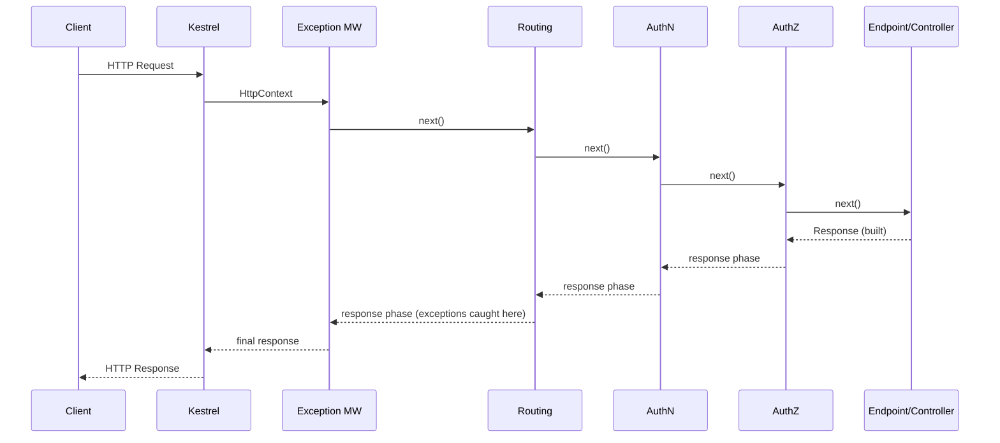
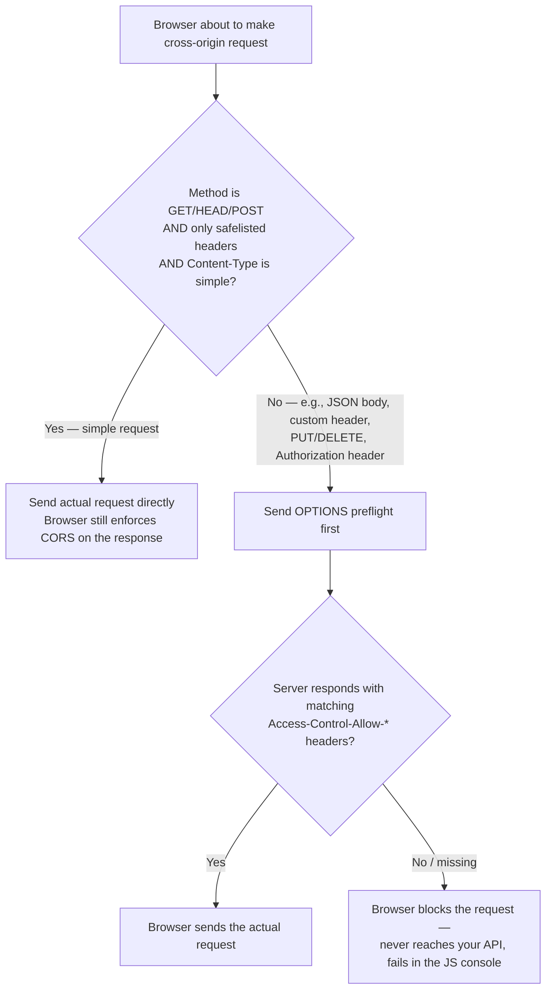
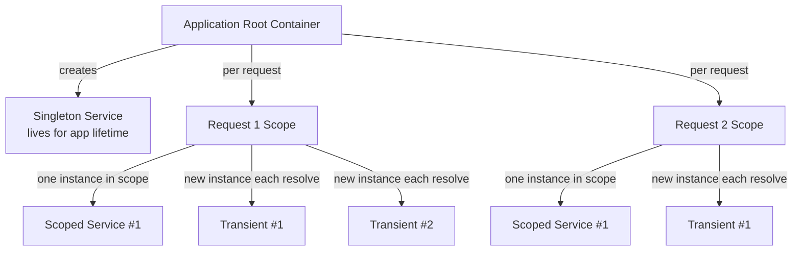
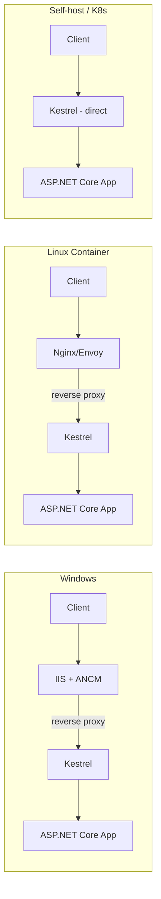

# ASP.NET Core — Senior/Lead Interview Guide

Audience: 10-year .NET full-stack developer prepping for senior/lead interviews. Assumes fundamentals are known — focus is on nuance, trade-offs, internals, and interviewer follow-ups. Current as of ASP.NET Core 8/9.

## Table of Contents

1. [Core Concepts](#core-concepts)
   - [.NET Core vs ASP.NET Core, and vs .NET Framework](#net-core-vs-aspnet-core-and-vs-net-framework)
   - [Project Structure & Hosting Model Evolution](#project-structure--hosting-model-evolution)
   - [Program.cs / Startup.cs / Minimal Hosting Model](#programcs--startupcs--minimal-hosting-model)
   - [Environments & Configuration Basics](#environments--configuration-basics)
   - [Static Files & Default Files](#static-files--default-files)
   - [Logging Providers & Configuration](#logging-providers--configuration)
   - [.NET Application Types, Code Sharing & Multi-Targeting](#net-application-types-code-sharing--multi-targeting)
2. [Middleware Pipeline (Deep Dive)](#middleware-pipeline-deep-dive)
   - [What Middleware Really Is](#what-middleware-really-is)
   - [Request/Response Flow](#requestresponse-flow)
   - [Built-in Middleware Deep Dive](#built-in-middleware-deep-dive)
   - [Custom Middleware](#custom-middleware)
   - [Use vs Run vs Map vs MapWhen](#use-vs-run-vs-map-vs-mapwhen)
   - [Short-Circuiting](#short-circuiting)
   - [Correct Middleware Ordering](#correct-middleware-ordering)
   - [[new content] Endpoint Routing Internals](#new-content-endpoint-routing-internals)
   - [Middleware vs Filters](#middleware-vs-filters)
   - [[gaps] IStartupFilter — Composing the Middleware Pipeline from a Library](#gaps-istartupfilter--composing-the-middleware-pipeline-from-a-library)
   - [[gaps] CORS Preflight Mechanics — What Actually Triggers an OPTIONS Request](#gaps-cors-preflight-mechanics--what-actually-triggers-an-options-request)
3. [Dependency Injection](#dependency-injection)
   - [Service Lifetimes](#service-lifetimes)
   - [[new content] Captive Dependencies & Lifetime Mismatch Bugs](#new-content-captive-dependencies--lifetime-mismatch-bugs)
   - [[new content] IOptions vs IOptionsSnapshot vs IOptionsMonitor](#new-content-ioptions-vs-ioptionssnapshot-vs-ioptionsmonitor)
   - [Detecting & Fixing Cyclic Dependencies](#detecting--fixing-cyclic-dependencies)
4. [Minimal APIs, MVC & API Design](#minimal-apis-mvc--api-design)
   - [[new content] Minimal APIs vs Controller-based MVC — Full Comparison](#new-content-minimal-apis-vs-controller-based-mvc--full-comparison)
   - [REST API vs MVC App](#rest-api-vs-mvc-app)
   - [Angular/React SPA Integration](#angularreact-spa-integration)
   - [API Versioning Strategies](#api-versioning-strategies)
   - [DTOs, Validation & FluentValidation](#dtos-validation--fluentvalidation)
   - [CQRS, Mediator Pattern & MediatR](#cqrs-mediator-pattern--mediatr)
   - [DDD in ASP.NET Core](#ddd-in-aspnet-core)
   - [Clean Architecture / Folder Structure at Scale](#clean-architecture--folder-structure-at-scale)
   - [Multi-Tenant Applications](#multi-tenant-applications)
   - [API Anti-Patterns](#api-anti-patterns)
   - [Plugin Architecture (Dynamic Assembly Loading)](#plugin-architecture-dynamic-assembly-loading)
   - [WebHooks (Outbound Event Callbacks)](#webhooks-outbound-event-callbacks)
5. [Hosting & Infrastructure](#hosting--infrastructure)
   - [Kestrel, IIS, HTTP.sys & Reverse Proxy Models](#kestrel-iis-httpsys--reverse-proxy-models)
   - [[new content] Native AOT Compilation](#new-content-native-aot-compilation)
   - [Deployment Models (Framework-Dependent vs Self-Contained)](#deployment-models-framework-dependent-vs-self-contained)
   - [Long-Running Jobs: BackgroundService vs IHostedService](#long-running-jobs-backgroundservice-vs-ihostedservice)
   - [Feature Flags](#feature-flags)
   - [Pre-loading / Startup Warmup Tasks](#pre-loading--startup-warmup-tasks)
6. [Performance & Optimization](#performance--optimization)
   - [Response Caching vs Output Caching vs Distributed Caching](#response-caching-vs-output-caching-vs-distributed-caching)
   - [Response Compression](#response-compression)
   - [Data Shaping](#data-shaping)
   - [Optimizing Static Content Delivery](#optimizing-static-content-delivery)
   - [HttpClientFactory & Socket Exhaustion](#httpclientfactory--socket-exhaustion)
   - [[new content] Rate Limiting Middleware (.NET 7+)](#new-content-rate-limiting-middleware-net-7)
   - [[new content] Thread Pool Starvation & Async Gotchas](#new-content-thread-pool-starvation--async-gotchas)
   - [Kestrel Tuning for High Throughput](#kestrel-tuning-for-high-throughput)
   - [EF Core Performance](#ef-core-performance)
   - [Diagnosing Memory Leaks & Measuring Performance](#diagnosing-memory-leaks--measuring-performance)
7. [Security](#security)
   - [Authentication vs Authorization](#authentication-vs-authorization)
   - [JWT, OAuth2 & OpenID Connect](#jwt-oauth2--openid-connect)
   - [Role-based vs Policy-based Authorization](#role-based-vs-policy-based-authorization)
   - [CSRF, XSS & Security Headers](#csrf-xss--security-headers)
   - [Secrets Management](#secrets-management)
   - [Other Security Concerns](#other-security-concerns)
8. [EF Core & Data Access](#ef-core--data-access)
9. [Microservices & Distributed Systems](#microservices--distributed-systems)
10. [Cloud, DevOps & Observability](#cloud-devops--observability)
    - [[new content] Health Checks](#new-content-health-checks)
    - [[new content] OpenTelemetry & Distributed Tracing in .NET 8/9](#new-content-opentelemetry--distributed-tracing-in-net-89)
    - [Deployment Strategies](#deployment-strategies)
11. [Testing](#testing)
    - [[gaps] Integration Testing with WebApplicationFactory](#gaps-integration-testing-with-webapplicationfactory)
12. [Best Practices](#best-practices)
13. [Common Pitfalls](#common-pitfalls)
14. [Sample Interview Q&A](#sample-interview-qa)
15. [Summary of Additions](#summary-of-additions)
    - [Summary of \[gaps\] Additions (This Pass)](#summary-of-gaps-additions-this-pass)

---

## Core Concepts

### .NET Core vs ASP.NET Core, and vs .NET Framework

**.NET Core** is the cross-platform, modular, open-source runtime (CoreCLR) for building applications. **ASP.NET Core** is the web framework built on top of it for Web APIs, MVC, Razor Pages, Blazor, gRPC, and SignalR.

Advantages of ASP.NET Core over legacy ASP.NET (.NET Framework):

- Cross-platform: Windows, Linux, macOS; container-native.
- Unified framework — MVC and Web API share one pipeline (no separate `System.Web.Http` vs `System.Web.Mvc` stacks).
- High performance via Kestrel, async-first I/O, `Span<T>`/`Memory<T>`, and a much lighter middleware pipeline than the legacy `HttpModule`/`HttpHandler` pipeline in `System.Web`.
- Built-in, first-class DI container (no need for a third-party container to get started).
- Minimal hosting footprint; self-contained deployment options.
- Side-by-side versioning of the runtime — multiple major versions can coexist on one machine.
- Flexible, composable middleware pipeline replacing the monolithic `System.Web` pipeline.

**.NET Framework vs .NET (Core) — cheat sheet:**

| Dimension | .NET Framework | .NET Core / .NET 5+ |
|---|---|---|
| Platform | Windows only | Cross-platform, Docker-native |
| Architecture | Monolithic, IIS + `System.Web` pipeline | Modular, Kestrel, async-first |
| WebForms | Supported | Not supported |
| ASP.NET MVC | Supported | Rewritten as ASP.NET Core MVC |
| WPF/WinForms | Supported | Supported, Windows-only |
| gRPC | Not supported | Supported |
| Minimal APIs | Not supported | Supported |
| Deployment | Machine-wide install, IIS required | Self-contained EXE, side-by-side, any reverse proxy, container-ready |
| Dev tooling | Visual Studio only | VS, VS Code, Rider, `dotnet` CLI |
| Future | Maintenance/security patches only | All active development |

Why still relevant: many enterprises run legacy WebForms/WCF apps that are expensive to port; that's a legitimate reason .NET Framework persists, not a technical advantage.

Migration path (Framework → Core), at a senior level:
1. Inventory dependencies (NuGet packages, `System.Web` usage, WCF, WebForms) — use the .NET Upgrade Assistant / API Analyzer to find blockers.
2. Port shared logic to .NET Standard or multi-targeted class libraries first.
3. Replace `System.Web` HttpModules/Handlers with middleware equivalents.
4. Replace WCF with gRPC or REST; replace `Web.config` with `appsettings.json` + the Options pattern.
5. Re-wire DI (Framework apps often used Autofac/Ninject manually — decide whether to keep them behind `IServiceProviderFactory` or move to the built-in container).
6. Incrementally test and deploy behind feature flags; consider the **strangler fig pattern** for large monoliths (run old and new side by side behind a gateway).

### Project Structure & Hosting Model Evolution

Key folders/files:

| Item | Purpose |
|---|---|
| `Program.cs` | App startup: builder, DI, middleware pipeline, `app.Run()` |
| `wwwroot/` | Static files (JS, CSS, images) |
| `appsettings.json` / `appsettings.{Environment}.json` | Configuration |
| `Controllers/` | API & MVC controllers |
| `Models/` | Entities/DTOs |
| `Views/` | Razor views (MVC) |
| `Properties/launchSettings.json` | Local debug profiles (Kestrel/IIS Express) — dev-only, not used in production |

**Before .NET 6** (generic host model):
- `Program.cs` builds an `IHost`/`IWebHost` and points to a `Startup` class.
- `Startup.ConfigureServices(IServiceCollection)` → DI registration.
- `Startup.Configure(IApplicationBuilder, IWebHostEnvironment)` → middleware pipeline.

**.NET 6+** (minimal hosting model):
- `Startup.cs` is folded into `Program.cs`. Top-level statements mean no `Main` method or class wrapper is required.
- `Program.cs` now: creates `WebApplicationBuilder`, registers services on `builder.Services`, builds `WebApplication`, configures the middleware pipeline directly on `app`, and calls `app.Run()`.
- You *can* still split things into a `Startup`-like class or extension methods (`AddApplicationServices()`, `UseApplicationMiddleware()`) for organization in larger apps — minimal hosting doesn't forbid structure, it just removes the mandatory ceremony.

```csharp
var builder = WebApplication.CreateBuilder(args);

builder.Services.AddControllers();
builder.Services.AddScoped<IOrderService, OrderService>();

var app = builder.Build();

if (app.Environment.IsDevelopment())
    app.UseDeveloperExceptionPage();

app.UseHttpsRedirection();
app.UseAuthentication();
app.UseAuthorization();
app.MapControllers();

app.Run();
```

Follow-up interviewers ask: *"What actually changed under the hood, or is it just syntax sugar?"* — Mostly sugar: `WebApplicationBuilder` still wraps the generic `Host` builder internally, and `WebApplication` implements `IApplicationBuilder`, `IEndpointRouteBuilder`, and `IHost`. The DI container, hosting abstractions (`IHostedService`, `IHostEnvironment`), and middleware pipeline are unchanged — what's gone is the mandatory `Startup` class ceremony.

### Program.cs / Startup.cs / Minimal Hosting Model

Covered above; summarizing the split of responsibilities so it's answerable standalone:

- `ConfigureServices()` / `builder.Services.Add...()` → dependency registration only. No middleware here.
- `Configure()` / the `app.Use...()` calls → middleware pipeline wiring only, executed in registration order.
- Mixing these concerns (e.g., resolving services eagerly inside `Configure`) is a common junior mistake; senior devs keep DI registration side-effect-free.

### Environments & Configuration Basics

Environment variables/configuration drive environment-specific behavior: connection strings, log levels, external endpoints, feature toggles, and — critically — **never** secrets committed to source. Built-in environments: `Development`, `Staging`, `Production`, selected via `ASPNETCORE_ENVIRONMENT`.

```csharp
if (app.Environment.IsDevelopment()) { app.UseDeveloperExceptionPage(); }
```

**Configuration provider precedence** (later overrides earlier) — this is a very common interview question and the source notes didn't spell it out, so here it is in full:

1. `appsettings.json`
2. `appsettings.{Environment}.json`
3. User Secrets (Development only)
4. Environment variables
5. Command-line arguments

This ordering matters operationally: container orchestration (Kubernetes/ECS) typically injects config via environment variables, which is why env vars outrank the JSON files — ops can override without rebuilding the image.

The **Options pattern** is the idiomatic way to consume configuration — see [new content] section below for `IOptions` vs `IOptionsSnapshot` vs `IOptionsMonitor`.

### Static Files & Default Files

```csharp
app.UseDefaultFiles();   // must run BEFORE UseStaticFiles
app.UseStaticFiles();
```

Customizing default file names:

```csharp
var options = new DefaultFilesOptions();
options.DefaultFileNames.Clear();
options.DefaultFileNames.Add("home.html");
app.UseDefaultFiles(options);
```

Serving from a non-`wwwroot` folder:

```csharp
app.UseStaticFiles(new StaticFileOptions
{
    FileProvider = new PhysicalFileProvider(
        Path.Combine(Directory.GetCurrentDirectory(), "MyStatic")),
    RequestPath = "/mystatic"
});
```

Gotcha: `UseDefaultFiles` only *rewrites the URL* to the default document — it does not serve the file itself. It must be paired with `UseStaticFiles` (or `UseFileServer`, which combines both plus directory browsing).

### Logging Providers & Configuration

ASP.NET Core has structured logging built in via the `Microsoft.Extensions.Logging` abstraction, consumed through `ILogger<T>` — injected per-class so log entries are automatically tagged with the category name (the fully-qualified type name of `T`).

```csharp
public class OrdersController : ControllerBase
{
    private readonly ILogger<OrdersController> _logger;
    public OrdersController(ILogger<OrdersController> logger) => _logger = logger;

    [HttpGet("{id}")]
    public IActionResult Get(int id)
    {
        _logger.LogInformation("Fetching order {OrderId}", id);
        // ...
    }
}
```

Built-in providers:

| Provider | Notes |
|---|---|
| Console | Default in `CreateBuilder`; human-readable dev output |
| Debug | Writes to the attached debugger's output window |
| EventSource | Cross-platform ETW-style tracing, consumable by `dotnet-trace`/PerfView |
| EventLog | Windows Event Log (Windows-only) |
| Azure App Insights | `Microsoft.ApplicationInsights.AspNetCore` — cloud-native telemetry sink |
| Third-party (Serilog, NLog) | Structured/sink-based logging (files, Elasticsearch, Seq) plugged in as `Microsoft.Extensions.Logging` provider adapters |

Configuration via `appsettings.json`:

```json
{
  "Logging": {
    "LogLevel": {
      "Default": "Information",
      "Microsoft": "Warning",
      "Microsoft.Hosting.Lifetime": "Information"
    }
  }
}
```

Log-level filtering is hierarchical by category namespace — a more specific category (`Microsoft.AspNetCore`) overrides `Default` for anything under that namespace, which is why noisy framework namespaces are typically pinned to `Warning` while the app's own namespace stays at `Information`/`Debug`.

Senior-level nuance worth raising unprompted: `ILogger<T>`'s structured/semantic logging (named placeholders like `{OrderId}`, not string interpolation) matters because it lets sinks like Serilog/Application Insights index and query on those fields — writing `$"Fetching order {id}"` instead throws away that structure and turns a query-able field back into an opaque string.

### .NET Application Types, Code Sharing & Multi-Targeting

**Application types** under the unified .NET SDK — the same DI/logging/config building blocks apply across all of them, not just web apps:

| Type | Typical use |
|---|---|
| Console app | CLI tools, scripts, one-off jobs |
| Class library | Shared logic, referenced by other projects |
| Web app (MVC / Razor Pages / Web API) | ASP.NET Core-hosted HTTP apps |
| Worker service | Long-running background process with no HTTP listener, templated via `dotnet new worker` |
| Background service | An `IHostedService`/`BackgroundService` running inside any host (web app or worker) — see the dedicated section below |
| ASP.NET Core hosted service | A background task hosted *inside* a web app's own process, sharing its DI container and lifetime |

**Code sharing between projects** — mechanisms, roughly in order of how "packaged" the sharing is:

| Mechanism | When to use |
|---|---|
| Project reference | Same solution, actively co-developed code (e.g., DTOs/utilities shared between a Web API and a Worker in the same repo) |
| Class library | The general-purpose unit of sharing — compiled once, consumed via project reference or packaged as a NuGet package |
| Shared project | Legacy pattern (source files compiled directly into each consumer rather than compiled once) — mostly superseded by class libraries today |
| NuGet package | Cross-repository/cross-team sharing with independent versioning — the right choice once code needs to be consumed outside its own solution |

Typical candidates for sharing: DTOs/contracts between a frontend-facing API and a backend service, cross-cutting utilities (validation helpers, extension methods), and business logic reused between, say, a Web API and a batch Worker service that both need the same domain rules.

**Multi-targeting** compiles a single project for more than one target framework:

```xml
<PropertyGroup>
  <TargetFrameworks>net6.0;net8.0</TargetFrameworks>
</PropertyGroup>
```

When to use it:
- Publishing a NuGet library that must support consumers still on an older LTS release alongside the current one.
- Building cross-platform tooling that needs to build against multiple installed SDKs.
- Bridging a migration window — supporting both a legacy and a modern .NET version while consumers migrate incrementally.

Gotcha worth mentioning: multi-targeted code often needs `#if NET8_0_OR_GREATER`-style conditional compilation for APIs that only exist on newer TFMs, which adds real maintenance cost. Most application-level projects (as opposed to shared libraries) should target a single current LTS version rather than multi-target — reserve multi-targeting for genuinely reusable library projects.

---

## Middleware Pipeline (Deep Dive)

Middleware is the execution backbone of ASP.NET Core — it defines how every HTTP request enters, flows through, and exits the application. Mastering it is mastering request handling, security, performance, and framework internals simultaneously.

### What Middleware Really Is

Middleware is a chain of `RequestDelegate`s that is executed sequentially at *registration* time but **nested at runtime** — it is stack-based, not linear:

```
Middleware A
 └── Middleware B
      └── Middleware C
           └── Endpoint
```

This nested-delegate model explains three things interviewers love to probe:
- Why **order of registration** matters (each middleware wraps everything after it).
- Why **placement of code relative to `await next()`** matters (before = request phase, after = response phase).
- Why **responses flow backward** through the same chain that the request flowed forward through.

### Request/Response Flow



Request flow:
1. Kestrel receives the HTTP request and creates `HttpContext`.
2. Request enters the middleware pipeline in registration order.
3. Each middleware runs its "before" logic, then calls `next()`.
4. The endpoint (controller action or minimal API delegate) executes.

Response flow:
1. The endpoint produces a response.
2. Execution unwinds back through the same middleware stack in *reverse* order.
3. Each middleware's "after `next()`" code runs.
4. The final response is sent to the client.

**Key insight**: conceptually, each middleware executes *twice* per request — once on the way in, once on the way out — which is exactly why exception-handling middleware must be outermost (first registered) and why response-mutation logic (e.g., adding a header based on the response body) belongs after `await next()`.

### Built-in Middleware Deep Dive

**Exception Handling Middleware**
- Catches unhandled exceptions from everything registered *after* it and converts them to HTTP responses.
- Must be registered first — it can only protect middleware registered downstream of it; anything before it is unprotected.

```csharp
if (app.Environment.IsDevelopment())
    app.UseDeveloperExceptionPage();
else
    app.UseExceptionHandler("/error");   // or the IExceptionHandler-based approach, .NET 8+
```

- .NET 8 introduced `IExceptionHandler` as a more testable, DI-friendly alternative to the `/error` redirect pattern:

```csharp
public class GlobalExceptionHandler : IExceptionHandler
{
    public async ValueTask<bool> TryHandleAsync(HttpContext httpContext, Exception exception, CancellationToken ct)
    {
        httpContext.Response.StatusCode = StatusCodes.Status500InternalServerError;
        await httpContext.Response.WriteAsJsonAsync(new { error = "An unexpected error occurred." }, ct);
        return true; // true = handled, short-circuits further processing
    }
}

// Program.cs
builder.Services.AddExceptionHandler<GlobalExceptionHandler>();
builder.Services.AddProblemDetails();
app.UseExceptionHandler();
```

**Routing Middleware**
- Matches the incoming URL to an endpoint's metadata and builds route data.
- Does **not** execute the controller/endpoint itself — it only decides *which* endpoint will run.
- Downstream middleware (notably Authorization) depends on the endpoint metadata that routing produces.

**Authentication Middleware**
- Reads tokens/cookies/headers, validates credentials, builds a `ClaimsPrincipal`, and sets `HttpContext.User`.
- **Important nuance**: authentication does *not* block requests by itself — it only identifies who the caller is. An anonymous request still passes through; it's Authorization that decides whether identity is *sufficient*.

**Authorization Middleware**
- Evaluates roles/policies against the authenticated user and the endpoint's `[Authorize]` metadata.
- Dependency chain: requires routing (for endpoint metadata) and authentication (for user identity) to have already run — this is why `UseAuthorization` without `UseRouting` before it either throws or silently does nothing useful.

### Custom Middleware

Two registration styles:

```csharp
// 1. Inline (lambda) middleware — good for simple, one-off logic
app.Use(async (context, next) =>
{
    context.Items["CorrelationId"] = Guid.NewGuid().ToString();
    await next();
});

// 2. Class-based middleware — good for reusable, testable, DI-friendly logic
public class CorrelationIdMiddleware
{
    private readonly RequestDelegate _next;
    public CorrelationIdMiddleware(RequestDelegate next) => _next = next;

    public async Task InvokeAsync(HttpContext context)
    {
        context.Items["CorrelationId"] = Guid.NewGuid().ToString();
        await _next(context);
    }
}
// Registration:
app.UseMiddleware<CorrelationIdMiddleware>();
```

Class-based middleware is constructed **once** as a singleton-like object per pipeline build (its constructor dependencies must therefore be singleton-safe), but `InvokeAsync` can accept additional scoped services as method parameters — DI will inject them per-request via method injection.

Good uses: logging, correlation IDs, tenant resolution, header validation, rate limiting, security headers.
Bad uses: business logic, direct database access, domain workflows, heavy computation — these belong in services invoked by controllers/endpoints, not in the pipeline.

### Use vs Run vs Map vs MapWhen

| Method | Behavior | Typical use |
|---|---|---|
| `app.Use(...)` | Continues pipeline; supports before/after logic via `next()` | Most middleware |
| `app.Run(...)` | Terminates the pipeline; no `next()` parameter at all | Terminal handlers, maintenance-mode pages |
| `app.Map(pattern, ...)` | Branches the pipeline based on a URL **path prefix**, creating an isolated sub-pipeline | `/health`, `/metrics`, admin sub-apps |
| `app.MapWhen(predicate, ...)` | Branches based on an arbitrary predicate over `HttpContext` (not just path) | Header-based or query-based branching |

`Map`/`MapWhen` branches do not automatically rejoin the main pipeline — anything registered inside the branch only applies within it.

### Short-Circuiting

Short-circuiting = middleware writes a response and deliberately does **not** call `next()`.

```csharp
if (!authorized)
{
    context.Response.StatusCode = 401;
    return;   // pipeline stops here — downstream middleware and the endpoint never run
}
```

Common legitimate scenarios: authentication/authorization failure, rate limiting, feature toggles, maintenance windows. This is intentional design, not a bug — but it's also a common source of confusing "why didn't my middleware run" bugs when a colleague short-circuits upstream without realizing it.

### Correct Middleware Ordering

```csharp
app.UseExceptionHandler("/error");   // 1. Wraps everything — must be outermost
app.UseHttpsRedirection();
app.UseStaticFiles();
app.UseRouting();                    // 2. Identifies the endpoint
app.UseCors();                       // 3. Must be after Routing, before AuthN/AuthZ
app.UseAuthentication();             // 4. Identifies the user
app.UseAuthorization();              // 5. Enforces access, needs routing + authn
app.UseResponseCompression();
app.MapControllers();                // 6. Executes business logic
app.Run();
```

| Middleware | Why it sits where it does |
|---|---|
| Exception handling | Wraps entire pipeline — catches everything downstream |
| Routing | Identifies endpoint + metadata that later stages depend on |
| CORS | Needs to run before auth so preflight/cross-origin checks happen early, but after routing so endpoint-specific CORS policies can be read |
| Authentication | Identifies the user (populates `HttpContext.User`) |
| Authorization | Enforces access using routing metadata + authenticated identity |
| Endpoint execution | Runs the actual business logic |

### [new content] Endpoint Routing Internals

Interviewers at senior level frequently probe *how* endpoint routing actually works, not just the ordering rule. Key internals:

- Endpoint Routing (introduced in ASP.NET Core 3.0) decoupled route *matching* from route *execution*. `UseRouting()` matches the request to an `Endpoint` object (and stores it in `HttpContext.GetEndpoint()`), while `UseEndpoints()`/`MapControllers()`/`MapGet()` etc. actually execute it.
- This split is what allows middleware between `UseRouting()` and the terminal endpoint execution (e.g., `UseAuthorization()`) to inspect endpoint metadata — `[Authorize]`, `[AllowAnonymous]`, CORS policy names, rate-limiter policy names — via `context.GetEndpoint()?.Metadata`.
- It's also what unifies routing across MVC, Minimal APIs, gRPC, SignalR, and Blazor — they all register `Endpoint`s into the same `EndpointDataSource`, so a single routing/authorization/CORS pipeline governs all of them instead of each framework having its own routing stack (as in pre-3.0 ASP.NET Core, where MVC routing lived inside the MVC middleware only).
- Route matching uses a **tree-based (DFA-like) matcher**, not a linear scan of all routes — this is why endpoint routing scales better than the older `IRouter`-based approach as route counts grow.
- Gotcha: if you call `MapControllers()`/`MapGet()` etc. without a preceding `UseRouting()` in a manually ordered pipeline (rare with `WebApplication` defaults, but possible with `IApplicationBuilder` composition), routing metadata won't be available to upstream middleware and you'll get inconsistent 404s or bypassed authorization.

### Middleware vs Filters

| Middleware | Filters |
|---|---|
| Executes for **every** request that reaches the pipeline | Executes only for MVC/endpoint-bound requests |
| No access to MVC-specific context (model binding results, action arguments) | Access to `ActionExecutingContext`, `ActionExecutedContext`, action arguments, result, exceptions |
| Runs early/late across the whole pipeline | Runs specifically around action/page execution, after routing has selected an MVC endpoint |
| Better for framework-agnostic cross-cutting concerns (correlation IDs, compression, CORS) | Better for MVC-specific concerns (model validation shortcuts, `[Authorize]`-adjacent policy checks that need action metadata, response shaping) |
| Can short-circuit the entire pipeline | Can only short-circuit within the MVC action pipeline |

Filter types, for completeness: **Authorization filters** → **Resource filters** → **Action filters** → **Exception filters** → **Result filters**, each with an "executing"/"executed" pair. Interviewers sometimes ask "where would you put X" — e.g., a global model-validation short-circuit belongs in a resource or action filter, not middleware, because it needs the bound model.

### [gaps] IStartupFilter — Composing the Middleware Pipeline from a Library

Everything above assumes you own `Program.cs` and can hand-order every `app.Use...()` call yourself. But what if you're authoring a reusable library/module (an internal NuGet package, a shared platform module) that needs to **inject its own middleware into the pipeline** — at a specific position relative to the *consuming* application's other middleware — without forcing every consumer to remember to add a line to their `Program.cs`? That's exactly what `IStartupFilter` is for, and it's a common senior/platform-engineering follow-up once basic middleware ordering is established.

`IStartupFilter` lets a library **wrap** the `Configure`/pipeline-building delegate itself, so it can add middleware before or after whatever the host application configures — without the application needing to call anything explicitly beyond registering the filter in DI.

```csharp
public class CorrelationIdStartupFilter : IStartupFilter
{
    public Action<IApplicationBuilder> Configure(Action<IApplicationBuilder> next)
    {
        return app =>
        {
            // Runs BEFORE the app's own Configure/pipeline — i.e., outermost,
            // wrapping everything the consuming app registers.
            app.UseMiddleware<CorrelationIdMiddleware>();

            next(app);   // hands control to the next filter, then eventually the app's own pipeline
        };
    }
}

// Library's registration extension method — this is all a consumer has to call:
public static IServiceCollection AddCorrelationIdModule(this IServiceCollection services)
{
    services.AddTransient<IStartupFilter, CorrelationIdStartupFilter>();
    return services;
}
```

**How it works internally:**
- ASP.NET Core resolves **all** registered `IStartupFilter` instances (you can register more than one — from multiple libraries) and composes them around the application's own `Configure` pipeline delegate, like nested decorators. Each filter's `Configure(next)` receives the *next* filter (or, innermost, the app's actual pipeline) and returns a new `Action<IApplicationBuilder>` that wraps it.
- Because each filter wraps the *next* one, a filter that calls `app.Use...()` **before** calling `next(app)` places that middleware **earlier** (more outer) in the final pipeline than anything the app or later filters register; calling `app.Use...()` **after** `next(app)` places it **later** (more inner/closer to the endpoint).
- This is exactly how several built-in ASP.NET Core features are implemented — e.g., hosting infrastructure uses `IStartupFilter` internally for things like automatically wiring up default exception-handling behavior in certain hosting scenarios, which is why it's worth knowing as "framework-grade" plumbing, not just an obscure extensibility point.

**Why not just tell consumers to call `app.UseMyMiddleware()` themselves?** Because:
- It removes a footgun — consumers can forget, or place it in the wrong order relative to their own middleware, especially if the library's middleware genuinely must run before/after something the app controls (e.g., a security header module that must run before response compression).
- It lets a platform team ship cross-cutting concerns (correlation IDs, tenant resolution, standardized security headers, request/response logging) as a single `services.AddXyzModule()` call in `Program.cs`, with the actual pipeline wiring hidden as an implementation detail that can change between package versions without every consumer needing to update their `Program.cs`.

**Trade-off/gotcha to raise unprompted:** because `IStartupFilter`-injected middleware is invisible in `Program.cs` (it's not a line you can see and reorder at the call site), it can make the *effective* pipeline order harder to reason about just by reading the app's own startup code — a real debugging cost. Senior guidance: use it for genuinely reusable cross-app modules, not as a way to avoid writing an explicit `app.Use...()` call in your own single application.

### [gaps] CORS Preflight Mechanics — What Actually Triggers an OPTIONS Request

The CORS section earlier in these notes (and in most notes generally) covers *policy configuration* — origins, methods, headers, `AllowCredentials()` — but glosses over the actual **browser-side trigger mechanism** that decides whether a preflight `OPTIONS` request happens at all. This is a frequent, precise follow-up: *"When exactly does the browser send a preflight request, and when does it skip straight to the real request?"*

**The core rule:** a cross-origin request is a **"simple request"** (no preflight) only if it satisfies **all** of the following simultaneously. Any violation forces a preflight `OPTIONS` request first.

| Condition for a "simple" (no-preflight) request | Detail |
|---|---|
| Method | Must be `GET`, `HEAD`, or `POST` only — any other verb (`PUT`, `PATCH`, `DELETE`, etc.) always triggers preflight |
| Headers | Only "CORS-safelisted" request headers are allowed: `Accept`, `Accept-Language`, `Content-Language`, `Content-Type` (with restrictions below), plus a few browser-managed ones. Adding **any** custom header (`Authorization`, `X-Api-Version`, `X-Correlation-Id`, etc.) forces a preflight |
| `Content-Type` | Only these three values are "simple": `application/x-www-form-urlencoded`, `multipart/form-data`, `text/plain`. **`application/json` is NOT simple** — meaning virtually every modern JSON-based API call from a browser triggers a preflight, by design |
| No `ReadableStream`/no event listeners on the upload | Advanced fetch usage (e.g., upload progress tracking) also forces preflight |



**Practical consequence senior candidates should call out:** because almost all real-world API traffic uses `Content-Type: application/json` and/or an `Authorization: Bearer <token>` header, **almost every browser-originated cross-origin API call is preflighted** — this is normal, expected traffic, not a misconfiguration, and it's why CORS middleware must be positioned after `UseRouting()` but before `UseAuthentication()`/`UseAuthorization()` in the pipeline: the preflight `OPTIONS` request carries no `Authorization` header and no credentials by spec, so it must be answered by CORS middleware itself, short-circuited with a `204`, before authentication/authorization middleware would otherwise reject it as unauthenticated.

**Key details that separate a senior answer from a surface-level one:**
- The preflight `OPTIONS` request includes `Access-Control-Request-Method` and `Access-Control-Request-Headers` — the browser is asking "if I actually send a `PUT` with these headers, will you allow it?" *before* committing to the real request.
- The server's preflight response must echo back matching `Access-Control-Allow-Methods`/`Access-Control-Allow-Headers`/`Access-Control-Allow-Origin` (and `Access-Control-Allow-Credentials: true` if the real request will carry credentials) — ASP.NET Core's `UseCors()` handles constructing this response automatically from your configured policy; you don't hand-write the `OPTIONS` handler yourself.
- Preflight responses are **cacheable** by the browser via `Access-Control-Max-Age` — setting this avoids a duplicate preflight round trip for every subsequent request to the same endpoint/method/header combination within the cache window, which matters for latency-sensitive SPAs making frequent calls.
- **Common "why is my API getting an extra OPTIONS call in production logs" confusion** — this is exactly the mechanism above; it's not a bug, and blocking/ignoring `OPTIONS` requests at the routing or auth layer (rather than letting CORS middleware answer them) is what breaks legitimate cross-origin calls.
- CORS (and therefore preflight) is **irrelevant for server-to-server calls** — it's a browser-enforced mechanism only; curl, Postman, and another backend service never send preflight requests and are unaffected by CORS policy entirely.

---

## Dependency Injection

DI = classes receive their dependencies from outside rather than constructing them internally. ASP.NET Core ships a built-in, minimal-but-complete IoC container (`IServiceCollection`/`IServiceProvider`) — no third-party container required to get started, though Autofac/Lamar/etc. can still be plugged in via `IServiceProviderFactory<T>` when you need features like property injection, decorators-as-first-class-citizens, or assembly scanning conventions the built-in container lacks natively (Scrutor adds scanning to the built-in container for most of these needs).

```csharp
builder.Services.AddSingleton<ICacheService, MemoryCacheService>();
builder.Services.AddScoped<IOrderRepository, OrderRepository>();
builder.Services.AddTransient<IEmailSender, SmtpEmailSender>();
```

Constructor injection is the default and preferred mechanism:

```csharp
public class OrdersController : ControllerBase
{
    private readonly IOrderRepository _repo;
    public OrdersController(IOrderRepository repo) => _repo = repo;
}
```

### Service Lifetimes

| Lifetime | Description | Typical use case |
|---|---|---|
| Transient | New instance every time it's requested | Lightweight, stateless services |
| Scoped | One instance per HTTP request (per DI scope) | `DbContext`, unit-of-work, per-request state |
| Singleton | One instance for the entire application lifetime | Configuration objects, in-memory caches, `IHttpClientFactory` internals |



### [new content] Captive Dependencies & Lifetime Mismatch Bugs

This is one of the highest-value senior DI topics and the original notes only listed the three lifetimes without covering the failure mode that trips up mid-level engineers.

**Captive dependency**: injecting a shorter-lived service into a longer-lived one, causing the shorter-lived instance to be "captured" and live longer than intended.

```csharp
// BAD: Singleton captures a Scoped DbContext
public class BadCacheWarmer   // registered as Singleton
{
    private readonly AppDbContext _db;   // Scoped — captured at construction time!
    public BadCacheWarmer(AppDbContext db) => _db = db;
    // _db now lives forever, using the connection/state from whichever
    // request scope happened to construct this singleton first. Later requests
    // see stale/disposed state, and concurrent use of a captured DbContext
    // (which is NOT thread-safe) causes intermittent, hard-to-reproduce exceptions.
}
```

- The built-in container **validates this at startup** when `ValidateScopes = true` (the default in the Development environment via `CreateBuilder`) — it throws `InvalidOperationException: Cannot consume scoped service ... from singleton`. In Production this validation is off by default for performance, meaning the bug can silently ship unless you explicitly enable `ServiceProviderOptions.ValidateScopes` / `ValidateOnBuild` for all environments — a genuine gotcha worth mentioning proactively in an interview.
- Fix patterns:
  - Inject `IServiceScopeFactory` into the singleton and create a scope per operation:
    ```csharp
    public class CacheWarmer
    {
        private readonly IServiceScopeFactory _scopeFactory;
        public CacheWarmer(IServiceScopeFactory scopeFactory) => _scopeFactory = scopeFactory;

        public async Task WarmAsync()
        {
            using var scope = _scopeFactory.CreateScope();
            var db = scope.ServiceProvider.GetRequiredService<AppDbContext>();
            // use db, then let the scope dispose it
        }
    }
    ```
  - Or use `IDbContextFactory<T>` (EF Core's dedicated answer to this exact problem) instead of injecting `DbContext` directly into long-lived services.
- The inverse mismatch — a **Transient/Scoped service injecting a Singleton** — is safe and common (e.g., injecting `IMemoryCache` or `IConfiguration` into a scoped repository) because the singleton simply outlives the consumer; there's no capture problem in that direction.
- Also worth knowing: `AddHttpContextAccessor()`'s `IHttpContextAccessor` is itself registered as a singleton but safely exposes per-request `HttpContext` via `AsyncLocal<T>` — it's the sanctioned way to reach request-scoped ambient state from a singleton without a captive-dependency violation.

### [new content] IOptions vs IOptionsSnapshot vs IOptionsMonitor

The original notes mention `appsettings.json` for configuration but never cover the Options pattern, which is the idiomatic, testable way senior devs are expected to consume configuration (raw `IConfiguration` injection is considered a smell in anything beyond bootstrapping code).

```csharp
public class SmtpOptions
{
    public string Host { get; set; } = string.Empty;
    public int Port { get; set; }
}

builder.Services.Configure<SmtpOptions>(builder.Configuration.GetSection("Smtp"));
```

| Interface | Lifetime semantics | Reloads on config change? | Typical use |
|---|---|---|---|
| `IOptions<T>` | Registered as Singleton, value computed once and cached forever | No | Config that never changes at runtime |
| `IOptionsSnapshot<T>` | Registered as Scoped, recomputed once per scope/request | Yes, at the start of each new scope | Per-request-fresh config in Scoped/Transient services |
| `IOptionsMonitor<T>` | Registered as Singleton, but actively watches for changes | Yes, immediately, with `OnChange` callback support | Long-lived singletons/background services that need live config updates |

```csharp
public class EmailSender
{
    private readonly IOptionsMonitor<SmtpOptions> _options;
    public EmailSender(IOptionsMonitor<SmtpOptions> options)
    {
        _options = options;
        _options.OnChange(updated => Console.WriteLine($"SMTP host changed to {updated.Host}"));
    }
    public SmtpOptions Current => _options.CurrentValue;
}
```

Gotcha interviewers probe: *"Why can't you inject `IOptionsSnapshot` into a Singleton?"* — because it's registered Scoped, and a Singleton capturing a Scoped dependency is exactly the captive-dependency problem above; the container throws at startup with scope validation enabled. Use `IOptionsMonitor` in singletons instead.

Named options (`Configure<T>(name, ...)` + `IOptionsSnapshot<T>.Get(name)`) are worth mentioning for multi-tenant or multi-provider scenarios (e.g., multiple payment gateway configs).

### Detecting & Fixing Cyclic Dependencies

ASP.NET Core's container detects circular constructor dependencies at resolution time and throws:

```
System.InvalidOperationException: A circular dependency was detected for the service of type 'X'.
```

Fixes:
- Break the cycle by introducing an interface/abstraction one side depends on instead of the concrete class.
- Use a factory (`Func<T>` or a dedicated factory service) to defer resolution of one side until after construction.
- Reduce constructor dependency count generally — a cyclic dependency is often a symptom of two services that are too tightly coupled and should be merged or have a shared collaborator extracted.

---

## Minimal APIs, MVC & API Design

### [new content] Minimal APIs vs Controller-based MVC — Full Comparison

The source notes touch this only via a shallow "best for" table. This is one of the most common senior ASP.NET Core interview questions in 2024–2026 given minimal APIs' maturation, so it deserves full treatment.

```csharp
// Minimal API
var app = builder.Build();
app.MapGet("/orders/{id:int}", async (int id, IOrderService svc) =>
{
    var order = await svc.GetAsync(id);
    return order is not null ? Results.Ok(order) : Results.NotFound();
})
.WithName("GetOrder")
.Produces<OrderDto>(200)
.Produces(404);
```

```csharp
// Controller-based MVC
[ApiController]
[Route("orders")]
public class OrdersController : ControllerBase
{
    private readonly IOrderService _svc;
    public OrdersController(IOrderService svc) => _svc = svc;

    [HttpGet("{id:int}")]
    [ProducesResponseType(typeof(OrderDto), 200)]
    [ProducesResponseType(404)]
    public async Task<IActionResult> Get(int id)
    {
        var order = await _svc.GetAsync(id);
        return order is not null ? Ok(order) : NotFound();
    }
}
```

| Aspect | Minimal APIs | Controller-based MVC |
|---|---|---|
| Boilerplate | Minimal — no base class, no attributes required | Requires `ControllerBase`, routing/action attributes |
| Startup performance / AOT | Faster startup, smaller memory footprint, first-class Native AOT support | Heavier reflection-based model binding, weaker AOT story (improving each release but still has gaps — verify current release notes) |
| Filters | `IEndpointFilter` (lighter-weight, since .NET 7) | Full MVC filter pipeline (authorization/resource/action/exception/result filters) |
| Model binding | Explicit parameter binding (`[FromBody]`, `[FromRoute]`, etc., often inferred) | Rich, convention-based model binding with more automatic inference historically |
| Validation | Manual or via endpoint filters / `IEndpointFilter`; no automatic `[ApiController]`-style 400 short-circuit unless wired up yourself | Automatic model validation + automatic 400 response via `[ApiController]` |
| Views/Razor | Not applicable — JSON/API only | Full support for Razor Views (server-rendered HTML) |
| Discoverability at scale | Can get unwieldy in `Program.cs` for large APIs unless split into extension methods/route groups | Naturally organized by controller class |
| Route grouping | `app.MapGroup("/orders")` (since .NET 7) for shared prefix/filters/metadata | Controller + `[Route]` attribute inheritance |
| OpenAPI/Swagger | Supported, slightly more manual metadata annotation historically, improved significantly in .NET 8/9 | Mature, well-integrated via `Swashbuckle`/attributes |
| Best for | Lightweight microservices, high-throughput endpoints, greenfield APIs prioritizing startup time/AOT | Large apps needing filters, view rendering, conventions, complex model binding, or migrating a large existing controller codebase |

Practical guidance for a senior answer: minimal APIs and MVC controllers are **not mutually exclusive** in the same app — `MapControllers()` and `MapGet()`/route groups can coexist. The real decision driver is team convention and whether you need MVC filters/views, not raw performance (both are fast; the perf gap is mostly at cold-start/AOT, which matters for serverless/containers scaling to zero, not steady-state throughput).

### REST API vs MVC App

| Feature | MVC Web App | Web API / Minimal API |
|---|---|---|
| Views | Yes (Razor) | No |
| Result | HTML | JSON/XML |
| Routing | Controller + Views (conventional routing common) | Controller + attributes, or minimal API route mapping |
| SPA support | Possible but atypical | Commonly acts as the backend for a SPA |

### Angular/React SPA Integration

Two broad hosting models for pairing an ASP.NET Core backend with an Angular/React SPA:

1. **Separate deployments** — the SPA is built and deployed independently (its own static host/CDN), calling the API cross-origin. Requires CORS configured on the API; simplest to scale and deploy independently, and the more common pattern for greenfield SPA + API projects today.
2. **Merged/hosted project** — the SPA's build output is served from the ASP.NET Core app's own `wwwroot`, so the API and UI ship as one deployable unit.

Merged-project specifics (the historical ASP.NET Core SPA templates, `Microsoft.AspNetCore.SpaServices.Extensions`):

```csharp
if (app.Environment.IsDevelopment())
{
    app.UseSpa(spa =>
    {
        spa.Options.SourcePath = "ClientApp";
        spa.UseAngularCliServer(npmScript: "start");   // proxies to the Angular CLI dev server
        // Equivalent for React/CRA: spa.UseReactDevelopmentServer(npmScript: "start");
    });
}
else
{
    app.UseSpaStaticFiles();   // serves the pre-built SPA output from wwwroot in production
}
```

Key pieces:
- **CORS** — required whenever the SPA and API are on different origins (different port in dev, different domain in prod): `builder.Services.AddCors(...)` + `app.UseCors(...)`, positioned after `UseRouting()` and before `UseAuthentication()`/`UseAuthorization()` (see the CORS preflight mechanics note earlier).
- **Static file serving** — the built SPA (`ng build` / `npm run build` output) lands in `wwwroot`, served by the standard `UseStaticFiles()`/`UseDefaultFiles()` pipeline in the merged-project model.
- **Dev proxy configs** — in development, the SPA's own dev server (Angular CLI, Vite, Webpack Dev Server) proxies API calls to the backend (`proxy.conf.json` for Angular CLI, or the `"proxy"` field in a React `package.json`) so the SPA can call relative API paths locally without hitting CORS at all, even though the same calls are cross-origin under the merged-hosting production model.

Senior framing: the merged-hosting/`UseSpa` template approach has fallen out of favor for new projects in 2024–2026 — most teams now deploy the SPA independently (static hosting/CDN + its own CI/CD) and call the API purely over CORS, decoupling release cadence and scaling between frontend and backend. Know the `UseAngularCliServer`/`UseSpaStaticFiles` mechanics because they still show up in legacy codebases and interview questions about "how would you integrate Angular with ASP.NET Core," but be ready to state independent deployment as the more current default recommendation.

### API Versioning Strategies

- **URL versioning**: `/api/v1/orders` — most explicit, cache-friendly, easy to route, but "pollutes" the URL and clients must change URLs to upgrade.
- **Query string versioning**: `/api/orders?api-version=1.0` — easy to default, but easy to accidentally omit; less RESTful purists' favorite.
- **Header versioning**: custom header like `X-Api-Version: 1.0` — keeps URLs clean, but harder to test/debug from a browser and less visible in logs.
- **Media type (Accept header) versioning**: `Accept: application/json;v=1.0` — most "correct" per HTTP content negotiation semantics, least discoverable/ergonomic for consumers.

```csharp
builder.Services.AddApiVersioning(options =>
{
    options.DefaultApiVersion = new ApiVersion(1, 0);
    options.AssumeDefaultVersionWhenUnspecified = true;
    options.ReportApiVersions = true;
}).AddApiExplorer(options =>
{
    options.GroupNameFormat = "'v'VVV";
});
```

Breaking-change discipline: never mutate an existing contract; add a new version, support both for a documented deprecation window, and communicate via `ReportApiVersions`/`Deprecated` metadata (visible in the `api-supported-versions` / `api-deprecated-versions` response headers) and changelogs, not silent removal.

### DTOs, Validation & FluentValidation

Never return EF entities directly from an API — reasons: prevents over-posting/mass-assignment vulnerabilities, decouples the wire contract from the persistence model (they evolve independently), hides internal structure/navigation properties (which also sidesteps accidental lazy-loading serialization loops), lets you shape/trim the payload, and lets you add computed/aggregated fields cheaply.

FluentValidation is the standard alternative to DataAnnotations for anything beyond trivial validation:

```csharp
public class UserDto
{
    public string Name { get; set; } = string.Empty;
    public string Email { get; set; } = string.Empty;
    public int Age { get; set; }
}

public class UserValidator : AbstractValidator<UserDto>
{
    public UserValidator()
    {
        RuleFor(x => x.Name).NotEmpty().MinimumLength(3);
        RuleFor(x => x.Email).NotEmpty().EmailAddress();
        RuleFor(x => x.Age).InclusiveBetween(18, 60)
            .WithMessage("User must be an adult, and under 60.");
    }
}
```

```csharp
// dotnet add package FluentValidation.AspNetCore
builder.Services.AddControllers();
builder.Services.AddFluentValidationAutoValidation();
builder.Services.AddValidatorsFromAssemblyContaining<UserValidator>();
```

```csharp
[ApiController]
[Route("api/users")]
public class UsersController : ControllerBase
{
    [HttpPost]
    public IActionResult Create(UserDto user) => Ok(user);   // auto-validated; invalid input -> 400
}
```

Example failure response shape (from `[ApiController]`'s automatic `ValidationProblemDetails`):

```json
{
  "errors": {
    "Name": ["'Name' must not be empty."],
    "Email": ["'Email' is not a valid email address."],
    "Age": ["'Age' must be between 18 and 60."]
  }
}
```

Custom rules:

```csharp
RuleFor(x => x.Age).Must(age => age >= 18).WithMessage("User must be an adult");
```

Note: `AddFluentValidationAutoValidation()` auto-validation hooks into MVC's filter pipeline (works with controllers using `[ApiController]`); for **Minimal APIs**, you must invoke the validator explicitly inside the handler or via a custom `IEndpointFilter`, since there's no automatic model-validation filter equivalent out of the box.

Application-level vs domain-level validation, a distinction worth stating precisely in interviews: **application/DTO validation** checks shape and format of incoming data (is this a valid email string, is age in range); **domain validation** protects entity invariants inside the domain model itself (e.g., an `Order` cannot transition from `Cancelled` to `Shipped`) — DTO validation happening to pass does not mean the domain operation is valid.

### CQRS, Mediator Pattern & MediatR

CQRS separates **commands** (writes, state-changing, typically `void`/`Task` or return only an ID) from **queries** (reads, side-effect-free, return DTOs). Benefits: independent optimization of read/write paths (different data stores, caching strategies per query), smaller single-responsibility handlers instead of fat services, and — combined with MediatR — pipeline behaviors (cross-cutting concerns like logging/validation/transactions wrapped around every handler generically).

```csharp
public record GetOrderQuery(int Id) : IRequest<OrderDto>;

public class GetOrderQueryHandler : IRequestHandler<GetOrderQuery, OrderDto>
{
    private readonly IOrderRepository _repo;
    public GetOrderQueryHandler(IOrderRepository repo) => _repo = repo;
    public async Task<OrderDto> Handle(GetOrderQuery request, CancellationToken ct)
        => (await _repo.GetAsync(request.Id, ct)).ToDto();
}
```

Use the Mediator pattern when: business rules are complex enough that controllers are becoming fat, you want to decouple the "what" (request) from the "how" (handler), or you want generic pipeline behaviors (validation, logging, transactions) applied uniformly.

Trade-off to voice unprompted: MediatR/CQRS adds indirection — for CRUD-simple services it can be over-engineering; reserve it for domains with genuinely complex or divergent read/write concerns.

### DDD in ASP.NET Core

Core building blocks: **Entities** (identity-based equality), **Value Objects** (immutable, structural equality), **Aggregates** and **Aggregate Roots** (consistency boundary — all writes go through the root), **Domain Events** (something happened, decoupled side effects), **Repositories** (persistence abstraction per aggregate), **Bounded Contexts** (explicit model boundaries between subdomains, often mapped to separate microservices or at least separate modules).

### Clean Architecture / Folder Structure at Scale

```
src/
  Api/              -> Controllers/Minimal API endpoints, DI wiring, composition root
  Application/      -> CQRS handlers, validators, DTOs, use-case orchestration
  Domain/            -> Entities, Value Objects, domain interfaces, domain events
  Infrastructure/    -> EF Core, external service clients, messaging, repositories
tests/
  UnitTests/
  IntegrationTests/
```

Dependency rule: `Domain` has zero outward dependencies; `Application` depends only on `Domain`; `Infrastructure` implements interfaces defined in `Domain`/`Application`; `Api` depends on `Application` (and wires `Infrastructure` via DI at startup) — dependencies point *inward*, achieved through Dependency Inversion (interfaces owned by the inner layers, implemented by the outer ones).

### Multi-Tenant Applications

- Tenant resolution via header, subdomain, or claims in the token — must happen **early**, ideally in dedicated middleware **before authentication**, since authentication may need to validate against a tenant-specific issuer/authority.
- Tenant context stored in a scoped service (`ITenantContext`), populated by that middleware, and consumed by data access to scope queries (tenant-specific connection string, or a global query filter like `HasQueryFilter(x => x.TenantId == _tenantContext.TenantId)` in EF Core).
- Per-tenant configuration/caching (named `IOptionsSnapshot`, tenant-keyed cache entries).

### API Anti-Patterns

- Fat controllers containing business logic (push logic into Application/Domain layers).
- Returning EF entities directly (see DTO discussion above).
- No API versioning strategy from day one — retrofitting versioning onto a live API with existing consumers is painful.
- Excessive/needless DTOs for trivial pass-through data (over-engineering in the other direction).
- No pagination on collection endpoints — leads to unbounded response sizes and DB load as data grows.
- Ignoring idempotency on POST/PUT under retry-heavy clients (mobile, unreliable networks) — leads to duplicate side effects.

### Plugin Architecture (Dynamic Assembly Loading)

A plugin architecture lets an application load and execute functionality that wasn't compiled into the main deployable — useful wherever third parties or separate teams need to ship extensibility modules independently (CMS-style extensions, integration connectors, tenant-specific customizations).

Core pieces:

```csharp
public interface IPlugin
{
    string Name { get; }
    void Execute(IServiceProvider services);
}
```

- **Reflection-based dynamic loading**: scan a plugins folder for DLLs, load each assembly, use reflection (`assembly.GetTypes().Where(t => typeof(IPlugin).IsAssignableFrom(t))`) to discover implementations, and instantiate them via `Activator.CreateInstance` or through DI.
- **`AssemblyLoadContext`**: the modern (.NET Core+) mechanism for loading plugin assemblies into an isolated context, so plugins can be loaded — and in principle unloaded — without polluting or version-conflicting with the host application's own assemblies. This replaces the old `AppDomain`-based isolation from .NET Framework (.NET Core has no `AppDomain`s).
- **Scrutor**: a popular library that adds assembly-scanning registration conventions on top of the built-in DI container:
  ```csharp
  services.Scan(scan => scan
      .FromAssemblies(pluginAssemblies)
      .AddClasses(c => c.AssignableTo<IPlugin>())
      .AsImplementedInterfaces()
      .WithScopedLifetime());
  ```
  used to auto-register every discovered plugin without hand-writing a registration line per plugin.


Trade-offs to raise unprompted: dynamic assembly loading is fundamentally incompatible with Native AOT/trimming (see the AOT section below), since it depends on runtime reflection and loading assemblies unknown at compile time — a plugin architecture and an AOT-compiled host are mutually exclusive strategies. Versioning/compatibility between the host's plugin contract (`IPlugin` and any shared types) and independently-shipped plugin DLLs is also a real operational concern — a contract change requires coordinated redeployment of every plugin, which is why plugin interfaces should be kept small and stable.

### WebHooks (Outbound Event Callbacks)

WebHooks are the inverse of a normal API call: instead of a client polling your API, your server proactively sends an outbound HTTP `POST` to a client-registered callback URL when an event occurs (e.g., "order shipped," "payment completed").

Implementation concerns for a production-grade WebHook sender:

- **Signed payloads** — sign the outbound payload (typically HMAC-SHA256 over the raw request body, using a per-subscriber secret) and send the signature in a header (e.g., `X-Webhook-Signature`) so the receiver can verify the payload wasn't tampered with and genuinely came from you.
- **Retry mechanism** — receivers' endpoints are unreliable by nature (someone else's server): retry with exponential backoff on failure/timeout, cap total retry duration/attempts, and persist delivery attempts so a failed webhook isn't silently lost (an outbox-pattern-style table works well here).
- **Timestamp validation** — include a timestamp in the signed payload/header, and have receivers reject requests outside an acceptable clock-skew window. This defends against replay attacks even if a signed payload were somehow captured and resent later.
- **Logging/observability** — log every delivery attempt (success, failure, retry count); webhook delivery failures are otherwise invisible to the receiver, and support teams need this history when a customer reports "we never got the callback."

Practical framing: WebHooks and a message broker (Kafka/RabbitMQ/SQS) solve a similar decoupling problem, but WebHooks target *external, third-party* consumers over plain HTTP with no shared infrastructure assumed, while a broker targets *internal* services that can share infrastructure — don't reach for a broker when the actual requirement is "notify an external customer's endpoint."

---

## Hosting & Infrastructure

### Kestrel, IIS, HTTP.sys & Reverse Proxy Models

| Model | Notes |
|---|---|
| **Kestrel** | Default, cross-platform, high-performance managed web server built into ASP.NET Core. Historically recommended to sit behind a reverse proxy in production for things Kestrel didn't specialize in (advanced request filtering, port sharing across many sites, additional TLS/cert management tooling) — though modern Kestrel is robust enough to be internet-facing directly in many scenarios; the reverse-proxy recommendation today is more about defense-in-depth, TLS termination convenience, and multi-app port sharing than a hard Kestrel limitation. |
| **IIS** | Windows-only. Acts as a reverse proxy in front of Kestrel via the ASP.NET Core Module (ANCM), or (legacy, rarer today) in-process hosting where the app runs inside the IIS worker process itself. Brings mature Windows-integrated hosting features (Windows Auth, IIS-level app pools, process recycling). |
| **HTTP.sys** | An alternative *self-hosting* server (Windows-only, kernel-mode HTTP driver) — used instead of Kestrel when you need features Kestrel lacks natively, like Windows Authentication without a reverse proxy, port sharing across processes at the kernel level, or direct file-handle-based responses. It is a Kestrel *alternative*, not a proxy in front of it. |
| **Self-host / containers** | `dotnet run` / a container `ENTRYPOINT` running Kestrel directly — the standard model for Linux, Kubernetes, and most modern cloud deployments; no IIS involved at all. |



In-process vs out-of-process IIS hosting (worth knowing precisely, since it's frequently asked):
- **In-process**: the app runs inside the IIS worker process (`w3wp.exe`); no loopback/proxy hop, faster; the default for IIS-hosted ASP.NET Core apps today.
- **Out-of-process**: IIS proxies to a separate Kestrel process; slightly more overhead but process isolation from IIS itself.

### [new content] Native AOT Compilation

Missing from the original notes entirely, and increasingly asked about since .NET 7/8 made Native AOT viable for ASP.NET Core (particularly Minimal APIs).

- **What it is**: compiles the app directly to native machine code ahead of time (no JIT at runtime), producing a self-contained native executable with no dependency on the .NET runtime being installed on the target machine.
- **Why it matters for ASP.NET Core**: dramatically faster cold start (milliseconds vs hundreds of ms) and lower memory footprint — the two things that matter most for serverless functions, scale-to-zero containers, and high-density multi-tenant hosting.
- **Trade-offs / constraints**:
  - No runtime reflection-heavy features — this rules out or restricts classic MVC controllers, most EF Core scenarios (compiled models required), and reflection-based DI scanning conventions. Minimal APIs + source-generated JSON serialization (`System.Text.Json` source generators) are the primary supported path.
  - No dynamic assembly loading/plugins.
  - Trimming can break libraries not annotated as trim-safe; requires careful testing (`PublishAot`, trim warnings as build errors).
  - Not a drop-in for existing large MVC apps — it's a deliberate architectural choice made early, mainly for new, small, high-density services.
- Enabling it:
```xml
<PropertyGroup>
  <PublishAot>true</PublishAot>
</PropertyGroup>
```
- (verify exact current-release constraints against the latest .NET release notes before quoting hard numbers in an interview — AOT support surface area is expanding release to release.)

### Deployment Models (Framework-Dependent vs Self-Contained)

- **Framework-dependent**: requires the shared .NET runtime installed on the host; smaller artifact, faster builds, shared runtime patched independently.
- **Self-contained**: bundles the runtime with the app; larger artifact, no host dependency, useful for containers with minimal base images or environments where you can't guarantee runtime presence.
- **ReadyToRun (R2R)**: precompiles IL to native code for faster startup while still shipping IL (partial AOT, keeps reflection working) — a middle ground between JIT-only and full Native AOT, useful for reducing cold start without AOT's constraints.

### Long-Running Jobs: BackgroundService vs IHostedService

`IHostedService` is the base abstraction ASP.NET Core's generic host uses to run background work alongside the web app — anything registered via `services.AddHostedService<T>()` gets `StartAsync`/`StopAsync` called by the host at application startup/shutdown.

```csharp
public interface IHostedService
{
    Task StartAsync(CancellationToken cancellationToken);
    Task StopAsync(CancellationToken cancellationToken);
}
```

`BackgroundService` is an abstract base class that **implements** `IHostedService` for you, handling the boilerplate of running a long-lived loop with correctly wired cancellation — you only override `ExecuteAsync`:

```csharp
public class OrderQueueProcessor : BackgroundService
{
    private readonly IServiceScopeFactory _scopeFactory;
    public OrderQueueProcessor(IServiceScopeFactory scopeFactory) => _scopeFactory = scopeFactory;

    protected override async Task ExecuteAsync(CancellationToken stoppingToken)
    {
        while (!stoppingToken.IsCancellationRequested)
        {
            using var scope = _scopeFactory.CreateScope();
            var queue = scope.ServiceProvider.GetRequiredService<IOrderQueue>();
            await queue.ProcessNextBatchAsync(stoppingToken);
            await Task.Delay(TimeSpan.FromSeconds(5), stoppingToken);
        }
    }
}

builder.Services.AddHostedService<OrderQueueProcessor>();
```

The distinction interviewers want stated precisely: `BackgroundService` **simplifies** implementing `IHostedService` for the common "run a loop for the app's lifetime" case (cancellation token plumbing, exception surfacing, and task tracking are handled for you); raw `IHostedService` is the lower-level interface you'd implement directly only when `StartAsync` needs to *return quickly* without an ongoing loop (e.g., kicking off a fire-and-forget timer or subscribing to an event, rather than running a continuous `while` loop).

**Golden rule: never block the request thread with long-running work.** A hosted service runs on the host's own lifetime, decoupled from any HTTP request — this is the correct place for polling loops, queue consumers, and scheduled cleanup, never inline inside a controller action.

Beyond in-process hosted services, alternatives for genuinely long-running or heavy background work:

| Option | When to reach for it |
|---|---|
| `BackgroundService`/`IHostedService` | Lightweight, in-process background work tied to the app's own lifetime — acceptable data-loss risk on a restart, or work that's cheap to resume |
| **Hangfire** | Persistent, durable background jobs with a dashboard, retries, and scheduling (fire-and-forget, delayed, recurring/cron), backed by a durable store (SQL Server, Redis) — survives app restarts, unlike an in-process `BackgroundService` |
| **Azure Functions** (or AWS Lambda) | Serverless, event- or timer-triggered work that should scale independently of the web app and not consume its resources at all |
| **SQS/SNS (or Kafka/RabbitMQ) + dedicated Worker service** | Decoupled, horizontally scalable processing where the producer (web API) and consumer (worker) scale and deploy independently — the standard pattern for high-volume, durable async workloads |

Senior framing: an in-process `BackgroundService` is fine for low-stakes, restart-tolerant work; anything where losing an in-flight job on deploy/restart is unacceptable, or where the workload needs independent scaling, belongs in a durable job system (Hangfire) or a separate worker process behind a queue — not inside the web app's own process.

### Feature Flags

Feature flags let you toggle functionality without a redeploy — essential for progressive rollouts, kill-switches on risky features, and A/B-style experimentation.

```csharp
// Microsoft.FeatureManagement
builder.Services.AddFeatureManagement();
```

```json
{
  "FeatureManagement": {
    "NewCheckoutFlow": true,
    "BetaDashboard": false
  }
}
```

```csharp
public class CheckoutController : ControllerBase
{
    private readonly IFeatureManager _featureManager;
    public CheckoutController(IFeatureManager featureManager) => _featureManager = featureManager;

    [HttpPost]
    public async Task<IActionResult> Checkout()
    {
        if (await _featureManager.IsEnabledAsync("NewCheckoutFlow"))
            return await NewCheckoutAsync();
        return await LegacyCheckoutAsync();
    }
}
```

Options, roughly by sophistication:

| Approach | Notes |
|---|---|
| Boolean config switches (raw `appsettings.json`/`IConfiguration`) | Simplest; requires a config change plus restart/reload to flip, no targeting rules |
| `Microsoft.FeatureManagement` | First-class ASP.NET Core integration — `[FeatureGate]` attributes on controllers/actions, `IFeatureManager.IsEnabledAsync`, filters for percentage rollout/targeting groups |
| **Azure App Configuration** (feature flag store) | Centralized, dynamically-refreshable flag store shared across multiple app instances/services; integrates with `Microsoft.FeatureManagement` as the backing provider |
| **LaunchDarkly** (or similar SaaS) | Full-featured flag management platform — user targeting, percentage rollouts, real-time flag updates via streaming, audit history, experimentation — the choice when flags are a first-class product/release-management concern, not just a dev convenience |

Senior framing: prefer `Microsoft.FeatureManagement` with a centralized store (App Configuration) once you have more than one instance or more than a couple of flags — raw config-file booleans don't support runtime toggling without a redeploy/restart and don't scale past a handful of flags before becoming unmanageable.

### Pre-loading / Startup Warmup Tasks

Some services are expensive to initialize on first use — a large in-memory cache population, a cold ML model load, a connection pool that benefits from being primed before real traffic arrives. Doing that work lazily on the *first* real request means the first user pays the latency cost.

Pattern: run warmup work during startup, before (or concurrently with) the app beginning to accept traffic — commonly implemented as an `IHostedService` whose `StartAsync` does the warmup work:

```csharp
public class CacheWarmupService : IHostedService
{
    private readonly IServiceScopeFactory _scopeFactory;
    public CacheWarmupService(IServiceScopeFactory scopeFactory) => _scopeFactory = scopeFactory;

    public async Task StartAsync(CancellationToken cancellationToken)
    {
        using var scope = _scopeFactory.CreateScope();
        var cache = scope.ServiceProvider.GetRequiredService<IProductCache>();
        await cache.PreloadAsync(cancellationToken);
    }

    public Task StopAsync(CancellationToken cancellationToken) => Task.CompletedTask;
}
```

Tie this back to health checks: pair a warmup task with the **readiness** probe (not liveness) — the instance shouldn't be marked ready/added to load-balancer rotation until warmup completes, so it never receives traffic while still cold. This is also exactly why liveness and readiness need to be separate endpoints, as covered in the Cloud/DevOps section below.

---

## Performance & Optimization

### Response Caching vs Output Caching vs Distributed Caching

The original notes only mention `[ResponseCache]` and `UseResponseCaching()`. .NET 7 introduced **Output Caching**, a materially different and more powerful mechanism — this distinction is a common current gap and frequently tested.

| Mechanism | How it works | Key limitation / strength |
|---|---|---|
| `ResponseCaching` middleware + `[ResponseCache]` | Sets/respects HTTP caching headers (`Cache-Control`, `Vary`); relies on the *client or an intermediary proxy/CDN* honoring those headers; server-side cache store is minimal | Standards-based, but weak server-side control; doesn't cache on the server by policy the way you'd want for API responses you fully control |
| **[new content] Output Caching** (`.NET 7+`) | Server-side cache of full responses, controlled entirely by server-defined policies (not dependent on client honoring headers); supports tag-based eviction | More powerful and predictable for API scenarios; can vary by query/header/route value; supports programmatic invalidation via cache tags |
| Distributed cache (Redis, `IDistributedCache`) | Explicit key/value caching of *data*, not full HTTP responses, shared across instances | You control what's cached and for how long; requires app code to read/populate; not tied to HTTP semantics at all |
| In-memory cache (`IMemoryCache`) | Local process cache | Fastest, but not shared across instances — inconsistent in a scaled-out/multi-instance deployment |

```csharp
// [new content] Output Caching setup (.NET 7+)
builder.Services.AddOutputCache(options =>
{
    options.AddPolicy("Expire60", b => b.Expire(TimeSpan.FromSeconds(60)));
});

var app = builder.Build();
app.UseOutputCache();

app.MapGet("/products", GetProducts).CacheOutput("Expire60");
```

```csharp
[ResponseCache(Duration = 60)]
public IActionResult Get() => Ok(_data);
```

```csharp
services.AddStackExchangeRedisCache(options =>
{
    options.Configuration = "redis-host:6379";
});
```

Distributed caching in a multi-instance deployment: when multiple service instances run in containers, each instance connects to the same Redis server over the network. Redis acts as a centralized cache shared across all instances, ensuring cached data is consistent and available regardless of which container handles a given request — this is the mechanism that makes horizontal scaling safe for cached data (an in-memory cache would give each instance its own inconsistent view).

Memory cache vs distributed cache summary:

| Type | Stored where | Use case |
|---|---|---|
| In-memory (`IMemoryCache`) | Local server process | Single-instance apps, or per-instance non-critical caching |
| Distributed (Redis) | Shared external store | Multi-instance/scaled-out deployments requiring consistency |

### Response Compression

Compresses HTTP responses server-side before sending; the client decompresses automatically based on `Accept-Encoding`.

Flow: client sends `Accept-Encoding: gzip, br` → ASP.NET Core selects a supported encoding → response body compressed → sent → client decompresses transparently.

```csharp
builder.Services.AddResponseCompression(options =>
{
    options.EnableForHttps = true;
    options.Providers.Add<BrotliCompressionProvider>();
    options.Providers.Add<GzipCompressionProvider>();
});
app.UseResponseCompression();
```

| Algorithm | Notes |
|---|---|
| Gzip | Widely supported, moderate compression ratio |
| Brotli | Better compression ratio, recommended for HTTPS APIs, slightly more CPU cost |

Best practices: enable primarily for HTTPS (compression over unencrypted HTTP has historically been linked to attacks like BREACH in some contexts — verify applicability, but it's why `EnableForHttps` is opt-in); don't recompress already-compressed formats (images, video, already-gzipped payloads); monitor CPU usage under load since compression is CPU-bound and can become the bottleneck at very high throughput; prefer Brotli for API/JSON payloads.

### Data Shaping

Data shaping means returning only the fields a client actually needs rather than the full resource representation — reducing payload size and avoiding over-fetching, especially valuable for high-traffic list endpoints or bandwidth-constrained clients (mobile).

```csharp
var summaries = await _db.Orders
    .Select(o => new OrderSummaryDto { Id = o.Id, Total = o.Total, Status = o.Status })
    .ToListAsync();
```

The key point for a senior answer: do the `Select()` projection **in the query** (translated to SQL by EF Core) rather than materializing full entities and shaping them in memory afterward — the former only pulls the needed columns off the wire from the database, the latter wastes both DB and network bandwidth fetching columns you immediately discard. This is distinct from, but complementary to, DTO mapping in general — the projection *is* the DTO construction, done at the query level.

Related, more dynamic approaches worth naming if pushed further: query-string-driven field selection (`?fields=id,total,status`, as used by APIs like GitHub's) and GraphQL (which makes field-level shaping a first-class part of the query language itself, at the cost of adopting an entirely different API paradigm) — both are heavier-weight than a simple `Select()` projection and only worth it when client needs vary enough to justify the flexibility.

### Optimizing Static Content Delivery

Beyond basic `UseStaticFiles()`, production-grade static asset delivery layers several techniques:

| Technique | What it does |
|---|---|
| **CDN** | Serves static assets from edge locations close to the user, offloading the origin server entirely for cacheable content — the single highest-leverage change for global user bases |
| **Caching headers** | `Cache-Control`/`ETag` on static files (ASP.NET Core sets sensible defaults for `UseStaticFiles`, but tune `max-age` for immutable, fingerprinted assets — e.g. `app.js?v=abc123` — which can be cached essentially forever) |
| **Compression** | Brotli/Gzip on text-based static assets (JS, CSS, SVG) — the same `AddResponseCompression`/reverse-proxy-level compression discussed above, applied to static content specifically |
| **SPA static file middleware** | `UseSpaStaticFiles()` (see the SPA integration section above) specifically serves the SPA's pre-built bundle from `wwwroot` through the static-file pipeline, rather than proxying to a dev server, in production |

Senior framing: static content optimization is largely a *caching and offloading* problem, not a code problem — the ASP.NET Core app itself should do the minimum (serve with correct cache headers, compress text assets) and push as much of the actual serving as possible to a CDN, since every request an app server handles for a static asset is capacity not available for dynamic request processing.

### HttpClientFactory & Socket Exhaustion

`IHttpClientFactory` exists specifically to solve problems caused by naive `new HttpClient()` usage:
- **Socket exhaustion**: a `HttpClient` disposed per-request doesn't immediately release its underlying socket (TCP connections linger in `TIME_WAIT`), and under load this exhausts the ephemeral port range.
- **DNS change blindness**: a single long-lived static `HttpClient` instance holds its `HttpClientHandler`'s connection pool indefinitely, meaning it won't pick up DNS changes for the target host (e.g., after a failover) because connections are reused without re-resolving.

`IHttpClientFactory` solves both by managing a pool of `HttpMessageHandler` instances with a rotation/recycling policy (default handler lifetime 2 minutes), so you get connection reuse *and* periodic DNS refresh.

```csharp
builder.Services.AddHttpClient<IPaymentGatewayClient, PaymentGatewayClient>(client =>
{
    client.BaseAddress = new Uri("https://payments.internal/");
    client.Timeout = TimeSpan.FromSeconds(10);
})
.AddPolicyHandler(Policy<HttpResponseMessage>
    .Handle<HttpRequestException>()
    .RetryAsync(3));
```

Also worth citing object pooling more broadly (DB connections, `StringBuilder` via `ObjectPool<T>`, `ArrayPool<T>` for buffers) as the general pattern `HttpClientFactory` is one instance of.

### [new content] Rate Limiting Middleware (.NET 7+)

The original notes only mention rate limiting conceptually ("in-memory/Redis/API Gateway") without covering the built-in .NET 7+ middleware — this is now the first thing to reach for before an external gateway for many APIs, and is a live gap.

```csharp
builder.Services.AddRateLimiter(options =>
{
    options.AddFixedWindowLimiter("fixed", opt =>
    {
        opt.Window = TimeSpan.FromSeconds(10);
        opt.PermitLimit = 20;
        opt.QueueLimit = 0;
        opt.QueueProcessingOrder = QueueProcessingOrder.OldestFirst;
    });

    options.AddSlidingWindowLimiter("sliding", opt => { /* ... */ });
    options.AddTokenBucketLimiter("token", opt => { /* ... */ });
    options.AddConcurrencyLimiter("concurrency", opt => { /* ... */ });

    options.RejectionStatusCode = StatusCodes.Status429TooManyRequests;
});

var app = builder.Build();
app.UseRateLimiter();

app.MapGet("/orders", GetOrders).RequireRateLimiting("fixed");
```

Four built-in algorithms and when to reach for each:

| Algorithm | Behavior | Use when |
|---|---|---|
| Fixed Window | N requests per fixed time window, resets sharply at boundary | Simple quotas; accepts burst-at-boundary edge cases |
| Sliding Window | Smooths the fixed-window boundary-burst problem by tracking sub-segments | Need fairer distribution without bursty edges |
| Token Bucket | Tokens refill over time, requests consume tokens, allows short bursts up to bucket size | APIs wanting to allow occasional bursts but cap sustained rate |
| Concurrency Limiter | Caps *simultaneous* in-flight requests, not requests-per-time | Protecting a downstream resource (e.g., a limited-capacity backend) from concurrent overload rather than request rate |

Gotcha: this is **in-process** rate limiting — in a multi-instance deployment, each instance enforces its own limit independently unless you back it with a shared store (Redis-backed limiter) or push the concern to an API Gateway/reverse proxy that sees aggregate traffic. For most microservice fleets, gateway-level (YARP/Kong/APIM) or Redis-backed limiting is still necessary for a *global* limit; the built-in middleware is best for per-instance protection (e.g., protecting a single instance's thread pool/CPU) or when you genuinely only have one instance.

### [new content] Thread Pool Starvation & Async Gotchas

The notes mention "async everywhere" and "sync vs async thread usage" at a surface level but never explain *why* it matters at the level a senior engineer is expected to explain it, nor the classic failure mode.

- **Why async matters**: a synchronous blocking call (e.g., `.Result`, `.Wait()`, or a genuinely synchronous I/O call) ties up a thread pool thread for the duration of the I/O wait. Since the thread pool is a shared, finite resource sized for CPU-bound work, blocking it on I/O starves *other unrelated requests* of threads to run on — this is thread pool starvation, and it degrades the entire application, not just the slow endpoint.
- **Classic deadlock gotcha**: calling `.Result`/`.Wait()` on an async method from a context with a synchronization context (classic ASP.NET, or WinForms/WPF UI threads) can deadlock, because the continuation tries to resume on the captured context while that context's thread is blocked waiting on the call. ASP.NET **Core** removed the `SynchronizationContext` from its request pipeline, so this specific deadlock mode is largely gone in ASP.NET Core — but blocking still causes thread pool starvation under load even without deadlocking, and mixing sync-over-async remains a real production performance bug, not just a stylistic issue.
- **Diagnosing it in production**: symptoms are requests that are individually fast in isolation but degrade sharply and non-linearly under concurrent load, with `ThreadPool` queue length climbing (visible via `dotnet-counters` `threadpool-queue-length` or EventCounters) even though CPU usage looks moderate. The fix is rarely "add more threads" (the pool already grows, slowly, via its hill-climbing heuristic — that slow growth is itself part of the problem under a sudden spike) — it's finding and removing the blocking call.
- **Practical rules**: use `async`/`await` end-to-end ("async all the way"), avoid `Task.Run` to fake-async a CPU-light I/O operation just to "get off the request thread" (it doesn't help — you're still consuming a thread pool thread, just via a different door), reserve `Task.Run` genuinely for offloading CPU-bound work, and never call `.Result`/`.Wait()`/`GetAwaiter().GetResult()` on hot paths.
- **`ConfigureAwait(false)`**: in ASP.NET Core specifically it's largely unnecessary in application/endpoint code (no `SynchronizationContext` to avoid capturing), but still commonly used in library code that might run in *other* hosts with a sync context — this is a nuance worth stating precisely rather than cargo-culting the call everywhere.

### Kestrel Tuning for High Throughput

```csharp
builder.WebHost.ConfigureKestrel(options =>
{
    options.Limits.MaxConcurrentConnections = 1000;
    options.Limits.MaxRequestBodySize = 10 * 1024 * 1024; // 10 MB
    options.Limits.MinRequestBodyDataRate = new MinDataRate(bytesPerSecond: 100, gracePeriod: TimeSpan.FromSeconds(10));
    options.Limits.KeepAliveTimeout = TimeSpan.FromMinutes(2);
    options.ListenAnyIP(5000, listenOptions => listenOptions.Protocols = HttpProtocols.Http1AndHttp2);
});
```

Levers worth knowing by name: enabling HTTP/2 (and HTTP/3 where the platform/client support allows — verify current OS/client support before promising it), limiting max request body size, connection/request throttling, tuning `MinRequestBodyDataRate` to defend against slow-drip attacks, and tuning the thread pool's minimum thread count (`ThreadPool.SetMinThreads`) to reduce the lag before the pool scales up under a sudden load spike — a direct mitigation for the thread pool starvation issue above during traffic bursts.

### EF Core Performance

- `AsNoTracking()` for read-only queries — skips change tracking overhead.
- Compiled queries for hot, repeated query shapes.
- Avoid N+1 — use `Include`/projection instead of lazy-loading in a loop.
- Appropriate SQL indexes matching actual query predicates (verify via execution plans, not guesses).
- Batching (`SaveChanges` batches multiple statements per round trip where the provider supports it).
- Split queries (`AsSplitQuery()`) to avoid cartesian-explosion result sets from multiple `Include`s on collections.
- Connection pooling (enabled by default by most ADO.NET providers; don't disable it without a strong reason).

EF Core specific concepts referenced elsewhere in these notes, consolidated here for one-stop reference:
- **Optimistic concurrency**: a `RowVersion`/`[ConcurrencyCheck]` column detects conflicting concurrent updates and throws `DbUpdateConcurrencyException` rather than silently overwriting.
- **Shadow properties**: EF-mapped columns with no corresponding CLR property on the entity (e.g., audit columns you don't want cluttering the domain model).
- **Value conversions**: transform a property between its CLR representation and its stored representation (e.g., encrypt on write/decrypt on read, or store an enum as a string).
- **Soft delete**: `modelBuilder.Entity<User>().HasQueryFilter(x => !x.IsDeleted);` — applied automatically to all queries unless explicitly ignored with `IgnoreQueryFilters()`.
- **Interceptors**: hook into EF Core's command/connection/save pipeline for cross-cutting concerns like logging, auditing, or retry.
- Lazy vs eager vs explicit loading: lazy loads navigation properties on first access (requires proxies, easy to accidentally trigger N+1); eager loads via `Include()` upfront; explicit loading calls `.Load()` manually when you want control over *when* a navigation is populated without eager-loading it in the original query.

### Diagnosing Memory Leaks & Measuring Performance

Tools: `dotnet-trace`, `dotnet-dump`, `dotnet-counters`, `dotMemory`, PerfView, BenchmarkDotNet (micro-benchmarking), Application Insights / Prometheus + Grafana / OpenTelemetry (production telemetry).

Common leak causes specific to ASP.NET Core: static references holding large object graphs, long-lived DI singletons holding captured scopes (see captive dependency section), event handlers not unsubscribed, `IDisposable` objects not disposed (especially `DbContext` obtained outside the normal DI scope), and caches without eviction policies growing unbounded.

Cold start reduction: ReadyToRun publishing, trimming unused assemblies, reducing DI registrations/startup work, Native AOT (see above) for the most extreme cases.

---

## Security

### Authentication vs Authorization

- **Authentication**: establishing *who* the caller is.
- **Authorization**: deciding *what* an authenticated (or even anonymous) caller is allowed to do.

### JWT, OAuth2 & OpenID Connect

JWT: a self-contained, signed (and optionally encrypted) token with three parts — header, payload (claims), signature — enabling stateless authentication (no server-side session store needed to validate identity, only to validate the signature/expiry).

OAuth2 flow (authorization code flow, the standard for web apps): user authenticates at the authorization server → authorization server issues an authorization code, exchanged for an access token (and refresh token) → client sends the access token as a Bearer token on subsequent API calls → resource server validates the token (signature, issuer, audience, expiry) before serving the request.

OpenID Connect (OIDC) sits on top of OAuth2 specifically to standardize *authentication* (identity, via the ID token) — OAuth2 alone is an authorization framework and was never strictly an authentication protocol, a distinction interviewers sometimes probe directly.

```csharp
builder.Services.AddAuthentication(JwtBearerDefaults.AuthenticationScheme)
    .AddJwtBearer(options =>
    {
        options.Authority = "https://identity.myapp.com";
        options.Audience = "orders-api";
        options.TokenValidationParameters = new TokenValidationParameters
        {
            ValidateIssuer = true,
            ValidateAudience = true,
            ValidateLifetime = true,
            ClockSkew = TimeSpan.FromMinutes(1)
        };
    });
```

`IdentityServer4` (now largely succeeded commercially by **Duende IdentityServer** after the OSS license change — verify current licensing terms before recommending it to a client) provides an OpenID Connect + OAuth2 provider implementation for SSO/token issuance; alternatives include Azure AD/Entra ID, Auth0, Okta, and Keycloak.

### Role-based vs Policy-based Authorization

```csharp
[Authorize(Roles = "Admin")]
public IActionResult AdminOnly() => Ok();
```

```csharp
builder.Services.AddAuthorization(options =>
    options.AddPolicy("MinimumAge", policy =>
        policy.Requirements.Add(new MinimumAgeRequirement(18))));
```

```csharp
public class MinimumAgeRequirement : IAuthorizationRequirement
{
    public int MinimumAge { get; }
    public MinimumAgeRequirement(int age) => MinimumAge = age;
}

public class MinimumAgeHandler : AuthorizationHandler<MinimumAgeRequirement>
{
    protected override Task HandleRequirementAsync(AuthorizationHandlerContext context, MinimumAgeRequirement requirement)
    {
        var dob = context.User.FindFirst(c => c.Type == ClaimTypes.DateOfBirth);
        if (dob != null && CalculateAge(dob.Value) >= requirement.MinimumAge)
            context.Succeed(requirement);
        return Task.CompletedTask;
    }
}
```

Policy-based authorization is the more flexible, composable, and testable mechanism — prefer it over hardcoded `Roles = "..."` strings for anything beyond trivial role checks, since policies can combine multiple requirements and are independently unit-testable via `IAuthorizationHandler`.

### CSRF, XSS & Security Headers

- **XSS prevention**: Razor's automatic HTML encoding of output, a Content-Security-Policy header, input validation/sanitization.
- **CSRF prevention**: anti-forgery tokens (`[ValidateAntiForgeryToken]`, automatically wired for Razor form tag helpers), `SameSite` cookie attribute, short-lived cookies, and the double-submit cookie pattern (a CSRF token sent both as a cookie and as a request parameter/header; the server verifies they match, which only an origin that can read the cookie — i.e., same-site — can do).
- **Security headers**: HSTS (`Strict-Transport-Security`, forces HTTPS on subsequent visits), `X-Frame-Options` (clickjacking defense), Content-Security-Policy, `X-Content-Type-Options: nosniff`. These are best added via a small custom middleware or a package like `NWebsec`/`OwaspHeaders.Core`.
- `SameSite` cookie attribute specifically blocks the browser from sending the cookie on cross-site requests, which is one of the more effective modern CSRF mitigations alongside anti-forgery tokens.

### Secrets Management

- Local development: **User Secrets** (`dotnet user-secrets`) — never commit secrets to `appsettings.json`.
- Production: Azure Key Vault, AWS Secrets Manager (or equivalent), injected via configuration providers so app code never sees raw secret storage details.

### Other Security Concerns

- **API key security**: validate header-based keys, rotate regularly, store hashed (not plaintext) if you must persist them.
- **Password hashing**: use PBKDF2, BCrypt, or Argon2 — never a fast general-purpose hash (MD5/SHA-family alone) for passwords; ASP.NET Core Identity uses PBKDF2 by default.
- **File upload security**: validate content (not just extension — sniff actual content type/magic bytes), enforce size limits, run a virus scanner for user-supplied files in sensitive contexts, and never trust/reuse the original filename for storage (path traversal risk) — generate a new name and store the original only as metadata.
- **Certificate authentication**: client certificates to identify machines/services in mTLS scenarios, common in service-to-service auth within a trusted network.
- **Brute-force protection**: rate limiting (see built-in middleware above), account lockout policies, CAPTCHA, IP-based throttling/blocking.
- **CORS**: Cross-Origin Resource Sharing — explicitly whitelist allowed origins/methods/headers; avoid `AllowAnyOrigin()` combined with `AllowCredentials()` (the framework itself disallows this combination for good reason — it would defeat the same-origin credential protection CORS exists to preserve).

---

## EF Core & Data Access

(Additional EF Core depth is consolidated in the Performance section above to avoid duplication; this section covers access-pattern topics not primarily about performance.)

**EF Core vs Dapper**: EF Core is a full ORM — change tracking, migrations, LINQ provider, relationship navigation — at the cost of more overhead and "magic." Dapper is a micro-ORM — you write the SQL, it maps results to objects — faster and more predictable for performance-critical or complex reporting queries, at the cost of losing change tracking/migrations/LINQ. Many senior-level codebases use both: EF Core for the transactional write-side domain model, Dapper for read-heavy reporting queries.

**Repository + Unit of Work**: a generic repository abstracts CRUD per aggregate; a Unit of Work wraps multiple repository operations in a single transaction/`SaveChanges()` call. Debate worth acknowledging: `DbContext` already *is* a Unit of Work and a rough repository, so wrapping it in another repository layer is sometimes criticized as redundant abstraction — a nuanced senior answer states both sides rather than treating Repository+UoW as an unquestioned best practice.

```csharp
await using var transaction = await db.Database.BeginTransactionAsync();
try
{
    // multiple SaveChanges/operations
    await transaction.CommitAsync();
}
catch
{
    await transaction.RollbackAsync();
    throw;
}
```

---

## Microservices & Distributed Systems

- **Inter-service communication**: HTTP/REST (simple, ubiquitous), gRPC (low-latency, contract-first, HTTP/2 streaming — good for internal service-to-service calls where you control both ends), event-driven via a broker (Kafka, RabbitMQ, SQS/SNS — good for decoupling and async workflows).
- **gRPC in ASP.NET Core** — worth a dedicated note since the source barely covers it: Protobuf-defined contracts give strong typing and codegen across languages, HTTP/2 multiplexing avoids head-of-line blocking that plain HTTP/1.1 REST can suffer under high concurrency, and it supports streaming (client, server, and bidirectional) which REST doesn't naturally express. Trade-off: not browser-friendly without a proxy (grpc-web), and less human-debuggable than JSON REST (binary wire format) — reserve it for internal service-to-service traffic, not public-facing APIs, in most designs.
- **Resilience** (Polly): retries with backoff, circuit breakers (stop calling a failing downstream to let it recover and to protect your own thread pool from piling up waiting on it), timeout policies, fallback responses, and bulkhead isolation (cap concurrent calls to a specific downstream so its failure can't starve resources needed by calls to other downstreams).
- **Saga pattern**: coordinates a distributed transaction across services using a sequence of local transactions plus compensating actions if a later step fails — necessary because distributed two-phase-commit transactions are largely impractical/unsupported across modern service boundaries.
- **Event Sourcing**: persist the sequence of state-changing events rather than just current state; current state is derived by replaying events. Enables audit trails and temporal queries "for free," at the cost of query complexity (projections/read models) and eventual consistency.
- **Outbox pattern**: guarantees that a state change and the corresponding integration event are never inconsistent (e.g., DB write succeeds but the message publish fails) by writing the event to an "outbox" table in the *same* local transaction as the state change, then a separate relay process publishes from the outbox asynchronously and marks it sent — this is the standard fix for the "dual write" problem inherent in "save to DB, then publish to broker" without a shared transaction.
- **API Gateway**: aggregation, authentication, routing, rate limiting, and caching at the edge, so individual services don't each reimplement these concerns. Common choices: YARP (Microsoft's reverse proxy toolkit, code-first and .NET-native), Ocelot, Kong, cloud-native API Management (Azure APIM, AWS API Gateway).
- **Service discovery**: dynamic lookup of service instance addresses (Consul, Eureka, Kubernetes DNS/`Service` objects) — in Kubernetes specifically this is often handled transparently by cluster DNS, reducing the need for a dedicated discovery library.
- **Distributed tracing**: correlates a single logical request across many services (Jaeger, Zipkin, Application Insights, or vendor-neutral via OpenTelemetry — see [new content] section below). A correlation/trace ID propagated via a header (e.g., `traceparent` in the W3C Trace Context standard, or a custom `X-Correlation-ID`) is the mechanism that ties spans together across services.
- **Idempotency**: idempotency keys on write endpoints, retry-safe operation design, database unique constraints to reject duplicate inserts, and event deduplication on the consumer side — essential wherever at-least-once delivery semantics are in play (which is most message brokers by default).
- **Schema/contract versioning across services**: Protobuf field versioning rules (never reuse/renumber field numbers), shared contract NuGet packages, and API versioning at the HTTP layer for REST — all aimed at letting producers and consumers deploy independently without a synchronized "big bang" release.

---

## Cloud, DevOps & Observability

### [new content] Health Checks

Worth its own subsection with real depth — the original notes reduced this to a single line (`app.UseHealthChecks("/health")`) without covering the readiness/liveness distinction that orchestrators like Kubernetes actually depend on.

```csharp
builder.Services.AddHealthChecks()
    .AddDbContextCheck<AppDbContext>("database", tags: new[] { "ready" })
    .AddCheck<RedisHealthCheck>("redis", tags: new[] { "ready" })
    .AddCheck("self", () => HealthCheckResult.Healthy(), tags: new[] { "live" });

var app = builder.Build();

app.MapHealthChecks("/health/live", new HealthCheckOptions
{
    Predicate = check => check.Tags.Contains("live")
});
app.MapHealthChecks("/health/ready", new HealthCheckOptions
{
    Predicate = check => check.Tags.Contains("ready")
});
```

- **Liveness** answers "is the process alive and not deadlocked" — orchestrators use a failing liveness probe to decide to *restart* the container. Keep this check extremely cheap (no DB calls) — a liveness check that depends on a downstream dependency will cause cascading restarts when that dependency merely has a blip.
- **Readiness** answers "is this instance ready to accept traffic" — orchestrators use a failing readiness probe to pull the instance *out of the load balancer rotation* without restarting it. This is where dependency checks (DB, cache, downstream services) belong.
- Custom checks implement `IHealthCheck`; the built-in EF Core check package (`AspNetCore.HealthChecks.SqlServer`/similar community packages, or `AddDbContextCheck<T>()`) covers common data-store scenarios without hand-rolled SQL pings.
- Common mistake this corrects: putting a DB check on the liveness endpoint — that turns a transient DB blip into unnecessary container restarts (a liveness failure triggers a restart; a readiness failure just removes it from rotation, which is the correct response to "DB is temporarily down but my process is fine").

### [new content] OpenTelemetry & Distributed Tracing in .NET 8/9

The original notes mention "Jaeger/Zipkin/App Insights" as tools but not the fact that .NET now has first-class, vendor-neutral OpenTelemetry support built into the platform, which is the current standard answer for "how do you instrument a .NET service" in 2025/2026 interviews.

```csharp
builder.Services.AddOpenTelemetry()
    .ConfigureResource(r => r.AddService("orders-api"))
    .WithTracing(tracing => tracing
        .AddAspNetCoreInstrumentation()
        .AddHttpClientInstrumentation()
        .AddEntityFrameworkCoreInstrumentation()
        .AddOtlpExporter())
    .WithMetrics(metrics => metrics
        .AddAspNetCoreInstrumentation()
        .AddRuntimeInstrumentation()
        .AddOtlpExporter());
```

- `System.Diagnostics.Activity`/`ActivitySource` is the underlying .NET primitive OpenTelemetry's tracing API builds on — it predates the OTel package and is why instrumentation "just works" for ASP.NET Core/`HttpClient`/EF Core once you add the OTel exporters, without those libraries needing an OTel-specific dependency baked in.
- The OTLP exporter is vendor-neutral — the same instrumentation code ships traces/metrics to Jaeger, Grafana Tempo, Application Insights, Datadog, or any OTLP-compatible backend by swapping only the exporter configuration, not the instrumentation code. This is the key selling point vs. hand-wiring an Application Insights-specific SDK directly into business code.
- `W3C Trace Context` (`traceparent` header) is the propagation standard used to correlate spans across service boundaries automatically once `AddAspNetCoreInstrumentation()`/`AddHttpClientInstrumentation()` are both wired in on the respective sides of a call.

### Deployment Strategies

- **CI/CD pipeline** (GitHub Actions/Azure DevOps/GitLab CI): restore → build → test → publish → deploy, gated by required checks.
- **Zero-downtime deployment**: achieved via rolling upgrades or blue-green deployments — never take all instances down simultaneously.
- **Blue-green deployment**: two full environments; traffic switches from one to the other atomically once the new one is verified, enabling instant rollback by switching back.
- **Canary release**: route a small percentage of traffic to the new version first, observe error rates/metrics, then progressively roll out — limits blast radius of a bad deploy compared to blue-green's all-or-nothing cutover.
- **Infrastructure as Code**: Terraform or Bicep (Azure-native) to provision infrastructure reproducibly and under version control.
- **Auto-scaling**: scale instance count based on CPU, memory, or queue length metrics.
- **Horizontal vs vertical scaling**: horizontal = more instances (better fault tolerance, requires statelessness); vertical = bigger machine (simpler, but has a ceiling and a single point of failure).
- **Containerizing ASP.NET Core**: multi-stage Docker builds — a build stage with the full SDK image, a runtime stage with only the smaller ASP.NET runtime image, copying only published output between stages to keep the final image lean.

```dockerfile
FROM mcr.microsoft.com/dotnet/sdk:8.0 AS build
WORKDIR /src
COPY . .
RUN dotnet publish -c Release -o /app

FROM mcr.microsoft.com/dotnet/aspnet:8.0 AS runtime
WORKDIR /app
COPY --from=build /app .
ENTRYPOINT ["dotnet", "MyApi.dll"]
```

- **Linux deployment specifics**: publish self-contained or framework-dependent, run under `systemd` for process supervision/auto-restart, front with Nginx as reverse proxy, and redirect logs to `journald` (or better, structured logs shipped to a log aggregator rather than relying on journald alone in production).
- **Log correlation ID**: a value (often `X-Correlation-ID` or the W3C `traceparent`) attached to a request and propagated through logs and downstream calls so a single logical request can be traced across services in log aggregation tooling.

---

## Testing

### [gaps] Integration Testing with WebApplicationFactory

A near-universal senior follow-up after any discussion of unit testing is: *"Unit tests are fine for isolated logic, but how do you test the Web API as a whole — routing, middleware, DI wiring, model binding, and the database interaction together?"* The answer is integration testing via `Microsoft.AspNetCore.Mvc.Testing`'s `WebApplicationFactory<TEntryPoint>`, which spins up your actual app in an in-memory test server and lets you fire real HTTP requests at it without a network socket or a deployed instance.

**What `WebApplicationFactory<T>` actually does:**
- Boots your app's real `Program.cs`/DI container/middleware pipeline **in-process**, using the `TestServer` (an in-memory implementation of the server abstraction Kestrel normally provides) instead of binding a real port.
- Gives you an `HttpClient` (`factory.CreateClient()`) that talks to that in-memory server — requests go through your actual routing, middleware, filters, and controllers exactly as they would in production, just without a real TCP socket.
- Lets you **override DI registrations** before the host builds, which is the mechanism for swapping a real SQL Server `DbContext` for an in-memory/test one, replacing an external payment gateway client with a fake, or overriding configuration values — all without touching production startup code.

```csharp
// CustomWebApplicationFactory.cs — lives in the test project
public class CustomWebApplicationFactory : WebApplicationFactory<Program>
{
    protected override void ConfigureWebHost(IWebHostBuilder builder)
    {
        builder.ConfigureServices(services =>
        {
            // Remove the real DbContext registration (SQL Server, etc.)
            var descriptor = services.SingleOrDefault(
                d => d.ServiceType == typeof(DbContextOptions<AppDbContext>));
            if (descriptor is not null) services.Remove(descriptor);

            // Swap in an in-memory/test provider for the duration of the test run
            services.AddDbContext<AppDbContext>(options =>
                options.UseInMemoryDatabase("IntegrationTestDb"));

            // Build a scoped provider once to seed test data
            using var scope = services.BuildServiceProvider().CreateScope();
            var db = scope.ServiceProvider.GetRequiredService<AppDbContext>();
            db.Database.EnsureCreated();
            db.Users.Add(new User { Id = 1, Name = "Test User", Email = "test@example.com" });
            db.SaveChanges();
        });
    }
}
```

```csharp
// OrdersApiTests.cs — xUnit, using IClassFixture to share the factory across tests in a class
public class OrdersApiTests : IClassFixture<CustomWebApplicationFactory>
{
    private readonly HttpClient _client;

    public OrdersApiTests(CustomWebApplicationFactory factory)
    {
        _client = factory.CreateClient();
    }

    [Fact]
    public async Task GetUser_ReturnsSeededUser()
    {
        var response = await _client.GetAsync("/api/users/1");

        response.EnsureSuccessStatusCode();
        var user = await response.Content.ReadFromJsonAsync<UserDto>();

        Assert.Equal("Test User", user!.Name);
    }

    [Fact]
    public async Task CreateOrder_WithInvalidPayload_Returns400()
    {
        var response = await _client.PostAsJsonAsync("/api/orders", new { });

        Assert.Equal(HttpStatusCode.BadRequest, response.StatusCode);
    }

    [Fact]
    public async Task CreateOrder_ThenGetOrder_RoundTripsCorrectly()
    {
        var createResponse = await _client.PostAsJsonAsync("/api/orders",
            new CreateOrderRequest(UserId: 1, ProductId: 42, Quantity: 2));
        createResponse.EnsureSuccessStatusCode();

        var created = await createResponse.Content.ReadFromJsonAsync<OrderDto>();
        var getResponse = await _client.GetAsync($"/api/orders/{created!.Id}");

        getResponse.EnsureSuccessStatusCode();
        var fetched = await getResponse.Content.ReadFromJsonAsync<OrderDto>();
        Assert.Equal(created.Id, fetched!.Id);
    }
}
```

**Key design points a senior candidate should raise unprompted:**
- **`Program` must be visible to the test project.** With the minimal hosting model's top-level statements, `Program` is an internal class by default in newer SDK versions — either add `<InternalsVisibleTo Include="YourApp.Tests" />` to the app's `.csproj`, or add a single line `public partial class Program { }` at the bottom of `Program.cs` so the test project can reference it as the generic type argument.
- **EF Core InMemory provider vs SQLite in-memory vs Testcontainers** — three common choices for the "test database," each with different fidelity trade-offs:

| Approach | Fidelity | Speed | Notes |
|---|---|---|---|
| EF Core `UseInMemoryDatabase` | Lowest — it's not a relational engine at all, doesn't enforce FK constraints or translate real SQL | Fastest | Fine for basic controller/wiring tests; **cannot** catch bugs from provider-specific SQL, constraints, or transactions |
| SQLite in-memory (`DataSource=:memory:`) | Medium — real relational engine, enforces some constraints, but SQL dialect differs from SQL Server/Postgres | Fast | Better middle ground; still not a perfect stand-in for your real production provider |
| **Testcontainers** (real SQL Server/Postgres in a Docker container, spun up per test run) | Highest — the actual database engine you run in production | Slower (container startup cost), but most trustworthy | The senior-preferred answer for "how do you get true confidence from integration tests" — catches provider-specific SQL issues the fakes above can't |

- **Isolation between tests matters.** Sharing one `WebApplicationFactory`/in-memory DB across an entire test class (via `IClassFixture`) is fast but risks test interference if tests mutate shared data — reset/reseed state between tests (or give each test method a uniquely named in-memory database) when tests aren't safely independent.
- **This is still "integration," not "end-to-end."** `WebApplicationFactory` exercises your real middleware pipeline, DI graph, routing, model binding, and (with the DB substitution above) a real-enough data layer — but it never leaves the process: no real network hop, no real external dependencies (payment gateways, third-party APIs) unless you also fake/stub those via the same `ConfigureServices` override mechanism. It sits between unit tests (isolated class-level) and full end-to-end tests (deployed environment, real infra) in the testing pyramid.
- **Overriding configuration, not just services**, is also supported — `builder.UseConfiguration(...)` or `ConfigureAppConfiguration` on the `IWebHostBuilder` lets you inject test-specific `appsettings` values (e.g., disabling a feature flag, pointing at a mock external endpoint) the same way you override DI registrations.

This is the standard, expected answer to "how do you test a Web API at the integration level" — interviewers are specifically listening for `WebApplicationFactory`, `TestServer`, DI override via `ConfigureServices`/`ConfigureTestServices`, and awareness of the fidelity trade-offs between fake/in-memory and real (Testcontainers) databases.

---

## Best Practices

- Treat middleware **order as architecture**, not incidental configuration — document why the pipeline is ordered the way it is.
- Keep middleware lightweight; milliseconds matter at scale — delegate heavy logic to services.
- Never put business/domain logic in middleware — it belongs in Application/Domain layers, invoked from endpoints/controllers.
- Prefer the Options pattern over raw `IConfiguration` injection in application code.
- Prefer constructor injection; avoid the service locator anti-pattern (`IServiceProvider.GetService` sprinkled through business code) except at deliberate composition boundaries (factories, middleware needing per-request scoped resolution).
- Design DTOs deliberately — never expose EF entities on the wire.
- Version APIs from day one, even if you only ship v1 initially — retrofitting is far more expensive.
- Use `IHttpClientFactory`, never a bare `new HttpClient()` per request or as a naive `static readonly` singleton without understanding the DNS-caching trade-off.
- Enable output/response caching and compression deliberately, with monitoring for CPU trade-offs, not by default everywhere.
- Instrument with OpenTelemetry from the start rather than retrofitting observability after a production incident.
- Separate liveness from readiness in health checks; never let a liveness probe depend on an external dependency.

---

## Common Pitfalls

- Registering middleware in the wrong order (e.g., `UseAuthorization()` before `UseRouting()`, or exception handling not being first) — causes silent authorization bypass or unprotected exceptions.
- Captive dependencies — injecting Scoped/Transient services into Singletons (especially `DbContext`) — causing intermittent, hard-to-reproduce concurrency bugs that often only surface under production load, not in dev/test with `ValidateScopes` off.
- Forgetting that scope validation (`ValidateScopes`) defaults to enabled only in Development — a captive dependency bug can pass CI/local testing and only blow up in Production.
- Sync-over-async (`.Result`, `.Wait()`) causing thread pool starvation under load, masquerading as "the app is slow" rather than being diagnosed as a blocking-call problem.
- Treating `IOptionsSnapshot` as safe to inject into a Singleton (it isn't — same captive dependency class of bug).
- Putting a database/dependency check on a liveness probe, causing unnecessary container restart storms during a transient downstream blip.
- Assuming `UseDefaultFiles()` alone serves files (it only rewrites the URL — `UseStaticFiles()` is still required).
- Over-applying CQRS/MediatR to simple CRUD services, adding indirection with no corresponding benefit.
- Skipping API versioning until the first breaking change is unavoidable, then having no safe path to introduce it without breaking existing consumers.
- Assuming Minimal APIs get automatic model validation like `[ApiController]` — they don't, without explicit wiring.
- Rate limiting only at the application/instance level in a multi-instance deployment, believing it enforces a global limit when it's actually per-instance.

---

## Sample Interview Q&A

**Q1: Why does `UseAuthorization()` not work correctly without `UseRouting()` before it?**
A: Authorization needs endpoint metadata (roles/policies declared via `[Authorize]`) to evaluate against. Routing is what resolves the request to a specific endpoint and attaches that metadata to `HttpContext`. Without routing having run first, authorization has no endpoint metadata to evaluate — it either has nothing to check or throws, depending on configuration.

**Q2: Why must exception-handling middleware be registered first?**
A: Because middleware can only catch exceptions thrown by middleware registered *after* it in the pipeline (due to the nested-delegate execution model). If it's not outermost, exceptions thrown by earlier middleware are unhandled and crash the pipeline/return an unformatted 500.

**Q3: How does response modification work in middleware, precisely?**
A: The response flows backward through the same chain the request flowed forward through. Code placed after `await next()` executes on the way back out, after the endpoint has already produced (or started producing) the response — that's why response-header mutation or logging of the final status code must be placed after the `next()` call, not before.

**Q4: What happens if a middleware never calls `next()`?**
A: The pipeline short-circuits immediately at that point — no downstream middleware runs, and the endpoint/controller never executes. This is used deliberately for auth failures, rate limiting, and maintenance-mode responses; it's a designed capability, not a bug, but an *unintentional* missing `next()` call is a classic "why isn't my code running" bug.

**Q5: What's the practical difference between middleware and MVC filters, and when would you choose one over the other?**
A: Middleware runs globally for every request in the pipeline and has no visibility into MVC-specific constructs (bound model, action metadata); filters run specifically around MVC/endpoint execution and have access to action arguments, results, and exceptions in MVC terms. Choose middleware for framework-agnostic cross-cutting concerns (correlation IDs, compression, CORS); choose filters when you need MVC context (e.g., short-circuiting based on a bound and validated model, or wrapping a specific controller's actions in a transaction).

**Q6: You have a singleton service that intermittently throws `ObjectDisposedException` on a `DbContext` under load. What's happening and how do you fix it?**
A: This is almost certainly a captive dependency — a Scoped `DbContext` was injected into a Singleton via constructor injection, so it was captured once at first resolution and outlives the request scope that created it; concurrent requests reusing that singleton then race on a single, eventually-disposed `DbContext` (which also isn't thread-safe to share concurrently regardless of disposal). Fix by injecting `IServiceScopeFactory` or `IDbContextFactory<T>` and creating a fresh scope/context per operation inside the singleton instead of capturing it at construction.

**Q7: How would you choose between Minimal APIs and controller-based MVC for a new service?**
A: If it's a small, high-throughput service, possibly targeting Native AOT or scale-to-zero hosting, with simple request/response shapes and no need for server-rendered views, Minimal APIs are the leaner choice with better cold-start characteristics. If the service needs the full MVC filter pipeline, Razor views, complex conventional routing, or you're extending an existing large controller-based codebase, MVC is the pragmatic choice. They're not mutually exclusive within one app — teams commonly mix both, using Minimal APIs for a handful of lightweight endpoints alongside a controller-based core.

**Q8: Explain the difference between `IOptions<T>`, `IOptionsSnapshot<T>`, and `IOptionsMonitor<T>`, and why you can't just inject `IOptionsSnapshot<T>` everywhere.**
A: `IOptions<T>` is a singleton-lifetime snapshot computed once at first use and never refreshed. `IOptionsSnapshot<T>` is scoped and recomputed once per request/scope, so it picks up config reloads between requests — but because it's Scoped, injecting it into a Singleton is a captive-dependency violation. `IOptionsMonitor<T>` is a Singleton that actively tracks changes and exposes `.CurrentValue` plus an `OnChange` callback, making it the correct choice for long-lived services that need live-reloading configuration.

**Q9: What's the real difference between liveness and readiness health checks, and why does it matter operationally?**
A: Liveness answers whether the process itself is alive/functioning; a failing liveness check causes the orchestrator to restart the container. Readiness answers whether the instance is currently able to serve traffic; a failing readiness check just pulls it from the load balancer without restarting it. Putting dependency checks (DB, cache) on liveness instead of readiness means a transient downstream outage causes unnecessary, potentially cascading, restarts across your fleet instead of the correct behavior of quietly draining traffic until the dependency recovers.

**Q10: Your API's p99 latency degrades sharply under load even though CPU usage looks fine and individual requests are fast in isolation. What do you check first?**
A: Thread pool starvation from a blocking (sync-over-async) call somewhere in the request path — check `ThreadPool` queue length via `dotnet-counters`, and audit for `.Result`/`.Wait()`/`GetAwaiter().GetResult()` calls or genuinely synchronous I/O on hot paths. The thread pool grows slowly under a sudden spike (hill-climbing heuristic), so a burst of blocked threads causes exactly this "fine at low load, cliff under load" signature even with headroom on raw CPU.

---

## Summary of Additions

The following `[new content]` sections were added because they are commonly tested at senior/lead level in current (2025/2026) ASP.NET Core interviews and were missing or only superficially covered in the original notes:

- **Endpoint Routing Internals** — explains the routing/execution split introduced in ASP.NET Core 3+ and why it unifies MVC, Minimal APIs, gRPC, and SignalR under one metadata-driven pipeline; frequently asked as a "how does it actually work" follow-up to basic routing questions.
- **Captive Dependencies & Lifetime Mismatch Bugs** — the most common real-world DI bug (Singleton capturing Scoped/`DbContext`), including the `ValidateScopes` Dev-vs-Prod gotcha; the original notes listed lifetimes but never their most dangerous failure mode.
- **IOptions vs IOptionsSnapshot vs IOptionsMonitor** — the idiomatic configuration-consumption pattern was entirely absent from the source notes despite being expected knowledge for any senior dev discussing configuration.
- **Minimal APIs vs Controller-based MVC — Full Comparison** — expanded a thin one-line "best for" table into a full trade-off comparison (AOT, filters, validation, discoverability), reflecting how central this decision has become since minimal APIs matured.
- **Native AOT Compilation** — entirely absent from the source; increasingly asked about given .NET 7/8/9's push toward AOT for cold-start-sensitive and container-dense deployments.
- **Rate Limiting Middleware (.NET 7+)** — the source only mentioned rate limiting conceptually; the built-in middleware and its four algorithms are now the first-line answer, with the important per-instance-vs-global caveat.
- **Thread Pool Starvation & Async Gotchas** — the source said "use async everywhere" without explaining the mechanism, the classic sync-over-async failure mode, or how to diagnose it — a very common deep-dive follow-up question.
- **Health Checks** — expanded a single line into the liveness/readiness distinction that Kubernetes/orchestrators actually depend on, plus the common misconfiguration that causes restart storms.
- **OpenTelemetry & Distributed Tracing in .NET 8/9** — the source referenced tracing tools (Jaeger/Zipkin) but not .NET's now-native, vendor-neutral OpenTelemetry integration, which is the current standard instrumentation answer.

**Contradictions/inconsistencies flagged during consolidation:**
- The source's "Advantages of ASP.NET Core" bullet list and the middleware pipeline ordering example each appeared twice nearly verbatim (duplicated across the "ChatGPT said" re-answer block) — merged into single canonical versions with no content loss.
- The source's guidance that Kestrel "must be behind a reverse proxy in production" is presented as an absolute rule in the early notes but is more accurately a historical best-practice-turned-defense-in-depth recommendation today — flagged and softened in the Hosting section rather than silently repeated as a hard requirement.
- A duplicated numbering artifact in the source ("Section F" jumps from question 97 to 99, skipping 98) was preserved faithfully in content coverage (no content was actually missing at that gap in the source — verify if a question 98 existed elsewhere in your original material, as it wasn't recoverable from this file).

## Summary of [gaps] Additions (This Pass)

This pass added targeted content identified by a formal gap-analysis review, tagged `[gaps]` to distinguish it from the earlier `[new content]` pass:

1. **Integration Testing with WebApplicationFactory** — the guide previously had no dedicated testing section at all; this is the standard, expected answer to "how do you test a Web API at the integration level," a near-guaranteed senior follow-up after any discussion of unit testing. Covers `TestServer`, DI override via `ConfigureServices`, the `Program` visibility gotcha with the minimal hosting model, and the fidelity trade-offs between EF Core InMemory, SQLite in-memory, and Testcontainers for the test database.
2. **IStartupFilter — Composing the Middleware Pipeline from a Library** — fills a real gap in the DI/middleware coverage: how a library or platform module injects middleware into the pipeline at a specific position without the consuming app needing to modify `Program.cs`. Frequently comes up in platform-engineering-flavored senior interviews.
3. **CORS Preflight Mechanics — What Actually Triggers an OPTIONS Request** — the existing CORS content covered policy configuration but not the underlying browser mechanism (simple vs non-simple requests, the `Content-Type: application/json` gotcha, why `OPTIONS` traffic in production logs is normal) — a precise, frequently-asked follow-up that policy-only coverage doesn't answer.
