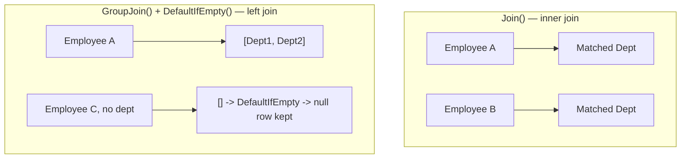
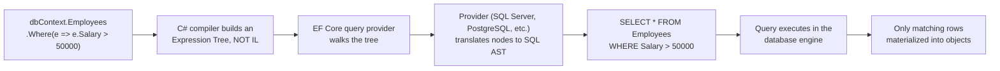

# LINQ — Interview Revision Notes

> Quick-revision Q&A derived from `E. LINQ-Interview-Guide.md`. Covers every section of the source.

## Core Concepts

### What LINQ Is and Why It Exists

**Q: What is LINQ and why does it exist?**

A: A set of query operators built into .NET for querying in-memory collections, databases, XML, JSON, etc. using one consistent, strongly-typed syntax instead of hand-rolled loops or SQL strings.

**Q: Why does the "LINQ to Objects vs LINQ to Entities" distinction matter at senior level?**

A: They look identical syntactically but work completely differently:
- LINQ to Objects — plain delegates (`Func<T,bool>`), executed in-memory item by item.
- LINQ to Entities/SQL — expression trees translated into SQL and executed remotely.

Conflating the two is the most common source of LINQ production bugs/perf incidents.

**Q: What are LINQ's key benefits?**

A:
- Readability — declarative, closer to intent than loops.
- Compile-time type safety and IntelliSense.
- Uniform query surface across objects, SQL, XML, JSON.
- Deferred execution enables composition and (for `IQueryable`) provider-side optimization.

### LINQ Flavors

**Q: Name the LINQ flavors and their underlying interfaces.**

A:
- LINQ to Objects — arrays/`List<T>` — `IEnumerable<T>`
- LINQ to Entities — EF/EF Core — `IQueryable<T>`
- LINQ to SQL — legacy SQL Server ORM — `IQueryable<T>`
- LINQ to XML (XLinq) — `XDocument` — `IEnumerable<T>`
- LINQ to JSON — `JToken`/System.Text.Json — `IEnumerable<T>`

```csharp
// LINQ to XML
XDocument xml = XDocument.Load("employees.xml");
var names = xml.Descendants("Employee").Select(e => e.Element("Name").Value);

// LINQ to JSON-derived objects — once deserialized, it's just LINQ to Objects
var users = JsonConvert.DeserializeObject<List<User>>(jsonData);
var activeUsers = users.Where(u => u.IsActive).ToList();
```

### Query Syntax vs Method Syntax

**Q: How do query syntax and method syntax relate?**

A: Both compile to the same IL — query syntax is syntactic sugar the compiler translates into method calls. Method syntax dominates real code because it supports operators with no query keyword (`Sum`, `Count`, `Take`, etc.) and chains better.

```csharp
var result = from emp in employees where emp.Age > 30 select emp;
var result = employees.Where(emp => emp.Age > 30);
```

### Deferred vs Immediate Execution

**Q: What's the difference between deferred and immediate execution?**

A:
- Deferred — the query variable holds a description (iterator or expression tree); nothing runs until enumerated (`foreach`, `.ToList()`, `.Count()`, `.First()`...).
- Immediate — methods that must produce a concrete result now: `.ToList()`, `.ToArray()`, `.ToDictionary()`, `.Count()`, `.Sum()`, `.First()`, `.Any()` (when called directly).

```csharp
var result = employees.Where(emp => emp.Age > 30); // deferred — nothing has run yet
Console.WriteLine(result.Count());                  // query executes HERE

var result2 = employees.Where(emp => emp.Age > 30).ToList(); // executes immediately
```


**Q: Why do interviewers probe deferred execution so hard?**

A: The same query variable can yield different results on each enumeration if the source or captured variables changed in between.

```csharp
var numbers = new List<int> { 1, 2, 3 };
var query = numbers.Where(n => n > 1);
numbers.Add(4);
Console.WriteLine(string.Join(",", query)); // 2,3,4 — not 2,3
```

### Closures Over Variables — The Classic Deferred Execution Trap

**Q: How does closure-over-variable capture interact with deferred execution?**

A: The lambda closes over the variable by reference, not its value at write-time. If the variable changes before enumeration, the query uses the new value.

```csharp
int threshold = 30;
var query = employees.Where(e => e.Age > threshold);
threshold = 50;
var result = query.ToList(); // filters using 50
```

**Q: What was the historical `for`-loop closure bug, and is it still alive?**

A: Pre-C# 5, `for` loops captured the same loop variable across iterations, so delegates created inside the loop all saw the final value (e.g., printing `3,3,3` instead of `0,1,2`). Fixed for `foreach` since C# 5 (new variable per iteration), but the underlying trap still applies to `for` loops and any manually-scoped mutable capture. Fix: copy to a local variable inside the loop body before capturing.

```csharp
var actions = new List<Action>();
for (int i = 0; i < 3; i++)
{
    actions.Add(() => Console.WriteLine(i)); // captures the SAME 'i' variable across iterations
}
actions.ForEach(a => a()); // prints 3, 3, 3 in old semantics for 'for'; NOT 0,1,2
```

```csharp
for (int i = 0; i < 3; i++)
{
    int local = i; // new variable per iteration
    actions.Add(() => Console.WriteLine(local));
}
```

## Intermediate Concepts

### Select vs SelectMany

**Q: What's the difference between `Select` and `SelectMany`?**

A: `Select` preserves nesting (collection of collections, 1:1 projection); `SelectMany` flattens one level (projecting + flattening, e.g., all skills across all employees). `SelectMany` is also how LINQ implements cross joins and functional "flatMap".

```csharp
var result1 = students.Select(s => s.Courses);     // IEnumerable<List<string>>
var result2 = students.SelectMany(s => s.Courses); // IEnumerable<string>, flattened

var allSkills = employees.SelectMany(e => e.Skills); // flattened list of all skills across all employees
```

### First/FirstOrDefault/Single/SingleOrDefault

**Q: Compare `First`, `FirstOrDefault`, `Single`, `SingleOrDefault`.**

A:
- `First()` — first match; throws if none.
- `FirstOrDefault()` — first match or `default(T)`; never throws for zero matches.
- `Single()` — expects exactly one; throws on zero or more than one.
- `SingleOrDefault()` — expects zero or one; throws if more than one, default if zero.

```csharp
var firstUser = users.FirstOrDefault(u => u.Age > 30); // safe, no exception risk
var singleEmp = employees.Single(e => e.Id == 101);     // asserts uniqueness — use for PK lookups
```

**Q: When should you prefer `Single()` over `First()`?**

A: When the business rule genuinely guarantees uniqueness (e.g., PK lookup) — `Single()` surfaces a data-integrity bug loudly instead of silently returning "the first one."

### Any / All

**Q: What do `Any()`/`All()` return on an empty sequence?**

A: `All()` on empty returns `true` (vacuous truth) — classic gotcha. `Any()` on empty returns `false`. Prefer `collection.Any()` over `collection.Count() > 0` for existence checks.

```csharp
bool hasAdults = users.Any(u => u.Age >= 18);
bool allAdults = users.All(u => u.Age >= 18);
```

### GroupBy

**Q: What does `GroupBy` return, and is it deferred?**

A: `IEnumerable<IGrouping<TKey, TElement>>` — each `IGrouping` is itself an `IEnumerable<TElement>` plus a `.Key`. It is deferred, but in LINQ-to-Objects it must buffer the entire source before yielding the first group — it can't truly stream.

```csharp
var groupedUsers = users.GroupBy(u => u.City);
foreach (var group in groupedUsers)
{
    Console.WriteLine($"City: {group.Key}, Count: {group.Count()}");
}
```

### Join vs GroupJoin (Left Join)

**Q: Difference between `Join()` and `GroupJoin()`?**

A: `Join()` is an inner join — one flat row per matching pair. `GroupJoin()` produces one row per left element with a nested collection of matches (models one-to-many/"left join" shape); combine with `.SelectMany(...DefaultIfEmpty())` to flatten into a true SQL-style left outer join.

```csharp
// Inner join
var result = employees.Join(departments,
    e => e.DeptID,
    d => d.ID,
    (e, d) => new { e.Name, d.Name });

// Left join (query syntax) — DefaultIfEmpty() includes unmatched left rows
var result2 = from emp in employees
              join dept in departments
                  on emp.DeptID equals dept.ID into empDept
              from d in empDept.DefaultIfEmpty()
              select new { emp.Name, Department = d?.Name ?? "No Department" };
```



### Aggregate Functions and Aggregate()

**Q: What is `Aggregate()` used for, and what's the EF Core caveat?**

A: LINQ's generic fold/reduce — for custom cumulative operations with no built-in aggregate fit (running string, custom rolling metric). In EF Core, `Aggregate()` almost always can't translate to SQL — forces client evaluation or throws.

```csharp
int totalSalary = employees.Sum(emp => emp.Salary);
double avgSalary = employees.Average(emp => emp.Salary);

int product = numbers.Aggregate((a, b) => a * b); // custom cumulative operation
```

### Distinct, Except, Intersect, Union

**Q: Describe `Except`, `Intersect`, `Union`.**

A:
- `Except()` — in first but not second.
- `Intersect()` — common to both.
- `Union()` — all unique elements from both (de-duplicates).

```csharp
int[] a = { 1, 2, 3, 4 };
int[] b = { 3, 4, 5, 6 };
var except = a.Except(b);       // 1, 2
var intersect = a.Intersect(b); // 3, 4
var union = a.Union(b);         // 1, 2, 3, 4, 5, 6
```

All three use `EqualityComparer<T>.Default` unless you supply a custom `IEqualityComparer<T>` — easy to forget for reference types with custom equality (e.g., comparing DTOs by a subset of properties).

### ToLookup() vs GroupBy()

**Q: How does `ToLookup()` differ from `GroupBy()`?**

A:

| Feature | `GroupBy()` | `ToLookup()` |
|---|---|---|
| Execution | Deferred | Immediate |
| Return type | `IEnumerable<IGrouping<K,V>>` | `ILookup<K,V>` |
| Indexable by key | No | Yes (`lookup["HR"]`) |
| Missing key | N/A | Empty sequence, not exception |

```csharp
var lookup = employees.ToLookup(e => e.Department);
Console.WriteLine(lookup["HR"].Count());
```

### MaxBy, MinBy, DistinctBy, and Chunk (.NET 6+)

**Q: What do `MaxBy`/`MinBy` give you that `Max`/`Min` don't?**

A: They return the *element* with the max/min projected key, not just the projected value — fixes the classic bug of using `.Max(f => f.AverageSalary)` and losing the associated entity/department.

```csharp
// MaxBy / MinBy — keeps the whole element, not just the projected value
var highestPaid = employees.MaxBy(e => e.Salary);   // Employee, not decimal
var lowestPaid = employees.MinBy(e => e.Salary);     // Employee, not decimal

// Equivalent to the older, more verbose idiom:
var highestPaidOld = employees.OrderByDescending(e => e.Salary).First();
```

**Q: What does `DistinctBy` do?**

A: De-duplicates by a projected key, without needing a custom `IEqualityComparer<T>` — e.g., `employees.DistinctBy(e => e.DepartmentId)`.

```csharp
// DistinctBy — de-dup by a key selector, no custom IEqualityComparer needed
var oneEmployeePerDept = employees.DistinctBy(e => e.DepartmentId);
```

**Q: What does `Chunk` do?**

A: Splits a sequence into fixed-size batches (`IEnumerable<T[]>`); last batch may be smaller. Common use: batching bulk inserts/API calls under a max-batch-size limit.

```csharp
// Chunk — batch a sequence into arrays of at most N elements
foreach (int[] batch in employeeIds.Chunk(100))
{
    await bulkApiClient.ProcessBatchAsync(batch); // e.g., respecting a 100-item API limit
}
```

**Q: Gotchas with `MaxBy`/`MinBy`/`DistinctBy`/`Chunk`?**

A:
- `MaxBy`/`MinBy` return `default(T)` on empty sequences instead of throwing (unlike `Max()`/`Min()`, which throw `InvalidOperationException` on empty non-nullable value-type sequences).
- Ties: `MaxBy`/`MinBy` return the first element encountered, same as `OrderBy...First()`.
- EF Core translation support for these varies by provider/version — verify generated SQL, don't assume push-down.
- `Chunk`'s last batch can be shorter — always handle a partial final batch.

### Take/Skip, Pagination, DefaultIfEmpty, Zip

**Q: What does `Zip` do?**

A: Merges two sequences element-wise, stopping at the shorter sequence: `names.Zip(ages, (n, a) => $"{n} is {a}")`.

```csharp
// Pagination
int pageSize = 5, pageNumber = 2;
var pagedEmployees = employees.Skip((pageNumber - 1) * pageSize).Take(pageSize);

// DefaultIfEmpty
var result = employees.Where(e => e.ID == 100).DefaultIfEmpty(new Employee { Name = "Not Found" });

// Zip — merges two sequences element-wise, stops at the shorter one
var combined = names.Zip(ages, (name, age) => $"{name} is {age} years old.");
```

**Q: What's the senior gotcha with `Skip`/`Take` pagination against `IQueryable`?**

A: Always pair with `OrderBy` — SQL gives no ordering guarantee without one, so paging without an explicit sort produces non-deterministic page contents/duplicates under concurrent writes.

### ToDictionary and Non-Generic Collections

**Q: What happens if `ToDictionary` encounters duplicate keys?**

A: Throws `ArgumentException` — a common surprise when "unique key" assumptions don't hold. Use `GroupBy` + `ToDictionary(g => g.Key, g => g.ToList())` or `DistinctBy` when duplicates are possible.

```csharp
var empDict = employees.ToDictionary(e => e.ID, e => e.Name);

// Non-generic collections need casting
ArrayList list = new ArrayList { 1, 2, 3, 4 };
var numbers = list.Cast<int>().Where(n => n > 2);
```

**Q: How do you LINQ over non-generic collections like `ArrayList`?**

A: Cast first: `list.Cast<int>().Where(n => n > 2)`.

### Let Clause

**Q: What does `let` do, and does it have a method-syntax equivalent?**

A: Introduces a named intermediate value inside query syntax to avoid recomputing an expression multiple times. Only exists in query syntax; method-syntax equivalent is an intermediate `Select` projecting an anonymous type, or inlining.

```csharp
var result = from e in employees
             let bonus = e.Salary * 0.1m
             select new { e.Name, Bonus = bonus };
```

### Cross Join

**Q: How do you write a cross join in LINQ, and what's the method-syntax equivalent?**

A: `from e in employees from d in departments select new {...}` — equivalent to `employees.SelectMany(e => departments, (e, d) => new {...})`, i.e. the Cartesian product. Rare in practice; usually a bug (missing correlating `where`) when it appears.

```csharp
var result = from e in employees
             from d in departments
             select new { e.Name, d.Name };
```

## Advanced Concepts

### IEnumerable\<T\> vs IQueryable\<T\>

**Q: What's the core difference between `IEnumerable<T>` and `IQueryable<T>`?**

A:

| Feature | `IEnumerable<T>` | `IQueryable<T>` |
|---|---|---|
| Represents | Sequence + delegate (`Func<T,...>`) | Sequence + expression tree (`Expression<Func<T,...>>`) |
| Typical source | In-memory collections | ORMs (EF Core, LINQ to SQL) |
| Filtering happens | In app memory after materializing | Translated to SQL, executed at source |
| Can call arbitrary C# methods in predicate? | Yes | No — only what the provider can translate |

```csharp
IEnumerable<int> data1 = numbers.Where(n => n > 5);                       // in-memory
IQueryable<int> data2 = dbContext.Employees.Where(e => e.Salary > 50000); // translated to SQL, runs in DB
```

**Q: What's the classic `IEnumerable`/`IQueryable` trap interviewers dig for?**

A: Calling `.AsEnumerable()` (or any method that implicitly drops to `IEnumerable`) before your final `Where()` moves that filter client-side, after pulling the entire table across the wire — quietly catastrophic on large tables.

```csharp
// BAD: pulls all employees into memory, then filters in C#
var result = dbContext.Employees.AsEnumerable().Where(e => e.Salary > 50000);
// GOOD: filter translated to SQL WHERE
var result = dbContext.Employees.Where(e => e.Salary > 50000);
```

### Expression Trees and How LINQ-to-Entities Translates to SQL

**Q: What's the difference between a lambda assigned to `Func<T,...>` vs `Expression<Func<T,...>>`?**

A: `Func<T,...>` compiles to IL — an executable delegate. `Expression<Func<T,...>>` compiles to *data* — a tree of `Expression` node objects (`BinaryExpression`, `MemberExpression`, `ConstantExpression`) describing the code without running it.

**Q: Walk through the translation pipeline from a LINQ query to SQL.**

A: C# compiler builds an expression tree (not IL) → EF Core's query provider walks the tree → provider translates nodes to a SQL AST → SQL executes in the database engine → only matching rows are materialized into objects. This is why `IQueryable<T>.Where`'s parameter type is `Expression<Func<T,bool>>` while `IEnumerable<T>.Where`'s is a plain `Func<T,bool>`.



```csharp
Expression<Func<Employee, bool>> isHighEarner = e => e.Salary > 50000;
// isHighEarner.Body, .Parameters, etc. can be inspected/rewritten at runtime —
// this is what libraries like AutoMapper's ProjectTo, Dynamic LINQ, and
// custom query-builder abstractions rely on.
```

**Q: What happens if you use a C# construct with no SQL equivalent inside a translated predicate?**

A: Either throws `InvalidOperationException` (older EF/strict providers) or triggers client evaluation with a warning (EF Core).

### Client-Eval Fallback and Query Translation Limits (EF Core)

**Q: How does EF Core handle a predicate it can't translate to SQL?**

A: Unlike EF6 (hard error), EF Core by default silently pulls the untranslatable part into memory and evaluates client-side, logging only a warning — easy to miss in production.

```csharp
var result = dbContext.Employees
    .Where(e => Regex.IsMatch(e.Name, "^A"))  // client-eval warning, pulls ALL rows first
    .ToList();
```

**Q: Name common untranslatable constructs.**

A:
- Arbitrary instance/static C# method calls without provider translation (custom validators, most regex, culture-specific string ops).
- `Aggregate()`, operators needing a custom `IComparer`/`IEqualityComparer`.
- Complex nested ternary/pattern-matching in some provider versions.
- Anything after already dropping to `IEnumerable` (`.AsEnumerable()`, `.ToList()`, etc.).

**Q: How do you mitigate silent client-eval fallback?**

A:
- Configure warnings-as-errors in non-prod: `optionsBuilder.ConfigureWarnings(w => w.Throw(RelationalEventId.QueryClientEvaluationWarning))` (API varies by version).
- Keep filtering/projection inside the `IQueryable` portion; call `.AsEnumerable()`/`.ToList()` only as the last step.
- Use `.Select()` to project needed columns before materializing.

### yield return and Custom Iterators

**Q: How would you write a custom LINQ operator that streams/defers like the built-ins?**

A: Use `yield return`:

```csharp
public static IEnumerable<TSource> WhereGreaterThan<TSource, TKey>(
    this IEnumerable<TSource> source, Func<TSource, TKey> selector, TKey threshold)
    where TKey : IComparable<TKey>
{
    foreach (var item in source)
        if (selector(item).CompareTo(threshold) > 0)
            yield return item;
}
```

**Q: What does the compiler do with a `yield return` method?**

A: Rewrites it into a compiler-generated state machine implementing `IEnumerator<T>` — this is how `Where`/`Select` achieve deferred, streaming, one-item-at-a-time execution without buffering the whole sequence.

**Q: What's the eager-validation gotcha with iterator methods?**

A: Argument validation inside an iterator method doesn't run until first enumeration (`MoveNext()`), not when the method is called — exceptions surface far from where the query was built. Fix: split into a public non-iterator wrapper that validates eagerly, then delegates to a private iterator method.

```csharp
public static IEnumerable<T> SafeWhere<T>(this IEnumerable<T> source, Func<T, bool> predicate)
{
    if (source is null) throw new ArgumentNullException(nameof(source)); // validated eagerly
    if (predicate is null) throw new ArgumentNullException(nameof(predicate));
    return SafeWhereIterator(source, predicate); // deferred part factored out
}

private static IEnumerable<T> SafeWhereIterator<T>(IEnumerable<T> source, Func<T, bool> predicate)
{
    foreach (var item in source)
        if (predicate(item))
            yield return item;
}
```

### Custom LINQ Extension Methods

**Q: How do you write a basic custom LINQ extension method?**

A:

```csharp
public static class MyExtensions
{
    public static IEnumerable<int> GetEvens(this IEnumerable<int> numbers)
        => numbers.Where(n => n % 2 == 0);
}

// Usage
var evens = numbers.GetEvens();
```

### Dynamic LINQ

**Q: What is Dynamic LINQ used for, and what's the trade-off?**

A: Building filters/sorts from runtime configuration (e.g., a search UI with user-selectable fields) via string predicates, using `System.Linq.Dynamic.Core`: `employees.AsQueryable().Where("Salary > 50000")`. Trade-off: loses compile-time safety and is a potential injection surface if field names/operators come from untrusted input — always validate against an allow-list of column names.

```csharp
// Requires System.Linq.Dynamic.Core
var result = employees.AsQueryable().Where("Salary > 50000").ToList();
```

### LINQ Method Chaining vs Query Syntax — When to Use Which

**Q: Give a decision rule for query syntax vs method syntax.**

A:
- Simple filter/projection/sort chains → method syntax.
- Multi-`join`, especially `GroupJoin` + `DefaultIfEmpty` (left join) → query syntax (more readable `into`/`from` shape).
- Needing `let` for a reused intermediate value → query syntax.
- Operators with no query keyword (`Sum`, `Count`, `Take`, `Skip`, `Distinct`, `Any`, `Aggregate`) → method syntax (mandatory).
- Conditionally-built queries (appending `.Where()` based on flags) → method syntax (trivially composable).

```csharp
IQueryable<Employee> query = dbContext.Employees;
if (minSalary.HasValue) query = query.Where(e => e.Salary >= minSalary.Value);
if (!string.IsNullOrEmpty(department)) query = query.Where(e => e.Department == department);
```

## Performance

### General Optimization Rules

**Q: List the general LINQ performance rules.**

A:
- Use `.AsEnumerable()` deliberately, only after server-side filtering is done.
- Avoid premature `.ToList()`/`.ToArray()` — materializes everything, defeats further composition/provider optimization.
- Prefer `.Any()` over `.Count() > 0` for existence checks.
- Filter early with `Where()` before `Select()`/`OrderBy()`.
- Always pair `Skip`/`Take` with `OrderBy` for `IQueryable`.

### The Multiple Enumeration Pitfall

**Q: What's wrong with this code?**

```csharp
IEnumerable<Employee> highEarners = employees.Where(e => e.Salary > 50000);
int count = highEarners.Count();   // enumeration #1
var list = highEarners.ToList();   // enumeration #2
if (highEarners.Any()) { ... }     // enumeration #3
```

A: Each call re-runs the `Where` predicate from scratch against the original source — the variable holds an undecided iterator, not a cached result. For LINQ-to-Objects: 3x wasted work. For LINQ-to-Entities: 3 separate DB round trips. If the source changes between enumerations, results can even become inconsistent.

**Q: What's the fix, and how do you catch this in review?**

A: Materialize once with `.ToList()`/`.ToArray()` as soon as you know you'll need the results more than once, then work off that snapshot. Roslyn analyzers/ReSharper flag this as "possible multiple enumeration of IEnumerable."

```csharp
var highEarners = employees.Where(e => e.Salary > 50000).ToList(); // ONE enumeration, cached

int count = highEarners.Count;   // property on List<T>, no re-enumeration
var list = highEarners;          // already a list
if (highEarners.Any()) { ... }   // cheap, operates on the materialized list
```

### Hidden O(n²) Traps — Nested Where/Any Inside Select

**Q: Why is this slow, and how do you fix it?**

```csharp
// O(n * m): for every employee, linearly scans the entire departments list
var result = employees.Select(e => new
{
    e.Name,
    DeptName = departments.FirstOrDefault(d => d.Id == e.DepartmentId)?.Name
});

// Similarly O(n * m): Any() inside Select/Where re-scans 'blockedIds' for every item
var filtered = employees.Where(e => !blockedIds.Any(b => b == e.Id));
```

A: O(n·m) — for every employee, linearly scans the entire departments list. Fix: pre-index into a `Dictionary`/`HashSet`/`ILookup` (O(1) lookups), or use an actual `Join`/`GroupJoin` for O(n+m) hash-join semantics that also translates efficiently to SQL.

```csharp
// O(n + m): build the lookup once, then O(1) per employee
var deptById = departments.ToDictionary(d => d.Id, d => d.Name);
var result = employees.Select(e => new
{
    e.Name,
    DeptName = deptById.TryGetValue(e.DepartmentId, out var name) ? name : null
});

// O(n + m) with a HashSet
var blockedSet = blockedIds.ToHashSet();
var filtered = employees.Where(e => !blockedSet.Contains(e.Id));

// Or, idiomatically, just use Join — same O(n+m) hash-join semantics, and
// translates to an efficient SQL JOIN against IQueryable
var result2 = employees.Join(departments, e => e.DepartmentId, d => d.Id,
    (e, d) => new { e.Name, DeptName = d.Name });
```

### Parallel LINQ (PLINQ)

**Q: What is PLINQ and when should you use it?**

A: `users.AsParallel().Where(...).ToList()` — partitions the source across threads/cores for CPU-bound, embarrassingly-parallel in-memory work.

```csharp
var results = users.AsParallel().Where(u => u.Age > 30).ToList();
```

**Q: List the PLINQ trade-offs an interviewer expects unprompted.**

A:
- Overhead can exceed benefit for small collections/cheap predicates — benchmark, don't assume.
- Results unordered by default; use `.AsOrdered()` if order matters (at a cost).
- Not for I/O-bound or database work — `DbContext` isn't thread-safe; never fan out EF queries via PLINQ.
- Predicates must be side-effect-free/synchronized — mutating shared state is a race condition.
- Exceptions aggregate into `AggregateException` — code must unwrap it.
- `.WithDegreeOfParallelism(n)` caps thread usage in shared/server environments.

### IAsyncEnumerable and System.Linq.Async

**Q: What's the difference between synchronous LINQ enumeration and `IAsyncEnumerable<T>`?**

A: `IEnumerable<T>`/`IQueryable<T>` enumeration is synchronous — pulling the next item blocks the thread. `IAsyncEnumerable<T>` (via `await foreach`) lets `MoveNextAsync()` yield the thread back while waiting on I/O — matters for scalability under load.

```csharp
await foreach (var employee in dbContext.Employees.Where(e => e.Salary > 50000).AsAsyncEnumerable())
{
    Process(employee);
}
```

**Q: How do you get `Select`/`Where`/`SelectMany` composition over `IAsyncEnumerable<T>`?**

A: The BCL's own LINQ operators only target `IEnumerable`/`IQueryable`; use the `System.Linq.Async` NuGet package (from `dotnet/reactive`) for the async LINQ operator set.

**Q: `Task<IEnumerable<T>>` vs `IAsyncEnumerable<T>` — what's the distinction?**

A: `Task<IEnumerable<T>>` is one big async wait then a synchronous in-memory sequence. `IAsyncEnumerable<T>` is a genuinely async stream delivered incrementally — the right tool for large result sets/server-streaming (gRPC streaming, paged APIs, Minimal API endpoints).

### EF Core: AsNoTracking, Split Queries, and Compiled Queries

**Q: What does `.AsNoTracking()` do and when should you use it?**

A: Skips EF Core's change-tracking overhead (no snapshot comparison, no identity map) for read-only queries — significant win for reporting/read-heavy endpoints. `.AsNoTrackingWithIdentityResolution()` keeps identity resolution without full tracking.

**Q: What problem does `.AsSplitQuery()` solve?**

A: Eager-loading multiple `Include()` collection navigations defaults to one SQL query with JOINs, causing a "cartesian explosion" (row count multiplies per included collection). `.AsSplitQuery()` issues separate SQL queries per collection instead — trading more round trips for avoiding quadratic row bloat. Genuinely context-dependent which is faster.

**Q: What are compiled queries for?**

A: `EF.CompileQuery`/`EF.CompileAsyncQuery` pre-compile the expression-tree-to-SQL translation once, bypassing that cost on every call — matters for very hot-path queries; usually unnecessary elsewhere since EF Core already caches query plans.

**Q: What's often a bigger performance win than any of the above?**

A: Projection over full-entity loading — `.Select(e => new EmployeeDto {...})` before materializing avoids pulling unused columns and skips change-tracking machinery for the unselected shape.

```csharp
var dtos = await dbContext.Employees
    .AsNoTracking()
    .Where(e => e.IsActive)
    .Select(e => new EmployeeDto { Id = e.Id, Name = e.Name })
    .ToListAsync();
```

### Window-Function Alternatives for Ranking Queries (Nth Highest Salary in Production)

**Q: The in-memory answer to "Nth highest salary" is `Distinct().OrderByDescending().Skip(n).FirstOrDefault()`. How would you do this against a production database with millions of rows?**

A: Push ranking down to the database's native window functions (`RANK()`/`DENSE_RANK()`/`ROW_NUMBER() OVER (PARTITION BY ... ORDER BY ...)`) instead of pulling rows into memory to rank in C#.

**Q: Why is pushing down to SQL window functions usually better?**

A:
- Avoids full materialization — `Skip(n)` on `IQueryable` generally still requires computing/ordering the entire qualifying set first; a window function lets the optimizer use an index and often avoid a full sort.
- Set-based, not row-by-row — exactly what the DB engine is built to optimize; nested-`GroupBy`-then-rank shapes are historically hard for EF Core to translate and often silently fall back to client evaluation.
- One round trip, one query plan — get back exactly the N rows needed.
- Explicit tie handling — `RANK()` (shared rank, gaps), `DENSE_RANK()` (shared rank, no gaps), `ROW_NUMBER()` (strict tie-break) map to three different business rules, easy to get subtly wrong with hand-rolled `Distinct()`/`Skip()`.

```sql
WITH RankedSalaries AS (
    SELECT e.DepartmentId, e.Name, e.Salary,
           DENSE_RANK() OVER (PARTITION BY e.DepartmentId ORDER BY e.Salary DESC) AS SalaryRank
    FROM Employees e
)
SELECT DepartmentId, Name, Salary FROM RankedSalaries WHERE SalaryRank = 3;
```

**Q: How do you execute this raw-SQL ranking query via EF Core and still get strongly-typed rows?**

A: EF Core 8+: `dbContext.Database.SqlQuery<DeptSalaryRankDto>($"...")` — no DbSet-mapped entity needed, works for scalar/DTO projections. Pre-EF Core 8: `dbContext.Employees.FromSqlRaw(@"...")` against a mapped (or keyless) entity type.

```csharp
// EF Core: raw SQL for the ranking, still returned as strongly-typed rows.
// FromSqlRaw works when mapping to an existing entity/keyless type; SqlQuery<T> (EF Core 8+)
// is the newer, more flexible option for arbitrary projections that aren't a full tracked entity.

// EF Core 8+ : SqlQuery<T> — no need for a DbSet-mapped entity, works for scalar/DTO projections
var thirdHighestPerDept = await dbContext.Database
    .SqlQuery<DeptSalaryRankDto>($"""
        WITH RankedSalaries AS (
            SELECT DepartmentId, Name, Salary,
                   DENSE_RANK() OVER (PARTITION BY DepartmentId ORDER BY Salary DESC) AS SalaryRank
            FROM Employees
        )
        SELECT DepartmentId, Name, Salary FROM RankedSalaries WHERE SalaryRank = 3
        """)
    .ToListAsync();

// Pre-EF Core 8 / entity-shaped result: FromSqlRaw against a mapped (or keyless) entity type
var thirdHighestPerDeptLegacy = await dbContext.Employees
    .FromSqlRaw(@"
        WITH RankedSalaries AS (
            SELECT e.*, DENSE_RANK() OVER (PARTITION BY DepartmentId ORDER BY Salary DESC) AS SalaryRank
            FROM Employees e
        )
        SELECT * FROM RankedSalaries WHERE SalaryRank = 3")
    .ToListAsync();

public record DeptSalaryRankDto(int DepartmentId, string Name, decimal Salary);
```

**Q: When is the pure-LINQ in-memory version (Q2/Q11 style) still fine?**

A: Small, already-materialized collections (config data, a page already fetched, unit tests), or a genuine LINQ-to-Objects scenario with no database. Once the source is a real, growing `IQueryable` table, window functions become the production-grade answer — always verify the actual generated SQL/execution plan.

## Best Practices

**Q: Summarize the LINQ best-practices checklist.**

A:
- Prefer method syntax by default; query syntax for multi-join/`let`-heavy queries.
- Materialize (`.ToList()`/`.ToArray()`) exactly once, at the point you know you'll enumerate more than once.
- Filter (`Where`) as early as possible, especially against `IQueryable`.
- Use `Any()` instead of `Count() > 0` for existence checks.
- Keep everything needed inside the `IQueryable` portion; call `.AsEnumerable()`/`.ToList()` only as the final step.
- Pre-index lookup collections (`Dictionary`/`HashSet`/`ToLookup`) before nesting a scan inside `Select`/`Where`.
- Use `AsNoTracking()` for read-only EF Core queries.
- Project onto DTOs with `Select()` before materializing.
- Always pair `Skip`/`Take` with `OrderBy` against `IQueryable`.
- Benchmark before reaching for `AsParallel()`.
- Use `.ToList()` before mutating a collection currently being iterated with `foreach`.

## Common Pitfalls

**Q: List the common LINQ pitfalls to watch for.**

A:
- Multiple enumeration of a deferred `IEnumerable`/`IQueryable` — silently re-runs (and re-hits the DB for EF) every time.
- Closures over mutable variables captured by reference in deferred queries.
- Client-side evaluation fallback in EF Core silently pulling entire tables into memory.
- `All()` on an empty sequence returns `true`; `Any()` returns `false`.
- `ToDictionary()` throws on duplicate keys.
- Modifying a collection while iterating it throws `InvalidOperationException` — snapshot with `.ToList()` first.
- Forgetting `OrderBy` before `Skip`/`Take` against a database — non-deterministic paging.
- Nested `Where`/`Any`/`FirstOrDefault` scans inside `Select` — hidden O(n²).
- Confusing `IEnumerable`/`IQueryable` — calling `.AsEnumerable()` too early moves filtering to app memory.
- Assuming `GroupBy` streams like `Where`/`Select` — in LINQ-to-Objects it buffers the whole source first.

## Worked Coding Exercises

These are foundational patterns; know them cold, they're the building blocks for the harder senior challenges below.

**Q: Give the LINQ one-liner for filtering even numbers.**

A: `numbers.Where(n => n % 2 == 0).ToList();`

**Q: Employees earning more than 50,000, names only?**

A: `employees.Where(e => e.Salary > 50000).Select(e => e.Name);`

**Q: Find duplicate numbers in a list.**

A: `numbers.GroupBy(n => n).Where(g => g.Count() > 1).Select(g => g.Key).ToList();`

**Q: Word frequency count from a sentence.**

A: `sentence.Split(' ').GroupBy(w => w).Select(g => new { Word = g.Key, Count = g.Count() });`

**Q: Second highest salary without sorting twice.**

A: `salaries.Distinct().OrderByDescending(s => s).Skip(1).FirstOrDefault();`

**Q: Top 3 most expensive products.**

A: `products.OrderByDescending(p => p.Price).Take(3).Select(p => p.Name);`

**Q: Uppercase transform of names.**

A: `names.Select(name => name.ToUpper());`

**Q: Names starting with 'A'.**

A: `employees.Where(name => name.StartsWith("A")).ToList();`

**Q: Inner join students to scores.**

A: `students.Join(scores, student => student, score => score.StudentId, (student, score) => new { StudentId = student, Score = score.Score });`

All ten together:

```csharp
// 1. Even numbers
var evenNumbers = numbers.Where(n => n % 2 == 0).ToList();

// 2. Employees earning > 50,000
var highEarners = employees.Where(e => e.Salary > 50000).Select(e => e.Name);

// 3. Duplicate numbers
var duplicates = numbers.GroupBy(n => n).Where(g => g.Count() > 1).Select(g => g.Key).ToList();

// 4. Word frequency count
var wordCount = sentence.Split(' ').GroupBy(w => w).Select(g => new { Word = g.Key, Count = g.Count() });

// 5. Second highest salary (single sort, no duplicate sort pass)
var secondHighest = salaries.Distinct().OrderByDescending(s => s).Skip(1).FirstOrDefault();

// 6. Top 3 expensive products
var top3Expensive = products.OrderByDescending(p => p.Price).Take(3).Select(p => p.Name);

// 7. Group employees by department (see GroupBy section above)

// 8. Uppercase transform
var upperNames = names.Select(name => name.ToUpper());

// 9. Names starting with 'A'
var aNames = employees.Where(name => name.StartsWith("A")).ToList();

// 10. Inner join students to scores
var studentScores = students.Join(scores,
    student => student,
    score => score.StudentId,
    (student, score) => new { StudentId = student, Score = score.Score });
```

## Senior-Level Query Challenges (with Solutions)

Dataset used throughout (as in source notes):

```csharp
public class Employee
{
    public int Id { get; set; }
    public string Name { get; set; }
    public int DepartmentId { get; set; }
    public decimal Salary { get; set; }
    public DateTime JoiningDate { get; set; }
}

public class Department
{
    public int Id { get; set; }
    public string Name { get; set; }
}

public class Order
{
    public int Id { get; set; }
    public int CustomerId { get; set; }
    public decimal Amount { get; set; }
    public DateTime OrderDate { get; set; }
}

public class Customer
{
    public int Id { get; set; }
    public string Name { get; set; }
    public string City { get; set; }
}
```

### Level 1 — Medium

**Q1: Employees earning more than the average salary — and the gotcha against `IQueryable`?**

A: `var avg = employees.Average(e => e.Salary); employees.Where(e => e.Salary > avg);` — against `IQueryable` this needs two round trips (or EF Core translating it into a subquery); verify generated SQL, sometimes better as a single windowed-average query.

```csharp
var avg = employees.Average(e => e.Salary);
var result = employees.Where(e => e.Salary > avg);
```

**Q3: Employees who joined in the last 6 months.**

A: `var cutoff = DateTime.Today.AddMonths(-6); employees.Where(e => e.JoiningDate >= cutoff);`

```csharp
var cutoff = DateTime.Today.AddMonths(-6);
var recentJoiners = employees.Where(e => e.JoiningDate >= cutoff);
```

**Q4: Order names by DepartmentId asc, Salary desc.**

A: `employees.OrderBy(e => e.DepartmentId).ThenByDescending(e => e.Salary).Select(e => e.Name);`

```csharp
var ordered = employees.OrderBy(e => e.DepartmentId).ThenByDescending(e => e.Salary).Select(e => e.Name);
```

**Q5: Top 5 highest paid employees.**

A: `employees.OrderByDescending(e => e.Salary).Take(5);`

```csharp
var top5 = employees.OrderByDescending(e => e.Salary).Take(5);
```

### Level 2 — Upper Medium

**Q6: Department with the highest average salary — and what mistake do people make?**

A: `employees.GroupBy(e => e.DepartmentId).Select(g => new { DeptId = g.Key, AvgSalary = g.Average(e => e.Salary) }).OrderByDescending(x => x.AvgSalary).First();` — don't use `.Max()` here, it returns only the numeric max and discards the department; use `OrderByDescending().First()` or `MaxBy`.

```csharp
var topDept = employees.GroupBy(e => e.DepartmentId)
    .Select(g => new { DeptId = g.Key, AvgSalary = g.Average(e => e.Salary) })
    .OrderByDescending(x => x.AvgSalary)
    .First(); // do NOT use Max() here if you need the department, not just the value — see note below
```

**Q7: Highest paid employee per department, joined to department name.**

A: Group by department, project `Top = g.OrderByDescending(e => e.Salary).First()`, then `Join` to `departments`.

```csharp
var highestPaidByDept = employees.GroupBy(e => e.DepartmentId)
    .Select(g => new { DeptId = g.Key, Top = g.OrderByDescending(e => e.Salary).First() })
    .Join(departments, x => x.DeptId, d => d.Id, (x, d) => new { Dept = d.Name, x.Top.Name, x.Top.Salary });
```

**Q8: Duplicate employee names.**

A: `employees.GroupBy(e => e.Name).Where(g => g.Count() > 1).Select(g => g.Key);`

```csharp
var dupNames = employees.GroupBy(e => e.Name).Where(g => g.Count() > 1).Select(g => g.Key);
```

**Q9: Employees joined per year.**

A: `employees.GroupBy(e => e.JoiningDate.Year).Select(g => new { Year = g.Key, Count = g.Count() });`

```csharp
var perYear = employees.GroupBy(e => e.JoiningDate.Year)
    .Select(g => new { Year = g.Key, Count = g.Count() });
```

**Q10: Employees whose salary is above their department average.**

A:

```csharp
employees.GroupBy(e => e.DepartmentId)
    .SelectMany(g => { var avg = g.Average(e => e.Salary); return g.Where(e => e.Salary > avg); });
```

Using `SelectMany` flattens directly to qualifying employees rather than a nested grouping structure.

### Level 3 — Hard

**Q11: Third highest salary per department.**

A: `employees.GroupBy(e => e.DepartmentId).Select(g => new { DeptId = g.Key, ThirdHighest = g.Select(e => e.Salary).Distinct().OrderByDescending(s => s).Skip(2).FirstOrDefault() });`

```csharp
var thirdHighestByDept = employees.GroupBy(e => e.DepartmentId)
    .Select(g => new
    {
        DeptId = g.Key,
        ThirdHighest = g.Select(e => e.Salary).Distinct().OrderByDescending(s => s).Skip(2).FirstOrDefault()
    });
```

**Q12: Employees with the same salary as someone in another department.**

A: `employees.GroupBy(e => e.Salary).Where(g => g.Select(e => e.DepartmentId).Distinct().Count() > 1).SelectMany(g => g);`

```csharp
var crossDeptSameSalary = employees.GroupBy(e => e.Salary)
    .Where(g => g.Select(e => e.DepartmentId).Distinct().Count() > 1)
    .SelectMany(g => g);
```

**Q13: Departments where every employee earns more than 50,000 — what's the correct operator, and what's the bug to avoid?**

A: `employees.GroupBy(e => e.DepartmentId).Where(g => g.All(e => e.Salary > 50000)).Select(g => g.Key);` — using `.TakeWhile(...)` here is wrong: it stops at the first failing group and silently drops all subsequent groups, even passing ones. Must use `.Where(...).All(...)`.

```csharp
var allAbove50k = employees.GroupBy(e => e.DepartmentId)
    .Where(g => g.All(e => e.Salary > 50000))
    .Select(g => g.Key);
```

**Q14: Departments with at least one employee earning > 200,000.**

A: `employees.GroupBy(e => e.DepartmentId).Where(g => g.Any(e => e.Salary > 200000)).Select(g => g.Key);`

```csharp
var anyAbove200k = employees.GroupBy(e => e.DepartmentId)
    .Where(g => g.Any(e => e.Salary > 200000))
    .Select(g => g.Key);
```

**Q15: Employees earning the max salary in their department.**

A:

```csharp
employees.GroupBy(e => e.DepartmentId)
    .SelectMany(g => { var max = g.Max(e => e.Salary); return g.Where(e => e.Salary == max); });
```

### Level 4 — Advanced Joins

**Q16: Employees with department names.**

A: `employees.Join(departments, e => e.DepartmentId, d => d.Id, (e, d) => new { e.Name, DeptName = d.Name });`

```csharp
var withDeptNames = employees.Join(departments, e => e.DepartmentId, d => d.Id,
    (e, d) => new { e.Name, DeptName = d.Name });
```

**Q17: Departments with no employees.**

A: `departments.GroupJoin(employees, d => d.Id, e => e.DepartmentId, (d, emps) => new { Dept = d.Name, Emps = emps }).Where(x => !x.Emps.Any()).Select(x => x.Dept);` — prefer `!Any()` over `Count() < 1`.

```csharp
var emptyDepartments = departments.GroupJoin(employees, d => d.Id, e => e.DepartmentId,
        (d, emps) => new { Dept = d.Name, Emps = emps })
    .Where(x => !x.Emps.Any()) // prefer !Any() over Count() < 1 — avoids a full count when Any() short-circuits
    .Select(x => x.Dept);
```

**Q18: Employees whose department does not exist.**

A: `employees.GroupJoin(departments, e => e.DepartmentId, d => d.Id, (e, depts) => new { e.Name, DeptMatches = depts }).Where(x => !x.DeptMatches.Any()).Select(x => x.Name);`

```csharp
var orphanEmployees = employees.GroupJoin(departments, e => e.DepartmentId, d => d.Id,
        (e, depts) => new { e.Name, DeptMatches = depts })
    .Where(x => !x.DeptMatches.Any())
    .Select(x => x.Name);
```

**Q19: Per-department count/average/max/min salary — what bug must you guard against?**

A: Use `GroupJoin` then guard every aggregate: `Average = emps.Any() ? emps.Average(e => e.Salary) : 0` (same for `Max`/`Min`). Calling `Average`/`Max`/`Min` directly on an empty group throws `InvalidOperationException` — must guard for departments with zero employees.

```csharp
var deptStats = departments.GroupJoin(employees, d => d.Id, e => e.DepartmentId,
    (d, emps) => new
    {
        Dept = d.Name,
        Count = emps.Count(),
        Average = emps.Any() ? emps.Average(e => e.Salary) : 0,
        Max = emps.Any() ? emps.Max(e => e.Salary) : 0,
        Min = emps.Any() ? emps.Min(e => e.Salary) : 0
    });
```

### Level 5 — Real Production Style

**Q20: Customers who never placed an order.**

A: `customers.GroupJoin(orders, c => c.Id, o => o.CustomerId, (c, custOrders) => new { c.Name, custOrders }).Where(x => !x.custOrders.Any()).Select(x => x.Name);`

```csharp
var noOrderCustomers = customers.GroupJoin(orders, c => c.Id, o => o.CustomerId,
        (c, custOrders) => new { c.Name, custOrders })
    .Where(x => !x.custOrders.Any())
    .Select(x => x.Name);
```

**Q21: Customer who spent the most overall.**

A: `orders.GroupBy(o => o.CustomerId).Select(g => new { CustomerId = g.Key, Total = g.Sum(o => o.Amount) }).OrderByDescending(x => x.Total).First();`

```csharp
var topSpender = orders.GroupBy(o => o.CustomerId)
    .Select(g => new { CustomerId = g.Key, Total = g.Sum(o => o.Amount) })
    .OrderByDescending(x => x.Total)
    .First();
```

**Q22: Top customer in each city by spending — what pattern is this?**

A: Join customers to orders, `GroupBy(city)`, then within each city group `GroupBy(customer)`, sum, `OrderByDescending`, `First()`. This is a nested `GroupBy` ("top N per group" pattern) — same shape as Q30.

```csharp
var topCustomerPerCity = customers.Join(orders, c => c.Id, o => o.CustomerId,
        (c, o) => new { c.City, c.Name, o.Amount })
    .GroupBy(x => x.City)
    .Select(cityGroup => new
    {
        City = cityGroup.Key,
        TopCustomer = cityGroup.GroupBy(x => x.Name)
            .Select(custGroup => new { Name = custGroup.Key, Total = custGroup.Sum(x => x.Amount) })
            .OrderByDescending(x => x.Total)
            .First()
    });
```

**Q23: Per-month total orders, revenue, average order value.**

A: `orders.GroupBy(o => new { o.OrderDate.Year, o.OrderDate.Month }).Select(g => new { g.Key.Year, g.Key.Month, TotalOrders = g.Count(), TotalRevenue = g.Sum(o => o.Amount), AvgOrderValue = g.Average(o => o.Amount) }).OrderBy(x => x.Year).ThenBy(x => x.Month);`

```csharp
var monthlyStats = orders.GroupBy(o => new { o.OrderDate.Year, o.OrderDate.Month })
    .Select(g => new
    {
        g.Key.Year,
        g.Key.Month,
        TotalOrders = g.Count(),
        TotalRevenue = g.Sum(o => o.Amount),
        AvgOrderValue = g.Average(o => o.Amount)
    })
    .OrderBy(x => x.Year).ThenBy(x => x.Month);
```

**Q24: Customers who placed orders on consecutive days — why is this tricky?**

A: No built-in LINQ operator does "adjacent pairwise comparison." Group by customer, get distinct sorted dates, then loop checking `(dates[i] - dates[i-1]).Days == 1`. Needs an explicit index loop or `Zip` after materializing to a list.

```csharp
var consecutiveDayCustomers = orders
    .GroupBy(o => o.CustomerId)
    .Where(g =>
    {
        var dates = g.Select(o => o.OrderDate.Date).Distinct().OrderBy(d => d).ToList();
        for (int i = 1; i < dates.Count; i++)
            if ((dates[i] - dates[i - 1]).Days == 1)
                return true;
        return false;
    })
    .Select(g => g.Key);
```

**Q25: Longest gap between orders per customer.**

A: `dates.Zip(dates.Skip(1), (earlier, later) => (later - earlier).Days)` generates consecutive-pair gaps (zipping a sequence with itself offset by one); wrap with `.DefaultIfEmpty(0).Max()` to guard single-order customers from `Max()` throwing on empty.

```csharp
var longestGapPerCustomer = orders.GroupBy(o => o.CustomerId)
    .Select(g =>
    {
        var dates = g.Select(o => o.OrderDate.Date).Distinct().OrderBy(d => d).ToList();
        var gaps = dates.Zip(dates.Skip(1), (earlier, later) => (later - earlier).Days);
        return new { CustomerId = g.Key, LongestGap = gaps.DefaultIfEmpty(0).Max() };
    });
```

### Level 6 — Senior Developer Challenges

**Q26: Numbers appearing more than once, preserving original order.**

A:

```csharp
var seen = new HashSet<int>();
var emitted = new HashSet<int>();
var duplicatesInOrder = numbers.Where(n => !seen.Add(n) && emitted.Add(n));
```

`HashSet<T>.Add` returns `false` if already present — `!seen.Add(n)` is true exactly when `n` was seen before; `emitted.Add(n)` ensures each duplicate is yielded once. Relies on side effects inside the predicate — intentionally impure, a pragmatic answer to an ordering constraint LINQ can't express declaratively.

**Q27: Missing numbers in a sequence.**

A: `Enumerable.Range(numbers.Min(), numbers.Max() - numbers.Min() + 1).Except(numbers);`

```csharp
var missing = Enumerable.Range(numbers.Min(), numbers.Max() - numbers.Min() + 1).Except(numbers);
```

**Q28: Merge overlapping date ranges — why isn't LINQ the right tool here?**

A: Merging is inherently stateful — whether a range merges into the previous one depends on a running "current merged range" that changes as you go. LINQ operators are designed for pure, stateless, item-independent transforms. Solution: `OrderBy` for the sort (LINQ), then a plain imperative `foreach` loop for the stateful merge. Recognizing when to drop LINQ for imperative logic is itself a senior signal.

```csharp
public static List<(DateTime Start, DateTime End)> MergeRanges(List<(DateTime Start, DateTime End)> ranges)
{
    var sorted = ranges.OrderBy(r => r.Start).ToList(); // LINQ handles the sort
    var merged = new List<(DateTime Start, DateTime End)>();
    foreach (var range in sorted) // but the merge itself needs stateful imperative logic
    {
        if (merged.Count > 0 && range.Start <= merged[^1].End)
        {
            var last = merged[^1];
            merged[^1] = (last.Start, range.End > last.End ? range.End : last.End);
        }
        else
        {
            merged.Add(range);
        }
    }
    return merged;
}
```

**Q29: Recursive reporting hierarchy under a manager — what's missing from LINQ?**

A: LINQ has no recursive/hierarchical traversal operator (no equivalent of a recursive CTE). Combine LINQ with explicit recursion or an iterative stack/queue traversal:

```csharp
public static IEnumerable<Employee> GetAllReports(int managerId, List<Employee> allEmployees)
{
    var directReports = allEmployees.Where(e => e.ManagerId == managerId).ToList();
    foreach (var report in directReports)
    {
        yield return report;
        foreach (var indirect in GetAllReports(report.Id, allEmployees))
            yield return indirect;
    }
}
```

If the hierarchy lives in a database, prefer a SQL recursive CTE over N+1 querying level-by-level in C#.

**Q30: Top 3 customers by revenue for each year — what's the general pattern?**

A: Nested `GroupBy` — outer key = partition (year), inner key = ranking dimension (customer); sum, `OrderByDescending`, `Take(3)`. This "top N per group" pattern also solves Q22. Note: window functions (`ROW_NUMBER() OVER (PARTITION BY...)`) are the SQL-side equivalent; modern EF Core (5+) can translate the nested-GroupBy shape in many cases but always verify generated SQL — older EF Core/EF6 often forced client evaluation for this exact pattern.

```csharp
var top3PerYear = orders.GroupBy(o => o.OrderDate.Year)
    .Select(yearGroup => new
    {
        Year = yearGroup.Key,
        TopCustomers = yearGroup.GroupBy(o => o.CustomerId)
            .Select(custGroup => new { CustomerId = custGroup.Key, Total = custGroup.Sum(o => o.Amount) })
            .OrderByDescending(x => x.Total)
            .Take(3)
            .ToList()
    });
```

## Sample Interview Q&A

**Q: What's the practical difference between `IEnumerable<T>` and `IQueryable<T>`, and why does it matter for a method signature?**

A: `IEnumerable<T>` is in-memory-executable via compiled delegates; `IQueryable<T>` is an expression tree a provider translates before executing at the source. Repository methods returning `IQueryable<T>` let callers compose further filtering pushed to the database; returning `IEnumerable<T>`/`List<T>` forces full materialization before further filtering — a common layered-architecture anti-pattern.

**Q: `var query = employees.Where(e => e.Age > minAge); minAge = 50;` then enumerate `query` — which value filters, 30 or 50?**

A: 50 — deferred execution captures the variable by reference, not its value at definition time; the predicate re-reads `minAge` at enumeration time.

**Q: Why might an EF Core query silently return correct results but perform terribly?**

A: Client evaluation fallback — an untranslatable part of the predicate/projection gets pulled into memory (often the entire table) and finished in C#, logged only as a warning. Diagnose via `ToQueryString()` (EF Core 5+) or query logging to check whether the expected `WHERE` clause is actually in the SQL.

**Q: What's wrong with `if (collection.Count() > 0)` as an existence check against `IQueryable`?**

A: Forces a full `COUNT(*)` scan/materialization just to compare against zero. `.Any()` translates to `EXISTS(...)` and short-circuits on first match — always cheaper or equal.

**Q: When would you deliberately choose query syntax over method syntax?**

A: Multi-table joins (especially left joins via `GroupJoin` + `DefaultIfEmpty`) and queries needing `let` for a reused intermediate value. Everything else, especially operators with no query keyword (`Sum`/`Count`/`Take`/`Distinct`), defaults to method syntax.

**Q: How would you find, per department, the employee with the highest salary — and what's the common mistake?**

A: `employees.GroupBy(e => e.DepartmentId).Select(g => g.OrderByDescending(e => e.Salary).First())`. Common mistake: using `.Max(e => e.Salary)` directly, which returns only the numeric max, losing the association to the entity. Use `OrderByDescending().First()` or `MaxBy` (.NET 6+).

**Q: What's the danger of `AsParallel()` combined with EF Core's `DbContext`?**

A: `DbContext` is not thread-safe. `AsParallel()` fans work across threads, so running it over an `IQueryable` backed by a shared `DbContext` risks concurrent-access exceptions or corrupted state. PLINQ is for CPU-bound in-memory work, not parallelizing database queries.

**Q: Explain step by step what happens when you write `dbContext.Employees.Where(e => e.Salary > 50000).ToList()`.**

A: `Where` builds an expression tree node wrapping the `DbSet<Employee>` query provider — nothing executes yet. `.ToList()` triggers enumeration: EF Core's provider walks the tree, translates it to SQL, executes against the database, and materializes rows into tracked `Employee` objects (unless `AsNoTracking()` was used).
