> **AWS Detailed Guide** · [Index](README.md) · Part II

# Networking

---

## 1. Fundamentals — Addressing & Design

### IP Addressing, CIDR & Subnetting — Ground Up

The rest of the Networking section treats CIDR notation as *given* — VPC `10.0.0.0/16`, subnet `10.0.1.0/24`, route `0.0.0.0/0`, SG rule `x.x.x.x/32`. This subsection fills that assumption in, because subnet sizing, route tables, security-group rules, peering, and IP exhaustion all rest on this one concept. "How many usable IPs are in a `/24` inside AWS?" is a routine interview question, and the answer is not `254`.

**1. An IPv4 address is not 4 numbers — it's 32 bits.** Dotted-decimal is just human-readable packaging:

```
Dotted decimal :     10   .    0     .    5     .    23
                     |         |          |          |
Binary         : 00001010 . 00000000 . 00000101 . 00010111
                 +-8 bit-+  +-8 bit-+  +-8 bit-+  +-8 bit-+
                              Total = 32 bits
```

Each octet is 8 bits, hence the range `0-255` (2^8 = 256 values) — which is why `10.0.300.1` is invalid. Total IPv4 space = 2^32 ≈ 4.29 billion, and that exhaustion is what gave rise to NAT and IPv6.

**2. An address splits into two parts — a network part and a host part.**

```
    +---------------- 32 bits -----------------+
    |  NETWORK part       |    HOST part       |
    |  (the building)     |  (the flat number) |
    +---------------------+--------------------+
      IDENTICAL for every    UNIQUE for each
      device in the subnet   device
```

There is only one question: **how many of the 32 bits are "the building"?** That's exactly what CIDR tells you.

**3. CIDR = "how many leading bits are locked."**

```
10.0.0.0/16
00001010.00000000 . 00000000.00000000
+----- 16 bits ---+ +----- 16 bits ---+
   NETWORK (FIXED)      HOST (FREE)
   cannot change        2^16 = 65,536 addresses

10.0.5.0/24
00001010.00000000.00000101 . 00000000
+-------- 24 bits --------+ +-8 bits-+
      NETWORK (FIXED)          HOST
                             2^8 = 256 addresses
```

Two formulas derive everything:

```
Free host bits  = 32 - prefix
Total addresses = 2^(32 - prefix)
```

**4. The most counter-intuitive part: a smaller prefix = a BIGGER network.** The prefix says how much is *locked*, so more locked = less freedom = a smaller block.

```
One 32-bit "pizza", sliced by prefix:

/8   ################################  16,777,216 IPs   <- HUGE
/16  ########                          65,536 IPs
/20  ##                                4,096 IPs
/24  #                                 256 IPs
/28  .                                 16 IPs
/32  |                                 1 IP             <- a single machine
```

**Rule:** `+1` on the prefix = **half** the size; `-1` = **double**. Mnemonic: **"/24 = 256, and every step after that halves it"** (`/25`=128, `/26`=64, `/27`=32, `/28`=16).

**5. A subnet mask is the same thing in older language** — `1` for network bits, `0` for host bits:

```
/24 ->  11111111.11111111.11111111.00000000  =  255.255.255.0
/26 ->  11111111.11111111.11111111.11000000  =  255.255.255.192
```

Because the ones are always contiguous from the left, a mask octet can only ever be one of nine values — memorise this row and you have half of subnetting maths:

| count of ones | 0 | 1 | 2 | 3 | 4 | 5 | 6 | 7 | 8 |
|---|---|---|---|---|---|---|---|---|---|
| **Octet value** | 0 | 128 | 192 | 224 | 240 | 248 | 252 | 254 | 255 |

**6. Master table** (for revision — in practice `/16`, `/24`, `/28` are the only three you need):

| CIDR | Subnet Mask | Total IPs | AWS usable | Where it's used |
|---|---|---|---|---|
| `/8` | 255.0.0.0 | 16,777,216 | — | The whole `10.x` RFC1918 space |
| `/16` | 255.255.0.0 | 65,536 | 65,531 | **Standard VPC size** |
| `/18` | 255.255.192.0 | 16,384 | 16,379 | Large per-AZ block |
| `/20` | 255.255.240.0 | 4,096 | 4,091 | Big EKS/app subnets |
| `/22` | 255.255.252.0 | 1,024 | 1,019 | Mid-size subnet |
| `/24` | 255.255.255.0 | 256 | **251** | **Standard subnet size** |
| `/26` | 255.255.255.192 | 64 | 59 | Small app subnet |
| `/27` | 255.255.255.224 | 32 | 27 | DB / endpoint subnet |
| `/28` | 255.255.255.240 | 16 | 11 | **AWS minimum subnet** |
| `/32` | 255.255.255.255 | 1 | — | Single host (SG rules, static routes) |

⚠️ **AWS constraint:** a VPC CIDR must be **`/16` to `/28`**, and a subnet likewise **`/16` to `/28`** — a `/29` or smaller subnet is not allowed. A VPC's **primary CIDR cannot be changed after creation** (secondary CIDRs can be added).

**7. AWS consumes 5 IPs in every subnet, not 2** — the single most-asked fact in this subsection. Take `10.0.1.0/24`:

```
+-------------------- 10.0.1.0/24 (256 addresses) ---------------------+
| 10.0.1.0    -> NETWORK address     (the block's name, not assigned) |
| 10.0.1.1    -> VPC router          (AWS reserved)                   |
| 10.0.1.2    -> Amazon DNS resolver (AWS reserved, base + 2)         |
| 10.0.1.3    -> future use          (AWS reserved)                   |
| 10.0.1.4                                                            |
|   ...       -> 251 USABLE addresses (your EC2 / ENI / Fargate task) |
| 10.0.1.254                                                          |
| 10.0.1.255  -> BROADCAST address   (reserved)                       |
+---------------------------------------------------------------------+
```

- Normal networking: usable = `total - 2` (network + broadcast).
- **In AWS: usable = `total - 5`.**

So a `/28` subnet has only **11** usable IPs, not 16. And that pain isn't theoretical: **in `awsvpc` mode every ECS/Fargate task takes an ENI and a private IP**, and in EKS with the VPC CNI every pod takes an IP. On small subnets this becomes an "insufficient free IP addresses in subnet" failure, which looks like a compute-capacity problem but is actually a subnet-sizing one (see `awsvpc` networking in [ECS](09-containers-ecs-fargate.md#ecs-elastic-container-service)).

**8. The block-size trick — the magic for non-octet boundaries (`/25`–`/31`).**

```
Block size = 256 - (the last non-zero octet of the mask)
```

Example — split `192.168.1.0/24` into four `/26`s. A `/26` mask is `255.255.255.192`, so block size = `256 - 192 = 64`:

```
0        64       128      192      255
+--------+--------+--------+--------+
|  /26   |  /26   |  /26   |  /26   |
+--------+--------+--------+--------+

192.168.1.0   - 192.168.1.63     (network .0,   broadcast .63)
192.168.1.64  - 192.168.1.127    (network .64,  broadcast .127)
192.168.1.128 - 192.168.1.191
192.168.1.192 - 192.168.1.255
```

Network addresses are **always** multiples of the block size (0, 64, 128, 192) — which is why `192.168.1.50/26` is not a valid *network*; it's a host inside `192.168.1.0/26`.

The same trick answers "is this IP inside that block?" in ten seconds — a routine troubleshooting question:

```
Q: Is 10.0.130.45 inside the block 10.0.128.0/18?

/18 -> mask 255.255.192.0 -> 3rd-octet block size = 256 - 192 = 64
10.0.128.0/18 covers 10.0.128.0 -> 10.0.191.255      (128 + 64 - 1 = 191)
130 is between 128 and 191  ->  YES, it's inside.
```

**9. Subnetting in practice — slicing a VPC.** A 3-tier × 3-AZ breakdown of `10.0.0.0/16` (65,536 IPs):

```
                      VPC: 10.0.0.0/16
              network part FIXED: 10.0.x.x
              3rd + 4th octet   : yours to play with
                             |
    +-----------------+------+----------+-----------------+
    |  ap-south-1a    |  ap-south-1b    |  ap-south-1c    |
    +-----------------+-----------------+-----------------+
 PUBLIC 10.0.0.0/24   | 10.0.1.0/24     | 10.0.2.0/24     |  ALB, NAT GW
    +-----------------+-----------------+-----------------+
 APP    10.0.10.0/24  | 10.0.11.0/24    | 10.0.12.0/24    |  EC2/ECS/EKS
    +-----------------+-----------------+-----------------+
 DB     10.0.20.0/24  | 10.0.21.0/24    | 10.0.22.0/24    |  RDS subnet group
    +-----------------+-----------------+-----------------+

Used: 9 x /24 = 2,304 of 65,536  ->  the rest is left for the future
```

Two design habits are visible here:
- **Make the third octet a label** — `0-9 = public`, `10-19 = app`, `20-29 = db`. Now any IP immediately tells you its tier and AZ, which helps enormously when reading flow logs.
- **Leave gaps in the middle.** A `/24` feels like plenty today; tomorrow EKS will want a `/20`. Packing `/24`s back-to-back means that space won't be there.

⚠️ **The #1 subnetting mistake:** forgetting how much room a non-`/24` subnet occupies. A `/23` consumes **two** third-octet values — `10.20.10.0/23` means `10.20.10.0 – 10.20.11.255`, so the next subnet must start at `10.20.12.0`, not `10.20.11.0`. Otherwise you have silently created overlapping subnets.

**10. Read route tables through a CIDR lens — Longest Prefix Match.** A route table is a list of CIDRs, and the router always picks the **most specific** (highest prefix number) matching route:

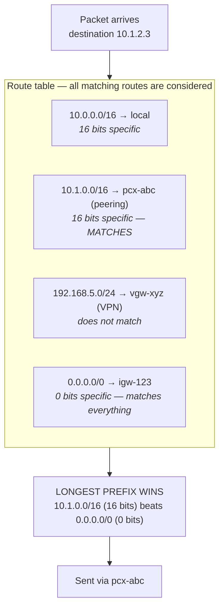

So `8.8.8.8` matches only `0.0.0.0/0` and goes to the IGW; `10.0.5.9` matches `10.0.0.0/16` and stays local; `10.1.2.3` matches both `10.1.0.0/16` and `0.0.0.0/0`, and the `/16` wins.

Four special CIDRs that show up everywhere:

| CIDR | Meaning |
|---|---|
| `0.0.0.0/0` | **Every IPv4 address** — "the internet" / the default route. In an SG it means "allow the entire world" |
| `10.0.0.0/16` | A typical VPC — this is the `local` route, which cannot be deleted and cannot be overridden |
| `x.x.x.x/32` | **Exactly one IP** — the correct way to allow an office's static IP |
| `::/0` | IPv6's "everything" — forgetting to block this alongside `0.0.0.0/0` in an IPv6-enabled VPC is a common miss |

This is why `0.0.0.0/0` on port 22 in a security group is an audit finding — you're granting SSH to 4.29 billion addresses. The correct rule looks like `203.0.113.45/32` (or better: no SG hole at all — use [Session Manager](12-security-services.md#aws-systems-manager-ssm)).

**11. Private IP ranges (RFC 1918) — use only these in a VPC:**

| Range | Span | Size | Note |
|---|---|---|---|
| `10.0.0.0/8` | 10.0.0.0 – 10.255.255.255 | 16.7M | Most common in AWS — it holds **256 `/16` VPCs** |
| `172.16.0.0/12` | 172.16.0.0 – 172.31.255.255 | 1M | AWS's **default VPC** `172.31.0.0/16` comes from here |
| `192.168.0.0/16` | 192.168.0.0 – 192.168.255.255 | 65K | Home/office routers — so avoid it for a VPC |

These ranges are not routable on the public internet, and **that is precisely why NAT exists** — translating a private source IP into the NAT Gateway's public IP. That's the link between this subsection and the [NAT model](#vpc-subnets-nat--complete-model) below.

⚠️ **Traps:** the middle range is `172.16.0.0/`**`12`**, not `/16` — `172.32.0.0` is **public** internet space. And avoid `192.168.x.x` as a VPC CIDR: the day someone connects over VPN from home or a branch office, an overlap is practically guaranteed.

**12. Quick recall — 30-second cheat sheet:**

```
IP = 32 bits.   CIDR /n = "n bits network, (32-n) bits host"
Total IPs   = 2^(32-n)
AWS usable  = total - 5     (.0 network, .1 router, .2 DNS, .3 reserved, last broadcast)
Block size  = 256 - mask octet
Smaller prefix = bigger network.  +1 prefix = half the size.
Mask octets : 128 192 224 240 248 252 254 255
Sizes       : /24=256  /25=128  /26=64  /27=32  /28=16
AWS limits  : both VPC and subnet /16 .. /28
0.0.0.0/0 = everything    x.x.x.x/32 = one IP    the local route always wins
Route match = longest prefix wins
```

**Four lines worth saying verbatim in an interview:**
1. A subnet isn't inherently public or private — the **route table** decides.
2. AWS reserves **5 IPs** per subnet, not 2 — so a `/28` gives 11 usable, and the `awsvpc`/EKS per-task-IP model burns through that fast.
3. Route selection is **longest prefix match**, and the VPC's **`local` route beats everything** — which is why traffic to an overlapping CIDR never leaves the VPC at all.
4. **Overlapping CIDRs** permanently break peering/TGW and can't be fixed after creation — see [Overlapping CIDRs](#overlapping-cidrs--the-design-mistake-you-cannot-undo).

### Overlapping CIDRs — The Design Mistake You Cannot Undo

The advice to "plan IP space carefully up front" sounds abstract until you've seen the actual failure. This is the one networking mistake that bills you **years later** and has no clean fix. The whole scenario is worth being able to tell as-is — it's a ready-made answer to the senior-level *"has a design decision ever hurt you later?"*

**Timeline — "two teams, both accepted the console default"**

```
2021 | Payments team, Account A          2021 | Orders team, Account B
     | VPC 10.0.0.0/16                        | VPC 10.0.0.0/16   <-- THE SAME
     |   app  10.0.10.0/24 (40 tasks)         |   app  10.0.10.0/24 (25 pods)
     |   db   10.0.20.0/24 (RDS)              |   db   10.0.20.0/24 (RDS)
     |
     | No problem at the time. Neither VPC knows the other exists. All green.
     v
2023 | Requirement: Orders needs to call Payments privately
     | (not over the internet -- latency + PCI scope).
```

**Failure 1 — VPC Peering simply won't be created.**

```
aws ec2 create-vpc-peering-connection --vpc-id vpc-payments --peer-vpc-id vpc-orders
  -> REJECTED: matching / overlapping CIDR blocks
```

This is not a config knob — there is no `--force` and no NAT workaround. AWS hard-blocks it (see constraint #1 in [VPC Peering](#vpc-peering)).

**Failure 2 — with Transit Gateway it's more dangerous: the attachment succeeds, then traffic dies silently.**

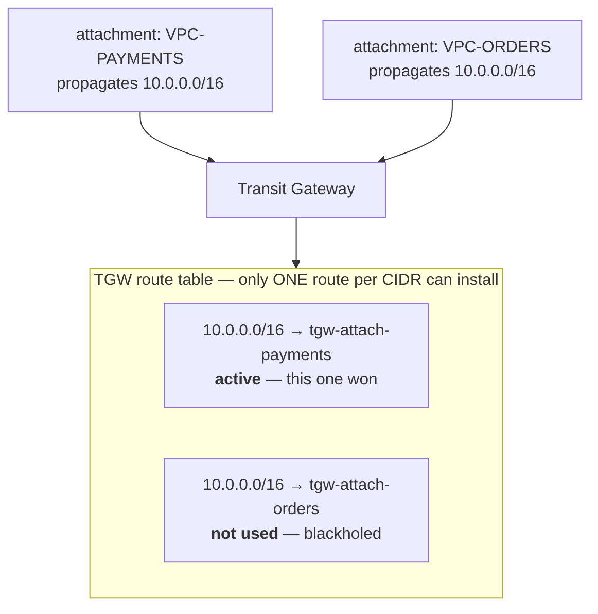

And the real killer hits **before** the TGW is even reached — the VPC's own `local` route. When the Orders app calls `10.0.10.5` (the Payments app):

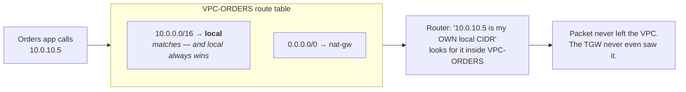

**The symptom that eats hours of debugging:** a connection timeout, and **not even a `REJECT` in Flow Logs** — because to be rejected, a packet has to arrive somewhere. The team spends hours checking SGs and NACLs when the problem is routing arithmetic. This is the textbook case of the [Flow Logs](#vpc-flow-logs) rule that *"no record at all = the packet never got there."*

**Failure 3 — partial overlap, which deceives the most.** The ranges aren't identical, just nested:

```
VPC-A (hub)     10.0.0.0/16     ->  10.0.0.0 - 10.0.255.255
VPC-B (spoke)   10.0.5.0/24     ->  10.0.5.0 - 10.0.5.255     <- INSIDE A

A: |--------------------------------|
B:            |----|                        (inside)

TGW route table, longest prefix match:
   10.0.0.0/16 -> VPC-A
   10.0.5.0/24 -> VPC-B      <- more specific, THIS wins
```

Here the peering/attachment is created and mostly works — but VPC-A **permanently loses its own `10.0.5.x` range**: all traffic for that range goes to VPC-B. And you only find out the day someone launches a resource in that `/24` of VPC-A.

**Escape hatches, in order of decreasing pain:**

| Option | Does it work? | Cost / caveat |
|---|---|---|
| **Re-IP one VPC** | ✅ The real fix | A VPC's **primary CIDR cannot be changed** — build a new VPC and migrate everything. Weeks of work + a downtime window. |
| **Add a secondary CIDR** (e.g. `10.50.0.0/16`) | ⚠️ Partial | You get new non-overlapping subnets and can shift workloads, but the **old overlapping subnets stay unreachable**. |
| **PrivateLink (NLB + interface endpoint)** | ✅ **Best practical fix** | **Overlapping CIDRs don't matter** — traffic is proxied, so neither network has to route to the other. Limitation: this is **service-level, one-directional** exposure, not full network reachability. See VPC Endpoints & PrivateLink. |
| **Private NAT Gateway + `100.64.0.0/10`** | ✅ Works | AWS's documented overlapping-network pattern: hand out non-overlapping IPs from CGNAT (RFC 6598) space and translate at the TGW. It works, but the network diagram stops being comprehensible. |
| **Do nothing, go over the internet** | ❌ | Latency, NAT data-processing cost, and PCI/security scope creep. |

**Interview answer:** *"If the overlap has already happened, my default recommendation is **PrivateLink** — it gives service-level exposure without merging the networks, and overlapping CIDRs don't affect it. But the real answer is that this is prevented at design time."*

**Prevention — an allocation registry, on day one.** `10.0.0.0/8` holds **256 `/16` VPCs**; there is no shortage of space, only a shortage of discipline:

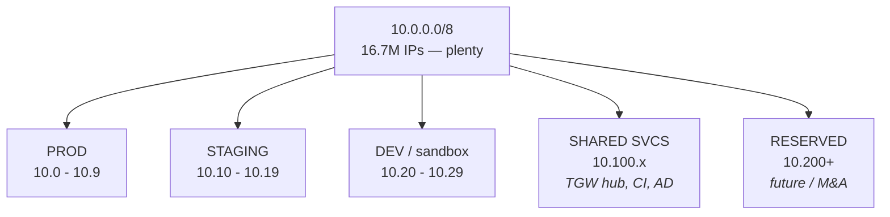

| Allocation | Region | CIDR | Why |
|---|---|---|---|
| Prod – Payments | ap-south-1 | `10.0.0.0/16` | |
| Prod – Orders | ap-south-1 | `10.1.0.0/16` | |
| Prod – Payments **DR** | eu-west-1 | `10.2.0.0/16` | **DR gets its own block** — otherwise you can't peer on the day you fail over |
| Prod – Orders DR | eu-west-1 | `10.3.0.0/16` | |
| Staging | ap-south-1 | `10.10.0.0/16`, `10.11.0.0/16` | |
| Dev / sandbox | ap-south-1 | `10.20.0.0/16` | |
| Shared services (TGW hub, CI, AD) | ap-south-1 | `10.100.0.0/16` | The centre of hub-and-spoke |
| **On-prem / corporate LAN** | — | ask the network team | Whatever range is in use there must **never** be taken in AWS — otherwise VPN/DX won't work |
| **Reserved** | — | `10.200.0.0/13`+ | Acquisitions/M&A — a company you buy needs its own block too |

What that makes disappear:

```
VPC-PAYMENTS  10.0.0.0/16   |----------|
VPC-ORDERS    10.1.0.0/16              |----------|     no overlap

TGW route table:
   10.0.0.0/16   -> tgw-attach-payments   active
   10.1.0.0/16   -> tgw-attach-orders     active
   10.100.0.0/16 -> tgw-attach-shared     active

Everything can talk to everything, and new VPCs just keep getting added.
```

**Five rules worth remembering:**
1. **Never accept the console's default CIDR.** `10.0.0.0/16` is in half the VPCs of half the companies in the world — a collision is practically guaranteed.
2. **Give the DR region its own block.** This is the most common miss (see [DR strategies](18-well-architected-resilience.md#disaster-recovery-strategies)): prod and DR both on `10.0.0.0/16`, discovered on the day there's no time to fix it.
3. **Ask for the on-prem range first.** If the corporate LAN is on `10.0.0.0/16`, your Site-to-Site VPN / Direct Connect will never work.
4. **Reserve space for M&A** — an acquired company needs its own block.
5. **Use Amazon VPC IPAM** — it exists for exactly this: define pools, let accounts allocate CIDRs, and block overlap **automatically**. In a multi-account estate you shouldn't be relying on a spreadsheet; IPAM should be the default (shareable via RAM, see [RAM](15-management-org-billing.md#aws-resource-access-manager-ram)).

---

## 2. VPC Core — Subnets, Routing & Security

### VPC, Subnets, NAT — Complete Model

**What a VPC is:** a logically isolated virtual network — "your own private data center inside AWS." You control IP range, subnets, routing, internet access, and security boundary (Security Groups + NACLs).

**CIDR block:** defined at VPC creation (e.g., `10.0.0.0/16`); cannot be changed after creation (you can add secondary CIDR blocks, but the original design constraint stands — plan IP space carefully up front, especially for future VPC peering/Transit Gateway where overlapping CIDRs cause real pain).

**Subnets**
- A subnet is a slice of the VPC CIDR, tied to exactly one Availability Zone.
- **There is no such thing as an inherently "public" or "private" subnet** — that behavior comes entirely from the subnet's route table, not its name or any flag.

**Public vs private subnet — the real rule**
| | Public Subnet | Private Subnet |
|---|---|---|
| Route to Internet Gateway? | Yes | No |
| Inbound from internet? | Possible (if resource has public IP + SG allows) | No |
| Outbound to internet? | Yes, directly | Only via NAT Gateway/Instance |

**Internet Gateway (IGW):** one per VPC, must be attached to the VPC; the public subnet's route table must have a `0.0.0.0/0 → igw-xxxx` route.

**Route tables:** every subnet is associated with exactly one route table; a route table can be shared by multiple subnets. Typical routes: `0.0.0.0/0 → IGW` (public) or `0.0.0.0/0 → NAT Gateway` (private).

**NAT (Network Address Translation)**
- Purpose: let private-subnet resources reach the internet **outbound only** — inbound internet traffic is always blocked regardless of NAT.
- Flow: `Private Subnet → NAT Gateway (in a PUBLIC subnet) → Internet Gateway → Internet`.
- **NAT Gateway must live in a public subnet** — a NAT Gateway placed in a private subnet is simply invalid/non-functional.

| | NAT Gateway | NAT Instance |
|---|---|---|
| Management | Fully managed | Self-managed EC2 |
| HA | Built-in within AZ | You build it |
| Scaling | Automatic | Manual |
| Recommendation | **Default choice** | Legacy/very specific cost cases only |

**Cost gotcha:** NAT Gateway bills per-hour *plus* per-GB processed — high outbound traffic from private resources is a common surprise cost spike. For AWS-service-only traffic (S3, DynamoDB, Secrets Manager, SQS, etc.), use **VPC Endpoints** instead of routing through NAT — cheaper, lower latency, and keeps traffic off the public internet entirely.

**Security layers**
| | Security Group | Network ACL |
|---|---|---|
| Statefulness | Stateful (return traffic auto-allowed) | Stateless (must explicitly allow both directions) |
| Attached to | ENI/instance | Subnet |
| Rule type | Allow only | Allow AND deny |
| Typical usage | Primary defense — use heavily | Sparingly, for coarse subnet-level blocking |

**Placement rules of thumb**
- Public subnet: load balancers, bastion hosts, NAT Gateways.
- Private subnet: application servers, ECS tasks, RDS — **never put a database directly in a public subnet.**

**Common misconceptions (explicitly false)**
- "Public subnet = automatic internet access" — false; needs a public IP *and* a route to an IGW *and* permissive SG.
- "NAT allows inbound traffic" — false; NAT is outbound-only by design.
- "Subnet name/tag decides security behavior" — false; only route tables and SGs/NACLs matter.
- "One route table per VPC" — false; a VPC can (and usually does) have multiple route tables, one per subnet-group.

**High-availability note:** NAT Gateways are AZ-scoped. For proper HA, deploy one NAT Gateway per AZ so an AZ failure doesn't take down outbound internet access for every private subnet in the VPC (a single shared NAT Gateway across AZs works but creates a cross-AZ dependency and extra data-transfer cost).

### The Default VPC (and Why You Shouldn't Build In It)

Every AWS account gets one **default VPC per region**, pre-built so a brand-new account can launch an EC2 instance without touching networking at all. That convenience is exactly why so many accounts accidentally run real workloads in it.

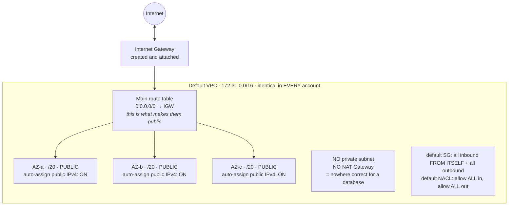

**What AWS pre-creates for you:**

| Component | Default configuration |
|---|---|
| VPC CIDR | **`172.31.0.0/16`** — the same, in every region, in every account |
| Default subnets | One per AZ, each a **`/20`**, and all of them **public** |
| Internet Gateway | Created and attached |
| Main route table | `0.0.0.0/0 → IGW` — which is what makes every default subnet public |
| Default security group | Allows **all inbound from itself**, all outbound |
| Default NACL | Allows **all** inbound and outbound |
| DNS | `enableDnsSupport` and `enableDnsHostnames` both **on** |
| Auto-assign public IPv4 | **Enabled** on every default subnet |

**Why that combination is a problem**
- **Every subnet is public.** There is no private subnet and no NAT Gateway, so there is nowhere correct to put a database — an RDS instance launched on defaults lands in a public subnet.
- **Auto-assign public IP is on**, so every instance gets a routable public IPv4 unless you explicitly opt out. That is the opposite of the private-by-default posture you want.
- **`172.31.0.0/16` is identical in every account**, which makes it the single most likely CIDR to collide the day you peer two accounts or connect on-prem — and a VPC's primary CIDR cannot be changed afterwards.
- The wide-open default SG and NACL mean security depends entirely on you having replaced them. "The default security group allows everything from itself" surprises people who assume *default* implies *restrictive*.

⚠️ **The gotcha most people actually hit:** an EC2 instance launched with **no subnet specified** goes into the default VPC, and so do several console wizards. This is the usual mechanism behind "why is our dev database reachable from the internet?"

**Details worth knowing precisely**
- **The default VPC can be deleted**, and in a well-run account it usually is (or is left deliberately empty). `aws ec2 create-default-vpc` recreates it, but as a *new* VPC with new subnet IDs — not a restore.
- **A "default subnet" is public by definition, not by nature.** Remove the IGW route from its route table and it stops behaving as one; the label is metadata, the route table is the behaviour. Same rule as [public vs private subnet](#vpc-subnets-nat--complete-model).
- **Default VPC ≠ "the main VPC."** There is no such concept as a main VPC. There *is* a **main route table** per VPC — the one a subnet inherits when you don't explicitly associate it — and that is a different thing entirely.
- If a subnet is created manually with no `MapPublicIpOnLaunch` setting, it defaults to **off** — the opposite of a default subnet. That asymmetry catches people migrating from default-VPC habits.

**Interview framing:** *"Nothing runs in the default VPC in any account I'd design. It's `172.31.0.0/16` in every account, which guarantees CIDR collisions later; every subnet is public with auto-assign public IP switched on; and the default SG and NACL are wide open. We provision VPCs from an allocated block with explicit public/app/data tiers, and flag anything launched into the default VPC with AWS Config or an SCP."*

### NACLs in Depth — Rule Evaluation & the Ephemeral Port Trap

The [comparison table above](#vpc-subnets-nat--complete-model) gives the one-liner — SG stateful, NACL stateless. This section covers the part that actually breaks things in production, and the question that separates people who have used NACLs from people who have only read about them: *"you added an inbound allow rule and traffic still fails — why?"*

**Rules are numbered, and the lowest number wins.**

```
Inbound rules, evaluated in ASCENDING order — first match wins, then evaluation STOPS

Rule #    Type       Port    Source            Action
100       HTTPS      443     0.0.0.0/0         ALLOW    <- evaluated first
200       ALL        ALL     10.0.0.0/16       ALLOW
300       HTTPS      443     203.0.113.9/32    DENY     <- NEVER REACHED
*         ALL        ALL     0.0.0.0/0         DENY     <- implicit, cannot be edited
```

Rule `300` never fires: rule `100` already matched and evaluation stopped. **A deny rule must be numbered lower than the allow rule it is meant to override.** This is the exact opposite of a security group, where every rule is evaluated, order is meaningless, and there is no deny at all.

- Convention: number in gaps of 100 (`100`, `200`, `300`) so you can insert a rule between two existing ones later without renumbering.
- The trailing `*` rule is an implicit deny-all. It always exists and cannot be removed or reordered.
- Default quota is **20 rules** per NACL, raisable to 40 — and remember each direction is a separate list.

**The ephemeral port trap — the #1 NACL failure.** Because a NACL is stateless, the reply to an allowed connection is evaluated as a *fresh* decision on the way out, and the reply does **not** travel on port 443. It goes back to the high-numbered **ephemeral port** the client chose:

```
Client 203.0.113.9:51234  ---- request to :443 ---->  Instance in subnet
                                                            |
       reply comes FROM :443 TO 203.0.113.9:51234           |
                                                            v
        OUTBOUND NACL must allow port 51234
        i.e. the ephemeral range: 32768-65535
        NOT port 443  <- this is the mistake
```

So a working web-tier NACL needs:

| Direction | Port range | Why |
|---|---|---|
| Inbound | 443 | the actual request |
| **Outbound** | **`32768–65535`** | **the reply, to the client's ephemeral port** |

Get it wrong and the symptom is a **connection timeout in a subnet whose security group is provably correct** — the request arrived, and the reply was dropped on the way out.

**Which range, exactly?** **`32768–65535`** is the range AWS's own documented example NACL uses, and it's the number to quote if asked. But the true range depends on *what the client is*, and AWS documents these:

| Client | Ephemeral source-port range |
|---|---|
| **AWS's documented example NACL** | **`32768–65535`** |
| Amazon Linux / many Linux kernels | `32768–61000` |
| Windows Server 2008 and later | `49152–65535` |
| Windows up to Server 2003 | `1025–5000` |
| **Elastic Load Balancing** | `1024–65535` |
| **NAT Gateway** | `1024–65535` |
| **Lambda** | `1024–65535` |

`32768–65535` covers Linux and modern Windows clients, which is why it's the canonical answer. ⚠️ Widen to **`1024–65535`** the moment an **ELB, NAT gateway, or Lambda** sits in front — which in a real VPC is nearly always — because that's the safe superset and none of those three start at 32768.

**Where NACLs sit in the evaluation order.** Inbound, the NACL is evaluated *before* the security group; outbound, *after* it:

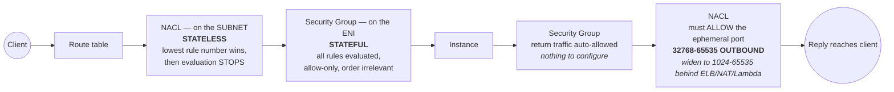

Two consequences worth stating out loud: a NACL deny **cannot** be overridden by a permissive security group, and traffic a NACL blocks never reaches the instance at all — so in [Flow Logs](#vpc-flow-logs) you get a `REJECT` with no application-side evidence whatsoever.

**When to actually use one**
- Blocking a specific hostile IP or CIDR at the subnet edge — the one thing security groups genuinely cannot express, because they are allow-only.
- A hard compliance boundary around a data subnet ("nothing from outside the VPC, ever").
- Otherwise: leave the default allow-all NACL alone and do the work in security groups. Hand-maintained NACLs are a recurring source of self-inflicted outages, and every rule has to be written twice — once per direction.

**Interview answer to "security group or NACL?":** *"Security groups for essentially everything — they're stateful, they attach to the workload rather than the subnet, and they can reference other security groups, which is what you want for tier-to-tier rules. I reach for a NACL only when I need an explicit deny that a security group can't express, like blocking a hostile CIDR. And when I do, I remember it's stateless: outbound `32768–65535` has to be open — widened to `1024–65535` if an ELB or NAT gateway is in front — or every reply gets dropped."*

### IPv6 in a VPC & the Egress-Only Internet Gateway

IPv6 turns up in two interview contexts: **IPv4 exhaustion** in large VPCs (especially EKS, where every pod consumes an IP), and *"how do private resources reach the internet over IPv6?"* The answer to the second is **not** a NAT Gateway — and knowing why is the whole point.

**How IPv6 is allocated — notice you don't pick the range.**

| | IPv4 | IPv6 |
|---|---|---|
| Who chooses the CIDR | **You do** (e.g. `10.0.0.0/16` from RFC 1918) | **AWS assigns** a `/56` from its pool (or bring your own via BYOIP/IPAM) |
| VPC block size | `/16` – `/28` | **always `/56`** |
| Subnet block size | `/16` – `/28` | **always `/64`** — fixed, non-negotiable |
| Addresses per subnet | 251 usable in a `/24` | ~18 quintillion — **exhaustion stops being a concept** |
| Public vs private | private ranges + NAT for egress | **every address is globally unique and publicly routable** |
| Optional? | No — a VPC always has an IPv4 CIDR | **Yes** — IPv6 is added to a VPC |

A `/56` split into `/64`s gives **256 subnets per VPC**, always the same size — so IPv6 subnet planning is bookkeeping rather than arithmetic:

```
AWS assigns ONE /56 to the VPC   (you don't get to choose it)

   2001:db8:1234:  XX  ::/56
   +---- 56 bits fixed by AWS ----+--8--+------ 64 host bits ------+
                                     |
                     these 8 bits = 2^8 = 256 possible /64 subnets
                                     |
   +----------------+----------------+----------------+
   | ...:0000::/64  | ...:0001::/64  | ... :00ff::/64 |
   |   subnet 1     |   subnet 2     |   subnet 256   |
   +----------------+----------------+----------------+
        each /64 holds 2^64 = ~18 quintillion addresses
        subnet size is ALWAYS /64 -- it is never anything else
```

Compare that to IPv4, where you pick the VPC block, pick each subnet size, and do arithmetic to avoid overlap. Here the only decision is *which of the 256 `/64`s* a subnet gets.

⚠️ **The conceptual jump:** there is **no private IPv6 address** here. Every IPv6 address AWS hands you is internet-routable, so a resource is private only because *routing and security groups* say so — not because its address is unroutable. That is precisely why NAT, whose entire job is translating unroutable private IPv4 into something routable, **has no IPv6 equivalent**.

**Egress-Only Internet Gateway (EIGW) — the IPv6 answer to "outbound only."**

Since IPv6 needs no translation, outbound-only behaviour has to come from a device that simply refuses to forward inbound connections. That device is the EIGW:

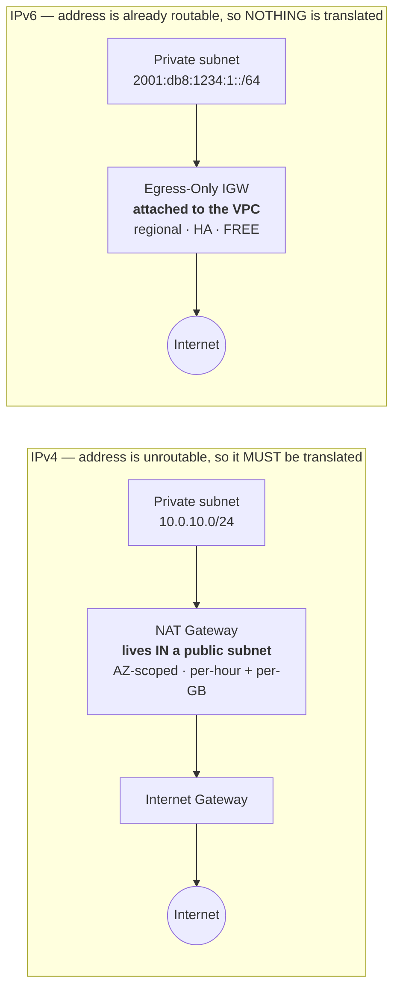

| | NAT Gateway | Egress-Only IGW |
|---|---|---|
| Protocol | **IPv4 only** | **IPv6 only** |
| Job | Translate private → public, outbound only | Permit outbound only (no translation) |
| Where it lives | **In a public subnet** | **Attached to the VPC** — not in any subnet |
| Route entry | `0.0.0.0/0 → nat-xxxx` in the private route table | `::/0 → eigw-xxxx` in the private route table |
| High availability | **AZ-scoped** — deploy one per AZ | **Regional and highly available by default** |
| Cost | Per hour **+ per GB processed** | **Free** |
| Stateful? | Yes | Yes — return traffic for outbound flows allowed, inbound-initiated blocked |

Three of those rows are the interview points: an EIGW is **free**, needs **no per-AZ deployment**, and **attaches to the VPC rather than living in a subnet** — all three the exact inverse of the NAT Gateway's cost and HA problems.

**Dual-stack is the normal deployment.** You don't migrate to IPv6, you add it alongside IPv4:
- Add an IPv6 `/56` to the VPC, a `/64` to each subnet, and enable auto-assign IPv6.
- **Security groups and NACLs need explicit IPv6 rules.** An IPv4 rule for `0.0.0.0/0` does nothing to IPv6 traffic. ⚠️ This is a real and commonly-missed hole: teams carefully lock down IPv4 and leave `::/0` wide open, so the instance is reachable over IPv6 by anyone.
- **Route tables need a separate `::/0` route** — to the IGW in public subnets, to the EIGW in private ones.
- **IPv6-only subnets** exist, but check service support first: a number of AWS services and plenty of third-party endpoints are still IPv4-only. That's why dual-stack, not IPv6-only, is the default answer.
- An IPv6 address on an instance is assigned to the ENI and, unlike an auto-assigned public IPv4, **persists across stop/start** — see [Public IP vs Private IP vs Elastic IP](06-ec2-instance-storage.md#public-ip-vs-private-ip-vs-elastic-ip).

**When it's genuinely the right call:** running out of RFC 1918 space across a large multi-account estate; EKS clusters where per-pod IPs exhaust IPv4 subnets (see [ECS](09-containers-ecs-fargate.md#ecs-elastic-container-service) for the same per-ENI IP model); or serving IPv6-only clients, which some mobile carriers are. Otherwise dual-stack means maintaining a second set of security rules for little benefit — a perfectly good answer to *"would you use IPv6?"*

### VPC Reference Architecture

```
                            +------------+
                            |  Internet  |
                            +-----+------+
                                  |
                        +---------v----------+
                        |  Internet Gateway  |
                        +----+----------+----+
                             |          |
+----------------------------|----------|-----------------------------+
| VPC  10.0.0.0/16           |          |                             |
|                            v          v                             |
|      AVAILABILITY ZONE A               AVAILABILITY ZONE B          |
|  +--------------------------+      +--------------------------+     |
|  | PUBLIC      10.0.0.0/24  |      | PUBLIC      10.0.1.0/24  |     |
|  | ALB . NAT GW . Bastion   |      | ALB . NAT GW             |     |
|  +------------+-------------+      +------------+-------------+     |
|               | outbound via NAT                | outbound via NAT  |
|  +------------v-------------+      +------------v-------------+     |
|  | PRIVATE APP 10.0.10.0/24 |      | PRIVATE APP 10.0.11.0/24 |     |
|  | ECS tasks / EC2 app      |      | ECS tasks / EC2 app      |     |
|  +------------+-------------+      +------------+-------------+     |
|               |                                 |                   |
|  +------------v-------------+      +------------v-------------+     |
|  | PRIVATE DB  10.0.20.0/24 |      | PRIVATE DB  10.0.21.0/24 |     |
|  | RDS PRIMARY              |<====>| RDS STANDBY              |     |
|  +--------------------------+ sync +--------------------------+     |
+---------------------------------------------------------------------+

  Both AZs' app subnets talk to the RDS PRIMARY; the standby carries no
  traffic and only takes over on failover. No subnet is "public" because
  of its name -- only because its route table points 0.0.0.0/0 at the IGW.
```

This is the canonical 3-tier VPC layout senior interviewers expect: public subnet per AZ (ALB + NAT), private app subnet per AZ (compute), private isolated data subnet per AZ (RDS with no route to NAT/IGW at all — DB subnets typically don't even need outbound internet).

---

## 3. Connectivity — Peering, Hybrid & Private Access

### VPC Peering

A private, one-to-one network connection between two VPCs — same account or different, same region or different — using AWS's internal network (no IGW, NAT, or VPN involved).

**The three constraints that are the interview question:**
1. **❗ CIDR blocks must not overlap.** No exceptions, no NAT workaround. This is why IP-space planning at VPC creation matters so much.
2. **❗ Peering is NOT transitive.** If A peers with B and B peers with C, **A cannot reach C**. You must create a direct A↔C peering. This is the single most-asked VPC peering question.
3. **No edge-to-edge routing** — you cannot use a peer's internet gateway, NAT gateway, VPN, or Direct Connect connection.

Also: you must add routes on **both** VPCs' route tables, and update security groups. In the same region you can **reference a security group in the peered VPC** by ID (across accounts too), which is much better than hardcoding CIDRs.

**Why peering doesn't scale:** connecting *n* VPCs fully requires **n(n−1)/2** peering connections — 10 VPCs means 45 connections, each with route-table entries on both sides.

### Transit Gateway

A **regional hub-and-spoke router**. Every VPC, Site-to-Site VPN, and Direct Connect gateway attaches once to the TGW, and the TGW routes between them.

- **It supports transitive routing** — the thing peering cannot do. A → TGW → C works.
- ⚠️ **But TGW does not fix overlapping CIDRs.** Unlike peering it won't reject you upfront — the attachment is created and then traffic silently blackholes, which is considerably harder to debug. See [Overlapping CIDRs](#overlapping-cidrs--the-design-mistake-you-cannot-undo).
- Scales to thousands of attachments; connecting *n* VPCs takes *n* attachments, not n(n−1)/2 connections.
- **TGW route tables per attachment** give you network segmentation — e.g. a route table that lets prod VPCs reach shared services but not each other, and keeps non-prod fully isolated. This is how real multi-account networks are built.
- **Inter-region TGW peering** connects hubs across regions over the AWS backbone.
- Supports **multicast**, which neither peering nor VPN does.
- Works with **Resource Access Manager** to share one central TGW across all accounts in the organisation (see [RAM](15-management-org-billing.md#aws-resource-access-manager-ram)).
- **Cost:** charged per attachment-hour **plus** per GB processed — so it's more expensive than peering for a simple two-VPC case.

| | VPC Peering | Transit Gateway |
|---|---|---|
| Topology | Point-to-point mesh | **Hub and spoke** |
| Transitive routing | ❌ | ✅ |
| Scale | Poor beyond ~5 VPCs | Thousands of attachments |
| Cost | **No hourly charge** (only cross-AZ/region data transfer) | Per attachment-hour + per GB |
| Segmentation | Route tables per VPC | **TGW route tables per attachment** |
| Best for | Two or three VPCs, cost-sensitive, high bandwidth | Multi-account/multi-VPC networks, hybrid connectivity |

---

### Hybrid Connectivity: Site-to-Site VPN & Direct Connect

| | **Site-to-Site VPN** | **Direct Connect (DX)** |
|---|---|---|
| Medium | **IPsec over the public internet** | **Dedicated private fibre** to an AWS Direct Connect location |
| Setup time | Minutes to hours | **Weeks to months** (physical circuit provisioning) |
| Bandwidth | ~1.25 Gbps per tunnel (scale with multiple tunnels/ECMP) | 1 / 10 / 100 Gbps dedicated, or sub-1 Gbps hosted |
| Latency | Variable — it's the internet | **Consistent and predictable** |
| Encryption | **Encrypted by default** (IPsec) | **❗ Not encrypted by default** — add a VPN over DX, or MACsec |
| Cost | Cheap hourly + data transfer | High fixed port cost, but **materially cheaper egress at volume** |
| Use for | Quick setup, branch offices, backup path, low-to-moderate volume | Large sustained data transfer, latency-sensitive hybrid apps, regulatory requirements against internet transit |

**VPN components in detail** — worth being precise here, because "set up a VPN to AWS" is a routine design question and the four nouns get muddled:

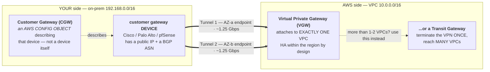

| Component | Whose side | What it actually is |
|---|---|---|
| **Customer Gateway (CGW)** | **Yours** | An AWS-side *configuration object* describing your on-prem device: its **public IP** and its **BGP ASN**. It is metadata, not a device |
| **Customer gateway device** | Yours | The real router/firewall on-prem (Cisco, Palo Alto, pfSense, strongSwan…) |
| **Virtual Private Gateway (VGW)** | AWS | The VPN concentrator **attached to exactly one VPC**. Highly available within the region by design |
| **Transit Gateway** | AWS | The alternative VPN endpoint — terminate the VPN **once** and reach many VPCs |
| **Site-to-Site VPN connection** | Both | The object joining CGW to VGW/TGW; creating it provisions **two tunnels** |

- **There are always two tunnels.** AWS terminates them on **two different endpoints in two AZs**, at ~1.25 Gbps each. Configuring only one is a classic single point of failure — "we only ever brought up tunnel 1" is a real cause of outages during routine AWS endpoint maintenance.
- **Static vs dynamic routing** — the question behind *"how does on-prem learn the AWS routes?"*:

| | Static | Dynamic (**BGP**) |
|---|---|---|
| How routes are learned | You list the on-prem CIDRs manually on the VPN connection | Exchanged automatically over BGP |
| Failover between tunnels | Manual / slow | **Automatic** |
| Requires | Nothing special | A BGP-capable device and an **ASN** on each side |
| Verdict | Small, fixed networks | **Preferred** — needed for real HA, and for ECMP across tunnels |

- **ASNs:** your side declares one on the CGW (use a private ASN, `64512–65534`); AWS's side defaults to **`64512`** on a VGW and is configurable on a TGW. Identical ASNs on both sides break the BGP session.
- **VGW or TGW?** One VPC → a VGW is fine. More than a couple of VPCs, or on-prem needs to reach all of them → **TGW**, because a VGW attaches to exactly one VPC and **VPN routes are not transitive across peering** — the same transitivity limit as [VPC Peering](#vpc-peering).
- **Route propagation** has to be enabled on the VPC route tables (or the routes added by hand). A fully-established tunnel with no propagation is the classic "the VPN is up but nothing works".
- **Accelerated Site-to-Site VPN** carries tunnel traffic over Global Accelerator's edge network for more consistent latency; it requires a **TGW**, not a VGW.
- **Direct Connect Gateway** lets one DX connection reach VPCs in **multiple regions and accounts**.
- **The standard HA answer:** two DX connections at **two different DX locations** for full redundancy; or, more cheaply, **one DX with a Site-to-Site VPN as automatic backup** — a very common real-world design and a good answer to "how do you make hybrid connectivity resilient?"
- **AWS Client VPN** is the different product for *individual users* (laptops) connecting into the VPC, as opposed to site-to-site networks.

### AWS Client VPN: Getting Individual Users Inside the VPC

**Why this was a gap:** the [Hybrid Connectivity](#hybrid-connectivity-site-to-site-vpn--direct-connect) section covers Site-to-Site VPN and Direct Connect in depth and gives Client VPN a single throwaway line — *"a different product for individual users."* But in the reference topology the ALB is **internal-only**: no public listener, no CDN, no API Gateway. So for any human outside the corporate network, Client VPN is the **only path to the service**. That stack treats it as enough of a first-class dependency to discover its security group by tag so it can add ingress rules against it. A sole path that the document covers in one line is a gap.

**What it is:** a managed, OpenVPN-based VPN endpoint. Users run a client on their laptop, connect to the endpoint, and receive an IP from a **client CIDR** — from that point they are routable inside the VPC, much like an instance.

**Four objects you configure** — the names are **completely different** from Site-to-Site VPN's CGW/VGW/tunnels, which is exactly where the confusion lives:

| Object | What it does |
|---|---|
| **Client VPN endpoint** | The regional construct that terminates connections. Client CIDR, auth mode and the split-tunnel setting live here |
| **Target network association** | Attaches the endpoint to a **subnet**. This is the step that **creates ENIs** in that subnet — associate subnets in multiple AZs for HA |
| **Authorization rule** | *Which destination CIDRs a user may reach.* This is a **network-level grant**, separate from any security group — and it can be scoped to an Active Directory or SAML group |
| **Route table** (the endpoint's own) | Where client traffic can go. The VPC CIDR is added automatically; **routes to the internet, peered VPCs, TGW or on-prem you add yourself** |

⚠️ **Here is the debugging insight this document genuinely lacked: a Client VPN connection must clear *two* independent gates.** People collapse them into one and lose hours:

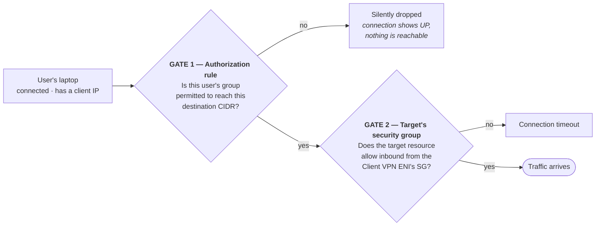

In the reference topology this is precisely the diagram's **VPN** node: the platform owns the Client VPN endpoint and its SG; the application stack discovers that SG by tag and **opens Gate 2 itself** by adding an ingress rule on its ALB SG. Gate 1 stays in the platform's hands — which also tells you which team an access request has to go to.

**Authentication modes**

| Mode | How it works | When |
|---|---|---|
| **Mutual authentication** (certificate-based) | Server and client certificates both, imported into ACM. Revocation via a **client revocation list** | Small teams, machine-to-machine, no identity provider available |
| **Active Directory** | Against on-prem AD via AWS Directory Service / AD Connector | Enterprises that already run AD — **authorization rules can be scoped to AD groups** |
| **SAML 2.0 federation** | SSO via Okta, Entra ID, Ping | The modern enterprise standard; the IdP handles MFA and the joiner-leaver flow |

Mutual auth can be **combined** with either of the others (certificate *plus* identity), a common hardening move.

**Split-tunnel vs full-tunnel — this is a cost and bandwidth decision, not just a security one**

| | Full-tunnel (**default**) | Split-tunnel |
|---|---|---|
| Which client traffic crosses the VPN | **Everything** — video streaming, OS updates, all of it | Only what matches the endpoint's route table |
| Where client internet traffic exits | **Your NAT Gateway** — you pay its per-GB processing | The client's own ISP — costs you nothing |
| When you want it | When compliance requires all employee traffic be inspected | **Most cases** — better on both cost and client latency |

❗ This connects directly to the point the [Networking Costs](#networking-costs--where-the-money-actually-goes) section already makes: the default is **full-tunnel**, so 200 remote developers' entire internet browsing traverses your NAT Gateway's `~$0.045/GB` processing charge. Enabling split-tunnel is a one-line change and a classic finding in any AWS network bill review.

**Client CIDR — the mistakes that are permanent**
- It **cannot overlap** the VPC CIDR or any manually added route — the same rule the [Overlapping CIDRs](#overlapping-cidrs--the-design-mistake-you-cannot-undo) section makes for VPC design generally.
- Minimum `/22`, maximum `/12`.
- ❗ **It cannot be changed after the endpoint is created.** Size it too small, or overlap it with the prod VPC, and you recreate the endpoint — then redistribute the new configuration to every client.
- Size it **well above** peak concurrent connections; each associated subnet also consumes part of it.

**Cost model** — Client VPN is missing from the [per-service charging table](#networking-costs--where-the-money-actually-goes); here is its shape:

| Charge | Shape | Trap |
|---|---|---|
| **Subnet association** | Per association-hour (~$0.10/hr, region-dependent) | **Accrues with zero users connected.** 3 AZs = 3× hourly, 24×7 |
| **Client connection** | Per connected client-hour (~$0.05/hr) | A laptop left connected overnight bills all night |
| **Data transfer** | Normal VPC/NAT rules | Full-tunnel multiplies this |

Worth remembering: HA needs multi-AZ association, and that creates an **hourly floor** — Client VPN's cost structure resembles NAT Gateway's, not Site-to-Site VPN's.

**Also worth knowing**
- **Connection logging** to CloudWatch Logs — who connected, when, from where, how much they transferred. That is the answer to audit questions.
- A **self-service portal** lets users download the client software and their own configuration (with SAML/AD modes).
- A **Client Connect handler** is a Lambda that can run posture checks on every connection and allow or deny it.
- **Security groups** apply to the endpoint's ENIs — that is where Gate 2 originates.
- ❗ **Set DNS servers on the endpoint**, or clients cannot resolve your [private hosted zones](#route-53) — a very common "the VPN is up but internal hostnames don't resolve."

**Interview framing:** *"Site-to-Site VPN joins networks; Client VPN joins individual laptops. For Client VPN I'd choose SAML federation so the joiner-leaver flow stays in the IdP, scope authorization rules to IdP groups rather than granting flat VPC-wide access, associate subnets in at least two AZs, and enable split-tunnel — because the default is full-tunnel, which puts all employee internet traffic through my NAT Gateway's per-GB processing. Two things I'd verify on day one: that the client CIDR doesn't overlap any routed network, since it's immutable after creation, and that DNS servers are set on the endpoint, or private hosted zones won't resolve."*

### The Network Is Inherited, Not Owned: Shared VPC & the Central Platform Model

**Why this was a gap:** this document — and honestly most AWS training material — teaches you **how to build a VPC**: choose a CIDR, carve subnets, attach an IGW, place NAT, write route tables. That knowledge is necessary. But in a large enterprise you **never do that work** — a central cloud platform team provisions the VPC and your application stack **discovers** it. That is exactly the reference topology's headline finding, and this document had **not a single word** about it. It is the kind of gap that doesn't bite in an interview but bites in week one of the job.

**Three operating models — and this is the real design fork**

| | **A. Platform-owned VPC, one per account** | **B. Shared VPC (AWS RAM)** | **C. VPC per account + TGW** |
|---|---|---|---|
| Who creates the VPC | A landing-zone pipeline, per account | One central **owner account** | Each team its own |
| How app teams get access | **Discover by tag**, same account | Owner shares **subnets** via RAM | Own VPC, attached to TGW |
| Network boundary | **The AWS account** | The owner's VPC (many accounts share it) | Per team/service |
| IP space efficiency | Fine | **Best** — one CIDR, many accounts | Worst — every VPC its own block |
| Isolation | ❗ Every service in the account shares one flat network | ❗ Participants share the same subnets | ✅ Strongest |
| NAT / endpoint cost | Duplicated per account | **Shared** — large savings | Duplicated per VPC |
| Blast radius | The whole account | The owner VPC | Contained |
| Reference topology | **← this one** | | |

**Model B — VPC Sharing via AWS RAM.** [RAM](15-management-org-billing.md#aws-resource-access-manager-ram) appears in this document only in the context of TGW sharing and [IPAM](#overlapping-cidrs--the-design-mistake-you-cannot-undo) — **subnet sharing**, its most impactful use, was missing. And it is the answer to "how would you conserve IP space and NAT cost across a multi-account estate?":

- **Requires AWS Organizations.** The owner account owns the VPC, subnets, route tables, IGW, NAT, NACLs and VPC-level flow logs, then shares **individual subnets** to participant accounts via RAM. You don't share the VPC — you share subnets.
- **What participants can do:** launch their own resources into those shared subnets — EC2, ECS tasks, ALBs, RDS, Lambda ENIs — with their own security groups, billed to their own account.
- **What participants cannot do:** modify or delete the shared subnets or route tables, create peering on the VPC, or see other participants' resources. NAT, IGW and routing remain the owner's decisions.
- ✅ **Cross-account security group referencing works inside a shared VPC** — participant A's SG can reference participant B's SG by ID. This is critical: without it you'd be hardcoding CIDRs, and it is what makes a shared VPC practically usable. (The same capability same-region [VPC Peering](#vpc-peering) provides.)
- 💰 **Same-AZ traffic between accounts in a shared VPC is free**, exactly as within one VPC — often the biggest financial argument for a shared VPC, bigger than the IP savings.
- Un-sharing does **not** delete participants' running resources; they simply can't create new ones.

**What you need to know to work in Model A** — the reference topology's model, and the most common one in practice:

- **The discovery interface is tags, not ARNs.** `Name = <account alias>` for the VPC and a subnet-type tag (`SUB-Type = Private`) for subnets. This is the **contract** between the platform and the app teams — and an *undocumented* one, because if the platform renames a tag, every stack breaks at once.
- **The platform applies its own tags, and Terraform must not fight them.** Hence `ignore_tags { key_prefixes = ["<org>:"] }` in every provider block — without it, every `plan` tries to strip platform-managed tags, forever (see [IaC](04-iac-cicd.md#terraformcdktf-in-practice--depth-questions-to-expect)).
- **NAT exists only implicitly.** `aws_nat_gateway` appears nowhere in the codebase; you **infer** it from `egress 0.0.0.0/0` plus private-subnet placement. For debugging, that means: if egress breaks, the fix is not in your repo.
- **You don't control subnet sizing, but you inherit its pain.** If the platform allocated `/24`s and you move to `awsvpc` mode, per-task ENI IP consumption (see the `awsvpc` note in the [CIDR section](#ip-addressing-cidr--subnetting--ground-up)) will eat that space — and the remedy is a **platform ticket**, not a code change.
- ❗ **The isolation is accepted, not achieved.** One account-wide VPC, one flat set of private subnets, and a fleet SG granting itself all-ports self-ingress mean a compromised task can reach every other task on the cluster. This should be a **written-down accepted risk**, not an accident. The real fixes: move to `awsvpc` mode to get per-service SGs, tighten self-ingress to specific ports, or use separate accounts for genuinely sensitive workloads.

**What to demand from the platform team** (this list is itself a senior-level answer): stable, documented subnet tags; [IPAM](#overlapping-cidrs--the-design-mistake-you-cannot-undo)-backed CIDR allocation with growth headroom; **per-AZ NAT gateways** rather than one shared cross-AZ NAT; **gateway endpoints** for S3/DynamoDB (they're free — there's no reason not to have them); VPC-level flow logs you can read; and a clear answer on who owns NACLs, because a platform-owned NACL can break your app via the [ephemeral-port trap](#nacls-in-depth--rule-evaluation--the-ephemeral-port-trap) with no visible cause.

**Interview framing:** *"In most enterprises I don't build the network, I consume it — a landing-zone pipeline provisions a per-account VPC and I discover it by tag rather than hardcoding ARNs. The trade-off is explicit: I get governance and amortized NAT/endpoint cost, and I lose per-service network isolation, because every service in the account shares one flat set of private subnets. If the goal were conserving IP space and NAT cost across many accounts, I'd recommend VPC sharing through RAM — share subnets, keep cross-account SG referencing, and same-AZ inter-account traffic becomes free. If strong isolation is genuinely required, VPC-per-account plus Transit Gateway."*

### VPC Endpoints & PrivateLink

**The problem:** an instance in a **private** subnet calling S3, DynamoDB, or Secrets Manager normally routes out through a **NAT Gateway** to a public endpoint — which costs money per GB and sends traffic over the internet. VPC endpoints keep it entirely inside the AWS network.

| Type | Works with | How it works | Cost |
|---|---|---|---|
| **Gateway endpoint** | **S3 and DynamoDB only** | A **route-table entry** pointing a prefix list at the endpoint. No ENI, no IP | **Free** |
| **Interface endpoint** (**PrivateLink**) | Most AWS services, plus SaaS and your own services | An **ENI with a private IP** in your subnet, with a security group | Per hour **+ per GB** |
| **Gateway Load Balancer endpoint** | Third-party inspection appliances | Directs traffic to a GWLB (see [Load Balancing](08-load-balancing-autoscaling.md#load-balancing-fundamentals)) | Per hour + per GB |

**Facts that decide questions:**
- "How do I reach S3 from a private subnet without a NAT Gateway?" → **Gateway endpoint, and it's free.** That's both the security answer and a real cost optimisation, since NAT per-GB charges on S3 traffic are a common surprise bill.
- Interface endpoints need **private DNS enabled** to make the standard service hostname (`secretsmanager.us-east-1.amazonaws.com`) resolve to the private IP; without it your SDK still goes to the public endpoint. Their security group must allow **inbound 443** from the client subnets. Both are frequent "the endpoint exists but nothing uses it" causes.
- Interface endpoints are reachable **from on-premises** over Direct Connect/VPN; gateway endpoints are **not**.
- Restrict them further with an **endpoint policy** (a resource policy on the endpoint) — e.g. this endpoint may only reach these buckets.
- **PrivateLink for your own service:** put an **NLB** in front of it and expose it as an endpoint service; consumers in other VPCs/accounts create interface endpoints to reach it — no peering, no overlapping-CIDR problem, no exposure to the internet. This is the standard way to publish an internal service across a large organisation.

---

### Interface Endpoint AZ/Subnet Placement, Zonal DNS, and AZ IDs

**Why this was a gap:** the VPC Endpoints & PrivateLink section covers the *what* and *why* well — gateway vs interface, private DNS, endpoint policies, publishing your own service — and the [cost table](#networking-costs--where-the-money-actually-goes) states the charging model correctly ("per hour per AZ per endpoint"). What was missing is the **placement mechanics**: which subnets you actually choose, and why. In the reference topology the shared data stack filters private subnets **per endpoint AZ** — an act that looks entirely arbitrary without the reason.

**Placement mechanics**

- For an interface endpoint you **choose subnets — one per AZ**. In each chosen subnet AWS creates an **ENI**, which takes a private IP and carries your security group.
- So "an endpoint in 3 AZs" literally means **three ENIs, three private IPs, three hourly charges**. The cost table's "per AZ" is a reflection of exactly this.
- When your SDK resolves the endpoint's DNS name it gets that AZ's ENI IP — meaning **AZ-local traffic**, which is cheap and fast only as long as an ENI exists in that AZ.

**Three DNS names, and the difference matters**

| Name | Shape | Resolves to |
|---|---|---|
| **Regional endpoint DNS** | `vpce-xxx-yyy.svc.region.vpce.amazonaws.com` | ENI IPs across all AZs |
| **Zonal endpoint DNS** | `vpce-xxx-yyy-az1.svc.region.vpce.amazonaws.com` | **One AZ's** ENI IP only — for deliberate AZ pinning |
| **Private DNS** (when enabled) | `secretsmanager.region.amazonaws.com` | The standard service name, hijacked to the endpoint |

The practical value of zonal names: **zone-aware clients** avoiding cross-AZ charges, and **failure-isolation testing** — targeting one AZ's endpoint to see what the client does when it goes away.

**The trade-off you actually have to decide**

| Endpoint in how many AZs | Hourly cost | Data cost | Availability |
|---|---|---|---|
| **1 AZ** | 1× (cheapest) | ❗ Traffic from clients in other AZs is **cross-AZ** — billed in both directions | ❗ Lose that AZ and the endpoint is gone entirely |
| **Every client AZ** | 3× | All AZ-local — no cross-AZ charge | ✅ AZ failure contained |

At low traffic 1 AZ is cheaper; at any meaningful volume the cross-AZ per-GB charge (**in both directions**, as the cost section warns) eats the hourly saving. And in prod the availability argument usually wins before the cost argument does.

⚠️ **And here is the reason that explains the reference topology's per-AZ subnet filtering:**

**An endpoint can only be created in AZs where the provider's endpoint service is available.** A third-party or partner PrivateLink service may have its NLB in only two AZs. Pass a subnet from a third AZ and creation fails. Hence the stack asks the service for its AZs first, then filters private subnets to that set — rather than carrying a hardcoded subnet list.

❗ **More important still, a nuance absent from the whole guide: AZ *names* map to different physical AZs per account.** Your account's `us-east-1a` is not the same physical datacenter as a partner account's `us-east-1a` — AWS randomises the mapping per account deliberately, so everyone doesn't pile into `-1a`.

| | **AZ name** | **AZ ID** |
|---|---|---|
| Example | `us-east-1a` | `use1-az1` |
| Same physical AZ in every account? | ❌ **No** — mapped per account | ✅ **Yes** — this is the stable identifier |
| When it matters | — | Cross-account AZ alignment, PrivateLink AZ matching, cross-AZ cost analysis |

So when aligning against a partner's endpoint service AZs, you match on **AZ IDs**, not names. `describe-availability-zones` returns both, and `describe-vpc-endpoint-services` returns the service's supported AZs. This is asked only occasionally in interviews, but not knowing it in cross-account networking produces quietly wrong placement and an unexplained cross-AZ bill.

**Cost discipline, worth repeating:** interface endpoints look "cheap" because the hourly rate is small, but it multiplies by **services × AZs**. Ten services × three AZs = thirty hourly charges. That is what the cost section's "right-size interface endpoints" means: audit which are actually used (via VPC flow logs against the ENI IPs), and never create an interface endpoint for S3/DynamoDB when the **gateway endpoint is free**.

---

## 4. DNS — Route 53

### Route 53

**What it is:** highly available, scalable DNS service that is also a traffic-control layer (health checks, routing policies, failover) — not just static DNS.

**How DNS resolution actually works** — worth being able to walk through, because several Route 53 answers depend on it:
```
Browser cache → OS cache → Recursive resolver (ISP / 8.8.8.8)
   → Root nameserver (.)            "ask the .com servers"
   → TLD nameserver (.com)          "ask ns-123.awsdns-45.com"
   → Authoritative nameserver       "example.com A = 52.1.2.3"   ← Route 53 lives here
   → answer cached at every hop for the length of the TTL
```
Route 53's name comes from **port 53**, the DNS port. When you create a public hosted zone, Route 53 gives you **4 nameservers**, and you point your registrar's NS records at them — that delegation is what makes Route 53 authoritative for the domain. A very common real-world failure is creating the hosted zone but never updating the registrar, or deleting and recreating a hosted zone (which issues **different** nameservers).

**Record types you should know:**
| Record | Purpose |
|---|---|
| **A** | Hostname → IPv4 address |
| **AAAA** | Hostname → IPv6 address |
| **CNAME** | Hostname → another hostname. **Cannot be used at the zone apex** (`example.com`), only on subdomains |
| **ALIAS** | Route 53-specific: hostname → an **AWS resource** (ALB, CloudFront, S3 website, API Gateway, another Route 53 record). Free, works **at the apex**, and health-check aware |
| **NS** | Delegates a zone to its nameservers |
| **SOA** | Start of authority — zone metadata |
| **MX** | Mail servers, with priority values |
| **TXT** | Arbitrary text — SPF/DKIM/DMARC for email, and domain-ownership verification (ACM certificate validation uses **CNAME** records for this) |
| **SRV** | Service location: host + port |
| **PTR** | Reverse DNS (IP → name) |
| **CAA** | Restricts which certificate authorities may issue certs for the domain |

**TTL (Time To Live)** — how many seconds resolvers may cache a record. It's a direct trade-off: a **high TTL** (e.g. 24 h) means fewer Route 53 queries (lower cost) but stale answers linger after a change; a **low TTL** (e.g. 60 s) means fast propagation but more queries and cost. The standard practice before a planned migration or cutover is to **lower the TTL well in advance** (at least one old-TTL period ahead), make the change, then raise it again. **ALIAS records to AWS resources have no TTL you set** — Route 53 manages it.

**Core concepts:** Domain Name, Hosted Zone (public = internet-resolvable, private = VPC-only), DNS Records (A/AAAA, CNAME, ALIAS, MX, TXT, NS, SOA).

**Why ALIAS > CNAME for AWS targets:** ALIAS records are free, resolve at the DNS layer without an extra lookup, and — critically — **work at the zone apex** (`example.com`, not just `www.example.com`), which a CNAME cannot do by DNS spec.

**Routing policies**
| Policy | Use case |
|---|---|
| Simple | Single endpoint, no failover |
| Weighted | Canary/A-B traffic shifting (e.g., 90/10 split) |
| Failover | Primary/secondary HA via health checks |
| Latency-based | Route to the AWS region with lowest measured latency |
| Geolocation | Legal/regional content restrictions |
| Geoproximity | Route based on the geographic location of users **and** resources, with a configurable "bias" to shift more/less traffic toward a given region — requires **Route 53 Traffic Flow**, unlike the other policies |
| Multi-value answer | Simple client-side load distribution (not a real load balancer) |

**Health checks:** monitor HTTP/HTTPS/TCP endpoints, can integrate with CloudWatch alarms; health checks alone do **not** reroute traffic — you still need a Failover (or similar) routing policy attached.

**Route 53 vs Load Balancer** — they operate at different layers and are complementary, not competing:
- Route 53: DNS-level, global, region-aware, coarse-grained.
- ALB/NLB: request-level, regional, fine-grained (per-request routing, sticky sessions, real-time health-based removal).

**Critical trap-question theme:** DNS is **not** instant. TTL caching at resolvers/ISPs/clients means:
- Updating a record doesn't immediately redirect all clients.
- Failover routing is not instant — it's bounded by TTL plus client-side caching behavior.
- Route 53 should never be your *only* HA mechanism for sub-second failover requirements — combine with ALB/NLB-level health-based removal for fast reaction, and Route 53 for macro/region-level failover.

**Private Hosted Zones:** internal DNS resolvable only inside associated VPC(s) — e.g., `db.internal → RDS endpoint`. A private hosted zone must be explicitly associated with each VPC that needs to resolve it (a common trap: "works in one VPC, not another" = missing association).

**Route 53 Resolver:** the DNS query-forwarding service that sits behind every VPC's default DNS resolution. For hybrid setups (VPC ↔ on-premises), you attach **inbound endpoints** (let on-prem resolvers query your VPC's private hosted zones) and **outbound endpoints** (let VPC resources forward queries to on-prem DNS servers via **Resolver rules**) — this is the standard mechanism for resolving `*.internal` on-prem names from Lambda/EC2/ECS inside a VPC, and vice versa, without standing up your own DNS forwarders.

**AWS Global Accelerator, and how it differs from plain Route 53 latency routing:** Global Accelerator gives you two static anycast IPs that front your application and routes client traffic over AWS's private global network backbone (instead of the public internet) to the closest healthy regional endpoint (ALB, NLB, or EC2). Route 53 can point a domain at those Global Accelerator static IPs, combining Route 53's DNS-layer control with Global Accelerator's network-layer performance and fast (sub-minute) health-check-based failover — a stronger option than Route 53 latency-based routing alone when TTL-caching delays on failover are unacceptable, since the entry-point IPs never change even as Global Accelerator reroutes underneath them.

**DNSSEC:** a Route 53 security best practice that cryptographically signs DNS responses (via a Key-Signing Key/Zone-Signing Key chain of trust) so resolvers can verify a response hasn't been spoofed or tampered with in transit — mitigates DNS cache-poisoning and spoofing attacks. Route 53 supports DNSSEC signing for public hosted zones; enabling it is a one-time hardening step worth naming alongside IAM policy restrictions and AWS Organizations-level change control when asked "how would you secure Route 53?"

---

## 5. Load Balancing & Container Networking

### Internal vs Internet-Facing ALB, and ALB's Subnet Requirements

**Why this was a gap:** `internal = true` appears nowhere in the entire guide, and the [Load Balancing](08-load-balancing-autoscaling.md#load-balancing-fundamentals) section gives internal microservices a single passing line. Yet the reference topology's **entire ingress** is an internal ALB sitting in private subnets, on HTTP only. And "internal" is a networking decision, not a load-balancing feature — it determines which IPs the ALB gets, whether it needs an IGW, and who can resolve it. Alongside it, something else was missing from the whole guide: **ALB's actual subnet requirements**, which are a classic "why won't it even provision" failure.

**`scheme` decides two things, and it is immutable**

| | **`internet-facing`** | **`internal`** |
|---|---|---|
| IPs the LB nodes get | **Public + private** IP in each associated subnet | **Private IP only**, from each associated subnet |
| What the DNS name resolves to | Public IPs | **Private IPs only** — even resolved from the internet |
| Which subnets it needs | **Public** — must have a `0.0.0.0/0 → IGW` route | Private is fine; **no IGW required at all** |
| Who can reach it | The internet | Anything inside the VPC or routed to it — peered VPC, TGW, VPN, **Client VPN** |
| Can targets be private? | Yes (that's the norm) | Yes |

❗ **`scheme` cannot be changed after creation.** There is no flag to make an internal ALB internet-facing — you create a new one, cut DNS over, and remove the old. So this is a day-one decision, not something to tune later.

**Subnet requirements — missing from the whole guide, and a real provisioning failure**

| Requirement | Value | Why |
|---|---|---|
| Minimum number of AZs | **ALB: 2** · NLB: 1 | ALB is architecturally multi-AZ; it will not create with one |
| Minimum size per subnet | **`/27`** | AWS needs room to add nodes as it scales |
| Free IPs per subnet | **at least 8** | ALB scales its own nodes out under traffic, and each node consumes IPs |
| Subnets per AZ | Exactly one | You cannot associate two subnets in the same AZ |

This ties back to the "5 reserved IPs" reality the [CIDR section](#ip-addressing-cidr--subnetting--ground-up) explains: a `/28` yields 11 usable IPs, so it doesn't even satisfy the `/27` minimum. And if you share that subnet with `awsvpc`-mode ECS or with EKS, **you must leave room for the ALB's 8 free IPs** — otherwise the ALB cannot scale out during a traffic spike, and the symptom presents as "the ALB is slow," not "the subnet is full." That is the other face of the [Gap 2](#the-network-is-inherited-not-owned-shared-vpc--the-central-platform-model) problem: the platform did the sizing, you inherit the consequence.

**An internal ALB still needs DNS — and that's the Route 53 node in the reference topology**

An internal ALB's AWS-generated name (`internal-my-alb-1234.us-east-1.elb.amazonaws.com`) does resolve, but pointing callers at it is wrong for two reasons: it's stack-specific, and it changes if the ALB is ever replaced. So the topology keeps an **A-alias record** in a **private hosted zone** pointing at the ALB — see [Route 53](#route-53). Both facts matter here: ALIAS is free and works at the zone apex, and a private hosted zone **must be explicitly associated with every VPC** that needs to resolve it.

**Two things that are deliberate in this topology and could be questioned**

- **HTTP-only listener, no TLS.** TLS terminates upstream. The honest trade-off: from ALB to task, and from caller to ALB, **traffic inside the VPC is unencrypted**. Several compliance regimes (PCI, HIPAA-adjacent) require in-VPC encryption in transit, and the answer then is an HTTPS listener on the ALB via ACM — ACM public certs work on **internal** ALBs too, and ACM Private CA exists for internal names.
- **Default action `fixed-response 501`.** On a shared listener this is actually good design: an unmatched path fails loudly rather than silently landing on some other service. The inverse — a target group as the default action — is the classic bug where the wrong service receives traffic.

**Difference from NLB, in one line:** an NLB can be created with a single AZ, gives you a **static IP per AZ** (or takes your own Elastic IP), and is **required for PrivateLink** — which is why the VPC Endpoints section says "put an NLB in front of your service." ALB has had security groups from the start; NLB has them now but didn't originally.

### ECS Dynamic Host Ports, Seen From the Networking Side

**Why this was a gap:** the mechanics are covered well in [Containers](09-containers-ecs-fargate.md#ecs-elastic-container-service) — `bridge` mode, `hostPort: 0`, automatic target-group registration, and the `32768–65535` SG rule. The problem is that **the only mention of `32768` in this document is something entirely unrelated**: the [NACL ephemeral port trap](#nacls-in-depth--rule-evaluation--the-ephemeral-port-trap). Two completely different concepts, one similar number — and people conflate them. This section pins the distinction, because in the reference topology dynamic host ports are the **actual data path**.

**Same number, two different things**

| | **NACL ephemeral range** | **ECS dynamic host port range** |
|---|---|---|
| Where it applies | **NACL** inbound/outbound rules | **Security group** ingress, ALB SG → fleet SG |
| Why it exists | NACLs are stateless, so **return traffic** must be explicitly allowed | ECS gives each task a random host port so multiple copies fit on one instance |
| Whose traffic | The client's **source port**, which becomes the destination on the reply | ALB → instance, the port the task is **listening** on |
| Typical range | **`32768–65535`** (AWS's documented example; widen to `1024–65535` behind ELB/NAT/Lambda) | **`32768–65535`** (Docker's ephemeral range) |
| ⚠️ Note | **The ranges coincide.** Tell them apart by *where the rule goes* and *why* — never by the number | same |
| Symptom when wrong | Timeout in a subnet whose SG is provably correct | **All targets unhealthy** in the target group |

**The data path in the reference topology, port by port**

```
Caller → ALB :80  (listener)
       → listener rule path match
       → target group :8006  ← only a DEFAULT; ECS overrides the actual port
       → instance :4xxxx     ← the REAL host port, registered by ECS
       → container :8006      (IIS default site rebound from 80 to 8006)
```

That is why the SG rule is `32768–65535` and not `8006`: with `bridge` plus dynamic mapping, **the target group's port is a placeholder**. ECS registers the actual ephemeral port at registration time and the configured target-group port is ignored. This is what confuses people who notice `8006` is nowhere open in the SG and yet everything works.

**Two networking trade-offs that follow**

| | **`bridge` + dynamic ports** | **`awsvpc`** |
|---|---|---|
| The task's network identity | Shares the instance's ENI | **Own ENI, own private IP, own SG** |
| Security-group granularity | ❗ One SG for the whole instance — per-service rules are impossible | ✅ **Per-service SG rules** |
| Target group type | `instance` | `ip` |
| Subnet IP consumption | Low — one IP per instance | ❗ **One IP per task** — see the exhaustion note in the [CIDR section](#ip-addressing-cidr--subnetting--ground-up) |
| Task density per instance | ✅ High — that's the whole point | Bounded by ENI limits |
| Fargate | Not available | **Mandatory** |

This is the real tension, and it connects straight to [Gap 2](#the-network-is-inherited-not-owned-shared-vpc--the-central-platform-model)'s flat-network problem: the reference topology runs `bridge`, so its fleet SG applies to the **whole instance**, which makes per-service isolation architecturally impossible no matter how carefully you write the rules. Moving to `awsvpc` is the fix; its cost is subnet IP space, which under Model A you don't own. A genuine trade-off with real constraints on both sides.

---

### API Gateway Auth & Integration Patterns

**Authentication/authorization options** (API Gateway supports several, and knowing when to reach for each is the senior-level part of the answer):
| Mechanism | How it works | Best for |
|---|---|---|
| **Cognito User Pools (JWT authorizer)** | API Gateway validates a JWT issued by a Cognito User Pool (or any OIDC-compliant IdP) directly at the gateway, before the request ever reaches your Lambda/backend | Standard username/password or social-login user auth for public APIs — no custom auth code to write/maintain |
| IAM authorization | Caller signs the request with SigV4; API Gateway checks IAM policy | Service-to-service calls within your own AWS account/org |
| Lambda custom authorizer | Your own Lambda inspects the token/headers and returns an IAM policy | Legacy tokens, non-standard auth schemes, or logic too custom for a built-in authorizer |
| API keys + usage plans | Simple key checked against a usage plan (throttle/quota) | Partner/B2B API monetization, not real authentication |

**Cognito specifically:** a **User Pool** is the user directory + token issuer (handles sign-up/sign-in, hosted UI, MFA, and issues ID/access JWTs); an **Identity Pool** is the separate mechanism for exchanging those tokens (or third-party IdP tokens) for temporary AWS credentials when a client needs to call AWS services directly. For API Gateway, you almost always want a **User Pool** JWT authorizer — Identity Pools matter when a mobile/SPA client needs direct, scoped AWS SDK access (e.g., uploading straight to S3) rather than going through your API. The same Cognito User Pool can also be wired up as the OIDC identity provider on an **ALB listener rule**, letting the load balancer authenticate users before forwarding to targets — useful when you're on ALB rather than API Gateway but still want managed login without writing auth code into every backend service.

**VPC Link:** lets API Gateway (REST or HTTP API) securely reach resources inside a private VPC — an internal ALB/NLB, or (for HTTP APIs specifically) a Cloud Map service registry entry — without exposing those resources to the public internet. REST APIs require a VPC Link backed by an NLB; HTTP APIs support the newer VPC Link v2, which can target an ALB or Cloud Map directly, one less hop than the REST-API NLB requirement. This is the standard pattern for exposing an internal-only ECS/EC2 service through a public API Gateway front door without opening it up directly.

**CORS (Cross-Origin Resource Sharing):** required whenever a browser-based client on one origin calls an API Gateway endpoint on another. API Gateway can auto-generate the required `OPTIONS` preflight method and `Access-Control-Allow-*` response headers per resource, or you can hand-roll them in your Lambda proxy integration response — the common trap is enabling CORS on the API but forgetting to also return the headers from the Lambda's actual (non-OPTIONS) response, which still fails the browser's CORS check even though the preflight succeeds.

**Request validation via JSON Schema models:** API Gateway can validate incoming requests *before* invoking the backend, using a **request model** (a JSON Schema definition of the expected body shape) and a **request validator** configured per method/API to check the body, the query-string/header parameters, or both. This rejects malformed requests at the gateway with a 400, saving a Lambda invocation (and its cost/cold-start) on input that was never going to succeed anyway — a good example of "fail fast at the edge" that's worth naming when asked about API Gateway best practices.

**Direct service integrations (bypassing Lambda):** API Gateway can integrate directly with certain AWS services — most commonly **DynamoDB** (GetItem/PutItem/Query mapped straight from the HTTP request via a VTL mapping template), but the same "AWS service integration" mechanism extends to **Step Functions** (start an execution directly from an API call) and **Kinesis** (PutRecord straight from the API, useful for high-volume ingestion endpoints). The senior-level point to make: this isn't just a cost optimization — it removes an entire compute layer (and its cold start, patching, and failure surface) for simple CRUD-shaped or fire-and-forget endpoints where a Lambda would add no real logic beyond marshalling the request. The trade-off is VTL mapping templates are clunkier to write/debug than Lambda code, so this pattern is best reserved for genuinely thin passthrough endpoints, not anything needing real business logic.

**Disaster Recovery — Networking**

| | |
|---|---|
| **What's actually at risk** | VPCs, subnets, route tables, NAT gateways, security groups, NACLs, VPN and Direct Connect configuration |
| **Backup mechanism** | **IaC only** — there is no snapshot for networking. AWS Config records the change history |
| **Realistic RPO / RTO** | RPO = last commit. RTO is uneven: security groups seconds, NAT gateway minutes, VPN tunnels tens of minutes, **Direct Connect weeks** |

**Recovery runbook:**
1. **Re-apply the VPC module** in the DR region — which only works if you planned **non-overlapping CIDRs** up front.
2. **Re-establish connectivity:** VPN tunnels, VPC peering, or Transit Gateway attachments, then fix up route tables and propagations.
3. **Update DNS:** Route 53 private hosted zone associations and Resolver rules are per-VPC and don't come along automatically.
4. **Verify egress before declaring success** — a missing NAT gateway or route produces an app that starts fine and then fails every outbound call, which reads like an application bug.

⚠️ **The gotcha:** **overlapping CIDR ranges are a DR blocker you can only fix *before* the incident.** If prod and DR were both given `10.0.0.0/16`, you can never peer or transit-gateway them, and you find out at the worst possible moment. Allocate DR CIDRs at design time. Second: **Direct Connect cannot be provisioned in an emergency** — it's a physical cross-connect with weeks of lead time, so every DR plan must assume VPN-over-internet as the fallback path and be tested that way.

---

---

## 6. Observability & Debugging

### VPC/Subnet/NAT/SG Rapid-Fire Drill Sheet

The prose above already covers the VPC networking model in depth — this is a condensed, last-minute-review version of the same fundamentals, formatted as quick-recall drill Q&A rather than explanatory prose. Use this the morning of an interview; use the sections above to actually *understand* it first.

| Drill question | One-line answer |
|---|---|
| What makes a subnet "public"? | Its route table has a `0.0.0.0/0 → Internet Gateway` route — nothing else. |
| What makes a subnet "private"? | No direct route to an Internet Gateway; outbound internet (if any) goes through a NAT Gateway/Instance instead. |
| NAT Gateway vs Internet Gateway — one-line difference? | IGW = two-way internet access for public-subnet resources; NAT Gateway = outbound-only internet access for private-subnet resources. |
| Where must a NAT Gateway live? | In a **public** subnet — a NAT Gateway in a private subnet doesn't work. |
| Can NAT allow inbound traffic from the internet? | No — NAT is outbound-only by design, always. |
| Security Group vs NACL — statefulness? | SG is stateful (return traffic auto-allowed); NACL is stateless (must explicitly allow both directions). |
| Security Group vs NACL — attaches to what? | SG attaches to an ENI/instance; NACL attaches to a subnet. |
| Security Group vs NACL — can either explicitly Deny? | SG: allow-only. NACL: allow AND deny rules. |
| Which is the primary defense layer in practice? | Security Groups — use heavily; NACLs sparingly for coarse subnet-level blocking. |
| Where should a database subnet route to? | Nowhere on the internet — no route to IGW or NAT at all, ideally (isolated private/data subnet). |
| Does a route table belong to a VPC or a subnet? | Each subnet is associated with exactly one route table; a VPC typically has multiple route tables (not just one). |
| Is a NAT Gateway AZ-scoped or region-scoped? | AZ-scoped — deploy one per AZ for HA, or accept a cross-AZ dependency with a single shared one. |
| What's the #1 wrong assumption about "public subnet"? | That it grants automatic internet access — it still needs a resource with a public IP *and* a permissive Security Group on top of the IGW route. |

### VPC Flow Logs

**What they capture:** **metadata about IP traffic** — not payloads. Enable them at the **VPC**, **subnet**, or **individual ENI** level, and send them to **CloudWatch Logs**, **S3**, or **Data Firehose**.

Each record contains source/destination address and port, protocol, packet and byte counts, the time window, and — the field that matters most — **`action`: `ACCEPT` or `REJECT`**.

**Why they're the answer to "how do you debug connectivity?"**: a `REJECT` record proves traffic *arrived* and was blocked by a security group or NACL; **no record at all** means the packets never got there (wrong route table, wrong subnet, no IGW/NAT). That distinction, combined with the timeout-vs-connection-refused rule from [Security Groups](06-ec2-instance-storage.md#security-groups-their-properties--classic-ports), narrows almost any network fault in minutes.

- A useful nuance: because **security groups are stateful**, a SG block shows only the inbound `REJECT`; because **NACLs are stateless**, a NACL misconfiguration typically shows `REJECT` on the **return** path too. Seeing rejects in both directions points at the NACL.
- Query them with **Athena** (if delivered to S3) or **CloudWatch Logs Insights** (if delivered to CloudWatch).
- Also used for security analytics — port-scan and exfiltration detection — and for **cross-AZ / NAT data-transfer cost attribution**.
- **Not captured:** traffic to the Amazon DNS server, DHCP, the **instance metadata endpoint `169.254.169.254`**, Windows license activation, and traffic to the reserved VPC router address. Knowing this list explains "why isn't my traffic showing up?"

### VPC Traffic Mirroring

[Flow Logs](#vpc-flow-logs) give you **metadata** — who talked to whom, and whether it was allowed. Traffic Mirroring gives you the **actual packets, payload included**. It is the answer to *"Flow Logs aren't enough, I need to see what was in the traffic."*

**How it works:** a copy of an ENI's network traffic is sent to an inspection target, out-of-band, without touching the original flow.

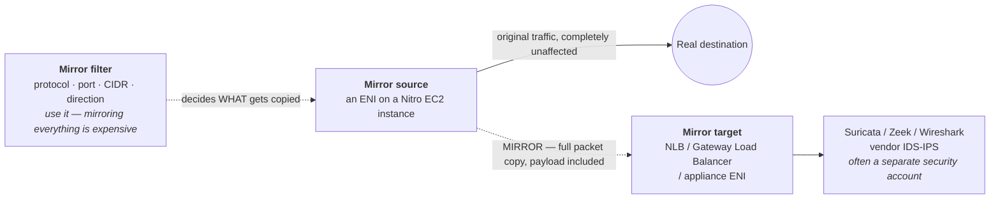

**The four objects you configure** — worth being able to name, because the question is usually just *"how would you capture packets in a VPC?"*:

| Object | What it is |
|---|---|
| **Mirror source** | The ENI whose traffic you are copying |
| **Mirror target** | Where the copies go — an ENI, an **NLB**, or a **Gateway Load Balancer** (GWLB is the scalable, appliance-fleet option) |
| **Mirror filter** | Rules deciding *what* gets mirrored (protocol, port, CIDR, direction). Essential — mirroring everything is expensive |
| **Mirror session** | Binds source + target + filter together, with a priority number |

**Key facts and constraints**
- **The source is always an ENI**, which makes this a **Nitro-based EC2** feature. It does **not** work for Lambda, and not for RDS or other managed services where you don't own the ENI.
- Source and target can live in **different VPCs** (via peering or Transit Gateway) and **different accounts** — the standard pattern is a dedicated security/inspection account.
- Mirrored traffic **consumes the source instance's network bandwidth allocation**, and is prioritised *below* production traffic — so under pressure AWS drops mirror packets, not real ones.
- It is **not free**: you pay per hour per mirrored ENI, plus the inspection fleet, plus data transfer if it crosses AZs. Filters are how you keep this sane.
- It captures **what is on the wire at the ENI** — a copy, not a security decision. It neither blocks nor alters anything.

**Flow Logs vs Traffic Mirroring vs CloudTrail** — the distinction being tested:

| | Captures | Reach for it when |
|---|---|---|
| **VPC Flow Logs** | Metadata: 5-tuple, byte/packet counts, `ACCEPT`/`REJECT` | Connectivity debugging, cost attribution, "was it blocked?" |
| **Traffic Mirroring** | **Full packets, including payload** | Deep packet inspection, IDS/IPS, forensics, "what was actually sent?" |
| **CloudTrail** | **API calls** to the AWS control plane | "Who deleted the security group?" — tells you nothing about data-plane traffic |

**Interview framing:** *"Flow Logs first — they're cheap, always-on, and answer most connectivity questions. Traffic Mirroring when I need payloads: running an IDS like Suricata, or doing forensics on a suspected compromise. I'd mirror to a Gateway Load Balancer fronting an appliance fleet in a separate security account, and I'd use mirror filters aggressively, because mirroring everything doubles your traffic volume and eats into the source instance's bandwidth."*

### Hands-On: VPC

```bash
# VPC + one public and one private subnet
aws ec2 create-vpc --cidr-block 10.0.0.0/16 --tag-specifications 'ResourceType=vpc,Tags=[{Key=Name,Value=prod-vpc}]'
aws ec2 create-subnet --vpc-id vpc-abc --cidr-block 10.0.1.0/24 --availability-zone us-east-1a  # public
aws ec2 create-subnet --vpc-id vpc-abc --cidr-block 10.0.11.0/24 --availability-zone us-east-1a # private

# Internet gateway + public route (this route is what MAKES the subnet public)
aws ec2 create-internet-gateway
aws ec2 attach-internet-gateway --vpc-id vpc-abc --internet-gateway-id igw-abc
aws ec2 create-route --route-table-id rtb-public --destination-cidr-block 0.0.0.0/0 --gateway-id igw-abc

# NAT gateway (in the PUBLIC subnet) + private route
aws ec2 allocate-address --domain vpc
aws ec2 create-nat-gateway --subnet-id subnet-public --allocation-id eipalloc-abc
aws ec2 create-route --route-table-id rtb-private --destination-cidr-block 0.0.0.0/0 --nat-gateway-id nat-abc

# Free S3 gateway endpoint so private subnets skip the NAT for S3 traffic
aws ec2 create-vpc-endpoint --vpc-id vpc-abc --service-name com.amazonaws.us-east-1.s3 \
  --vpc-endpoint-type Gateway --route-table-ids rtb-private

# Flow logs for debugging
aws ec2 create-flow-logs --resource-type VPC --resource-ids vpc-abc --traffic-type ALL \
  --log-destination-type cloud-watch-logs --log-group-name /aws/vpc/flowlogs \
  --deliver-logs-permission-arn arn:aws:iam::123456789012:role/flowlogsRole
```
**Debug order for "my instance can't reach the internet":** route table (is there a `0.0.0.0/0` and does it point at an IGW for public / NAT for private?) → is the NAT Gateway actually **in a public subnet**? → security group outbound → NACL both directions → does the instance have a public IP at all (public subnet only) → then read the **flow logs** for `ACCEPT`/`REJECT`.

---

## 7. Cost

### Networking Costs — Where the Money Actually Goes

Data transfer is the line item that blindsides teams, because compute and storage costs are visible up front while network costs are *emergent* — they appear as a consequence of architecture. The rule that explains most of a surprising bill: **inbound is free, outbound costs money, and "outbound" includes traffic that never leaves AWS.**

**The mental model — cost rises with how far the packet travels:**

```
FREE      Inbound from the internet
          Same-AZ, same-VPC traffic over private IPs
          To/from S3 & DynamoDB in-region via a GATEWAY ENDPOINT

$         Cross-AZ, within a region        (~$0.01/GB -- EACH WAY)
$$        Cross-region                    (~$0.02/GB and up)
$$$       Out to the internet              (~$0.09/GB, tiered down at volume)
$$$$      Out through a NAT Gateway        (internet egress + ~$0.045/GB PROCESSING)
```

*Rates are directional and region-dependent — the ordering is what matters, not the exact cents.*

**The four things that actually generate a surprise bill**

| Cause | Why it bites | Fix |
|---|---|---|
| **NAT Gateway data processing** | ~$0.045/GB on top of the hourly charge *and* internet egress. Private-subnet traffic to S3 pays NAT processing for no reason at all | **Gateway VPC Endpoint** for S3/DynamoDB — free, and removes the NAT hop entirely |
| **Cross-AZ chatter** | Billed **in both directions**; a 3-AZ service mesh load-balancing randomly sends roughly ⅔ of its calls cross-AZ | Same-AZ routing where the workload tolerates it, and be deliberate about cross-zone load balancing — see [ELB Deep-Dive](08-load-balancing-autoscaling.md#elb-deep-dive-cross-zone-load-balancing-504-timeouts--shield-ddos-protection) |
| **Internet egress** | ~$0.09/GB is the most expensive normal path, and it applies to every response you send a user | **CloudFront** in front: CDN egress is cheaper *and* origin→CloudFront transfer is free |
| **Using a public path for private traffic** | Reaching an AWS service via its public endpoint exits through NAT/IGW and bills as internet egress | Interface/Gateway VPC Endpoints keep it on the AWS network |

⚠️ **The classic trap:** cross-AZ traffic is billed **per direction**, so a single request/response pair that crosses an AZ boundary is charged twice. This is why "just spread everything across three AZs" is not free — high availability has a running cost, and knowing that it's charged both ways is what makes the answer sound senior.

**The single highest-value fix, drawn out** — the same S3 `GetObject`, two paths, very different bills:

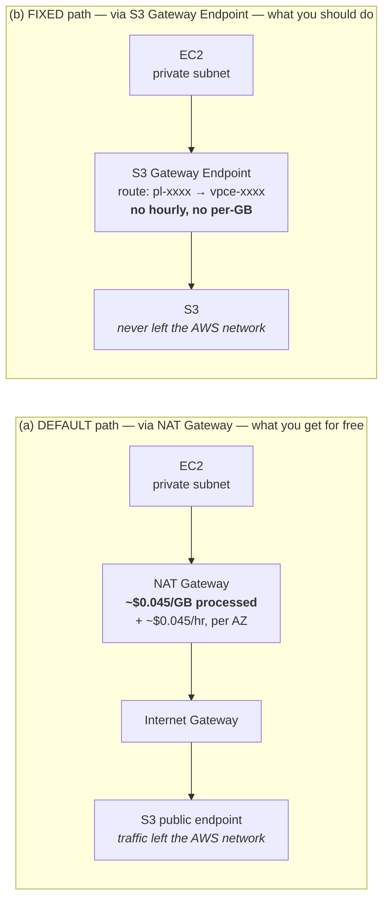

A gateway endpoint has **no hourly and no per-GB charge**, so path (b) is strictly cheaper *and* strictly more private. This is why "add gateway endpoints for S3 and DynamoDB" is the first item on any AWS network cost review.

**Per-service charging models worth remembering** — the *shape* matters more than the rate:

| Service | Charging model |
|---|---|
| **NAT Gateway** | Per hour **+ per GB processed** — and HA wants one per AZ, so realistically ~3× the hourly |
| **Interface VPC Endpoint (PrivateLink)** | Per hour **per AZ per endpoint** + per GB — cheap individually, but multiplies across many services × 3 AZs |
| **Gateway VPC Endpoint** (S3, DynamoDB) | **Free** — no hourly, no per-GB. There is no reason not to have one |
| **Transit Gateway** | Per **attachment**-hour + per GB — a hub with 30 VPCs pays 30 attachment-hours |
| **VPC Peering** | **No hourly charge** — you pay only the underlying cross-AZ/cross-region transfer |
| **Internet Gateway / Egress-Only IGW** | **Free** as devices — you pay only for data transferred through them |
| **Site-to-Site VPN** | Per tunnel-hour + data transfer |
| **Direct Connect** | High fixed port-hour, but **materially cheaper egress at volume** — which is what makes it pay back |
| **Public IPv4 addresses** | Charged **hourly for every public IPv4**, in use or not, since Feb 2024. An idle Elastic IP has always been charged; now attached ones are too |

**Two cost answers worth having ready**
- *"How would you reduce our AWS network bill?"* → In impact order: **gateway endpoints for S3/DynamoDB** to kill NAT processing charges; **CloudFront** in front of internet egress; then **audit cross-AZ chatter** using [Flow Logs](#vpc-flow-logs), which can attribute it; then right-size Interface Endpoints, since it's easy to accumulate one per service per AZ. Finally, release unattached public IPv4.
- *"Why is VPC Peering cheaper than Transit Gateway?"* → Peering has no per-attachment and no per-GB charge — but it doesn't scale: *n* VPCs need *n(n−1)/2* connections and peering **isn't transitive**. TGW's per-attachment cost buys transitive routing and a single place to manage routes. The crossover is usually somewhere around 5–10 VPCs.

---

## 8. Resilience & Disaster Recovery

### Disaster Recovery — Networking

| | |
|---|---|
| **What's actually at risk** | VPCs, subnets, route tables, NAT gateways, security groups, NACLs, VPN and Direct Connect configuration |
| **Backup mechanism** | **IaC only** — there is no snapshot for networking. AWS Config records the change history |
| **Realistic RPO / RTO** | RPO = last commit. RTO is uneven: security groups seconds, NAT gateway minutes, VPN tunnels tens of minutes, **Direct Connect weeks** |

**Recovery runbook:**
1. **Re-apply the VPC module** in the DR region — which only works if you planned **non-overlapping CIDRs** up front.
2. **Re-establish connectivity:** VPN tunnels, VPC peering, or Transit Gateway attachments, then fix up route tables and propagations.
3. **Update DNS:** Route 53 private hosted zone associations and Resolver rules are per-VPC and don't come along automatically.
4. **Verify egress before declaring success** — a missing NAT gateway or route produces an app that starts fine and then fails every outbound call, which reads like an application bug.

⚠️ **The gotcha:** **overlapping CIDR ranges are a DR blocker you can only fix *before* the incident.** If prod and DR were both given `10.0.0.0/16`, you can never peer or transit-gateway them, and you find out at the worst possible moment. Allocate DR CIDRs at design time. Second: **Direct Connect cannot be provisioned in an emergency** — it's a physical cross-connect with weeks of lead time, so every DR plan must assume VPN-over-internet as the fallback path and be tested that way.

---

## 9. Real-World Topology Pass

### Real-World Topology Pass — Against a Production ECS-on-EC2 Stack

This is a seventh pass, and its origin differs from every other `[gaps]` section. The earlier passes filled gaps against the **interview syllabus** — "this topic is missing versus a senior bar." This pass fills gaps against an **actual production topology**: a containerized Windows service running on ECS-on-EC2, behind an internal Application Load Balancer, inside a VPC the application does not own.

That distinction matters, because the interview syllabus teaches you **how to build a VPC**, whereas most enterprise jobs have you **consume** a VPC somebody else built. The five gaps below are exactly that delta — the things a real stack needed that this document either lacked entirely or covered in a single line.

### Reference Topology — What This Pass Was Run Against

A generic three-stack Terraform topology. Everything marked *platform-managed* is **inherited and read-only** — the application stacks **discover** it via `data` sources rather than creating it. Everything else is created by the three Terraform stacks.

```text
        ┌──────────────────────────────────────────────────────────────┐
        │  CALLERS — inside the corporate network                      │
        │  web apps · sibling internal services · partner integrations │
        └───────────────────────────┬──────────────────────────────────┘
                                    │  resolves a private DNS name
                                    ▼
        ┌──────────────────────────────────────────────────────────────┐
        │  ROUTE 53 — private hosted zone                              │
        │  A-alias record  ──►  internal ALB   (zone id from state)    │
        └───────────────────────────┬──────────────────────────────────┘
                                    │
 ═══════════════════════════════════╪══════════════════════════════════════════
   V P C  — platform-provisioned, discovered by tag  Name = <account alias>
            IGW · NAT · subnets · route tables · AZ layout :  ALL INHERITED
 ═══════════════════════════════════╪══════════════════════════════════════════
                                    │
  ┌─ PUBLIC SUBNETS — tag SubnetType = Public ──────────────────────────────────┐
  │   Looked up by all three stacks. NO service resource is ever placed here.
  │
  │     [ Internet Gateway  ]   platform-managed
  │     [ NAT Gateway per AZ ]  platform-managed  ◄── sole egress path for tasks
  └─────────────────────────────────────────────────────────────────────────────┘
                                    │
  ┌─ PRIVATE SUBNETS — tag SubnetType = Private, one per AZ ────────────────────┐
  │                                 ▼
  │  ┌─ INTERNAL ALB ───────────────────────────────────────────────────────┐
  │  │  internal = true · idle_timeout 300s · subnets = private
  │  │  Listener   HTTP :80   — no TLS, terminates upstream
  │  │  Default action: fixed-response 501  (unmatched path fails loudly)
  │  └──────────────────────────────┬───────────────────────────────────────┘
  │                                 │  LISTENER RULE
  │                                 │  path  /service/*   and  /legacy-service/*
  │                                 ▼
  │  ┌─ TARGET GROUP ───────────────────────────────────────────────────────┐
  │  │  HTTP :8006 · target_type = instance · least_outstanding_requests
  │  │  health  /service/ping · matcher 200-499 · 30s/15s · 2 up / 3 down
  │  │  deregistration_delay 120s
  │  └──────────────────────────────┬───────────────────────────────────────┘
  │                                 │  connects to EPHEMERAL host port
  │                                 │  32768-65535  (fleet SG allows from ALB SG)
  │                                 ▼
  │  ┌─ ECS CLUSTER ON EC2 — not Fargate; a cost decision for Windows ──────┐
  │  │
  │  │    ASG  ──capacity provider──►  ECS SERVICE  ──uses──►  TASK DEF
  │  │    ───────────────────────      ───────────────────     ─────────────
  │  │    Windows fleet                spread by AZ,           Win 2019 Full
  │  │    gp3 100GB encrypted          then binpack CPU        cpu/mem per env
  │  │    managed scaling on           circuit breaker +       container :8006
  │  │    min/max per env              rollback · grace 900s   awslogs driver
  │  │                                 CPU-target autoscaling  roles from core
  │  │
  │  │  ┌────────────────┐  ┌────────────────┐  ┌────────────────┐
  │  │  │ EC2 · Windows  │  │ EC2 · Windows  │  │ EC2 · Windows  │
  │  │  │      AZ a      │  │      AZ b      │  │      AZ c      │
  │  │  ├────────────────┤  ├────────────────┤  ├────────────────┤
  │  │  │ IIS container  │  │ IIS container  │  │ IIS container  │
  │  │  │ site :80→:8006 │  │ site :80→:8006 │  │ site :80→:8006 │
  │  │  │ app pool: new  │  │ app pool: new  │  │ app pool: new  │
  │  │  │ app pool: old  │  │ app pool: old  │  │ app pool: old  │
  │  │  │ same phys path │  │ same phys path │  │ same phys path │
  │  │  └───────┬────────┘  └───────┬────────┘  └───────┬────────┘
  │  └──────────┼───────────────────┼───────────────────┼───────────────────┘
  │             └───────────────────┴───────────────────┘
  │                                 │
  │  ┌─ VPC INTERFACE ENDPOINT ─────┴───────────────────────────────────────┐
  │  │  PrivateLink → external partner service · private DNS enabled
  │  │  own SG: ingress on the partner port from the fleet SG
  │  │  keeps partner traffic OFF the NAT / internet path entirely
  │  └──────────────────────────────────────────────────────────────────────┘
  │
  │  ┌─ CLIENT VPN SECURITY GROUP — platform-owned, discovered by tag ──────┐
  │  │  lets engineers reach internal endpoints over VPN
  │  └──────────────────────────────────────────────────────────────────────┘
  └─────────────────────────────────────────────────────────────────────────────┘
                                    │
        ┌───────────────────────────┴──────────────────────────────────┐
        │                    DATA & DEPENDENCIES                       │
        └──────────────────────────────────────────────────────────────┘

   RELATIONAL DB (Oracle)     S3 APPLICATION DATA       SECRETS MANAGER
   ──────────────────────     ───────────────────       ───────────────
   SG ingress from fleet SG   regulated KMS key         DB credentials
   host + creds via state     public access blocked     APM licence key
   port opened by core repo   cross-region replication  registry creds

   CLOUDWATCH LOGS            ECR + ARTIFACT REGISTRY   PLATFORM KMS
   ───────────────            ───────────────────────   ────────────
   /ecs/tasks/<stack>-<svc>   image built in CI, then   basic-data key
   NO retention configured    pushed to the registry    regulated-data key
   also shipped to a central  version pinned by the     task role gets Decrypt
   log platform               release tool              + GenerateDataKey

   SIBLING INTERNAL SERVICES  COMPLIANCE BUCKET
   ─────────────────────────  ─────────────────
   reached over their own     PutObject only
   internal ALBs; core repo
   adds the ingress rules


   OWNERSHIP KEY
   ─────────────
   "platform-managed" / "platform-owned"  →  inherited, read-only to these stacks
   everything else                        →  created by the three Terraform stacks
```

**The headline finding in that diagram, and why it is a purely networking observation:** **none** of the three repositories create the VPC, subnets, NAT gateway, or internet gateway. All of them **discover** the network fabric by tag:

```hcl
data "aws_vpc" "vpc" {
  tags = { Name = data.aws_iam_account_alias.current.account_alias }
}

data "aws_subnets" "private" {
  filter { name = "vpc-id"       values = [data.aws_vpc.vpc.id] }
  filter { name = "tag:SUB-Type" values = ["Private"] }
}
```

There is **one** platform-provisioned VPC per AWS account, located by the tag `Name = <account alias>`. NAT gateways, the IGW, route tables and AZ layout are owned by a central cloud platform team. NAT is **never named anywhere in the codebase** — it exists only *implicitly*, because the fleet security group allows egress to `0.0.0.0/0` while every instance sits in a private subnet, so outbound traffic must traverse a platform NAT gateway.

**Networking consequence:** *the account boundary is the environment boundary.* There is no per-service network isolation — every service in the account shares one VPC, one set of private subnets and one NAT path.

| This thing in the diagram | Where it previously lived in this document | Gap |
|---|---|---|
| Client VPN security group | One line, at the end of [Hybrid Connectivity](#hybrid-connectivity-site-to-site-vpn--direct-connect) | **Gap 1** |
| Platform VPC/subnets discovered by tag | Nowhere — the document teaches *building* a VPC | **Gap 2** |
| `internal = true` ALB in private subnets | Nowhere (`internal = true` is absent from the whole guide) | **Gap 3** |
| Interface endpoint on per-AZ filtered subnets | Placement mechanics absent; cost model was covered | **Gap 4** |
| `32768–65535` ALB SG → fleet SG | Covered in [Containers](09-containers-ecs-fargate.md#ecs-elastic-container-service), not here | **Gap 5** |

### Summary of This Pass

| # | Gap | Why it matters, in one line |
|---|---|---|
| 1 | [AWS Client VPN](#aws-client-vpn-getting-individual-users-inside-the-vpc) | The only human path into an internal-only architecture; the two-gate distinction (authorization rule + SG), and split-tunnel's NAT cost |
| 2 | [Network inherited, not owned](#the-network-is-inherited-not-owned-shared-vpc--the-central-platform-model) | In an enterprise you discover a VPC rather than build one; subnet sharing via RAM; account = blast radius |
| 3 | [Internal ALB + subnet requirements](#internal-vs-internet-facing-alb-and-albs-subnet-requirements) | `scheme` is immutable; ALB needs 2 AZs, `/27`, and 8 free IPs — or scale-out fails silently |
| 4 | [Endpoint AZ placement & AZ IDs](#interface-endpoint-azsubnet-placement-zonal-dns-and-az-ids) | One ENI per AZ = one charge per AZ; you must match the provider's AZs, and **AZ names differ per account** |
| 5 | [Dynamic host ports, network side](#ecs-dynamic-host-ports-seen-from-the-networking-side) | The `32768–65535` SG rule has nothing to do with the NACL ephemeral trap; `bridge` makes per-service SG isolation impossible |

---

## 10. Applied Case — App-to-Database Networking

### Aurora MySQL ← .NET Service on ECS

An end-to-end applied case: the networking between the app tier and the database. Almost all the real work here is **security groups, subnet sizing, and connection-pool behaviour on failover** — not routing.

**Target architecture:** `ALB → ECS task (private subnets) → RDS Proxy → Aurora MySQL cluster`. Aurora is `PubliclyAccessible = false`, in a DB subnet group spanning **3 AZs**. Credentials: **IAM DB auth** from the task role (no password in the container); the Secrets Manager credential is used only by *RDS Proxy*.

**Networking baseline**

| Item | Setting |
|---|---|
| ECS tasks | Private subnets, Fargate `assignPublicIp: DISABLED` |
| Aurora | Private subnets, **no IGW/NAT route** |
| Aurora SG | Inbound 3306 **from RDS Proxy SG** |
| RDS Proxy SG | Inbound 3306 **from ECS task SG** |
| VPC endpoints | Interface: `secretsmanager`, `sts`, `ecr.api`, `ecr.dkr`, `logs` + **S3 gateway** |

⚠️ Without those endpoints a task needs a **NAT gateway** just to fetch an IAM token and pull an image. And the endpoints must live in the **ECS task's VPC**, not the database's.

---

#### Security groups — where access control actually lives

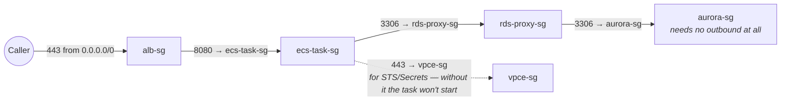

Every rule's source is an **SG ID**, not a CIDR. Three properties that matter:

1. **Stateful** — return traffic for a permitted outbound connection is automatically allowed. **Never write an ephemeral-port return rule** (the opposite of NACLs — see [NACLs](#nacls-in-depth--rule-evaluation--the-ephemeral-port-trap)).
2. **Identity, not location** — `source_security_group_id` means "whatever has this SG attached, wherever it is". Rescale subnets, add an AZ, move tasks: the rule keeps meaning the right thing. A **CIDR rule silently widens** as the subnet gets reused.
3. **Default egress is allow-all** — if you lock task egress down, remember `443 → vpce-sg`, or the task can't reach STS for its token and fails with an error that *looks nothing like* networking.

```hcl
resource "aws_security_group_rule" "aurora_from_proxy" {
  type = "ingress"; from_port = 3306; to_port = 3306; protocol = "tcp"
  security_group_id        = aws_security_group.aurora.id
  source_security_group_id = aws_security_group.rds_proxy.id
}
```

Skipping the proxy? Then it's just `aurora-sg ← ecs-task-sg` on 3306.

---

#### Same VPC, different subnets — routing needs nothing

Every route table carries an **undeletable `local` route** for the VPC CIDR, covering **all** subnet CIDRs (including secondary CIDR blocks added later). `10.20.10.5 → 10.20.20.42:3306` is a plain intra-VPC hop — no peering, gateway or NAT. **There is no routing knob to get wrong.**

Two consequences:
- ⚠️ **Different subnet CIDRs give no isolation by themselves.** Data subnets are reachable from everything in the VPC. Isolation comes entirely from **SGs plus the absence of a default route out**.
- The only way to interpose on intra-VPC traffic is a route **more specific** than `local` pointing at a GWLB or ENI ("middlebox routing") — so `local` isn't literally absolute.

---

#### Subnet sizing — the part people get wrong

**App subnets.** In `awsvpc` each task gets its own ENI and one private IP; AWS **reserves 5 IPs** per subnet (see [CIDR section](#ip-addressing-cidr--subnetting--ground-up)), so a `/27` yields 27 usable. ⚠️ **The big mistake is not budgeting for rolling deploys:** with `deploymentMaximumPercent = 200` old and new tasks coexist, so peak demand is **2× max task count**. A service autoscaling to 40 tasks across 2 AZs needs ~40 IPs per subnet at peak — a `/27` fails **mid-deployment** with `RESOURCE:ENI` placement errors, leaving you half-deployed. **Use `/24`** — IPv4 space inside a VPC is free.

**Data subnets.** `/27` per AZ is comfortable. Each Aurora instance uses one IP in its AZ; RDS Proxy creates ENIs in each assigned subnet. The DB subnet group needs **≥2 AZs** — **give it 3**, so a failover always has somewhere to land. The subnet group defines where Aurora *may* place instances, so you're pre-provisioning IP space in an AZ you may have no instance in today.

---

#### NACLs and failure signatures

Default NACL (allow all) → nothing to do, and **that's the right choice**; SGs are the better tool. If custom NACLs are mandated, they're **stateless**:

| NACL | Direction | Rule |
|---|---|---|
| App subnets | Egress | allow TCP 3306 → data CIDRs |
| App subnets | Ingress | allow TCP **32768–65535** ← data CIDRs |
| Data subnets | Ingress | allow TCP 3306 ← app CIDRs |
| Data subnets | Egress | allow TCP **32768–65535** → app CIDRs |

**The failure signature is diagnostic** — these three lines save hours of debugging:

| Symptom | What it means |
|---|---|
| **Times out** | NACL drop or missing SG rule — packets silently discarded |
| **Connection refused / RST** | Host reached, nothing listening. **The network path is fine** — check the port and that the DB is up |
| **TLS or auth error** | Path and port both fine — now you're debugging certs or IAM |

---

#### DNS and the real Aurora failover trap

```
appdb.cluster-abc123.us-east-1.rds.amazonaws.com   (CNAME, TTL 5s)
  └→ appdb-instance-1.abc123…   └→ A  10.20.20.42
```

The VPC needs `enableDnsSupport` **and** `enableDnsHostnames`. With `enableDnsHostnames = false` the endpoint may resolve to a **public address** with no route from a private subnet — and that timeout **looks exactly like an SG problem**.

⚠️ **The real trap:** your connection pool holds **open TCP sessions** to a specific instance IP. **DNS re-pointing does nothing to established sockets.** After failover the old writer is demoted to a reader, pooled connections keep working, and **every write fails**:

```
Error 1290: The MySQL server is running with the --read-only option
```

Mitigations, in order of preference:
1. **RDS Proxy** — detects failover and re-points client sessions itself. The main reason it earns its cost.
2. **`ConnectionLifeTime=900`** — caps pooled connection age, so the pool drains itself within 15 minutes.
3. **Catch `1290` → `MySqlConnection.ClearPool()` → retry.** Add `errorNumbersToAdd: [1290]` in EF Core (Pomelo) so it treats it as transient.

On DNS caching: .NET (Core/5+) doesn't cache DNS in-process for raw TCP — it defers to the OS resolver, and Linux containers typically run without `nscd`, so each new physical connection re-resolves and honours the 5s TTL. `DnsRefreshTimeout` was a .NET Framework concern.

---

#### Cross-AZ — by design, and fine

Aurora has **one writer in one AZ**; tasks spread across AZs for availability. So **most write traffic crosses an AZ boundary by design.**
- **Latency:** sub-ms to ~1ms. Irrelevant unless you're doing hundreds of sequential round trips per request — in which case **fix the query pattern, not the topology**.
- **Cost:** $0.01/GB each direction (see [Networking Costs](#networking-costs--where-the-money-actually-goes)).
- ⚠️ **Don't pin tasks to the writer's AZ** — you'd trade a rounding-error cost for an availability regression, and the writer moves on failover anyway.

---

#### Topology options — when app and DB aren't in one VPC

| Topology | Works? | SG-to-SG rules? | Note |
|---|---|---|---|
| **Same VPC, different subnets** | ✅ nothing to do | ✅ | the `local` route handles it |
| Different VPCs, same region, **peering** | ✅ | ✅ | non-overlapping CIDRs required; add routes on **both** sides |
| Different VPCs via **Transit Gateway** | ✅ | ❌ **CIDR rules only** | this is where the SG-reference advice breaks |
| Overlapping CIDRs / hard account boundary | ❌ peering impossible | ❌ | PrivateLink + NLB, with caveats |

- **Peering:** SG references **work across same-region peering** — put the peer VPC's task SG ID straight into the Aurora SG rule. **Does not work cross-region.** A missing return route is the #1 cause of "times out but the SG looks right" (see [VPC Peering](#vpc-peering)).
- **TGW:** does **not** support SG referencing → CIDR rules are forced. Mitigation: give ECS tasks **dedicated** subnets so the CIDR rule means "the app tier", not "anything in that VPC" — but size them **`/24`, not `/27`**. ⚠️ The load-bearing word is *dedicated*, **not *small***: a `/27` satisfies the rule but fails mid-deployment (see [Subnet sizing](#subnet-sizing--the-part-people-get-wrong) above), and a broken deploy is worse than a slightly broader CIDR rule. A dedicated `/24` per AZ is precise enough for the rule *and* large enough for rolling deploys. Need it tighter? List the individual app-subnet CIDRs in the rule rather than widening to the VPC CIDR.
- **PrivateLink (last resort):** the only option that tolerates overlapping CIDRs, but awkward against Aurora — the writer IP **changes on failover**, so static IP targets go stale and you end up running a Lambda on RDS event subscriptions that **can fail during the exact incident you need it in**. The NLB's **350s idle timeout** drops idle flows silently. **Simpler alternative:** add a **secondary non-overlapping CIDR** to one VPC and move the ECS tasks into it.

**Topology-independent:** IAM DB auth, `SslMode=VerifyFull`, and VPC endpoints living in the **task's VPC** — none of these change with topology.

---

#### RDS Proxy, IAM auth and the app-side settings that are really networking

- **When the proxy is worth it:** tasks scale in/out (bursty connection counts), you want fast failover (~seconds vs ~60s), or centralised credential handling. Cost ~$0.015/vCPU-hr of the DB instance. A single always-on service with a fixed pool can connect straight to the cluster writer endpoint.
- **MySQL-specific:** IAM auth is capped at **~200 new connections/second per instance** — a cold Fargate scale-out can hit that; the proxy absorbs it by reusing backend connections.
- ⚠️ **Session pinning (MySQL):** the proxy **pins** a client to one backend connection — silently degrading to one-connection-per-client — when the session does a server-side `PREPARE`, `CREATE TEMPORARY TABLE`, `LOCK TABLES`/`GET_LOCK`, sets session or user variables (`SET @x`, `SET SESSION`), or holds a long explicit transaction. Hence `IgnorePrepare=true`. Watch **`DatabaseConnectionsCurrentlySessionPinned`** — if it tracks total connections you have failover resilience but **no pooling benefit**.
- **The #1 IAM auth error:** the wrong `rds-db:connect` resource ARN — use the **proxy ID (`prx-…`)** when going through RDS Proxy, the **cluster resource ID (`cluster-…`)** when direct. Wrong ID = `PAM authentication failed`.
- **`SslMode=VerifyFull` + CA bundle is non-negotiable:** IAM auth sends the token via `mysql_clear_password`, so without full verification you're handing a **usable credential** to an unverified server.
- **Pool math:** `MaximumPoolSize` × task count must stay under Aurora's `max_connections` (~1000 on `db.r6g.large`). 40 × 20 = 800 is already close.
- **The token expires in 15 minutes but the container lives for days** → use a refreshing password provider (MySqlConnector 2.3.0+ `UsePeriodicPasswordProvider`), not a token generated once at startup. Symptom: "works ~15 min then fails".
- **Never use `ServerVersion.AutoDetect()`** (Pomelo) — it opens a synchronous connection during DI configuration, so the container won't start if Aurora is mid-failover, and it runs before your retry policy exists.
- **Migrations:** run as a separate one-off ECS `RunTask`, gated before the service deploy. **Never on container start** — N tasks means N concurrent migrators racing.
- ⚠️ **The ALB health check must not touch the DB**, or one Aurora failover cascades into the ALB killing every task. Expose DB reachability separately at `/health/ready` for deployment gates.
- **Reads:** register the proxy read-only endpoint or Aurora reader endpoint as a **second `MySqlDataSource`** and route to it explicitly. **Nothing routes reads for you**, and replicas can lag.

---

#### How to verify it

```bash
# from inside a running task (ECS Exec)
aws ecs execute-command --cluster prod --task <id> --container app --interactive --command "/bin/sh"
nc -zv appdb.cluster-abc123.us-east-1.rds.amazonaws.com 3306
```

For paths that fail **before** the task starts — or when you'd rather not ship a shell in the image — **VPC Reachability Analyzer** statically evaluates route tables, SGs and NACLs and **names the blocking component**:

```bash
aws ec2 create-network-insights-path --source <eni-id> --destination <db-eni-id> \
  --protocol tcp --destination-port 3306
```

---

#### Common failure modes

| Symptom | Cause |
|---|---|
| `PAM authentication failed` | Wrong `rds-db:connect` resource ARN (cluster vs proxy), or user not created with the AWS auth plugin |
| Works ~15 min then fails | Token generated once at startup instead of via a refreshing provider |
| `too many connections` at scale | Pool size × task count > `max_connections`; no proxy |
| Task times out fetching a secret | Missing VPC endpoint for `secretsmanager`/`sts` and no NAT |
| Intermittent `connection reset` | Idle lifetime longer than the proxy/NLB idle timeout |
| `1290 --read-only` after failover | Pooled connections still open to the demoted old writer |

**Bottom line:** in the same-VPC case **routing is free and automatic**. The real work is three things — (1) **SG chaining** (identity-based, not CIDR-based), (2) **subnet IP sizing for rolling deployments** (`/24` app subnets), and (3) **Aurora failover connection-pool behaviour** — which is an *application* concern, not a networking one, and the item most likely to bite you in production.

---
---

← [Relational Databases, Caching & Analytics](10-databases-caching-analytics.md) · [Index](README.md) · [Security Services](12-security-services.md) →
