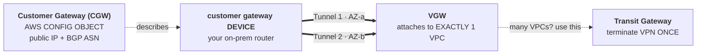
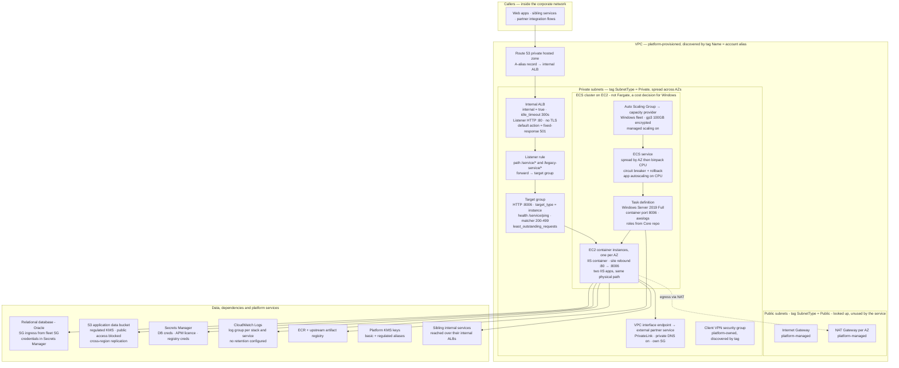

> **AWS Quick Revision Notes** · [Index](README.md) · Part II

# Networking

---

## 1. Fundamentals — Addressing & Design

### IP Addressing, CIDR & Subnetting (fundamentals)

- **IP = 32 bits**, 4 octets × 8 bits (`0-255`). Total IPv4 = 2^32 ≈ 4.29B → that exhaustion is what produced NAT + IPv6.
- Address = **network part** (the building, identical for everyone in the subnet) + **host part** (flat number, unique). CIDR says how many bits are network.
- **`/n` = the leading n bits are locked.** `Total IPs = 2^(32-n)`. `/16` = 65,536; `/24` = 256; `/28` = 16.
- ⚠️ **Smaller prefix = BIGGER network.** `+1` prefix = **half** the size, `-1` = **double**. Mnemonic: **"/24 = 256, and every step after halves it"** → /25=128, /26=64, /27=32, /28=16.
- **Subnet mask = the same CIDR**: network bits `1`, host bits `0`. `/24`=255.255.255.0, `/26`=255.255.255.192. A mask octet can only be: **0 128 192 224 240 248 252 254 255**.

| CIDR | Mask | Total | AWS usable | Use |
|---|---|---|---|---|
| `/16` | 255.255.0.0 | 65,536 | 65,531 | **standard VPC** |
| `/20` | 255.255.240.0 | 4,096 | 4,091 | big EKS/app subnet |
| `/24` | 255.255.255.0 | 256 | **251** | **standard subnet** |
| `/26` | 255.255.255.192 | 64 | 59 | small app subnet |
| `/27` | 255.255.255.224 | 32 | 27 | DB / endpoint subnet |
| `/28` | 255.255.255.240 | 16 | 11 | **AWS minimum** |
| `/32` | 255.255.255.255 | 1 | — | one host (SG rule, static route) |

- **AWS limits:** both VPC **and** subnet `/16`..`/28`. `/29`+ not allowed. VPC **primary CIDR can't be changed** (secondary CIDRs can be added).
- ⚠️ **AWS reserves 5 IPs per subnet, not 2:** `.0` network, `.1` VPC router, `.2` Amazon DNS (base+2), `.3` future, **last** broadcast. → **usable = total − 5**, so `/28` = **11**. `awsvpc` (per-task ENI) + EKS VPC CNI (per-pod IP) burn through these fast → *"insufficient free IP addresses in subnet"* is a **subnet sizing** problem, not a capacity one.
- **Block-size trick** (`/25`–`/31`): `block = 256 − last non-zero mask octet`. `/26` → 256−192 = **64** → `.0-.63 / .64-.127 / .128-.191 / .192-.255`. A network address is always a multiple of the block size (`192.168.1.50/26` is not a valid *network*).
  - *"Is `10.0.130.45` inside `10.0.128.0/18`?"* → /18 mask 255.255.192.0 → block 64 → range `10.0.128.0–10.0.191.255` → **yes**.
- **Subnetting example** — VPC `10.0.0.0/16`, 3-tier × 3-AZ: public `10.0.{0,1,2}.0/24`, app `10.0.{10,11,12}.0/24`, db `10.0.{20,21,22}.0/24` (one `/24` per tier per AZ). Habits: **3rd octet = tier+AZ label** (0-9 public, 10-19 app, 20-29 db) and **leave gaps** (tomorrow EKS wants a `/20`).
- ⚠️ **#1 subnetting mistake:** forgetting a non-`/24`'s width — a `/23` eats **two** third-octet values (`10.20.10.0/23` = `10.20.10.0–10.20.11.255`), so the next subnet starts at `10.20.12.0`, not `10.20.11.0`.
- **Route tables = a list of CIDRs; Longest Prefix Match wins.** `0.0.0.0/0` (0 bits) vs `10.1.0.0/16` (16 bits) → the specific one. **The `local` route can't be deleted or overridden and always wins.**
- Special CIDRs: `0.0.0.0/0` = everything (in an SG, "the whole world"), `x.x.x.x/32` = one IP (the right way to allow an office static IP), `::/0` = IPv6 everything (forgetting to block it in an IPv6 VPC is a common miss).
- **RFC 1918 private ranges:** `10.0.0.0/8` (16.7M, the AWS default choice, **256 `/16` VPCs**), `172.16.0.0/`**`12`** (1M — AWS's default VPC `172.31.0.0/16` comes from here; `172.32.x` is **public**), `192.168.0.0/16` (home/office routers → avoid for a VPC). These aren't routable → **that's why NAT exists**.

### Overlapping CIDRs — the mistake you can't undo

- **Story:** in 2021 two teams accepted the console default `10.0.0.0/16` (separate accounts, unaware of each other). In 2023 they needed private connectivity → stuck.
- **Peering:** the create request is **rejected** outright (matching/overlapping CIDR). No `--force`, no NAT workaround.
- **TGW:** the attachment **succeeds**, then traffic dies silently — only **one route per CIDR** installs in a route table; the other is blackholed.
- ⚠️ **The real killer hits before the TGW — the VPC's `local` route.** The Orders app calls `10.0.10.5` → matches its own `10.0.0.0/16 → local` → **the packet never leaves the VPC**. Symptom: timeout, and **not even a `REJECT` in Flow Logs** (to be rejected, a packet has to arrive). The team debugs SGs/NACLs while the problem is routing arithmetic.
- **Partial overlap deceives most:** A=`10.0.0.0/16`, B=`10.0.5.0/24` (inside A) → peering is created, but longest-prefix gives `10.0.5.0/24` to B → **A permanently loses its own `10.0.5.x` range**, discovered the day something launches there.

| Fix (once overlap exists) | Verdict |
|---|---|
| Re-IP one VPC | ✅ the real fix — but **primary CIDR can't change** → new VPC + migration, weeks of work |
| Secondary CIDR (`10.50.0.0/16`) | ⚠️ partial — new subnets reachable, **old ones not** |
| **PrivateLink (NLB + interface endpoint)** | ✅ **best practical** — overlap is irrelevant (proxied, not routed); limitation: service-level, one-directional |
| Private NAT GW + `100.64.0.0/10` (CGNAT) | ✅ AWS's documented overlapping-network pattern; the diagram stops being comprehensible |
| Go over the internet | ❌ latency + NAT cost + PCI scope creep |

- **Model answer:** *"If the overlap already exists → **PrivateLink**: service-level exposure without merging networks. But the real answer is that you prevent this at design time."*
- **Prevention — an allocation registry on day one.** `10.0.0.0/8` holds **256 `/16`s** — no shortage of space, only of discipline: prod `10.0-10.9`, staging `10.10-10.19`, dev `10.20-10.29`, shared svcs `10.100.x`, reserved `10.200+` (M&A).
- **5 rules:** (1) **never accept the console's default CIDR**; (2) **give the DR region its own block** (prod+DR both on `10.0.0.0/16` = you can't peer on failover day — the #1 DR blocker); (3) **ask for the on-prem range first** or VPN/DX dies; (4) reserve space for M&A; (5) **use Amazon VPC IPAM** — pools + automatic overlap prevention; don't rely on a spreadsheet in a multi-account estate.

---

## 2. VPC Core — Subnets, Routing & Security

### VPC, Subnets, NAT

VPC = isolated virtual network (IP range, subnets, routing, SG+NACL). CIDR (`10.0.0.0/16`) fixed at creation (can add secondary; plan for peering/TGW — overlaps hurt). Subnet = CIDR slice in one AZ. **No inherently public/private subnet — the route table decides.** Public = route `0.0.0.0/0 → IGW` (needs public IP + SG too). **IGW** = one per VPC, two-way for public. **NAT** = private outbound only (inbound always blocked); flow `private → NAT (in public subnet) → IGW`; **NAT Gateway must live in a public subnet**. NAT Gateway (managed, default) vs NAT Instance (self-managed legacy). **Cost:** NAT bills per-hour + per-GB → for AWS-service traffic use **VPC Endpoints**. SG (stateful, ENI, allow) vs NACL (stateless, subnet, allow+deny). Public subnet = LB/bastion/NAT; private = app/ECS/RDS (**never DB in public**). **HA: one NAT Gateway per AZ.**

### Default VPC

One per region, pre-built. **Always `172.31.0.0/16`** (same in every account → the #1 CIDR collision source; primary CIDR can never be changed). Default subnets: **one per AZ, each `/20`, all PUBLIC** (main route table has `0.0.0.0/0 → IGW`). **Auto-assign public IPv4 = ON.** Default SG = all inbound from itself + all outbound; default NACL = allow everything. **No private subnet, no NAT Gateway → nowhere correct for a database.** ⚠️ An instance launched with **no subnet specified** lands here — the usual cause of "why is our dev DB on the internet?" Can be deleted (`create-default-vpc` remakes it as a *new* VPC with new subnet IDs). "Default subnet" is public by its route table, not by nature. **Default VPC ≠ main VPC** (no such thing; *main route table* is the real concept). Manually-created subnets default `MapPublicIpOnLaunch` = **off** — the opposite.

```
Default VPC  172.31.0.0/16   [IGW] -- main RT: 0.0.0.0/0 -> IGW
   AZ-a /20 PUBLIC | AZ-b /20 PUBLIC | AZ-c /20 PUBLIC    <- all public
   auto-assign public IPv4 = ON      NO private subnet, NO NAT GW
```

### NACL Rule Evaluation & Ephemeral Ports

**Rules are numbered; lowest number wins and evaluation STOPS at the first match** — so a deny must be numbered *below* the allow it overrides (opposite of SGs, where all rules evaluate and order is meaningless). Number in gaps of 100. Trailing `*` = implicit deny-all, not editable. Quota 20 rules (→40), separate list per direction.

**The #1 failure — ephemeral ports.** NACLs are stateless, so the reply is a fresh outbound decision, and it does **not** return on 443 — it returns to the client's high port. Web tier needs **inbound 443 + outbound `32768–65535`** (AWS's documented example range). Symptom if wrong: **timeout in a subnet whose SG is provably correct.** (Linux `32768–61000`, Windows `49152–65535`; but **ELB / NAT GW / Lambda use `1024–65535`** → widen to `1024–65535` when any of those front it.)

```
Client :51234 --request-> :443  Instance
        reply FROM :443 TO :51234   -> OUTBOUND NACL must allow 32768-65535
Order:  in:  RT -> NACL -> SG -> instance     out:  SG -> NACL
```

A NACL deny **can't** be overridden by a permissive SG, and blocked traffic never reaches the instance → `REJECT` in Flow Logs with zero app-side evidence. **Use only for explicit deny SGs can't express** (hostile CIDR) or a hard data-subnet boundary; otherwise leave the default allow-all alone.

### IPv6 & Egress-Only IGW

**AWS assigns the range — you don't pick it.** VPC gets a **`/56`**, every subnet is **always a `/64`** (→ 256 subnets/VPC, ~18 quintillion addresses each, so exhaustion stops being a concept). IPv4 stays required; IPv6 is added → **dual-stack is the normal deployment**, not a migration. ⚠️ **There is no private IPv6 address** — every one is globally routable, so privacy comes from routing + SGs. That's exactly why **NAT has no IPv6 equivalent**.

**Egress-Only Internet Gateway = the IPv6 "outbound only" device** (no translation, just stateful outbound):

| | NAT Gateway | Egress-Only IGW |
|---|---|---|
| Protocol | IPv4 | **IPv6** |
| Lives | **in a public subnet** | **attached to the VPC** |
| Route | `0.0.0.0/0 → nat-xxxx` | `::/0 → eigw-xxxx` |
| HA | **AZ-scoped, one per AZ** | **Regional, HA by default** |
| Cost | per hour + **per GB** | **Free** |

⚠️ **SGs/NACLs need explicit IPv6 rules** — an IPv4 `0.0.0.0/0` rule does nothing for IPv6, so teams lock down IPv4 and leave `::/0` wide open. Route tables need a separate `::/0`. IPv6-only subnets exist but many services/third parties are still IPv4-only. IPv6 on an ENI **survives stop/start** (unlike auto-assigned public IPv4). **Use when:** RFC 1918 exhaustion, EKS per-pod IP pressure, IPv6-only clients.

### VPC Reference Architecture

Canonical 3-tier per AZ: public (ALB+NAT) / private app (ECS/EC2) / private DB (RDS, no NAT/IGW route). RDS primary↔standby sync across AZs; standby carries no traffic. "Public" only because route table points `0.0.0.0/0` at IGW.

---

## 3. Connectivity — Peering, Hybrid & Private Access

### VPC Peering

Private 1:1 (same/diff account/region, internal network). **❗ CIDRs must not overlap** · **❗ not transitive** (A-B, B-C ≠ A-C) · no edge-to-edge (can't use peer's IGW/NAT/VPN/DX). Routes on both sides. Can reference peer's SG by ID (same region). Doesn't scale: **n(n−1)/2** connections.

### Transit Gateway
Regional **hub-and-spoke router** — every VPC, Site-to-Site VPN and DX gateway attaches **once**, TGW routes between them. **Transitive** (A→TGW→C — the thing peering cannot do). Scales to **thousands** of attachments: *n* VPCs = *n* attachments, not *n(n−1)/2*. **Per-attachment TGW route tables = segmentation** (e.g. prod can reach shared services but not each other). **Inter-region TGW peering** over the AWS backbone. Supports **multicast** (peering and VPN don't). **RAM-shareable** → one central TGW for the whole org (see [RAM](15-management-org-billing.md#ram)). **Cost:** per **attachment-hour** + per GB → pricier than peering for a simple 2-VPC case.

⚠️ **TGW does not fix overlapping CIDRs.** Unlike peering it won't reject upfront — the attachment succeeds and traffic dies silently (one route per CIDR installs; the other is blackholed). See [Overlapping CIDRs](#overlapping-cidrs--the-mistake-you-cant-undo).

| | VPC Peering | Transit Gateway |
|---|---|---|
| Topology | Point-to-point mesh | **Hub and spoke** |
| Transitive routing | ❌ | ✅ |
| Scale | Poor beyond ~5 VPCs | Thousands of attachments |
| Cost | **No hourly charge** (only cross-AZ/region transfer) | Per attachment-hour + per GB |
| Segmentation | Per-VPC route tables | **Per-attachment TGW route tables** |
| SG referencing | ✅ same-region | ❌ **CIDR rules only** |
| Best for | 2–3 VPCs, cost-sensitive, high bandwidth | Multi-account/multi-VPC, hybrid |

### Hybrid: VPN & Direct Connect

| | Site-to-Site VPN | Direct Connect |
|---|---|---|
| Medium | IPsec over internet | Dedicated fibre |
| Setup | Minutes–hours | **Weeks–months** |
| Bandwidth | ~1.25 Gbps/tunnel | 1/10/100 Gbps |
| Latency | Variable | Consistent |
| Encryption | Default (IPsec) | **❗ Not by default** (add VPN over DX / MACsec) |
| Cost | Cheap | High fixed, cheaper egress at volume |

**VPN components — the four nouns people muddle:**



**Always two tunnels**, terminated on two endpoints in two AZs, ~1.25 Gbps each — bringing up only one is a classic SPOF. **Static vs dynamic (BGP):** static = manual CIDR list, manual/slow failover; **BGP = automatic failover + ECMP, preferred** (needs an ASN each side; private range `64512–65534`, AWS VGW defaults to **`64512`**, identical ASNs break the session). **VGW vs TGW:** VGW attaches to **exactly one VPC** and **VPN routes aren't transitive across peering** → more than 1–2 VPCs, use TGW. ⚠️ **Route propagation** must be enabled on the VPC route tables — a fully-up tunnel with no propagation is the classic "VPN is up but nothing works". **Accelerated Site-to-Site VPN** = tunnels over Global Accelerator's edge; **requires TGW**. DX Gateway = one DX to VPCs in multiple regions/accounts. **HA:** two DX at two locations, or one DX + VPN backup (common). **Client VPN** = individual users (laptops).

### AWS Client VPN

Individual laptops → VPC (managed OpenVPN). In an internal-only architecture it's the **only human path in**. **Four objects:** endpoint (client CIDR, auth mode, split-tunnel) · **target network association** (attach a *subnet* — this creates the ENIs; multi-AZ for HA) · **authorization rule** (which destination CIDRs, scopable to AD/SAML group) · its own route table (VPC CIDR auto; internet/peered/TGW/on-prem routes are manual).

⚠️ **Two independent gates** — people collapse them and lose hours: **Gate 1 = authorization rule** (fail → silent drop, connection shows UP but nothing reachable); **Gate 2 = target's SG** must allow inbound from the Client VPN ENI's SG (fail → timeout). **Auth:** mutual TLS certs (ACM + client revocation list) / **AD** (Directory Service, rules scoped to AD groups) / **SAML** (Okta/Entra/Ping — MFA + joiner-leaver in the IdP); mutual can combine with either.

❗ **Split-tunnel vs full-tunnel is a COST decision.** Default is **full-tunnel** → all client internet traffic exits **your NAT Gateway** at ~$0.045/GB processing. Split-tunnel = only route-table matches cross the VPN. **Client CIDR:** must not overlap VPC or any added route · min `/22`, max `/12` · **immutable after creation** · size well above peak concurrency. **Cost:** per **subnet-association**-hour (~$0.10, accrues with zero users; 3 AZs = 3×) + per **client-connection**-hour (~$0.05) + normal transfer → hourly floor like NAT GW, not like S2S VPN. Also: connection logging → CloudWatch, self-service portal, Client Connect Lambda (posture checks), SGs on the endpoint ENIs, ❗ **set DNS servers or private hosted zones won't resolve** (classic "VPN up, internal names dead").

### Inherited Network: Shared VPC & the Platform Model

The syllabus teaches *building* a VPC; enterprises have you *consume* one. **Three models:** (A) **platform-owned VPC per account**, discovered by tag — boundary = account, isolation weakest, most common; (B) **Shared VPC via RAM** — best IP/NAT economics; (C) **VPC-per-account + TGW** — strongest isolation, worst IP efficiency.

**Model B (RAM subnet sharing)** — the answer to "conserve IP space + NAT cost across many accounts", and previously missing (RAM only appeared for TGW/IPAM): needs **Organizations**; owner owns VPC/subnets/routes/IGW/NAT/NACLs/VPC-flow-logs and shares **individual subnets** (not the VPC); participants launch their own resources with their own SGs, billed to themselves; participants **can't** modify/delete shared subnets or route tables, create peering, or see each other's resources. ✅ **Cross-account SG referencing works inside a shared VPC** (else you'd hardcode CIDRs — this is what makes it usable). 💰 **Same-AZ inter-account traffic is free**, often a bigger win than the IP saving. Un-sharing doesn't delete running resources.

**Model A survival notes:** the **contract is tags, not ARNs** (rename a tag → every stack breaks at once) · platform applies its own tags → `ignore_tags { key_prefixes = [...] }` or every `plan` fights them forever · NAT exists implicitly (if egress breaks, the fix isn't in your repo) · you don't control subnet sizing but inherit its pain (`awsvpc` per-task IPs eat a `/24`; remedy = platform ticket) · ❗ isolation is **accepted, not achieved** — flat subnets + fleet SG all-ports self-ingress = any compromised task reaches every task; write it down as accepted risk. **Demand from the platform team:** documented stable subnet tags, IPAM-backed CIDRs with headroom, **per-AZ NAT**, free **gateway endpoints** for S3/DynamoDB, readable VPC flow logs, and clarity on who owns NACLs (a platform NACL can break you via the ephemeral-port trap with no visible cause).

### VPC Endpoints & PrivateLink
**Problem:** a private-subnet instance calling S3/DynamoDB/Secrets Manager normally exits via **NAT Gateway → IGW**, paying NAT per-GB *and* internet egress for traffic that never needed to leave AWS.

| Type | Works with | How | Cost |
|---|---|---|---|
| **Gateway endpoint** | **S3 + DynamoDB only** | **Route-table entry** (prefix list → `vpce-`). No ENI, no IP | **FREE** |
| **Interface endpoint** (**PrivateLink**) | Most AWS services, SaaS, your own | **ENI with a private IP** in your subnet + SG | Per-hour **per AZ** + per GB |
| **GWLB endpoint** | Third-party inspection appliances | Directs traffic to a GWLB (see [Load Balancing](08-load-balancing-autoscaling.md#load-balancing-fundamentals)) | Per-hour + per GB |

**Facts that decide questions:**
- *"Reach S3 from a private subnet without a NAT Gateway?"* → **Gateway endpoint, and it's free.** Both the security answer and the cost answer.
- Interface endpoints need **private DNS enabled** so the standard hostname (`secretsmanager.us-east-1.amazonaws.com`) resolves to the private IP — otherwise code must use the endpoint-specific DNS name.
- Interface endpoints are reachable **from on-prem** over DX/VPN; **gateway endpoints are not**.
- Restrict further with an **endpoint policy** (a resource policy on the endpoint) — e.g. this endpoint may only reach these buckets.
- **PrivateLink for your own service:** put an **NLB** in front, expose it as an endpoint service; consumers create interface endpoints — no peering, no CIDR coordination, no internet, and **overlapping CIDRs don't matter**.

### Interface Endpoint AZ Placement, Zonal DNS & AZ IDs

You choose **one subnet per AZ**; AWS creates an **ENI** (private IP + your SG) in each ⇒ 3 AZs = **3 ENIs, 3 hourly charges**. **Three DNS names:** regional (all AZs' ENI IPs) · **zonal** (`...-az1...`, one AZ — for zone-aware clients and failure-isolation testing) · private DNS (hijacks the standard service name). **Trade-off:** 1 AZ = cheapest hourly but other AZs' traffic is **cross-AZ billed both directions** and the AZ's loss kills the endpoint; every client AZ = 3× hourly, all AZ-local. At any real volume the cross-AZ per-GB beats the hourly saving.

⚠️ **Why per-AZ subnet filtering exists:** an endpoint can only be created in AZs where the **provider's endpoint service** is available (a partner NLB may sit in 2 AZs) — pass a third AZ's subnet and creation fails. ❗ **And AZ *names* map to different physical AZs per account** — your `us-east-1a` ≠ a partner's `us-east-1a` (AWS randomises deliberately). **AZ IDs (`use1-az1`) are the stable identifier**; match on IDs for cross-account/PrivateLink alignment and cross-AZ cost analysis (`describe-availability-zones` gives both; `describe-vpc-endpoint-services` gives the service's AZs). **Cost discipline:** hourly rate is small but multiplies by **services × AZs** (10 × 3 = 30); audit real usage via flow logs against ENI IPs, and never use an interface endpoint for S3/DynamoDB when the **gateway endpoint is free**.

---

## 4. DNS — Route 53

### Route 53

HA DNS + traffic control (health checks, routing, failover). Resolution chain: browser→OS→recursive resolver→root→TLD→authoritative (**Route 53**), cached per TTL. Name = port 53; public hosted zone gives **4 nameservers** → point registrar NS (deleting+recreating zone = different NS).
**Records:** A (IPv4), AAAA (IPv6), CNAME (→hostname, **not at apex**), **ALIAS** (→AWS resource, free, **works at apex**, health-aware), NS, SOA, MX, TXT (SPF/DKIM/verification), SRV, PTR, CAA. **TTL** trade-off: high = fewer queries/stale; low = fast propagation/more cost. **Lower TTL before a migration**; ALIAS TTL managed by Route 53.
**Routing:** Simple / Weighted (canary) / Failover (primary-secondary + health check) / Latency / Geolocation (legal) / Geoproximity (bias, needs Traffic Flow) / Multi-value. Health checks alone don't reroute (need a Failover policy). **ALIAS > CNAME** for AWS targets (free, apex). **DNS is not instant** (TTL caching) → not the only sub-second HA. Private Hosted Zones (per-VPC, must associate each VPC). **Route 53 Resolver** (inbound/outbound endpoints + rules for hybrid DNS). **Global Accelerator + Route 53** (point domain at GA static IPs — DNS control + network-layer perf, fast failover). **DNSSEC** (signs responses, mitigates spoofing).

---

## 5. Load Balancing & Container Networking

### Internal vs Internet-Facing ALB + Subnet Requirements

**`scheme` is immutable** (no flag to flip; new ALB + DNS cutover). **`internal`** = private IP only per subnet, DNS resolves to private IPs even from the internet, **no IGW needed**, reachable from anything routed to the VPC (peering/TGW/VPN/**Client VPN**). **`internet-facing`** = public+private IPs, subnets need `0.0.0.0/0→IGW`.

❗ **ALB subnet requirements (missing from the whole guide):** **≥2 AZs** (NLB: 1) · **minimum `/27` per subnet** · **≥8 free IPs per subnet** (ALB scales its own nodes) · exactly one subnet per AZ. Ties to the 5-reserved-IPs rule: a `/28` = 11 usable, so it fails the `/27` floor. Share a subnet with `awsvpc` ECS/EKS and **leave room for those 8 IPs** — otherwise scale-out fails and presents as "the ALB is slow", not "the subnet is full". Internal ALB still needs a **private hosted zone A-alias** (its generated name is stack-specific and changes on replacement; private zones must be associated with every VPC that resolves them). Deliberate-but-questionable in the reference stack: **HTTP-only listener** (TLS upstream ⇒ in-VPC traffic unencrypted; ACM public certs *do* work on internal ALBs, ACM Private CA for internal names) and **default action `fixed-response 501`** (good — unmatched paths fail loudly instead of landing on another service). **NLB:** 1 AZ OK, static IP per AZ, **required for PrivateLink**.

### ECS Dynamic Host Ports (the networking side)

❗ **`32768–65535` means two unrelated things in this document — and the ranges genuinely coincide, so tell them apart by WHERE the rule goes and WHY, not by the number.** **NACL ephemeral range** (on **NACL outbound** rules; exists because NACLs are stateless so the *reply* to the client's high source port must be allowed; widen to `1024–65535` behind ELB/NAT/Lambda; symptom = timeout where the SG is provably correct) vs **ECS dynamic host ports** (on **SG ingress, ALB SG → fleet SG**; exists because ECS gives each task a random host port so copies co-reside; symptom = **all targets unhealthy**).

**Data path:** `caller → ALB :80 → listener rule → target group :8006 (only a DEFAULT) → instance :4xxxx (the REAL port, registered by ECS) → container :8006`. With `bridge` + dynamic mapping the **target-group port is a placeholder** and ECS registers the actual ephemeral port — which is why `8006` is nowhere in the SG and everything still works. **`bridge` vs `awsvpc`:** bridge shares the instance ENI ⇒ ❗ one SG for the whole instance, **per-service rules impossible**, target type `instance`, low IP use, high task density; `awsvpc` gives **own ENI/IP/SG** ⇒ per-service rules, target type `ip`, ❗ **one IP per task**, ENI-limit-bounded, mandatory on Fargate. Connects to the inherited-network problem: the reference stack runs `bridge`, so per-service isolation is architecturally impossible regardless of how carefully the rules are written; `awsvpc` is the fix and its price is subnet IP space you don't own.

---

### API Gateway Auth & Integration Patterns
| Mechanism | How | Best for |
|---|---|---|
| **Cognito User Pools** (JWT authorizer) | API Gateway validates a JWT issued by a User Pool / any OIDC IdP | Customer-facing web & mobile |
| **IAM authorization** | Caller signs with **SigV4**; API Gateway checks the IAM policy | Service-to-service inside your AWS accounts |
| **Lambda authorizer** | Your Lambda inspects token/headers, returns an IAM policy | Legacy/custom token schemes |
| **API keys + usage plans** | Simple key checked against a plan (throttle/quota) | Partner/B2B monetisation — **not** authentication |

**Cognito:** a **User Pool** is a user directory + token issuer (sign-up/sign-in, hosted UI, MFA); an **Identity Pool** exchanges a token for **temporary AWS credentials** so a client can hit AWS services directly. Different jobs — a common mix-up.

**VPC Link:** lets API Gateway (REST or HTTP API) reach resources **inside a private VPC** without exposing them to the internet — REST APIs → an NLB; HTTP APIs → ALB/NLB/Cloud Map. This is the private-integration answer.

**CORS:** needed whenever a browser client on one origin calls an API Gateway endpoint on another. Handle the **`OPTIONS` preflight** — for `MOCK`/proxy integrations you often configure it explicitly; the browser blocks the call if the headers are missing, which looks like an API failure but is a config gap.

**Request validation (JSON Schema models):** validate before invoking the backend — rejects malformed payloads at the edge, so you don't pay for a Lambda invocation to return a 400.

**Direct service integrations:** API Gateway can call DynamoDB, SQS, Step Functions, S3 etc. **without a Lambda** — less cost and one less moving part, at the price of mapping-template complexity.

## 6. Observability & Debugging

### VPC Rapid-Fire Drill

Public = `0.0.0.0/0→IGW` route (only). Private = no IGW route (NAT for outbound). IGW two-way public / NAT outbound-only private. NAT lives in public subnet. NAT no inbound. SG stateful/ENI vs NACL stateless/subnet. SG allow-only, NACL allow+deny. Primary defence = SG. DB subnet routes nowhere on internet. Route table per subnet (VPC has many). NAT AZ-scoped (one per AZ HA). #1 wrong assumption: public subnet ≠ automatic internet (needs public IP + permissive SG).

### VPC Flow Logs

Capture IP traffic **metadata** (not payload), at VPC/subnet/ENI → CloudWatch/S3/Firehose. Field that matters: **`action` ACCEPT/REJECT**. `REJECT` = arrived + blocked by SG/NACL; **no record = never got there** (route/subnet/IGW/NAT). SG stateful → REJECT inbound only; NACL stateless → REJECT both directions (rejects both ways = NACL). Query Athena/Logs Insights. **Not captured:** DNS server, DHCP, **`169.254.169.254`**, Windows activation, router address.

### Traffic Mirroring

Flow Logs = **metadata**; Traffic Mirroring = **full packets incl. payload**. Copies an **ENI's** traffic out-of-band to a target; original flow unaffected. Four objects: **mirror source** (ENI), **mirror target** (ENI / **NLB** / **GWLB**), **mirror filter** (protocol/port/CIDR/direction — use it, mirroring everything is expensive), **mirror session** (binds them + priority). **Nitro EC2 only** — no Lambda, no RDS/managed services. Source and target can be in **different VPCs and accounts** (standard: dedicated security account). Mirrored traffic **eats the source instance's bandwidth** and is prioritised **below** production, so AWS drops mirror packets first. Paid per hour per mirrored ENI. It's a copy, **not** an enforcement point.

**Flow Logs vs Mirroring vs CloudTrail:** metadata + `ACCEPT`/`REJECT` → **Flow Logs**; payload/DPI/IDS/forensics → **Mirroring**; who called which AWS API → **CloudTrail** (nothing about data-plane traffic).

### Hands-On VPC + Debug

create-vpc → subnets → IGW + attach + public route (the route MAKES it public) → NAT (public subnet) + private route → free S3 gateway endpoint → flow logs. **Debug "can't reach internet":** route table (`0.0.0.0/0`→IGW public / NAT private?) → NAT in public subnet? → SG outbound → NACL both directions → public IP? → read flow logs ACCEPT/REJECT.

---

## 7. Cost

### Networking Costs

**Inbound free; outbound costs — and "outbound" includes traffic that never leaves AWS.**

```
FREE   inbound  |  same-AZ same-VPC private IPs  |  S3/DDB via GATEWAY endpoint
$      cross-AZ ~$0.01/GB  *** EACH WAY ***
$$     cross-region ~$0.02/GB
$$$    internet egress ~$0.09/GB
$$$$   via NAT GW = internet egress + ~$0.045/GB PROCESSING
```

⚠️ **Cross-AZ is billed per direction** → a request/response pair across AZs is charged **twice**. HA has a running cost.

**Charging models:** NAT GW = hourly + **per-GB processed** (×3 for per-AZ HA) · **Interface endpoint** = hourly **per AZ per endpoint** + per GB · **Gateway endpoint (S3/DynamoDB) = FREE** · TGW = per **attachment**-hour + per GB · **VPC Peering = no hourly** (only underlying transfer) · IGW & **Egress-Only IGW = free** as devices · VPN = per tunnel-hour · DX = high port-hour, **much cheaper egress at volume** · **all public IPv4 charged hourly since Feb 2024**, attached or not.

**"Cut the network bill"** in order: **gateway endpoints for S3/DynamoDB** (kills NAT processing) → **CloudFront** in front of egress → **audit cross-AZ chatter via Flow Logs** → right-size interface endpoints → release unattached public IPv4.
**"Why is peering cheaper than TGW?"** No per-attachment/per-GB charge — but doesn't scale (*n(n−1)/2* links, **not transitive**). TGW's attachment cost buys transitive routing + one place to manage routes; crossover ~5–10 VPCs.

---

## 8. Resilience & Disaster Recovery

### Networking DR

At risk = VPC/subnets/routes/NAT/SG/NACL/VPN/DX config. Backup = **IaC only** (Config = change history). RTO uneven: SG seconds, NAT minutes, VPN tens of minutes, **DX weeks**. Re-apply VPC module (needs non-overlapping CIDRs), re-establish VPN/peering/TGW, update Route 53 private-zone associations + Resolver rules, verify egress. **❗ Overlapping CIDRs = a DR blocker you can only fix before the incident.** **DX can't be provisioned in an emergency** → DR must assume VPN-over-internet fallback.

---

## 9. Real-World Topology Pass

### Real-World Topology Pass (inherited network)

Seventh pass, filled against an **actual production stack** (containerized Windows service on ECS-on-EC2, internal ALB, VPC the app doesn't own) rather than the interview syllabus. Headline: **no repo creates the VPC/subnets/NAT/IGW** — all three stacks *discover* by tag (`data "aws_vpc"` on `tags.Name = <account alias>`; `aws_subnets` on `vpc-id` + `tag:SUB-Type = Private`). One platform VPC per account; NAT is **never named in code** — inferred from `egress 0.0.0.0/0` + private-subnet placement. ⇒ **Account boundary = environment boundary; no per-service network isolation.**



---

← [Relational Databases, Caching & Analytics](10-databases-caching-analytics.md) · [Index](README.md) · [Security Services](12-security-services.md) →
