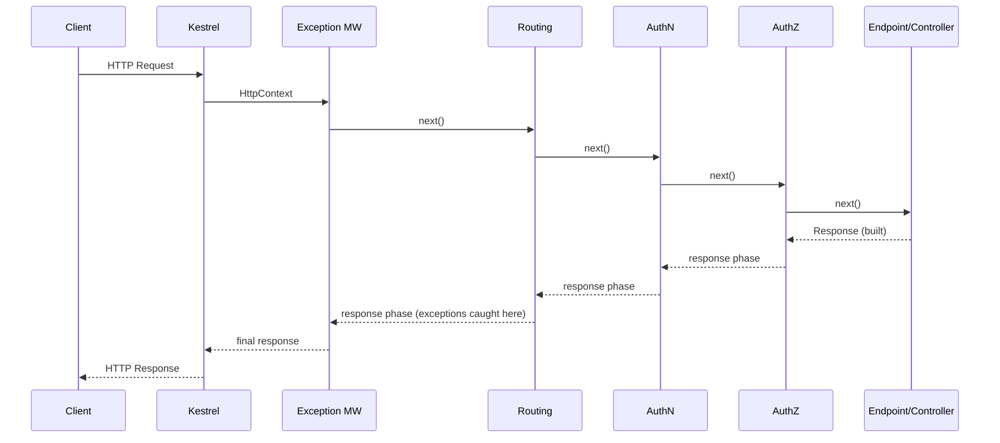
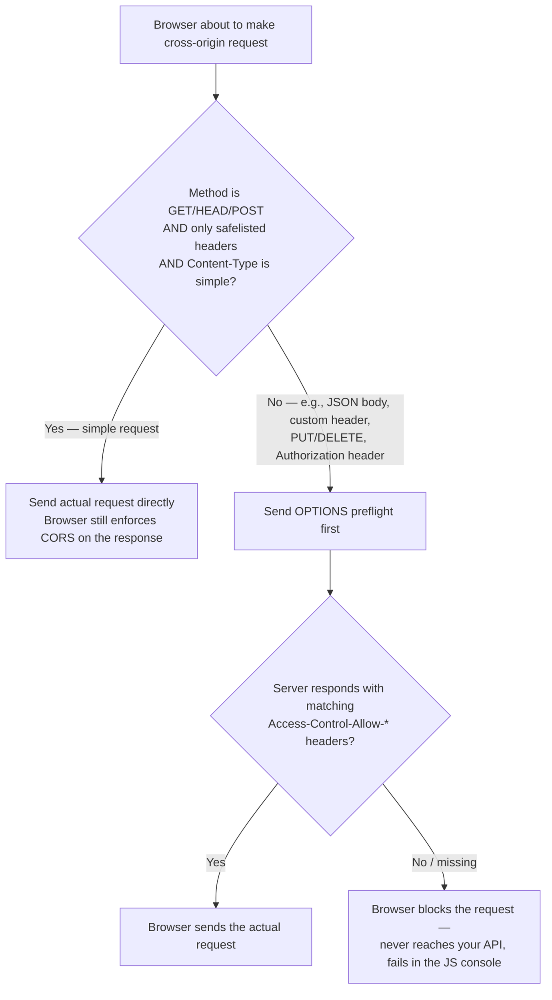
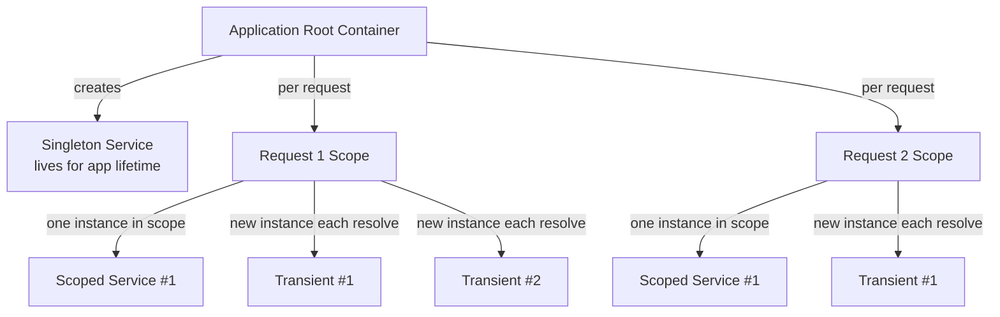
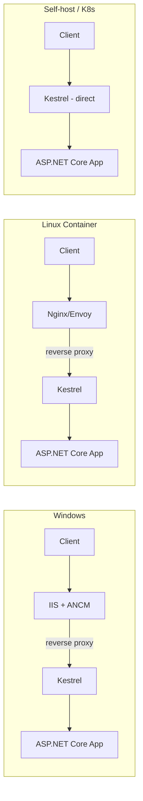

# ASP.NET Core — Interview Revision Notes

> Quick-revision Q&A derived from `F. ASP.NET-Core-Interview-Guide.md`. Covers every section of the source.

## Core Concepts

### .NET Core vs ASP.NET Core, and vs .NET Framework

**Q: What is the relationship between .NET Core and ASP.NET Core?**

A: .NET Core is the cross-platform, modular runtime (CoreCLR). ASP.NET Core is the web framework built on top of it (Web API, MVC, Razor Pages, Blazor, gRPC, SignalR).

**Q: Name the key advantages of ASP.NET Core over legacy ASP.NET (.NET Framework).**

A:
- Cross-platform, container-native.
- Unified MVC/Web API pipeline (no separate `System.Web.Http`/`System.Web.Mvc`).
- Kestrel + async-first I/O, lighter middleware pipeline than `HttpModule`/`HttpHandler`.
- Built-in DI container.
- Self-contained deployment, side-by-side runtime versioning.

**Q: When is .NET Framework still legitimately used?**

A: When enterprises run legacy WebForms/WCF apps too costly to port — a business constraint, not a technical advantage.

**Q: Outline a senior-level Framework → Core migration path.**

A:
1. Inventory dependencies (NuGet, `System.Web`, WCF, WebForms) using Upgrade Assistant/API Analyzer.
2. Port shared logic to .NET Standard/multi-targeted libraries.
3. Replace HttpModules/Handlers with middleware.
4. Replace WCF with gRPC/REST; move `Web.config` to `appsettings.json` + Options pattern.
5. Re-wire DI (decide fate of Autofac/Ninject).
6. Deploy incrementally behind feature flags; consider the **strangler fig pattern** for large monoliths.

### Project Structure & Hosting Model Evolution

**Q: What changed between the pre-.NET 6 hosting model and the .NET 6+ minimal hosting model?**

A: Pre-6: `Startup.ConfigureServices` (DI) and `Startup.Configure` (middleware) as separate methods invoked by a generic host. .NET 6+: `Startup` folds into `Program.cs` via top-level statements — `WebApplicationBuilder` → register services → `Build()` → configure pipeline on `app` → `app.Run()`.

```csharp
var builder = WebApplication.CreateBuilder(args);

builder.Services.AddControllers();
builder.Services.AddScoped<IOrderService, OrderService>();

var app = builder.Build();

if (app.Environment.IsDevelopment())
    app.UseDeveloperExceptionPage();

app.UseHttpsRedirection();
app.UseAuthentication();
app.UseAuthorization();
app.MapControllers();

app.Run();
```

**Q: Is the minimal hosting model just syntax sugar?**

A: Mostly yes — `WebApplicationBuilder` still wraps the generic `Host` builder, and `WebApplication` implements `IApplicationBuilder`, `IEndpointRouteBuilder`, and `IHost`. DI, hosting abstractions, and the middleware pipeline are unchanged; only the mandatory `Startup` class ceremony is gone.

### Program.cs / Startup.cs / Minimal Hosting Model

**Q: What's the responsibility split between `ConfigureServices`/`builder.Services` and `Configure`/`app.Use...()`?**

A: `ConfigureServices`/`builder.Services.Add...()` → DI registration only, no middleware. `Configure`/`app.Use...()` → middleware pipeline wiring only, executed in registration order. Mixing concerns (e.g., resolving services eagerly inside `Configure`) is a common junior mistake.

### Environments & Configuration Basics

**Q: What are the built-in ASP.NET Core environments and how are they selected?**

A: `Development`, `Staging`, `Production`, selected via the `ASPNETCORE_ENVIRONMENT` variable.

```csharp
if (app.Environment.IsDevelopment()) { app.UseDeveloperExceptionPage(); }
```

**Q: What is the configuration provider precedence order (later overrides earlier)?**

A:
1. `appsettings.json`
2. `appsettings.{Environment}.json`
3. User Secrets (Development only)
4. Environment variables
5. Command-line arguments

Env vars outrank JSON files because container orchestrators (Kubernetes/ECS) inject config via env vars, letting ops override without rebuilding images.

**Q: What's the idiomatic way to consume configuration?**

A: The Options pattern (`IOptions`/`IOptionsSnapshot`/`IOptionsMonitor`) rather than raw `IConfiguration` injection.

### Static Files & Default Files

**Q: What do `UseDefaultFiles()` and `UseStaticFiles()` each do, and what order must they run in?**

A: `UseDefaultFiles()` rewrites the request URL to a default document (e.g., `index.html`) but does **not** serve the file itself; it must run before `UseStaticFiles()`, which actually serves it. `UseFileServer()` combines both plus directory browsing.

```csharp
app.UseDefaultFiles();   // must run BEFORE UseStaticFiles
app.UseStaticFiles();
```

Customizing default file names:

```csharp
var options = new DefaultFilesOptions();
options.DefaultFileNames.Clear();
options.DefaultFileNames.Add("home.html");
app.UseDefaultFiles(options);
```

**Q: How do you serve static files from a non-`wwwroot` folder?**

A: Pass a `StaticFileOptions` with a custom `FileProvider` (e.g., `PhysicalFileProvider`) and `RequestPath` to `UseStaticFiles()`.

```csharp
app.UseStaticFiles(new StaticFileOptions
{
    FileProvider = new PhysicalFileProvider(
        Path.Combine(Directory.GetCurrentDirectory(), "MyStatic")),
    RequestPath = "/mystatic"
});
```

### Logging Providers & Configuration

**Q: Why is `ILogger<T>` injected per-class rather than a single shared logger?**

A: The generic type parameter tags log entries with the category name (the fully-qualified type name), enabling per-namespace log-level filtering and easy source attribution.

```csharp
public class OrdersController : ControllerBase
{
    private readonly ILogger<OrdersController> _logger;
    public OrdersController(ILogger<OrdersController> logger) => _logger = logger;

    [HttpGet("{id}")]
    public IActionResult Get(int id)
    {
        _logger.LogInformation("Fetching order {OrderId}", id);
        // ...
    }
}
```

**Q: Name the built-in logging providers.**

A: Console, Debug, EventSource (ETW-style, `dotnet-trace`/PerfView), EventLog (Windows-only), Azure App Insights, plus third-party adapters (Serilog, NLog).

**Q: How does hierarchical log-level filtering by category work?**

A: A more specific category (e.g., `Microsoft.AspNetCore`) overrides `Default` for everything under that namespace — noisy framework namespaces get pinned to `Warning` while the app's own namespace stays at `Information`/`Debug`.

```json
{
  "Logging": {
    "LogLevel": {
      "Default": "Information",
      "Microsoft": "Warning",
      "Microsoft.Hosting.Lifetime": "Information"
    }
  }
}
```

**Q: Why does structured/semantic logging (`LogInformation("Fetching order {OrderId}", id)`) matter over string interpolation?**

A: Named placeholders preserve queryable structured fields for sinks like Serilog/App Insights; `$"Fetching order {id}"` collapses that into an opaque string, losing the ability to filter/aggregate by field.

### .NET Application Types, Code Sharing & Multi-Targeting

**Q: What .NET application types share the same DI/logging/config building blocks?**

A: Console apps, class libraries, web apps (MVC/Razor Pages/Web API), worker services (`dotnet new worker`), background services (`IHostedService`/`BackgroundService`), and ASP.NET Core hosted services (background work sharing the web app's own DI/lifetime).

**Q: What are the code-sharing mechanisms between projects, roughly by "packaging" level?**

A: Project reference (same solution) → class library (general-purpose sharing unit) → shared project (legacy, source compiled per-consumer, mostly superseded) → NuGet package (cross-repo/cross-team, independently versioned).

**Q: When should you multi-target a project, and what's the cost?**

A: Use it for NuGet libraries supporting multiple LTS releases, cross-SDK tooling, or bridging a migration window. Cost: `#if NET8_0_OR_GREATER`-style conditional compilation adds maintenance burden — reserve multi-targeting for reusable libraries, not application projects.

```xml
<PropertyGroup>
  <TargetFrameworks>net6.0;net8.0</TargetFrameworks>
</PropertyGroup>
```

---

## Middleware Pipeline (Deep Dive)

### What Middleware Really Is

**Q: Why is middleware described as "nested," not linear, at runtime?**

A: Middleware is a chain of `RequestDelegate`s executed sequentially at *registration* time but nested at runtime (each wraps everything after it) — this explains why registration order matters, why code placement relative to `await next()` matters (before = request phase, after = response phase), and why responses flow backward through the same chain.

```
Middleware A
 └── Middleware B
      └── Middleware C
           └── Endpoint
```

### Request/Response Flow

**Q: Walk through the request/response flow through the middleware pipeline.**

A:
- Request: Kestrel creates `HttpContext` → pipeline runs in registration order → each middleware's "before" logic runs, then calls `next()` → endpoint executes.
- Response: endpoint produces response → execution unwinds back through the same stack in reverse → each middleware's "after `next()`" code runs → final response sent.



**Q: Why must exception-handling middleware sit outermost?**

A: Conceptually, each middleware executes twice per request (in and out); a middleware can only catch exceptions from things registered after it, so exception handling must be first/outermost to protect everything downstream.

### Built-in Middleware Deep Dive

**Q: What does the Exception Handling middleware do, and what's the .NET 8+ alternative to the `/error` redirect pattern?**

A: It catches unhandled exceptions from downstream middleware and converts them to HTTP responses; must be registered first. .NET 8 introduced `IExceptionHandler` — a DI-friendly, testable interface (`TryHandleAsync`) registered via `AddExceptionHandler<T>()` + `AddProblemDetails()` + `app.UseExceptionHandler()`.

```csharp
if (app.Environment.IsDevelopment())
    app.UseDeveloperExceptionPage();
else
    app.UseExceptionHandler("/error");   // or the IExceptionHandler-based approach, .NET 8+
```

```csharp
public class GlobalExceptionHandler : IExceptionHandler
{
    public async ValueTask<bool> TryHandleAsync(HttpContext httpContext, Exception exception, CancellationToken ct)
    {
        httpContext.Response.StatusCode = StatusCodes.Status500InternalServerError;
        await httpContext.Response.WriteAsJsonAsync(new { error = "An unexpected error occurred." }, ct);
        return true; // true = handled, short-circuits further processing
    }
}

// Program.cs
builder.Services.AddExceptionHandler<GlobalExceptionHandler>();
builder.Services.AddProblemDetails();
app.UseExceptionHandler();
```

**Q: What does Routing middleware actually do, and what doesn't it do?**

A: It matches the URL to an endpoint's metadata and builds route data — it does **not** execute the endpoint. Downstream middleware (e.g., Authorization) depends on that metadata.

**Q: Does Authentication middleware block unauthenticated requests?**

A: No — it only identifies the caller (builds `ClaimsPrincipal`, sets `HttpContext.User`). Anonymous requests still pass through; Authorization decides if identity is sufficient.

**Q: What does Authorization middleware depend on, and why?**

A: It requires Routing (endpoint metadata/`[Authorize]`) and Authentication (user identity) to have already run — `UseAuthorization()` without a preceding `UseRouting()` either throws or does nothing useful.

### Custom Middleware

**Q: What are the two ways to register custom middleware, and when do you use each?**

A: Inline lambda via `app.Use(async (context, next) => ...)` for simple, one-off logic; class-based (`IMiddleware`/constructor + `InvokeAsync`) registered via `app.UseMiddleware<T>()` for reusable, testable, DI-friendly logic.

```csharp
// 1. Inline (lambda) middleware — good for simple, one-off logic
app.Use(async (context, next) =>
{
    context.Items["CorrelationId"] = Guid.NewGuid().ToString();
    await next();
});

// 2. Class-based middleware — good for reusable, testable, DI-friendly logic
public class CorrelationIdMiddleware
{
    private readonly RequestDelegate _next;
    public CorrelationIdMiddleware(RequestDelegate next) => _next = next;

    public async Task InvokeAsync(HttpContext context)
    {
        context.Items["CorrelationId"] = Guid.NewGuid().ToString();
        await _next(context);
    }
}
// Registration:
app.UseMiddleware<CorrelationIdMiddleware>();
```

**Q: What's the DI lifetime nuance for class-based middleware?**

A: The middleware class is constructed once per pipeline build (singleton-like), so constructor dependencies must be singleton-safe; `InvokeAsync` can still accept scoped services as method parameters, injected per-request via method injection.

**Q: What belongs in middleware vs services?**

A: Good: logging, correlation IDs, tenant resolution, header validation, rate limiting, security headers. Bad: business logic, direct DB access, domain workflows, heavy computation.

### Use vs Run vs Map vs MapWhen

**Q: Differentiate `app.Use`, `app.Run`, `app.Map`, and `app.MapWhen`.**

A:
- `Use` — continues the pipeline, supports before/after via `next()`.
- `Run` — terminal, no `next()` parameter at all.
- `Map(pattern, ...)` — branches by URL path prefix into an isolated sub-pipeline.
- `MapWhen(predicate, ...)` — branches by an arbitrary predicate over `HttpContext`.

Branches created by `Map`/`MapWhen` do not automatically rejoin the main pipeline.

### Short-Circuiting

**Q: What is short-circuiting, and is it a bug?**

A: Middleware writes a response and deliberately skips calling `next()`, stopping the pipeline. It's intentional design (auth failures, rate limiting, feature toggles, maintenance mode) — though an accidental short-circuit upstream is a classic "why didn't my middleware run" bug.

```csharp
if (!authorized)
{
    context.Response.StatusCode = 401;
    return;   // pipeline stops here — downstream middleware and the endpoint never run
}
```

### Correct Middleware Ordering

**Q: State the correct order for exception handling, HTTPS redirection, static files, routing, CORS, authN, authZ, compression, and endpoint mapping — and why.**

A:
1. Exception handler — wraps everything, must be outermost.
2. HTTPS redirection, static files.
3. Routing — identifies the endpoint + metadata.
4. CORS — after routing (needs endpoint-specific policy), before authN/authZ (preflight carries no auth).
5. Authentication — identifies the user.
6. Authorization — enforces access using routing metadata + identity.
7. Response compression.
8. `MapControllers()`/endpoint execution — business logic.

```csharp
app.UseExceptionHandler("/error");   // 1. Wraps everything — must be outermost
app.UseHttpsRedirection();
app.UseStaticFiles();
app.UseRouting();                    // 2. Identifies the endpoint
app.UseCors();                       // 3. Must be after Routing, before AuthN/AuthZ
app.UseAuthentication();             // 4. Identifies the user
app.UseAuthorization();              // 5. Enforces access, needs routing + authn
app.UseResponseCompression();
app.MapControllers();                // 6. Executes business logic
app.Run();
```

### Endpoint Routing Internals

**Q: What did Endpoint Routing (ASP.NET Core 3.0+) decouple, and why does it matter?**

A: It decoupled route *matching* from route *execution*: `UseRouting()` matches the request to an `Endpoint` (stored via `HttpContext.GetEndpoint()`); `UseEndpoints()`/`MapControllers()`/`MapGet()` execute it. This split lets middleware between routing and execution (e.g., `UseAuthorization()`) inspect endpoint metadata (`[Authorize]`, CORS policy names, rate-limiter policy names) via `context.GetEndpoint()?.Metadata`.

**Q: How does Endpoint Routing unify MVC, Minimal APIs, gRPC, SignalR, and Blazor?**

A: They all register `Endpoint`s into the same `EndpointDataSource`, so one routing/authorization/CORS pipeline governs all of them, instead of each framework having its own routing stack (as pre-3.0, where MVC routing lived only inside MVC middleware).

**Q: What kind of route matcher does Endpoint Routing use, and what's the gotcha of skipping `UseRouting()`?**

A: A tree-based (DFA-like) matcher, which scales better than the old linear `IRouter` scan. If `MapControllers()`/`MapGet()` are called without a preceding `UseRouting()`, upstream middleware lacks routing metadata, causing inconsistent 404s or bypassed authorization.

### Middleware vs Filters

**Q: Compare middleware and MVC filters.**

A: Middleware runs for every request, has no MVC-specific context, and can short-circuit the whole pipeline. Filters run only for MVC/endpoint-bound requests, have access to `ActionExecutingContext`/action arguments/results/exceptions, and can only short-circuit within the MVC action pipeline.

**Q: List the filter types in execution order.**

A: Authorization filters → Resource filters → Action filters → Exception filters → Result filters (each with an executing/executed pair). E.g., a global model-validation short-circuit belongs in a resource/action filter, not middleware, because it needs the bound model.

### IStartupFilter — Composing the Middleware Pipeline from a Library

**Q: How does a reusable library inject its own middleware into a consuming app's pipeline at a specific position without the app editing `Program.cs`?**

A: Implement `IStartupFilter.Configure(Action<IApplicationBuilder> next)`, returning a delegate that calls `app.UseMiddleware<T>()` before or after invoking `next(app)`, then register it via `services.AddTransient<IStartupFilter, MyFilter>()` inside the library's own `AddXyzModule()` extension method.

```csharp
public class CorrelationIdStartupFilter : IStartupFilter
{
    public Action<IApplicationBuilder> Configure(Action<IApplicationBuilder> next)
    {
        return app =>
        {
            // Runs BEFORE the app's own Configure/pipeline — i.e., outermost,
            // wrapping everything the consuming app registers.
            app.UseMiddleware<CorrelationIdMiddleware>();

            next(app);   // hands control to the next filter, then eventually the app's own pipeline
        };
    }
}

// Library's registration extension method — this is all a consumer has to call:
public static IServiceCollection AddCorrelationIdModule(this IServiceCollection services)
{
    services.AddTransient<IStartupFilter, CorrelationIdStartupFilter>();
    return services;
}
```

**Q: How does ASP.NET Core compose multiple `IStartupFilter`s, and how does call order relative to `next(app)` affect final middleware position?**

A: All registered `IStartupFilter`s are resolved and composed like nested decorators around the app's own `Configure` pipeline. Calling `app.Use...()` **before** `next(app)` places that middleware **earlier/more outer**; calling it **after** `next(app)` places it **later/more inner**, closer to the endpoint.

**Q: What's the trade-off of using `IStartupFilter`?**

A: It removes the footgun of consumers forgetting/mis-ordering a middleware call, and hides pipeline wiring as an implementation detail — but because it's invisible in `Program.cs`, it makes the effective pipeline order harder to reason about. Use it for genuinely reusable cross-app modules, not to avoid an explicit call in your own single app.

### CORS Preflight Mechanics — What Actually Triggers an OPTIONS Request

**Q: Under what conditions is a cross-origin request a "simple request" that skips preflight?**

A: All of: method is `GET`/`HEAD`/`POST` only; only CORS-safelisted headers (`Accept`, `Accept-Language`, `Content-Language`, restricted `Content-Type`); `Content-Type` is one of `application/x-www-form-urlencoded`, `multipart/form-data`, `text/plain` (`application/json` is **not** simple); no `ReadableStream`/upload progress listeners. Any violation forces a preflight `OPTIONS` request.



**Q: Why does almost every modern browser-originated API call get preflighted?**

A: Because virtually all real API traffic uses `Content-Type: application/json` and/or an `Authorization` header, both of which disqualify the "simple request" path — this is normal, not a misconfiguration.

**Q: Why must CORS middleware sit after `UseRouting()` but before `UseAuthentication()`/`UseAuthorization()`?**

A: The preflight `OPTIONS` request carries no `Authorization` header/credentials by spec, so CORS middleware must answer it (short-circuited with `204`) before auth middleware would otherwise reject it as unauthenticated.

**Q: How can preflight round trips be reduced, and does CORS apply to server-to-server calls?**

A: `Access-Control-Max-Age` lets the browser cache the preflight response, avoiding a duplicate round trip per request. CORS/preflight is a browser-enforced mechanism only — curl, Postman, and other backend services never send preflight and are unaffected.

---

## Dependency Injection

**Q: What DI container ships built into ASP.NET Core, and when would you plug in a third-party one?**

A: `IServiceCollection`/`IServiceProvider` — minimal but complete. Third-party containers (Autofac, Lamar) via `IServiceProviderFactory<T>` add property injection, decorators, or assembly-scanning conventions (Scrutor adds scanning to the built-in container for most needs).

```csharp
builder.Services.AddSingleton<ICacheService, MemoryCacheService>();
builder.Services.AddScoped<IOrderRepository, OrderRepository>();
builder.Services.AddTransient<IEmailSender, SmtpEmailSender>();
```

Constructor injection is the default and preferred mechanism:

```csharp
public class OrdersController : ControllerBase
{
    private readonly IOrderRepository _repo;
    public OrdersController(IOrderRepository repo) => _repo = repo;
}
```

### Service Lifetimes

**Q: Describe the three DI lifetimes and typical use cases.**

A:
- Transient — new instance every resolution; lightweight stateless services.
- Scoped — one instance per HTTP request/DI scope; `DbContext`, unit-of-work.
- Singleton — one instance for app lifetime; configuration objects, in-memory caches.



### Captive Dependencies & Lifetime Mismatch Bugs

**Q: What is a captive dependency?**

A: Injecting a shorter-lived service into a longer-lived one, so the shorter-lived instance gets captured and lives longer than intended — classic example: a Singleton constructor-injecting a Scoped `DbContext`, which then lives forever and is used concurrently (unsafe, since `DbContext` isn't thread-safe).

```csharp
// BAD: Singleton captures a Scoped DbContext
public class BadCacheWarmer   // registered as Singleton
{
    private readonly AppDbContext _db;   // Scoped — captured at construction time!
    public BadCacheWarmer(AppDbContext db) => _db = db;
    // _db now lives forever, using the connection/state from whichever
    // request scope happened to construct this singleton first. Later requests
    // see stale/disposed state, and concurrent use of a captured DbContext
    // (which is NOT thread-safe) causes intermittent, hard-to-reproduce exceptions.
}
```

**Q: How does the container guard against this, and what's the Dev/Prod gotcha?**

A: With `ValidateScopes = true` (default in Development via `CreateBuilder`), the container throws at startup: `Cannot consume scoped service ... from singleton`. This validation is **off by default in Production** for performance, so the bug can silently ship unless you explicitly enable it for all environments.

**Q: How do you fix a captive dependency?**

A: Inject `IServiceScopeFactory` into the singleton and create a scope per operation, or use EF Core's `IDbContextFactory<T>` instead of injecting `DbContext` directly into long-lived services.

```csharp
public class CacheWarmer
{
    private readonly IServiceScopeFactory _scopeFactory;
    public CacheWarmer(IServiceScopeFactory scopeFactory) => _scopeFactory = scopeFactory;

    public async Task WarmAsync()
    {
        using var scope = _scopeFactory.CreateScope();
        var db = scope.ServiceProvider.GetRequiredService<AppDbContext>();
        // use db, then let the scope dispose it
    }
}
```

**Q: Is the inverse (Scoped/Transient injecting a Singleton) a problem?**

A: No — safe and common (e.g., `IMemoryCache`/`IConfiguration` into a scoped repository) since the singleton simply outlives the consumer. `IHttpContextAccessor` is itself a singleton that safely exposes per-request `HttpContext` via `AsyncLocal<T>`.

### IOptions vs IOptionsSnapshot vs IOptionsMonitor

**Q: Compare `IOptions<T>`, `IOptionsSnapshot<T>`, and `IOptionsMonitor<T>`.**

A:
- `IOptions<T>` — Singleton, computed once, never reloads. Config that never changes at runtime.
- `IOptionsSnapshot<T>` — Scoped, recomputed once per scope/request. Per-request-fresh config in Scoped/Transient services.
- `IOptionsMonitor<T>` — Singleton, actively watches for changes with `OnChange` callback + `.CurrentValue`. Long-lived singletons/background services needing live updates.

```csharp
public class SmtpOptions
{
    public string Host { get; set; } = string.Empty;
    public int Port { get; set; }
}

builder.Services.Configure<SmtpOptions>(builder.Configuration.GetSection("Smtp"));
```

**Q: Why can't you inject `IOptionsSnapshot<T>` into a Singleton?**

A: It's registered Scoped — a Singleton capturing it is the captive-dependency problem; the container throws at startup with scope validation enabled. Use `IOptionsMonitor` instead.

```csharp
public class EmailSender
{
    private readonly IOptionsMonitor<SmtpOptions> _options;
    public EmailSender(IOptionsMonitor<SmtpOptions> options)
    {
        _options = options;
        _options.OnChange(updated => Console.WriteLine($"SMTP host changed to {updated.Host}"));
    }
    public SmtpOptions Current => _options.CurrentValue;
}
```

**Q: What are named options used for?**

A: `Configure<T>(name, ...)` + `IOptionsSnapshot<T>.Get(name)` — useful for multi-tenant or multi-provider scenarios (e.g., multiple payment gateway configs).

### Detecting & Fixing Cyclic Dependencies

**Q: How does ASP.NET Core detect circular constructor dependencies, and how do you fix them?**

A: The container throws `InvalidOperationException: A circular dependency was detected...` at resolution time. Fixes: introduce an interface one side depends on instead of the concrete class; use a factory (`Func<T>` or dedicated factory) to defer resolution; or reduce coupling by merging the two services or extracting a shared collaborator.

```
System.InvalidOperationException: A circular dependency was detected for the service of type 'X'.
```

---

## Minimal APIs, MVC & API Design

### Minimal APIs vs Controller-based MVC — Full Comparison

**Q: Compare Minimal APIs and controller-based MVC across boilerplate, AOT, filters, validation, and views.**

A:

| Aspect | Minimal APIs | MVC |
|---|---|---|
| Boilerplate | None required | `ControllerBase` + attributes |
| AOT/startup | Faster, first-class Native AOT | Heavier reflection-based binding |
| Filters | `IEndpointFilter` (.NET 7+) | Full filter pipeline |
| Validation | Manual/endpoint filters, no auto-400 | Automatic via `[ApiController]` |
| Views | Not applicable | Full Razor support |

```csharp
// Minimal API
var app = builder.Build();
app.MapGet("/orders/{id:int}", async (int id, IOrderService svc) =>
{
    var order = await svc.GetAsync(id);
    return order is not null ? Results.Ok(order) : Results.NotFound();
})
.WithName("GetOrder")
.Produces<OrderDto>(200)
.Produces(404);
```

```csharp
// Controller-based MVC
[ApiController]
[Route("orders")]
public class OrdersController : ControllerBase
{
    private readonly IOrderService _svc;
    public OrdersController(IOrderService svc) => _svc = svc;

    [HttpGet("{id:int}")]
    [ProducesResponseType(typeof(OrderDto), 200)]
    [ProducesResponseType(404)]
    public async Task<IActionResult> Get(int id)
    {
        var order = await _svc.GetAsync(id);
        return order is not null ? Ok(order) : NotFound();
    }
}
```

**Q: Are Minimal APIs and MVC mutually exclusive in one app?**

A: No — `MapControllers()` and `MapGet()`/route groups can coexist. The decision driver is team convention and whether you need filters/views, not raw performance; the perf gap is mostly at cold-start/AOT, not steady-state throughput.

### REST API vs MVC App

**Q: How does a Web API/Minimal API app differ from an MVC web app?**

A: MVC apps render Razor Views (HTML), commonly use conventional routing; Web APIs return JSON/XML via attribute or minimal-API route mapping, and typically act as the backend for a SPA.

### Angular/React SPA Integration

**Q: What are the two hosting models for pairing an ASP.NET Core backend with an Angular/React SPA?**

A: Separate deployments (SPA on its own static host/CDN, calling the API cross-origin via CORS — the modern default) vs merged/hosted project (SPA build output served from the app's own `wwwroot` via `UseSpa`/`UseSpaStaticFiles` — historical template approach, now largely out of favor).

**Q: What must be configured for the merged-hosting model, and where does CORS fit?**

A: `UseSpa(spa => spa.UseAngularCliServer(...))` in dev (proxies to the CLI dev server), `UseSpaStaticFiles()` in production. CORS is required whenever SPA and API are on different origins, positioned after `UseRouting()` and before AuthN/AuthZ.

```csharp
if (app.Environment.IsDevelopment())
{
    app.UseSpa(spa =>
    {
        spa.Options.SourcePath = "ClientApp";
        spa.UseAngularCliServer(npmScript: "start");   // proxies to the Angular CLI dev server
        // Equivalent for React/CRA: spa.UseReactDevelopmentServer(npmScript: "start");
    });
}
else
{
    app.UseSpaStaticFiles();   // serves the pre-built SPA output from wwwroot in production
}
```

### API Versioning Strategies

**Q: Name the four API versioning strategies and their trade-offs.**

A:
- URL versioning (`/api/v1/orders`) — explicit, cache-friendly, but pollutes the URL.
- Query string (`?api-version=1.0`) — easy default, easy to omit.
- Header (`X-Api-Version`) — clean URLs, harder to test/debug.
- Media type/Accept header (`Accept: application/json;v=1.0`) — most "correct" per HTTP semantics, least discoverable.

```csharp
builder.Services.AddApiVersioning(options =>
{
    options.DefaultApiVersion = new ApiVersion(1, 0);
    options.AssumeDefaultVersionWhenUnspecified = true;
    options.ReportApiVersions = true;
}).AddApiExplorer(options =>
{
    options.GroupNameFormat = "'v'VVV";
});
```

**Q: What's the breaking-change discipline for versioned APIs?**

A: Never mutate an existing contract; add a new version, support both for a documented deprecation window, and communicate via `ReportApiVersions`/`Deprecated` metadata and changelogs — never silent removal.

### DTOs, Validation & FluentValidation

**Q: Why never return EF entities directly from an API?**

A: Prevents over-posting/mass-assignment vulnerabilities, decouples the wire contract from the persistence model, hides internal/navigation structure (avoids lazy-loading serialization loops), and allows payload shaping/computed fields.

**Q: How is FluentValidation wired into MVC vs Minimal APIs?**

A: MVC: `AddFluentValidationAutoValidation()` hooks into the MVC filter pipeline for `[ApiController]` controllers, auto-triggering a 400 on failure. Minimal APIs: no automatic equivalent — you must invoke the validator explicitly in the handler or via a custom `IEndpointFilter`.

```csharp
public class UserDto
{
    public string Name { get; set; } = string.Empty;
    public string Email { get; set; } = string.Empty;
    public int Age { get; set; }
}

public class UserValidator : AbstractValidator<UserDto>
{
    public UserValidator()
    {
        RuleFor(x => x.Name).NotEmpty().MinimumLength(3);
        RuleFor(x => x.Email).NotEmpty().EmailAddress();
        RuleFor(x => x.Age).InclusiveBetween(18, 60)
            .WithMessage("User must be an adult, and under 60.");
    }
}
```

```csharp
// dotnet add package FluentValidation.AspNetCore
builder.Services.AddControllers();
builder.Services.AddFluentValidationAutoValidation();
builder.Services.AddValidatorsFromAssemblyContaining<UserValidator>();
```

```csharp
[ApiController]
[Route("api/users")]
public class UsersController : ControllerBase
{
    [HttpPost]
    public IActionResult Create(UserDto user) => Ok(user);   // auto-validated; invalid input -> 400
}
```

Example failure response shape (from `[ApiController]`'s automatic `ValidationProblemDetails`):

```json
{
  "errors": {
    "Name": ["'Name' must not be empty."],
    "Email": ["'Email' is not a valid email address."],
    "Age": ["'Age' must be between 18 and 60."]
  }
}
```

Custom rules:

```csharp
RuleFor(x => x.Age).Must(age => age >= 18).WithMessage("User must be an adult");
```

**Q: Distinguish application/DTO validation from domain validation.**

A: DTO validation checks shape/format of incoming data (valid email, age in range). Domain validation protects entity invariants inside the domain model (e.g., an `Order` can't go from `Cancelled` to `Shipped`). Passing DTO validation doesn't mean the domain operation is valid.

### CQRS, Mediator Pattern & MediatR

**Q: What does CQRS separate, and what are the benefits?**

A: Commands (writes, state-changing) from queries (reads, side-effect-free). Benefits: independent read/write optimization, smaller single-responsibility handlers, and (with MediatR) generic pipeline behaviors (logging/validation/transactions wrapped around every handler).

```csharp
public record GetOrderQuery(int Id) : IRequest<OrderDto>;

public class GetOrderQueryHandler : IRequestHandler<GetOrderQuery, OrderDto>
{
    private readonly IOrderRepository _repo;
    public GetOrderQueryHandler(IOrderRepository repo) => _repo = repo;
    public async Task<OrderDto> Handle(GetOrderQuery request, CancellationToken ct)
        => (await _repo.GetAsync(request.Id, ct)).ToDto();
}
```

**Q: When should you reach for Mediator/CQRS, and what's the trade-off?**

A: When controllers are getting fat with complex business rules, or you want generic cross-cutting pipeline behaviors. Trade-off: adds indirection — over-engineering for CRUD-simple services.

### DDD in ASP.NET Core

**Q: Name the core DDD building blocks.**

A: Entities (identity-based equality), Value Objects (immutable, structural equality), Aggregates/Aggregate Roots (consistency boundary — all writes through the root), Domain Events, Repositories (per-aggregate persistence abstraction), Bounded Contexts (explicit model boundaries, often mapped to microservices).

### Clean Architecture / Folder Structure at Scale

**Q: Describe the typical Clean Architecture layer structure and dependency rule.**

A: `Api` (controllers/composition root) → `Application` (CQRS handlers, validators, DTOs) → `Domain` (entities, value objects, domain interfaces) → `Infrastructure` (EF Core, external clients, repositories). Dependency rule: dependencies point inward — `Domain` has zero outward dependencies; `Infrastructure` implements interfaces owned by `Domain`/`Application` (Dependency Inversion).

```
src/
  Api/              -> Controllers/Minimal API endpoints, DI wiring, composition root
  Application/      -> CQRS handlers, validators, DTOs, use-case orchestration
  Domain/            -> Entities, Value Objects, domain interfaces, domain events
  Infrastructure/    -> EF Core, external service clients, messaging, repositories
tests/
  UnitTests/
  IntegrationTests/
```

### Multi-Tenant Applications

**Q: How and where should tenant resolution happen?**

A: Via header, subdomain, or token claims — in dedicated middleware, early, **before authentication** (since auth may need a tenant-specific issuer/authority).

**Q: How is tenant context propagated and used in data access?**

A: Stored in a scoped `ITenantContext` populated by that middleware, consumed by data access to scope queries — e.g., an EF Core global query filter `HasQueryFilter(x => x.TenantId == _tenantContext.TenantId)`, plus per-tenant configuration/caching (named `IOptionsSnapshot`, tenant-keyed cache entries).

### API Anti-Patterns

**Q: List common API anti-patterns.**

A:
- Fat controllers with business logic.
- Returning EF entities directly.
- No versioning strategy from day one.
- Excessive DTOs for trivial pass-through data.
- No pagination on collection endpoints.
- Ignoring idempotency on POST/PUT under retry-heavy clients.

### Plugin Architecture (Dynamic Assembly Loading)

**Q: How does a reflection-based plugin architecture discover and load plugins?**

A: Scan a plugins folder for DLLs, load each assembly, reflect for types implementing a shared `IPlugin` interface, then instantiate via `Activator.CreateInstance` or DI.

```csharp
public interface IPlugin
{
    string Name { get; }
    void Execute(IServiceProvider services);
}
```

**Q: What replaced `AppDomain`-based isolation for plugin loading, and what does it enable?**

A: `AssemblyLoadContext` — loads plugin assemblies into an isolated context so they can be loaded (and in principle unloaded) without polluting/version-conflicting with the host's own assemblies.

**Q: What does Scrutor add, and why is a plugin architecture incompatible with Native AOT?**

A: Scrutor adds assembly-scanning DI registration conventions (`services.Scan(...)`) to auto-register discovered plugins. AOT is incompatible because dynamic assembly loading depends on runtime reflection and assemblies unknown at compile time.

```csharp
services.Scan(scan => scan
    .FromAssemblies(pluginAssemblies)
    .AddClasses(c => c.AssignableTo<IPlugin>())
    .AsImplementedInterfaces()
    .WithScopedLifetime());
```


### WebHooks (Outbound Event Callbacks)

**Q: What is a WebHook, and what does a production-grade sender need?**

A: The inverse of polling — your server proactively `POST`s to a client-registered callback URL on an event. Needs: signed payloads (HMAC-SHA256 + secret, sent in a header), retry with exponential backoff + persisted delivery attempts (outbox-style), timestamp validation (defends against replay), and delivery logging/observability.

**Q: How do WebHooks differ from a message broker?**

A: WebHooks target external, third-party consumers over plain HTTP with no shared infrastructure; a broker (Kafka/RabbitMQ/SQS) targets internal services that share infrastructure.

---

## Hosting & Infrastructure

### Kestrel, IIS, HTTP.sys & Reverse Proxy Models

**Q: Compare Kestrel, IIS, HTTP.sys, and self-hosting/containers.**

A:
- Kestrel — default cross-platform server; reverse-proxy-in-production is now more defense-in-depth/TLS-convenience than a hard limitation.
- IIS — Windows-only, proxies to Kestrel via ANCM, or in-process hosting inside the IIS worker process (in-process is the default for IIS-hosted apps).
- HTTP.sys — Windows-only kernel-mode self-hosting alternative to Kestrel (not a proxy in front of it) — used for native Windows Auth or kernel-level port sharing.
- Self-host/containers — `dotnet run`/container `ENTRYPOINT` running Kestrel directly; standard for Linux/K8s.

**Q: Distinguish in-process vs out-of-process IIS hosting.**

A: In-process — app runs inside the IIS worker process (`w3wp.exe`), no loopback hop, faster, default today. Out-of-process — IIS proxies to a separate Kestrel process, more overhead but process isolation from IIS.



### Native AOT Compilation

**Q: What is Native AOT and why does it matter for ASP.NET Core?**

A: Compiles the app directly to native machine code ahead of time (no JIT), producing a self-contained executable with no .NET runtime dependency. Dramatically faster cold start and lower memory — key for serverless, scale-to-zero containers, and high-density multi-tenant hosting.

**Q: What are AOT's constraints?**

A: No runtime reflection-heavy features (restricts classic MVC, most EF Core, reflection-based DI scanning); no dynamic assembly loading/plugins; trimming can break non-trim-safe libraries. Minimal APIs + source-generated JSON are the primary supported path. Enable via `<PublishAot>true</PublishAot>`.

```xml
<PropertyGroup>
  <PublishAot>true</PublishAot>
</PropertyGroup>
```

### Deployment Models (Framework-Dependent vs Self-Contained)

**Q: Compare framework-dependent, self-contained, and ReadyToRun deployment.**

A: Framework-dependent — needs shared runtime installed, smaller artifact. Self-contained — bundles the runtime, larger artifact, no host dependency. ReadyToRun (R2R) — precompiles IL to native code for faster startup while keeping reflection working; a middle ground between JIT-only and full AOT.

### Long-Running Jobs: BackgroundService vs IHostedService

**Q: Distinguish `IHostedService` from `BackgroundService`.**

A: `IHostedService` is the base abstraction (`StartAsync`/`StopAsync`) the generic host calls. `BackgroundService` is an abstract class implementing `IHostedService`, handling cancellation-token plumbing for a long-lived loop — you only override `ExecuteAsync`. Use raw `IHostedService` when `StartAsync` needs to return quickly without an ongoing loop (e.g., a fire-and-forget timer).

```csharp
public interface IHostedService
{
    Task StartAsync(CancellationToken cancellationToken);
    Task StopAsync(CancellationToken cancellationToken);
}
```

```csharp
public class OrderQueueProcessor : BackgroundService
{
    private readonly IServiceScopeFactory _scopeFactory;
    public OrderQueueProcessor(IServiceScopeFactory scopeFactory) => _scopeFactory = scopeFactory;

    protected override async Task ExecuteAsync(CancellationToken stoppingToken)
    {
        while (!stoppingToken.IsCancellationRequested)
        {
            using var scope = _scopeFactory.CreateScope();
            var queue = scope.ServiceProvider.GetRequiredService<IOrderQueue>();
            await queue.ProcessNextBatchAsync(stoppingToken);
            await Task.Delay(TimeSpan.FromSeconds(5), stoppingToken);
        }
    }
}

builder.Services.AddHostedService<OrderQueueProcessor>();
```

**Q: What's the golden rule for background work, and what are the alternatives to an in-process `BackgroundService`?**

A: Never block the request thread with long-running work — hosted services run on the host's own lifetime. Alternatives by durability need: `BackgroundService` (restart-tolerant, cheap-to-resume work) → Hangfire (durable, dashboard, retries, survives restarts) → Azure Functions/Lambda (serverless, independent scaling) → SQS/Kafka + dedicated Worker (decoupled, independently scaled).

### Feature Flags

**Q: What problem do feature flags solve, and what's the ASP.NET Core-native option?**

A: Toggling functionality without a redeploy (progressive rollout, kill-switches, A/B). `Microsoft.FeatureManagement` provides `[FeatureGate]` attributes and `IFeatureManager.IsEnabledAsync`, optionally backed by Azure App Configuration for centralized, dynamically-refreshable flags across instances; LaunchDarkly for full targeting/experimentation platforms.

```csharp
// Microsoft.FeatureManagement
builder.Services.AddFeatureManagement();
```

```json
{
  "FeatureManagement": {
    "NewCheckoutFlow": true,
    "BetaDashboard": false
  }
}
```

```csharp
public class CheckoutController : ControllerBase
{
    private readonly IFeatureManager _featureManager;
    public CheckoutController(IFeatureManager featureManager) => _featureManager = featureManager;

    [HttpPost]
    public async Task<IActionResult> Checkout()
    {
        if (await _featureManager.IsEnabledAsync("NewCheckoutFlow"))
            return await NewCheckoutAsync();
        return await LegacyCheckoutAsync();
    }
}
```

**Q: Why do raw config-file boolean switches fall short?**

A: They require a config change + restart/reload to flip, no targeting rules, and don't scale past a handful of flags.

### Pre-loading / Startup Warmup Tasks

**Q: Why and how do you warm up expensive-to-initialize services at startup?**

A: To avoid the first real user paying the cold-init latency cost (large cache population, ML model load). Implement as an `IHostedService` whose `StartAsync` performs the warmup, and gate the **readiness** probe (not liveness) on warmup completion so the instance never receives traffic while cold.

```csharp
public class CacheWarmupService : IHostedService
{
    private readonly IServiceScopeFactory _scopeFactory;
    public CacheWarmupService(IServiceScopeFactory scopeFactory) => _scopeFactory = scopeFactory;

    public async Task StartAsync(CancellationToken cancellationToken)
    {
        using var scope = _scopeFactory.CreateScope();
        var cache = scope.ServiceProvider.GetRequiredService<IProductCache>();
        await cache.PreloadAsync(cancellationToken);
    }

    public Task StopAsync(CancellationToken cancellationToken) => Task.CompletedTask;
}
```

---

## Performance & Optimization

### Response Caching vs Output Caching vs Distributed Caching

**Q: Compare Response Caching middleware, Output Caching (.NET 7+), distributed caching, and in-memory caching.**

A:
- `ResponseCaching` + `[ResponseCache]` — sets/respects HTTP caching headers; relies on client/proxy honoring them; weak server-side control.
- Output Caching (.NET 7+) — server-side cache of full responses by server-defined policy, tag-based eviction, more predictable for APIs.
- Distributed cache (Redis/`IDistributedCache`) — explicit key/value data caching shared across instances.
- In-memory (`IMemoryCache`) — fastest, local process only, inconsistent across scaled-out instances.

**Q: Why does Redis make horizontal scaling safe for cached data?**

A: All instances connect to the same centralized Redis store, so cached data is consistent regardless of which container handles a request — an in-memory cache would give each instance its own inconsistent view.

```csharp
// [new content] Output Caching setup (.NET 7+)
builder.Services.AddOutputCache(options =>
{
    options.AddPolicy("Expire60", b => b.Expire(TimeSpan.FromSeconds(60)));
});

var app = builder.Build();
app.UseOutputCache();

app.MapGet("/products", GetProducts).CacheOutput("Expire60");
```

```csharp
[ResponseCache(Duration = 60)]
public IActionResult Get() => Ok(_data);
```

```csharp
services.AddStackExchangeRedisCache(options =>
{
    options.Configuration = "redis-host:6379";
});
```

### Response Compression

**Q: How does response compression negotiation work, and which algorithm is preferred for APIs?**

A: Client sends `Accept-Encoding: gzip, br` → server selects a supported encoding → compresses → client decompresses transparently. Brotli gives a better compression ratio for HTTPS APIs (slightly more CPU) than Gzip.

```csharp
builder.Services.AddResponseCompression(options =>
{
    options.EnableForHttps = true;
    options.Providers.Add<BrotliCompressionProvider>();
    options.Providers.Add<GzipCompressionProvider>();
});
app.UseResponseCompression();
```

**Q: What are the best practices/gotchas around response compression?**

A: Enable primarily for HTTPS (`EnableForHttps`); don't recompress already-compressed formats (images/video); monitor CPU since compression is CPU-bound and can become the bottleneck at high throughput.

### Data Shaping

**Q: What is data shaping, and where should the projection happen?**

A: Returning only the fields a client needs rather than the full resource, reducing payload size. Do the `Select()` projection **in the query** (translated to SQL) rather than materializing full entities and shaping in memory — the former pulls only needed columns off the wire.

```csharp
var summaries = await _db.Orders
    .Select(o => new OrderSummaryDto { Id = o.Id, Total = o.Total, Status = o.Status })
    .ToListAsync();
```

**Q: Name heavier-weight alternatives to a simple `Select()` projection.**

A: Query-string-driven field selection (`?fields=id,total,status`) and GraphQL — both worth it only when client needs vary enough to justify the flexibility.

### Optimizing Static Content Delivery

**Q: What techniques go into production-grade static asset delivery beyond `UseStaticFiles()`?**

A: CDN (offloads origin entirely, highest-leverage for global users), tuned caching headers (`Cache-Control`/`ETag`, long `max-age` for fingerprinted assets), compression (Brotli/Gzip on text assets), and `UseSpaStaticFiles()` for SPA bundles in production.

### HttpClientFactory & Socket Exhaustion

**Q: What two problems does `IHttpClientFactory` solve versus naive `new HttpClient()` usage?**

A: Socket exhaustion (a disposed-per-request `HttpClient` leaves sockets lingering in `TIME_WAIT`, exhausting ephemeral ports) and DNS change blindness (a single long-lived static `HttpClient` holds its connection pool indefinitely, never re-resolving DNS after e.g. a failover).

**Q: How does `IHttpClientFactory` solve both?**

A: It manages a pool of `HttpMessageHandler` instances with rotation/recycling (default handler lifetime 2 minutes) — giving connection reuse *and* periodic DNS refresh.

```csharp
builder.Services.AddHttpClient<IPaymentGatewayClient, PaymentGatewayClient>(client =>
{
    client.BaseAddress = new Uri("https://payments.internal/");
    client.Timeout = TimeSpan.FromSeconds(10);
})
.AddPolicyHandler(Policy<HttpResponseMessage>
    .Handle<HttpRequestException>()
    .RetryAsync(3));
```

### Rate Limiting Middleware (.NET 7+)

**Q: Name the four built-in .NET rate-limiting algorithms and when to use each.**

A:
- Fixed Window — simple quotas, resets sharply at boundary (bursty at edges).
- Sliding Window — smooths the boundary-burst problem.
- Token Bucket — allows short bursts up to bucket size, caps sustained rate.
- Concurrency Limiter — caps simultaneous in-flight requests, not rate — protects a limited-capacity downstream.

```csharp
builder.Services.AddRateLimiter(options =>
{
    options.AddFixedWindowLimiter("fixed", opt =>
    {
        opt.Window = TimeSpan.FromSeconds(10);
        opt.PermitLimit = 20;
        opt.QueueLimit = 0;
        opt.QueueProcessingOrder = QueueProcessingOrder.OldestFirst;
    });

    options.AddSlidingWindowLimiter("sliding", opt => { /* ... */ });
    options.AddTokenBucketLimiter("token", opt => { /* ... */ });
    options.AddConcurrencyLimiter("concurrency", opt => { /* ... */ });

    options.RejectionStatusCode = StatusCodes.Status429TooManyRequests;
});

var app = builder.Build();
app.UseRateLimiter();

app.MapGet("/orders", GetOrders).RequireRateLimiting("fixed");
```

**Q: What's the key gotcha with the built-in rate limiter in a multi-instance deployment?**

A: It's **in-process** — each instance enforces its own limit independently. A true global limit needs a Redis-backed limiter or gateway-level limiting (YARP/Kong/APIM); the built-in middleware is best for per-instance protection.

### Thread Pool Starvation & Async Gotchas

**Q: Why does a blocking synchronous call inside async code cause thread pool starvation?**

A: A blocking call (`.Result`, `.Wait()`, sync I/O) ties up a thread pool thread for the whole I/O wait; since the thread pool is a shared finite resource, this starves *other unrelated requests* of threads — degrading the whole app, not just the slow endpoint.

**Q: Does ASP.NET Core still have the classic sync-over-async deadlock?**

A: Largely no — ASP.NET Core removed the `SynchronizationContext` from its request pipeline (unlike classic ASP.NET/WinForms/WPF), so that specific deadlock mode is mostly gone. Blocking still causes thread pool starvation under load, though — it's a performance bug, not just style.

**Q: How do you diagnose thread pool starvation in production, and what's the fix?**

A: Symptoms: individually-fast requests that degrade sharply and non-linearly under concurrent load; rising `ThreadPool` queue length (via `dotnet-counters`) despite moderate CPU. The pool grows slowly (hill-climbing heuristic), so a sudden spike compounds it. Fix: find and remove the blocking call — not "add more threads."

**Q: Is `ConfigureAwait(false)` needed in ASP.NET Core application code?**

A: Largely unnecessary in app/endpoint code (no `SynchronizationContext` to avoid capturing), but still used in library code that might run in other hosts with a sync context.

### Kestrel Tuning for High Throughput

**Q: What Kestrel tuning levers matter for high throughput?**

A: HTTP/2 (and HTTP/3 where supported), `MaxConcurrentConnections`, `MaxRequestBodySize`, `MinRequestBodyDataRate` (defends against slow-drip attacks), `KeepAliveTimeout`, and tuning `ThreadPool.SetMinThreads` to reduce lag before the pool scales up under a sudden spike.

```csharp
builder.WebHost.ConfigureKestrel(options =>
{
    options.Limits.MaxConcurrentConnections = 1000;
    options.Limits.MaxRequestBodySize = 10 * 1024 * 1024; // 10 MB
    options.Limits.MinRequestBodyDataRate = new MinDataRate(bytesPerSecond: 100, gracePeriod: TimeSpan.FromSeconds(10));
    options.Limits.KeepAliveTimeout = TimeSpan.FromMinutes(2);
    options.ListenAnyIP(5000, listenOptions => listenOptions.Protocols = HttpProtocols.Http1AndHttp2);
});
```

### EF Core Performance

**Q: List the core EF Core performance techniques.**

A: `AsNoTracking()` for read-only queries, compiled queries for hot repeated shapes, avoid N+1 (`Include`/projection instead of lazy-loading in a loop), indexes matching actual predicates (verified via execution plans), batching `SaveChanges`, `AsSplitQuery()` to avoid cartesian explosion from multiple collection `Include`s, connection pooling.

**Q: Define optimistic concurrency, shadow properties, value conversions, soft delete, and interceptors in EF Core.**

A:
- Optimistic concurrency — `RowVersion`/`[ConcurrencyCheck]` throws `DbUpdateConcurrencyException` on conflicting concurrent updates.
- Shadow properties — mapped columns with no corresponding CLR property.
- Value conversions — transform CLR ↔ stored representation (e.g., encrypt on write).
- Soft delete — `HasQueryFilter(x => !x.IsDeleted)`, bypassed via `IgnoreQueryFilters()`.
- Interceptors — hook into EF's command/connection/save pipeline for logging/auditing/retry.

**Q: Distinguish lazy, eager, and explicit loading.**

A: Lazy — loads navigation properties on first access (requires proxies, easy to trigger N+1). Eager — `Include()` upfront. Explicit — manual `.Load()` call when you want control over *when* without eager-loading in the original query.

### Diagnosing Memory Leaks & Measuring Performance

**Q: Name the tools for diagnosing memory leaks/performance in .NET.**

A: `dotnet-trace`, `dotnet-dump`, `dotnet-counters`, dotMemory, PerfView, BenchmarkDotNet (micro-benchmarking), Application Insights/Prometheus+Grafana/OpenTelemetry (production telemetry).

**Q: What are common ASP.NET Core-specific memory leak causes?**

A: Static references holding large object graphs, long-lived DI singletons capturing scopes (captive dependencies), unsubscribed event handlers, undisposed `IDisposable`s (especially `DbContext` obtained outside normal DI scope), and unbounded caches with no eviction policy.

---

## Security

### Authentication vs Authorization

**Q: Distinguish authentication and authorization.**

A: Authentication establishes *who* the caller is; authorization decides *what* an authenticated (or anonymous) caller is allowed to do.

### JWT, OAuth2 & OpenID Connect

**Q: What is a JWT, and what does it enable?**

A: A self-contained, signed (optionally encrypted) token with header, payload (claims), and signature — enabling stateless authentication (no server-side session store needed, only signature/expiry validation).

**Q: Walk through the OAuth2 authorization code flow.**

A: User authenticates at the authorization server → server issues an authorization code, exchanged for an access token (+ refresh token) → client sends the access token as a Bearer token → resource server validates it (signature, issuer, audience, expiry).

**Q: How does OpenID Connect relate to OAuth2?**

A: OIDC sits on top of OAuth2 specifically to standardize *authentication* (identity, via the ID token) — OAuth2 alone is an authorization framework, not strictly an authentication protocol.

**Q: Name OIDC/OAuth2 provider options.**

A: Duende IdentityServer (successor to IdentityServer4 after its OSS license change), Azure AD/Entra ID, Auth0, Okta, Keycloak.

```csharp
builder.Services.AddAuthentication(JwtBearerDefaults.AuthenticationScheme)
    .AddJwtBearer(options =>
    {
        options.Authority = "https://identity.myapp.com";
        options.Audience = "orders-api";
        options.TokenValidationParameters = new TokenValidationParameters
        {
            ValidateIssuer = true,
            ValidateAudience = true,
            ValidateLifetime = true,
            ClockSkew = TimeSpan.FromMinutes(1)
        };
    });
```

### Role-based vs Policy-based Authorization

**Q: Compare role-based and policy-based authorization, and which is preferred.**

A: Role-based: `[Authorize(Roles = "Admin")]` — simple, hardcoded strings. Policy-based: `AddPolicy(...)` + `IAuthorizationRequirement`/`AuthorizationHandler<T>` — more flexible, composable, independently unit-testable, can combine multiple requirements. Prefer policy-based beyond trivial role checks.

```csharp
[Authorize(Roles = "Admin")]
public IActionResult AdminOnly() => Ok();
```

```csharp
builder.Services.AddAuthorization(options =>
    options.AddPolicy("MinimumAge", policy =>
        policy.Requirements.Add(new MinimumAgeRequirement(18))));
```

```csharp
public class MinimumAgeRequirement : IAuthorizationRequirement
{
    public int MinimumAge { get; }
    public MinimumAgeRequirement(int age) => MinimumAge = age;
}

public class MinimumAgeHandler : AuthorizationHandler<MinimumAgeRequirement>
{
    protected override Task HandleRequirementAsync(AuthorizationHandlerContext context, MinimumAgeRequirement requirement)
    {
        var dob = context.User.FindFirst(c => c.Type == ClaimTypes.DateOfBirth);
        if (dob != null && CalculateAge(dob.Value) >= requirement.MinimumAge)
            context.Succeed(requirement);
        return Task.CompletedTask;
    }
}
```

### CSRF, XSS & Security Headers

**Q: What are the core XSS and CSRF prevention mechanisms?**

A: XSS — Razor's automatic HTML encoding, Content-Security-Policy header, input validation/sanitization. CSRF — anti-forgery tokens (`[ValidateAntiForgeryToken]`, auto-wired for Razor tag helpers), `SameSite` cookie attribute, short-lived cookies, double-submit cookie pattern.

**Q: Name key security headers.**

A: HSTS (`Strict-Transport-Security`, forces HTTPS), `X-Frame-Options` (clickjacking defense), Content-Security-Policy, `X-Content-Type-Options: nosniff` — added via custom middleware or `NWebsec`/`OwaspHeaders.Core`.

### Secrets Management

**Q: How should secrets be managed in dev vs production?**

A: Dev — User Secrets (`dotnet user-secrets`), never committed to `appsettings.json`. Production — Azure Key Vault/AWS Secrets Manager, injected via configuration providers so app code never sees raw storage details.

### Other Security Concerns

**Q: List other security concerns worth raising: API keys, password hashing, file uploads, certs, brute-force, CORS.**

A:
- API keys — validate, rotate, store hashed not plaintext.
- Password hashing — PBKDF2/BCrypt/Argon2, never bare MD5/SHA (ASP.NET Core Identity uses PBKDF2 by default).
- File uploads — sniff actual content/magic bytes (not just extension), enforce size limits, virus scan, never trust the original filename (path traversal) — generate a new name.
- Certificate auth — client certs for mTLS service-to-service.
- Brute-force protection — rate limiting, account lockout, CAPTCHA, IP throttling.
- CORS — whitelist explicitly; the framework disallows `AllowAnyOrigin()` + `AllowCredentials()` together since it would defeat same-origin credential protection.

---

## EF Core & Data Access

**Q: Compare EF Core and Dapper, and when would a codebase use both?**

A: EF Core — full ORM (change tracking, migrations, LINQ, navigation), more overhead/"magic." Dapper — micro-ORM, you write SQL, faster/predictable for performance-critical or reporting queries, no change tracking/migrations. Many codebases use EF Core for the transactional write side and Dapper for read-heavy reporting.

**Q: What's the Repository + Unit of Work pattern, and what's the debate around it in EF Core?**

A: A generic repository abstracts CRUD per aggregate; Unit of Work wraps multiple repository operations in one transaction/`SaveChanges()`. Debate: `DbContext` already *is* a Unit of Work and a rough repository, so an extra repository layer is sometimes criticized as redundant abstraction.

**Q: How do you wrap multiple EF Core operations in an explicit transaction?**

A:
```csharp
await using var transaction = await db.Database.BeginTransactionAsync();
try { /* multiple SaveChanges */ await transaction.CommitAsync(); }
catch { await transaction.RollbackAsync(); throw; }
```

---

## Microservices & Distributed Systems

**Q: Compare the inter-service communication options: HTTP/REST, gRPC, event-driven.**

A: HTTP/REST — simple, ubiquitous. gRPC — low-latency, contract-first (Protobuf), HTTP/2 streaming, good for internal service-to-service. Event-driven (Kafka/RabbitMQ/SQS/SNS) — decoupling and async workflows.

**Q: What does gRPC bring over plain REST, and what's its trade-off?**

A: Strong typing/codegen across languages via Protobuf, HTTP/2 multiplexing avoids head-of-line blocking, supports client/server/bidirectional streaming. Trade-off: not browser-friendly without grpc-web, binary wire format is less human-debuggable — reserve for internal traffic.

**Q: What resilience patterns does Polly provide?**

A: Retries with backoff, circuit breakers (stop calling a failing downstream to let it recover and protect your own thread pool), timeout policies, fallback responses, bulkhead isolation (cap concurrent calls to one downstream so it can't starve others).

**Q: What is the Saga pattern, and why is it needed?**

A: Coordinates a distributed transaction via a sequence of local transactions plus compensating actions on failure — necessary because distributed two-phase-commit is largely impractical across modern service boundaries.

**Q: What is Event Sourcing?**

A: Persist the sequence of state-changing events rather than current state; state is derived by replaying events. Gains audit trails/temporal queries "for free," at the cost of query complexity (projections/read models) and eventual consistency.

**Q: What problem does the Outbox pattern solve?**

A: The "dual write" problem (DB write succeeds, message publish fails) — write the event to an outbox table in the *same* local transaction as the state change; a separate relay process publishes asynchronously and marks it sent.

**Q: What does an API Gateway centralize, and name common choices.**

A: Aggregation, authentication, routing, rate limiting, caching at the edge. YARP (Microsoft, code-first .NET-native), Ocelot, Kong, Azure APIM/AWS API Gateway.

**Q: What is service discovery, and how does Kubernetes usually handle it?**

A: Dynamic lookup of service instance addresses (Consul, Eureka) — in Kubernetes, often handled transparently by cluster DNS.

**Q: How is distributed tracing correlated across services?**

A: A correlation/trace ID propagated via a header (W3C `traceparent`, or custom `X-Correlation-ID`) ties spans together across services (Jaeger, Zipkin, App Insights, or OpenTelemetry).

**Q: What mechanisms enforce idempotency in distributed systems?**

A: Idempotency keys on write endpoints, retry-safe operation design, DB unique constraints to reject duplicate inserts, event deduplication on the consumer side — essential wherever at-least-once delivery is in play.

**Q: How do you version schemas/contracts across independently-deployed services?**

A: Protobuf field versioning rules (never reuse/renumber field numbers), shared contract NuGet packages, HTTP-layer API versioning for REST — all letting producers/consumers deploy independently without a synchronized release.

---

## Cloud, DevOps & Observability

### Health Checks

**Q: Distinguish liveness and readiness health checks.**

A: Liveness — "is the process alive/not deadlocked"; a failing check triggers a container **restart**. Readiness — "is this instance ready for traffic"; a failing check just pulls it **out of load-balancer rotation** without restarting.

**Q: Why must liveness checks stay cheap and dependency-free?**

A: A liveness check depending on a downstream (e.g., DB) causes cascading restarts when that dependency merely blips — dependency checks belong on readiness instead.

**Q: How do you register and expose separate liveness/readiness endpoints?**

A: Tag checks (`tags: new[] { "live" }` / `"ready"`) in `AddHealthChecks()`, then map two endpoints with `Predicate = check => check.Tags.Contains("live"/"ready")`; use `AddDbContextCheck<T>()` or `IHealthCheck` for custom dependency checks.

```csharp
builder.Services.AddHealthChecks()
    .AddDbContextCheck<AppDbContext>("database", tags: new[] { "ready" })
    .AddCheck<RedisHealthCheck>("redis", tags: new[] { "ready" })
    .AddCheck("self", () => HealthCheckResult.Healthy(), tags: new[] { "live" });

var app = builder.Build();

app.MapHealthChecks("/health/live", new HealthCheckOptions
{
    Predicate = check => check.Tags.Contains("live")
});
app.MapHealthChecks("/health/ready", new HealthCheckOptions
{
    Predicate = check => check.Tags.Contains("ready")
});
```

### OpenTelemetry & Distributed Tracing in .NET 8/9

**Q: What is the underlying .NET primitive OpenTelemetry's tracing API builds on?**

A: `System.Diagnostics.Activity`/`ActivitySource` — it predates the OTel package, which is why ASP.NET Core/`HttpClient`/EF Core instrumentation "just works" once OTel exporters are added, without those libraries needing an OTel-specific dependency.

```csharp
builder.Services.AddOpenTelemetry()
    .ConfigureResource(r => r.AddService("orders-api"))
    .WithTracing(tracing => tracing
        .AddAspNetCoreInstrumentation()
        .AddHttpClientInstrumentation()
        .AddEntityFrameworkCoreInstrumentation()
        .AddOtlpExporter())
    .WithMetrics(metrics => metrics
        .AddAspNetCoreInstrumentation()
        .AddRuntimeInstrumentation()
        .AddOtlpExporter());
```

**Q: Why is the OTLP exporter significant?**

A: It's vendor-neutral — the same instrumentation code ships traces/metrics to Jaeger, Grafana Tempo, App Insights, Datadog, or any OTLP-compatible backend by swapping only the exporter config, not the instrumentation code.

**Q: What standard propagates trace context across service boundaries?**

A: W3C Trace Context (`traceparent` header), once `AddAspNetCoreInstrumentation()`/`AddHttpClientInstrumentation()` are wired on both sides of a call.

### Deployment Strategies

**Q: Compare blue-green and canary deployment.**

A: Blue-green — two full environments; traffic switches atomically once verified, enabling instant rollback. Canary — routes a small traffic percentage to the new version first, observes metrics, then progressively rolls out — limits blast radius vs blue-green's all-or-nothing cutover.

**Q: Compare horizontal and vertical scaling.**

A: Horizontal — more instances, better fault tolerance, requires statelessness. Vertical — bigger machine, simpler, but has a ceiling and single point of failure.

**Q: Describe a multi-stage Docker build for ASP.NET Core.**

A: A build stage with the full SDK image compiles/publishes; a runtime stage with only the smaller ASP.NET runtime image copies the published output — keeps the final image lean.

```dockerfile
FROM mcr.microsoft.com/dotnet/sdk:8.0 AS build
WORKDIR /src
COPY . .
RUN dotnet publish -c Release -o /app

FROM mcr.microsoft.com/dotnet/aspnet:8.0 AS runtime
WORKDIR /app
COPY --from=build /app .
ENTRYPOINT ["dotnet", "MyApi.dll"]
```

**Q: What's the log correlation ID used for?**

A: A value (`X-Correlation-ID` or `traceparent`) attached to a request and propagated through logs/downstream calls so one logical request can be traced across services in log aggregation tooling.

---

## Testing

### Integration Testing with WebApplicationFactory

**Q: What does `WebApplicationFactory<T>` actually do?**

A: Boots your real `Program.cs`/DI container/middleware pipeline in-process using `TestServer` (an in-memory server abstraction) instead of a real port; `factory.CreateClient()` gives an `HttpClient` that exercises your actual routing, middleware, filters, and controllers without a real TCP socket.

**Q: How do you swap a real `DbContext` for a test one inside `WebApplicationFactory`?**

A: Override `ConfigureWebHost` → `ConfigureServices`: remove the existing `DbContextOptions<T>` service descriptor, then re-register with `UseInMemoryDatabase(...)`, and optionally seed data by building a scoped provider before the host runs.

```csharp
// CustomWebApplicationFactory.cs — lives in the test project
public class CustomWebApplicationFactory : WebApplicationFactory<Program>
{
    protected override void ConfigureWebHost(IWebHostBuilder builder)
    {
        builder.ConfigureServices(services =>
        {
            // Remove the real DbContext registration (SQL Server, etc.)
            var descriptor = services.SingleOrDefault(
                d => d.ServiceType == typeof(DbContextOptions<AppDbContext>));
            if (descriptor is not null) services.Remove(descriptor);

            // Swap in an in-memory/test provider for the duration of the test run
            services.AddDbContext<AppDbContext>(options =>
                options.UseInMemoryDatabase("IntegrationTestDb"));

            // Build a scoped provider once to seed test data
            using var scope = services.BuildServiceProvider().CreateScope();
            var db = scope.ServiceProvider.GetRequiredService<AppDbContext>();
            db.Database.EnsureCreated();
            db.Users.Add(new User { Id = 1, Name = "Test User", Email = "test@example.com" });
            db.SaveChanges();
        });
    }
}
```

```csharp
// OrdersApiTests.cs — xUnit, using IClassFixture to share the factory across tests in a class
public class OrdersApiTests : IClassFixture<CustomWebApplicationFactory>
{
    private readonly HttpClient _client;

    public OrdersApiTests(CustomWebApplicationFactory factory)
    {
        _client = factory.CreateClient();
    }

    [Fact]
    public async Task GetUser_ReturnsSeededUser()
    {
        var response = await _client.GetAsync("/api/users/1");

        response.EnsureSuccessStatusCode();
        var user = await response.Content.ReadFromJsonAsync<UserDto>();

        Assert.Equal("Test User", user!.Name);
    }

    [Fact]
    public async Task CreateOrder_WithInvalidPayload_Returns400()
    {
        var response = await _client.PostAsJsonAsync("/api/orders", new { });

        Assert.Equal(HttpStatusCode.BadRequest, response.StatusCode);
    }

    [Fact]
    public async Task CreateOrder_ThenGetOrder_RoundTripsCorrectly()
    {
        var createResponse = await _client.PostAsJsonAsync("/api/orders",
            new CreateOrderRequest(UserId: 1, ProductId: 42, Quantity: 2));
        createResponse.EnsureSuccessStatusCode();

        var created = await createResponse.Content.ReadFromJsonAsync<OrderDto>();
        var getResponse = await _client.GetAsync($"/api/orders/{created!.Id}");

        getResponse.EnsureSuccessStatusCode();
        var fetched = await getResponse.Content.ReadFromJsonAsync<OrderDto>();
        Assert.Equal(created.Id, fetched!.Id);
    }
}
```

**Q: What's the `Program` visibility gotcha with the minimal hosting model?**

A: With top-level statements, `Program` is internal by default — add `<InternalsVisibleTo Include="YourApp.Tests" />` to the app's `.csproj`, or add `public partial class Program { }` at the bottom of `Program.cs` so the test project can use it as the generic type argument.

**Q: Compare EF Core InMemory, SQLite in-memory, and Testcontainers as the "test database."**

A:
- EF Core `UseInMemoryDatabase` — lowest fidelity (not relational, no FK/SQL translation), fastest.
- SQLite in-memory — medium fidelity (real relational engine, different SQL dialect), fast.
- Testcontainers (real SQL Server/Postgres in Docker) — highest fidelity, slower (container startup), most trustworthy — senior-preferred for true confidence.

**Q: Is `WebApplicationFactory`-based testing "integration" or "end-to-end"?**

A: Integration — it exercises the real middleware pipeline, DI graph, routing, model binding, and a real-enough data layer, but never leaves the process (no real network hop, no real external dependencies unless also faked). Sits between unit tests and full end-to-end tests in the pyramid.

---

## Best Practices

**Q: What senior-level best practices apply to middleware and pipeline design?**

A: Treat middleware order as architecture (document why); keep middleware lightweight, delegating heavy logic to services; never put business/domain logic in middleware.

**Q: What best practices apply to configuration and DI?**

A: Prefer the Options pattern over raw `IConfiguration` injection; prefer constructor injection, avoiding the service-locator anti-pattern except at deliberate composition boundaries.

**Q: What best practices apply to API design, resilience, and observability?**

A: Design DTOs deliberately (never expose EF entities); version APIs from day one; always use `IHttpClientFactory`, never a bare `new HttpClient()`; enable caching/compression deliberately with CPU monitoring, not by default everywhere; instrument with OpenTelemetry from the start; separate liveness from readiness in health checks.

---

## Common Pitfalls

**Q: What are the most common ASP.NET Core pitfalls around middleware and DI?**

A:
- Wrong middleware order (e.g., `UseAuthorization()` before `UseRouting()`, exception handling not first) — causes silent authz bypass or unprotected exceptions.
- Captive dependencies (Scoped/Transient into Singleton, especially `DbContext`) — intermittent concurrency bugs.
- Forgetting `ValidateScopes` defaults to Development-only — the bug can pass CI and blow up only in Production.
- Treating `IOptionsSnapshot` as safe to inject into a Singleton (it isn't).

**Q: What are common pitfalls around async, health checks, and versioning?**

A:
- Sync-over-async (`.Result`/`.Wait()`) causing thread pool starvation, misdiagnosed as "the app is slow."
- Putting a DB/dependency check on a liveness probe — causes restart storms during a transient blip.
- Assuming `UseDefaultFiles()` alone serves files (it only rewrites the URL).
- Over-applying CQRS/MediatR to simple CRUD with no benefit.
- Skipping API versioning until the first breaking change is unavoidable.
- Assuming Minimal APIs get automatic model validation like `[ApiController]` (they don't).
- Rate limiting only per-instance in a multi-instance deployment, mistaking it for a global limit.

---

## Sample Interview Q&A

**Q: Why does `UseAuthorization()` fail without `UseRouting()` before it?**

A: Authorization needs endpoint metadata (`[Authorize]` roles/policies) attached by routing; without it running first, authorization has nothing to evaluate.

**Q: Why must exception-handling middleware be registered first?**

A: It can only catch exceptions from middleware registered after it (nested-delegate model); if not outermost, earlier exceptions crash the pipeline unhandled.

**Q: How does response modification in middleware work precisely?**

A: The response flows backward through the same chain the request flowed forward through — code after `await next()` runs on the way out, which is why response-header mutation belongs after `next()`.

**Q: What happens if middleware never calls `next()`?**

A: The pipeline short-circuits immediately — no downstream middleware or endpoint runs. Deliberate for auth failures/rate limiting/maintenance mode; a classic bug if unintentional.

**Q: Middleware vs MVC filters — when do you choose each?**

A: Middleware for framework-agnostic cross-cutting concerns (correlation IDs, compression, CORS); filters when you need MVC context (bound/validated model, wrapping a specific controller's actions).

**Q: A singleton throws intermittent `ObjectDisposedException` on a `DbContext` under load — diagnose and fix.**

A: Captive dependency — a Scoped `DbContext` was captured at singleton construction and outlives its scope; concurrent requests race on a disposed, non-thread-safe context. Fix: inject `IServiceScopeFactory`/`IDbContextFactory<T>` and create a fresh scope/context per operation.

**Q: How would you choose between Minimal APIs and MVC for a new service?**

A: Small, high-throughput, possibly AOT/scale-to-zero, simple request/response → Minimal APIs. Needs full filter pipeline, Razor views, complex conventional routing, or extends an existing controller codebase → MVC. Not mutually exclusive within one app.

**Q: Explain `IOptions<T>` vs `IOptionsSnapshot<T>` vs `IOptionsMonitor<T>` and why you can't inject `IOptionsSnapshot<T>` everywhere.**

A: `IOptions<T>` — singleton, computed once. `IOptionsSnapshot<T>` — scoped, recomputed per request, but a captive-dependency violation if injected into a singleton. `IOptionsMonitor<T>` — singleton that tracks changes live via `.CurrentValue`/`OnChange`, the correct choice for long-lived services.

**Q: What's the real difference between liveness and readiness checks, and why does it matter operationally?**

A: Liveness failure → restart; readiness failure → removed from load-balancer rotation without restart. Putting dependency checks on liveness turns a transient outage into unnecessary, potentially cascading restarts instead of quiet traffic draining.

**Q: p99 latency degrades sharply under load with normal CPU and fast isolated requests — what do you check first?**

A: Thread pool starvation from a sync-over-async blocking call — check `ThreadPool` queue length via `dotnet-counters`, audit for `.Result`/`.Wait()`/`GetAwaiter().GetResult()` or sync I/O on hot paths; the pool's slow hill-climbing growth under a sudden spike produces exactly this "fine at low load, cliff under load" signature.
