# .NET Web API — Interview Revision Notes

> Quick-revision Q&A derived from `G. DOT-NET-Web-API-Interview-Guide.md`. Covers every section of the source.

## Core Concepts

### REST Architectural Principles

**Q: What are the core REST architectural constraints?**

A:
- Client-Server separation — independent evolution.
- Statelessness — every request is self-contained; no server-held session.
- Cacheable — responses declare cacheability via `Cache-Control`/`ETag`.
- Uniform Interface — resource-based URLs, standard verbs, self-descriptive messages.
- Layered System — client unaware of intermediary layers (gateway, LB, auth server).
- Code-on-Demand (optional) — server can ship executable code; rarely used in pure APIs.

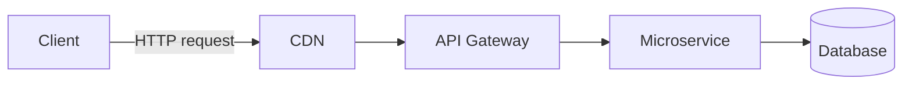

**Q: What does "Uniform Interface" mean in practice?**

A: Resource-based nouns in URLs (`GET /users/123`, not `/getUserById`), standard HTTP verbs (GET/POST/PUT/PATCH/DELETE), and self-descriptive messages where status codes/headers convey meaning without out-of-band info.

**Q: Is a truly stateless API always desirable?**

A: Not always — every request must carry full context (e.g., re-validate a JWT each call), trading server simplicity for client/network overhead. Statelessness is about the protocol/interaction, not forbidding a stateful database.

### Web API vs WCF vs MVC vs gRPC vs GraphQL

**Q: How do Web API, WCF, MVC, gRPC, and GraphQL differ?**

A:
- Web API — HTTP only, JSON/XML, lightweight; best for public/internal REST APIs.
- WCF — HTTP/TCP/MSMQ/Named Pipes, SOAP/XML, heavy; legacy enterprise SOAP integration only.
- MVC — HTTP, HTML/JSON views; server-rendered web apps.
- gRPC — HTTP/2, Protobuf binary; internal low-latency microservice calls.
- GraphQL — HTTP, flexible JSON shape; client-driven queries, BFF layers.

**Q: Is WCF still relevant in modern .NET?**

A: No — WCF is legacy; modern .NET has no first-class WCF, only the community-maintained CoreWCF port for migration scenarios.

### SOAP vs REST

**Q: How does SOAP compare to REST?**

A: SOAP uses strict XML envelopes/WSDL contracts, built-in WS-Security, and can be stateful — more complex and slower. REST uses flexible JSON/XML, relies on OAuth2/JWT + HTTPS for security, is stateless by design, and is simpler/faster.

### HTTP Methods, Status Codes, and Idempotency

**Q: Which HTTP methods are idempotent and which are safe?**

A:
- GET — idempotent, safe.
- POST — not idempotent, not safe.
- PUT — idempotent, not safe.
- PATCH — not guaranteed idempotent, not safe.
- DELETE — idempotent (same end state), not safe.

**Q: Don't idempotent and safe mean the same thing?**

A: No. Safe means no state mutation (GET only). Idempotent means repeating the call N times yields the same end state as once — PUT/DELETE are idempotent but still mutate state, so they aren't safe.

**Q: Name key HTTP status codes and their meaning.**

A: 200 OK, 201 Created (with `Location`), 202 Accepted (async processing), 204 No Content, 400 Bad Request, 401 Unauthorized, 403 Forbidden, 404 Not Found, 409 Conflict, 422 Unprocessable Entity (semantic validation failure), 429 Too Many Requests, 500 Internal Server Error, 503 Service Unavailable.

**Q: Is PATCH guaranteed idempotent?**

A: No — e.g., "increment counter by 1" is not idempotent even though PATCH can be designed with full-replacement semantics to be idempotent.

### Controllers, IActionResult, ActionResult\<T\>

**Q: What does `[ApiController]` give you automatically?**

A: Automatic 400 on invalid `ModelState`, `[FromBody]` inference for complex types, Problem-Details-shaped error responses, and enforced attribute routing.

```csharp
[ApiController]
[Route("api/products")]
public class ProductsController : ControllerBase
{
    [HttpGet]
    public IEnumerable<string> Get() => new[] { "Laptop", "Mobile" };

    [HttpGet("{id}")]
    public IActionResult GetProduct(int id)
    {
        if (id <= 0) return BadRequest("Invalid ID");
        return Ok(new { id, name = "Laptop" });
    }
}
```

**Q: `IActionResult` vs `ActionResult<T>` — which should you prefer?**

A: Prefer `ActionResult<T>` in new code — it's strongly typed (better OpenAPI/Swagger schema inference) while still allowing `Ok()`/`NotFound()`. `IActionResult` is better for genuinely mixed-result actions with no single type.

**Q: `IHttpActionResult` vs `IActionResult` — what's the difference?**

A: `IHttpActionResult` belongs to ASP.NET Web API 2 (`System.Web.Http`, classic pipeline), executing via `ExecuteAsync()` → `HttpResponseMessage`. `IActionResult` belongs to ASP.NET Core (`Microsoft.AspNetCore.Mvc`), executing via `ExecuteResultAsync()` directly into the Core pipeline. They share helper names (`Ok()`, `BadRequest()`) but are **not source-compatible** — migration requires changing `using` directives and base class (`ApiController` → `ControllerBase`).

```csharp
// Legacy ASP.NET Web API 2 (System.Web.Http) — IHttpActionResult
public IHttpActionResult GetProduct(int id)
{
    if (id <= 0) return BadRequest("Invalid ID");
    return Ok(new { Id = id, Name = "Laptop" });
}
```

### Routing: Attribute vs Conventional

**Q: Attribute routing vs conventional routing — which do modern Web APIs use?**

A: Almost exclusively attribute routing (`[Route("api/products/{id}")]` on controller/action) since it colocates routes with actions and supports constraints, versioning tokens, explicit verb binding. Conventional routing (`{controller}/{action}/{id?}` in `Program.cs`) suits MVC views better.

```csharp
var builder = WebApplication.CreateBuilder(args);
builder.Services.AddControllers();
var app = builder.Build();

app.UseHttpsRedirection();
app.UseRouting();
app.UseAuthentication();
app.UseAuthorization();
app.MapControllers();
app.Run();
```

### Parameter Binding: FromRoute/FromQuery/FromBody/FromHeader

**Q: List the parameter-binding attributes and their sources.**

A:
- `[FromRoute]` — URL route segment.
- `[FromQuery]` — query string.
- `[FromBody]` — JSON request body.
- `[FromHeader]` — HTTP header.
- `[FromForm]` — form/multipart body (file uploads).

**Q: Why can you only have one `[FromBody]` parameter per action?**

A: The request body stream can only be read once. If multiple complex pieces of data are needed, wrap them in a single DTO.

### File Upload & Download (IFormFile)

**Q: Show a basic file upload/download implementation using `IFormFile`.**

A:

```csharp
[HttpPost("upload")]
public async Task<IActionResult> Upload(IFormFile file)
{
    if (file is null || file.Length == 0) return BadRequest("No file uploaded.");

    var filePath = Path.Combine("uploads", file.FileName);
    using var stream = new FileStream(filePath, FileMode.Create);
    await file.CopyToAsync(stream);

    return Ok(new { file.FileName, file.Length });
}

[HttpGet("download/{fileName}")]
public IActionResult Download(string fileName)
{
    var filePath = Path.Combine("uploads", fileName);
    if (!System.IO.File.Exists(filePath)) return NotFound();

    var fileBytes = System.IO.File.ReadAllBytes(filePath);
    return File(fileBytes, "application/octet-stream", fileName);
}
```

**Q: What senior-level details matter for file upload/download beyond the basic `IFormFile` example?**

A:
- Stream large files instead of buffering fully into memory; enforce a request body size limit to prevent DoS via huge uploads.
- Never trust `file.FileName` as a path as-is (path traversal risk) — sanitize/regenerate (e.g., GUID) before writing to disk.
- Validate content-type/extension **and** inspect actual file bytes (magic-number check) — clients can lie about `Content-Type`.
- Prefer streaming to blob storage (Azure Blob/S3) over local disk for large files/high throughput — keeps the API stateless.
- Use `FileStreamResult`/`PhysicalFile` for large downloads rather than loading full bytes into memory.

### Content Negotiation

**Q: What's the difference between `Accept` and `Content-Type` headers?**

A: `Accept` states what representation the client wants back; `Content-Type` states what format the current body actually is.

```csharp
builder.Services.AddControllers().AddXmlSerializerFormatters();
```

```http
GET /api/products
Accept: application/xml
```

**Q: What happens if no formatter matches the `Accept` header?**

A: By default ASP.NET Core falls back to JSON silently; it only returns `406 Not Acceptable` if you explicitly set `ReturnHttpNotAcceptable = true`.

## Intermediate

### Dependency Injection & Service Lifetimes

**Q: Describe the three DI service lifetimes and their risks.**

A:
- Singleton — one instance per app; must be thread-safe; cannot safely hold Scoped deps.
- Scoped — one instance per request (e.g., `DbContext`); risk of "captive dependency" if injected into a Singleton.
- Transient — new instance every resolution; can be wasteful if expensive to construct.

```csharp
public interface IProductService { List<string> GetProducts(); }
public class ProductService : IProductService
{
    public List<string> GetProducts() => new() { "Laptop", "Mobile" };
}

builder.Services.AddScoped<IProductService, ProductService>();
```

**Q: `TryAddSingleton<T>` vs `AddSingleton<T>`?**

A: `TryAddSingleton` registers only if nothing is already registered for that type (safe for library/extension code). `AddSingleton` always adds a new registration, which can multiply resolutions via `IEnumerable<T>`.

**Q: Why can't a Singleton depend on a Scoped service like `DbContext`?**

A: `DbContext` is Scoped (one unit of work per request, not thread-safe); a Singleton lives app-wide and is shared across concurrent requests. Direct injection throws `InvalidOperationException` (when validation is enabled) or causes race conditions/shared state otherwise.

**Q: What's the fix for needing a Scoped dependency inside a Singleton?**

A: Inject `IServiceScopeFactory`, then `using var scope = _scopeFactory.CreateScope();` and resolve the Scoped service from `scope.ServiceProvider` per operation — isolates it to that unit of work.

```csharp
public class MyLoggerService
{
    private readonly IServiceScopeFactory _scopeFactory;
    public MyLoggerService(IServiceScopeFactory scopeFactory) => _scopeFactory = scopeFactory;

    public void LogToDatabase(string message)
    {
        using var scope = _scopeFactory.CreateScope();
        var dbContext = scope.ServiceProvider.GetRequiredService<MyDbContext>();
        dbContext.Logs.Add(new Log { Message = message });
        dbContext.SaveChanges();
    }
}
```

### SOLID Principles

**Q: Give an ASP.NET Core example for each SOLID principle.**

A:
- SRP — separate `ProductsController` (HTTP), `ProductService` (business logic), `ProductRepository` (persistence).
- OCP — add a new `IDiscountStrategy` implementation instead of editing an if/else chain.
- LSP — any `IPaymentGateway` implementation must honor the same contract without surprising callers.
- ISP — split a bloated `IRepository` into `IReadRepository<T>`/`IWriteRepository<T>`.
- DIP — constructor-inject interfaces (`ILogger`, `IProductService`), never `new` up a concrete dependency.

**Q: How is ASP.NET Core's built-in DI an example of DIP?**

A: `UserService` depends on `ILogger` (abstraction), not `ConsoleLogger` (concretion) — you can swap in `SerilogLogger` or a test `FakeLogger` with zero changes to `UserService`. DI itself operationalizes DIP at scale.

```csharp
public interface ILogger { void Log(string message); }

public class ConsoleLogger : ILogger
{
    public void Log(string message) => Console.WriteLine(message);
}

public class UserService
{
    private readonly ILogger _logger;
    public UserService(ILogger logger) => _logger = logger; // depends on the abstraction, not ConsoleLogger
}
```

**Q: What separates a senior answer on SOLID from a junior one?**

A: Being able to cite a real violation you refactored and the trade-off involved (more indirection vs. easier testing/isolated change) — reciting the acronym with no story reads as junior.

### Middleware Pipeline

**Q: How does middleware execution order work?**

A: Top-down on the way in, bottom-up on the way out — each middleware can inspect/modify the request, optionally short-circuit, call `next()`, then modify the response on the way back.

```csharp
public class CustomMiddleware
{
    private readonly RequestDelegate _next;
    public CustomMiddleware(RequestDelegate next) => _next = next;

    public async Task Invoke(HttpContext context)
    {
        Console.WriteLine("Request: " + context.Request.Path);
        await _next(context);
    }
}

app.UseMiddleware<CustomMiddleware>();
```

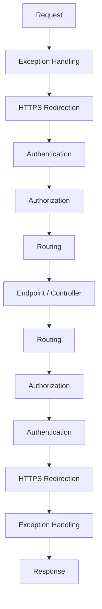

**Q: Middleware vs Filters — what's the key difference?**

A: Middleware is global/framework-agnostic across the whole HTTP pipeline. Filters are MVC/API-specific and run inside the action-invocation pipeline (after routing selects a controller/action), giving access to `ActionExecutingContext`/model-bound arguments that raw middleware lacks.

### Request Lifecycle End-to-End

**Q: Walk through the full ASP.NET Core request lifecycle.**

A: Kestrel builds `HttpContext` → Middleware pipeline (exception handling, auth, CORS) → Routing (matches controller/action) → Authentication (identifies user) → Authorization (checks permissions, may 401/403) → Filters (Authorization → Resource → Model binding/validation → Action → Exception → Result) → Controller executes and returns `ActionResult` → Formatter/content negotiation serializes → Response flows back through middleware in reverse → Kestrel sends to client.

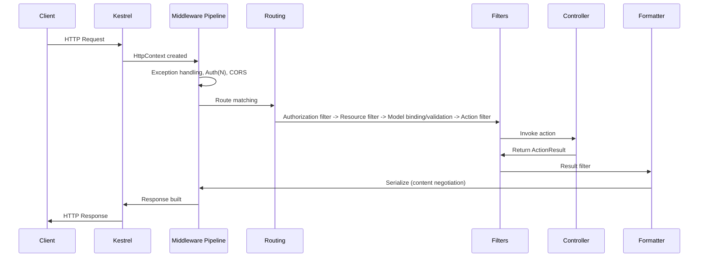

**Q: What's the one-line "interview gold" summary of the pipeline?**

A: "ASP.NET Core processes requests through Kestrel → Middleware → Routing → Filters → Controller → Formatters → Middleware → Client."

**Q: Does Kestrel contain business logic?**

A: No — Kestrel just parses raw HTTP and builds `HttpContext`; in production it usually sits behind IIS/Nginx/a cloud LB for TLS termination and process protection.

**Q: What's the distinction between authentication and authorization failure behavior?**

A: Auth failure doesn't necessarily stop the pipeline — the user is just treated as anonymous. Authorization failure returns 401/403 and the controller action never executes.

### Model Validation

**Q: Is a manual `ModelState.IsValid` check needed inside an `[ApiController]`-decorated controller?**

A: No — it's redundant. `[ApiController]` auto-returns 400 with a `ValidationProblemDetails` body before the action runs. Only needed if you opt out via `[ApiController(SuppressModelStateInvalidFilter = true)]` for custom validation shaping.

```csharp
public class Product
{
    [Required] public string Name { get; set; }
    [Range(1, 10000)] public decimal Price { get; set; }
}

[HttpPost]
public IActionResult AddProduct([FromBody] Product product)
{
    if (!ModelState.IsValid) return BadRequest(ModelState);
    return Ok("Product Added");
}
```

**Q: When would you reach for FluentValidation over Data Annotations?**

A: For complex/conditional validation rules, better testability, and separating validation logic from the model itself.

### Action Filters & Filter Pipeline

**Q: List the filter types in execution order and their typical use.**

A:
1. Authorization Filters — `[Authorize]` enforcement, runs first.
2. Resource Filters — before/after model binding; short-circuit caching, expensive pre-checks.
3. Action Filters — before/after action execution; logging, timing, mutating args/results.
4. Exception Filters — on unhandled exception from the action; centralized, controller-scoped error shaping.
5. Result Filters — before/after result execution; header injection, response wrapping.

```csharp
public class LogActionFilter : ActionFilterAttribute
{
    public override void OnActionExecuting(ActionExecutingContext context)
    {
        Console.WriteLine($"Action {context.ActionDescriptor.DisplayName} is executing");
    }
}

[LogActionFilter]
public class ProductsController : ControllerBase
{
    [HttpGet] public IActionResult Get() => Ok("Product List");
}
```

### PUT vs PATCH (JSON Patch)

**Q: PUT vs PATCH — purpose, idempotency, body?**

A: PUT replaces the entire resource (idempotent, full representation body). PATCH partially updates (not guaranteed idempotent, body is only changed fields or a JSON Patch document).

```csharp
[HttpPatch("{id}")]
public async Task<IActionResult> UpdateProduct(int id, [FromBody] JsonPatchDocument<Product> patchDoc)
{
    var product = await _context.Products.FindAsync(id);
    if (product == null) return NotFound();

    patchDoc.ApplyTo(product, ModelState);
    if (!ModelState.IsValid) return BadRequest(ModelState);

    await _context.SaveChangesAsync();
    return Ok(product);
}
```

**Q: What's the gotcha with `JsonPatchDocument<T>`?**

A: RFC 6902 JSON Patch requires `Content-Type: application/json-patch+json` and an operations array (`[{ "op": "replace", "path": "/price", "value": 1500 }]`). Many teams instead accept a plain partial DTO (merge-patch style, RFC 7396) for simplicity, trading strict semantics for ergonomics.

### Exception Handling

**Q: Why is the classic try/catch exception middleware (returning plain text `Error: {ex.Message}`) not senior-grade?**

A: It leaks exception details to clients (information disclosure) and returns unstructured plain text instead of a machine-readable error body. The production-grade replacement is RFC 7807/9457 Problem Details via `IExceptionHandler` (.NET 8+).

```csharp
public class ExceptionMiddleware
{
    private readonly RequestDelegate _next;
    public ExceptionMiddleware(RequestDelegate next) => _next = next;

    public async Task Invoke(HttpContext context)
    {
        try { await _next(context); }
        catch (Exception ex)
        {
            context.Response.StatusCode = 500;
            await context.Response.WriteAsync($"Error: {ex.Message}");
        }
    }
}
app.UseMiddleware<ExceptionMiddleware>();
```

### CORS

**Q: What does CORS actually protect, and what doesn't it protect?**

A: CORS is a browser-enforced same-origin relaxation — it does nothing for server-to-server calls (curl, Postman, another backend ignore it entirely).

```csharp
builder.Services.AddCors(options =>
{
    options.AddPolicy("AllowSpecificOrigin", policy =>
        policy.WithOrigins("https://frontend.com")
              .AllowAnyMethod()
              .AllowAnyHeader());
});
app.UseCors("AllowSpecificOrigin");
```

**Q: What's a common CORS misconfiguration?**

A: Combining `Access-Control-Allow-Origin: *` with `AllowCredentials()` — invalid by spec; never combine wildcard origin with credentialed requests.

### Repository Pattern & DTOs

**Q: Is wrapping EF Core's `DbContext` in a generic repository a good default?**

A: Not by default — `DbSet<T>`/`DbContext` already is a unit-of-work + repository abstraction. A hand-rolled generic repository often just hides `IQueryable` behind another interface and can strip `Include`/projection/compiled-query capabilities. Justify it with a real cross-cutting need (e.g., swapping persistence tech, simplifying test doubles), not "best practice" cargo-culting.

```csharp
public interface IProductRepository { List<Product> GetAll(); }
public class ProductRepository : IProductRepository
{
    private readonly AppDbContext _context;
    public ProductRepository(AppDbContext context) => _context = context;
    public List<Product> GetAll() => _context.Products.AsNoTracking().ToList();
}
```

**Q: Why use DTOs at API boundaries instead of binding directly to EF entities?**

A: Hides internal/DB-only fields, decouples the API contract from the persistence schema, and prevents over-posting/mass-assignment vulnerabilities (e.g., a client setting `IsAdmin` directly).

```csharp
public class ProductDTO
{
    public string Name { get; set; }
    public decimal Price { get; set; }
}
var productDto = _mapper.Map<ProductDTO>(product);
```

### IHttpClientFactory & Resilient HTTP Calls

**Q: What problem does `IHttpClientFactory` solve?**

A: Socket exhaustion — a `new HttpClient()` per request disposes the handler but can leave sockets in `TIME_WAIT`, exhausting ports under load. A single static `HttpClient` singleton avoids that but doesn't respect DNS changes (caches connections indefinitely). `IHttpClientFactory` pools/recycles `HttpMessageHandler`s on a rotation (default 2 min), giving connection reuse and DNS responsiveness, plus named/typed clients and Polly integration.

```csharp
builder.Services.AddHttpClient<IProductService, ProductService>();

public class ProductService : IProductService
{
    private readonly HttpClient _httpClient;
    public ProductService(HttpClient httpClient) => _httpClient = httpClient;
    public async Task<string> GetData() => await _httpClient.GetStringAsync("https://api.example.com/products");
}
```

## Advanced

### API Versioning Strategies

**Q: What are the four common API versioning strategies, and their trade-offs?**

A:
- URL Path (`/api/v1/products`) — explicit, cacheable, easy to test; "pollutes" the URL.
- Query String (`?version=1`) — simple; easy to forget, messy caching keys.
- Header (`X-API-Version: 1`) — clean URL; invisible to casual browsing/curl.
- Media Type/Accept (`application/vnd.myapi.v1+json`) — most RESTfully correct; most complex, poor tooling.

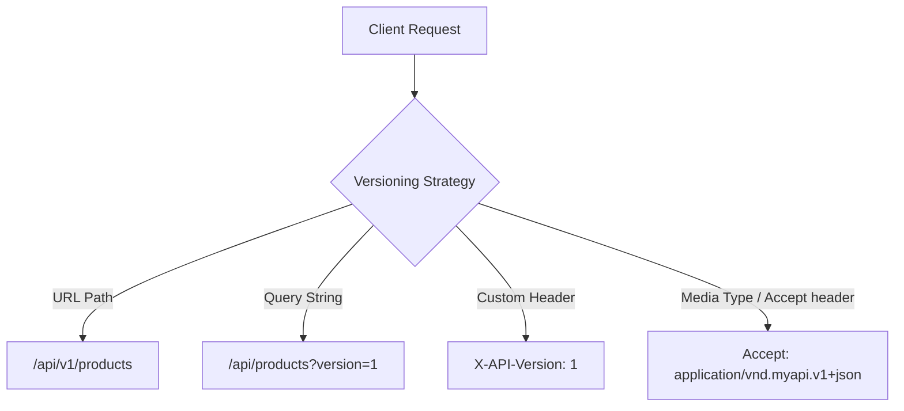

**Q: Which strategy wins in most real-world APIs, and why?**

A: URL path versioning — best discoverability and cache-friendliness. Header/media-type is more "correct" per REST purists but rarely worth the operational complexity outside public APIs with strict deprecation SLAs.

```csharp
builder.Services.AddApiVersioning(options =>
{
    options.AssumeDefaultVersionWhenUnspecified = true;
    options.DefaultApiVersion = new ApiVersion(1, 0);
    options.ReportApiVersions = true;
    options.ApiVersionReader = new UrlSegmentApiVersionReader();
});

[ApiController]
[Route("api/v{version:apiVersion}/products")]
[ApiVersion("1.0")]
public class ProductsV1Controller : ControllerBase
{
    [HttpGet] public IActionResult Get() => Ok(new { Message = "Product list from V1" });
}
```

**Q: What NuGet package should be used for API versioning today?**

A: `Asp.Versioning.Mvc` — the modern maintained successor to the deprecated `Microsoft.AspNetCore.Mvc.Versioning`.

**Q: What are versioning best practices?**

A: Deprecate gradually (`Sunset` header, `api-supported-versions` via `ReportApiVersions`), document each version in OpenAPI, avoid accumulating too many live versions, consider an API gateway for centralized routing/deprecation.

### REST Maturity Model (Richardson) & HATEOAS Trade-offs

**Q: Describe the Richardson Maturity Model levels.**

A:
- Level 0 — one URL, one verb (RPC/SOAP-in-disguise over HTTP).
- Level 1 — separate URIs per resource, still often single-verb-heavy.
- Level 2 — proper HTTP verbs + status codes; where most production "REST" APIs actually live.
- Level 3 — HATEOAS; responses embed hypermedia links describing next actions.

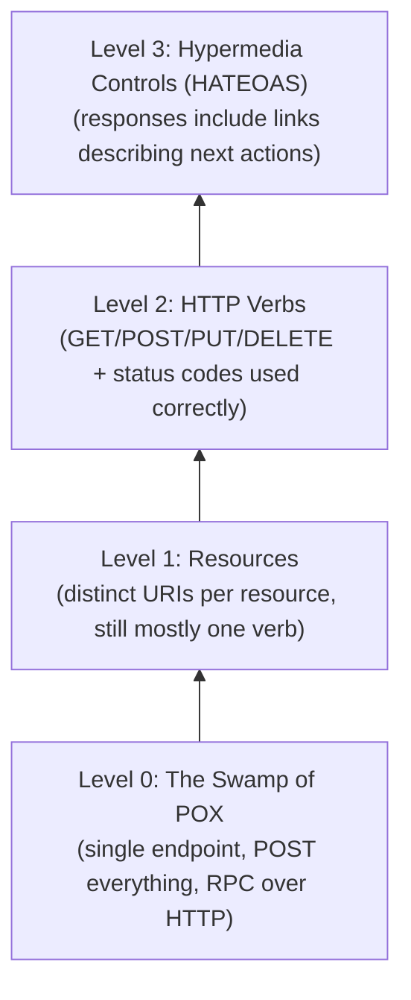

**Q: Is HATEOAS worth implementing in practice?**

A: Rarely fully implemented — most teams stop at Level 2 and version explicitly. It pays off for complex order/workflow APIs where valid next actions genuinely vary by resource state; for most CRUD APIs the added complexity (bigger payloads, client-side plumbing) isn't justified.

### Problem Details (RFC 7807/9457) for Error Responses

**Q: What is RFC 7807/9457 Problem Details, and how is it implemented in .NET 8+?**

A: A standardized JSON error shape (`type`, `title`, `status`, `detail`, `instance`) for HTTP API errors. .NET 8+ supports it via `AddProblemDetails()` plus a custom `IExceptionHandler` registered with `AddExceptionHandler<T>()`, and `app.UseExceptionHandler()`.

```json
{
  "type": "https://example.com/probs/insufficient-funds",
  "title": "Insufficient funds",
  "status": 400,
  "detail": "Your balance is 30, but the transfer requires 50.",
  "instance": "/transfers/abc-123",
  "traceId": "00-4bf9...-01"
}
```

```csharp
builder.Services.AddProblemDetails(options =>
{
    options.CustomizeProblemDetails = ctx =>
    {
        ctx.ProblemDetails.Extensions["traceId"] = ctx.HttpContext.TraceIdentifier;
    };
});

builder.Services.AddExceptionHandler<GlobalExceptionHandler>();

// GlobalExceptionHandler.cs
public class GlobalExceptionHandler : IExceptionHandler
{
    private readonly ILogger<GlobalExceptionHandler> _logger;
    public GlobalExceptionHandler(ILogger<GlobalExceptionHandler> logger) => _logger = logger;

    public async ValueTask<bool> TryHandleAsync(HttpContext httpContext, Exception exception, CancellationToken ct)
    {
        _logger.LogError(exception, "Unhandled exception");

        httpContext.Response.StatusCode = StatusCodes.Status500InternalServerError;
        await httpContext.Response.WriteAsJsonAsync(new ProblemDetails
        {
            Status = StatusCodes.Status500InternalServerError,
            Title = "An unexpected error occurred",
            Type = "https://httpstatuses.io/500"
        }, cancellationToken: ct);

        return true; // exception handled — don't rethrow
    }
}

// Program.cs
app.UseExceptionHandler();
```

**Q: Why does using Problem Details for all errors matter at senior level?**

A: It gives consumers one consistent, machine-parseable error shape across validation failures (`[ApiController]`'s auto `400`s already use `ValidationProblemDetails`), business rule violations, and unhandled exceptions — instead of ad hoc shapes per endpoint.

### Idempotency Keys for POST/PUT

**Q: How do you prevent duplicate side effects when a client retries a POST?**

A: Require a client-supplied `Idempotency-Key` header; look it up first — if a result already exists for that key, return it instead of reprocessing; otherwise process and store the result keyed by that key with a TTL.

```http
POST /payments
Idempotency-Key: 7b6a5e2e-3f1a-4b8e-9c2d-5a6f7e8d9c0b
Content-Type: application/json

{ "amount": 100, "currency": "USD" }
```

```csharp
[HttpPost]
public async Task<IActionResult> CreatePayment(
    [FromHeader(Name = "Idempotency-Key")] string idempotencyKey,
    [FromBody] PaymentRequest request)
{
    if (string.IsNullOrEmpty(idempotencyKey))
        return BadRequest("Idempotency-Key header is required.");

    var existing = await _cache.GetAsync<PaymentResult>(idempotencyKey);
    if (existing != null)
        return Ok(existing); // return the original result, don't reprocess

    var result = await _paymentService.ProcessAsync(request);

    // Store result keyed by idempotency key with a TTL (e.g., 24h)
    await _cache.SetAsync(idempotencyKey, result, TimeSpan.FromHours(24));

    return Ok(result);
}
```

**Q: What separates a senior answer on idempotency keys from a junior one?**

A:
- Store the key atomically with the operation's side effect (same transaction or a unique-constrained table) — a cache-only approach has a check-then-process race window.
- Scope the key to avoid cross-user/resource collisions (e.g., hash `userId + key`).
- Handle concurrent in-flight requests with the same key explicitly (409/425), not by double-processing.
- This is the same idea behind the outbox pattern and "at-least-once + idempotent consumers = effectively exactly-once."

### Pagination Strategies: Offset vs Cursor

**Q: Offset vs cursor pagination — compare performance and consistency.**

A: Offset (`Skip(n).Take(m)`) is trivial but degrades at scale (`OFFSET 100000` still scans/discards rows) and is unstable under concurrent writes (rows shift, causing duplicates/skips). Cursor-based (`WHERE id > X ORDER BY id LIMIT m`) is a consistently fast indexed seek and immune to shifts, but doesn't support random "jump to page N" access.

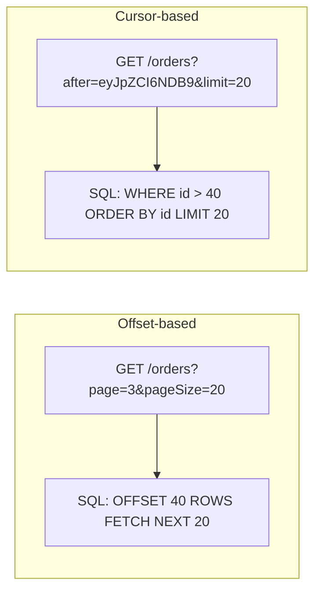

**Q: When would you use each?**

A: Offset for admin UIs/small-medium datasets needing "total pages." Cursor for infinite scroll, feeds, large/high-write datasets, and public APIs (GitHub, Stripe, Slack all use cursor pagination).

```csharp
// Cursor-based pagination example
[HttpGet]
public async Task<IActionResult> GetOrders([FromQuery] string? after, [FromQuery] int limit = 20)
{
    var query = _context.Orders.OrderBy(o => o.Id).AsQueryable();

    if (!string.IsNullOrEmpty(after))
    {
        var cursorId = DecodeCursor(after); // base64-decode opaque token
        query = query.Where(o => o.Id > cursorId);
    }

    var items = await query.Take(limit + 1).ToListAsync();
    var hasMore = items.Count > limit;
    items = items.Take(limit).ToList();

    return Ok(new
    {
        data = items,
        nextCursor = hasMore ? EncodeCursor(items.Last().Id) : null
    });
}
```

### Long-Running Operations: 202 Accepted + Polling

**Q: How do you handle a long-running operation triggered by a POST?**

A: Enqueue the work, create a job record, return `202 Accepted` with a `Location` header pointing to a status resource. The client polls `GET /reports/{jobId}` until status is `Completed`, then follows the result link (or a `303 See Other`).

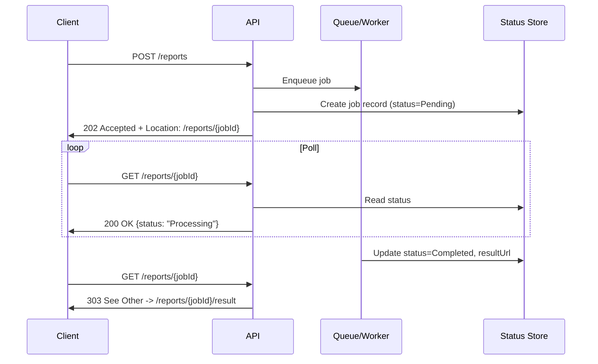

```csharp
[HttpPost("reports")]
public async Task<IActionResult> GenerateReport([FromBody] ReportRequest request)
{
    var jobId = Guid.NewGuid();
    await _jobStore.CreateAsync(jobId, JobStatus.Pending);
    await _queue.EnqueueAsync(new GenerateReportJob(jobId, request));

    return Accepted(new Uri($"/reports/{jobId}", UriKind.Relative), new { jobId, status = "Pending" });
}

[HttpGet("reports/{jobId}")]
public async Task<IActionResult> GetReportStatus(Guid jobId)
{
    var job = await _jobStore.GetAsync(jobId);
    if (job is null) return NotFound();

    if (job.Status == JobStatus.Completed)
        return Ok(new { status = "Completed", resultUrl = $"/reports/{jobId}/result" });

    return Ok(new { status = job.Status.ToString() });
}
```

**Q: What's the alternative to client polling, and its trade-off?**

A: Webhooks — the server calls back a client-registered URL on completion. Better for infrequent, high-latency jobs and avoids polling load, but requires the client to expose a public endpoint and you to handle retries/signature verification.

**Q: Why does idempotency matter here too?**

A: If `POST /reports` itself is retried, you don't want to enqueue duplicate jobs — combine with the idempotency-key pattern.

### OpenAPI/Swagger: Contract-First vs Code-First

**Q: Code-first vs contract-first API design — trade-offs?**

A: Code-first (Swashbuckle/NSwag generate spec from attributes) is fast to start and always matches implementation, but the spec is a byproduct, not a design artifact, making it easy to accidentally break consumers. Contract-first (author OpenAPI YAML first, generate stubs/SDKs) forces design review up front and enables parallel frontend/backend work, at the cost of slower setup and risk of spec/implementation drift without CI enforcement.

```csharp
builder.Services.AddSwaggerGen();
app.UseSwagger();
app.UseSwaggerUI(c => c.SwaggerEndpoint("/swagger/v1/swagger.json", "My API v1"));
```

**Q: Which approach fits which scenario?**

A: Code-first for internal microservices moving fast; contract-first (with contract tests) for public APIs, external partners, or where breaking changes have real business cost.

**Q: What's the .NET 9 tooling update worth knowing?**

A: Some new project templates favor `Microsoft.AspNetCore.OpenApi` for spec generation over bundled Swashbuckle, pairing with Scalar or Swagger UI separately for the interactive doc viewer.

### Minimal APIs vs Controllers

**Q: Minimal APIs vs Controllers — key differences?**

A: Controllers offer more boilerplate but a mature filter pipeline, automatic attribute-driven model binding/validation, and better fit for large/complex/versioned APIs. Minimal APIs are terser, lower overhead/latency, have their own filter pipeline (`IEndpointFilter`, .NET 7+) that's less mature, and suit small focused services, latency-sensitive microservices, and serverless-style workloads.

```csharp
// Minimal API
var app = WebApplication.Create(args);

app.MapGet("/api/products/{id}", async (int id, IProductService service) =>
{
    var product = await service.GetByIdAsync(id);
    return product is not null ? Results.Ok(product) : Results.NotFound();
})
.WithName("GetProduct")
.WithOpenApi();

app.Run();
```

**Q: Does one replace the other?**

A: No — both compile to the same underlying `Endpoint`/routing infrastructure. Choice is about team ergonomics and codebase scale, not capability. Common pattern: Minimal APIs for small internal utilities, Controllers for large filter-heavy public APIs.

### Rate Limiting with Built-in ASP.NET Core Middleware

**Q: What's the modern, first-party way to rate-limit in ASP.NET Core?**

A: `Microsoft.AspNetCore.RateLimiting` middleware (built in since .NET 7) — preferred over the third-party `AspNetCoreRateLimit` package.

```csharp
using System.Threading.RateLimiting;

builder.Services.AddRateLimiter(options =>
{
    options.AddFixedWindowLimiter("fixed", opt =>
    {
        opt.PermitLimit = 100;
        opt.Window = TimeSpan.FromMinutes(1);
        opt.QueueLimit = 0;
        opt.QueueProcessingOrder = QueueProcessingOrder.OldestFirst;
    });

    options.AddTokenBucketLimiter("token", opt =>
    {
        opt.TokenLimit = 50;
        opt.TokensPerPeriod = 10;
        opt.ReplenishmentPeriod = TimeSpan.FromSeconds(10);
    });

    options.OnRejected = async (context, token) =>
    {
        context.HttpContext.Response.StatusCode = StatusCodes.Status429TooManyRequests;
        await context.HttpContext.Response.WriteAsync("Too many requests. Try again later.", token);
    };
});

app.UseRateLimiter();

app.MapGet("/api/products", () => Ok("data")).RequireRateLimiting("fixed");
```

**Q: List the built-in rate limiting algorithms.**

A:
- Fixed Window — N requests per fixed window; can burst at boundary edges.
- Sliding Window — smoother, tracks segments within the window.
- Token Bucket — tokens refill steadily; allows short bursts up to capacity.
- Concurrency Limiter — limits concurrent in-flight requests, not a rate over time.

**Q: What's the distributed caveat with the built-in middleware?**

A: Counters are in-memory per instance by default — behind a load balancer with multiple instances, the effective global limit becomes `perInstanceLimit × instanceCount`. For a true global limit, use a distributed store (Redis-backed) or push limiting to an API gateway.

**Q: What complements (not replaces) app-level rate limiting?**

A: Queue-based throttling (delay instead of reject), WAF (blocks malicious/bot traffic at the edge), CAPTCHA (human verification for sensitive actions), and cloud API gateway rate limiting (centralized, distributed counters).

### Authentication & Authorization (JWT, OAuth2, OIDC)

**Q: JWT — pros/cons?**

A: No server-side session storage, scales well in distributed systems; but a leaked token stays valid until expiry and revocation is hard by design.

```csharp
builder.Services.AddAuthentication(JwtBearerDefaults.AuthenticationScheme)
    .AddJwtBearer(options =>
    {
        options.TokenValidationParameters = new TokenValidationParameters
        {
            ValidateIssuer = true,
            ValidateAudience = true,
            ValidateLifetime = true,
            ValidateIssuerSigningKey = true,
            ValidIssuer = "yourdomain.com",
            ValidAudience = "yourdomain.com",
            IssuerSigningKey = new SymmetricSecurityKey(Encoding.UTF8.GetBytes(secretKey))
        };
    });
```

**Q: OAuth2 vs OIDC — what's the distinction?**

A: OAuth2 is an authorization framework answering "what can this app do on my behalf." OIDC layers authentication (identity, ID tokens) on top of OAuth2, answering "who is this user."

```csharp
builder.Services.AddAuthentication(JwtBearerDefaults.AuthenticationScheme)
    .AddJwtBearer(options =>
    {
        options.Authority = "https://your-identity-provider.com";
        options.Audience = "your-api";
    });
```

**Q: Walk through the Azure AD (Entra ID) SSO flow.**

A:

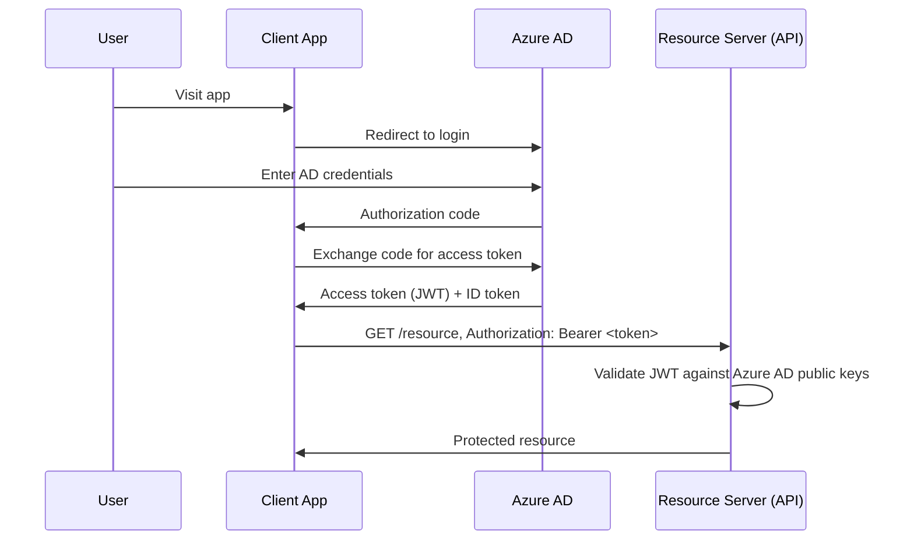

```csharp
builder.Services.AddAuthentication("Bearer")
    .AddMicrosoftIdentityWebApi(builder.Configuration.GetSection("AzureAd"));

builder.Services.AddAuthorization();
```

**Q: Role-based vs claims-based authorization — which is more flexible?**

A: Claims-based is more general — roles are just a special-cased claim (`ClaimTypes.Role`). For anything beyond simple role checks, use policy-based authorization (`[Authorize(Policy = ...)]` backed by `IAuthorizationHandler`) so logic isn't scattered as string role checks.

```csharp
[Authorize(Roles = "Admin")]
[HttpGet("secure-data")]
public IActionResult GetSecureData() => Ok("Only Admin can access this!");
```

```csharp
[Authorize]
[HttpGet]
public IActionResult GetUserClaims()
{
    var email = User.FindFirst(ClaimTypes.Email)?.Value;
    return Ok($"User Email: {email}");
}
```

### OAuth2 Grant Types — Which One Fits Which Client

**Q: Which OAuth2 grant type fits which client type?**

A:
- Authorization Code + PKCE — SPAs, native/mobile apps (public clients that can't hold a secret); PKCE replaces the secret with a dynamic verifier/challenge pair.
- Client Credentials — machine-to-machine, no user in the loop; confidential client presents `client_id`+`client_secret` directly.
- Device Code — limited-input devices (smart TVs, CLI, IoT); device shows a code, user completes auth on a separate device.
- Implicit — **deprecated**, removed in OAuth 2.1 (token exposed in URL fragment).
- ROPC (Resource Owner Password Credentials) — **deprecated**, removed in OAuth 2.1 (client handles raw passwords).

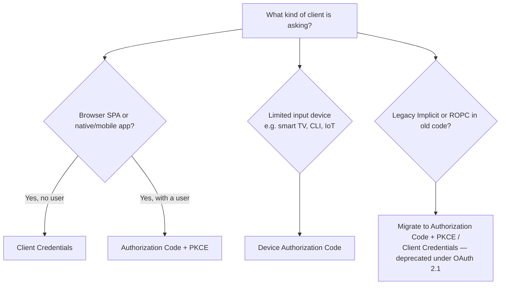

**Q: Why does PKCE matter even for confidential clients?**

A: Under OAuth 2.1, PKCE is recommended universally — it protects against authorization-code-interception attacks regardless of client type, and using one flow consistently reduces the number of security mechanisms to get right.

**Q: Why not use Client Credentials for a SPA?**

A: Client Credentials requires an embedded client secret, and a SPA's code is fully delivered to and inspectable in the browser — there's no way to keep a secret confidential there.

**Q: Does the grant type affect how the API validates the token?**

A: No — `AddJwtBearer`/`Microsoft.Identity.Web` validate whichever access token arrives regardless of grant type; grant type is a concern of the token-issuance side (auth server), not the resource server's validation code.

### API Keys vs OAuth2 Scopes — When to Use Which

**Q: API keys vs OAuth2 — when does each fit?**

A: API keys identify an application (often all-or-nothing, manual rotation) — fine for server-to-server/internal tooling/simple integrations. OAuth2 scopes identify a specific user/service with fine-grained, short-lived, revocable delegated permissions — needed for user-delegated access, public APIs, and per-user consent/audit.

```csharp
public class ApiKeyMiddleware
{
    private readonly RequestDelegate _next;
    public ApiKeyMiddleware(RequestDelegate next) => _next = next;

    public async Task Invoke(HttpContext context)
    {
        if (!context.Request.Headers.TryGetValue("X-API-KEY", out var key) || key != "expected-key")
        {
            context.Response.StatusCode = StatusCodes.Status401Unauthorized;
            await context.Response.WriteAsync("Unauthorized");
            return;
        }
        await _next(context);
    }
}
```

**Q: Why prefer OAuth2 client-credentials over a bare API key for M2M calls?**

A: Short-lived tokens and centralized revocation "for free" when an identity provider already exists — many breaches trace back to over-scoped, long-lived API keys checked into config.

### HATEOAS

**Q: What does a HATEOAS response look like?**

A: The resource body includes a `links` array with `rel`/`href`/`method` for available next actions (self, update, delete) — see the REST Maturity Model section above for the trade-off discussion.

```json
{
  "id": 1,
  "name": "Laptop",
  "price": 1200,
  "links": [
    { "rel": "self", "href": "/api/products/1" },
    { "rel": "update", "href": "/api/products/1", "method": "PUT" },
    { "rel": "delete", "href": "/api/products/1", "method": "DELETE" }
  ]
}
```

```csharp
public class ProductResource
{
    public int Id { get; set; }
    public string Name { get; set; }
    public decimal Price { get; set; }
    public List<LinkResource> Links { get; set; } = new();
}
public class LinkResource
{
    public string Rel { get; set; }
    public string Href { get; set; }
    public string Method { get; set; }
}
```

### Microservices vs Monolithic Architecture

**Q: Compare monolithic and microservices architecture across scalability, deployment, data, and failure isolation.**

A: Monolith — single deploy unit, coarse-grained scaling, one shared DB usually, native ACID transactions, a bug can take down the whole app. Microservices — independent deploy/scale per service, each service typically owns its own data store, distributed transactions require sagas/outbox instead of 2PC, failures can be isolated with circuit breakers/bulkheads — at the cost of much higher operational overhead.

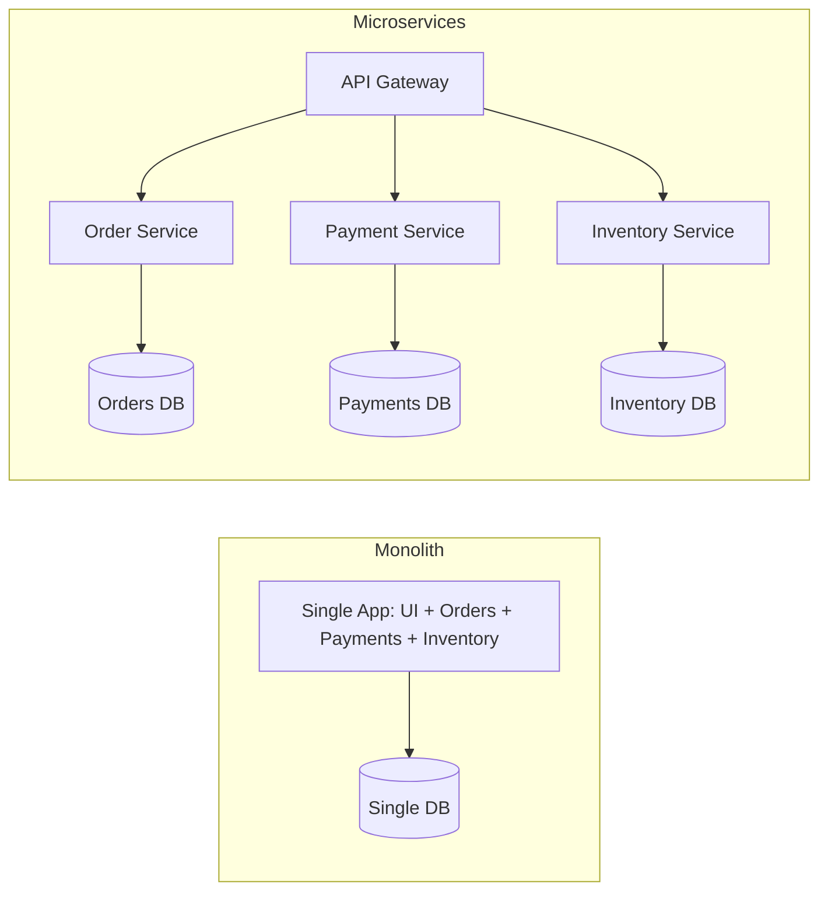

**Q: When would you choose a monolith over microservices?**

A: Small team/low complexity where the operational tax isn't justified; early-stage product with unclear domain boundaries (splitting too early risks a "distributed monolith"); when lower operational overhead is a genuine business win. Middle path: a well-modularized monolith so future extraction is a refactor, not a rewrite (same instinct as the strangler fig pattern).

**Q: What is a "distributed monolith" and how do you avoid it?**

A: Microservices in name only — services share a DB, deploy in lockstep, or call each other synchronously in long chains, inheriting operational complexity without independent scalability/deployability. Avoid via per-service data ownership, async/event-driven communication, and boundaries drawn around real business capabilities.

### API Gateway Pattern

**Q: What does an API Gateway centralize?**

A: Routing, security (auth/authz, API key validation), load balancing, rate limiting, and cross-service monitoring/logging — a single entry point fronting multiple backend services.

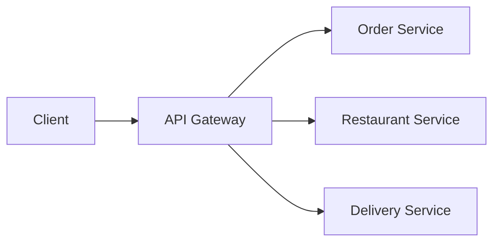

**Q: Name some API Gateway options and the BFF pattern.**

A: Ocelot (.NET-native, lightweight), YARP (Microsoft's modern reverse-proxy toolkit, increasingly the default), or managed options (Azure APIM, AWS API Gateway, Kong). Backend-for-Frontend (BFF) is a narrower, client-specific gateway (e.g., a mobile BFF shaping responses differently than a web BFF).

### CQRS

**Q: What is CQRS, and does it require MediatR/event sourcing?**

A: Command Query Responsibility Segregation separates read and write models so their concerns/scaling can diverge. It does **not** require MediatR, event sourcing, or separate physical databases — those are optional escalations. Using full CQRS + event sourcing by default is a common overengineering trap.

```csharp
public record CreateProductCommand(string Name, decimal Price) : IRequest<Product>;
public record GetProductQuery(int Id) : IRequest<Product>;

public class GetProductHandler : IRequestHandler<GetProductQuery, Product>
{
    private readonly DbContext _context;
    public GetProductHandler(DbContext context) => _context = context;

    public async Task<Product> Handle(GetProductQuery request, CancellationToken cancellationToken)
        => await _context.Products.FindAsync(request.Id);
}
```

```csharp
[HttpGet("{id}")]
public async Task<IActionResult> Get(int id, [FromServices] IMediator mediator)
    => Ok(await mediator.Send(new GetProductQuery(id)));
```

### Background Jobs & IHostedService/BackgroundService

**Q: `IHostedService` vs `BackgroundService`?**

A: `IHostedService` is the raw interface (`StartAsync`/`StopAsync`) for app-lifecycle-bound background work. `BackgroundService` is the preferred abstract base class simplifying the loop via `ExecuteAsync(CancellationToken)`.

```csharp
public class MyBackgroundService : IHostedService
{
    private readonly ILogger<MyBackgroundService> _logger;
    private Timer _timer;
    public MyBackgroundService(ILogger<MyBackgroundService> logger) => _logger = logger;

    public Task StartAsync(CancellationToken cancellationToken)
    {
        _logger.LogInformation("Hosted Service Started");
        _timer = new Timer(DoWork, null, TimeSpan.Zero, TimeSpan.FromSeconds(10));
        return Task.CompletedTask;
    }

    private void DoWork(object state) => _logger.LogInformation($"Running at: {DateTime.Now}");

    public Task StopAsync(CancellationToken cancellationToken)
    {
        _timer?.Change(Timeout.Infinite, 0);
        return Task.CompletedTask;
    }
}

builder.Services.AddHostedService<MyBackgroundService>();
```

Preferred modern approach — `BackgroundService` (abstract base class implementing `IHostedService`, simplifies the loop):

```csharp
public class Worker : BackgroundService
{
    protected override async Task ExecuteAsync(CancellationToken stoppingToken)
    {
        while (!stoppingToken.IsCancellationRequested)
        {
            Console.WriteLine("Running background task...");
            await Task.Delay(5000, stoppingToken);
        }
    }
}
```

**Q: What's the gotcha with `IHostedService`/`BackgroundService` lifetime?**

A: They're registered as Singleton by the hosting infrastructure — so injecting Scoped services (like `DbContext`) directly is unsafe; use `IServiceScopeFactory` inside `ExecuteAsync`, same as for singleton loggers.

**Q: When would you reach for Hangfire/Quartz.NET instead of a hand-rolled `BackgroundService`?**

A: For durable, resumable, or cron-like scheduled work needing retry/dashboards.

```csharp
builder.Services.AddHangfire(config => config.UseSqlServerStorage(connectionString));
app.UseHangfireDashboard();
app.UseHangfireServer();

BackgroundJob.Enqueue(() => Console.WriteLine("Background job executed"));
RecurringJob.AddOrUpdate("daily-cleanup", () => Console.WriteLine("Recurring job executed"), Cron.Daily);
```

### WebSockets & SignalR

**Q: WebSockets vs SignalR vs SSE vs long polling — when would you pick each?**

A: Raw WebSockets for full protocol control or non-.NET clients. SignalR when both ends are .NET-friendly and you want group/user management, automatic reconnection, scale-out backplane, and less boilerplate. SSE for simple server→client-only push over plain HTTP. Long polling as the lowest-common-denominator fallback.

```csharp
app.UseWebSockets();
app.Use(async (context, next) =>
{
    if (context.Request.Path == "/ws" && context.WebSockets.IsWebSocketRequest)
    {
        var socket = await context.WebSockets.AcceptWebSocketAsync();
        // handle communication
    }
    else await next();
});
```

`SignalR` — ASP.NET Core's real-time abstraction over WebSockets (falling back to Server-Sent Events / long polling when WebSockets aren't available):

```csharp
public class ChatHub : Hub
{
    public async Task SendMessage(string user, string message)
        => await Clients.All.SendAsync("ReceiveMessage", user, message);
}
app.MapHub<ChatHub>("/chatHub");
```

```javascript
const connection = new signalR.HubConnectionBuilder().withUrl("/chatHub").build();
connection.on("ReceiveMessage", (user, message) => console.log(`${user}: ${message}`));
connection.start();
```

### Circuit Breaker & Resiliency (Polly)

**Q: Describe the circuit breaker state machine.**

A: Closed (normal) → Open (short-circuits calls immediately after failure threshold exceeded) → Half-Open (after break duration, allows a trial request) → Closed (if trial succeeds) or back to Open (if trial fails).

```csharp
builder.Services.AddHttpClient("ExternalAPI")
    .AddTransientHttpErrorPolicy(p => p.CircuitBreakerAsync(2, TimeSpan.FromSeconds(30)));
```

```csharp
[HttpGet("external")]
public async Task<IActionResult> CallExternalAPI()
{
    var client = _httpClientFactory.CreateClient("ExternalAPI");
    var response = await client.GetAsync("https://external-api.com/data");
    return Ok(await response.Content.ReadAsStringAsync());
}
```

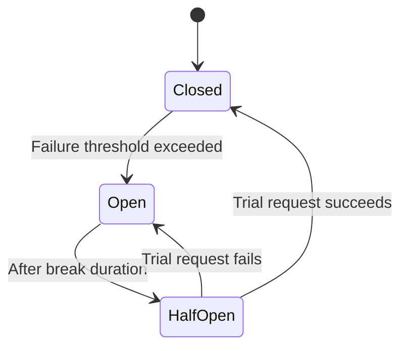

**Q: What's the current idiomatic resilience approach in .NET 8+?**

A: `Microsoft.Extensions.Resilience`/`Microsoft.Extensions.Http.Resilience` (built on Polly v8's pipeline API), via `AddStandardResilienceHandler()` on `IHttpClientFactory` — preferred over hand-wiring Polly policies directly.

**Q: Name related resiliency patterns paired with circuit breaker.**

A: Retry (with exponential backoff + jitter), Bulkhead isolation (cap concurrent calls to a dependency), Timeout (bound wait time), Fallback (return cached/default value on failure).

### gRPC vs REST vs GraphQL

**Q: Compare REST, gRPC, and GraphQL on contract, streaming, and browser support.**

A: REST — OpenAPI (often optional), limited streaming (SSE/chunked), native browser support. gRPC — mandatory `.proto` contract, native bidirectional streaming, requires grpc-web proxy for browsers. GraphQL — mandatory schema, subscriptions bolted on via WebSockets, native browser support.

```protobuf
syntax = "proto3";
service ProductService {
  rpc GetProduct (ProductRequest) returns (ProductResponse);
}
```

```csharp
builder.Services.AddGraphQLServer().AddQueryType<Query>();
```

**Q: When would you pick each?**

A: REST for public APIs/broad compatibility/cacheability. gRPC for internal service-to-service calls needing speed + strong contracts. GraphQL when client data-shape needs vary a lot — but be ready to discuss its downsides (harder HTTP caching, N+1 resolver risk, field-level authorization complexity).

### OData

**Q: What does OData add to a REST endpoint, and what's the risk?**

A: Standardized query capabilities (`$filter`, `$orderby`, `$select`, `$expand`, `$top`) via query string conventions. Risk: clients can construct arbitrarily expensive queries (unbounded `$expand` depth, filters on unindexed columns) — requires guardrails (max page size, query cost limits, disabling `$expand` on large collections) or it's a self-inflicted DoS vector.

```csharp
builder.Services.AddControllers().AddOData(options => options.Select().Filter().OrderBy());

[EnableQuery]
[HttpGet]
public IQueryable<Product> Get() => _context.Products;
```

```http
GET /api/products?$filter=price gt 100&$orderby=name
```

## System Design & Scalability

### Database Sharding vs Partitioning

**Q: Partitioning vs sharding — what's the difference?**

A: Partitioning splits one table's data across multiple physical structures **within the same DB instance** (usually transparent to the app) — solves single-table manageability/performance. Sharding splits data across **multiple separate DB instances** via an app-aware shard key — solves horizontal scalability when one instance's capacity is the bottleneck, at the cost of app-code complexity, hotspots, and hard cross-shard queries/joins.

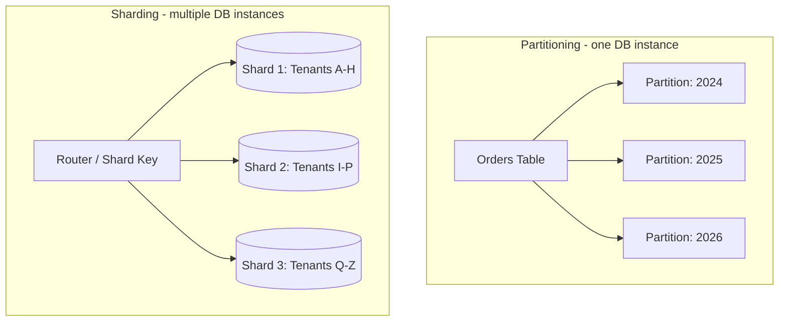

**Q: Which should you reach for first?**

A: Partitioning — it solves "this table is too big/slow" without touching application code. Reach for sharding only when a single instance's total capacity is the actual bottleneck. A common middle ground: shard by tenant (natural partition boundary) while partitioning each shard's tables by date.

### Feature Flags & Safe Rollout

**Q: What's the core idea behind feature flags?**

A: They decouple deployment (code reaching production) from release (a feature becoming visible/active) — enabling safe, gradual rollout.

```csharp
if (await _featureManager.IsEnabledAsync("NewCheckoutFlow"))
{
    return await _newCheckoutService.ProcessAsync(order);
}
return await _legacyCheckoutService.ProcessAsync(order);
```

```csharp
builder.Services.AddFeatureManagement(); // Microsoft.FeatureManagement
```

**Q: What does a senior answer on safe feature-flag rollout cover?**

A:
- Gradual/percentage rollout (1% → 10% → 50% → 100%), watching metrics at each step.
- Kill switch — flippable without a redeploy.
- Flag hygiene — flags are temporary; remove stale ones after rollout completes.
- Consistent bucketing — hash user/session ID into the rollout percentage, not a fresh random roll per request.

### Zero-Downtime Deployment: Blue-Green & Canary

**Q: Compare Blue-Green, Canary, and Rolling deployment strategies.**

A: Blue-Green — two full environments, flip 100% traffic atomically after health checks; instant rollback, doubles infra cost while both exist. Canary — route a small, gradually increasing traffic % to v2 while watching metrics; fast rollback, lower cost, needs traffic-splitting infra. Rolling — replace v1 instances with v2 one at a time; slower rollback, low cost, standard in Kubernetes.

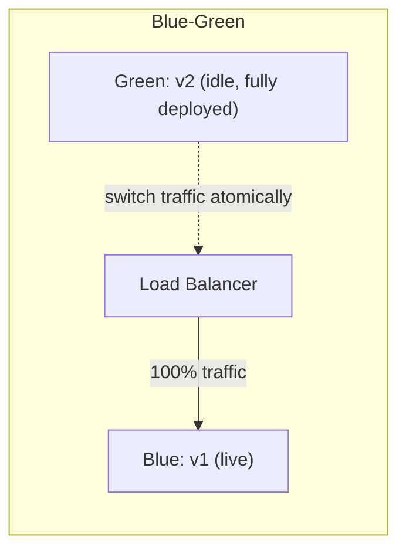

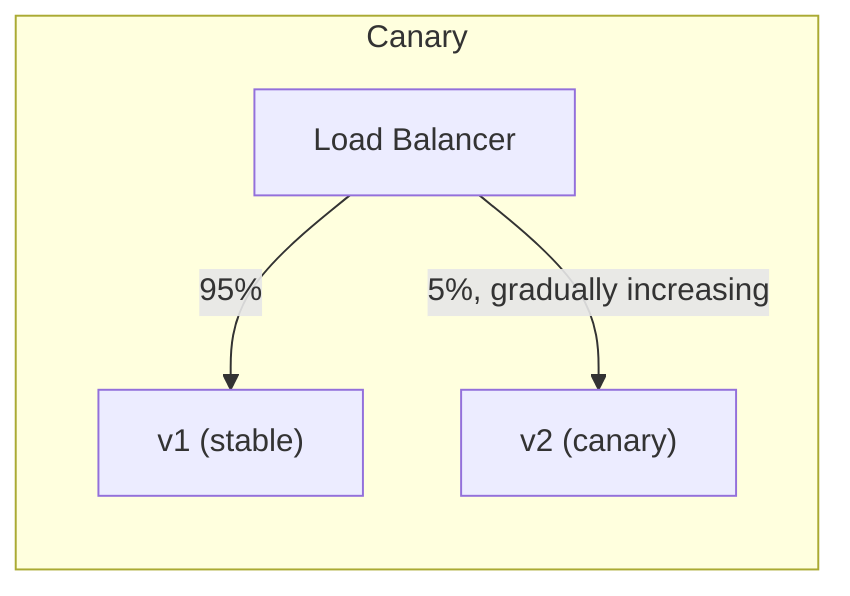

**Q: What key mechanics should a senior candidate name unprompted?**

A: Readiness probes (only route traffic once truly ready), backward-compatible DB migrations (must work with both old and new code during rollout), and graceful shutdown (drain in-flight requests before terminating).

**Q: Canary vs Blue-Green — which catches a bad deploy earlier?**

A: Canary — smaller blast radius, real production traffic, gradual exposure — but needs more sophisticated metrics-driven automation. Blue-Green is simpler to reason about but a bad deploy only surfaces after 100% of traffic has flipped.

### The Outbox Pattern

**Q: What problem does the Outbox Pattern solve?**

A: The dual-write problem — updating a DB and publishing an event to a message broker are two separate systems with no shared transaction; if done as two separate steps, one can succeed while the other fails, leaving the system inconsistent.

**Q: How does the Outbox Pattern work?**

A: Write the event to an `OutboxMessages` table in the **same DB transaction** as the business data change; a separate background relay/poller reads unpublished rows and publishes them to the broker, marking them processed on success.

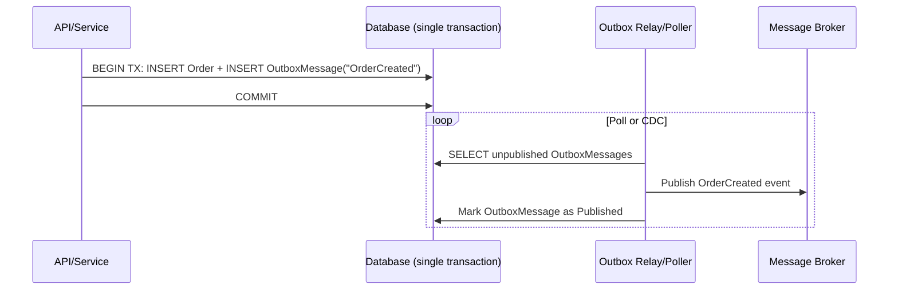

```csharp
public class OutboxMessage
{
    public Guid Id { get; set; }
    public string Type { get; set; }
    public string Payload { get; set; } // serialized event
    public DateTime CreatedAt { get; set; }
    public DateTime? ProcessedAt { get; set; }
}

// Inside the same DbContext SaveChanges transaction as the business entity:
_context.Orders.Add(order);
_context.OutboxMessages.Add(new OutboxMessage
{
    Id = Guid.NewGuid(),
    Type = "OrderCreated",
    Payload = JsonSerializer.Serialize(new { order.Id, order.CustomerId }),
    CreatedAt = DateTime.UtcNow
});
await _context.SaveChangesAsync(); // atomic: both rows commit together, or neither does
```

**Q: What senior-level nuance applies to the relay's delivery guarantee?**

A: It delivers **at-least-once** (can crash after publishing but before marking processed, causing re-publish) — consumers must be idempotent. This is the real mechanism behind most "exactly-once" claims: at-least-once delivery + idempotent consumers.

**Q: How does the outbox pattern relate to sagas?**

A: It's the standard building block for sagas (a sequence of local transactions across services, each triggered by the previous step's event) — the alternative to distributed two-phase-commit transactions.

### Eventual Consistency & Compensating Transactions

**Q: What is a compensating transaction?**

A: An explicit, business-meaningful "undo" action performed by a service that already committed a local change, when a later step in a distributed workflow fails (e.g., release reserved stock, refund a charge) — since there's no shared transaction to automatically roll back. This is the core mechanic of the Saga pattern.

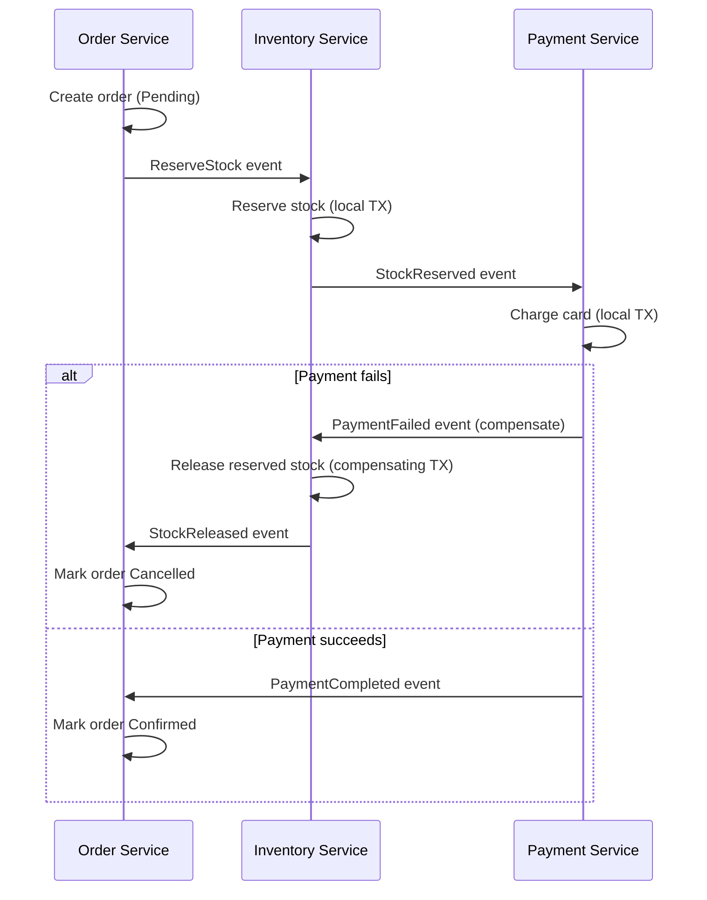

**Q: What should a senior candidate raise unprompted about designing for eventual consistency?**

A:
- UI must be honest about interim states ("confirming payment," not implying instant final success).
- Read models can lag — design to avoid "I just saved it but it's not there" bugs.
- Compensations aren't always possible (e.g., an already-sent email) — prevent irreversible side effects until the workflow is past realistic failure points.
- Idempotency and the outbox pattern are what make sagas reliable.

## Deployment & Observability

### Health Checks

**Q: How do you implement health checks in ASP.NET Core?**

A: `AddHealthChecks().AddDbContextCheck<AppDbContext>().AddCheck<...>().AddUrlGroup(...)`, then `app.MapHealthChecks("/health")`.

```csharp
builder.Services.AddHealthChecks()
    .AddDbContextCheck<AppDbContext>()
    .AddCheck<RedisHealthCheck>("redis")
    .AddUrlGroup(new Uri("https://downstream-api.com/health"), name: "downstream-api");

app.MapHealthChecks("/health");
```

```http
GET /health
```

**Q: Liveness vs readiness — why does the distinction matter?**

A: Liveness = is the process alive/should it be restarted. Readiness = is it ready to receive traffic (DB reachable, caches warm). Conflating them causes Kubernetes to restart a healthy-but-starting pod, or keep routing traffic to a pod whose DB is down — use separate endpoints/tags.

**Q: What's the risk of a readiness check that pings a downstream dependency?**

A: It can itself become a cascading-failure vector if that dependency is slow/down — bound it with a timeout and consider treating "downstream degraded" as `Degraded`, not necessarily `Unhealthy`.

### Dockerizing a .NET Web API

**Q: Why does a multi-stage Dockerfile matter?**

A: Building with the full `sdk` image but shipping the smaller `aspnet` runtime image keeps the final image lean (no compilers/build tooling in production) and reduces attack surface.

```dockerfile
# Build stage
FROM mcr.microsoft.com/dotnet/sdk:8.0 AS build
WORKDIR /src
COPY . .
RUN dotnet restore
RUN dotnet publish -c Release -o /app/publish

# Runtime stage
FROM mcr.microsoft.com/dotnet/aspnet:8.0 AS runtime
WORKDIR /app
COPY --from=build /app/publish .
EXPOSE 8080
ENTRYPOINT ["dotnet", "MyWebAPI.dll"]
```

```bash
docker build -t mywebapi .
docker run -p 5000:8080 mywebapi
```

**Q: What other Docker practices matter for a senior candidate?**

A: Pin exact base image tags (not `latest`); run as non-root user; use `.dockerignore` for `bin`/`obj`/`.git`; externalize config via env vars/mounted secrets, never bake secrets into the image; pair with health checks for orchestrator probes.

### Application Insights (Monitoring & Telemetry)

**Q: What does Application Insights give you out of the box?**

A: Automatic request/dependency tracking, exception tracking, live metrics, and distributed request correlation (`Operation Id` ties a logical request across service hops for an end-to-end Application Map trace).

```csharp
builder.Services.AddApplicationInsightsTelemetry(builder.Configuration["ApplicationInsights:ConnectionString"]);
```

```csharp
public class ProductsController : ControllerBase
{
    private readonly TelemetryClient _telemetry;
    public ProductsController(TelemetryClient telemetry) => _telemetry = telemetry;

    [HttpGet]
    public IActionResult Get()
    {
        _telemetry.TrackEvent("ProductsListRequested");
        return Ok("Success");
    }
}
```

**Q: How does Application Insights relate to OpenTelemetry today?**

A: Current-generation Application Insights is built on OpenTelemetry under the hood (via the Azure Monitor OpenTelemetry Distro) — it's effectively "OpenTelemetry instrumentation exported to Azure Monitor," not a separate competing technology.

**Q: When should you use custom events (`TrackEvent`) vs auto-instrumentation?**

A: Reserve custom events/metrics for business-level signals a dashboard/alert actually needs (e.g., "checkout completed") — not everything, or you drown useful signal in noise and ingestion cost.

## Performance

### Response Compression

**Q: Brotli vs Gzip, and when is compression not worth it?**

A: Brotli generally compresses text/JSON better than Gzip at comparable/better speed on modern CPUs — use it as primary with Gzip fallback. Not worth it for already-compressed content (images/video) or very small payloads (overhead exceeds savings); register `UseResponseCompression()` early in the pipeline.

```csharp
builder.Services.AddResponseCompression(options =>
{
    options.Providers.Add<BrotliCompressionProvider>();
    options.Providers.Add<GzipCompressionProvider>();
});
app.UseResponseCompression();
```

```http
Accept-Encoding: gzip, deflate, br
```

### Response Caching, Output Caching & Distributed Cache (Redis)

**Q: `[ResponseCache]`/`AddResponseCaching()` vs Output Caching — what's the difference?**

A: `[ResponseCache]` mostly manipulates HTTP caching headers and doesn't necessarily cache server-side. Output Caching (.NET 7+, `AddOutputCache()`/`UseOutputCache()`) is the actual server-side cache-the-response-body feature, supporting custom policies and tag-based eviction (`EvictByTagAsync`) — the modern recommendation.

```csharp
builder.Services.AddResponseCaching();
app.UseResponseCaching();

[ResponseCache(Duration = 60, Location = ResponseCacheLocation.Client)]
[HttpGet]
public IActionResult Get() => Ok("Cached Data");
```

```csharp
builder.Services.AddOutputCache(options =>
{
    options.AddPolicy("Products", policy => policy.Expire(TimeSpan.FromSeconds(60)).Tag("products"));
});
app.UseOutputCache();

app.MapGet("/api/products", () => Ok(products)).CacheOutput("Products");

// Later, on a write:
await outputCacheStore.EvictByTagAsync("products", cancellationToken);
```

**Q: Why does Redis matter for caching in microservices?**

A: As instance count scales, `IMemoryCache` diverges per instance — a hit on instance A is a miss on instance B. Redis provides one shared cache all instances read from, keeping cached state consistent across the fleet.

```csharp
builder.Services.AddStackExchangeRedisCache(options =>
{
    options.Configuration = "redis:6379";
    options.InstanceName = "app_";
});

var value = await cache.GetStringAsync("product_10");
if (value is null)
{
    value = await FetchFromDbAndSerialize();
    await cache.SetStringAsync("product_10", value, new DistributedCacheEntryOptions
    {
        AbsoluteExpirationRelativeToNow = TimeSpan.FromMinutes(10)
    });
}
```

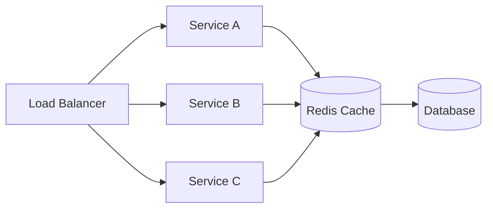

**Q: Name common caching pitfalls and mitigations.**

A:
- Cache Stampede — many concurrent requests hit the DB on expiry → distributed locks, cache warming, jittered TTLs.
- Cache Invalidation — DB updated but cache stale → delete-on-write, write-through, event-driven invalidation.
- Storing Too Much Data → cache only hot data, set TTLs.
- Serialization Problems → compact formats (MessagePack), trimmed DTOs.
- Redis as Primary Store → treat Redis as disposable, not a system of record.
- Connection Mismanagement → reuse a shared `IConnectionMultiplexer` singleton.

### ETags & Conditional Requests

**Q: How do ETags support conditional GET and optimistic concurrency?**

A: `ETag` + `If-None-Match` — conditional GET; server returns `304 Not Modified` if the client's cached copy is current, saving bandwidth. `ETag` + `If-Match` — optimistic concurrency for writes; reject with `412 Precondition Failed` if the resource changed since the client last read it (HTTP-layer analogue to EF Core's `[ConcurrencyCheck]`/`RowVersion`).

```csharp
[HttpGet("{id}")]
public async Task<IActionResult> GetProduct(int id)
{
    var product = await _context.Products.FindAsync(id);
    if (product is null) return NotFound();

    var etag = $"\"{product.RowVersion.ToBase64()}\"";
    Response.Headers.ETag = etag;

    if (Request.Headers.IfNoneMatch == etag)
        return StatusCode(StatusCodes.Status304NotModified);

    return Ok(product);
}

[HttpPut("{id}")]
public async Task<IActionResult> UpdateProduct(int id, [FromBody] Product update)
{
    var product = await _context.Products.FindAsync(id);
    if (product is null) return NotFound();

    var currentEtag = $"\"{product.RowVersion.ToBase64()}\"";
    if (Request.Headers.IfMatch != currentEtag)
        return StatusCode(StatusCodes.Status412PreconditionFailed); // someone else updated it first

    // apply update, DB concurrency token check enforces this at the data layer too
    await _context.SaveChangesAsync();
    return NoContent();
}
```

### Query & EF Core Performance

```csharp
var products = _context.Products.AsNoTracking().ToList();
```

**Q: List the senior-level EF Core performance checklist.**

A:
- `AsNoTracking()` for read-only queries.
- Avoid N+1 — use `.Include()`/`.ThenInclude()` or projections instead of full entities.
- Compiled queries (`EF.CompileAsyncQuery`) for hot, repeated query shapes.
- `.AsSplitQuery()` to avoid cartesian explosion when eager-loading multiple collections.
- Diagnose via `.ToQueryString()`, query logging, or DB execution plans; check for missing indexes.
- Paginate at the DB level (`Skip/Take` before `ToList()`), not in memory.
- Dapper/raw ADO.NET for genuine hotspots where EF overhead measurably matters — profile first.

### Soft Delete Pattern

**Q: Why prefer soft delete over physical DELETE?**

A: Preserves audit history and avoids cascade-breaking foreign keys — an `IsDeleted` flag instead of removing the row.

```csharp
public class Product
{
    public int Id { get; set; }
    public string Name { get; set; }
    public bool IsDeleted { get; set; }
}

[HttpDelete("{id}")]
public async Task<IActionResult> SoftDelete(int id)
{
    var product = await _context.Products.FindAsync(id);
    if (product is null) return NotFound();

    product.IsDeleted = true;
    await _context.SaveChangesAsync();
    return NoContent();
}
```

**Q: How do you avoid manually filtering every query for `IsDeleted`?**

A: An EF Core global query filter in `OnModelCreating`: `modelBuilder.Entity<Product>().HasQueryFilter(p => !p.IsDeleted);` — applies automatically to every LINQ query including `Include()`d navigations. Use `.IgnoreQueryFilters()` for admin/audit queries that need deleted rows.

```csharp
protected override void OnModelCreating(ModelBuilder modelBuilder)
{
    modelBuilder.Entity<Product>().HasQueryFilter(p => !p.IsDeleted);
}
```

**Q: What trade-offs come with soft delete?**

A: Unique constraints need filtered/partial indexes (`WHERE IsDeleted = 0`); decide whether children of a soft-deleted parent cascade-flag too; soft delete isn't a substitute for a real retention/purge policy; GDPR "right to be forgotten" may require scrubbing PII fields even while retaining the row.

### Async/Await Pitfalls

**Q: Why is `Task.Run` in an ASP.NET Core request handler almost always wrong?**

A: It just moves work to another thread pool thread — doesn't add parallelism for a single request and can worsen thread pool starvation under load.

**Q: Is blocking on async code (`.Result`/`.Wait()`) dangerous in ASP.NET Core specifically?**

A: Less of a deadlock risk than classic ASP.NET/WCF/WinForms since ASP.NET Core has no `SynchronizationContext` by default, but it still wastes a thread pool thread and remains an anti-pattern for testability/composability; widespread blocking can still starve the thread pool under load.

**Q: What's the `ValueTask` gotcha?**

A: `ValueTask<T>` avoids a heap allocation on synchronous completion (e.g., cache hit) but **must not be awaited twice or stored/awaited concurrently** — unlike `Task`, which is safe to await multiple times.

**Q: Where does `ConfigureAwait(false)` actually matter?**

A: Mostly in library code with no dependency on a captured context — largely a non-issue in ASP.NET Core app/controller code (no `SynchronizationContext`), but still good hygiene in shared libraries consumed by contexts that do have one (WPF/WinForms).

## Security

### Securing a Web API — Full Checklist

**Q: List the full Web API security checklist.**

A: Authentication (JWT/OAuth2/API keys), Authorization (roles/claims/policies), CORS, Rate limiting, Input validation/sanitization, HTTPS/TLS everywhere, Secrets management (Key Vault/env vars), Security headers (HSTS, CSP, X-Content-Type-Options).

**Q: How do you prevent SQL injection in EF Core / ADO.NET?**

A: EF Core's LINQ provider parameterizes queries automatically. For raw SQL, prefer `FromSqlInterpolated` or explicit parameters over `FromSqlRaw` string concatenation — never concatenate user input into a query string.

```csharp
// BAD
string query = "SELECT * FROM users WHERE username = '" + userInput + "'";

// GOOD — parameterized
var command = new SqlCommand("SELECT * FROM users WHERE username = @username", connection);
command.Parameters.AddWithValue("@username", userInput);
```

**Q: What's the main XSS risk for an API specifically?**

A: Usually the frontend trusting API responses without escaping, but APIs should still validate/sanitize stored input to avoid becoming a stored-XSS vector for other consumers.

**Q: Show a Data Annotations validation example for input sanitization.**

A:

```csharp
public class User
{
    [Required][StringLength(50)] public string Username { get; set; }
    [EmailAddress] public string Email { get; set; }
}
```

### SSL/TLS Fundamentals

**Q: What are the three guarantees TLS provides?**

A: Confidentiality (encryption), authentication (server identity via CA-signed cert), integrity (tamper detection). It protects data in transit only, not at rest.

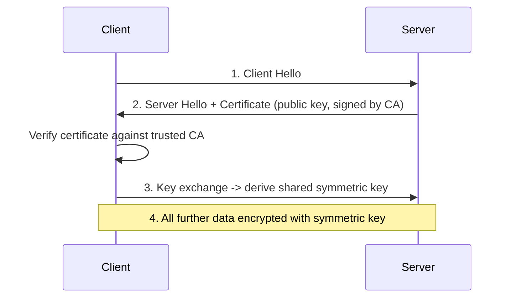

**Q: Why hybrid crypto (asymmetric handshake + symmetric bulk transfer)?**

A: Asymmetric crypto negotiates a shared symmetric key during the handshake; symmetric crypto is orders of magnitude faster for bulk data transfer afterward.

**Q: What does HSTS do?**

A: `Strict-Transport-Security` forces browsers to only use HTTPS for a domain going forward, closing the downgrade-attack window on the very first request.

**Q: Where does TLS termination commonly happen?**

A: At a load balancer/IIS/reverse proxy, with the backend receiving plain HTTP internally within a trusted network boundary.

### Token Revocation & Refresh Tokens

**Q: Why is JWT revocation fundamentally hard?**

A: JWTs are stateless/self-contained by design — the server doesn't check a database per request, which is the point. A leaked JWT stays valid until it expires; there's no built-in early-invalidation mechanism.

```csharp
public class TokenService
{
    private static readonly List<string> _blacklistedTokens = new();
    public void RevokeToken(string token) => _blacklistedTokens.Add(token);
    public bool IsTokenRevoked(string token) => _blacklistedTokens.Contains(token);
}
```

**Q: Why is a naive in-memory token blacklist (`static List<string>`) inadequate?**

A: It's per-instance — revoking on instance A does nothing for instances B/C in a horizontally scaled deployment.

**Q: What's the production-correct approach to revocation?**

A: A shared distributed revocation store (Redis, TTL matching remaining token life), or — more commonly — avoid the problem: keep access tokens short-lived, and use server-side-stored refresh tokens (DB) for long sessions so they can be revoked/rotated on demand.

```csharp
[HttpPost("refresh-token")]
public async Task<IActionResult> RefreshToken([FromBody] TokenRequest request)
{
    var user = await _context.Users.SingleOrDefaultAsync(u => u.RefreshToken == request.RefreshToken);
    if (user == null || user.RefreshTokenExpiry < DateTime.UtcNow)
        return Unauthorized();

    var newAccessToken = GenerateJwtToken(user);
    user.RefreshToken = GenerateRefreshToken(); // rotate on use — prevents replay of an old refresh token
    await _context.SaveChangesAsync();

    return Ok(new { Token = newAccessToken, RefreshToken = user.RefreshToken });
}

private string GenerateRefreshToken() => Convert.ToBase64String(RandomNumberGenerator.GetBytes(64));
```

**Q: What is refresh token rotation, and why does it matter?**

A: Issue a new refresh token on every use and invalidate the old one — lets you detect theft: if a stolen (already-rotated) refresh token is replayed, you know it was compromised and can revoke the whole token family.

### Two-Factor Authentication

**Q: Rank common 2FA mechanisms by strength.**

A: SMS-based 2FA is weakest (vulnerable to SIM-swapping); TOTP apps (Google Authenticator/Authy) or WebAuthn/FIDO2 passkeys are stronger and increasingly preferred.

```csharp
var token = await _userManager.GenerateTwoFactorTokenAsync(user, TokenOptions.DefaultPhoneProvider);
await _smsService.SendSmsAsync(user.PhoneNumber, $"Your verification code is {token}");

var isValid = await _userManager.VerifyTwoFactorTokenAsync(user, TokenOptions.DefaultPhoneProvider, inputToken);
if (!isValid) return Unauthorized();
```

## Best Practices

**Q: Summarize the guide's Web API best practices.**

A:
- Design resource-oriented URLs, use verbs/status codes correctly, stay consistent on casing/pluralization.
- Use DTOs at boundaries — never bind directly to EF entities.
- Version from day one for any API with external/cross-team consumers.
- Return Problem Details (RFC 7807/9457) for all errors, not ad hoc shapes.
- Make POST/PUT idempotent where business meaning allows; use idempotency keys otherwise.
- Prefer cursor-based pagination for large/high-write/public collections.
- Use `IHttpClientFactory` for all outbound HTTP.
- Keep controllers thin — business logic lives in services/domain layer.
- Use structured logging with correlation IDs + distributed tracing (OpenTelemetry).
- Enforce HTTPS/HSTS everywhere; never disable certificate validation "temporarily."
- Fail closed on authorization — default-deny, explicit allow.
- Load-test/profile before optimizing (`dotnet-counters`/`dotnet-trace`), not guesswork.
- Treat your API as a product — document it, give it an SLA/deprecation policy.

## Common Pitfalls

**Q: What are the guide's flagged common pitfalls?**

A:
- Assuming PATCH is idempotent by default.
- Leaking raw exception messages/stack traces to clients.
- Wildcard CORS combined with credentials.
- Injecting a Scoped service (`DbContext`) directly into a Singleton.
- Offset-based pagination on a large, frequently-mutated table.
- Treating Redis as a system of record instead of a disposable cache.
- In-memory-per-instance rate limiting counters creating a false "global" limit.
- Exposing OData/`$filter`/`$expand` without page-size caps or query cost limits.
- Blocking on async code (`.Result`/`.Wait()`) in request paths.
- Repository-pattern-wrapping EF Core's `DbContext` without concrete justification.
- Writing redundant manual `ModelState.IsValid` checks under `[ApiController]`.
- Assuming a JWT can be "logged out" server-side without a revocation store or short-expiry + refresh strategy.

## Sample Interview Q&A

**Q: Explain the ASP.NET Core request pipeline and where middleware fits.**

A: Kestrel builds `HttpContext`, which flows through an ordered middleware pipeline (exception handling → HTTPS redirection → routing → authentication → authorization → custom middleware), into endpoint execution, through filters, and back out in reverse. `Use` continues the pipeline; `Run` terminates/short-circuits it.

**Q: How do you avoid socket exhaustion when using `HttpClient`?**

A: Use `IHttpClientFactory` (named/typed clients) instead of `new HttpClient()` per call or a naive static singleton — pools/recycles handlers on rotation, giving connection reuse without DNS staleness.

**Q: How would you diagnose a slow EF Core query in production?**

A: Capture generated SQL via `.ToQueryString()`/query logging, run `EXPLAIN`/execution plan, check for missing indexes, look for N+1 patterns, confirm `AsNoTracking()` on read-only paths.

**Q: When would you choose gRPC over REST?**

A: Internal service-to-service calls under your control needing low latency/high throughput, strongly-typed `.proto` contracts, and/or native bidirectional streaming. REST remains the default for public APIs and broad compatibility.

**Q: How do you design idempotent retries for a payment API?**

A: Require a client-supplied idempotency key per logical operation; store the key with the result atomically; on retry with the same key return the stored result; handle concurrent in-flight requests explicitly (409/425).

**Q: How do you handle a long-running operation triggered by a POST?**

A: Return `202 Accepted` with a `Location` header, enqueue the work to a background processor, let the client poll or register a webhook — never block the original request on the full duration.

**Q: What's the difference between authentication and authorization, and where does each fail in the pipeline?**

A: Authentication (who you are) runs first, populates `HttpContext.User`; failure typically yields anonymous identity rather than stopping the pipeline. Authorization (what you can do) runs after; failure returns 401/403 and the controller action never executes.

**Q: Why can't you inject `DbContext` into a Singleton service?**

A: `DbContext` is Scoped and not thread-safe; a Singleton is shared across concurrent requests, so direct injection causes a lifetime-validation exception or race conditions. Fix: inject `IServiceScopeFactory` and create a scope per operation.

**Q: Offset vs cursor pagination — when would you pick each?**

A: Offset for smaller, relatively static datasets needing "jump to page N"/total-page-count UI (admin grids). Cursor for large, high-write, or public-facing collections (feeds, Stripe/GitHub-style APIs) — immune to row-shift artifacts, consistent indexed seek.

**Q: How do you keep an API backward compatible while evolving it?**

A: Version explicitly (URL path is the pragmatic default), add fields rather than change/remove them within a version, gate breaking changes behind a new version, publish a deprecation timeline (`Sunset`/`Deprecation` headers), validate with consumer-driven contract tests in CI.
