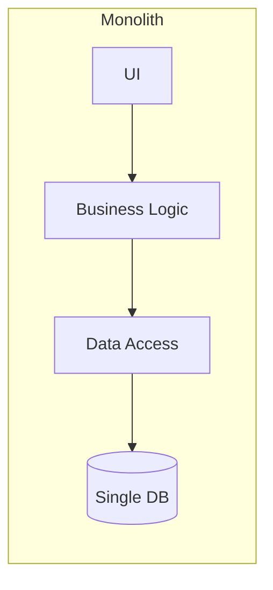
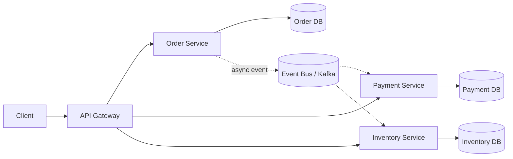
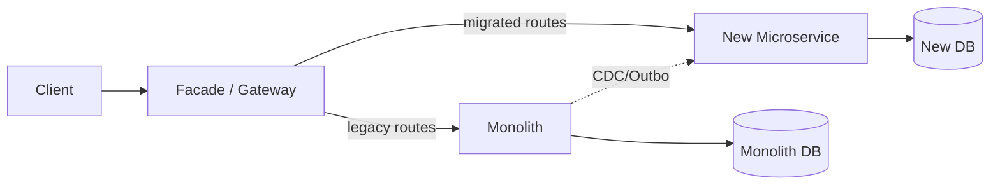
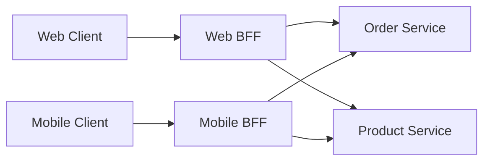
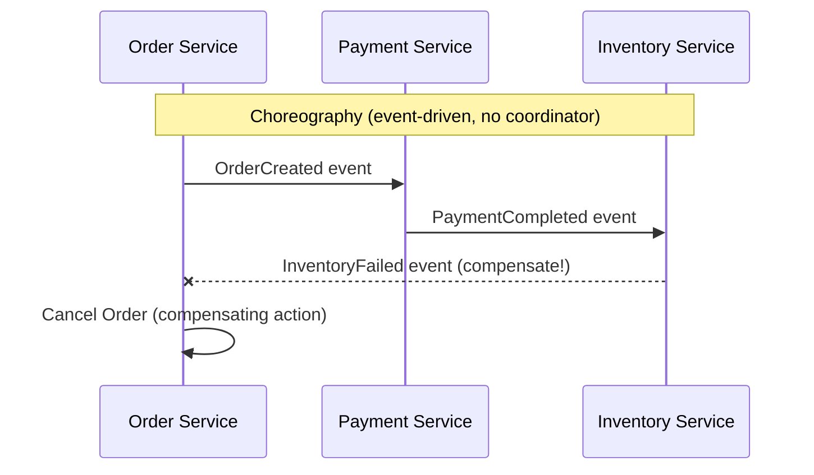
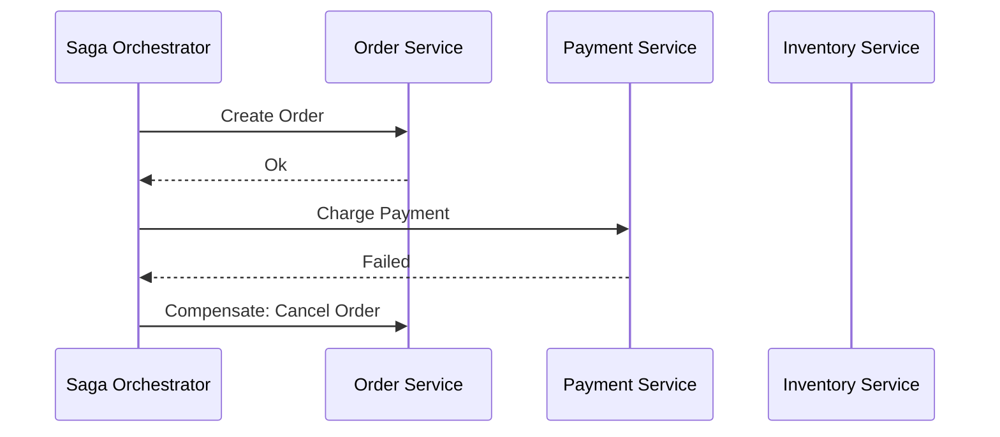
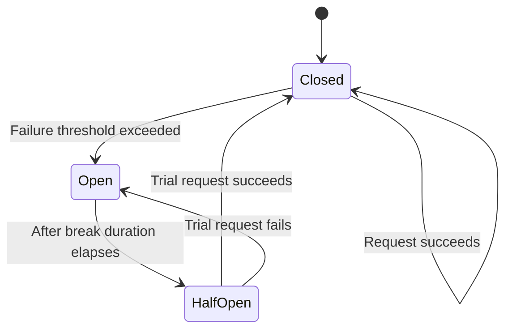
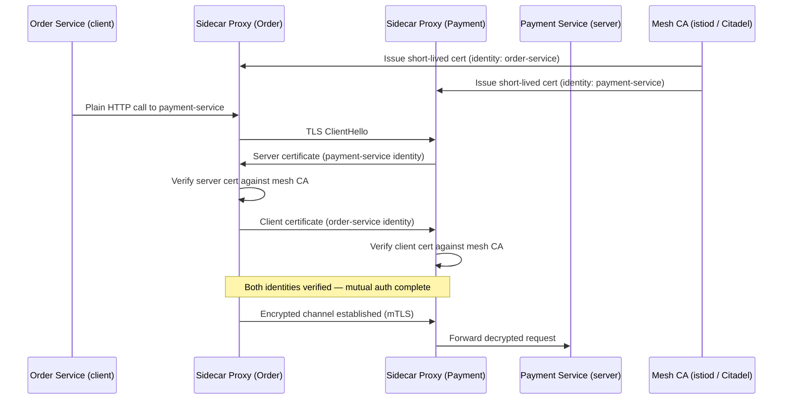
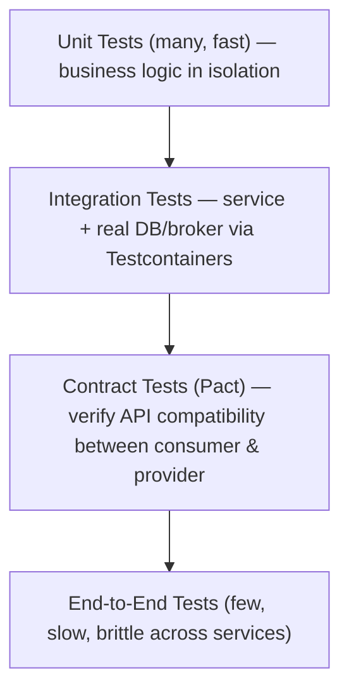

# Microservices — Interview Revision Notes

> Quick-revision Q&A derived from `H. Microservices-Interview-Guide.md`. Covers every section of the source.

## Core Concepts

### What are microservices?

**Q: What is a microservices architecture?**

A: An architectural style where an app is composed of small, independently deployable services, each owning one business capability, communicating over a network (not in-process). Each service is developed, deployed, scaled, and owned by a single team independently.

**Q: Give an example decomposition for e-commerce.**

A: Order Service (order lifecycle), Payment Service (transactions), Inventory Service (stock), Shipping Service (logistics).

### Monolith vs Microservices

**Q: How do monoliths and microservices differ across deployment, scaling, and data?**

A:
- Monolith: single deploy unit, scales as a whole, single tech stack, single shared DB, simpler testing, low ops overhead.
- Microservices: independent deploys, scale per service, polyglot stacks, database-per-service, harder testing (contract/integration), high ops overhead (orchestration, tracing, mesh).





### Advantages

**Q: What are the main advantages of microservices?**

A:
- Scalability — scale only the hot service.
- Technology independence — polyglot persistence/runtimes.
- Fault isolation (if resilience patterns are applied).
- Faster parallel development (Conway's Law).
- Independent deployability.

### Challenges

**Q: What are the main challenges/costs of microservices?**

A:
- Distributed systems complexity (discovery, partial failures, cross-process debugging).
- Network latency / chatty calls (N+1 fan-out).
- Data consistency — no cross-service ACID, must reason about eventual consistency.
- Larger security surface (many network-exposed endpoints).
- Operational cost — per-service CI/CD, centralized logging/tracing, service mesh.

**Q: When should you NOT use microservices?**

A:
- Small team (<2 pizza teams) or poorly understood domain → prefer a modular monolith.
- Microservices trade dev-time complexity for run-time/ops complexity; need CI/CD, containers, observability maturity *first*.
- Premature decomposition (wrong boundaries) is riskier than staying monolithic too long — fixing later means distributed refactoring.
- Rule of thumb: start monolith-first, extract services once boundaries are proven and a real scaling/autonomy pain exists.

---

## Service Design & Boundaries

**Q: How do you actually decide where microservice boundaries go?**

A:
- Decompose by **business capability**, never by technical layer ("UI service", "DB service").
- **Bounded Context** (DDD) is the real unit of decomposition — a boundary where the domain model/ubiquitous language is consistent; the same term (e.g., "Customer") can mean different things in different contexts.
- **Context Mapping** patterns: Shared Kernel (small shared model, use sparingly), Customer/Supplier (upstream/downstream contract), Conformist (downstream accepts upstream's model), Anti-Corruption Layer (translates external/legacy model — key for strangler-fig migrations).
- **Event Storming** — workshop technique to discover bounded contexts with domain experts before coding.
- A transaction should never span more than one **Aggregate** — and rarely more than one service; needing a cross-service transaction signals a wrong boundary or the need for a Saga.
- "How big should a service be?" → sized by bounded context and team ownership (2-pizza team owning it end-to-end), not LOC.

### DDD Building Blocks

**Q: Name the core DDD building blocks used in service design.**

A:
- **Entities** — objects with identity (`Order`, `Customer`).
- **Value Objects** — immutable, no identity (`Address`).
- **Aggregates** — cluster of entities/VOs with a root enforcing invariants (`Order` + `OrderItem`s).
- **Repositories** — abstract data access per aggregate root.

```csharp
public class Order
{
    public int Id { get; set; }
    public List<OrderItem> Items { get; set; } = new();
}
```

### Hexagonal Architecture (Ports & Adapters)

**Q: What is Hexagonal Architecture and why does it matter?**

A: Separates core business logic from infrastructure. Core logic is framework/DB-agnostic; **Ports** are interfaces (`IOrderRepository`); **Adapters** are concrete implementations (EF Core repo, REST controller, message consumer). Makes services testable (swap adapters for test doubles) and framework-agnostic — the basis for Clean Architecture in senior .NET shops.

**Q: What are the mechanics of a Strangler Fig migration?**

A:
1. Put a Facade/Gateway in front of the monolith.
2. Pick a vertical slice (bounded context) to extract first — clearest boundary or highest pain (e.g., Search, Notifications).
3. Build the new microservice; gateway routes matching requests to it, rest still hits the monolith.
4. Data migration is hardest — often both old/new code read the monolith DB (views/CDC) until the new service owns it, then cut over writes.
5. Repeat, shrinking the monolith incrementally.
6. Key risk: **dual-write inconsistency** during transition — mitigate with Outbox or CDC (Debezium), not naive dual writes.



---

## Communication Patterns

### Synchronous vs Asynchronous

**Q: Sync vs async communication — what's the core trade-off?**

A: Sync (REST/gRPC) — caller blocks, temporal coupling (callee down = caller fails). Async (queues/events) — caller continues; decouples availability but adds eventual consistency, ordering, idempotency, and debugging complexity.

**Q: When would you choose sync vs async?**

A:
- Sync: read-heavy, request/response UX (e.g., "get product details"); needs immediate answer.
- Async: write-heavy workflows, cross-service side effects ("order placed → notify shipping, update inventory, email"); reduces cascading-failure risk of long sync chains.

### REST vs gRPC

**Q: Compare REST and gRPC, and when would you expose gRPC publicly?**

A: REST = HTTP/1.1, JSON/text, OpenAPI contract, weaker streaming, browser-native, good for public/external APIs. gRPC = HTTP/2, Protobuf binary, strict `.proto` contract, native streaming (unary/server/client/bidi), needs grpc-web proxy for browsers, best for internal service-to-service low-latency calls. Rarely expose gRPC publicly — common pattern is gRPC internally, REST/GraphQL at the edge via gateway translation.

### Message Queue vs Event Bus

**Q: Message queue vs event bus — differences and when to pick each?**

A: Queue (RabbitMQ) = point-to-point/competing consumers, short-term storage, FIFO per queue, typically no replay. Event bus (Kafka) = pub/sub fan-out, persistent replayable log, partition ordering, many independent consumer groups. Pick Kafka for replay/high-throughput/multiple independent consumers (analytics + fraud + notifications on "OrderPlaced"); pick RabbitMQ for simpler routing semantics and true work-queue semantics without needing replay.

### Event-Driven Architecture

**Q: What is event-driven architecture and its trade-offs?**

A: Services publish events on state changes; subscribers react — decoupled and async. Benefits: async, decoupled, natural audit trail. Downsides: harder to trace "what triggered this," eventual consistency, event schema evolution becomes a cross-team contract problem.

```csharp
channel.BasicPublish(exchange: "", routingKey: "order-placed",
    body: Encoding.UTF8.GetBytes("Order ID: 1234"));
```

### API Composition

**Q: What is the API Composition (aggregator) pattern, and its limit?**

A: An aggregator combines results from multiple services' calls for the client (e.g., fetch orders + customers separately, merge). Simple, but doesn't scale for large cross-service joins/filters — that's when CQRS with a denormalized read model is the better fit.

```csharp
var orders = await httpClient.GetFromJsonAsync<List<Order>>("orders-service/orders");
var customers = await httpClient.GetFromJsonAsync<List<Customer>>("customer-service/customers");
```

**Q: API Gateway vs Backend-for-Frontend (BFF) — what's the difference?**

A:
- **API Gateway** — one gateway for all client types, generic routing/auth/rate-limiting.
- **BFF** — a dedicated gateway per client type (web-bff, mobile-bff), shaping responses for that client's needs.
- A single generic gateway accumulates client-specific branching logic (anti-pattern); BFFs let frontend teams own aggregation independently.
- Trade-off: more services to run; still front BFFs with a thin edge gateway for shared cross-cutting concerns (auth, logging).



### API Gateway (core pattern)

**Q: What does an API Gateway do, and what would you actually use today in .NET?**

A: Single entry point routing to backend services; centralizes auth, rate limiting, load balancing, request transformation. Ocelot is the classic .NET-native gateway but has slowed in activity; many current .NET shops default to **YARP** (Microsoft-maintained, integrates with ASP.NET Core middleware) or a managed gateway (Azure APIM, Kong, AWS API Gateway).

```json
{
  "Routes": [
    {
      "DownstreamPathTemplate": "/api/products",
      "DownstreamScheme": "http",
      "DownstreamHostAndPorts": [ { "Host": "localhost", "Port": 5001 } ],
      "UpstreamPathTemplate": "/products",
      "UpstreamHttpMethod": [ "GET" ]
    }
  ]
}
```

### API Gateway vs Reverse Proxy

**Q: How does an API Gateway differ from a plain reverse proxy?**

A: API Gateway is application-aware — AuthN/AuthZ, rate limiting, transformation, aggregation. Reverse proxy is mostly protocol-aware — load balancing, TLS termination, basic routing.

### Request Aggregation / API Gateway Caching

**Q: What do "aggregation" and "caching" mean at the gateway layer?**

A: Aggregation — gateway combines multiple downstream calls into one client-facing response. Caching — gateway caches responses to cut backend load (e.g., Nginx `proxy_cache_path`).

```nginx
proxy_cache_path /var/cache/nginx levels=1:2 keys_zone=mycache:10m;
```

---

## Data Management & Consistency

### Database per Service

**Q: What does "database per service" mean and what does it force you to solve?**

A: Each service owns its own DB/schema; no direct cross-service DB access. Enables independent schema evolution and polyglot persistence, but forces explicit solutions for cross-service queries and transactions.

```csharp
public class OrderContext : DbContext
{
    public DbSet<Order> Orders { get; set; }
}
```

**Q: How do you handle queries that need data from multiple services?**

A:
- API Composition (simple aggregator, doesn't scale for big joins).
- **CQRS with materialized read models** — read-side service subscribes to domain events and builds a denormalized query-optimized view (Elasticsearch/Redis/reporting DB); reads never fan out at request time.
- **BFF aggregation** — when it's client-specific rather than general reporting.

### CQRS

**Q: What is CQRS?**

A: Separates the write model (commands) from the read model (queries), often backed by different stores. Command Handler validates/writes to primary DB; Query Handler reads from a separate (denormalized/replica) store.

```csharp
// Write
POST /orders   // handled by Command Handler → writes to primary DB

// Read
GET /orders    // handled by Query Handler → reads from read replica / projection
```

**Q: Does CQRS require Event Sourcing?**

A: No — independent patterns often paired but not required together. CQRS can run on two relational tables/views; Event Sourcing pairs well because its event stream naturally feeds read-model projections, but plain CQRS + read replica is far more common and simpler operationally.

### Distributed Transactions — Saga Pattern

**Q: Why not use 2PC across services, and what's the alternative?**

A: 2PC doesn't scale (blocking, availability trade-offs; many brokers/NoSQL stores don't support it). **Saga** = sequence of local transactions, each with a compensating transaction to undo it on failure.





**Q: Choreography vs Orchestration — compare them.**

A:
- **Choreography** — services react to each other's events directly, no coordinator; loose coupling but poor visibility of the overall flow, gets messy as steps grow; good for 2-3 step simple workflows; tooling = plain pub/sub.
- **Orchestration** — central orchestrator tells each service what to do and handles compensation; good visibility, scales better for complex flows but the orchestrator can become a god-service; tooling = MassTransit saga state machine, Temporal, Azure Durable Functions, AWS Step Functions, Camunda.

**Q: Show a simple compensating-transaction example.**

A:
```csharp
if (!PaymentService.ProcessPayment(order.Id))
{
    OrderService.RollbackOrder(order.Id);
}
```

### Outbox Pattern

**Q: What problem does the Outbox pattern solve, and how does it work?**

A: Solves the **dual-write problem** (can't atomically update DB and publish a message as two separate operations).
1. Insert the event into an `Outbox` table within the same local DB transaction as the business update.
2. A background poller or CDC process (e.g., Debezium) reads unpublished rows and publishes to the broker.
3. Mark published/delete once acked.
Guarantees at-least-once delivery aligned with the DB transaction.

**Q: What's the nuance between polling-publisher and CDC-based Outbox implementations?**

A: Polling publisher — simple, adds latency and DB load. CDC-based (Debezium tails the transaction log) — near real-time, no polling overhead, but adds operational complexity of running Debezium/Kafka Connect. Either way, consumers must be idempotent since delivery is at-least-once.

### Idempotency

**Q: What is idempotency and why does it matter?**

A: Repeating the same request produces the same effect — critical because at-least-once delivery (retries/redeliveries) is the norm in distributed systems.

```
POST /api/orders?IdempotencyKey=abcd1234
```

**Q: How do you actually implement idempotency?**

A:
- Client generates a unique idempotency key (GUID) per logical operation.
- Server stores `(IdempotencyKey, Result)` with a TTL; repeat requests short-circuit and return the original stored response.
- For message consumers: dedupe by message ID against a processed-messages store, or use naturally idempotent operations (UPSERT vs INSERT, "set status" vs "increment").

### Concurrency Control

**Q: Compare optimistic locking, pessimistic locking, and eventual consistency.**

A:
- **Optimistic** — assume conflicts rare; detect via version/rowversion column, retry on conflict.
- **Pessimistic** — lock upfront to block concurrent writers; simpler correctness but hurts throughput; generally discouraged across service/network boundaries.
- **Eventual consistency** — accept temporary staleness, reconcile via events.

```csharp
public class Order
{
    public int Id { get; set; }
    [ConcurrencyCheck]
    public int Version { get; set; }
}
```

### Read Replicas & Sharding

**Q: What's the trade-off with read replicas?**

A: Offloads read traffic from primary, but replicas can lag — "read-your-own-write" needs care (read from primary right after a write, or route session reads to primary temporarily).

**Q: Compare sharding strategies.**

A:
- **Range-based** — e.g., A–M / N–Z; simple but risks hot shards.
- **Hash-based** — even distribution, harder range queries.
- **Geo-based** — split by region; good for residency/latency, but cross-region joins are expensive.

### Database Migrations

**Q: How do you run schema migrations in a live microservices environment safely?**

A: Use EF Core Migrations or Flyway/Liquibase, version-controlled. Migrations must be **backward-compatible during rollout** since old/new versions run simultaneously in rolling deploys. Use **expand/contract**: add new columns/tables (expand) → deploy code writing to both → remove old schema once fully rolled out (contract). Never do a breaking single-step change with >1 replica.

```bash
dotnet ef migrations add InitDatabase
dotnet ef database update
```

---

## Resilience & Fault Tolerance

### Circuit Breaker Pattern

**Q: What does a circuit breaker do?**

A: Prevents repeatedly calling a failing dependency, giving it time to recover and protecting the caller from cascading failure/thread exhaustion (e.g., Polly: open circuit after 2 failures for 30s).

```csharp
services.AddHttpClient("OrderService")
    .AddTransientHttpErrorPolicy(policy =>
        policy.CircuitBreakerAsync(2, TimeSpan.FromSeconds(30)));
```

**Q: Describe the circuit breaker state machine.**



A:
- **Closed** — requests flow normally, failures counted.
- **Open** — requests fail fast immediately for the break duration, no call attempted.
- **Half-Open** — after timeout, a limited trial request is let through; success → Closed, failure → back to Open.

**Q: What changed in Polly v8+?**

A: Moved from chained policies to the **ResiliencePipeline** builder model, integrated with `IHttpClientFactory` via `AddResilienceHandler`/`AddStandardResilienceHandler()` (in `Microsoft.Extensions.Http.Resilience`), bundling retry + circuit breaker + timeout out of the box.

```csharp
services.AddHttpClient("OrderService")
    .AddResilienceHandler("standard", builder =>
    {
        builder.AddRetry(new RetryStrategyOptions
        {
            MaxRetryAttempts = 3,
            BackoffType = DelayBackoffType.Exponential
        });
        builder.AddCircuitBreaker(new CircuitBreakerStrategyOptions
        {
            FailureRatio = 0.5,
            SamplingDuration = TimeSpan.FromSeconds(30)
        });
        builder.AddTimeout(TimeSpan.FromSeconds(5));
    });
```

### Retry Pattern

**Q: What are the rules for safe retries?**

A:
- Pair retries with **exponential backoff + jitter** to avoid thundering-herd retry storms.
- Only retry **idempotent** operations (or ones with an idempotency key) — blind retry of a non-idempotent POST can duplicate orders/charges.
- Cap total attempts and combine with a circuit breaker.

### Bulkhead Pattern

**Q: What is the Bulkhead pattern?**

A: Isolates resources (thread/connection pools) per dependency so a slow/failing one can't exhaust resources needed by others — named after ship compartments (e.g., Polly `AddBulkheadPolicy(100, 10)`).

```csharp
services.AddHttpClient("PaymentService")
    .AddBulkheadPolicy(100, 10); // 100 concurrent, 10 queued requests
```

### Rate Limiting / Throttling

**Q: What rate limiter algorithms exist and what does .NET support?**

A:
- **Fixed Window** — N requests per fixed window; can allow 2x burst at window edges (`GetFixedWindowLimiter`).
- **Sliding Window** — smooths the edge-burst problem (`GetSlidingWindowLimiter`).
- **Token Bucket** — tokens refill steadily, allows controlled bursts (`GetTokenBucketLimiter`).
- **Concurrency** — caps concurrent in-flight requests (`GetConcurrencyLimiter`).
ASP.NET Core's built-in `Microsoft.AspNetCore.RateLimiting` (since .NET 7) is now standard over third-party packages.

```csharp
services.AddRateLimiter(options =>
{
    options.GlobalLimiter = RateLimitPartition.GetFixedWindowLimiter(
        TimeSpan.FromSeconds(10), 100);  // 100 requests per 10 sec
});
```

### Dead Letter Queue (DLQ)

**Q: What is a DLQ and how is it implemented?**

A: Stores messages that failed after exceeding retry limits, for inspection/reprocessing instead of dropping or endlessly retrying (poison message problem). RabbitMQ uses a Dead Letter Exchange (DLX); AWS SQS has native DLQ with max-receive-count redrive policy. Always alert/monitor DLQ depth — a growing DLQ is a silent failure signal.

### Sidecar & Ambassador Patterns

**Q: Sidecar vs Ambassador — what's the difference?**

A: **Sidecar** — helper container alongside the main service (same pod) handling cross-cutting concerns (logging, monitoring, proxying, TLS) without polluting app code. **Ambassador** — a specialization focused on proxying outbound/inbound network calls (auth, retries, circuit breaking) — exactly what an Envoy sidecar does in a service mesh.

```yaml
containers:
- name: order-service
  image: order-service:v1
- name: envoy
  image: envoyproxy/envoy
```

**Q: Service Mesh vs library-based resilience (Polly) — compare.**

A:
| Aspect | Library (Polly) | Service Mesh (Istio/Linkerd) |
|---|---|---|
| Logic location | App code, per language | Infrastructure (sidecar), language-agnostic |
| Consistency | Depends on every team | Enforced centrally |
| Ops overhead | Low (NuGet package) | High (sidecar, control plane, latency hop) |
| Observability | App-level only | Uniform mesh-wide, "for free" |

Pragmatic answer: single/few-language .NET shops usually prefer Polly; service mesh earns its complexity at large polyglot scale or when uniform mTLS/traffic policy is a hard requirement.

**Q: How does Istio implement circuit breaking at the mesh layer?**

A: Via `DestinationRule` `outlierDetection` (e.g., 5 consecutive errors in 10s ejects the instance from the load-balancing pool for 30s) — same concept as Polly's circuit breaker, enforced in infrastructure instead of app code.

```yaml
apiVersion: networking.istio.io/v1alpha3
kind: DestinationRule
metadata:
  name: order-service
spec:
  host: order-service
  trafficPolicy:
    outlierDetection:
      consecutiveErrors: 5
      interval: 10s
      baseEjectionTime: 30s
```

---

## Security

### Authentication & Authorization

**Q: What roles do JWT, OAuth 2.0, and the API Gateway play in AuthN/AuthZ?**

A: JWT — self-contained signed token carrying identity/claims, verified without a round-trip to the auth server. OAuth 2.0 — authorization framework for delegated, token-based access. API Gateway — centralizes AuthN at the edge instead of duplicating per service.

```csharp
services.AddAuthentication(JwtBearerDefaults.AuthenticationScheme)
    .AddJwtBearer(options =>
    {
        options.Authority = "https://your-auth-server";
        options.Audience = "your-api";
    });
```

**Q: Disambiguate OAuth 2.0, OpenID Connect, and JWT.**

A:
- **OAuth 2.0** — authorization framework (delegated access); doesn't define authentication itself.
- **OIDC** — identity layer on top of OAuth 2.0; adds the ID token (a JWT with standardized identity claims).
- **JWT** — just a token format (signed claims payload), not a protocol; OAuth/OIDC tokens are commonly but not necessarily JWTs.
- Gotcha: never put sensitive/PII data unencrypted in a JWT payload — JWTs are typically signed, not encrypted, so the payload is base64-readable.

**Q: What does an access token response look like?**

A:
```json
{
  "access_token": "eyJhbGciOiJIUzI1NiIsInR5cCI6IkpXVCJ9...",
  "expires_in": 3600,
  "token_type": "Bearer"
}
```

### Securing Internal (East-West) Communication

**Q: How do you secure service-to-service traffic?**

A: **mTLS** — both client and server present certificates; standard zero-trust internal auth, usually enforced by a service mesh. **JWT propagation** — pass the token along the call chain, often via a client-credentials OAuth flow for service identity.

```yaml
apiVersion: networking.istio.io/v1alpha3
kind: DestinationRule
spec:
  host: order-service
  trafficPolicy:
    tls:
      mode: MUTUAL
```

**Q: What is Zero Trust networking?**

A: Never trust the network perimeter alone — every service-to-service call is authenticated/authorized regardless of whether it originates "inside" the cluster/VPC. Service meshes are the common enabler since hand-rolled mTLS per service doesn't scale.

### Zero Trust Architecture & mTLS Deep Dive

**Q: Castle-and-moat vs Zero Trust — why did the model shift?**

A:
- **Castle-and-moat (old)** — strong perimeter (firewall/VPN); anything inside the network was implicitly trusted; internal traffic often plaintext, no per-call auth.
- **Zero Trust (current)** — no trusted location; every request is independently authenticated/authorized based on cryptographic identity, not IP/subnet.
- Drivers of the shift: ephemeral cloud-native infra (no stable perimeter), lateral-movement breach risk (compromise one pod, move internally unchecked), compliance mandates, and multi-tenant clusters where "inside the cluster" isn't a real trust boundary.

**Q: How does mTLS actually implement service-to-service auth?**

A:
1. Each service gets its own **X.509 certificate** representing workload identity (not a human identity).
2. A private **CA** (mesh control plane — Istio's istiod/Citadel, Linkerd's identity component) issues these automatically per workload.
3. Certs are short-lived (hours) and auto-rotated — no manual renewal, small exposure window if leaked.
4. Both sides present certs during the TLS handshake and verify against the shared CA before traffic flows — mutual auth + encryption in one handshake.



**Q: Why is mTLS almost always pushed into infrastructure rather than hand-rolled per service?**

A: Hand-rolling means every team manages cert issuance, distribution, rotation, and revocation per service per language — get rotation wrong once and services fail auth cluster-wide. A mesh's sidecar (Envoy/Linkerd2-proxy) transparently terminates/originates TLS; the app only speaks plain HTTP to its local sidecar.

**Q: Compare Istio and Linkerd.**

A:
| Aspect | Istio | Linkerd |
|---|---|---|
| Proxy | Envoy (feature-rich) | Linkerd2-proxy (lightweight, Rust) |
| Feature surface | Very broad | Narrower, core mesh problems |
| Complexity | Higher | Lower, "just works" |
| Overhead | Higher | Lower |
| Best fit | Large orgs, fine-grained traffic policy | Teams wanting mTLS+reliability with least overhead |

### API Key Authentication

**Q: When is a static API key acceptable?**

A: Simple but weak alone (static, no expiry/scoping) — acceptable for service-to-service/partner integrations behind a gateway doing rate limiting/IP allow-listing; not a substitute for OAuth on user-facing APIs.

```csharp
if (!Request.Headers.TryGetValue("X-API-KEY", out var apiKey) || apiKey != "my-secret-key")
{
    return Unauthorized();
}
```

### Secrets Management

**Q: How should secrets be managed?**

A: Never store secrets in code/config in source control; fetch at runtime from AWS Secrets Manager, Azure Key Vault, or HashiCorp Vault.

```csharp
var secret = await secretsManagerClient.GetSecretValueAsync(
    new GetSecretValueRequest { SecretId = "MyDatabaseSecret" });
```

### CORS

**Q: What's the common CORS misconfiguration to flag?**

A: `AllowAnyOrigin()` combined with credentials (cookies/auth headers) is disallowed by browsers and a common misconfig — always scope CORS to explicit trusted origins in production, never wildcard.

```csharp
services.AddCors(options =>
{
    options.AddPolicy("AllowAll", builder =>
        builder.AllowAnyOrigin().AllowAnyMethod().AllowAnyHeader());
});
```

### General Security Checklist

**Q: What belongs on a microservices security checklist?**

A: AuthN (OAuth, JWT), AuthZ (role/claims-based), Encryption (TLS/HTTPS everywhere, encrypt data at rest), static analysis/dependency scanning (SonarQube, Dependabot/Snyk).

---

## Observability

### The Three Pillars

**Q: What are the three pillars of observability?**

A:
- **Logs** — what happened, in detail, at a point in time (Serilog, NLog, ELK, Seq).
- **Metrics** — aggregate numeric trends over time (Prometheus, Grafana, Azure Monitor).
- **Traces** — the path of a single request across service boundaries (OpenTelemetry, Jaeger, Zipkin).

### Distributed Tracing

**Q: What does distributed tracing setup look like in ASP.NET Core?**

A:
```csharp
services.AddOpenTelemetryTracing(builder =>
    builder.AddAspNetCoreInstrumentation()
           .AddHttpClientInstrumentation()
           .AddJaegerExporter());
```

**Q: Why is OpenTelemetry now the de facto standard?**

A: Unified the previously fragmented OpenTracing + OpenCensus into one vendor-neutral standard for traces/metrics/logs. .NET's `Activity`/`ActivitySource` is natively OTel-compatible; `AddOpenTelemetry().WithTracing(...)` gives distributed tracing largely for free, exporting via OTLP to any backend (Jaeger, Zipkin, Azure Monitor, Datadog, Honeycomb).

**Q: How do you correlate a trace across an async message boundary (e.g., Kafka)?**

A: Propagate the trace context (`traceparent` header, W3C Trace Context standard) in message headers/metadata, not just HTTP headers, so the trace continues across the queue hop.

### Correlation IDs

**Q: Correlation IDs vs full distributed tracing — which is preferred?**

A: Prefer full distributed tracing (OTel trace/span IDs) where possible — correlation IDs only tell you "these logs belong together," not causality/timing/parent-child relationships that traces give natively.

```csharp
var correlationId = Guid.NewGuid().ToString();
HttpContext.Response.Headers.Add("X-Correlation-ID", correlationId);
```

### Centralized Logging

**Q: Why isn't `WriteTo.File` sufficient in production?**

A: It's just a local sink; containers/pods are ephemeral and local files disappear on restart. Logs must be shipped centrally (ELK/Elastic, Seq, Azure Log Analytics, Datadog).

```csharp
Log.Logger = new LoggerConfiguration()
    .WriteTo.Console()
    .WriteTo.File("logs/log.txt")
    .CreateLogger();
```

---

## Deployment & Infrastructure

### Docker

**Q: What does a basic microservice Dockerfile look like?**

A:
```dockerfile
FROM mcr.microsoft.com/dotnet/aspnet:8.0
COPY ./publish /app
WORKDIR /app
ENTRYPOINT ["dotnet", "MyMicroservice.dll"]
```

**Q: Why use a multi-stage Docker build for production images?**

A: SDK image builds/publishes; a slim aspnet runtime image is the final layer — keeps images small and avoids shipping SDK/build tools.

```dockerfile
FROM mcr.microsoft.com/dotnet/sdk:8.0 AS build
WORKDIR /src
COPY . .
RUN dotnet publish -c Release -o /app/publish

FROM mcr.microsoft.com/dotnet/aspnet:8.0 AS final
WORKDIR /app
COPY --from=build /app/publish .
ENTRYPOINT ["dotnet", "MyMicroservice.dll"]
```

### Kubernetes

**Q: What does Kubernetes orchestrate?**

A: Scaling, self-healing, load balancing, rolling updates of containers via Deployments/ReplicaSets.

```yaml
apiVersion: apps/v1
kind: Deployment
metadata:
  name: product-service
spec:
  replicas: 3
  selector:
    matchLabels:
      app: product-service
  template:
    metadata:
      labels:
        app: product-service
    spec:
      containers:
      - name: product-service
        image: myproductservice:latest
        ports:
        - containerPort: 80
```

### Service Discovery in Kubernetes

**Q: What are the K8s Service types for exposure?**

A: **ClusterIP** — internal-only. **NodePort** — static port on each node. **LoadBalancer** — provisions a cloud load balancer.

```yaml
apiVersion: v1
kind: Service
metadata:
  name: order-service
spec:
  type: LoadBalancer
  selector:
    app: order-service
  ports:
    - port: 80
      targetPort: 5001
```

### Service Discovery (general) & Registry

**Q: Do you still need Consul/Eureka in Kubernetes-native deployments?**

A: Largely unnecessary for basic discovery — Kubernetes' DNS-based discovery (ClusterIP + CoreDNS) replaces the older Netflix-OSS/Spring Cloud style registries. Consul still earns its place for multi-cluster/multi-datacenter discovery or its service-mesh capabilities.

```json
{ "service": { "name": "order-service", "port": 5001 } }
```

### Horizontal Pod Autoscaler (HPA)

**Q: What does the HPA do and what API version is current?**

A: Scales replica count based on metrics (e.g., CPU utilization target). `autoscaling/v2` is current/stable (`v2beta2` is deprecated).

```yaml
apiVersion: autoscaling/v2
kind: HorizontalPodAutoscaler
spec:
  minReplicas: 2
  maxReplicas: 10
  metrics:
    - type: Resource
      resource:
        name: cpu
        target:
          type: Utilization
          averageUtilization: 50
```

### Deployment Strategies

**Q: Compare Blue-Green, Canary, Rolling update, and Shadow traffic deployments.**

A:
- **Blue-Green** — two full environments, switch traffic entirely; instant rollback; needs 2x infra during cutover.
- **Canary** — gradually shift % of traffic to new version; fast rollback; needs traffic-splitting infra and good metrics.
- **Rolling update** — replace instances incrementally (K8s default); moderate rollback; both versions run simultaneously, must be backward compatible.
- **Shadow traffic** — mirror real traffic to new version without user impact, compare responses; no rollback needed but extra infra cost, write-side shadowing needs care (don't double-charge).

```nginx
server {
  listen 80;
  location / {
    proxy_pass http://green-version;
  }
}
```

```yaml
spec:
  trafficRouting:
    weighted:
      blue: 80
      green: 20
```

### Feature Toggles

**Q: What's the code-smell risk with feature toggle checks?**

A: `Microsoft.FeatureManagement`'s `IsEnabledAsync` should be properly awaited — using `.Result` on it risks deadlocks in ASP.NET Core sync contexts; flag `.Result`/`.Wait()` on async calls as a code smell generally.

```csharp
if (_featureManager.IsEnabledAsync("NewFeature").Result)
{
    Console.WriteLine("New Feature Enabled");
}
```

### Monorepo vs Polyrepo

**Q: Monorepo vs Polyrepo — what's the trade-off?**

A: Monorepo — easier atomic cross-service refactors, shared tooling, but needs investment (Bazel/Nx/Turborepo) to avoid CI slowness at scale. Polyrepo — strict team autonomy, independent release cadence, but coordinated multi-service changes need careful versioning/backward-compat discipline across many repos. Neither is universally "correct."

### Azure Deployment Options

**Q: Name key Azure microservices deployment building blocks.**

A: **AKS** (managed K8s), **Azure API Management** (gateway/security), **Azure Service Bus** (managed async messaging — queues + topics).

---

## API Management

### API Versioning & Backward Compatibility

**Q: Show a URI-versioned controller example.**

A:
```csharp
[ApiVersion("1.0")]
[Route("api/v{version:apiVersion}/orders")]
public class OrdersController : ControllerBase
{
    [HttpGet]
    public IActionResult GetOrders() => Ok("Version 1 Orders");
}
```

**Q: Compare API versioning strategies.**

A:
| Strategy | Example | Trade-off |
|---|---|---|
| URI | `/api/v1/orders` | Explicit, cache-friendly, but pollutes URI |
| Query string | `?api-version=1.0` | Easy to add, easy to omit accidentally |
| Header | `Api-Version: 1.0` | Clean URIs, less discoverable |
| Media type | `Accept: application/vnd.myapi.v1+json` | RESTfully "correct", least intuitive |

Prefer additive/backward-compatible changes over version bumps; combine with Consumer-Driven Contract testing to catch breaks before prod.

### OpenAPI / Swagger

**Q: What generates API docs/SDKs, and what changed in .NET 9?**

A: `AddSwaggerGen()` generates interactive docs and can drive SDK generation. In .NET 9, `Microsoft.AspNetCore.OpenApi` is built into the framework for generating the OpenAPI document natively; Swashbuckle/Swagger UI remains common for the interactive UI layer.

```csharp
services.AddSwaggerGen();
```

---

## Testing Strategies

### The Microservices Testing Pyramid

**Q: Describe the microservices testing pyramid layers.**



A:
- **Unit tests** — business logic in isolation (unchanged by microservices).
- **Integration tests** — service against real dependencies (DB, cache, broker) via **Testcontainers** (ephemeral Docker containers) instead of hand-rolled fakes.
- **Contract tests (Pact)** — consumer defines expected request/response shape; provider verifies it in CI without spinning up the consumer or a full E2E test — catches breaking changes early and cheaply.
- **E2E tests** — full user journey across real deployed services; few, slow, flaky; used sparingly for critical flows only.

**Q: What is service virtualization and when do you use it?**

A: Tools like **WireMock.NET** stub downstream HTTP APIs with canned responses for local dev/integration tests — lets you trigger downstream failure/edge-case scenarios (timeouts, 500s, malformed payloads) that are hard to reliably reproduce against a real dependency.

### API Consumer-Driven Contracts

**Q: What tool is standard for consumer-driven contract testing?**

A: Pact.io — for contract testing between consumer and provider.

```
Using Pact.io for contract testing between consumer and provider.
```

---

## Advanced Patterns

### Event Sourcing

**Q: What is Event Sourcing, and when does it earn its complexity?**

A: Persist the full sequence of domain events instead of current state; state is derived by replaying events (or snapshot + replay). Pros: full audit trail, rebuildable past state, natural fit for CQRS/event-driven systems. Cons: querying current state needs projections, event schema evolution is a real maintenance burden. Don't default to it — use it where audit history/temporal queries are a genuine business requirement (e.g., financial ledgers).

### Sharding Strategies

**Q: Where is sharding covered in this guide?**

A: Cross-referenced under Data Management & Consistency → Read Replicas & Sharding (range-based, hash-based, geo-based).

### Sidecar / Ambassador / Service Mesh

**Q: Where are Sidecar/Ambassador/Service Mesh covered?**

A: Cross-referenced under Resilience & Fault Tolerance (Sidecar & Ambassador Patterns, Service Mesh vs library-based resilience).

---

## Performance

**Q: What are the key performance levers for microservices?**

A:
- **gRPC over REST internally** for latency-sensitive calls (binary payload, HTTP/2 multiplexing).
- **Distributed caching** (Redis/Memcached) to cut redundant DB round-trips.

```csharp
services.AddStackExchangeRedisCache(options =>
{
    options.Configuration = "localhost:6379";
});
```

- **Read replicas** for read-heavy services.
- **API Gateway response caching** for cacheable responses.
- **Async/non-blocking I/O** end-to-end; avoid sync-over-async (thread pool starvation) — why is `.Result`/`.Wait()` dangerous in ASP.NET Core?
- **Connection pooling** (`IHttpClientFactory`, DB connection pools) to avoid socket exhaustion.
- **Backpressure** — signal upstream to slow down (429s, queue depth limits, reactive streams) rather than queueing unboundedly until OOM; combine with bulkhead + rate limiting.

---

## Best Practices

**Q: Summarize the top microservices best practices.**

A:
- Database-per-service; no shared DB or direct cross-service DB access.
- Design around business capabilities/bounded contexts, not technical layers.
- Prefer async/event-driven for cross-service side effects; sync only for request/response reads.
- Make every operation idempotent wherever retries/redelivery are possible.
- Centralize cross-cutting concerns (auth, rate limiting, log correlation) at gateway/mesh layer.
- Version APIs deliberately; prefer additive changes; use contract testing.
- Instrument with structured logs + metrics + traces from day one.
- Automate independent CI/CD per service.
- Apply resilience patterns (retry, circuit breaker, bulkhead, timeout) at every network boundary.
- Use the Outbox pattern whenever a transaction must pair atomically with an event publish.
- Start with a modular monolith if boundaries/team structure aren't proven; extract once pain justifies it.

---

## Common Pitfalls / Anti-Patterns

**Q: What are the most common microservices anti-patterns?**

A:
- **Shared database across services** — breaks autonomy; the #1 root cause of a "distributed monolith."
- **Too many synchronous calls / deep call chains** — cascading latency and failure risk.
- **Improper/absent API versioning** — silently breaks consumers.
- **Distributed monolith** — separately deployable but tightly coupled (shared DB, sync chains, shared library) services that must deploy in lockstep — all the cost, none of the benefit.
- **Chatty APIs / N+1 across service boundaries** — fine-grained repeated network calls instead of batching.
- **Premature decomposition** — splitting before bounded contexts are understood; requires expensive distributed refactoring later ("YAGNI applied to architecture" is a legitimate stance).
- **Not planning for eventual consistency in UI/UX** — e.g., order confirmed before inventory actually decremented; design "processing" states rather than assuming instant consistency.
- **Ignoring the data migration problem during Strangler Fig migrations** — dual-write inconsistency is a frequent real production incident; needs CDC/Outbox discipline.
- Ignoring DLQ growth / not monitoring poison messages.
- Skipping idempotency → duplicate side effects (double-charged payments, duplicate orders) under retries.

---

## Sample Interview Q&A

**Q: How would you decide where to draw service boundaries for a new e-commerce platform?**

A: Event Storming/domain modeling with stakeholders to find bounded contexts (Ordering, Payments, Inventory, Shipping, Catalog); align boundaries with team ownership and aggregate transactional consistency — never split one aggregate's invariants across two services. If unsure, start as a modular monolith and extract once a real pain justifies it.

**Q: A downstream payment service is intermittently slow — what do you put in place end to end?**

A: Timeout, retry with exponential backoff+jitter (only if idempotent), circuit breaker, bulkhead to isolate the payment client's resource pool, and a fallback/degraded path (queue for async processing, tell user "processing"). Instrument with distributed tracing to locate the latency.

**Q: How do you keep data consistent across services without distributed transactions?**

A: Saga pattern (choreography for simple flows, orchestration for complex ones) with compensating transactions, backed by the Outbox pattern for atomic local-update + event-publish. Accept eventual consistency and design UI/business process around it.

**Q: What's the difference between a message queue and an event bus, and when would you use each?**

A: Queue (RabbitMQ) is point-to-point/competing-consumers for distributing work; event bus (Kafka) is pub/sub with a persistent, replayable log for multiple independent consumers or when replay/audit is needed.

**Q: How would you roll out a breaking database schema change with zero downtime across multiple running instances?**

A: Expand/contract migration — add new column/table (expand), deploy code writing to both, verify, then remove old schema (contract). Never make a single-step breaking change while more than one service version can run concurrently.

**Q: Would you use a service mesh or a resilience library like Polly, and why?**

A: Depends on scale/stack diversity. Single/few-language .NET shop → Polly/`Microsoft.Extensions.Http.Resilience` (less overhead, easier debugging). Large polyglot org needing uniform mTLS/traffic policy/observability across many teams/languages → service mesh (Istio/Linkerd) despite added complexity/latency.

**Q: How do you prevent a breaking API change from silently breaking a consumer?**

A: Consumer-driven contract testing (Pact) in CI — provider build fails if it no longer satisfies a known consumer contract; combine with deliberate versioning and additive/backward-compatible changes.

**Q: What happens if the same message gets delivered twice — how do you prevent double-processing?**

A: Design idempotent consumers — dedupe by unique message/idempotency key against a processed-messages store, or use naturally idempotent operations (upsert vs insert, "set status" vs "increment"). At-least-once delivery + Outbox make idempotent consumers a requirement, not an edge case.
