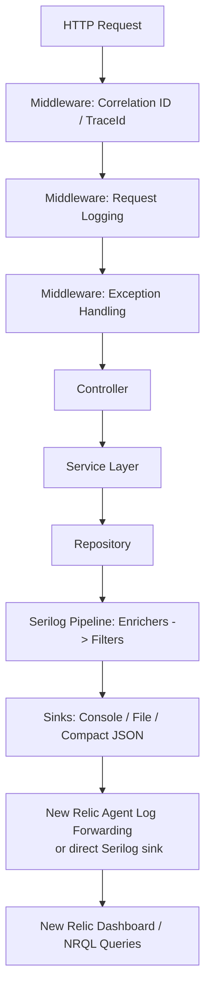
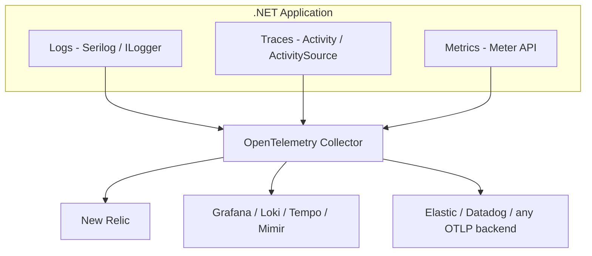
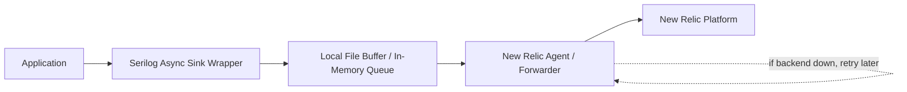
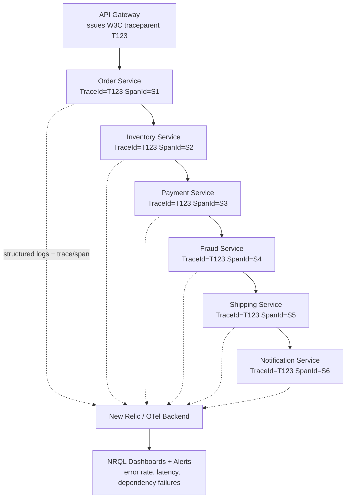

# Structured Logging — Interview Revision Notes

> Quick-revision Q&A derived from `I. Structured-Logging-Interview-Guide.md`. Covers every section of the source.

## Core Concepts

### What Is Structured Logging and Why It Beats String Interpolation

**Q: What is structured logging?**

A: Logging where every event is emitted as typed key/value properties plus a message, not a flattened string. Lets a backend ask "give me every event where `OrderId=45678` and `Level=Error`" instead of regex-scraping text.

**Q: Why is `_logger.LogInformation("Order {OrderId} created", orderId)` better than `$"Order {orderId} created"`?**

A:

Bad (string interpolation):

```csharp
_logger.LogInformation($"Order {orderId} created");
```

Good (message template):

```csharp
_logger.LogInformation("Order {OrderId} created", orderId);
```

- Serilog parses the template and stores `OrderId` as a separate, typed property on the `LogEvent`, not baked into a string.
- Downstream systems (New Relic, Seq, Elasticsearch) can query/filter/facet directly on `OrderId`.
- Performance: interpolation builds the string immediately regardless of whether any sink needs it; a template defers rendering until a sink actually needs text — a JSON sink serializes properties directly.
- Enables consistent dashboards/analytics without regex-scraping log text.

### Message Templates

**Q: What do `{OrderId}`, `{@Order}`, and `{$Order}` mean in a Serilog message template?**

A:

- `{OrderId}` — scalar property; uses `ToString()` for text sinks, native type for structured sinks.
- `{@Order}` — destructuring operator; captures the full object graph as structured properties (watch for large graphs/circular references).

  ```csharp
  _logger.LogInformation("Order created {@Order}", order);
  ```

- `{$Order}` — stringification operator; forces `ToString()` even for types that would normally destructure.

### Log Levels

**Q: List the .NET/Serilog log levels and when to use each.**

A: Trace/`Verbose` (finest detail, off in prod) → Debug (dev troubleshooting, usually off) → Information (normal business flow, on) → Warning (recoverable/unexpected, e.g. 400s, on) → Error (failures needing attention, on) → Critical/`Fatal` (outage, on).

**Q: Do `Microsoft.Extensions.Logging.LogLevel` and Serilog's `LogEventLevel` map 1:1?**

A: No. MEL uses `Trace/Debug/Information/Warning/Error/Critical`; Serilog uses `Verbose/Debug/Information/Warning/Error/Fatal`. The MEL bridge maps `Critical↔Fatal` and `Trace↔Verbose`.

### Structured Logging vs Plain-Text Logging — The Full Picture

**Q: Beyond the template example, what's the fuller case for structured over plain-text logging?**

A: Structured logging wins on query capability (exact/range/facet vs regex/substring), schema evolution (additive vs breaks parsers), machine readability (native JSON/CLEF vs fragile downstream parsing), and dashboarding (trivial `FACET`/`GROUP BY` vs manual regex extraction first). Migration cost is the trade-off — it requires team discipline to consistently use templates.

**Q: Is structured logging mutually exclusive with human-readable console output?**

A: No — Serilog's console sink renders the templated message as readable text while the same `LogEvent` carries structured properties to other sinks. You get both.

## Architecture

### End-to-End Request Flow

**Q: Describe the end-to-end flow of a request through Serilog to New Relic.**

A: HTTP Request → Correlation/TraceId middleware → Request-logging middleware → Exception-handling middleware → Controller → Service → Repository → Serilog pipeline (Enrichers → Filters) → Sinks (Console/File/Compact JSON) → New Relic agent forwarding or a direct sink → New Relic dashboards/NRQL.



### Program.cs Configuration (Code-Based)

**Q: What does a typical code-based Serilog bootstrap look like?**

A:

```csharp
Log.Logger = new LoggerConfiguration()
    .MinimumLevel.Information()
    .Enrich.FromLogContext()
    .Enrich.WithEnvironmentName()
    .WriteTo.Console()
    .WriteTo.Async(a => a.File(new Serilog.Formatting.Compact.CompactJsonFormatter(), "logs/app-.log"))
    .CreateLogger();
```

Then `builder.Host.UseSerilog()`, `app.UseSerilogRequestLogging()`, and `Log.CloseAndFlush()` in a `finally` block.

**Q: What does `UseSerilogRequestLogging()` give you for free?**

A: It replaces a hand-rolled request-logging middleware — logs path, status code, and elapsed time for every request in a single line.

**Q: What NuGet packages are typically needed?**

A: `Serilog.AspNetCore`, `Serilog.Sinks.Console`, `Serilog.Sinks.File`, `Serilog.Formatting.Compact`, `Serilog.Enrichers.Environment`, `Serilog.Enrichers.Thread`, `Serilog.Sinks.Async`; optionally `Serilog.Sinks.NewRelicLogs` + `NewRelic.LogEnrichers.Serilog` for direct shipping.

Required packages:
```text
dotnet add package Serilog.AspNetCore
dotnet add package Serilog.Sinks.Console
dotnet add package Serilog.Sinks.File
dotnet add package Serilog.Formatting.Compact
dotnet add package Serilog.Enrichers.Environment
dotnet add package Serilog.Enrichers.Thread
dotnet add package Serilog.Sinks.Async
```

Optional, for direct New Relic shipping without relying on the host agent:
```text
dotnet add package Serilog.Sinks.NewRelicLogs
dotnet add package NewRelic.LogEnrichers.Serilog
```

### appsettings.json Configuration (Config-Based)

**Q: How do you configure Serilog from appsettings.json instead of code?**

A: Define a `"Serilog"` section (`Using`, `MinimumLevel.Default`/`Override`, `Enrich`, `WriteTo` array of `{Name, Args}`), then `Log.Logger = new LoggerConfiguration().ReadFrom.Configuration(builder.Configuration).CreateLogger();`.

```json
{
  "Serilog": {
    "Using": [ "Serilog.Sinks.Console", "Serilog.Sinks.File" ],
    "MinimumLevel": {
      "Default": "Information",
      "Override": {
        "Microsoft": "Warning",
        "System": "Warning"
      }
    },
    "Enrich": [ "FromLogContext", "WithEnvironmentName", "WithThreadId" ],
    "WriteTo": [
      { "Name": "Console" },
      {
        "Name": "File",
        "Args": {
          "path": "logs/app-.log",
          "rollingInterval": "Day",
          "formatter": "Serilog.Formatting.Compact.CompactJsonFormatter, Serilog.Formatting.Compact"
        }
      }
    ]
  }
}
```

```csharp
Log.Logger = new LoggerConfiguration()
    .ReadFrom.Configuration(builder.Configuration)
    .CreateLogger();
```

**Q: Code-based vs config-based configuration — what's the trade-off?**

A: Config-based lets ops change sinks/levels without a redeploy (especially with `reloadOnChange` + a `LoggingLevelSwitch`), but custom enrichers/`ILogEventSink` implementations may need code wiring or registration in the `Using` array to be discoverable. Most real systems combine both: config for levels/sinks, code for anything needing DI or custom types.

## Intermediate — Enrichment and Context Propagation

### Correlation ID Middleware

**Q: What does a CorrelationId middleware do?**

A: Generates an ID per request, pushes it onto `LogContext` via `LogContext.PushProperty("CorrelationId", id)`, and returns it in an `X-Correlation-Id` response header — enables tracing across services and easier debugging.

```csharp
public class CorrelationIdMiddleware
{
    private readonly RequestDelegate _next;

    public CorrelationIdMiddleware(RequestDelegate next)
    {
        _next = next;
    }

    public async Task Invoke(HttpContext context)
    {
        var correlationId = Guid.NewGuid().ToString();

        using (Serilog.Context.LogContext.PushProperty(
            "CorrelationId", correlationId))
        {
            context.Response.Headers.Add(
                "X-Correlation-Id",
                correlationId);

            await _next(context);
        }
    }
}
```

**Q: What's the flaw in the naive version, and the fix?**

A: It always mints a *new* ID instead of checking for an inbound `X-Correlation-Id` header, which breaks correlation the moment there's more than one hop. Fix:

```csharp
var correlationId = context.Request.Headers.TryGetValue("X-Correlation-Id", out var existing)
    ? existing.ToString()
    : Guid.NewGuid().ToString();
```

**Q: Is `LogContext.PushProperty` or `ILogger.BeginScope` the idiomatic Serilog mechanism?**

A: `LogContext.PushProperty` — it's Serilog's native, more efficient path. `BeginScope` still works (Serilog implements `ILogger`), but most Serilog-based teams standardize on `PushProperty`.

### LogContext.PushProperty Deep Dive

**Q: Why is `PushProperty` needed at scale (e.g. 50,000 req/min)?**

A: Without it, individual log lines ("Order validation started", "Calling payment service") have no shared identifier, so a support ticket like "Order 98765 failed" can't be traced back to a single logical operation.

```text
Order validation started
Calling payment service
Order created successfully
```

**The fix:**

```csharp
using (Serilog.Context.LogContext.PushProperty("OrderId", 98765))
using (Serilog.Context.LogContext.PushProperty("CustomerId", 1001))
{
    _logger.LogInformation("Order validation started");
    _logger.LogInformation("Calling payment service");
    _logger.LogInformation("Order created successfully");
}
```

Every log line inside the block now automatically carries `OrderId` and `CustomerId`:

```json
{ "message": "Order validation started", "OrderId": 98765, "CustomerId": 1001 }
{ "message": "Calling payment service",  "OrderId": 98765, "CustomerId": 1001 }
{ "message": "Order created successfully", "OrderId": 98765, "CustomerId": 1001 }
```

**Q: How does `PushProperty` survive `await` boundaries and thread hops?**

A: `LogContext` is backed by `AsyncLocal<T>`, so pushed properties flow through async continuations correctly — even across `Task.Run` continuations resuming on a different threadpool thread — because `AsyncLocal` follows the logical call context, not the physical thread.

**Q: What properties do enterprise systems commonly push onto the log context?**

A: `CorrelationId`, `TraceId`, `TenantId`, `CustomerId`, `OrderId`, `UserId` — so support engineers can find all logs for one business transaction quickly.

**Real enterprise example (banking):**

```csharp
using (Serilog.Context.LogContext.PushProperty("CustomerId", customerId))
using (Serilog.Context.LogContext.PushProperty("AccountId", accountId))
using (Serilog.Context.LogContext.PushProperty("TransactionId", transactionId))
{
    // business logic
}
```

### Controller / Service / Repository Logging

**Q: What's the layering principle for where to log what?**

A: Repository = data-access concerns ("SQL timeout"). Service = business concerns ("Customer upgraded plan"). Mixing them blurs semantics and complicates layer-specific alerting.

```csharp
[ApiController]
[Route("api/orders")]
public class OrderController : ControllerBase
{
    private readonly OrderService _service;
    private readonly ILogger<OrderController> _logger;

    public OrderController(
        OrderService service,
        ILogger<OrderController> logger)
    {
        _service = service;
        _logger = logger;
    }

    [HttpPost]
    public async Task<IActionResult> CreateOrder(
        CreateOrderRequest request)
    {
        _logger.LogInformation(
            "CreateOrder request received. CustomerId={CustomerId}",
            request.CustomerId);

        var orderId = await _service.CreateOrder(request);

        return Ok(orderId);
    }
}
```

```csharp
public class OrderService
{
    private readonly ILogger<OrderService> _logger;

    public OrderService(ILogger<OrderService> logger)
    {
        _logger = logger;
    }

    public async Task<int> CreateOrder(CreateOrderRequest request)
    {
        _logger.LogInformation(
            "Creating order. CustomerId={CustomerId}, Amount={Amount}",
            request.CustomerId,
            request.Amount);

        try
        {
            var orderId = await SaveOrder(request);

            _logger.LogInformation(
                "Order created successfully. OrderId={OrderId}",
                orderId);

            return orderId;
        }
        catch (Exception ex)
        {
            _logger.LogError(
                ex,
                "Order creation failed. CustomerId={CustomerId}",
                request.CustomerId);

            throw;
        }
    }
}
```

**Q: The sample `OrderService` logs the error via `LogError` and then rethrows — why is this flagged as a contradiction, and how is it resolved?**

A: It conflicts with the "log an exception once, only in the global handler" rule. Resolution: only log locally if adding context the global handler can't reconstruct, and do it via `LogContext.PushProperty` rather than a duplicate `LogError` call; otherwise swallow-and-rethrow (`catch { throw; }`) and let the global handler own the one `LogError`.

### Built-in Request Logging

**Q: What does `UseSerilogRequestLogging()` provide and how do you customize it?**

A: One log line per request (path, status code, elapsed time) instead of hand-written stopwatch code. Customize via `options.MessageTemplate` and `options.EnrichDiagnosticContext` (e.g. `diagnosticContext.Set("UserId", ...)`).

```csharp
app.UseSerilogRequestLogging(options =>
{
    options.MessageTemplate =
        "Request completed. Path={RequestPath}, StatusCode={StatusCode}, DurationMs={Elapsed}";

    options.EnrichDiagnosticContext = (diagnosticContext, httpContext) =>
    {
        diagnosticContext.Set("UserId", httpContext.User?.Identity?.Name);
    };
});
```

### Global Exception Middleware

**Q: What's the purpose of a global exception-handling middleware?**

A: Captures all unhandled exceptions once, via a single try/catch around `_next(context)` — avoids duplicate try/catch blocks and centralizes error logging.

```csharp
public class ExceptionHandlingMiddleware
{
    private readonly RequestDelegate _next;
    private readonly ILogger<ExceptionHandlingMiddleware> _logger;

    public ExceptionHandlingMiddleware(
        RequestDelegate next,
        ILogger<ExceptionHandlingMiddleware> logger)
    {
        _next = next;
        _logger = logger;
    }

    public async Task Invoke(HttpContext context)
    {
        try
        {
            await _next(context);
        }
        catch (Exception ex)
        {
            _logger.LogError(ex, "Unhandled exception occurred");
            throw;
        }
    }
}
```

**Q: What's the gotcha with rethrowing after logging here?**

A: Something further out (e.g. `UseExceptionHandler`) must still convert the exception into an HTTP response. Ensure only one layer in that chain also logs — typically the innermost catch (this middleware) logs, and anything further out only maps to a response.

### Serilog Sinks Internals

**Q: What is a sink, and what interface does it implement?**

A: The destination Serilog writes a `LogEvent` to (console, file, Elasticsearch, Seq, New Relic, custom). Implements `ILogEventSink { void Emit(LogEvent logEvent); }`, registered via `.WriteTo.Sink(new CompanySink())`.

```csharp
public interface ILogEventSink
{
    void Emit(LogEvent logEvent);
}
```

**Custom sink example:**

```csharp
public class CompanySink : ILogEventSink
{
    public void Emit(LogEvent logEvent)
    {
        SendToMonitoringSystem(logEvent);
    }
}
```

**Q: Walk through how Serilog processes a log event end to end.**

A: App creates a `LogEvent` (Message, properties, Level, Timestamp) → Enrichers add metadata (`CorrelationId`, `MachineName`, `Environment`) → Filters run (e.g. drop health-check noise) → event is dispatched to every configured sink (fan-out: one event, many destinations).

```mermaid
flowchart LR
    A[Log.Information/LogEvent created] --> B[Enrichers add metadata
    TraceId, CorrelationId, MachineName...]
    B --> C[Filters run
    e.g. drop health-check noise]
    C --> D{Sink(s)}
    D --> E[Console]
    D --> F[File]
    D --> G[Elasticsearch]
    D --> H[New Relic]
```

**Multiple sinks fan out the same event** — one `LogEvent`, many destinations:

```csharp
builder.Host.UseSerilog((ctx, lc) =>
{
    lc.WriteTo.Console()
      .WriteTo.File("logs/app.log")
      .WriteTo.Elasticsearch(/* ... */)
      .WriteTo.NewRelicLogs(/* ... */);
});
```

**Q: What happens if one sink fails (e.g. New Relic is unreachable)?**

A: Serilog aims to isolate sink failures so the app doesn't crash and other sinks aren't blocked; enterprise systems wrap sinks in async processing + buffering, and some sinks (`PeriodicBatching`-based) implement their own retries. This isolation is sink-implementation-dependent — a naive synchronous custom sink that throws inside `Emit()` can propagate the exception unless wrapped in `.WriteTo.Async(...)`.

### Enrichers vs Destructuring — What's the Difference

**Q: What's the difference between an enricher and destructuring?**

A: Enrichers add ambient/contextual properties not present at the call site (`MachineName`, `CorrelationId`, `ThreadId`) to every event flowing through the pipeline, via `ILogEventEnricher.Enrich(...)`. Destructuring (`@`) structures one specific object passed at a single call site (`{@Order}`), scoped to that call, via `IDestructuringPolicy`.

## Advanced — Distributed Tracing & Multi-Tenancy

### CorrelationId vs TraceId

**Q: Contrast `CorrelationId` and `TraceId`.**

A: `CorrelationId` is custom-generated, captured manually via `LogContext.PushProperty`, favored by support teams (human-readable). `TraceId` is generated by distributed tracing systems (W3C `traceparent`, OpenTelemetry, New Relic), captured automatically via `Serilog.Enrichers.Span`/New Relic's enricher riding on `Activity`/`DiagnosticSource`, favored by engineers matching APM views. Trend: `TraceId` increasingly primary; many orgs still keep both.

### Tracing a Request Across 15 Microservices

**Q: How do you trace one request across many microservices?**

A: `TraceId` generated once (W3C `traceparent`, gateway- or SDK-issued), passed in headers to every hop, captured in each service via `Serilog.Enrichers.Span` or the New Relic log enricher, with distributed tracing enabled end-to-end. Reconstruct via:

```sql
SELECT * FROM Log WHERE trace.id = 'T123'
```

```mermaid
sequenceDiagram
    participant GW as API Gateway
    participant OS as Order Service
    participant IS as Inventory Service
    participant PS as Payment Service
    participant NS as Notification Service

    GW->>OS: traceparent: TraceId=T123
    OS->>IS: TraceId=T123, SpanId=S1
    IS->>PS: TraceId=T123, SpanId=S2
    PS->>NS: TraceId=T123, SpanId=S3
    Note over GW,NS: TraceId constant across every hop; SpanId changes per service
```

`TraceId` stays constant across hops; `SpanId` changes per service.

### Multi-Tenant Logging

**Q: How do you make logs traceable per tenant in a shared SaaS app?**

A: Extract `TenantId` from JWT claims, gateway headers, or request headers, and push it via `LogContext.PushProperty("TenantId", tenantId)` in a tenant-resolution middleware (or a custom `ILogEventEnricher`). Enables per-tenant filtering, incident isolation, and dashboards, e.g. `SELECT * FROM Log WHERE TenantId = 'Walmart'`.

```csharp
var tenantId = httpContext.Request.Headers["TenantId"];

using (Serilog.Context.LogContext.PushProperty("TenantId", tenantId))
{
    await _next(context);
}
```

Resulting logs:

```json
{ "message": "Order Created", "TenantId": "Walmart" }
{ "message": "Payment Failed", "TenantId": "Target" }
```

Query:

```sql
SELECT * FROM Log WHERE TenantId = 'Walmart'
```

### OpenTelemetry Logs/Traces/Metrics Unification

**Q: What does OpenTelemetry provide, and how does it relate to Serilog?**

A: A vendor-neutral wire format (OTLP) + SDK spanning logs, traces, and metrics — instrument once, swap backends by reconfiguring the Collector's exporter. Not mutually exclusive with Serilog: a common pattern is Serilog for rich structured logs + a `Serilog.Sinks.OpenTelemetry` exporter so logs carry the same `TraceId`/`SpanId` as OTel traces.



**Q: What underlies traces and metrics in .NET's OTel story?**

A: Traces use `System.Diagnostics.ActivitySource`/`Activity` (native since .NET Core 3.0) — the OTel .NET SDK is a listener/exporter on top of `Activity`, not a replacement. Metrics use `System.Diagnostics.Metrics.Meter`, exported via OTel's metrics SDK, correlated with logs/traces via shared resource attributes (`service.name`, `deployment.environment`).

**Q: Why adopt OpenTelemetry if the New Relic agent already works?**

A: Vendor lock-in avoidance, multi-backend flexibility (e.g. traces to New Relic, logs to a cheaper Loki/S3 store), and standardization across polyglot services that lack New Relic SDK parity with .NET.

### ASP.NET Core Activity / W3C Trace Context Integration

**Q: Does ASP.NET Core give you distributed tracing context "for free"?**

A: Yes — since .NET Core 3.0+, ASP.NET Core auto-creates an `Activity` per request and parses incoming `traceparent`/`tracestate` headers, populating `Activity.Current.TraceId`/`SpanId` with no custom middleware. `Serilog.Enrichers.Span` reads from this — not from a custom `CorrelationIdMiddleware` unless wired there explicitly. A hand-rolled `CorrelationId` is often redundant with this; many teams keep it only as a business-friendly alias.

### Centralized Logging Pipelines: ELK vs Seq vs Grafana Loki

**Q: Compare ELK, Seq, Grafana Loki, and New Relic Logs as centralized logging stacks.**

A:

- **ELK** — full-text indexed JSON, Lucene/KQL, powerful full-text search, mature, self-hostable; resource-hungry and high indexing cost at scale.
- **Seq** — structured events (CLEF), SQL-ish query language, purpose-built for Serilog, great local-dev experience, lightweight; smaller ecosystem, paid clustering needed at large scale.
- **Grafana Loki** — log-stream storage indexed only by labels, LogQL, very cheap at scale, pairs with Grafana/Tempo/Prometheus (LGTM stack); full-text search is slower since content isn't indexed.
- **New Relic Logs** — managed SaaS, NRQL, zero infra, tight APM correlation ("Logs in Context"); cost scales with ingest volume, vendor lock-in.

**Q: How do you decide which stack to use?**

A: Seq for local dev/small internal tools; ELK when deep full-text search is needed and you have ops capacity; Loki when cost-per-GB dominates and Grafana/Prometheus are already running; a SaaS platform (New Relic/Datadog) when you want APM+logs+traces unified with no infra ownership, accepting the ingest-cost trade-off.

### AWS-Native Logging and Tracing

#### `` CloudWatch Logs Insights

**Q: What is CloudWatch Logs Insights and how do you query structured logs with it?**

A: A query engine built directly on CloudWatch Logs — no separate indexing pipeline to run or pay for. Basic query syntax:

```
fields @timestamp, @message
| filter @message like /OrderId/
| sort @timestamp desc
| limit 20
```

Parsing structured JSON fields and aggregating on them:

```
fields @timestamp, OrderId, CorrelationId, Level
| filter Level = "Error"
| stats count(*) as errorCount by bin(5m)
```

Can facet like NRQL's `FACET`: `stats avg(DurationMs) as avgDuration by RequestPath`.

```
fields RequestPath, DurationMs
| stats avg(DurationMs) as avgDuration by RequestPath
| sort avgDuration desc
```

**Q: How does Logs Insights compare to ELK/Seq, and what's its cost gotcha?**

A: No infra to run (fully managed) vs self-hosted ELK/Seq. It scans raw log data per query (no persistent index) — fine for ad hoc investigation, not built for high-frequency dashboards, unlike ELK/Seq's pre-indexed stores. Cost scales with GB *scanned per query*, a dimension distinct from ingestion/storage — narrow the time range/log group before querying to avoid runaway cost.

#### `` AWS X-Ray for Distributed Tracing

**Q: What is X-Ray, and how does it relate to OpenTelemetry?**

A: AWS's native distributed tracing backend + legacy proprietary SDK, with first-class AWS compute/service integration (Lambda, ECS, EC2; DynamoDB/S3/SQS calls auto-appear as segments) and a "service map" visualization. X-Ray can consume OTel data directly via the AWS Distro for OpenTelemetry (ADOT) Collector — the senior answer is to instrument with OpenTelemetry (`ActivitySource`) and point ADOT's exporter at X-Ray (or swap backends later), rather than coupling application code to the X-Ray SDK directly.

**Q: How do you correlate X-Ray traces with CloudWatch Logs?**

A: X-Ray segments carry a `trace_id`; emit that same value as a structured Serilog property (same pattern as `TraceId`/`SpanId` via `Serilog.Enrichers.Span`) so you can jump from a slow/failed X-Ray segment to `filter trace_id = "..."` in Logs Insights — the AWS-native version of New Relic's "Logs in Context."

#### `` CloudWatch Log Group Retention Policies and Subscription Filters

**Q: What's the default CloudWatch Log Group retention, and why is that a cost risk?**

A: Default is "Never Expire" — a common cost leak (e.g. a Lambda's auto-created log group accumulates logs/cost forever unless retention is set). Senior answer: set `retention_in_days` via IaC at provisioning time:

```hcl
resource "aws_cloudwatch_log_group" "order_api" {
  name              = "/ecs/order-api"
  retention_in_days = 30
}
```

**Q: What are subscription filters used for?**

A: They stream matching log events near-real-time to a cheaper long-term destination (Kinesis Firehose → S3 for cold/compliance storage, or Lambda for real-time alerting) instead of paying to retain 100% of volume in CloudWatch — the AWS-native equivalent of tiered-retention-by-sink.

```hcl
resource "aws_cloudwatch_log_subscription_filter" "errors_to_firehose" {
  name            = "errors-to-s3-archive"
  log_group_name  = aws_cloudwatch_log_group.order_api.name
  filter_pattern  = "{ $.Level = \"Error\" }"
  destination_arn = aws_kinesis_firehose_delivery_stream.log_archive.arn
  role_arn        = aws_iam_role.cwl_to_firehose.arn
}
```

**Q: What are the three cost dimensions of CloudWatch Logs, and how do you control each?**

A: Ingestion (per GB ingested) — reduce via sampling/level filtering; Storage (per GB-month retained) — reduce via retention policies + subscription-filter offload to S3; Query (per-GB-scanned via Logs Insights) — reduce by narrowing time range/log group scope.

## New Relic Integration

### Three Integration Options

**Q: What are the three ways to get Serilog output into New Relic, and the key rule?**

A:

- **A — Agent-based forwarding** (recommended default): New Relic .NET Agent tails console/file output and forwards automatically.

  ```xml
  <configuration>
    <service licenseKey="YOUR_LICENSE_KEY"/>
    <application>
      <name>Order API</name>
    </application>
    <log>
      <level>info</level>
    </log>
    <applicationLogging enabled="true">
      <forwarding enabled="true"/>
    </applicationLogging>
  </configuration>
  ```

- **B — New Relic Log Enricher for Serilog**: `.Enrich.WithNewRelicLogsInContext()` adds `trace.id`/`span.id`/`entity.guid` to each `LogEvent`; the infrastructure agent ships the formatted file.

  ```csharp
  Log.Logger = new LoggerConfiguration()
      .Enrich.WithNewRelicLogsInContext()
      .WriteTo.File(new NewRelicFormatter(), "logs/newrelic-app.log")
      .CreateLogger();
  ```

- **C — Direct sink to the New Relic Logs API**: `.WriteTo.NewRelicLogs(endpointUrl, applicationName, licenseKey)`, for agentless environments (containers, serverless).

  ```csharp
  Log.Logger = new LoggerConfiguration()
      .WriteTo.NewRelicLogs(
          endpointUrl: "https://log-api.newrelic.com/log/v1",
          applicationName: "OrderApi",
          licenseKey: "YOUR_LICENSE_KEY")
      .CreateLogger();
  ```

Rule: pick one — combining them double-ships logs and causes double billing.

### NRQL Query Examples

**Q: Give example NRQL queries for common log investigations.**

A:

- `SELECT * FROM Log WHERE level = 'Error'`
- `SELECT * FROM Log WHERE CorrelationId = '...'`
- `SELECT average(DurationMs) FROM Log FACET RequestPath`
- `SELECT percentage(count(*), WHERE level='Error') FROM Log`
- `SELECT * FROM Log WHERE OrderId = 98765` / `WHERE TenantId = 'Walmart'`

```sql
-- Find all errors
SELECT * FROM Log WHERE level = 'Error'

-- Find logs for a request
SELECT * FROM Log WHERE CorrelationId = '2e1f4f9a-b0f2'

-- Count successful order creations
SELECT count(*) FROM Log WHERE message LIKE '%Order created%'

-- Find slow requests
SELECT average(DurationMs) FROM Log FACET RequestPath

-- Error rate
SELECT percentage(count(*), WHERE level = 'Error') FROM Log

-- Slowest APIs
SELECT average(duration) FROM Transaction FACET name

-- Logs scoped to one order
SELECT * FROM Log WHERE OrderId = 98765

-- Logs scoped to one tenant
SELECT * FROM Log WHERE TenantId = 'Walmart'
```

**Q: What does a Compact-JSON log event look like, and why does the format matter?**

A: `{"@t":"...", "@m":"Order created successfully", "@l":"Information", "OrderId":45678, "CorrelationId":"...", "Application":"OrderApi", "EnvironmentName":"Production"}` — searchable, filterable, easy NRQL queries, better observability than flattened text.

```json
{
  "@t": "2026-06-17T10:15:11.000Z",
  "@m": "Order created successfully",
  "@l": "Information",
  "OrderId": 45678,
  "CorrelationId": "2e1f4f9a-b0f2",
  "Application": "OrderApi",
  "EnvironmentName": "Production"
}
```

## Performance

### Why Excessive Logging Hurts Production

**Q: What are the concrete production costs of excessive logging?**

A: Disk I/O saturation, increased CPU usage, huge storage costs, log-ingestion costs (New Relic or any SaaS backend), network congestion. Fix: log only actionable information; use levels and a `LoggingLevelSwitch` deliberately.

### Async Logging and Buffering

**Q: How does async logging change the request path?**

A: Without async: request thread writes to file and waits for disk before continuing. With async: request thread queues the log and continues; a background thread performs the write. `.WriteTo.Async(a => a.File("logs/app-.log"))`.

**Without async:**
```text
Request Thread -> Write file -> Wait for disk -> Continue request
```

**With async:**
```text
Request Thread -> Queue log -> Continue request
Background Thread -> Write to file
```

```csharp
.WriteTo.Async(a => a.File("logs/app-.log"))
```

**Q: What should happen if New Relic becomes unavailable?**

A: The app keeps running; logs buffer locally (file/in-memory queue) and forward later via retry — no customer-facing impact, because logging is async/buffered and never blocks the business request.



### Source-Generated Logging (LoggerMessage) and the Cost of ILogger Calls

**Q: What's the performance problem with plain `_logger.LogInformation(...)` calls even when using templates?**

A: Value-type arguments (e.g. `int orderId`) get boxed into `object[]` on every call (a `params` allocation) unless the level is disabled and it short-circuits early. Classic mitigation: guard hot-path debug logs with `if (_logger.IsEnabled(LogLevel.Debug))` before doing expensive argument work.

**Q: What is `[LoggerMessage]` source-generated logging and why does it matter at senior level?**

A:

```csharp
[LoggerMessage(EventId = 1001, Level = LogLevel.Information,
    Message = "Order {OrderId} created for customer {CustomerId}")]
public static partial void OrderCreated(this ILogger logger, int orderId, int customerId);
```

The source generator emits a strongly-typed method with no boxing, no array allocation, and a built-in `IsEnabled` check — the fastest logging call shape in .NET today. It also gives compile-time validation of the template against parameters, and a stable `EventId` for alerting that survives message rewording.

### Log Sampling Strategies at Scale

**Q: List log sampling strategies from simplest to most sophisticated.**

A:

1. Level-based filtering — log 100% of Warning+, sample Information.
2. Fixed-rate sampling — e.g. keep 1-in-10 successful request logs.
3. Rate limiting ("first N per key per window") — stops a flapping downstream dependency from flooding the pipeline.
4. Tail-based/trace-aware sampling — decide after the outcome is known: keep 100% of failed requests, sample successful ones.
5. Dynamic verbosity via `LoggingLevelSwitch` — not sampling per se, but lets you raise verbosity temporarily during an incident without a redeploy.

```csharp
var levelSwitch = new LoggingLevelSwitch(LogEventLevel.Information);

Log.Logger = new LoggerConfiguration()
    .MinimumLevel.ControlledBy(levelSwitch)
    .CreateLogger();

// during an incident, exposed via an admin endpoint or config reload:
levelSwitch.MinimumLevel = LogEventLevel.Debug;
```

**Q: What's the core trade-off principle behind sampling?**

A: Always keep 100% of errors — you can't sample your way out of missing the one failure that matters. Apply sampling only to high-volume, low-signal success paths.

## Best Practices

### 10 Logging Best Practices

**Q: Summarize the 10 logging best practices.**

A:

1. Log structured data (templates), not strings.
2. Pick the log level deliberately, per the level table.
3. Avoid duplicate logging — log an exception once, in the global handler.
4. Enrich with context via `LogContext.PushProperty` instead of repeating arguments.
5. Never log sensitive data — log `UserId`, not `Password`.
6. Make logging async/non-blocking.
7. Design for correlation — a shared `TraceId`/`CorrelationId` end-to-end via headers + `LogContext`.
8. Control volume/cost via a `LoggingLevelSwitch`.
9. Separate logs by concern and retention (Debug 7d, App/Info 30d, Error 90–180d, Audit 7yr), each in its own sink/file.
10. Treat logging as part of the observability contract — standard fields (`Event`, `TraceId`, `CorrelationId`, `TenantId`, `UserId`, `RequestId`, `MachineName`, `Environment`) shared across teams.

**Q: How do you implement a separate audit sink with its own retention?**

A:

```csharp
.WriteTo.Logger(lc => lc
    .Filter.ByIncludingOnly(e => e.Properties.ContainsKey("Audit"))
    .WriteTo.File("logs/audit-.log", retainedFileCountLimit: 2555))
```

### Golden Rules Checklist

**Q: Recite the golden rules checklist.**

A: Log structured data; use appropriate levels; log exceptions only once (global middleware); add context via enrichment, not repetition; never log secrets; keep logging asynchronous; correlate via `TraceId`/`CorrelationId`; manage volume (raise verbosity only during incidents); separate logs by purpose (app/audit/security/performance); treat logging as first-class observability, not an afterthought.

### PII / Sensitive-Data Redaction Patterns

**Q: What mechanisms enforce "never log sensitive data" beyond call-site discipline?**

A:

1. Call-site discipline (baseline, fragile — breaks once someone destructures a whole object, e.g. `{@Request}`, that contains a `Password` field).
2. Custom `IDestructuringPolicy` — intercepts destructuring for a specific type (e.g. `LoginRequest`) and masks/omits sensitive properties before serialization, so even `{@Request}` calls are safe by construction.

   ```csharp
   public class RedactingDestructuringPolicy : IDestructuringPolicy
   {
       public bool TryDestructure(object value, ILogEventPropertyValueFactory factory, out LogEventPropertyValue result)
       {
           if (value is LoginRequest req)
           {
               result = new StructureValue(new[]
               {
                   new LogEventProperty("UserId", new ScalarPropertyValue(req.UserId)),
                   new LogEventProperty("Password", new ScalarPropertyValue("***REDACTED***"))
               });
               return true;
           }
           result = null;
           return false;
       }
   }
   // .Destructure.With(new RedactingDestructuringPolicy())
   ```
3. Compliance/redaction attributes (`Microsoft.Extensions.Compliance` family, e.g. `[PrivateData]`) — mark model properties sensitive so the pipeline redacts them automatically wherever the type is logged (verify exact package/API naming per .NET version — it has moved across preview releases).
4. Sink/formatter-level scrubbing — a custom `ITextFormatter` or enricher/filter that regex-scans rendered output for card numbers/JWT shapes, as defense-in-depth, not a primary control.
5. Log-schema review in CI — a Roslyn analyzer flags logging calls referencing `[Sensitive]`-tagged properties before they ship.

**Q: Why is PII redaction considered a "hot" interview topic?**

A: GDPR/CCPA and PCI-DSS compliance failures are frequently root-caused to logging, not the primary datastore — a real, recurring incident pattern, not a hypothetical.

## Common Pitfalls

**Q: List the common structured-logging pitfalls.**

A:

- String interpolation instead of message templates — kills structured querying, defeats deferred rendering.
- Every service minting its own `CorrelationId` instead of propagating one from the gateway.
- Logging request/response bodies wholesale — PII/GDPR/PCI risk and storage cost; log metadata only, mask via destructuring policies.
- Duplicate logging of the same exception across layers — only the global exception middleware should log unhandled exceptions.
- Wrong level for validation failures — a 400 is `Warning`, not `Error`.
- Losing the stack trace: `LogError(ex.Message)` throws away the exception object; always pass `ex` as the first argument.
- Synchronous sinks blocking the request thread (especially network sinks) — wrap in `.WriteTo.Async(...)`.
- Repositories logging business events instead of data-access concerns.
- Uncontrolled `{@Object}` destructuring of EF Core entities — lazy-loaded navigation properties/circular references/huge graphs can blow up serialization; project to a DTO first.
- Treating DEBUG-in-production as harmless — a direct driver of I/O saturation and ingestion cost at scale.
- Combining multiple New Relic integration paths simultaneously — duplicate shipping, double billing.

## Why Serilog (vs NLog vs log4net)

**Q: How does Serilog compare to NLog and log4net?**

A:

- Structured-by-default: Serilog captures properties natively on the `LogEvent`; NLog/log4net are text-based cores with JSON layered on.
- Sink ecosystem: Serilog is largest/best-maintained (Seq, Elasticsearch, Datadog, New Relic, CloudWatch); NLog fewer but solid; log4net very few maintained targets.
- ASP.NET Core fit: `Serilog.AspNetCore` gives `UseSerilogRequestLogging()` + DI/enricher integration out of the box.
- Local dev tooling: Seq pairs natively with Serilog.
- Async/buffered targets: NLog has historically been more mature here, plus live XML config reload without a restart.
- Momentum: Serilog dominant in new cloud-native .NET projects; NLog current/maintained; log4net largely legacy.

**Q: Should you migrate an NLog shop to Serilog purely for structured logging?**

A: Not necessarily — NLog also supports structured logging via its own JSON layout renderers today, and has more mature async/buffered targets historically. If NLog is working operationally, migration/retraining cost has to be weighed against the marginal gain.

## Sample Interview Q&A

### Foundational Q&A (from notes)

**Q: Why is structured logging with message templates better than string interpolation?**

A: `OrderId` is stored as a separate typed property instead of a flattened string, so New Relic (or any structured backend) can query/filter on it directly; formatting is deferred so performance is better; it enables easier analytics/dashboards.

**Q: What problems occur if every service generates its own CorrelationId?**

A: Logs can't be traced across services and root-cause analysis becomes difficult. Correct approach: generate the `CorrelationId` at the API Gateway, propagate via headers, and have downstream services reuse it via `LogContext.PushProperty`.

**Q: CorrelationId vs TraceId?**

A: `TraceId` usually replaces `CorrelationId` for engineering purposes in modern systems, but many companies keep both since support teams prefer a business-friendly `CorrelationId`.

**Q: Why is logging request/response bodies dangerous?**

A: Large payloads, PII exposure, GDPR/PCI issues, increased storage cost. Enterprise approach: log metadata only via the diagnostic context; mask sensitive fields with custom destructuring policies if full objects must be logged.

**Q: Why can excessive logging bring down production systems?**

A: Disk I/O saturation, CPU usage, storage cost, ingestion cost, network congestion. Solution: log only actionable information and use levels + a `LoggingLevelSwitch` properly.

**Q: What happens if New Relic becomes unavailable?**

A: The application keeps running; logging is async/buffered and never blocks a business request. Flow: `Application → Serilog (async sink) → Local file buffer → New Relic Agent/Forwarder → New Relic`.

**Q: Why do enterprises prefer asynchronous logging?**

A: File/network writes are expensive; async prevents request-thread blocking and improves API response time.

**Q: What is log enrichment?**

A: Automatically adding contextual properties to every log event — `CorrelationId`, `UserId`, `TenantId`, `Environment`, `Application`, `MachineName`/`ThreadId`. Without it, troubleshooting is hard because logs share no context.

**Q: How would you trace a request across 15 microservices?**

A: `TraceId` generated once, propagated via headers, captured in every service via `Serilog.Enrichers.Span` or the New Relic log enricher, with distributed tracing enabled and searchable by `TraceId`.

**Q: Why shouldn't repositories contain business logs?**

A: Repository = data-access concerns; Service = business concerns. Mixing them blurs responsibilities and pollutes business dashboards with plumbing noise.

**Q: What's the difference between logs, metrics, and traces?**

A: Logs answer "what happened?" (e.g. "Order failed"). Metrics answer "how often?" (e.g. "50 order failures"). Traces answer "where?" (e.g. "failure occurred in PaymentService").

**Q: How do you correlate Serilog logs with APM transactions in New Relic?**

A: `.Enrich.WithNewRelicLogsInContext()` injects `trace.id`, `span.id`, and `entity.guid` into the `LogEvent` so New Relic automatically links logs to the transactions/spans that produced them.

**Q: Why is `LogContext.PushProperty` important?**

A: It attaches contextual information to every log within a logical operation, flows correctly across `await` via `AsyncLocal`, reduces duplicated logging parameters, and makes logs searchable/traceable.

**Q: How would you log a failed third-party API call?**

A: Log endpoint, status code, `CorrelationId`, duration — never log access tokens/secrets. E.g. "Payment gateway failed. StatusCode=500 Duration=2300ms".

**Q: How would you reduce New Relic logging costs?**

A: Use a `LoggingLevelSwitch` to lower verbosity dynamically; sample high-volume logs; avoid duplicate logs; log business events only; shorten retention.

**Q: Why are duplicate logs a serious production issue?**

A: Controller + service + middleware each logging the same error → 3 entries for 1 exception. Enterprise approach: only the global exception middleware logs unhandled exceptions.

**Q: What logging level should be used for validation failures?**

A: `Warning` — a 400 means the application is functioning correctly and the caller supplied invalid input, not an application failure.

**Q: How do you log exceptions correctly?**

A: Wrong: `_logger.LogError(ex.Message)` — loses the stack trace. Correct: `_logger.LogError(ex, "Order processing failed. OrderId={OrderId}", orderId);` — Serilog captures the full `Exception` as a structured property.

**Q: How would you implement multi-tenant logging?**

A: Add `TenantId` to the log context via `LogContext.PushProperty` in a tenant-resolution middleware.

### Staff/Lead-Level System Design Question

**Q: Scenario A — 50,000 req/min, New Relic costs exploding, developers need DEBUG logs, production performance degrading. How would you redesign logging?**

A:

- DEBUG disabled in production by default.
- A `LoggingLevelSwitch` exposed via an admin endpoint/config reload, for temporary verbosity without a redeploy.
- Async sinks everywhere.
- Structured logs only (no string interpolation).
- Log sampling for high-volume successful requests.
- Separate audit sink with its own retention.
- Centralized exception logging (global middleware only).
- Distributed tracing via the New Relic log enricher.
- Tiered retention policies by level.

**Q: Scenario B — Design logging for 20 microservices where a request travels Gateway → Order → Inventory → Payment → Fraud → Shipping → Notification, and failures must be identified within 2 minutes. Outline the design.**

A:



1. Gateway issues a W3C `traceparent` (`TraceId=T123`); every service captures it via `Activity`/`DiagnosticSource` + `Serilog.Enrichers.Span`. `TraceId` constant across hops; `SpanId` changes per service.
2. Keep `CorrelationId` alongside `TraceId` — support searches by `CorrelationId`, engineers by `TraceId`.
3. Structured JSON at every service (`OrderId`, `PaymentId`, `Status`, `ErrorCode`, `TraceId`), no bolted-on parsing.
4. OTel/New Relic agent + Serilog enricher copies `Activity` trace/span IDs onto every `LogEvent`.
5. New Relic APM + Logs in Context — click a failed span, jump straight to related logs.
6. Centralized exception handling — only the global middleware logs unhandled exceptions once.
7. NRQL dashboards — error rate, slowest APIs, per-service failures (`FACET Service`).
8. Alerting — e.g. payment failures > 20 in 2 minutes triggers a notification before customers complain.
9. Log sampling — 100% of errors/warnings, ~10% of successful requests.
10. Retention: Debug 7d, Info 30d, Error 180d, Audit 7yr.
11. Async logging + buffering throughout so a New Relic outage doesn't block requests.

### Additional Senior/Staff Q&A

**Q: Migrating from a proprietary APM agent (New Relic) to OpenTelemetry — what's the risk, and how do you sequence it?**

A: Risks: losing vendor niceties (Logs in Context) until the OTel equivalent is configured; `Activity`/`ActivitySource` instrumentation gaps in third-party libraries lacking OTel coverage; cost of re-validating NRQL-based dashboards/alerts against the new backend's query language. Sequencing: dual-export via the OTel Collector to both backends during a bake-in period, validate parity on a low-risk service first, then cut over service-by-service rather than big-bang.

**Q: How do you prevent the logging library itself from causing production incidents (OOM, stalled shutdown)?**

A: Bound the async sink's internal queue (`bufferSize` + a drop-vs-block policy when full) so a downstream outage causes log loss under backpressure rather than unbounded memory growth. Always call `Log.CloseAndFlush()` in a `finally` with a bounded timeout so a hung sink can't block graceful shutdown within Kubernetes' `terminationGracePeriodSeconds`.

**Q: What's the difference between `ILogger<T>`'s category name and Serilog's `SourceContext`, and why does it matter for filtering?**

A: `ILogger<T>` sets the category to `T`'s full type name; Serilog's MEL bridge stores this as the `SourceContext` property on the `LogEvent`. `MinimumLevel.Override("Microsoft", LogEventLevel.Warning)` matches on a `SourceContext` prefix — understanding this lets you write precise per-namespace overrides (e.g. silence a chatty third-party library without touching your own logs).
