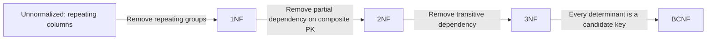
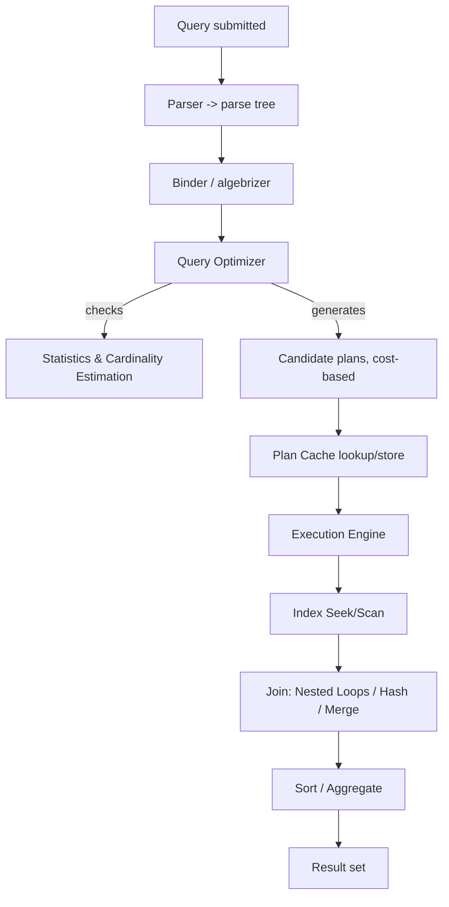
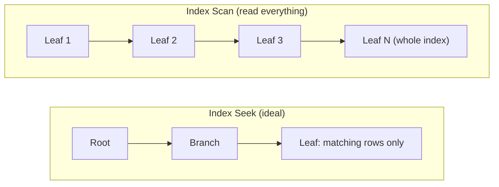
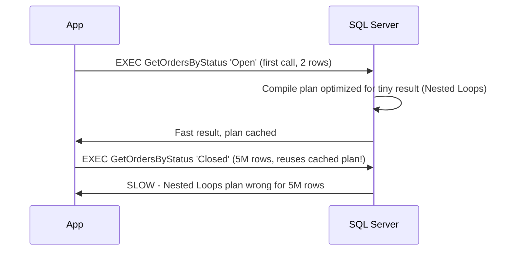
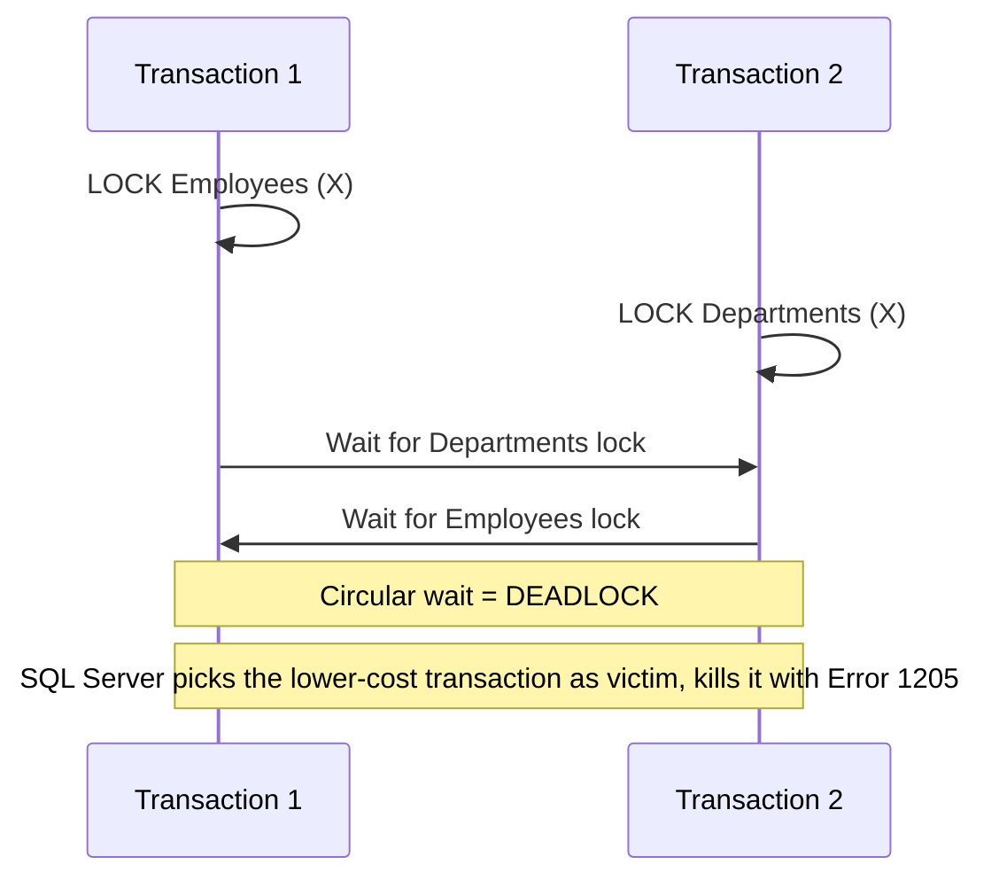

# SQL Server — Interview Revision Notes

> Quick-revision Q&A derived from `J. SQL-Server-Interview-Guide.md`. Covers every section of the source.

## Core Concepts

### RDBMS Basics & Keys

**Q: What are the core components of SQL Server?**

A: Database Engine, SQL Server Agent, SSMS, SSRS, SSIS, SSAS.

**Q: What does a Primary Key guarantee, and what index does it create by default?**

A: Uniqueness, no NULLs allowed, and a clustered index by default (unless explicitly made nonclustered).

**Q: Does a Foreign Key automatically index the child column?**

A: No — SQL Server does not auto-index FK columns. Without an explicit index, deletes/updates on the parent cause table scans on the child while checking the constraint.

**Q: How does a Unique Key differ from a Primary Key regarding NULLs and indexing?**

A: A Unique Key allows exactly one NULL (NULL is not equal to NULL) and creates a nonclustered index by default; a Primary Key disallows NULL entirely and defaults to clustered.

**Q: What's special about a PERSISTED computed column?**

A: It materializes the computed value on disk so it can be indexed, but the expression must be deterministic. You cannot insert/update a computed column directly.

**Q: What's the risk with ON DELETE CASCADE / ON UPDATE CASCADE?**

A: They propagate parent deletes/updates automatically to children — always test cascade behavior against a copy of real data first, since an unexpected cascade can wipe out far more data than intended.

```sql
CREATE TABLE dbo.OrdersDemo (
  OrderID INT IDENTITY(1,1) NOT NULL,
  OrderNumber NVARCHAR(30) NOT NULL,
  CustomerID INT NOT NULL,
  OrderDate DATE NOT NULL CONSTRAINT CK_OrdersDemo_OrderDate CHECK (OrderDate <= CAST(GETDATE() AS DATE)),
  Quantity INT NOT NULL CONSTRAINT CK_OrdersDemo_Quantity CHECK (Quantity > 0),
  UnitPrice MONEY NOT NULL CONSTRAINT CK_OrdersDemo_Price CHECK (UnitPrice >= 0),
  Status NVARCHAR(20) NOT NULL CONSTRAINT DF_OrdersDemo_Status DEFAULT ('Open'),
  LineTotal AS (Quantity * CONVERT(DECIMAL(18,2), UnitPrice)) PERSISTED,
  CONSTRAINT PK_OrdersDemo PRIMARY KEY CLUSTERED (OrderID),
  CONSTRAINT UQ_OrdersDemo_OrderNumber UNIQUE (OrderNumber),
  CONSTRAINT FK_OrdersDemo_Customers FOREIGN KEY (CustomerID)
    REFERENCES dbo.Customers(CustomerID)
    ON DELETE NO ACTION
    ON UPDATE NO ACTION
);
-- Index the FK column explicitly — SQL Server does not do this for you
CREATE NONCLUSTERED INDEX IX_OrdersDemo_CustomerID ON dbo.OrdersDemo(CustomerID);
```

### DELETE vs TRUNCATE vs DROP

**Q: Can TRUNCATE TABLE be rolled back?**

A: Yes, if run inside an explicit transaction — the "TRUNCATE can't be rolled back" myth only holds for an auto-committed standalone statement. The real difference vs DELETE is logging granularity (page deallocation vs row-by-row), not transactional capability.

**Q: Which of DELETE/TRUNCATE/DROP fires triggers, and which resets IDENTITY?**

A: DELETE fires AFTER triggers; TRUNCATE and DROP do not. TRUNCATE resets IDENTITY to seed; DELETE does not; DROP removes the table entirely.

**Q: Can you TRUNCATE a table that has an active FK reference pointing to it?**

A: No — the table must have no active FK references (or the children must be truncated/cleared first).

### WHERE vs HAVING

**Q: What's the functional difference between WHERE and HAVING?**

A: WHERE filters rows before grouping/aggregation and generally can't reference aggregates; HAVING filters groups after GROUP BY, used to filter on aggregate results (e.g., `HAVING COUNT(*) > 1`).

### CHAR vs VARCHAR vs NCHAR/NVARCHAR

**Q: How do CHAR and VARCHAR differ in storage?**

A: CHAR is fixed-length, space-padded, non-Unicode (1 byte/char); VARCHAR is variable-length, no padding, non-Unicode.

**Q: What's the encoding difference for NCHAR/NVARCHAR, and when should you use them?**

A: They store Unicode (2 bytes/char) — NCHAR fixed-length, NVARCHAR variable-length. Best for multilingual/free text.

**Q: What happens if you compare a VARCHAR literal against an NVARCHAR column without the N prefix?**

A: It forces an implicit conversion that can silently disable an index seek. Always prefix Unicode literals with `N'...'` when comparing to NVARCHAR columns.

### Views (Normal, Indexed/Materialized)

**Q: What is a view, and what's the difference between a simple and complex view?**

A: A view is a saved SELECT — virtual, no physical storage. Simple = single table; complex = joins/aggregations.

**Q: How does an indexed (materialized) view stay up to date compared to materialized views in other RDBMSs?**

A: It's created `WITH SCHEMABINDING` plus a `UNIQUE CLUSTERED INDEX`, and SQL Server synchronously maintains it on every INSERT/UPDATE/DELETE against base tables — it never shows stale data, unlike materialized views elsewhere that need manual/scheduled refresh. Cost: write amplification.

**Q: Name key restrictions on indexed views.**

A: Requires SCHEMABINDING; referenced functions/expressions must be deterministic; specific SET options fixed at session level; no outer joins; nullable SUM/COUNT needs COUNT_BIG internally.

```sql
CREATE OR ALTER VIEW dbo.vOrderTotals
WITH SCHEMABINDING
AS
SELECT o.OrderID, SUM(oi.Quantity * oi.UnitPrice) AS OrderTotal
FROM dbo.Orders o
JOIN dbo.OrderItems oi ON o.OrderID = oi.OrderID
GROUP BY o.OrderID;
GO
CREATE UNIQUE CLUSTERED INDEX IX_vOrderTotals_OrderID ON dbo.vOrderTotals(OrderID);
```

### Stored Procedures vs Functions

**Q: Can scalar/table-valued functions modify data or run inside transactions like a stored procedure?**

A: No — functions are treated as read-only with limited error handling; only stored procedures support full transactions and TRY/CATCH.

**Q: Why use SCOPE_IDENTITY() instead of @@IDENTITY after an INSERT?**

A: SCOPE_IDENTITY() returns the identity value generated in the same scope, avoiding contamination from an identity value inserted elsewhere (e.g., by a trigger) — a classic pitfall with @@IDENTITY.

```sql
CREATE OR ALTER PROCEDURE dbo.uspCreateOrder
  @orderNumber NVARCHAR(30), @customerID INT, @orderDate DATE,
  @quantity INT, @unitPrice MONEY, @newOrderID INT OUTPUT
AS
BEGIN
  SET NOCOUNT ON;
  BEGIN TRY
    INSERT INTO dbo.Orders (OrderNumber, CustomerID, OrderDate, Quantity, UnitPrice)
    VALUES (@orderNumber, @customerID, @orderDate, @quantity, @unitPrice);
    SET @newOrderID = SCOPE_IDENTITY();  -- NOT @@IDENTITY (see pitfalls)
    RETURN 0;
  END TRY
  BEGIN CATCH
    SET @newOrderID = -1;
    THROW;
  END CATCH;
END;
```

**Q: What changed with scalar UDF performance in SQL Server 2019?**

A: SQL Server 2019 introduced Scalar UDF Inlining — eligible scalar functions are transformed into relational expressions at compile time, enabling set-based execution and parallelism instead of row-by-row (RBAR). Eligibility requires no TRY/CATCH, no non-deterministic side-effect functions, and compat level 150+; check via `sys.sql_modules.is_inlineable`.

**Q: Which TVF type is inlined into the query plan, and which is a black box to the optimizer?**

A: Inline TVFs are inlined (fast); multi-statement TVFs are not (slow, opaque to the optimizer).

### Triggers & Magic Tables (inserted/deleted)

**Q: What are the four trigger types in SQL Server?**

A: AFTER (post-DML, not on views), INSTEAD OF (replaces the DML, e.g., soft deletes/updatable views), DDL triggers (schema changes), LOGON triggers (server-level, on login).

**Q: What do the inserted/deleted pseudo-tables contain for an UPDATE?**

A: `inserted` holds the new values, `deleted` holds the old values (INSERT: inserted=new rows/deleted=empty; DELETE: inserted=empty/deleted=old rows).

```sql
CREATE TRIGGER trg_AuditOrders ON Orders
AFTER INSERT, UPDATE, DELETE
AS
BEGIN
  SET NOCOUNT ON;
  INSERT INTO OrderAudit(OrderId, ActionType, ActionDate)
  SELECT COALESCE(i.OrderId, d.OrderId),
    CASE WHEN i.OrderId IS NOT NULL AND d.OrderId IS NULL THEN 'INSERT'
         WHEN i.OrderId IS NOT NULL AND d.OrderId IS NOT NULL THEN 'UPDATE'
         ELSE 'DELETE' END,
    SYSUTCDATETIME()
  FROM inserted i
  FULL OUTER JOIN deleted d ON i.OrderId = d.OrderId;
END;
```

**Q: What's the classic trigger bug involving multi-row inserts?**

A: Triggers fire once per statement, not once per row. Code like `SELECT @id = OrderId FROM inserted` silently only picks up one arbitrary row on multi-row inserts — always treat `inserted`/`deleted` as sets.

**Q: What other trigger pitfalls should a senior engineer flag?**

A: Recursive triggers (re-entry on self-updates — guard with `TRIGGER_NESTED_LEVEL()` or disable `RECURSIVE_TRIGGERS`); triggers run in the same transaction as the DML (a slow/failing trigger blocks/rolls back the caller); unguaranteed execution order across multiple triggers (unless `sp_settriggerorder`); overhead on bulk loads (often disabled via `ALTER TABLE ... DISABLE TRIGGER ALL`).

### Normalization & Denormalization (1NF–BCNF)

**Q: What does each normal form (1NF–BCNF) fix?**

A: 1NF: repeating groups → atomic values with a unique row id. 2NF: partial dependency → non-key columns depend on the whole composite PK. 3NF: transitive dependency → non-key columns depend only on the PK. BCNF: anomalies 3NF misses → every determinant is a candidate key.



**Q: Why would you deliberately denormalize a schema?**

A: To cut joins and speed up reads (common in reporting/OLAP/dashboards), at the cost of write complexity and potential inconsistency.

### OLTP vs OLAP

**Q: How do OLTP and OLAP differ in schema design and indexing strategy?**

A: OLTP: normalized (3NF), selective nonclustered indexes for point lookups, many small fast reads/writes. OLAP: denormalized (star/snowflake), columnstore indexes and wide scans, few large complex read-heavy queries.

**Q: Why should OLTP and OLAP workloads be separated?**

A: So heavy analytical queries don't starve the transactional system's buffer pool and locks — use read replicas, Always On readable secondaries, or a dedicated reporting/warehouse database.

## Intermediate

### Joins: INNER, OUTER, CROSS, SELF

**Q: What does a CROSS JOIN produce?**

A: The Cartesian product — every row from one table paired with every row from the other.

**Q: How do you write a self join, e.g., employee to manager?**

A:

```sql
-- Self join: employee -> manager
SELECT e.EmployeeID, e.Name AS Employee, m.Name AS Manager
FROM dbo.Employees e
LEFT JOIN dbo.Employees m ON e.ManagerID = m.EmployeeID;
```

**Q: What's the difference between LEFT and FULL OUTER JOIN?**

A: LEFT keeps all rows from the left table plus matches from the right (NULL if none); FULL keeps all rows from both sides with NULLs wherever unmatched.

### UNION vs UNION ALL

**Q: When should you prefer UNION ALL over UNION?**

A: Whenever duplicates are acceptable or impossible — UNION ALL skips the dedup step (implicit sort/hash distinct) that UNION performs, saving CPU/memory.

**Q: Where must ORDER BY go in a UNION query, and what governs column compatibility?**

A: ORDER BY applies to the combined result and must appear only after the final SELECT; column count and (implicitly convertible) types must match across all SELECTs.

### CTE vs Temp Table vs Table Variable vs View

**Q: Which of CTE/temp table/table variable supports recursion?**

A: Only a CTE.

**Q: Why could a table variable cause a disastrous execution plan on SQL Server 2016 for a 500K-row intermediate set?**

A: Pre-2019, table variables had no real statistics — the optimizer always assumed ~1 row, which could produce a catastrophic plan (e.g., a nested loop against a table that actually holds 500K rows). A temp table has real, cardinality-aware statistics, making it the safer choice for large intermediate sets pre-2019.

**Q: What fixed the table variable cardinality problem in SQL Server 2019?**

A: Table variable deferred compilation — compilation is delayed until first execution, so actual row counts are known, bringing cardinality estimation roughly in line with temp tables.

**Q: Which one avoids causing recompilations in a hot stored procedure — temp table or table variable?**

A: Table variable (doesn't trigger recompiles on mid-proc schema change) — historically the main reason to prefer it, pre-2019.

```sql
-- Recursive CTE: employee hierarchy
WITH EmployeeHierarchy AS (
    SELECT EmployeeID, Name, ManagerID, 1 AS Level
    FROM Employees WHERE ManagerID IS NULL
    UNION ALL
    SELECT e.EmployeeID, e.Name, e.ManagerID, eh.Level + 1
    FROM Employees e
    INNER JOIN EmployeeHierarchy eh ON e.ManagerID = eh.EmployeeID
)
SELECT * FROM EmployeeHierarchy;
```

### Subqueries: Scalar, Correlated, EXISTS vs IN vs JOIN

**Q: What error occurs if a scalar subquery returns more than one row?**

A: "Subquery returned more than 1 value" — a scalar subquery must return 0 or 1 value per outer row.

**Q: Why is NOT IN dangerous with a NULL in the subquery's candidate list?**

A: Comparing against NULL yields UNKNOWN, not FALSE, so `NOT IN (...)` with any NULL in the list returns zero rows unexpectedly. Use `NOT EXISTS` instead — it handles NULLs safely.

```sql
-- Classic NULL trap: NOT IN with a NULL in the subquery returns ZERO rows unexpectedly
SELECT CustomerName FROM dbo.Customers
WHERE CustomerID NOT IN (SELECT CustomerID FROM (VALUES (100),(101),(NULL)) AS x(CustomerID));
-- returns nothing, because comparing against NULL yields UNKNOWN, not FALSE

-- Safe alternative
SELECT c.CustomerName FROM dbo.Customers c
WHERE NOT EXISTS (SELECT 1 FROM dbo.Orders o WHERE o.CustomerID = c.CustomerID);
```

**Q: How does EXISTS differ from IN in evaluation?**

A: EXISTS short-circuits on the first match and handles NULLs safely; IN materializes the full candidate list.

### Cursors and Why to Avoid Them

**Q: What are the four cursor types, and which is fastest?**

A: Static, dynamic, forward-only (fastest), and keyset-driven.

```sql
DECLARE @EmployeeID INT, @Salary INT;
DECLARE EmployeeCursor CURSOR FOR SELECT EmployeeID, Salary FROM Employees;
OPEN EmployeeCursor;
FETCH NEXT FROM EmployeeCursor INTO @EmployeeID, @Salary;
WHILE @@FETCH_STATUS = 0
BEGIN
    -- row-by-row work
    FETCH NEXT FROM EmployeeCursor INTO @EmployeeID, @Salary;
END;
CLOSE EmployeeCursor;
DEALLOCATE EmployeeCursor;
```

Prefer set-based equivalents:

```sql
UPDATE Employees SET Salary = Salary * 1.10 WHERE Salary < 70000;
```

**Q: When are cursors actually legitimate?**

A: Only for genuinely procedural, order-dependent operations that can't be expressed relationally (e.g., calling an external stored proc per row, sequential state machines). Otherwise prefer set-based UPDATE/INSERT — cursors are slow, memory-heavy, and can hold locks longer, worsening blocking/deadlocks.

### Dynamic SQL

**Q: Why use sp_executesql instead of EXEC() with a concatenated string?**

A: `sp_executesql` parameterizes the query so the plan is cached and reusable, and avoids SQL injection; `EXEC()` on a concatenated string is both an injection risk and produces a fresh, non-reusable plan almost every time (cache pollution).

```sql
DECLARE @sql NVARCHAR(MAX) = N'SELECT * FROM Users WHERE Id = @Id';
EXEC sp_executesql @sql, N'@Id INT', @Id = 5;
```

### TRY...CATCH, THROW vs RAISERROR

**Q: What do the XACT_STATE() values 1, 0, -1 mean, and what should you do at -1?**

A: 1 = active/committable, 0 = no transaction, -1 = doomed/uncommittable — you must ROLLBACK; attempting COMMIT throws another error.

```sql
BEGIN TRY
    BEGIN TRAN;
    -- statements
    COMMIT TRAN;
END TRY
BEGIN CATCH
    IF XACT_STATE() <> 0 ROLLBACK TRAN;
    THROW;  -- re-raises original error with original number/line/severity
END CATCH;
```

**Q: Why prefer THROW over RAISERROR in new code?**

A: THROW (2012+) preserves the original error's number/line/severity and re-raises it simply; RAISERROR is legacy and needs manual formatting.

**Q: What kinds of errors does TRY/CATCH NOT catch?**

A: Compile-time/syntax errors, "object not found" resolved at parse time, and errors severe enough to terminate the connection (severity ≥ 20).

### Window Functions Deep Dive

**Q: How do RANK() and DENSE_RANK() differ when there's a tie?**

A: RANK() skips numbers after a tie (1,2,2,4); DENSE_RANK() has no gaps (1,2,2,3). ROW_NUMBER() is always distinct even for ties.

```sql
-- Running total, deterministic with ROWS not RANGE
SELECT *, SUM(amount) OVER (
  PARTITION BY region ORDER BY sale_date
  ROWS BETWEEN UNBOUNDED PRECEDING AND CURRENT ROW
) AS running_total
FROM sales;
```

**Q: Why does LAST_VALUE() often "surprisingly" return the current row's value instead of the partition's true last value?**

A: The default window frame is `RANGE BETWEEN UNBOUNDED PRECEDING AND CURRENT ROW`, so LAST_VALUE returns the current row's value. Fix by explicitly expanding the frame: `ROWS BETWEEN UNBOUNDED PRECEDING AND UNBOUNDED FOLLOWING`.

**Q: RANGE vs ROWS in a window frame — which should you prefer for a running total, and why?**

A: Prefer ROWS — strictly row-count based and predictable. RANGE groups peer rows sharing the same ORDER BY value into one logical frame, which is surprising with ties.

**Q: Why can't you filter directly on a window function in WHERE/HAVING?**

A: Window functions aren't allowed there — wrap the query in a CTE/subquery and filter on the aliased column instead.

**Q: How do you find the Nth highest salary using a window function?**

A: Wrap `DENSE_RANK() OVER (ORDER BY Salary DESC)` in a subquery/CTE and filter `WHERE rnk = @N`.

```sql
-- Nth highest salary via DENSE_RANK (fastest common approach)
SELECT Salary FROM (
  SELECT Salary, DENSE_RANK() OVER (ORDER BY Salary DESC) AS rnk
  FROM Employees
) t WHERE rnk = @N;
```

### SARGability

**Q: What does SARGable mean, and what's the universal rule to keep a predicate SARGable?**

A: SARG = Search ARGument — a predicate the optimizer can turn into an index seek. Rule: never wrap the indexed column in a function/expression (e.g., `YEAR(OrderDate)`, `ISNULL(Status,'')`, casting) — put the transformation on the literal/parameter side instead.

```sql
-- NOT SARGable: function wraps the indexed column
SELECT * FROM Orders WHERE YEAR(OrderDate) = 2025;

-- SARGable rewrite: leave the column bare, push the range into literals
SELECT * FROM Orders
WHERE OrderDate >= '2025-01-01' AND OrderDate < '2026-01-01';
```

**Q: Rewrite `WHERE YEAR(OrderDate) = 2025` to be SARGable.**

A: `WHERE OrderDate >= '2025-01-01' AND OrderDate < '2026-01-01'`.

**Q: Why does `LIKE '%abc%'` defeat an index seek?**

A: A leading wildcard prevents b-tree navigation — it needs full-text search or a different data model instead.

## Advanced

### Execution Plans & Join Operators

**Q: What's the difference between Estimated and Actual execution plans, and why does the mismatch between them matter?**

A: Estimated (Ctrl+L) shows the optimizer's guess without running the query; Actual (Ctrl+M) runs it and shows real row counts alongside estimates. A large estimated-vs-actual row-count mismatch signals stale/missing statistics or parameter sniffing.



**Q: When is a Key Lookup added to a plan, and how do you eliminate it?**

A: When a nonclustered index doesn't contain all requested columns, forcing an extra seek into the clustered index/heap per row. Fix with a covering index (`INCLUDE` the extra columns).

**Q: When does the optimizer prefer Hash Match vs Merge Join vs Nested Loops?**

A: Nested Loops: small outer input + indexed inner input. Hash Match: large, unsorted, unindexed inputs on both sides (risk of tempdb spill). Merge Join: both inputs already sorted on the join key — cheapest when applicable.

**Q: What's a red flag when Nested Loops is chosen against an unexpectedly huge (1M+ row) outer input?**

A: Likely parameter sniffing or stale statistics — millions of index seeks is a symptom, not the root cause.

```sql
SELECT * FROM Employees WHERE Age > 30;             -- Table Scan without index
CREATE INDEX IDX_Employees_Age ON Employees(Age);
SELECT * FROM Employees WHERE Age > 30;             -- Now Index Seek
```

**Q: What tools capture execution plans?**

A: SSMS Ctrl+L/Ctrl+M, `SET STATISTICS IO, TIME ON`, Query Store, Extended Events (`query_post_execution_showplan`).

### Index Seek vs Scan, Key Lookup, Covering Indexes



**Q: When is an Index Scan acceptable rather than a problem?**

A: When the query returns most/all rows, or the table is small enough that a seek's overhead isn't worth it.

**Q: Why can a Nested Loops + Key Lookup combo be more expensive than a plain table scan at high row counts?**

A: Each matching row costs an extra seek into the clustered index/heap — at volume that per-row cost can exceed a single sequential scan. Fix with a covering index.

```sql
-- Query needing OrderDate filter + CustomerName, Status in the SELECT
SELECT OrderDate, CustomerName, Status FROM Orders WHERE OrderDate > '2025-01-01';

-- Non-covering index -> seek + key lookup per row
CREATE NONCLUSTERED INDEX IX_Orders_OrderDate ON Orders(OrderDate);

-- Covering index: INCLUDE columns needed only in the SELECT (not used for seeking/filtering)
CREATE NONCLUSTERED INDEX IX_Orders_OrderDate_Covering
  ON Orders(OrderDate)
  INCLUDE (CustomerName, Status);
```

**Q: Why put extra columns in INCLUDE rather than the index key?**

A: INCLUDE columns are stored only at the leaf level, so they don't bloat the b-tree's intermediate levels or force wider pages, and can hold data types not allowed as key columns. Key column order matters for seeks (leftmost-prefix rule); INCLUDE order does not.

### Heap Tables

**Q: What is a heap, and how are its rows identified internally?**

A: A table with no clustered index — rows have no particular physical order and are identified by a RID (`FileID:PageID:SlotID`) instead of a clustering key.

```sql
-- A heap: no PRIMARY KEY / clustered index defined
CREATE TABLE dbo.StagingOrders (
    OrderNumber NVARCHAR(30) NOT NULL,
    CustomerID INT NOT NULL,
    OrderDate DATE NOT NULL
);

-- Confirm it's a heap (index_id = 0 means heap)
SELECT i.name, i.type_desc FROM sys.indexes i
WHERE i.object_id = OBJECT_ID('dbo.StagingOrders');
```

**Q: What's a "forwarded record," and why is it a problem on heaps?**

A: When an update grows a row so it no longer fits its page, SQL Server leaves a forwarding pointer and moves the row — every future access via that RID (including through nonclustered indexes) costs an extra hop. A high `forwarded_record_count` in `sys.dm_db_index_physical_stats` signals a heap needs a clustered index.

**Q: When is a heap a deliberate, sensible choice?**

A: Bulk-load staging tables or insert-only, never-filtered-directly log-style tables — fast bulk inserts since there's no b-tree to maintain. Not the default for OLTP tables.

### Statistics & Cardinality Estimation

**Q: What does the optimizer use to estimate row counts at compile time?**

A: Column/index statistics (histograms + density info) — not a live scan of the actual table.

```sql
-- Inspect statistics
DBCC SHOW_STATISTICS ('dbo.Orders', 'IX_Orders_OrderDate');

-- Manually update (usually automatic, but useful after bulk loads)
UPDATE STATISTICS dbo.Orders IX_Orders_OrderDate WITH FULLSCAN;

-- Check auto-update settings
SELECT name, is_auto_update_stats_on, is_auto_create_stats_on FROM sys.databases WHERE name = DB_NAME();
```

**Q: What triggers an auto-update of statistics?**

A: A threshold of modified rows (historically ~20% of table rows); SQL Server 2016+ at compat level 130+ uses a lower, size-dependent dynamic threshold so large tables refresh proportionally sooner.

**Q: What is the "ascending key problem"?**

A: For an ever-growing column (IDENTITY, SYSDATETIME()), statistics under-estimate rows for values newer than the last stats update, since the histogram has no data past its last sampled max. Mitigate with trace flag 2371 or more frequent stats updates.

**Q: Why might a plan change unexpectedly after a database migration or compat-level change?**

A: The Cardinality Estimator (CE) model changed significantly in SQL Server 2014; database compatibility level controls which CE is used. Force legacy CE via trace flag 9481 or `LEGACY_CARDINALITY_ESTIMATION` for troubleshooting.

### Parameter Sniffing

**Q: What is parameter sniffing, and why is it usually beneficial but sometimes harmful?**

A: SQL Server compiles/caches a plan for a parameterized query based on the first call's parameter values, then reuses that plan for subsequent calls. Beneficial for plan reuse, but harmful with skewed data distributions (e.g., 'Open'=2 rows vs 'Closed'=5M rows).

```sql
CREATE OR ALTER PROCEDURE dbo.GetOrdersByStatus @Status VARCHAR(20)
AS
BEGIN
  SELECT * FROM Orders WHERE Status = @Status;
  -- If 'Open' = 2 rows and 'Closed' = 5,000,000 rows, whichever value
  -- compiles the plan first "sniffs" that selectivity into the cached plan.
END;
```



**Q: List the fixes for parameter sniffing, roughly in order of preference.**

A: `OPTION (RECOMPILE)` (recompiles every call, no reuse but always optimal); `OPTIMIZE FOR (@param = 'typical value')`; `OPTIMIZE FOR UNKNOWN` (density-based average estimate); local-variable trick (legacy equivalent of OPTIMIZE FOR UNKNOWN); split into separate procs per case; Query Store "Force Plan" as a stop-gap.

### Transactions & ACID

**Q: Define the four ACID properties.**

A: Atomicity (all-or-nothing), Consistency (constraints satisfied before/after), Isolation (concurrent transactions don't see each other's uncommitted state), Durability (committed changes survive crashes via the write-ahead log).

**Q: Do SAVE TRAN savepoints release locks already acquired?**

A: No — a common misconception. Savepoints allow partial rollback but locks stay held until the outer transaction ends.

```sql
BEGIN TRAN;
  INSERT INTO Orders VALUES (1);
  UPDATE Stock SET Qty = Qty - 1;
  SAVE TRAN Step1;
  -- optional partial work
  -- ROLLBACK TRAN Step1;  -- rolls back only to savepoint, not entire transaction
COMMIT;
```

**Q: What does nesting BEGIN TRAN actually do?**

A: It doesn't create true independent sub-transactions — `@@TRANCOUNT` just increments; only the outermost COMMIT actually commits, but a ROLLBACK at any level rolls back everything (ignoring savepoints unless targeted explicitly).

### Isolation Levels & Concurrency

**Q: Define dirty read, non-repeatable read, and phantom read.**

A: Dirty read: reading another transaction's uncommitted change. Non-repeatable read: re-reading a row returns different data because another transaction committed a change in between. Phantom read: a repeated range query returns new/missing rows due to concurrent inserts/deletes.

**Q: Which isolation levels prevent all three (dirty, non-repeatable, phantom) reads?**

A: Serializable (via range locks) and Snapshot (via row versioning) — both prevent all three, using different mechanisms (blocking vs optimistic).

**Q: What does WITH (NOLOCK) do?**

A: Applies Read Uncommitted for that query only — no locks taken on reads, so it may see dirty/inconsistent data.

```sql
SELECT * FROM Employees WITH (NOLOCK);  -- Read Uncommitted for this query only; may see dirty/inconsistent data
```

### RCSI vs Snapshot Isolation (Optimistic Concurrency)

**Q: What's the core difference in scope between RCSI and Snapshot Isolation?**

A: RCSI takes a consistent snapshot per statement; Snapshot Isolation takes it per transaction (at BEGIN TRAN).

**Q: Does enabling RCSI require application code changes?**

A: No — it's a transparent drop-in replacement for the default READ COMMITTED behavior (`ALTER DATABASE x SET READ_COMMITTED_SNAPSHOT ON`). True Snapshot Isolation requires explicit opt-in (`ALLOW_SNAPSHOT_ISOLATION` + `SET TRANSACTION ISOLATION LEVEL SNAPSHOT` per session).

```sql
-- RCSI: transparent, most common production choice to reduce blocking
ALTER DATABASE MyDB SET READ_COMMITTED_SNAPSHOT ON;

-- True Snapshot Isolation: explicit opt-in, needed when you want the same
-- consistent view across multiple statements in one transaction
ALTER DATABASE MyDB SET ALLOW_SNAPSHOT_ISOLATION ON;
SET TRANSACTION ISOLATION LEVEL SNAPSHOT;
BEGIN TRAN;
  SELECT * FROM Orders WHERE CustomerID = 100;  -- consistent as of tran start
  -- ... other logic ...
  SELECT * FROM Orders WHERE CustomerID = 100;  -- same snapshot, even if another session committed changes meanwhile
COMMIT;
```

**Q: What error can Snapshot Isolation raise that RCSI never does, and why?**

A: Error 3960 (update conflict) if another transaction modified the same row since your snapshot began — because Snapshot Isolation holds a whole-transaction view, requiring write-write conflict detection. RCSI re-reads the latest committed version per statement, so it has no such check.

**Q: What do both RCSI and Snapshot Isolation cost in exchange for non-blocking reads?**

A: TempDB version-store overhead (IO/space) — potentially larger for Snapshot Isolation since versions must be retained for the whole transaction duration.

### Locking: Types, Granularity, and Deadlocks

**Q: What's the purpose of an Update (U) lock?**

A: Used while deciding whether to upgrade to Exclusive — it prevents a common deadlock pattern between two readers both trying to upgrade to X.

**Q: What are intent locks (IS/IX/SIX) for?**

A: They signal intent at a coarser granularity (table/page) before taking a fine-grained lock, so other transactions can detect conflicts without inspecting every row.

**Q: What is lock escalation, and what's the rough default threshold?**

A: SQL Server automatically escalates row/page locks to a table lock (roughly ~5,000 locks on a single object by default) to save memory — can unexpectedly increase blocking on large batch updates.

**Q: List the deadlock prevention checklist.**

A: Access tables/rows in a consistent order; keep transactions short; use the narrowest lock granularity needed (`ROWLOCK`); add covering indexes so scans become seeks; consider RCSI/Snapshot Isolation; implement retry logic for error 1205.

```sql
DECLARE @RetryCount INT = 3, @TryAgain BIT = 1;
WHILE @TryAgain = 1 AND @RetryCount > 0
BEGIN
    BEGIN TRY
        BEGIN TRAN;
        UPDATE Employees SET Salary = Salary + 500 WHERE EmployeeID = 1;
        UPDATE Departments SET Budget = Budget - 1000 WHERE DepartmentID = 2;
        COMMIT;
        SET @TryAgain = 0;
    END TRY
    BEGIN CATCH
        IF XACT_STATE() <> 0 ROLLBACK;
        IF ERROR_NUMBER() = 1205
        BEGIN
            SET @RetryCount -= 1;
        END
        ELSE
        BEGIN
            THROW;
        END
    END CATCH
END;
```

**Q: How does SQL Server pick a deadlock victim?**

A: It picks the lower-cost transaction as the victim and kills it with error 1205.



```sql
-- Detection
DBCC TRACEON (1204, 1222, -1);          -- legacy trace flags for deadlock graphs in error log
SELECT * FROM sys.dm_tran_locks;         -- current lock waits
-- Modern approach: the built-in "system_health" Extended Events session already
-- captures deadlock graphs by default — no extra setup needed.
```

### TempDB Contention & Configuration

**Q: What workloads does tempdb back?**

A: Temp tables, table variables, sort/hash spills, version stores (RCSI/Snapshot), and worktables for cursors — a shared, instance-wide resource.

**Q: What's the standard fix for PFS/GAM/SGAM allocation page contention in tempdb?**

A: Multiple equally-sized tempdb data files (commonly 1 file per 4 logical CPUs, up to ~8, then reassess) to spread allocation contention across files.

```sql
-- Check tempdb file layout
SELECT name, physical_name, size/128.0 AS SizeMB FROM tempdb.sys.database_files;

-- Recommended: multiple equally-sized data files (commonly 1 file per 4 logical CPUs,
-- up to ~8 files, then reassess) to spread allocation contention across files
ALTER DATABASE tempdb MODIFY FILE (NAME = tempdev, SIZE = 4096MB, FILEGROWTH = 512MB);
-- Add additional equally sized files via ALTER DATABASE tempdb ADD FILE (...)

-- Diagnose allocation contention (PAGELATCH waits on tempdb pages)
SELECT * FROM sys.dm_os_waiting_tasks WHERE wait_type LIKE 'PAGELATCH%';

-- Diagnose spills to tempdb (sort/hash warnings visible in actual execution plan too)
SELECT * FROM sys.dm_db_session_space_usage ORDER BY user_objects_alloc_page_count DESC;
```

**Q: How do you diagnose tempdb allocation contention vs spill-related pressure?**

A: Allocation contention: check `sys.dm_os_waiting_tasks` for `PAGELATCH%` waits. Spills: check `sys.dm_db_session_space_usage` (also visible as sort/hash warnings in the actual execution plan).

### Query Store in Depth

**Q: What does Query Store persist that the plan cache doesn't?**

A: Query text, execution plan history (including changes over time), and runtime statistics — persisted in the database, surviving restarts and plan cache eviction.

```sql
ALTER DATABASE MyDB SET QUERY_STORE = ON;
ALTER DATABASE MyDB SET QUERY_STORE (
    OPERATION_MODE = READ_WRITE,
    CLEANUP_POLICY = (STALE_QUERY_THRESHOLD_DAYS = 30),
    DATA_FLUSH_INTERVAL_SECONDS = 900,
    MAX_STORAGE_SIZE_MB = 1024,
    QUERY_CAPTURE_MODE = AUTO   -- ignores trivial/one-off queries, reduces noise
);

-- Force a previously good plan (requires the plan_id from Query Store views)
EXEC sp_query_store_force_plan @query_id = 42, @plan_id = 101;

-- Find regressed queries: compare average duration across recent vs prior interval
SELECT * FROM sys.query_store_runtime_stats ORDER BY avg_duration DESC;
```

**Q: How do you force a previously good plan via Query Store?**

A: `EXEC sp_query_store_force_plan @query_id = ..., @plan_id = ...` — a good emergency stabilizer, but temporary; if data volume/shape keeps changing, a forced plan can itself become suboptimal later.

**Q: What does QUERY_CAPTURE_MODE = AUTO do?**

A: Ignores trivial/one-off queries, reducing noise in Query Store data.

### Columnstore Indexes for Analytics

**Q: How does columnstore storage differ from rowstore, and why is it fast for analytics?**

A: Columnstore stores data column-by-column with heavy compression (often 5-10x smaller), uses batch-mode execution (~900 rows at a time), and supports segment elimination (skipping row-groups via min/max metadata) — purpose-built for scan-heavy aggregation rather than singleton lookups.

```sql
-- Clustered columnstore: replaces the traditional rowstore structure entirely
CREATE CLUSTERED COLUMNSTORE INDEX CCI_FactSales ON dbo.FactSales;

-- Nonclustered columnstore: keep the base table as rowstore (OLTP), add a
-- columnstore copy for analytical queries to run alongside operational ones
CREATE NONCLUSTERED COLUMNSTORE INDEX NCCI_Orders_Analytics
  ON dbo.Orders (OrderDate, CustomerID, Amount, Status);
```

**Q: What's the difference between a clustered and nonclustered columnstore index, and when would you use nonclustered?**

A: Clustered columnstore replaces the table's rowstore structure entirely. Nonclustered columnstore keeps the base table as normal rowstore (OLTP) and adds a columnstore copy for analytical queries — real-time operational analytics (2016+).

**Q: Why is columnstore a poor fit for frequent single-row updates?**

A: Each row modification interacts with the delta store and can trigger rowgroup reorganization — best suited to fact tables/large append-mostly datasets, not OLTP point updates.

### Table Partitioning

**Q: What is partition switching, and why is it fast?**

A: `ALTER TABLE ... SWITCH PARTITION` is a near-instant metadata-only operation — the standard pattern for sliding-window archival (load new data via SWITCH IN, purge oldest via SWITCH OUT) instead of a slow, log-heavy DELETE.

```sql
CREATE PARTITION FUNCTION PF_OrderDate (DATE)
AS RANGE RIGHT FOR VALUES ('2023-01-01', '2024-01-01', '2025-01-01');

CREATE PARTITION SCHEME PS_OrderDate
AS PARTITION PF_OrderDate ALL TO ([PRIMARY]);   -- or map each range to its own filegroup

CREATE TABLE dbo.Orders (
    OrderID INT NOT NULL,
    OrderDate DATE NOT NULL,
    ...
) ON PS_OrderDate(OrderDate);
```

**Q: Is partitioning primarily a performance feature or a manageability feature?**

A: Manageability — fast archival and targeted per-partition maintenance (index rebuilds, statistics). It only helps query speed via partition elimination, and only if the query's WHERE clause can be statically restricted to partition boundaries; a well-designed index usually helps performance more.

### High Availability & Disaster Recovery

**Q: What's the modern default answer for HA+DR combined, and why?**

A: Always On Availability Groups — log streaming to replicas with sync (no data loss) or async modes and automatic failover in sync mode; should be your first mention unless the question specifically targets legacy/cost-constrained environments.

**Q: How does Snapshot Replication differ from Transactional Replication?**

A: Snapshot Replication periodically pushes a full copy of the published data (no continuous change tracking) — heaviest per sync; Transactional Replication pushes committed changes near real-time. Neither is primarily an HA mechanism — they're for distribution/reporting.

**Q: Is Database Mirroring still relevant?**

A: No — it's deprecated, superseded by Always On Availability Groups.

### Backup & Restore

**Q: What recovery models exist, and how do they affect log backups?**

A: SIMPLE (no log backups, no point-in-time recovery, log auto-truncates); FULL (full point-in-time recovery, requires regular log backups or the log grows unbounded); BULK_LOGGED (minimally logs certain bulk ops, still supports log backups but not to an arbitrary point inside a minimally-logged operation).

```sql
BACKUP DATABASE MyDB TO DISK = 'C:\Backup\MyDB.bak';
RESTORE DATABASE MyDB FROM DISK = 'C:\Backup\MyDB.bak';

-- Point-in-time recovery using log backups
RESTORE DATABASE MyDB FROM DISK = 'C:\Backup\MyDB.bak' WITH NORECOVERY;
RESTORE LOG MyDB FROM DISK = 'C:\Backup\MyDB.trn'
  WITH STOPAT = '2024-03-08 12:30:00', RECOVERY;
```

**Q: How do you achieve point-in-time recovery?**

A: `RESTORE DATABASE ... WITH NORECOVERY` from the full backup, then `RESTORE LOG ... WITH STOPAT = '<timestamp>', RECOVERY` from the transaction log backup.

**Q: Which backup type is required to truncate the log under FULL/BULK_LOGGED recovery models?**

A: Transaction log backups.

### Database Snapshots

**Q: How does a database snapshot work under the hood?**

A: Copy-on-write sparse file — at creation the snapshot file is empty; the first time a source page changes, SQL Server copies the original pre-change page into the snapshot file before the write proceeds, so the snapshot always reflects the moment of creation.

```sql
CREATE DATABASE MyDB_Snapshot ON
(NAME = MyDB, FILENAME = 'C:\Snapshots\MyDB_Snapshot.ss')
AS SNAPSHOT OF MyDB;

-- Query the frozen point-in-time copy directly
SELECT * FROM MyDB_Snapshot.dbo.Orders;

-- Revert the source database back to the snapshot's point in time
-- (this discards every change made to MyDB since the snapshot was taken)
RESTORE DATABASE MyDB FROM DATABASE_SNAPSHOT = 'MyDB_Snapshot';
```

**Q: Is a database snapshot a backup?**

A: No — it shares the same underlying disk/storage as the source; if the source database or its disk is lost, the snapshot is lost too.

**Q: How do you revert a database to its snapshot's point in time?**

A: `RESTORE DATABASE MyDB FROM DATABASE_SNAPSHOT = 'MyDB_Snapshot'` — discards every change since the snapshot was taken.

**Q: How does a Database Snapshot differ from Snapshot Isolation?**

A: A Database Snapshot is a separate named database object using copy-on-write at the page level, persisting until dropped. Snapshot Isolation is a transaction isolation level using tempdb row versioning, scoped to a single transaction. They share a name but solve different problems.

### Bulk Insert vs Batch Insert

**Q: What's the main source of BULK INSERT's speed advantage?**

A: Under the right conditions (SIMPLE/BULK_LOGGED recovery model, TABLOCK, no incompatible triggers/constraints), SQL Server can minimally log the operation instead of logging every row individually.

**Q: What problem does "batch insert" (splitting a load into smaller transactions) solve that bulk insert doesn't?**

A: Bounding transaction log growth, avoiding lock escalation, and allowing incremental progress/retry on failure — not about minimal logging, but about safer, resumable large loads.

```sql
-- Bulk insert from a flat file
BULK INSERT dbo.Orders
FROM 'C:\ImportData\orders.csv'
WITH (
    FIELDTERMINATOR = ',',
    ROWTERMINATOR = '\n',
    FIRSTROW = 2,
    BATCHSIZE = 10000,
    TABLOCK
);

-- bcp equivalent from the command line
-- bcp dbo.Orders in "C:\ImportData\orders.csv" -S MyServer -d MyDB -c -t, -F 2

-- Batch insert: an application/ETL step breaks a large in-database load into
-- bounded transactions rather than one giant INSERT
DECLARE @BatchSize INT = 5000, @RowsInserted INT = 1;
WHILE @RowsInserted > 0
BEGIN
    INSERT INTO dbo.Orders (OrderNumber, CustomerID, OrderDate)
    SELECT TOP (@BatchSize) OrderNumber, CustomerID, OrderDate
    FROM staging.OrdersStaging s
    WHERE NOT EXISTS (SELECT 1 FROM dbo.Orders o WHERE o.OrderNumber = s.OrderNumber);
    SET @RowsInserted = @@ROWCOUNT;
END;
```

### Full-Text Search

**Q: Why can't LIKE '%...%' efficiently search large text, and what's the alternative?**

A: A leading wildcard forces a full scan. Full-Text Search uses a purpose-built inverted index supporting `CONTAINS` (phrase/prefix/proximity via `NEAR`) and `FREETEXT` (natural-language) queries, with ranking via `CONTAINSTABLE`.

```sql
CREATE FULLTEXT CATALOG ArticleFTCatalog;
CREATE FULLTEXT INDEX ON Articles (Title LANGUAGE 1033, Body LANGUAGE 1033)
  KEY INDEX PK_Articles ON ArticleFTCatalog;

SELECT * FROM Articles WHERE CONTAINS(Body, '"cloud computing"');
SELECT * FROM Articles WHERE CONTAINS(Body, '"microserv*"');            -- prefix search
SELECT * FROM Articles WHERE CONTAINS(Body, 'NEAR((api, performance), 5)'); -- proximity
SELECT * FROM Articles WHERE FREETEXT(Body, 'improve api performance');    -- natural-language

SELECT A.*, FT.RANK
FROM CONTAINSTABLE(Articles, Body, '"microservices"') FT
JOIN Articles A ON A.Id = FT.[KEY]
ORDER BY FT.RANK DESC;
```

**Q: When would you avoid Full-Text Search?**

A: Tiny tables, exact-match-only needs, or extremely write-heavy tables (index maintenance overhead, though incremental population minimizes this).

### Security: Encryption, RBAC

**Q: What does TDE protect against, and what doesn't it protect against?**

A: Protects data at rest (data/log files, backups) from a stolen disk/backup file; does not protect against a compromised login with query access (data decrypts transparently for authorized queries).

**Q: How does Always Encrypted differ from TDE?**

A: Always Encrypted encrypts specific column data client-side before it reaches SQL Server — the server never sees plaintext or keys, protecting even from DBAs — at the cost of restricted query capability on encrypted columns (equality only, depending on deterministic vs randomized encryption).

**Q: What's the RBAC/least-privilege best practice for application logins?**

A: Grant permissions to roles rather than individual logins; avoid `db_owner` for app logins; prefer `EXECUTE` on stored procedures over direct table grants (also reduces injection blast radius).

### Linked Servers

**Q: Why might OPENQUERY be preferred over a four-part name query against a linked server?**

A: Four-part-name distributed queries don't always push predicates to the remote side — the optimizer may pull far more data across the network before filtering. OPENQUERY pushes the entire query text to run remotely, guaranteeing remote-side filtering.

```sql
EXEC sp_addlinkedserver
    @server = 'RemoteServer',
    @srvproduct = '',
    @provider = 'SQLNCLI',
    @datasrc = 'RemoteSqlHost\InstanceName';

EXEC sp_addlinkedsrvlogin
    @rmtsrvname = 'RemoteServer',
    @useself = 'false',
    @locallogin = NULL,
    @rmtuser = 'remote_login',
    @rmtpassword = '********';

-- Four-part name query
SELECT * FROM RemoteServer.RemoteDB.dbo.Orders WHERE OrderDate > '2025-01-01';

-- OPENQUERY pushes the entire query text to run on the remote server —
-- often more predictable than letting the optimizer decide how much to push down
SELECT * FROM OPENQUERY(RemoteServer, 'SELECT * FROM dbo.Orders WHERE OrderDate > ''2025-01-01''');
```

**Q: What's required for distributed transactions spanning a linked server?**

A: MSDTC.

**Q: Are linked servers a good permanent app-tier data-access pattern?**

A: No — fine for occasional cross-instance admin/reporting queries, but risky at scale; prefer ETL/replication/an API boundary for high-volume cross-database joins.

### Service Broker

**Q: What does Service Broker provide, and what are its core objects?**

A: Built-in asynchronous, transactional messaging between queues (within or across databases/instances) with guaranteed in-order, exactly-once delivery per conversation. Core objects: message types, contracts, queues, services.

```sql
CREATE MESSAGE TYPE OrderMessageType VALIDATION = WELL_FORMED_XML;
CREATE CONTRACT OrderContract (OrderMessageType SENT BY INITIATOR);
CREATE QUEUE OrderQueue;
CREATE SERVICE OrderService ON QUEUE OrderQueue (OrderContract);

-- Send a message
DECLARE @ConversationHandle UNIQUEIDENTIFIER;
BEGIN DIALOG CONVERSATION @ConversationHandle
    FROM SERVICE OrderService TO SERVICE 'OrderService'
    ON CONTRACT OrderContract;
SEND ON CONVERSATION @ConversationHandle
    MESSAGE TYPE OrderMessageType ('<Order><Id>123</Id></Order>');

-- Receive (typically inside an activation stored procedure)
RECEIVE TOP(1) * FROM OrderQueue;
```

**Q: Is Service Broker still the go-to choice for new systems?**

A: No — largely legacy/niche today; most new systems use an external broker (Azure Service Bus, Kafka, RabbitMQ), but Service Broker still appears in older enterprise SQL Server systems.

### Log Sequence Number (LSN)

**Q: Why do LSNs matter for backup chains?**

A: Every backup records a First/Last/Checkpoint LSN, and a differential or log restore is only valid if its LSNs chain continuously from the preceding full backup — a missing link causes "cannot be restored because it was not created in the correct sequence" errors.

```sql
-- Last log backup LSN per database (part of the backup chain)
SELECT DB_NAME(database_id), last_log_backup_lsn FROM sys.database_recovery_status;

-- Backup history showing the LSN chain across full/diff/log backups
SELECT database_name, backup_start_date, first_lsn, last_lsn, checkpoint_lsn, type
FROM msdb.dbo.backupset
ORDER BY backup_start_date DESC;
```

### FILESTREAM

**Q: What does FILESTREAM let you do, and how does it differ from a plain VARBINARY(MAX) column?**

A: It stores BLOB data as ordinary filesystem files while keeping them transactionally consistent with, and backed up alongside, the database. Unlike a plain VARBINARY(MAX), FILESTREAM data bypasses the buffer pool and streams via Win32 file APIs, giving better throughput for large files without bloating cache memory.

```sql
-- Enable FILESTREAM access at the instance level (also requires a one-time
-- OS-level enable via SQL Server Configuration Manager)
EXEC sp_configure filestream_access_level, 2;
RECONFIGURE;

ALTER DATABASE MyDB ADD FILEGROUP FileStreamGroup CONTAINS FILESTREAM;
ALTER DATABASE MyDB ADD FILE (NAME = FSData, FILENAME = 'C:\FSData') TO FILEGROUP FileStreamGroup;

CREATE TABLE dbo.Documents (
    DocumentID UNIQUEIDENTIFIER ROWGUIDCOL NOT NULL UNIQUE DEFAULT NEWID(),
    FileName NVARCHAR(260) NOT NULL,
    FileData VARBINARY(MAX) FILESTREAM NULL
);
```

**Q: Would you still choose FILESTREAM for a new project today?**

A: Often not — many teams now choose Azure Blob Storage/S3 for the bytes and keep only a URL + metadata row in SQL Server, trading transactional file consistency for simpler ops and cheaper storage.

### SQL Server Agent Jobs

**Q: What are the building blocks of a SQL Server Agent Job?**

A: Steps (T-SQL, SSIS, PowerShell, CmdExec, replication tasks) driven by Schedules (recurring/one-time/startup-idle), with per-step failure handling, operator notifications, and run history in `msdb.dbo.sysjobhistory`.

```sql
EXEC msdb.dbo.sp_add_job @job_name = N'Nightly_Index_Maintenance';

EXEC msdb.dbo.sp_add_jobstep
    @job_name = N'Nightly_Index_Maintenance',
    @step_name = N'Rebuild fragmented indexes',
    @subsystem = N'TSQL',
    @command = N'EXEC dbo.uspRebuildFragmentedIndexes;';

EXEC msdb.dbo.sp_add_schedule
    @schedule_name = N'Nightly_2AM',
    @freq_type = 4,            -- daily
    @active_start_time = 020000;
```

**Q: What's the senior-level red flag about Agent Jobs?**

A: A silently failing nightly job (no failure notifications/retry policy configured) is often the first, and only, early warning sign of a larger production issue — review job step T-SQL with the same rigor as application code.

### Edition Differences: Express vs Enterprise

**Q: What changed for Standard/Express edition feature availability since SQL Server 2016 SP1?**

A: Many previously Enterprise-only programmability features (columnstore, table partitioning, Always Encrypted, Change Data Capture, etc.) became available in Standard/Express with resource governance caps — but true scale/HA features (multiple AG secondaries, advanced auditing) remain Enterprise-gated.

**Q: What's the Express edition's max database size?**

A: 10 GB (verify the exact figure per version before quoting in an interview).

### Azure Migration Paths

**Q: Which migration tool minimizes downtime, and which is offline-only?**

A: Azure Database Migration Service (DMS) supports near-zero-downtime online migrations with continuous sync until cutover. BACPAC export/import is an offline snapshot operation, best for smaller databases/acceptable maintenance windows.

```sql
-- Export schema+data as a BACPAC (via SSMS "Export Data-tier Application" or sqlpackage.exe)
-- sqlpackage /Action:Export /SourceServerName:MyServer /SourceDatabaseName:MyDB /TargetFile:MyDB.bacpac

-- Import into Azure SQL Database
-- sqlpackage /Action:Import /TargetServerName:myserver.database.windows.net /TargetDatabaseName:MyDB /SourceFile:MyDB.bacpac
```

**Q: What's the difference between a BACPAC and a DACPAC?**

A: BACPAC packages schema + data (a portable migration artifact); DACPAC packages schema only, versioned for CI/CD deployment and drift detection.

**Q: What does the Data Migration Assistant (DMA) do, and when should you run it?**

A: Assesses compatibility issues and feature-parity gaps against the target platform — run it before any migration tool.

**Q: Azure SQL Managed Instance vs Azure SQL Database (PaaS) — which is closer to a lift-and-shift?**

A: Managed Instance offers near-complete surface-area compatibility (SQL Agent, linked servers, CLR, cross-database queries) for minimal rework; Azure SQL Database is more restricted but fully managed with less operational overhead.

### DBCC CHECKDB vs DBCC CHECKTABLE

**Q: What's the scope difference between CHECKDB and CHECKTABLE?**

A: CHECKDB checks every object in the entire database (standard scheduled integrity check); CHECKTABLE scopes the same checks to one table for a faster, targeted re-check.

```sql
-- Whole-database check (read-only, no repair) -- safe to run regularly
DBCC CHECKDB ('MyDB') WITH NO_INFOMSGS, ALL_ERRORMSGS;

-- Single-table check -- faster, targeted
DBCC CHECKTABLE ('dbo.Orders') WITH NO_INFOMSGS;

-- Repair (last resort; requires single-user mode; can itself lose data)
ALTER DATABASE MyDB SET SINGLE_USER WITH ROLLBACK IMMEDIATE;
DBCC CHECKDB ('MyDB', REPAIR_ALLOW_DATA_LOSS);
ALTER DATABASE MyDB SET MULTI_USER;
```

**Q: What should be your first reaction to a corruption alert — repair or restore?**

A: Restore the affected object from the last known-good backup. `REPAIR_ALLOW_DATA_LOSS`/`REPAIR_REBUILD` are last resorts — running a repair against corruption is itself a data-loss operation; use CHECKDB/CHECKTABLE to confirm scope and verify the restore, not to "fix in place" first.

## Performance Tuning

### Index Fragmentation & Maintenance

```sql
-- Check fragmentation (run sparingly on huge tables; DETAILED mode scans all pages)
SELECT ips.avg_fragmentation_in_percent, ips.page_count, i.name
FROM sys.dm_db_index_physical_stats(DB_ID(), NULL, NULL, NULL, 'LIMITED') ips
JOIN sys.indexes i ON ips.object_id = i.object_id AND ips.index_id = i.index_id
WHERE ips.avg_fragmentation_in_percent > 5
ORDER BY ips.avg_fragmentation_in_percent DESC;
```

**Q: What's the rule of thumb for REORGANIZE vs REBUILD based on fragmentation percentage?**

A: <5–10%: usually leave alone. 10–30%: `ALTER INDEX ... REORGANIZE` (online, low-impact). >30%: `ALTER INDEX ... REBUILD` (can run `ONLINE = ON` in Enterprise/Azure SQL to avoid blocking).

```sql
ALTER INDEX ALL ON dbo.Orders REORGANIZE;
ALTER INDEX IX_Orders_OrderDate ON dbo.Orders REBUILD WITH (ONLINE = ON, FILLFACTOR = 90);
```

**Q: What does FILLFACTOR do, and what's the trade-off?**

A: Leaves free space per page on rebuild (e.g., `FILLFACTOR = 90` leaves 10% free) to absorb future inserts before triggering page splits — trades extra storage/IO now for fewer expensive page splits later.

**Q: Does an index rebuild refresh statistics?**

A: As a side effect, yes (full scan), but it's not the same guarantee as a targeted `UPDATE STATISTICS WITH FULLSCAN` — don't rely on rebuilds alone for stats freshness on high-churn tables between maintenance windows.

### Query Optimization Checklist

**Q: Name at least five items on the query optimization checklist.**

A:
- Prefer index seeks over scans / ensure SARGable predicates
- Avoid `SELECT *`
- Use `JOIN` over correlated subqueries when performance-equivalent
- Watch estimated vs actual row-count mismatches
- Avoid implicit conversions (missing `N'...'` prefix, type mismatches)
- Use covering indexes for hot queries
- Batch large DML instead of one giant transaction
- Keep transactions short
- Use `OPTION (RECOMPILE)` only after confirming parameter sniffing is the cause

**Q: What's the safe pattern for a large-scale DELETE?**

A: Loop deleting in small batches:
```sql
WHILE 1 = 1
BEGIN
    DELETE TOP (10000) FROM dbo.StaleAudit WHERE CreatedAt < DATEADD(YEAR, -2, GETDATE());
    IF @@ROWCOUNT = 0 BREAK;
END;
```
Avoids one giant transaction, log growth, and lock escalation.

### DMVs and Monitoring Tools

**Q: Name key DMVs for diagnosing blocking, CPU, and unused indexes.**

A: `sys.dm_exec_requests` (currently running), `sys.dm_exec_query_stats` (top CPU consumers historically), `sys.dm_os_waiting_tasks` (current waits/blocking), `sys.dm_tran_locks` (current lock state), `sys.dm_db_index_usage_stats` (seeks/scans/lookups/updates, find unused indexes).

```sql
SELECT * FROM sys.dm_exec_requests WHERE status = 'running';   -- currently executing requests
SELECT * FROM sys.dm_exec_query_stats ORDER BY total_worker_time DESC; -- top CPU consumers historically (plan cache lifetime)
SELECT * FROM sys.dm_os_waiting_tasks;                          -- current wait types (diagnose blocking/contention)
SELECT * FROM sys.dm_tran_locks;                                -- current lock state
SELECT * FROM sys.dm_db_index_usage_stats;                      -- index usage: seeks/scans/lookups/updates, find unused indexes
```

**Q: Profiler vs Extended Events — which is recommended today?**

A: Extended Events — lightweight, more granular, production-safe; Profiler is legacy/deprecated with heavy overhead.

### Real-World Troubleshooting Scenarios

**Q: API is slow right after a deployment with no code change — likely cause and fix?**

A: Plan regression (stats update or parameter sniffing) — use Query Store to compare plans and force the last good plan, or update stats.

**Q: Reporting queries are slowing down OLTP — what's the fix?**

A: Move reports to a read replica/Always On readable secondary; use indexed/columnstore views; consider snapshot isolation — don't let analytical scans/locks contend with the transactional workload.

**Q: Same query is sometimes fast, sometimes slow — likely cause and fix?**

A: Parameter sniffing on skewed data — `OPTION (RECOMPILE)`, `OPTIMIZE FOR`, or split into separate procs.

**Q: App times out connecting to the database — likely cause?**

A: Connection pool exhaustion (leaked connections, long-running queries holding connections) — ensure proper disposal (`using`/`Dispose`), reduce query duration, review pool size vs concurrency.

**Q: Disk fills up and log backups are lagging — likely cause and fix?**

A: Large transactions, missing/rare log backups, or wrong recovery model — schedule log backups, break up large transactions, review recovery model.

**Q: ETL/bulk load is slow — likely cause and fix?**

A: Indexes/triggers active during load — disable nonessential indexes/triggers during load, batch inserts, re-enable/rebuild after.

## Best Practices

**Q: What should drive indexing decisions — guesswork or evidence?**

A: Evidence — index for actual query patterns, validated with execution plans and DMV usage stats, not guesswork; periodically review and remove unused indexes since write cost isn't free.

**Q: What's the standing guidance on isolation level choice?**

A: Default READ COMMITTED is fine for most OLTP, but consider RCSI proactively if blocking is a recurring issue.

**Q: What's the best-practice stance on Query Store adoption?**

A: Use it in every production database — low overhead, and it pays for itself the first time you need to explain a regression.

**Q: What's the best-practice guidance on large DML and long-term OLTP/OLAP separation?**

A: Batch large DML and avoid single giant transactions on millions of rows; separate OLTP and OLAP/reporting workloads physically (read replicas / Always On readable secondaries) rather than tuning around contention forever.

**Q: What are the standing best practices around triggers, dynamic SQL, and error handling?**

A: Keep triggers minimal, set-based, and free of external calls (prefer constraints when they suffice); always parameterize dynamic SQL via `sp_executesql`, never concatenate untrusted input; use `THROW` over `RAISERROR`; always check `XACT_STATE()` before COMMIT/ROLLBACK in CATCH blocks.
