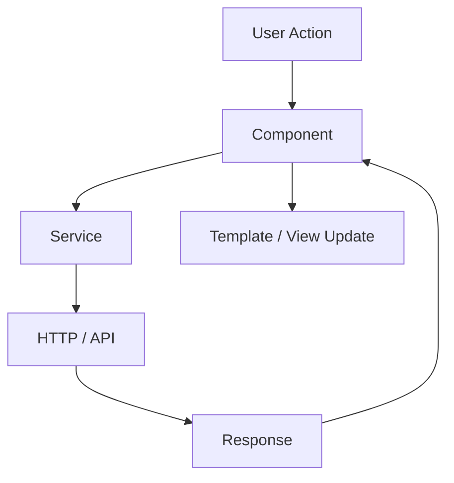
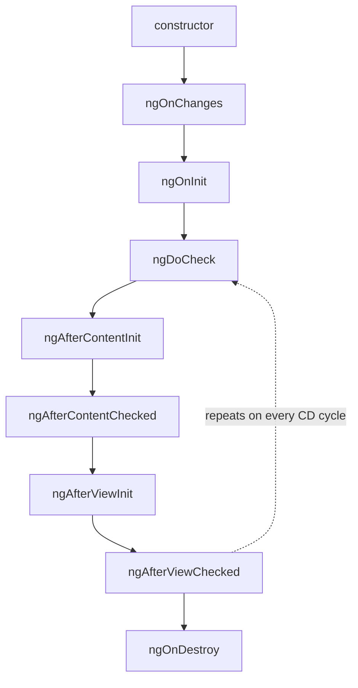
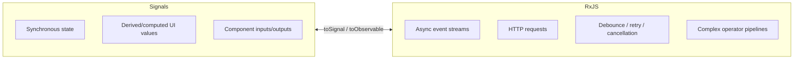
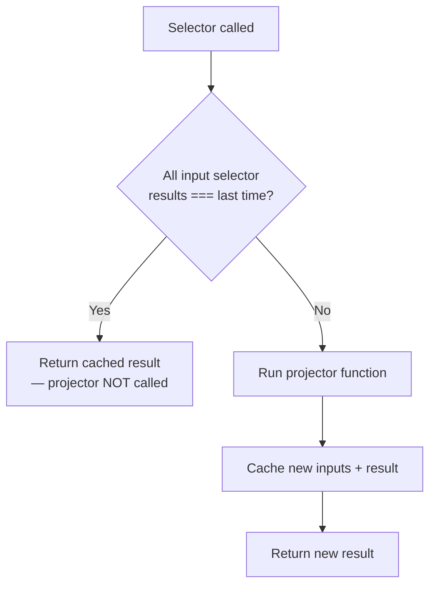
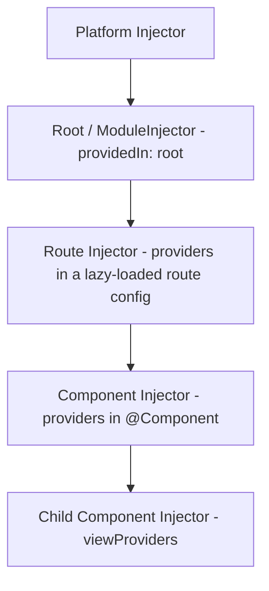
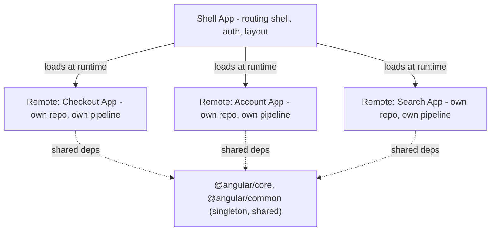
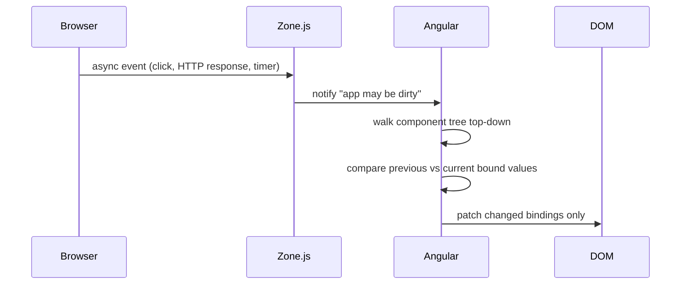
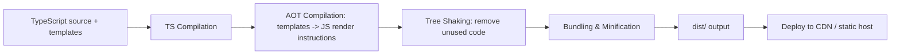
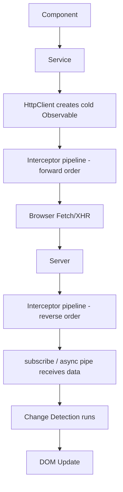
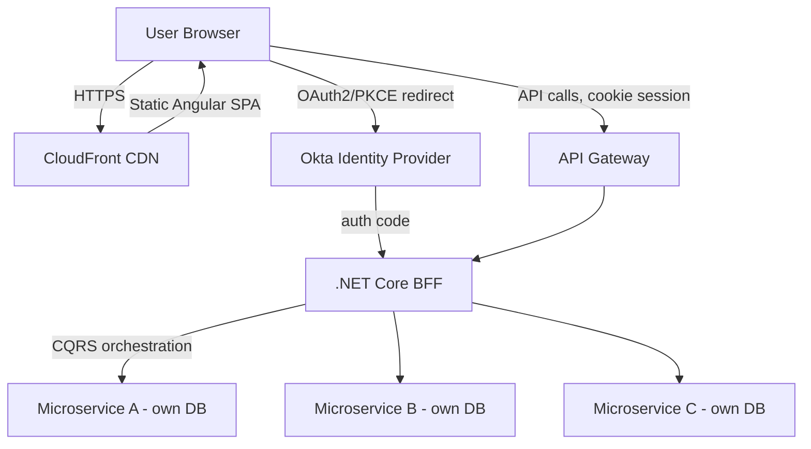

# Angular — Interview Revision Notes

> Quick-revision Q&A derived from `L. Angular-Interview-Guide.md`. Covers every section of the source.

## Core Concepts

### Angular vs AngularJS

**Q: What are the key differences between AngularJS (1.x) and Angular (2+)?**

A:

- AngularJS: MVC, plain JavaScript, digest-cycle change detection, not mobile-optimized.
- Angular: component-based, TypeScript, AOT + Ivy rendering (faster), mobile-optimized.
- Rendering engine evolved: View Engine → Ivy (default since v9).

**Q: What is Ivy and why does it matter?**

A: Ivy is Angular's compilation/rendering engine (default since v9, replacing View Engine). It compiles components/templates ahead-of-time into small, per-component JS instructions instead of a large shared runtime, giving smaller bundles (better tree-shaking), faster compilation, and better debugging (inspectable component instances, precise template error locations).

**Q: Is Angular really MVC?**

A: No — it's closer to a component/MVVM model: component class = view-model, template = view, services/DI = model/business-logic layer. There's no single canonical controller layer like classic MVC.

### Hybrid Angular Apps and Upgrading from AngularJS (ngUpgrade)

**Q: What is a "hybrid Angular app" and what enables it?**

A: An app running AngularJS and Angular side by side on the same page during migration. The `ngUpgrade` module (`@angular/upgrade`) bootstraps both runtimes together and lets AngularJS directives be used in Angular templates and vice versa, via `UpgradeModule`, `downgradeComponent`, and `downgradeInjectable`.

```bash
npm install @angular/upgrade
```

**Q: What's the recommended migration strategy off AngularJS?**

A: Introduce Angular alongside the existing AngularJS app and migrate one route/feature/component at a time, keeping `ngUpgrade` as the bridge until AngularJS is fully retired — not a risky "big bang" rewrite.

### Architecture Overview

**Q: What are the classic (NgModule-based) building blocks of an Angular app?**

A: Modules (`@NgModule`), Components (`@Component`), Templates & Views, Directives & Pipes, Services & DI, Routing (`RouterModule`), Forms, and State Management (NgRx or service-based).



**Q: How has the recommended architecture changed for new apps?**

A: Since Angular 14+ (default CLI schematic since v17), new apps drop NgModules entirely in favor of standalone components/directives/pipes, with routing configured via provider functions (`provideRouter`) in `app.config.ts` instead of `RouterModule.forRoot()`. NgModules still work and remain common in legacy code — be ready to speak to both approaches.

### TypeScript in Angular

**Q: Why does Angular require TypeScript rather than just support it?**

A: Angular's compiler (AOT/Ivy) relies on static type information and decorator metadata to generate optimized instruction code and to power DI's type-based token resolution — it isn't just a style choice.

**Q: How does TypeScript map to a .NET developer's mental model?**

A: Interfaces, generics, access modifiers, and `strictNullChecks` (part of `strict: true`) behave analogously to C# interfaces/generics and nullable reference types.

### Modules (NgModule)

**Q: What do the four core `@NgModule` metadata properties do?**

A:

```typescript
@NgModule({
  declarations: [AppComponent],
  imports: [BrowserModule],
  providers: [],
  bootstrap: [AppComponent]
})
export class AppModule { }
```

- `declarations` — components/directives/pipes owned by this module.
- `imports` — other modules whose exported declarables this module needs.
- `providers` — module-level DI registrations (legacy; `providedIn: 'root'` preferred now).
- `bootstrap` — the root component to instantiate (root module only).

**Q: `RouterModule.forRoot()` vs `forChild()` — what's the difference and why does it matter?**

A: `forRoot()` runs once in the root routing module and also configures the singleton `Router` service/location strategy. `forChild()` (feature modules) only registers routes. Calling `forRoot()` again in a feature module was a classic bug causing duplicate/broken router state.

### Components

**Q: What does a component consist of, and what do the main `@Component` metadata fields control?**

A: Template (HTML) + Class (TS logic) + Styles (CSS/SCSS). Key fields: `selector`, `template`/`templateUrl`, `styles`/`styleUrls`, `providers`, `viewProviders`, `encapsulation`, `changeDetection`, `animations`, `standalone`, `imports`, `exportAs`, `host`.

```typescript
@Component({
  selector: 'app-user',
  templateUrl: './user.component.html',
  styleUrls: ['./user.component.css'],
  providers: [UserService],
  viewProviders: [UserService],
  encapsulation: ViewEncapsulation.Emulated,
  changeDetection: ChangeDetectionStrategy.OnPush,
  animations: [
    trigger('fade', [
      state('visible', style({ opacity: 1 })),
      state('hidden', style({ opacity: 0 })),
      transition('visible <=> hidden', [animate('300ms')])
    ])
  ],
  standalone: true,
  imports: [CommonModule],
  exportAs: 'userComp',
  host: {
    '(click)': 'onHostClick()',
    '[class.active]': 'isActive'
  }
})
export class UserComponent {
  name = 'John';
  isActive = true;
  state = 'visible';

  toggle() {
    this.state = this.state === 'visible' ? 'hidden' : 'visible';
  }

  onHostClick() {
    console.log('Host element clicked');
  }
}
```

**Q: What are the three `ViewEncapsulation` options?**

A:

- `Emulated` (default) — Angular emulates Shadow DOM via attribute selectors; scoped but not truly isolated.
- `None` — no encapsulation; styles become global.
- `ShadowDom` — real browser Shadow DOM, strict isolation.

**Q: What's the difference between `providers` and `viewProviders` on a component?**

A: `providers` are visible to the component's own view *and* any content projected via `<ng-content>`. `viewProviders` are visible only to the component's own template, not to projected content. Classic senior gotcha — most developers never needed `viewProviders`.

**Q: Is a component a directive?**

A: Yes — every component is technically a directive with a template attached. Directives without templates (`@Directive`) change DOM behavior/appearance without rendering their own UI.

### Standalone Components (Angular 14+, default since v17)

**Q: What problem do standalone components solve?**

A: They eliminate the mandatory NgModule wrapper — a component declares `standalone: true` and lists its own `imports` directly, and the app bootstraps via `bootstrapApplication(AppComponent, appConfig)` instead of `platformBrowserDynamic().bootstrapModule(AppModule)`.

```typescript
@Component({
  standalone: true,
  selector: 'app-user-card',
  imports: [CommonModule, RouterLink], // import only what the template needs, directly
  template: `<div>{{ name }}</div>`
})
export class UserCardComponent {
  name = 'Jane';
}
```

```typescript
// main.ts
import { bootstrapApplication } from '@angular/platform-browser';
import { AppComponent } from './app/app.component';
import { appConfig } from './app/app.config';

bootstrapApplication(AppComponent, appConfig);
```

```typescript
// app.config.ts
export const appConfig: ApplicationConfig = {
  providers: [
    provideRouter(routes),
    provideHttpClient(withInterceptors([authInterceptor])),
    provideAnimations(),
  ]
};
```

**Q: Why did Angular move to standalone by default?**

A: Simplifies the mental model (no "which module do I declare this in?"), improves tree-shakability (each component declares exact dependencies), and aligns with how React/Vue/Svelte consume self-contained components. NgModules aren't deprecated — standalone and NgModule code can coexist during incremental migration (`ng generate @angular/core:standalone`).

**Q: What's the standalone-components gotcha around `CommonModule`?**

A: Every standalone component must import `CommonModule` (or specific directives) itself to use `*ngIf`/`*ngFor`/pipes like `date` — unlike NgModule apps where `CommonModule` was often imported once in a shared module.

### UI Component Libraries: Angular Material and Bootstrap

**Q: Angular Material vs Bootstrap — when do you reach for each?**

A: Angular Material (Google's Material Design library, built on the CDK) when you want deep Angular integration, baked-in accessibility, and theming, and Material's visual language is acceptable. Bootstrap (or `ngx-bootstrap`/`ng-bootstrap`) when the org already has Bootstrap-based design conventions or wants a CSS-only approach not tied to one JS framework.

**Q: What does `ng add @angular/material` do?**

A: Installs the package, runs an interactive theme picker, wires up typography/animations in `angular.json`/`main.ts`, and optionally sets up gesture support (`hammerjs`) — the same `ng add` schematic convention used by `@angular/pwa`, `@angular/ssr`, `@ngrx/store`.

```bash
ng add @angular/material
```

### Templates, Metadata, Decorators

**Q: What are templates, metadata, and decorators in Angular?**

A: A template is the declarative HTML view Angular compiles into render/update instructions via Ivy. Metadata is information attached via a decorator (`@Component`, `@NgModule`, `@Injectable`) telling Angular how to construct/wire the class. Decorators are the functions that attach that metadata — without them Angular can't instantiate a class or resolve its dependencies.

```html
<h1>{{ title }}</h1>
<button (click)="sayHello()">Click me</button>
```

### Data Binding

**Q: What are the four types of data binding and their direction?**

A:

- Interpolation `{{ value }}` — Component → View.
- Property binding `[property]="value"` — Component → View.
- Event binding `(event)="handler()"` — View → Component.
- Two-way binding `[(ngModel)]="value"` — Both.

**Q: What does `[(ngModel)]="name"` desugar to?**

A: `[ngModel]="name" (ngModelChange)="name=$event"` — the "banana in a box" pattern. Relevant when building your own two-way-bindable component (`@Input() value` + `@Output() valueChange`).

### Directives

**Q: What are the three types of directives?**

A: Component directives (every component), structural directives (`*ngIf`, `*ngFor`, `*ngSwitch` — add/remove DOM elements; `*` desugars to `<ng-template [ngIf]="cond">`), and attribute directives (`ngClass`, `ngStyle`, custom directives — change appearance/behavior without altering DOM structure).

**Q: `ElementRef` vs `Renderer2` — which should you use for DOM manipulation and why?**

A: `ElementRef.nativeElement` gives direct DOM access but breaks under SSR/Web Worker rendering (no real DOM). `Renderer2` is the Angular-recommended abstraction that works correctly in those environments — always prefer it in production code.

```typescript
@Directive({ selector: '[appHighlight]' })
export class HighlightDirective {
  constructor(private el: ElementRef, private renderer: Renderer2) {}

  private setColor(color: string) {
    this.renderer.setStyle(this.el.nativeElement, 'color', color);
  }
}
```

**Q: `*ngIf` vs `[hidden]` — what's the difference?**

A: `*ngIf` removes the element from the DOM (destroys/recreates, re-runs lifecycle hooks) — better for expensive subtrees. `[hidden]` just toggles `display:none`, keeping the element in DOM/memory — cheaper for frequent toggling, no lifecycle re-run.

### New Control-Flow Syntax: @if / @for / @switch (Angular 17+)

**Q: What's new about `@if`/`@for`/`@switch` versus `*ngIf`/`*ngFor`/`*ngSwitch`?**

A:

- `track` is **mandatory** in `@for` (forces identity/keying decisions up front, unlike optional `trackBy`).
- Compiled directly by Ivy without `<ng-template>` desugaring — smaller generated code, better runtime perf.
- `@empty` is a first-class "no data" block (previously a separate `*ngIf="items.length===0"`).
- No `CommonModule` import needed — built into the template compiler, not directives.
- Old syntax is **not deprecated**; both coexist (migration schematic: `ng generate @angular/core:control-flow`).

```html
@for (item of items; track item.id) { <li>{{ item.name }}</li> } @empty { <li>No items</li> }
```

```html
@if (isLoggedIn) {
  <p>Welcome back!</p>
} @else if (isGuest) {
  <p>Continue as guest</p>
} @else {
  <p>Please log in.</p>
}

@for (item of items; track item.id) {
  <li>{{ item.name }}</li>
} @empty {
  <li>No items found.</li>
}

@switch (status) {
  @case ('success') { <p>Success</p> }
  @case ('error') { <p>Error</p> }
  @default { <p>Unknown</p> }
}
```

### ng-container, ng-template, ng-content

**Q: What's the purpose of `ng-container`, `ng-template`, and `ng-content`?**

A:

- `ng-container` — logical grouping, no extra DOM element; avoids wrapper `<div>`s when applying structural directives.
- `ng-template` — blueprint for deferred/conditional rendering, doesn't render until used (`*ngIf...else`, `ngTemplateOutlet`).
- `ng-content` — content projection from parent into child; renders projected children only. Supports multi-slot projection via `select="[attr]"`.

`ng-container` avoiding wrapper divs:

```html
<ng-container *ngIf="isLoggedIn">
  <p>Welcome back, user!</p>
  <button>Logout</button>
</ng-container>
```

`ng-template` with `else`:

```html
<p *ngIf="isLoggedIn; else showLogin">Welcome back!</p>
<ng-template #showLogin>
  <p>Please log in to continue.</p>
</ng-template>
```

`ng-template` with `ngTemplateOutlet`:

```html
<ng-template #loadingTemplate>
  <p>Loading data...</p>
</ng-template>
<div *ngIf="isLoading; else content"></div>
<ng-template #content>
  <ng-container *ngTemplateOutlet="loadingTemplate"></ng-container>
</ng-template>
```

`ng-content` — multi-slot projection:

```typescript
@Component({
  selector: 'app-card',
  template: `
    <div class="card">
      <header><ng-content select="[card-title]"></ng-content></header>
      <section><ng-content></ng-content></section>
      <footer><ng-content select="[card-footer]"></ng-content></footer>
    </div>
  `
})
export class CardComponent {}
```

```html
<app-card>
  <h2 card-title>Book Title</h2>
  <p>Description here...</p>
  <button card-footer>Buy Now</button>
</app-card>
```

### Pipes

**Q: What are pipes and what are pure vs impure pipes?**

A: Pipes transform data for display only, keeping formatting out of the component class. Pure (default, `pure: true`) — re-evaluated only when the input *reference* changes; cheap and predictable. Impure (`pure: false`) — re-evaluated on every CD cycle regardless; needed for `async` (must poll for emissions) but a performance red flag for custom filter/sort pipes.

```html
<p>{{ name | uppercase }}</p>
<p>{{ 1234.56 | currency:'USD' }}</p>
```

Custom pipe:

```typescript
@Pipe({ name: 'reverse' })
export class ReversePipe implements PipeTransform {
  transform(value: string): string {
    return value.split('').reverse().join('');
  }
}
```

Pure vs impure declaration:

```typescript
@Pipe({ name: 'purePipe', pure: true })   // default — runs only when input reference changes
@Pipe({ name: 'impurePipe', pure: false }) // runs on every change detection cycle
```

**Q: Why shouldn't you filter a list using a pipe by default?**

A: A pure pipe won't re-run on in-place array mutation (no new reference); making it impure to compensate makes it run on every CD cycle app-wide — a classic perf foot-gun. Fix: filter in the component (new array) or use RxJS/Signals-based derived state.

### Services and Dependency Injection

**Q: `providedIn: 'root'` vs a `providers` array in `@NgModule` — what's the difference?**

A: `providedIn: 'root'` gives a tree-shakable, app-wide singleton, only instantiated if injected — preferred default. `providers` in `@NgModule` can scope to a module/component but historically risked duplicate instances per lazy module; use when you deliberately want scoped/multiple instances.

```typescript
@Injectable({ providedIn: 'root' })
export class DataService {
  getData() { return 'Hello from Service'; }
}
```

```typescript
constructor(private dataService: DataService) { }
```

**Q: How does hierarchical DI work?**

A: Angular's injector is a tree, not a global container. `providedIn: 'root'` gives one instance app-wide; registering a service in a component's own `providers` array creates a *new* instance for that component subtree (e.g., isolated `ValidationService` per wizard step).

### The inject() Function (Angular 14+)

**Q: What is `inject()` and where is it required?**

A: A functional alternative to constructor injection, idiomatic in standalone components, functional guards/interceptors/resolvers, and anywhere without a class constructor.

```typescript
import { inject } from '@angular/core';

@Component({ standalone: true, selector: 'app-user' })
export class UserComponent {
  private userService = inject(UserService);
  private route = inject(ActivatedRoute);
}
```

```typescript
export const authGuard: CanActivateFn = (route, state) => {
  const auth = inject(AuthService);
  return auth.isLoggedIn() ? true : inject(Router).createUrlTree(['/login']);
};
```

**Q: Can you call `inject()` inside a `setTimeout` callback?**

A: Not directly — `inject()` only works inside an "injection context" (constructor, field initializer, or `runInInjectionContext`). The context is gone inside an async callback unless you capture the dependency beforehand or wrap the call in `runInInjectionContext()`. Constructor injection remains valid; `inject()` is additive, not a replacement.

---

## Intermediate

### Component Lifecycle Hooks

**Q: List the lifecycle hooks in order and their purpose.**

A:



| Hook | When | Use |
|---|---|---|
| `ngOnChanges` | Whenever a bound `@Input()` changes | React to input changes via `SimpleChanges` |
| `ngOnInit` | Once, after first `ngOnChanges` | Init logic, data fetching |
| `ngDoCheck` | Every CD cycle | Custom change detection Angular can't see |
| `ngAfterContentInit` | Once, after projected content init | Access projected content |
| `ngAfterContentChecked` | After every projected-content check | React to projected content updates |
| `ngAfterViewInit` | Once, after view/child views init | Safely access `@ViewChild` |
| `ngAfterViewChecked` | After each view check | Rare |
| `ngOnDestroy` | Before destruction | Clean up subscriptions/timers |

**Q: Why should business logic never live in the constructor?**

A: Inputs aren't bound yet and injected services may not be fully ready. Use `ngOnInit` for API calls/initialization — constructor is for DI only.

### ViewChild / ViewChildren / ContentChild / ContentChildren

**Q: `@ViewChild`/`@ViewChildren` vs `@ContentChild`/`@ContentChildren`?**

A: "View = what I own" (this component's own template, available after `ngAfterViewInit`); "Content = what the parent gives me" (projected content from parent via `<ng-content>`, available after `ngAfterContentInit`).

```typescript
@ViewChild(MatPaginator) paginator!: MatPaginator;
@ViewChildren(ItemComponent) items!: QueryList<ItemComponent>;
```

**Q: What are signal-based query equivalents (Angular 17.3+)?**

A: `viewChild()`, `viewChildren()`, `contentChild()`, `contentChildren()` return Signals (e.g., `Signal<MatPaginator | undefined>`) instead of requiring the `!` non-null assertion + lifecycle-timing dance — "not yet available" becomes an explicit type rather than a runtime surprise, and integrates with `computed()`/`effect()`.

```typescript
export class UserComponent {
  paginator = viewChild(MatPaginator);      // Signal<MatPaginator | undefined>
  items = viewChildren(ItemComponent);      // Signal<readonly ItemComponent[]>
}
```

### Component Communication

**Q: What mechanisms exist for component communication?**

A: Parent→Child: `@Input()`. Child→Parent: `@Output()` + `EventEmitter`. Sibling/unrelated: shared service with `Subject`/`BehaviorSubject`/Signal. Across routes: route params/query params/router navigation `state`.

**Q: Is `EventEmitter` suitable as a general pub/sub mechanism in services?**

A: No — it's a thin wrapper over RxJS `Subject`, intended strictly for `@Output()` communication. Use a plain `Subject`/`BehaviorSubject` for pub/sub inside services.

Template reference variables (`#var`) are a lighter-weight alternative to `@ViewChild` for trivial DOM access:

```html
<input #txt />
<button (click)="print(txt.value)">Print</button>
```

### Routing and Navigation

**Q: How do you configure basic routes and navigate programmatically?**

A:

```typescript
const routes: Routes = [{ path: 'home', component: HomeComponent }, { path: '**', component: PageNotFoundComponent }];
this.router.navigate(['/home']);
this.route.snapshot.paramMap.get('id');
```

**Q: How do you register routes via `RouterModule.forRoot()` in an NgModule-based app?**

A:

```typescript
const routes: Routes = [
  { path: 'home', component: HomeComponent },
  { path: 'about', component: AboutComponent }
];

@NgModule({
  imports: [RouterModule.forRoot(routes)],
  exports: [RouterModule]
})
export class AppRoutingModule { }
```

**Q: How do you add navigation links and a router outlet in a template?**

A:

```html
<a routerLink="/home">Home</a>
<router-outlet></router-outlet>
```

**Q: How do you navigate programmatically via the `Router` service?**

A:

```typescript
constructor(private router: Router) { }
navigateToHome() {
  this.router.navigate(['/home']);
}
```

**Q: How do you define a wildcard (404) route?**

A:

```typescript
{ path: '**', component: PageNotFoundComponent }
```

**Q: How do you define and read a route parameter?**

A:

```typescript
{ path: 'product/:id', component: ProductComponent }
```
```typescript
constructor(private route: ActivatedRoute) {}
this.route.snapshot.paramMap.get('id');
```

**Q: How do you set and read query parameters?**

A:

```typescript
this.router.navigate(['/products'], { queryParams: { category: 'electronics' } });
this.route.snapshot.queryParamMap.get('category');
```

**Q: How do you lazy-load a feature module via `loadChildren`?**

A:

```typescript
const routes: Routes = [
  { path: 'dashboard', loadChildren: () => import('./dashboard/dashboard.module').then(m => m.DashboardModule) }
];
```

**Q: Why is `route.snapshot.paramMap` risky, and what's the fix?**

A: `snapshot` only captures the value at navigation time — if the same component instance is reused across a param-only navigation (e.g., `/product/1` → `/product/2`), it won't update. Use the observable form (`route.paramMap.subscribe(...)` or piped through `switchMap`).

**Q: How does lazy loading work for standalone components/routes (Angular 14+)?**

A: `loadComponent: () => import('./login/login.component').then(c => c.LoginComponent)` or `loadChildren` pointing to a plain `Routes` array export — no wrapper NgModule needed.

```typescript
const routes: Routes = [
  { path: 'login', loadComponent: () => import('./login/login.component').then(c => c.LoginComponent) },
  { path: 'admin', loadChildren: () => import('./admin/admin.routes').then(m => m.ADMIN_ROUTES) }
];
```

### Route Guards

**Q: What are the five route guard types and their purposes?**

A: `CanActivate` (protect a route), `CanActivateChild` (protect child routes), `CanLoad` (legacy, lazy-module load gate), `CanMatch` (current — also gates non-lazy routes and can fall through to a different route def), `CanDeactivate` (block navigating away, e.g. unsaved changes).

**Q: `CanLoad` vs `CanMatch`?**

A: `CanMatch` is strictly more capable — it can gate non-lazy routes too and lets Angular try the next matching route config if it returns false (useful for feature-flagged route swaps). `CanLoad` only prevented lazy-module loading. New code should use `CanMatch`.

**Q: Write a functional `CanActivateFn` guard.**

A:

```typescript
export const authGuard: CanActivateFn = () => {
  const auth = inject(AuthService);
  return auth.isLoggedIn() || inject(Router).createUrlTree(['/login']);
};
```

Full modern guard-based routing config (functional style, Angular 15+):

```typescript
const routes: Routes = [
  {
    path: 'login',
    loadComponent: () => import('./login/login.component').then(c => c.LoginComponent)
  },
  {
    path: 'dashboard',
    canMatch: [authMatchGuard],
    canActivate: [authGuard],
    loadComponent: () => import('./dashboard/dashboard.component').then(c => c.DashboardComponent)
  },
  {
    path: 'admin',
    canMatch: [adminLoadGuard, adminMatchGuard],
    loadChildren: () => import('./admin/admin.routes').then(m => m.ADMIN_ROUTES)
  },
  {
    path: 'profile-edit',
    canDeactivate: [formExitGuard],
    loadComponent: () => import('./profile/profile-edit.component').then(c => c.ProfileEditComponent)
  }
];
```

A `CanDeactivateFn` guard, alongside the `CanActivateFn` guard above:

```typescript
export const authGuard: CanActivateFn = () => {
  const auth = inject(AuthService);
  const router = inject(Router);
  return auth.isLoggedIn() || router.createUrlTree(['/login']);
};

export const formExitGuard: CanDeactivateFn<ProfileEditComponent> = (component) => {
  if (component.form.dirty) {
    return confirm('You have unsaved changes. Leave anyway?');
  }
  return true;
};
```

Class-based guards (`implements CanActivate`) still work; functional guards are the modern style, avoiding an extra injectable class.

### Forms: Template-driven vs Reactive

**Q: Template-driven vs Reactive forms — when to use which?**

A: Template-driven (`ngModel` in template) — small forms, simple validation, less scalable/testable. Reactive (`FormControl`/`FormGroup` in class) — enterprise standard for complex/dynamic forms, more testable (pure TS, no DOM needed).

Template-driven:

```html
<form #form="ngForm">
  <input type="text" [(ngModel)]="name" name="name">
</form>
```

Reactive:

```typescript
form = new FormGroup({
  name: new FormControl('')
});
```
```html
<input type="text" [formControl]="form.controls['name']">
```

`FormBuilder` simplifies construction:

```typescript
constructor(private fb: FormBuilder) { }
form = this.fb.group({
  name: ['', Validators.required]
});
```

Validation:

```typescript
form = new FormGroup({
  email: new FormControl('', [Validators.required, Validators.email])
});
```
```html
<p *ngIf="form.controls.email.errors?.required">Email is required</p>
```

**Q: `FormGroup` vs `FormArray`?**

A: "`FormGroup` is a fixed, named group of controls; `FormArray` is a dynamic, indexed collection used when the number of inputs is unknown or user-driven."

```typescript
userForm = new FormGroup({
  name: new FormControl(''),
  phones: new FormArray([
    new FormControl('12345')
  ])
});
```

**Q: How do you set/clear validators dynamically and check control state?**

A: `control.setValidators([...]); control.clearValidators(); control.updateValueAndValidity();` — used for cross-field conditional validation. State checks: `form.valid`, `control.errors`, `control.touched`, `control.dirty`.

```typescript
control.setValidators([Validators.required]);
control.clearValidators();
control.updateValueAndValidity();
```

```typescript
form.valid           // overall
control.errors       // specific control's errors
control.touched      // user has focused and left
control.dirty        // value has changed from initial
```

**Q: What does `valueChanges` give you, and is it available on template-driven forms?**

A: An RxJS Observable on any `FormControl`/`FormGroup`/`FormArray` emitting the latest value on change — used for live validation, real-time search, autosave. Only exists for reactive forms (template-driven has `ngModelChange` per-control instead).

```typescript
name = new FormControl('');

ngOnInit() {
  this.name.valueChanges.subscribe(value => {
    console.log('Name changed:', value);
  });
}
```

**Q: What does `[ngModelOptions]="{standalone: true}"` do?**

A: Tells Angular not to register that `ngModel` control with the surrounding `ngForm` — for a UI-only field inside a `<form>` that shouldn't affect the parent form's validity/value.

**Q: How do you wire up a reactive form's submission?**

A:

```html
<form [formGroup]="form" (ngSubmit)="onSubmit()">
  <button type="submit">Submit</button>
</form>
```
```typescript
onSubmit() {
  console.log(this.form.value);
}
```

Resetting: `this.form.reset();`

**Q: How do you write a custom cross-field validator?**

A:

```typescript
export function passwordsMatch(group: AbstractControl): ValidationErrors | null {
  return group.get('password')?.value === group.get('confirmPassword')?.value ? null : { passwordMismatch: true };
}
```

### Typed Reactive Forms (Angular 14+)

**Q: What problem do typed reactive forms solve?**

A: Pre-Angular 14, `FormGroup`/`FormControl` were effectively `any`-typed, so typos like `form.get('emial')` failed silently at runtime. Angular 14 introduced strict typing: `FormControl<string>`, `FormGroup<ProfileForm>`, giving compile-time errors for typo'd control names/wrong types.

```typescript
interface ProfileForm {
  name: FormControl<string>;
  email: FormControl<string>;
  phones: FormArray<FormControl<string>>;
}

const form = new FormGroup<ProfileForm>({
  name: new FormControl('', { nonNullable: true }),
  email: new FormControl('', { nonNullable: true, validators: [Validators.email] }),
  phones: new FormArray<FormControl<string>>([])
});

form.value.name; // string | undefined — typed!
```

**Q: What's the `nonNullable` gotcha?**

A: `.reset()` on an untyped `FormControl<string>` previously reset to `null`, violating the apparent `string` type. You must opt into `{ nonNullable: true }` or type the control as `FormControl<string | null>` to be accurate. `UntypedFormGroup`/`UntypedFormControl` remain as an escape hatch for migrating old code.

### HttpClient and Interceptors

**Q: How do you inject `HttpClient` and issue a basic GET request?**

A:

```typescript
import { HttpClient } from '@angular/common/http';
constructor(private http: HttpClient) { }

getData() {
  return this.http.get('https://api.example.com/data');
}
```

**Q: How do you perform GET/POST/PUT/DELETE and handle errors with `HttpClient`?**

A:

```typescript
this.http.get(url).subscribe(...);
this.http.post(url, data).subscribe(...);
this.http.get(url).pipe(catchError(err => throwError(() => err))).subscribe();
```

Each verb, explicitly:

```typescript
this.http.get('https://api.example.com/users').subscribe(response => console.log(response));

const data = { name: 'John' };
this.http.post('https://api.example.com/users', data).subscribe(response => console.log(response));

const updatedData = { name: 'John Doe' };
this.http.put('https://api.example.com/users/1', updatedData).subscribe(response => console.log(response));

this.http.delete('https://api.example.com/users/1').subscribe(response => console.log(response));
```

Custom headers via `HttpHeaders`, query params via `HttpParams`.

```typescript
const headers = new HttpHeaders().set('Authorization', 'Bearer token');
this.http.get('https://api.example.com/data', { headers }).subscribe();
```

```typescript
const params = new HttpParams().set('search', 'Angular');
this.http.get('https://api.example.com/items', { params }).subscribe();
```

**Q: What's the interceptor pipeline execution order?**

A: Interceptors run in registration order on the outgoing request, and in **reverse** order on the response — a classic whiteboard question. Common chain: Auth → Loader → Error handler. Registered via `{ provide: HTTP_INTERCEPTORS, useClass: X, multi: true }`.

```typescript
@Injectable()
export class AuthInterceptor implements HttpInterceptor {
  // Inject a token source — don't read storage directly. Keeps it testable and
  // leaves the storage posture (localStorage vs BFF cookie) an explicit choice.
  constructor(private auth: TokenService) {}

  intercept(req: HttpRequest<any>, next: HttpHandler): Observable<HttpEvent<any>> {
    const token = this.auth.getAccessToken();
    if (!token) { return next.handle(req); }   // don't send "Bearer null"
    const requestWithToken = req.clone({
      setHeaders: { Authorization: `Bearer ${token}` }
    });
    return next.handle(requestWithToken);
  }
}
```

Registering it:

```typescript
providers: [
  { provide: HTTP_INTERCEPTORS, useClass: AuthInterceptor, multi: true }
]
```

Global error handling in an interceptor:

```typescript
intercept(req: HttpRequest<any>, next: HttpHandler) {
  return next.handle(req).pipe(
    catchError(err => {
      if (err.status === 401) { /* redirect to login */ }
      if (err.status === 500) { /* show toast */ }
      return throwError(() => err);
    })
  );
}
```

**Q: Is JSONP still relevant?**

A: Legacy/rarely used in 2026 — virtually all modern APIs support CORS, and JSONP has security downsides (arbitrary script execution). Mention only if directly asked.

### Functional Interceptors (Angular 15+)

**Q: What's the modern interceptor style?**

A: Functional interceptors, the only style directly supported by `provideHttpClient`:

```typescript
export const authInterceptor: HttpInterceptorFn = (req, next) => {
  const token = inject(AuthService).getToken();
  return next(req.clone({ setHeaders: { Authorization: `Bearer ${token}` } }));
};
```

Registered without `HTTP_INTERCEPTORS`/`multi: true` boilerplate:

```typescript
provideHttpClient(withInterceptors([authInterceptor, loaderInterceptor, errorInterceptor]));
```

Array order = execution order; no `HTTP_INTERCEPTORS`/`multi: true` boilerplate. Class-based interceptors still work but this is the default to demonstrate.

---

## Advanced

### RxJS and Observables

**Q: What is RxJS and how do Observables differ from Promises?**

A: RxJS models async/reactive programming via Observables — streams emitting zero, one, or many values via `next`/`error`/`complete`. Vs Promise: lazy (nothing runs until `.subscribe()`) vs immediate execution; multiple values vs single; cancelable (`unsubscribe()`) vs not; rich operator library vs none.

```typescript
const obs = new Observable(observer => {
  observer.next('Hello');
  observer.complete();
});
obs.subscribe(data => console.log(data));
```

**Q: What does subscribing to an Observable with separate success/error callbacks look like, and when does it start executing?**

A: Nothing executes until `.subscribe()` is called — Observables are lazy ("cold" by default):

```typescript
this.http.get(url).subscribe(
  data => console.log(data),
  err => console.log(err)
);
```

**Q: What are the ways to avoid subscription leaks?**

A: Store the `Subscription` and call `.unsubscribe()` in `ngOnDestroy()`; use the `takeUntil(destroySubject$)` pattern; or use the `async` pipe in the template (auto subscribe/unsubscribe).

```typescript
ngOnDestroy() {
  this.subscription.unsubscribe();
}
```

**Q: What's the modern unsubscribe pattern (Angular 16+)?**

A: `takeUntilDestroyed()`, which hooks into Angular's `DestroyRef` automatically — largely replaces manual `Subject`-based `takeUntil` boilerplate:

```typescript
this.userService.getUsers().pipe(takeUntilDestroyed()).subscribe(...);
```

Omit the `destroyRef` argument when called in an injection context (constructor/field initializer).

### Subjects, BehaviorSubject, Multicasting

**Q: What is multicasting, and how do `Subject` and `BehaviorSubject` differ?**

A: Multicasting = one Observable execution shared across multiple subscribers. `Subject` doesn't store the last value and new subscribers only get future emissions. `BehaviorSubject` stores the latest value, requires an initial value, and immediately emits the current value to new subscribers.

```typescript
const subject = new Subject();
subject.next(1); // nobody receives (no subscriber yet)
subject.subscribe(v => console.log('A:', v));
subject.next(2); // A: 2
subject.next(3); // A: 3
```

```typescript
const subject = new BehaviorSubject(0);
subject.subscribe(v => console.log('A:', v));
subject.next(1);
subject.next(2);
subject.subscribe(v => console.log('B:', v)); // B: 2 immediately
```

Rule of thumb: **Observable → read data; Subject → send events; BehaviorSubject → store latest state.**

**Q: When would you use `ReplaySubject` or `shareReplay` instead of `BehaviorSubject`?**

A: `ReplaySubject` when new subscribers need some/all previously emitted values (not just latest), e.g. replaying last N chat messages. `shareReplay(1)` when caching/sharing the result of a *source* Observable (e.g., one HTTP call) among multiple subscribers without a manual state container.

### RxJS Operators Cheat Sheet

**Q: Compare `mergeMap`, `switchMap`, `concatMap`, `exhaustMap`.**

A:

`pipe()` chains operators without mutating the source Observable:

```typescript
this.http.get<User[]>('/api/users')
  .pipe(map(users => users.filter(u => u.active)))
  .subscribe(activeUsers => console.log(activeUsers));
```

```typescript
of(1, 2, 3, 4).pipe(filter(num => num > 2)).subscribe(console.log); // 3, 4
```

| Operator | Behavior | Best for |
|---|---|---|
| `mergeMap` | Runs all inner Observables concurrently, no cancellation | Parallel/independent API calls |
| `switchMap` | Cancels previous inner Observable on new source value | Search-as-you-type |
| `concatMap` | Queues inner Observables, strictly sequential | Ordered batch saves |
| `exhaustMap` | Ignores new emissions while current inner Observable runs | Prevent duplicate submits |

```typescript
this.searchInput.valueChanges.pipe(
  debounceTime(300),
  switchMap(term => this.http.get(`/api/search?q=${term}`))
).subscribe(results => console.log(results));
```

**Q: What's the `forkJoin` gotcha?**

A: `forkJoin` only emits once **all** source Observables complete — a source that never completes (e.g., most Subjects, an infinite stream) makes `forkJoin` hang forever. It's conceptually like `Promise.all`.

```typescript
forkJoin([
  this.http.get('https://api.example.com/users'),
  this.http.get('https://api.example.com/posts')
]).subscribe(([users, posts]) => console.log(users, posts));
```

**Q: Pull vs Push (imperative vs reactive) — what's the distinction?**

A: Pull: consumer actively asks for data (function calls, array iteration). Push: producer sends data automatically when ready (Observables, events, Promises). Push/reactive scales better for async, UI-driven flows since consumers don't poll.

### Angular Signals (Angular 16+)

**Q: What are Signals and why were they introduced?**

A: A fine-grained reactive primitive built into `@angular/core` (not RxJS) representing a value that notifies consumers on change. Unlike Zone.js CD (which can't know *which* binding changed and re-checks whole subtrees), Signals give Angular the exact dependency graph, enabling surgical DOM updates and being the technical enabler for zoneless CD.

```typescript
count = signal(0);
doubled = computed(() => this.count() * 2);
increment() { this.count.update(v => v + 1); }
effect(() => console.log('Count', this.count()));
```

```html
<p>Count: {{ count() }}</p>
<p>Doubled: {{ doubled() }}</p>
```

**Q: What are signal-based inputs/outputs (Angular 17.1+)?**

A: `name = input.required<string>()`, `age = input(0)`, `selected = output<string>()` — signal-based `@Input`/`@Output` equivalents.

```typescript
export class UserCardComponent {
  name = input.required<string>();       // signal-based @Input, required
  age = input(0);                        // signal-based @Input with default
  selected = output<string>();           // signal-based @Output
}
```

**Q: Do Signals replace RxJS? What bridges them?**

A: No — Signals model synchronous, always-has-a-value state; RxJS remains right for async streams/complex orchestration (debounce, retry, cancellation). Interop: `toSignal()` (Observable→Signal) and `toObservable()` (Signal→Observable) from `@angular/core/rxjs-interop`.

```typescript
users = toSignal(this.userService.getUsers(), { initialValue: [] });
```

### RxJS vs Signals — When to Use Which

**Q: Give the crisp framing for "Signals vs RxJS."**



A: "We're not choosing one over the other — Signals are becoming the default for component-local state and template bindings, while RxJS remains the backbone for async streams and operator composition. `toSignal`/`toObservable` interop lets both coexist." Signals: pull-based, sync, no built-in cancellation/debounce, low learning curve, native fine-grained CD/zoneless support. RxJS: push-based, native async, rich operators, higher learning curve, needs `async` pipe or manual subscription for CD.

### State Management (NgRx and Alternatives)

**Q: What are the common state-management approaches, roughly by increasing formality?**

A: Service-based state (Signal/`BehaviorSubject` in a service) → RxJS with `BehaviorSubject` → NgRx (Redux pattern on RxJS) → Akita/NGXS/Apollo client cache as alternatives.

**Q: What are the five core NgRx concepts?**

A: Store (single source of truth), Actions (plain objects: what happened), Reducers (pure functions computing new state), Effects (side effects like API calls, dispatch further actions), Selectors (memoized state slices).

```typescript
export const increment = createAction('INCREMENT');

const counterReducer = createReducer(
  initialState,
  on(increment, state => ({ count: state.count + 1 }))
);

@Injectable()
export class MyEffects {
  loadData$ = createEffect(() => this.actions$.pipe(
    ofType(loadData),
    mergeMap(() => this.http.get('/api/data').pipe(map(data => loadDataSuccess({ data }))))
  ));

  constructor(private actions$: Actions, private http: HttpClient) { }
}

export const selectCount = (state: AppState) => state.count;
```

**Q: When should you reach for NgRx vs a simpler `BehaviorSubject`/Signal store?**

A: NgRx pays off for large teams/apps with complex cross-cutting shared state needing strict unidirectional flow, time-travel debugging, and strong conventions across many contributors. For small/medium apps or well-bounded feature state, a signal/service-based store is simpler to onboard — justify the choice, don't default to NgRx reflexively.

### SignalStore / NgRx Signals (Angular 17+)

**Q: What is `@ngrx/signals` / SignalStore and when do you use it over classic NgRx?**

A: A lighter-weight, Signal-native alternative to Actions/Reducers/Effects for local/feature state, reducing boilerplate while keeping devtools/testability.

```typescript
export const CounterStore = signalStore(
  { providedIn: 'root' },
  withState({ count: 0 }),
  withComputed(({ count }) => ({ doubled: computed(() => count() * 2) })),
  withMethods((store) => ({ increment() { patchState(store, { count: store.count() + 1 }); } }))
);
```

Classic NgRx effects remain more mature for complex async orchestration (retries, cancellation races); SignalStore suits simpler feature/component-local state.

### NgRx Entity Adapters, Facade Pattern, and Selector Memoization

**Q: What does `@ngrx/entity`'s `EntityAdapter` solve?**

A: Normalizes collection state into `{ ids: string[], entities: { [id]: T } }` instead of a raw array, generating typed CRUD reducer helpers (`setAll`, `addOne`, `updateOne`, `removeOne`, `upsertMany`) and selectors (`selectIds`, `selectEntities`, `selectAll`, `selectTotal`). `selectEntities` gives O(1) lookup-by-id instead of an `Array.find()` scan — matters once lists grow and are looked up frequently.

```typescript
import { createEntityAdapter, EntityState } from '@ngrx/entity';
import { createReducer, on } from '@ngrx/store';

interface User { id: string; name: string; email: string; }

// EntityState<User> = { ids: string[]; entities: { [id: string]: User } }
interface UserState extends EntityState<User> {
  loading: boolean;
  selectedUserId: string | null;
}

const adapter = createEntityAdapter<User>({
  selectId: (user) => user.id,          // defaults to `entity.id` if omitted
  sortComparer: (a, b) => a.name.localeCompare(b.name), // optional, keeps `ids` sorted
});

const initialState: UserState = adapter.getInitialState({
  loading: false,
  selectedUserId: null,
});

const userReducer = createReducer(
  initialState,
  on(loadUsersSuccess, (state, { users }) => adapter.setAll(users, state)),
  on(addUser,          (state, { user })  => adapter.addOne(user, state)),
  on(updateUser,       (state, { update }) => adapter.updateOne(update, state)),
  on(deleteUser,       (state, { id })    => adapter.removeOne(id, state)),
  on(upsertManyUsers,  (state, { users }) => adapter.upsertMany(users, state)),
);
```

`adapter.getSelectors()` generates the four canonical selectors so you never hand-write `Object.values(entities)` again:

```typescript
const { selectIds, selectEntities, selectAll, selectTotal } = adapter.getSelectors();

export const selectUserIds     = createSelector(selectUserState, selectIds);
export const selectUserEntities = createSelector(selectUserState, selectEntities); // dictionary, O(1) lookup by id
export const selectAllUsers    = createSelector(selectUserState, selectAll);       // User[]
export const selectUserCount   = createSelector(selectUserState, selectTotal);
```

**Q: What is the facade pattern in NgRx, and why use it?**

A: Wrap direct `Store` access (`select`/`dispatch`) behind an injectable service so components never import NgRx symbols directly. Benefits: small testable app-specific API surface; swapping the state-management implementation only requires rewriting the facade; far easier to mock in component unit tests (`{ provide: UserFacade, useValue: fakeFacade }`) than standing up a `MockStore`. Trade-off: extra indirection/boilerplate per feature — worth it once state is consumed by more than a couple components.

```typescript
@Injectable({ providedIn: 'root' })
export class UserFacade {
  private store = inject(Store);

  users$ = this.store.select(selectAllUsers);
  loading$ = this.store.select(selectUserLoading);
  selectedUser$ = this.store.select(selectSelectedUser);

  loadUsers(): void {
    this.store.dispatch(loadUsers());
  }

  selectUser(id: string): void {
    this.store.dispatch(selectUser({ id }));
  }
}
```

```typescript
@Component({ /* ... */ })
export class UserListComponent {
  private facade = inject(UserFacade);
  users$ = this.facade.users$;

  onSelect(id: string) {
    this.facade.selectUser(id);
  }
}
```

**Q: How does `createSelector` actually memoize, and what's the common gotcha?**

A: It caches the last set of input-selector results (by reference/`===`) and the last projector result. If every input result is `===` to last time, the projector isn't re-run. Cache size is **1** — calling the same selector with alternating argument sets (parameterized selectors) thrashes the cache and recomputes every time. Also, reducers that mutate in place defeat the *intended* update-detection; reducers that always return a new reference even when data is unchanged defeat the *cache*.



```typescript
export const selectUserState = (state: AppState) => state.users;
export const selectFilterText = (state: AppState) => state.ui.filterText;

export const selectFilteredUsers = createSelector(
  selectAllUsers,
  selectFilterText,
  (users, filterText) => users.filter(u => u.name.includes(filterText)) // "projector" function
);
```

### Dependency Injection: Hierarchical Injectors Deep Dive

**Q: How does Angular resolve a dependency across the injector tree?**



A: It walks **up** the tree from the requesting component/directive until it finds a provider for the token, then stops — nearest provider wins. A service in a component's `providers` array is instantiated fresh for that subtree even if the same class is also `providedIn: 'root'` elsewhere (component-level shadows root for that subtree).

**Q: What's the exact difference between `providers` and `viewProviders` in DI terms?**

A: `viewProviders` is invisible to content projected via `<ng-content>` — projected content resolves dependencies from its own origin's injector, not the host's view injector.

**Q: What do `@Optional()`, `@Self()`, `@SkipSelf()`, `@Host()` do?**

A: `@Optional()` — returns `null` instead of throwing if no provider found. `@Self()` — restrict resolution to the requesting injector only (no walking up). `@SkipSelf()` — skip the local injector, start search one level up (e.g., `ControlContainer` needing the parent's instance). `@Host()` — stop the walk at the current component's host boundary.

**Q: What are multi-providers for?**

A: `{ provide: TOKEN, useClass: X, multi: true }` lets multiple values accumulate under one token instead of the last registration overwriting previous ones — used for `HTTP_INTERCEPTORS`.

### Micro-Frontends / Module Federation for Angular

**Q: What problem do micro-frontends / Module Federation solve?**

A: A single large Angular app owned by one team doesn't scale organizationally once multiple teams need to build/deploy independently. Webpack Module Federation lets one build (a "remote") expose modules at runtime that another build (the "host"/shell) consumes without compiling them together — only a runtime manifest URL is needed.

```javascript
// remote's webpack.config.js (checkout-app) — exposes a module
new ModuleFederationPlugin({
  name: 'checkoutApp',
  filename: 'remoteEntry.js',
  exposes: {
    './CheckoutModule': './src/app/checkout/checkout.module.ts',
  },
  shared: ['@angular/core', '@angular/common', '@angular/router'],
});

// shell's webpack.config.js — consumes it
new ModuleFederationPlugin({
  name: 'shell',
  remotes: {
    checkoutApp: 'checkoutApp@https://checkout.example.com/remoteEntry.js',
  },
  shared: ['@angular/core', '@angular/common', '@angular/router'],
});
```

**Q: What Angular-specific tooling wraps Module Federation?**

A: `@angular-architects/module-federation` schematic, wiring Module Federation onto the Angular CLI builder; supports dynamic remote loading (`loadRemoteModule({...})`) without knowing the remote's URL at build time.

```typescript
// shell's routes — lazy-load a remote exposed module, resolved at runtime
{
  path: 'checkout',
  loadChildren: () =>
    loadRemoteModule({
      type: 'module',
      remoteEntry: 'https://checkout.example.com/remoteEntry.js',
      exposedModule: './CheckoutModule',
    }).then(m => m.CheckoutModule),
}
```



**Q: What's the key operational risk of Module Federation, and what's the `shared` config for?**

A: `shared: ['@angular/core', ...]` negotiates singleton framework deps across host/remotes at runtime, avoiding duplicate instances (which would break DI/routing/CD) and bloat. Risk: version skew — if host/remote disagree on a shared dependency's major version, it fails at **runtime**, not build time, a much later/harder-to-catch failure than a monorepo's compile-time error.

**Q: Module Federation vs an Nx monorepo — when is each the right call?**

A: Module Federation earns its cost only when teams need genuine **independent deployability** (ship without coordinating with other teams). If the real constraint is just "many teams, one codebase, fast builds, enforced boundaries" — not independent runtime deployment — an Nx monorepo with lint-enforced library boundaries gets most of the benefit far more cheaply (one pipeline, one version, compile-time breakage). "Module Federation solves an organizational/deployment problem, not a code-organization problem."

---

## Performance

### Change Detection Deep Dive

**Q: How does Angular's classic Zone.js-based change detection work?**

A: Zone.js monkey-patches async browser APIs (`setTimeout`, Promises, DOM events, XHR/fetch); when any fires, it notifies Angular to run a CD pass. Angular walks the component tree top-down from root, comparing previous vs current bound values ("diffing bound expressions," not deep object comparison), and patches the DOM where changed. Default strategy checks the entire tree on every triggering event.



**Q: What triggers change detection, and how do you control it manually?**

A: DOM events, HTTP responses, timers, Promise resolution, `@Input` changes, and manual triggers. `ChangeDetectorRef.detectChanges()` runs CD synchronously now; `markForCheck()` marks this (and OnPush ancestors) dirty for the next cycle.

```typescript
constructor(private cd: ChangeDetectorRef) {}

this.cd.detectChanges();  // synchronously run CD now
this.cd.markForCheck();   // mark this (and OnPush ancestors) dirty for the next cycle
```

### Zoneless Change Detection (Angular 18+)

**Q: What is zoneless change detection and why does it matter?**

A: `provideExperimentalZonelessChangeDetection()` (Angular 18+) removes Zone.js entirely. Zone.js patches nearly every async API (runtime cost, subtle bugs with unpatched globals/Web Workers) and adds bundle/parse cost. Zoneless CD relies on **Signals** to know precisely when to re-render — the direct payoff of the Signals investment.

```typescript
// app.config.ts
export const appConfig: ApplicationConfig = {
  providers: [
    provideExperimentalZonelessChangeDetection(),
    // ...
  ]
};
```

**Q: What's the zoneless gotcha to raise proactively?**

A: Code that mutates state outside a Signal write and outside Angular's notification mechanisms (a raw untracked callback mutating a plain class field) won't trigger a re-render — must model as a Signal, call `markForCheck()`, or route through something Angular watches (e.g., `async`-piped Observable). Still evolving/experimental — verify exact stability against the target Angular version.

### OnPush Strategy and Pitfalls

**Q: When does Angular check an `OnPush` component?**

A: Only when: (1) an `@Input()` **reference** changes, (2) an event originates from inside the component, (3) an `async`-piped Observable emits, or (4) `markForCheck()`/`detectChanges()` is called manually.

```typescript
@Component({
  selector: 'app-demo',
  changeDetection: ChangeDetectionStrategy.OnPush
})
export class DemoComponent { }
```

**Q: What's the #1 OnPush gotcha?**

A: OnPush compares `@Input` bindings by **reference**, not deep equality — `this.user.name = 'John'` (mutation) won't trigger re-check; `this.user = {...this.user, name: 'John'}` (new reference) will. Pairs naturally with immutable data patterns (spread, NgRx reducers, Signals).

```typescript
this.user.name = 'John';                      // ❌ mutates in place — reference unchanged, OnPush component NOT re-checked
this.user = { ...this.user, name: 'John' };    // ✅ new object reference — triggers re-check
```

**Q: How do OnPush and Signals interact?**

A: A component reading a Signal directly in its template (`{{ mySignal() }}`) is automatically re-checked under OnPush without needing an `@Input` reference change or manual `markForCheck()` — the Signal's own notification satisfies OnPush natively.

### trackBy / track in Loops

**Q: What does `trackBy` do and why does it matter?**

A: Without it, Angular's default identity tracking is by object reference — replacing an array with a new reference (even mostly-unchanged items) can cause unnecessary DOM destroy/recreate. `trackBy` keyed on a stable id lets Angular patch only changed items' bindings, reducing DOM churn.

```html
<li *ngFor="let item of items; trackBy: trackByFn">{{ item.name }}</li>
```
```typescript
trackByFn(index: number, item: any) {
  return item.id;
}
```

**Q: Is `track`/`trackBy` mandatory in the new `@for` syntax?**

A: Yes — `track` is mandatory in `@for` (unlike optional `trackBy` on `*ngFor`), forcing the optimization by default.

**Q: What do you reach for beyond `trackBy` for genuinely huge lists (thousands of rows)?**

A: `cdk-virtual-scroll-viewport` (`@angular/cdk/scrolling`) — renders only DOM nodes currently visible in the viewport plus a small buffer, regardless of total list size. `trackBy` reduces *update* cost; virtual scrolling reduces *render* cost by never materializing off-screen DOM.

```html
<cdk-virtual-scroll-viewport itemSize="50" class="viewport">
  <div *cdkVirtualFor="let item of items">{{ item.name }}</div>
</cdk-virtual-scroll-viewport>
```

### Deferrable Views: @defer (Angular 17+)

**Q: What is `@defer` and what problem does it solve?**

A: A declarative lazy-loading mechanism for **template regions** (not just routes/modules) — splits deferred content and its dependencies into a separate JS chunk loaded on a trigger condition.

```html
@defer (on viewport) { <heavy-chart /> } @placeholder { <div class="skeleton"></div> } @loading (minimum 500ms) { <spinner /> } @error { <p>Failed</p> }
```

**Q: What triggers does `@defer` support?**

A: `on idle` (default), `on viewport` (IntersectionObserver), `on interaction`, `on hover`, `on timer(2s)`, and `when someCondition` (boolean/Signal). Targets Core Web Vitals — no need for a separate lazy route or manual `ViewContainerRef.createComponent()` to defer below-the-fold/rarely-used UI.

### Lazy Loading and Preloading

**Q: How does lazy loading feature modules work, and what does preloading add?**

A: `loadChildren: () => import('./dashboard/dashboard.module').then(m => m.DashboardModule)` defers loading until the route is visited. Preloading (`RouterModule.forRoot(routes, { preloadingStrategy: PreloadAllModules })`) quietly loads lazy modules in the background after the app stabilizes, so the first navigation feels fast.

```typescript
const routes: Routes = [
  { path: 'dashboard', loadChildren: () => import('./dashboard/dashboard.module').then(m => m.DashboardModule) }
];
```

```typescript
@NgModule({
  imports: [
    RouterModule.forRoot(routes, { preloadingStrategy: PreloadAllModules })
  ],
  exports: [RouterModule]
})
export class AppRoutingModule {}
```

**Q: Is preloading everything always a good idea?**

A: No — on constrained/mobile networks, preloading everything can compete with critical initial resources. A custom `PreloadingStrategy` selectively preloading based on role/usage analytics is the more sophisticated answer.

### Bundle Size, Tree Shaking, Build Optimization

**Q: How do you analyze and control bundle size?**

A: `ng build --stats-json` + `webpack-bundle-analyzer`; Angular DevTools to inspect component trees/CD cycles; **budgets** in `angular.json` to warn/fail the build if a bundle exceeds a size threshold, enforced in CI. Tree shaking removes unused code automatically.

```bash
ng build --stats-json
npx webpack-bundle-analyzer dist/stats.json
```

**Q: Is differential loading (ES5/ES2015 dual bundles) still relevant?**

A: No — effectively obsolete/removed from CLI default output now that modern browser support is universal; flag as outdated if discussing an "Angular 7" pipeline in a current interview.

### Angular CLI vs Webpack

**Q: How do the Angular CLI and Webpack relate?**

A: They operate at different layers, not competitors. The CLI (`ng new/generate/build/serve/test`) is the higher-level tool developers use daily; Webpack was, for years, the bundler running underneath it via the CLI's builder abstraction — most Angular devs never hand-wrote `webpack.config.js` (unlike Create-React-App-era React). The CLI has since swapped its default bundler to esbuild/Vite.

### esbuild / Vite-based Application Builder (Angular 17+)

**Q: What changed with the new `application` builder?**

A: CLI moved from webpack to an esbuild + Vite based builder (`@angular-devkit/build-angular:application`, default since v17), replacing the older `browser` builder. Dramatically faster cold builds/rebuilds (esbuild, Go, parallelized); `ng serve` uses Vite for near-instant HMR; unifies previously separate browser/server (SSR) build targets into one config.

**Q: What's the migration friction point?**

A: Existing webpack-specific custom config (custom loaders, certain third-party webpack plugins) may not have a direct esbuild equivalent — real friction when upgrading a large legacy app.

### Angular Build & Runtime Lifecycle

**Q: What happens during `ng build` (build-time)?**



A: TS compilation (`ngc`/Ivy) → AOT compilation (templates → JS render instructions, DI metadata pre-generated) → tree shaking → bundling/minification → deploy to static host. AOT is default/mandatory for production; JIT (in-browser compilation) is legacy.

**Q: What happens at runtime when a user opens the app?**

A: `index.html` loads `runtime.js`/`main.js`/`polyfills.js` → `main.ts` bootstraps root module/component (`bootstrapApplication` or `bootstrapModule`) → DI injector tree built → root component created, lifecycle begins (`constructor → ngOnInit → ngAfterViewInit`) → Router loads lazy feature routes only once activated.

```typescript
platformBrowserDynamic().bootstrapModule(AppModule);
// or, standalone:
bootstrapApplication(AppComponent, appConfig);
```

### HTTP Request Lifecycle

**Q: Walk through the full HTTP request lifecycle end-to-end.**



A: Component calls service → `HttpClient.get()` returns a **cold** Observable (no call yet) → interceptor pipeline runs in registration order on the outgoing request → Fetch/XHR sends it → server responds → interceptors run in **reverse** order on the response → `.subscribe()`/`async` pipe delivers data → change detection diffs bindings and patches the DOM.

---

## SSR, PWA & Cross-Cutting

### Angular Universal / SSR

**Q: What is Angular Universal / SSR and what are its benefits?**

A: Renders an initial HTML snapshot on the server (Node.js) before shipping to the browser — improves perceived load time and lets crawlers/SEO see fully rendered content.

**Q: What's the modern SSR setup command?**

A: `ng add @angular/ssr` (or select SSR in `ng new`) — as of Angular 17, SSR is integrated into the core CLI; the older `@nguniversal/express-engine` package is legacy/deprecated.

### Hydration (Angular 16+) and Event Replay (Angular 17+)

**Q: What problem did "destructive rehydration" cause, and what fixes it?**

A: Classic Universal SSR destroyed and completely re-rendered the DOM on client bootstrap to attach its component tree/listeners, causing visible flicker and wasted work. `provideClientHydration()` (non-destructive hydration, stable since 16/17) reuses the existing server-rendered DOM nodes instead.

```typescript
// app.config.ts
export const appConfig: ApplicationConfig = {
  providers: [
    provideClientHydration(),
  ]
};
```

**Q: What is event replay?**

A: Captures user interactions (clicks, etc.) occurring in the window between "HTML painted" and "Angular fully hydrated," replaying them once hydration completes — so an early click isn't silently swallowed.

### Progressive Web Apps and Service Workers

**Q: What is a PWA and how do you scaffold one?**

A: A web app with offline support, background sync, push notifications, installability. `ng add @angular/pwa` scaffolds service worker registration, a Web App Manifest, and icons.

```bash
ng add @angular/pwa
```

**Q: What does a Service Worker do, and how is caching configured?**

A: Caches resources for offline use, intercepts/handles network requests per configured strategy, enables push notifications. Configured via `ngsw-config.json` `assetGroups` (e.g., `installMode: "prefetch"`).

```json
{
  "assetGroups": [
    {
      "name": "app",
      "installMode": "prefetch",
      "updateMode": "prefetch",
      "resources": {
        "files": ["/favicon.ico", "/index.html"],
        "urls": ["/api/**"]
      }
    }
  ]
}
```

**Q: What's the modern `SwUpdate` API shape?**

A: Legacy: `updates.available`/`updates.activated` boolean-event observables. Current: `updates.versionUpdates`, an Observable of a discriminated-union event type (`VersionReadyEvent`, `VersionInstallationFailedEvent`) — filter for `VersionReadyEvent` for the "new version available" prompt.

```typescript
constructor(updates: SwUpdate) {
  updates.available.subscribe(() => {
    if (confirm('New version available. Load new version?')) {
      window.location.reload();
    }
  });
}
```

### Angular Security

**Q: How does Angular protect against XSS by default, and what's the escape hatch?**

A: Interpolation and most property bindings are auto-sanitized/escaped. `[innerHTML]` bypasses much of that. `DomSanitizer.bypassSecurityTrustUrl/Html/...` should be treated as "I'm personally vouching this is safe" — only on content you control/validated server-side, never raw user input.

```html
<p>{{ userInput }}</p>              <!-- safe: auto-escaped -->
<p [innerHTML]="userInput"></p>     <!-- dangerous: bypasses much of the auto-escaping context -->
```

```typescript
constructor(private sanitizer: DomSanitizer) { }
safeUrl = this.sanitizer.bypassSecurityTrustUrl(userInput);
```

**Q: How does Angular support CSRF protection, and what's the catch?**

A: `HttpXsrfTokenExtractor`/`withXsrfConfiguration` implement the double-submit cookie pattern (client echoes a server-set cookie back as a header) — but only works if the backend cooperates by setting/validating that cookie/header pair; it's not automatic.

```html
<meta http-equiv="Content-Security-Policy" content="default-src 'self'">
```

**Q: Where should auth tokens be stored, and how do you justify the choice?**

A: HttpOnly cookies preferred over `localStorage` (readable by any injected script — direct XSS exposure). The interceptor example injects a `TokenService` so storage posture stays an explicit decision, and the two postures are not equivalent: `localStorage`/`sessionStorage` is simplest and common but turns any XSS into token theft (low-stakes apps only); BFF + HttpOnly cookie keeps the token out of browser JS entirely (interceptor sends `withCredentials: true` instead of a bearer header) — more backend work, far smaller blast radius, the defensible enterprise answer. Name the trade-off and commit to a posture.

```typescript
@Injectable({ providedIn: 'root' })
export class AuthGuard implements CanActivate {
  constructor(private authService: AuthService) { }
  canActivate(): boolean {
    return this.authService.isLoggedIn();
  }
}
```

### Accessibility (a11y): ARIA, CDK a11y Module, Focus Management

**Q: Why do custom Angular widgets need explicit ARIA, unlike native elements?**

A: Native elements (`<button>`, `<select>`) have built-in accessibility semantics for free. Custom components built from `<div>`/`<span>` have none — must declare `role`, `aria-*` explicitly (e.g., `role="tablist"/"tab"/"tabpanel"`, `aria-selected`, roving `tabindex` with arrow-key handlers for keyboard navigation with a single Tab stop).

```typescript
@Component({
  selector: 'app-custom-tabs',
  template: `
    <div role="tablist" [attr.aria-label]="ariaLabel">
      @for (tab of tabs; track tab.id) {
        <button
          role="tab"
          [id]="'tab-' + tab.id"
          [attr.aria-selected]="tab.id === activeTabId"
          [attr.aria-controls]="'panel-' + tab.id"
          [tabindex]="tab.id === activeTabId ? 0 : -1"
          (click)="selectTab(tab.id)"
          (keydown.arrowRight)="focusNextTab()"
          (keydown.arrowLeft)="focusPreviousTab()">
          {{ tab.label }}
        </button>
      }
    </div>
    @for (tab of tabs; track tab.id) {
      <div
        role="tabpanel"
        [id]="'panel-' + tab.id"
        [attr.aria-labelledby]="'tab-' + tab.id"
        [hidden]="tab.id !== activeTabId">
        <ng-container *ngTemplateOutlet="tab.content"></ng-container>
      </div>
    }
  `
})
export class CustomTabsComponent { /* ... */ }
```

**Q: What do the key Angular CDK `a11y` utilities do?**

A:

| Utility | Purpose |
|---|---|
| `FocusTrap`/`cdkTrapFocus` | Confines Tab/Shift+Tab focus within a container (modals) |
| `LiveAnnouncer` | Announces messages to screen readers via ARIA live region |
| `FocusMonitor` | Detects *how* an element was focused (mouse/keyboard/touch) |
| `InteractivityChecker` | Determines if an element is genuinely focusable given its state |
| `ListKeyManager`/`ActiveDescendantKeyManager` | Arrow-key nav/active-item tracking for composite widgets |

```typescript
import { LiveAnnouncer } from '@angular/cdk/a11y';

@Component({ /* ... */ })
export class SearchResultsComponent {
  private liveAnnouncer = inject(LiveAnnouncer);

  onResultsLoaded(count: number) {
    this.liveAnnouncer.announce(`${count} results found`, 'polite');
  }
}
```

**Q: What are the three steps of correct focus management for a modal?**

A: (1) Capture the triggering element's focus before opening, (2) trap focus inside the modal while open (`FocusTrapFactory`) and move initial focus into it, (3) on close, explicitly restore focus to the trigger element. Most home-grown modals get steps 1 and 3 wrong — a common real-world a11y audit finding.

```typescript
import { FocusTrap, FocusTrapFactory } from '@angular/cdk/a11y';

@Component({
  selector: 'app-modal',
  template: `
    <div #modalContainer role="dialog" aria-modal="true" [attr.aria-labelledby]="titleId">
      <h2 [id]="titleId">{{ title }}</h2>
      <ng-content></ng-content>
      <button (click)="close()">Close</button>
    </div>
  `
})
export class ModalComponent implements AfterViewInit, OnDestroy {
  @ViewChild('modalContainer') containerRef!: ElementRef;
  private focusTrapFactory = inject(FocusTrapFactory);
  private focusTrap!: FocusTrap;
  private previouslyFocusedElement: HTMLElement | null = null;

  ngAfterViewInit() {
    // 1. Remember what had focus before the modal opened, to restore it later.
    this.previouslyFocusedElement = document.activeElement as HTMLElement;

    // 2. Trap Tab/Shift+Tab focus inside the modal.
    this.focusTrap = this.focusTrapFactory.create(this.containerRef.nativeElement);
    this.focusTrap.focusInitialElementWhenReady();
  }

  close() {
    this.onClose.emit();
  }

  ngOnDestroy() {
    this.focusTrap?.destroy();
    // 3. Restore focus to whatever triggered the modal, so keyboard users
    //    aren't dropped back at the top of the page (a very common a11y bug).
    this.previouslyFocusedElement?.focus();
  }
}
```

**Q: What's a realistic answer for "how do you verify accessibility"?**

A: Automated tooling (axe-core, `@angular-eslint` a11y rules, Lighthouse) as a baseline, but be honest it catches maybe a third of real WCAG issues — manual keyboard-only and screen-reader (NVDA/VoiceOver) testing catches the rest.

### Deployment: Firebase and GitHub Pages

**Q: How do you deploy an Angular app to Firebase Hosting?**

A: `npm install -g firebase-tools` → `firebase login` → `firebase init` (select Hosting, point to `dist/<project>`) → `firebase deploy` (builds then pushes to CDN). Gives free HTTPS, global CDN, easy custom domains with minimal config.

```bash
npm install -g firebase-tools   # 1. install the Firebase CLI
firebase login                  # 2. authenticate with a Google account
firebase init                   # 3. select Hosting, point it at dist/<project-name>
firebase deploy                 # 4. build first (ng build), then push to Firebase's CDN
```

**Q: How do you deploy to GitHub Pages, and what's the most common failure?**

A: `ng add angular-cli-ghpages` then `ng deploy --base-href=/repo-name/`. Forgetting `--base-href` is the #1 cause of a blank page/broken asset-route links, since GitHub Pages serves from a subpath, not the domain root.

```bash
ng add angular-cli-ghpages
ng deploy --base-href=/repo-name/
```

**Q: When are Firebase/GitHub Pages *not* appropriate?**

A: They fit static SPA hosting/demos/portfolios, not scenarios needing SSR with a custom Node server, backend proxying, or enterprise compliance/observability — that's where the BFF/CloudFront architecture applies instead.

---

## Enterprise Architecture Case Study (BFF + CQRS + .NET)

**Q: Sketch the enterprise architecture end-to-end (Angular + Okta + API Gateway + BFF + CQRS microservices).**



A: Angular SPA served via CloudFront CDN (from S3) → user redirected to Okta (OAuth2/PKCE) for login → Okta returns an auth code to the **.NET Core BFF**, which exchanges it for tokens (never the browser) → Angular calls the API Gateway (cookie session) → Gateway validates JWTs and routes to the BFF → BFF does CQRS orchestration across independent microservices (each with its own DB).

**Q: What are Angular's responsibilities in this architecture, and what does it never do?**

A: UI rendering only — no business logic, no direct microservice access, never stores access tokens (not `localStorage`/`sessionStorage`); communicates only with the BFF via cookie session.

**Q: Why use a Backend-for-Frontend (BFF)?**

A: Handles token exchange/session management server-side, API aggregation/response shaping (avoiding over-/under-fetching), and CQRS orchestration. Angular calls exactly one backend; tokens stay server-side; frontend complexity drops.

**Q: What is CQRS and why use it?**

A: Command Query Responsibility Segregation — commands (create/update/delete) are validated/transactional, hitting the write DB; queries are read-only/optimized, served from read models/projections. "CQRS allows read scalability without affecting write consistency."

**Q: What's the security model, and what happens if a downstream service fails?**

A: Zero trust, least privilege, defense in depth — Angular holds no secrets, BFF stores tokens, Gateway validates JWTs, microservices live privately in a VPC. On downstream failure: circuit breakers, retries with backoff, graceful degradation (partial UI rather than hard failure).

**Q: When should you *not* use this architecture?**

A: Small applications, MVPs, low-traffic systems — this stack optimizes for enterprise scale/security posture, not simplicity. Presenting BFF+CQRS+microservices as a universal default for a small app is itself a red flag interviewers watch for.

---

## Testing

**Q: What are the three testing levels, and what are Jasmine/Karma?**

A: Unit (components/services), integration (interactions between units), E2E (full flows). Jasmine — default JS test framework (`describe`/`it`/`expect`, spies/mocks). Karma — test runner launching a real browser to execute Jasmine tests; increasingly replaced by Jest/Web Test Runner in newer CLI defaults (Karma is maintenance-mode/deprecated in the broader ecosystem).

```typescript
describe('Calculator', () => {
  it('should add numbers', () => {
    expect(1 + 1).toBe(2);
  });
});
```

**Q: How do you configure a `TestBed` module for a component before compiling it?**

A:

```typescript
beforeEach(() => {
  TestBed.configureTestingModule({ declarations: [MyComponent] }).compileComponents();
});
```

**Q: How do you use `TestBed` to test a service and a component?**

A:

```typescript
TestBed.configureTestingModule({ providers: [MyService] });
service = TestBed.inject(MyService);

fixture = TestBed.createComponent(MyComponent);
fixture.nativeElement.querySelector('h1').textContent;
```

**Q: Show a complete `TestBed` service test, including the assertion.**

A:

```typescript
let service: MyService;
beforeEach(() => {
  TestBed.configureTestingModule({ providers: [MyService] });
  service = TestBed.inject(MyService);
});

it('should return expected data', () => {
  expect(service.getData()).toEqual(expectedData);
});
```

**Q: Show a complete component test via `ComponentFixture`, including the assertion.**

A:

```typescript
let fixture: ComponentFixture<MyComponent>;
beforeEach(() => {
  fixture = TestBed.createComponent(MyComponent);
});

it('should render title', () => {
  const compiled = fixture.nativeElement;
  expect(compiled.querySelector('h1').textContent).toContain('Welcome');
});
```

**Q: How do you mock a dependency and test async code synchronously?**

A: `spyOn(myService, 'getData').and.returnValue(of(mockData));` for mocking. `fakeAsync`/`tick()` for synchronous testing of timers/async code:

```typescript
spyOn(myService, 'getData').and.returnValue(of(mockData));
```

```typescript
it('resolves', fakeAsync(() => { let v=false; setTimeout(()=>v=true,1000); tick(1000); expect(v).toBe(true); }));
```

**Q: What happened to Protractor, and what's used for E2E now?**

A: Protractor was Angular's original E2E framework but is deprecated/removed from new CLI projects. Ecosystem moved to Cypress, Playwright, and WebdriverIO.

**Q: What is Angular Testing Library, and what's its philosophy?**

A: `@testing-library/angular` — tests components the way a user interacts with them (querying by visible text/role rather than internal implementation/CSS selectors), producing tests that survive refactors better than raw `TestBed`+`ComponentFixture` selector-based tests.

---

## Best Practices

**Q: Summarize the senior-level Angular best practices.**

A:

- Prefer standalone components for new code; migrate NgModules incrementally.
- Default to `OnPush` + immutable data (or Signals) for non-trivial components.
- Use `trackBy`/mandatory `track` for all non-trivial list rendering.
- Prefer `async` pipe (or Signals via `toSignal`) over manual `.subscribe()`.
- Keep components thin — business logic/data access in services.
- Use typed Reactive Forms for anything beyond the simplest case.
- Lazy load by route; use `@defer` for heavy in-page content.
- Centralize HTTP concerns in interceptors, not per-call code.
- Unsubscribe deliberately: `async` pipe → `takeUntilDestroyed()` → manual `unsubscribe()` in `ngOnDestroy()` as fallback.
- Enforce bundle budgets; profile with Angular DevTools + Lighthouse.
- Treat `bypassSecurityTrustX`, `[innerHTML]` on user content, and `localStorage` tokens as decisions requiring explicit justification.
- Choose state-management tooling proportionate to actual complexity — justify, don't name-drop NgRx.

---

## Common Pitfalls

**Q: List the classic Angular pitfalls an interviewer expects you to name.**

A:

- Mutating objects/arrays in place under `OnPush` — silently breaks CD (reference unchanged).
- Overusing impure pipes, or writing filter/sort logic as pipes at all.
- Forgetting to unsubscribe — classic memory leak, worse in long-lived SPA components.
- Using `route.snapshot.paramMap` when the component instance is reused across param-only navigation.
- Business logic in the constructor instead of `ngOnInit`.
- Mutating `ElementRef.nativeElement` directly instead of `Renderer2` — breaks under SSR.
- `forkJoin` on a source that never completes — silently hangs forever.
- Assuming `*ngFor` without `trackBy` is "fine" on large/frequently-updated lists.
- Storing JWTs in `localStorage` beyond a low-stakes app — XSS-exposed.
- Treating NgRx as a default rather than a deliberate choice.
- Assuming Signals replace RxJS (they solve different problems — sync view state vs async streams).
- Forgetting `track` is mandatory in `@for` when porting old `*ngFor` templates.
- Calling `inject()` outside an injection context (e.g., inside `setTimeout`) — throws at runtime.

---

## Version Feature Comparison Table

**Q: Contrast Angular 7 (2018 baseline) vs current Angular (2025–2026) across key dimensions.**

A:

| Feature | Angular 7 | Current Angular |
|---|---|---|
| Component definition | NgModule-declared only | Standalone by default |
| Bootstrap | `bootstrapModule(AppModule)` | `bootstrapApplication(AppComponent, appConfig)` |
| Template control flow | `*ngIf`/`*ngFor`/`*ngSwitch` | `@if`/`@for`/`@switch` (old still valid) |
| Reactive state | RxJS only | Signals + RxJS, with interop |
| Change detection | Zone.js Default/OnPush | Zone.js Default/OnPush + experimental zoneless |
| DI | Constructor injection | Constructor injection + `inject()` |
| Forms | Untyped | Strictly typed reactive forms |
| Template-level lazy load | Not available | `@defer` |
| Build tooling | Webpack via CLI | esbuild + Vite `application` builder |
| SSR | `@nguniversal`, destructive rehydration | `@angular/ssr`, non-destructive hydration + event replay |
| E2E | Protractor | Cypress/Playwright/WebdriverIO |
| Rendering engine | View Engine (Ivy shipped v9) | Ivy |
| HTTP interceptors | Class-based + `HTTP_INTERCEPTORS` multi | Functional via `withInterceptors()` |
| Route guards | Class-based `CanActivate` | Functional (`CanActivateFn`) |

---

## Sample Interview Q&A

**Q: Walk through what happens end-to-end when a user clicks a button that triggers an HTTP call, under `OnPush`.**

A: The click is local to the `OnPush` component, so CD is guaranteed to run for it. The handler calls a service → `HttpClient.get()` returns a cold Observable → on `.subscribe()`/`async` pipe, the request passes through interceptors (forward), goes out via Fetch/XHR, returns through interceptors (reverse). The Observable emits; if the assignment replaces (not mutates) a reference, `OnPush` correctly picks up the new `@Input` downstream or is already being checked due to the local event. CD then diffs and patches only changed DOM.

**Q: Why choose Signals over `BehaviorSubject` for component state, and when would you still use RxJS?**

A: Signals for simple, synchronous, always-has-a-value UI state (toggle, selected tab, computed total) — no subscription management, automatic fine-grained CD even under OnPush/zoneless. RxJS for inherently async/operator-composed state (debounced search, retryable HTTP, `combineLatest`/`forkJoin`, WebSockets). Bridge with `toSignal`/`toObservable` rather than picking one exclusively.

**Q: A colleague says "always use `OnPush` everywhere" — agree?**

A: Directionally yes for non-trivial components, but it demands immutability discipline — mutating in place silently stops updates (worse than the perf problem it solves). Pair a blanket OnPush policy with lint rules/code review for immutable patterns, or push toward Signals which sidestep the reference-equality gotcha entirely.

**Q: Real scenario where `providers` vs `viewProviders` matters?**

A: A reusable `TabsComponent` provides a `TabsService` via `viewProviders` to coordinate its own child `TabComponent`s. If a consumer projects arbitrary content into a tab via `ng-content` expecting to inject that same service, `viewProviders` hides it from them by design (`providers` would expose it) — getting this wrong causes "why can't my projected content see this service" bugs.

**Q: In the Okta+BFF+CQRS architecture, why does Angular never hold tokens?**

A: Any token reaching browser JS is exposed to XSS (readable by any injected script). Keeping token exchange/storage entirely server-side in the .NET BFF (HttpOnly secure cookie for the browser-BFF session) means even a successful XSS can't steal a bearer token — a deliberate trade-off (added BFF complexity for reduced token-theft blast radius), appropriate at enterprise scale, likely overkill for a low-stakes internal tool.

**Q: You inherited an Angular 7 NgModule codebase — how do you modernize without a big-bang rewrite?**

A: Incrementally: `ng update` version-by-version (skipping versions is unsupported). Once on 14+, use `ng generate @angular/core:standalone` to convert one feature area at a time (standalone and NgModule code coexist). In parallel: adopt `@if`/`@for` via the control-flow migration schematic, move new state to Signals where simpler, swap `HttpInterceptor` classes for functional interceptors as touched. Don't flip the build system (webpack→esbuild) and the whole component model in the same change — too hard to bisect if something regresses.
