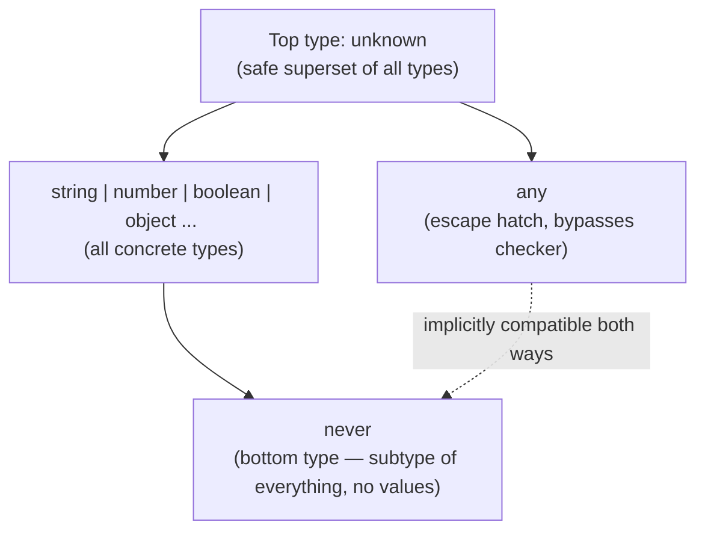
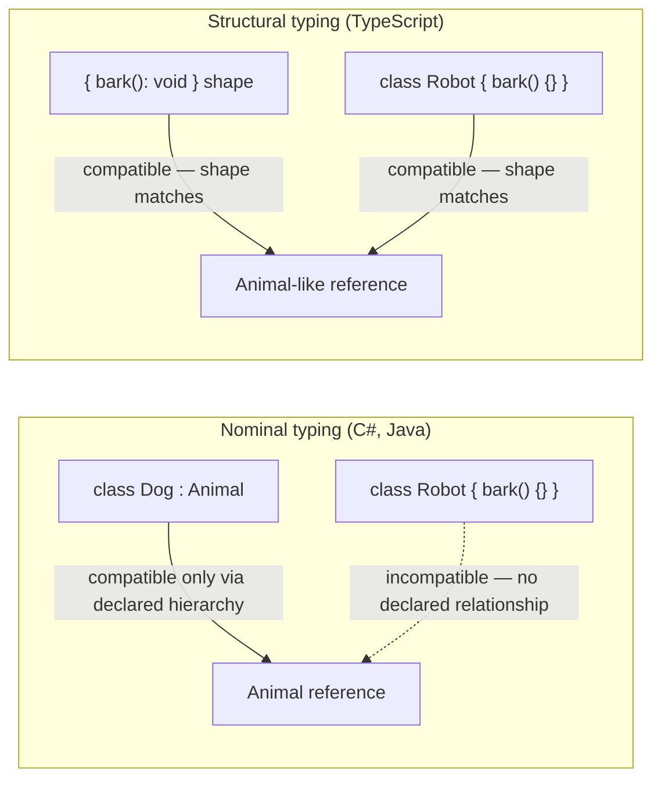
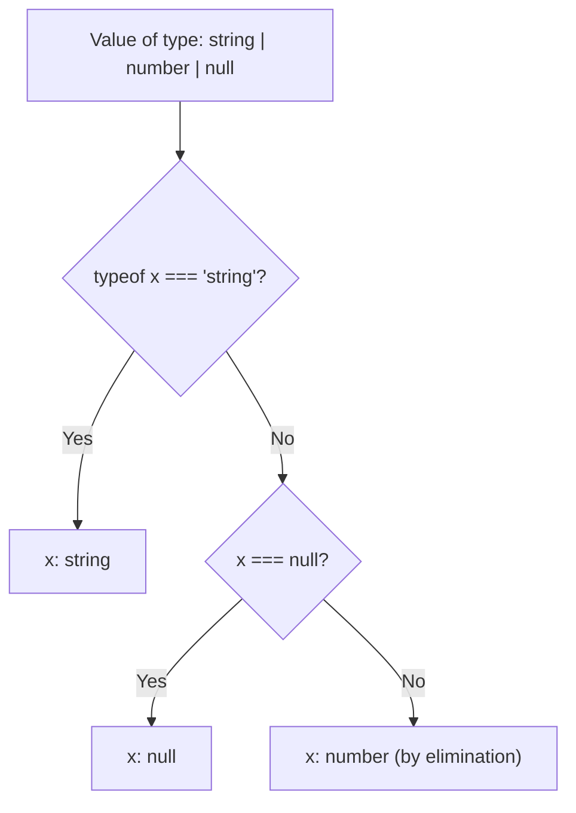

# TypeScript — Interview Revision Notes

> Quick-revision Q&A derived from `M. TypeScript-Interview-Guide.md`. Covers every section of the source.

## Core Concepts

### What is TypeScript and Why Use It

**Q: What is TypeScript?**

A: A strongly, statically typed superset of JavaScript (Microsoft) that transpiles to plain JS. It adds a structural type system on top of JS semantics; types are erased at compile time, so runtime behavior is unchanged.

**Q: Why use TypeScript over plain JS in an enterprise codebase?**

A:
- Static typing catches bugs (wrong props, wrong arg shapes, null misuse) at compile time.
- OOP features (classes, interfaces, generics, access modifiers) suit enterprise code, though the type system is structural, not nominal.
- Scalability: mechanically safe rename/extract refactors in large codebases.
- Better DX: IntelliSense, go-to-definition, safe auto-refactors.
- Self-documenting APIs via signatures.

**Q: Is TypeScript's type system fully sound?**

A: No — it is unsound by design in places (`any`, type assertions, array index access without `noUncheckedIndexedAccess`, bivariant method parameters) as a pragmatic trade-off for JS compatibility.

### Toolchain Basics

**Q: What are the basic TypeScript CLI commands?**

A: `npm install -g typescript`, `tsc -v` (version), `tsc filename.ts` (compiles to `filename.js`).

**Q: What is `tsconfig.json` and what does a real-world config typically include beyond `target`/`strict`?**

A: The central compiler configuration file. Production configs typically add: `module`, `moduleResolution` (e.g. `Bundler`), `lib`, `noUncheckedIndexedAccess`, `exactOptionalPropertyTypes`, `esModuleInterop`, `skipLibCheck`, `isolatedModules`, `forceConsistentCasingInFileNames`, `declaration`, `sourceMap`.

Basic example:

```json
{
  "compilerOptions": {
    "target": "ES6",
    "strict": true
  }
}
```

Real-world production example:

```json
{
  "compilerOptions": {
    "target": "ES2022",
    "module": "ESNext",
    "moduleResolution": "Bundler",
    "lib": ["ES2022", "DOM"],
    "strict": true,
    "noUncheckedIndexedAccess": true,
    "exactOptionalPropertyTypes": true,
    "esModuleInterop": true,
    "skipLibCheck": true,
    "isolatedModules": true,
    "forceConsistentCasingInFileNames": true,
    "declaration": true,
    "sourceMap": true
  }
}
```

### Primitive & Special Types

**Q: What are TypeScript's primitive and special types?**

A: Primitives: `string`, `number`, `boolean`, `null`, `undefined`, `bigint`, `symbol`. Special: `any` (disables checking), `unknown` (safe `any`), `void` (no return value), `never` (never returns / impossible value).

### any vs unknown vs never vs void

**Q: How do `any`, `unknown`, `void`, and `never` differ?**

A:
- `any` — turns off type checking; assignable to/from anything.
- `unknown` — safe superset of all types; assignable from anything, but must be narrowed before use.
- `void` — "no meaningful return value," used for function return types.
- `never` — bottom type; unreachable code / functions that always throw or loop forever; assignable to everything, nothing (but `never`) assignable to it.

**Q: Why does `unknown` exist when `any` already exists?**

A: `unknown` forces narrowing before any operation is allowed, preserving type soundness while still letting you say "I don't know this type yet" at I/O boundaries. `any` is both a top and bottom type simultaneously — a deliberate break in type theory, which is why it's dangerous.



### Type Inference vs Type Annotation

**Q: When should you rely on inference vs write explicit annotations?**

A: Prefer inference for local variables (less noise, same safety). Use explicit annotations at module boundaries — function params, exported return types, public class members — because inference at a boundary can silently change as the implementation evolves, breaking consumers invisibly.

### Type Assertions

**Q: What does a type assertion (`as`) do, and what's the danger?**

A: Tells the compiler "trust me" with zero runtime validation. `as unknown as T` (double assertion) bypasses even TS's compatibility checks — a code smell. Prefer type guards or validation libraries (`zod`, `io-ts`) at runtime boundaries (HTTP, `localStorage`, third-party libs).

```typescript
let someValue: any = "Hello";
let strLength: number = (someValue as string).length;
```

### Type Aliases vs Interfaces

**Q: What are the practical differences between `interface` and `type`?**

A:
- Interfaces support declaration merging and `extends`-based multiple inheritance; type aliases don't merge and use intersections (`&`) instead of `extends`.
- Type aliases can express unions, tuples, and mapped/conditional types; interfaces can only describe object shapes.
- Both are structurally compatible — an interface can extend a type alias and vice versa.

**Q: Is it accurate to say type aliases are "not extendable"?**

A: Only directionally — there's no `extends` keyword, but you can compose via intersection (`type C = A & B`) for equivalent (sometimes more flexible) composition.

**Q: When do you default to `interface` vs `type`?**

A: `interface` for object/class contracts likely to be extended or merged (DTOs, Angular `@Input` bags); `type` for unions, tuples, function signatures, and mapped/conditional utilities.

### Optional & Readonly Properties

**Q: How do you mark a property optional or readonly?**

A: `age?: number` for optional; `readonly model: string` for readonly (cannot be reassigned after creation).

```typescript
interface Employee {
  name: string;
  age?: number;       // optional
}

interface Car {
  readonly model: string;   // cannot be reassigned after creation
}
```

**Q: Is `readonly` deep?**

A: No — shallow. It only prevents rebinding the property, not mutating a nested object/array it points to. Use `Readonly<T>`/a `DeepReadonly` mapped type, or a library like Immutable.js/immer, for real deep immutability.

### Function & Method Overloading

**Q: How does function overloading work in TS, and how does it differ from C#?**

A: You declare multiple call signatures followed by one implementation signature (not visible to callers) that handles all cases via `any`/union params. Unlike C#, where overloads are genuinely distinct methods resolved by the CLR, TS overloads are a compile-time-only description of call-site shapes over a single real JS function.

```typescript
function add(a: number, b: number): number;
function add(a: string, b: string): string;
function add(a: any, b: any) {
  return a + b;
}
console.log(add(1, 2));               // 3
console.log(add("Hello, ", "World!")); // Hello, World!
```

## Intermediate

### Functions: Regular vs Arrow, Default & Rest Params

**Q: How do regular functions and arrow functions differ?**

A:
- `this` binding: dynamic (caller-dependent) vs lexical (inherited from enclosing scope).
- `arguments` object: available vs not available.
- Hoisting: function declarations hoist; `const` arrow functions don't.
- `new`-able: yes vs no.

```typescript
function regular() { console.log(this); }
const arrow = () => console.log(this);
```

**Q: What's the Angular-relevant gotcha with arrow-function class properties?**

A: `onClick = () => {...}` binds `this` correctly for template bindings but creates a new function per instance (memory/perf cost at scale) and breaks `@HostListener`/decorator-based method binding, which needs a real prototype method.

**Q: How do default and rest parameters work?**

A: `function greet(name: string = "Guest")` supplies a default; `function sum(...numbers: number[])` collects remaining args into an array.

```typescript
function greet(name: string = "Guest") {
  console.log(`Hello, ${name}`);
}
greet(); // Hello, Guest

function sum(...numbers: number[]) {
  return numbers.reduce((acc, num) => acc + num, 0);
}
console.log(sum(1, 2, 3)); // 6
```

### Union, Intersection & Literal Types

**Q: What's the difference between union, intersection, and literal types?**

A: Union (`string | number`) — value is one of several types. Intersection (`A & B`) — value must satisfy all combined types. Literal (`"North" | "South"`) — restricts to specific literal values.

```typescript
let value: string | number;
value = "hello";
value = 42;

interface A { a: number; }
interface B { b: string; }
type C = A & B;
const obj: C = { a: 1, b: "text" };

type Direction = "North" | "South" | "East" | "West";
let move: Direction = "North";
```

**Q: What happens when intersecting two types with a conflicting property type for the same key?**

A: The property collapses to `never` (e.g. `{ a: string } & { a: number }` makes `a: never`), not a compile error — a classic gotcha.

### Tuples

**Q: What is a tuple in TypeScript?**

A: A fixed-length, fixed-type array, e.g. `let person: [string, number] = ["Alice", 25]`. Can be combined with `readonly` to prevent mutation.

```typescript
let person: [string, number] = ["Alice", 25];

let numbers: readonly [number, number] = [10, 20];
// numbers[0] = 30; // Error
```

**Q: What are labeled and variadic tuples?**

A: Labeled tuple elements (`type Point = [x: number, y: number]`) add documentation with no runtime effect. Variadic tuples (`type Concat<T extends unknown[], U extends unknown[]> = [...T, ...U]`) enable generic tuple composition, used in typed bind/curry utilities.

```typescript
type Point = [x: number, y: number];

// Variadic tuple — used heavily in typed `bind`/`curry` utility libraries
type Concat<T extends unknown[], U extends unknown[]> = [...T, ...U];
type Result = Concat<[1, 2], [3, 4]>; // [1, 2, 3, 4]
```

### ReadonlyArray\<T\> / readonly T[] as Defensive API Design

**Q: What problem does a plain `T[]` parameter type create, and how does `readonly T[]` fix it?**

A: A `T[]` param says nothing about whether the function mutates the caller's array (e.g. calling `.sort()` in place). `readonly T[]` (= `ReadonlyArray<T>`) removes all mutating methods (`push`, `pop`, `splice`, `sort`, `reverse`, `fill`, `copyWithin`, index-assignment) from the type, so mutating calls become compile errors — forcing you to copy first (`[...prices].sort(...)`).

The problem, concretely:

```typescript
function printTotal(prices: number[]): number {
  prices.sort((a, b) => a - b); // legal, but mutates the CALLER's array — a real bug class
  return prices.reduce((sum, p) => sum + p, 0);
}

const cart = [30, 10, 20];
printTotal(cart);
console.log(cart); // [10, 20, 30] — surprised? the caller's array was silently reordered
```

The fix — accept `readonly T[]` instead of `T[]`:

```typescript
function printTotal(prices: readonly number[]): number {
  // prices.sort(...);   // Compile error: Property 'sort' does not exist on type
                          // 'readonly number[]' — mutating methods are removed from the type entirely.
  // prices.push(5);     // Compile error, same reason.
  return [...prices].sort((a, b) => a - b).reduce((sum, p) => sum + p, 0); // copy first, mutate the copy
}
```

**Q: Is `readonly T[]` a runtime-enforced immutability wrapper?**

A: No — it's compile-time only (no `Object.freeze`). A mutable `T[]` is freely assignable into a `readonly T[]` param, but not the reverse without a cast/copy.

```typescript
const mutable: number[] = [1, 2, 3];
const ro: readonly number[] = mutable;   // OK — a mutable array satisfies the readonly contract
// mutable = ro;                          // Compile error — readonly array is not assignable back to T[]
```

**Q: Is `readonly T[]` deep?**

A: No, shallow — like `Readonly<T>`. `readonly Point[]` blocks `arr.push(...)`/`arr[0] = ...` but not `arr[0].x = 5` unless `Point` itself is readonly. Read-only-friendly methods (`map`, `filter`, `slice`, `reduce`) remain callable since they don't mutate the source.

### Enums, and Why Senior Devs Avoid Them

```typescript
enum Color { Red, Green, Blue }
let c: Color = Color.Green;
```

**Q: What are the downsides of TypeScript enums?**

A:
- Numeric enums aren't type-safe against arbitrary numbers.
- Non-`const` enums generate real runtime objects (reverse mappings), adding bundle size.
- `const enum` inlines values but is incompatible with `isolatedModules` (required by esbuild/swc/Vite) and banned for ESM-only builds.
- They don't tree-shake as cleanly as literal unions.

**Q: What's the modern replacement for enums?**

A: Literal union types, optionally paired with an `as const satisfies Record<...>` object for an iterable value list — gives exhaustiveness checking, zero runtime cost, full type safety.

```typescript
type Color = "red" | "green" | "blue";

const ColorValues = {
  Red: "red",
  Green: "green",
  Blue: "blue",
} as const satisfies Record<string, Color>;
```

### Structural Typing vs Nominal Typing

**Q: How does TypeScript's type system differ from C#/Java's?**

A: C#/Java are nominally typed — identical-shaped classes are incompatible unless one explicitly extends/implements the other; identity is by declared name. TypeScript is structurally typed (duck typing) — types are compatible if their shapes match, regardless of name or declared relationship.

```typescript
interface Point2D { x: number; y: number; }
class Vector { x = 0; y = 0; }

function log(p: Point2D) { console.log(p.x, p.y); }

log(new Vector());          // OK — Vector has the same shape as Point2D
log({ x: 1, y: 2 });         // OK — plain object literal matches structurally
```



**Q: What's the excess-property-check gotcha related to structural typing?**

A: Excess property checks only fire on object literals assigned directly (`log({x:1,y:2,z:3})` errors). Assigning the literal to a variable first, then passing the variable, compiles fine — because it's then a looser structural assignability check, not the literal-freshness check.

**Q: Does TypeScript have any nominal-typing behavior at all?**

A: Yes — private/protected members participate in a nominal-ish check: two classes with identically-named private members from different class declarations are not structurally compatible, a deliberate exception to pure structural typing.

**Q: How do you simulate nominal typing in TS?**

A: Branded/"tagged" types, e.g. `type UserId = string & { __brand: "UserId" }`, to prevent accidental mixing of structurally-identical types.

### Branded/Nominal Typing — Full Worked Example

**Q: Why is `type UserId = string` insufficient to prevent mixing IDs?**

A: Because `UserId` and `OrderId` are both plain `string` at the type level, structural typing lets you pass one where the other is expected without any compile error.

```typescript
type UserId = string;
type OrderId = string;

function getUser(id: UserId) { /* ... */ }

const orderId: OrderId = "ord_123";
getUser(orderId); // compiles! — silently wrong, no error, no warning
```

**Q: How do you implement a proper branded type?**

A:
```typescript
type UserId = string & { readonly __brand: 'UserId' };
function toUserId(raw: string): UserId {
  if (!raw) throw new Error('UserId cannot be empty');
  return raw as UserId; // the one sanctioned assertion
}
```
Only the constructor function (`toUserId`) is allowed to produce a `UserId`, so passing a raw string or an `OrderId` becomes a compile error.

Full worked example, showing the compiler actually rejecting the misuse:

```typescript
// The brand is a phantom property that never exists at runtime — it exists
// purely to make the type checker treat this string as "not just any string."
type UserId = string & { readonly __brand: 'UserId' };
type OrderId = string & { readonly __brand: 'OrderId' };

// Constructor functions are the ONLY sanctioned way to produce a branded value.
// This is where you'd put real validation (format checks, UUID validation, etc.)
function toUserId(raw: string): UserId {
  if (!raw) throw new Error('UserId cannot be empty');
  return raw as UserId; // the one, deliberate, encapsulated assertion in the codebase
}

function toOrderId(raw: string): OrderId {
  if (!raw) throw new Error('OrderId cannot be empty');
  return raw as OrderId;
}

function getUser(id: UserId): void {
  console.log('Fetching user', id);
}

const userId = toUserId('usr_123');
const orderId = toOrderId('ord_456');

getUser(userId);   // OK
getUser(orderId);  // Compile error: Argument of type 'OrderId' is not assignable to parameter of type 'UserId'.
                    // Type '{ __brand: "OrderId"; }' is not assignable to type '{ __brand: "UserId"; }'.
getUser('usr_789'); // Compile error too — a raw string isn't a UserId; must go through toUserId()
```

**Q: Why does this work, and what's the runtime cost?**

A: The `__brand` property doesn't really exist on any string, so the only way to obtain the branded type is via the constructor function (where real validation lives). The brand is erased at runtime — zero bundle/perf cost.

**Q: What's the `unique symbol` variant, and why use it?**

A: `declare const userIdBrand: unique symbol; type UserId = string & { readonly [userIdBrand]: void };` — avoids brand-name collisions across many branded types authored by different teams, at a small readability cost.

### Type Narrowing & Type Guards

**Q: What narrowing mechanisms does TypeScript support?**

A:
- `typeof` (doesn't distinguish `null`, since `typeof null === "object"`).
- `instanceof` (class instances only).
- `in` operator (narrows by key presence).
- Truthiness checks (careful: narrows out legit `0`/`""`).
- Equality narrowing on literal unions.
- Discriminant property checks (discriminated unions).
- User-defined type predicates (`x is Foo`).
- Assertion functions (`asserts x is Foo`).

```typescript
function isString(value: any): value is string {
  return typeof value === "string";
}

function example(val: string | number) {
  if (isString(val)) {
    console.log(val.toUpperCase()); // narrowed to string
  } else {
    console.log(val.toFixed(2));    // narrowed to number
  }
}
```



**Q: How do assertion functions differ from type predicates?**

A: A type predicate (`function isFoo(x): x is Foo`) only narrows inside the conditional branch where it's called. An assertion function (`function assertIsString(x): asserts x is string`) narrows for the rest of the enclosing scope after the call — no `if` needed.

```typescript
function assertIsDefined<T>(val: T): asserts val is NonNullable<T> {
  if (val === undefined || val === null) {
    throw new Error("Expected value to be defined");
  }
}

function process(input?: string) {
  assertIsDefined(input);
  console.log(input.toUpperCase()); // input narrowed to string for the rest of the function
}
```

### Discriminated Unions & Exhaustiveness Checking

**Q: What is a discriminated union?**

A: A union of object types sharing a common literal "discriminant" property (e.g. `kind: "square" | "circle"`), letting you narrow via `switch (shape.kind)`.

```typescript
interface Square { kind: "square"; size: number; }
interface Circle { kind: "circle"; radius: number; }
type Shape = Square | Circle;

function area(shape: Shape): number {
  switch (shape.kind) {
    case "square":
      return shape.size * shape.size;
    case "circle":
      return Math.PI * shape.radius * shape.radius;
  }
}
```

**Q: How do you guarantee a switch over a discriminated union stays exhaustive when new variants are added?**

A: Add a `default` branch assigning the narrowed remaining value to a variable typed `never`. If a case is missing, the unhandled variant remains at `default` and the assignment to `never` fails to compile — turning a silent runtime bug into a build failure.

```typescript
interface Triangle { kind: "triangle"; base: number; height: number; }
type Shape = Square | Circle | Triangle;

function area(shape: Shape): number {
  switch (shape.kind) {
    case "square":
      return shape.size * shape.size;
    case "circle":
      return Math.PI * shape.radius * shape.radius;
    case "triangle":
      return (shape.base * shape.height) / 2;
    default:
      // If a case is missing above, `shape` here is NOT `never`,
      // so this line fails to compile — catching the bug at build time.
      const _exhaustiveCheck: never = shape;
      return _exhaustiveCheck;
  }
}
```

### Optional Chaining & Nullish Coalescing

**Q: What do `?.` and `??` do?**

A: `?.` (optional chaining) short-circuits to `undefined` if any link in the chain is null/undefined (`obj.user?.profile?.name`). `??` (nullish coalescing) supplies a default only when the left side is `null`/`undefined`.

```typescript
const obj = { user: { profile: { name: "John" } } };
console.log(obj.user?.profile?.name);   // John
console.log(obj.user?.address?.city);   // undefined

let name: string | null = null;
console.log(name ?? "Default Name"); // "Default Name"
```

**Q: How does `??` differ from `||`?**

A: `||` treats any falsy value (`0`, `""`, `false`) as "missing" and replaces it; `??` only replaces `null`/`undefined`, preserving legitimate falsy values. A classic bug when migrating `||`-based defaults to TS.

### strictNullChecks and the strict Family of Flags

**Q: What does `strictNullChecks` do, and why is it the highest-value strict flag?**

A: Without it, `null`/`undefined` are implicitly part of every type, so the compiler can't distinguish guaranteed values from possibly-missing ones anywhere. With it on, you must explicitly type `T | null` and narrow before use — the single biggest bug-catcher.

**Q: What other flags does `strict: true` bundle, and what does each catch?**

A:
- `noImplicitAny` — errors on inferred `any`.
- `strictFunctionTypes` — checks function params contravariantly.
- `strictBindCallApply` — type-checks `.bind`/`.call`/`.apply`.
- `strictPropertyInitialization` — class properties must be initialized or explicitly optional (common Angular DI pain point, needs `!` or constructor init).
- `noImplicitThis` — errors on implicit-`any` `this`.
- `alwaysStrict` — emits `"use strict"`.
- `useUnknownInCatchVariables` (default since TS 4.4) — `catch (e)` typed `unknown`, not `any`.

**Q: Which useful flags are NOT part of `strict` but matter in senior-grade configs?**

A: `noUncheckedIndexedAccess` (index access returns `T | undefined`), `exactOptionalPropertyTypes` (distinguishes absent key vs present-with-`undefined`), `noUnusedLocals`/`noUnusedParameters` (hygiene), `noFallthroughCasesInSwitch` (catches missing `break`).

**Q: What do you lose if your team disables `strictNullChecks` to unblock a migration?**

A: Compile-time guarantees on every nullable path — any `.foo` access on a possibly-null value becomes a latent `TypeError`, and third-party `.d.ts` files (most assume it's on) may produce incorrect inference.

## Advanced (Generics & the Type System)

### Generics & Generic Constraints

**Q: What is a generic function, and how do you constrain a type parameter?**

A: `function identity<T>(arg: T): T { return arg; }` preserves the input type. Constrain with `extends`: `function printLength<T extends { length: number }>(arg: T)` restricts `T` to shapes with a `length`.

```typescript
function identity<T>(arg: T): T {
  return arg;
}
console.log(identity<string>("Hello")); // Hello

function printLength<T extends { length: number }>(arg: T) {
  console.log(arg.length);
}
printLength("Hello"); // 5
```

**Q: How do generic defaults and cross-referencing constraints work?**

A: `function get<T, K extends keyof T = keyof T>(obj: T, key: K): T[K]` — `K` defaults to `keyof T` and is constrained by it; common in typed reducers/HTTP clients.

```typescript
function get<T, K extends keyof T = keyof T>(obj: T, key: K): T[K] {
  return obj[key];
}
```

### Generic Variance (Covariance/Contravariance)

**Q: Is `Dog[]` a subtype of `Animal[]` in TypeScript?**

A: Yes — TS treats arrays and return positions covariantly. This is technically unsound (you could push a `Cat` through an `Animal[]`-typed reference to what's really a `Dog[]`) but pragmatic for real-world JS usage.

**Q: How does `strictFunctionTypes` relate to contravariance?**

A: Function parameter types should narrow safely in the opposite direction of the return type. Under `strictFunctionTypes`, standalone function-type parameters are checked contravariantly, catching unsound assignments like assigning a `DogHandler` to an `AnimalHandler`-typed variable.

```typescript
type AnimalHandler = (a: Animal) => void;
type DogHandler = (d: Dog) => void;

let handler: AnimalHandler;
let dogHandler: DogHandler = (d) => console.log(d.bark());

// Without strictFunctionTypes this incorrectly compiles:
// handler = dogHandler; // unsound: handler could now be called with a Cat
```

**Q: What's the method-vs-property-function quirk under `strictFunctionTypes`?**

A: Method syntax (`interface X { fn(a: Animal): void }`) is checked bivariantly even under `strictFunctionTypes` (backward compatibility); property syntax with a function type (`interface X { fn: (a: Animal) => void }`) is checked contravariantly (strictly) — a genuine "gotcha."

**Q: Does TypeScript have explicit `in`/`out` variance annotations like C#?**

A: No (as widely deployed) — variance is inferred structurally from how the type parameter is used, not declared explicitly.

### keyof, typeof, and Indexed Access Types

**Q: What do `keyof` and `typeof` do in type position?**

A: `keyof User` produces a union of `User`'s property-name literals. `typeof person` (on a value) captures the value's inferred type as a type.

```typescript
type User = { id: number; name: string };
type UserKeys = keyof User; // "id" | "name"

let person = { name: "Alice", age: 25 };
type PersonType = typeof person;
```

**Q: What are indexed access types?**

A: `T[K]` extracts the type of a specific property, e.g. `User["name"]` → `string`; can chain (`User["address"]["city"]`) or use `User[keyof User]` for a union of all value types.

```typescript
type User = { id: number; name: string; address: { city: string } };
type NameType = User["name"];              // string
type CityType = User["address"]["city"];   // string
type AllValues = User[keyof User];         // number | string | { city: string }
```

### Mapped Types

**Q: What is a mapped type?**

A: A type built by iterating over another type's keys: `{ readonly [K in keyof User]: User[K] }` (`ReadonlyUser`).

```typescript
type ReadonlyUser = { readonly [K in keyof User]: User[K] };
```

**Q: What do the `+`/`-` modifiers and `as` key remapping do?**

A: `-readonly`/`-?` strip modifiers (`{ -readonly [K in keyof T]-?: T[K] }` = `Mutable<T>`). `as` remaps keys entirely, e.g. building getter names: `[K in keyof T as \`get${Capitalize<string & K>}\`]: () => T[K]`.

```typescript
// Strip readonly/optional modifiers
type Mutable<T> = { -readonly [K in keyof T]-?: T[K] };

// Remap keys entirely — e.g., build getter names from property names
type Getters<T> = {
  [K in keyof T as `get${Capitalize<string & K>}`]: () => T[K];
};

interface Person { name: string; age: number; }
type PersonGetters = Getters<Person>;
// { getName: () => string; getAge: () => number }
```

### Conditional Types & infer

**Q: How does a conditional type work?**

A: `T extends string ? "yes" : "no"` — evaluates based on whether `T` is assignable to the checked type. `infer R` inside the `extends` clause captures a sub-part of the matched type, e.g. `T extends (...args: any[]) => infer R ? R : never` extracts a function's return type.

```typescript
type IsString<T> = T extends string ? "yes" : "no";
type Test = IsString<number>; // "no"

type ReturnTypeOf<T> = T extends (...args: any[]) => infer R ? R : never;

function getName(): string { return "Alice"; }
type NameType = ReturnTypeOf<typeof getName>; // string
```

**Q: What is a distributive conditional type?**

A: When the checked type is a *naked* type parameter, TS distributes the conditional over each union member: `ToArray<string | number>` → `string[] | number[]`. Wrapping in a tuple (`[T] extends [any]`) opts out of distribution, keeping the union whole. This is exactly how `Exclude`/`Extract`/`NonNullable` are implemented.

```typescript
type ToArray<T> = T extends any ? T[] : never;
type Result = ToArray<string | number>; // string[] | number[]  (distributed)

// Wrapping in a tuple opts out of distribution:
type ToArrayNonDist<T> = [T] extends [any] ? T[] : never;
type Result2 = ToArrayNonDist<string | number>; // (string | number)[]
```

### Template Literal Types

**Q: What is a template literal type, and what's a practical use case?**

A: A type built from string literal interpolation, e.g. `` `Hello, ${string}!` ``. Practical use: `type HandlerName = \`on${Capitalize<EventName>}\`` produces `"onClick" | "onHover" | "onFocus"` from an event-name union — used for typed event names, CSS-in-JS keys, REST route params.

```typescript
type Greeting = `Hello, ${string}!`;
const greet: Greeting = "Hello, John!";
```

**Q: What are the intrinsic string manipulation types?**

A: `Uppercase`, `Lowercase`, `Capitalize`, `Uncapitalize` — e.g. `Uppercase<"hello">` → `"HELLO"`.

**Q: How would you extract typed route params from a path string type?**

A: A recursive conditional type using `infer` to peel off segments after `:`, recursing on the remainder — e.g. `ExtractParams<"/users/:userId/posts/:postId">` → `"userId" | "postId"`.

```typescript
type EventName = "click" | "hover" | "focus";
type HandlerName = `on${Capitalize<EventName>}`;
// "onClick" | "onHover" | "onFocus"

// Intrinsic string manipulation types: Uppercase, Lowercase, Capitalize, Uncapitalize
type Loud = Uppercase<"hello">; // "HELLO"

// Extracting typed params from a route string (common in typed-router libraries)
type ExtractParams<T extends string> =
  T extends `${string}:${infer Param}/${infer Rest}`
    ? Param | ExtractParams<Rest>
    : T extends `${string}:${infer Param}`
      ? Param
      : never;

type Params = ExtractParams<"/users/:userId/posts/:postId">; // "userId" | "postId"
```

### Recursive Type Alias Depth Limits (TS2589)

**Q: What causes TS error TS2589 ("Type instantiation is excessively deep and possibly infinite")?**

A: The compiler must fully expand recursive/conditional types at check time (no lazy evaluation like a recursive function has at runtime). It has a hard internal recursion-depth limit (~50 levels historically); unbounded recursive types (naive tuple-length counters, `DeepPartial` over a circular domain model, long template-literal recursion) blow past it.

```typescript
// A naive recursive tuple-length-counter, called on something the compiler
// can't bound in advance:
type BuildTuple<N extends number, T extends unknown[] = []> =
  T['length'] extends N ? T : BuildTuple<N, [...T, unknown]>;

type Big = BuildTuple<10000>;
// error TS2589: Type instantiation is excessively deep and possibly infinite.
```

The same error shows up in more "realistic" code, most commonly a recursive `DeepPartial<T>`-style mapped type applied to a circular domain model:

```typescript
interface Order { id: string; customer: Customer; }
interface Customer { id: string; orders: Order[]; } // circular reference

type DeepPartial<T> = T extends object
  ? { [K in keyof T]?: DeepPartial<T[K]> }
  : T;

type PartialOrder = DeepPartial<Order>;
// With a genuinely circular type graph and no depth guard, the compiler keeps
// expanding Order -> Customer -> Order -> Customer ... until it hits the
// recursion ceiling and raises TS2589 (behavior here also depends on TS version —
// modern TS has some circularity detection, but it's not a guarantee for every
// recursive-type shape, especially conditional types combined with mapped types).
```

**Q: How do you fix/avoid TS2589?**

A:
- Bound recursion explicitly with a depth-limiting counter type (a `Prev` lookup tuple simulating `N - 1`), bailing out to a safe fallback at depth 0.

```typescript
type Prev = [never, 0, 1, 2, 3, 4, 5, 6, 7, 8, 9]; // lookup table simulating "N - 1"

type DeepPartialBounded<T, Depth extends number = 5> =
  Depth extends 0
    ? T
    : T extends object
      ? { [K in keyof T]?: DeepPartialBounded<T[K], Prev[Depth]> }
      : T;
```
- Break circularity in the modeled shape (use a flat DTO like `OrderSummary { customerId: string }` instead of deep-nesting the full circular graph).
- Prefer vetted utility types/libraries (built-in `Partial`/`Pick`, or `type-fest`'s `PartialDeep`) over hand-rolled recursive types.
- Simplify distributive conditional types by opting out of distribution (`[T] extends [U]`) to reduce instantiation count.

### Utility Types Deep Dive

**Q: What do the core built-in utility types do, and how are they implemented?**

A:

| Utility | Effect | Simplified implementation |
|---|---|---|
| `Partial<T>` | All optional | `{ [K in keyof T]?: T[K] }` |
| `Required<T>` | All mandatory | `{ [K in keyof T]-?: T[K] }` |
| `Readonly<T>` | All readonly | `{ readonly [K in keyof T]: T[K] }` |
| `Pick<T,K>` | Subset of keys | `{ [P in K]: T[P] }` |
| `Omit<T,K>` | Remove keys | `Pick<T, Exclude<keyof T, K>>` |
| `Record<K,T>` | Build object type | `{ [P in K]: T }` |
| `NonNullable<T>` | Strip null/undefined | `T extends null \| undefined ? never : T` |
| `Extract<T,U>` | Keep assignable to U | `T extends U ? T : never` |
| `Exclude<T,U>` | Remove assignable to U | `T extends U ? never : T` |
| `ReturnType<T>` | Fn's return type | `T extends (...a:any[]) => infer R ? R : never` |
| `Parameters<T>` | Fn's param tuple | `T extends (...a: infer P) => any ? P : never` |
| `InstanceType<T>` | Constructor's instance type | `T extends new (...a:any[]) => infer R ? R : any` |

```typescript
interface User { id: number; name: string; email: string; age?: number; }

type PartialUser  = Partial<User>;             // all optional
type RequiredUser = Required<User>;            // all required
type UserPreview  = Pick<User, "name" | "email">;
type UserNoEmail  = Omit<User, "email">;
type UserRoles    = Record<string, boolean>;

type Union       = string | number | boolean;
type OnlyNumbers = Extract<Union, number>;     // number
type NoBooleans  = Exclude<Union, boolean>;    // string | number

function greet(name: string): string { return `Hello, ${name}`; }
type GreetReturn = ReturnType<typeof greet>;   // string
type GreetParams = Parameters<typeof greet>;   // [string]

class Person { constructor(public name: string) {} }
type PersonInstance = InstanceType<typeof Person>; // Person
```

**Q: What does `Awaited<T>` do, and why is it needed?**

A: Unwraps nested `Promise` types, e.g. `Awaited<ReturnType<typeof fetchUser>>` gives `User`, not `Promise<User>` — critical for correct async/await return typing since TS 4.5.

```typescript
// Awaited<T> — unwraps nested Promise types (critical for async/await return typing since TS 4.5)
async function fetchUser(): Promise<User> { /* ... */ return {} as User; }
type FetchedUser = Awaited<ReturnType<typeof fetchUser>>; // User (not Promise<User>)
```

**Q: There's no built-in `DeepPartial<T>` — how would you write one?**

A: `type DeepPartial<T> = T extends object ? { [K in keyof T]?: DeepPartial<T[K]> } : T;` — recursively applies `Partial` to nested objects. (Watch for TS2589 on circular/unbounded inputs.)

### as const and satisfies

**Q: What does `as const` do?**

A: Freezes a literal to its most specific type — array elements become literal types and the array becomes readonly, e.g. `["red","green","blue"] as const` → `readonly ["red","green","blue"]`.

```typescript
const colors = ["red", "green", "blue"] as const;
// readonly ["red", "green", "blue"] — each element is a literal type, array is readonly

const person = {
  name: "Alice",
  age: 25,
} satisfies { name: string; age: number };
```

**Q: How does `satisfies` differ from a type annotation?**

A: A type annotation *widens* the variable to the annotated type, losing literal precision (`Record<string, string|number>` makes every property `string | number`). `satisfies` validates the value's shape against the type but keeps the narrower inferred type, so e.g. `config2.retries` stays `number` and `config2.mode` stays `"fast"`. It's now the idiomatic way to type constant config objects.

```typescript
// Type annotation WIDENS the variable to the annotated type — you lose literal info
const config1: Record<string, string | number> = { retries: 3, mode: "fast" };
config1.retries; // type: string | number  (widened — lost the fact it's specifically `number`)

// satisfies VALIDATES against the type but keeps the narrower inferred type
const config2 = { retries: 3, mode: "fast" } satisfies Record<string, string | number>;
config2.retries; // type: number  (preserved!)
```

### Ambient Declarations, Triple-Slash Directives, Module Augmentation & Declaration Merging

**Q: What is an ambient declaration?**

A: A `.d.ts` type-only declaration with no implementation, e.g. `declare function jQuery(selector: string): any;` — describes existing JS without providing code.

```typescript
// Ambient declaration (.d.ts)
declare function jQuery(selector: string): any;
```

**Q: What is a triple-slash directive, and is it still relevant?**

A: `/// <reference path="..." />` — largely legacy in modern ESM projects; still matters for global/ambient `.d.ts` files with no imports/exports.

```typescript
// Triple-slash directive
/// <reference path="path/to/file.d.ts" />
```

**Q: What is module augmentation, and when do you use it?**

A: `declare module "some-library" { interface X { newMethod(): void } }` — extends a third-party module's types, e.g. adding a property to Express's `Request`, or extending RxJS operators. The modern correct approach for extending third-party types.

```typescript
// Module augmentation
declare module "some-library" {
  interface SomeInterface {
    newMethod(): void;
  }
}
```

**Q: What is declaration merging?**

A: Multiple `interface X {}` declarations with the same name automatically merge into one combined interface (e.g. augmenting the global `Window` interface).

```typescript
// Declaration merging
interface Window { customProperty: string; }
interface Window { anotherProperty: number; }
// Merged Window now has both properties.
```

### Decorators & Metadata (Angular Relevance)

**Q: What are decorators, and how does Angular rely on them?**

A: Functions applied to classes/members/params via `@expression` syntax for declarative metadata/behavior injection. Angular's DI container (`@Component`, `@Injectable`, `@Input`) relies on decorators plus `reflect-metadata` and the `emitDecoratorMetadata`/`experimentalDecorators` compiler flags to resolve constructor parameter types at runtime.

```typescript
function Log(target: any, propertyKey: string, descriptor: PropertyDescriptor) {
  const original = descriptor.value;
  descriptor.value = function (...args: any[]) {
    console.log(`Calling ${propertyKey} with`, args);
    return original.apply(this, args);
  };
  return descriptor;
}

class Calculator {
  @Log
  add(a: number, b: number) { return a + b; }
}
```

**Q: Why does Angular DI break if you use an interface as an injection token?**

A: Interfaces are fully erased at compile time (no runtime metadata), so DI has nothing to resolve at runtime — use a class or `InjectionToken` instead.

**Q: What changed with TS 5.0 standard decorators vs the legacy Angular model?**

A: Standard (Stage 3 TC39) decorators, default in TS 5.0+, use different runtime semantics: functions receive `(value, context)` instead of `(target, key, descriptor)`, don't rely on `reflect-metadata`, and compose differently for class fields. Mixing legacy `experimentalDecorators` and standard decorators in one project causes real compile errors.

### Module Resolution: ESM vs CommonJS

**Q: How do CommonJS and ESM differ?**

A:

| Aspect | CommonJS | ESM |
|---|---|---|
| Syntax | `require()`/`module.exports` | `import`/`export` |
| Loading | Synchronous, runtime-resolved | Static, compile-time analyzable (enables tree-shaking) |
| tsconfig `module` | `"CommonJS"` | `"ESNext"`/`"NodeNext"`/`"Bundler"` |

**Q: `moduleResolution: "Bundler"` vs `"NodeNext"` — when do you pick each?**

A: `"Bundler"` for Angular/Vite/webpack frontend projects (lets the bundler resolve, supports `exports` map loosely); `"NodeNext"` for real Node.js backend services matching Node's actual ESM resolution rules (including mandatory extensions in relative imports).

**Q: Why does tree-shaking require ESM?**

A: Tree-shaking needs static, analyzable `import`/`export`; dynamic `require()` or CJS re-exports defeat it — why library authors publish dual ESM/CJS or ESM-only builds, and why a transitive CommonJS dependency in an Angular esbuild build triggers "optimization bailout" warnings.

## Object-Oriented Programming in TypeScript

### Access Modifiers

**Q: What are the TS access modifiers and their scopes?**

A: `public` (default, accessible anywhere), `private` (same class only), `protected` (class + subclasses).

```typescript
class Person {
  public name: string;
  private age: number;
  protected address: string;

  constructor(name: string, age: number, address: string) {
    this.name = name;
    this.age = age;
    this.address = address;
  }
}
```

**Q: Are `private`/`protected` enforced at runtime?**

A: No — compile-time only, erased in emitted JS; `instance["age"]` or `JSON.stringify` can still expose them. For true runtime privacy use native `#privateFields` (enforced by the JS engine, invisible to `Object.keys()`).

```typescript
class Parent {
  protected greet() { console.log("Hello from Parent"); }
}
class Child extends Parent {
  public sayHello() { this.greet(); } // Allowed
}
```

```typescript
class Account {
  #balance = 0; // truly private at runtime, invisible even to Object.keys()
  deposit(amount: number) { this.#balance += amount; }
}
```

### Inheritance, Overriding, super

**Q: How does class inheritance and `super` work?**

A: `class Dog extends Animal {}` inherits members; `super.greet()` inside an overriding method calls the base implementation before/after subclass logic.

```typescript
class Animal {
  move() { console.log("Moving..."); }
}
class Dog extends Animal {
  bark() { console.log("Woof!"); }
}
const pet = new Dog();
pet.move(); // Moving...
pet.bark(); // Woof!

class Parent {
  greet() { console.log("Hello from Parent"); }
}
class Child extends Parent {
  greet() {
    super.greet();
    console.log("Hello from Child");
  }
}
```

**Q: What does the `override` keyword do, and what flag enforces it?**

A: `override greet() {...}` (TS 4.3+) has the compiler verify the base method actually exists — catches silently-orphaned "overrides" after a base method is renamed/removed. Enable `noImplicitOverride` to require it explicitly.

```typescript
class Child extends Parent {
  override greet() { // compiler verifies Parent.greet actually exists
    super.greet();
  }
}
```

### Abstract Classes vs Interfaces

**Q: How do abstract classes differ from interfaces?**

A:

```typescript
abstract class Animal {
  abstract makeSound(): void;
  move() { console.log("Moving..."); }
}
interface Flyable {
  fly(): void;
}
```

| Feature | Abstract Class | Interface |
|---|---|---|
| Methods | Concrete + abstract | Signatures only |
| Instantiation | Cannot instantiate | Not even a runtime "type" |
| Multiple inheritance | No | Yes (`extends A, B`) |
| Runtime footprint | Real JS class | Fully erased |
| Constructors | Allowed | Not allowed |

**Q: When do you choose an abstract class vs an interface?**

A: Abstract class when subclasses share real reusable implementation (template-method pattern); interface for a pure contract, especially across multiple unrelated classes.

### Multiple Interface Implementation & Interface Extension

**Q: Can a class implement multiple interfaces, and can an interface extend multiple interfaces?**

A: Yes to both — `class MyClass implements X, Y {}` and `interface C extends A, B {}`. An interface can even extend a class, extracting its public shape.

```typescript
interface A { a: string; }
interface B { b: number; }
interface C extends A, B { c: boolean; }
const obj: C = { a: "hello", b: 42, c: true };

interface X { aMethod(): void; }
interface Y { bMethod(): void; }
class MyClass implements X, Y {
  aMethod() { console.log("A method"); }
  bMethod() { console.log("B method"); }
}

// An interface can even extend a class (extracting its public shape):
class AnimalBase { name: string = ""; }
interface Dog extends AnimalBase { breed: string; }
```

**Q: What does `implements` actually check?**

A: Only the public shape at compile time — it doesn't enforce private member existence/behavior and performs no runtime check (fully erased). Don't confuse it with actual behavior inheritance.

### Mixins

**Q: What is a mixin in TypeScript?**

A: A class-factory function taking a base class constructor and returning an extended class, e.g. `function Mixin<T extends new (...a:any[])=>{}>(Base: T) { return class extends Base { mixinMethod(){} } }`. TS/JS's answer to lacking multiple class inheritance — conceptually like C# extension methods/default interface methods, but a runtime construct, not a language feature.

```typescript
function Mixin<T extends new (...args: any[]) => {}>(Base: T) {
  return class extends Base {
    mixinMethod() { console.log("Mixin method"); }
  };
}
class Person {}
const MixedPerson = Mixin(Person);
const instance = new MixedPerson();
instance.mixinMethod(); // Mixin method
```

### Private Constructors & Singletons

**Q: How do you implement the classic Singleton pattern in TS?**

A: `private constructor()` plus a `static getInstance()` that lazily creates and caches a single instance.

```typescript
class Singleton {
  private static instance: Singleton;
  private constructor() {}

  static getInstance() {
    if (!Singleton.instance) {
      Singleton.instance = new Singleton();
    }
    return Singleton.instance;
  }
}
const obj1 = Singleton.getInstance();
const obj2 = Singleton.getInstance();
console.log(obj1 === obj2); // true
```

**Q: What's the Angular-idiomatic alternative to a hand-rolled Singleton?**

A: `@Injectable({ providedIn: 'root' })` — Angular's injector already guarantees one instance per injector scope, is testable/mockable via DI, and avoids hidden global-state problems.

### Index Signatures

**Q: What is an index signature, and what's its safety gap?**

A: `interface Dictionary { [key: string]: string; }` allows arbitrary string keys. Without `noUncheckedIndexedAccess`, `translations["missingKey"]` types as `string` even though it's actually `undefined` at runtime — a common source of production crashes.

```typescript
interface Dictionary {
  [key: string]: string;
}
const translations: Dictionary = {
  hello: "hola",
  goodbye: "adiós",
};
```

### The this Type & Polymorphism

**Q: What does a method returning `this` enable?**

A: Fluent/chainable builder APIs that stay subclass-safe — `setName(name): this { ...; return this; }` returns the actual subclass type when called on a subclass instance, preserving its additional members through the chain.

```typescript
class Fluent {
  setName(name: string): this {
    console.log(name);
    return this;
  }
}
const obj = new Fluent().setName("John");

class Animal {
  speak() { console.log("Animal speaks"); }
}
class Dog extends Animal {
  speak() { console.log("Bark"); }
}
```

### Parameter Properties Shorthand

**Q: What does `constructor(private radius: number) {}` do?**

A: Shorthand that simultaneously declares a `private radius: number` field and assigns it from the constructor argument — pure syntax sugar, but the dominant style in Angular/NestJS constructor DI (`constructor(private http: HttpClient) {}`).

```typescript
class Circle {
  // Shorthand: declares AND assigns `radius` as a private field in one line
  constructor(private radius: number) {}

  area(): number {
    return Math.PI * this.radius * this.radius;
  }
}
```

## Error Handling

### try/catch/finally & Custom Errors

**Q: How do you create a custom error type?**

A: `class CustomError extends Error { constructor(message: string) { super(message); this.name = "CustomError"; } }`.

```typescript
try {
  throw new Error("Something went wrong!");
} catch (error) {
  console.log(error.message);
} finally {
  console.log("Cleanup operations");
}

class CustomError extends Error {
  constructor(message: string) {
    super(message);
    this.name = "CustomError";
  }
}
throw new CustomError("This is a custom error!");
```

**Q: What's the gotcha with subclassing `Error` under older compile targets?**

A: Compiling to ES5 can break `instanceof` checks against the custom error class due to how ES5 downlevels class inheritance for built-ins; historically required `Object.setPrototypeOf(this, CustomError.prototype)` in the constructor as a workaround. Not needed for `target: ES2015+`.

### Typed Catch Clauses (unknown in catch)

**Q: What type does `catch (error)` have under `strict`, and why?**

A: `unknown`, not `any`, since TS 4.4 (`useUnknownInCatchVariables`) — because JS allows `throw` of any value (strings, numbers, plain objects), not just `Error` instances.

**Q: What's the safe pattern for handling a typed catch clause?**

A:
```typescript
try {
  riskyOperation();
} catch (error: unknown) {
  if (error instanceof Error) {
    console.log(error.message);
  } else {
    console.log("Unknown error", error);
  }
}
```
For structured non-Error throws (some HTTP clients), pair with a custom type guard (`isApiError`) checked before falling back to `instanceof Error`.

```typescript
interface ApiError { code: number; message: string; }
function isApiError(e: unknown): e is ApiError {
  return typeof e === "object" && e !== null && "code" in e && "message" in e;
}

try {
  await callApi();
} catch (error: unknown) {
  if (isApiError(error)) {
    console.error(`API error ${error.code}: ${error.message}`);
  } else if (error instanceof Error) {
    console.error(error.message);
  } else {
    console.error("Unexpected throw value", error);
  }
}
```

## Performance

### Compiler Performance & Type-Checking Cost

**Q: How do you keep `tsc` build times manageable in a large monorepo?**

A:
- Use project references (`references` + `composite: true`) to split into independently type-checked/cached projects (Nx/Angular workspace libraries).
- Enable `skipLibCheck: true` to skip checking `.d.ts` files in `node_modules` (trade-off: won't catch errors originating purely in third-party types).
- Avoid deep conditional/recursive types where possible — they measurably slow the checker or hit the recursion depth limit.
- `isolatedModules: true` is required by single-file transpilers (esbuild, swc, Babel) and forbids constructs needing cross-file type info (e.g. re-exporting a type without `export type`).

### Runtime Performance: Erasure, Enums, and Bundle Size

**Q: Does using TypeScript's type system make code slower at runtime?**

A: No — types are 100% erased at runtime; generics/interfaces/type aliases cost nothing. Exceptions with real runtime cost: non-`const` enums (object + reverse mapping), decorators + `reflect-metadata` (metadata emission, runtime dependency), parameter properties (trivial, negligible), namespaces (IIFE wrappers).

**Q: What should you prefer for zero-runtime-cost typing?**

A: Literal unions over enums, and plain interfaces/types over classes when you only need a compile-time shape — a `class` emits real constructor/prototype JS, an `interface`/`type` emits nothing.

## Best Practices

**Q: What are the key TypeScript best practices for a senior-level codebase?**

A:
- Turn on `strict` (+ ideally `noUncheckedIndexedAccess`, `exactOptionalPropertyTypes`) from day one.
- Prefer `unknown` over `any` at every I/O boundary; narrow before use.
- Prefer literal unions over `enum`; reserve `const enum` only when you fully control the build and don't need ESM/isolatedModules.
- Use discriminated unions + `never` exhaustiveness checks for multi-variant domain modeling (API responses, NgRx actions, state machines).
- Use `satisfies` for typed constant config instead of a type annotation.
- Validate untrusted data at runtime with a schema library (`zod`, `io-ts`, class-validator) rather than trusting an assertion.
- Keep function/module boundary types explicit; let inference handle internals.
- Avoid `as` assertions except as a last resort; never chain `as unknown as T` uncommented.
- Use `readonly`/`Readonly<T>` on inputs you don't mutate; prefer immutable update patterns (spread, `structuredClone`, immer).
- Enable `noImplicitOverride` to catch silent override drift.

## Common Pitfalls

**Q: What are the most common TypeScript pitfalls senior interviewers probe for?**

A:
- Treating `any` as a "fix the red squiggly" escape hatch instead of `unknown` + narrowing.
- Assuming `readonly` is deep (it's shallow).
- Forgetting exhaustiveness checks on discriminated unions (silent `undefined` at runtime).
- Confusing `??` with `||` (`||` wrongly treats `0`/`""`/`false` as missing).
- Excess property check blind spot (assigning via an intermediate variable bypasses the literal freshness check).
- Relying on `private`/`protected` for runtime security (compile-time only; use `#privateFields` if enforcement matters).
- `const enum` + `isolatedModules`/modern bundlers incompatibility.
- Assuming index signatures guarantee presence without `noUncheckedIndexedAccess`.
- Assuming caught errors are always `Error` instances.
- Mixing legacy and standard decorator semantics in one project.
- Over-engineering deeply recursive conditional types that tank IDE/compiler performance for marginal safety gain.

## Sample Interview Q&A

**Q: Why would you choose `unknown` over `any` for a function that parses an external API response?**

A: `any` disables checking entirely, deferring bugs to runtime. `unknown` forces the caller to narrow (via `typeof`, a type guard, or a schema validator) before use, so the compiler catches unsafe usage right at the boundary where malformed-payload bugs are most likely and costly.

**Q: How do you guarantee a switch over a discriminated union stays exhaustive as new variants are added?**

A: Add a `default` branch assigning the remaining narrowed value to a variable typed `never`. If a case is missing, the compiler can't narrow to `never`, so the assignment fails to compile — turning a silent runtime bug into a build failure.

**Q: What's the practical difference between `interface` and `type` today, and which do you default to?**

A: Both are structurally interchangeable for object shapes; interfaces add declaration merging and `extends`-based multiple inheritance, type aliases add unions/tuples/mapped/conditional types. Default to `interface` for extendable/mergeable object contracts, `type` for unions, function signatures, and type-level utilities.

**Q: Your team wants to disable `strictNullChecks` to speed up a legacy migration. What do you push back with?**

A: It's the single highest-value strict flag; disabling it silently reintroduces the `TypeError: cannot read property of undefined` bug class across the *entire* codebase, and third-party `.d.ts` files assume it's on, degrading inference quality. Prefer incremental adoption (scoped `strict` rollout via project references) over a blanket disable.

**Q: Explain structural typing and one place it causes a surprising result.**

A: TS compares types by shape, not declared name. Surprise: excess property checks only apply to object literals assigned directly — assigning the literal to a variable first (widening it) and passing that variable bypasses the check, letting a typo'd/extra property slip through silently.

**Q: How do generics differ in TypeScript vs C#, and where does that matter in practice?**

A: C# generics are reified (runtime knows the concrete type argument, `typeof(T)` works). TS generics are fully erased — there's no `T` at runtime, so patterns like `new T()` or runtime type-checks against `T` require passing an explicit constructor/class reference instead of relying on runtime reflection.

**Q: What's the risk of using `enum` in a modern Angular app built with esbuild, and what do you use instead?**

A: Non-const enums emit real runtime objects with reverse mappings, hurting bundle size and tree-shaking; `const enum` inlines values but is incompatible with `isolatedModules`, which esbuild-based Angular builds (17+) require. Use a literal union type, optionally with `as const satisfies Record<...>`, for the same safety with zero runtime cost and full build compatibility.
