# System Design — Interview Revision Notes

> Quick-revision Q&A derived from `N. System-Design-Interview-Guide.md`. Covers every section of the source.

## Core Concepts

### What System Design Interviews Actually Test

**Q: At a senior/lead level, what are interviewers actually evaluating beyond pattern names?**

A:
- Requirements clarification (read/write ratio, consistency, latency SLAs, scale) before designing
- Trade-off reasoning for every choice (SQL vs NoSQL, sync vs async, strong vs eventual consistency)
- Depth on demand — can you zoom into any box without hand-waving
- Failure-mode thinking (cache down, queue backs up, replica lags, partition)
- Pragmatism — knowing when *not* to use a fancy pattern (CQRS/event sourcing/microservices are often wrong for CRUD apps)

**Q: What's the recommended structure for answering a "design X" question?**

A: Clarify requirements → estimate scale → high-level architecture → deep-dive on 1-2 hard components → discuss trade-offs/bottlenecks → discuss failure modes & monitoring.

### Scalability, Availability, Reliability — Definitions That Matter

**Q: Define scalability, availability, reliability, durability, and fault tolerance — and the nuance interviewers expect.**

A:
- **Scalability**: handle growth by adding resources; horizontal (more boxes) is the default web-scale answer but adds coordination cost
- **Availability**: system responds successfully, expressed in "nines" (99.9% ≈ 8.7 hrs/yr downtime; 99.99% ≈ 52 min/yr) — each extra nine costs disproportionately more effort
- **Reliability**: correct behavior over time — distinct from availability (a system can be "up" but returning wrong data)
- **Durability**: data survives failure once acknowledged (multi-AZ, replication factor, WAL)
- **Fault tolerance**: keeps operating despite component failure — needs redundancy + no SPOF

**Q: Latency vs throughput — why can't you always optimize both?**

A: Latency = time per request; throughput = requests per unit time. Batching improves throughput but increases per-item latency — they trade off against each other.

**Q: How would you design for 99.99% availability?**

A: Eliminate SPOFs (multi-AZ/multi-region), health checks + auto-failover, graceful degradation (serve stale cache instead of erroring), circuit breakers to stop cascading failures, blast-radius-limiting deploys (canary/blue-green).

### CAP Theorem in Practice

**Q: What does CAP theorem actually state, and when does it apply?**

A: During a network partition, a distributed system can only guarantee two of: Consistency (latest write on every read), Availability (every request gets a non-error response), Partition tolerance. It only strictly applies *during* a partition.

**Q: Give examples of CP, AP, and CA systems.**

A:
- CP (sacrifices availability): Zookeeper, etcd, RDBMS with sync replication
- AP (sacrifices consistency): Cassandra, DynamoDB, Redis async replication
- CA: only possible without partitions — unrealistic at scale (single-node only)

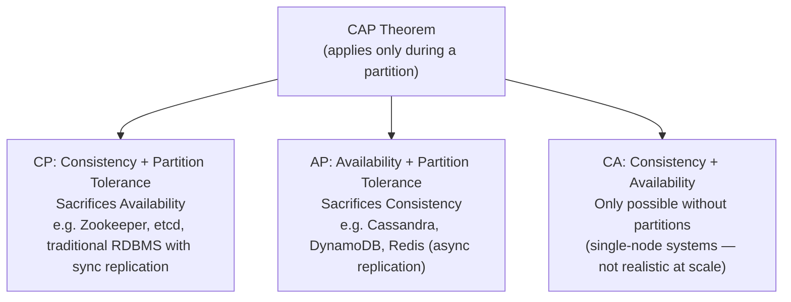

**Q: Why is PACELC more useful day-to-day than CAP?**

A: Partitions are rare; latency vs consistency trade-offs happen constantly. PACELC: **P**artition → choose A or C; **E**lse (normal operation) → choose **L**atency or **C**onsistency. E.g., RDS sync multi-AZ favors C over L; async read replicas favor L over C (PA/EL choice).

**Q: Give a concrete example of AP vs CP from a real system.**

A: RDS read replicas are AP/eventually-consistent by design; a payment write path is CP because double-charging risk is unacceptable.

### Back-of-the-Envelope Capacity Estimation

**Q: What quick numbers should be memorized for capacity estimation?**

A:
- 1M requests/day ≈ 12 RPS average; peak is usually 2-5x average
- 1KB × 1M req/day ≈ 1GB/day ≈ 30GB/month
- SSD read: tens of µs-1ms; same-region RTT: 0.5-2ms; cross-continent RTT: 100-150ms
- Redis GET: 0.5-1ms; indexed SQL: 1-10ms; unindexed SQL: 100ms-seconds

**Q: What's the method for sizing a system in an interview?**

A: 1) Estimate DAU and requests/user/day → 2) compute avg RPS, multiply by peak factor (~3x) → 3) estimate storage (avg record size × records/day × retention) → 4) estimate bandwidth (avg payload × RPS) → 5) decide if one DB/server suffices or if caching/replicas/sharding/CDN are needed.

**Q: Worked mini-example: 500K DAU hitting the API 20x/day — what's the load?**

A: 10M requests/day → 10M / 86,400s ≈ 116 RPS average → ~350 RPS at a 3x peak factor (~580 at 5x). Kestrel handles this easily; the DB is the real bottleneck, which is why caching/read-replicas become necessary.

## Intermediate: Building Blocks

### Caching Strategy

**Q: What are the main caching layers in a .NET API?**

A:
- In-memory (`services.AddMemoryCache()`) — single node, small/short-lived data
- Distributed (Redis) — multi-node, cache-aside pattern for DB lookups/tokens
- Response caching (`[ResponseCache(Duration = 60)]`)

```csharp
services.AddMemoryCache();
```

```csharp
[ResponseCache(Duration = 60)]
```

**Q: Show the cache-aside pattern in code.**

A:
```csharp
var cached = await _redis.GetStringAsync(key);
if (cached != null) return JsonSerializer.Deserialize<User>(cached);

var user = await _db.Users.FindAsync(id);
await _redis.SetStringAsync(key, JsonSerializer.Serialize(user));
return user;
```

**Q: Compare cache invalidation strategies.**

A:
| Strategy | Trade-off |
|---|---|
| TTL/expiration | Simple, but can serve stale data |
| Write-through | Always fresh, adds write latency |
| Write-behind | Fast writes, risk of loss if cache crashes pre-flush |
| Explicit invalidation on write | Most correct, easy to miss a code path |
| Event-driven invalidation | Scales across services, adds broker infra + lag |

**Q: What is cache stampede / thundering herd, and how do you mitigate it?**

A: A hot key expires and many concurrent requests miss simultaneously, hammering the DB. Mitigate with request coalescing (one in-flight fetch, others await it), jittered TTLs, and probabilistic early refresh.

**Q: Cache-aside vs read-through — what's the difference?**

A: Cache-aside puts caching logic in app code (common in .NET with `IDistributedCache`/Redis). Read-through puts the cache in front of the DB as a transparent library/proxy that fetches on miss — less app code, less control. Interviewers often use the terms loosely, but they're different responsibilities.

### Load Balancing

**Q: Compare the main load balancing algorithms.**

A:
| Algorithm | Use when |
|---|---|
| Round robin | Uniform cost, stateless servers |
| Least connections | Variable request duration |
| IP hash / consistent hash | Sticky sessions, cache locality |
| Weighted | Mixed instance sizes, canary rollout |

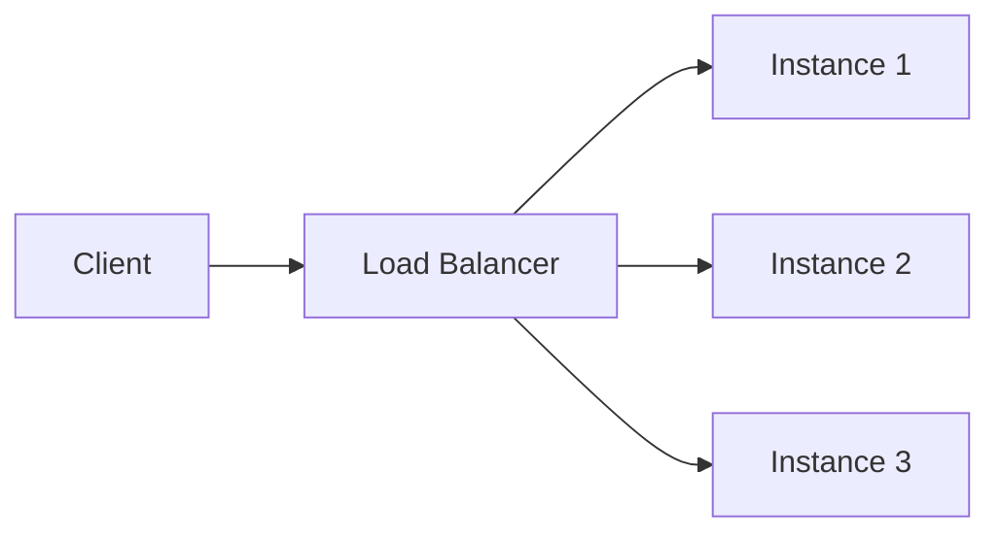

**Q: L4 vs L7 load balancing?**

A: L4 (transport, e.g. AWS NLB) routes on IP/port — fast, protocol-agnostic. L7 (application, e.g. ALB/Nginx/YARP) routes on HTTP path/headers — enables path-based routing (used in strangler-fig migrations) but adds overhead from terminating/inspecting HTTP.

**Q: Why do health checks matter as much as the LB algorithm?**

A: A load balancer is only as good as its ability to detect and stop routing to unhealthy instances — needs active health/liveness probes plus passive circuit-breaking on repeated failures.

### API Gateway / BFF Pattern

**Q: What does a Backend for Frontend (BFF) do?**

A: A UI-specific API layer that the SPA talks to exclusively: AuthN/AuthZ, aggregates backend calls, shapes responses for the UI, routes to Command vs Query APIs.

**Q: Why not let Angular call microservices directly?**

A: Prevents the SPA from calling many backend services directly, centralizes auth (avoids duplicating token validation everywhere), decouples UI iteration speed from backend structure.

**Q: BFF vs generic API Gateway — how do they differ?**

A: An API Gateway (Ocelot, YARP, Azure APIM, Kong) is a shared, generic front door for many consumer types doing routing/auth/rate-limiting. A BFF is one-per-client-type, handling UI-specific aggregation/shaping. Many shops run a BFF *behind* a shared Gateway. Conflating the two in an interview is a minor red flag.

### Database Read Replicas

**Q: What are RDS/DB read replicas used for?**

A: Horizontal scaling for read traffic, offloading reporting/dashboard queries from primary, improving read performance without touching the write model. They are **eventually consistent** — never assume immediate consistency after a write.

### Database Sharding vs Partitioning

**Q: Distinguish partitioning from sharding.**

A: Partitioning splits one large table into smaller pieces that can stay on the *same* server (e.g., SQL Server range partitioning) for manageability. Sharding is horizontal partitioning where shards live on *different servers* entirely, to scale writes/storage beyond one machine.

**Q: Compare sharding strategies.**

A:
| Strategy | Con |
|---|---|
| Range-based | Hotspotting on skewed data (new users hit last shard) |
| Hash-based | Resharding remaps almost everything |
| Consistent hashing | More complex to implement (but minimal remap) |
| Directory-based | Lookup service becomes new SPOF |
| Geo-based | Cross-region queries expensive |

**Q: What cross-shard problems should you raise proactively?**

A: Joins across shards need app-level fan-out or denormalization; cross-shard transactions need sagas/2PC; rebalancing (adding a shard) is the hardest operational problem — the reason consistent hashing exists.

**Q: How would you shard a multi-tenant SaaS DB?**

A: Shard by `tenant_id` (geo- or hash-based); keep each tenant's data on one shard to avoid cross-shard joins entirely — the biggest simplification available in tenant-based systems.

### Consistent Hashing

**Q: What problem does consistent hashing solve?**

A: Naive `hash(key) % N` remaps almost every key when a node is added/removed, causing a stampede. Consistent hashing places nodes and keys on a ring (0 to 2^32-1); a key belongs to the first node clockwise. Adding/removing a node only affects keys between it and the previous node.

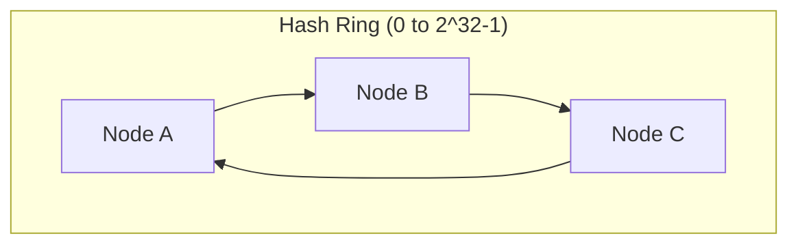

**Q: What are virtual nodes for?**

A: Real implementations (Redis Cluster, DynamoDB, Cassandra) give each physical node multiple ring positions to avoid uneven load when node count is small.

**Q: Where does consistent hashing show up in .NET systems?**

A: Redis Cluster client-side sharding, distributed cache partitioning, LB session affinity, CDN edge-node selection. The "why it beats modulo" reasoning is the actual signal, not the ring math.

### Message Queues & Event-Driven Architecture

**Q: Why decouple services with a queue instead of direct calls?**

A: Producer/consumer scale independently; consumer downtime doesn't block producer; natural retry/backoff + DLQ; enables fan-out without the producer knowing consumers.

**Q: Queue vs Topic/Pub-Sub — what's the difference?**

A: Point-to-point queue: one consumer processes each message (competing consumers) — e.g. SQS, ASB Queue — used for work distribution. Pub/Sub topic: every subscriber gets a copy — e.g. ASB Topic, Kafka, RabbitMQ fanout exchange — used for broadcasting state changes.

**Q: Compare Kafka, RabbitMQ, and Azure Service Bus.**

A:
| | Kafka | RabbitMQ | Azure Service Bus |
|---|---|---|---|
| Model | Partitioned log, consumer tracks offset | Smart broker | Managed broker, enterprise features |
| Throughput | Very high | Moderate-high | Moderate |
| Retention | Replayable | Removed once acked | Time-boxed |
| Best for | Event streaming/sourcing | Task queues, RPC routing | .NET-native, hybrid cloud |

**Q: What delivery guarantee do most brokers provide by default, and what does that require of consumers?**

A: At-least-once (message may be redelivered if ack is lost) — consumers must be idempotent. True exactly-once is expensive/rare; the pragmatic answer is "design for at-least-once + idempotent handlers."

## Advanced Architecture Patterns

### CQRS + BFF + Read Replicas (Reference Architecture)

**Q: Give the 30-second elevator pitch for this reference architecture.**

A: Command APIs handle business logic and write to primary RDS; Query APIs serve reads from RDS read replicas. Angular never calls backend services directly — it talks only to a BFF, which handles auth, response shaping, and routes read vs write. Improves scalability/performance while keeping UI and domain logic decoupled.

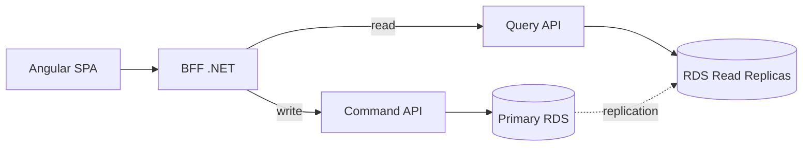

**Q: What's the responsibility split across layers?**

A: Angular = UI only, calls BFF only. BFF = AuthN/AuthZ, aggregation, shaping, read/write routing. Command APIs = business rules/validation/transactions, write to primary. Query APIs = read-only optimized reads from replicas.

**Q: How do you handle read-after-write consistency with eventually-consistent replicas?**

A: Either return the command response directly to the UI without re-querying, or temporarily read from the primary via the BFF for that specific follow-up read. Never assume replicas are immediately consistent.

**Q: Is this "true" CQRS?**

A: No — it's pragmatic CQRS: read/write paths and scaling are separated, but both sides hit the same logical database (primary/replica). Full CQRS (separate projections/event-driven) is an escalation path if read patterns diverge further.

**Q: When would you avoid this architecture?**

A: Small CRUD apps or simple admin panels where the complexity outweighs the benefit.

**Q: What are the red flags to avoid stating in your own design answer?**

A: Angular talking directly to microservices; BFF containing business logic; claiming read replicas are strongly consistent; one API handling both reads and writes at real scale.

### Monolith → Microservices Migration (Strangler Fig)

**Q: What's the first question to answer before migrating to microservices?**

A: Validate they're actually needed — independent deployment, different scalability needs, team autonomy, tech heterogeneity. If none apply, a modular monolith may be enough.

**Q: How do you identify service boundaries?**

A: Use DDD bounded contexts (Orders, Payments, Catalog, Shipping) — look at separate teams, separate DB schemas, modules that change together. "I use domain & change boundaries to decide microservices, not just controllers or tables."

**Q: What is the Strangler Fig pattern and why use it over a big-bang rewrite?**

A: Put an API Gateway/reverse proxy in front; route all traffic to the monolith initially; extract one capability into a new microservice; change routing (`/payments/**` → new service, rest stays); repeat until the monolith is hollow. Avoids the risk of a full rewrite.

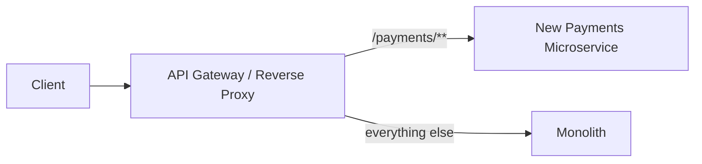

**Q: How should you prepare the monolith before extracting services?**

A: Modularize first — separate projects per module, clear interfaces (application services/events), tests around critical flows to avoid regressions during extraction.

**Q: What does extracting one service end-to-end involve?**

A: New repo + own CI/CD, separate data (new DB/schema, or temporary shared-DB-isolated-ownership), expose API, update callers through the gateway, retire old code once stable.

**Q: What's the hardest part of the migration, and how do you handle it?**

A: Data migration. Goal is database-per-service; path is shared DB with isolated ownership → gradual move via ETL or CDC/event streams. Prefer event-driven/eventual consistency over distributed transactions; use Outbox + Saga for cross-service consistency.

**Q: What platform components should be introduced while extracting services?**

A: API Gateway (routing/auth/rate limiting), service-to-service comms (REST/gRPC + broker), observability (centralized logging, distributed tracing, health checks), per-service CI/CD.

**Q: What are the common pitfalls of this migration?**

A: Splitting too fine-grained (chatty calls); keeping a shared DB forever (distributed monolith); no observability; tech stack explosion.

### CQRS & Event Sourcing (Full Pattern)

**Q: How does "full" CQRS differ from the pragmatic CQRS above?**

A: Write and read sides use physically different data stores/schemas. Write side persists source-of-truth (often as an event stream); read side maintains denormalized projections updated asynchronously via events.

**Q: What is event sourcing?**

A: Instead of storing current state, store the sequence of events that led to it (`OrderCreated`, `ItemAdded`, ...). Current state is derived by replaying events or from a snapshot + recent events.

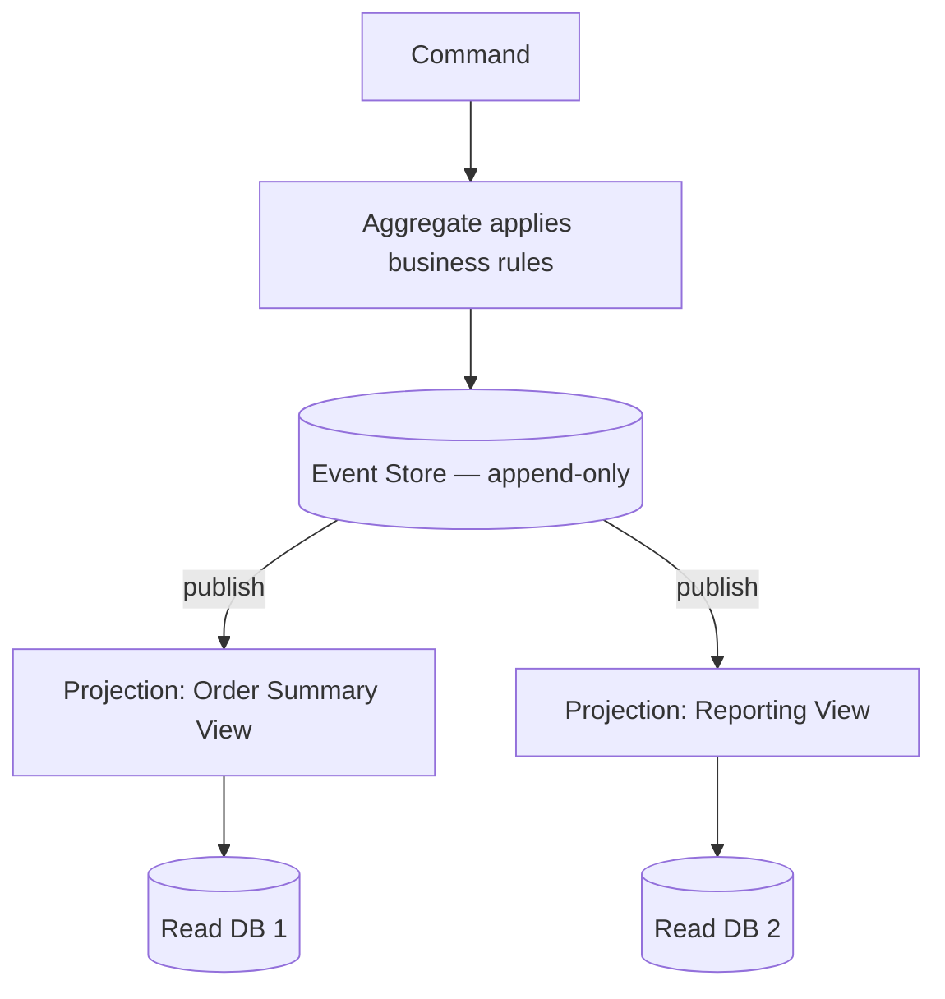

**Q: What are the trade-offs of event sourcing?**

A: Benefits: full audit trail/temporal queries, tailored read projections, natural event-driven integration, decoupled read/write scaling. Costs: significant complexity, eventual consistency between write and every read model, snapshotting needed for replay at scale, ongoing event-schema versioning tax.

**Q: When should you actually reach for event sourcing?**

A: Only when audit history/temporal queries are a first-class requirement, or read needs are so varied that one normalized write model can't serve them. For most systems, pragmatic CQRS is the right complexity level — event sourcing is the escalation path, not the default.

### Outbox Pattern & Transactional Messaging

**Q: What problem does the Outbox pattern solve?**

A: A DB transaction and a message-broker publish can't share one ACID transaction. Publish-then-write risks consumers acting on events that never committed; write-then-publish risks downstream never finding out if publish fails.

**Q: How does the Outbox pattern solve it?**

A: Write the event to an `Outbox` table in the *same DB transaction* as the business change. A separate poller (or CDC tool like Debezium) reads unsent outbox rows, publishes to the broker, then marks them sent.

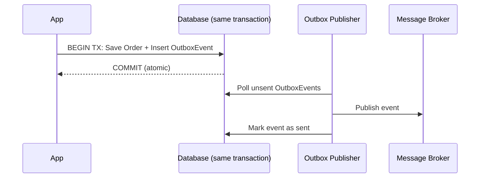

**Q: How is this implemented in .NET?**

A: EF Core `SaveChangesAsync()` writes both the entity and the `OutboxMessage` row in one transaction/DbContext call. A `BackgroundService`/Hangfire job polls the outbox on an interval (or via CDC trigger) and publishes, then updates status. Guarantees at-least-once delivery — consumers must be idempotent.

### Sagas / Distributed Transactions

**Q: Why not just use a 2-phase-commit distributed transaction across services?**

A: 2PC requires all participants to hold locks until everyone votes commit — doesn't scale across network boundaries, creates tight coupling and availability risk (one slow/down participant blocks everyone). Virtually no modern microservices architecture uses it.

**Q: What is the Saga pattern?**

A: Break a distributed transaction into a sequence of local transactions, each with a compensating action to undo it if a later step fails.

**Q: Choreography vs Orchestration sagas?**

A: Choreography — each service publishes events, others react independently (no coordinator); simple for few steps, hard to trace as steps grow. Orchestration — a central saga orchestrator calls each step and issues compensations; clear/testable/traceable, but the orchestrator is a new component to build/scale.

**Q: Walk through the Order + Payment + Inventory saga example.**

A: 1) Order created (`Pending`) → `OrderCreated`. 2) Payment charges card → `PaymentCompleted`/`PaymentFailed`. 3) If completed, Inventory reserves stock → `StockReserved`/`StockUnavailable`. 4) If unavailable: compensate — refund payment, mark order `Cancelled`.

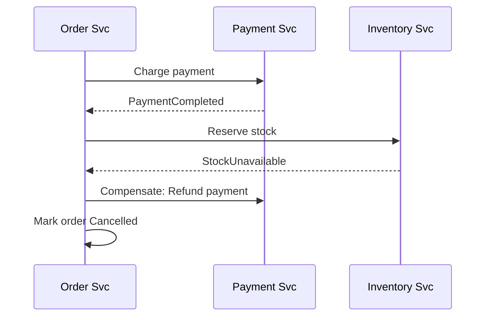

**Q: What if a compensating action itself fails?**

A: There's no fully automatic answer — compensations must be retried (idempotent, with backoff); if retries exhaust, escalate to a dead-letter queue for manual/ops intervention. Acknowledging this honestly is a strong interview signal.

### Resilience Patterns: Circuit Breaker, Retry, Bulkhead (Polly)

**Q: Describe the four core resilience patterns.**

A:

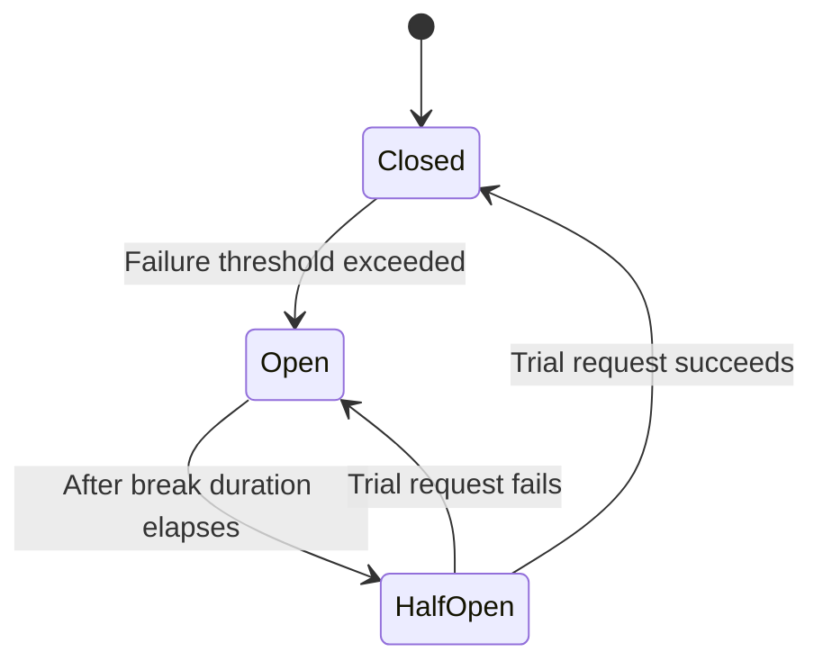

- **Retry** — re-attempt transient failures with exponential backoff + jitter (jitter avoids synchronized retry storms)
- **Circuit Breaker** — after N failures, open and fail fast for a cooldown; half-open trial request tests recovery
- **Bulkhead** — cap concurrent calls/resources per dependency so one failing downstream can't exhaust shared thread/connection pools
- **Timeout** — always pair with the above; retry/circuit-breaker without a timeout just waits longer to fail

**Q: Show a Polly v8 resilience pipeline in .NET.**

A:
```csharp
var pipeline = new ResiliencePipelineBuilder<HttpResponseMessage>()
    .AddRetry(new RetryStrategyOptions<HttpResponseMessage> {
        MaxRetryAttempts = 3, BackoffType = DelayBackoffType.Exponential, UseJitter = true })
    .AddCircuitBreaker(new CircuitBreakerStrategyOptions<HttpResponseMessage> {
        FailureRatio = 0.5, SamplingDuration = TimeSpan.FromSeconds(30), BreakDuration = TimeSpan.FromSeconds(15) })
    .AddTimeout(TimeSpan.FromSeconds(5))
    .Build();
```
Integrates with `HttpClientFactory` via `Microsoft.Extensions.Http.Resilience` (`AddStandardResilienceHandler()`).

### Idempotency Keys

**Q: Why are idempotency keys necessary given at-least-once delivery and retries?**

A: The same operation can be triggered more than once (retries, redelivery); non-idempotent handlers (charge card, send email) will double-execute without protection.

**Q: Describe the idempotency key pattern and show it in code.**

A: Client sends a unique key (GUID) per logical operation in a header. Server stores completed keys + response in a fast store for a retention window; on retry with the same key, returns the cached response instead of re-executing.
```csharp
var existing = await _idempotencyStore.GetAsync(idempotencyKey);
if (existing is not null) return Ok(existing.Response); // replay
var result = await _paymentService.ChargeAsync(request);
await _idempotencyStore.SaveAsync(idempotencyKey, result);
return Ok(result);
```

**Q: Isn't a DB unique constraint enough?**

A: Sometimes, if there's a natural business key (e.g., `OrderId`). Idempotency keys are the general solution when there's no natural key, or when you need to return the *exact original response* on retry, not just prevent a duplicate row.

### Rate Limiting Algorithms

**Q: Compare the five rate limiting algorithms.**

A:
| Algorithm | Con |
|---|---|
| Fixed window counter | Bursts at window edges (2x limit possible) |
| Sliding window log | Memory-heavy at high volume |
| Sliding window counter | Slight approximation |
| Token bucket | Slightly more complex; allows controlled bursts |
| Leaky bucket | Adds latency for bursty clients |

**Q: What .NET built-in support exists for rate limiting?**

A: `Microsoft.AspNetCore.RateLimiting` middleware (since .NET 7) with Fixed Window, Sliding Window, Token Bucket, and Concurrency limiter policies:
```csharp
options.AddTokenBucketLimiter("api", opt => {
    opt.TokenLimit = 100; opt.TokensPerPeriod = 20; opt.ReplenishmentPeriod = TimeSpan.FromSeconds(10);
});
```

**Q: How do you enforce a *global* rate limit across multiple instances?**

A: In-memory per-instance counters don't work in multi-instance deployments. Use Redis (`INCR`+`EXPIRE` or a Lua script for atomicity) as the shared counter store.

## Kestrel & ASP.NET Core Server Internals

### What is Kestrel?

**Q: What is Kestrel?**

A: The default cross-platform web server for ASP.NET Core — high-performance, event-driven, async, built on .NET Socket APIs, using IOCP (Windows) or epoll/kqueue (Linux/macOS). Handles thousands of concurrent connections with low overhead.

### Why was Kestrel created?

**Q: Why was Kestrel created instead of continuing with IIS/System.Web?**

A: Classic IIS/`System.Web` used thread-per-request (thread starvation), was tightly coupled to Windows, and was slow for real-time apps. Kestrel is platform-independent, async I/O from the ground up, aims for Node.js/Nginx-level performance, and drops the `System.Web`/IIS pipeline overhead.

### Kestrel Features

**Q: List Kestrel's key features.**

A: Cross-platform; fully async pipeline (few threads, no thread-per-request); ranks among fastest in TechEmpower benchmarks; HTTPS/HTTP1.1/HTTP2/HTTP3 (QUIC) support; WebSockets; endpoint routing across multiple bound URLs.

### Kestrel Architecture (Internal Flow)

**Q: Describe Kestrel's internal request flow.**

A: Client → Transport layer (TCP/TLS/QUIC sockets) → Connection layer (HTTP parsing) → Middleware pipeline (auth, routing, exceptions) → Endpoint routing (MVC/Minimal APIs) → Async response writing → Client. The event loop is optimized for high concurrent I/O.

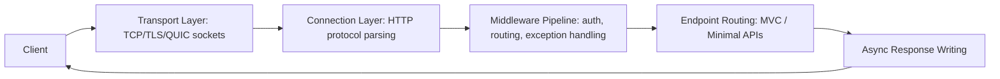

### How Kestrel Handles Concurrency

**Q: How does Kestrel achieve high concurrency with few threads?**

A: Event-loop-based (like Node.js, but multiple loops); uses IOCP/epoll/kqueue; minimal threads → high throughput; async context-switching avoids blocking the ThreadPool. With 10,000 open connections, only a small number of threads are active — all I/O is async via callbacks/async-await. This is why async code makes APIs faster under Kestrel.

### Configure Kestrel (Real-World Example)

**Q: How do you configure Kestrel limits and listen ports?**

A:
```csharp
builder.WebHost.ConfigureKestrel(options => {
    options.Limits.MaxRequestBodySize = 10 * 1024 * 1024;
    options.Limits.KeepAliveTimeout = TimeSpan.FromMinutes(2);
    options.Limits.RequestHeadersTimeout = TimeSpan.FromSeconds(30);
    options.ListenAnyIP(5000);
    options.ListenAnyIP(5001, lo => lo.UseHttps());
});
```

### Standalone vs Reverse Proxy Mode

**Q: Standalone vs reverse proxy — what's the difference and why use a proxy in production?**

A: Standalone: Client → Kestrel → app directly (dev/containers/simple deploys). Reverse proxy (recommended): Client → Nginx/Apache/IIS/ingress → Kestrel — better security, load balancing, connection handling, faster static file serving, and protects Kestrel from direct exposure.

### Performance Features

**Q: What performance features does Kestrel rely on internally?**

A: Zero-copy memory (`Span<T>`, `Memory<T>`, pipelines API); optimized header/body parsing with minimal allocations; HTTP/2 multiplexing (multiple streams per connection); IIS Integration Middleware for Windows/IIS hosting.

### Memory Management in Kestrel

**Q: How does Kestrel manage memory to reduce GC pressure?**

A: Uses memory pools, shared buffers, and reusable arrays instead of constant allocation — reduces GC pressure, faster responses.

### Common Interview Q&A (Kestrel)

**Q: Why is Kestrel faster than IIS/System.Web?**

A: Async I/O, minimal pipeline, no System.Web, lightweight handling, event-driven model.

**Q: Should Kestrel be exposed directly to the internet?**

A: No — use a reverse proxy (Nginx/IIS/cloud LB) for production. In containerized deployments, the "reverse proxy" is often the ingress controller or platform LB rather than a hand-configured Nginx box, but the principle holds.

**Q: How does Kestrel avoid thread starvation?**

A: No thread-per-request; async I/O + event loop needs far fewer threads than classic IIS/System.Web.

**Q: Does Kestrel run on Windows?**

A: Yes, but it uses .NET's cross-platform async I/O model rather than legacy Windows-specific APIs.

**Q: What is `MinRequestBodyDataRate`/`MinResponseDataRate` and when would you tune it?**

A: Kestrel enforces a minimum data rate (default ~240 bytes/sec) to protect against slowloris-style slow-client attacks. Raise or disable (`= null`) it for legitimately slow clients (large uploads over poor mobile connections) — never disable for public endpoints without another mitigation (WAF/proxy timeout) in front.

**Q: HTTP/2 vs HTTP/3 — why enable HTTP/3 (QUIC)?**

A: HTTP/2 multiplexes streams over one TCP connection but still suffers TCP head-of-line blocking (one lost packet stalls all streams). HTTP/3 runs over QUIC (UDP), multiplexing at the transport layer so a lost packet only stalls its own stream — better on lossy/mobile networks. Trade-off: QUIC/UDP can be blocked by restrictive firewalls, so HTTP/2 fallback must remain available.

### Senior-Level Summary (Kestrel, interview-ready)

**Q: Give a one-paragraph interview-ready summary of Kestrel.**

A: Kestrel is ASP.NET Core's default high-performance server — async I/O, event-driven, memory-efficient pipelines, supports HTTP/1.1/2/3, TLS, WebSockets, cross-platform. In production, run it behind a reverse proxy (Nginx/IIS or platform ingress/LB) for security, load balancing, static file serving, and connection management. Being async-first, it outperforms classic IIS/System.Web.

## API Performance Optimization

### 1. Reduce I/O & Database Latency

**Q: What are the key techniques to reduce DB/I/O latency?**

A: Proper indexing (composite indexes, avoid `SELECT *`, analyze with Query Store/`EXPLAIN`); pagination + `Select()` projections to avoid loading unneeded columns; async EF Core queries (`await ... ToListAsync()`) to prevent Kestrel thread starvation.

```csharp
var data = await _dbContext.Users
    .Where(x => x.IsActive)
    .ToListAsync();
```

### 2. Caching at Multiple Layers

**Q: What's covered by "caching" in the performance optimization list?**

A: Same content as the Caching Strategy section above — in-memory, Redis cache-aside, response caching, invalidation strategies, and cache stampede mitigation.

### 3. Reduce Serialization Time

**Q: How do you reduce serialization overhead in .NET APIs?**

A: Use `System.Text.Json` instead of `Newtonsoft.Json`; pre-define response DTOs; never serialize EF entities directly. For even more speed, use `JsonSerializerContext` source-generated serialization (since .NET 6+) to avoid reflection entirely under high throughput.

### 4. Asynchronous & Non-Blocking Architecture

**Q: What async anti-pattern must be avoided under Kestrel, and why?**

A: Avoid `.Result`/`.Wait()` (sync-over-async) — they block the thread pool. Use async all the way down since Kestrel is optimized for async workloads.

### 5. Minimize Middleware & Pipeline Overhead

**Q: How do you reduce middleware pipeline overhead?**

A: Keep only required middleware (routing, auth, structured logging); disable unused services and verbose/production logging; avoid large exception stack traces in prod.

### 6. Compression, HTTP/2, and gRPC

**Q: When would you use gRPC over REST, and what's the trade-off?**

A: gRPC is 5-10x faster for internal service-to-service calls (HTTP/2 + Protobuf binary + strongly-typed contracts, no reflection-based JSON parsing). Trade-off: harder to debug/inspect (not human-readable), weaker browser support (needs grpc-web + proxy), less universal tooling than REST/OpenAPI. Standard answer: gRPC internally, REST/JSON (or GraphQL) for public/browser-facing APIs.

**Q: How do you enable response compression in .NET?**

A:
```csharp
services.AddResponseCompression();
```

### 7. Improve Application Architecture

**Q: What two architectural moves improve throughput at the application layer?**

A: CQRS for high-read systems (reads from read DB, commands from write DB); background processing (Hangfire, Azure Functions, `BackgroundService`) so APIs return fast while heavy work continues async.

### 8. Connection Pooling & HttpClientFactory

**Q: Why use `HttpClientFactory` instead of `new HttpClient()`?**

A: Prevents socket exhaustion.
```csharp
services.AddHttpClient("external", c => c.Timeout = TimeSpan.FromSeconds(5));
```
For databases: use minimal DbContexts, avoid long-running transactions.

### 9. Reduce Payload Size

**Q: How do you reduce payload size?**

A: Compress JSON, remove unused fields, return lightweight DTOs, use OData/filtering APIs where appropriate.

### 10. Profiling & Monitoring

**Q: What tools and metrics matter for profiling API performance?**

A: Tools: Application Insights, New Relic, CloudWatch, Datadog, MiniProfiler, EF Core logging (N+1 detection). Track: latency p50/p90/p99, slow SQL queries, serialization time, GC pauses.

### Senior-Level Summary (API Performance, interview-ready)

**Q: Give a one-paragraph interview-ready summary of API performance optimization.**

A: Optimize across layers — database (indexes, projections, pagination), caching (Redis/memory/response), async architecture, Kestrel tuning, minimized middleware, payload optimization, and observability. For high-scale systems, add CQRS, background processing, gRPC. Performance is a cross-layer concern, not a single fix.

## Scalability & Performance Deep Dive

**Q: A production API is slow — walk through the debugging decision tree.**

A: Start by checking p50 vs p99. If p50 is fine but p99 is bad → likely GC pauses, connection pool exhaustion, or a slow dependency on the tail; check thread pool/DB pool saturation and downstream timeouts; fix with Polly circuit breaker + bulkhead, tune pool sizes. If both p50 and p99 are bad → likely systemic (missing index, N+1 query, sync-over-async); check EF Core query logs; fix with indexes, projections, caching.

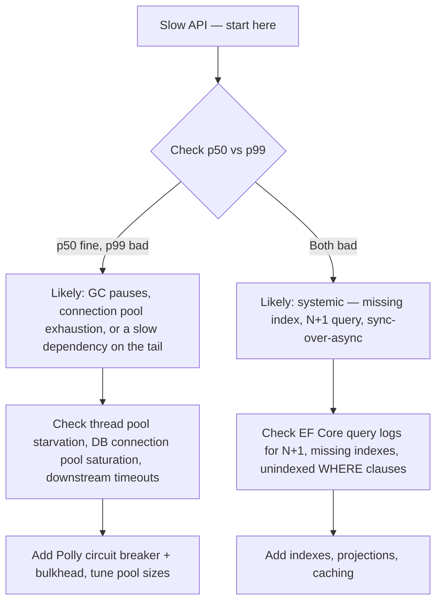

**Q: Vertical vs horizontal scaling — what's the trade-off, and which is the default?**

A: Vertical (bigger instance) is simpler, no distributed complexity, but has a hard ceiling and is a SPOF. Horizontal (more instances) is the standard for internet-scale but requires statelessness (or externalized state), a load balancer, and introduces distributed-system problems. Default to horizontal for customer-facing scale; don't over-engineer a low-traffic internal tool.

**Q: What is the N+1 query problem and how do you fix it in EF Core?**

A: Iterating a collection and lazy-loading a related entity per item causes N+1 round trips instead of 1. Fix with eager loading (`.Include()`), projection (`.Select()`), or a single batched query. Use `AsSplitQuery()` for one-to-many `Include`s that would otherwise cause a cartesian-product explosion in a single SQL query.

## Best Practices

**Q: What are the key architectural best practices from this guide?**

A:
- Validate business need before adopting microservices/CQRS/event sourcing — complexity should be earned
- Design async all the way down; never mix `.Result`/`.Wait()` into an async chain
- Cache at the layer closest to the client that's still correct (CDN > response cache > distributed cache > in-memory > DB)
- Treat read replicas and distributed caches as eventually consistent by default; design read-after-write explicitly
- Make queue/webhook/retry consumers idempotent — at-least-once is the realistic default
- Wrap every outbound call to a dependency you don't control with retry/circuit-breaker/timeout/bulkhead
- Build observability (structured logs, correlation IDs, tracing, p50/p90/p99) in from day one
- Prefer a modular monolith with clean boundaries over premature microservices
- Choose a shard key that keeps related data/transactions together

## Common Pitfalls

**Q: What are the most commonly cited system-design pitfalls?**

A:
- Microservices split too fine-grained → chatty calls, high latency
- Shared database forever across "microservices" → distributed monolith
- No observability → debugging nightmare
- Tech stack explosion → ops complexity
- Assuming read replicas/distributed caches are strongly consistent
- `.Result`/`.Wait()` causing thread pool starvation under Kestrel
- Retrying non-idempotent operations without an idempotency key → duplicate side effects
- Circuit breaker/retry without a timeout → fails slower instead of faster
- Sharding key that doesn't match query/transaction patterns → expensive cross-shard fan-out
- Reaching for Kafka/event sourcing/full CQRS because they're "correct" rather than needed

## Worked Examples

### Design a URL Shortener

**Q: What are the requirements and estimated load for a URL shortener?**

A: Shorten + redirect; ~100M new URLs/month, ~10:1 read:write ratio. ~40 writes/sec avg, ~400 reads/sec avg (higher at peak). Storage ≈ 50GB/month (500B/record).

**Q: Compare short-code generation approaches.**

A:
| Approach | Trade-off |
|---|---|
| Base62 of auto-increment ID | Simple, no collisions, but reveals volume/order, needs a centralized/range-allocated ID generator |
| Hash + truncate | No central counter, but collisions need check-and-retry |
| Random string + collision check | Simple, but wasted lookups as keyspace fills |

Senior answer: base62 of a distributed ID generator (Snowflake-style or pre-allocated ranges per node) avoids both the counter bottleneck and collisions.

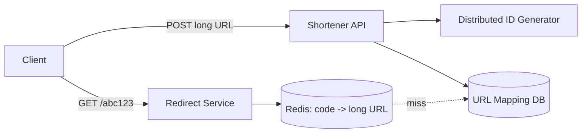

**Q: How do you optimize the redirect (hot) path, and 301 vs 302?**

A: Cache short-code → long-URL in Redis (cache-aside/read-through); DB only on miss. 301 (permanent) lets browsers cache client-side (less load, but loses click analytics); 302 (temporary) keeps every click hitting your service (enables analytics/A-B redirects). Most production shorteners use 302 to retain click tracking.

**Q: What other trade-offs should you raise proactively?**

A: Vanity/custom short codes need a uniqueness check against user-chosen codes; rate-limit link creation to prevent spam abuse.

### Design a Rate Limiter Service

**Q: How do you design a rate limiter that works across many API instances?**

A: Centralize the counter in Redis (not per-instance memory) so the limit is global; use token bucket to absorb bursts while enforcing an average rate.

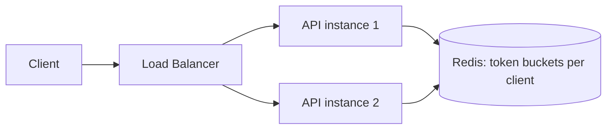

**Q: What implementation detail separates senior answers here?**

A: Use a single Redis Lua script (or MULTI/EXEC) to read-and-decrement atomically — separate GET then SET is a race condition under concurrency (two requests both see "1 token left," both proceed, bucket goes negative).

**Q: What happens when Redis (the counter store) goes down — fail open or fail closed?**

A: Most production systems fail open, because a rate limiter protects against abuse rather than being a hard security boundary — an outage-driven traffic spike is a lesser risk than rejecting 100% of legitimate traffic.

**Q: Where should rate limiting be enforced?**

A: At the API Gateway/edge (cheapest — stops abuse before backend compute is spent), with optional finer-grained per-service/per-endpoint limits layered on top (e.g., a stricter limit on an expensive search endpoint).

### Design a Notification System

**Q: What's the high-level design for a multi-channel notification system?**

A: Upstream services publish events to a queue/event bus → Notification Worker reads them, checks the User Preference Store, and dispatches to Push/Email/SMS providers.

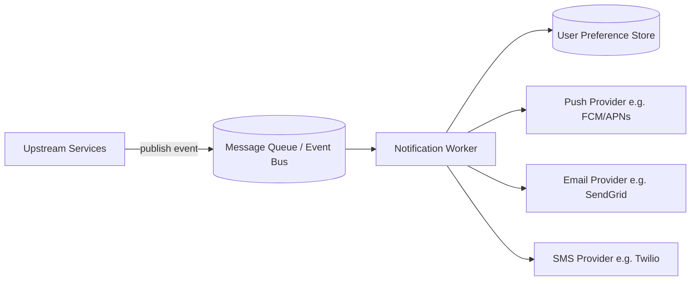

**Q: Why use a queue instead of calling notification delivery directly?**

A: The triggering service (e.g., Orders) shouldn't block on or care about a channel provider outage — decoupling via a queue lets the order complete instantly while delivery/retries happen independently.

**Q: How do you handle fan-out to "all 1M followers" without slowing the triggering request?**

A: Don't create 1M queue messages synchronously. Publish one fan-out event; a dedicated fan-out worker expands it into per-user work items (possibly into a second queue) — keeps the originating request fast.

**Q: How do you isolate per-channel failures (SMS provider outage shouldn't block email)?**

A: Wrap each provider call in its own Polly policy (retry + circuit breaker); use per-channel dead-letter queues with alerting for exhausted retries.

**Q: How do you avoid duplicate notifications under at-least-once delivery?**

A: Check cached user preferences (opt-outs, quiet hours) before sending; use an idempotency key per (event, channel) so a redelivered message doesn't send twice.

**Q: What trade-off should you name explicitly regarding delivery timing?**

A: Real-time push (maximizes immediacy, risks fatigue/cost) vs batched/digest notifications (better UX, lower cost, added latency) — clarify this requirement rather than assume.

## Closing the Gap: Additional Prep

### Expanding the Worked-Example Repertoire

**Q: News Feed (Twitter/Instagram-style) — what's the core design tension?**

A: Fan-out-on-write (precompute each follower's feed on post — fast reads, expensive for celebrities) vs fan-out-on-read (assemble at request time — cheap writes, expensive reads). Senior answer: hybrid — fan-out-on-write for normal users, fan-out-on-read/separate path for high-follower accounts.

**Q: Chat System (WhatsApp-style) — what's the key deep-dive question?**

A: Core components: WebSockets for real-time delivery, presence service, message persistence with delivery guarantees, group-chat fan-out. Key question: how do you route a message to a recipient connected to one of thousands of stateless servers? Answer: a connection-registry/lookup service (e.g., Redis `userId -> serverId`) so any server can forward correctly.

**Q: Ride-Sharing Dispatch (Uber-style) — what's the core problem and answer?**

A: Geospatial matching at scale — finding nearest available driver. Use geohashing or a quadtree to index driver locations for fast spatial queries instead of full scans; frequent location updates need a high-write-throughput store, not strong consistency.

**Q: Distributed Key-Value Store ("mini-DynamoDB") — what concepts does it draw on?**

A: Consistent hashing for partitioning, replication factor for durability, read/write quorums (R/W) for tunable consistency, vector clocks or last-write-wins for conflict resolution on concurrent writes.

**Q: Video Streaming Service (Netflix-style) — what are the core components?**

A: Chunked video encoding at multiple bitrates, CDN for edge delivery (caching-strategy content applies), adaptive bitrate streaming (client picks quality by measured bandwidth), a metadata/recommendation service decoupled from the video-serving path.

**Q: E-Commerce Checkout/Inventory — what's the core problem and pattern used?**

A: Preventing overselling under concurrent checkouts. Direct application of Sagas + Idempotency Keys: reserve inventory (with TTL), charge payment, confirm reservation; compensate (release reservation) on failure; idempotency keys prevent double-charge/double-reserve on retried checkout requests.

### Mapping Patterns to AWS Managed Services

**Q: Map each generic pattern in this guide to its AWS managed-service equivalent.**

A:
| Pattern | AWS service |
|---|---|
| Distributed cache (Redis) | ElastiCache |
| Point-to-point queue | SQS |
| Pub/Sub fan-out | SNS (often SNS → multiple SQS) |
| CDN/edge cache | CloudFront |
| L7 load balancer | ALB |
| L4 load balancer | NLB |
| Read replicas | RDS/Aurora Read Replicas |
| Saga orchestration | Step Functions |
| Event streaming (Kafka) | Kinesis Data Streams (or MSK for Kafka compatibility) |
| Serverless background work | Lambda (e.g., Outbox poller as EventBridge-scheduled Lambda) |
| Rate limiter shared counter | ElastiCache (Redis) |

### Running the Interview: Time-Boxing & Whiteboard Mechanics

**Q: How should you time-box a 45-minute system design interview?**

A: Requirements clarification ~5 min; back-of-envelope estimation ~5 min; high-level architecture ~15-20 min; deep dive on 1-2 hard components ~15-20 min; trade-offs/failure modes/wrap-up ~5-10 min.

**Q: What whiteboard/mechanics skills matter beyond knowing the patterns?**

A: Practice sketching architectures (CQRS+BFF, Strangler Fig, Saga sequences) fluently in whatever tool you'll be given (Excalidraw, Miro, CoderPad, HackerRank) — tool fluency at speed while talking is a distinct skill from knowing the architecture.

**Q: Why does "narrating continuously" matter, and what does good narration sound like?**

A: Silence while thinking is the most common reason a technically-correct design reads as "junior." Say what you're considering and rejecting, e.g., "I could shard by user ID, but I'll shard by tenant ID since it keeps each tenant's data and transactions on one shard."

### Multi-Tenant Data Isolation & PII Handling

**Q: Compare the three tenant isolation models.**

A:
| Model | Isolation | Fit |
|---|---|---|
| Silo (DB-per-tenant) | Strongest | Regulatory hard-isolation requirements, or wildly different tenant scale |
| Pooled + `TenantId` filtering | Logical, app/ORM-enforced | Most SaaS at moderate-large scale (matches shard-by-tenant-ID recommendation) |
| Bridge (schema-per-tenant) | Middle ground | Medium tenant count needing schema customization without full silo cost |

**Q: What PII/compliance measures should you raise proactively?**

A: Encryption at rest (RDS/DynamoDB + KMS) and in transit (TLS everywhere); field-level encryption/tokenization for the most sensitive fields rather than relying on DB-level encryption alone; audit logging of who accessed which tenant's data and when.

**Q: What's the #1 failure mode to name explicitly for multi-tenancy, regardless of isolation model?**

A: Cross-tenant data leak. Name the specific mechanism preventing tenant A's request from ever returning tenant B's data — a global query filter with a fail-closed default (throws if tenant context isn't set) — not just "we add a WHERE clause."

## Sample Interview Q&A

**Q: Availability/consistency during a partition vs during normal operation — what's the distinction?**

A: CAP strictly applies only during a partition (choose A or C). During normal operation, the real trade-off is latency vs consistency (PACELC) — e.g., sync multi-AZ replication adds latency for consistency, while async replication (RDS read replicas) favors latency at the cost of temporary staleness.

**Q: How would you make a payment API safe to retry?**

A: Require an idempotency key per logical payment attempt; store completed keys with their response; return the cached response on retry instead of re-charging. Combine with Polly client-side retry policies and a DB uniqueness constraint on the business key as defense-in-depth.

**Q: Your circuit breaker is open and failing fast — what do you tell users vs on-call?**

A: Users: a graceful degraded response (cached/stale data or a clear "temporarily unavailable") rather than a hung request. On-call: alert on circuit *state transitions* specifically (not just error rate) so they immediately know it's a downstream dependency issue, cutting diagnosis time.

**Q: How would you scale the URL shortener redirect path to 50,000 reads/sec?**

A: Cache aggressively (Redis, potentially CDN/edge for very hot links), keep the redirect path off the write DB entirely, and add a read replica/dedicated read store if cache-miss volume alone exceeds one DB's capacity — the path should be nearly all cache hits given the typical skewed read:write ratio.
