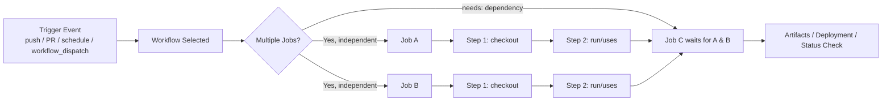
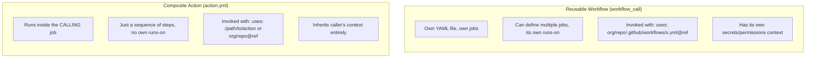
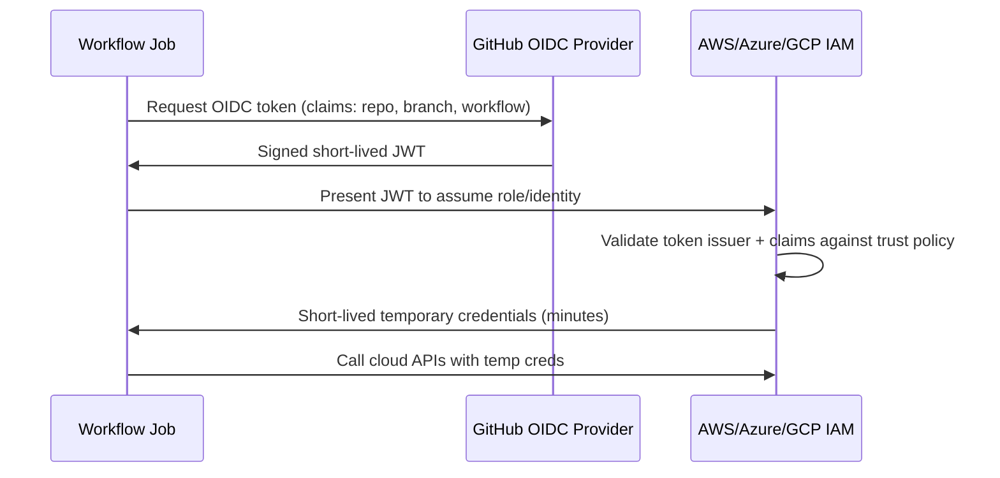

# GitHub Actions — Interview Revision Notes

> Quick-revision Q&A derived from `O. GitHub-Actions-Interview-Guide.md`. Covers every section of the source.

## Core Concepts

### Key building blocks

**Q: What are the five core building blocks of GitHub Actions?**

A:

- **Workflow** — a YAML file defining an automated process, triggered by events.
- **Job** — a group of steps that runs on a single runner; jobs run in parallel by default, sequencing controlled via `needs`.
- **Step** — a single task inside a job, either a shell command (`run`) or a reusable action (`uses`).
- **Action** — a reusable unit of automation (JavaScript, Docker, or composite); first-party, Marketplace, or custom.
- **Runner** — the compute (VM or container) that executes a job; GitHub-hosted or self-hosted.

### Workflow lifecycle (event → job → step)

**Q: Describe the lifecycle from trigger event to job completion.**

A: A trigger event (push/PR/schedule/`workflow_dispatch`) selects a workflow. Independent jobs run in parallel; a job declaring `needs` waits for its dependencies. Each job runs its steps (checkout, then `run`/`uses`) in sequence inside its own isolated runner, and the final job(s) produce artifacts/deployments/status checks.



### Basic workflow example

**Q: Show a minimal GitHub Actions workflow that checks out code and runs tests.**

A:

```yaml
name: CI Workflow
on: [push, pull_request]

jobs:
  build:
    runs-on: ubuntu-latest
    steps:
      - name: Checkout Code
        uses: actions/checkout@v4
      - name: Run Tests
        run: npm test
```

Note: `actions/checkout@v3`, `actions/cache@v3`, and `actions/upload-artifact@v3` are stale/deprecated as of 2026 — pin to `@v4`+ (v3 of upload/download-artifact is disabled on GitHub-hosted runners).

**Q: What's the key distinction between a "job" and a "step" that trips up people from Jenkins/Azure DevOps?**

A: A **job** is the unit of isolation — its own VM/container, its own filesystem. A **step** is the unit of sequencing *within* that isolation. People used to Jenkins/Azure DevOps's stage-vs-task model often conflate the two.

## Workflow Triggers

**Q: What are the main GitHub Actions triggers and when do you use each?**

A:

| Trigger | Use case |
|---|---|
| `push` | Run on commits to matching branches |
| `pull_request` | Run on PR open/sync/reopen — runs against the merge commit, not the head commit |
| `schedule` (cron) | Nightly builds, scheduled jobs |
| `workflow_dispatch` | Manual trigger from UI/API with optional typed inputs |
| `workflow_call` | Makes the workflow reusable/callable from another workflow |
| `repository_dispatch` | External system triggers a workflow via API |
| `issues`, `release`, etc. | Repo/GitHub-object lifecycle events |

```yaml
on:
  push:
    branches: [main, develop]
    paths-ignore:
      - '**.md'
      - 'docs/**'
  pull_request:
  workflow_dispatch:
  schedule:
    - cron: '0 0 * * *'   # daily at midnight UTC
```

### Manual dispatch

**Q: How do you set up a manually-triggered workflow with typed inputs?**

A:

```yaml
on:
  workflow_dispatch:
    inputs:
      environment:
        description: 'Target environment'
        required: true
        default: 'staging'
        type: choice
        options: [staging, production]
```

Trigger from the "Actions" tab, or via `gh workflow run` / REST API for automation.

### Cross-repo triggering

**Q: How do you trigger a workflow in a different repository, and what's the `GITHUB_TOKEN` limitation?**

A: Use `repository_dispatch`, or `gh workflow run workflow.yml --repo other/repo`, provided the token has sufficient permissions (a PAT or GitHub App token). The default `GITHUB_TOKEN` **cannot** trigger workflows in other repos, and by design also cannot trigger another workflow run in the *same* repo — this prevents infinite recursion.

**Q: What's the security gotcha with `pull_request` vs `pull_request_target` on forked PRs?**

A:

- `pull_request` from a fork runs with a **read-only, restricted `GITHUB_TOKEN`** and **no access to repo secrets** — a deliberate security boundary.
- `pull_request_target` runs in the context of the base repo (full token/secrets) but checks out the **base** ref by default — a classic **pwn request** vector if the workflow is modified to check out and run the PR's head content (see Security & Supply-Chain Hardening).

## Runners

### GitHub-Hosted vs Self-Hosted Runners

**Q: Compare GitHub-hosted and self-hosted runners.**

A:

| Aspect | GitHub-Hosted | Self-Hosted |
|---|---|---|
| Maintenance | Zero — GitHub provisions/tears down per job | You patch OS, install SDKs, manage capacity |
| Cost model | Per-minute billing, multiplier by OS (Linux 1x, Windows 2x, macOS 10x) | Infra cost only; free from Actions minutes billing |
| Networking | Public internet only, ephemeral IP, no VPN by default | Can live inside your VPC/on-prem, access private resources |
| State | Fully ephemeral — clean VM every run | Persistent by default (cache/secret/malware leftover risk unless cleaned up or run ephemeral via ARC) |
| Security surface | Isolated per-job VM, GitHub-managed patching | You own the security posture; malicious PR code via `pull_request_target` misuse has a much higher blast radius |
| Hardware | Fixed SKUs (GPU/large runners at cost) | Whatever you provision — bare metal, GPUs, ARM, custom images |
| Best for | Most OSS/standard CI, quick start | Compliance/data-residency, large monorepos, licensed software, private network access, cost control at scale |

**Q: What GitHub-hosted runner images are currently available?**

A:

- Ubuntu: `ubuntu-latest`, `ubuntu-24.04`, `ubuntu-22.04`
- Windows: `windows-latest`, `windows-2025`, `windows-2022`
- macOS: `macos-latest`, `macos-15`, `macos-14`

Older images (`ubuntu-20.04`, `windows-2019`, `macos-12`) are retired/deprecated as of 2025-2026 — always check the `actions/runner-images` repo for the current support matrix.

**Q: How do you register and start a self-hosted runner?**

A:

```bash
./config.sh --url <repo-url> --token <runner-token>
./run.sh
```

**Q: How do you scale self-hosted runners, and what's the key risk of long-lived self-hosted runners on a public repo?**

A: Use **Actions Runner Controller (ARC)** on Kubernetes for autoscaling ephemeral runners, or cloud-specific autoscaling groups. Never run long-lived self-hosted runners on a public repo — anyone who can open a PR can potentially execute arbitrary code on your infrastructure via workflow trigger abuse.

## Variables, Secrets & Environments

### Environment variables

**Q: How do you define and use a plain environment variable in a workflow?**

A:

```yaml
env:
  NODE_ENV: production

steps:
  - run: echo "Running in $NODE_ENV mode"
```

### Secrets

**Q: How do you reference a secret in a workflow, and where are secrets configured?**

A: Secrets are stored in **Settings → Secrets and variables → Actions**, scoped at repo, environment, or organization level.

```yaml
env:
  API_KEY: ${{ secrets.MY_SECRET_KEY }}
```

### `env` vs `secrets`

**Q: What's the difference between `env` variables and `secrets`?**

A:

| Feature | `env` variables | `secrets` |
|---|---|---|
| Visibility | Visible in logs | Automatically masked/redacted in logs |
| Encryption | Not encrypted | Encrypted at rest, decrypted only at runtime for the job |
| Scope | Public to repo/workflow | Private to repository/environment/org, access-controlled |
| Typical use | Non-sensitive config (build flags, feature toggles) | API keys, connection strings, credentials, tokens |

**Q: What's the gotcha with secret masking in logs?**

A: Secret masking is naive string-substring matching on the printed value — it does not protect against a secret being base64-encoded, split across lines, or otherwise transformed before printing. Never echo a secret through a transformation as a "clever" workaround; assume anything touching a secret is potentially exfiltratable in a compromised workflow.

### Environments & approval gates

**Q: What are GitHub Environments, and what capabilities do they add for gating a production deployment?**

A:

```yaml
jobs:
  deploy:
    runs-on: ubuntu-latest
    environment: production
    steps:
      - run: ./deploy.sh
```

Environments (Settings → Environments) let you:

- Scope secrets to only that environment (e.g. prod DB connection string not visible to a staging job in the same workflow).
- Require manual approval from designated reviewers before the job proceeds.
- Restrict which branches/tags can deploy to that environment (deployment branch policies).
- Add a wait timer.

This is the direct equivalent of Azure DevOps environments + approvals/checks, and is the standard answer to "how do you gate a production deployment in GitHub Actions?"

## Jobs, Dependencies & Control Flow

### `needs` — job dependencies

**Q: How do you make one job wait for others, and how do you consume an upstream job's output?**

A:

```yaml
jobs:
  build:
    runs-on: ubuntu-latest
  test:
    runs-on: ubuntu-latest
    needs: build
  deploy:
    runs-on: ubuntu-latest
    needs: [build, test]
```

Jobs without `needs` run in parallel by default; `needs` creates a DAG. `needs` can reference multiple jobs, and downstream jobs can consume upstream outputs via `needs.build.outputs.version`.

### `if` conditionals

**Q: How do `if` conditionals work at step/job level, and what's the common gotcha?**

A:

```yaml
- name: Run only on main
  if: github.ref == 'refs/heads/main'
  run: echo "Running on main branch"
```

Applies at step or job level. Common expressions: `github.event_name == 'pull_request'`, `success()`, `failure()`, `always()`, `cancelled()`.

Gotcha: if a prior step fails, subsequent steps are **skipped by default** unless you explicitly use `if: always()` or `if: failure()` — a frequent cause of "why didn't my cleanup/notification step run?" bugs.

### Build/Deploy Notifications (Slack & Email)

**Q: How do you send a Slack notification on build success/failure, and where does the coupling point live?**

A: Notifications are ordinary steps gated by `if:` conditionals — not a special GitHub Actions primitive.

```yaml
jobs:
  build:
    runs-on: ubuntu-latest
    steps:
      - uses: actions/checkout@v4
      - run: dotnet build

      - name: Notify Slack on success
        if: success()
        uses: rtCamp/action-slack-notify@v2
        env:
          SLACK_WEBHOOK: ${{ secrets.SLACK_WEBHOOK }}
          SLACK_MESSAGE: 'Build completed successfully! :white_check_mark:'
          SLACK_COLOR: good

      - name: Notify Slack on failure
        if: failure()
        uses: rtCamp/action-slack-notify@v2
        env:
          SLACK_WEBHOOK: ${{ secrets.SLACK_WEBHOOK }}
          SLACK_MESSAGE: 'Build failed on ${{ github.ref_name }} — check the run.'
          SLACK_COLOR: danger
```

- `rtCamp/action-slack-notify@v2` posts to a Slack Incoming Webhook URL stored as a secret (`SLACK_WEBHOOK`) — no OAuth app install required for the simple case.
- Split success/failure into separate steps with `if: success()` / `if: failure()` when you want different messages/colors; use `if: always()` only when a single step should run unconditionally and branch on `${{ job.status }}` internally.
- Email notifications follow the same pattern with an SMTP-based action (e.g. `dawidd6/action-send-mail@v3`), gated the same way.
- To trigger a workflow **from** Slack (ChatOps), a Slack bot/slash-command calls the GitHub REST API (or `gh workflow run`) to fire a `workflow_dispatch` event. Requires a PAT or GitHub App token with `actions: write` — `GITHUB_TOKEN` isn't usable since the call originates outside any workflow run.

### Branch/path filters

**Q: How do you restrict a workflow to specific branches and ignore certain paths?**

A:

```yaml
on:
  push:
    branches: [main, develop]
    paths-ignore:
      - '**.md'
      - 'docs/**'
```

### Concurrency control

**Q: How do you prevent redundant/overlapping workflow runs?**

A:

```yaml
concurrency:
  group: ci-${{ github.ref }}
  cancel-in-progress: true
```

This cancels a stale in-progress run when new commits land. Without `cancel-in-progress: true`, `concurrency` only **queues** runs serially rather than cancelling them.

### Timeouts and retries

**Q: How do you set a job timeout, and how do you retry a flaky step given there's no built-in step-level retry?**

A:

```yaml
jobs:
  build:
    runs-on: ubuntu-latest
    timeout-minutes: 10
```

There is no built-in step-level retry primitive. Options:

1. Shell-level retry loop:

```yaml
- run: |
    for i in 1 2 3; do
      your-command && break || sleep 5
    done
```

2. Marketplace action: `nick-fields/retry@v3` (cleaner, supports max attempts/backoff/timeout).

### Custom composite/anchor step reuse within a repo

**Q: What's the recommended way to reuse a step-sequence across jobs, and why avoid YAML anchors?**

A:

```yaml
steps:
  - name: Common Step
    run: echo "This step is used in multiple jobs"
```

For true reuse across jobs/workflows, prefer a **composite action** over copy-pasting steps or YAML anchors — YAML anchors aren't officially supported/validated by the Actions schema and are a fragile hack.

## Matrix Builds

**Q: Show a matrix build varying OS and .NET version, and explain how it executes.**

A:

```yaml
strategy:
  matrix:
    os: [ubuntu-latest, windows-latest]
    dotnet-version: ['8.0.x', '9.0.x']
  fail-fast: false
runs-on: ${{ matrix.os }}
steps:
  - uses: actions/setup-dotnet@v4
    with:
      dotnet-version: ${{ matrix.dotnet-version }}
```

- Runs the **cross-product** of all matrix dimensions as separate parallel jobs (2 OS × 2 versions = 4 jobs here).
- `fail-fast: true` (default) cancels all other matrix jobs the moment one fails — usually you want `false` in CI for full signal, `true` only to save runner minutes.
- `max-parallel` throttles how many matrix jobs run concurrently (useful for a limited self-hosted pool).
- `include`/`exclude` add one-off combinations or exclude specific ones without full cross-product blow-up.

**Q: Why use a matrix instead of N separate jobs?**

A: DRY workflow definition, and the Checks UI groups matrix results legibly under one job name with per-combination status — much easier to read than N unrelated jobs.

## Caching & Artifacts

### Caching (speed, not persistence guarantee)

**Q: How does `actions/cache` work, and what are its key limitations?**

A:

```yaml
- uses: actions/cache@v4
  with:
    path: ~/.nuget/packages
    key: nuget-${{ runner.os }}-${{ hashFiles('**/packages.lock.json') }}
    restore-keys: |
      nuget-${{ runner.os }}-
```

- Cache is keyed — an exact key hit restores the cache; `restore-keys` provides fallback partial matches.
- Caches are **immutable once written** for a given key — you cannot update an existing entry, a new key is required.
- Caches are scoped per repo/branch with eviction (10 GB repo-wide soft cap, LRU eviction — verify current limits).
- `actions/cache` is **best-effort** — never rely on it for correctness, only for speed. Design the pipeline to work correctly on a full cache miss.

### Artifacts (durable, cross-job data transfer)

**Q: How do you upload and download build artifacts between jobs, and what changed in v4?**

A:

```yaml
- uses: actions/upload-artifact@v4
  with:
    name: build-output
    path: ./bin/Release
    retention-days: 7

- uses: actions/download-artifact@v4
  with:
    name: build-output
```

`upload-artifact@v4`/`download-artifact@v4` no longer allow multiple uploads to the *same* artifact name (each upload creates a new immutable artifact) and are up to 10x faster than v3, but require distinct names per matrix leg — a common fix is `name: artifact-${{ matrix.os }}-${{ matrix.dotnet-version }}`. v3 of these actions is deprecated/EOL.

**Q: What's the distinction between cache and artifacts that interviewers probe for?**

A:

| | Cache | Artifact |
|---|---|---|
| Purpose | Speed up repeated dependency restore | Pass build output between jobs, or preserve for humans/download |
| Lifetime | Best-effort, evicted opportunistically | Guaranteed for `retention-days`, downloadable via UI/API |
| Typical content | `node_modules`, NuGet/npm cache, Docker layers | Compiled binaries, test results, logs, coverage reports |

### Long-term storage

**Q: Where should you store artifacts if you need them beyond the retention window?**

A: `actions/upload-artifact` retention is capped (default 90 days, configurable down). For genuinely long-term storage, push to a package feed (GitHub Packages, NuGet.org, Azure Artifacts) or blob storage (S3/Azure Blob) instead.

## Reusable Workflows & Composite Actions

**Q: What's the structural difference between a reusable workflow and a composite action?**

A:



| | Reusable Workflow | Composite Action |
|---|---|---|
| File | `.yml` under `.github/workflows/` with `on: workflow_call` | `action.yml` (+ optional script files) |
| Granularity | One or more jobs | A sequence of steps within one job |
| Runner | Defines its own `runs-on` | Runs on the caller's existing runner |
| Secrets | Must be explicitly passed via `secrets:` (or `secrets: inherit`) | Inherits caller's env/context automatically |
| Nesting | Can call other reusable workflows (up to 4 levels deep) | Can call other actions |
| Best for | Standardizing an entire pipeline stage across many repos | Standardizing a handful of steps (checkout + setup + restore) |

### Reusable workflow

**Q: Show how to define and call a reusable workflow with inputs and secrets.**

A:

```yaml
# .github/workflows/deploy.yml
on:
  workflow_call:
    inputs:
      environment:
        required: true
        type: string
    secrets:
      AWS_ACCESS_KEY_ID:
        required: true

jobs:
  deploy:
    runs-on: ubuntu-latest
    steps:
      - run: echo "Deploying to ${{ inputs.environment }}"
```

Calling it, including cross-repo:

```yaml
jobs:
  call-workflow:
    uses: my-org/my-repo/.github/workflows/deploy.yml@main
    with:
      environment: production
    secrets:
      AWS_ACCESS_KEY_ID: ${{ secrets.AWS_ACCESS_KEY_ID }}
      # or simply: secrets: inherit
```

### Composite action

**Q: Show a composite action definition, and what's the mandatory gotcha for its `run` steps?**

A:

```yaml
# action.yml
name: 'Setup and Restore'
runs:
  using: "composite"
  steps:
    - uses: actions/setup-dotnet@v4
      with:
        dotnet-version: '8.0.x'
      shell: bash
    - run: dotnet restore
      shell: bash
```

Every `run` step inside a composite action must specify `shell:` explicitly — it isn't inherited the way it is in a normal workflow job.

**Q: When would you pick a composite action over a reusable workflow?**

A: Composite action for a small reusable step-sequence embedded inside a larger job (shared setup logic). Reusable workflow when you want to standardize an entire deployment/release process across many repos with centralized governance — the org security team owns the reusable workflow, teams just call it, reducing drift and making auditing/patching a single choke point.

## Containers & Custom Actions

### Running a job inside a container

**Q: How do you run a job inside a specific container image, and why would you?**

A:

```yaml
jobs:
  docker-job:
    runs-on: ubuntu-latest
    container:
      image: mcr.microsoft.com/dotnet/sdk:8.0
    steps:
      - run: dotnet --version
```

Useful for pinning exact toolchain versions independent of the runner image, or using a hermetic build environment matching production containers.

### Custom actions — three flavors

**Q: What are the three flavors of custom GitHub Actions, and their trade-offs?**

A:

| Type | Runtime | Use case |
|---|---|---|
| Docker container action | Any language, packaged as a container | Full control, heavier/slower startup, mostly Linux-only |
| JavaScript/TypeScript action | Node.js (`node20` runtime) | Fastest startup, cross-platform, most Marketplace actions use this |
| Composite action | Orchestrates existing actions/shell steps | No compilation, easiest to author/maintain |

```yaml
# action.yml (JS action skeleton)
name: 'My Custom Action'
inputs:
  who-to-greet:
    required: true
runs:
  using: 'node20'
  main: 'dist/index.js'
```

## Deployment Patterns

### Multi-stage deployment (dev → staging → prod)

**Q: Show a multi-stage dev → staging → prod deployment pipeline.**

A:

```yaml
jobs:
  deploy-dev:
    environment: dev
    runs-on: ubuntu-latest
    steps: [ ... ]
  deploy-staging:
    needs: deploy-dev
    environment: staging
    runs-on: ubuntu-latest
    steps: [ ... ]
  deploy-prod:
    needs: deploy-staging
    environment: production   # gated by required reviewers
    runs-on: ubuntu-latest
    steps: [ ... ]
```

### Cloud deployment example (AWS)

**Q: Show a legacy AWS deployment step using static keys, and what's the senior-level flag on it?**

A:

```yaml
- uses: aws-actions/configure-aws-credentials@v4
  with:
    aws-access-key-id: ${{ secrets.AWS_ACCESS_KEY_ID }}
    aws-secret-access-key: ${{ secrets.AWS_SECRET_ACCESS_KEY }}
    aws-region: us-east-1
- run: aws s3 sync ./build s3://my-bucket
```

Long-lived AWS access keys as secrets is the legacy pattern. Current best practice is **OIDC federation** — no static credentials stored at all (see OIDC Federation section). Bring this up proactively in an interview.

### IaC deployments

**Q: How do you run an IaC deployment step, and does the OIDC principle extend to Azure/GCP?**

A:

```yaml
- name: Deploy with Terraform
  run: terraform apply -auto-approve
```

Same principle applies for Azure (`azure/login@v2` with OIDC) or GCP (`google-github-actions/auth`) — avoid static service principal secrets where OIDC is available.

### Repository/status badges

**Q: How do you add a CI status badge to a repo README?**

A:

```markdown

```

## Debugging & Local Testing

### Debugging a failed run

**Q: How do you debug a failed GitHub Actions run?**

A:

- Re-run with debug logging: set repo secrets `ACTIONS_STEP_DEBUG=true` and `ACTIONS_RUNNER_DEBUG=true`, or use "Re-run with debug logging" in the UI.
- Use `tmate` (`mxschmitt/action-tmate`) to SSH into a live runner mid-failure for interactive debugging — useful for flaky/self-hosted-runner-specific issues.
- Inspect the `${{ toJSON(github) }}` / `${{ toJSON(steps) }}` context by dumping it in a debug step.

Note: there is no official `actions/setup-debugging` action — the correct answer is the debug-logging secrets and/or `tmate` approach above.

### Running Actions locally

**Q: How do you run GitHub Actions workflows locally, and what are the limitations?**

A:

```bash
act -j build
```

`nektos/act` runs workflows locally in Docker for fast iteration without pushing/waiting on GitHub. Limitations: doesn't perfectly emulate GitHub-hosted runner images, some contexts (`secrets`, certain `github.*` fields) need manual stubbing, and GitHub-specific features (environments/approvals) aren't simulated.

## .NET-Specific CI/CD

### Idiomatic .NET Build/Test/Publish Pipeline

**Q: Show a realistic senior-level .NET CI pipeline covering restore, build, test, coverage, and publish.**

A:

```yaml
name: .NET CI

on:
  push:
    branches: [main]
  pull_request:

jobs:
  build-test:
    runs-on: ubuntu-latest
    steps:
      - uses: actions/checkout@v4
        with:
          fetch-depth: 0   # needed for tools like GitVersion / Nerdbank.GitVersioning

      - uses: actions/setup-dotnet@v4
        with:
          dotnet-version: '8.0.x'

      - name: Cache NuGet packages
        uses: actions/cache@v4
        with:
          path: ~/.nuget/packages
          key: nuget-${{ runner.os }}-${{ hashFiles('**/packages.lock.json') }}
          restore-keys: nuget-${{ runner.os }}-

      - name: Restore
        run: dotnet restore --locked-mode

      - name: Build
        run: dotnet build --configuration Release --no-restore

      - name: Test
        run: >
          dotnet test --configuration Release --no-build
          --logger "trx;LogFileName=test-results.trx"
          --collect:"XPlat Code Coverage"

      - name: Publish test results
        uses: dorny/test-reporter@v1
        if: always()
        with:
          name: Test Results
          path: '**/test-results.trx'
          reporter: dotnet-trx

      - name: Publish
        run: dotnet publish ./src/MyApp/MyApp.csproj -c Release -o ./publish

      - uses: actions/upload-artifact@v4
        with:
          name: webapp
          path: ./publish
```

Key points:

- `packages.lock.json` + `--locked-mode` enables deterministic restore and lets the cache key be based on an exact, reproducible hash — without it, `hashFiles('**/*.csproj')` is a weaker proxy that can miss transitive dependency drift.
- `fetch-depth: 0` — shallow clone (default `fetch-depth: 1`) breaks tools that need full git history (GitVersion, Nerdbank.GitVersioning, `git describe`-based versioning).
- `--no-restore` / `--no-build` avoid redundant work across restore → build → test steps.
- `.trx` files aren't natively rendered by GitHub — need `dorny/test-reporter`, `EnricoMi/publish-unit-test-result-action`, or upload as artifact + external tool.
- `--collect:"XPlat Code Coverage"` emits Cobertura XML; combine with `danielpalme/ReportGenerator-GitHub-Action` or Codecov/SonarCloud for visualization and PR-level coverage-diff gating.

### Versioning & Semantic Release for .NET

**Q: How do you version .NET builds automatically instead of manual `.csproj` bumps?**

A:

- **GitVersion** or **Nerdbank.GitVersioning (nbgv)** derive a SemVer version from git history/tags, run as an early step, exposing the computed version as a job output consumed by `dotnet build -p:Version=...` and container-tag steps.
- **MinVer** — lighter-weight alternative, purely tag-based.
- Container images and NuGet packages should be tagged/versioned from the same computed value to keep traceability between a deployed artifact and its exact commit.

### Containerized .NET Apps — Build & Push

**Q: How do you build and push a containerized .NET app with layer caching?**

A:

```yaml
- uses: docker/setup-buildx-action@v3
- uses: docker/login-action@v3
  with:
    registry: ghcr.io
    username: ${{ github.actor }}
    password: ${{ secrets.GITHUB_TOKEN }}
- uses: docker/build-push-action@v6
  with:
    context: .
    push: true
    tags: ghcr.io/my-org/my-app:${{ github.sha }}
    cache-from: type=gha
    cache-to: type=gha,mode=max
```

`cache-from`/`cache-to: type=gha` uses the Actions cache backend for Docker layer caching — meaningfully faster than rebuilding every layer per run, and the modern replacement for manually caching `/var/lib/docker`.

## Security & Supply-Chain Hardening

### Pwn Requests and `pull_request_target` Risk

**Q: What is a "pwn request" and how does it differ from the safe `pull_request` default?**

A:

- `pull_request` from a fork: read-only token, no secrets — safe by default even with malicious PR code, because nothing sensitive can be exfiltrated.
- `pull_request_target`: runs with the base repo's token and full secrets access, but by default checks out the base branch — safe *unless* the workflow explicitly checks out and executes the PR's head ref (`github.event.pull_request.head.sha`) or otherwise runs attacker-controlled code (e.g. `npm install` triggering a malicious `postinstall` script). This combination — privileged token + executing untrusted code — is the "pwn request" vulnerability class.
- Mitigation: never combine `pull_request_target` (or `workflow_run`) with a checkout of untrusted head content unless deliberately isolated; split into an unprivileged `pull_request` build/test job and a separate, manually-gated or `workflow_run`-triggered job that only reuses vetted **artifacts** (not source) for anything privileged.

### Pinning Actions to Commit SHAs

**Q: Why pin actions to a commit SHA instead of a version tag, and what's the syntax?**

A: `uses: actions/checkout@v4` resolves a mutable tag — if that tag is ever moved (compromised publisher, force-pushed tag), your workflow silently runs different code next run (a real supply-chain surface, e.g. the 2024 `tj-actions/changed-files` compromise). Best practice for anything security-sensitive is to pin to a full commit SHA with a version comment:

```yaml
- uses: actions/checkout@11bd71901bbe5b1630ceea73d27597364c9af683 # v4.2.2
```

Tools like Dependabot and `pinact` can auto-update SHA-pinned actions while keeping the pin.

### `GITHUB_TOKEN` Least Privilege

**Q: How should you scope `GITHUB_TOKEN` permissions, and why is this high-leverage?**

A: Default permissions used to be broad for classic repos; new repos default to read-only, but never rely on the default — declare `permissions` explicitly:

```yaml
permissions:
  contents: read
  pull-requests: write   # only if the job actually comments/labels PRs
```

Setting least-privilege `permissions:` blocks on every workflow is the single highest-leverage, lowest-effort security control you can cite in an interview.

### Third-Party Action Vetting

**Q: How do you vet third-party Marketplace actions before depending on them?**

A:

- Prefer actions published by GitHub, verified creators, or vendors you already trust (`aws-actions/*`, `docker/*`, `azure/*`).
- For anything else, review the source, pin to SHA, and consider mirroring into an internal org action if it's business-critical.
- **CodeQL**, **Dependabot**, and **Scorecard** (`ossf/scorecard-action`) can be wired into workflows to continuously assess supply-chain risk of the repo itself.

### Environment Protection Rules as a Security Control

**Q: Beyond approvals, how do GitHub Environments act as a security boundary?**

A: Environments let you scope which secrets exist at all in a given job context — a compromised/malicious PR workflow targeting a `dev` environment simply cannot read `production` secrets, because they're not injected into that job's context at all. This is a stronger boundary than relying on `if` conditions alone.

## OIDC Federation for Cloud Auth

### Why OIDC Replaces Long-Lived Cloud Secrets

**Q: Why is OIDC federation preferred over storing static cloud credentials as GitHub secrets?**

A: The old pattern stores a long-lived `AWS_ACCESS_KEY_ID`/`AWS_SECRET_ACCESS_KEY` (or Azure SP secret) as a GitHub secret. Problems: static credentials leak risk (valid until manually rotated), no natural expiry or per-run scoping, and rotation is a manual, often-neglected burden.

OIDC lets GitHub Actions request a short-lived, signed identity token from GitHub's OIDC provider, which the cloud provider trusts (via a pre-configured trust relationship) to mint temporary, scoped credentials for just that job run. No static secret is stored anywhere.



### Example: AWS via OIDC (no static keys)

**Q: Show an AWS deployment step authenticated via OIDC instead of static keys.**

A:

```yaml
permissions:
  id-token: write   # required for OIDC
  contents: read

jobs:
  deploy:
    runs-on: ubuntu-latest
    steps:
      - uses: aws-actions/configure-aws-credentials@v4
        with:
          role-to-assume: arn:aws:iam::123456789012:role/github-actions-deploy
          aws-region: us-east-1
      - run: aws s3 sync ./build s3://my-bucket
```

The IAM role's trust policy restricts which repo/branch/environment can assume it, using claims like `token.actions.githubusercontent.com:sub == "repo:my-org/my-repo:ref:refs/heads/main"` — even if a workflow is compromised, it can only impersonate the role from that exact repo/branch context.

### Azure equivalent

**Q: How does OIDC-based Azure login differ from the AWS example, and what's actually stored as a secret?**

A:

```yaml
permissions:
  id-token: write
  contents: read
steps:
  - uses: azure/login@v2
    with:
      client-id: ${{ secrets.AZURE_CLIENT_ID }}
      tenant-id: ${{ secrets.AZURE_TENANT_ID }}
      subscription-id: ${{ secrets.AZURE_SUBSCRIPTION_ID }}
      # no client-secret — federated credential configured on the App Registration
```

Only non-sensitive identifiers (client ID, tenant ID, subscription ID) are stored — none of these alone grant access without the OIDC trust relationship also matching repo/branch claims.

## Monorepo & Multi-Project CI Strategies

### Change-Detection-Based Selective Builds

**Q: How do you avoid running the entire pipeline on every push in a monorepo?**

A:

```yaml
jobs:
  changes:
    runs-on: ubuntu-latest
    outputs:
      api: ${{ steps.filter.outputs.api }}
      frontend: ${{ steps.filter.outputs.frontend }}
    steps:
      - uses: dorny/paths-filter@v3
        id: filter
        with:
          filters: |
            api:
              - 'src/Api/**'
            frontend:
              - 'src/Frontend/**'

  build-api:
    needs: changes
    if: needs.changes.outputs.api == 'true'
    runs-on: ubuntu-latest
    steps: [ ... ]

  build-frontend:
    needs: changes
    if: needs.changes.outputs.frontend == 'true'
    runs-on: ubuntu-latest
    steps: [ ... ]
```

This is the GitHub Actions equivalent of Azure DevOps' `paths` trigger filters or Bazel/Nx-style affected-project detection — near-guaranteed to come up if the role involves a monorepo.

### Nx/Turborepo-Aware CI

**Q: How do Nx/Turborepo improve on plain path filters for monorepo CI?**

A: For polyglot or JS-heavy monorepos, Nx and Turborepo compute the dependency graph and expose an "affected" command (`nx affected`, `turbo run build --filter=...[origin/main]`) that's more accurate than path filters alone, because it understands *code* dependencies, not just directory boundaries. Increasingly relevant even in .NET-heavy shops with a mixed-stack monorepo containing a JS frontend.

### Reusable workflows as the monorepo governance mechanism

**Q: How do reusable workflows help govern CI across many services in a monorepo?**

A: Combine path-filtering with a shared reusable workflow per "project type" (e.g. one `dotnet-build-test.yml` reusable workflow called by every service's job) so the build/test/security logic is centrally maintained even though each service triggers independently.

## Performance & Cost Optimization

### Where Runner Minutes Actually Go

**Q: If asked "how would you reduce our CI bill," what concrete levers would you pull?**

A:

- **Runner OS multiplier**: Windows runners cost 2x Linux minutes, macOS 10x on GitHub-hosted billing — default to Linux unless Windows/macOS is specifically needed.
- **Concurrency + `cancel-in-progress`**: stops burning minutes on superseded commits.
- **Caching** (NuGet/npm/Docker layers) cuts restore/build time — often the single biggest lever.
- **Matrix `fail-fast` and `max-parallel`** tuning to avoid wasting parallel runner slots.
- **Path filters / change detection** in monorepos avoid running unrelated pipelines entirely.
- **Self-hosted runners** for high-volume, predictable workloads — a build-vs-buy calculation, not a default.
- **Larger/faster hosted runners** can be cheaper in aggregate than default 2-core runners if they meaningfully cut wall-clock time on CPU-bound builds — worth benchmarking rather than assuming default is cheapest.

### Workflow-Level Timeout Hygiene

**Q: Why set `timeout-minutes` explicitly at the job level?**

A: The platform default is 6 hours — a hung test/process silently burning runner minutes for hours is a common real-world cost leak. Always set aggressive `timeout-minutes` at the job level rather than relying on the platform default.

## GitHub Actions vs Azure DevOps Pipelines

### Comparison Table

**Q: How does GitHub Actions map to Azure DevOps Pipelines concept-for-concept?**

A:

| Aspect | GitHub Actions | Azure DevOps Pipelines |
|---|---|---|
| Config format | YAML in `.github/workflows/` | YAML (`azure-pipelines.yml`) or classic UI-based pipelines |
| Unit of isolation | Job (own VM/container) | Stage → Job → Task hierarchy (extra nesting level) |
| Reusability | Reusable workflows (`workflow_call`) + composite actions | Templates (`extends`, `template` includes) |
| Marketplace | GitHub Marketplace, huge community ecosystem | Azure DevOps Marketplace, smaller, more enterprise/ALM-focused |
| Approvals/Gates | Environments + required reviewers | Environments + approvals & checks (very similar model) |
| Secrets | Repo/Env/Org-scoped secrets | Variable groups, Key Vault-linked variable groups |
| Self-hosted compute | Self-hosted runners | Self-hosted agents (same concept) |
| Cloud-native auth | OIDC federation (AWS/Azure/GCP) | Workload identity federation (equivalent concept) |
| Native repo integration | Deeply integrated with GitHub (Checks API, PR status, Issues) | Best when paired with Azure Repos |
| Boards/work item integration | GitHub Projects/Issues (lighter-weight) | Azure Boards (heavier, more enterprise PM-oriented) |
| Pricing model | Per-minute + OS multiplier, generous free tier for public repos | Per-parallel-job licensing model |
| Typical migration driver | Consolidating on GitHub for source control + single tool | Wants deeper enterprise ALM or Azure-only ecosystem lock-in |

If the org is migrating from Azure DevOps, most concepts have a direct analog (stage→job, agent→runner, variable group→environment/secret, template→reusable workflow) — the migration is largely mechanical translation plus re-thinking security (OIDC, `permissions:` blocks), since the default security posture differs meaningfully.

## AWS-Native CI/CD Integration Points

### `aws-actions/configure-aws-credentials` in Depth

**Q: What does `aws-actions/configure-aws-credentials` actually do under the hood with OIDC?**

A:

```yaml
permissions:
  id-token: write   # required — this is what lets the job request an OIDC token at all
  contents: read

jobs:
  deploy:
    runs-on: ubuntu-latest
    steps:
      - uses: actions/checkout@v4

      - uses: aws-actions/configure-aws-credentials@v4
        with:
          role-to-assume: arn:aws:iam::123456789012:role/github-actions-ecs-deploy
          aws-region: us-east-1
          role-session-name: gha-${{ github.run_id }}   # traceable in CloudTrail

      - run: aws sts get-caller-identity   # sanity check — confirms the assumed role
```

The action calls GitHub's OIDC provider for a signed JWT (scoped to the calling repo/workflow/ref), then calls AWS STS `AssumeRoleWithWebIdentity`, passing that JWT. AWS validates the JWT's signature against the OIDC provider registered in IAM, checks the trust policy's conditions against the JWT's claims, and — if matched — returns short-lived (default 1 hour, configurable) temporary credentials, exported as `AWS_ACCESS_KEY_ID`/`AWS_SECRET_ACCESS_KEY`/`AWS_SESSION_TOKEN` env vars for every subsequent step in the job.

### IAM OIDC Provider and Role Trust Policy Setup

**Q: What two pieces of AWS-side configuration are required before a workflow can assume a role via OIDC?**

A: 1. Register GitHub's OIDC provider in IAM (one-time, per AWS account):

```hcl
resource "aws_iam_openid_connect_provider" "github_actions" {
  url             = "https://token.actions.githubusercontent.com"
  client_id_list  = ["sts.amazonaws.com"]
  thumbprint_list = []  # AWS validates via its own trusted CA bundle for this provider; thumbprint no longer required for GitHub's OIDC endpoint (verify current guidance)
}
```

2. Create the IAM role with a trust policy scoped to the exact repo/branch/environment:

```hcl
resource "aws_iam_role" "github_actions_ecs_deploy" {
  name = "github-actions-ecs-deploy"

  assume_role_policy = jsonencode({
    Version = "2012-10-17"
    Statement = [{
      Effect    = "Allow"
      Principal = { Federated = aws_iam_openid_connect_provider.github_actions.arn }
      Action    = "sts:AssumeRoleWithWebIdentity"
      Condition = {
        StringEquals = {
          "token.actions.githubusercontent.com:aud" = "sts.amazonaws.com"
        }
        StringLike = {
          "token.actions.githubusercontent.com:sub" = "repo:my-org/my-repo:ref:refs/heads/main"
          # or, scoped to a GitHub Environment instead of a branch:
          # "token.actions.githubusercontent.com:sub" = "repo:my-org/my-repo:environment:production"
        }
      }
    }]
  })
}
```

**Q: What's the blast radius if a workflow using this role is compromised?**

A: Only what the attached IAM permissions policy allows, and only from the exact repo/ref/environment matched in the `sub` claim — a workflow on a feature branch cannot assume a role trust-scoped to `ref:refs/heads/main`, even with a stolen `GITHUB_TOKEN`, because the OIDC claims are generated server-side by GitHub and can't be forged by workflow code.

Gotcha: the `aud` (audience) claim must always be checked (`sts.amazonaws.com`) alongside `sub` — checking `sub` alone without pinning `aud` is a real hardening gap some example configs skip.

### Artifacts/Caching Tying Into an AWS Deploy Target (ECS/Lambda)

**Q: Show a full pipeline building/pushing a container image and deploying it to ECS.**

A:

```yaml
jobs:
  build-and-push:
    runs-on: ubuntu-latest
    permissions:
      id-token: write
      contents: read
    steps:
      - uses: actions/checkout@v4
      - uses: aws-actions/configure-aws-credentials@v4
        with:
          role-to-assume: arn:aws:iam::123456789012:role/github-actions-ecs-deploy
          aws-region: us-east-1
      - uses: aws-actions/amazon-ecr-login@v2
        id: ecr-login
      - uses: docker/build-push-action@v6
        with:
          context: .
          push: true
          tags: ${{ steps.ecr-login.outputs.registry }}/order-api:${{ github.sha }}
          cache-from: type=gha
          cache-to: type=gha,mode=max
      - name: Render new ECS task definition
        id: task-def
        uses: aws-actions/amazon-ecs-render-task-definition@v1
        with:
          task-definition: ecs-task-def.json
          container-name: order-api
          image: ${{ steps.ecr-login.outputs.registry }}/order-api:${{ github.sha }}
      - name: Deploy to ECS
        uses: aws-actions/amazon-ecs-deploy-task-definition@v2
        with:
          task-definition: ${{ steps.task-def.outputs.task-definition }}
          service: order-api-service
          cluster: order-api-cluster
          wait-for-service-stability: true
```

The same `type=gha` layer cache used for GHCR-based .NET container builds elsewhere works identically when the target registry is ECR — the cache backend is the Actions cache service regardless of where the built image is pushed.

**Q: Show a .NET Lambda deployment, and why is an artifact (not cache) the right primitive here?**

A:

```yaml
      - name: Publish Lambda package
        run: dotnet lambda package -pl ./src/MyFunction -o ./publish/function.zip

      - uses: actions/upload-artifact@v4     # durable handoff to a separate deploy job, or for audit/rollback
        with:
          name: lambda-package
          path: ./publish/function.zip

      - name: Deploy to Lambda
        run: |
          aws lambda update-function-code \
            --function-name order-processor \
            --zip-file fileb://./publish/function.zip
```

The zip is the actual deployable unit being handed from a build job to a deploy job (or retained for rollback/audit) — this is exactly the artifacts-vs-cache distinction: cache accelerates the *build*, artifacts carry the *thing you actually ship*. NuGet restore caching still applies upstream of this step to speed up `dotnet lambda package` itself.

ECS deploys are usually image-based (build once, push to ECR, update the task definition, let ECS handle the rolling/blue-green rollout), while Lambda deploys are typically artifact-based (zip or container image pushed directly via the Lambda API/SDK, often orchestrated by Terraform/CDKTF rather than raw `aws lambda update-function-code` beyond a quick example) — knowing which primitive (image vs. zip artifact) fits which compute target is the actual signal of AWS fluency here.

## Best Practices

**Q: What's the senior-level best-practices checklist for a GitHub Actions setup?**

A:

- Pin action versions (ideally to commit SHA for anything security-sensitive; at minimum a major version tag, never `@main`/`@master`).
- Set explicit least-privilege `permissions:` blocks on every workflow.
- Use `environments` with required reviewers for any production deployment gate.
- Prefer OIDC federation over long-lived cloud credentials wherever the cloud provider supports it.
- Use `concurrency` + `cancel-in-progress` to avoid wasting minutes on superseded runs.
- Cache aggressively (NuGet/npm/Docker layers) but never depend on cache for correctness.
- Centralize shared CI logic in reusable workflows/composite actions instead of copy-pasting across repos.
- Use path filters / change detection in monorepos to avoid unnecessary full-repo builds.
- Fail fast with sensible `timeout-minutes` everywhere.
- Split "build untrusted PR code" (unprivileged) from "run privileged deployment logic" (trusted, gated) into separate workflows to avoid pwn-request exposure.
- Use Dependabot to keep both application dependencies and pinned Action SHAs current.

## Common Pitfalls

**Q: What are the most common GitHub Actions pitfalls to watch for?**

A:

- Assuming `GITHUB_TOKEN` has full permissions by default — modern defaults are more restrictive, but don't assume either way; declare explicitly.
- Combining `pull_request_target` with a checkout of the PR head — classic pwn-request vulnerability.
- Relying on `actions/cache` for correctness rather than pure speed-up.
- Forgetting `shell:` in composite action `run` steps.
- Not setting `fail-fast: false` when you actually want full matrix signal.
- Believing `concurrency` alone cancels stale runs — it only does so with `cancel-in-progress: true`.
- Using deprecated `actions/checkout@v3`, `upload-artifact@v3`/`download-artifact@v3` — retired/being sunset, use v4+.
- Uploading multiple matrix legs to one artifact name under v4 semantics (now disallowed) — must use unique names per leg.
- Treating secret masking as a real security boundary against determined exfiltration (encoding/splitting bypasses naive log redaction).
- Forgetting `fetch-depth: 0` when a step needs full git history (versioning tools, `git log`-based changelogs).
- Long-lived, non-ephemeral self-hosted runners on public repos — a significant attack surface.

## Sample Interview Q&A

**Q: Walk me through what happens end-to-end when a developer opens a PR, from trigger to merge, in a well-designed GitHub Actions setup for a .NET service.**

A: PR opened → `pull_request` event fires with a restricted, secret-less token → build/test/lint jobs run in parallel where possible, with matrix across relevant TFMs/OS if needed → NuGet cache restored by lockfile hash → `dotnet build`/`dotnet test` run, results published via a TRX-aware reporter as PR checks → on success, artifacts (build output, coverage report) uploaded → branch protection requires these checks green before merge → merge to main triggers a separate `push`-triggered workflow that runs the trusted deployment path (potentially through a reusable workflow), gated by an `environment` requiring manual approval for production, using OIDC to assume a cloud deploy role rather than static secrets.

**Q: Your GitHub Actions bill is too high — walk me through how you'd reduce it without hurting developer velocity.**

A: Instrument first — identify which workflows/jobs consume the most minutes (Actions usage reports). Then: switch unnecessary Windows/macOS runners to Linux where feasible (biggest per-minute multiplier lever); add `concurrency`+`cancel-in-progress` to kill stale superseded runs; add/verify NuGet and Docker layer caching; add path-based change detection in monorepos so unrelated services don't rebuild; tighten `timeout-minutes` to catch hangs; evaluate self-hosted runners for the highest-volume, most predictable workloads if the infra/ops cost is lower than the aggregate GitHub-hosted minute cost; consider larger runner SKUs only where benchmarking shows net wall-clock/cost improvement.

**Q: How do you securely deploy to AWS/Azure without storing cloud credentials as GitHub secrets?**

A: OIDC federation — configure a trust relationship between GitHub's OIDC provider and an IAM role (AWS) or federated credential (Azure App Registration), scoped via claims to the specific repo/branch/environment. The workflow requests `id-token: write` permission, exchanges a short-lived signed token for temporary cloud credentials scoped to that single job run, and no static secret exists anywhere in the system.

**Q: What's the difference between a reusable workflow and a composite action, and how do you decide which to use?**

A: Reusable workflow = one or more full jobs, own runner, invoked with `workflow_call`, secrets must be explicitly passed (or `inherit`); good for standardizing an entire pipeline stage across many repos with central governance. Composite action = a sequence of steps executed inside the caller's existing job/runner, defined in `action.yml`; good for smaller shared step sequences (e.g. standard checkout+setup+restore) embedded within otherwise-different jobs.

**Q: What is a "pwn request" and how do you prevent it?**

A: A vulnerability class where a workflow triggered by `pull_request_target` (or `workflow_run`) — which runs with the base repo's full token/secrets — checks out and executes code from an untrusted PR head, letting a malicious contributor run arbitrary code with privileged access/secrets. Prevention: never check out/execute PR head content in a `pull_request_target` context; split untrusted build/test (via plain `pull_request`, no secrets) from privileged deploy logic (via `push`/manual/gated triggers operating only on trusted, already-merged code or vetted artifacts).

**Q: How would you migrate an existing Azure DevOps YAML pipeline to GitHub Actions?**

A: Map stage→job(s), Azure DevOps `template`→reusable workflow or composite action, variable groups→repo/environment secrets and variables (re-linking Key Vault via OIDC-authenticated steps rather than a service connection), self-hosted agent pools→self-hosted runners or ARC, and approvals/checks→GitHub environments with required reviewers. The mechanical translation is usually straightforward; the real work is re-auditing the security model — GitHub's default `GITHUB_TOKEN` permissions, secret scoping, and OIDC trust policies differ from Azure DevOps service connection semantics, so don't assume a 1:1 lift-and-shift is secure by default.

**Q: Explain caching vs artifacts, and a scenario where using the wrong one causes a bug.**

A: Cache speeds up repeated restores (NuGet/npm/Docker layers) and is best-effort/evictable/immutable-per-key; artifacts are durable, guaranteed-for-retention-period outputs meant to be passed between jobs or downloaded by humans. Using cache to pass a build output between jobs is a bug waiting to happen — a cache miss (eviction, key change) silently produces a build with stale/missing output instead of a hard failure, whereas a missing artifact download fails loudly. Always use artifacts for job-to-job data dependencies, cache only for dependency-restore acceleration.
