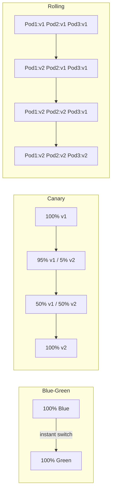
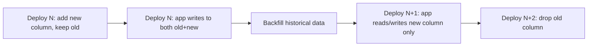
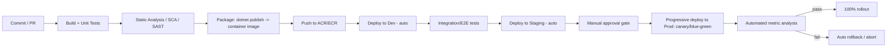
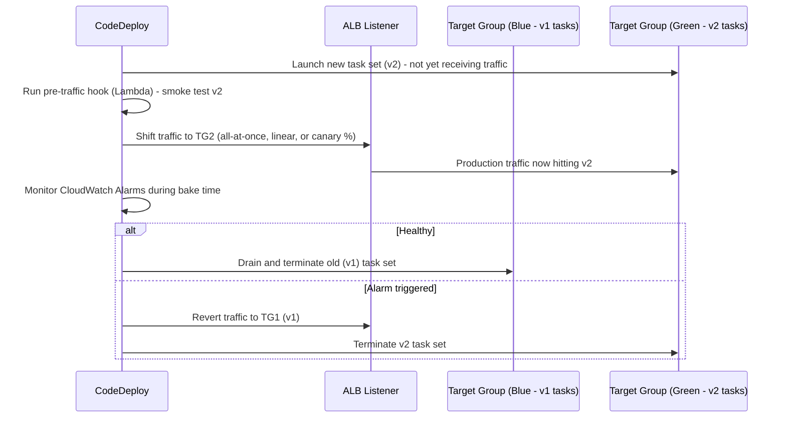

# Deployment Strategies — Interview Revision Notes

> Quick-revision Q&A derived from `P. Deployment-Strategies-Interview-Guide.md`. Covers every section of the source.

## Core Concepts

### What "Deployment Strategy" Actually Means

**Q: What three questions does every deployment strategy answer?**

A: How to ship changes without downtime, how to limit blast radius when something goes wrong, and how to roll back fast when it does. There's no single "best" strategy — the right choice trades off infrastructure cost, deployment speed, and risk exposure based on statefulness, compliance constraints, team maturity, and cost tolerance.

**Q: What is an interviewer really probing for when they ask about deployment strategies?**

A: Not just definitions ("define blue-green") but whether you've actually operated a production system through a bad deploy — traffic-shifting mechanics, session affinity, database compatibility windows, and observability requirements.

### Blue-Green Deployment

**Q: How does blue-green deployment work?**

A:
- Two identical, fully-provisioned environments: Blue (current production) and Green (new version).
- Green is deployed and tested in isolation while Blue serves all real traffic.
- Once Green is verified, traffic switches atomically (router/load balancer/DNS/CNAME swap).
- Rollback = flip traffic back to Blue.

**Q: What are the advantages and disadvantages of blue-green?**

A:
- Advantages: zero downtime at cutover, instant rollback (traffic switch, not redeploy), full pre-production validation of Green.
- Disadvantages: expensive (2x infra), needs a reliable traffic-switch mechanism (DNS TTL/caching delays are a common gotcha), and database/schema state is usually shared — the "two identical environments" model breaks down once there's a shared stateful backing store.

**Q: Show a real-world blue-green example using AWS Elastic Beanstalk.**

A:

```bash
# Deploy the new version in Green
eb create green-environment

# Swap Blue and Green environments (CNAME swap)
eb swap-environment-cnames --source-environment blue-environment --destination-environment green-environment
```

Scenario walkthrough (banking app): Blue (v1.0) live → v2.0 deployed into Green → automated + manual tests run against Green → if passes, swap traffic to Green → if v2.0 misbehaves, swap back to Blue instantly.

**Q: What follow-up questions should you expect after describing blue-green?**

A:
- "What happens to in-flight requests during the swap?" → connection draining / graceful shutdown needed.
- "What about the database?" → usually shared, so this is really blue-green at the app tier only.
- "How do you handle session state?" → sticky sessions break blue-green; prefer stateless services + distributed cache/session store.

### Canary Deployment

**Q: How does canary deployment work?**

A:
- Deploy the new version to a small slice of traffic (e.g., 5–10%).
- Monitor error rates, latency, business metrics.
- If healthy, progressively increase traffic (5% → 25% → 50% → 100%).
- If problems surface, halt and roll back that slice.

**Q: What are the advantages and disadvantages of canary?**

A:
- Advantages: minimizes blast radius, data-driven rollout using real production signals, gradual controlled exposure.
- Disadvantages: slower to reach 100% (multiple soak/bake stages), needs real traffic-splitting infrastructure plus solid observability at statistically meaningful sample sizes.

**Q: Give a real-world canary example and a Kubernetes implementation.**

A: Netflix rolling out a streaming feature: deploy v2.0 to 5% → monitor → bump to 50% → go to 100%.

```yaml
apiVersion: apps/v1
kind: Deployment
metadata:
  name: my-app
spec:
  replicas: 10
  selector:
    matchLabels:
      app: my-app
  template:
    metadata:
      labels:
        app: my-app
        version: canary
    spec:
      containers:
      - name: my-app
        image: my-app:v2.0
        ports:
        - containerPort: 80
```

Weighted traffic split via Ingress:

```yaml
apiVersion: networking.k8s.io/v1
kind: Ingress
metadata:
  name: my-app-ingress
spec:
  rules:
  - http:
      paths:
      - path: /my-app
        backend:
          service:
            name: my-app
            port:
              number: 80
        weight: 20 # Send 20% traffic to Canary
```

**Q: Is that Ingress YAML actually valid on vanilla Kubernetes?**

A: No. Plain Kubernetes `Ingress` (networking.k8s.io/v1) does not natively support a `weight` field — it's not part of the vanilla Ingress spec. Weighted canary routing is actually achieved via an ingress controller extension (e.g., NGINX's `nginx.ingress.kubernetes.io/canary-weight` annotation), a service mesh (Istio VirtualService weighted routing), or a progressive-delivery controller (Flagger, Argo Rollouts). The YAML shows correct *intent* but wouldn't work unmodified on stock Kubernetes.

**Q: What follow-up questions should you expect after describing canary?**

A:
- "How do you decide traffic split increments and bake time?" → SLO-based automated gates, not gut feel.
- "How do you pick which users see canary?" → random sampling vs. sticky-by-user-id (consistency matters for UX).
- "What's your automatic rollback trigger?" → error rate/latency SLO breach → auto-abort via a controller like Flagger/Argo Rollouts, not a human watching a dashboard.

### Rolling Deployment

**Q: How does rolling deployment work, and what's the catch on rollback?**

A:
- Old-version instances are replaced by new ones incrementally (e.g., Kubernetes `Deployment` default `RollingUpdate` with `maxSurge`/`maxUnavailable`).
- No second full environment needed — cheaper than blue-green.
- Rollback is not instant — you roll the same incremental process in reverse, time proportional to fleet size.
- Mid-rollout, two versions run simultaneously serving live traffic, so N/N+1 API and schema backward compatibility is mandatory during the transition window.
- Good default for stateless services where cost matters more than instant rollback.

### Comparison Table: Blue-Green vs Canary vs Rolling vs Recreate

**Q: How do Recreate, Rolling, Blue-Green, and Canary compare on cost, speed, rollback, and risk?**

A:

| Strategy | Infra Cost | Rollout Speed | Rollback Speed | Risk Exposure | Needs Traffic Splitting? | Typical Use Case |
|---|---|---|---|---|---|---|
| **Recreate** (stop old, start new) | Low | Fast | Slow (redeploy old) | High (downtime) | No | Dev/test environments, non-critical batch jobs |
| **Rolling** | Low–Medium | Medium | Medium (reverse rollout) | Medium | No (LB just drains) | Default for stateless microservices, cost-sensitive teams |
| **Blue-Green** | High (2x infra) | Fast cutover | Instant (flip traffic back) | Low (fully tested before switch) | Yes (router/DNS/LB swap) | Regulated/critical systems needing instant, clean rollback |
| **Canary** | Medium (extra small fleet) | Slow (staged) | Fast (stop rollout, drain canary) | Lowest (limited blast radius) | Yes (weighted routing) | High-traffic consumer apps, gradual validated rollout |



## Feature Flags / Feature Toggles

### What Is a Feature Toggle

**Q: What is a feature toggle and what does it decouple?**

A: A Feature Toggle (Feature Flag) decouples deployment from release — code ships to production dark (disabled) and is turned on independently (for specific users, percentages, or environments) without a redeploy. This underlies trunk-based development and continuous delivery: you can merge/deploy incomplete or risky work continuously as long as it's flag-guarded. It lets teams gradually roll out features, test in production without affecting everyone, and instantly disable a feature if an issue occurs.

### Why Use Feature Toggles

**Q: What are the main reasons to use feature toggles?**

A:
- Risk-free deployments — off by default, enabled progressively.
- Instant rollback — disable the flag instead of rolling back the whole deployment (much faster MTTR).
- A/B testing — enable for different cohorts and measure impact.
- Continuous delivery — ship incomplete work behind a flag, finish later, flip on when ready.

### Implementing Feature Toggles with LaunchDarkly in .NET

**Q: What are the steps to implement LaunchDarkly feature flags in a .NET app?**

A: Create a LaunchDarkly account/project and get the SDK key, install the SDK, configure the key, initialize the client, then use the toggle in a controller.

```bash
dotnet add package LaunchDarkly.ServerSdk
```

```json
{
  "LaunchDarkly": {
    "SdkKey": "your-launchdarkly-sdk-key"
  }
}
```

**Q: Is it safe to store the SDK key directly in `appsettings.json` like the example shows?**

A: No — never commit a real SDK key into `appsettings.json` in source control. In production, use Azure Key Vault, User Secrets (dev), or environment variables/App Configuration, and bind via `IConfiguration` — just don't check the literal key in.

**Q: How do you initialize the LaunchDarkly client and check a flag in .NET?**

A:

```csharp
using LaunchDarkly.Sdk;
using LaunchDarkly.Sdk.Server;
using Microsoft.Extensions.Configuration;
using System;

public class LaunchDarklyService : IDisposable
{
    private readonly LdClient _ldClient;

    public LaunchDarklyService(IConfiguration configuration)
    {
        var sdkKey = configuration["LaunchDarkly:SdkKey"];
        _ldClient = new LdClient(sdkKey);
    }

    public bool IsFeatureEnabled(string featureFlagKey, string userKey)
    {
        var user = User.WithKey(userKey);
        return _ldClient.BoolVariation(featureFlagKey, user, false); // Default is false
    }

    public void Dispose()
    {
        _ldClient.Dispose();
    }
}
```

**Q: What's the lifetime gotcha with `LdClient` in DI?**

A: `LdClient` maintains a persistent streaming connection and internal caches — it's expensive to construct and must be a singleton for the app's lifetime, registered as `services.AddSingleton<LaunchDarklyService>()`. Constructing a new `LdClient` per request exhausts connections and adds multi-second startup latency, since `LdClient` blocks briefly on initial connection by default.

**Q: How do you consume the flag in a controller?**

A:

```csharp
using Microsoft.AspNetCore.Mvc;

[Route("api/feature")]
[ApiController]
public class FeatureController : ControllerBase
{
    private readonly LaunchDarklyService _ldService;

    public FeatureController(LaunchDarklyService ldService)
    {
        _ldService = ldService;
    }

    [HttpGet("dark-mode")]
    public IActionResult GetFeatureStatus()
    {
        string featureFlagKey = "dark-mode";
        string userKey = "user-123"; // dynamic, from the authenticated user

        bool isEnabled = _ldService.IsFeatureEnabled(featureFlagKey, userKey);

        return Ok(new
        {
            message = isEnabled
                ? "Dark Mode is ENABLED for you!"
                : "Dark Mode is DISABLED for you."
        });
    }
}
```

### Testing Feature Toggles

**Q: How would you test a LaunchDarkly flag end to end?**

A:
1. In the LaunchDarkly dashboard, create a flag with key `dark-mode` and target a specific user (`user-123`).
2. Call the endpoint: `GET http://localhost:5000/api/feature/dark-mode`.
3. Enabled → `{ "message": "Dark Mode is ENABLED for you!" }`
4. Disabled → `{ "message": "Dark Mode is DISABLED for you." }`

### Real-World Use Cases

**Q: What are some real-world examples of feature flag usage?**

A:
- Facebook Dark Mode — limited rollout before general availability.
- Netflix UI updates — A/B testing UI variants across user segments.
- Amazon promotions — discounts scoped to Prime members only.

### Feature Flags in a Microservices Architecture

**Q: What cross-service problems do feature flags introduce in a microservices architecture, and how do you address them?**

A:
- Centralize flag evaluation — use a shared flag platform (LaunchDarkly, Azure App Configuration + Feature Management, Unleash, Split) so all services agree on flag state, targeting rules, and audit history.
- Propagate flag context consistently — pass the same targeting context (user ID, tenant, region) across a fanned-out request (header or trace context) so all services evaluate the flag identically; inconsistent evaluation (Service A shows new UI, Service B still validates the old contract) is a classic bug.
- Version/contract compatibility — a flag's "on" state can have a dependency graph across services; document and, where possible, enforce flag dependencies (prerequisite flags).
- Local caching + streaming updates — SDKs should cache flag values locally and receive push updates via streaming/polling, not call the flag service synchronously per request (avoids adding a network hop/SPOF to every request).
- Kill switches matter more here — a bad release in one service can cascade through the call graph; instantly disabling one feature avoids a coordinated multi-service rollback.
- Flag lifecycle/cleanup governance matters more at scale — dozens of services accumulating flags becomes a distributed technical-debt and security-audit problem.

### Feature Flag Types and Anti-Patterns

**Q: What are the different types of feature flags and their lifespans?**

A:

| Flag Type | Lifespan | Purpose |
|---|---|---|
| **Release flag** | Short (days–weeks) | Decouple deploy from release; removed after full rollout |
| **Experiment flag** (A/B) | Medium | Drive experimentation/analytics; removed after experiment concludes |
| **Ops / kill switch** | Long-lived | Circuit-breaker for a feature/dependency; kept permanently for operability |
| **Permission / entitlement flag** | Permanent | Gate features by plan/tier (e.g., Prime-only discounts) — business logic, not a deploy mechanism |

**Q: What are common feature-flag anti-patterns?**

A:
- Flag debt — never removing release flags after 100% rollout, leaving dead `if` branches and combinatorial testing explosion.
- Flags wrapping non-idempotent side effects (e.g., toggling mid-transaction after half the state is already written) — flags should gate behavior, not be flipped inside a unit of work.
- Testing only "on" and "off" in isolation, never in combination with other active flags — flag interaction bugs are a real production risk at scale.

## Intermediate Topics

### Zero-Downtime Database Migrations

**Q: Why is zero-downtime database migration such a commonly-missed but critical topic?**

A: Blue-green, canary, and rolling all assume the database is shared across old and new app versions during the transition window — a topic often skipped in notes that only cover app-tier strategies, and a favorite senior-level interview probe.

**Q: What is the expand/contract (parallel change) pattern?**

A:
1. Expand — add the new schema element (column/table) without removing or renaming anything old; both old and new app code must work against this schema.
2. Migrate/backfill — backfill data into the new structure, dual-write if needed (old code writes old+new, or a background job syncs).
3. Contract — once all instances run the new code and are verified, remove the old schema element in a later, separate deployment.



**Q: What are the concrete rules of thumb for schema changes mid-rollout?**

A:
- Never do a breaking rename in one step — always "add new" → "migrate" → "remove old" across multiple deploys.
- Additive changes (`ADD COLUMN` nullable, new table) are generally safe mid-rollout.
- Destructive changes (`DROP COLUMN`, `NOT NULL` without a default, renaming) must wait until 100% of the fleet runs code that no longer references the old shape.
- For EF Core: avoid `Database.Migrate()` running automatically on app startup in a multi-instance rolling deployment — concurrent instances racing to migrate can deadlock or corrupt state. Run migrations as a separate, single pre-deploy step (CI/CD migration job) before the new version receives traffic.
- Large table migrations (indexes, backfills) should be done online/incrementally (batched updates, `CREATE INDEX ONLINE`/concurrently) to avoid locking production tables.
- For blue-green: Blue and Green typically share the same database, so "blue-green for the database" is a much harder, separate problem (often solved via read replicas + cutover, or treating the DB as append-only during transition) — don't conflate app-tier blue-green with DB-tier blue-green.

### Rollback Strategy for Stateful Services

**Q: Rollback sounds trivial for stateless services — what's the harder senior question?**

A: What happens to state. Key concerns:

- Schema compatibility — rollback only works cleanly if the previous code version can still run against the current schema/data; destructive migrations must lag code deploys by a full contract cycle to preserve rollback safety.
- Message queue / event-driven state — if the new version changed a message schema (e.g., a new required Kafka/Service Bus field), rolling back the consumer without handling in-flight messages produced by the new version can cause deserialization failures; use schema versioning/tolerant readers (ignore unknown fields).
- Cache poisoning — if the new version wrote a new shape to a shared cache (Redis), rolling back code without invalidating those keys can crash old code; version cache keys (e.g., `user:v2:{id}`) so old and new don't collide.
- Idempotency for replays — rollback often means replaying/retrying operations; use idempotency keys (payment/order APIs) so retries don't double-charge or double-write.
- Stateful sets in Kubernetes — rolling back a `StatefulSet` differs fundamentally from a `Deployment`: ordered, one-at-a-time rollback, and you must check the persistent volume's data is still compatible with the older image.
- Feature-flag-first rollback — the fastest, safest "rollback" for many incidents is disabling the flag guarding the risky code path, not a full deployment rollback; use infra rollback as fallback for issues flags can't cover (bad image, not bad logic).

### Deployment in Kubernetes / AKS / EKS

**Q: What Kubernetes/AKS/EKS platform details does a senior interview expect beyond the raw YAML?**

A:
- Deployment object — default strategy is `RollingUpdate` with configurable `maxSurge` (extra pods above desired count) and `maxUnavailable` (how many can be down); tuning these trades rollout speed vs. resource headroom vs. availability.
- Readiness vs. liveness probes — rolling updates only route traffic to pods passing readiness checks; a pod can be alive but not ready. Misconfigured probes are the #1 cause of "rolling deploy caused a brief outage" — traffic sent to unready pods, or `livenessProbe` killing healthy-but-slow-starting .NET pods (cold JIT/ReadyToRun startup) before they're ready.
- PodDisruptionBudget (PDB) — guarantees a minimum healthy replica count during voluntary disruptions (node drains, cluster upgrades), separate from but interacting with the deployment strategy.
- AKS: integrates with Azure Load Balancer / Application Gateway Ingress Controller (AGIC) for weighted/canary routing; Azure DevOps and GitHub Actions both have first-class AKS deploy tasks (`kubectl`, Helm, `azure/k8s-deploy`).
- EKS: typically paired with AWS ALB Ingress Controller or App Mesh/Istio for traffic shaping; often driven via CodeDeploy's native Blue/Green and Canary support for ECS/EKS, or Argo Rollouts.
- Both AKS/EKS support Flagger or Argo Rollouts as progressive-delivery controllers layered on raw Kubernetes primitives — what most real canary/blue-green implementations use in 2026, rather than hand-rolled Ingress weight annotations.
- Helm / Kustomize — templating for environment-specific manifests; avoid config drift via a single source of templated manifests + environment-specific values files, promoted through environments via CI, not hand-edited per environment.

## Advanced Topics

### Progressive Delivery

**Q: What is "progressive delivery" and why should you use that term in an interview?**

A: The umbrella term (coined by Weaveworks/James Governor) for canary + feature flags + automated analysis combined. Using it signals currency rather than treating canary/blue-green/flags as three unrelated ideas.

- Automated analysis/gating — Flagger or Argo Rollouts watch Prometheus/Datadog metrics (error rate, latency, business metrics) during a canary stage and automatically promote or abort, removing the human-watching-a-dashboard step.
- Combines with feature flags — canary-deploy the infrastructure (new pods) while separately flag-gating the feature — two independent risk levers.
- Traffic mirroring/shadowing — send a copy of production traffic to the new version without returning its response to the user, validating behavior under real load with zero user-facing risk.

**Q: How is progressive delivery different from canary?**

A: Canary is a technique; progressive delivery is the practice of automating canary analysis, flags, and rollback decisions end-to-end so releases require no manual gate-watching.

### GitOps

**Q: What is GitOps and why does it matter for deployment strategy?**

A:
- Definition — desired infra/deployment state is declared in Git (manifests, Helm values, Kustomize overlays); a controller (ArgoCD, Flux) continuously reconciles the live cluster to match Git, rather than a CI pipeline imperatively running `kubectl apply`.
- Why it matters — Git becomes the single audit trail and rollback mechanism: a bad deploy's rollback is literally `git revert` on the manifest, and the GitOps controller reconciles the cluster automatically — a stronger, more auditable story than "re-run the old pipeline."
- Push vs. pull model — traditional CI/CD pushes changes to the cluster (CI holds cluster credentials — a security surface); GitOps controllers pull from Git and reconcile from inside the cluster, so no external system needs prod cluster credentials.
- Drift detection — GitOps continuously detects and can auto-correct manual `kubectl` changes made outside Git ("configuration drift") — valuable in regulated environments.
- Ties into progressive delivery — Argo Rollouts integrates with ArgoCD to make canary/blue-green a GitOps-native, declarative resource (`Rollout` CRD replacing `Deployment`).

### Deployment Strategies: Microservices vs Monolith

**Q: How do deployment concerns differ between monolith and microservices?**

A:

| Aspect | Monolith | Microservices |
|---|---|---|
| **Unit of deployment** | Whole app, one artifact | Each service independently |
| **Blue-green cost** | One large environment duplicated (simpler, but expensive to double) | Can blue-green per-service (cheaper per-service, but coordinating N services' versions is complex) |
| **Canary granularity** | Coarse — canary the whole app | Fine-grained — canary one service without touching others |
| **Contract/versioning risk** | Low (single deployable, internal calls are in-process) | High — every service boundary needs backward/forward-compatible contracts during independent rollouts |
| **Rollback blast radius** | All-or-nothing rollback of the whole app | Can roll back just the offending service |
| **Database migration coordination** | Single DB, single migration path (still needs expand/contract) | Potentially many DBs (database-per-service) — independent migrations, but cross-service data consistency during partial rollout needs sagas/eventual consistency |
| **Deployment frequency** | Often lower (bigger, riskier releases) | Higher (small, frequent, isolated releases) |
| **Tooling complexity** | Lower — one pipeline | Higher — orchestration, service mesh, distributed tracing become near-mandatory |

**Q: Do microservices change the deployment strategies themselves?**

A: No — blue-green/canary/rolling all still apply; microservices multiply the coordination problem instead: independent deploy cadence per service means you must design for N and N+1 version compatibility continuously, not just during a deploy window, because at any moment some services are ahead of others.

### Dark Launches / Shadow Traffic / A-B Testing at Infrastructure Level

**Q: What is a dark launch, and how does it differ from canary and feature flags?**

A: A dark launch runs new code in production without exposing its output to real users — e.g., running a new recommendation engine in parallel, logging its results, comparing offline against the current engine, without ever showing output to a user. It's a validation technique, distinct from canary (which does expose real users) and distinct from a feature flag (an on/off switch, not a shadow comparison).

**Q: What is traffic mirroring/shadowing at the infrastructure level?**

A: The load balancer/service mesh duplicates a request to both old and new versions; only the old version's response is returned to the client. Istio and some API gateways support this natively (`mirror` in a VirtualService).

**Q: How does A/B testing differ from canary?**

A: Canary is a risk-mitigation rollout mechanism — temporary, converges to 100% or 0%. A/B testing is an experimentation mechanism — can run indefinitely, both variants are "correct," and you're measuring a business metric, not safety. Interviewers listen for this distinction.

### CI/CD Pipeline Design for .NET (Azure DevOps / GitHub Actions)

**Q: Sketch a concrete, current CI/CD pipeline shape for .NET.**

A:



**Q: What principles make this pipeline shape solid?**

A:
- Immutable artifacts — build once, promote the same container image/artifact through Dev → Staging → Prod; never rebuild per environment (avoids "works in staging, different bits in prod").
- Environment-specific config, not environment-specific builds — `appsettings.{Environment}.json`, Azure App Configuration, or env vars/K8s ConfigMaps/Secrets injected at deploy time.
- Approval gates — Azure DevOps environments / GitHub Actions environments support required reviewers before a prod deploy job runs, standard for regulated .NET shops (banking, healthcare).
- Migrations as a pipeline stage — run once, before the new version receives traffic.

### AWS-Specific Deployment Mechanics

**Q: Why does this guide add an AWS-specific section, and what's the framing?**

A: Everything above (blue-green, canary, rolling, progressive delivery, GitOps) is framework-agnostic in principle, but the concrete implementations lean entirely Kubernetes-flavored. Since the target cloud is AWS, this section grounds the same strategies in AWS-native mechanics and connects them to Terraform/CDKTF as the actual IaC tool.

#### AWS CodeDeploy — Blue/Green for EC2, ECS, and Lambda

**Q: How does AWS CodeDeploy's blue/green mechanic differ across EC2, ECS, and Lambda targets?**

A:

| Target | What "Blue" and "Green" mean | Traffic-shift mechanism | Rollback |
|---|---|---|---|
| **EC2 (in-place or blue/green)** | Blue = existing ASG/instance fleet; Green = a freshly provisioned, fully-provisioned replacement fleet | CodeDeploy re-registers instances behind the existing ELB/Target Group, or swaps Target Groups entirely | Terminate Green fleet, Blue fleet (still running until cutover completes) keeps serving |
| **ECS** | Blue = current running task set (existing task definition revision); Green = new task set (new task definition revision) on the same service | ALB listener rule shifts traffic between two Target Groups (one per task set) — can be all-at-once, linear, or canary | CodeDeploy automatically reroutes the ALB listener back to the original (Blue) Target Group |
| **Lambda** | Blue = currently aliased function version; Green = newly published function version | Lambda alias traffic shifting — the alias's weighted routing config shifts a percentage of invocations to the new version | Alias weight reverts to 100% on the original version |

**Q: How does CodeDeploy automatically abort a bad deployment?**

A: For all three targets, CodeDeploy can be wired to CloudWatch Alarms (error rate, latency) so a bad deployment automatically halts and rolls back mid-shift without a human watching a dashboard — the direct AWS-native analog to Flagger/Argo Rollouts' automated canary analysis.

#### ECS Blue/Green Deployments in Detail

**Q: Walk through the ECS blue/green mechanics one level deeper.**

A:



- ECS supports this natively via the `CODE_DEPLOY` deployment controller on the service, as opposed to the default `ECS` rolling-update controller (ECS's own equivalent of Kubernetes `RollingUpdate` — no second Target Group, no traffic-shift granularity, just incremental task replacement).
- Traffic-shift options mirror Flagger/Argo Rollouts: Canary (e.g., 10% for N minutes, then 100%), Linear (fixed percentage increments on a timer), or AllAtOnce (full cutover relying on pre/post-traffic hooks and alarms for safety).
- Pre-traffic and post-traffic Lambda hooks let you run validation before real traffic reaches Green, and again after the shift completes — the AWS-native equivalent of Progressive Delivery's automated analysis gate.

#### Route 53 Weighted Routing for Gradual Traffic Shifting

**Q: How does Route 53 weighted routing provide DNS-layer traffic shifting, and what's the catch?**

A:

```
Record: api.example.com
  → Weighted record A (Blue stack ALB)   weight = 90
  → Weighted record B (Green stack ALB)  weight = 10
```

- Route 53 resolves each DNS query probabilistically per the weight ratio — over enough queries, ~10% of new connections land on Green.
- The same DNS TTL/caching gotcha flagged elsewhere in the guide applies: clients/resolver caches that already resolved and cached the Blue IP won't re-resolve until TTL expires, so a weighted Route 53 shift is gradual and "fuzzy" at the edges, not a precise instant percentage — materially different from an ALB-layer or service-mesh-layer split, which shifts existing connections more precisely and immediately.
- Often paired with Route 53 health checks so a weighted record is automatically pulled from rotation if the target ALB/endpoint fails health checks — a coarser, DNS-layer safety net compared to CodeDeploy's CloudWatch-Alarm-driven abort.
- Typical use case: cross-region blue-green (e.g., shifting from `us-east-1` to a newly-deployed `us-west-2` stack) where there's no single shared load balancer to place a canary/blue-green controller in front of.

#### Terraform/CDKTF Driving Deployment Orchestration

**Q: Does Terraform/CDKTF perform the blue-green deploy itself?**

A: No, not directly. Terraform is fundamentally a provisioning tool (declarative infrastructure state), not a deployment orchestrator like CodeDeploy/Argo Rollouts. Terraform/CDKTF provisions the deployment machinery itself — the CodeDeploy Application/DeploymentGroup resources, the ECS service's `deployment_controller` block, the ALB listener rules and both Target Groups, the Lambda alias and its `routing_config` weighted-alias block, and the Route 53 weighted record sets. In short: Terraform/CDKTF sets up the rails; CodeDeploy (or a CI/CD pipeline step) drives the train along them on each release.

```hcl
resource "aws_codedeploy_deployment_group" "ecs_bluegreen" {
  app_name               = aws_codedeploy_app.order_api.name
  deployment_group_name  = "order-api-dg"
  service_role_arn       = aws_iam_role.codedeploy.arn
  deployment_config_name = "CodeDeployDefault.ECSLinear10PercentEvery1Minute"

  deployment_style {
    deployment_type   = "BLUE_GREEN"
    deployment_option  = "WITH_TRAFFIC_CONTROL"
  }

  blue_green_deployment_config {
    terminate_blue_instances_on_deployment_success {
      action                           = "TERMINATE"
      termination_wait_time_in_minutes = 5
    }
  }

  ecs_service {
    cluster_name = aws_ecs_cluster.main.name
    service_name = aws_ecs_service.order_api.name
  }

  load_balancer_info {
    target_group_pair_info {
      target_group {
        name = aws_lb_target_group.blue.name
      }
      target_group {
        name = aws_lb_target_group.green.name
      }
      prod_traffic_route {
        listener_arns = [aws_lb_listener.https.arn]
      }
    }
  }
}
```

**Q: What is the common junior mistake regarding Terraform and deployments, and what's the correct mental model?**

A: Terraform does not itself perform the live traffic shift or watch CloudWatch Alarms mid-deployment — that's CodeDeploy's runtime job once a new task definition/Lambda version triggers a deployment. Running `terraform apply` on every code release (re-applying the whole stack per deploy) is the wrong mental model. The correct split: Terraform/CDKTF manages the infrastructure (rarely changes), while the CI/CD pipeline (e.g., GitHub Actions) triggers a CodeDeploy deployment or updates an ECS task definition/Lambda alias on each release — infrastructure changes and application deployments are two different change cadences using two different mechanisms.

**Q: What's the CDKTF-specific angle worth mentioning?**

A: CDKTF lets you express the same HCL-equivalent resources in TypeScript/C#, so a .NET-background candidate can build a reusable "blue-green ECS service" construct/module shared across services, rather than copy-pasting the CodeDeploy/Target-Group/Listener HCL block per repo — the same DRY argument for reusable GitHub Actions workflows applies structurally to CDKTF constructs.

## Best Practices

**Q: What are the key deployment-strategy best practices to cite in an interview?**

A:
- Automate the rollback decision, don't rely on humans watching dashboards — wire canary/progressive delivery to SLO-based automated analysis (Flagger, Argo Rollouts, or custom pipeline gates on Application Insights/Datadog metrics).
- Decouple deploy from release using feature flags wherever risk is in logic; reserve deployment-strategy rollback (blue-green/canary abort) for risk in runtime/infrastructure (bad image, crash loops, resource exhaustion).
- Design for N/N+1 compatibility always — rolling, canary, or blue-green all imply two versions coexist temporarily; API contracts and DB schemas must tolerate this, not just "the deploy day."
- Treat database migrations as a separate, ordered pipeline stage using expand/contract, never bundled into app startup in a multi-instance deployment.
- Instrument before you need it — canary/progressive delivery is worthless without per-version metrics (error rate, latency, business KPIs) segmented by version/cohort.
- Practice rollback, don't just plan it — regularly exercise the rollback path (game days/chaos exercises) so it's proven under pressure.
- Keep flag lifecycle hygiene — track flag age, alert on stale flags, remove release flags promptly after full rollout.
- Prefer immutable infrastructure/artifacts — containers/images built once and promoted, not mutated in place.

## Common Pitfalls

**Q: What are the common pitfalls to call out in a deployment-strategy interview?**

A:
- Using DNS-based blue-green switching and forgetting DNS TTL/client-side caching means "instant" cutover isn't actually instant for all clients.
- Running EF Core auto-migrations on every instance's startup during a rolling deployment — race conditions and partial-migration states.
- Confusing canary (risk mitigation, converges to 0/100%) with A/B testing (experimentation, can run indefinitely).
- Treating feature flags as free — accumulating flag debt, untested flag combinations, and flags left in code long after the experiment/rollout ended.
- Assuming blue-green gives you a clean database story "for free" — it doesn't; the DB is usually shared and needs its own expand/contract discipline.
- Misconfigured Kubernetes readiness probes causing rolling updates to send traffic to unready pods (brief user-facing errors during a deploy that was supposed to be zero-downtime).
- Rolling back application code without considering schema/message/cache compatibility with the older version — the rollback itself causes an outage.
- Copy-pasting Ingress YAML with a bare `weight` field and assuming vanilla Kubernetes Ingress supports canary weighting out of the box — it doesn't; you need an ingress controller extension, mesh, or progressive-delivery controller.

## Sample Interview Q&A

**Q: Walk me through how you'd deploy a breaking database schema change with zero downtime.**

A: Never ship the breaking change in one step. Use expand/contract: (1) add the new column/table additively while old code keeps working; (2) deploy new app code that writes to both old and new (dual-write) or backfills asynchronously; (3) once 100% of instances run code that only needs the new shape, deploy again to stop writing to the old column; (4) in a final, later deploy, drop the old column. Each step is independently deployable and rollback-safe because the schema is always a superset that both old and new code can tolerate.

**Q: Blue-green deployment gives you instant rollback — what's the catch?**

A: The instant rollback claim is really about the app tier only. If Blue and Green share the same database (the common case), any data written by Green that's incompatible with Blue's expectations (new schema, new message formats) means "switching traffic back" doesn't actually undo that state. True instant, safe rollback requires the schema/API to already be backward compatible — the traffic switch is the easy part; the compatibility discipline is the hard part.

**Q: When would you choose canary over blue-green, or vice versa?**

A: Canary when you want the smallest possible blast radius and have strong per-cohort metrics/traffic-splitting infrastructure — good for high-traffic consumer services where a small percentage of affected users is an acceptable trade for gradual confidence-building. Blue-green when you need a clean, fully-tested cutover with instant total rollback and can tolerate (or already have) duplicate infrastructure — common in regulated environments (e.g., banking) where partial exposure to a broken version for any user is unacceptable, but a full pre-switch validation window is achievable. Cost-sensitive teams with mature CI/CD often default to rolling deployments instead, accepting slightly slower rollback for much lower infra cost.

**Q: How do feature flags change your incident response?**

A: They give you a sub-second "rollback" lever that doesn't require touching the deployment pipeline at all — disable the flag, and the risky code path stops executing immediately for all users, no redeploy, no waiting for a rolling/canary process to reverse. This should typically be your first response for a logic bug behind a flag; full deployment rollback remains necessary for issues the flag doesn't cover (bad binary, crash loops, infra misconfiguration).

**Q: How does feature-flag evaluation change in a microservices architecture versus a monolith?**

A: In a monolith, flag evaluation is a single in-process call with consistent state. In microservices, the same logical request may hit multiple services, and each needs to evaluate the flag consistently for that request — requiring propagation of targeting context (user/tenant ID) across service boundaries (headers or trace context), and reliance on a centralized flag platform so all services agree on current flag state rather than each polling/caching independently and drifting out of sync.

**Q: What would you monitor to decide whether to promote or abort a canary?**

A: Golden signals segmented by version: error rate, p95/p99 latency, saturation (CPU/memory/thread pool), plus at least one business metric relevant to the feature (conversion rate, checkout completion) — compared statistically between canary and baseline cohorts, not eyeballed. Ideally wired to an automated analysis tool (Flagger/Argo Rollouts) with defined SLO thresholds that auto-abort, rather than a human on-call watching a dashboard during the bake window.
