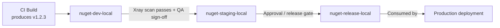

# JFrog Artifactory — Interview Revision Notes

> Quick-revision Q&A derived from `Q. JFrog-Artifactory-Interview-Guide.md`. Covers every section of the source.

## Core Concepts

### What is JFrog Artifactory

**Q: What is JFrog Artifactory, in one sentence?**

A: A universal binary repository manager that stores, versions, and distributes build artifacts (packages, containers, libraries) in a secure, scalable, access-controlled way — the single source of truth for "what got built and what got shipped" between source control and production.

**Q: What's the senior-level framing an interviewer wants to hear, beyond "it stores NuGet packages"?**

A: Artifactory is the artifact provenance and supply-chain control point. Every binary reaching production should be traceable back to the exact commit, build, and dependency set that produced it — it's a governance/traceability tool, not just storage.

### Why Use It

**Q: Why use Artifactory instead of pointing builds directly at public registries like NuGet.org/npmjs.com?**

A:
- Supply-chain risk — a public registry outage, yanked package, or malicious/typosquatted dependency can break or compromise your build; a private proxy/cache gives control and a fallback.
- Compliance — regulated industries need an auditable, access-controlled artifact store; production builds can't point directly at the public internet.
- Performance — caching avoids re-downloading the same package from the internet on every build, which matters hugely at CI scale.

**Q: What core capabilities does Artifactory provide?**

A:
- Central repository for binaries, Docker images, Helm charts, and other build artifacts.
- Multi-package-type support: Maven, npm, NuGet, PyPI, Docker, Helm, RPM, etc. — one platform instead of many single-purpose registries.
- Caching/proxying of external repositories (Maven Central, npm registry, NuGet.org, Docker Hub).
- CI/CD integrations: Jenkins, GitHub Actions, GitLab CI/CD, Azure DevOps.
- Security: access control, vulnerability scanning (Xray), license compliance.
- Deployment options: Cloud (SaaS) or On-Premises (self-hosted).

### Key Features

**Q: What are Artifactory's key feature areas?**

A:
1. Repository Management — local, remote, virtual repositories; fine-grained access control per repository/path via permission targets.
2. Universal Binary Repository — Maven, Gradle, npm, NuGet, Docker, PyPI, etc., each with native dependency-management semantics.
3. Build Integration — Jenkins, Azure DevOps, GitHub Actions, Bitbucket Pipelines; artifact storage, versioning, build-info capture.
4. Security & Compliance — Xray scanning for vulnerabilities/licenses; access tokens, LDAP, SSO, RBAC.
5. High Availability & Scalability — multi-node clustering, geo-replication for distributed teams.

## Repository Types

### Local, Remote, Virtual Repositories

**Q: What's the difference between local, remote, and virtual repositories?**

A:
- Local — stores internally developed/built artifacts (e.g., a NuGet repo storing your team's `.nupkg` files); your CI pipeline pushes to it.
- Remote — a proxy/cache for an external repository (e.g., NuGet.org, npm registry); Artifactory itself pulls-through and caches, read-only to consumers.
- Virtual — aggregates multiple local + remote repos behind one URL; it's a routing/aggregation layer, not physical storage.

**Q: Which repository type should developers/CI actually point at, and why?**

A: Always a virtual repository, never local or remote directly. This gives one stable URL/feed regardless of how backing repos are reorganized later, and is what enables transparent promotion and proxying.

### Resolution Order in Virtual Repositories

**Q: How does a virtual repository resolve a request, and why does resolution order matter?**

A: It checks member repositories in a configured order — local repos first is the typical/recommended pattern, then remote/cached repos. This matters for:
1. Correctness — if an internal package name collides with a public one, resolution order decides which wins.
2. Dependency confusion attacks — an attacker publishes a malicious package on a public registry with the same name as your internal package; if the virtual repo checks remote before local (or doesn't scope names), the build can silently pull the attacker's package.

**Q: How do you mitigate dependency confusion attacks in Artifactory?**

A:
- Always resolve local repos before remote in the virtual repo configuration.
- Use scoped/prefixed internal package names (e.g., `Contoso.*`) unlikely to collide with public names.
- Consider include/exclude patterns on remote repositories to block your internal namespace from ever being resolved externally.

```mermaid
flowchart LR
    Dev[Developer / CI Build] -->|nuget restore| VR[Virtual Repo: nuget-virtual]
    VR --> LR[Local Repo: nuget-local\n(internal packages)]
    VR --> RR[Remote Repo: nuget-remote\n(proxy/cache of NuGet.org)]
    RR -->|cache miss| Ext[(NuGet.org)]
    LR -->|checked first| Result[Package returned to build]
    RR -->|checked if not found locally| Result
```

### NuGet-Specific Repository Setup for .NET Teams

**Q: How would you set up NuGet repositories for a .NET shop in Artifactory?**

A:
- Create a NuGet local repo (e.g., `nuget-local`) for artifacts your teams publish.
- Create a NuGet remote repo (e.g., `nuget-remote`) pointing at `https://api.nuget.org/v3/index.json` to proxy/cache public packages.
- Create a NuGet virtual repo (e.g., `nuget`) combining both — this is the single feed URL every `NuGet.Config` and CI job should reference.

**Q: What does a typical `NuGet.Config` pointing at Artifactory look like?**

A:

```xml
<?xml version="1.0" encoding="utf-8"?>
<configuration>
  <packageSources>
    <clear />
    <add key="corp-artifactory" value="https://artifactory.example.com/artifactory/api/nuget/v3/nuget" />
  </packageSources>
  <packageSourceCredentials>
    <corp-artifactory>
      <add key="Username" value="%ARTIFACTORY_USER%" />
      <add key="ClearTextPassword" value="%ARTIFACTORY_API_KEY%" />
    </corp-artifactory>
  </packageSourceCredentials>
</configuration>
```

**Q: How do you push a package to Artifactory via the dotnet CLI?**

A:

```bash
dotnet nuget push my-package.1.0.0.nupkg -s corp-artifactory -k %ARTIFACTORY_API_KEY%
```

**Q: NuGet v2 vs v3 protocol endpoint in Artifactory — which should you use?**

A: Always prefer v3 (`api/nuget/v3/<repo>`) — it's JSON-based and faster, and is what modern `dotnet` CLI tooling expects. The legacy v2 endpoint is slower and mainly there for legacy `nuget.exe` compatibility.

## Using Artifactory in a Pipeline

### Manual Upload/Download Examples

**Q: How do you manually upload a Maven artifact to Artifactory via cURL?**

A:

```bash
curl -u user:password -T my-app.jar \
  "http://artifactory.example.com/artifactory/libs-release-local/com/myapp/my-app/1.0.0/my-app-1.0.0.jar"
```

**Q: How do you pull a Docker image from Artifactory?**

A:

```bash
docker login artifactory.example.com
docker pull artifactory.example.com/my-repo/my-image:latest
```

### JFrog CLI

**Q: How do you install, configure, and upload with the JFrog CLI?**

A:

```bash
# Install
curl -fL https://getcli.jfrog.io | sh

# Configure credentials (interactive)
./jfrog config add

# Upload an artifact
./jfrog rt upload "build/*.jar" libs-release-local/
```

**Q: Why prefer the JFrog CLI over raw `curl`/`docker` commands in pipelines?**

A: It handles retries/checksums, supports build-info collection (`jfrog rt build-collect-env`, `build-publish`), and integrates with Xray scanning (`jfrog rt build-scan`) — one consistent tool across package types.

### GitHub Actions Example

**Q: What does a basic GitHub Actions workflow uploading to Artifactory look like?**

A:

```yaml
name: Build and Deploy to JFrog
on: push

jobs:
  build:
    runs-on: ubuntu-latest
    steps:
      - name: Checkout Code
        uses: actions/checkout@v3

      - name: Setup JFrog CLI
        run: |
          curl -fL https://getcli.jfrog.io | sh
          ./jfrog config add my-artifactory --url=https://artifactory.example.com --user=${{ secrets.ARTIFACTORY_USER }} --password=${{ secrets.ARTIFACTORY_PASSWORD }}

      - name: Build and Upload Artifact
        run: |
          ./jfrog rt upload "dist/*.jar" my-repo/
```

**Q: What's wrong with using `--password` with a raw username/password in this example, and what's the better approach?**

A: It's functionally correct but not best practice — a long-lived secret sits in CI. Prefer the official `jfrog/setup-jfrog-cli` GitHub Action, which supports OIDC-based token exchange so no long-lived secret is stored in GitHub at all.

### Azure DevOps / dotnet CLI Integration

**Q: What are the two common patterns for integrating Artifactory with Azure DevOps in a .NET shop?**

A:
1. Native Azure Artifacts + Artifactory as upstream — an Azure Artifacts feed configured with Artifactory's NuGet virtual repo as an upstream source (less common, adds a hop).
2. Direct Artifactory integration (typical enterprise pattern) — use the JFrog Azure DevOps extension (marketplace task) or plain CLI steps in YAML.

**Q: What does a direct Azure DevOps YAML integration with Artifactory look like?**

A:

```yaml
steps:
  - task: NuGetAuthenticate@1
  - script: |
      dotnet restore --source https://artifactory.example.com/artifactory/api/nuget/v3/nuget
      dotnet build
      dotnet nuget push "**/*.nupkg" -s https://artifactory.example.com/artifactory/api/nuget/v3/nuget -k $(ARTIFACTORY_API_KEY)
    displayName: 'Restore, Build, Push to Artifactory'
```

**Q: How do you avoid hardcoding the API key in Azure DevOps YAML?**

A: Use Azure DevOps variable groups backed by Azure Key Vault, or service connections, injected as pipeline secrets/masked variables — never committed to the repo.

## Intermediate Topics

### Artifact Promotion Between Environments

**Q: How do you promote a build from dev to staging to production without rebuilding it?**

A: Follow "build once, promote many" — you never rebuild the same binary per environment; you build it once and move/copy/tag that exact artifact through repositories representing pipeline stages. This guarantees what's tested is exactly what ships, with no "works in staging, different binary in prod" drift.

**Q: What's a typical promotion repo layout?**

A: `nuget-dev-local` → `nuget-staging-local` → `nuget-release-local` (or property/tag-based promotion within a single repo using metadata like `promotion.status=released`).



**Q: What mechanisms actually perform promotion, and what can gate it?**

A:
- `jfrog rt build-promote` (JFrog CLI) or the Promotion API (`POST /api/build/promote/{buildName}/{buildNumber}`) moves/copies artifacts and their build-info between repos, optionally adding properties.
- Promotion can be gated on Xray scan results (no critical CVEs) and/or manual approval — this is how release governance is implemented without re-running the build.
- Because it's the same physical artifact (same checksum/SHA256) moving through the pipeline, you get true immutability guarantees, critical for audits ("prove that what's in prod is what was scanned and approved").

### Retention and Cleanup Policies

**Q: Why do retention/cleanup policies matter for Artifactory?**

A: Local repos accumulate snapshot/pre-release builds and cached remote artifacts indefinitely by default, driving storage cost and slowing searches/indexing.

**Q: What approaches exist for retention and cleanup?**

A:
- Retention/cleanup policies (native feature in modern Artifactory versions) — e.g., "delete artifacts older than N days with no downloads in the last M days" for non-release repos.
- AQL (Artifactory Query Language)-driven cleanup scripts — classic/portable approach, run on a schedule (Jenkins job or JFrog Pipelines):

```sql
items.find({
  "repo": "nuget-dev-local",
  "created": {"$before": "30d"}
})
```

  then feed the result set into a delete operation.
- Remote repo cache eviction — cached artifacts evicted on an unused-for-N-days basis, independent of local-repo retention; pure cache hygiene, not compliance.
- Keep release repos exempt — cleanup policies should almost always exclude `*-release-local` repos; only prune dev/snapshot/staging repos.
- Consider legal/compliance retention minimums (e.g., SOX) before deleting anything from a release/audit-relevant repo — retention should be a deliberate, documented decision.

### Build-Info, Provenance, and SBOM

**Q: What is "build-info" in Artifactory?**

A: A JSON blob Artifactory captures per build: artifacts produced, dependencies resolved (with checksums), the CI job/VCS revision that produced it, environment variables, and linked issues/commits. Published via `jfrog rt build-publish` or automatically via the JFrog CLI's build-aware upload/download commands.

**Q: What does build-info enable, and how does it relate to SBOM and provenance?**

A:
- Powers promotion, build comparison ("what changed between build 41 and 42"), and full traceability from a running production binary back to source commit.
- SBOM (Software Bill of Materials) — Xray/Artifactory can generate SBOMs (CycloneDX/SPDX format) from build-info + dependency graph; increasingly a hard compliance requirement for vendors selling into government/enterprise customers.
- Provenance — build-info + SBOM + signing gives a full chain of custody: source commit → build → dependencies resolved → artifact produced → scan results → promotion history → deployment. This is what SLSA (Supply-chain Levels for Software Artifacts) framework compliance requires, and a live topic given supply-chain attacks (SolarWinds-style incidents, npm/PyPI compromises).

## Advanced Topics

### JFrog Xray — Security & License Scanning

**Q: How does Xray actually scan artifacts, mechanically?**

A: It performs recursive dependency-graph analysis — it unpacks the artifact and walks the full transitive dependency tree, matching each component against a vulnerability database (CVEs) and a license database.

**Q: What are the two Xray integration points?**

A:
1. Repository-level scanning — continuously scans everything landing in a watched repo, catching newly-disclosed CVEs in artifacts already stored (not just at build time).
2. Build-level scanning (`jfrog rt build-scan`) — scans a specific build's dependency graph in CI, and can fail the pipeline on policy violations (critical CVE, disallowed license like GPL in a proprietary product).

**Q: Why does repo-level scanning matter more than people expect?**

A: A package can be clean when you build against it, then a CVE gets disclosed for that exact version months later. Xray's continuous repo-level scanning re-flags artifacts already sitting in your repos — something a build-time-only check (e.g., a one-off `dotnet list package --vulnerable`) would never catch.

**Q: How does Xray handle license compliance, and what licensing gotcha should you know?**

A: Xray can flag/block copyleft licenses (GPL, AGPL) incompatible with closed-source products — a common trick question is "how do you stop someone accidentally pulling in a GPL-licensed library?" Gotcha: Xray is a paid add-on, not included in free/base Artifactory tiers.

### Immutability, Versioning, and Reproducible Builds

**Q: How should release repositories be configured with respect to overwrites?**

A: Local repositories should generally be immutable for release artifacts — once `my-app-1.0.0.nupkg` is published, it should never be overwritten with different bytes under the same version number, enforced by repo configuration (disallow overwrite) and semantic versioning discipline.

**Q: How do snapshot/pre-release repos differ?**

A: Snapshot/pre-release repos (Maven `-SNAPSHOT`, NuGet `-beta`/`-ci` suffixes) are expected to be mutable/overwritable — that's the whole point of a snapshot.

**Q: Why does immutability matter, and what enforces it?**

A: If `1.0.0` can silently change contents, you lose the ability to reason about what's deployed anywhere — cache poisoning becomes possible (one build server caches "old" 1.0.0 while another pulls "new" 1.0.0), and rollback becomes unreliable. Checksums (SHA-1/SHA-256) stored per artifact let Artifactory and consumers detect tampering or accidental overwrite, tying directly into supply-chain integrity verification.

**Q: What is a "reproducible build" and does Artifactory guarantee it?**

A: The ideal that rebuilding from the same commit + locked dependency versions produces a bit-for-bit identical artifact. Artifactory doesn't guarantee this itself (it's a build-tooling concern — deterministic compilation, locked lockfiles/`packages.lock.json`), but immutable storage + build-info is the infrastructure piece that makes verifying reproducibility possible.

### Access Tokens, Identity, and Securing Feeds

**Q: API Keys vs Access Tokens vs OIDC federation — what's the current best-practice progression?**

A:
- API Keys (legacy) — deprecated by JFrog in favor of access tokens; migrate off them if seen in older docs/examples.
- Access Tokens — scoped, expiring, revocable JWT-based tokens scoped to a specific identity, repo, and permission set — the modern recommended credential for CI.
- Platform-native identity mapping / OIDC — current best practice: configure an OIDC trust relationship between Artifactory and the CI provider (GitHub Actions, Azure DevOps) so the pipeline exchanges a short-lived OIDC token for a short-lived Artifactory access token at runtime — no long-lived secret stored in CI at all.

**Q: How should RBAC/permission targets be structured?**

A: Permissions are assigned per repository (or repo path pattern) to users or groups, not globally. Least privilege: CI service accounts get write only to the specific local repo they publish to, and read only on the virtual repo they consume from — never admin/global rights.

**Q: Why do LDAP/SSO matter for human users, and what's the classic gotcha interviewers raise?**

A: LDAP/SSO (SAML/OIDC) centralizes identity so artifact access follows the same offboarding/lifecycle process as the rest of corporate identity — important for proving a terminated employee's access was revoked everywhere. Gotcha: rotating a shared service-account password used across a dozen pipelines is painful and risky; scoped, short-lived, per-pipeline tokens (or OIDC federation) avoid this entirely.

### Terraform Provider for Artifactory and CDKTF-Driven Provisioning

**Q: What's the gap with managing Artifactory purely through the UI, and what closes it?**

A: Repository/permission-target setup reasoned about only via UI or ad hoc REST calls doesn't fit a Terraform/CDKTF-based IaC practice. The `jfrog/artifactory` Terraform provider treats every Artifactory object (local/remote/virtual repos, permission targets) as a first-class Terraform resource.

**Q: What does a Terraform config provisioning a NuGet local/remote/virtual repo triple plus a permission target look like?**

A:

```hcl
terraform {
  required_providers {
    artifactory = {
      source  = "jfrog/artifactory"
      version = "~> 12.0"   # verify current major version against the provider registry at implementation time
    }
  }
}

provider "artifactory" {
  url          = "https://artifactory.example.com/artifactory"
  access_token = var.artifactory_access_token   # short-lived/scoped token, not a shared password — ties back to the Access Tokens section above
}

resource "artifactory_local_nuget_repository" "nuget_local" {
  key = "nuget-local"
}

resource "artifactory_remote_nuget_repository" "nuget_remote" {
  key           = "nuget-remote"
  url           = "https://api.nuget.org/v3/index.json"
  feed_context_path = "api/v3"
}

resource "artifactory_virtual_nuget_repository" "nuget_virtual" {
  key          = "nuget"
  repositories = [
    artifactory_local_nuget_repository.nuget_local.key,
    artifactory_remote_nuget_repository.nuget_remote.key,
  ]
  # resolution order matches the local-first pattern from the dependency-confusion discussion above
}

resource "artifactory_permission_target" "order_team_nuget" {
  name = "order-team-nuget-publish"

  repo {
    repositories = [artifactory_local_nuget_repository.nuget_local.key]
    actions {
      users {
        name        = "svc-order-ci"
        permissions = ["read", "write", "annotate"]
      }
    }
  }
}
```

**Q: Why does provisioning Artifactory as code matter at a senior level?**

A:
- Repeatable, reviewable repo provisioning — a new local/remote/virtual repo triple becomes a PR-reviewed module instead of a runbook of manual UI steps someone might skip.
- Permission targets as code — least-privilege RBAC is easier to enforce and audit as a `artifactory_permission_target` resource in version control than a permissions checkbox grid nobody reviews.
- Drift detection — `terraform plan` surfaces any repo/permission-target change made outside Terraform (e.g., manual UI edits) — the same GitOps drift-detection value proposition applied to artifact-repository configuration.
- Consistency across environments — the same module provisions `nuget-dev-local`/`nuget-staging-local`/`nuget-release-local` with parameterized names instead of hand-recreating the pattern per environment.

**Q: How does CDKTF fit in, and what's the answer to "what's the benefit over just clicking through the UI once"?**

A: CDKTF lets the same `jfrog/artifactory` provider be consumed via TypeScript/C# bindings, so repository/permission-target provisioning lives in the same codebase/language as the rest of the platform's infrastructure constructs (e.g., a shared "new-service onboarding" construct provisioning an ECS service, its IAM role, and its Artifactory NuGet repo + permission target together). The benefit over UI clicking isn't one-time setup speed — it's repeatability at scale (onboarding the 40th team identically), audit trail (PR history vs. tribal knowledge), and tying repo lifecycle to the same review/approval process as the rest of the org's infrastructure.

### High Availability & Scalability

**Q: How does Artifactory scale and stay available?**

A:
- Multi-node clustering — multiple nodes behind a load balancer sharing a common database and filestore (or HA-enabled storage), for reliability/failover and horizontal read/write scaling.
- Geo-replication — push-based or pull-based replication of repositories across geographically distributed instances, so distributed teams/multi-region CI read from a local instance instead of crossing continents on every dependency restore; reduces latency and provides DR redundancy.
- Filestore considerations — Artifactory typically separates metadata (database) from binary storage (filestore — local disk, NFS, or cloud object storage like S3/Azure Blob); understanding this separation matters for HA/DR planning ("how would you back this up / fail it over?").

## Best Practices

**Q: What are the core Artifactory best practices to cite in an interview?**

A:
- Always point developers/CI at virtual repositories, never local/remote directly — a stable abstraction to reorganize behind.
- Enforce local-repo-first resolution order in virtual repos to defend against dependency confusion attacks.
- Use scoped internal package naming conventions (company prefix) to reduce namespace collision risk with public registries.
- Treat release/local repos as immutable — no overwrites of published version numbers.
- Build once, promote many — never rebuild the same artifact per environment; promote the same binary through repo stages.
- Gate promotion on Xray scan results (no unresolved critical CVEs, no disallowed licenses) as an automated policy, not a manual checklist.
- Use short-lived, scoped access tokens or OIDC federation for CI credentials instead of long-lived shared passwords/API keys.
- Apply least-privilege RBAC per repository/permission target, not blanket admin rights for service accounts.
- Set retention/cleanup policies on dev/snapshot repos; explicitly exempt release repos and document retention decisions against compliance requirements.
- Capture and publish build-info on every CI build for full traceability and promotion/comparison tooling.
- Prefer the JFrog CLI or official CI extensions over raw `curl`/manual scripting — retries, checksums, build-info, and Xray integration come for free.

## Common Pitfalls

**Q: What are the common Artifactory pitfalls interviewers expect you to name?**

A:
- Pointing CI directly at a remote repo (bypassing caching) or directly at a local repo (bypassing aggregation) instead of the virtual repo — breaks the abstraction and makes future reorganization painful.
- Misconfigured virtual-repo resolution order allowing a public package to shadow an internal one (dependency confusion).
- Treating Xray as "optional" or skipping it in cost-sensitive environments — leaves a supply-chain blind spot; at minimum, gate release promotion on a scan even if full continuous repo scanning isn't licensed.
- Letting dev/snapshot repos grow unbounded — storage costs balloon and search/index performance degrades without cleanup policies.
- Allowing overwrite on release repositories — silently breaks the "immutable artifact = trusted deployment" guarantee and can cause "it worked yesterday" incidents.
- Storing long-lived Artifactory passwords/API keys directly in pipeline YAML or as unscoped secrets — should be masked, scoped, and ideally replaced by OIDC-federated short-lived tokens.
- Forgetting the v2 vs v3 NuGet protocol distinction and pointing modern tooling at the slower legacy v2 API endpoint out of habit/old documentation.
- Assuming HA/clustering and Xray are included in every license tier — these are frequently paid add-ons/higher tiers; confirm licensing before assuming a feature is available.

## Artifactory vs Azure Artifacts vs Nexus

**Q: How does Artifactory compare to Azure Artifacts and Sonatype Nexus?**

A:

| Dimension | JFrog Artifactory | Azure Artifacts | Sonatype Nexus Repository |
|---|---|---|---|
| Package type breadth | Very broad (Maven, npm, NuGet, PyPI, Docker, Helm, RPM, Go, Conan, etc.) | Narrower (npm, NuGet, Maven, Python, universal packages); tightly tied to Azure DevOps | Broad, similar to Artifactory (npm, NuGet, Maven, Docker, PyPI, etc.) |
| Multi-cloud / on-prem | Strong — Cloud SaaS or fully self-hosted, cloud-agnostic | Azure DevOps-native; less natural fit outside Azure ecosystem | Strong — self-hosted or cloud, cloud-agnostic |
| Security scanning | Xray (deep, recursive dependency graph, paid add-on) | Basic; typically leans on Defender for DevOps / GitHub Advanced Security for real scanning | Nexus IQ / Lifecycle (paid add-on), comparable depth to Xray |
| CI/CD ecosystem fit | Broadest — plugins/extensions for Jenkins, GitHub Actions, Azure DevOps, GitLab, Bitbucket | Best-in-class *only* if you're all-in on Azure DevOps | Broad, similar plugin ecosystem to Artifactory |
| HA / geo-replication | Enterprise-grade clustering + geo-replication (paid tiers) | Managed by Microsoft; no user-configurable geo-replication | Nexus HA available in Pro tier |
| Typical fit | Large orgs, polyglot tooling, multi-cloud/hybrid, strong governance needs | Teams fully committed to Azure DevOps who want zero extra infra to manage | Cost-sensitive orgs wanting Artifactory-like breadth with a different pricing model |
| Licensing model | Per-feature tiers (OSS/free tier limited; Xray, HA, geo-replication are paid) | Included/bundled with Azure DevOps, billed per-GB storage + retention | Free/OSS core (Nexus OSS), paid Pro tier for IQ/HA |

**Q: What's the "it depends" answer an interviewer wants when asked "why not just use Azure Artifacts"?**

A: If you're 100% Azure DevOps and don't need multi-cloud/polyglot package support beyond NuGet/npm, Azure Artifacts is simpler with zero extra infrastructure. Artifactory (or Nexus) earns its complexity when you have multiple CI systems, multiple package ecosystems, multi-cloud/on-prem requirements, or need deep security/compliance tooling (Xray/IQ) and governed promotion workflows that Azure Artifacts doesn't offer natively.

## Advantages and Disadvantages

**Q: What are Artifactory's main advantages?**

A:
- Supports multiple package types (Maven, npm, NuGet, Docker, etc.).
- Caching and proxying for faster builds.
- Integrates with CI/CD tools for automated deployments.
- Security scanning with JFrog Xray.
- High availability & scalability with clustering.

**Q: What are Artifactory's main disadvantages?**

A:
- Requires paid licenses for advanced features (Xray, HA, geo-replication).
- Initial setup complexity for self-hosted environments.
- Can require extra storage for large-scale repositories (mitigated by cleanup/retention policies).

## Popular Use Cases

**Q: What are Artifactory's most common real-world use cases?**

A:
- CI/CD Pipelines — storing and managing build artifacts.
- Docker Image Management — private container registry.
- Dependency Management — proxy for external repositories.
- Security & Compliance — vulnerability scanning.

## Sample Interview Q&A

**Q: What's the difference between local, remote, and virtual repositories, and which should a developer point their `NuGet.Config` at?**

A: Local repos store artifacts you own/publish; remote repos proxy/cache an external registry; virtual repos aggregate multiple local/remote repos behind one stable URL. Developers and CI should always target the virtual repo — it insulates them from backend reorganization and gives one feed serving both internal and cached public packages.

**Q: How would you prevent a dependency confusion attack in Artifactory?**

A: Ensure the virtual repo's resolution order checks local (internal) repos before remote (public proxy) repos, use a distinctive company-prefixed naming convention for internal packages, and optionally configure include/exclude patterns on the remote repo to block resolution of your internal namespace from the public source entirely.

**Q: Explain "build once, promote many" and why it matters.**

A: You build a binary exactly once in CI, then move/copy that same artifact (with its build-info and checksum intact) through repository stages representing dev → staging → release, typically gated by Xray scan results and/or approvals. This guarantees the artifact tested in staging is byte-for-byte what ships to production — no rebuild-induced drift.

**Q: How do you keep Artifactory storage costs under control?**

A: Retention/cleanup policies (or AQL-driven scripts) on dev/snapshot repos based on age and download activity, remote-repo cache eviction for unused cached artifacts, and explicitly exempting release/audit-relevant repos from any automated deletion.

**Q: What's the role of JFrog Xray, and where does it plug into the pipeline?**

A: Xray does recursive dependency-graph vulnerability and license scanning, both continuously at the repository level (catching newly disclosed CVEs in already-stored artifacts) and at build time (`build-scan`), where it can fail a pipeline or block promotion on policy violations (critical CVEs, disallowed licenses like GPL in closed-source code).

**Q: How should CI authenticate to Artifactory — and what's wrong with a shared username/password in pipeline YAML?**

A: Prefer scoped, short-lived access tokens, or better, OIDC federation between the CI provider and Artifactory so no long-lived secret is stored at all. A shared password baked into YAML/secrets is a single point of compromise, hard to rotate without downtime across all consuming pipelines, and typically over-privileged relative to least-privilege RBAC on specific repos.

**Q: When would you choose Artifactory over Azure Artifacts in an all-Azure-DevOps shop?**

A: When you need polyglot package support beyond what Azure Artifacts covers well, multi-cloud/on-prem flexibility, deeper security/license scanning (Xray vs. what's bundled in Azure DevOps), or governed multi-stage promotion workflows — otherwise Azure Artifacts is the lower-overhead default.

**Q: What guarantees immutability of a released NuGet package, and why does it matter?**

A: Repository configuration that disallows overwriting an existing version's artifact, combined with semantic versioning discipline (never reuse a version number) and checksum verification. It matters because deployments, rollbacks, and audits all assume "version 1.0.0" means exactly one set of bytes, forever — mutable release artifacts break reproducibility and can mask supply-chain tampering.

**Q: What is build-info and how does it relate to SBOM/provenance?**

A: Build-info is metadata Artifactory captures per CI build — artifacts produced, dependencies resolved (with checksums), source revision, environment. It's the foundation for promotion, build comparison, and generating an SBOM (CycloneDX/SPDX) — together giving full chain-of-custody from commit to deployed artifact, increasingly a compliance requirement (SLSA framework, government SBOM mandates).
