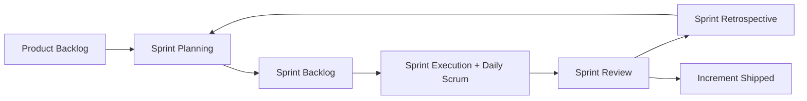
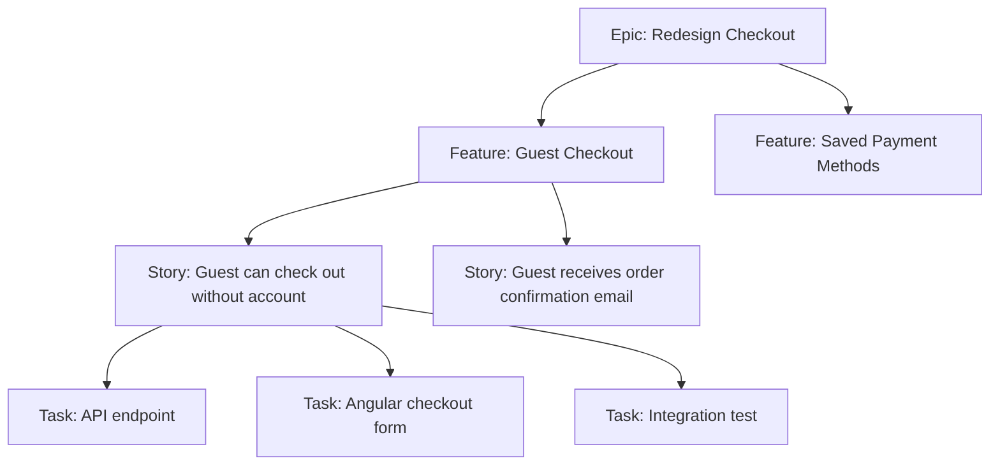
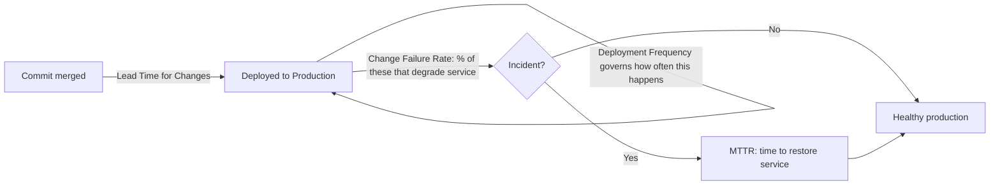
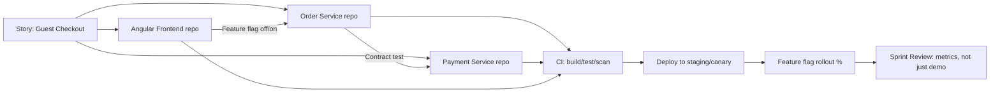
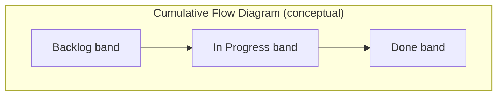

# Agile — Interview Revision Notes

> Quick-revision Q&A derived from `R. Agile-Interview-Guide.md`. Covers every section of the source.

## Core Concepts

### What is Agile?

**Q: What is Agile, fundamentally — a process or a mindset?**

A: Agile is an iterative and incremental approach to delivering software in small cycles (sprints/iterations) with continuous feedback, collaboration, and adaptability to change. It is a *mindset/set of values* (the Agile Manifesto: individuals and interactions over processes and tools; working software over comprehensive documentation; customer collaboration over contract negotiation; responding to change over following a plan). Scrum, Kanban, XP, and SAFe are frameworks that *implement* that mindset.

**Q: What senior-level nuance should you show when asked "what is Agile"?**

A: Show that Agile is a philosophy, not a rigid process, and that you can identify when strict-by-the-book Scrum is the wrong tool — e.g., a small legacy-maintenance team is often better served by Kanban than by sprints.

### What is Scrum?

**Q: What is Scrum and what does it define?**

A: Scrum is an Agile framework using fixed-length sprints (typically 1–4 weeks, most commonly 2). It defines:

- **Roles**: Product Owner, Scrum Master, Development Team (Scrum Guide 2020+ calls them "Developers"; PO/SM are part of the Scrum Team, not external to it).
- **Artifacts**: Product Backlog, Sprint Backlog, Increment.
- **Ceremonies**: Sprint Planning, Daily Scrum, Sprint Review, Sprint Retrospective, plus the Sprint itself as a container event.



### What is a User Story?

**Q: What is a user story and what format does it follow?**

A: A lightweight description of a feature from the end user's perspective, meant to drive conversation rather than serve as an exhaustive spec.

```
As a [user/role], I want [feature/capability], so that [benefit/value].
```

**Q: What makes a story actually testable/"done," and how is it usually expressed?**

A: A story is a *placeholder for a conversation*, not a contract. Acceptance criteria — often in Given/When/Then (Gherkin) format — is what makes it testable.

```gherkin
Given a registered user on the login page
When they submit valid credentials
Then they are redirected to the dashboard
And a session token is issued
```

### Functional vs Technical (Non-Functional) Requirements

**Q: How do functional and non-functional requirements differ?**

A:

| Aspect | Functional Requirement | Non-Functional Requirement |
|---|---|---|
| Answers | What does the system do? | How well does the system do it? |
| Example | User can reset password | Password reset email must send within 2s |
| Testing | Behavioral/acceptance tests | Load, security, performance, chaos tests |
| Owner (typical) | BA / Product Owner | Architect / Tech Lead |
| Visibility to end user | Directly visible | Often invisible unless violated |

Functional examples: login, add to cart, generate report, reset password. NFR examples: API response under 500ms, encryption at rest/in transit, support 10,000 concurrent users, mandated tech stack.

### Who Defines Functional vs Technical Requirements

**Q: Who owns functional requirements vs technical requirements?**

A: Functional — BA or Product Owner, with stakeholder/end-user input. Technical — Architect, Tech Lead, or the Development Team, driven by system design and NFRs/platform constraints.

**Q: What's the senior-level nuance on this ownership split?**

A: In mature teams it isn't a hard wall — developers should push back on functional requirements with technical implications ("this won't scale past X users without a redesign"), and POs should understand enough tech constraint to prioritize NFR work. The best senior engineers translate business requirements into technical ones and surface trade-offs early, not after the sprint starts.

### Core Scrum Ceremonies

**Q: What happens in Sprint Planning?**

A: The team selects backlog items from a refined, prioritized backlog and plans the upcoming sprint's work, producing a Sprint Goal and Sprint Backlog.

**Q: What is the Daily Scrum, and what's the modern nuance around it?**

A: A short (≤15 min), timeboxed daily sync. Classic three questions: what was done yesterday, what's planned today, any blockers. Senior nuance: the Scrum Guide itself now frames it around inspecting progress toward the *Sprint Goal* and re-planning — not a status report to the Scrum Master. Mentioning this shift signals current framework knowledge.

**Q: What is Sprint Review, and is it "just a demo"?**

A: An end-of-sprint demo of the increment to stakeholders to inspect the product and adapt the backlog — a collaborative working session, not just a demo.

**Q: What is Sprint Retrospective focused on?**

A: Held after review, before next planning — discusses what went well/didn't and concrete improvement actions for the *process*, not the product.

### Definition of Done (DoD)

**Q: What is a Definition of Done, and what does a typical .NET/Angular DoD include?**

A: A shared, team-agreed checklist ensuring a backlog item is truly complete and potentially shippable:

- Code complete and merged to main/trunk
- Unit tests written and passing (coverage threshold met)
- Code review / PR approved
- Integration tests pass in CI pipeline
- No new critical/high static-analysis or security findings (SonarQube, etc.)
- Deployed and verified in a test/staging environment
- Acceptance criteria verified against the story
- Documentation/README/API contract updated if applicable

**Q: Can DoD be renegotiated story-by-story?**

A: No — DoD is a team-wide, per-increment standard applied to every story. Renegotiating it per story signals a team maturity problem.

### Backlog Refinement

**Q: What is backlog refinement ("grooming")?**

A: The ongoing process of reviewing, clarifying, splitting, estimating, and re-prioritizing backlog items *before* they enter a sprint — usually a recurring event (weekly/mid-sprint), keeping the top of the backlog "sprint-ready."

### Agile vs Waterfall

**Q: How does Agile compare to Waterfall?**

A:

| Aspect | Agile | Waterfall |
|---|---|---|
| Delivery | Iterative, incremental (every sprint) | Sequential, delivered at the end |
| Requirements | Evolve, embrace change | Fixed upfront, change is costly |
| Feedback loop | Continuous (every sprint/demo) | Only at the end (or major milestones) |
| Risk | Discovered/mitigated early | Discovered late, expensive to fix |
| Documentation | Lightweight, just enough | Heavy, comprehensive upfront |
| Best fit | Uncertain/evolving requirements, digital products | Fixed-scope, regulatory/contractual, hardware-coupled projects |

## Intermediate Concepts

### Story Point Estimation

**Q: Why use story points (relative sizing) instead of hours?**

A: Story points size complexity, effort, uncertainty, and risk — not literal hours — usually on a Fibonacci-like scale (1, 2, 3, 5, 8, 13, 21…). Humans are bad at absolute time estimation but good at relative comparison; the widening Fibonacci gaps force meaningful differentiation for larger, less-understood items. It also decouples estimation from any one developer's speed, which matters once velocity is used team-wide.

### Handling Changing Requirements

**Q: How does Agile handle changing requirements?**

A: Through **backlog reprioritization by the Product Owner** — changes become new/modified backlog items re-ranked against everything else, rather than injected disruptively into a locked sprint. The team is protected from churn *within* a sprint; the *backlog* absorbs change *between* sprints.

### Definition of Ready (DoR)

**Q: What criteria must a story satisfy before entering a sprint (DoR)?**

A:

- Clear, testable acceptance criteria
- Dependencies identified and ideally resolved/sequenced
- Estimated by the team
- Small enough to complete within a sprint
- UX/designs attached if relevant
- No open questions blocking implementation

### DoD vs DoR — Why Both Matter

**Q: How do DoR and DoD differ, and why is this a classic interview trap?**

A: Candidates often know only one of the two.

| | Definition of Ready (DoR) | Definition of Done (DoD) |
|---|---|---|
| Applies to | A story *before* it enters a sprint | A story/increment *after* work is complete |
| Purpose | Prevents starting on ill-defined work | Prevents calling unfinished/untested work "done" |
| Owned by | Team, enforced mainly by PO + team during refinement | Team, enforced during review/PR/CI |
| Failure mode if missing | Mid-sprint churn, blocked stories, re-estimation | "Done" work that isn't shippable, hidden technical debt, QA surprises |

**Q: Why does distinguishing DoR vs DoD failures matter for a lead?**

A: DoR failures are usually a *refinement* discipline problem; DoD failures are usually a *quality/engineering* discipline problem. Diagnosing which one is broken (and fixing the right ceremony) is core lead-level judgment.

### Epic vs Feature vs Story vs Task

**Q: How do Epic, Feature, Story, and Task differ in scope?**

A:

- **Epic** — large initiative spanning multiple sprints/releases, maps to a business goal (e.g., "Redesign checkout flow").
- **Feature** — functional grouping within an epic, still potentially multi-sprint (e.g., "Guest checkout").
- **Story** — user-focused, sprint-sized requirement with acceptance criteria (e.g., "As a guest, I want to check out without an account").
- **Task** — technical, implementation-level sub-unit of a story (e.g., "Add `GuestCheckoutController` endpoint," "Write EF Core migration for `GuestOrder` table").



### INVEST Principle for User Stories

**Q: What does INVEST stand for?**

A:

- **I**ndependent — deliverable without hard sequencing on other stories
- **N**egotiable — details open for discussion, not a rigid contract
- **V**aluable — delivers clear value to a user or the business
- **E**stimable — team has enough clarity to size it
- **S**mall — fits comfortably within a sprint
- **T**estable — has clear, verifiable acceptance criteria

### Cross-Functional Teams

**Q: What is a cross-functional team, and why does it matter?**

A: A team with all skills needed to take a feature from idea to production without depending on an external team every increment (developers, QA, UX/UI, DevOps, sometimes embedded DBAs/SREs). The point is minimizing *hand-off latency* and *queueing* between specialties — every external hand-off adds wait time and context loss.

**Q: How do you structure a team when full cross-functionality isn't possible (e.g., a shared DBA/security team)?**

A: Embed a rotating liaison or build explicit SLAs with the shared team — don't just ignore the constraint.

### Agile Documentation Philosophy

**Q: Does Agile mean "no documentation"?**

A: No — that's a common misquote of "working software over comprehensive documentation." Agile favors "just enough" documentation. In a .NET/Angular shop: living API contracts (OpenAPI/Swagger), ADRs (Architecture Decision Records) for significant technical decisions, and story-level acceptance criteria replace large requirement documents — making documentation lighter, more current, and closer to the code, not eliminating it.

## Advanced Concepts

### Scrum vs Kanban

**Q: How do Scrum and Kanban compare across cadence, roles, and key constraints?**

A:

| Aspect | Scrum | Kanban |
|---|---|---|
| Cadence | Fixed-length sprints | Continuous flow, no fixed iteration |
| Roles | Defined (PO, SM, Dev Team) | No prescribed roles |
| Ceremonies | Sprint planning, standup, review, retro | Optional; often just a standup + periodic replenishment |
| Work commitment | Commit to a sprint's worth of items | Pull work continuously as capacity frees up |
| Key constraint | Sprint length/capacity | **WIP (Work-In-Progress) limits** per column |
| Change mid-cycle | Discouraged mid-sprint | Naturally accommodated |
| Best fit | Product teams with plannable feature work | Support/ops/maintenance teams, unpredictable inflow |
| Core metric | Velocity (points/sprint) | Cycle time / lead time, throughput |

### Scrum vs Kanban vs SAFe vs Scrumban

**Q: How do Scrum, Kanban, Scrumban, and SAFe compare, and when would you pick each?**

A:

| Framework | Best for | Trade-off |
|---|---|---|
| **Scrum** | Product teams building new features with plannable scope | Rigid cadence can be a poor fit for interrupt-driven work (support, ops) |
| **Kanban** | Support/maintenance teams, ops, unpredictable inbound work | Lacks built-in cadence for retros/planning unless deliberately added |
| **Scrumban** | Teams transitioning from Scrum to flow-based work, or teams with both planned feature work and unplanned support tickets | Hybrid — sprints + WIP limits; can feel like "neither" if not tuned |
| **SAFe (Scaled Agile Framework)** | Large orgs (50+ engineers, multiple teams) needing cross-team coordination and portfolio alignment | Heavyweight; risks becoming "Waterfall in Agile clothing" if PI Planning turns into big upfront planning |

**Q: "You've used Scrum — when would you not use it?" How do you answer?**

A: A production-support/BAU team with constant unplanned interrupts is a poor fit for 2-week sprint commitments — Kanban with WIP limits and SLA-based classes of service fits better. Early-stage discovery/spike work also often fits a Kanban-style flow better than being forced into a sprint box.

### Handling Scope Change Mid-Sprint

**Q: How should scope changes mid-sprint be handled?**

A: Ideally avoided — the sprint is a protected commitment. If truly required:

1. Product Owner re-evaluates priority against the sprint goal.
2. Team discusses impact (capacity, dependencies, risk).
3. Either the item goes into the *next* sprint, or an existing lower-value item is *swapped out* — you don't just pile more work onto the sprint.

**Q: What's the gotcha interviewers listen for here?**

A: Candidates who say "we just squeeze it in." The correct instinct is trade-off, not addition — protecting sprint integrity and sustainable pace.

### Velocity and Its Use

**Q: What is velocity and what is it used for?**

A: The amount of work (story points) a team completes per sprint, averaged over recent sprints. Used for sprint planning (how much to pull in), delivery forecasting, and capacity/staffing conversations.

**Q: What's the classic velocity gotcha?**

A: Velocity is a *team-specific, relative* planning tool — never a productivity/performance metric, and never comparable across teams (different teams calibrate points differently). Using it to compare people or teams is a textbook anti-pattern and a red flag.

### Velocity vs Throughput vs Cycle Time

**Q: How do Velocity, Throughput, Cycle Time, and Lead Time differ?**

A:

| Metric | Definition | Framework | What it tells you |
|---|---|---|---|
| **Velocity** | Story points completed per sprint | Scrum | Capacity for *planning* future sprints (same team only) |
| **Throughput** | Number of items (regardless of size) completed per unit time | Kanban/flow | Predictability of delivery rate, independent of estimation |
| **Cycle Time** | Time from when work *starts* to when it's *done* | Kanban/flow (Little's Law: WIP = Throughput × Cycle Time) | Responsiveness/flow efficiency; the metric customers actually feel |
| **Lead Time** | Time from when work is *requested* to when it's *delivered* | Both | End-to-end customer-facing responsiveness, includes queue time before work starts |

**Q: Why can velocity look great while the team is actually struggling?**

A: Velocity can stay high while cycle time balloons — the team is "busy" but items sit half-done due to too much WIP. A lead who only watches velocity misses this; Little's Law and WIP limits are the actual lever to fix it.

### Managing Technical Debt in Agile

**Q: How should technical debt be managed within Agile delivery?**

A:

- Add tech debt items explicitly to the backlog (make it visible — invisible debt never gets prioritized).
- Allocate dedicated sprint capacity for refactoring (e.g., reserve 10–20% of each sprint, or periodic "tech debt sprints").
- Improve code quality continuously via code reviews, static analysis (SonarQube/Roslyn analyzers), and automated tests — not big-bang cleanup.
- Tie debt items to business impact ("this debt is slowing feature X by Y%") so a PO can prioritize against feature work.

**Q: What senior nuance should you show on tech debt?**

A: Quantify and communicate tech debt in terms a PO/stakeholder cares about — velocity drag, incident rate, new-dev onboarding time — not just "we need to refactor because it's messy."

### Backlog Prioritization

**Q: What factors drive Product Owner backlog prioritization?**

A: Business value, risk, dependencies, and customer needs.

### Prioritization Frameworks (WSJF, MoSCoW, Kano, RICE)

**Q: What formal frameworks formalize backlog prioritization beyond "value/risk/dependencies"?**

A:

- **WSJF (Weighted Shortest Job First)** — used heavily in SAFe:

```text
WSJF = Cost of Delay / Job Size
Cost of Delay = user/business value + time criticality + risk reduction/opportunity enablement
```

  Favors high-value, low-effort, time-sensitive work.
- **MoSCoW** — Must have / Should have / Could have / Won't have. Simple; good for scope negotiation and MVP definition.
- **Kano Model** — classifies features as Basic (expected), Performance (more is better), Delighters (unexpected value), Indifferent/Reverse. Useful for UX-driven prioritization.
- **RICE**:

```text
Score = (Reach × Impact × Confidence) / Effort
```

  Popular in product-led orgs; forces explicit confidence estimation, surfacing assumption risk.

**Q: Why does naming WSJF specifically matter in an interview?**

A: It signals SAFe/scaled-Agile exposure, increasingly common in enterprise .NET shops.

### Agile Metrics

**Q: What are the core Agile/Scrum metrics?**

A: Velocity, burn-down chart (remaining work vs time within a sprint/release), cycle time, lead time, and sprint predictability (committed vs completed).

### DORA Metrics

**Q: Why do DORA metrics matter even though the "Agile Metrics" list above doesn't mention them?**

A: The standard Agile/flow metrics (velocity, burn-down, cycle time, lead time, sprint predictability) are Scrum/flow-focused. DORA metrics are the industry-standard way engineering *organizations* (not just teams) measure delivery performance, and are framework-agnostic — they apply whether a team runs Scrum, Kanban, or something else.

**Q: Where do DORA metrics come from?**

A: DORA (DevOps Research and Assessment) is the Google-run research program (now part of Google Cloud) that, via years of large-scale survey data across thousands of orgs, identified four metrics that correlate most strongly with high-performing software delivery organizations.

**Q: What are the four DORA metrics?**

A:

| Metric | Definition | What it measures |
|---|---|---|
| **Deployment Frequency** | How often an organization successfully releases to production | Batch size / release cadence — elite performers deploy on-demand (multiple times/day); low performers deploy less than once/month |
| **Lead Time for Changes** | Time from a commit being merged to that change running successfully in production | End-to-end delivery pipeline speed — distinct from the Agile "Lead Time" metric (request-to-delivery for a *story*); this is commit-to-production, a CI/CD efficiency measure |
| **Change Failure Rate** | % of production deployments that result in a degraded service requiring remediation (rollback, hotfix, patch) | Deployment quality/risk — specifically failures manifesting *after* reaching production |
| **Mean Time to Recovery (MTTR)** | How long it takes to restore service after a production incident/failure | Resilience/operational recovery — a reliability engineering metric, not a dev-speed one |



**Q: Why exactly these four, and what's the counterintuitive research finding?**

A: They cluster into two independent axes: **throughput** (Deployment Frequency + Lead Time for Changes — how fast you ship) and **stability** (Change Failure Rate + MTTR — how safely you ship). DORA's research found high-performing orgs are strong on *both* axes simultaneously — speed and stability are not a trade-off at the elite level, contradicting the intuition that "moving faster means breaking more things." Framing "we need to slow down to be safe" as a sign of *low* DevOps maturity (not caution) is a strong interview point.

**Q: How do DORA metrics connect back to Agile ceremonies and backlog health?**

A:

- A team can have great velocity but poor MTTR — velocity says nothing about what happens after a story reaches production; DORA closes exactly that blind spot.
- Retrospectives should review DORA trends (Change Failure Rate, MTTR), not just sprint-level velocity/burn-down, to catch "busy but fragile" patterns.
- A rising Change Failure Rate or lengthening MTTR is itself a backlog-prioritization signal — it should generate real-priority technical-debt/reliability backlog items, not be treated as a separate "ops problem."
- Low Deployment Frequency is a proxy for large, risky release batches, which are themselves a leading indicator of *future* Change Failure Rate problems.
- Interview framing: "Velocity tells you if the team is predictable at starting/finishing work inside a sprint. DORA tells you if that work is actually safe and fast to ship. A lead needs both."

### Handling Blockers

**Q: How should blockers be handled day to day?**

A:

- Raise immediately in daily standup — don't wait.
- Collaborate with the team first (pair up, unblock via peer knowledge).
- Escalate via the Scrum Master if the blocker is external/organizational (another team, infra access, a vendor).

### Role of the Developer in Estimation

**Q: What role should a developer play in estimation?**

A:

- Participate actively in planning poker / estimation sessions.
- Provide technical complexity/risk insight the PO can't (e.g., "this touches a legacy payment integration, that's a hidden 5, not a 2").
- Break stories into technical tasks during sprint planning.

### Estimation Techniques Beyond Planning Poker

**Q: What estimation techniques exist beyond planning poker/Fibonacci, and when do you use each?**

A:

- **Planning Poker** — classic, discussion-driven consensus estimation; good for calibration and surfacing hidden complexity through discussion.
- **T-Shirt Sizing (XS/S/M/L/XL)** — fast, coarse-grained; good for early backlog/epic-level sizing before detailed refinement.
- **Affinity Estimation / Silent Grouping** — team silently places stories into relative-size buckets without discussion first, then discusses only outliers — much faster for large backlogs (50+ stories in quarterly planning).
- **Bucket System** — like affinity estimation, with predefined point buckets; used for very large-scale estimation (SAFe PI Planning).
- **#NoEstimates movement** — provocative counter-approach: slice stories small enough to be roughly uniform size, and use *throughput* (item count/week) for forecasting instead of point-based velocity. Worth mentioning to show awareness of the estimation debate.

### When Sprint Goals Are Not Achieved

**Q: What should you do when a sprint goal isn't achieved?**

A:

- Analyze root cause during the retrospective — don't just note it and move on.
- Distinguish *planning/estimation* failures (over-committed, poor refinement) from *execution* failures (unexpected complexity, blockers, absenteeism) from *external* failures (dependency delays, environment issues).
- Adjust future planning to address the specific root cause (e.g., tighten DoR, add buffer for known risk categories) rather than generically "estimate more conservatively."
- A repeated pattern is itself a signal for the Scrum Master to address systemically, not a one-off retro action item.

### Real-World Challenge: PO Adds Urgent Work Mid-Sprint

**Q: The PO wants to add urgent work mid-sprint — how do you handle it?**

A:

- Discuss impact with the team openly (capacity, current commitments, risk to sprint goal).
- Evaluate true priority/urgency against what's already committed — "urgent" from the PO doesn't automatically override the sprint.
- Resolution is a *trade*, not an addition: replace an existing lower-priority item, or defer the new work to the next sprint — unless it's genuinely sprint-goal-threatening (e.g., a production incident).

**Q: What's the key distinction to draw here?**

A: "Urgent business request" vs "production incident/hotfix." The latter legitimately interrupts a sprint (most teams' DoD/process carves out an explicit P1 exception); the former should still go through the trade-off conversation.

### Agile in a Microservices / CI-CD Context

**Q: How does story slicing work when a feature spans multiple microservices?**

A: A "vertical slice" story (e.g., "guest checkout") often spans multiple services/repos. Senior practice: slice stories so each is deliverable and independently testable within *one* service/repo where possible, using contract tests (e.g., Pact) to decouple cross-service dependencies rather than forcing lockstep releases.

**Q: How do trunk-based development and feature flags change sprint delivery?**

A: They replace long-lived feature branches in high-maturity shops, letting a story be "done" (merged, deployed) without being *released* (exposed to users) — decoupling deployment from release and enabling true continuous delivery within a sprint.

**Q: How does Definition of Done expand in a CI/CD context?**

A: Adds: passes automated pipeline gates (build, unit, integration, security scan), deployed to at least staging/canary, and (if flagged) verified behind a feature flag — not just "code complete."

**Q: How does Sprint Review change when CI/CD is in play?**

A: It becomes less meaningful as a release gate — software may already be in production before the review, so the review shifts toward validating outcomes/metrics (A/B test results, adoption) rather than a first-time demo.

**Q: What's the dominant coordination problem in a microservices Agile org?**

A: Cross-team dependency management, once a "story" needs coordinated changes across 3+ microservices owned by different teams — exactly the problem SAFe's PI Planning and dependency boards try to solve at scale.



### Scaling Agile: SAFe, LeSS, and Spotify Model

**Q: How do SAFe, LeSS, and the Spotify Model differ as scaling approaches?**

A:

- **SAFe (Scaled Agile Framework)** — adds Program (Agile Release Train, PI Planning every 8–12 weeks) and Portfolio layers on top of team-level Scrum/Kanban. Strength: coordinates many teams with shared roadmaps/dependencies. Weakness: can reintroduce Waterfall-like upfront planning if PI Planning is mishandled.
- **LeSS (Large-Scale Scrum)** — extends Scrum's rules directly to multiple teams sharing one Product Backlog and one Sprint, minimizing added process/roles (unlike SAFe). Favors "descaling" the organization over adding coordination layers.
- **Spotify Model (Squads/Tribes/Chapters/Guilds)** — not a prescriptive framework but an organizational topology emphasizing autonomous, cross-functional squads aligned to business domains, with chapters/guilds for cross-cutting skill communities. Note: Spotify itself has publicly moved away from parts of it — don't over-cite it as current best practice.

**Q: What's the practical senior take on scaling frameworks?**

A: The *scaling problem* is really a *dependency-management and communication* problem — the specific framework matters less than whether the org actively manages cross-team dependencies visibly (dependency boards, PI Planning, Scrum-of-Scrums) rather than discovering them mid-sprint.

## Best Practices

**Q: What are the key Agile best practices to cite in an interview?**

A:

- Keep sprints protected — avoid mid-sprint scope injection except for genuine incidents.
- Make technical debt visible on the backlog with business-impact framing, not just "cleanup."
- Enforce DoR before Sprint Planning and DoD before calling anything "done" — both, consistently, not case-by-case.
- Use velocity only for the *same team's* forward planning — never cross-team comparison or as a productivity metric.
- Slice stories vertically (thin end-to-end slices) rather than horizontally (all-UI, then all-API) so each story delivers demonstrable value.
- Automate DoD verification where possible (CI gates for tests/coverage/security scans) rather than relying on manual checklist honesty.
- Treat retrospectives as action-oriented — track action items to completion, revisit them, don't let retros become venting sessions with no follow-through.
- In scaled/multi-team contexts, make cross-team dependencies visible early (dependency boards, PI Planning) rather than discovering them at integration time.

## Agile Anti-Patterns

**Q: What are the common Agile anti-patterns to recognize?**

A:

- **Water-Scrum-Fall** — Scrum ceremonies bolted onto an org that still does upfront big design and a hardening/UAT phase at the end; sprints become status theater, not real iterative delivery.
- **Zombie Scrum** — team goes through the motions (standups, retros) without any real inspect-and-adapt; retro action items never change anything.
- **Velocity as a productivity metric / point inflation** — teams inflate story points over time to show "improving" velocity, or management compares velocity across teams, incentivizing gaming instead of honest estimation.
- **Standup as status report to management** — turns the Daily Scrum into a top-down reporting ritual instead of a peer-to-peer re-planning session, killing psychological safety.
- **PO-as-bottleneck / absent PO** — either the PO approves every micro-decision (bottleneck) or is unavailable for clarification (team blocked/guessing), both violate the collaborative intent of the role.
- **Scope creep disguised as "just one more thing"** — small mid-sprint additions that individually seem harmless but cumulatively blow the sprint goal; fix is the same trade-off discipline applied consistently.
- **Retrospective without action** — identifying problems repeatedly without assigning owners/deadlines to improvement actions.
- **Estimation theater** — running planning poker for form's sake while a manager has already committed a delivery date externally, making the estimate meaningless.
- **Copy-pasted "Agile at scale"** — adopting SAFe/LeSS terminology and ceremonies wholesale without addressing the underlying dependency/communication problem they're meant to solve.

## Common Pitfalls

**Q: What are common pitfalls teams fall into with Agile?**

A:

- Treating story points as hours (breaks relative estimation and cross-team comparability).
- Letting the Sprint Review become "just a demo" instead of a genuine inspect-and-adapt session with stakeholders.
- Skipping backlog refinement, leading to under-specified stories entering sprint planning (DoR violated).
- Conflating Definition of Done with acceptance criteria — DoD is story-agnostic and team-wide; acceptance criteria are story-specific.
- Ignoring technical debt until it causes a production incident, rather than continuously tracking and paying it down.
- Using Scrum dogmatically for work (e.g., pure support/ops) that fits a flow-based (Kanban) model far better.
- Overloading a sprint because "the team said yes" under pressure, rather than respecting capacity/velocity data.

## Agile Metrics Dashboards and Reporting to Leadership

**Q: How should you translate team metrics for leadership reporting?**

A: Translate team-level metrics (velocity, burn-down) into business-facing ones: **predictability** (committed vs delivered %), **lead time to production** (how fast can we ship a change once decided), and **defect escape rate** (quality signal) — rather than raw point counts leadership can't interpret.

**Q: What's the risk of publishing velocity to leadership, and what's the alternative?**

A: Goodhart's Law — "when a measure becomes a target, it ceases to be a good measure." Publishing velocity to leadership almost always leads to point inflation. Report throughput/cycle-time trends instead, which are harder to game.

**Q: What visualization is undervalued for showing leadership where work is stuck?**

A: Cumulative Flow Diagrams (CFDs) — excellent for visually showing *where* work is stuck (a widening "in progress" band signals a bottleneck) without requiring leadership to understand story points at all.



## Sample Interview Q&A

**Q: Walk me through how you'd introduce Scrum to a team currently doing ad-hoc, unstructured development.**

A: Start with the pain points, not the ceremonies — identify what's actually hurting them (missed deadlines, unclear priorities, rework). Introduce a lightweight backlog and a short (1–2 week) sprint cadence, a real Definition of Done, and a retrospective from day one so the process self-corrects. Avoid big-bang adoption of every SAFe/Scrum artifact at once; earn the team's trust with a few working sprints before adding ceremony weight.

**Q: Your velocity has been flat for three sprints despite the team saying they're busier than ever. What do you investigate?**

A: First check whether "busier" means more WIP, not more throughput — look at cycle time and WIP counts, not just velocity. Check for hidden work (unplanned interrupts, production support) not captured on the board. Check for point inflation or estimation drift. Check for increased context-switching (too many concurrent stories per person). Velocity is a lagging, aggregate signal — flat velocity alone doesn't diagnose the cause; cycle time and WIP usually do.

**Q: A stakeholder wants a fixed date and fixed scope for a project, but your org runs Scrum. How do you reconcile that?**

A: Fixed date + fixed scope + fixed quality is the classic "iron triangle" conflict — something has to flex. In practice: negotiate an MVP scope with the stakeholder up front (MoSCoW helps), commit to the date against that reduced/prioritized scope, and use the backlog to absorb "nice to have" items that get cut if needed as the date approaches, verified sprint by sprint via velocity-based forecasting rather than a single upfront estimate.

**Q: How do you know if your Definition of Done is actually being honored, versus just existing on a wiki page?**

A: Automate as much of it as possible into CI/CD gates (tests, coverage thresholds, security scans, static analysis) so it's enforced by the pipeline, not self-reported. For parts that can't be automated (e.g., "reviewed by QA"), track them via the board workflow (a story can't move to Done without passing through a "QA" column with an explicit checklist) and audit sporadically in retro if regressions/escaped-defects start appearing.

**Q: Explain the difference between a Product Owner prioritizing the backlog and a Scrum Master facilitating the process — where do responsibilities overlap or conflict?**

A: The PO owns the *what* and *why* (value, priority, business outcomes); the Scrum Master owns the *how* (process health, removing impediments, coaching the team on Agile practices). They can conflict when a PO tries to dictate *how* the team works (e.g., mandating overtime to hit scope) or when a Scrum Master starts making prioritization calls that belong to the PO. A healthy team keeps these separated even when one person sometimes wears both hats on smaller teams (itself a known risk/anti-pattern worth naming if asked).

**Q: How would you handle a team member who consistently underestimates their own tasks?**

A: Address it as a calibration problem, not a performance one, in a 1:1 first — look at their actual task breakdown process (are they missing testing/review/deployment effort, not just "coding time"?). Use retro data (planned vs actual) to make the pattern visible to them concretely. Pair them with a teammate during estimation sessions to calibrate against group consensus (planning poker's real value). Avoid public callouts — estimation accuracy is a team-learning problem, not an individual failing, especially since points are meant to be relative/team-calibrated in the first place.
