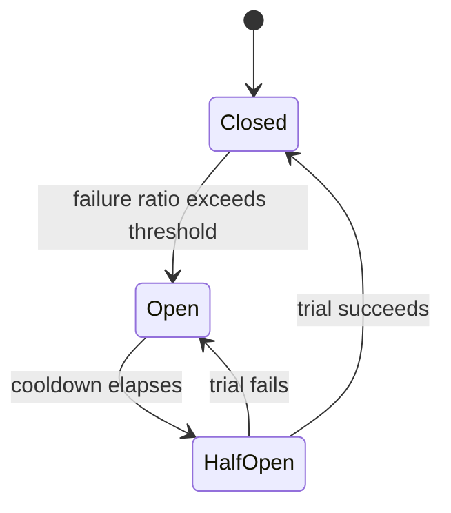
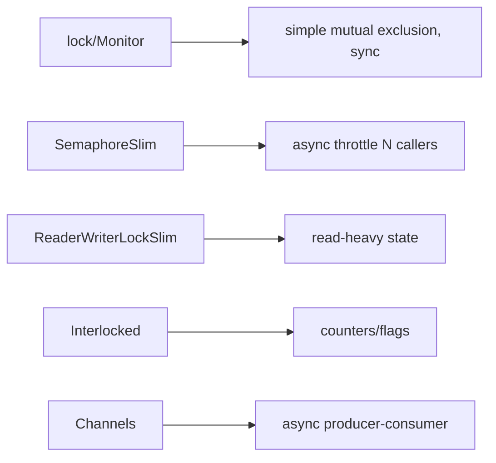

# C# / .NET Interview — Quick Revision Notes (Senior / Lead)

*Quick-revision notes derived from the C# / .NET Interview Guide. Covers every section and sub-topic in the same order — condensed Q&A + tight bullets with the essential code, tables, and diagrams. Assumes fundamentals; emphasis on nuance, trade-offs, and "why".*

---

## Part I — Core Concepts: Type System & CLR

### What Is C# / .NET, and How Does the CLR Fit In
- **C#**: modern, OOP, strongly typed, GC'd language on the .NET platform. Features: OOP, strong typing, GC, structured exceptions, LINQ, async/await.
- **Strongly typed** = every variable has a type fixed at compile time; incompatible assignments rejected without explicit conversion.
- **CLR (Common Language Runtime)** = .NET execution engine. Responsibilities: **memory management** (managed heap, no malloc/free), **security** (type safety; managed code → MSIL under CLR), **exception handling** (structured; unhandled caught by CLR), **garbage collection** (generational Gen 0/1/2).
- **Currency flag:** CAS (Code Access Security) is **legacy** — de-emphasized since .NET Framework 4, gone in .NET Core/5+. Modern security = OS permissions, sandboxing/containers, code signing. Don't cite CAS in 2026.

**Q: C# vs Java quick contrast?** A: Both GC'd, both no multiple class inheritance (use interfaces). C# runs on Windows/Linux/macOS via .NET; C# has first-class `get`/`set` properties vs Java getter/setter methods.

### .NET Framework vs .NET Core vs .NET 5–10
| | .NET Framework | .NET Core (2.x/3.x) | .NET 5–10 |
|---|---|---|---|
| Platform | Windows only | Cross-platform | Cross-platform |
| Status | Legacy (maintenance) | Core 3.1 LTS ended Dec 2022 | Progressively faster |
| Desktop | Full WPF/WinForms | Limited early | Full (Windows) |
| Blazor / MAUI / Cloud-native | No | Partial | Yes |

- **Mid-2026: .NET 10 is current LTS** (shipped Nov 2025 with C# 14). .NET 6 & 8 also LTS. STS releases (e.g. .NET 9) get ~18 months vs ~3 years LTS. *Verify EOL dates at interview time.*

### The .NET Build & Execution Pipeline
1. Source (`.cs`) → **Roslyn compiler** (`csc`).
2. → **MSIL + metadata** in `.dll`/`.exe` (CPU-independent).
3. **Assembly linking** — resolve dependent assemblies (still IL, not machine code).
4. **JIT** at runtime → native code (cached).
5. **Execution** under CLR (GC, exceptions, security, threading).
6. **Optimization** — AOT, tiered compilation (hot paths), NGEN.

> One-liner: **Compile → IL (.dll/.exe) → Link → JIT/AOT to machine code → Execute under CLR.**

### Value Types vs Reference Types
- **Value types** (`int, float, char, bool, struct, enum`) — store data directly, usually on the stack (unless boxed or a field of a heap object).
- **Reference types** (`string, object, arrays, class, interface`) — store a reference (pointer) to heap data.

### var, object, dynamic
| Type | Meaning |
|---|---|
| `var` | Statically typed, inferred at compile time (`var x = 5;`) |
| `object` | Base of all types; needs casting |
| `dynamic` | Resolved at runtime, no compile-time checking |

- `var` rules: must init at declaration, can't be `null` without hint, type fixed after, local-scope only (never a field). Use for obvious types, anonymous types, LINQ; avoid when it hurts readability.

### == vs Equals() vs ReferenceEquals()
- `==`: values for value types, references for reference types **by default**; can be operator-overloaded.
- `Equals()`: value equality, overridable.
- `ReferenceEquals()`: always raw identity, bypasses overloads.

```csharp
public override bool Equals(object obj) => obj is Employee e && e.Id == Id;
public override int GetHashCode() => Id.GetHashCode();
public static bool operator ==(Employee a, Employee b) => a.Id == b.Id;
public static bool operator !=(Employee a, Employee b) => !(a == b);
```
> **Gotcha:** override `Equals()` ⇒ MUST override `GetHashCode()`, else `Dictionary`/`HashSet` lookups silently fail (equal objects must share hash code).

### Nullable Value Types & Nullable Reference Types (NRTs)
```csharp
int? age = null;              // Nullable<int>; age ?? 18
string? name = null;          // NRT (C# 8+, opt-in <Nullable>enable</Nullable>)
```
- NRTs are **compile-time only, opt-in** — no runtime null-checking; `string?` vs `string` enforced by warnings.
- **Not retrofit-friendly** — enabling floods legacy builds with warnings; roll out per-file/project with `#nullable enable`.
- Non-null annotation ≠ non-null at runtime (reflection, JSON deserialization, un-annotated libs) — NREs still happen.
- Null-forgiving `!` (`user!.Name`) silences compiler with no runtime check — overuse reintroduces the bug class.
- **Rollout answer:** enable per-project, fix top-down from public APIs/DTOs, warnings-as-errors once clean, use `[NotNull]`/`[MaybeNull]`/`[AllowNull]` for cases compiler can't infer.

### Implicit vs Explicit Conversion
- Implicit: no data loss, automatic (`double y = intX`).
- Explicit: possible data loss, manual cast (`int z = (int)y`).

### Boxing & Unboxing
- Boxing = value type → `object` (stack → heap copy); Unboxing = `object` → value type (runtime type check + copy).
- Cost: each box allocates a heap object (~16–24 bytes overhead even for a 4-byte int) → Gen0 GC pressure. Classic slow case: `ArrayList` of boxed ints vs `List<int>` (no boxing).

---

## Part II — Core Concepts: OOP

### The Four Pillars
Encapsulation, Inheritance, Polymorphism, Abstraction.
- **Encapsulation** — restrict direct data access, expose via properties/methods.

### Inheritance vs Composition
- **Inheritance ("is-a")** — single class inheritance only. Deep hierarchies = tight coupling, base changes ripple.
- **Composition ("has-a")** — combine components / implement multiple interfaces; compose behaviors instead of rigid hierarchy.
- Small focused interfaces (`IDisposable`, `IEnumerable<T>`, `IComparable`) let unrelated classes opt into behavior.
> **Guideline:** favor composition; use inheritance only for genuine "is-a" with shared invariants.

### Polymorphism: Compile-Time vs Runtime
- **Compile-time (static)** — method/operator overloading; no virtual-dispatch overhead; cons: fixed at compile, ambiguity errors.
- **Runtime (dynamic)** — `virtual`/`override` or interface; CLR resolves at runtime.
```csharp
Animal a = new Dog();  a.Speak();   // "Bark" — CLR resolves Dog.Speak
```
- Enables plugging implementations against stable abstractions (Strategy/Factory/Template Method). Cons: slight dispatch overhead, weaker JIT inlining.

### Overloading vs Overriding vs Hiding (new)
| Keyword | Meaning |
|---|---|
| `virtual` | Method can be overridden |
| `override` | New impl of a virtual method |
| `new` | Hides (not overrides) base method |

```csharp
Base b = new Derived();
b.Show();            // "Base" — hiding resolved by REFERENCE type
((Derived)b).Show(); // "Derived"
```
- Use `new` for: backward compat in legacy code, non-virtual base method, base-type-vs-derived-type specialization, customizing a framework class with a non-virtual method.
> If you control the base class, prefer `virtual` + `override`.

### Interface vs Abstract Class
| Aspect | Interface | Abstract Class |
|---|---|---|
| Idea | What a class CAN DO (capability) | What a class IS (identity) |
| Methods | No impl (default methods since C# 8) | Abstract + implemented |
| Fields/Ctors | No | Yes |
| Inheritance | Multiple | Single |

- **Interface pros:** multiple inheritance, loose coupling, DI/mocking, composition, default methods (C# 8). Cons: no shared state, weaker encapsulation, over-engineering risk.
- **Abstract class pros:** code reuse, shared state, organized hierarchy. Cons: single inheritance, tighter coupling, not directly instantiable (ctor still runs for derived).
> **Guideline:** start with an interface; abstract class only when shared state/behavior is genuinely needed.

### struct vs class
| | struct (value) | class (reference) |
|---|---|---|
| Memory | Stack (unless boxed/field of class) | Heap |
| Passing | By value (copy) | By reference |
| Inheritance | Interfaces only | Supports inheritance |
| GC | None | GC-managed |
| Mutability | Usually immutable | Mutable |

- Passed by value; parameterless ctors allowed from C# 10; boxing on convert to `object`/interface; keep small (**≤ 16 bytes** guideline) — large structs are costly to copy.

### sealed, static, and partial classes
- `sealed` — cannot be inherited.
- `static` — no instances, only static members, static ctor allowed, ideal for utilities; can't do instance interfaces (no instance).
- `partial` — split a class across files (generated code separation, EF/WinForms scaffolding, fewer merge conflicts).

### Access Modifiers
| Modifier | Inside | Derived (same asm) | Same asm | Derived (diff asm) | Outside asm |
|---|---|---|---|---|---|
| public | Y | Y | Y | Y | Y |
| private | Y | N | N | N | N |
| protected | Y | Y | N | Y | N |
| internal | Y | Y | Y | N | N |
| protected internal | Y | Y | Y | Y | N |
| private protected | Y | Y | N | N | N |

- Top-level classes: only `public` or `internal`; nested can use any.

### Records & record struct
- `record` = reference type with **value-based equality**, `ToString()`, immutability by convention. Ideal for DTOs/value objects.
```csharp
public record Product(int Id, string Name, decimal Price);
p1 == p2;                    // value equality
var p3 = p1 with { Price = 899.99m };  // non-destructive mutation
```
- `record struct` (C# 10) — same value equality as a value type (no heap alloc), for small hot-path value objects.

| | class | record | record struct |
|---|---|---|---|
| Equality | Reference | Value | Value |
| Storage | Heap | Heap | Stack (usually) |
| Mutability | Mutable | Immutable (init-only) | Mutable unless `readonly` |

### Pattern Matching & Switch Expressions
```csharp
string Describe(object o) => o switch {
    int n when n < 0 => "negative",
    string s => $"len {s.Length}",
    Product { Price: > 1000 } => "expensive",   // property pattern
    null => "nothing",
    _ => "unknown"
};
bool IsAdult(int age) => age is >= 18 and < 120;   // relational + logical (C# 9)
if (numbers is [1, 2, 3]) { }                      // list pattern (C# 11)
if (numbers is [var first, .., var last]) { }
```
- Idiomatic replacement for nested `if/else` and type-check chains.

---

## Part III — Constructors & Object Creation

Constructor = special method, same name as class, no return type, runs on creation to bring object to a valid state and enforce invariants.

### Types of Constructors
1. **Default** — no params; implicit one supplied unless you define any ctor.
2. **Parameterized** — mandatory data; common with DI.
3. **Overloaded** — `: this(...)` chaining to avoid duplication.
4. **Static** — inits static members; runs once per type before first use; no params/modifiers; **only one allowed**; exception in it crashes app.
5. **Private** — Singleton / static utility / factory-controlled creation.
6. **Copy** — none built-in; hand-write for cloning/immutable patterns.
```csharp
public static Logger Instance => _instance ??= new Logger();  // private ctor Singleton
```

### Constructors in Abstract Classes
- Allowed even though not directly instantiable — runs first during **derived** object creation to init shared state.

### Step-by-Step Object Creation Process
1. `new` — CLR determines type.
2. Heap memory allocated; fields **zero-initialized before any ctor**.
3. Reference created on stack/register.
4. Ctor resolution (compile time).
5. **Base ctor runs first** (`object()` → derived).
6. Instance field initializers run (before ctor body).
7. Ctor body executes.
8. Reference assigned.
9. Lifetime & GC (eligible once unreachable).
> One-liner: **alloc → zero-init → ctor selection → base ctor → field initializers → ctor body → reference assignment.**

**Q&A:** Ctors virtual? No. Throw exceptions? Yes, for arg validation. Static vs instance? Once per type vs per object. Multiple static ctors? No.
- Best practices: lightweight (no I/O/DB), validate early, prefer immutability, one unambiguous ctor for DI, factories for complex init.

### init, required, and Primary Constructors (C# 11/12)
```csharp
public string Name { get; init; }      // set only during construction
public required int Age { get; set; }  // C# 11 — compiler enforces set
```
- `init` = immutability without ctor overloads per combination; `required` = forces caller to set (compile-time missing-data catch).
- **Primary constructors** (C# 12 for classes/structs): params in scope across the class body; hidden backing field synthesized only when a param is captured in a method body.
```csharp
public class ProductService(IRepository repo, ILogger<ProductService> logger) { ... }
```

---

## Part IV — Intermediate: Members & Language Features

### Properties vs Fields
- Field = no encapsulation; Property = encapsulated `get`/`set`.

### const vs readonly vs static
| | const | readonly | static |
|---|---|---|---|
| Set | Compile-time at declaration | Runtime, in ctor | Shared across instances |
| Change after? | No | No (after ctor) | n/a |
| Storage | Baked into IL metadata | Instance/type field | One copy per type |

### ref vs out vs in
| | `ref` | `out` | `in` |
|---|---|---|---|
| Init before pass | Required | Not needed | Required |
| Use | Read & modify | Return extra value (`TryParse`) | Pass large struct by ref, read-only (no copy) |

### params, Named Parameters, Indexers
```csharp
void Print(params int[] n) { }         // Print(1,2,3)
Greet(age: 25, name: "Alice");         // named, order-independent
public int this[int i] { get; set; }   // indexer
```

### Extension Methods
- Static method with `this` on first param; compiler rewrites `x.IsEven()` → `Ext.IsEven(x)`. Honors Open/Closed; LINQ `Where`/`Select`/`OrderBy` are extension methods on `IEnumerable<T>`.
```csharp
public static bool IsEven(this int n) => n % 2 == 0;
```

### Generics — Why They're Not Slow
- Compile-time: type-checked once, no boxing for value types.
- Runtime: CLR **shares one impl for all reference types**, **specializes per value type** (`Box<int>` and `Box<double>` each JIT'd separately; `Box<string>` shares reference-type code).
- Net: no boxing, less memory, better inlining than `object`-based APIs.

### Tuples & Anonymous Types
```csharp
(string Name, int Age) t = ("John", 30);  t.Name;   // named tuple
var p = new { Name = "John", Age = 30 };            // anonymous type
```

### Reflection, Attributes, dynamic, ExpandoObject
```csharp
Type t = typeof(string);                 // compile-time
Type t2 = Type.GetType("System.String"); // runtime
[Obsolete("deprecated")] void Old() { }
dynamic d = "Hello"; d = 10;             // late binding, no compile check
dynamic e = new ExpandoObject(); e.Name = "John";  // props added at runtime
```
- `dynamic` = late binding via DLR call-site caching; flexible (COM, dynamic JSON, scripting) but slower than static calls.

### yield return and Iterators
```csharp
IEnumerable<int> Get() { yield return 1; yield return 2; }
```
- Compiler builds a state machine (`IEnumerable`/`IEnumerator`); deferred execution; each `MoveNext()` resumes where it left off.

### Fluent Interfaces
- Methods return same/related object → chainable, sentence-like DSL. Every fluent interface chains, but not every chain is fluent (fluent aims at readable DSL).
- .NET examples: `StringBuilder`, LINQ, middleware `app.UseRouting().UseAuthentication()...`.

### Deep Copy vs Shallow Copy
- Shallow: copies references (nested shared) — `MemberwiseClone()`.
- Deep: fully independent — recursive clone, serialize round-trip, or deep-copy ctor. No built-in deep clone; serialization simple-but-slow, hand-written fast-but-must-stay-in-sync.

### Static Abstract/Virtual Interface Members & Generic Math (C# 11)
- C# 11 allows `static abstract`/`static virtual` interface members → generic math & operator constraints.
```csharp
public interface IShape<T> where T : IShape<T> {
    static abstract T Create(double size);
    static abstract double Area(T shape);
}
```
- Headline use: `System.Numerics.INumber<T>` — one generic method over `int`/`double`/`decimal` with real operators, no `dynamic`/reflection.

### Source Generators
- Roslyn compiler plugins that inspect code at compile time and **emit additional C# source** — modern alternative to reflection.
- Uses: `System.Text.Json` `[JsonSerializable]`/`JsonSerializerContext`, `LoggerMessage`, `[GeneratedRegex]`, MVVM/DI libs.
- Why senior: industry moving toward Native AOT/trimming/fast cold starts → compile-time codegen over reflection.
```csharp
[JsonSerializable(typeof(Product))]
internal partial class AppJsonContext : JsonSerializerContext { }
var json = JsonSerializer.Serialize(product, AppJsonContext.Default.Product);
```

---

## Part V — Delegates, Events & Lambdas

### Delegates
- Type-safe function pointer — secure, type-checked, methods as params.
```csharp
public delegate void Notify(string message);
Notify n = Console.WriteLine;  n("Started");
```
- Types: **single-cast** and **multicast** (`+=`, invoked in registration order).

### Func, Action, Predicate
| Delegate | Inputs | Returns | Use |
|---|---|---|---|
| `Func<T,TResult>` | 0–16 | value | LINQ Select/Where |
| `Action<T>` | 0–16 | void | logging, ForEach |
| `Predicate<T>` | 1 | bool | conditions, FindAll |

- Pros: loose coupling, callbacks, multicast, foundation for LINQ/async. Cons: traceability, multicast misuse, null call throws (use `?.Invoke()`).

### Events
- Event wraps a delegate → **Publisher–Subscriber**. `event` restricts external code to `+=`/`-=` only (can't invoke/overwrite). Core encapsulation benefit over raw public delegate.
```csharp
public event AlarmEventHandler OnAlarm;
OnAlarm?.Invoke("Wake up!");
```
- Real uses: UI events, stock-price notify (`if price != value`), e-commerce `OrderPlaced`, messaging pub-sub (Kafka/RabbitMQ/SNS).
- **Cons:** un-unsubscribed handlers = classic **memory leak** (long-lived publisher holds subscriber refs); harder debugging.

### Delegate vs Event
| | Delegate | Event |
|---|---|---|
| Assignable | Yes | No — only `+=`/`-=` |
| Who invokes | Any code | Only publisher class |
| Encapsulation | Weaker | Stronger (compiler-enforced) |

> Analogy: delegate = hand over car keys; event = invite along for the ride (publisher decides when). Expose **events**, not raw delegates, in libraries.

### Lambda Expressions & Anonymous Methods
```csharp
Func<int,int> square = x => x * x;
Action<int> a = delegate(int x) { ... };  // older anonymous-method syntax
```
- Lambdas are the modern form; `delegate(...)` still compiles, rarely written now.

---

## Part VI — Collections & LINQ

### LINQ Fundamentals
```csharp
var evens = numbers.Where(n => n % 2 == 0);  // deferred until enumerated
```

### IEnumerable vs IQueryable
| | IEnumerable | IQueryable |
|---|---|---|
| Namespace | System.Collections | System.Linq |
| Execution | In-memory (client) | At data source (server) |
| Mechanism | LINQ to Objects | Expression trees → SQL |
| Perf | Loads all, then filters | Fetches only matching rows |

### Expression Trees & How EF Core Translates LINQ to SQL
- On `IQueryable<T>`, `Expression<Func<T,bool>>` params make the compiler build a **data structure describing the code** (AST), not IL to run.
```csharp
Expression<Func<Customer,bool>> p = c => c.Age > 30 && c.City == "Seattle";
p.Body;  // (c.Age > 30) AndAlso (c.City == "Seattle") — walkable
```
| | `Func<T,bool>` | `Expression<Func<T,bool>>` |
|---|---|---|
| Compiler produces | Compiled IL delegate | Expression object graph |
| Runs | In-process now | Only after a provider walks/translates it |
| Used by | IEnumerable | IQueryable/EF Core |

**Pipeline:** LINQ call wraps prior tree in a new node (deferred) → on enumeration EF's `IQueryProvider` walks the tree → matches translatable patterns → relational model → provider-specific SQL generator → ADO.NET executes, materializes.
- Non-translatable custom methods in `Where()` throw at runtime (EF 3.0+ made silent client-eval an error). `.ToList()` too early binds subsequent LINQ to `IEnumerable`/`Func` → nothing pushes to SQL.
> One-liner: "IQueryable takes `Expression<Func<>>` — compiler hands the provider a *description* of the lambda, not compiled code; EF walks it to generate SQL."

### PLINQ / AsParallel() Trade-offs
```csharp
numbers.AsParallel().Where(IsExpensive).Select(Transform).ToList();
```
- **Helps when:** per-element work is genuinely CPU-bound & non-trivial, collection large enough to amortize partitioning, independent per element.
- **Hurts:** partitioning overhead, result-merging cost (use `.AsUnordered()`), over-subscription (more threads than cores), wrong for I/O-bound (use `Parallel.ForEachAsync`), exceptions become `AggregateException`.
> Reach for PLINQ only after profiling shows a CPU-bound LINQ-to-Objects bottleneck on a large collection; not a default.

### IEnumerable vs ICollection vs IList vs IReadOnlyList
- `IEnumerable<T>` — forward iteration only.
- `ICollection<T>` — adds `Add`/`Remove`/`Count`/`Contains`.
- `IList<T>` — adds indexer/`Insert`/`RemoveAt`.
- `IReadOnlyList<T>`/`IReadOnlyCollection<T>` — read-only indexed access/count; best public API return type (signal not hard guarantee — callers can cast back).

### List vs Array
- Array: fixed size, faster. `List<T>`: resizable (amortized doubling), bounds checks, slight overhead (wraps an array).

### Dictionary vs Hashtable
| | Hashtable | Dictionary<K,V> |
|---|---|---|
| Type safety | No (boxes, stores object) | Yes (generic) |
| Thread safety | Single-writer/multi-reader | Not safe → `ConcurrentDictionary` |
| Recommendation | Legacy/avoid | Preferred |

### ReadOnlyCollection vs List
- `ReadOnlyCollection` (`list.AsReadOnly()`) — no modification, for API-boundary safety; `List` — general purpose.

### Jagged vs Multidimensional Arrays
```csharp
int[][] jagged = new int[2][];  // array of arrays, ragged rows, extra indirection
int[,] grid = new int[2,3];     // rectangular, single contiguous block
```
- Jagged = flexible row sizes; rectangular = contiguous, faster for true rectangular data (one allocation vs N+1).

### Covariance & Contravariance
- **Covariance (`out`)** — more-derived → base ref (output positions).
- **Contravariance (`in`)** — base → derived-expected (input positions).
```csharp
IEnumerable<string> s = ...; IEnumerable<object> o = s;  // ok — out T
```
- `out T` = T only in output positions → safe (no `Add(T)` to break it).

### String vs StringBuilder
| | String | StringBuilder |
|---|---|---|
| Mutable | No (new instance each edit) | Yes (in place) |
| Perf | Slow for repeated edits | Fast |

- `string` immutable; every `+=`/`Replace`/`Substring` allocates. Literals are **interned** (shared via pool); runtime-built strings are not. Pre-size `new StringBuilder(capacity)` when final length ~known.

### .NET 6+ LINQ Additions
```csharp
products.MinBy(p => p.Price); products.MaxBy(p => p.Price);  // .NET 6 — returns ELEMENT
products.Chunk(2);           // .NET 6 — fixed-size batches
products.DistinctBy(p => p.Category);  // .NET 6 — dedupe by key
new[]{3,1,2}.Order();        // .NET 7 — shorthand for OrderBy(x=>x)
prices.OrderDescending();    // .NET 7
```
- `MinBy`/`MaxBy` return the **element** (not the key); on tie, return **first** in iteration order (like `First()`).

### LINQ Gotchas Every Senior Dev Should Know
- **Multiple enumeration** — `.Count()` then `.First()` on unmaterialized query re-executes (two DB round-trips for IQueryable). Fix: `.ToList()`/`.ToArray()` once.
- **Closure capture in loops** — `foreach` gives each iteration its own var since C# 5; a classic-`for` index is still shared across captured lambdas unless copied locally.
- **First/Single semantics:** `First()` throws on empty; `FirstOrDefault()` → default; `Single()` throws on zero OR >1 (assert uniqueness); `SingleOrDefault()` throws only on >1.
- **`.ToList()` too early on IQueryable** → pulls full table, filters client-side (classic "slow endpoint").
- **Custom equality** in `Distinct`/`GroupBy`/`Except` needs `Equals`/`GetHashCode` override or `IEqualityComparer<T>`.

---

## Part VII — Memory Management & Garbage Collection

### Stack vs Heap
- **Stack** — fast LIFO; local value types, references, call frames; auto-freed on return; no fragmentation.
- **Heap** — reference-type objects, GC-controlled; freed when unreachable; slower; can fragment (GC compacts).

| | Stack | Heap |
|---|---|---|
| Stores | Value types, refs, frames | Objects, ref data |
| Mgmt | Automatic/scope | GC |
| Speed | Very fast | Slower |
| Fragmentation | None | Possible (compacted) |

### Garbage Collection (GC)
- **Mark → Sweep → Compact (optional)**.
- **Generational:** Gen 0 (frequent, method-locals) → Gen 1 (medium) → Gen 2 (long-lived: caches, statics, rarely collected).
- **Triggers:** memory pressure, alloc threshold, explicit `GC.Collect()` (discouraged).
- **LOH:** objects > 85 KB, collected with Gen 2, not auto-compacted (use `GCSettings.LargeObjectHeapCompactionMode` if fragmenting).
- **Modes:** Workstation (default, single-threaded), Server (multi-threaded, ASP.NET Core default), Concurrent/Background (Gen 2 on background thread).
> Avoid `GC.Collect()` — defeats GC heuristics, hurts throughput.

### GC Diagnostics Tooling for Production
| Tool | Does | When |
|---|---|---|
| `dotnet-counters` | Live GC/heap/threadpool/alloc counters | **First** — cheap, is there a problem & what kind |
| `dotnet-gcdump` | Point-in-time managed heap snapshot (object graph + retention) | **Second** — what's accumulating & what roots it |
| `dotnet-trace` | CPU/runtime event trace with allocation call stacks | Only if you need **where** in code |

- Install via `dotnet tool install -g`; attach to running PID, no restart. **Leak signature:** Gen 2 heap keeps climbing across GC cycles (never shrinks) vs high-but-stable churn.
```bash
dotnet-counters ps
dotnet-counters monitor --process-id <pid> System.Runtime
dotnet-gcdump collect --process-id <pid> -o snap1.gcdump   # + snap2 later, diff
dotnet-trace collect --process-id <pid> --providers Microsoft-DotNETCore-SampleProfiler
```
- Classic culprits: un-unsubscribed events, static cache w/o eviction, captive DbContext, closures in long-lived delegates.

### Dispose() vs Finalize()
- `Dispose()` (`IDisposable`) — explicit, deterministic cleanup of unmanaged resources.
- `Finalize()` (`~Class()`) — GC-called, non-deterministic, slower, last-resort.
> **GC is about memory. Dispose() is about resources.**
```csharp
public void Dispose() { Dispose(true); GC.SuppressFinalize(this); }
protected virtual void Dispose(bool disposing) {
    if (!disposed) { if (disposing) { /*managed*/ } /*unmanaged*/ disposed = true; }
}
~ResourceHolder() { Dispose(false); }
```
- `HttpClient` should be reused/DI-managed via `IHttpClientFactory`, **not disposed per request** (socket exhaustion).
- Best practices: prefer `using`; dispose only what you own; don't dispose injected deps; keep lightweight; never throw.

### Weak References
```csharp
if (weakRef.TryGetTarget(out var target)) { /* still alive */ }
```
- GC can collect while app can still retrieve if alive. Uses: reclaimable caches, avoiding publisher-holds-subscriber leak. `ConditionalWeakTable` attaches data without extending lifetime.

### Memory Leaks in .NET
- Really **unintentional rooting**. In order of frequency: 1) un-unsubscribed events, 2) captured closures in long-lived delegates, 3) static caches without eviction, 4) DI captive dependencies, 5) `HttpClient` misuse.

### IAsyncDisposable
```csharp
public async ValueTask DisposeAsync() { await _stream.FlushAsync(); await _stream.DisposeAsync(); }
await using var r = new AsyncResource();
```
- C# 8; for inherently async cleanup. Can implement both `IDisposable` + `IAsyncDisposable`. `DbContext`/`SqlConnection`/`Stream` implement it.

---

## Part VIII — Advanced: Multithreading & Async

### Thread vs Task (TPL)
| | Thread | Task |
|---|---|---|
| Level | Low (OS) | High (runtime) |
| Runs on | Dedicated OS thread | ThreadPool thread |
| Cost | Expensive | Pooled/optimized |
| Return | None | `Task<T>` |
| Exceptions | Manual | Built-in (`AggregateException`) |
| Best | Long-running background | Short-lived, I/O-bound |

### Task Lifecycle & Exception Handling
- States: Created → WaitingToRun → Running → WaitingForChildren → RanToCompletion/Faulted/Canceled.
- Task exceptions captured, rethrown when awaited/`.Wait()`/`.Result`; multiple → `AggregateException.InnerExceptions`.
- **Cancellation** — cooperative via `CancellationToken`:
```csharp
using var cts = new CancellationTokenSource(TimeSpan.FromSeconds(5));
token.ThrowIfCancellationRequested();
await Task.Delay(100, token);
```
- `CreateLinkedTokenSource(a, b)` cancels if either source cancels.

### Thread Safety Primitives
- Critical section = code accessed by multiple threads; `lock` serializes.
```csharp
lock (_lockObj) { /* critical section */ }
```
- `lock` is **synchronous only** — can't hold across `await`. Use `SemaphoreSlim` for async mutual exclusion.

### async/await Fundamentals
- `async` enables `await`; `await` suspends without blocking the calling thread.
```csharp
string data = await client.GetStringAsync(url);
```

### Async State-Machine Internals
- Compiler rewrites each `async` method into an `IAsyncStateMachine` (usually a **struct**) with a jump-table `MoveNext()`.
- Mechanics interviewers probe:
  1. Calling doesn't run the whole body — runs sync up to first incomplete `await`; `AsyncTaskMethodBuilder<T>` returns the Task immediately.
  2. `awaiter.IsCompleted` checked first (fast path) — if done, no suspension (await ≠ guaranteed context switch).
  3. If not completed: registers continuation via `OnCompleted`/`UnsafeOnCompleted`, **returns to caller** (thread freed here); `MoveNext()` invoked later.
  4. Resuming = infrastructure calls `MoveNext()` again; `_state` jumps past setup.
  5. Exceptions caught in `MoveNext()`, stored via `_builder.SetException(ex)` — surface only when awaited (why `async void` is dangerous).
  6. Awaiter contract (duck-typed): `GetAwaiter()` → `IsCompleted`, `GetResult()`, `OnCompleted`/`UnsafeOnCompleted`.
> Struct by default (avoids alloc when sync-completing), boxed to heap only on first real suspension.

### Asynchrony vs Multithreading
| | Async/await | Multithreading |
|---|---|---|
| Model | Single thread, non-blocking | Multiple explicit threads |
| Best for | I/O-bound | CPU-bound |
| Resource | Efficient | Costlier |
| Parallel? | Not necessarily | Truly parallel |

- Combined: `await Task.Run(() => CpuWork())` (mind the ASP.NET Core caveat below).

### Deadlocks & Race Conditions
```csharp
// lock-ordering deadlock: Thread A lock(1)→lock(2); Thread B lock(2)→lock(1)
Parallel.For(0, 1000, _ => count++);  // race: non-atomic increment
```

### Task Parallel Library (TPL)
- Higher-level abstraction over threads; tasks run on ThreadPool. async/await = syntactic sugar built on TPL.
| Method | Purpose |
|---|---|
| `Task.Run()` | Background thread, can return value |
| `.Wait()`/`.Result` | **Blocks** — avoid in ASP.NET/UI |
| `Task.WhenAll` / `WhenAny` | All / first completes |
| `Task.Delay` | Non-blocking delay |
| `Task.FromResult` / `CompletedTask` | Wrap value / completed task |
| `ContinueWith` | Continuation (mostly replaced by await) |
| `Parallel.For`/`ForEach` | CPU-bound loops |
| `Task.Factory.StartNew` | Older; doesn't unwrap nested Task (needs `.Unwrap()`); not a drop-in for `Task.Run` |

> Analogy: TPL = engine; async/await = automatic transmission. Used together.

### Task.Run vs Task.Factory.StartNew(LongRunning) vs Parallel.ForEachAsync
- `Task.Run` = default (95%+): `TaskScheduler.Default`, auto-unwrap.
- `StartNew(..., LongRunning)` = dedicated thread off the pool for unbounded blocking loops (e.g. `BlockingCollection.Take()` for app lifetime); overuse exhausts threads.
- **`Parallel.ForEachAsync` (.NET 6+)** = built-in bounded async concurrency, replaces manual `SemaphoreSlim` + `Task.WhenAll`:
```csharp
await Parallel.ForEachAsync(urls,
    new ParallelOptions { MaxDegreeOfParallelism = 8, CancellationToken = ct },
    async (url, token) => await DownloadAsync(url, token));
```
> Go-to for "limit concurrent outbound calls to a downstream API".

### How the "Main Thread" Works in ASP.NET Core
- **No dedicated UI/request thread.** Startup thread runs `Program.cs`; after `app.Run()`, Kestrel listens; each request handled by a **ThreadPool thread**.
- `await` returns thread to pool during I/O; a **possibly different thread** resumes — **no thread affinity**.
- 100 concurrent requests ≠ 100 threads; threads shared across the whole pipeline. Kestrel uses IOCP (Windows)/epoll (Linux).
> **Anti-pattern:** wrapping CPU work in `Task.Run()` inside a controller action — just moves work pool-thread→pool-thread with overhead (no UI thread to free). Prefer real async I/O or a background worker/queue.

### Async Streams (IAsyncEnumerable<T>)
```csharp
async IAsyncEnumerable<int> Gen() { for(...) { await Task.Delay(1000); yield return i; } }
await foreach (var n in Gen()) { }
```
- Process data as it arrives; stream large result sets/paging without buffering.

### ConfigureAwait(false) and SynchronizationContext
- `SynchronizationContext` captures where a continuation resumes. UI frameworks (WPF/WinForms/old ASP.NET) have one → marshal back to UI thread. **ASP.NET Core has none.**
- `ConfigureAwait(false)` = don't resume on captured context.
- **2026 guidance:** use in **library code** (avoids marshal cost, avoids being a sync-over-async deadlock cause). Largely **unnecessary in ASP.NET Core app code** (no context). Keep it in shared libs that might run in a context-capturing host.

### The Classic Sync-Over-Async Deadlock
```csharp
void Button_Click(...) { var r = GetDataAsync().Result; }  // blocks UI thread
async Task<string> GetDataAsync() { await Task.Delay(1000); return "done"; }  // continuation needs UI thread
```
- **Why:** UI thread blocks on `.Result`; continuation is scheduled back to the captured (UI) context; UI thread never free → deadlock.
- **Not in ASP.NET Core** (no context) — but blocking on `.Result` under load still causes **ThreadPool starvation**.
- **Fixes:** 1) await all the way up (best); 2) `ConfigureAwait(false)` throughout the chain; 3) `Task.Run(() => AsyncMethod()).Result` (still blocks).

### async void — Why It's Dangerous
- Exceptions can't be caught by caller — thrown on the `SynchronizationContext`, usually **crashes the process**.
- Can't be awaited → no sequencing/testing/error handling.
- Only legit use: framework-mandated event handlers (delegate to `async Task` + internal try/catch).
- **Always prefer `async Task`.** In tests: `async void` test silently passes even if an await throws — use `async Task`.

### Task vs ValueTask
```csharp
public ValueTask<int> GetAsync(int key) =>
    _cache.TryGetValue(key, out var v) ? new ValueTask<int>(v)   // sync, zero alloc
                                       : new ValueTask<int>(ComputeAsync(key));
```
| | Task<T> | ValueTask<T> |
|---|---|---|
| Type | Reference (heap) | Struct |
| Best for | General APIs | Hot path, frequently sync (cache hits) |
| Await multiple times | Yes | **No** |
| Store/await later | Yes | Await once, immediately |

> **Default to `Task`.** Use `ValueTask` only with profiling evidence — its single-await restriction is easy to misuse.

---

## Part IX — Data Access: ADO.NET

- Low-level data access: connections, SQL, transactions, disconnected data. Full control, faster/lighter than EF Core (no tracking/LINQ translation). Common in high-perf apps, microservices, legacy.
- **Connected model:** App → Connection → Command → DataReader → DB (connection open while reading).
- **Disconnected model:** App → DataAdapter → DataSet/DataTable → DB (loaded to memory, connection closes).
- Providers: `SqlConnection`, `SqlCommand`, `SqlDataReader`, `SqlDataAdapter`, `SqlTransaction`. Modern provider: **`Microsoft.Data.SqlClient`** (`System.Data.SqlClient` deprecated).
- **Connection pooling** on by default — reused on `Close()`/`Dispose()`. "Open late, close early" via `using`; leaks exhaust pool.

| Method | Returns | Use |
|---|---|---|
| `ExecuteReader()` | forward-only reader | streaming reads (fastest) |
| `ExecuteNonQuery()` | affected rows | INSERT/UPDATE/DELETE |
| `ExecuteScalar()` | single value | aggregates, existence |

- **Parameterized queries** prevent injection + enable plan reuse. Prefer explicit `SqlDbType` over `.AddWithValue()` (avoids plan-cache bloat/implicit-conversion scans).
- **Transactions** — `BeginTransaction()`/`Commit()`/`Rollback()`; keep scope small.

| Isolation | Dirty | Non-Repeatable | Phantom | Notes |
|---|---|---|---|---|
| Read Uncommitted | Y | Y | Y | fastest, least safe |
| Read Committed (default) | N | Y | Y | common default |
| Repeatable Read | N | N | Y | holds read locks longer |
| Serializable | N | N | N | slowest, fully isolated |
| Snapshot | N | N | N | row-versioning, no blocking reads |

- Async ops (`OpenAsync`/`ExecuteReaderAsync`) improve **throughput**, not single-query latency.

**ADO.NET vs Dapper vs EF Core:**
| | ADO.NET | Dapper | EF Core |
|---|---|---|---|
| Abstraction | None (manual mapping) | Micro-ORM (auto mapping) | Full ORM (LINQ, tracking, migrations) |
| Perf | Fastest | Very fast | Slower, improving |
| Productivity | Lowest | Medium | Highest |
> Default to EF Core; drop to Dapper/ADO.NET for hot paths after profiling.

- Pitfalls: not understanding pooling, string-concat SQL, connections left open, undisposed readers, ignoring async (starvation), overusing `DataSet`, ignoring isolation levels.
- Composite example: async order creation with transaction + parameterized queries + `CancellationToken`; `catch { transaction.Rollback(); throw; }`.

---

## Part X — Design Principles & Patterns

### SOLID Principles
| | Purpose |
|---|---|
| **S**RP | One responsibility per class |
| **O**CP | Open for extension, closed for modification |
| **L**SP | Subtypes substitutable for base |
| **I**SP | Don't force unused methods |
| **D**IP | Depend on abstractions |
- SRP: split `SalaryCalculator`/`ReportGenerator`. OCP: `IPayment` + one class per method. LSP: `Square:Rectangle` breaks contract → both implement `Shape`. ISP: split `IWorkable`/`IEatable`. DIP: `Computer` depends on injected `IKeyboard`/`IMonitor`.

### Dependency Injection (DI)
- Container (`Microsoft.Extensions.DependencyInjection`): 1) **registration** builds interface→impl map; 2) **resolution** creates & injects (constructor injection); 3) **lifetime**; 4) **mechanism** = runtime **reflection** on constructors (not compile-time rewrite).
| Lifetime | Behavior |
|---|---|
| Transient | New instance every request |
| Scoped | One per HTTP request/scope |
| Singleton | One for app lifetime |

### Serialization & Deserialization
```csharp
string json = JsonSerializer.Serialize(obj);
Person p = JsonSerializer.Deserialize<Person>(json);
```
- `[Serializable]`+`BinaryFormatter` = legacy; **do NOT use for untrusted data** (RCE; obsolete/disabled in modern .NET). `System.Text.Json` = modern default (source generators for AOT/perf). `Newtonsoft.Json` common in older codebases.

### AutoMapper
- Convenient for simple entity↔DTO but debated: reflection cost, runtime mapping bugs, complex configs become a hard-to-debug DSL. Alternatives: explicit manual mapping or **source-generated mappers (Mapperly)** — compile-time safety, allocation-free.
> "Fine for simple mapping; for business-critical/perf-sensitive, prefer explicit or source-generated."

### Architectural Patterns
- **MVC** (web), **MVVM** (WPF/Blazor), **Command** (undo/redo), **CQRS** (read/write separation).
- **Repository + Unit of Work** — EF Core `DbContext` already *is* a UoW (generic repo over EF often redundant). **Mediator** (MediatR) with CQRS. **Clean/Onion** — dependencies point inward (Domain center).

### Microservices
- Small, independently deployable: ASP.NET Core + Docker + Kubernetes + API Gateway (expanded in Part XVII).

### The Captive Dependency Problem
- **Singleton capturing a Scoped/Transient** dep → held for app lifetime (e.g. `DbContext` becomes de facto singleton → thread-safety violations/stale state).
- Built-in DI detects it (`ValidateScopes=true` in Development). **Fix:** inject `IServiceScopeFactory`, create a scope per use:
```csharp
using var scope = scopeFactory.CreateScope();
var db = scope.ServiceProvider.GetRequiredService<AppDbContext>();
```

### Keyed DI Services (.NET 8+)
```csharp
builder.Services.AddKeyedScoped<INotificationService, EmailService>("email");
public class OrderService([FromKeyedServices("email")] INotificationService notifier) { }
```
- Replaces factory delegate / manual `Dictionary<string,IService>` for pick-by-name.

---

## Part XI — Cross-Cutting Concerns: Logging & Exceptions
- `ILogger<T>` (`Microsoft.Extensions.Logging`) — structured logging, category = class name. Providers: Console/Debug/EventLog/App Insights; third-party: Serilog, NLog.
- **Log levels:** Trace, Debug, Information, Warning, Error, Critical.
- **Structured logging** (searchable/queryable):
```csharp
_logger.LogInformation("User {UserId} named {UserName} logged in.", id, name);
catch (Exception ex) { _logger.LogError(ex, "Error processing request."); }  // pass ex for stack trace
```
- **Architecture:** prefer **global exception-handling middleware** (single place, consistent responses, centralized logging). Local `try/catch` only when you can recover/fallback/add context/cleanup.
- **.NET 8 `IExceptionHandler`** — typed alternative to `UseExceptionHandler` lambda; implement `TryHandleAsync`, register multiple in priority order; return `false` to pass to next. Pair with `ProblemDetails` (RFC 7807).

---

## Part XII — Modern C# Language Features (C# 9–14)
- **Collection Expressions (C# 12):** `int[] n = [1,2,3];  int[] c = [..n, 6, 7];` (spread).
- **`field` keyword (C# 14):** validation in auto-property without manual backing field:
```csharp
public string Name { get => field; set => field = value?.Trim() ?? throw new ArgumentNullException(); }
```
- **Extension Members (C# 14):** extension properties/static members/operators via `extension(string s) { ... }`.
- **File-scoped namespaces (C# 10):** `namespace MyApp;`.
- **Global usings (C# 10):** `global using System;`.
- **Top-level statements (C# 9) + minimal hosting:** no `Main`/class wrapper; `WebApplication.CreateBuilder(args)` (replaces `Startup.cs`).
- **Raw string literals (C# 11):** `"""..."""`.
- **Native AOT** — see Part XV.

---

## Part XIII — Minimal APIs, EF Core & Caching

### Minimal APIs vs Controllers
```csharp
app.MapGet("/products/{id}", async (int id, IProductService svc) => await svc.GetAsync(id))
   .Produces<Product>(200).Produces(404);
```
| | Minimal APIs | MVC Controllers |
|---|---|---|
| Boilerplate | Very low (lambdas) | Higher (classes/attributes) |
| Best for | Microservices, high-throughput | Large APIs, complex binding/filters |
| Startup perf | Faster (less reflection) | Slower |
| Native AOT | First-class | Weaker (improving) |
- `MapGroup("/products").RequireAuthorization()` for shared prefixes/policies; `IEndpointFilter` for cross-cutting (`.AddEndpointFilter<ValidationFilter<T>>()`).

### EF Core Deep Dive
- **N+1 problem:**
```csharp
// BAD — lazy-loads Customer per order
foreach (var o in context.Orders.ToList()) Console.WriteLine(o.Customer.Name);
// GOOD — eager load (JOIN)
context.Orders.Include(o => o.Customer).ToList();
// GOOD — projection
context.Orders.Select(o => new { o.Id, o.Customer.Name }).ToList();
```
Detect via query logging/profiling; `AsSplitQuery()` for multiple Include collections (avoid cartesian explosion).
- **Tracking vs no-tracking:** tracked (default) needed before `SaveChanges()`; `AsNoTracking()` faster for read-only.
- **Migrations:** `dotnet ef migrations add X` / `dotnet ef database update`. Small, reversible, never edit applied ones, review SQL, `--idempotent` for CI/CD.

### Caching Strategies
| Type | Scope |
|---|---|
| `IMemoryCache` | In-process (single instance) |
| `IDistributedCache` | Shared (Redis/SQL) |
| `HybridCache` (.NET 9+) | L1 in-memory + L2 distributed |
| Output Caching | Full HTTP responses |
- **HybridCache** solves **cache stampede** (only one recomputes on concurrent miss):
```csharp
await cache.GetOrCreateAsync($"product:{id}", async t => await repo.GetProductAsync(id),
    new HybridCacheEntryOptions { Expiration = TimeSpan.FromMinutes(10) });
```
- Output caching: `AddOutputCache` + `.CacheOutput("policy")`; Redis: `AddStackExchangeRedisCache`.
> **Catalog caching design:** cache-aside (check→DB miss→populate), TTL vs invalidation-on-write, stampede protection, collision-safe keys (tenant/version).

---

## Part XIV — Resilience, Auth & Security

### Resilience & Rate Limiting
- **Rate limiting middleware (.NET 7+):** `AddRateLimiter` + `RequireRateLimiting`.
| Algorithm | Behavior |
|---|---|
| Fixed Window | N req per fixed window |
| Sliding Window | Smooths burst at boundaries |
| Token Bucket | Refilling tokens, burst up to size |
| Concurrency | Caps in-flight requests |
- **Polly** via `Microsoft.Extensions.Http.Resilience` → `AddResilienceHandler`: Retry (exp backoff + **jitter**), Circuit Breaker (fail fast after threshold), Timeout, Bulkhead (isolate resource pools).
> Don't retry forever — combine with circuit breaker. **Idempotency** for safe POST retries: client `Idempotency-Key`, server maps key→result.



### Authentication & Authorization
- **JWT Bearer** — stateless, scales horizontally, `Authorization: Bearer`. Validate Issuer/Audience/Lifetime/SigningKey.
- **OAuth2** = authorization framework; **OIDC** = identity layer on top. Delegate to Entra ID/Auth0/Keycloak/Duende.
| Flow | Use |
|---|---|
| Auth Code + PKCE | SPA/mobile (modern default) |
| Client Credentials | Service-to-service |
| Refresh Token | Silent token renewal |
- **Claims/policy-based authz** (preferred over role checks): `AddPolicy("CanEditProducts", p => p.RequireClaim(...))` + `[Authorize(Policy=...)]`. Decouples "can do" from "role".
- Others: CORS explicit config; CSRF mainly for cookie auth; Data Protection API for encrypting cookies/tokens; never store secrets in `appsettings.json` — User Secrets local, Key Vault/env vars in prod.

---

## Part XV — Performance & Low-Allocation Programming
- **`Span<T>`/`Memory<T>`** — `Span<T>` = stack-only, allocation-free view (slice without copy); `stackalloc` for zero-heap. `Span<T>` is a `ref struct` → **not usable in async or as a field**; `Memory<T>` is the heap-friendly async-capable counterpart.
- **`ArrayPool<T>`** — rent/return arrays (`Shared.Rent`/`Return` in try/finally); used by Kestrel.
- **`string.Create()`** — write directly to buffer, avoid intermediate allocs.
- **`record struct`/`struct`** — keep small short-lived value objects off heap.
- **BenchmarkDotNet** — `[MemoryDiagnoser]`, `[Benchmark]`; measure before/after.
- **Native AOT** — no JIT warm-up, smaller footprint, <50ms startup. Trade-offs: no reflection-based dynamic codegen (need source generators), some libs not compatible. Best for containers/serverless/CLI.

| Technique | Solves |
|---|---|
| `Span<T>`/`Memory<T>` | Copying on slice/process |
| `ArrayPool<T>` | Repeated array alloc/churn |
| `ValueTask<T>` | Task alloc on sync hot paths |
| `record struct` | Small value objects off heap |
| Native AOT | JIT warm-up, memory/startup |
| Source generators | Runtime reflection |

---

## Part XVI — Advanced Concurrency Primitives

### Low-Level Concurrency Primitives
- **`lock` → `Monitor`:** `lock(o){}` ≈ `Monitor.Enter(o, ref taken)` / `finally Monitor.Exit(o)`. Uses object sync block (header) → must be reference type. Mistakes: locking boxed value, string literal (interned/shared), or `this`/public object (external code can lock too). `Monitor.Wait`/`Pulse`/`PulseAll` = low-level condition-variable signaling.
- **`SpinLock`/`SpinWait`:** for ultra-short critical sections where context-switch cost > spinning. `SpinWait` spins then yields/sleeps. **Rule: `lock`/`Monitor` by default** — SpinLock is premature optimization outside measured low-level code.
- **False sharing / cache-line contention:** unrelated fields on the same 64-byte cache line → writes invalidate the whole line across cores. Fix: `[StructLayout(LayoutKind.Explicit, Size=128)]` with `[FieldOffset(0)]`/`[FieldOffset(64)]` padding, or separate objects.
- **ThreadPool starvation:** pool grows slowly (~1 thread/500ms). **Symptom:** rising latency with **low CPU** + growing `ThreadPool Queue Length`. Cause = blocking calls on pool threads (`.Result`/`.Wait()`, `Task.Run` wrapping blocking, LongRunning as plain task). `ThreadPool.SetMinThreads()` = **band-aid**, real fix = remove blocking.

- **`SemaphoreSlim`** — throttle concurrent access; async via `WaitAsync`; N entrants.
- **`ReaderWriterLockSlim`** — many readers OR one writer; read-heavy shared state.
- **`Interlocked`/`volatile`:** `Interlocked.Increment(ref x)` = lock-free atomic (cheaper than lock); `volatile` prevents per-core caching hiding updates (rarely needed directly).
- **Concurrent collections:** `ConcurrentDictionary`, `ConcurrentQueue`/`Stack`, `BlockingCollection` (bounded producer-consumer).
- **`System.Threading.Channels`** — modern async producer-consumer; `Channel.CreateUnbounded<T>()`, `Writer.WriteAsync`, `Reader.ReadAllAsync`. Common: `BackgroundService` reading a channel populated by an endpoint.



---

## Part XVII — Microservices, Messaging & CQRS

### REST vs gRPC
| | REST/OpenAPI | gRPC |
|---|---|---|
| Transport | HTTP/1.1, JSON | HTTP/2, binary Protobuf |
| Perf | Good | Faster (smaller, multiplexed) |
| Contract | OpenAPI (loose) | `.proto` (strict, codegen) |
| Streaming | Limited | First-class bidirectional |
| Browser | Native | Needs grpc-web/proxy |
| Best | Public/browser | Internal service-to-service |

### Message Brokers
| Broker | Model | Use |
|---|---|---|
| RabbitMQ | Message queue (AMQP) | Task queues, routing |
| Kafka | Distributed log | High-throughput streams, event sourcing, replay |
| Azure Service Bus | Managed queue/topic | Enterprise, dead-lettering, sessions |
- **Queue** (consumed once) vs **topic/pub-sub** (all subscribers). E.g. `OrderPlaced` → Inventory + Shipping react independently.

### CQRS with MediatR
```csharp
public record CreateOrderCommand(int ProductId, int Quantity) : IRequest<int>;
public class CreateOrderHandler : IRequestHandler<CreateOrderCommand, int> {
    public async Task<int> Handle(CreateOrderCommand r, CancellationToken ct) { ... }
}
```
- Thin controllers, isolated testable handlers, `IPipelineBehavior<>` for cross-cutting.

### Saga Pattern
- Microservices can't share one ACID transaction → sequence of local transactions with compensating actions (reserve inventory → charge → confirm; payment fails → release reservation).
| Style | Description |
|---|---|
| Orchestration | Central coordinator calls each + compensations |
| Choreography | Services react to events; no coordinator, harder to trace |

### DDD Vocabulary
- **Entity** (identity across state), **Value Object** (defined by values, fits `record`), **Aggregate** (consistency boundary + root), **Bounded Context** (model boundary, often 1:1 with microservice), **Domain Event** (`OrderPlaced`).

---

## Part XVIII — Observability, Testing & Full-Stack Integration

### Observability & Health Checks
- Three pillars: logs + **distributed tracing** + **metrics**.
- **OpenTelemetry** — vendor-neutral, exports to Azure Monitor/Jaeger/Prometheus/Datadog. `AddOpenTelemetry().WithTracing(...).WithMetrics(...)`. Propagates trace/correlation ID across services.
- **Health checks:** `AddHealthChecks().AddSqlServer(...)` + `MapHealthChecks("/health")` — readiness (receive traffic?) vs liveness (restart?).

### Testing Strategy
| Layer | Tooling | Covers |
|---|---|---|
| Unit | xUnit/NUnit + Moq/NSubstitute | Logic in isolation |
| Integration | `WebApplicationFactory<T>`, Testcontainers | API + real/containerized DB |
| E2E/UI | Playwright, Selenium | Full user flows |
- **Testcontainers** = real disposable DB/Redis in Docker per test run.
- Philosophy: mock at boundaries (repos, HTTP clients) not internals; test behavior not exact calls; AAA; **`async Task` not `async void`** in tests.

### Full-Stack Integration
- **SignalR** — abstracts WebSockets (SSE/long-poll fallback) for real-time bidirectional; `Clients.All.SendAsync(...)`, `MapHub<T>`.
| Blazor Model | Runs | Notes |
|---|---|---|
| Server | Server, UI over SignalR | Small download, needs connection |
| WASM | Browser | Client-side C#, offline, larger download |
| Hybrid/MAUI | Native shell + Blazor UI | Shared web+native code |
- **BFF (Backend-for-Frontend)** — dedicated backend per frontend: aggregates services, token exchange, shapes responses; browser never hits internal services.
- **CORS:** same-origin blocks cross-origin; API opts in via `AddCors`/`UseCors` (`WithOrigins(...).AllowAnyHeader().AllowAnyMethod().AllowCredentials()`).

### What's Different About Senior-Level Interviews
- Less "define X", more scenario/design ("design a rate limiter", "debug a prod memory leak").
- Weight on production experience & architectural judgment.
- Weakness signal: "it depends" with no follow-up → give a **decision framework + default**.
- Expect "why not X instead?" on every answer.
- Practice prompts: URL shortener/rate limiter/notification service; reduce P99 (parallelize with `Task.WhenAll`, cache, circuit breaker); monolith→microservice (strangler-fig, dual-write/CDC, feature-flag cutover).

---

## Part XIX — Swagger / OpenAPI & API Documentation
> Mostly ASP.NET Core Web API tooling, not C# language. C#-relevant slice: XML doc comments (`///`, `<summary>`, `<param>`) and attributes.

- **OpenAPI (OAS)** = the standard/contract (JSON/YAML). **Swagger** = tooling ecosystem (UI, Editor, Codegen) implementing OpenAPI.
- **Swashbuckle:** `AddEndpointsApiExplorer` + `AddSwaggerGen` + `UseSwagger`/`UseSwaggerUI`.
- **JWT in Swagger UI:** two parts — **security definition** (declares scheme → Authorize button) + **security requirement** (which ops need it → padlocks). Common pitfall: wiring auth middleware but forgetting the OpenAPI scheme.

| Version | OpenAPI behavior |
|---|---|
| .NET 8 & earlier | Swashbuckle default, OpenAPI 3.0 |
| .NET 9 | Built-in `Microsoft.AspNetCore.OpenApi`, 3.0, no UI/XML at launch |
| .NET 10 | Built-in emits OpenAPI 3.1, AOT-friendly |
- **.NET 9+ dropped Swashbuckle as default** (maintenance gaps, AOT incompatibility). `AddOpenApi()` + `MapOpenApi()` serves `/openapi/v1.json` (no UI). Choose UI separately.
| UI | Role |
|---|---|
| Swagger UI | Classic interactive |
| Scalar | Modern (dark mode, snippets, `MapScalarApiReference()`) |
| NSwag | Client SDK gen (TS/C#) |
| ReDoc | Read-only reference |
- **Doc structure:** `openapi`, `info`, `servers`, `paths`, `components` (`$ref`), `security`, `tags`. OpenAPI 3.1 = JSON Schema 2020-12, webhooks, `type: [string, null]` (vs 3.0 `nullable: true`).
- **Versioning:** URL path / query / header / media type (`Asp.Versioning.Mvc`). Never break an existing version — ship a new one.
- **Documenting:** `[ProducesResponseType(typeof(Product), 200)]`; prefer `ProblemDetails` (RFC 7807); enable `<GenerateDocumentationFile>` for XML comments in UI.
- **Comparisons:** Swagger UI (live) vs Postman (drift); code-first (fast, doc lags) vs contract-first (parallel teams/public); REST (fixed endpoints, caching) vs GraphQL (client-specified fields).
- **Securing in prod:** Dev-only or behind auth/network (IP allow-list/VPN); internal APIs → raw JSON, no UI (public UI = reconnaissance); never leak secrets in examples.
- **Advanced:** API linting (Spectral), mock server gen (Prism/WireMock), validation pipelines (lint + diff for breaking changes + contract tests), **AsyncAPI** (event-driven APIs), schema evolution (additive-only, `deprecated:true`, no type changes without new version, Pact contract testing).

---

## Part XX — Terminology Reference
| Term | Is | Runs alone? | Example |
|---|---|---|---|
| Library | Reusable code | No | `System.Collections` |
| DLL | Compiled library binary | No | `Newtonsoft.Json.dll` |
| EXE | Executable app | Yes | `MyApp.exe` |
| Framework/SDK | Libs + runtime (SDK adds tooling) | No | .NET 8/10 |
| Package | NuGet `.nupkg` | No | `Newtonsoft.Json` |
- **Managed** code = .NET language → MSIL → CLR supervision. **Unmanaged** resources (file handles, DB connections, sockets, native memory) = outside CLR, release via `Dispose()`.

---

## Best Practices Checklist
- Favor composition; shallow inheritance. Start with an interface.
- Lightweight constructors (no I/O/DB); validate early; prefer immutability.
- Override `Equals()` + `GetHashCode()` together.
- `AsNoTracking()` for read-only EF; `Include()` to avoid N+1.
- `Task` by default; `ValueTask` only with profiling.
- `async Task` never `async void` (except framework event handlers).
- `ConfigureAwait(false)` in library code; optional in ASP.NET Core.
- Global exception middleware / `IExceptionHandler` over scattered try/catch.
- Expose **events** not raw delegates in libraries.
- Structured logging (`{Placeholder}`); `ProblemDetails` for errors.
- Never store secrets in source control.
- Retry + circuit breaker; never retry forever.
- Benchmark before/after (BenchmarkDotNet).
- EF migrations small, reversible, reviewed.

## Common Pitfalls Checklist
- `.Result`/`.Wait()` blocking with captured context → deadlock.
- `async void` swallowing exceptions (incl. tests).
- Disposing/recreating `HttpClient` per request (use `IHttpClientFactory`).
- Singleton capturing Scoped/Transient (captive dependency).
- Multiple enumeration of `IQueryable`/lazy `IEnumerable`.
- `.ToList()` on `IQueryable` before further filters → client-side eval.
- String-concatenated SQL / `AddWithValue` overuse.
- Un-unsubscribed event handlers leaking memory.
- Overusing `dynamic`/reflection where source gen/static typing fits.
- Exposing Swagger UI in prod unrestricted.
- Routine `GC.Collect()`.

---

## Sample Interview Q&A (Rapid Fire)
- **Record vs class?** Records: value equality, `ToString()`, `with` non-destructive mutation. Classes: reference equality, mutable. `record struct` for small allocation-sensitive.
- **Why does `.Result` sometimes deadlock?** Blocks calling thread while the continuation needs the captured `SynchronizationContext` (WPF/WinForms/old ASP.NET). ASP.NET Core has none, but blocking still starves the pool.
- **When ValueTask over Task?** Proven hot path with frequently-synchronous results (cache hit), after profiling. Default `Task`.
- **Why GetHashCode with Equals?** Hash-based collections bucket by hash first; equal-but-different-hash objects aren't found.
- **N+1 fix?** Eager `Include()`, projection `Select()`, or `AsSplitQuery()`.
- **AutoMapper controversial?** Trades compile-time safety/debuggability for convenience; runtime mapping bugs; prefer explicit/source-generated for critical code.
- **Captive dependency?** Longer-lived (Singleton) capturing shorter-lived (Scoped/Transient); fix with `IServiceScopeFactory`.
- **Secure Swagger in prod?** Dev-only or behind auth/network; internal → raw JSON no UI; never leak tokens.
- **Async vs multithreading?** Async = don't block a thread on I/O (no inherent parallelism); multithreading = true parallel CPU-bound work with synchronization.
- **Debug a prod memory leak?** `dotnet-counters` (Gen 2 trend) → two `dotnet-gcdump` snapshots diff (what grew/roots) → `dotnet-trace` only for allocation call stacks.
- **Swagger in .NET 9?** Swashbuckle dropped as default → built-in `Microsoft.AspNetCore.OpenApi` (docs only, no UI); AOT-driven; choose UI separately.
