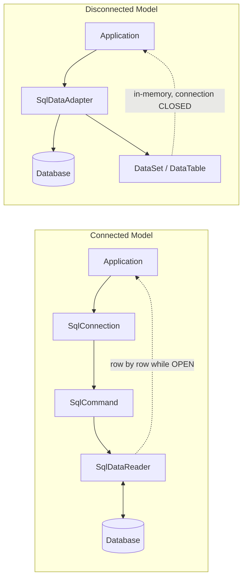
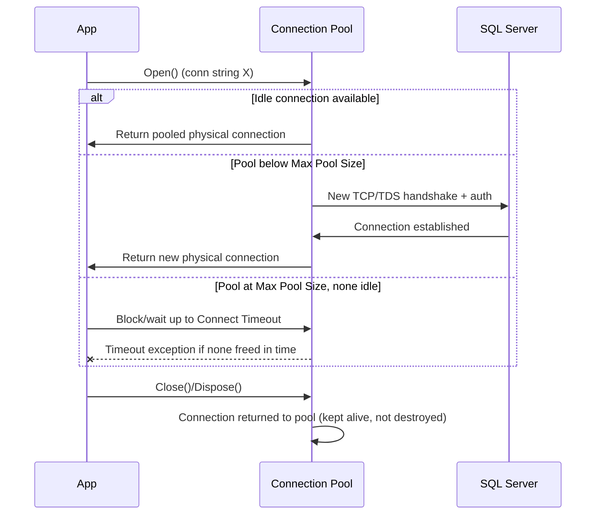
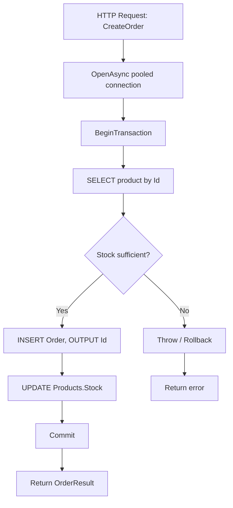

# ADO.NET — Quick Revision Notes (Senior / Lead)

> Quick-revision notes derived from the ADO.NET Interview Guide. Covers every section in the same order — core concepts, intermediate, advanced, performance, best practices, pitfalls, and sample Q&A. Emphasis on nuance, trade-offs, and "why".

---

## 1. Core Concepts

### 1.1 What Is ADO.NET

**Q: What is ADO.NET?**
A: The low-level, provider-based data-access framework in .NET for talking to relational (and some non-relational) sources. Gives you: direct connection management, direct SQL/stored-proc execution, raw result retrieval (no auto object materialization), manual transaction control, and both a **connected** (streaming) and **disconnected** (in-memory) model.

- **Why faster than an ORM:** skips mapping / change-tracking / LINQ-translation layers — faster and more memory-efficient, at the cost of writing boilerplate mapping yourself.
- **Where used today:** high-throughput APIs, reporting/analytics, bulk pipelines, tight-latency microservices, legacy systems. It's also the substrate under Dapper and EF Core — `DbConnection`/`DbCommand` are always there beneath any ORM.

### 1.2 Core Architecture: Connected vs Disconnected

**A) Connected** — live connection held open for the read; data streamed row-by-row; implemented via `DataReader`.
**B) Disconnected** — data pulled once into memory (`DataSet`/`DataTable`); connection closed right after fill; implemented via `DataAdapter`.



**Q: Which do you default to today?**
A: Connected (`DataReader`) for read paths, or better, an ORM/micro-ORM built on the connected model (Dapper/EF Core) for anything beyond simplest CRUD. Hand-rolled `DataSet` is now rare — mostly legacy WinForms/data-binding.

### 1.3 Data Providers

**Q: What is a Data Provider?**
A: The set of ADO.NET classes targeting one specific DB engine. The provider model keeps the object model (`Connection`, `Command`, `DataReader`, `DataAdapter`, `Transaction`) consistent across DBs while the concrete implementation differs per engine.

- SQL Server classes: `SqlConnection`, `SqlCommand`, `SqlDataReader`, `SqlDataAdapter`, `SqlTransaction`.
- **Modern provider note:** `System.Data.SqlClient` is legacy/maintenance mode. Use **`Microsoft.Data.SqlClient`** (NuGet) — supports Always Encrypted, Azure AD auth, TDS 8.0/strict encryption, UTF-8, newer TLS. In any new project, reference `Microsoft.Data.SqlClient`.

### 1.4 Connection Management & Connection Strings

**Typical connection-string components:** Server/Data Source; Initial Catalog (database); Authentication (Windows/Integrated vs SQL login vs Azure AD/Managed Identity — see 4.4); `Connect Timeout`; encryption (`Encrypt=True`, `TrustServerCertificate`); pooling (`Pooling`, `Min Pool Size`, `Max Pool Size`).

```
Server=myServer;Database=myDb;Trusted_Connection=True;
```

```csharp
using (SqlConnection conn = new SqlConnection(connectionString))
{
    conn.Open();
    // work
}
```

**Best practices:** open as late as possible, close as early as possible; always wrap in `using`/`using var` so `Dispose()` runs even on exceptions; never cache/share one long-lived `SqlConnection` across requests — let pooling do that.

### 1.5 Command Execution

`SqlCommand` = a SQL statement or stored proc to run against a connection.

**CommandType:** `Text` (raw SQL, default); `StoredProcedure`; `TableDirect` (rarely used, provider-specific — mainly OLE DB/Access/ODBC, not commonly used with `Microsoft.Data.SqlClient`).

```csharp
SqlCommand cmd = new SqlCommand("SELECT * FROM Users", conn);
```

**Q: Why avoid `SELECT *`?**
A: Schema drift breaks ordinal-based reads, wastes bandwidth on unused columns, and can prevent covering-index usage on the server.

### 1.6 Execution Methods

| Method | Returns | Typical Use |
|---|---|---|
| `ExecuteReader()` | `SqlDataReader` (forward-only, streaming) | SELECT with multiple rows/columns; large/streamed results |
| `ExecuteNonQuery()` | `int` (rows affected) | INSERT / UPDATE / DELETE / DDL |
| `ExecuteScalar()` | `object` (first column of first row) | Aggregates (`COUNT`, `SUM`), existence checks |

```csharp
using (SqlDataReader reader = cmd.ExecuteReader())
{
    while (reader.Read())
        string name = reader["Name"].ToString();
}

SqlCommand countCmd = new SqlCommand("SELECT COUNT(*) FROM Users", conn);
int count = (int)countCmd.ExecuteScalar();
```

**Gotcha:** `ExecuteScalar()` returns `object`. No-rows/empty result → C# `null`; a `NULL` value in the selected cell → `DBNull.Value`. Guard against **both** before casting.

---

## 2. Intermediate Topics

### 2.1 Parameterized Queries & SQL Injection Prevention

**Purpose:** prevent SQL injection AND let SQL Server reuse cached execution plans (no recompile per literal).

```csharp
// WRONG: vulnerable + defeats plan caching
string sql = "SELECT * FROM Users WHERE Name = '" + userInput + "'";

// CORRECT
cmd.Parameters.Add("@Name", SqlDbType.VarChar, 100).Value = userInput;
```

**`AddWithValue` vs explicit typing (real gotcha):**

```csharp
cmd.Parameters.AddWithValue("@UserId", 1);                 // infers type from CLR value at runtime
cmd.Parameters.Add("@UserId", SqlDbType.Int).Value = 1;    // preferred: pins type/size
```

- `AddWithValue` infers SQL type/length from the .NET value each call. Varying string lengths generate **different parameter signatures** (e.g., `nvarchar(4)` vs `nvarchar(12)`), defeating plan reuse and bloating the plan cache with near-duplicate plans.
- Explicit `SqlDbType` + size pins the signature → one cached plan reused.
- **Benefits recap:** security, plan reuse, safe type handling, no manual concat/escaping bugs.

### 2.2 DataReader (Connected Model) Deep Dive

- Requires an **open connection** for the whole iteration.
- **Forward-only, read-only** cursor — no backward seek, no in-place edits.
- Lowest memory footprint — only current row materialized.
- **Advantages:** best raw throughput; ideal for streaming large results to a consumer (HTTP response, CSV).
- **Limitations:** no random access, no data binding without extra work, ties up a pooled connection for the whole read.

```csharp
using (SqlDataReader reader = cmd.ExecuteReader())
{
    while (reader.Read())
        string name = reader["Name"].ToString();
}
```

**Q: How to avoid ordinal/column-name lookup cost in a hot loop?**
A: Cache ordinals once via `reader.GetOrdinal("Name")`, then use typed accessors (`GetString(ord)`, `GetInt32(ord)`) instead of the indexer, which boxes and does a name lookup every row.

### 2.3 DataSet / DataTable / DataAdapter (Disconnected Model) Deep Dive

- **DataSet:** in-memory; can hold multiple related `DataTable`s with relations/constraints; no active connection once filled — good for offline processing, caching, classic WinForms/WebForms binding.

```csharp
SqlDataAdapter adapter = new SqlDataAdapter(query, conn);
DataTable table = new DataTable();
adapter.Fill(table);
```

- **Advantages:** offline processing; built-in change tracking (`AcceptChanges`/`RejectChanges`); native data binding; `adapter.Update()` can push edits back with auto-generated INSERT/UPDATE/DELETE via `SqlCommandBuilder`.
- **Disadvantages:** much higher memory (every column boxed as `object` in `DataRow`); slower than `DataReader`; dated API vs async/LINQ patterns.
- **Senior framing:** largely legacy-maintenance now. New code → `DataReader` + manual mapping, Dapper, or EF Core, unless extending an existing WinForms/WebForms codebase built on it.

### 2.4 Transactions & ACID

**Purpose:** guarantee atomic, all-or-nothing execution across one or more statements.

**ACID:** **Atomicity** (all or none); **Consistency** (valid state → valid state, constraints never violated mid-way); **Isolation** (concurrent txns don't see each other's uncommitted changes — degree configurable, see 3.3); **Durability** (committed changes survive a crash via write-ahead log/journal).

```csharp
SqlTransaction transaction = conn.BeginTransaction();
try
{
    cmd.Transaction = transaction;
    cmd.ExecuteNonQuery();
    transaction.Commit();
}
catch
{
    transaction.Rollback();
    throw; // don't swallow — rethrow after rollback
}
```

**Use cases:** financial postings; multi-table updates (order + inventory + payment); anything where a partial write corrupts invariants.

**Senior tips:** keep scope minimal (only statements that need atomicity); never do network calls/user I/O/long computation inside an open txn (holds locks, blocks others); always rethrow after `Rollback()` unless deliberately converting the failure.

### 2.5 Error Handling

Catch the **provider-specific** exception, not bare `Exception`, so you can branch transient vs permanent:

```csharp
try { /* DB op */ }
catch (SqlException ex)
{
    // ex.Number: 1205 = deadlock victim, -2 = timeout, 4060 = invalid DB
    // log with correlation id
    throw;
}
```

**Nuance:** `SqlException.Number` says *what kind* of failure. Deadlock victims (1205) and timeouts are often safe to retry; constraint violations (2627/2601 unique key) or permission errors (229/230) are not. Feeds directly into 3.7 (Retry & Resilience).

---

## 3. Advanced Topics

### 3.1 Connection Pooling Internals & Tuning

Provider keeps a pool of already-established **physical** connections per unique connection string ("pool key"), reusing them instead of a new TCP/TDS handshake + re-auth per logical `Open()`.

**How it works:**
- Keyed by the **exact** connection string (plus a few identity settings). A single space/case difference → **separate pools** — subtle bug when strings are built dynamically per tenant/user.
- `Open()` asks the pool for an idle valid connection; if present, returned immediately (no handshake).
- `Close()`/`Dispose()` **returns** the connection to the pool — does **not** tear down TCP. This is why "open late, close early" is cheap.
- No idle connection + pool below `Max Pool Size` (default 100) → a new physical connection is created.
- Pool at `Max Pool Size` and none free → caller **blocks** up to `Connect Timeout`, then throws `InvalidOperationException: Timeout expired...`. Classic symptom of a **connection leak** (opened but never disposed on some path).
- Idle connections beyond `Min Pool Size` pruned after ~4–8 min inactivity (provider-version dependent).

| Keyword | Effect |
|---|---|
| `Pooling=true/false` | Disable only for diagnostics; keep on in production |
| `Max Pool Size` | Ceiling on concurrent physical connections per pool; raise cautiously (DB has its own max) |
| `Min Pool Size` | Pre-warms N connections; avoids cold-start latency spikes after idle |
| `Connect Timeout` | How long `Open()` waits for a free/new connection before failing |
| `Connection Lifetime` | Recycles connections older than N sec — useful for load-balanced failover (verify exact keyword per provider) |

**Interview-grade insight:** pool exhaustion is almost always an app bug (leaks, or opening one connection per loop item without disposing) — the fix is finding the leak, **not** "raise Max Pool Size" as a first move.



### 3.2 Async ADO.NET & CancellationToken

Best practice: use `*Async` overloads everywhere in server-side code to avoid tying up a thread-pool thread while waiting on DB network I/O.

```csharp
await conn.OpenAsync(token);
using SqlCommand cmd = new SqlCommand(sql, conn);
using SqlDataReader reader = await cmd.ExecuteReaderAsync(token);
while (await reader.ReadAsync(token)) { /* ... */ }
```

Key async members: `OpenAsync`, `ExecuteReaderAsync`, `ExecuteNonQueryAsync`, `ExecuteScalarAsync`, `ReadAsync`, `NextResultAsync`.

**Benefits:** non-blocking threads, better scalability under concurrent load, improved responsiveness — solves ASP.NET thread-pool starvation under load.

**Key nuance (often mis-stated):** async improves **throughput/scalability**, NOT single-query **latency**. One async DB call isn't "faster" than sync — it just frees the thread to do other work while waiting. Don't claim async makes queries faster.

**CancellationToken:** propagate the token to every async DB call so client disconnects/timeouts actually abort the in-flight command (wire to `HttpContext.RequestAborted`).

**Common mistake:** mixing sync + async (`.Result`, `.Wait()`, `GetAwaiter().GetResult()`) — can deadlock where a sync context exists and defeats the purpose.

### 3.3 Transaction Isolation Levels & TransactionScope (Ambient Transactions)

Isolation is a **spectrum** trading correctness against concurrency/throughput.

| Isolation Level | Dirty Read | Non-Repeatable Read | Phantom Read | Notes |
|---|---|---|---|---|
| `ReadUncommitted` | Possible | Possible | Possible | "NOLOCK"; avoid for transactional work |
| `ReadCommitted` (SQL Server default) | Prevented | Possible | Possible | Locks released after each statement |
| `RepeatableRead` | Prevented | Prevented | Possible | Holds shared locks until txn end — more blocking |
| `Serializable` | Prevented | Prevented | Prevented | Highest isolation, highest contention/deadlock risk |
| `Snapshot` | Prevented | Prevented | Prevented | Row-versioning (no blocking readers/writers), needs `ALLOW_SNAPSHOT_ISOLATION` |

```csharp
using SqlTransaction tx = conn.BeginTransaction(IsolationLevel.ReadCommitted);
```

**TransactionScope / ambient transactions:** wrap ADO.NET calls (and multiple resources) in a transaction without threading a `SqlTransaction` through every command — `System.Transactions` detects the ambient txn and enlists connections automatically.

```csharp
using (var scope = new TransactionScope(
           TransactionScopeAsyncFlowOption.Enabled)) // required for async paths
{
    using var conn = new SqlConnection(connectionString);
    await conn.OpenAsync();
    await cmd.ExecuteNonQueryAsync(); // auto-enlists in ambient txn
    scope.Complete(); // marks success; omit/throw to roll back
}
```

**Gotchas:**
- Forgetting `TransactionScopeAsyncFlowOption.Enabled` → ambient txn doesn't flow across `await` (pre-.NET-Core could throw).
- **Two different connections** enlisting in one scope → escalates to **DTC/MSDTC** distributed transaction — heavier; DTC limited/unavailable on Linux/containers (verify per version).
- `TransactionScope` defaults to **`Serializable`** isolation unless you set `TransactionOptions.IsolationLevel` — common cause of unexpected blocking/deadlocks for devs who assumed `ReadCommitted`.

### 3.4 Multiple Active Result Sets (MARS)

By default a single `SqlConnection` allows only **one** active `DataReader` at a time — opening a second while the first is being read throws `InvalidOperationException`.

**MARS** (`MultipleActiveResultSets=True`) lets multiple batches/readers interleave on one physical connection — useful when iterating a reader and needing a per-row lookup without a second connection.

```
Server=.;Database=ShopDB;Trusted_Connection=True;MultipleActiveResultSets=True;
```

**Trade-off:** MARS is a convenience, not a perf feature — interleaved ops are still serialized on the wire (cooperative multiplexing, not true parallelism) and add server-side session overhead. Seniors prefer restructuring (load lookup data first, or JOIN) and reserve MARS for ORM internals (EF Core enables it by default).

### 3.5 SqlBulkCopy for High-Volume Inserts

For thousands-to-millions of rows, row-by-row `INSERT` (even parameterized/batched) is far slower than SQL Server's native bulk-load path. `SqlBulkCopy` wraps that path.

```csharp
using var bulkCopy = new SqlBulkCopy(connection, SqlBulkCopyOptions.Default, transaction)
{
    DestinationTableName = "dbo.Orders",
    BatchSize = 5000,
    BulkCopyTimeout = 60
};
bulkCopy.ColumnMappings.Add("OrderId", "OrderId");
bulkCopy.ColumnMappings.Add("ProductId", "ProductId");
await bulkCopy.WriteToServerAsync(dataTable /* or IDataReader */, cancellationToken);
```

**Why fast:** streams rows via the TDS bulk-insert protocol, largely bypassing per-row transaction-log overhead (especially with `SqlBulkCopyOptions.TableLock` + a table/index config supporting minimal logging).

**Talking points:**
- Source can be `DataTable`, `DataRow[]`, or (more memory-efficient) any `IDataReader` — stream one query straight into another table without materializing everything.
- `KeepIdentity`, `CheckConstraints`, `FireTriggers` are default-OFF — bulk copy **skips constraint checks and triggers by default** — a real correctness gotcha if business logic depends on triggers.
- **When NOT to use:** small batches, or when you need per-row error handling/business validation → plain parameterized batched inserts are simpler and safer.

### 3.6 Reading & Streaming Large Objects (BLOBs/CLOBs)

Loading a large `VARBINARY(MAX)`/`NVARCHAR(MAX)` fully into memory via `reader["Column"]` can blow up memory. Stream instead:

```csharp
using SqlDataReader reader = await cmd.ExecuteReaderAsync(
    CommandBehavior.SequentialAccess, token); // required for true streaming

if (await reader.ReadAsync(token))
{
    using Stream blobStream = reader.GetStream(reader.GetOrdinal("FileContent"));
    using Stream output = File.Create(destinationPath);
    await blobStream.CopyToAsync(output, token);
}
```

- `CommandBehavior.SequentialAccess` is **required** to stream — gives up random column access in exchange for not buffering the whole row.
- Streaming accessors: `reader.GetStream()`, `GetTextReader()`, `GetSqlBytes()`. Under `SequentialAccess`, columns must be read **in ordinal order and only once**.
- Matters for file-serving APIs, large-document export, avoiding LOH (Large Object Heap) pressure from big `byte[]` allocations.

### 3.7 Retry & Resilience for Transient Faults

Cloud SQL (Azure SQL) and on-prem SQL under load throw **transient** errors: throttling, failover, network blips, deadlock-victim selection. Distinguish retryable from non-retryable and retry with backoff — never blindly.

**Approach:**
- Use `Microsoft.Data.SqlClient`'s built-in **configurable retry** (`SqlRetryLogicBaseProvider`, v3+), or wrap with **Polly** for a provider-agnostic policy.
- Classify by `SqlException.Number`: transient Azure SQL codes include 40613 (DB unavailable), 40501 (service busy), 40197, 4060, 1205 (deadlock victim), -2 (timeout). Non-transient: 2627 (constraint), 18456 (auth), syntax errors.
- Exponential backoff **with jitter** to avoid thundering-herd against a struggling server.
- **Idempotency matters:** only auto-retry idempotent ops, or wrap the retryable unit in a transaction so a retry after a failed commit doesn't double-apply. Retrying a bare `INSERT` without a dedupe key/txn boundary can create duplicate rows if failure hit after server commit but before client ack.

```csharp
var retryPolicy = Policy
    .Handle<SqlException>(ex => IsTransient(ex.Number))
    .WaitAndRetryAsync(3, attempt =>
        TimeSpan.FromMilliseconds(200 * Math.Pow(2, attempt)) +
        TimeSpan.FromMilliseconds(Random.Shared.Next(0, 100))); // jitter

await retryPolicy.ExecuteAsync(async ct =>
{
    await conn.OpenAsync(ct);
    await cmd.ExecuteNonQueryAsync(ct);
}, token);
```

**Q: Why not retry everything?**
A: Retrying a non-idempotent write against a server that actually succeeded (but ack was lost) duplicates side effects; retrying non-transient errors (bad SQL, permissions) wastes time and hides real bugs.

### 3.8 High-Scale End-to-End Example

Order endpoint combining async, pooling, a 3-statement transaction, parameterization, cancellation.



```csharp
public async Task<OrderResult> CreateOrderAsync(int productId, int quantity, CancellationToken token)
{
    string connectionString = "Server=.;Database=ShopDB;Trusted_Connection=True;";
    using SqlConnection conn = new SqlConnection(connectionString);
    await conn.OpenAsync(token);
    using SqlTransaction transaction = conn.BeginTransaction();
    try
    {
        // 1. Read product
        SqlCommand productCmd = new SqlCommand(
            "SELECT Id, Name, Price, Stock FROM Products WHERE Id = @ProductId", conn, transaction);
        productCmd.Parameters.Add("@ProductId", SqlDbType.Int).Value = productId;

        Product product = null;
        using (SqlDataReader reader = await productCmd.ExecuteReaderAsync(token))
        {
            if (await reader.ReadAsync(token))
                product = new Product {
                    Id = reader.GetInt32(0), Name = reader.GetString(1),
                    Price = reader.GetDecimal(2), Stock = reader.GetInt32(3) };
        }
        if (product == null) throw new Exception("Product not found");
        if (product.Stock < quantity) throw new Exception("Insufficient stock");

        // 2. Insert order
        SqlCommand orderCmd = new SqlCommand(
            "INSERT INTO Orders(ProductId, Quantity, TotalAmount) OUTPUT INSERTED.Id VALUES(@ProductId, @Qty, @Total)",
            conn, transaction);
        orderCmd.Parameters.Add("@ProductId", SqlDbType.Int).Value = productId;
        orderCmd.Parameters.Add("@Qty", SqlDbType.Int).Value = quantity;
        orderCmd.Parameters.Add("@Total", SqlDbType.Decimal).Value = product.Price * quantity;
        int orderId = (int)await orderCmd.ExecuteScalarAsync(token);

        // 3. Update inventory
        SqlCommand stockCmd = new SqlCommand(
            "UPDATE Products SET Stock = Stock - @Qty WHERE Id = @ProductId", conn, transaction);
        stockCmd.Parameters.Add("@Qty", SqlDbType.Int).Value = quantity;
        stockCmd.Parameters.Add("@ProductId", SqlDbType.Int).Value = productId;
        await stockCmd.ExecuteNonQueryAsync(token);

        transaction.Commit();
        return new OrderResult { OrderId = orderId, ProductName = product.Name, Quantity = quantity };
    }
    catch { transaction.Rollback(); throw; }
}
```

```csharp
public class Product { public int Id; public string Name; public decimal Price; public int Stock; }
public class OrderResult { public int OrderId; public string ProductName; public int Quantity; }
```

Disconnected-model batch retrieval:

```csharp
public DataTable GetProducts()
{
    using SqlConnection conn = new SqlConnection(_connectionString);
    SqlCommand cmd = new SqlCommand("SELECT Id, Name, Price, Stock FROM Products", conn);
    SqlDataAdapter adapter = new SqlDataAdapter(cmd);
    DataTable table = new DataTable();
    adapter.Fill(table);
    return table;
}
```

**Practices demonstrated:** async end-to-end, transactions for multi-statement consistency, minimal connection lifetime, parameterization, implicit pooling, `CancellationToken` propagation, `using` for deterministic disposal.

---

## 4. Performance

### 4.1 Performance Best Practices

- Always parameterize (security + plan-cache reuse).
- Avoid `SELECT *` — name columns explicitly.
- Ensure indexes support your WHERE/JOIN/ORDER BY predicates.
- Prefer `DataReader` (or a thin mapper) for read-heavy, high-throughput paths.
- Minimize connection open time — open late, close early; let pooling absorb churn.
- Avoid `DataSet`/`DataTable` unless you truly need disconnected/data-binding semantics.
- Batch where possible (multi-row inserts, table-valued parameters, or `SqlBulkCopy` for large volumes — see 3.5).
- Cache reader column ordinals in hot loops; use typed `Get*` accessors over the string indexer.
- Use `CommandBehavior.SequentialAccess` + streaming for large columns (see 3.6).
- Prefer async all the way through the server-side call stack for scalability under load.

### 4.2 ADO.NET vs Dapper vs EF Core Trade-offs


| Aspect | ADO.NET (raw) | Dapper | EF Core |
|---|---|---|---|
| Abstraction | None — you write SQL + mapping | Minimal — write SQL, it maps to objects | High — LINQ→SQL, change tracking |
| Performance | Fastest (no mapping overhead) | ~5–10% over raw (verify per version) | Slower for pure reads; change-tracking + compile-cache cold-start overhead |
| Productivity | Lowest — most boilerplate | Medium — still hand-write SQL | Highest — LINQ, no-SQL CRUD, migrations |
| Change tracking / UoW | Manual | None | Built-in `DbContext` tracker |
| Migrations | None | None | Built-in (`dotnet ef migrations`) |
| Complex graphs | Manual joins + mapping | Manual joins + mapping (or multi-mapping) | Navigation props, `Include()`, automatic |
| Best fit | Bulk, streaming, ultra-hot paths, legacy | Reporting/read-heavy APIs, microservices wanting SQL control | CRUD-heavy apps, rapid iteration, maintainability |
| Learning curve | High (SQL + mapping discipline) | Medium | Lower for CRUD; high for LINQ-translation debugging |

**Senior talking points:**
- Dapper is the common "sweet spot": explicit reviewable SQL, avoids EF's change-tracking/translation surprises, benchmarks near hand-written ADO.NET.
- EF Core overhead mostly matters in high-throughput reads and large graphs; for typical CRUD (hundreds/thousands ops/sec) it's fast enough and productivity dominates.
- **Mixing is legitimate:** EF Core for transactional/CRUD core, ADO.NET/Dapper for reporting, bulk jobs, hot paths. Good answer to "rewrite everything in ADO.NET for perf?" → "No, profile first, drop abstraction only where proven."
- `AsNoTracking()`, compiled queries, and `ExecuteUpdate`/`ExecuteDelete` (EF Core 7+) close much of the historical gap without abandoning the ORM.

### 4.3 ExecuteUpdate / ExecuteDelete (EF Core 7+) — Closing the Bulk-Operation Gap

Historically, bulk writes forced teams to drop to raw ADO.NET/Dapper because EF Core's change tracking meant loading each entity, mutating it, and `SaveChanges()` — one round trip per entity + tracker overhead — even when the intent was a single set-based statement.

**EF Core 7 added `ExecuteUpdateAsync`/`ExecuteDeleteAsync`** — compile a LINQ query directly into a single set-based `UPDATE`/`DELETE`, executed immediately, bypassing the change tracker and `SaveChanges()`.

```csharp
await dbContext.Products
    .Where(p => p.CategoryId == 5)
    .ExecuteUpdateAsync(s => s.SetProperty(p => p.Discontinued, true));

await dbContext.Orders
    .Where(o => o.CreatedAt < cutoffDate)
    .ExecuteDeleteAsync();
```

- **Impact on 4.2:** closes much of the perf gap that justified raw ADO.NET for bulk `UPDATE`/`DELETE` — LINQ ergonomics + strong typing with one efficient set-based statement, no materialization/snapshotting/N-round-trip `SaveChanges()`.
- **Remaining gap — does NOT replace `SqlBulkCopy`:** only addresses set-based UPDATE/DELETE. For very large bulk **INSERTs**, `SqlBulkCopy` (3.5) is still meaningfully faster (native TDS bulk-load path). Senior line: "EF 7+ closed the gap for bulk updates/deletes, not bulk inserts — that's still `SqlBulkCopy` territory."

**Q: Does `ExecuteUpdate` respect global query filters and interceptors?**
A: Yes — it still goes through EF Core's query pipeline (model, filters, value converters); it just skips the change tracker and emits one SQL statement instead of per-entity round trips.

### 4.4 Managed Identity / Azure AD Authentication with Microsoft.Data.SqlClient

Elaborates the "Azure AD/Managed Identity" bullet from 1.4. Increasingly probed given the push to passwordless/secret-free cloud.

**What Managed Identity is:** an Azure AD (Entra ID) identity Azure auto-provisions and binds to a specific resource (App Service, VM, Function, Container App, AKS pod). App authenticates *as that resource's identity* — no password, secret, or certificate to store/rotate/leak. Azure issues and rotates the credentials transparently.
- **System-assigned:** 1:1 with the resource lifecycle (deleted with it).
- **User-assigned:** standalone resource attached to one or more compute resources — for sharing one identity/permission set.

**How `Microsoft.Data.SqlClient` supports it:** the `Authentication` connection-string keyword tells the driver to acquire an Azure AD token instead of sending a SQL login/password.

```
Server=tcp:myserver.database.windows.net,1433;Database=myDb;Authentication=Active Directory Managed Identity;Encrypt=True;
```

```
# user-assigned: also specify the identity's client ID
Server=tcp:myserver.database.windows.net,1433;Database=myDb;Authentication=Active Directory Managed Identity;User Id=<managed-identity-client-id>;Encrypt=True;
```

`Authentication=Active Directory Default` = broader variant using a credential-discovery chain (managed identity in Azure, falling back to env vars, VS/Azure CLI login locally) — same connection string works in Azure and on a dev machine.

```csharp
using Microsoft.Data.SqlClient;
var connectionString =
    "Server=tcp:myserver.database.windows.net,1433;Database=myDb;" +
    "Authentication=Active Directory Managed Identity;Encrypt=True;";
using SqlConnection conn = new SqlConnection(connectionString);
await conn.OpenAsync(); // driver acquires the AAD token transparently on Open()
```

**Alternative token path (`Azure.Identity`)** — for more control (custom credential chains, tenant targeting, caching, tokens for other resources): fetch the token yourself and set `SqlConnection.AccessToken` before opening.

```csharp
using Azure.Identity; using Azure.Core; using Microsoft.Data.SqlClient;
var credential = new DefaultAzureCredential();
var ctx = new TokenRequestContext(new[] { "https://database.windows.net/.default" });
AccessToken token = await credential.GetTokenAsync(ctx);
using SqlConnection conn = new SqlConnection(
    "Server=tcp:myserver.database.windows.net,1433;Database=myDb;Encrypt=True;");
conn.AccessToken = token.Token;
await conn.OpenAsync();
```

**Why it's the modern recommended posture:**
- **No secret sprawl** — no password/secret in `appsettings.json`, Key Vault, CI/CD vars, or dev machines; nothing to commit accidentally.
- **Automatic rotation** — Azure manages the credential lifecycle; no password-expiry project for this path.
- **Centralized access control** — grant DB permissions to the AAD identity (`CREATE USER [my-app-identity] FROM EXTERNAL PROVIDER;` + role membership), governed via Entra ID/Azure RBAC, not a separate universe of SQL logins.
- **Reduced blast radius** — no reusable password; token is short-lived and scoped; identity can be revoked at the resource level.

**Q: What happens locally, off Azure, with no managed identity?**
A: `Authentication=Active Directory Default` (or `DefaultAzureCredential`) falls back to developer-context creds (Azure CLI/`az login`, VS sign-in, env vars) — same code path in both environments, no hardcoded local auth story.

---

## 5. Best Practices

- `using`/`using var` for every `IDisposable` (`SqlConnection`, `SqlCommand`, `SqlDataReader`, `SqlTransaction`).
- Always parameterize — never concatenate user input into SQL.
- Open late, close/dispose early; trust pooling.
- Keep transactions short — no network calls, user waits, or heavy compute inside an open txn.
- Prefer async DB APIs in all server-side/API code; propagate `CancellationToken`.
- Right tool per operation: `DataReader`/Dapper for read-heavy hot paths, EF Core for CRUD-heavy logic, `SqlBulkCopy` for bulk loads.
- Explicitly type and size parameters (`SqlDbType` + length) rather than relying purely on `AddWithValue`.
- Catch `SqlException` specifically (not bare `Exception`) to branch on error number for retry decisions.
- Rethrow after `Rollback()` — don't swallow transaction failures.
- Set `CommandTimeout` deliberately for long-running reports/batch jobs instead of accepting the default blindly.

---

## 6. Common Pitfalls

1. **Not understanding connection pooling** — misreading "open late, close early" as wasteful (closing just returns to the pool, doesn't tear down).
2. **String concatenation SQL** — injection risk, defeats plan-cache reuse.
3. **Keeping connections open unnecessarily** — blocks requests, risks pool exhaustion, hurts scalability.
4. **Not disposing readers/connections/transactions** — leaks, pool starvation, lingering locks.
5. **Ignoring async** — sync DB calls on a web request thread cause thread-pool starvation under load.
6. **Using `DataSet`/`DataTable` by habit** — heavier/slower; pick connected model or a mapper unless disconnected semantics are truly needed.
7. **Not handling transactions** — partial multi-statement writes leave the DB inconsistent.
8. **Can't explain performance differences** — DataReader vs DataSet, ADO.NET vs ORM, parameterized vs inline, sync vs async throughput.
9. **Blind retries on transient faults** — retrying non-idempotent writes without txn/dedupe boundary, or retrying non-transient errors and masking bugs.
10. **Assuming async makes a single query faster** — async buys concurrency/scalability, not lower single-call latency.
11. **Forgetting `TransactionScopeAsyncFlowOption.Enabled`** — ambient txn doesn't flow across `await`; or two enlisted connections escalate to a DTC distributed transaction.

---

## 7. Sample Interview Q&A

**Q: Why is ADO.NET faster than an ORM like EF Core?**
A: No change-tracking overhead, no LINQ→SQL translation, no entity materialization/proxying — execute SQL directly and map only requested columns. Trade-off: you write/maintain the mapping and SQL, and lose migrations, navigation properties, LINQ composability.

**Q: When would you choose `DataReader` over EF Core?**
A: High-throughput reads, large/streamed results, reporting queries, or any hot path where profiling shows ORM overhead matters. For CRUD-heavy logic where maintainability/dev speed matter more than micro-latency, EF Core wins.

**Q: Explain connection pooling, including a failure mode you've seen.**
A: Pooling reuses physical connections keyed by connection string, avoiding new TCP/TDS handshake + auth per `Open()`. `Close()`/`Dispose()` returns the connection to the pool, not destroys it — why "open late, close early" is cheap and correct. Failure mode: connection leak — code that opens but fails to dispose on an exception path exhausts the pool; subsequent `Open()` calls block until `Connect Timeout` then throw.

**Q: How do you handle transactions correctly, and what do isolation levels have to do with it?**
A: Keep scope minimal (only statements that must be atomic), commit/rollback promptly, always rethrow after rollback. Isolation level controls how much concurrent txns see of each other's uncommitted/changing data; `ReadCommitted` is the SQL Server default and a fine baseline, but `Serializable`/`Snapshot` may be needed to prevent phantom/non-repeatable reads — at the cost of more blocking/versioning.

**Q: Does async ADO.NET make a single query run faster?**
A: No — the query takes the same time on the server. Async frees the calling thread from blocking on I/O wait so the server handles more concurrent requests with the same thread pool. The win is throughput/scalability, not per-call latency.

**Q: How would you insert 2 million rows efficiently?**
A: Not row-by-row `INSERT` — use `SqlBulkCopy`, which streams via SQL Server's native bulk-load protocol, bypassing per-row overhead. Stream from an `IDataReader` source rather than materializing a `DataTable` if memory matters. Note it skips triggers and constraint checks by default unless opted in via `SqlBulkCopyOptions`.

**Q: `AddWithValue` vs explicitly-typed parameters — why does it matter?**
A: `AddWithValue` infers `SqlDbType`/size from the runtime value, producing different parameter signatures (e.g., varying `nvarchar` lengths) across calls with the same query text, fragmenting the plan cache. Explicit `Add(name, SqlDbType, size)` pins the signature so one execution plan is reused — better performance and predictability at scale.

**Q: When would you use `TransactionScope` instead of `SqlTransaction`?**
A: When a unit of work spans multiple `SqlConnection` instances (or multiple resource managers), or to keep transaction demarcation separate from data-access code (`scope.Complete()` at the outer service layer). Watch for accidental DTC escalation if two distinct connections enlist, and remember it defaults to `Serializable` unless overridden.

---

## Summary of Additions

Added because commonly probed at senior level and previously missing/light:
- **Connection Pooling Internals & Tuning** — pool-key mechanism, blocking/timeout at exhaustion, tuning keywords.
- **Transaction Isolation Levels & TransactionScope** — full isolation table + ambient-txn mechanics, DTC-escalation and default-`Serializable` gotchas.
- **MARS** — the concurrent-reader `InvalidOperationException` gotcha and connection-string question.
- **SqlBulkCopy** — how to insert millions of rows efficiently.
- **Streaming BLOBs/CLOBs** — `CommandBehavior.SequentialAccess` and streaming accessors.
- **Retry & Resilience** — transient-fault classification, idempotency, Polly/`SqlRetryLogicBaseProvider`.
- **ADO.NET vs Dapper vs EF Core** — full three-way comparison (Dapper added).

**Contradictions flagged:** none of substance. Duplicate pitfalls sections were merged. One nuance clarified: "async improves API performance" refined to distinguish throughput/scalability gains from (absence of) single-query latency gains.

## Summary of Gaps Additions (This Pass)

Targeted two gaps in the comparison and connection-string auth coverage:
- **ExecuteUpdate / ExecuteDelete (EF Core 7+)** — expanded from a passing line into a full subsection: how it bypasses change tracking/`SaveChanges()` for set-based writes, and the key nuance that it closes the gap for UPDATE/DELETE but not bulk INSERT (still `SqlBulkCopy`).
- **Managed Identity / Azure AD Auth with Microsoft.Data.SqlClient** — what managed identity is, how `Authentication` keyword and `Azure.Identity`'s `DefaultAzureCredential` acquire tokens instead of SQL logins, and why it's the modern posture (no secret sprawl, auto rotation, centralized Entra ID access control).

**Contradictions flagged:** none — both are elaborations of existing bullets/lines.
