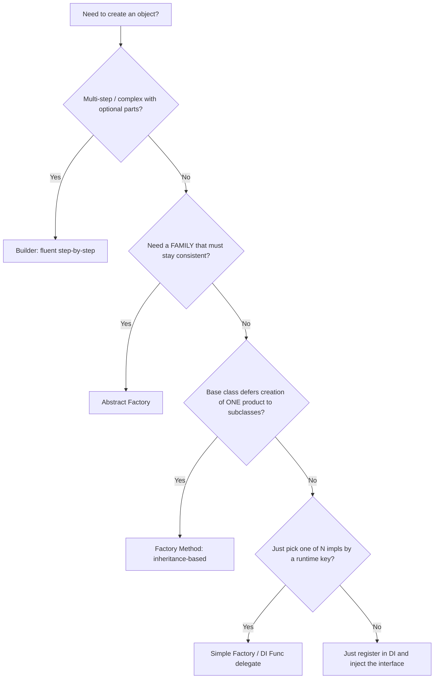
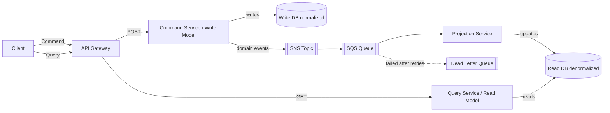
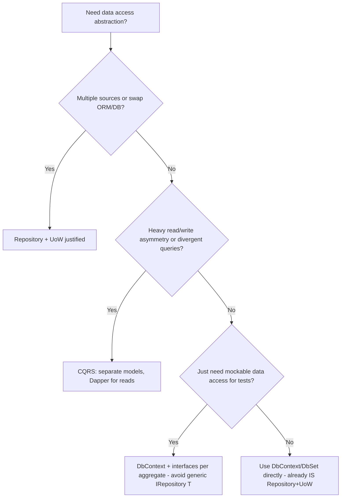

# Design Patterns — Senior .NET Interview: Quick-Revision Notes

> Quick-revision notes derived from the Design Patterns Interview Guide. Covers every section in the same order — Core Concepts, Creational, Structural, Behavioral, Architectural, SOLID, Anti-Patterns, Performance, Best Practices, Pitfalls, and Sample Q&A. Focus is trade-offs, "why," and gotchas.

---

## Core Concepts

**Q: What is a design pattern and why do they exist?**
A: Reusable, named solutions to recurring design problems. They give teams a **shared vocabulary** and encode hard-won trade-offs. GoF classifies 23 patterns into 3 categories.

| Category | Purpose | Examples |
|---|---|---|
| Creational | How objects are **created** | Singleton, Factory Method, Abstract Factory, Builder, Prototype |
| Structural | How objects/classes are **composed** | Adapter, Decorator, Proxy, Facade, Composite, Bridge, Flyweight |
| Behavioral | How objects **communicate/collaborate** | Observer, Strategy, State, Template Method, Command, CoR, Mediator, Iterator, Visitor, Memento |

**Senior framing:** Patterns are trade-offs, not goals. If you can't name the *force* a pattern resolves (variability, coupling, lifecycle, testability), you're over-engineering. Best answer often starts with "do we need a pattern at all, or does a simple function/DI registration solve it?"

---

## Creational Patterns

### Singleton

**Intent:** exactly one instance + global access point.
**Use for:** shared, expensive, effectively stateless/read-only resources — logging, cache wrappers, config snapshots, connection-pool managers.

**Implementations compared:**

| Approach | Thread-safe | Lazy | Notes |
|---|---|---|---|
| Naive `if (_instance==null)` | ❌ | ✔ | Race → multiple instances (demo only) |
| `lock` every access | ✔ | ✔ | Lock overhead on every call |
| Double-checked locking | ✔ | ✔ | Verbose; needs `volatile` to stop reordering |
| Static field / static ctor | ✔ (CLR) | ❌ eager | CLR runs type initializer once per AppDomain |
| `Lazy<T>` | ✔ | ✔ | **Modern default** — clean, safe |
| `LazyInitializer.EnsureInitialized` | ✔ | ✔ | Lower allocation, more verbose |

```csharp
// Recommended modern approach
public sealed class Logger
{
    private static readonly Lazy<Logger> _instance = new(() => new Logger());
    public static Logger Instance => _instance.Value;
    private Logger() { }
    public void Log(string message) =>
        Console.WriteLine($"[{DateTime.UtcNow:O}] {message}");
}
```

```csharp
// Double-checked locking — volatile prevents exposing a partially-constructed object
public sealed class Singleton
{
    private static volatile Singleton? _instance;
    private static readonly object _lock = new();
    private Singleton() { }
    public static Singleton Instance
    {
        get
        {
            if (_instance == null)
                lock (_lock) { _instance ??= new Singleton(); }
            return _instance;
        }
    }
}
```

**Trick question — is this thread-safe?**
```csharp
public static Singleton Instance => _instance ??= new Singleton();
```
**No.** `??=` is not atomic; two threads can both see `null` and construct two instances.

**Singleton in DI (preferred):**
```csharp
builder.Services.AddSingleton<ILogger, Logger>();
```
Gives testability (interface + constructor injection instead of static accessor) and container-managed disposal at shutdown.

**Singleton vs Static class:**

| Singleton | Static class |
|---|---|
| Instance-based | No instance |
| Can implement interfaces | Cannot |
| Works with DI / mocking | Cannot be injected/mocked |
| Holds state with control | Effectively global mutable state |

**When NOT to use:**
- Per-request/per-user state → **stateful Singletons in web apps are a classic bug** (`CurrentUser` shared across all concurrent requests → data leakage).
- Testing: global state makes tests order-dependent, hard to isolate.
- Violates **SRP** (mixes creation-control + behavior) and often **DIP** (callers reach for a concrete global).
- **Distributed/cloud:** scoped to one process. 5 pods = 5 Singletons. Cluster-wide coordination needs a **distributed lock/lease**.
- Never store `HttpContext`, DB connections, or request-scoped objects in a Singleton → **captive dependency** (Singleton capturing a Scoped/Transient keeps it alive forever).

**Reflection/serialization hardening:** `sealed` class, `private` ctor, custom serialization hooks. Reflection can still bypass a private ctor via `Activator.CreateInstance(type, nonPublic: true)` — there's no 100% reflection-proof Singleton; recommended answer: don't fight reflection, use DI-managed singletons.

> Note: the source shows both a `lock`-based and a `Lazy<T>` Logger for the same class — a before/after best-practice progression, not a contradiction.

### Factory Patterns

**Simple Factory (not formal GoF):** static method returning an implementation by input. Cheap and often "good enough."
```csharp
public static class NotificationFactory
{
    public static INotification Create(string type) => type switch
    {
        "email" => new EmailNotification(),
        "sms"   => new SmsNotification(),
        _       => throw new ArgumentException("Invalid notification type")
    };
}
```

**Factory Method (GoF):** base `Creator` defines invariant workflow; subclasses override the factory method to decide the concrete product. Uses **inheritance**.
```csharp
public abstract class Creator
{
    protected abstract IProduct FactoryMethod();
    public string SomeOperation() => $"Creator: working with {FactoryMethod().Operation()}";
}
public class ConcreteCreatorA : Creator
{
    protected override IProduct FactoryMethod() => new ConcreteProductA();
}
```
**Trade-off:** centralizes invariant algorithm (good for OCP — add new Creator/Product pairs without touching existing code), but inheritance is rigid → subclass explosion.

**Abstract Factory (GoF):** interface creating **families of related objects** used together (consistency guarantee).
```csharp
public interface IGuiFactory { IButton CreateButton(); ICheckbox CreateCheckbox(); }
public class WindowsFactory : IGuiFactory
{
    public IButton CreateButton() => new WindowsButton();
    public ICheckbox CreateCheckbox() => new WindowsCheckbox();
}
// Application(IGuiFactory factory) → factory.CreateButton()/CreateCheckbox()
```
Wire the concrete family via DI at runtime:
```csharp
services.AddTransient<IGuiFactory>(sp =>
    configuration["Ui:Platform"] == "windows" ? new WindowsFactory() : new MacFactory());
```

| | Factory Method | Abstract Factory |
|---|---|---|
| Scope | One product | Family of products |
| Mechanism | Inheritance (override method) | Composition (hold factory object) |
| Use case | Vary one product's type | Guarantee compatibility across several |
| Extension | New Creator subclass | New factory implementing the family interface |

**Factory vs Strategy:**

| | Factory | Strategy |
|---|---|---|
| Decides | *How/what object is created* | *Which algorithm/behavior runs* |
| Chosen by | Creation-time key/config | Client/caller per invocation |
| Output | New object instance | Result of executing behavior |
| Relationship | Often constructs/returns a Strategy | Is often the product a Factory returns |

> One-liner: "Strategy answers *which behavior runs*; Factory answers *how the object is built*. Factories often exist specifically to construct and return a Strategy selected by a runtime key."

**DI containers reduce hand-rolled factories:** the container already does creation + lifetime + implementation selection.
```csharp
var service = provider.GetRequiredService<INotificationService>(); // vs ServiceFactory.Create("email")
```
For runtime-parameterized creation, inject a delegate:
```csharp
services.AddTransient<Func<string, IService>>(sp => key => key switch
{
    "email" => sp.GetRequiredService<EmailService>(),
    "sms"   => sp.GetRequiredService<SmsService>(),
    _       => throw new ArgumentException("Invalid type")
});
```
> Line: "DI containers are automatic factories with lifetime management. Hand-written Factory only justified when creation is genuinely complex, must be pluggable outside the container (plugin DLLs), or must enforce a family/consistency guarantee (Abstract Factory)."

**Real ASP.NET Core factories to cite:**

| Factory | Purpose |
|---|---|
| `IHttpClientFactory` | Pools `HttpClient`/handlers, avoids socket exhaustion; named/typed clients, Polly |
| `ILoggerFactory` | Creates category-typed `ILogger<T>`; centralizes provider config |
| `IServiceScopeFactory` | Creates a DI scope manually (e.g., in `BackgroundService`) to resolve Scoped services |
| `IMiddlewareFactory` | Creates `IMiddleware` via DI, enabling scoped dependencies in middleware |

**Plugin architecture (dynamic assembly loading):**
```csharp
foreach (var dll in Directory.GetFiles(pluginFolder, "*.dll"))
    Assembly.LoadFrom(dll);
var plugins = AppDomain.CurrentDomain.GetAssemblies()
    .SelectMany(a => a.GetTypes())
    .Where(t => typeof(IPlugin).IsAssignableFrom(t) && !t.IsInterface && !t.IsAbstract)
    .Select(t => (IPlugin)Activator.CreateInstance(t)!);
```
> Modern alternative (verify vs runtime): `AssemblyLoadContext` for isolated/unloadable plugins; `System.Composition`/MEF for attribute-based discovery — support unloading/version isolation better than raw `Assembly.LoadFrom` + `Activator`.

**Plugin versioning & backward compatibility** — 4 techniques:
- **Adapter layers** — wrap an old plugin's interface behind the current contract.
- **Versioned interfaces** — `IPlugin`, `IPluginV2`… (or a `Version` property) instead of silently breaking old plugins.
- **Feature negotiation** — small optional capability interfaces (`ISupportsCancellation`); host probes via `is`/`as`.
- **Fallback factories** — return a safe **Null Object**/no-op on load failure/incompatibility instead of throwing.

```csharp
public static IPluginV2 LoadPluginWithFallback(Type t)
{
    try
    {
        return Activator.CreateInstance(t) switch
        {
            IPluginV2 v2 => v2,
            IPluginV1 v1 => new PluginAdapter(v1), // versioned interface + adapter
            _            => new NoOpPlugin()        // incompatible → fall back
        };
    }
    catch { return new NoOpPlugin(); } // load failure → fall back
}
```
> Line: "Class explosion and version drift are the real risks. Versioned + capability interfaces let host and plugins evolve independently; adapters and fallback factories keep one bad plugin from downing the host."

### Builder

**Intent:** separate construction of a complex object from its representation → step-by-step construction, multiple representations from the same process.
**Why it matters:** you use it constantly — `HostBuilder`, `WebApplicationBuilder`, `DbContextOptionsBuilder`, EF Core Fluent API, `StringBuilder`. Naming it signals framework fluency.
```csharp
public class PizzaBuilder
{
    private readonly Pizza _pizza = new();
    public PizzaBuilder WithSize(string size) { _pizza.Size = size; return this; }
    public PizzaBuilder AddTopping(string t) { _pizza.Toppings.Add(t); return this; }
    public PizzaBuilder WithExtraCheese() { _pizza.ExtraCheese = true; return this; }
    public Pizza Build() => _pizza;
}
var pizza = new PizzaBuilder().WithSize("Large").AddTopping("Pepperoni").WithExtraCheese().Build();
```
**Modern alternative — records + `with`** for simple immutable cases:
```csharp
public record Pizza(string Size, IReadOnlyList<string> Toppings, bool ExtraCheese);
var custom = basePizza with { Size = "Large", ExtraCheese = true };
```
**Builder still wins when:** construction is genuinely multi-step, needs validation between steps, needs a fluent API for many optional params (avoiding telescoping constructors), or must produce different representations (Director variant).

### Builder vs Factory vs Abstract Factory — Decision Tree



### Prototype

**Intent:** create new objects by copying an existing instance ("prototype") — useful when construction is expensive or you need variations of a preconfigured object.
```csharp
public class Prototype : ICloneable
{
    public List<string> Tags { get; set; } = new();
    public object Clone()
    {
        var clone = (Prototype)MemberwiseClone(); // shallow: ref members shared
        clone.Tags = new List<string>(Tags);      // manual deep copy of mutable ref members
        return clone;
    }
}
```
**Nuance:** `ICloneable` is discouraged in BCL (doesn't specify shallow vs deep, not generic) — prefer explicit `Clone()`/copy-ctors, or records' `with`. In microservices, "prototype" thinking = templated config objects (e.g., a base `HttpRequestMessage` cloned per retry).

---

## Structural Patterns

### Dependency Injection (as a pattern)

DI is a *technique* (IoC): dependencies are provided to a class, not constructed inside it.
```csharp
public class Client { public Client(Service service) => _service = service; }
```
**DI pattern vs DI container** (senior distinction):
- **DI (pattern):** design principle — depend on abstractions, inject via ctor/property/method. Doable with zero libraries ("poor man's DI").
- **DI container (tool):** runtime component resolving the object graph, managing **lifetimes**, adding decoration/interception/assembly scanning.

| Lifetime | Instances | Typical use |
|---|---|---|
| Singleton | 1 per app | Caches, config snapshots, stateless services |
| Scoped | 1 per request/scope | EF Core `DbContext`, per-request UoW |
| Transient | New every resolution | Lightweight, stateless, cheap services |

**Captive dependency gotcha:** injecting Scoped/Transient into a Singleton captures it for the Singleton's lifetime → breaks intended lifetime, can leak a disposed `DbContext`. Detect via `ServiceProviderOptions.ValidateScopes = true` in Development.

### Repository Pattern

**Intent:** abstract data access so domain/service layer isn't coupled to EF Core/Dapper/a specific store.
```csharp
public interface IRepository<T> where T : class
{
    Task<IEnumerable<T>> GetAllAsync();
    Task<T> GetByIdAsync(int id);
    Task AddAsync(T entity);
    Task UpdateAsync(T entity);
    Task DeleteAsync(int id);
}
public class Repository<T> : IRepository<T> where T : class
{
    private readonly AppDbContext _context;
    private readonly DbSet<T> _dbSet;
    public Repository(AppDbContext c) { _context = c; _dbSet = c.Set<T>(); }
    public async Task<IEnumerable<T>> GetAllAsync() => await _dbSet.ToListAsync();
    public async Task<T> GetByIdAsync(int id) => await _dbSet.FindAsync(id);
    public async Task AddAsync(T e) { await _dbSet.AddAsync(e); await _context.SaveChangesAsync(); }
    // Update/Delete similar...
}
```
Specific repos extend the generic for custom queries:
```csharp
public interface IEmployeeRepository : IRepository<Employee>
{ Task<IEnumerable<Employee>> GetEmployeesByDepartmentAsync(string dept); }
```
```csharp
builder.Services.AddScoped(typeof(IRepository<>), typeof(Repository<>));
builder.Services.AddScoped<IEmployeeRepository, EmployeeRepository>();
```
**Use when:** DDD architecture, genuinely swappable persistence, or mockable data access for unit tests.
**Avoid when:** small app; `DbContext`/`DbSet<T>` **already is** repo + UoW (`IQueryable`, change tracking, `SaveChanges` = commit). Wrapping it often adds an indirection layer that leaks `IQueryable` or forces re-inventing filtering/paging/`Include()`. Be ready to argue **both sides**.

### Unit of Work Pattern

**Intent:** coordinate multiple repository operations into a single atomic commit; minimize round-trips.
```csharp
public interface IUnitOfWork : IDisposable
{
    IProductRepository Products { get; }
    ICustomerRepository Customers { get; }
    int Complete();
}
public class UnitOfWork : IUnitOfWork
{
    private readonly ApplicationDbContext _context;
    public IProductRepository Products { get; }
    public ICustomerRepository Customers { get; }
    public UnitOfWork(ApplicationDbContext c)
    { _context = c; Products = new ProductRepository(c); Customers = new CustomerRepository(c); }
    public int Complete() => _context.SaveChanges();
    public void Dispose() => _context.Dispose();
}
```
**Key nuance:** in EF Core the `DbContext` **already is** a UoW (tracks changes across all `DbSet<T>`, commits atomically on `SaveChanges()`). A hand-rolled `IUnitOfWork` over one shared `DbContext` is a **testability/DI-ergonomics wrapper**, not a new transactional capability. Common trap: "doesn't EF Core already do this?"

### Decorator vs Proxy vs Adapter

All three wrap another object behind a same-shaped interface — hence the confusion.

| | Adapter | Decorator | Proxy |
|---|---|---|---|
| Intent | Convert one interface into another the client expects | Add behavior dynamically, same interface | Control access (lazy, security, remoting, caching) |
| Interface | Differs from adaptee | Same as wrapped | Same as real subject |
| Adds behavior? | No — translates | Yes — layers (logging, caching, validation) | Sometimes — access control |
| .NET example | 3rd-party SDK behind your `IPaymentGateway` | `Stream` decorators (`GZipStream` over `FileStream`); middleware | `Lazy<T>` virtual proxy; EF change-tracking proxies |
| Composability | One per adaptee | Freely stackable chains | Usually one per subject |

```csharp
// Adapter
public class StripeSdkAdapter : IPaymentGateway
{
    private readonly ThirdPartyStripeClient _client;
    public StripeSdkAdapter(ThirdPartyStripeClient c) => _client = c;
    public bool Charge(decimal amount) => _client.CreateCharge(amount * 100, "usd") == "succeeded";
}
```
```csharp
// Decorator: add caching without changing callers
public class CachingProductServiceDecorator : IProductService
{
    private readonly IProductService _inner; private readonly IMemoryCache _cache;
    public Product Get(int id) => _cache.GetOrCreate($"product:{id}", _ => _inner.Get(id))!;
}
// Scrutor: services.Decorate<IProductService, CachingProductServiceDecorator>();
```
```csharp
// Proxy: lazy/virtual, delays expensive construction
public class LazyReportGeneratorProxy : IReportGenerator
{
    private readonly Lazy<RealReportGenerator> _real = new(() => new RealReportGenerator());
    public string Generate() => _real.Value.Generate();
}
```
> One-liner: "Adapter changes the *shape*; Decorator adds *behavior* keeping the shape; Proxy controls *access* to the shape. ASP.NET Core middleware is a live Decorator chain over `RequestDelegate`."

### Facade

**Intent:** single simplified interface over a complex subsystem, without hiding subsystem power from callers who need it.
```csharp
public class OrderFacade
{
    private readonly InventoryService _inventory = new();
    private readonly PaymentService _payment = new();
    private readonly ShippingService _shipping = new();
    public string PlaceOrder(int sku, int qty, decimal amount, int orderId)
    {
        if (!_inventory.Reserve(sku, qty)) throw new InvalidOperationException("Out of stock");
        if (!_payment.Charge(amount)) throw new InvalidOperationException("Payment failed");
        return _shipping.Schedule(orderId);
    }
}
```
Real .NET: `HttpClient` is a facade over `HttpMessageHandler`, socket management, and connection pooling.

### Specification Pattern

**Intent:** encapsulate a business rule/query predicate as a composable object (`IsSatisfiedBy`/`ToExpression`) instead of scattering `Where()` lambdas or bloating repository interfaces with one method per query.
```csharp
public interface ISpecification<T> { Expression<Func<T, bool>> ToExpression(); }

public class HighValueCustomerSpecification : ISpecification<Customer>
{
    private readonly decimal _threshold;
    public HighValueCustomerSpecification(decimal t) => _threshold = t;
    public Expression<Func<Customer, bool>> ToExpression() => c => c.LifetimeValue >= _threshold;
}

// Combinator (AND) — the real payoff
public class AndSpecification<T> : ISpecification<T>
{
    private readonly ISpecification<T> _left, _right;
    public AndSpecification(ISpecification<T> l, ISpecification<T> r) { _left = l; _right = r; }
    public Expression<Func<T, bool>> ToExpression()
    {
        var p = Expression.Parameter(typeof(T));
        var body = Expression.AndAlso(
            Expression.Invoke(_left.ToExpression(), p),
            Expression.Invoke(_right.ToExpression(), p));
        return Expression.Lambda<Func<T, bool>>(body, p);
    }
}

// Repo accepts specs instead of growing bespoke methods
public async Task<List<Customer>> FindAsync(ISpecification<Customer> spec) =>
    await _dbSet.Where(spec.ToExpression()).ToListAsync();
```
**Trade-off:** great for reusable/testable/composable rules and avoiding repo-interface bloat; overkill for CRUD-only apps (expression-tree complexity). EF Core translates simple spec expressions to SQL since they're just `Expression<Func<T,bool>>`.

### Bridge, Composite, and Flyweight

Lower interview frequency; know the definition and the lookalike distinction (Bridge vs Adapter, Composite vs Decorator).

**Bridge:** separates an **abstraction** from its **implementation** so both vary independently — avoids combinatorial subclass explosion when two orthogonal dimensions exist (message-type × channel).
```csharp
public interface IChannel { void Send(string message); }
public abstract class Notification
{
    protected readonly IChannel Channel;
    protected Notification(IChannel c) => Channel = c;
    public abstract void Notify(string content);
}
public class Alert : Notification
{
    public Alert(IChannel c) : base(c) { }
    public override void Notify(string content) => Channel.Send($"[ALERT] {content}");
}
var alert = new Alert(new SmsChannel()); // 2 abstractions x 2 channels = 4 combos, no 4 subclasses
```
*Real use:* Alert/Reminder/Digest × Email/SMS/Push — keeps the grid from becoming `AlertEmail`, `AlertSms`, etc.

**Composite:** treat a single object and a composition **uniformly** via a shared interface — classic for trees (file systems, UI trees, org charts, nested validation).
```csharp
public interface IValidationRule { bool IsValid(object input); }
public class CompositeRule : IValidationRule
{
    private readonly List<IValidationRule> _children = new();
    public CompositeRule Add(IValidationRule r) { _children.Add(r); return this; }
    public bool IsValid(object input) => _children.All(r => r.IsValid(input)); // same interface as a leaf
}
```
*Real use:* recursive UI/menu trees; composable business-rule trees where a "group" rule is itself just another `IValidationRule`.

**Flyweight:** minimize memory for many similar objects by **sharing intrinsic (context-independent) state** and keeping **extrinsic (context-specific) state** per object — space/time trade-off at scale (thousands–millions).
```csharp
public class GlyphFactory
{
    private readonly Dictionary<(char, string), CharacterGlyph> _cache = new();
    public CharacterGlyph GetGlyph(char symbol, string fontFamily)
    {
        var key = (symbol, fontFamily);
        if (!_cache.TryGetValue(key, out var g)) { g = new CharacterGlyph(symbol, fontFamily); _cache[key] = g; }
        return g;
    }
}
public record RenderedCharacter(CharacterGlyph Glyph, int X, int Y); // extrinsic position outside shared glyph
```
*Real use:* `string.Intern` is a built-in Flyweight; shared glyph/sprite/texture objects referenced by many lightweight entities.

---

## Behavioral Patterns

### Observer

**Intent:** notify multiple dependents on subject state change, without the subject knowing concrete subscriber types.
```csharp
public class NewsPublisher
{
    public event Action<string>? NewsUpdated;
    public void PublishNews(string news) => NewsUpdated?.Invoke(news);
}
```
Used in event-driven code, UI binding (`INotifyPropertyChanged`), pub/sub. In distributed systems scales into **domain events + message brokers** — same intent, different transport (in-memory delegate vs SNS/SQS/Kafka).

### Mediator (MediatR)

**Intent:** reduce direct coupling by routing communication through a central mediator instead of components referencing each other.

**With MediatR** (Controller → Mediator → Handler):
```csharp
public class GetOrderByIdQuery : IRequest<OrderDto>
{
    public int OrderId { get; }
    public GetOrderByIdQuery(int id) => OrderId = id;
}
public class GetOrderByIdQueryHandler : IRequestHandler<GetOrderByIdQuery, OrderDto>
{
    private readonly IOrderRepository _repo;
    public GetOrderByIdQueryHandler(IOrderRepository r) => _repo = r;
    public async Task<OrderDto> Handle(GetOrderByIdQuery req, CancellationToken ct) =>
        await _repo.GetOrderByIdAsync(req.OrderId);
}
public class OrdersController : ControllerBase
{
    private readonly IMediator _mediator;
    public OrdersController(IMediator m) => _mediator = m;
    [HttpGet("{id}")] public async Task<IActionResult> GetOrderById(int id) =>
        Ok(await _mediator.Send(new GetOrderByIdQuery(id)));
}
```
```csharp
builder.Services.AddMediatR(cfg => cfg.RegisterServicesFromAssembly(Assembly.GetExecutingAssembly()));
```
> (verify) — older `AddMediatR(Assembly)` overload still works in some versions; MediatR 12+ uses the `cfg =>` delegate. MediatR has changed registration API and licensing across major versions.

| Pros | Cons |
|---|---|
| Decouples controller from concrete service/repo | Adds indirection — harder to trace/jump-to-definition |
| Each handler small, independently testable | Overkill for simple CRUD |
| Natural fit for CQRS | Runtime dispatch → less obvious stack traces |
| Cross-cutting via pipeline behaviors | Another package/convention to onboard |

**Real trade-off:** MediatR **relocates** coupling, doesn't remove it — controller drops `IOrderService`, but handlers still depend on what they need. The real win is **discoverability/consistency of cross-cutting concerns** (one `IPipelineBehavior` for all requests) and **thinner controllers**.
**Use for:** large apps, CQRS separation, DDD, composable cross-cutting behavior.

### Strategy vs State

Structurally identical (interface + swappable impls held by a context); differ in **intent** and **who controls transitions**.

| | Strategy | State |
|---|---|---|
| Intent | Choose algorithm at runtime, **client**-selected | Change behavior via **internal transitions**, object-decided |
| Who switches | Caller/config picks up front | State objects trigger transitions themselves |
| Awareness | Strategies independent | States know about / transition to other states |
| .NET example | `IComparer<T>`, pricing/discount, gateway selection | Order lifecycle, TCP states, workflow engines |

```csharp
// Strategy: caller picks the algorithm
public interface IDiscountStrategy { decimal Apply(decimal total); }
public class TenPercentOff : IDiscountStrategy { public decimal Apply(decimal t) => t * 0.9m; }
public class Checkout
{
    private readonly IDiscountStrategy _strategy;
    public Checkout(IDiscountStrategy s) => _strategy = s; // chosen externally
    public decimal Total(decimal amount) => _strategy.Apply(amount);
}
```
```csharp
// State: object drives its own transitions
public interface IOrderState { IOrderState Next(Order order); string Name { get; } }
public class PendingState : IOrderState
{
    public string Name => "Pending";
    public IOrderState Next(Order o) => new ShippedState(); // state decides next
}
public class Order
{
    public IOrderState State { get; private set; } = new PendingState();
    public void Advance() => State = State.Next(this);
}
```
> One-liner: "Strategy = 'which algorithm should run', chosen externally; State = 'what should this object do now', decided internally in a lifecycle. Transition logic *inside* the swappable classes → State; peers with zero transition awareness → Strategy."

### Template Method

**Intent:** define an algorithm skeleton in a base class, deferring specific steps to subclasses — without letting them change the overall structure. Uses **inheritance** (contrast Strategy = composition).
```csharp
public abstract class ReportGenerator
{
    public sealed string Generate() // sealed skeleton
    {
        var data = FetchData();
        var formatted = FormatData(data);
        return WrapWithHeaderFooter(formatted);
    }
    protected abstract string FetchData();
    protected abstract string FormatData(string rawData);
    protected virtual string WrapWithHeaderFooter(string body) => // optional hook
        $"--- Report ---\n{body}\n--- End ---";
}
public class SalesReportGenerator : ReportGenerator
{
    protected override string FetchData() => "raw sales rows...";
    protected override string FormatData(string raw) => $"Formatted Sales: {raw}";
}
```

| | Template Method | Strategy |
|---|---|---|
| Mechanism | Inheritance — override abstract steps | Composition — inject implementation |
| Flexibility | Fixed shape, variable steps | Entire behavior swappable |
| Runtime swap | No (fixed at compile time) | Yes |
| ASP.NET example | `ControllerBase` filters/lifecycle hooks | `IAuthorizationHandler` chains, payment strategies |

**Pitfall:** overriding the template method itself (if not `sealed`) defeats the purpose — always seal the skeleton, expose only named hooks.

### Command Pattern

**Intent:** encapsulate a request (action + params) as an object → queuing, logging, undo/redo, decoupling invoker from executor.
```csharp
public interface ICommand { void Execute(); void Undo(); }
public class AddItemCommand : ICommand
{
    private readonly List<string> _cart; private readonly string _item;
    public AddItemCommand(List<string> cart, string item) { _cart = cart; _item = item; }
    public void Execute() => _cart.Add(_item);
    public void Undo() => _cart.Remove(_item);
}
public class CommandInvoker
{
    private readonly Stack<ICommand> _history = new();
    public void Run(ICommand c) { c.Execute(); _history.Push(c); }
    public void UndoLast() { if (_history.TryPop(out var c)) c.Undo(); }
}
```
**MediatR connection:** `IRequest<TResponse>` + `IRequestHandler<TRequest,TResponse>` is **Command** (encapsulated request + separate handler) wired through a **Mediator**. "What GoF pattern is MediatR built on?" → "Command + Mediator."

### Chain of Responsibility

**Intent:** pass a request along a chain of handlers until one handles it (or all act), decoupling sender from receivers.
```csharp
public abstract class Handler
{
    protected Handler? Next;
    public Handler SetNext(Handler next) { Next = next; return next; }
    public abstract Task HandleAsync(HttpContext ctx);
}
public class AuthHandler : Handler
{
    public override async Task HandleAsync(HttpContext ctx)
    {
        Console.WriteLine("Checking auth...");
        if (Next != null) await Next.HandleAsync(ctx);
    }
}
```
**Real mapping:** ASP.NET Core `app.Use(...)` middleware pipeline (each calls `await next(context)`) **is** CoR — each link acts, passes through, or short-circuits.

### Visitor and Memento

**Visitor:** add a **new operation** over a heterogeneous object structure (AST, shape hierarchy) without modifying element classes — each element `Accept`s a visitor and double-dispatches to the matching `Visit` overload.
```csharp
public interface IShapeVisitor { void Visit(Circle c); void Visit(Square s); }
public abstract class Shape { public abstract void Accept(IShapeVisitor v); }
public class Circle : Shape
{
    public double Radius { get; init; }
    public override void Accept(IShapeVisitor v) => v.Visit(this);
}
public class AreaVisitor : IShapeVisitor // new op, no change to Circle/Square
{
    public double TotalArea { get; private set; }
    public void Visit(Circle c) => TotalArea += Math.PI * c.Radius * c.Radius;
    public void Visit(Square s) => TotalArea += s.Side * s.Side;
}
```
**Trade-off (inverse of Strategy/Template):** new **operation** = easy (one visitor); new **element type** = touch every visitor. `System.Linq.Expressions.ExpressionVisitor` is the canonical BCL example.

**Memento:** capture/externalize internal state to restore later **without violating encapsulation** — originator decides what's in the snapshot, hands back an opaque token.
```csharp
public class EditorMemento { internal string Content { get; } internal EditorMemento(string c) => Content = c; }
public class TextEditor
{
    public string Content { get; private set; } = "";
    public void Type(string t) => Content += t;
    public EditorMemento Save() => new(Content);
    public void Restore(EditorMemento m) => Content = m.Content;
}
// Caretaker (UndoStack) stores/retrieves opaque mementos only
```
*Real use:* undo/redo stacks, snapshot before a risky operation. In modern C#, an immutable `record` / JSON serialization often gives a "free" memento unless internal state is richer or you must control caretaker exposure.

### Null Object Pattern

**What:** a no-op implementation of an interface substituted where a null would be used → callers never need defensive null checks.
```csharp
public class NullNotifier : ICustomerNotifier { public void Notify(string message) { /* no-op */ } }
public class Customer { public ICustomerNotifier Notifier { get; init; } = new NullNotifier(); } // never null
void SendPromo(Customer c) => c.Notifier.Notify("20% off"); // zero null checks
```
Real BCL example: `NullLogger`/`NullLogger<T>` as a safe default `ILogger`.

**Trade-off vs `Nullable<T>` / nullable refs / Option:**

| Approach | Absence is… | Compiler enforces? | Risk |
|---|---|---|---|
| Null Object | Hidden behind polymorphism | No | Can mask real bugs (no missing signal) |
| `Nullable<T>` / nullable refs | Explicit, typed possibility | Yes | Devs can suppress with `!` |
| Option/Maybe `<T>` | Explicit value, composed functionally | Yes, by construction | Functional learning curve |

**Senior take:** Null Object wins for genuine **polymorphic no-op** applied uniformly across many call sites (or when "doing nothing safely" is valid, e.g. `NullLogger`). For new modern code, nullable refs (compile-time baseline) or Option/Maybe (when absence composes through a pipeline) are better defaults because they surface the "nothing here" case.

---

## Architectural Patterns

### CQRS

**Intent:** separate state-changing parts (**Commands**) from read parts (**Queries**) → different models, optimizations, even different stores.
- **Commands** = intent to change state; typically return success/ID, not the entity.
- **Queries** = read-only, never mutate, return data.



**Why:** better read perf (denormalized views), focused write logic, independent scaling, cleaner testing, natural fit for event-driven/eventually-consistent systems.
**Cost:** complexity — multiple models, replication lag, eventual consistency the UX must handle. Best for complex domains, high read/write asymmetry, divergent queries, audit/event-history.

**CQRS vs Event Sourcing:**
- CQRS = separate read/write **models**; does not require ES.
- ES = persist state as an ordered event sequence; rebuild by replay.
- CQRS **without** ES (write model updates a normal DB, publishes events for read side) or **with** ES (event stream is the source of truth).

```csharp
// Command handler (write side)
public class PlaceOrderHandler : IRequestHandler<PlaceOrderCommand, Unit>
{
    private readonly WriteDbContext _db; private readonly IEventPublisher _events;
    public async Task<Unit> Handle(PlaceOrderCommand cmd, CancellationToken ct)
    {
        var order = Order.Create(cmd.OrderId, cmd.CustomerId, cmd.Items);
        _db.Orders.Add(order);
        await _db.SaveChangesAsync(ct);
        await _events.PublishAsync(new OrderPlacedEvent(order.Id, order.Total));
        return Unit.Value;
    }
}
```
```csharp
// Projection handler (read side) with idempotency
public class OrderPlacedProjectionHandler : IEventHandler<OrderPlacedEvent>
{
    private readonly ReadDbContext _readDb;
    public async Task Handle(OrderPlacedEvent evt)
    {
        if (await _readDb.Orders.FindAsync(evt.OrderId) != null) return; // idempotent (at-least-once)
        _readDb.Orders.Add(new OrderReadModel { Id = evt.OrderId, Total = evt.Total, Status = "Placed" });
        await _readDb.SaveChangesAsync();
    }
}
```

**Operational must-knows:**
1. **Outbox pattern** — persist events to an outbox table in the *same DB transaction* as the write; a background dispatcher publishes reliably. Prevents "wrote DB but crashed before publish" loss.
2. **Idempotency** — tolerate duplicate delivery (at-least-once norm); track processed IDs or upsert.
3. **Event ordering** — partition/message-group keys (`OrderId`) so same-entity events process in order (SQS FIFO `MessageGroupId`).
4. **Schema evolution** — version events; add fields nullable/optional.
5. **Eventual consistency UX** — decide how UI communicates "processing"; read-your-writes fallbacks for critical flows.
6. **Sagas** — multi-service transactions via choreography or orchestration with compensating actions, not distributed 2PC.

**Checklist — worth it?** Many expensive/divergent reads? Complex write logic? Asymmetric scaling? Audit/event history? Mostly "yes" → fits; else over-engineering.

**Incremental rollout (single bounded context, ~4–6 weeks):**

| Phase | Focus |
|---|---|
| 1 | Design commands/events/queries; stand up write API + write DB |
| 2 | Command handlers, outbox table, event publisher |
| 3 | Projection service, read DB, query API |
| 4 | Wire broker end-to-end; idempotency; integration tests |
| 5 | Observability — projection-lag metrics, DLQ alerting — before production |
| 6 | Saga/orchestration only if cross-service workflows actually exist |

> Signals you'd introduce CQRS **per bounded context incrementally**, with outbox + idempotency **before** go-live — not a big-bang rewrite.

**Pitfalls:** CQRS on trivial CRUD; skipping outbox (silent loss); non-idempotent projections (dup side effects); ignoring lag/DLQ monitoring; expecting strong consistency across services.

### Projection Service

The CQRS component that **listens to domain events and materializes the read model** — translates normalized write events into denormalized query-optimized views.
```
OrderPlaced       → OrderSummaryView
PaymentCompleted  → OrderStatusView
ItemAdded         → OrderItemsView
```
**Why a broker (SNS/SQS) between write & read:**

| Guarantee | How |
|---|---|
| Decoupling | Write API only publishes; doesn't wait on read processing |
| Durability | Events persisted across AZs; at-least-once |
| Retry/backoff | Broker retries transient failures |
| Poison isolation | After N retries → DLQ instead of blocking the queue |
| Buffering/elasticity | Queue absorbs spikes; workers autoscale on depth |
| Ordering | FIFO / partition keys (`MessageGroupId = OrderId`) |

**Choosing read store by query shape:**

| Query need | Read store | Why |
|---|---|---|
| Complex search, faceting, free text | Elasticsearch / OpenSearch | Full-text, ranking, multi-field filtering |
| Fast key-value lookup | Redis | Sub-ms reads at high throughput |
| Analytics/aggregation, dashboards | Read-optimized RDBMS / warehouse | Columnar/indexed scans, joins, aggregations |

> Often correct to run *multiple* read stores off one event stream, each tuned to a query shape (Redis for status widget, Elasticsearch for search).
> One-liner: "Projection Service subscribes to domain events and builds materialized read models; the broker gives reliability, retries, ordering, and fault isolation — what makes CQRS practical at scale."

### Distributed Locks / Leases

**Definition:** a lock shared across instances/nodes/pods so only one performs a critical operation at a time — a Singleton's "one per process" does **not** extend across a multi-pod deployment. A **lease** is a lock with a TTL that auto-expires if the holder crashes (avoids permanent deadlock).
**Use cases:** one scheduled job cluster-wide; one worker per queue message; leader election; unique ID/invoice generation across replicas.
**Mechanics:** atomic acquire from a shared store (Redis, SQL, etcd/K8s Lease) → success = leader → others back off → TTL requires periodic **renewal** → dead leader's lease expires → another takes over.
```csharp
using var redLock = await redlockFactory.CreateLockAsync("critical-job", TimeSpan.FromSeconds(30));
if (redLock.IsAcquired) await RunJobAsync();
```
```sql
EXEC sp_getapplock @Resource = 'job-lock', @LockMode = 'Exclusive', @LockTimeout = 0;
```
K8s has a native `Lease` object (in etcd) for leader election.
**Interviewers probe:** atomic acquisition (else split-brain/two leaders), TTL/expiry, renewal protocol, **idempotency of the guarded job** (lease can expire mid-job → another node restarts it), graceful failure if the lock store is down.
**Trade-offs:** external dependency + network-partition risk; Redis **RedLock** has publicized correctness critiques on timing assumptions **(verify current consensus before citing)**; still the standard pragmatic tool.
> Tie-back: "In-process Singleton = one instance per process; a distributed lock/lease is the cluster-wide equivalent when you scale horizontally."

### Options Pattern in .NET

**Intent:** bind config sections to strongly-typed POCOs instead of scattering `IConfiguration["Key:SubKey"]` lookups; integrate config with DI lifetimes.
```csharp
public class SmtpOptions { public string Host { get; set; } = ""; public int Port { get; set; } = 587; public bool UseSsl { get; set; } = true; }
builder.Services.Configure<SmtpOptions>(builder.Configuration.GetSection("Smtp"));
public class EmailSender { public EmailSender(IOptions<SmtpOptions> o) => _options = o.Value; }
```

| Interface | Reload | Lifetime | Use case |
|---|---|---|---|
| `IOptions<T>` | Snapshot at first resolution (no runtime changes) | Singleton | Static-for-app-lifetime settings |
| `IOptionsSnapshot<T>` | Recomputed per Scoped resolution | Scoped only | Settings that change, applied per-request |
| `IOptionsMonitor<T>` | Live-reload + `OnChange` callbacks | Singleton | Long-lived services (background workers) reacting to changes |

**Validation:**
```csharp
builder.Services.AddOptions<SmtpOptions>()
    .Bind(builder.Configuration.GetSection("Smtp"))
    .Validate(o => o.Port > 0, "Port must be positive")
    .ValidateDataAnnotations()
    .ValidateOnStart(); // fail fast at startup
```
> Options is a **typed Factory + Strategy hybrid for config**; `IOptionsMonitor<T>` is conceptually an **Observer** over config changes.

### Repository + Unit of Work vs Raw EF Core / CQRS

The "is this redundant with EF Core in 2026?" debate.

**Core tension:**
- `DbContext` = UoW (change tracking + atomic `SaveChanges`); each `DbSet<T>` ≈ Repository (`IQueryable` + CRUD).
- Generic `IRepository<T>` often **hides** `IQueryable` behind a leaky abstraction (expose `IQueryable` → defeats purpose; or one bespoke method per query → balloons interface).
- Legit reasons to still add Repo/UoW: DDD aggregate boundaries (repo per aggregate root), swappable persistence, centralized complex query composition (pairs with **Specification**).
- In CQRS, many teams **skip Repository on the read side** — Dapper/raw SQL/`AsNoTracking()` projections to DTOs are faster/simpler; Repository stays on the write side to enforce invariants.

> Strong answer: "I don't reach for generic Repository + UoW by default with EF Core — `DbContext` gives both. I add Repository for DDD aggregate boundaries, persistence isolation for testing, or centralized specifications. On the read side (especially CQRS) I favor no-tracking projections or Dapper — the abstraction doesn't pay for itself there."

---

## SOLID Principles

| Principle | One-line | Pattern that helps |
|---|---|---|
| **S** Single Responsibility | One reason to change | Facade, Decorator |
| **O** Open/Closed | Open for extension, closed for modification | Strategy, Factory Method, Decorator, CoR |
| **L** Liskov Substitution | Subtypes substitutable without breaking behavior | Template Method (done right), careful inheritance |
| **I** Interface Segregation | Many small client-specific interfaces over one fat one | Adapter, role interfaces (`IReader`/`IWriter`) |
| **D** Dependency Inversion | Depend on abstractions, not concretions | DI, Abstract Factory, Strategy |

### SOLID in Practice — Violation → Fix

**1. SRP** — validation + persistence + notification in one method → extract each responsibility, orchestrate via a thin service:
```csharp
public class OrderService
{
    // ctor injects OrderValidator, OrderRepository, OrderNotifier
    public async Task PlaceOrderAsync(Order order)
    {
        _validator.Validate(order);
        await _repository.SaveAsync(order);
        await _notifier.NotifyAsync(order);
    }
}
```
**2. OCP** — a `switch` on customer type that changes with every new discount → **Strategy**:
```csharp
public interface IDiscountStrategy { decimal Apply(decimal total); }
public class GoldDiscount : IDiscountStrategy { public decimal Apply(decimal t) => t * 0.8m; }
// new discount = new class, no existing code touched
```
**3. LSP** — `Square : Rectangle` where setting `Width` changes `Height` breaks substitutability → don't force the inheritance:
```csharp
public interface IShape { int Area(); }
public class Rectangle : IShape { public int Width; public int Height; public int Area() => Width * Height; }
public class Square : IShape { public int Side; public int Area() => Side * Side; }
```
**4. ISP** — fat `IWorker { Work(); Eat(); }` forces `RobotWorker.Eat()` to throw → segregate roles:
```csharp
public interface IWorkable { void Work(); }
public interface IFeedable { void Eat(); }
public class RobotWorker : IWorkable { public void Work() {} }
public class HumanWorker : IWorkable, IFeedable { public void Work() {} public void Eat() {} }
```
**5. DIP** — `OrderProcessor` `new`s a concrete `SqlOrderRepository` → depend on abstraction, inject:
```csharp
public interface IOrderRepository { void Save(Order order); }
public class OrderProcessor
{
    private readonly IOrderRepository _repo;
    public OrderProcessor(IOrderRepository repo) => _repo = repo;
    public void Process(Order order) => _repo.Save(order);
}
```

---

## Anti-Patterns

**God Object / God Class:** knows/does too much (`Manager`/`Helper`/`Utils` accreting responsibilities). Symptom of ignoring SRP. Fix incrementally via **Extract Class**/Facade, not big-bang rewrite.

**Anemic Domain Model:** entities are pure data bags (`{ get; set; }`) with logic in separate "Service" classes. Common in EF Core (path of least resistance) but violates encapsulation — invariants unprotected. Fix: rich domain model (behavior on the entity).
```csharp
// ✅ Entity enforces its own invariant
public class Order
{
    public OrderStatus Status { get; private set; }
    public void Cancel()
    {
        if (Status == OrderStatus.Shipped) throw new InvalidOperationException("Cannot cancel a shipped order");
        Status = OrderStatus.Cancelled;
    }
}
```

**Service Locator:** global `ServiceLocator.Resolve<T>()` fetched inside classes instead of constructor injection. Looks like DI but **hides** real dependencies from the public API → undiscoverable, harder to test. `IServiceProvider` used pervasively **inside business logic** is Service Locator in disguise — reserve it for genuine factory/composition-root boundaries.

**Other overused/misapplied:**
- Singleton for **mutable shared state** in web apps (most common real misuse).
- Repository/UoW cargo-culted onto EF Core for simple CRUD.
- MediatR/CQRS on trivial CRUD (indirection tax, no read/write divergence).
- Premature Abstract Factory/Strategy for a single implementation (YAGNI).
- Interface for every class ("Java-itis") — real testability lever is separating pure logic from I/O, not blanket `IFoo`.

---

## Performance Considerations

- **Singleton locking:** prefer `Lazy<T>`/static init over `lock` on every access — locking per call (not just init) is a needless bottleneck under contention.
- **Decorator/Proxy chains:** each layer = virtual call + possible allocation; deep stacks (logging+caching+retry+circuit-breaker) add overhead in hot paths — consider compiled pipelines (`Microsoft.Extensions.Http.Resilience`/Polly `ResiliencePipeline`).
- **MediatR dispatch:** reflection-based resolution has cost; MediatR caches lookups but hot paths (thousands req/s) should benchmark vs direct calls — usually dwarfed by I/O but non-zero. Answer "does MediatR add latency?" → "yes, small; measure, don't assume."
- **CQRS/Projection lag:** read-model staleness under load is a real trade-off — monitor queue depth as the leading indicator.
- **Repository over-abstraction:** wrapping `IQueryable` behind non-queryable methods forces materializing full result sets before filtering → kills SQL-side filtering/paging (a very common EF Core perf bug).
- **Distributed locks:** each acquire/renew = network call; overly fine-grained locking (per-row) dominates latency — coarsen granularity where correctness allows.

---

## Best Practices

- Choose patterns to resolve a **named force** (variability, lifecycle, coupling) — say which force your pattern solves.
- Prefer **composition over inheritance** (Strategy/Decorator over deep hierarchies).
- Let the **DI container be your factory**; write explicit Factory classes only when creation is complex or must live outside the container.
- Keep **Repository/UoW intentional** — DDD boundaries or swappable persistence, not default with EF Core.
- Make cross-cutting concerns **pipeline behaviors/decorators**, not copy-pasted per handler.
- **Seal Template Method skeletons**; expose only named hooks.
- Treat **eventual consistency** as a UX decision, decided/communicated up front.
- Favor **records + `with`** over classic Builder/Prototype for simple immutable data; reserve Builder for multi-step validated construction.

---

## Common Pitfalls

- Non-thread-safe Singleton via `??=` or unsynchronized null-checks.
- Per-request/mutable state (`HttpContext`, `CurrentUser`) in a Singleton.
- Captive dependency: Scoped/Transient injected into a Singleton ctor.
- Generic `IRepository<T>` leaking `IQueryable` or forcing bespoke methods per query.
- Treating `DbContext` + hand-rolled `IUnitOfWork` as adding new transactional guarantees (it doesn't).
- Missing outbox in CQRS → silently lost domain events on crash.
- Non-idempotent event/projection handlers → duplicated side effects on redelivery.
- Confusing Strategy and State — forgetting "who decides the transition."
- Overriding an unsealed Template Method skeleton.
- MediatR/CQRS on simple CRUD "because best practice."
- `IServiceProvider` as a general-purpose Service Locator in business logic.

---

## Sample Interview Q&A

**Q: Singleton vs static class — when pick which?**
A: Singleton is instance-based, implements interfaces, injectable/mockable via DI, carries controlled (ideally read-only) state; static class has no instance, no interfaces, no test substitution, uncontrolled global state. Prefer container-managed Singleton (`AddSingleton<TInterface,TImpl>`); reserve static classes for pure stateless utilities.

**Q: Cluster-wide "only one worker runs this job" across 5 replicas?**
A: In-process Singleton doesn't help (each pod has its own). Use a distributed lock/lease (Redis RedLock, `sp_getapplock`, or K8s `Lease`) with TTL; acquirer becomes leader and renews; if it dies, lease expires and another takes over. Job must be **idempotent** (lease can expire mid-execution).

**Q: When NOT to use Repository with EF Core?**
A: When `DbContext`/`DbSet<T>` already gives querying, tracking, `SaveChanges` as UoW, and you don't need to swap persistence, enforce DDD boundaries, or centralize specifications. Wrapping in generic `IRepository<T>` without a reason adds ceremony and can degrade perf by hiding `IQueryable`.

**Q: Strategy vs State?**
A: Strategy = caller chooses an algorithm externally; strategies are independent. State = object's internal lifecycle where state objects drive transitions. Structurally near-identical; difference is intent and who controls transitions.

**Q: What GoF pattern is MediatR built on, and the real benefit?**
A: Command (each request/handler encapsulates a request as an object) + Mediator (`IMediator` dispatches without sender/receiver knowing each other). Benefit isn't "zero coupling" — it's thinner controllers and consistent cross-cutting behavior via pipeline behaviors.

**Q: Deciding whether to add CQRS?**
A: Check if reads/writes genuinely diverge: many expensive/different read shapes, complex write logic, asymmetric scaling, real audit/event-history. If mostly "no," plain CRUD with a well-modeled domain is simpler — CQRS's eventual consistency and dual-model cost is only worth concrete benefits.

**Q: What's an Anemic Domain Model and why a problem?**
A: Entities as pure property bags with rules externalized into services. Problem: nothing prevents an invalid transition triggered from a code path that forgot the check — the class doesn't protect its invariants. Fix: move behavior onto the entity (`order.Cancel()`).

**Q: Explain the Outbox pattern and why CQRS needs it.**
A: When a handler writes to DB and publishes an event, a crash between commit and publish loses the event → read side permanently stale. Outbox persists the event to an outbox table in the *same* transaction as the write; a separate dispatcher publishes unsent rows, retrying until acked → at-least-once without a distributed transaction.

**Q: Is `IServiceProvider` a Service Locator anti-pattern?**
A: Depends where. Pervasively inside business logic to fetch arbitrary dependencies → yes, it hides real dependencies from the ctor signature. At factory/composition-root boundaries (DI scope in a background worker via `IServiceScopeFactory`, plugin loader resolving runtime-discovered types) → accepted, idiomatic use of the container as a factory.

---

## Summary of Additions & Contradictions Flagged

`[new content]` sections added because missing/thin in source but commonly probed: **Builder**, **Builder vs Factory vs Abstract Factory decision tree**, **Prototype**, **Decorator vs Proxy vs Adapter**, **Facade**, **Specification**, **Strategy vs State**, **Template Method** (source ended on a bare "Template Method:" stub), **Command**, **Chain of Responsibility**, **Options Pattern**, **Repository+UoW vs Raw EF Core/CQRS**, **SOLID violation→fix walkthroughs**, **Anti-Patterns** (God Object, Anemic Domain Model, Service Locator, etc.).

`[gaps]` second-pass additions: **Bridge, Composite, Flyweight**; **Visitor, Memento**; **Null Object Pattern**.

**Contradiction flagged:** source shows two Singleton `Logger` impls (`lock`-based and `Lazy<T>`) — kept both as a before/after best-practice progression, not a real conflict. Uncertain points (current MediatR registration API/version, RedLock correctness debate) marked **(verify)** rather than asserted.
