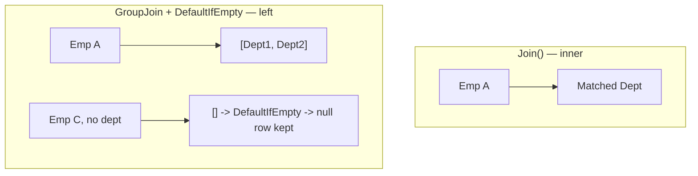
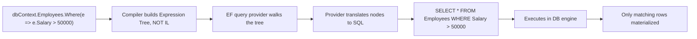

# LINQ — Senior .NET Interview: Quick Revision Notes

> Quick-revision notes derived from the LINQ Interview Guide. Covers every section and sub-topic in the same order — Core, Intermediate, Advanced, Performance, Best Practices, Pitfalls, Worked Exercises, Senior Challenges, and Sample Q&A. Enough to brush up each topic without reopening the guide.

---

## Core Concepts

### What LINQ Is and Why It Exists

- **Definition:** Language-Integrated Query — query operators baked into .NET for querying in-memory collections, DBs, XML, JSON with one consistent, strongly-typed syntax (no bespoke loops / SQL strings).
- **Senior insight — LINQ is really two things in one syntax:**
  1. **LINQ to Objects** — plain delegates (`Func<T,bool>`) run in-memory, one item at a time.
  2. **LINQ to Entities / SQL** — **expression trees** *translated* into SQL and run remotely.
  - Conflating these two is the #1 source of LINQ production bugs/perf incidents.
- **Benefits:** readability (declarative), compile-time type safety + IntelliSense, uniform surface across back ends, deferred execution enables composition and (for `IQueryable`) query optimization before running.

### LINQ Flavors

| Flavor | Target | Interface |
|---|---|---|
| LINQ to Objects | In-memory (arrays, `List<T>`) | `IEnumerable<T>` |
| LINQ to Entities | EF / EF Core | `IQueryable<T>` |
| LINQ to SQL | SQL Server (legacy ORM) | `IQueryable<T>` |
| LINQ to XML | `XDocument` | `IEnumerable<T>` |
| LINQ to JSON | Newtonsoft `JToken` / System.Text.Json | `IEnumerable<T>` |

```csharp
XDocument xml = XDocument.Load("employees.xml");
var names = xml.Descendants("Employee").Select(e => e.Element("Name").Value);

// Once deserialized, JSON is just LINQ to Objects
var users = JsonConvert.DeserializeObject<List<User>>(jsonData);
var activeUsers = users.Where(u => u.IsActive).ToList();
```

### Query Syntax vs Method Syntax

```csharp
var q = from emp in employees where emp.Age > 30 select emp;   // query syntax (SQL-like)
var m = employees.Where(emp => emp.Age > 30);                  // method syntax (fluent)
```

- Both compile to the **same IL** — query syntax is sugar the compiler rewrites into method calls.
- Method syntax dominates: full operator surface (`Sum`, `Count`, `Take`… have no keyword) and composes better.

### Deferred vs Immediate Execution

- **Deferred:** query variable holds a *description* (iterator, or for `IQueryable` an expression tree). Nothing runs until enumerated (`foreach`, `ToList()`, `Count()`, `First()`…).
- **Immediate:** methods producing a concrete answer now — `ToList/ToArray/ToDictionary/Count/Sum/First/Any` (when not chained further) — force enumeration on the spot.

```csharp
var result = employees.Where(e => e.Age > 30); // deferred — nothing ran
Console.WriteLine(result.Count());             // executes HERE
var result2 = employees.Where(e => e.Age > 30).ToList(); // executes immediately
```


- **Why it's tested:** same query variable can yield *different* results on each enumeration if source/captured vars changed.

```csharp
var numbers = new List<int> { 1, 2, 3 };
var query = numbers.Where(n => n > 1);   // deferred
numbers.Add(4);
Console.WriteLine(string.Join(",", query)); // 2,3,4 — NOT 2,3
```

### Closures Over Variables — The Classic Deferred Execution Trap

- Lambdas close over variables **by reference**, not by value at write-time. Change the captured var before enumeration → query sees the new value.

```csharp
int threshold = 30;
var query = employees.Where(e => e.Age > threshold); // captures by reference
threshold = 50;
var result = query.ToList(); // filters using 50, NOT 30
```

- Historical `for`-loop capture bug (still alive for `for`, fixed for `foreach` since C# 5.0):

```csharp
var actions = new List<Action>();
for (int i = 0; i < 3; i++)
    actions.Add(() => Console.WriteLine(i)); // captures the SAME i
actions.ForEach(a => a()); // prints 3,3,3 — not 0,1,2
```

- **Fix:** copy to a per-iteration local.

```csharp
for (int i = 0; i < 3; i++) { int local = i; actions.Add(() => Console.WriteLine(local)); }
```

- `foreach` = new variable per iteration since C# 5.0, so it no longer has this trap — but interviewers ask *why* the fix works.

---

## Intermediate Concepts

### Select vs SelectMany

| | `Select()` | `SelectMany()` |
|---|---|---|
| Output | Preserves nesting (collection of collections) | Flattens one level into a single sequence |
| Use | 1:1 projection | Project + flatten |

```csharp
var r1 = students.Select(s => s.Courses);     // IEnumerable<List<string>>
var r2 = students.SelectMany(s => s.Courses); // IEnumerable<string>, flattened
```

- `SelectMany` also implements **cross join** and the monadic "flatMap".

### First / FirstOrDefault / Single / SingleOrDefault

| Method | Behavior | Throws? |
|---|---|---|
| `First()` | First match | Yes if none/empty |
| `FirstOrDefault()` | First match or `default(T)` | No |
| `Single()` | Exactly one | Yes if zero or >1 |
| `SingleOrDefault()` | Zero or one | Yes if >1; default if zero |

- **Nuance:** `Single()` is an *assertion* of uniqueness (PK lookups) — surfaces data-integrity bugs loudly. Using `First()` when you mean "exactly one" hides bugs.

### Any / All

```csharp
bool hasAdults = users.Any(u => u.Age >= 18);
bool allAdults = users.All(u => u.Age >= 18);
```

- Prefer `Any()` over `Count() > 0` for existence.
- **`All()` on empty = `true`** (vacuous truth); **`Any()` on empty = `false`**. Classic gotcha.

### GroupBy

```csharp
var grouped = users.GroupBy(u => u.City);
foreach (var g in grouped) Console.WriteLine($"{g.Key}: {g.Count()}");
```

- Returns `IEnumerable<IGrouping<TKey,TElement>>`; each grouping is an `IEnumerable` + `.Key`.
- **Deferred**, but in LINQ-to-Objects it must **buffer the entire source** into groups before yielding the first — matters for large sets (doesn't truly stream).

### Join vs GroupJoin (Left Join)

- `Join()` — inner join; one flat row per matching pair.
- `GroupJoin()` — one row per left element with nested matches (models left join / one-to-many); add `.SelectMany(...DefaultIfEmpty())` for a true SQL left outer join.

```csharp
var inner = employees.Join(departments, e => e.DeptID, d => d.ID, (e, d) => new { e.Name, d.Name });

var left = from emp in employees
           join dept in departments on emp.DeptID equals dept.ID into empDept
           from d in empDept.DefaultIfEmpty()
           select new { emp.Name, Department = d?.Name ?? "No Department" };
```



### Aggregate Functions and Aggregate()

```csharp
int total = employees.Sum(e => e.Salary);
double avg = employees.Average(e => e.Salary);
int product = numbers.Aggregate((a, b) => a * b); // custom fold/reduce
```

- `Aggregate()` = generic fold/reduce for when no built-in fits (running string, rolling metric, composing objects).
- **Against `IQueryable`, `Aggregate()` almost never translates to SQL** → client eval or throws.

### Distinct, Except, Intersect, Union

| Method | Result |
|---|---|
| `Except()` | In first, not in second |
| `Intersect()` | Common to both |
| `Union()` | All unique from both (de-dups) |

```csharp
int[] a = {1,2,3,4}; int[] b = {3,4,5,6};
a.Except(b);    // 1,2
a.Intersect(b); // 3,4
a.Union(b);     // 1,2,3,4,5,6
```

- All use `EqualityComparer<T>.Default` unless you pass a custom `IEqualityComparer<T>`. Forgetting the comparer for reference types with custom equality is a common bug.

### ToLookup() vs GroupBy()

| | `GroupBy()` | `ToLookup()` |
|---|---|---|
| Execution | Deferred | **Immediate** |
| Return | `IEnumerable<IGrouping<K,V>>` | `ILookup<K,V>` |
| Indexable by key | No | Yes (`lookup["HR"]`) |
| Missing key | N/A | Returns **empty sequence** (no exception) |

```csharp
var lookup = employees.ToLookup(e => e.Department);
Console.WriteLine(lookup["HR"].Count());
```

### MaxBy, MinBy, DistinctBy, Chunk (.NET 6+)

- **`MaxBy`/`MinBy`** — return the *element* with the max/min key (vs `Max`/`Min` which return only the value). Fixes the "`.Max(f => f.AvgSalary)` loses the department" bug.
- **`DistinctBy`** — de-dup by projected key, no custom comparer needed.
- **`Chunk`** — split into fixed-size batches (last may be smaller), returns `IEnumerable<T[]>`. Use for batching bulk inserts / API limits.

```csharp
var highestPaid = employees.MaxBy(e => e.Salary);  // Employee, not decimal
var perDept     = employees.DistinctBy(e => e.DepartmentId);
foreach (int[] batch in employeeIds.Chunk(100))
    await bulkApiClient.ProcessBatchAsync(batch);  // respect a 100-item limit
```

- **Gotchas:**
  - `MaxBy`/`MinBy` return `default(T)` (null for ref types) on empty — do **not** throw, unlike `Max`/`Min` which throw `InvalidOperationException` on an empty non-nullable value sequence.
  - Ties → return the **first** encountered (same as `OrderBy...First`).
  - EF Core `IQueryable` translation of these varies by provider/version — verify generated SQL.
  - `Chunk`'s last batch can be shorter — always handle partial final batch.

### Take/Skip, Pagination, DefaultIfEmpty, Zip

```csharp
var paged = employees.Skip((pageNumber - 1) * pageSize).Take(pageSize);
var withFallback = employees.Where(e => e.ID == 100).DefaultIfEmpty(new Employee { Name = "Not Found" });
var combined = names.Zip(ages, (name, age) => $"{name} is {age}."); // stops at shorter
```

- **Gotcha:** always pair `Skip`/`Take` with `OrderBy` against `IQueryable` — SQL gives no order guarantee otherwise → non-deterministic pages / duplicates under concurrent writes.

### ToDictionary and Non-Generic Collections

```csharp
var empDict = employees.ToDictionary(e => e.ID, e => e.Name);
ArrayList list = new ArrayList { 1, 2, 3, 4 };
var nums = list.Cast<int>().Where(n => n > 2); // non-generic needs Cast
```

- **`ToDictionary` throws `ArgumentException` on duplicate keys.** For possible dups use `GroupBy` + `ToDictionary(g => g.Key, g => g.ToList())` or `DistinctBy`.

### Let Clause

```csharp
var result = from e in employees
             let bonus = e.Salary * 0.1m
             select new { e.Name, Bonus = bonus };
```

- `let` exists only in query syntax; method-syntax equivalent is an intermediate `Select` of an anonymous type. Readability aid — avoids recomputing an expression.

### Cross Join

```csharp
var result = from e in employees from d in departments select new { e.Name, d.Name };
// == employees.SelectMany(e => departments, (e, d) => new { e.Name, d.Name });
```

- Cartesian product. Rare; usually a bug (forgot a correlating `where`).

---

## Advanced Concepts

### IEnumerable\<T\> vs IQueryable\<T\>

| Feature | `IEnumerable<T>` | `IQueryable<T>` |
|---|---|---|
| Represents | Sequence + delegate `Func<...>` | Sequence + **expression tree** `Expression<Func<...>>` |
| Source | In-memory (LINQ to Objects) | ORMs (EF Core, LINQ to SQL) |
| Filtering happens | In app memory, after materializing | Translated to SQL, runs at source |
| Deferred | Yes | Yes |
| Composability | Each `Where` adds a per-item delegate | Each `Where` adds a tree node; whole tree translated once at enumeration |
| Large remote datasets | Poor — pulls all into memory | Good — pushes filter/sort/page to DB |
| Arbitrary C# in predicate | Yes | No — only what the provider can translate |

```csharp
IEnumerable<int> d1 = numbers.Where(n => n > 5);                        // in-memory
IQueryable<int> d2 = dbContext.Employees.Where(e => e.Salary > 50000);  // SQL in DB
```

- **The trap:** calling `.AsEnumerable()` (or implicitly casting via a non-translatable method) *before* the final `Where` runs that filter client-side after pulling the **entire table** across the wire.

```csharp
var bad  = dbContext.Employees.AsEnumerable().Where(e => e.Salary > 50000); // pulls all, then filters in C#
var good = dbContext.Employees.Where(e => e.Salary > 50000);                // SQL WHERE
```

### Expression Trees and How LINQ-to-Entities Translates to SQL

- Lambda → `Func<T,...>` compiles to **IL** (executable delegate).
- Lambda → `Expression<Func<T,...>>` compiles to **data**: a tree of node objects (`BinaryExpression`, `MemberExpression`, `ConstantExpression`) *describing* the code without running it.



- That's *why* `IQueryable`'s `Where` takes `Expression<Func<T,bool>>` (provider needs the tree to translate), while `IEnumerable`'s takes plain `Func<T,bool>`.

```csharp
Expression<Func<Employee, bool>> isHighEarner = e => e.Salary > 50000;
// .Body / .Parameters inspectable & rewritable at runtime — basis of ProjectTo, Dynamic LINQ, query builders.
```

- **Implication:** any C# with no SQL equivalent (custom methods, most string helpers, complex pattern matching) → throws (strict/old providers) or triggers client eval (EF Core, with warning).

### Client-Eval Fallback and Query Translation Limits (EF Core)

- EF Core (unlike EF6 which threw) translates what it can and **silently pulls the untranslatable part into memory**, logging only a warning (easy to miss).

```csharp
var result = dbContext.Employees
    .Where(e => Regex.IsMatch(e.Name, "^A")) // no SQL translation → pulls ALL rows first
    .ToList();
```

- **Common untranslatable:** arbitrary C# instance/static methods (custom validators, regex, culture-specific string ops); `Aggregate()`; operators needing custom `IComparer`/`IEqualityComparer`; complex nested ternary/pattern matching (version-dependent); anything after dropping to `IEnumerable`.
- **Mitigation:**
  - Make client-eval warnings **throw** in non-prod: `optionsBuilder.ConfigureWarnings(w => w.Throw(RelationalEventId.QueryClientEvaluationWarning))` (API varies by version).
  - Keep filtering/projection inside the `IQueryable` part; call `.AsEnumerable()`/`.ToList()` **last**.
  - `.Select()` onto only needed columns before materializing.

### yield return and Custom Iterators

```csharp
public static IEnumerable<TSource> WhereGreaterThan<TSource, TKey>(
    this IEnumerable<TSource> source, Func<TSource, TKey> selector, TKey threshold)
    where TKey : IComparable<TKey>
{
    foreach (var item in source)
        if (selector(item).CompareTo(threshold) > 0)
            yield return item; // pauses; resumes on next MoveNext()
}
```

- Compiler rewrites `yield return` into a state machine implementing `IEnumerator<T>` — this is *how* `Where`/`Select` achieve deferred, streaming, one-item-at-a-time execution without buffering.
- **Consequences:**
  - Memory-efficient streaming for `Where().Select()` chains.
  - Exceptions surface at `MoveNext()` (enumeration time), not at method call → confusing stack traces.
  - **Gotcha:** argument validation inside an iterator doesn't run until first enumeration. For eager validation, split a public validating wrapper from a private iterator.

```csharp
public static IEnumerable<T> SafeWhere<T>(this IEnumerable<T> source, Func<T, bool> predicate)
{
    if (source is null) throw new ArgumentNullException(nameof(source));      // eager
    if (predicate is null) throw new ArgumentNullException(nameof(predicate));
    return SafeWhereIterator(source, predicate);                             // deferred part
}
private static IEnumerable<T> SafeWhereIterator<T>(IEnumerable<T> source, Func<T, bool> predicate)
{
    foreach (var item in source) if (predicate(item)) yield return item;
}
```

### Custom LINQ Extension Methods

```csharp
public static class MyExtensions
{
    public static IEnumerable<int> GetEvens(this IEnumerable<int> numbers)
        => numbers.Where(n => n % 2 == 0);
}
var evens = numbers.GetEvens();
```

### Dynamic LINQ

```csharp
// Requires System.Linq.Dynamic.Core
var result = employees.AsQueryable().Where("Salary > 50000").ToList();
```

- Build filters/sorts from runtime config (search UIs) without hand-building expression trees.
- **Trade-off:** loses compile-time safety; injection surface if field/operator names come from untrusted input — validate against an allow-list.

### LINQ Method Chaining vs Query Syntax — When to Use Which

| Scenario | Prefer |
|---|---|
| Simple filter/projection/sort | Method — reads left-to-right, composes with any operator |
| Multiple joins, esp. `GroupJoin` + `DefaultIfEmpty` (left join) | Query — `into`/`from` shape more readable |
| `let` for a reused intermediate value | Query — no clean method equivalent |
| Operators with no keyword (`Sum`, `Count`, `Take`, `Distinct`, `Any`, `Aggregate`) | Method — mandatory |
| Fluent, conditionally-built queries | Method — trivially composable |

```csharp
IQueryable<Employee> query = dbContext.Employees;
if (minSalary.HasValue) query = query.Where(e => e.Salary >= minSalary.Value);
if (!string.IsNullOrEmpty(department)) query = query.Where(e => e.Department == department);
```

- Practice: method syntax by default; drop into query syntax for multi-join/`let`-heavy queries. Both can mix in one expression.

---

## Performance

### General Optimization Rules

- Use `.AsEnumerable()` deliberately, and only after all server-side filtering, to switch to LINQ-to-Objects.
- Avoid premature `.ToList()`/`.ToArray()` — forces immediate execution, materializes everything, defeats further composition/provider optimization.
- Prefer `.Any()` over `.Count() > 0` — `Any()` short-circuits; `Count()` may need a full `COUNT(*)`/enumeration.
- Filter with `Where()` **before** `Select()`/`OrderBy()` — smaller working set, cheaper translated query.
- Always pair `Skip`/`Take` with `OrderBy` against `IQueryable`.

### The Multiple Enumeration Pitfall

```csharp
IEnumerable<Employee> highEarners = employees.Where(e => e.Salary > 50000); // deferred
int count = highEarners.Count();  // enumeration #1
var list  = highEarners.ToList(); // enumeration #2
if (highEarners.Any()) { ... }    // enumeration #3
```

- Each terminal op **re-runs the predicate from scratch** against the original source (variable holds an iterator, not cached results).
- **Perf:** 3x work in-memory; **3 separate DB round trips** for LINQ-to-Entities.
- **Correctness:** if source changes between enumerations, results disagree with each other.
- **Fix:** materialize once, then work off the snapshot.

```csharp
var highEarners = employees.Where(e => e.Salary > 50000).ToList(); // ONE enumeration
int count = highEarners.Count;   // List property, no re-enumeration
if (highEarners.Any()) { ... }
```

- Roslyn/ReSharper flag "possible multiple enumeration of IEnumerable".

### Hidden O(n²) Traps — Nested Where/Any Inside Select

```csharp
// O(n*m): for each employee, linear scan of all departments
var result = employees.Select(e => new {
    e.Name, DeptName = departments.FirstOrDefault(d => d.Id == e.DepartmentId)?.Name });

// O(n*m): Any() re-scans blockedIds per item
var filtered = employees.Where(e => !blockedIds.Any(b => b == e.Id));
```

- 50k × 50k linear join = 2.5 billion comparisons.
- **Fix:** pre-index the lookup side into `Dictionary`/`HashSet`/`ILookup` (O(1)), or use `Join`/`GroupJoin` (hash/indexed join, translates to SQL JOIN).

```csharp
var deptById = departments.ToDictionary(d => d.Id, d => d.Name);          // O(n+m)
var result = employees.Select(e => new {
    e.Name, DeptName = deptById.TryGetValue(e.DepartmentId, out var n) ? n : null });

var blockedSet = blockedIds.ToHashSet();
var filtered = employees.Where(e => !blockedSet.Contains(e.Id));

var result2 = employees.Join(departments, e => e.DepartmentId, d => d.Id,
    (e, d) => new { e.Name, DeptName = d.Name });
```

### Parallel LINQ (PLINQ)

```csharp
var results = users.AsParallel().Where(u => u.Age > 30).ToList();
```

- Partitions across cores + merges — speeds up CPU-bound, embarrassingly-parallel in-memory work.
- **Trade-offs (raise unprompted):**
  - **Overhead** — slower than sequential for small collections/cheap predicates; benchmark.
  - **Ordering** — unordered by default; `.AsOrdered()` (at a cost).
  - **Not for I/O/DB** — it's a LINQ-to-Objects tool. `DbContext` is **not thread-safe** — never fan out EF queries over the same context.
  - **Side effects** — lambdas must be side-effect-free / synchronized (race conditions otherwise).
  - **Exceptions** — aggregated into `AggregateException`; unwrap it.
  - `.WithDegreeOfParallelism(n)` to cap threads in shared/server environments.

### IAsyncEnumerable and System.Linq.Async

- `IEnumerable`/`IQueryable` enumeration is synchronous (blocks). `IAsyncEnumerable<T>` (via `await foreach`) lets each `MoveNextAsync()` yield the thread while waiting on I/O → scales under load.

```csharp
await foreach (var e in dbContext.Employees.Where(e => e.Salary > 50000).AsAsyncEnumerable())
    Process(e);
```

- For LINQ composition over async streams, use the **`System.Linq.Async`** NuGet package (from `dotnet/reactive`) — BCL LINQ only targets `IEnumerable`/`IQueryable`.

```csharp
var filtered = dbContext.Employees.AsAsyncEnumerable().Where(e => e.IsActive).Select(e => e.Name);
await foreach (var name in filtered) { ... }
```

- **Know the distinction:** `Task<IEnumerable<T>>` (one big wait, then sync sequence) vs `IAsyncEnumerable<T>` (genuine incremental stream) — latter is right for large result sets / server-streaming (gRPC, paged APIs, Minimal API endpoints).

### EF Core: AsNoTracking, Split Queries, Compiled Queries

- **`.AsNoTracking()`** — skips change tracking (no snapshot/identity map) for read-only queries. Big win for reporting. `.AsNoTrackingWithIdentityResolution()` keeps identity resolution without full tracking.
- **Split queries (`.AsSplitQuery()`)** — multiple `Include()` collections default to one JOIN query → **cartesian explosion**; split issues separate queries per collection (trades round trips for avoiding row multiplication). Context-dependent which is faster.
- **Compiled queries (`EF.CompileQuery`/`EF.CompileAsyncQuery`)** — pre-compiles tree→SQL translation once; only for extremely hot-path queries (EF Core already caches plans internally).
- **Projection over full-entity loading** — `.Select(e => new Dto { ... })` avoids unused columns + change tracking; often the biggest read-only win.

```csharp
var dtos = await dbContext.Employees
    .AsNoTracking()
    .Where(e => e.IsActive)
    .Select(e => new EmployeeDto { Id = e.Id, Name = e.Name })
    .ToListAsync();
```

### Window-Function Alternatives for Ranking Queries (Nth Highest in Production)

- LINQ `Distinct().OrderByDescending().Skip(n).FirstOrDefault()` (Q2/Q11) is right for LINQ-to-Objects, but for a **large production table** push ranking down to SQL window functions.
- **Why:**
  - Avoids full materialization — `Skip(n)` in SQL still orders the whole qualifying set; `ROW_NUMBER()` can use an index and avoid a full sort.
  - Set-based, DB-optimized primitive; nested-GroupBy-then-rank is historically hard for EF Core to translate (often silent client eval on older versions).
  - One round trip, one plan — returns exactly N rows.
  - Explicit tie handling: `RANK()` (ties share rank, gaps), `DENSE_RANK()` (ties share rank, no gaps), `ROW_NUMBER()` (strict, arbitrary tie-break) → three different business rules.

```sql
WITH RankedSalaries AS (
    SELECT e.DepartmentId, e.Name, e.Salary,
           DENSE_RANK() OVER (PARTITION BY e.DepartmentId ORDER BY e.Salary DESC) AS SalaryRank
    FROM Employees e
)
SELECT DepartmentId, Name, Salary FROM RankedSalaries WHERE SalaryRank = 3;
```

```csharp
// EF Core 8+ : SqlQuery<T> — arbitrary DTO projection, no DbSet-mapped entity needed
var thirdPerDept = await dbContext.Database.SqlQuery<DeptSalaryRankDto>($"""
    WITH RankedSalaries AS (
        SELECT DepartmentId, Name, Salary,
               DENSE_RANK() OVER (PARTITION BY DepartmentId ORDER BY Salary DESC) AS SalaryRank
        FROM Employees)
    SELECT DepartmentId, Name, Salary FROM RankedSalaries WHERE SalaryRank = 3
    """).ToListAsync();

// Pre-EF Core 8 / entity-shaped: FromSqlRaw against a mapped/keyless entity
var legacy = await dbContext.Employees.FromSqlRaw(@"
    WITH RankedSalaries AS (
        SELECT e.*, DENSE_RANK() OVER (PARTITION BY DepartmentId ORDER BY Salary DESC) AS SalaryRank
        FROM Employees e)
    SELECT * FROM RankedSalaries WHERE SalaryRank = 3").ToListAsync();

public record DeptSalaryRankDto(int DepartmentId, string Name, decimal Salary);
```

- **LINQ/in-memory version still fine** for small, already-materialized collections or pure LINQ-to-Objects. Trade-off flips once the source is `IQueryable` over a growing table. Always verify generated SQL/execution plan.

---

## Best Practices

- Method syntax by default; query syntax for multi-join / `let`-heavy.
- Materialize (`ToList`/`ToArray`) **exactly once**, when you know you'll enumerate >1 (avoid multiple enumeration).
- Filter (`Where`) as early as possible, especially against `IQueryable`.
- `Any()` instead of `Count() > 0`.
- Keep translatable work inside the `IQueryable` part; `.AsEnumerable()`/`.ToList()` as the last step; watch client-eval fallback.
- Pre-index lookup collections (`Dictionary`/`HashSet`/`ToLookup`) before nested scans — avoid O(n²).
- `AsNoTracking()` for read-only EF Core queries.
- Project to DTOs with `Select()` before materializing.
- Pair `Skip`/`Take` with `OrderBy` against `IQueryable`.
- Benchmark before `AsParallel()`; wrong tool for I/O/DB.
- `.ToList()` before mutating a collection you're iterating with `foreach` (else `InvalidOperationException`).

---

## Common Pitfalls

- **Multiple enumeration** of a deferred sequence — silently re-runs (re-hits DB) every time.
- **Closures over mutable variables** captured by reference — unexpected results after the var changes.
- **Client-side eval fallback** in EF Core — silently pulls whole tables into memory.
- **`All()` on empty = `true`** (vacuous truth); `Any()` on empty = `false`.
- **`ToDictionary()` throws on duplicate keys.**
- **Modifying a collection while iterating** → `InvalidOperationException`; snapshot with `.ToList()`.
- **Forgetting `OrderBy` before `Skip`/`Take`** against a DB → non-deterministic paging.
- **Nested `Where`/`Any`/`FirstOrDefault` inside `Select`** → hidden O(n²).
- **Confusing `IEnumerable`/`IQueryable`** — `.AsEnumerable()` too early moves filtering to app memory.
- **Assuming `GroupBy` streams** — LINQ-to-Objects buffers whole source before first group.

---

## Worked Coding Exercises

```csharp
// 1. Even numbers
var evenNumbers = numbers.Where(n => n % 2 == 0).ToList();
// 2. Employees earning > 50,000
var highEarners = employees.Where(e => e.Salary > 50000).Select(e => e.Name);
// 3. Duplicate numbers
var duplicates = numbers.GroupBy(n => n).Where(g => g.Count() > 1).Select(g => g.Key).ToList();
// 4. Word frequency
var wordCount = sentence.Split(' ').GroupBy(w => w).Select(g => new { Word = g.Key, Count = g.Count() });
// 5. Second highest salary (single sort; Distinct first collapses ties)
var secondHighest = salaries.Distinct().OrderByDescending(s => s).Skip(1).FirstOrDefault();
// 6. Top 3 expensive products
var top3Expensive = products.OrderByDescending(p => p.Price).Take(3).Select(p => p.Name);
// 7. Group employees by department (see GroupBy)
// 8. Uppercase
var upperNames = names.Select(name => name.ToUpper());
// 9. Names starting with 'A'
var aNames = employees.Where(name => name.StartsWith("A")).ToList();
// 10. Inner join students to scores
var studentScores = students.Join(scores, student => student, score => score.StudentId,
    (student, score) => new { StudentId = student, Score = score.Score });
```

---

## Senior-Level Query Challenges (with Solutions)

Dataset: `Employee { Id, Name, DepartmentId, Salary, JoiningDate }`, `Department { Id, Name }`, `Order { Id, CustomerId, Amount, OrderDate }`, `Customer { Id, Name, City }`.

### Level 1 — Medium

```csharp
// Q1. Employees earning more than average salary
var avg = employees.Average(e => e.Salary);
var q1 = employees.Where(e => e.Salary > avg);
// Gotcha: against IQueryable = two round trips (or a subquery) — verify SQL.

// Q3. Joined in last 6 months
var cutoff = DateTime.Today.AddMonths(-6);
var q3 = employees.Where(e => e.JoiningDate >= cutoff);

// Q4. Order by DeptId asc, Salary desc
var q4 = employees.OrderBy(e => e.DepartmentId).ThenByDescending(e => e.Salary).Select(e => e.Name);

// Q5. Top 5 highest paid
var q5 = employees.OrderByDescending(e => e.Salary).Take(5);
```

*(Q2 second highest — see Worked Exercise 5.)*

### Level 2 — Upper Medium

```csharp
// Q6. Department with highest average salary — use OrderByDescending().First(), NOT Max()
var q6 = employees.GroupBy(e => e.DepartmentId)
    .Select(g => new { DeptId = g.Key, AvgSalary = g.Average(e => e.Salary) })
    .OrderByDescending(x => x.AvgSalary).First(); // Max() would discard the department key. (or MaxBy)

// Q7. Highest paid per department, joined to dept name
var q7 = employees.GroupBy(e => e.DepartmentId)
    .Select(g => new { DeptId = g.Key, Top = g.OrderByDescending(e => e.Salary).First() })
    .Join(departments, x => x.DeptId, d => d.Id, (x, d) => new { Dept = d.Name, x.Top.Name, x.Top.Salary });

// Q8. Duplicate employee names
var q8 = employees.GroupBy(e => e.Name).Where(g => g.Count() > 1).Select(g => g.Key);

// Q9. Employees joined per year
var q9 = employees.GroupBy(e => e.JoiningDate.Year).Select(g => new { Year = g.Key, Count = g.Count() });

// Q10. Salary above department average (SelectMany flattens to a single sequence)
var q10 = employees.GroupBy(e => e.DepartmentId)
    .SelectMany(g => { var a = g.Average(e => e.Salary); return g.Where(e => e.Salary > a); });
```

### Level 3 — Hard

```csharp
// Q11. Third highest salary per department
var q11 = employees.GroupBy(e => e.DepartmentId).Select(g => new {
    DeptId = g.Key,
    ThirdHighest = g.Select(e => e.Salary).Distinct().OrderByDescending(s => s).Skip(2).FirstOrDefault() });

// Q12. Same salary as someone in another department
var q12 = employees.GroupBy(e => e.Salary)
    .Where(g => g.Select(e => e.DepartmentId).Distinct().Count() > 1).SelectMany(g => g);

// Q13. Departments where EVERY employee earns > 50,000  (use Where + All)
var q13 = employees.GroupBy(e => e.DepartmentId).Where(g => g.All(e => e.Salary > 50000)).Select(g => g.Key);
// BUG in source: used TakeWhile(...) which stops at first failing group and drops the rest. Use Where + All.

// Q14. Departments with at least one earning > 200,000
var q14 = employees.GroupBy(e => e.DepartmentId).Where(g => g.Any(e => e.Salary > 200000)).Select(g => g.Key);

// Q15. Employees earning the max salary in their department
var q15 = employees.GroupBy(e => e.DepartmentId)
    .SelectMany(g => { var max = g.Max(e => e.Salary); return g.Where(e => e.Salary == max); });
```

### Level 4 — Advanced Joins

```csharp
// Q16. Employees with department names
var q16 = employees.Join(departments, e => e.DepartmentId, d => d.Id, (e, d) => new { e.Name, DeptName = d.Name });

// Q17. Departments with no employees
var q17 = departments.GroupJoin(employees, d => d.Id, e => e.DepartmentId, (d, emps) => new { Dept = d.Name, Emps = emps })
    .Where(x => !x.Emps.Any()).Select(x => x.Dept); // prefer !Any() over Count() < 1

// Q18. Employees whose department does not exist
var q18 = employees.GroupJoin(departments, e => e.DepartmentId, d => d.Id, (e, depts) => new { e.Name, DeptMatches = depts })
    .Where(x => !x.DeptMatches.Any()).Select(x => x.Name);

// Q19. Per-department count/avg/max/min — GUARD empty groups (Average/Max/Min throw on empty!)
var q19 = departments.GroupJoin(employees, d => d.Id, e => e.DepartmentId, (d, emps) => new {
    Dept = d.Name,
    Count = emps.Count(),
    Average = emps.Any() ? emps.Average(e => e.Salary) : 0,
    Max = emps.Any() ? emps.Max(e => e.Salary) : 0,
    Min = emps.Any() ? emps.Min(e => e.Salary) : 0 });
// BUG in source: called Average/Max/Min without the emps.Any() guard → InvalidOperationException on empty depts.
```

### Level 5 — Real Production Style

```csharp
// Q20. Customers who never placed an order
var q20 = customers.GroupJoin(orders, c => c.Id, o => o.CustomerId, (c, o) => new { c.Name, custOrders = o })
    .Where(x => !x.custOrders.Any()).Select(x => x.Name);

// Q21. Customer who spent the most overall
var q21 = orders.GroupBy(o => o.CustomerId)
    .Select(g => new { CustomerId = g.Key, Total = g.Sum(o => o.Amount) }).OrderByDescending(x => x.Total).First();

// Q22. Top customer in each city by spending (nested GroupBy)
var q22 = customers.Join(orders, c => c.Id, o => o.CustomerId, (c, o) => new { c.City, c.Name, o.Amount })
    .GroupBy(x => x.City).Select(cityGroup => new {
        City = cityGroup.Key,
        TopCustomer = cityGroup.GroupBy(x => x.Name)
            .Select(cg => new { Name = cg.Key, Total = cg.Sum(x => x.Amount) })
            .OrderByDescending(x => x.Total).First() });

// Q23. Per-month total orders, revenue, avg order value
var q23 = orders.GroupBy(o => new { o.OrderDate.Year, o.OrderDate.Month }).Select(g => new {
    g.Key.Year, g.Key.Month, TotalOrders = g.Count(),
    TotalRevenue = g.Sum(o => o.Amount), AvgOrderValue = g.Average(o => o.Amount) })
    .OrderBy(x => x.Year).ThenBy(x => x.Month);

// Q24. Customers who ordered on consecutive days (needs index loop — no adjacent-pair operator)
var q24 = orders.GroupBy(o => o.CustomerId).Where(g => {
    var dates = g.Select(o => o.OrderDate.Date).Distinct().OrderBy(d => d).ToList();
    for (int i = 1; i < dates.Count; i++) if ((dates[i] - dates[i-1]).Days == 1) return true;
    return false; }).Select(g => g.Key);

// Q25. Longest gap between orders per customer (Zip a sequence with itself offset by one)
var q25 = orders.GroupBy(o => o.CustomerId).Select(g => {
    var dates = g.Select(o => o.OrderDate.Date).Distinct().OrderBy(d => d).ToList();
    var gaps = dates.Zip(dates.Skip(1), (earlier, later) => (later - earlier).Days);
    return new { CustomerId = g.Key, LongestGap = gaps.DefaultIfEmpty(0).Max() }; }); // DefaultIfEmpty guards single-order
```

### Level 6 — Senior Developer Challenges

```csharp
// Q26. Numbers appearing more than once, preserving order (intentionally impure — side effects in predicate)
var seen = new HashSet<int>(); var emitted = new HashSet<int>();
var q26 = numbers.Where(n => !seen.Add(n) && emitted.Add(n));
// HashSet.Add returns false if present → !seen.Add(n) true when seen before; emitted.Add(n) yields each dup once.

// Q27. Missing numbers in a sequence
var q27 = Enumerable.Range(numbers.Min(), numbers.Max() - numbers.Min() + 1).Except(numbers);
```

```csharp
// Q28. Merge overlapping date ranges — LINQ sorts, but merge is stateful → imperative loop
public static List<(DateTime Start, DateTime End)> MergeRanges(List<(DateTime Start, DateTime End)> ranges)
{
    var sorted = ranges.OrderBy(r => r.Start).ToList();
    var merged = new List<(DateTime Start, DateTime End)>();
    foreach (var range in sorted)
    {
        if (merged.Count > 0 && range.Start <= merged[^1].End)
        {
            var last = merged[^1];
            merged[^1] = (last.Start, range.End > last.End ? range.End : last.End);
        }
        else merged.Add(range);
    }
    return merged;
}
// Why not LINQ: merging is stateful (depends on running "current merged range"). LINQ = pure/stateless.
// Knowing when to DROP LINQ for a loop is a senior signal.
```

```csharp
// Q29. Recursive reporting hierarchy — LINQ has no recursive traversal (no recursive CTE)
public static IEnumerable<Employee> GetAllReports(int managerId, List<Employee> all)
{
    var direct = all.Where(e => e.ManagerId == managerId).ToList();
    foreach (var r in direct)
    {
        yield return r;
        foreach (var indirect in GetAllReports(r.Id, all)) yield return indirect;
    }
}
// If hierarchy lives in a DB: prefer a SQL recursive CTE over N+1 level-by-level querying.
```

```csharp
// Q30 (Very Hard). Top 3 customers by revenue per year — general "top N per group" pattern
var q30 = orders.GroupBy(o => o.OrderDate.Year).Select(yearGroup => new {
    Year = yearGroup.Key,
    TopCustomers = yearGroup.GroupBy(o => o.CustomerId)
        .Select(cg => new { CustomerId = cg.Key, Total = cg.Sum(o => o.Amount) })
        .OrderByDescending(x => x.Total).Take(3).ToList() });
// Same shape as Q22. Note: "top N per group" (ROW_NUMBER OVER PARTITION BY) is historically one of the
// hardest LINQ-to-Entities translations — EF Core 5+ often handles it, but verify generated SQL.
```

---

## Sample Interview Q&A

**Q: Practical difference between `IEnumerable<T>` and `IQueryable<T>`, and why it matters for a method signature?**
A: `IEnumerable<T>` = in-memory sequence via compiled delegates; `IQueryable<T>` = expression tree a provider translates to SQL before executing at source. Returning `IQueryable<T>` from a repository lets callers compose filters that push to the DB; returning `IEnumerable<T>`/`List<T>` forces full materialization first — the classic "repository returns List, service filters in memory" anti-pattern.

**Q: `var query = employees.Where(e => e.Age > minAge); minAge = 50;` then enumerate — 30 or 50?**
A: 50 (value at enumeration time). Deferred execution captures the *variable by reference* in the closure; the predicate re-reads `minAge` when it runs.

**Q: Why might an EF Core query return correct results but perform terribly though the LINQ "looks" fine?**
A: Client evaluation fallback — part of the predicate/projection isn't translatable, so EF pulls the untranslated slice (often the whole table) into memory. Silent (log warning), which is what makes it dangerous. Diagnose via generated SQL / `ToQueryString()` (EF Core 5+) — check the expected `WHERE` is actually in the SQL.

**Q: What's wrong with `if (collection.Count() > 0)` against an `IQueryable`?**
A: Forces a full `COUNT(*)`/materialization for a number only compared to zero. `.Any()` → `EXISTS(...)`, short-circuits on first match — always ≤ cost, never worse.

**Q: When choose query syntax over method syntax?**
A: Multi-table joins (esp. left joins via `GroupJoin` + `DefaultIfEmpty`) and `let`-heavy queries — more readable. Everything else, especially `Sum`/`Count`/`Take`/`Distinct` (no keyword), defaults to method syntax.

**Q: For each department, the highest-salary employee — and the common mistake?**
A: `employees.GroupBy(e => e.DepartmentId).Select(g => g.OrderByDescending(e => e.Salary).First())`. Mistake: `.Max(e => e.Salary)` returns only the numeric max, losing the employee record. Use `OrderByDescending().First()` or `MaxBy` (.NET 6+).

**Q: Danger of `AsParallel()` with EF Core's `DbContext`?**
A: `DbContext` isn't thread-safe — one instance must not be used concurrently. `AsParallel()` fans out across threads → concurrent-access exceptions / corrupted state. PLINQ is a LINQ-to-Objects CPU-bound tool, not a way to parallelize DB queries.

**Q: Step by step: `dbContext.Employees.Where(e => e.Salary > 50000).ToList()`.**
A: `Where` builds an expression-tree node over the `DbSet`'s query provider — nothing runs. `.ToList()` triggers enumeration → provider walks the tree, translates to SQL (`SELECT ... WHERE Salary > 50000`), executes against the DB, materializes rows into `Employee` objects tracked by the change tracker (unless `AsNoTracking()`).

---

## Appendix — Additions & Bugs Flagged from Original Notes

**New content added (high-frequency senior topics):** Closures/deferred trap; Expression trees → SQL pipeline; Client-eval fallback; `yield return` & custom iterators; method vs query decision rule; multiple enumeration; O(n²) nested-scan traps; `IAsyncEnumerable`/`System.Linq.Async`; EF Core `AsNoTracking`/split/compiled queries. **Gaps:** `MaxBy`/`MinBy`/`DistinctBy`/`Chunk` (.NET 6+); window-function ranking in production.

**Genuine bugs corrected in source:**
- **Q6:** used `.Max(f => f.AverageSalary)` (discards department) → use `OrderByDescending(...).First()` / `MaxBy`.
- **Q13:** used `.TakeWhile(...)` (stops at first failing group, drops the rest) → use `.Where(g => g.All(...))`.
- **Q19:** called `Average`/`Max`/`Min` on possibly-empty `GroupJoin` groups (throws `InvalidOperationException`) → guard with `emps.Any() ? ... : 0`.
- Minor: source repeated deferred/immediate and First/Single tables three times — merged into single canonical sections here.
