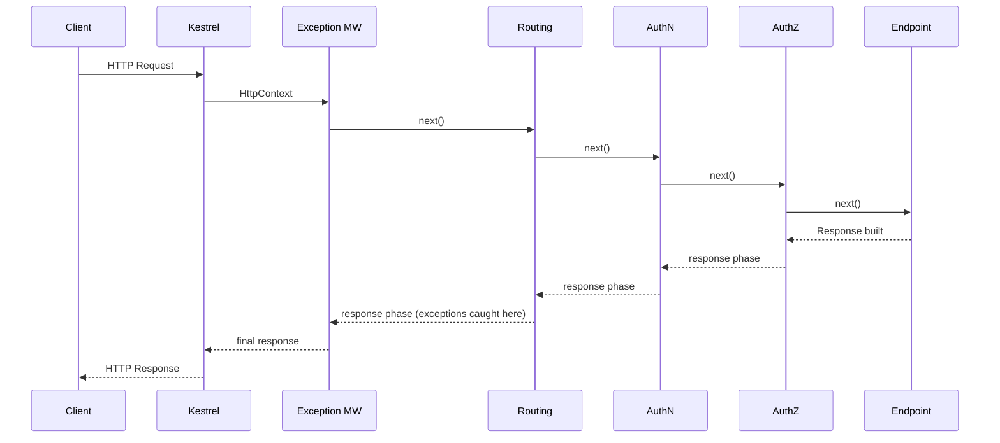
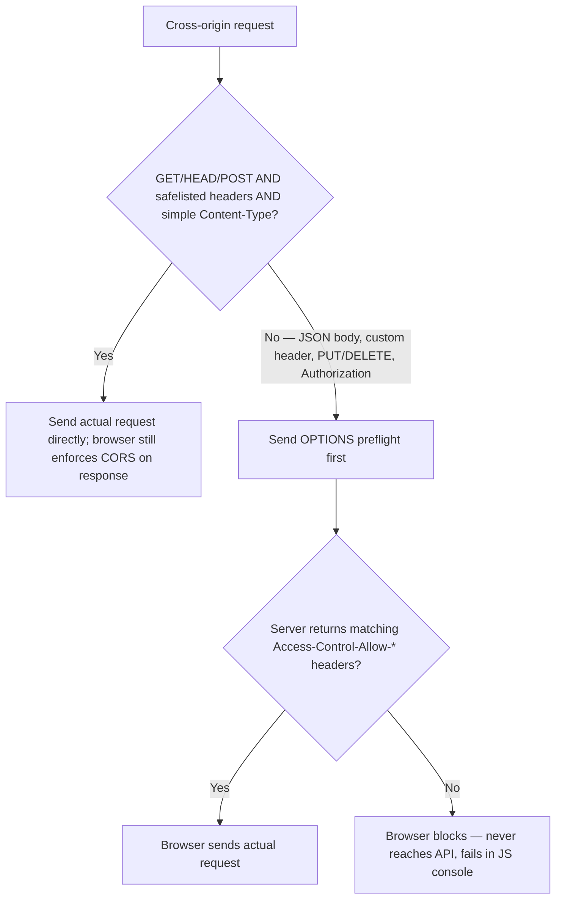
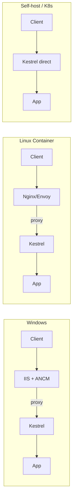

# ASP.NET Core — Senior/Lead Quick-Revision Notes

> Quick-revision notes derived from the ASP.NET Core Senior/Lead Interview Guide. Covers every section and sub-topic in the same order, focused on nuance, trade-offs, internals, and interviewer follow-ups (current as of .NET 8/9). These notes alone should be enough to brush up each topic without opening the guide.

---

## 1. Core Concepts

### .NET Core vs ASP.NET Core, and vs .NET Framework

**Q: What's the difference between .NET Core and ASP.NET Core?**
A: .NET Core = cross-platform, modular, open-source runtime (CoreCLR). ASP.NET Core = the web framework on top of it (Web API, MVC, Razor Pages, Blazor, gRPC, SignalR).

**Q: Why ASP.NET Core over legacy ASP.NET (.NET Framework)?**
- Cross-platform (Win/Linux/macOS), container-native.
- Unified pipeline — MVC and Web API share one stack (no `System.Web.Http` vs `System.Web.Mvc` split).
- High performance: Kestrel, async-first I/O, `Span<T>`/`Memory<T>`, light middleware pipeline (vs monolithic `HttpModule`/`HttpHandler`).
- Built-in first-class DI.
- Minimal hosting footprint; self-contained deployment.
- Side-by-side runtime versioning.
- Composable middleware pipeline.

**Framework vs .NET (Core) cheat sheet:**

| Dimension | .NET Framework | .NET Core / .NET 5+ |
|---|---|---|
| Platform | Windows only | Cross-platform, Docker-native |
| Architecture | Monolithic, IIS + `System.Web` | Modular, Kestrel, async-first |
| WebForms | Yes | No |
| ASP.NET MVC | Yes | Rewritten as ASP.NET Core MVC |
| WPF/WinForms | Yes | Yes (Windows-only) |
| gRPC / Minimal APIs | No | Yes |
| Deployment | Machine-wide install, IIS | Self-contained EXE, side-by-side, any proxy, containers |
| Tooling | VS only | VS, VS Code, Rider, `dotnet` CLI |
| Future | Patches only | Active development |

**Why Framework persists:** legacy WebForms/WCF apps expensive to port — a business reason, not a technical advantage.

**Migration path (Framework → Core):**
1. Inventory dependencies (`System.Web`, WCF, WebForms) via .NET Upgrade Assistant / API Analyzer.
2. Port shared logic to .NET Standard / multi-targeted libraries first.
3. Replace HttpModules/Handlers with middleware.
4. Replace WCF with gRPC/REST; `Web.config` → `appsettings.json` + Options pattern.
5. Re-wire DI (keep Autofac/Ninject behind `IServiceProviderFactory` or move to built-in container).
6. Incremental deploy behind feature flags; **strangler fig pattern** for big monoliths (old + new behind a gateway).

### Project Structure & Hosting Model Evolution

| Item | Purpose |
|---|---|
| `Program.cs` | Startup: builder, DI, pipeline, `app.Run()` |
| `wwwroot/` | Static files |
| `appsettings.json` / `.{Environment}.json` | Configuration |
| `Controllers/` `Models/` `Views/` | MVC pieces |
| `Properties/launchSettings.json` | Local debug profiles — dev-only, not production |

- **Before .NET 6 (generic host):** `Program.cs` builds `IHost`/`IWebHost` pointing at a `Startup` class. `ConfigureServices` = DI; `Configure` = middleware pipeline.
- **.NET 6+ (minimal hosting):** `Startup` folded into `Program.cs`; top-level statements (no `Main`/class). Create `WebApplicationBuilder` → register on `builder.Services` → build `WebApplication` → configure pipeline on `app` → `app.Run()`. You *can* still split into extension methods for large apps.

**Q: Did minimal hosting change anything under the hood or is it just syntax sugar?**
A: Mostly sugar. `WebApplicationBuilder` still wraps the generic `Host` builder; `WebApplication` implements `IApplicationBuilder`, `IEndpointRouteBuilder`, and `IHost`. DI, hosting abstractions, and pipeline are unchanged — only the mandatory `Startup` ceremony is gone.

### Program.cs / Startup.cs / Minimal Hosting Model

- `ConfigureServices()` / `builder.Services.Add...()` → **dependency registration only**, side-effect-free.
- `Configure()` / `app.Use...()` → **middleware pipeline only**, executed in registration order.
- Junior mistake: resolving services eagerly inside `Configure`.

### Environments & Configuration Basics

Env vars/config drive per-environment behavior (connection strings, log levels, endpoints, toggles) — and **never** committed secrets. Built-in environments: `Development`, `Staging`, `Production`, via `ASPNETCORE_ENVIRONMENT`.

**Configuration provider precedence (later overrides earlier):**
1. `appsettings.json`
2. `appsettings.{Environment}.json`
3. User Secrets (Development only)
4. Environment variables
5. Command-line arguments

**Why it matters:** K8s/ECS inject config via env vars, so env vars outrank JSON — ops override without rebuilding the image. Idiomatic consumption = **Options pattern** (see DI section).

### Static Files & Default Files

```csharp
app.UseDefaultFiles();   // MUST run BEFORE UseStaticFiles
app.UseStaticFiles();
```

Custom default file names: `DefaultFilesOptions` → `.DefaultFileNames.Clear()`/`.Add("home.html")`. Serve from non-`wwwroot`: `UseStaticFiles(new StaticFileOptions { FileProvider = new PhysicalFileProvider(...), RequestPath = "/mystatic" })`.

**Gotcha:** `UseDefaultFiles` only *rewrites the URL* to the default doc — it does NOT serve the file. Pair with `UseStaticFiles` (or `UseFileServer` = both + directory browsing).

### Logging Providers & Configuration

Structured logging via `Microsoft.Extensions.Logging`, consumed through `ILogger<T>` (auto-tagged with category = full type name of `T`).

```csharp
_logger.LogInformation("Fetching order {OrderId}", id); // semantic, NOT string interpolation
```

| Provider | Notes |
|---|---|
| Console | Default; human-readable dev output |
| Debug | Debugger output window |
| EventSource | ETW-style, `dotnet-trace`/PerfView |
| EventLog | Windows Event Log (Windows-only) |
| App Insights | Cloud telemetry sink |
| Serilog/NLog | Structured sinks (files, Elasticsearch, Seq) as provider adapters |

```json
{ "Logging": { "LogLevel": { "Default": "Information", "Microsoft": "Warning", "Microsoft.Hosting.Lifetime": "Information" } } }
```

- Filtering is **hierarchical by namespace** — specific category overrides `Default`. Noisy framework namespaces pinned to `Warning`.
- **Semantic logging** ({OrderId}, not `$"...{id}"`) lets sinks index/query fields — interpolation throws that away.

### .NET Application Types, Code Sharing & Multi-Targeting

**App types** (same DI/logging/config building blocks apply to all): Console, Class library, Web app (MVC/Razor/API), Worker service (`dotnet new worker`, no HTTP listener), Background service (`IHostedService`/`BackgroundService` in any host), ASP.NET Core hosted service (background task inside a web app's process).

**Code sharing (least → most packaged):**

| Mechanism | When |
|---|---|
| Project reference | Same solution, co-developed |
| Class library | General-purpose unit of sharing |
| Shared project | Legacy (source compiled into each consumer) — superseded |
| NuGet package | Cross-repo/team, independent versioning |

**Multi-targeting:** `<TargetFrameworks>net6.0;net8.0</TargetFrameworks>`. Use for NuGet libs supporting old + new LTS, cross-platform tooling, migration bridges. **Gotcha:** needs `#if NET8_0_OR_GREATER` conditional compilation (maintenance cost). App projects should single-target current LTS; reserve multi-targeting for reusable libraries.

---

## 2. Middleware Pipeline (Deep Dive)

### What Middleware Really Is

A chain of `RequestDelegate`s — registered sequentially but **nested (stack-based) at runtime**:

```
Middleware A → Middleware B → Middleware C → Endpoint
```

Explains three things: (1) **registration order** matters (each wraps everything after it); (2) code **before `await next()`** = request phase, **after** = response phase; (3) responses flow **backward** through the same chain.

### Request/Response Flow



- Request: Kestrel creates `HttpContext` → enters pipeline in registration order → each runs "before" logic then `next()` → endpoint executes.
- Response: endpoint produces response → unwinds in **reverse** → each "after `next()`" runs → sent to client.
- **Key insight:** each middleware runs *twice* per request (in + out) — which is why exception handling must be outermost and response-mutation logic goes after `await next()`.

### Built-in Middleware Deep Dive

**Exception Handling** — catches unhandled exceptions from everything registered *after* it; must be first.
```csharp
if (app.Environment.IsDevelopment()) app.UseDeveloperExceptionPage();
else app.UseExceptionHandler("/error");
```
.NET 8 `IExceptionHandler` (testable, DI-friendly): implement `TryHandleAsync` returning `true` = handled/short-circuit. Register `AddExceptionHandler<T>()` + `AddProblemDetails()` + `app.UseExceptionHandler()`.

**Routing** — matches URL → endpoint + route data. Does NOT execute the endpoint; only decides which runs. Downstream (Authorization) depends on the metadata routing produces.

**Authentication** — reads tokens/cookies/headers, builds `ClaimsPrincipal`, sets `HttpContext.User`. **Does NOT block** requests — anonymous still passes through; it only identifies the caller.

**Authorization** — evaluates roles/policies against user + endpoint `[Authorize]` metadata. Requires routing (metadata) + authentication (identity) to have run first — else throws or silently no-ops.

### Custom Middleware

```csharp
// Inline
app.Use(async (context, next) => { context.Items["CorrelationId"] = Guid.NewGuid().ToString(); await next(); });

// Class-based
public class CorrelationIdMiddleware {
    private readonly RequestDelegate _next;
    public CorrelationIdMiddleware(RequestDelegate next) => _next = next;
    public async Task InvokeAsync(HttpContext context) {
        context.Items["CorrelationId"] = Guid.NewGuid().ToString();
        await _next(context);
    }
}
app.UseMiddleware<CorrelationIdMiddleware>();
```

- Class-based middleware is constructed **once** (singleton-like) — constructor deps must be **singleton-safe**. But `InvokeAsync` can accept scoped services as **method parameters** (per-request method injection).
- Good uses: logging, correlation IDs, tenant resolution, header validation, rate limiting, security headers. Bad: business logic, DB access, heavy compute (belong in services).

### Use vs Run vs Map vs MapWhen

| Method | Behavior | Use |
|---|---|---|
| `Use` | Continues pipeline; before/after via `next()` | Most middleware |
| `Run` | Terminal; no `next()` | Terminal handlers, maintenance pages |
| `Map(pattern,...)` | Branch by URL **path prefix**, isolated sub-pipeline | `/health`, `/metrics`, admin sub-apps |
| `MapWhen(predicate,...)` | Branch by arbitrary `HttpContext` predicate | Header/query-based branching |

`Map`/`MapWhen` branches don't rejoin the main pipeline.

### Short-Circuiting

Middleware writes a response and deliberately does NOT call `next()`.
```csharp
if (!authorized) { context.Response.StatusCode = 401; return; } // downstream + endpoint never run
```
Legit: auth failure, rate limiting, feature toggles, maintenance. Common confusion: "why didn't my middleware run" when a colleague short-circuits upstream.

### Correct Middleware Ordering

```csharp
app.UseExceptionHandler("/error");   // 1. Outermost — wraps everything
app.UseHttpsRedirection();
app.UseStaticFiles();
app.UseRouting();                    // 2. Identifies endpoint
app.UseCors();                       // 3. After routing, before authN/authZ
app.UseAuthentication();             // 4. Identifies user
app.UseAuthorization();              // 5. Enforces access
app.UseResponseCompression();
app.MapControllers();                // 6. Business logic
app.Run();
```
CORS sits after routing (so endpoint-specific policies can be read) but before auth (so preflight is answered early).

### Endpoint Routing Internals

- Endpoint Routing (ASP.NET Core 3.0) **decoupled matching from execution**. `UseRouting()` matches request → `Endpoint` object (stored in `HttpContext.GetEndpoint()`); `MapControllers()`/`MapGet()` execute it.
- This split lets middleware between routing and execution (e.g., `UseAuthorization`) inspect metadata (`[Authorize]`, `[AllowAnonymous]`, CORS/rate-limiter policy names) via `context.GetEndpoint()?.Metadata`.
- Unifies routing across MVC, Minimal APIs, gRPC, SignalR, Blazor — all register `Endpoint`s into one `EndpointDataSource`; a single routing/authz/CORS pipeline governs all.
- Uses a **tree-based (DFA-like) matcher**, not a linear scan — scales better as route counts grow.
- **Gotcha:** `MapX()` without a preceding `UseRouting()` (possible with manual `IApplicationBuilder` composition) → metadata unavailable upstream → inconsistent 404s or bypassed authorization.

### Middleware vs Filters

| Middleware | Filters |
|---|---|
| Every request in the pipeline | Only MVC/endpoint-bound requests |
| No MVC context (model binding, action args) | Access to `ActionExecuting/ExecutedContext`, args, result, exceptions |
| Early/late across whole pipeline | Around action/page execution, after routing selects an MVC endpoint |
| Framework-agnostic cross-cutting (correlation IDs, compression, CORS) | MVC-specific (model validation, response shaping) |
| Can short-circuit entire pipeline | Only within the MVC action pipeline |

Filter order: **Authorization → Resource → Action → Exception → Result** (each with executing/executed pair). A global model-validation short-circuit belongs in a resource/action filter (needs the bound model), not middleware.

### IStartupFilter — Composing the Pipeline from a Library

**Problem:** A reusable library/module needs to inject its middleware at a specific position without forcing consumers to edit `Program.cs`.

```csharp
public class CorrelationIdStartupFilter : IStartupFilter {
    public Action<IApplicationBuilder> Configure(Action<IApplicationBuilder> next) => app => {
        app.UseMiddleware<CorrelationIdMiddleware>(); // BEFORE next = outermost
        next(app);
    };
}
public static IServiceCollection AddCorrelationIdModule(this IServiceCollection s) {
    s.AddTransient<IStartupFilter, CorrelationIdStartupFilter>();
    return s;
}
```

- ASP.NET Core resolves **all** registered `IStartupFilter`s and composes them as nested decorators around the app's own `Configure` delegate.
- `app.Use...()` **before** `next(app)` → earlier/outer; **after** `next(app)` → later/inner (closer to endpoint).
- Framework itself uses it internally (e.g., default exception-handling wiring in some hosting scenarios) — "framework-grade" plumbing.
- **Why not just tell consumers to call it?** Removes a footgun (forgetting/mis-ordering), lets platform teams ship cross-cutting concerns as one `AddXyzModule()` with wiring hidden as an implementation detail.
- **Trade-off:** injected middleware is invisible in `Program.cs` — makes effective order harder to reason about. Use for genuine cross-app modules, not to avoid writing an explicit `app.Use...()` in your own single app.

### CORS Preflight Mechanics — What Triggers an OPTIONS Request

**Core rule:** a cross-origin request is a **"simple request"** (no preflight) only if it satisfies ALL of the below. Any violation → preflight `OPTIONS` first.

| Simple-request condition | Detail |
|---|---|
| Method | `GET`/`HEAD`/`POST` only — any other verb triggers preflight |
| Headers | Only CORS-safelisted (`Accept`, `Accept-Language`, `Content-Language`, `Content-Type`). Any custom header (`Authorization`, `X-Api-Version`, etc.) → preflight |
| `Content-Type` | Only `application/x-www-form-urlencoded`, `multipart/form-data`, `text/plain`. **`application/json` is NOT simple** |
| Upload | `ReadableStream` / upload progress listeners → preflight |



- **Consequence:** because real traffic uses `application/json` and/or `Authorization: Bearer`, **almost every browser cross-origin call is preflighted** — normal, not a misconfig. This is why CORS middleware sits after `UseRouting()` but before authN/authZ: the preflight carries no `Authorization`/credentials, so CORS must answer it (204) before auth would reject it.
- Preflight includes `Access-Control-Request-Method` + `Access-Control-Request-Headers`. Server echoes `Access-Control-Allow-Methods/Headers/Origin` (+ `Allow-Credentials: true` if needed). `UseCors()` builds this automatically.
- Preflight responses cacheable via `Access-Control-Max-Age` — avoids duplicate round-trips (matters for latency-sensitive SPAs).
- "Extra OPTIONS in prod logs" = this mechanism; blocking OPTIONS at routing/auth breaks legit calls.
- CORS is **browser-only** — irrelevant for server-to-server (curl/Postman/backend never preflight).

---

## 3. Dependency Injection

DI = dependencies supplied from outside. Built-in IoC container (`IServiceCollection`/`IServiceProvider`); plug in Autofac/Lamar via `IServiceProviderFactory<T>` for property injection, decorators, assembly scanning (or Scrutor adds scanning to the built-in container). Constructor injection is default/preferred.

```csharp
builder.Services.AddSingleton<ICacheService, MemoryCacheService>();
builder.Services.AddScoped<IOrderRepository, OrderRepository>();
builder.Services.AddTransient<IEmailSender, SmtpEmailSender>();
```

### Service Lifetimes

| Lifetime | Description | Use |
|---|---|---|
| Transient | New instance every request-for | Lightweight, stateless |
| Scoped | One per HTTP request/DI scope | `DbContext`, unit-of-work, per-request state |
| Singleton | One for app lifetime | Config, in-memory caches, `IHttpClientFactory` internals |

### Captive Dependencies & Lifetime Mismatch Bugs

**Captive dependency:** injecting a shorter-lived service into a longer-lived one → the short-lived instance is "captured" and outlives its intended scope.

```csharp
// BAD: Singleton captures a Scoped DbContext
public class BadCacheWarmer {           // Singleton
    private readonly AppDbContext _db;  // Scoped — captured at construction!
    public BadCacheWarmer(AppDbContext db) => _db = db;
    // _db lives forever → stale/disposed state; concurrent use of a non-thread-safe DbContext → intermittent errors
}
```

- Container **validates at startup** when `ValidateScopes = true` (default in **Development** via `CreateBuilder`) → throws `Cannot consume scoped service ... from singleton`. **Off in Production by default** — bug can silently ship unless you enable `ValidateScopes`/`ValidateOnBuild` for all environments.
- **Fixes:** inject `IServiceScopeFactory` and create a scope per operation:
  ```csharp
  using var scope = _scopeFactory.CreateScope();
  var db = scope.ServiceProvider.GetRequiredService<AppDbContext>();
  ```
  Or use `IDbContextFactory<T>` (EF Core's dedicated answer).
- **Inverse (Transient/Scoped injecting a Singleton) is safe** — the singleton simply outlives the consumer.
- `IHttpContextAccessor` is a **singleton** but safely exposes per-request `HttpContext` via `AsyncLocal<T>` — the sanctioned way to reach request-scoped state from a singleton.

### IOptions vs IOptionsSnapshot vs IOptionsMonitor

Options pattern = idiomatic, testable config consumption (raw `IConfiguration` injection is a smell beyond bootstrap).
```csharp
builder.Services.Configure<SmtpOptions>(builder.Configuration.GetSection("Smtp"));
```

| Interface | Lifetime | Reloads? | Use |
|---|---|---|---|
| `IOptions<T>` | Singleton, computed once | No | Config that never changes at runtime |
| `IOptionsSnapshot<T>` | Scoped, recomputed per scope | Yes, per new scope | Per-request-fresh config in Scoped/Transient |
| `IOptionsMonitor<T>` | Singleton, actively watches | Yes, immediately + `OnChange` | Singletons/background services needing live updates |

**Q: Why can't you inject `IOptionsSnapshot` into a Singleton?**
A: It's Scoped → captive-dependency violation → throws at startup with scope validation on. Use `IOptionsMonitor` in singletons instead.

Named options (`Configure<T>(name,...)` + `IOptionsSnapshot<T>.Get(name)`) — for multi-tenant / multi-provider (e.g., multiple payment gateways).

### Detecting & Fixing Cyclic Dependencies

Container throws at resolution time: `A circular dependency was detected for the service of type 'X'`. Fixes:
- Introduce an interface/abstraction one side depends on.
- Use a factory (`Func<T>`) to defer resolution.
- Reduce constructor dependencies — a cycle usually signals two over-coupled services to merge or extract a shared collaborator.

---

## 4. Minimal APIs, MVC & API Design

### Minimal APIs vs Controller-based MVC — Full Comparison

```csharp
// Minimal API
app.MapGet("/orders/{id:int}", async (int id, IOrderService svc) => {
    var order = await svc.GetAsync(id);
    return order is not null ? Results.Ok(order) : Results.NotFound();
}).WithName("GetOrder").Produces<OrderDto>(200).Produces(404);
```
```csharp
// Controller MVC
[ApiController, Route("orders")]
public class OrdersController : ControllerBase {
    private readonly IOrderService _svc;
    public OrdersController(IOrderService svc) => _svc = svc;
    [HttpGet("{id:int}")]
    public async Task<IActionResult> Get(int id) {
        var order = await _svc.GetAsync(id);
        return order is not null ? Ok(order) : NotFound();
    }
}
```

| Aspect | Minimal APIs | Controller MVC |
|---|---|---|
| Boilerplate | Minimal, no base class | `ControllerBase` + attributes |
| Startup/AOT | Faster start, smaller footprint, first-class AOT | Reflection-based binding, weaker AOT |
| Filters | `IEndpointFilter` (lighter, .NET 7+) | Full MVC filter pipeline |
| Model binding | Explicit params (often inferred) | Rich convention-based |
| Validation | Manual/endpoint filter — **no auto 400** | Auto validation + 400 via `[ApiController]` |
| Views/Razor | No (JSON only) | Full Razor support |
| At scale | Can bloat `Program.cs` — split via route groups | Organized by controller |
| Route grouping | `app.MapGroup("/orders")` (.NET 7+) | Controller + `[Route]` |
| OpenAPI | Supported, more manual historically, improved .NET 8/9 | Mature via Swashbuckle |
| Best for | Lightweight microservices, high-throughput, greenfield, AOT/scale-to-zero | Large apps needing filters/views/conventions, migrating controllers |

**Not mutually exclusive** — `MapControllers()` and `MapGet()` coexist. Decision driver = team convention + need for filters/views, NOT raw perf (both fast; gap is at cold-start/AOT for serverless).

### REST API vs MVC App

| Feature | MVC Web App | Web API / Minimal API |
|---|---|---|
| Views | Yes (Razor) | No |
| Result | HTML | JSON/XML |
| Routing | Controller + Views (conventional common) | Attributes / minimal route mapping |
| SPA | Possible but atypical | Commonly the SPA backend |

### Angular/React SPA Integration

Two hosting models:
1. **Separate deployments** — SPA on its own static host/CDN, calls API cross-origin (needs CORS). Simplest to scale independently; the common greenfield pattern today.
2. **Merged/hosted** — SPA build output served from the app's `wwwroot`; ships as one unit (`Microsoft.AspNetCore.SpaServices.Extensions`).

```csharp
if (app.Environment.IsDevelopment())
    app.UseSpa(spa => { spa.Options.SourcePath = "ClientApp"; spa.UseAngularCliServer(npmScript: "start"); });
else
    app.UseSpaStaticFiles();
```
- **CORS** when different origins (positioned after routing, before authN/authZ).
- **Static serving** — built SPA in `wwwroot` via `UseStaticFiles`/`UseDefaultFiles`.
- **Dev proxy** — SPA dev server proxies API calls (`proxy.conf.json` / React `"proxy"`) so local calls avoid CORS entirely.

**Senior framing:** merged `UseSpa` has fallen out of favor for new projects — independent deployment (CDN + own CI/CD) decouples release cadence and scaling. Know the mechanics for legacy/interviews but recommend independent deployment as the current default.

### API Versioning Strategies

- **URL** (`/api/v1/orders`): explicit, cache-friendly, easy routing; pollutes URL, clients must change URLs.
- **Query string** (`?api-version=1.0`): easy default; easy to omit; less RESTful.
- **Header** (`X-Api-Version: 1.0`): clean URLs; harder to test/debug, less log-visible.
- **Media type** (`Accept: application/json;v=1.0`): most "correct" per content negotiation; least ergonomic.

```csharp
builder.Services.AddApiVersioning(o => {
    o.DefaultApiVersion = new ApiVersion(1, 0);
    o.AssumeDefaultVersionWhenUnspecified = true;
    o.ReportApiVersions = true;
}).AddApiExplorer(o => o.GroupNameFormat = "'v'VVV");
```
**Discipline:** never mutate an existing contract; add a new version, support both for a documented window, communicate via `ReportApiVersions`/`Deprecated` (`api-supported-versions`/`api-deprecated-versions` headers).

### DTOs, Validation & FluentValidation

**Never return EF entities:** prevents over-posting/mass-assignment, decouples wire contract from persistence model, hides navigation properties (avoids lazy-load serialization loops), lets you shape/trim payloads and add computed fields.

FluentValidation (standard beyond trivial DataAnnotations):
```csharp
public class UserValidator : AbstractValidator<UserDto> {
    public UserValidator() {
        RuleFor(x => x.Name).NotEmpty().MinimumLength(3);
        RuleFor(x => x.Email).NotEmpty().EmailAddress();
        RuleFor(x => x.Age).InclusiveBetween(18, 60).WithMessage("User must be an adult, and under 60.");
    }
}
```
```csharp
builder.Services.AddControllers();
builder.Services.AddFluentValidationAutoValidation();
builder.Services.AddValidatorsFromAssemblyContaining<UserValidator>();
```
`[ApiController]` auto-validates → 400 with `ValidationProblemDetails`:
```json
{ "errors": { "Name": ["'Name' must not be empty."], "Email": ["'Email' is not a valid email address."] } }
```
Custom: `RuleFor(x => x.Age).Must(age => age >= 18).WithMessage(...)`.

- Auto-validation hooks MVC's filter pipeline (works with `[ApiController]`). **Minimal APIs have no auto-validation** — invoke validator explicitly in handler or via `IEndpointFilter`.
- **App/DTO validation** = shape/format of incoming data; **domain validation** = entity invariants (e.g., an `Order` can't go `Cancelled → Shipped`). DTO passing ≠ domain operation valid.

### CQRS, Mediator Pattern & MediatR

CQRS separates **commands** (writes, state-changing) from **queries** (reads, side-effect-free, return DTOs). Benefits: independent read/write optimization, small single-responsibility handlers, and (with MediatR) **pipeline behaviors** (logging/validation/transactions wrapped generically around every handler).
```csharp
public record GetOrderQuery(int Id) : IRequest<OrderDto>;
public class GetOrderQueryHandler : IRequestHandler<GetOrderQuery, OrderDto> {
    private readonly IOrderRepository _repo;
    public GetOrderQueryHandler(IOrderRepository repo) => _repo = repo;
    public async Task<OrderDto> Handle(GetOrderQuery r, CancellationToken ct) => (await _repo.GetAsync(r.Id, ct)).ToDto();
}
```
Use when: controllers becoming fat, want to decouple request from handler, or want uniform pipeline behaviors. **Trade-off:** adds indirection — over-engineering for CRUD-simple services. Reserve for complex/divergent read-write concerns.

### DDD in ASP.NET Core

Building blocks: **Entities** (identity equality), **Value Objects** (immutable, structural equality), **Aggregates/Aggregate Roots** (consistency boundary — all writes through the root), **Domain Events** (decoupled side effects), **Repositories** (persistence per aggregate), **Bounded Contexts** (explicit model boundaries, often → microservices/modules).

### Clean Architecture / Folder Structure at Scale

```
src/
  Api/            -> Controllers/endpoints, DI wiring, composition root
  Application/    -> CQRS handlers, validators, DTOs, use-case orchestration
  Domain/         -> Entities, Value Objects, domain interfaces, events
  Infrastructure/ -> EF Core, external clients, messaging, repositories
tests/ UnitTests/ IntegrationTests/
```
**Dependency rule:** `Domain` = zero outward deps; `Application` → `Domain`; `Infrastructure` implements interfaces from `Domain`/`Application`; `Api` → `Application` (wires `Infrastructure` via DI). Dependencies point **inward** via Dependency Inversion (interfaces owned by inner layers).

### Multi-Tenant Applications

- Tenant resolution (header/subdomain/claims) must happen **early**, ideally in dedicated middleware **before authentication** (authN may need a tenant-specific issuer/authority).
- Tenant context in a **scoped service** (`ITenantContext`), consumed by data access to scope queries (tenant connection string, or EF global filter `HasQueryFilter(x => x.TenantId == _tenant.TenantId)`).
- Per-tenant config/caching (named `IOptionsSnapshot`, tenant-keyed cache entries).

### API Anti-Patterns

- Fat controllers with business logic (push to Application/Domain).
- Returning EF entities directly.
- No versioning strategy from day one (painful to retrofit).
- Excessive/needless DTOs for trivial pass-through (over-engineering).
- No pagination on collection endpoints (unbounded responses/DB load).
- Ignoring idempotency on POST/PUT under retry-heavy clients (duplicate side effects).

### Plugin Architecture (Dynamic Assembly Loading)

Load functionality not compiled into the main deployable (CMS extensions, connectors, tenant customizations).
```csharp
public interface IPlugin { string Name { get; } void Execute(IServiceProvider services); }
```
- **Reflection loading:** scan folder for DLLs → load assembly → `GetTypes().Where(t => typeof(IPlugin).IsAssignableFrom(t))` → instantiate via `Activator.CreateInstance` or DI.
- **`AssemblyLoadContext`:** modern (.NET Core+) isolated loading/unloading without version conflicts with the host — replaces .NET Framework `AppDomain` isolation (Core has no `AppDomain`s).
- **Scrutor:** assembly-scanning registration on the built-in container:
  ```csharp
  services.Scan(s => s.FromAssemblies(pluginAssemblies).AddClasses(c => c.AssignableTo<IPlugin>()).AsImplementedInterfaces().WithScopedLifetime());
  ```


**Trade-offs:** incompatible with Native AOT/trimming (needs runtime reflection + unknown-at-compile-time assemblies) — plugins and AOT are mutually exclusive. Contract versioning between host `IPlugin` and independently-shipped DLLs is an operational concern — keep plugin interfaces small and stable.

### WebHooks (Outbound Event Callbacks)

Inverse of a normal API call: your server POSTs to a client-registered callback URL on an event ("order shipped").

Production concerns:
- **Signed payloads** — HMAC-SHA256 over raw body with a per-subscriber secret, in a header (`X-Webhook-Signature`) so receivers verify authenticity/integrity.
- **Retry** — exponential backoff, capped attempts/duration, persist attempts (outbox-style) so failures aren't silently lost.
- **Timestamp validation** — signed timestamp + clock-skew window rejection → defends against replay.
- **Logging/observability** — log every attempt; delivery failures are otherwise invisible to the receiver.

**Framing:** WebHooks target *external* consumers over plain HTTP (no shared infra); a broker (Kafka/RabbitMQ/SQS) targets *internal* services sharing infra. Don't reach for a broker when the requirement is "notify an external customer's endpoint."

---

## 5. Hosting & Infrastructure

### Kestrel, IIS, HTTP.sys & Reverse Proxy Models

| Model | Notes |
|---|---|
| **Kestrel** | Default, cross-platform, high-perf managed server. Historically behind a reverse proxy; modern Kestrel is robust enough to be internet-facing — reverse proxy today is defense-in-depth, TLS convenience, multi-app port sharing, not a hard limitation |
| **IIS** | Windows-only. Reverse proxy in front of Kestrel via ANCM, or **in-process** (app runs inside `w3wp.exe`, the default). Mature Windows features (Windows Auth, app pools, recycling) |
| **HTTP.sys** | Alternative **self-hosting** server (Windows-only, kernel-mode). Use for Windows Auth without a proxy, kernel port sharing, direct file-handle responses. A Kestrel *alternative*, not a proxy |
| **Self-host/containers** | `dotnet run` / container `ENTRYPOINT` running Kestrel directly — standard for Linux/K8s/cloud; no IIS |



**In-process vs out-of-process IIS:** In-process = app inside `w3wp.exe`, no loopback hop, faster (default). Out-of-process = IIS proxies to a separate Kestrel process, more overhead but process isolation.

### Native AOT Compilation

- **What:** compiles directly to native code AOT (no JIT); self-contained native EXE, no runtime install needed.
- **Why for ASP.NET Core:** far faster cold start (ms vs 100s of ms) + lower memory — matters for serverless, scale-to-zero, high-density multi-tenant.
- **Constraints:**
  - No reflection-heavy features — restricts classic MVC controllers, most EF Core (compiled models needed), reflection-based DI scanning. **Minimal APIs + source-generated `System.Text.Json`** = primary supported path.
  - No dynamic assembly loading/plugins.
  - Trimming can break non-trim-safe libraries; treat trim warnings as build errors.
  - Not a drop-in for large MVC apps — a deliberate early architectural choice for new, small, high-density services.
```xml
<PropertyGroup><PublishAot>true</PublishAot></PropertyGroup>
```
(Verify current-release constraints — AOT surface expands each release.)

### Deployment Models (Framework-Dependent vs Self-Contained)

- **Framework-dependent:** needs shared runtime on host; smaller artifact, runtime patched independently.
- **Self-contained:** bundles runtime; larger artifact, no host dependency (minimal base images, no guaranteed runtime).
- **ReadyToRun (R2R):** precompiles IL → native for faster startup while still shipping IL (partial AOT, keeps reflection) — middle ground reducing cold start without AOT's constraints.

### Long-Running Jobs: BackgroundService vs IHostedService

`IHostedService` = base abstraction; `AddHostedService<T>()` → host calls `StartAsync`/`StopAsync` at startup/shutdown.
```csharp
public interface IHostedService { Task StartAsync(CancellationToken ct); Task StopAsync(CancellationToken ct); }
```
`BackgroundService` **implements** `IHostedService`, handling the loop + cancellation boilerplate — override only `ExecuteAsync`:
```csharp
public class OrderQueueProcessor : BackgroundService {
    private readonly IServiceScopeFactory _scopeFactory;
    public OrderQueueProcessor(IServiceScopeFactory f) => _scopeFactory = f;
    protected override async Task ExecuteAsync(CancellationToken stoppingToken) {
        while (!stoppingToken.IsCancellationRequested) {
            using var scope = _scopeFactory.CreateScope();
            var queue = scope.ServiceProvider.GetRequiredService<IOrderQueue>();
            await queue.ProcessNextBatchAsync(stoppingToken);
            await Task.Delay(TimeSpan.FromSeconds(5), stoppingToken);
        }
    }
}
builder.Services.AddHostedService<OrderQueueProcessor>();
```
- **Distinction:** `BackgroundService` simplifies the "run a loop for app lifetime" case; raw `IHostedService` when `StartAsync` must **return quickly** without a loop (fire-and-forget timer, event subscription).
- **Golden rule:** never block the request thread with long-running work — hosted services run on the host's lifetime, decoupled from any request.

| Option | When |
|---|---|
| `BackgroundService`/`IHostedService` | Lightweight in-process work; acceptable data-loss on restart / cheap to resume |
| **Hangfire** | Durable jobs + dashboard + retries + scheduling (fire-and-forget/delayed/cron), backed by SQL/Redis — survives restarts |
| **Azure Functions / AWS Lambda** | Serverless event/timer-triggered, scales independently, doesn't consume web app resources |
| **SQS/SNS/Kafka/RabbitMQ + Worker** | Decoupled, horizontally scalable; producer + consumer scale/deploy independently — standard for high-volume durable async |

In-process is fine for low-stakes, restart-tolerant work; anything where losing an in-flight job is unacceptable or needs independent scaling → durable system (Hangfire) or worker behind a queue.

### Feature Flags

Toggle functionality without redeploy — progressive rollouts, kill-switches, A/B experiments.
```csharp
builder.Services.AddFeatureManagement(); // Microsoft.FeatureManagement
```
```json
{ "FeatureManagement": { "NewCheckoutFlow": true, "BetaDashboard": false } }
```
```csharp
if (await _featureManager.IsEnabledAsync("NewCheckoutFlow")) return await NewCheckoutAsync();
return await LegacyCheckoutAsync();
```

| Approach | Notes |
|---|---|
| Boolean config switches | Simplest; needs config change + restart/reload; no targeting |
| `Microsoft.FeatureManagement` | First-class: `[FeatureGate]`, `IFeatureManager`, percentage/targeting filters |
| **Azure App Configuration** | Centralized, dynamically-refreshable store shared across instances; backs FeatureManagement |
| **LaunchDarkly** (SaaS) | Full platform: targeting, streaming updates, audit, experimentation |

Prefer FeatureManagement + centralized store (App Config) once you have >1 instance or more than a couple flags — config-file booleans don't runtime-toggle and don't scale.

### Pre-loading / Startup Warmup Tasks

Expensive first-use init (big cache population, cold ML model, connection pool priming) — lazy on first request makes the first user pay. Run warmup at startup, commonly via an `IHostedService` whose `StartAsync` does the work:
```csharp
public class CacheWarmupService : IHostedService {
    private readonly IServiceScopeFactory _scopeFactory;
    public CacheWarmupService(IServiceScopeFactory f) => _scopeFactory = f;
    public async Task StartAsync(CancellationToken ct) {
        using var scope = _scopeFactory.CreateScope();
        var cache = scope.ServiceProvider.GetRequiredService<IProductCache>();
        await cache.PreloadAsync(ct);
    }
    public Task StopAsync(CancellationToken ct) => Task.CompletedTask;
}
```
Pair warmup with the **readiness** probe (not liveness) — instance shouldn't join LB rotation until warmup completes, so it never gets traffic while cold. Hence liveness/readiness need separate endpoints.

---

## 6. Performance & Optimization

### Response Caching vs Output Caching vs Distributed Caching

| Mechanism | How | Limitation/strength |
|---|---|---|
| `ResponseCaching` + `[ResponseCache]` | Sets/respects HTTP headers (`Cache-Control`, `Vary`); relies on client/proxy/CDN honoring them | Standards-based, weak server-side control |
| **Output Caching** (.NET 7+) | Server-side cache of full responses via server policies (not header-dependent); tag-based eviction | More powerful/predictable for APIs; vary by query/header/route; programmatic invalidation |
| Distributed (`IDistributedCache`, Redis) | Explicit key/value of *data*, shared across instances | You control it; app reads/populates; not tied to HTTP |
| In-memory (`IMemoryCache`) | Local process cache | Fastest, but not shared — inconsistent when scaled out |

```csharp
// Output Caching (.NET 7+)
builder.Services.AddOutputCache(o => o.AddPolicy("Expire60", b => b.Expire(TimeSpan.FromSeconds(60))));
app.UseOutputCache();
app.MapGet("/products", GetProducts).CacheOutput("Expire60");
```
```csharp
[ResponseCache(Duration = 60)] public IActionResult Get() => Ok(_data);
```
```csharp
services.AddStackExchangeRedisCache(o => o.Configuration = "redis-host:6379");
```
Multi-instance: all instances connect to the same Redis over the network → consistent shared cache regardless of which container handles a request (in-memory would give each instance an inconsistent view). This is what makes horizontal scaling safe for cached data.

| Type | Where | Use |
|---|---|---|
| In-memory | Local process | Single-instance / per-instance non-critical |
| Distributed (Redis) | Shared external store | Multi-instance requiring consistency |

### Response Compression

Server compresses before sending; client decompresses via `Accept-Encoding`.
```csharp
builder.Services.AddResponseCompression(o => {
    o.EnableForHttps = true;
    o.Providers.Add<BrotliCompressionProvider>();
    o.Providers.Add<GzipCompressionProvider>();
});
app.UseResponseCompression();
```
| Algorithm | Notes |
|---|---|
| Gzip | Widely supported, moderate ratio |
| Brotli | Better ratio, recommended for HTTPS APIs, more CPU |

Best practices: enable primarily for HTTPS (compression over unencrypted HTTP linked to BREACH — why `EnableForHttps` is opt-in); don't recompress already-compressed formats (images/video); monitor CPU (compression is CPU-bound, can become the bottleneck); prefer Brotli for JSON.

### Data Shaping

Return only needed fields — reduce payload/over-fetching (high-traffic lists, mobile).
```csharp
var summaries = await _db.Orders
    .Select(o => new OrderSummaryDto { Id = o.Id, Total = o.Total, Status = o.Status })
    .ToListAsync();
```
**Key point:** do the `Select()` projection **in the query** (translated to SQL) — pulls only needed columns; materializing full entities then shaping in memory wastes DB + network. The projection *is* the DTO construction at query level. More dynamic: query-string field selection (`?fields=id,total`) or GraphQL (field-level shaping first-class, at the cost of a different paradigm) — heavier; only worth it when client needs vary widely.

### Optimizing Static Content Delivery

| Technique | What |
|---|---|
| **CDN** | Edge serving close to users, offloads origin — highest-leverage for global users |
| **Caching headers** | `Cache-Control`/`ETag`; tune `max-age` for fingerprinted immutable assets (`app.js?v=abc123`) — cache ~forever |
| **Compression** | Brotli/Gzip on text assets (JS/CSS/SVG) |
| **SPA static middleware** | `UseSpaStaticFiles()` serves pre-built bundle from `wwwroot` in production |

**Framing:** static optimization is a *caching and offloading* problem, not a code problem — app does the minimum (correct headers, compress text), push serving to a CDN (every static request an app server handles is capacity lost for dynamic work).

### HttpClientFactory & Socket Exhaustion

Solves naive `new HttpClient()` problems:
- **Socket exhaustion:** per-request disposed `HttpClient` leaves sockets in `TIME_WAIT` → exhausts ephemeral ports under load.
- **DNS change blindness:** a single long-lived static `HttpClient` holds its connection pool indefinitely → won't pick up DNS changes (e.g., after failover).

`IHttpClientFactory` pools `HttpMessageHandler`s with rotation (default handler lifetime 2 min) → connection reuse + periodic DNS refresh.
```csharp
builder.Services.AddHttpClient<IPaymentGatewayClient, PaymentGatewayClient>(c => {
    c.BaseAddress = new Uri("https://payments.internal/");
    c.Timeout = TimeSpan.FromSeconds(10);
}).AddPolicyHandler(Policy<HttpResponseMessage>.Handle<HttpRequestException>().RetryAsync(3));
```
Broader object pooling pattern: DB connections, `StringBuilder` via `ObjectPool<T>`, `ArrayPool<T>` for buffers.

### Rate Limiting Middleware (.NET 7+)

```csharp
builder.Services.AddRateLimiter(o => {
    o.AddFixedWindowLimiter("fixed", opt => {
        opt.Window = TimeSpan.FromSeconds(10);
        opt.PermitLimit = 20; opt.QueueLimit = 0;
        opt.QueueProcessingOrder = QueueProcessingOrder.OldestFirst;
    });
    o.AddSlidingWindowLimiter("sliding", opt => { });
    o.AddTokenBucketLimiter("token", opt => { });
    o.AddConcurrencyLimiter("concurrency", opt => { });
    o.RejectionStatusCode = StatusCodes.Status429TooManyRequests;
});
app.UseRateLimiter();
app.MapGet("/orders", GetOrders).RequireRateLimiting("fixed");
```
| Algorithm | Behavior | Use when |
|---|---|---|
| Fixed Window | N per window, sharp reset | Simple quotas; accepts burst-at-boundary |
| Sliding Window | Sub-segments smooth the boundary burst | Fairer distribution |
| Token Bucket | Tokens refill; allows bursts up to bucket size | Allow occasional bursts, cap sustained rate |
| Concurrency | Caps *simultaneous* in-flight (not per-time) | Protect a limited-capacity downstream from concurrent overload |

**Gotcha:** **in-process** — each instance enforces its own limit. For a *global* limit in a fleet, back with Redis or push to an API Gateway (YARP/Kong/APIM) that sees aggregate traffic. Built-in is best for per-instance protection or single-instance.

### Thread Pool Starvation & Async Gotchas

- **Why async matters:** a sync blocking call (`.Result`, `.Wait()`, sync I/O) ties up a thread pool thread for the whole I/O wait. The pool is finite (sized for CPU work) → blocking starves *other unrelated requests* → whole-app degradation.
- **Classic deadlock:** `.Result`/`.Wait()` from a context with a `SynchronizationContext` (classic ASP.NET, WinForms/WPF) deadlocks — continuation waits on the captured context whose thread is blocked. ASP.NET **Core removed the `SynchronizationContext`** → this deadlock mode is largely gone, but blocking still causes starvation under load.
- **Diagnosing:** requests fast in isolation but degrade sharply/non-linearly under concurrent load, `ThreadPool` queue length climbing (`dotnet-counters` `threadpool-queue-length`) even with moderate CPU. Fix = find/remove the blocking call, not add threads (pool grows slowly via hill-climbing — the slow growth is part of the problem under a spike).
- **Rules:** async all the way; don't `Task.Run` to fake-async I/O (still consumes a thread); reserve `Task.Run` for CPU-bound offload; never `.Result`/`.Wait()`/`GetAwaiter().GetResult()` on hot paths.
- **`ConfigureAwait(false)`:** largely unnecessary in ASP.NET Core app/endpoint code (no sync context), but still used in library code that may run in other hosts — state this precisely, don't cargo-cult.

### Kestrel Tuning for High Throughput

```csharp
builder.WebHost.ConfigureKestrel(o => {
    o.Limits.MaxConcurrentConnections = 1000;
    o.Limits.MaxRequestBodySize = 10 * 1024 * 1024; // 10 MB
    o.Limits.MinRequestBodyDataRate = new MinDataRate(bytesPerSecond: 100, gracePeriod: TimeSpan.FromSeconds(10));
    o.Limits.KeepAliveTimeout = TimeSpan.FromMinutes(2);
    o.ListenAnyIP(5000, l => l.Protocols = HttpProtocols.Http1AndHttp2);
});
```
Levers: HTTP/2 (HTTP/3 where supported), max request body size, connection/request throttling, `MinRequestBodyDataRate` (defends slow-drip attacks), `ThreadPool.SetMinThreads` (reduce lag before pool scales up — direct mitigation for starvation during bursts).

### EF Core Performance

- `AsNoTracking()` for read-only queries.
- Compiled queries for hot repeated shapes.
- Avoid N+1 — `Include`/projection, not lazy-loading in a loop.
- Indexes matching actual predicates (verify via execution plans).
- Batching (`SaveChanges` batches per round trip where supported).
- `AsSplitQuery()` to avoid cartesian explosion from multiple collection `Include`s.
- Connection pooling (default; don't disable).

Consolidated EF concepts:
- **Optimistic concurrency:** `RowVersion`/`[ConcurrencyCheck]` → `DbUpdateConcurrencyException` on conflict (vs silent overwrite).
- **Shadow properties:** EF-mapped columns with no CLR property (audit columns).
- **Value conversions:** transform CLR ↔ stored representation (encrypt on write, enum-as-string).
- **Soft delete:** `HasQueryFilter(x => !x.IsDeleted)` — auto-applied unless `IgnoreQueryFilters()`.
- **Interceptors:** hook command/connection/save pipeline (logging, auditing, retry).
- **Lazy vs eager vs explicit:** lazy = on first access (proxies, N+1 risk); eager = `Include()` upfront; explicit = `.Load()` manually when you control *when*.

### Diagnosing Memory Leaks & Measuring Performance

Tools: `dotnet-trace`, `dotnet-dump`, `dotnet-counters`, `dotMemory`, PerfView, BenchmarkDotNet (micro), App Insights / Prometheus+Grafana / OpenTelemetry (prod).

Common ASP.NET Core leak causes: static references holding large graphs, singletons holding captured scopes (captive dependency), unsubscribed event handlers, undisposed `IDisposable` (esp. `DbContext` outside DI scope), caches without eviction growing unbounded.

Cold-start reduction: ReadyToRun, trimming, fewer DI registrations/startup work, Native AOT for extreme cases.

---

## 7. Security

### Authentication vs Authorization

- **Authentication:** *who* the caller is.
- **Authorization:** *what* an (even anonymous) caller may do.

### JWT, OAuth2 & OpenID Connect

- **JWT:** self-contained, signed (optionally encrypted) token — header, payload (claims), signature → stateless auth (no server session store to validate identity).
- **OAuth2 (authorization code flow):** user authenticates at auth server → server issues auth code → exchanged for access token (+ refresh) → client sends access token as Bearer → resource server validates signature/issuer/audience/expiry.
- **OIDC:** sits on OAuth2 to standardize *authentication* (identity, via ID token) — OAuth2 alone is an authorization framework, never strictly an authentication protocol (interviewers probe this).
```csharp
builder.Services.AddAuthentication(JwtBearerDefaults.AuthenticationScheme)
    .AddJwtBearer(o => {
        o.Authority = "https://identity.myapp.com";
        o.Audience = "orders-api";
        o.TokenValidationParameters = new TokenValidationParameters {
            ValidateIssuer = true, ValidateAudience = true, ValidateLifetime = true,
            ClockSkew = TimeSpan.FromMinutes(1)
        };
    });
```
`IdentityServer4` → succeeded by **Duende IdentityServer** (license change — verify terms). Alternatives: Azure AD/Entra ID, Auth0, Okta, Keycloak.

### Role-based vs Policy-based Authorization

```csharp
[Authorize(Roles = "Admin")] public IActionResult AdminOnly() => Ok();
```
```csharp
builder.Services.AddAuthorization(o =>
    o.AddPolicy("MinimumAge", p => p.Requirements.Add(new MinimumAgeRequirement(18))));
```
```csharp
public class MinimumAgeRequirement : IAuthorizationRequirement {
    public int MinimumAge { get; }
    public MinimumAgeRequirement(int age) => MinimumAge = age;
}
public class MinimumAgeHandler : AuthorizationHandler<MinimumAgeRequirement> {
    protected override Task HandleRequirementAsync(AuthorizationHandlerContext ctx, MinimumAgeRequirement req) {
        var dob = ctx.User.FindFirst(c => c.Type == ClaimTypes.DateOfBirth);
        if (dob != null && CalculateAge(dob.Value) >= req.MinimumAge) ctx.Succeed(req);
        return Task.CompletedTask;
    }
}
```
Policy-based is more flexible/composable/testable — prefer over hardcoded `Roles = "..."` for anything beyond trivial; policies combine requirements and are unit-testable via `IAuthorizationHandler`.

### CSRF, XSS & Security Headers

- **XSS:** Razor auto HTML-encoding, Content-Security-Policy, input validation/sanitization.
- **CSRF:** anti-forgery tokens (`[ValidateAntiForgeryToken]`, auto for Razor form tag helpers), `SameSite` cookies, short-lived cookies, double-submit cookie pattern (token in both cookie and request param/header; server verifies match — only a same-site origin can read the cookie).
- **Security headers:** HSTS (`Strict-Transport-Security`), `X-Frame-Options` (clickjacking), CSP, `X-Content-Type-Options: nosniff`. Add via small custom middleware or `NWebsec`/`OwaspHeaders.Core`.
- `SameSite` blocks the browser sending the cookie on cross-site requests — a strong modern CSRF mitigation alongside anti-forgery tokens.

### Secrets Management

- Local dev: **User Secrets** (`dotnet user-secrets`) — never commit to `appsettings.json`.
- Production: Azure Key Vault / AWS Secrets Manager, injected via config providers so app code never sees raw storage.

### Other Security Concerns

- **API keys:** validate header keys, rotate, store hashed (not plaintext).
- **Password hashing:** PBKDF2/BCrypt/Argon2 — never fast general-purpose hashes (MD5/SHA alone); Identity uses PBKDF2 by default.
- **File uploads:** validate content (sniff magic bytes, not just extension), size limits, virus scan for sensitive contexts, never reuse original filename for storage (path traversal) — generate a new name, keep original as metadata.
- **Certificate auth:** client certs for mTLS service-to-service in trusted networks.
- **Brute-force protection:** rate limiting, account lockout, CAPTCHA, IP throttling/blocking.
- **CORS:** whitelist origins/methods/headers; never `AllowAnyOrigin()` + `AllowCredentials()` (framework disallows — it would defeat same-origin credential protection).

---

## 8. EF Core & Data Access

(EF performance depth is in the Performance section.)

**EF Core vs Dapper:** EF Core = full ORM (change tracking, migrations, LINQ, navigation) at the cost of overhead/"magic." Dapper = micro-ORM (you write SQL, it maps) — faster/predictable for perf-critical or complex reporting, losing change tracking/migrations/LINQ. Many senior codebases use both: EF for transactional write-side, Dapper for read-heavy reporting.

**Repository + Unit of Work:** generic repository abstracts CRUD per aggregate; UoW wraps multiple ops in one transaction/`SaveChanges()`. **Debate:** `DbContext` already *is* a UoW + rough repository, so an extra repository layer is sometimes criticized as redundant — a nuanced answer states both sides rather than treating Repository+UoW as unquestioned best practice.
```csharp
await using var transaction = await db.Database.BeginTransactionAsync();
try { /* ops */ await transaction.CommitAsync(); }
catch { await transaction.RollbackAsync(); throw; }
```

---

## 9. Microservices & Distributed Systems

- **Inter-service comms:** HTTP/REST (simple, ubiquitous), gRPC (low-latency, contract-first, HTTP/2 streaming — internal calls you control), event-driven via broker (Kafka/RabbitMQ/SQS/SNS — decoupling, async).
- **gRPC:** Protobuf contracts → strong typing + cross-language codegen; HTTP/2 multiplexing avoids head-of-line blocking; supports client/server/bidirectional streaming. Trade-off: not browser-friendly without grpc-web, less human-debuggable (binary) — reserve for internal service-to-service, not public APIs.
- **Resilience (Polly):** retries w/ backoff, circuit breakers (stop calling a failing downstream to let it recover + protect your thread pool), timeouts, fallbacks, bulkhead isolation (cap concurrent calls to one downstream so its failure can't starve others).
- **Saga:** distributed transaction via a sequence of local transactions + compensating actions on failure — needed because distributed 2PC is impractical across modern service boundaries.
- **Event Sourcing:** persist the sequence of events, not just current state; state derived by replay. Free audit trail + temporal queries, at the cost of query complexity (projections/read models) + eventual consistency.
- **Outbox pattern:** write the integration event to an outbox table in the *same* local transaction as the state change; a relay publishes asynchronously and marks sent — the standard fix for the "dual write" problem (DB write succeeds but message publish fails).
- **API Gateway:** aggregation, auth, routing, rate limiting, caching at the edge. Choices: YARP (.NET-native, code-first), Ocelot, Kong, Azure APIM, AWS API Gateway.
- **Service discovery:** dynamic instance lookup (Consul, Eureka, K8s DNS/`Service`) — in K8s often transparent via cluster DNS.
- **Distributed tracing:** correlate one logical request across services (Jaeger, Zipkin, App Insights, or vendor-neutral OpenTelemetry). A trace ID propagated via a header (`traceparent` W3C Trace Context, or `X-Correlation-ID`) ties spans together.
- **Idempotency:** idempotency keys on writes, retry-safe design, DB unique constraints to reject dup inserts, consumer-side event dedup — essential with at-least-once delivery (most brokers by default).
- **Schema/contract versioning:** Protobuf field rules (never reuse/renumber field numbers), shared contract NuGet packages, HTTP API versioning for REST — all to let producers/consumers deploy independently (no big-bang release).

---

## 10. Cloud, DevOps & Observability

### Health Checks

```csharp
builder.Services.AddHealthChecks()
    .AddDbContextCheck<AppDbContext>("database", tags: new[] { "ready" })
    .AddCheck<RedisHealthCheck>("redis", tags: new[] { "ready" })
    .AddCheck("self", () => HealthCheckResult.Healthy(), tags: new[] { "live" });
app.MapHealthChecks("/health/live", new HealthCheckOptions { Predicate = c => c.Tags.Contains("live") });
app.MapHealthChecks("/health/ready", new HealthCheckOptions { Predicate = c => c.Tags.Contains("ready") });
```
- **Liveness:** "is the process alive/not deadlocked" — failure → orchestrator **restarts** the container. Keep extremely cheap (no DB) — a dependency-dependent liveness check causes cascading restarts on a mere blip.
- **Readiness:** "can this instance serve traffic" — failure → pulled **out of LB rotation** without restart. Dependency checks (DB, cache, downstream) belong here.
- Custom checks implement `IHealthCheck`; `AddDbContextCheck<T>()` / community packages cover data-store scenarios.
- **Common mistake:** DB check on liveness → transient blip becomes restart storms. Readiness failure = drain traffic (correct); liveness failure = restart.

### OpenTelemetry & Distributed Tracing in .NET 8/9

```csharp
builder.Services.AddOpenTelemetry()
    .ConfigureResource(r => r.AddService("orders-api"))
    .WithTracing(t => t
        .AddAspNetCoreInstrumentation()
        .AddHttpClientInstrumentation()
        .AddEntityFrameworkCoreInstrumentation()
        .AddOtlpExporter())
    .WithMetrics(m => m
        .AddAspNetCoreInstrumentation()
        .AddRuntimeInstrumentation()
        .AddOtlpExporter());
```
- `System.Diagnostics.Activity`/`ActivitySource` = the underlying .NET primitive OTel tracing builds on — predates OTel, why instrumentation "just works" for ASP.NET Core/`HttpClient`/EF Core once exporters are added.
- **OTLP exporter is vendor-neutral** — same instrumentation ships to Jaeger, Grafana Tempo, App Insights, Datadog, any OTLP backend by swapping only exporter config. Key selling point vs hand-wiring an App-Insights-specific SDK into business code.
- **W3C Trace Context** (`traceparent`) correlates spans across boundaries once both `AddAspNetCoreInstrumentation()` and `AddHttpClientInstrumentation()` are wired on each side.

### Deployment Strategies

- **CI/CD:** restore → build → test → publish → deploy, gated by required checks (GitHub Actions/Azure DevOps/GitLab CI).
- **Zero-downtime:** rolling upgrades or blue-green — never take all instances down together.
- **Blue-green:** two full environments; atomic traffic switch once verified; instant rollback by switching back.
- **Canary:** small % traffic to new version, observe metrics, progressively roll out — smaller blast radius than blue-green's all-or-nothing.
- **IaC:** Terraform / Bicep — reproducible, version-controlled infra.
- **Auto-scaling:** by CPU/memory/queue length.
- **Horizontal vs vertical:** horizontal = more instances (fault tolerance, needs statelessness); vertical = bigger machine (simpler, has a ceiling + SPOF).
- **Containerizing:** multi-stage Docker (SDK build stage → smaller runtime stage, copy only published output):
```dockerfile
FROM mcr.microsoft.com/dotnet/sdk:8.0 AS build
WORKDIR /src
COPY . .
RUN dotnet publish -c Release -o /app

FROM mcr.microsoft.com/dotnet/aspnet:8.0 AS runtime
WORKDIR /app
COPY --from=build /app .
ENTRYPOINT ["dotnet", "MyApi.dll"]
```
- **Linux specifics:** publish self-contained or framework-dependent, run under `systemd` (supervision/restart), front with Nginx, ship structured logs to an aggregator (better than journald alone).
- **Log correlation ID:** `X-Correlation-ID` / W3C `traceparent` propagated through logs + downstream calls to trace one request across services.

---

## 11. Testing

### Integration Testing with WebApplicationFactory

**Q: How do you test a Web API as a whole (routing, middleware, DI, model binding, DB)?**
A: Integration tests via `Microsoft.AspNetCore.Mvc.Testing`'s `WebApplicationFactory<TEntryPoint>` — boots your real app in an in-memory `TestServer`, fires real HTTP requests without a socket or deployment.

**What it does:**
- Boots real `Program.cs`/DI/pipeline **in-process** using `TestServer` (no real port).
- Gives an `HttpClient` (`factory.CreateClient()`) that goes through real routing/middleware/filters/controllers.
- Lets you **override DI** before the host builds — swap SQL `DbContext` for in-memory/test, fake external clients, override config.

```csharp
public class CustomWebApplicationFactory : WebApplicationFactory<Program> {
    protected override void ConfigureWebHost(IWebHostBuilder builder) {
        builder.ConfigureServices(services => {
            var descriptor = services.SingleOrDefault(d => d.ServiceType == typeof(DbContextOptions<AppDbContext>));
            if (descriptor is not null) services.Remove(descriptor);
            services.AddDbContext<AppDbContext>(o => o.UseInMemoryDatabase("IntegrationTestDb"));
            using var scope = services.BuildServiceProvider().CreateScope();
            var db = scope.ServiceProvider.GetRequiredService<AppDbContext>();
            db.Database.EnsureCreated();
            db.Users.Add(new User { Id = 1, Name = "Test User", Email = "test@example.com" });
            db.SaveChanges();
        });
    }
}
```
```csharp
public class OrdersApiTests : IClassFixture<CustomWebApplicationFactory> {
    private readonly HttpClient _client;
    public OrdersApiTests(CustomWebApplicationFactory f) => _client = f.CreateClient();

    [Fact] public async Task GetUser_ReturnsSeededUser() {
        var r = await _client.GetAsync("/api/users/1");
        r.EnsureSuccessStatusCode();
        var user = await r.Content.ReadFromJsonAsync<UserDto>();
        Assert.Equal("Test User", user!.Name);
    }
    [Fact] public async Task CreateOrder_WithInvalidPayload_Returns400() {
        var r = await _client.PostAsJsonAsync("/api/orders", new { });
        Assert.Equal(HttpStatusCode.BadRequest, r.StatusCode);
    }
}
```

**Key design points:**
- **`Program` must be visible to the test project** — with top-level statements it's internal by default. Either `<InternalsVisibleTo Include="YourApp.Tests" />` or add `public partial class Program { }` at the bottom of `Program.cs`.
- **Test DB choices:**

| Approach | Fidelity | Speed | Notes |
|---|---|---|---|
| EF `UseInMemoryDatabase` | Lowest — not relational, no FK/SQL | Fastest | Basic wiring tests; misses provider-specific SQL/constraints/transactions |
| SQLite in-memory (`:memory:`) | Medium — real engine, dialect differs | Fast | Better middle ground; not a perfect prod stand-in |
| **Testcontainers** (real SQL/Postgres in Docker) | Highest — actual prod engine | Slower (container startup) | Senior-preferred for true confidence; catches provider-specific SQL issues |

- **Isolation matters** — sharing one factory/in-memory DB via `IClassFixture` is fast but risks interference if tests mutate shared data; reset/reseed or use unique DB names per test.
- **Still "integration," not E2E** — exercises real pipeline/DI/routing/binding + a real-enough data layer, but never leaves the process (no real network/external deps unless faked via `ConfigureServices`). Sits between unit and full E2E in the pyramid.
- **Config override supported too** — `UseConfiguration`/`ConfigureAppConfiguration` inject test `appsettings` (disable a flag, point to a mock endpoint).

Interviewers listen for: `WebApplicationFactory`, `TestServer`, DI override via `ConfigureServices`/`ConfigureTestServices`, and fidelity trade-offs (fake/in-memory vs Testcontainers).

---

## 12. Best Practices

- Treat middleware **order as architecture** — document why the pipeline is ordered as it is.
- Keep middleware lightweight; delegate heavy logic to services.
- Never put business/domain logic in middleware.
- Prefer the Options pattern over raw `IConfiguration` injection.
- Prefer constructor injection; avoid service locator (`GetService` sprinkled through business code) except at deliberate composition boundaries.
- Design DTOs deliberately; never expose EF entities on the wire.
- Version APIs from day one (retrofitting is expensive).
- Use `IHttpClientFactory`, never bare `new HttpClient()` per request or a naive `static readonly` without understanding DNS caching.
- Enable output/response caching and compression deliberately with CPU monitoring, not by default everywhere.
- Instrument with OpenTelemetry from the start.
- Separate liveness from readiness; never let liveness depend on an external dependency.

---

## 13. Common Pitfalls

- Wrong middleware order (`UseAuthorization()` before `UseRouting()`; exception handling not first) → silent authz bypass or unprotected exceptions.
- Captive dependencies — Scoped/Transient (esp. `DbContext`) into Singletons → intermittent concurrency bugs surfacing under prod load.
- Forgetting `ValidateScopes` defaults on **only in Development** — a captive-dependency bug passes CI/local, blows up in Production.
- Sync-over-async (`.Result`, `.Wait()`) → thread pool starvation masquerading as "app is slow."
- Injecting `IOptionsSnapshot` into a Singleton (captive dependency).
- DB/dependency check on a liveness probe → restart storms on transient blips.
- Assuming `UseDefaultFiles()` alone serves files (only rewrites URL — needs `UseStaticFiles()`).
- Over-applying CQRS/MediatR to simple CRUD.
- Skipping API versioning until the first breaking change.
- Assuming Minimal APIs get automatic model validation like `[ApiController]` (they don't without explicit wiring).
- Rate limiting only per-instance in a multi-instance deployment, believing it's global.

---

## 14. Sample Interview Q&A

**Q1: Why does `UseAuthorization()` fail without `UseRouting()` before it?**
A: Authorization needs endpoint metadata (`[Authorize]` roles/policies) attached by routing. Without routing first, it has no metadata — nothing to check, or it throws.

**Q2: Why must exception-handling middleware be first?**
A: Middleware can only catch exceptions from middleware registered *after* it (nested-delegate model). Not outermost → earlier middleware exceptions are unhandled → crash/unformatted 500.

**Q3: How does response modification work precisely?**
A: Response flows backward through the same chain. Code after `await next()` runs on the way out, after the endpoint produced the response — so response-header mutation/final-status logging goes after `next()`.

**Q4: What if a middleware never calls `next()`?**
A: Pipeline short-circuits there — no downstream/endpoint runs. Intentional for auth failures/rate limiting/maintenance; an *unintentional* missing `next()` is a classic "why isn't my code running" bug.

**Q5: Middleware vs MVC filters — when each?**
A: Middleware = global, no MVC context; filters = around MVC execution with access to args/results/exceptions. Middleware for framework-agnostic cross-cutting (correlation IDs, compression, CORS); filters when you need MVC context (short-circuit on a bound/validated model, wrap a controller's actions in a transaction).

**Q6: Singleton intermittently throws `ObjectDisposedException` on `DbContext` under load — why/fix?**
A: Captive dependency — Scoped `DbContext` captured in a Singleton at first resolution, outliving its scope; concurrent requests race on one eventually-disposed, non-thread-safe context. Fix: inject `IServiceScopeFactory` or `IDbContextFactory<T>`, create a fresh scope/context per operation.

**Q7: Minimal APIs vs controller MVC for a new service?**
A: Small/high-throughput, AOT/scale-to-zero, simple shapes, no views → Minimal APIs (leaner, better cold start). Needs full filter pipeline/Razor views/complex routing, or extending a large controller codebase → MVC. Not mutually exclusive — mix both.

**Q8: `IOptions<T>` vs `IOptionsSnapshot<T>` vs `IOptionsMonitor<T>`, and why not inject Snapshot everywhere?**
A: `IOptions` = singleton, computed once, no refresh. `IOptionsSnapshot` = scoped, recomputed per request (picks up reloads) — but Scoped, so injecting into a Singleton is a captive-dependency violation. `IOptionsMonitor` = singleton that tracks changes, exposes `.CurrentValue` + `OnChange` — correct for long-lived services needing live reload.

**Q9: Liveness vs readiness, and why it matters operationally?**
A: Liveness = process alive → failure restarts the container. Readiness = can serve traffic → failure removes from LB without restart. Dependency checks on liveness instead of readiness → transient outage causes unnecessary, cascading restarts instead of quietly draining until recovery.

**Q10: p99 degrades sharply under load though CPU looks fine and individual requests are fast — what first?**
A: Thread pool starvation from a blocking (sync-over-async) call in the request path — check `ThreadPool` queue length via `dotnet-counters`, audit for `.Result`/`.Wait()`/`GetAwaiter().GetResult()` or sync I/O on hot paths. Pool grows slowly (hill-climbing) → the "fine at low load, cliff under load" signature even with CPU headroom.

---

## 15. Summary of Additions

**`[new content]` sections** (commonly tested at senior/lead level, missing/superficial in original notes):
- **Endpoint Routing Internals** — routing/execution split (3.0+), unifies MVC/Minimal APIs/gRPC/SignalR under one metadata-driven pipeline.
- **Captive Dependencies & Lifetime Mismatch** — most common real-world DI bug + `ValidateScopes` Dev-vs-Prod gotcha.
- **IOptions vs Snapshot vs Monitor** — idiomatic config consumption.
- **Minimal APIs vs Controller MVC — full comparison** — AOT/filters/validation/discoverability trade-offs.
- **Native AOT** — cold-start/container-dense deployments.
- **Rate Limiting Middleware (.NET 7+)** — four algorithms + per-instance-vs-global caveat.
- **Thread Pool Starvation & Async Gotchas** — mechanism, sync-over-async failure mode, diagnosis.
- **Health Checks** — liveness/readiness distinction + restart-storm misconfig.
- **OpenTelemetry & Distributed Tracing** — .NET's native vendor-neutral instrumentation.

**Contradictions/inconsistencies flagged during consolidation:**
- Source's "Advantages" list and pipeline ordering example each appeared twice — merged canonically, no content loss.
- Kestrel "must be behind a reverse proxy" stated as an absolute early on — more accurately a historical best-practice → defense-in-depth recommendation today; softened.
- Source numbering artifact (Section F jumped 97 → 99, skipping 98) — no content actually missing at that gap; noted for verification.

### Summary of [gaps] Additions (This Pass)

1. **Integration Testing with WebApplicationFactory** — standard answer to "how do you test a Web API at integration level": `TestServer`, DI override via `ConfigureServices`, `Program` visibility gotcha, EF InMemory vs SQLite vs Testcontainers fidelity trade-offs.
2. **IStartupFilter — Composing the Pipeline from a Library** — how a library/platform module injects middleware at a specific position without consumers editing `Program.cs`.
3. **CORS Preflight Mechanics** — simple vs non-simple requests, the `application/json` gotcha, why OPTIONS traffic in prod logs is normal.
