# .NET Web API — Senior/Lead Interview: Quick Revision Notes

> Quick-revision notes derived from the full interview Guide. They cover **every** section in the same order, condensed into Q/A pairs, tight bullets, and the essential code/tables/diagrams — enough to brush up each topic without reopening the Guide. Focus is on nuance, trade-offs, and "why", not fundamentals.

---

## Core Concepts

### REST Architectural Principles

REST (Roy Fielding) = an architectural **style** (not a protocol) over HTTP, aimed at scalability, simplicity, performance.

| Principle | Meaning | Benefit |
|---|---|---|
| Client-Server | UI and data/logic evolve independently | Separation of concerns |
| Statelessness | Every request self-contained; server holds no session | Easy horizontal scaling |
| Cacheable | Responses declare cacheability (`Cache-Control`, `ETag`) | Less load, lower latency |
| Uniform Interface | Resource URLs, standard verbs, self-descriptive messages | Predictable interaction |
| Layered System | Client unaware of intermediaries (gateway/LB/auth) | Security, scalable infra |
| Code-on-Demand (optional) | Server can ship code (JS) | Rarely used in pure APIs |

- **Uniform interface in practice:** nouns not verbs (`GET /users/123`, never `/getUserById`); standard verbs (GET/POST/PUT/PATCH/DELETE); self-descriptive messages (status + headers convey intent, no out-of-band info).

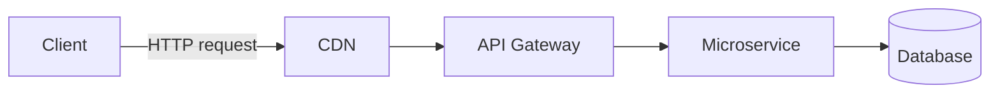

**Q: Is a fully stateless API always desirable?**
A: Not always — it forces every request to re-authenticate (revalidate JWT, resend context), trading server simplicity for client/network overhead. Statelessness is about the *protocol*, not forbidding persisted state (a DB is stateful; the *interaction* is not).

### Web API vs WCF vs MVC vs gRPC vs GraphQL

| | Web API | WCF | MVC | gRPC | GraphQL |
|---|---|---|---|---|---|
| Protocol | HTTP | HTTP/TCP/MSMQ/Pipes | HTTP | HTTP/2 | HTTP |
| Payload | JSON/XML | SOAP/XML | HTML/JSON | Protobuf (binary) | JSON (flexible) |
| Best for | REST APIs | Legacy SOAP | Server-rendered web | Internal low-latency M2M | Client-driven queries, BFF |

- **WCF is legacy** — no first-class support in modern .NET (only community CoreWCF for migration). Comes up mostly in "why migrate off WCF".

### SOAP vs REST

| | SOAP | REST |
|---|---|---|
| Messaging | XML, strict WSDL contract | JSON/XML, flexible |
| Performance | Slower (verbose XML) | Faster, lightweight |
| Security | Built-in WS-Security | OAuth2/JWT + HTTPS |
| Complexity | High (formal contracts) | Convention-driven |
| State | Can be stateful (WS-*) | Stateless by design |

### HTTP Methods, Status Codes, Idempotency

| Method | Use | Idempotent | Safe |
|---|---|---|---|
| GET | Read | Yes | Yes |
| POST | Create | No (by default) | No |
| PUT | Replace whole | Yes | No |
| PATCH | Partial | Not guaranteed | No |
| DELETE | Remove | Yes | No |

Key status codes: 200 OK, 201 Created (+`Location`), 202 Accepted (async), 204 No Content, 400 Bad Request, 401 Unauthorized (not authN), 403 Forbidden (authN'd, not authZ'd), 404 Not Found, 409 Conflict (concurrency/duplicate), 422 Unprocessable Entity (semantic/validation), 429 Too Many Requests, 500 Internal Server Error, 503 Service Unavailable.

- **Idempotent ≠ safe:** GET is both; PUT/DELETE are idempotent but mutate state. PATCH is *not* guaranteed idempotent (e.g. "increment by 1").

### Controllers, IActionResult, ActionResult\<T\>

```csharp
[ApiController]
[Route("api/products")]
public class ProductsController : ControllerBase
{
    [HttpGet] public IEnumerable<string> Get() => new[] { "Laptop", "Mobile" };

    [HttpGet("{id}")]
    public IActionResult GetProduct(int id)
    {
        if (id <= 0) return BadRequest("Invalid ID");
        return Ok(new { id, name = "Laptop" });
    }
}
```

- **`[ApiController]` gives:** auto 400 on invalid `ModelState`, `[FromBody]` inference for complex types, problem-details error shape, attribute-routing requirement.
- **`ActionResult<T>` vs `IActionResult`:** prefer `ActionResult<T>` in new code — OpenAPI tooling (Swashbuckle/NSwag) infers the schema from `T` without extra `[ProducesResponseType]`, while still allowing `return NotFound()`.

**Legacy `IHttpActionResult` vs `IActionResult`:**

| | `IHttpActionResult` | `IActionResult` |
|---|---|---|
| Framework | ASP.NET Web API 2 (`System.Web.Http`) | ASP.NET Core (`Microsoft.AspNetCore.Mvc`) |
| Model | `ExecuteAsync()` → `HttpResponseMessage` | `ExecuteResultAsync()` writes to Core pipeline |
| Status | Legacy | Current |

- Same helper names (`Ok()`, `BadRequest()`) but **not source-compatible** — migration needs `using` and base-class changes (`ApiController` → `ControllerBase`). Litmus test for having migrated legacy Framework code.

### Routing: Attribute vs Conventional

| | Conventional | Attribute |
|---|---|---|
| Location | `Program.cs`/`Startup.cs` | On controller/action |
| Flexibility | Less (good for MVC views) | More (required for Web APIs) |
| Example | `{controller}/{action}/{id?}` | `[Route("api/products/{id}")]` |

Modern APIs use attribute routing — colocates route + action, supports constraints, versioning tokens, explicit verbs.

```csharp
var builder = WebApplication.CreateBuilder(args);
builder.Services.AddControllers();
var app = builder.Build();
app.UseHttpsRedirection();
app.UseRouting();
app.UseAuthentication();
app.UseAuthorization();
app.MapControllers();
app.Run();
```

### Parameter Binding

| Attribute | Source |
|---|---|
| `[FromRoute]` | URL segment |
| `[FromQuery]` | Query string |
| `[FromBody]` | JSON body |
| `[FromHeader]` | HTTP header |
| `[FromForm]` | Form/multipart (file uploads) |

- **Gotcha:** only **one** `[FromBody]` per action — the body stream is read once. Wrap multiple complex inputs in one DTO.

### File Upload & Download (IFormFile)

```csharp
[HttpPost("upload")]
public async Task<IActionResult> Upload(IFormFile file)
{
    if (file is null || file.Length == 0) return BadRequest("No file uploaded.");
    var filePath = Path.Combine("uploads", file.FileName);
    using var stream = new FileStream(filePath, FileMode.Create);
    await file.CopyToAsync(stream);
    return Ok(new { file.FileName, file.Length });
}

[HttpGet("download/{fileName}")]
public IActionResult Download(string fileName)
{
    var filePath = Path.Combine("uploads", fileName);
    if (!System.IO.File.Exists(filePath)) return NotFound();
    var bytes = System.IO.File.ReadAllBytes(filePath);
    return File(bytes, "application/octet-stream", fileName);
}
```

Senior points to raise unprompted:
- `IFormFile` buffers to memory/temp disk — for large files stream via `MultipartReader`/`OpenReadStream()`; enforce a body-size limit (`[RequestSizeLimit]` / Kestrel `MaxRequestBodySize`) to avoid DoS.
- **Never trust `file.FileName`** as a path — path-traversal (`../../etc/passwd`); sanitize/regenerate (GUID) server-side.
- Validate content-type/extension **and** inspect magic-number bytes — clients lie about `Content-Type`.
- Prefer streaming large files straight to blob storage (Azure Blob/S3) — keeps API stateless, avoids disk/affinity issues when scaled.
- For big downloads return a stream (`FileStreamResult` / `PhysicalFile`) so it isn't buffered whole into memory.

### Content Negotiation

Same endpoint returns different representations by `Accept` header.

```csharp
builder.Services.AddControllers().AddXmlSerializerFormatters();
```

- `Accept` = what the **client wants back**; `Content-Type` = format of the **current body**.
- No matching formatter → falls back to JSON by default **unless** `ReturnHttpNotAcceptable = true`, then returns **406 Not Acceptable**.

---

## Intermediate

### Dependency Injection & Service Lifetimes

```csharp
builder.Services.AddScoped<IProductService, ProductService>();
```

| Lifetime | Created | Use | Risk |
|---|---|---|---|
| Singleton | Once/app | Logging, config, caches | Must be thread-safe; can't hold scoped deps |
| Scoped | Once/request | `DbContext`, unit-of-work | Captive dependency if injected into singleton |
| Transient | Every resolution | Lightweight stateless | Wasteful if expensive to build |

- `TryAddSingleton<T>` registers only if none exists (library code, don't clobber consumer); `AddSingleton<T>` always adds (multiple registrations resolvable via `IEnumerable<T>`).

**Q: Why can't a Singleton depend on a Scoped service (e.g. `DbContext`)?**
A: `DbContext` is Scoped (one unit-of-work per request, **not thread-safe**); a Singleton lives for the app lifetime, shared across concurrent requests. DI throws `InvalidOperationException: Cannot consume scoped service from singleton` (with validation on); without validation you get race conditions/shared state. **Fix — `IServiceScopeFactory`:**

```csharp
public void LogToDatabase(string message)
{
    using var scope = _scopeFactory.CreateScope();
    var db = scope.ServiceProvider.GetRequiredService<MyDbContext>();
    db.Logs.Add(new Log { Message = message });
    db.SaveChanges();
}
```

- Best practice for loggers: keep Singleton, stateless, thread-safe; prefer built-in `ILogger<T>`.

### SOLID Principles

| | Meaning | ASP.NET Core example |
|---|---|---|
| **S** Single Responsibility | One reason to change | Split Controller (HTTP) / Service (logic) / Repository (persistence) |
| **O** Open/Closed | Extend, don't modify | New `IDiscountStrategy` impl vs editing an `if/else` chain |
| **L** Liskov Substitution | Subtype usable as base, no surprises | Any `IPaymentGateway` honors same contract/exceptions |
| **I** Interface Segregation | Small client-specific interfaces | Split fat `IRepository` into `IReadRepository`/`IWriteRepository` |
| **D** Dependency Inversion | Depend on abstractions | Constructor-inject `ILogger`/`IProductService`, never `new` a concrete |

```csharp
public class UserService
{
    private readonly ILogger _logger;
    public UserService(ILogger logger) => _logger = logger; // abstraction, not ConsoleLogger
}
```

- DI in ASP.NET Core **is** DIP operationalized. Senior framing: don't recite the acronym — name a **real violation you refactored** and the trade-off (more interfaces/indirection vs easier testing/isolated change).

### Middleware Pipeline

```csharp
public class CustomMiddleware
{
    private readonly RequestDelegate _next;
    public CustomMiddleware(RequestDelegate next) => _next = next;
    public async Task Invoke(HttpContext context)
    {
        Console.WriteLine("Request: " + context.Request.Path);
        await _next(context);
    }
}
app.UseMiddleware<CustomMiddleware>();
```

- **Order matters:** top-down on the way in, bottom-up on the way out. `Use` continues; `Run` short-circuits.

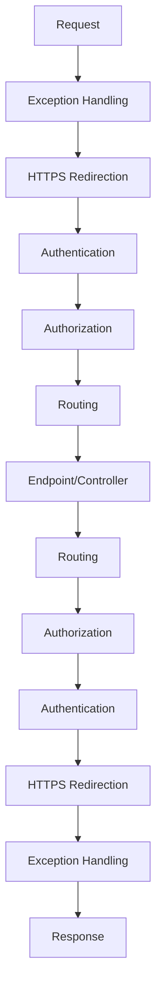

- **Middleware vs Filters:** middleware is global/framework-agnostic; filters are MVC-specific, run *inside* MVC invocation (after routing picks the action) with access to `ActionExecutingContext`/model-bound args.

### Request Lifecycle End-to-End

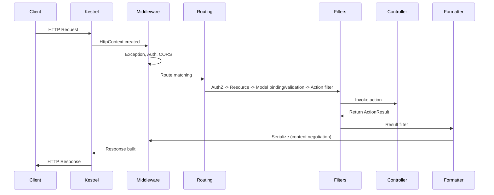

1. Client sends URL/method/headers/body.
2. **Kestrel** — cross-platform server, parses HTTP, builds `HttpContext`, no business logic; usually behind IIS/Nginx/LB (TLS termination, process mgmt).
3. **Middleware** — exception, logging, authN, authZ, CORS, routing (order matters).
4. **Authentication** — *who* (populates `HttpContext.User`); failure ⇒ anonymous, doesn't necessarily stop pipeline.
5. **Authorization** — *what* they can do; failure ⇒ 401/403, controller never runs.
6. **Routing** — matches URL+verb+template → action; determines binding sources.
7. **Filters** — AuthZ → Resource → Model binding/validation → Action → Exception → Result.
8. **Model binding & validation** — invalid + `[ApiController]` ⇒ auto 400 before action.
9. **Controller** — validated input, orchestrates services, returns `ActionResult`.
10. **Result execution** — converts `Ok()`/`NotFound()` to status + formatter.
11. **Formatting/negotiation** — JSON (default) or XML.
12. **Response** — back out through middleware in reverse, Kestrel sends.

One-liner: *Kestrel → Middleware → Routing → Filters → Controller → Formatters → Middleware → Client.*

### Model Validation

```csharp
public class Product
{
    [Required] public string Name { get; set; }
    [Range(1, 10000)] public decimal Price { get; set; }
}
```

- With `[ApiController]`, manual `if (!ModelState.IsValid) return BadRequest(...)` is **redundant** — framework auto-returns 400 with `ValidationProblemDetails`. Only needed when you opt out via `[ApiController(SuppressModelStateInvalidFilter = true)]`.
- **FluentValidation** = senior upgrade over Data Annotations for complex/conditional rules, testability, separation from model.

### Action Filters & Filter Pipeline

```csharp
public class LogActionFilter : ActionFilterAttribute
{
    public override void OnActionExecuting(ActionExecutingContext context)
        => Console.WriteLine($"Action {context.ActionDescriptor.DisplayName} executing");
}
```

| Filter | Runs | Use |
|---|---|---|
| Authorization | First | `[Authorize]` |
| Resource | Around model binding | Short-circuit caching, pre-checks |
| Action | Around action | Logging, timing, arg/result mutation |
| Exception | On unhandled action exception | Centralized error shaping |
| Result | Around result formatting | Header injection, wrapping |

### PUT vs PATCH (JSON Patch)

| | PUT | PATCH |
|---|---|---|
| Purpose | Replace whole resource | Partial update |
| Idempotent | Yes | Not guaranteed |
| Body | Full representation | Changed fields / patch doc |

```csharp
[HttpPatch("{id}")]
public async Task<IActionResult> UpdateProduct(int id, [FromBody] JsonPatchDocument<Product> patchDoc)
{
    var product = await _context.Products.FindAsync(id);
    if (product == null) return NotFound();
    patchDoc.ApplyTo(product, ModelState);
    if (!ModelState.IsValid) return BadRequest(ModelState);
    await _context.SaveChangesAsync();
    return Ok(product);
}
```

- **JSON Patch** (RFC 6902): `Content-Type: application/json-patch+json`, body `[{ "op":"replace","path":"/price","value":1500 }]`. Many teams instead use merge-patch (RFC 7396, plain partial DTO) for ergonomics — know both, justify the choice.

### Exception Handling

```csharp
public async Task Invoke(HttpContext context)
{
    try { await _next(context); }
    catch (Exception ex)
    {
        context.Response.StatusCode = 500;
        await context.Response.WriteAsync($"Error: {ex.Message}");
    }
}
```

- This raw-notes pattern is **not senior-grade**: leaks exception messages (info disclosure) + plain text not structured. Replace with `IExceptionHandler` (.NET 8+) + Problem Details (below).

### CORS

```csharp
builder.Services.AddCors(o => o.AddPolicy("AllowSpecificOrigin",
    p => p.WithOrigins("https://frontend.com").AllowAnyMethod().AllowAnyHeader()));
app.UseCors("AllowSpecificOrigin");
```

- CORS is **browser-enforced** — does nothing against server-to-server (curl/Postman/backends ignore it).
- **Never** combine wildcard origin (`*`) with `AllowCredentials()` — invalid by spec, common misconfig.

### Repository Pattern & DTOs

```csharp
public List<Product> GetAll() => _context.Products.AsNoTracking().ToList();

var productDto = _mapper.Map<ProductDTO>(product);
```

- **Nuance:** EF Core's `DbSet`/`DbContext` **already is** a unit-of-work + repository. Hand-rolled generic repository is a debated anti-pattern — adds indirection without reducing coupling, can strip `Include`/projection/compiled queries. Justify by a real need (swap persistence, test doubles), not cargo-cult.
- **DTOs matter for:** hiding DB-only fields, decoupling contract from schema (rename column ≠ break clients), preventing **over-posting/mass-assignment** (binding to EF entities lets a client set `IsAdmin`).

### IHttpClientFactory & Resilient HTTP Calls

```csharp
builder.Services.AddHttpClient<IProductService, ProductService>();

public ProductService(HttpClient httpClient) => _httpClient = httpClient;
```

- Solves **socket exhaustion:** `new HttpClient()` per request leaves sockets in `TIME_WAIT` (port exhaustion); a static singleton caches DNS forever (stale). `IHttpClientFactory` pools/recycles `HttpMessageHandler` on rotation (default 2 min) → reuse **and** DNS freshness. Also enables named/typed clients + Polly integration. (Introduced ASP.NET Core 2.1.)

---

## Advanced

### API Versioning Strategies

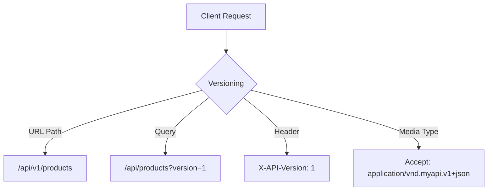

| Strategy | Pros | Cons |
|---|---|---|
| URL Path | Explicit, cacheable, easy to test/log | Pollutes URL |
| Query String | Simple | Easy to omit, messy cache keys |
| Header | Clean URL | Invisible to casual browsing, hard to test |
| Media Type | Most "RESTfully correct" | Complex, poor tooling |

```csharp
builder.Services.AddApiVersioning(o =>
{
    o.AssumeDefaultVersionWhenUnspecified = true;
    o.DefaultApiVersion = new ApiVersion(1, 0);
    o.ReportApiVersions = true;
    o.ApiVersionReader = new UrlSegmentApiVersionReader();
});
```

- **Recommendation:** URL path wins for discoverability/caching in most APIs. Use NuGet **`Asp.Versioning.Mvc`** (the modern successor; `Microsoft.AspNetCore.Mvc.Versioning` is **deprecated**). Deprecate gradually via `Sunset`/`api-supported-versions` headers; document in OpenAPI; consider an API gateway.

### REST Maturity Model (Richardson) & HATEOAS Trade-offs

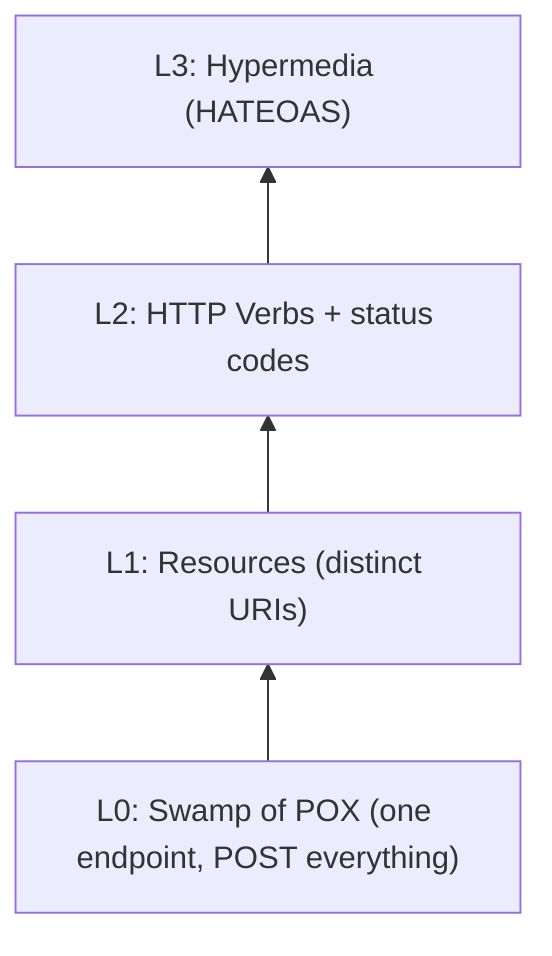

- **L0** one URL/verb (RPC-in-disguise); **L1** per-resource URIs; **L2** proper verbs + status codes (**where most real APIs live — a legit target**); **L3** HATEOAS (responses embed links describing next actions).

| HATEOAS Pro | Con |
|---|---|
| Decouples client from hardcoded URLs | Big added complexity both sides |
| Server-driven workflow changes, no client redeploy | Few SDKs actually consume links dynamically |
| Self-documenting/discoverable | Bigger payloads |
| Fits real state machines (pending→shipped→delivered) | Most CRUD doesn't need it |

- **Honest take:** elegant, heavily tested, rarely fully implemented. Most stop at L2 + explicit versioning. Pays off for complex order/workflow APIs where valid next-actions vary by state.

### Problem Details (RFC 7807/9457) for Error Responses

Standardized, machine-readable error body:

```json
{ "type": "https://example.com/probs/insufficient-funds", "title": "Insufficient funds",
  "status": 400, "detail": "Balance is 30, transfer requires 50.",
  "instance": "/transfers/abc-123", "traceId": "00-4bf9...-01" }
```

.NET 8+ built-in:

```csharp
builder.Services.AddProblemDetails(o => o.CustomizeProblemDetails =
    ctx => ctx.ProblemDetails.Extensions["traceId"] = ctx.HttpContext.TraceIdentifier);
builder.Services.AddExceptionHandler<GlobalExceptionHandler>();

public class GlobalExceptionHandler : IExceptionHandler
{
    public async ValueTask<bool> TryHandleAsync(HttpContext ctx, Exception ex, CancellationToken ct)
    {
        _logger.LogError(ex, "Unhandled exception");
        ctx.Response.StatusCode = StatusCodes.Status500InternalServerError;
        await ctx.Response.WriteAsJsonAsync(new ProblemDetails
        { Status = 500, Title = "An unexpected error occurred", Type = "https://httpstatuses.io/500" }, cancellationToken: ct);
        return true; // handled, don't rethrow
    }
}
app.UseExceptionHandler();
```

- **Why:** consistent structured errors let consumers write generic handling instead of string-matching. `[ApiController]`'s auto-400 already returns `ValidationProblemDetails` (a subtype) — use the same shape for *all* errors ⇒ uniform contract.

### Idempotency Keys for POST/PUT

POST isn't idempotent — a client retry can create two orders. Fix: **client-supplied idempotency key**.

```http
POST /payments
Idempotency-Key: 7b6a5e2e-...
```

```csharp
[HttpPost]
public async Task<IActionResult> CreatePayment(
    [FromHeader(Name = "Idempotency-Key")] string key, [FromBody] PaymentRequest req)
{
    if (string.IsNullOrEmpty(key)) return BadRequest("Idempotency-Key required.");
    var existing = await _cache.GetAsync<PaymentResult>(key);
    if (existing != null) return Ok(existing); // return original, don't reprocess
    var result = await _paymentService.ProcessAsync(req);
    await _cache.SetAsync(key, result, TimeSpan.FromHours(24));
    return Ok(result);
}
```

Senior nuances:
- Store the key **atomically with the side effect** (same DB tx / unique-constrained table) — Redis-only has a check-then-process race.
- Scope key with context (hash `userId + key`) to avoid collisions.
- **Concurrent** in-flight same-key ⇒ return `409 Conflict`/`425 Too Early`, don't double-process.
- Same idea as the outbox pattern — idempotency makes at-least-once delivery *behave like* exactly-once for the caller.

### Pagination Strategies: Offset vs Cursor

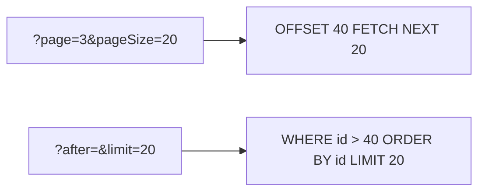

| Aspect | Offset | Cursor |
|---|---|---|
| Impl | Trivial `Skip/Take` | Encode last-seen sort key |
| At scale | Degrades (`OFFSET 100000` scans/discards) | Fast indexed seek |
| Concurrent writes | Unstable (dup/skipped rows) | Stable (relative to a row) |
| Random page jump | Yes | No (sequential) |
| Use | Admin UIs, small sets, total-pages | Feeds, large/high-write, public APIs (GitHub/Stripe/Slack) |

```csharp
var query = _context.Orders.OrderBy(o => o.Id).AsQueryable();
if (!string.IsNullOrEmpty(after))
    query = query.Where(o => o.Id > DecodeCursor(after));
var items = await query.Take(limit + 1).ToListAsync();
var hasMore = items.Count > limit;
items = items.Take(limit).ToList();
return Ok(new { data = items, nextCursor = hasMore ? EncodeCursor(items.Last().Id) : null });
```

- **Why not page numbers for public API?** Concurrent inserts/deletes make offset *silently* return dup/missing rows mid-scroll (invisible until a complaint); cursor seek is far cheaper (no OFFSET scan).

### Long-Running Operations: 202 Accepted + Polling

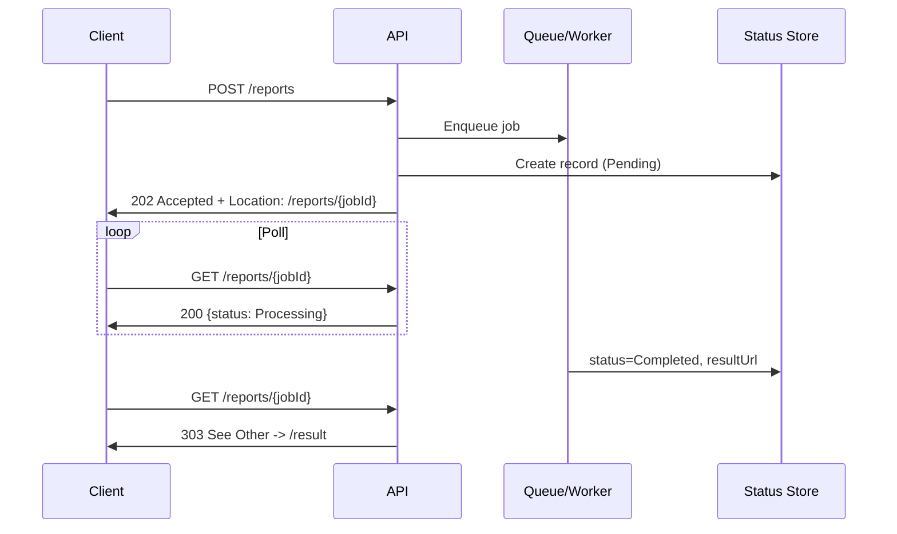

```csharp
[HttpPost("reports")]
public async Task<IActionResult> GenerateReport([FromBody] ReportRequest req)
{
    var jobId = Guid.NewGuid();
    await _jobStore.CreateAsync(jobId, JobStatus.Pending);
    await _queue.EnqueueAsync(new GenerateReportJob(jobId, req));
    return Accepted(new Uri($"/reports/{jobId}", UriKind.Relative), new { jobId, status = "Pending" });
}
```

- `202 Accepted` + `Location` header = HTTP-idiomatic "accepted, not done".
- **Webhooks** alternative to polling — server calls back client URL on completion (no polling load, but client needs a public endpoint + you handle retries/signature verification).
- Same shape as Azure Durable Functions async HTTP / AWS Step Functions. Combine with idempotency keys so retried POSTs don't enqueue duplicate jobs.

### OpenAPI/Swagger: Contract-First vs Code-First

```csharp
builder.Services.AddSwaggerGen();
app.UseSwagger();
app.UseSwaggerUI(c => c.SwaggerEndpoint("/swagger/v1/swagger.json", "My API v1"));
```

| | Code-first | Contract-first |
|---|---|---|
| How | Controllers → reflection generates `swagger.json` | Author `.yaml`/`.json` first → scaffold stubs/SDKs (NSwag, OpenAPI Generator, Kiota) |
| Pros | Fast, spec matches impl | Forces design review, parallel FE/BE, good for public/SLA APIs |
| Cons | Spec is a byproduct, easy to break consumers | Slower setup, drift risk unless CI-enforced |

- Internal fast-moving microservices ⇒ code-first pragmatic. Public/partner/breaking-change-costly APIs ⇒ contract-first + consumer-driven contract tests (Pact) + CI spec check.
- **.NET 9:** templates moving to `Microsoft.AspNetCore.OpenApi` package for generation, paired with Scalar/Swagger UI separately — verify against the job's .NET version.

### Minimal APIs vs Controllers

```csharp
app.MapGet("/api/products/{id}", async (int id, IProductService svc) =>
    await svc.GetByIdAsync(id) is { } p ? Results.Ok(p) : Results.NotFound())
   .WithName("GetProduct").WithOpenApi();
```

| Aspect | Controllers | Minimal APIs |
|---|---|---|
| Ceremony | More boilerplate | Terse, function-per-endpoint |
| Performance | Slightly higher overhead | Lower allocation/latency |
| Filters | Mature pipeline | `IEndpointFilter` (.NET 7+), less mature |
| Binding/validation | Automatic, attribute-driven | Manual/explicit, less complete |
| At scale | Controllers/areas | Needs `MapGroup` + extension methods |
| Best fit | Large teams, filters, versioning/OData | Microservices, small/latency-sensitive, serverless |

- Both compile to the same `Endpoint`/routing infra — choice is ergonomics/scale, not capability. Common: Minimal for small internal utilities, Controllers for large versioned public APIs.

### Rate Limiting (Built-in ASP.NET Core Middleware)

Since **.NET 7**: `Microsoft.AspNetCore.RateLimiting` (first-party — prefer over third-party `AspNetCoreRateLimit`).

```csharp
builder.Services.AddRateLimiter(o =>
{
    o.AddFixedWindowLimiter("fixed", opt => { opt.PermitLimit = 100; opt.Window = TimeSpan.FromMinutes(1); });
    o.AddTokenBucketLimiter("token", opt => { opt.TokenLimit = 50; opt.TokensPerPeriod = 10; opt.ReplenishmentPeriod = TimeSpan.FromSeconds(10); });
    o.OnRejected = async (ctx, ct) => { ctx.HttpContext.Response.StatusCode = 429; await ctx.HttpContext.Response.WriteAsync("Too many requests.", ct); };
});
app.UseRateLimiter();
app.MapGet("/api/products", () => Ok("data")).RequireRateLimiting("fixed");
```

| Algorithm | Behavior |
|---|---|
| Fixed Window | N per window; sharp reset (boundary bursts) |
| Sliding Window | Smoother; tracks segments |
| Token Bucket | Refills steadily; allows short bursts |
| Concurrency | Limits in-flight, not rate — protects expensive resources |

- **Distributed caveat:** counters are **in-memory per instance** — behind a LB, effective limit = `perInstanceLimit × instances`. For a global limit use a distributed store (Redis) or push to an API gateway/APIM/Kong.
- **Layered defenses:** WAF/CAPTCHA at edge (bots/volumetric), gateway for centralized per-client quotas, in-process middleware as last line protecting one instance's resources.

### Authentication & Authorization (JWT, OAuth2, OIDC)

**JWT** — stateless bearer token (`Authorization: Bearer <token>`).

```csharp
builder.Services.AddAuthentication(JwtBearerDefaults.AuthenticationScheme)
    .AddJwtBearer(o => o.TokenValidationParameters = new TokenValidationParameters
    {
        ValidateIssuer = true, ValidateAudience = true, ValidateLifetime = true,
        ValidateIssuerSigningKey = true, ValidIssuer = "yourdomain.com", ValidAudience = "yourdomain.com",
        IssuerSigningKey = new SymmetricSecurityKey(Encoding.UTF8.GetBytes(secretKey))
    });
```

- JWT pro: no server session, scales in distributed systems. Con: leaked token valid until expiry; revocation hard by design.
- **OAuth2** = *authorization* framework (scoped access via tokens). **OIDC** layers *authentication* (identity, ID tokens) on top. Distinction: **OAuth2 = "what can this app do on my behalf"; OIDC = "who is this user."**

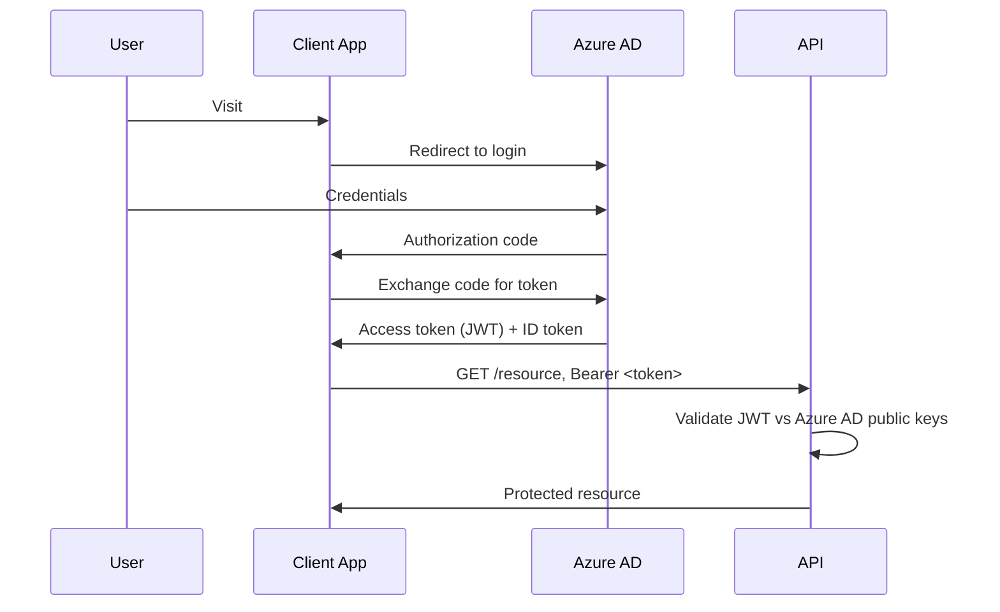

```csharp
builder.Services.AddAuthentication("Bearer")
    .AddMicrosoftIdentityWebApi(builder.Configuration.GetSection("AzureAd"));
```

- **Role-based** (`[Authorize(Roles="Admin")]`) vs **claims-based** (`User.FindFirst(ClaimTypes.Email)`). Claims are more general — roles are a special claim type. For anything beyond simple roles, use **policy-based** (`[Authorize(Policy="MinimumAge")]` + `IAuthorizationHandler`) to avoid scattered string checks.

### OAuth2 Grant Types — Which Fits Which Client

| Grant | Client | Why | Mechanic |
|---|---|---|---|
| **Auth Code + PKCE** | SPA, native/mobile | Public client can't hold a secret; PKCE replaces it with verifier/challenge, stops code interception | Redirect → authenticate → code → exchange code + `code_verifier` for tokens. Recommended for **all** clients under OAuth 2.1 |
| **Client Credentials** | Machine-to-machine | No user; the *app* is the identity; confidential client can store a secret | `client_id`+`client_secret` (or signed JWT) → token, no redirect |
| **Device Code** | Smart TV, CLI, IoT | Device can't render browser login / type | Device shows code+URL; user completes on phone/laptop; device polls |
| **Implicit** — deprecated | (old SPAs) | Token in URL fragment | Removed in OAuth 2.1 (history/referrer/script leaks) — use Auth Code + PKCE |
| **ROPC** — deprecated | (old first-party) | Client collects raw password | Removed in OAuth 2.1 (no MFA/social, trains bad habits) — legacy bridge only |

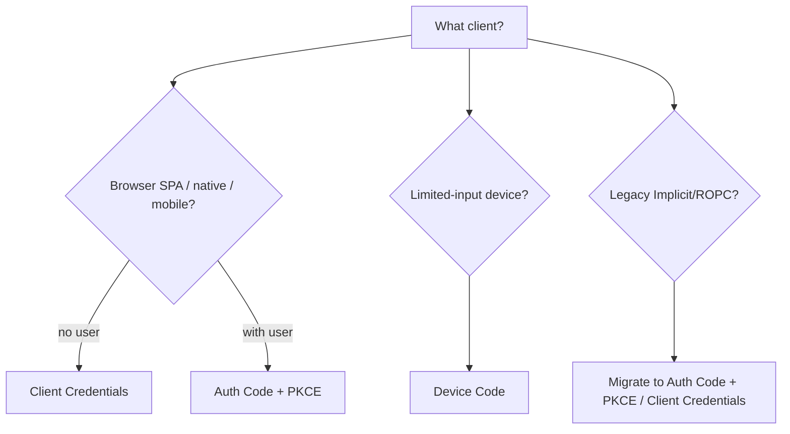

- **PKCE even for confidential clients?** Yes under 2.1 — protects code-interception regardless of type; one consistent flow = fewer mechanisms to get right.
- **Client Credentials for a SPA?** No — needs a secret, and a SPA's code is fully inspectable in the browser. No secret in frontend JS is truly secret.
- **User vs app identity:** Auth Code / Device Code tokens tie to a user; Client Credentials tokens represent only the app (no user identity — wrong for per-user authZ/audit).
- **.NET note:** `AddJwtBearer`/`Microsoft.Identity.Web` validate whatever token arrives regardless of grant — grant type is an *issuer* concern, not the resource server's.

### API Keys vs OAuth2 Scopes

| | API Keys | OAuth2 (scopes) |
|---|---|---|
| Identifies | An app/client | A user/service, delegated granular perms |
| Granularity | All-or-nothing | Fine-grained scopes (`read:orders`) |
| Rotation | Manual, often redeploy | Short-lived tokens + refresh, easy revoke |
| Use | Server-to-server, internal, metering | User-delegated, public APIs, per-user consent/audit |
| Security | Weaker (static, often over-privileged) | Stronger (short-lived, standardized, PKCE) |

```csharp
if (!context.Request.Headers.TryGetValue("X-API-KEY", out var key) || key != "expected-key")
{ context.Response.StatusCode = 401; await context.Response.WriteAsync("Unauthorized"); return; }
await _next(context);
```

- API keys fine for *which system* is calling (rate buckets, billing, trusted-network M2M); poor for per-user perms/consent/audit. Many breaches = over-scoped long-lived key in a config file. Prefer OAuth2 client-credentials over a bare key when an IdP exists.

### HATEOAS

```json
{ "id": 1, "name": "Laptop", "price": 1200,
  "links": [
    { "rel": "self", "href": "/api/products/1" },
    { "rel": "update", "href": "/api/products/1", "method": "PUT" },
    { "rel": "delete", "href": "/api/products/1", "method": "DELETE" }
  ] }
```

- Model with `ProductResource` + `List<LinkResource> { Rel, Href, Method }`. See Maturity Model above for full trade-offs.

### Microservices vs Monolithic

| Aspect | Monolith | Microservices |
|---|---|---|
| Deploy | One artifact/pipeline | Independent per service |
| Scale | Whole app (coarse) | Per service (fine) |
| Data | One shared DB | Per-service DB (joins → API calls) |
| Teams | Single/small org | Conway's Law, per-service ownership |
| Ops overhead | Low | High (discovery, tracing, contracts) |
| Transactions | Native ACID | Distributed → outbox/sagas/eventual |
| Failure | Bug can down whole app | Isolate via circuit breakers/bulkheads |

**Q: When choose monolith over microservices?**
A: Small team/low complexity (ops tax not worth it); early-stage/unclear domain boundaries (premature split ⇒ "distributed monolith"); lower ops overhead is a real win. Pragmatic middle: a **well-modularized monolith** (clean internal boundaries) so future extraction is a refactor not a rewrite (strangler fig).

**Q: What's a "distributed monolith"?** Services that still share a DB, deploy in lockstep, or call synchronously in long chains — all the ops complexity, none of the independence. Avoid via per-service data ownership, async/event-driven comms, boundaries around business capabilities (bounded contexts).

### API Gateway Pattern

Single entry point fronting services; centralizes routing, auth, rate limiting, observability.

| Concern | Gateway handles |
|---|---|
| Routing | `/api/orders` → Order Service |
| Security | Auth/authZ, API key at edge |
| Load balancing | Across instances |
| Rate limiting | Once, centrally |
| Monitoring | Single choke point |

- Options: **Ocelot** (.NET, lightweight), **YARP** (Microsoft reverse proxy, more flexible/performant, increasingly default), or managed (Azure APIM, AWS API Gateway, Kong).
- **BFF** = narrower pattern — a gateway tailored to one client (mobile BFF vs web BFF).

### CQRS

Separate read (query) and write (command) models.

```csharp
public record CreateProductCommand(string Name, decimal Price) : IRequest<Product>;
public record GetProductQuery(int Id) : IRequest<Product>;

public async Task<Product> Handle(GetProductQuery request, CancellationToken ct)
    => await _context.Products.FindAsync(request.Id);

// Controller
=> Ok(await mediator.Send(new GetProductQuery(id)));
```

- **Nuance:** CQRS does **not** require MediatR, event sourcing, or separate DBs — those are optional escalations. Core idea: don't force reads and writes through the same model when concerns diverge (write model enforces invariants; read model is a denormalized projection). Full CQRS+event sourcing+separate stores is heavyweight — using it by default ("because MediatR") is an overengineering trap.

### Background Jobs & IHostedService/BackgroundService

```csharp
public class Worker : BackgroundService
{
    protected override async Task ExecuteAsync(CancellationToken stoppingToken)
    {
        while (!stoppingToken.IsCancellationRequested)
        {
            Console.WriteLine("Running background task...");
            await Task.Delay(5000, stoppingToken);
        }
    }
}
builder.Services.AddHostedService<Worker>();
```

- `IHostedService` (`Start/StopAsync`) starts with app, stops gracefully. `BackgroundService` = preferred base class simplifying the loop.
- Use: periodic polling/cleanup, queue consumers, cache refresh, emails. For durable/scheduled/retry/dashboards ⇒ **Hangfire**/**Quartz.NET**:

```csharp
builder.Services.AddHangfire(c => c.UseSqlServerStorage(connStr));
app.UseHangfireDashboard(); app.UseHangfireServer();
BackgroundJob.Enqueue(() => Console.WriteLine("job"));
RecurringJob.AddOrUpdate("daily-cleanup", () => Console.WriteLine("recurring"), Cron.Daily);
```

- **Gotcha:** hosted services are **Singleton** — same rule: don't inject Scoped (`DbContext`) directly; use `IServiceScopeFactory` inside `ExecuteAsync`.

### WebSockets & SignalR

```csharp
app.UseWebSockets();
app.Use(async (ctx, next) => {
    if (ctx.Request.Path == "/ws" && ctx.WebSockets.IsWebSocketRequest)
    { var socket = await ctx.WebSockets.AcceptWebSocketAsync(); /* handle */ }
    else await next();
});
```

```csharp
public class ChatHub : Hub
{
    public async Task SendMessage(string user, string msg)
        => await Clients.All.SendAsync("ReceiveMessage", user, msg);
}
app.MapHub<ChatHub>("/chatHub");
```

- **SignalR** = real-time abstraction over WebSockets (falls back to SSE/long polling), adds groups/user mgmt, auto-reconnect, Redis/Azure SignalR backplane for scale-out.
- **Choosing:** raw WebSockets for full control / non-.NET clients / custom protocol; SignalR when both ends .NET-friendly + want bidirectional with less boilerplate; SSE for server→client push only; long polling as lowest-common-denominator fallback.

### Circuit Breaker & Resiliency (Polly)

```csharp
builder.Services.AddHttpClient("ExternalAPI")
    .AddTransientHttpErrorPolicy(p => p.CircuitBreakerAsync(2, TimeSpan.FromSeconds(30)));
```

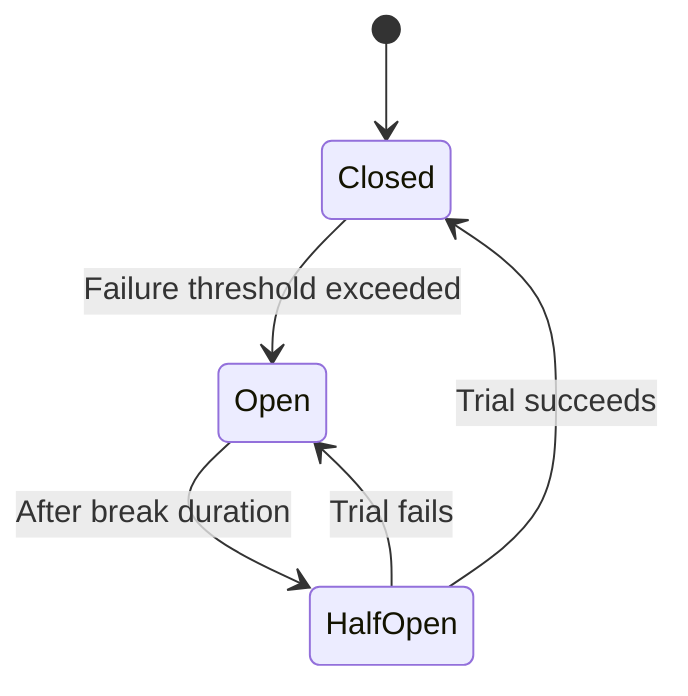

- Circuit breaker prevents cascading failures by "opening" (short-circuiting) after a threshold, then a **Half-Open** trial before closing.
- **.NET 8:** `Microsoft.Extensions.Http.Resilience` (wraps Polly v8) — current idiomatic approach via `AddStandardResilienceHandler()`.
- Related: **Retry** (exponential backoff + jitter), **Bulkhead** (cap concurrency), **Timeout**, **Fallback** (cached/default for graceful degradation).

### gRPC vs REST vs GraphQL

| | REST | gRPC | GraphQL |
|---|---|---|---|
| Protocol | HTTP/1.1 or 2 | HTTP/2 (mandatory) | HTTP (any) |
| Payload | JSON/XML | Protobuf (binary) | JSON |
| Contract | OpenAPI (optional) | `.proto` (mandatory, typed) | Schema (mandatory, typed) |
| Streaming | Limited (SSE/chunked) | Native bidirectional | Subscriptions (WS, bolted on) |
| Browser | Native | Needs grpc-web proxy | Native |
| Over/underfetch | Common | N/A | Solved (client picks fields) |
| Best for | Public/broad clients | Internal M2M, low-latency, polyglot | Client-driven UIs, BFF |

- **Which to pick:** REST for public/diverse clients (compatible, cacheable via HTTP semantics); gRPC for internal M2M you control both ends (speed + strong contracts); GraphQL when data shapes vary a lot — but downsides: harder HTTP caching (single `POST /graphql` defeats CDN), N+1 resolver risk (use DataLoader batching), field-level authZ complexity.

### OData

```csharp
builder.Services.AddControllers().AddOData(o => o.Select().Filter().OrderBy());

[EnableQuery] [HttpGet] public IQueryable<Product> Get() => _context.Products;
```
```http
GET /api/products?$filter=price gt 100&$orderby=name
```

- **Trade-off:** free ad-hoc querying, but clients can build arbitrarily expensive queries (unbounded `$expand`, filters on unindexed columns) — a self-inflicted DoS vector. Needs guardrails: max `$top`, query cost limits, disable `$expand` on large collections.

---

## System Design & Scalability

### Database Sharding vs Partitioning

| Aspect | Partitioning | Sharding |
|---|---|---|
| Scope | Split one table **within same DB instance** | Split across **multiple DB instances/servers** |
| Goal | Manageability/perf on a big table | Horizontal scalability |
| Transparency | Usually transparent (engine routes) | App/proxy must know shard via shard key |
| Cross-partition/shard | Cheap (same engine) | Expensive (fan-out, joins hard) |
| Complexity | Lower (DBA/schema) | Higher (app code, routing, rebalancing) |
| .NET/SQL | `PARTITION BY RANGE`, partitioned indexes | Shard key in routing (`TenantId % N`, consistent hashing), Citus/Vitess, multi-DbContext |

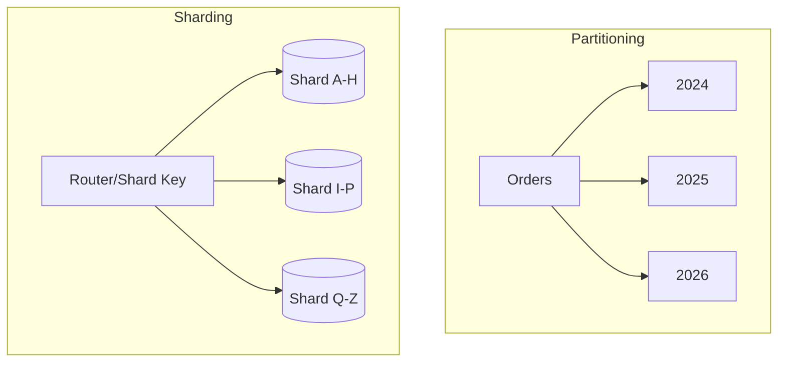

- **Trade-off:** partition first (solves "table too big" with no app changes). Shard only when a *single instance's* capacity (storage/IOPS/connections) is the bottleneck — pushes complexity into app (shard-key hotspots, cross-shard joins/tx, rebalancing). Middle ground: shard key that's also a partition boundary (e.g. `TenantId`).

### Feature Flags & Safe Rollout

Decouple **deployment** (code in prod) from **release** (feature visible).

```csharp
if (await _featureManager.IsEnabledAsync("NewCheckoutFlow"))
    return await _newCheckoutService.ProcessAsync(order);
return await _legacyCheckoutService.ProcessAsync(order);

builder.Services.AddFeatureManagement(); // Microsoft.FeatureManagement
```

- **Gradual/% rollout** 1→10→50→100%, watch metrics each step.
- **Kill switch** — flip without redeploy (seconds during incident).
- **Flag hygiene/debt** — flags are temporary; stale ones = untested combinatorial branches; remove after rollout.
- **Consistent bucketing** — hash user/session ID (not fresh random per request) so a user stays in the same variant.
- Tooling: `Microsoft.FeatureManagement`, or LaunchDarkly/Azure App Config/Unleash for targeting/analytics.

### Zero-Downtime Deployment: Blue-Green & Canary

| Strategy | How | Rollback | Cost |
|---|---|---|---|
| **Blue-Green** | Two full envs; deploy v2 to idle, smoke-check, flip LB atomically | Instant (flip back) | Double infra during overlap |
| **Canary** | v2 alongside v1; route small % traffic, watch, ramp to 100% | Fast (reduce v2 share) | Lower; needs traffic-splitting |
| **Rolling** | Replace v1 instances with v2 a few at a time | Slower (redeploy prev) | Low (K8s default) |

- **Readiness probes** — only route once instance reports *ready* (not just started); prevents half-deployed instances serving errors.
- **Backward-compatible DB migrations** — riskiest part; migration must work with *both* old and new code during the window (add nullable column + backfill later, not rename/drop in one deploy).
- **Graceful shutdown** — drain in-flight requests (`IHostApplicationLifetime`/SIGTERM), don't just kill.
- Canary catches bad deploys early (small blast radius) but needs metrics-driven promotion; blue-green is simpler but issues surface only after 100% flip.

### The Outbox Pattern

**Problem (dual-write):** update DB *and* publish an event as one atomic unit, but DB and broker have no shared transaction — one can succeed while the other fails (order created but no `OrderCreated` event).

**Fix:** write the event to an `OutboxMessages` table in the **same DB transaction** as the business change; a separate relay reads unpublished rows, publishes to broker, marks processed.

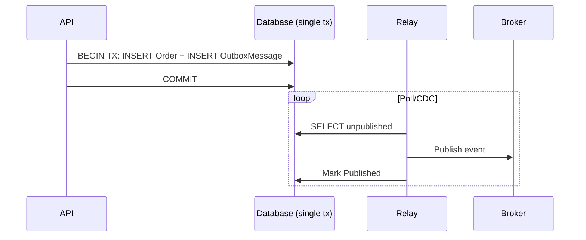

```csharp
_context.Orders.Add(order);
_context.OutboxMessages.Add(new OutboxMessage {
    Id = Guid.NewGuid(), Type = "OrderCreated",
    Payload = JsonSerializer.Serialize(new { order.Id, order.CustomerId }),
    CreatedAt = DateTime.UtcNow });
await _context.SaveChangesAsync(); // both rows commit together, or neither
```

- Relay delivers **at-least-once** (can crash after publish, before marking) ⇒ consumers must be **idempotent**. This is how "exactly-once" is actually done: at-least-once + idempotent consumers.
- Standard building block for **sagas** (chain of local transactions), the alternative to non-scaling distributed 2PC.
- Trade-off: extra table + relay + eventual (not immediate) delivery — only when you need DB-write-and-publish atomicity across a network.

### Eventual Consistency & Compensating Transactions

No cross-service ACID — each service commits locally; the whole op becomes consistent *eventually* as events propagate.

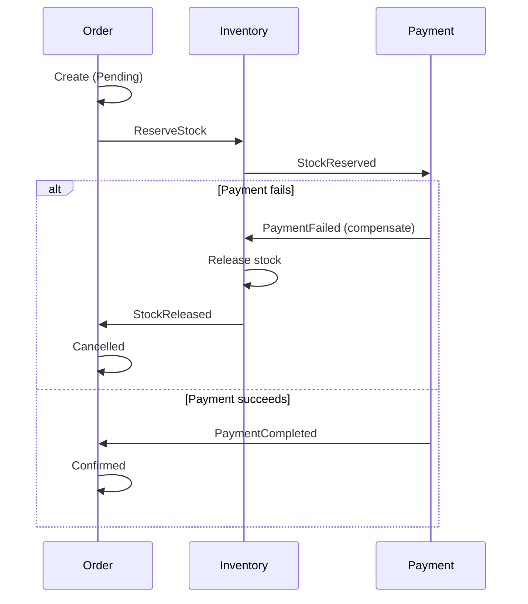

- **Compensating transactions** = explicit business *undo* (release stock, refund, cancel shipment) since there's no shared rollback. Core of the **Saga pattern**.
- Raise unprompted: UI must be honest about interim states ("confirming payment"); read models can lag (return the just-written entity from the write path); some actions can't be undone (emails/irreversible side effects) — defer them until a point of no realistic failure; idempotency + outbox are what make sagas reliable.

---

## Deployment & Observability

### Health Checks

```csharp
builder.Services.AddHealthChecks()
    .AddDbContextCheck<AppDbContext>()
    .AddCheck<RedisHealthCheck>("redis")
    .AddUrlGroup(new Uri("https://downstream-api.com/health"), name: "downstream-api");
app.MapHealthChecks("/health");
```

- Split **liveness** (process alive/restart?) from **readiness** (ready for traffic — DB reachable, caches warm) via separate endpoints/tags — conflating them makes K8s restart a still-starting pod or keep routing to a pod with a dead DB.
- A readiness check pinging a downstream can itself cascade failures — bound with timeout; treat "downstream degraded" as `Degraded` not necessarily `Unhealthy`.
- HealthChecks.UI dashboard is for humans; the *endpoints* are what orchestrators consume. This is the concrete "readiness probe" from zero-downtime deploy.

### Dockerizing a .NET Web API

```dockerfile
FROM mcr.microsoft.com/dotnet/sdk:8.0 AS build
WORKDIR /src
COPY . .
RUN dotnet restore
RUN dotnet publish -c Release -o /app/publish

FROM mcr.microsoft.com/dotnet/aspnet:8.0 AS runtime
WORKDIR /app
COPY --from=build /app/publish .
EXPOSE 8080
ENTRYPOINT ["dotnet", "MyWebAPI.dll"]
```

- **Multi-stage** = build with full `sdk`, ship the lean `aspnet` runtime (no compilers ⇒ smaller image, less attack surface).
- Pin exact tags (`aspnet:8.0`, not `latest`); run as **non-root** (official images default to `app` user since .NET 8); `.dockerignore` bin/obj/.git; externalize config via env vars/secrets (never bake connection strings). Expect **Kubernetes** as the follow-up (resource limits, HPA, `ConfigMap`/`Secret`).

### Application Insights (Monitoring & Telemetry)

```csharp
builder.Services.AddApplicationInsightsTelemetry(builder.Configuration["ApplicationInsights:ConnectionString"]);
// _telemetry.TrackEvent("ProductsListRequested");
```

- Out of the box: auto request/dependency tracking (HTTP/SQL timed + correlated), exception tracking, live metrics, and **distributed correlation** (`Operation Id` ties one logical request across service hops → end-to-end trace in Application Map).
- **vs OpenTelemetry:** current App Insights is built **on OpenTelemetry** (Azure Monitor OTel Distro) — "App Insights today = OTel instrumentation exported to Azure Monitor", not a competing tech. Use custom `TrackEvent`/`TrackMetric` for business-level signals only (avoid noise/cost).

---

## Performance

### Response Compression

```csharp
builder.Services.AddResponseCompression(o => {
    o.Providers.Add<BrotliCompressionProvider>();
    o.Providers.Add<GzipCompressionProvider>();
});
app.UseResponseCompression();
```

- Reduces payload/network time, costs CPU. **Brotli** compresses text (JSON) better than Gzip at comparable speed — primary, Gzip fallback.
- **Gotcha:** not worth it for already-compressed content (images/video) or tiny payloads; register early, sits behind HTTPS/caching in the pipeline.

### Response Caching, Output Caching & Distributed Cache (Redis)

```csharp
builder.Services.AddResponseCaching();
app.UseResponseCaching();
[ResponseCache(Duration = 60, Location = ResponseCacheLocation.Client)]
```

- `[ResponseCache]` mostly sets HTTP caching **headers** — doesn't necessarily cache server-side; respects `Vary`/`Cache-Control` (misconfig silently disables it).
- **Output Caching** (.NET 7, `AddOutputCache()`/`UseOutputCache()`) is the real server-side body cache with policies + tag eviction — modern recommendation:

```csharp
builder.Services.AddOutputCache(o => o.AddPolicy("Products",
    p => p.Expire(TimeSpan.FromSeconds(60)).Tag("products")));
app.UseOutputCache();
app.MapGet("/api/products", () => Ok(products)).CacheOutput("Products");
await outputCacheStore.EvictByTagAsync("products", ct); // on write
```

**Distributed cache (Redis) — cache-aside:**

```csharp
builder.Services.AddStackExchangeRedisCache(o => { o.Configuration = "redis:6379"; o.InstanceName = "app_"; });

var value = await cache.GetStringAsync("product_10");
if (value is null) {
    value = await FetchFromDbAndSerialize();
    await cache.SetStringAsync("product_10", value,
        new DistributedCacheEntryOptions { AbsoluteExpirationRelativeToNow = TimeSpan.FromMinutes(10) });
}
```

- **Why Redis in microservices:** `IMemoryCache` diverges per instance (hit on A = miss on B); Redis = one shared cache across the fleet.

| Pitfall | Description | Mitigation |
|---|---|---|
| Cache Stampede | Many concurrent misses hit DB together | Distributed locks, warming, jittered TTL |
| Cache Invalidation | Stale after DB update | Delete-on-write, write-through, event-driven |
| Storing Too Much | Redis as a datastore | Cache hot data, set TTLs |
| Serialization | Inefficient large graphs | MessagePack / trimmed DTOs |
| Redis as Primary Store | Relying on durability | Treat as disposable — losing it degrades, not breaks |
| Connection Mismanagement | New connection per call | Reuse a shared `IConnectionMultiplexer` singleton |

### ETags & Conditional Requests

```csharp
[HttpGet("{id}")]
public async Task<IActionResult> GetProduct(int id)
{
    var product = await _context.Products.FindAsync(id);
    if (product is null) return NotFound();
    var etag = $"\"{product.RowVersion.ToBase64()}\"";
    Response.Headers.ETag = etag;
    if (Request.Headers.IfNoneMatch == etag) return StatusCode(304);
    return Ok(product);
}

[HttpPut("{id}")]
public async Task<IActionResult> UpdateProduct(int id, [FromBody] Product update)
{
    var product = await _context.Products.FindAsync(id);
    if (product is null) return NotFound();
    var currentEtag = $"\"{product.RowVersion.ToBase64()}\"";
    if (Request.Headers.IfMatch != currentEtag) return StatusCode(412); // changed first
    await _context.SaveChangesAsync();
    return NoContent();
}
```

- **`ETag` + `If-None-Match`** = conditional GET → `304 Not Modified` (no body), saves bandwidth.
- **`ETag` + `If-Match`** = optimistic concurrency for writes → `412 Precondition Failed` if changed since read (HTTP-layer analog of EF Core `RowVersion`/`[ConcurrencyCheck]`).
- Standards-based alternative to bespoke "version" body fields; works with CDNs/proxies.

### Query & EF Core Performance

```csharp
var products = _context.Products.AsNoTracking().ToList();
```

- **`AsNoTracking()`** for read-only (skip change-tracking).
- **Avoid N+1** — `.Include()`/`.ThenInclude()` or projections (`.Select(x => new Dto {...})`).
- **Compiled queries** (`EF.CompileAsyncQuery`) for hot repeated shapes.
- **Split queries** (`.AsSplitQuery()`) to avoid cartesian explosion on multiple collection includes.
- **Diagnose** via `.ToQueryString()`, query logging, `EXPLAIN`/plans; check missing indexes on filter/join columns.
- **Paginate at DB level** — `Skip/Take` before `ToList()`, not after.
- **Dapper/raw ADO.NET** for genuine hotspots — profile first, don't default to it.

### Soft Delete Pattern

```csharp
public class Product { public int Id { get; set; } public string Name { get; set; } public bool IsDeleted { get; set; } }

[HttpDelete("{id}")]
public async Task<IActionResult> SoftDelete(int id)
{
    var product = await _context.Products.FindAsync(id);
    if (product is null) return NotFound();
    product.IsDeleted = true;
    await _context.SaveChangesAsync();
    return NoContent();
}
```

- Preserves audit history, avoids FK cascade breaks. Manual `.Where(p => !p.IsDeleted)` everywhere doesn't scale — use an **EF Core global query filter**:

```csharp
protected override void OnModelCreating(ModelBuilder mb)
    => mb.Entity<Product>().HasQueryFilter(p => !p.IsDeleted);
```

- Every query (incl. `Include`d navs) auto-excludes deleted; use `.IgnoreQueryFilters()` for admin/audit.
- **Trade-offs:** unique constraints must account for deleted rows (filtered/partial unique index `WHERE IsDeleted = 0`); decide child cascade-flagging; not a substitute for a retention/purge policy (table grows forever); for GDPR "right to be forgotten" you must scrub PII, not just flag.

### Async/Await Pitfalls

- **`Task.Run` in request handlers is almost always wrong** — just moves work to another pool thread, no parallelism for a single request, worsens starvation under load.
- **Blocking on async** (`.Result`/`.Wait()`/`.GetAwaiter().GetResult()`) risks deadlocks with a sync context (less so in ASP.NET Core — no `SynchronizationContext` by default) but still wastes a pool thread + hurts testability.
- **`ConfigureAwait(false)`** matters in *library* code; largely a non-issue in ASP.NET Core app/controller code (no context to capture) but good hygiene in shared libs.
- **`ValueTask` vs `Task`:** `ValueTask<T>` avoids a heap alloc on synchronous completion (cache hit) — good in hot paths, but **must not be awaited twice / stored / awaited concurrently** (unlike `Task`).
- **Deadlock classic:** sync-over-async blocking a thread waiting on a Task that needs that thread/a starved pool.

---

## Security

### Securing a Web API — Full Checklist

| Measure | Purpose |
|---|---|
| Authentication (JWT/OAuth2/API keys) | Who can access |
| Authorization (roles/claims/policies) | What they can do |
| CORS | Blocks unauthorized cross-origin browser calls |
| Rate limiting | Prevents abuse/DoS |
| Input validation & sanitization | Prevents injection (SQL/XSS) |
| HTTPS/TLS everywhere | Encrypts in transit |
| Secrets mgmt (Key Vault, env vars) | Prevents credential leaks |
| Security headers (HSTS, CSP, X-Content-Type-Options) | Defense-in-depth |

```csharp
// BAD
string query = "SELECT * FROM users WHERE username = '" + userInput + "'";
// GOOD — parameterized
var cmd = new SqlCommand("SELECT * FROM users WHERE username = @username", conn);
cmd.Parameters.AddWithValue("@username", userInput);
```

- EF Core LINQ parameterizes automatically; the risk is `FromSqlRaw` — prefer `FromSqlInterpolated`/explicit params.
- **XSS:** encode HTML-rendered content; for APIs the bigger risk is frontends trusting responses — still validate/sanitize stored input to avoid becoming a stored-XSS vector.
- Data Annotations: `[Required][StringLength(50)]`, `[EmailAddress]`.

### SSL/TLS Fundamentals

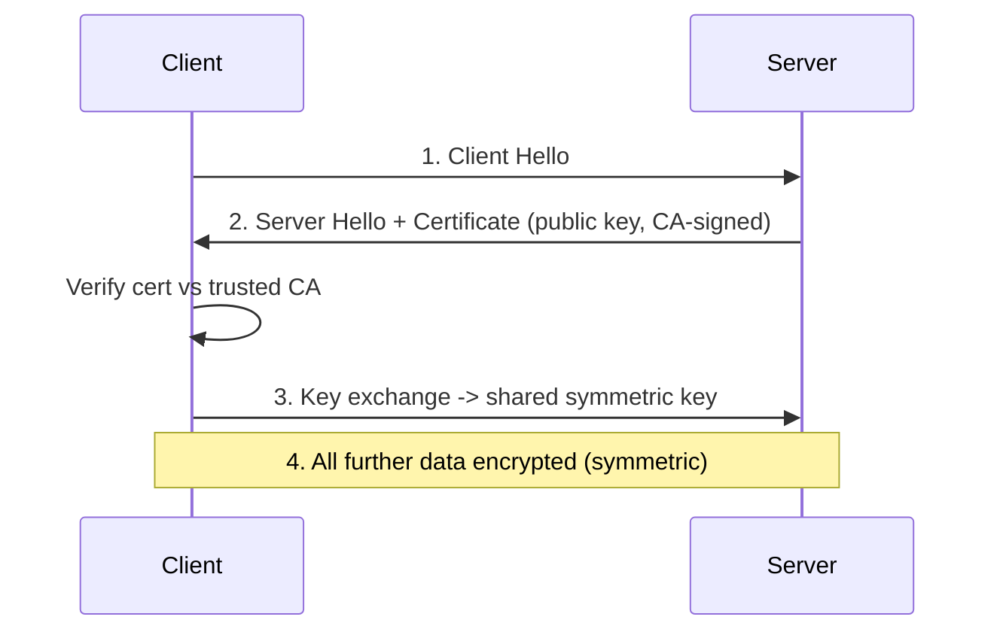

- "SSL" is colloquial; **TLS** is the actual protocol (SSL deprecated/insecure).
- Three guarantees: confidentiality (encryption), authentication (CA-signed cert), integrity (tamper detection).
- Protects **in transit only**, not at rest (separate concern).
- Handshake once/connection; **hybrid** — asymmetric for handshake, symmetric for bulk (symmetric is orders of magnitude faster).
- **TLS termination** often at LB/IIS/proxy; backend gets plain HTTP within a trusted boundary.
- **HSTS** (`Strict-Transport-Security: max-age=31536000; includeSubDomains`) forces HTTPS, closes downgrade window.

### Token Revocation & Refresh Tokens

**Problem:** JWTs are stateless/self-contained (the point of them) — a leaked JWT stays valid until expiry, no built-in early invalidation.

```csharp
// Naive, inadequate for production:
private static readonly List<string> _blacklistedTokens = new();
```

- **Why naive blacklist fails:** `static List` is per-instance — revoking on A does nothing for B/C. Production: **distributed revocation store** (Redis, TTL = remaining token life) checked in validation, or better — **avoid it**: (1) short access-token lifetimes (minutes), (2) refresh tokens stored server-side (revocable/rotatable).

```csharp
[HttpPost("refresh-token")]
public async Task<IActionResult> RefreshToken([FromBody] TokenRequest req)
{
    var user = await _context.Users.SingleOrDefaultAsync(u => u.RefreshToken == req.RefreshToken);
    if (user == null || user.RefreshTokenExpiry < DateTime.UtcNow) return Unauthorized();
    var newAccess = GenerateJwtToken(user);
    user.RefreshToken = GenerateRefreshToken(); // rotate on use — prevents replay
    await _context.SaveChangesAsync();
    return Ok(new { Token = newAccess, RefreshToken = user.RefreshToken });
}
private string GenerateRefreshToken() => Convert.ToBase64String(RandomNumberGenerator.GetBytes(64));
```

- **Refresh token rotation** (new token each use, invalidate old) = current best practice — detects theft (replayed stolen token after legitimate rotation ⇒ revoke the whole family).

### Two-Factor Authentication

```csharp
var token = await _userManager.GenerateTwoFactorTokenAsync(user, TokenOptions.DefaultPhoneProvider);
await _smsService.SendSmsAsync(user.PhoneNumber, $"Your code is {token}");
var isValid = await _userManager.VerifyTwoFactorTokenAsync(user, TokenOptions.DefaultPhoneProvider, inputToken);
if (!isValid) return Unauthorized();
```

- **SMS 2FA is the weakest** (SIM-swapping); TOTP apps (Authenticator/Authy) or WebAuthn/FIDO2 passkeys are stronger and preferred.

---

## Best Practices

- Resource-oriented URLs (nouns), correct verbs/status codes, consistent pluralization/casing.
- DTOs at boundaries — never bind to EF entities (over-posting, schema coupling).
- Version from day one for external/cross-team APIs (retrofitting is painful).
- Problem Details (RFC 7807/9457) for all errors, not ad hoc shapes.
- Make POST/PUT idempotent where meaning allows; use idempotency keys otherwise.
- Cursor pagination for large/high-write/public collections.
- `IHttpClientFactory` for all outbound HTTP; never `new HttpClient()` per call or bare static singleton.
- Thin controllers — orchestration only; logic in services/domain.
- Structured logging (`ILogger` + Serilog) with correlation IDs + distributed tracing (OpenTelemetry).
- HTTPS everywhere, HSTS in prod, never disable cert validation "temporarily".
- **Fail closed** on authorization — default-deny, explicit allow.
- Load-test/profile before optimizing (`dotnet-counters`/`dotnet-trace`).
- Treat the API as a product: document (OpenAPI), SLA/deprecation policy, backward compatibility by default.

## Common Pitfalls

- Assuming PATCH is idempotent by default.
- Leaking raw exception messages/stack traces to clients.
- Wildcard CORS + credentials.
- Injecting Scoped (`DbContext`) into a Singleton.
- Offset pagination on a large mutating table (dup/missing rows).
- Treating Redis/cache as a system of record.
- In-memory-per-instance rate limiting mistaken for a global limit.
- Unrestricted OData `$filter`/`$expand` (no page-size caps).
- Blocking on async (`.Result`/`.Wait()`) in request paths.
- Wrapping EF `DbContext` in a repository with no justification (loses `IQueryable`).
- Redundant manual `ModelState` checks under `[ApiController]`.
- Assuming a JWT can be "logged out" server-side without a revocation store or short-expiry + refresh strategy.

## Sample Interview Q&A

**Q: Explain the request pipeline and where middleware fits.**
A: Kestrel builds `HttpContext` → ordered middleware (exception → HTTPS → routing → authN → authZ → custom) → endpoint (controller/minimal API) → filters → back out through middleware in reverse. Order matters; `Use` continues, `Run` short-circuits.

**Q: Avoid socket exhaustion with `HttpClient`?**
A: `IHttpClientFactory` (named/typed) — pools/recycles handlers on rotation; connection reuse without a static singleton's DNS staleness.

**Q: Diagnose a slow EF Core query?**
A: `.ToQueryString()`/query logging → `EXPLAIN`/plan → check missing indexes on filter/join/order-by columns → look for N+1 (missing `.Include()`/projections) → confirm `AsNoTracking()` on reads.

**Q: gRPC over REST when?**
A: Internal M2M you control both ends, low latency/high throughput, strong typed `.proto` contracts, native bidirectional streaming. REST stays the default for public/broad clients.

**Q: Idempotent retries for a payment API?**
A: Client-supplied idempotency key per operation; store key + result atomically (same tx / unique-constrained table); on retry return stored result; concurrent-in-flight ⇒ 409/425.

**Q: Long-running operation from a POST?**
A: `202 Accepted` + `Location` to a status resource, enqueue to background worker, client polls (or webhook) — never block the original request.

**Q: AuthN vs AuthZ, and where each fails?**
A: AuthN (who) runs first, populates `HttpContext.User`, failure ⇒ anonymous. AuthZ (what) runs after, enforces `[Authorize]`/roles/policies, failure ⇒ 401/403 and action never runs.

**Q: Why can't you inject `DbContext` into a Singleton?**
A: `DbContext` is Scoped (per-request, not thread-safe); Singleton is app-lifetime, shared across concurrent requests ⇒ lifetime-validation exception or race/shared-state corruption. Fix: `IServiceScopeFactory` + create a scope per operation.

**Q: Offset vs cursor pagination — pick each when?**
A: Offset for small/static sets where "jump to page N" + total-count matter (admin grids). Cursor for large/high-write/public collections (Stripe/GitHub) — immune to row-shift, consistent indexed seek vs discarding OFFSET scan.

**Q: Keep an API backward compatible while evolving it?**
A: Version explicitly (URL path default), add fields (don't change/remove within a version), gate breaking changes behind a new version, publish a deprecation timeline (`Sunset`/`Deprecation` headers), validate via consumer-driven contract tests in CI.

---

## Summary of Additions

`[new content]` sections added (frequently probed in current senior interviews, thin/absent in original notes): REST Maturity Model & HATEOAS trade-offs; Problem Details (RFC 7807/9457); Idempotency Keys; Offset vs Cursor Pagination; 202 Accepted + Polling; OpenAPI Contract-First vs Code-First; Minimal APIs vs Controllers; built-in Rate Limiting; API Keys vs OAuth2 Scopes; ETags & Conditional Requests.

### Contradictions Flagged

- Source references `Microsoft.AspNetCore.Mvc.Versioning` (deprecated) → use `Asp.Versioning.Mvc` / `.ApiExplorer`. Flagged inline as a package-lifecycle change, not a note-vs-note conflict.
- No direct factual contradictions between passages; duplicate REST/PUT-vs-PATCH/CORS/rate-limiting/versioning blocks were consistent and merged/de-duplicated.

### Summary of [gaps] Additions

- **OAuth2 Grant Types — Which One Fits Which Client:** existing content named grant types only in passing; "which grant fits which client" (SPA vs native/mobile vs M2M vs limited-input device) is a top *direct* OAuth2 question. Also flags Implicit and ROPC as deprecated under OAuth 2.1 — current and easy to get wrong from older material.
