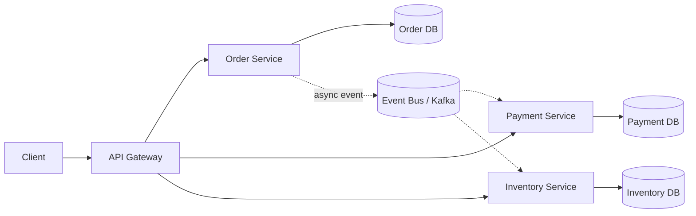
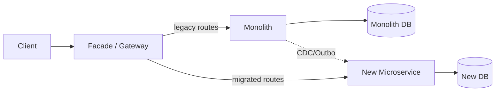
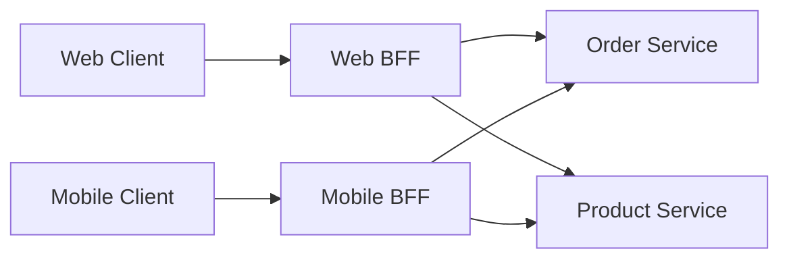
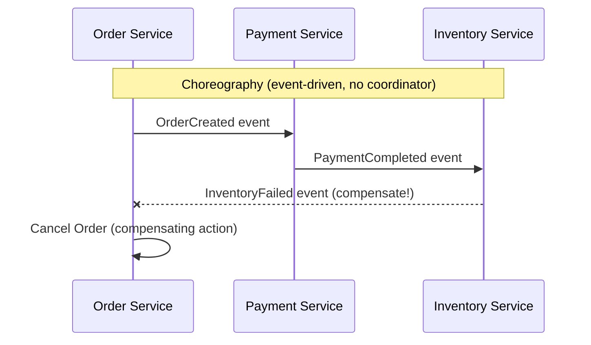
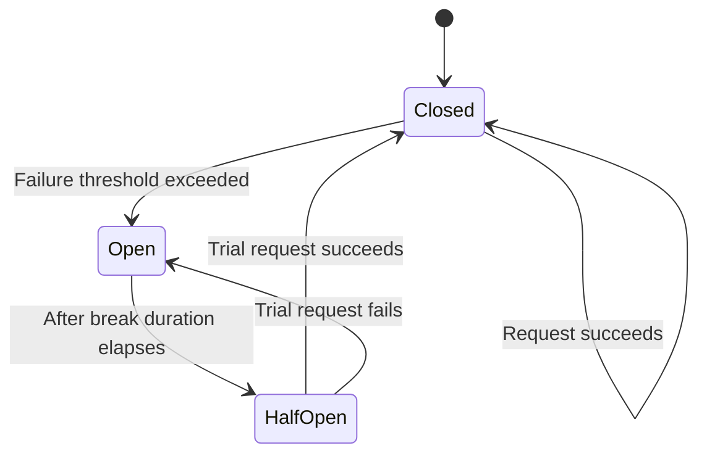
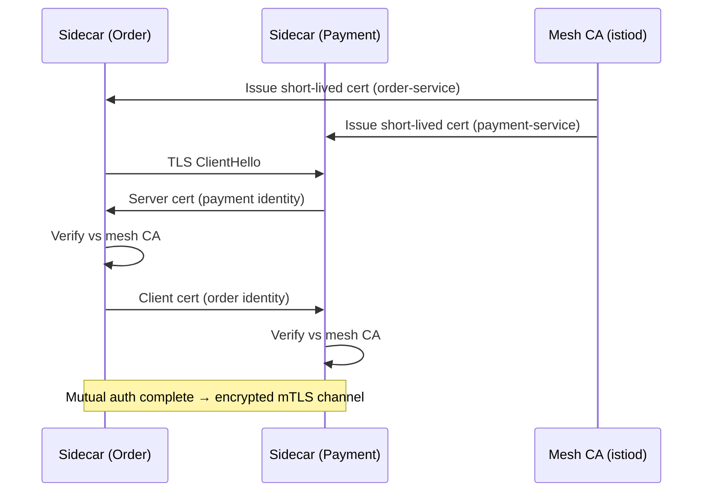
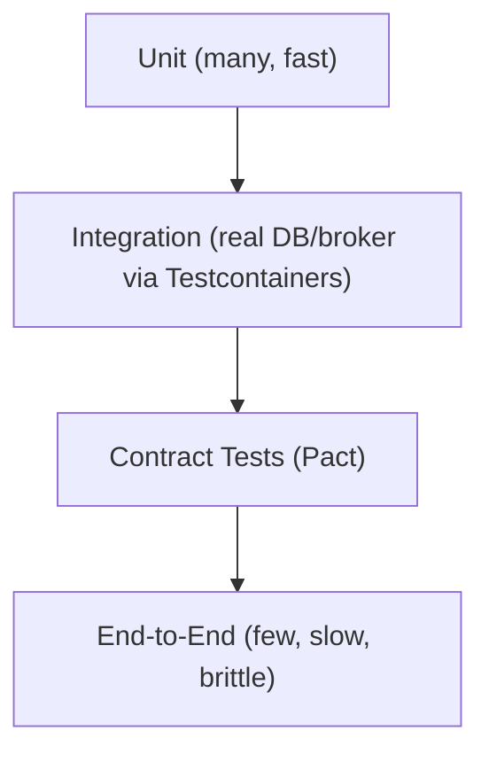

# Microservices — Senior .NET Interview: Quick Revision Notes

> Quick-revision notes derived from the full Microservices Interview Guide. Covers every section and sub-topic in the same order — meant to brush up each topic without reopening the guide.

## Table of Contents
1. Core Concepts
2. Service Design & Boundaries
3. Communication Patterns
4. Data Management & Consistency
5. Resilience & Fault Tolerance
6. Security (incl. Zero Trust & mTLS Deep Dive)
7. Observability
8. Deployment & Infrastructure
9. API Management
10. Testing Strategies
11. Advanced Patterns
12. Performance
13. Best Practices
14. Common Pitfalls / Anti-Patterns
15. Sample Interview Q&A

---

## 1. Core Concepts

**Q: What are microservices?**
A: Architectural style — app is composed of small, independently deployable services, each owning **one business capability**, communicating over the network (not in-process). Key senior nuance: each service is **owned end-to-end by a single team**. E-commerce example: Order, Payment, Inventory, Shipping services.

**Q: Monolith vs Microservices?**

| Aspect | Monolith | Microservices |
|---|---|---|
| Deployment | One unit | Independent per service |
| Scalability | Whole app | Per service |
| Technology | Single stack | Polyglot |
| Failure impact | Crash affects all | Isolated (if resilience applied) |
| Dev speed | Slower (coupling) | Faster (past a certain org size) |
| Data | Shared DB | Database-per-service |
| Testing | Simpler | Harder (contract/integration, virtualization) |
| Ops overhead | Low | High (orchestration, tracing, mesh) |



**Advantages:** scale only the hot service; tech independence (polyglot); fault isolation (not automatic — needs resilience patterns); faster parallel dev (Conway's Law); independent deployability.

**Challenges:** distributed-systems complexity (discovery, partial failures, cross-process debugging); network latency (chatty N+1 fan-out kills perf); data consistency (no cross-service ACID → eventual consistency); larger security surface; high operational cost (CI/CD per service, centralized logging/tracing/mesh).

**When NOT to use microservices (common trap question):**
- Small team (<2 pizza teams) or unclear domain → prefer a **modular monolith** (clean internal boundaries, single deployable).
- Microservices trade dev-time complexity for **run-time/operational** complexity — need mature DevOps *before* they pay off.
- Premature decomposition is riskier than staying monolith too long — wrong boundaries mean distributed refactoring later.
- Rule of thumb: "**Start monolith-first / modular monolith; extract services once boundaries are proven and a real scaling/team-autonomy pain exists.**"

---

## 2. Service Design & Boundaries

**Decomposition strategy & DDD bounded contexts (most-asked senior question):**
- Decompose by **business capability**, not technical layer (never "UI service"/"DB service"). Ask "what does the business do?"
- **Bounded Context** = the actual unit of decomposition; a boundary where one domain model + ubiquitous language are consistent. Same word ("Customer") can mean different things in different contexts — that's fine; don't force one shared model.
- **Context Mapping** relationships:
  - *Shared Kernel* — small shared model, tightly coupled, use sparingly.
  - *Customer/Supplier* — upstream/downstream with negotiated contracts.
  - *Conformist* — downstream accepts upstream's model as-is.
  - *Anti-Corruption Layer (ACL)* — translate external/legacy model to clean internal model (key during strangler-fig migrations).
- **Event Storming** = workshop technique to discover bounded contexts with domain experts before coding.
- **Aggregates = transactional consistency boundary** — a transaction should never span more than one aggregate, and rarely more than one service. Cross-service transaction needed = wrong boundary or use a Saga.
- "How big should a service be?" → sized by bounded context + team ownership, not LOC. "Big enough to be useful, small enough to be independently deployable and owned by one 2-pizza team."

**DDD building blocks:**
- **Entities** — have identity (`Order`, `Customer`).
- **Value Objects** — immutable, no identity (`Address`).
- **Aggregates** — cluster with a root enforcing invariants (`Order` with `OrderItem`s).
- **Repositories** — abstract data access per aggregate root.

```csharp
public class Order
{
    public int Id { get; set; }
    public List<OrderItem> Items { get; set; } = new();
}
```

**Hexagonal Architecture (Ports & Adapters):** separates core business logic from infrastructure.
1. Core logic — independent of DB/API/framework.
2. Ports — interfaces (e.g., `IOrderRepository`).
3. Adapters — concrete impls (EF Core repo, REST controller, message consumer).
Why it matters: makes services **testable** (swap adapters for test doubles) and framework-agnostic; basis of Clean Architecture (default in senior .NET shops).

**Strangler Fig migration — mechanics:**
1. Put a **facade/gateway** in front of the monolith to intercept calls.
2. Pick one **vertical slice** (bounded context) to extract first — clearest boundary / highest pain (e.g., Search, Notifications — read-heavy, low write-coupling).
3. Gateway routes matching requests to the new service; rest still goes to monolith.
4. **Data migration is the hard part** — often monolith DB read by both (views/CDC) until new service owns data, then cut over writes.
5. Repeat, shrinking the monolith until "strangled."
6. Key risk: **dual-write inconsistency** during transition → mitigate with **Outbox pattern or CDC (Debezium)**, not naive dual writes.



---

## 3. Communication Patterns

**Synchronous (REST, gRPC):** caller blocks/awaits. Simple mental model, but **temporal coupling** — callee down = caller fails (unless resilience added).
**Asynchronous (queues, event bus):** fire and continue. Decouples availability, but adds eventual consistency, ordering, idempotency, harder debugging.

**Choosing sync vs async:**

| Concern | Synchronous | Asynchronous |
|---|---|---|
| Coupling | Temporal (callee must be up) | Decoupled |
| Latency | Immediate / fails immediately | Higher perceived, non-blocking |
| Failure handling | Retry/circuit breaker on caller | DLQ, redelivery, idempotent consumers |
| Consistency | Can be strong within the call | Eventual by default |
| Complexity | Lower | Higher (ordering, dedup, poison msgs) |
| Best for | Read/request-response UX ("get product details") | Write-heavy workflows, side effects ("order placed → notify/ update / email") |

Rule: sync for queries needing an immediate answer; async events for "this happened, react if you care" (also reduces cascading-failure fan-out).

**REST vs gRPC:**

| Feature | REST | gRPC |
|---|---|---|
| Protocol | HTTP/1.1 | HTTP/2 |
| Format | JSON/XML (text) | Protobuf (binary) |
| Perf | Slower | Faster (binary, multiplexed) |
| Contract | OpenAPI/Swagger (loose) | `.proto` (strict, codegen) |
| Streaming | Limited (SSE/WS) | Native (unary/server/client/bidi) |
| Browser | Native | Needs grpc-web proxy |
| Use case | Public/external APIs | Internal, low-latency, streaming |

Follow-up: expose gRPC publicly? Generally **no** (weak browser/debug support). Pattern: **gRPC internally, REST/GraphQL at the edge** via gateway translation.

**Message Queue (RabbitMQ) vs Event Bus (Kafka):**

| Feature | Queue (RabbitMQ) | Event Bus (Kafka) |
|---|---|---|
| Model | Point-to-point (competing consumers) | Pub/Sub (fan-out) |
| Storage | Removed after consumption | Persistent log, replayable, retention |
| Ordering | FIFO per queue | Partition-based |
| Consumers | One msg → one consumer | Many consumer groups read same stream |
| Replay | No | Yes (re-read from any offset) |

Pick **Kafka** for replay, high-throughput log/event sourcing, multiple independent consumer groups (analytics + fraud + notifications all read "OrderPlaced"). Pick **RabbitMQ** for simpler routing (topic/direct/fanout exchanges), lower ops footprint, true work-queue semantics.

**Event-Driven Architecture:** services publish events on state change; subscribers react — decoupled, async.

```csharp
channel.BasicPublish(exchange: "", routingKey: "order-placed",
    body: Encoding.UTF8.GetBytes("Order ID: 1234"));
```
Benefits: async, decoupled, natural audit trail. Downsides: harder to trace a business flow, eventual consistency, event schema evolution = cross-team contract problem.

**API Composition (aggregator):** combine results from multiple services.
```csharp
var orders = await httpClient.GetFromJsonAsync<List<Order>>("orders-service/orders");
var customers = await httpClient.GetFromJsonAsync<List<Customer>>("customer-service/customers");
```
Trade-off: simple but doesn't scale with large cross-service joins/filters → use **CQRS denormalized read model** instead.

**API Gateway vs BFF:**
- **API Gateway** — one gateway for all client types; generic routing/auth/rate-limiting.
- **BFF (Backend-for-Frontend)** — dedicated gateway *per client type* (web-bff, mobile-bff), each shaping/aggregating for that client (mobile = smaller payloads).
- Why: a single generic gateway accumulates client-specific branching ("if mobile...") → shared bottleneck. BFFs let each frontend team own their aggregation.
- Trade-off: more services to run; avoid duplicating cross-cutting logic (auth/logging) — usually front BFFs with a thin edge gateway/ingress.



**API Gateway (core pattern):** single entry point; centralizes auth, rate limiting, load balancing, request transformation.
```json
{
  "Routes": [
    {
      "DownstreamPathTemplate": "/api/products",
      "DownstreamScheme": "http",
      "DownstreamHostAndPorts": [ { "Host": "localhost", "Port": 5001 } ],
      "UpstreamPathTemplate": "/products",
      "UpstreamHttpMethod": [ "GET" ]
    }
  ]
}
```
*(Ocelot config.)* Options: Ocelot (classic, activity slowed), **YARP** (Microsoft-maintained, now the recommended build-your-own gateway for .NET, native ASP.NET Core middleware), Kong, Nginx, Azure APIM, AWS API Gateway. Name **YARP** if asked "what would you use today."

**API Gateway vs Reverse Proxy:**

| | API Gateway | Reverse Proxy |
|---|---|---|
| Purpose | Manages multiple APIs, application-aware | Routes traffic, mostly protocol-aware |
| Functionality | AuthN/Z, rate limiting, transformation, aggregation | Load balancing, TLS termination, basic routing |

**Request Aggregation / Gateway Caching:**
- Aggregation — gateway combines downstream calls into one response (`/api/orders/123` → order + customer).
- Caching — cache responses to cut backend load.
```nginx
proxy_cache_path /var/cache/nginx levels=1:2 keys_zone=mycache:10m;
```

---

## 4. Data Management & Consistency

**Database per Service:** each service owns its DB/schema; no direct cross-service DB access → independent schema/tech evolution, but must solve cross-service queries/transactions explicitly.
```csharp
public class OrderContext : DbContext
{
    public DbSet<Order> Orders { get; set; }
}
```

**Queries needing data from multiple services:**
- **API Composition** (above) — simple, doesn't scale to big joins.
- **CQRS with materialized read models** — a read-side service subscribes to domain events and builds a denormalized view (Elasticsearch/Redis/reporting DB); reads never fan out at request time.
- **BFF aggregation** — when aggregation is client-specific.

**CQRS:** separate write model (commands) from read model (queries), often different stores.
- Command handler → validates & updates write store.
- Query handler → reads from separate (denormalized/replica) store.
```csharp
POST /orders   // Command Handler → primary DB
GET /orders    // Query Handler → read replica / projection
```
Follow-up: "Does CQRS require Event Sourcing?" → **No, independent patterns.** CQRS can be two tables/views. Event Sourcing pairs well (event stream feeds projections) but plain CQRS + read replica is far more common and simpler.

**Distributed Transactions — Saga Pattern:** 2PC doesn't scale (blocking, availability, unsupported by most brokers/NoSQL). Saga = sequence of local transactions, each with a **compensating transaction** to undo on failure.
- **Choreography** — services react to each other's events; no coordinator; each knows its action + compensation.
- **Orchestration** — central orchestrator tells each service what to do next, handles compensation centrally.



**Choreography vs Orchestration:**

| Aspect | Choreography | Orchestration |
|---|---|---|
| Coupling | Loose (only events) | Coordinator knows whole flow |
| Flow visibility | Poor (smeared across services) | Good (explicit in one place) |
| Complexity growth | Messy fast (cyclic event deps) | Scales better, but orchestrator can become god-service |
| Compensation logic | Distributed | Centralized |
| Tooling | Plain pub/sub | MassTransit saga state machine, Temporal, Azure Durable Functions, AWS Step Functions, Camunda |
| Best for | 2-3 step simple flows | Long-running, complex branching |

```csharp
if (!PaymentService.ProcessPayment(order.Id))
{
    OrderService.RollbackOrder(order.Id);
}
```

**Outbox Pattern:** solves the **dual-write problem** (can't atomically update DB + publish to broker as two ops).
1. In the **same local DB transaction** as the business update, insert the event into an `Outbox` table.
2. A separate process (poller or CDC/Debezium) reads unpublished rows and publishes to broker.
3. Mark published/delete on broker ack.
Guarantees **at-least-once delivery** aligned with the DB transaction — event never lost.
- Consumers must be **idempotent** (at-least-once, not exactly-once).
- **Polling publisher** (simple, adds latency + DB load) vs **CDC-based** (Debezium tails txn log → near real-time, no polling, but runs Debezium/Kafka Connect).
- Directly pairs with **Saga choreography** (each step's commit + publish = the dual-write problem).

**Idempotency:** repeating the same request → same effect. Critical because at-least-once (retries/redeliveries) is the norm.
```
POST /api/orders?IdempotencyKey=abcd1234
```
Implementation:
- Client generates a unique key (GUID) per logical operation.
- Server stores `(IdempotencyKey, Result)` in a table/cache with TTL.
- Repeat request with same key → return original stored response, don't re-execute.
- Message consumers: dedupe by message ID against a "processed messages" store, or use naturally idempotent ops (`UPSERT` not `INSERT`, "set status = Shipped" not "increment counter").

**Concurrency Control:**
- **Optimistic** — assume rare conflicts; version/rowversion column, retry on conflict.
- **Pessimistic** — lock upfront; simpler correctness, hurts throughput/availability, discouraged across service/network boundaries.
- **Eventual consistency** — accept staleness, reconcile via events.
```csharp
public class Order
{
    public int Id { get; set; }
    [ConcurrencyCheck]
    public int Version { get; set; }
}
```

**Read Replicas & Sharding:**
- **Read replica** — secondary copy serves reads (writes to primary). Trade-off: replication lag → "read-your-own-write" needs care (read from primary right after write).
- Sharding: *Range-based* (A–M/N–Z, simple, hot-shard risk), *Hash-based* (even distribution, harder range queries), *Geo-based* (data residency/latency, expensive cross-region joins).

**Database Migrations:** EF Core Migrations or Flyway/Liquibase (language-agnostic), in version control.
```bash
dotnet ef migrations add InitDatabase
dotnet ef database update
```
Live rollout must be **backward-compatible** (old + new versions run together during rolling deploy). Use **expand/contract (parallel change)**: add new columns/tables without removing old (expand) → deploy code writing to both → once rolled out, remove old (contract). Never a breaking schema change in one deploy step for >1 replica.

---

## 5. Resilience & Fault Tolerance

**Circuit Breaker:** stop repeatedly calling a failing dependency → lets it recover, protects caller from cascading failure/thread exhaustion.
```csharp
services.AddHttpClient("OrderService")
    .AddTransientHttpErrorPolicy(policy =>
        policy.CircuitBreakerAsync(2, TimeSpan.FromSeconds(30)));
```


- **Closed** — normal; failures counted.
- **Open** — fail fast immediately for the break duration (no call attempted).
- **Half-Open** — after timeout, one trial request; success → Closed, failure → Open.

**Polly v8+ resilience pipelines** (via `Microsoft.Extensions.Http.Resilience`, .NET 8+): **ResiliencePipeline** builder model (not chained policies); `AddStandardResilienceHandler()` bundles retry + circuit breaker + timeout.
```csharp
services.AddHttpClient("OrderService")
    .AddResilienceHandler("standard", builder =>
    {
        builder.AddRetry(new RetryStrategyOptions
        {
            MaxRetryAttempts = 3,
            BackoffType = DelayBackoffType.Exponential
        });
        builder.AddCircuitBreaker(new CircuitBreakerStrategyOptions
        {
            FailureRatio = 0.5,
            SamplingDuration = TimeSpan.FromSeconds(30)
        });
        builder.AddTimeout(TimeSpan.FromSeconds(5));
    });
```

**Retry Pattern:**
- Always pair with **exponential backoff + jitter** to avoid synchronized retry storms (thundering herd).
- Only retry **idempotent** operations (or idempotency-key-protected) — blind retry of non-idempotent POST = duplicate orders/charges.
- Cap attempts and combine with circuit breaker so retries don't overwhelm a struggling downstream.

**Bulkhead:** isolate resources (thread/connection pools) per dependency so a slow one can't starve others (ship-compartment analogy).
```csharp
services.AddHttpClient("PaymentService")
    .AddBulkheadPolicy(100, 10); // 100 concurrent, 10 queued
```

**Rate Limiting / Throttling:** cap requests per client/window. ASP.NET Core built-in `Microsoft.AspNetCore.RateLimiting` (.NET 7+) is the standard now.
```csharp
services.AddRateLimiter(options =>
{
    options.GlobalLimiter = RateLimitPartition.GetFixedWindowLimiter(
        TimeSpan.FromSeconds(10), 100);  // 100 req / 10 sec
});
```

| Algorithm | Behavior | .NET |
|---|---|---|
| Fixed Window | N per window; resets at boundary (2x burst at edges) | `GetFixedWindowLimiter` |
| Sliding Window | Smooths edge-burst | `GetSlidingWindowLimiter` |
| Token Bucket | Tokens refill steadily; allows controlled bursts | `GetTokenBucketLimiter` |
| Concurrency | Caps concurrent in-flight requests | `GetConcurrencyLimiter` |

**Dead Letter Queue (DLQ):** stores messages that failed after retry limits, for inspection/reprocessing (avoids silent drop / endless retry = poison message).
- RabbitMQ: Dead Letter Exchange (DLX). AWS SQS: native DLQ with max-receive-count redrive policy.
- **Always monitor/alert on DLQ depth** — a growing DLQ is a silent failure signal.

**Sidecar & Ambassador:**
- **Sidecar** — helper container alongside main service (same K8s pod) for cross-cutting concerns (logging, monitoring, proxy, TLS) without polluting app code.
- **Ambassador** — sidecar specialization for proxying network calls (auth, retries, circuit breaking) — exactly what an Envoy sidecar does.
```yaml
containers:
- name: order-service
  image: order-service:v1
- name: envoy
  image: envoyproxy/envoy
```

**Service Mesh vs library-based resilience:**

| Aspect | Library (Polly, in-process) | Service Mesh (Istio/Linkerd, sidecar) |
|---|---|---|
| Where logic lives | App code, per stack | Infrastructure (sidecar), language-agnostic |
| Polyglot | Reimplement per language | Uniform across all languages |
| Consistency | Every team must apply correctly | Enforced centrally |
| Ops overhead | Low (NuGet) | High (sidecar/pod, control plane, latency hop) |
| Observability | App-level only | Uniform mesh-wide telemetry "for free" |
| Debuggability | Easier (just code) | Harder (behavior outside app) |
| Best for | Small orgs, few stacks | Large polyglot orgs, uniform policy |

Pragmatic answer: .NET-heavy shops use Polly (simpler, sufficient for one language); mesh earns its complexity at large polyglot scale or when uniform mTLS/traffic policy is a hard requirement.

**Circuit Breaker at the mesh layer (Istio):**
```yaml
apiVersion: networking.istio.io/v1alpha3
kind: DestinationRule
metadata:
  name: order-service
spec:
  host: order-service
  trafficPolicy:
    outlierDetection:
      consecutiveErrors: 5
      interval: 10s
      baseEjectionTime: 30s
```
5 errors in 10s → instance ejected from LB pool for 30s (same as Polly, but at infra layer).

---

## 6. Security

**AuthN & AuthZ:**
- **JWT** — self-contained token with claims, verified by signature (no auth-server round-trip per request).
- **OAuth 2.0** — authorization framework for delegated, token-based access.
- **API Gateway auth** — centralize AuthN at the edge, not per service.
```csharp
services.AddAuthentication(JwtBearerDefaults.AuthenticationScheme)
    .AddJwtBearer(options =>
    {
        options.Authority = "https://your-auth-server";
        options.Audience = "your-api";
    });
```

**OAuth 2.0 vs OIDC vs JWT (commonly conflated):**
- **OAuth 2.0** = *authorization* framework (delegated access/scope). Doesn't define identity by itself.
- **OpenID Connect (OIDC)** = identity layer on OAuth 2.0; adds the **ID token** (a JWT with identity claims) so client knows *who* the user is.
- **JWT** = token *format* (signed/optionally encrypted claims). OAuth access tokens & OIDC ID tokens are often (not always) JWTs; opaque tokens are also valid.
- Gotcha: **never put sensitive/PII in a JWT payload unencrypted** — JWTs are signed, not encrypted; payload is base64-readable by anyone holding the token.

**Access token example:**
```json
{
  "access_token": "eyJhbGciOiJIUzI1NiIsInR5cCI6IkpXVCJ9...",
  "expires_in": 3600,
  "token_type": "Bearer"
}
```

**Securing internal (east-west) communication:**
- **mTLS** — both sides present certs; standard for zero-trust internal auth, usually via a service mesh.
- **JWT propagation** — pass token along the call chain (service-to-service tokens via client-credentials OAuth flow, distinct from end-user token).
```yaml
apiVersion: networking.istio.io/v1alpha3
kind: DestinationRule
spec:
  host: order-service
  trafficPolicy:
    tls:
      mode: MUTUAL
```

**Zero Trust networking:** never trust the network perimeter alone — every service-to-service call is authenticated & authorized regardless of "inside" the cluster/VPC. Default assumption now (vs old "trusted internal network"); service meshes enable it since hand-rolling mTLS per service doesn't scale.

### Zero Trust Architecture & mTLS Deep Dive

**Castle-and-moat vs Zero Trust — why the shift:**
- **Castle-and-moat (old):** strong perimeter (firewall/VPN/segmentation); anything "inside" implicitly trusted; internal traffic often plaintext, no per-call auth.
- **Zero Trust (current):** no trusted network location; every request independently authenticated (who?) + authorized (allowed to call *this*?). Trust from **cryptographic identity, not IP/subnet**.
- Drivers: ephemeral cloud-native infra (dynamic IPs, no stable boundary); **lateral movement risk** (compromise one service → move through "trusted" network — Zero Trust re-checks at every hop); compliance mandates (finance/healthcare/gov); multi-tenant shared clusters (namespace ≠ authentication).

**How mTLS implements service-to-service auth:** one-way TLS proves only the server; **mTLS = both sides prove identity.**
1. Each service gets its own **X.509 certificate** = workload identity (service, not user).
2. A **private CA** (mesh control plane — Istio `istiod`/Citadel, Linkerd `identity`) issues certs automatically per workload.
3. Certs are **short-lived** (hours) and **auto-rotated** — small exposure window, no manual renewal.
4. On every connection both present certs during handshake; each verifies against the shared CA → mutual auth **+** encryption-in-transit in one handshake.



**Operational pain solved:** hand-rolling mTLS means every team manages issuance/distribution/rotation/revocation per service per language — get rotation wrong and services fail auth cluster-wide at 3am. So mTLS at scale is pushed into infrastructure.

**Where the mesh fits:** apps speak plain HTTP to their **local sidecar** (Envoy in Istio, Linkerd2-proxy); sidecar-to-sidecar is where mTLS happens. The **control plane** issues/distributes/rotates certs automatically — the concrete mechanism behind Zero Trust "at scale."

| Aspect | Istio | Linkerd |
|---|---|---|
| Data plane | Envoy (general, feature-rich) | Linkerd2-proxy (lightweight, Rust) |
| Feature surface | Very broad | Narrower (mTLS, reliability, observability) |
| Complexity | Higher (more CRDs) | Lower ("just works") |
| Overhead/sidecar | Higher | Lower |
| Best fit | Large orgs, fine-grained traffic policy | Least ops overhead for mTLS + observability |

**API Key Authentication:** simple but weak alone (static, no expiry/scoping) — OK for service-to-service/partner behind a gateway doing rate limiting/IP allow-listing; not a substitute for OAuth on user-facing APIs.
```csharp
if (!Request.Headers.TryGetValue("X-API-KEY", out var apiKey) || apiKey != "my-secret-key")
    return Unauthorized();
```

**Secrets Management:** never in code/config in source control.
```csharp
var secret = await secretsManagerClient.GetSecretValueAsync(
    new GetSecretValueRequest { SecretId = "MyDatabaseSecret" });
```
Tools: AWS Secrets Manager, Azure Key Vault, HashiCorp Vault.

**CORS:**
```csharp
services.AddCors(options =>
    options.AddPolicy("AllowAll", b =>
        b.AllowAnyOrigin().AllowAnyMethod().AllowAnyHeader()));
```
Gotcha: `AllowAnyOrigin()` + credentials (cookies/auth headers) is blocked by browsers — always scope CORS to explicit trusted origins in prod, never wildcard.

**Security checklist:** AuthN (OAuth/JWT); AuthZ (role/claims); Encryption (TLS everywhere + at rest); Static analysis (SonarQube, Dependabot/Snyk dependency scanning).

---

## 7. Observability

**Three Pillars:**

| Pillar | Answers | Tools |
|---|---|---|
| **Logs** | What happened, in detail | Serilog, NLog, ELK, Seq |
| **Metrics** | Aggregate numeric trends (rates, latencies, error %) | Prometheus, Grafana, Azure Monitor |
| **Traces** | Path of one request across services | OpenTelemetry, Jaeger, Zipkin |

**Distributed Tracing:** track one logical request across services, correlating spans into one trace.
```csharp
services.AddOpenTelemetryTracing(builder =>
    builder.AddAspNetCoreInstrumentation()
           .AddHttpClientInstrumentation()
           .AddJaegerExporter());
```
**OpenTelemetry = de facto standard** (unified OpenTracing + OpenCensus for traces/metrics/logs). .NET's `System.Diagnostics.Activity`/`ActivitySource` is natively OTel-compatible → tracing largely "for free," export via OTLP to any backend (Jaeger/Zipkin/Azure Monitor/Datadog/Honeycomb) — no vendor lock-in. Across async/Kafka: propagate **trace context** (`traceparent`, W3C Trace Context) in message headers so the trace continues past a queue hop.

**Correlation IDs:** simpler cross-service log correlation without full tracing.
```csharp
var correlationId = Guid.NewGuid().ToString();
HttpContext.Response.Headers.Add("X-Correlation-ID", correlationId);
```
Prefer full distributed tracing where possible — correlation IDs give "these logs belong together" but not causality/timing/parent-child relationships that traces give natively.

**Centralized Logging:**
```csharp
Log.Logger = new LoggerConfiguration()
    .WriteTo.Console()
    .WriteTo.File("logs/log.txt")
    .CreateLogger();
```
`WriteTo.File` is only a local sink — ship logs centrally (ELK, Seq, Azure Log Analytics, Datadog) since containers/pods are ephemeral and local files vanish on restart.

---

## 8. Deployment & Infrastructure

**Docker:**
```dockerfile
FROM mcr.microsoft.com/dotnet/aspnet:8.0
COPY ./publish /app
WORKDIR /app
ENTRYPOINT ["dotnet", "MyMicroservice.dll"]
```
Use **multi-stage build** in prod (SDK image builds, slim aspnet runtime for final layer) to keep images small / avoid shipping SDK:
```dockerfile
FROM mcr.microsoft.com/dotnet/sdk:8.0 AS build
WORKDIR /src
COPY . .
RUN dotnet publish -c Release -o /app/publish

FROM mcr.microsoft.com/dotnet/aspnet:8.0 AS final
WORKDIR /app
COPY --from=build /app/publish .
ENTRYPOINT ["dotnet", "MyMicroservice.dll"]
```

**Kubernetes:** orchestrates containers — scaling, self-healing, load balancing, rolling updates.
```yaml
apiVersion: apps/v1
kind: Deployment
metadata:
  name: product-service
spec:
  replicas: 3
  selector:
    matchLabels:
      app: product-service
  template:
    metadata:
      labels:
        app: product-service
    spec:
      containers:
      - name: product-service
        image: myproductservice:latest
        ports:
        - containerPort: 80
```

**Service Discovery in K8s:** **ClusterIP** (internal only), **NodePort** (static port per node), **LoadBalancer** (cloud LB).
```yaml
apiVersion: v1
kind: Service
metadata:
  name: order-service
spec:
  type: LoadBalancer
  selector:
    app: order-service
  ports:
    - port: 80
      targetPort: 5001
```

**Service Discovery (general) & Registry:** standalone registries Consul, Eureka.
```json
{ "service": { "name": "order-service", "port": 5001 } }
```
In modern K8s-native deploys a standalone registry is largely unnecessary — K8s DNS discovery (ClusterIP + CoreDNS) replaces Eureka/Consul from the Netflix-OSS/Spring Cloud era. Consul still earns its place for multi-cluster/multi-datacenter discovery or its service-mesh features.

**Horizontal Pod Autoscaler (HPA):** use stable `autoscaling/v2` (v2beta2 deprecated).
```yaml
apiVersion: autoscaling/v2
kind: HorizontalPodAutoscaler
spec:
  minReplicas: 2
  maxReplicas: 10
  metrics:
    - type: Resource
      resource:
        name: cpu
        target:
          type: Utilization
          averageUtilization: 50
```

**Deployment Strategies:**

| Strategy | Mechanism | Rollback | Risk |
|---|---|---|---|
| Blue-Green | Two full envs; switch traffic once validated | Instant | Needs 2x infra during cutover |
| Canary | Gradually shift % traffic to new version | Fast | Needs traffic-splitting + good metrics |
| Rolling update | Replace instances incrementally (K8s default) | Moderate | Both versions run — must be backward compatible |
| Shadow traffic | Mirror real traffic to new version, compare | N/A | Extra cost; write-side shadowing risky (don't double-charge!) |

**Feature Toggles:** enable/disable without redeploy.
```csharp
if (await _featureManager.IsEnabledAsync("NewFeature"))
    Console.WriteLine("New Feature Enabled");
```
Uses `Microsoft.FeatureManagement`; prefer awaited `IsEnabledAsync` over `.Result` (deadlock risk in ASP.NET Core sync contexts — flag `.Result`/`.Wait()` as a code-smell).

**Monorepo vs Polyrepo:**

| | Monorepo | Polyrepo |
|---|---|---|
| Storage | All services in one repo | Each in its own |
| Management | Easier cross-service refactors, atomic commits | Better isolation, independent versioning |
| CI/CD | Single pipeline (path-based triggers) | Independent per service |
| Scalability | Needs tooling (Bazel, Nx, Turborepo) | Scales per repo, but coordinated cross-repo PRs |
| Dependencies | Easy shared versions | Risk of version drift |

Neither is "correct" — Monorepo favors atomic cross-service change + shared tooling (needs build-tooling investment); Polyrepo favors team autonomy + independent release cadence (needs versioning/backward-compat discipline for coordinated changes).

**Azure options:** AKS (managed K8s), Azure API Management (gateway/security), Azure Service Bus (managed async — queues + topics).

---

## 9. API Management

**API Versioning & Backward Compatibility:**
```csharp
[ApiVersion("1.0")]
[Route("api/v{version:apiVersion}/orders")]
public class OrdersController : ControllerBase
{
    [HttpGet]
    public IActionResult GetOrders() => Ok("Version 1 Orders");
}
```

| Strategy | Example | Pros | Cons |
|---|---|---|---|
| URI | `/api/v1/orders` | Explicit, cache-friendly, browser-testable | Pollutes URI |
| Query string | `?api-version=1.0` | Easy to add | Easy to omit, less visible |
| Header | `Api-Version: 1.0` | Clean URIs | Less discoverable, needs tooling |
| Media type | `Accept: application/vnd.myapi.v1+json` | RESTfully "correct" | Least intuitive, more ceremony |

Prefer **additive, backward-compatible changes** (add optional fields) over version bumps; reserve major versions for truly breaking changes. Combine with **Consumer-Driven Contract testing** to catch breakage pre-prod.

**OpenAPI / Swagger:**
```csharp
services.AddSwaggerGen();
```
Generates interactive docs + can drive SDK generation. In .NET 9, `Microsoft.AspNetCore.OpenApi` is built in for the OpenAPI doc (Swashbuckle/Swagger UI still common for the UI layer).

---

## 10. Testing Strategies

**Microservices Testing Pyramid:**

- **Unit** — domain logic in isolation (unchanged by microservices).
- **Integration** — service vs *real* deps (DB/cache/broker) using **Testcontainers** (ephemeral Docker: Postgres/Kafka/Redis) — standard replacement for in-memory fakes; tests real engine behavior (SQL dialect, indexes).
- **Consumer-Driven Contract (Pact)** — consumer defines the contract it expects; provider verifies all known consumer contracts in CI without spinning up consumers or E2E. Catches breaking API changes early, far cheaper than E2E.
- **End-to-End** — full user journey across real services; few/slow/flaky, only for critical flows, not the primary safety net.

**Service virtualization / mocking:** **WireMock.NET** stubs downstream HTTP APIs with canned responses → test failure/edge cases (timeouts, 500s, malformed payloads) hard to trigger against real deps.

```
Pact.io for contract testing between consumer and provider.
```

---

## 11. Advanced Patterns

**Event Sourcing:** persist the full sequence of **domain events**, not current state; derive current state by replaying events (or snapshot + replay since).
- Pros: full audit trail "for free," rebuild any past state, natural fit for event-driven/CQRS.
- Cons: querying current state is harder (needs projections), event schema evolution is a real maintenance burden, big complexity investment — **don't default to it**; earns its keep where audit/temporal queries are a genuine requirement (e.g., financial ledgers).

**Sharding Strategies:** see Data Management (range/hash/geo).
**Sidecar / Ambassador / Service Mesh:** see Resilience section.

---

## 12. Performance

- **gRPC over REST internally** for latency-sensitive calls (binary, HTTP/2 multiplexing).
- **Distributed caching** (Redis/Memcached) to cut redundant DB round-trips for frequently-read, rarely-changed data.
```csharp
services.AddStackExchangeRedisCache(options =>
    options.Configuration = "localhost:6379");
```
- **Read replicas** for read-heavy services.
- **API Gateway response caching** for cacheable responses.
- **Async/non-blocking I/O** end-to-end (`async`/`await`); avoid sync-over-async → thread pool starvation. ("Why is `.Result`/`.Wait()` dangerous in ASP.NET Core?")
- **Connection pooling** — `IHttpClientFactory` + DB pooling; avoid socket exhaustion from new `HttpClient` per request.
- **Backpressure** — when overwhelmed, signal upstream to slow down (429s, queue depth limits, reactive streams) rather than queueing unboundedly until OOM. Combine with bulkhead + rate limiting.

---

## 13. Best Practices

- Database-per-service — no shared DB, no direct cross-service DB access.
- Design around **business capabilities/bounded contexts**, not technical layers.
- Prefer **async, event-driven** for cross-service side effects; sync for request/response reads.
- Make operations **idempotent** wherever retries/redelivery are possible (basically everywhere).
- Centralize cross-cutting concerns (auth, rate limiting, logging correlation) at gateway/mesh.
- Version APIs deliberately; prefer additive/backward-compatible changes; use contract testing.
- Instrument with **structured logs + metrics + distributed traces** from day one.
- Automate **CI/CD per service** with independent pipelines.
- Apply resilience patterns (retry, circuit breaker, bulkhead, timeout) at every network boundary — assume every downstream call fails.
- Use the **Outbox pattern** whenever a business transaction must be atomically paired with publishing an event.
- Start with a **modular monolith** if boundaries/team structure aren't proven; extract once real pain justifies the ops cost.

---

## 14. Common Pitfalls / Anti-Patterns

- **Shared database across services** — breaks autonomy; #1 cause of a "distributed monolith."
- **Too many synchronous calls / deep call chains** — cascading latency + failure (A→B→C→D sync; one slow link stalls all).
- **Improper/absent API versioning** — breaking changes silently break consumers.
- **Distributed monolith** — separate deployables but so tightly coupled (shared DB / sync chains / shared library) they deploy in lockstep — all the cost, none of the independence.
- **Chatty APIs / N+1 across service boundaries** — fine-grained calls in a loop over the network instead of batching.
- **Premature decomposition** — splitting before boundaries are understood → wrong boundaries + expensive distributed refactoring. "YAGNI applied to architecture" is a legitimate stance.
- **Not planning for eventual consistency in UI/UX** — design tolerant states ("order confirmed, processing") instead of assuming instant global consistency.
- **Ignoring the data migration problem during Strangler Fig** — dual-write inconsistency; needs CDC/Outbox, not ad hoc dual writes.
- Ignoring DLQ growth / not monitoring poison messages.
- Skipping idempotency → duplicate side effects (double charges, duplicate orders) under retries.

---

## 15. Sample Interview Q&A

**Q: How to decide service boundaries for a new e-commerce platform?**
A: Event Storming / domain modeling with stakeholders to find bounded contexts (Ordering, Payments, Inventory, Shipping, Catalog). Align boundaries with team ownership and transactional consistency (aggregates); never split an aggregate's invariants across services. If unsure, start modular-monolith and extract once real scaling/team pain justifies the cost.

**Q: Downstream payment service is intermittently slow. What do you put in place end-to-end?**
A: Timeout on the HTTP client; retry with exponential backoff + jitter (only if idempotent / idempotency key); circuit breaker to stop hammering; bulkhead to isolate the payment client's pool; a fallback/degraded path (queue for async, tell user "processing"). Instrument with distributed tracing to locate latency across the chain.

**Q: How to keep data consistent across services without distributed transactions?**
A: Saga (choreography for simple, orchestration for complex/long-running) with compensating transactions, backed by the Outbox pattern (atomic DB update + event publish). Accept eventual consistency; design UI/process for intermediate states.

**Q: Message queue vs event bus, and when to use each?**
A: Queue (RabbitMQ) = point-to-point/competing consumers, good for distributing work. Event bus (Kafka) = pub/sub with a persistent replayable log, good when multiple independent consumers need the same stream (analytics/notifications/fraud on "OrderPlaced") or replay/audit is needed.

**Q: Roll out a breaking schema change with zero downtime across multiple running instances?**
A: Expand/contract — add new column/table alongside old (expand), deploy code writing to both, verify, then remove old (contract). Never a single-step breaking change while >1 version can run concurrently (always true during rolling deploy).

**Q: Service mesh or Polly, and why?**
A: Depends on scale/stack diversity. Single/few-language .NET shop → Polly/`Microsoft.Extensions.Http.Resilience` (less overhead, easier debugging). Large polyglot org needing uniform mTLS/traffic policy/observability → service mesh (Istio/Linkerd) despite infra complexity + latency hop.

**Q: Prevent a breaking API change from silently breaking a consumer?**
A: Consumer-driven contract testing (Pact) in CI — provider build fails if it no longer satisfies a real consumer's contract. Combine with deliberate versioning + preference for additive changes.

**Q: Same message delivered twice — prevent double-processing?**
A: Idempotent consumers — dedupe by unique message/idempotency key against a processed-messages store, or use naturally idempotent ops (upsert, "set status"). At-least-once is the norm with brokers + Outbox, so idempotency is a requirement, not an edge case.
