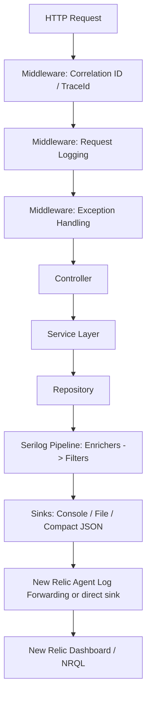
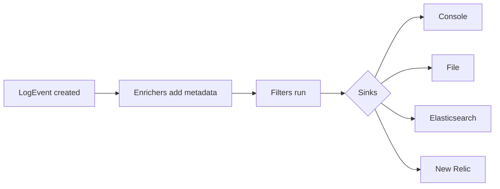
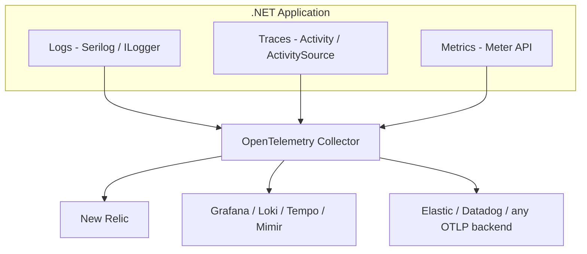
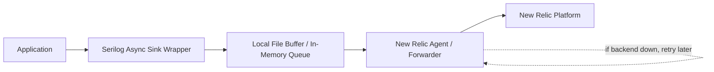
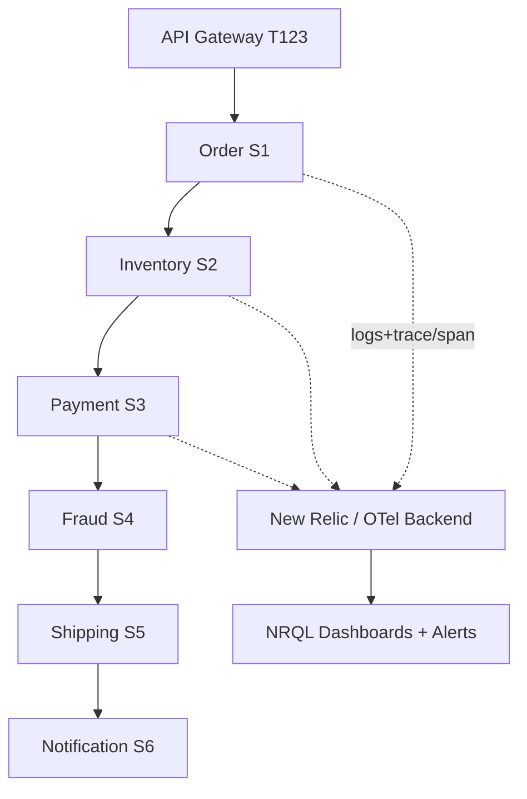

# Structured Logging — Quick Revision Notes

> Quick-revision notes derived from the Structured Logging Senior .NET Interview Guide. Covers every section in the same order: Core Concepts, Architecture, Enrichment/Context, Distributed Tracing & Multi-Tenancy, New Relic, Performance, Best Practices, Common Pitfalls, Why Serilog, and Sample Q&A.

---

## 1. Core Concepts

### What Is Structured Logging & Why It Beats String Interpolation

- **Structured logging** = every event is a set of **typed key/value properties** + a message, not a flattened string. Backend can ask "give me every event where `OrderId=45678` and `Level=Error`" instead of substring-searching text.

**Bad (string interpolation):**
```csharp
_logger.LogInformation($"Order {orderId} created");
```
**Good (message template):**
```csharp
_logger.LogInformation("Order {OrderId} created", orderId);
```

Why it matters (senior points):
- Serilog stores `OrderId` as a **separate typed property** on the `LogEvent`.
- Downstream systems (New Relic, Seq, Elasticsearch) query/filter/facet on `OrderId` directly.
- **Performance:** interpolation builds the string immediately regardless of level/sinks. Templates **defer rendering** — the string is only built if a sink needs it; a JSON sink serializes properties without ever rendering text.
- Enables consistent analytics/dashboards without regex-scraping.

### Message Templates

Serilog's `{PropertyName}` is a superset of .NET composite formatting:
- `{OrderId}` — scalar property (uses `ToString()` for text sinks, native type for structured sinks).
- `{@Order}` — **destructuring operator**; captures the full object graph as nested structured data. Great for auditing; careful with large graphs / circular refs.
  ```csharp
  _logger.LogInformation("Order created {@Order}", order);
  ```
- `{$Order}` — **stringification operator**; forces `ToString()` even for destructurable types.

### Log Levels

| Level | Serilog Name | Meaning | Prod default? | Example |
|---|---|---|---|---|
| Trace | `Verbose` | Finest tracing | Off | "Entering CalculateTax()" |
| Debug | `Debug` | Dev troubleshooting | Off (usually) | "SQL query started" |
| Information | `Information` | Normal business flow | On | "Order created" |
| Warning | `Warning` | Unexpected but recoverable | On | Retries, validation (400s) |
| Error | `Error` | Failure needing attention | On | DB errors, 3rd-party failures |
| Critical | `Fatal`(Serilog)/`Critical`(MEL) | App can't continue | On | Database down, outage |

- **Naming gotcha:** `Microsoft.Extensions.Logging.LogLevel` uses `Trace/Debug/Information/Warning/Error/Critical`; Serilog's `LogEventLevel` uses `Verbose/Debug/Information/Warning/Error/Fatal`. The MEL bridge maps **Critical↔Fatal** and **Trace↔Verbose**. They are not 1:1 identical enums.

### Structured vs Plain-Text Logging — The Full Picture

Common senior opener ("why structured logging?"):

| Aspect | Plain-text | Structured |
|---|---|---|
| Storage shape | Free text | Key/value props + message |
| Query | Regex/substring | Exact-match, range, facet (NRQL, KQL, Lucene) |
| Schema evolution | None (change breaks parsers) | Additive (new props don't break queries) |
| Machine readability | Fragile regex parsing | Native JSON/CLEF |
| Dashboarding | Hard (regex-extract first) | Trivial (`FACET`/`GROUP BY`) |
| Human readability (console) | Good | Good with template-aware theme |
| Migration cost | N/A | Discipline: templates not `$"..."` |

- **Key point:** structured logging is **not** mutually exclusive with human-readable output — Serilog's console sink renders readable text *while* the same `LogEvent` carries structured props to other sinks. You get both.

---

## 2. Architecture

### End-to-End Request Flow



### Program.cs Configuration (Code-Based)

```csharp
using Serilog;

Log.Logger = new LoggerConfiguration()
    .MinimumLevel.Information()
    .Enrich.FromLogContext()
    .Enrich.WithEnvironmentName()
    .Enrich.WithThreadId()
    .Enrich.WithProperty("Application", "OrderApi")
    .WriteTo.Console()
    .WriteTo.Async(a => a.File(
        new Serilog.Formatting.Compact.CompactJsonFormatter(),
        "logs/app-.log",
        rollingInterval: RollingInterval.Day))
    .CreateLogger();

try
{
    var builder = WebApplication.CreateBuilder(args);
    builder.Host.UseSerilog();
    builder.Services.AddControllers();

    var app = builder.Build();
    app.UseSerilogRequestLogging();
    app.UseMiddleware<CorrelationIdMiddleware>();
    app.MapControllers();
    app.Run();
}
catch (Exception ex) { Log.Fatal(ex, "Application stopped unexpectedly"); }
finally { Log.CloseAndFlush(); }
```

Key packages: `Serilog.AspNetCore`, `Serilog.Sinks.Console/File`, `Serilog.Formatting.Compact`, `Serilog.Enrichers.Environment/Thread`, `Serilog.Sinks.Async`. Optional direct NR shipping: `Serilog.Sinks.NewRelicLogs`, `NewRelic.LogEnrichers.Serilog`.

- **Note:** `UseSerilogRequestLogging()` replaces hand-rolled request-logging middleware — one line per request logging path, status, elapsed time.

### appsettings.json Configuration (Config-Based)

```json
{
  "Serilog": {
    "Using": [ "Serilog.Sinks.Console", "Serilog.Sinks.File" ],
    "MinimumLevel": {
      "Default": "Information",
      "Override": { "Microsoft": "Warning", "System": "Warning" }
    },
    "Enrich": [ "FromLogContext", "WithEnvironmentName", "WithThreadId" ],
    "WriteTo": [
      { "Name": "Console" },
      { "Name": "File", "Args": {
          "path": "logs/app-.log",
          "rollingInterval": "Day",
          "formatter": "Serilog.Formatting.Compact.CompactJsonFormatter, Serilog.Formatting.Compact"
      } }
    ]
  }
}
```
```csharp
Log.Logger = new LoggerConfiguration()
    .ReadFrom.Configuration(builder.Configuration)
    .CreateLogger();
```

- **Trade-off (code vs config):** config-based (`ReadFrom.Configuration`) lets ops change sinks/levels without redeploy (+ `IOptionsMonitor`/reloadOnChange + `LoggingLevelSwitch`). But custom enrichers/`ILogEventSink` need code or must be listed in `Using` to be discoverable. Most systems combine both: config for levels/sinks, code for DI/custom types.

---

## 3. Intermediate — Enrichment & Context Propagation

### Correlation ID Middleware

```csharp
public class CorrelationIdMiddleware
{
    private readonly RequestDelegate _next;
    public CorrelationIdMiddleware(RequestDelegate next) => _next = next;

    public async Task Invoke(HttpContext context)
    {
        var correlationId = Guid.NewGuid().ToString();
        using (Serilog.Context.LogContext.PushProperty("CorrelationId", correlationId))
        {
            context.Response.Headers.Add("X-Correlation-Id", correlationId);
            await _next(context);
        }
    }
}
```

- Purpose: unique ID per request, trace across microservices, easier NR debugging.
- **Note:** Serilog's idiomatic mechanism is `LogContext.PushProperty`, not `ILogger.BeginScope`. `BeginScope` works (Serilog implements MEL `ILogger`) but `PushProperty` is the native, more efficient path.
- **Gotcha:** this middleware always **mints a new** ID instead of reusing an inbound `X-Correlation-Id`. That breaks correlation past the first hop. Production:
  ```csharp
  var correlationId = context.Request.Headers.TryGetValue("X-Correlation-Id", out var existing)
      ? existing.ToString() : Guid.NewGuid().ToString();
  ```

### LogContext.PushProperty Deep Dive

- **Problem:** at 50k req/min, unrelated lines like "Order validation started" can't be grouped to one logical operation.
- **Fix:**
  ```csharp
  using (Serilog.Context.LogContext.PushProperty("OrderId", 98765))
  using (Serilog.Context.LogContext.PushProperty("CustomerId", 1001))
  {
      _logger.LogInformation("Order validation started");
      _logger.LogInformation("Calling payment service");
      _logger.LogInformation("Order created successfully");
  }
  ```
  Every line inside now carries `OrderId` and `CustomerId`.
- **Why it works across `await`:** `LogContext` is backed by `AsyncLocal<T>`, so properties flow through async/await continuations (even across `Task.Run` resuming on another thread) because `AsyncLocal` follows the logical call context, not the physical thread.
- **Staff answer:** attaches contextual info to every log in a logical operation across async boundaries; reduces duplicated logging code; makes logs searchable. Commonly push `CorrelationId`, `TraceId`, `TenantId`, `CustomerId`, `OrderId`, `UserId`.

### Controller / Service / Repository Logging

- Controller logs request receipt; Service logs business flow + try/catch; Repository = data-access only.
```csharp
public async Task<int> CreateOrder(CreateOrderRequest request)
{
    _logger.LogInformation("Creating order. CustomerId={CustomerId}, Amount={Amount}",
        request.CustomerId, request.Amount);
    try
    {
        var orderId = await SaveOrder(request);
        _logger.LogInformation("Order created successfully. OrderId={OrderId}", orderId);
        return orderId;
    }
    catch (Exception ex)
    {
        _logger.LogError(ex, "Order creation failed. CustomerId={CustomerId}", request.CustomerId);
        throw;
    }
}
```
- **Why repos shouldn't have business logs:** Repository = data concerns ("SQL timeout"); Service = business concerns ("Customer upgraded plan"). Mixing blurs semantics and blocks layer-specific alerting.
- **Contradiction flagged:** the above `LogError(ex, ...)` + rethrow conflicts with the "log once, only global middleware" rule. **Resolution:** only log locally if adding context the global handler can't reconstruct (e.g., `CustomerId`) — and prefer `LogContext.PushProperty` so the global handler's single `LogError` carries the context without a duplicate. If no extra context, just `catch { throw; }` and let the global handler own the one `LogError`.

### Built-in Request Logging

```csharp
app.UseSerilogRequestLogging(options =>
{
    options.MessageTemplate =
        "Request completed. Path={RequestPath}, StatusCode={StatusCode}, DurationMs={Elapsed}";
    options.EnrichDiagnosticContext = (diag, http) =>
        diag.Set("UserId", http.User?.Identity?.Name);
});
```
- Purpose: track execution time, monitor slow endpoints, one line per request instead of manual stopwatch code.

### Global Exception Middleware

```csharp
public async Task Invoke(HttpContext context)
{
    try { await _next(context); }
    catch (Exception ex)
    {
        _logger.LogError(ex, "Unhandled exception occurred");
        throw;
    }
}
```
- Purpose: capture all unhandled exceptions once, avoid duplicate try/catch, centralized logging.
- **Gotcha:** rethrowing means something upstream (`UseExceptionHandler`/outer middleware) must convert to an HTTP response. Only **one** layer should log — typically the innermost catch; outer layers only map to a response.

### Serilog Sinks Internals

- **Sink** = destination for a `LogEvent` (console, file, ES, Seq, New Relic, custom).
- **Processing pipeline:**

1. App creates `LogEvent` (Message, props, Level, Timestamp).
2. Enrichers add metadata (`CorrelationId`, `MachineName`, `Environment`).
3. Filters run (Error+ only, ignore health checks).
4. Event dispatched to every configured sink.

- **Every sink implements `ILogEventSink`:**
  ```csharp
  public interface ILogEventSink { void Emit(LogEvent logEvent); }
  ```
- **Custom sink:** implement `Emit`, register via `.WriteTo.Sink(new CompanySink())`.
- **Fan-out:** one `LogEvent` → many sinks (`.WriteTo.Console().WriteTo.File(...).WriteTo.Elasticsearch(...).WriteTo.NewRelicLogs(...)`), business code unaware.
- **Sink failure:** Serilog isolates failures (a down NR sink shouldn't crash the app or block others), but isolation is **sink-implementation-dependent**. A naive custom sink throwing in `Emit()` can propagate synchronously unless wrapped in `.WriteTo.Async(...)`, which catches/drops (or retries) in the background worker.

### Enrichers vs Destructuring

| | Enrichers | Destructuring (`@`) |
|---|---|---|
| Adds | Ambient/contextual props (`MachineName`, `CorrelationId`, `ThreadId`) | Structure for a specific object at the call site (`{@Order}`) |
| Scope | Every event in pipeline / `LogContext` block | Only the single call using `@` |
| Mechanism | `ILogEventEnricher.Enrich(...)` | `IDestructuringPolicy` / built-in reflection destructurer |
| Example | `.Enrich.WithThreadId()`, custom `ILogEventEnricher` for `TenantId` | `LogInformation("... {@Order}", order)` |
| Extension point | Implement `ILogEventEnricher` | Implement `IDestructuringPolicy` (mask a field, cap depth) |

---

## 4. Advanced — Distributed Tracing & Multi-Tenancy

### CorrelationId vs TraceId

| | CorrelationId | TraceId |
|---|---|---|
| Origin | Custom business/request identifier | Distributed tracing (W3C `traceparent`, OTel, NR) |
| Captured by | Manual `LogContext.PushProperty` | Automatic via `Serilog.Enrichers.Span` / NR enricher, riding ASP.NET Core `Activity` |
| Searched by | Support teams (human-readable) | Engineers (matches APM trace view) |
| Trend | Being subsumed by TraceId | Increasingly primary; many keep both |

### Tracing a Request Across 15 Microservices

- `TraceId` generated once (W3C `traceparent`, gateway/SDK-issued), passed in headers to every hop, captured via `Serilog.Enrichers.Span` or NR enricher. NR Distributed Tracing on end-to-end.
```sql
SELECT * FROM Log WHERE trace.id = 'T123'
```
```mermaid
sequenceDiagram
    participant GW as API Gateway
    participant OS as Order Service
    participant IS as Inventory Service
    participant PS as Payment Service
    GW->>OS: traceparent: TraceId=T123
    OS->>IS: TraceId=T123, SpanId=S1
    IS->>PS: TraceId=T123, SpanId=S2
    Note over GW,PS: TraceId constant; SpanId changes per service
```

### Multi-Tenant Logging

- **Problem:** shared SaaS (Walmart/Target/...) — "Database Timeout" gives no clue which tenant. Without tenant metadata, incident isolation is impossible.
- **Solution:** extract `TenantId` from JWT claims / gateway / headers, push in tenant-resolution middleware:
  ```csharp
  var tenantId = httpContext.Request.Headers["TenantId"];
  using (Serilog.Context.LogContext.PushProperty("TenantId", tenantId))
      await _next(context);
  ```
  Query: `SELECT * FROM Log WHERE TenantId = 'Walmart'`.
- **Staff answer:** enrich every log with `TenantId` (from JWT/gateway/headers) via `PushProperty` or a custom `ILogEventEnricher` → per-tenant filtering, fast incident isolation, tenant-specific dashboards.

### OpenTelemetry Logs/Traces/Metrics Unification

Hot 2025–2026 topic; orgs migrating off vendor agents (incl. NR .NET Agent) toward OTel (vendor-neutral).

- OTel defines vendor-neutral wire format (**OTLP**) + SDK. Instrument once, swap backends by reconfiguring the Collector's exporter, not code.
- MEL integrates via `OpenTelemetry.Extensions.Logging` — route `ILogger` through an OTel `LoggerProvider`.
- Serilog + OTel **not exclusive**: common pattern = Serilog for rich structured logs + `Serilog.Sinks.OpenTelemetry` so logs carry the same `TraceId`/`SpanId` as traces.
- Traces use `System.Diagnostics.ActivitySource`/`Activity` (built into .NET since Core 3.0). OTel .NET SDK is mostly a **listener/exporter on top of `Activity`**, not a replacement — that's why `Serilog.Enrichers.Span` and OTel both read `Activity.Current`.
- Metrics use `System.Diagnostics.Metrics.Meter`, correlated by resource attributes (`service.name`, `deployment.environment`).
- **Follow-up:** "Why OTel if NR agent works?" → vendor lock-in avoidance, multi-backend flexibility (traces to NR, logs to cheaper Loki/S3), standardization across polyglot services.

### ASP.NET Core Activity / W3C Trace Context Integration

- ASP.NET Core auto-creates an `Activity` per request and parses incoming `traceparent`/`tracestate` (W3C Trace Context), populating `Activity.Current.TraceId`/`SpanId` **without custom middleware**.
- This is what `Serilog.Enrichers.Span` reads — it does **not** read your custom `CorrelationIdMiddleware` unless you wire it.
- Since .NET Core 3.0+ you get tracing "for free" (`HttpContext.TraceIdentifier` for request id, `Activity.Current` for W3C trace), so a hand-rolled correlation ID is often **redundant** — many teams keep custom `CorrelationId` only as a business-friendly alias while linkage rides on `Activity`/`traceparent`.

### Centralized Logging Pipelines: ELK vs Seq vs Grafana Loki

| Stack | Storage | Query | Strengths | Trade-offs |
|---|---|---|---|---|
| **ELK** (Elastic/Logstash/Kibana) | Full-text indexed JSON | Lucene/KQL | Powerful full-text search, mature, self-hostable | Resource-hungry, heavy at scale, high index cost |
| **Seq** | Structured CLEF events | SQL-ish | Purpose-built for Serilog, great local dev, lightweight | Smaller ecosystem; large-scale needs paid clustering |
| **Grafana Loki** | Streams indexed by labels only | LogQL | Cheap at scale (small index), pairs with LGTM stack | Full-text search slower (content not indexed) |
| **New Relic Logs** | Managed SaaS | NRQL | Zero infra, tight APM/trace correlation (Logs in Context) | Cost scales with ingest; vendor lock-in |

- **Why it matters:** centralized logging is a cost/query-power/ops-burden trade-off. Justify: Seq for local/small tools; ELK for deep full-text + ops capacity; Loki when cost-per-GB dominates and you run Grafana/Prometheus; SaaS (NR/Datadog) for unified APM+logs+traces with no infra, accepting ingest cost.

### AWS-Native Logging and Tracing

#### CloudWatch Logs Insights
- Query engine on top of CloudWatch Logs (no separate indexing pipeline). .NET on ECS/Lambda/EC2 with the CW agent (or Lambda's auto log group) gets stdout/console-sink output into a Log Group; Insights queries it directly.
```
fields @timestamp, @message
| filter @message like /OrderId/
| sort @timestamp desc
| limit 20
```
Parse Compact-JSON fields and aggregate:
```
fields @timestamp, OrderId, CorrelationId, Level
| filter Level = "Error"
| stats count(*) as errorCount by bin(5m)
```
Facet (analogous to NRQL `FACET`):
```
fields RequestPath, DurationMs
| stats avg(DurationMs) as avgDuration by RequestPath
| sort avgDuration desc
```

| | CW Logs Insights | ELK | Seq |
|---|---|---|---|
| Infra | None (pay per GB scanned + ingestion) | Self-hosted ES / managed OpenSearch | Self-hosted / Seq Cloud |
| Query lang | Insights QL (AWS-only) | Lucene/KQL | Seq SQL-ish |
| Perf model | Scans raw data per query (no persistent index) | Pre-indexed (fast repeat/dashboards) | Pre-indexed CLEF (fast) |
| Best fit | Already-on-AWS, zero infra, IAM access | Deep full-text search | Local dev + small tools |
| Cost | Per-GB-scanned-per-query + ingestion/storage | Cluster infra | Infra / subscription |

- **Gotcha:** it **scans** (no persistent index) — broad unbounded time-range queries over high-volume Log Groups are slow and rack up GB-scanned cost. Narrow time range + log group scope.

#### AWS X-Ray for Distributed Tracing
- AWS-native tracing (same role as OTel pipeline). Backend + SDK/daemon, first-class AWS compute integration; AWS service calls (DynamoDB, S3, SQS) auto-appear as segments.
- **Daemon/agent** runs as sidecar (ECS) / built into Lambda / agent on EC2; batches segments before forwarding (same "don't block request thread" principle as async sinks).
- **Service map** — signature live graph of services/downstream calls with latency + error rate per edge (AWS equivalent of NR trace view / Tempo / Jaeger).
- **X-Ray consumes OTel directly** via **AWS Distro for OpenTelemetry (ADOT)** Collector — a service instrumented with standard `ActivitySource`/OTel SDK emits OTLP and ADOT forwards to X-Ray, NR, or both. No X-Ray-proprietary SDK needed.
- **Interview framing:** X-Ray = backend + legacy proprietary SDK; OTel = vendor-neutral standard. Answer: instrument with OTel, point ADOT exporter at X-Ray (swappable later). Using X-Ray SDK directly = older pattern (like coding against the NR .NET Agent directly).
- **Correlate X-Ray ↔ CloudWatch Logs:** emit the segment's `trace_id` as a structured Serilog property (same as `TraceId`/`SpanId` via `Serilog.Enrichers.Span`) → jump from a slow trace to `filter trace_id = "..."` in Logs Insights (AWS version of NR "Logs in Context").

#### CloudWatch Retention & Subscription Filters (Cost Control)
- **Log Group retention** — explicit setting (1 day–10 years / Never Expire). **Default is Never Expire** = common cost leak (Lambda auto log groups accumulate forever). Set via IaC at provisioning:
  ```hcl
  resource "aws_cloudwatch_log_group" "order_api" {
    name              = "/ecs/order-api"
    retention_in_days = 30
  }
  ```
- **Subscription filters** — stream matching events near-real-time to cheaper destinations (Firehose→S3 for cold/compliance; Lambda for real-time alerting). AWS equivalent of tiered-retention-by-sink:
  ```hcl
  resource "aws_cloudwatch_log_subscription_filter" "errors_to_firehose" {
    name            = "errors-to-s3-archive"
    log_group_name  = aws_cloudwatch_log_group.order_api.name
    filter_pattern  = "{ $.Level = \"Error\" }"
    destination_arn = aws_kinesis_firehose_delivery_stream.log_archive.arn
    role_arn        = aws_iam_role.cwl_to_firehose.arn
  }
  ```
- **Cost framing — 3 dimensions & levers:** ingestion (per GB) → reduce via sampling/level filtering; storage (per GB-month) → aggressive retention + subscription-filter offload to S3 (much cheaper); query (per GB scanned, Insights only) → narrow time range/scope.

---

## 5. New Relic Integration

### Three Integration Options — pick ONE (combining double-ships → double billing)

- **Option A — Agent-based forwarding (recommended default).** Install NR .NET Agent on host/container; tails console/file output.
  ```xml
  <configuration>
    <service licenseKey="YOUR_LICENSE_KEY"/>
    <application><name>Order API</name></application>
    <log><level>info</level></log>
    <applicationLogging enabled="true"><forwarding enabled="true"/></applicationLogging>
  </configuration>
  ```
- **Option B — NR Log Enricher for Serilog (Logs in Context).** `NewRelic.LogEnrichers.Serilog` adds `trace.id`, `span.id`, `entity.guid` to each event:
  ```csharp
  Log.Logger = new LoggerConfiguration()
      .Enrich.WithNewRelicLogsInContext()
      .WriteTo.File(new NewRelicFormatter(), "logs/newrelic-app.log")
      .CreateLogger();
  ```
  NR Log Forwarder / infra agent watches the folder and ships it.
- **Option C — Direct sink to NR Logs API** (no agent: containers, serverless):
  ```csharp
  Log.Logger = new LoggerConfiguration()
      .WriteTo.NewRelicLogs(
          endpointUrl: "https://log-api.newrelic.com/log/v1",
          applicationName: "OrderApi",
          licenseKey: "YOUR_LICENSE_KEY")
      .CreateLogger();
  ```
- Purpose (all three): collect APM metrics, forward logs, correlate logs with traces.

### NRQL Query Examples

```sql
SELECT * FROM Log WHERE level = 'Error'                       -- all errors
SELECT * FROM Log WHERE CorrelationId = '2e1f4f9a-b0f2'       -- one request
SELECT count(*) FROM Log WHERE message LIKE '%Order created%' -- count creations
SELECT average(DurationMs) FROM Log FACET RequestPath         -- slow requests
SELECT percentage(count(*), WHERE level = 'Error') FROM Log   -- error rate
SELECT average(duration) FROM Transaction FACET name          -- slowest APIs
SELECT * FROM Log WHERE OrderId = 98765                       -- one order
SELECT * FROM Log WHERE TenantId = 'Walmart'                  -- one tenant
```
**Sample Compact JSON log:**
```json
{ "@t": "2026-06-17T10:15:11.000Z", "@m": "Order created successfully",
  "@l": "Information", "OrderId": 45678, "CorrelationId": "2e1f4f9a-b0f2",
  "Application": "OrderApi", "EnvironmentName": "Production" }
```
Benefits: searchable, filterable, easy NRQL, better observability.

---

## 6. Performance

### Why Excessive Logging Hurts Production
- Disk I/O saturation, increased CPU, huge storage costs, NR/SaaS ingestion costs, network congestion.
- **Solution:** log only actionable info; use levels + `LoggingLevelSwitch` properly.

### Async Logging and Buffering
- Without async: `Request Thread → Write file → Wait for disk → Continue`.
- With async: `Request Thread → Queue log → Continue` / `Background Thread → Write`.
  ```csharp
  .WriteTo.Async(a => a.File("logs/app-.log"))
  ```
- **If NR unavailable:** app keeps running; logging is async + buffered; never block a business request on the backend.

- **Why enterprises prefer async:** file/network writes are expensive; async prevents request-thread blocking, improves response time.

### Source-Generated Logging (LoggerMessage) & Cost of ILogger Calls
- **Historical cost:** even a template call boxes value-type args into `object[]` and allocates `params object[]` per call unless the level is disabled and short-circuits. Classic guard: `if (_logger.IsEnabled(LogLevel.Debug))`.
- **Modern fix — `[LoggerMessage]` (.NET 6+, compile-time):**
  ```csharp
  public static partial class Log
  {
      [LoggerMessage(EventId = 1001, Level = LogLevel.Information,
          Message = "Order {OrderId} created for customer {CustomerId}")]
      public static partial void OrderCreated(this ILogger logger, int orderId, int customerId);
  }
  // usage: _logger.OrderCreated(orderId, customerId);
  ```
  - **No boxing, no array allocation, built-in `IsEnabled` check** — fastest call shape in .NET.
  - Compile-time template-vs-parameter validation (typos caught at build).
  - Explicit `EventId` = stable identifier for alerting that survives message rewording.
  - **Framing:** for hot paths (tight loops, high-throughput endpoints) use `[LoggerMessage]` — eliminates allocation overhead + gives compile-time validation when logging is a measurable % of CPU.

### Log Sampling Strategies at Scale (order of sophistication)
1. **Level-based filtering** — 100% of Warning+, sample Information. Simplest first step.
2. **Fixed-rate sampling** — keep 1-in-10 success logs via custom `GetLevel` in `UseSerilogRequestLogging` or `Filter.ByIncludingOnly` with a random threshold.
3. **Rate limiting** — "first N per key per window" (e.g., first 5 identical errors/min) to stop one bad dependency flooding the pipeline (`Serilog.Sinks.RateLimit`-style or `ConcurrentDictionary` throttle).
4. **Tail-based / trace-aware** — keep 100% of error traces/logs, sample successes; decided *after* the outcome is known.
5. **Dynamic via `LoggingLevelSwitch`** — operational lever to raise verbosity during an incident without redeploy:
   ```csharp
   var levelSwitch = new LoggingLevelSwitch(LogEventLevel.Information);
   Log.Logger = new LoggerConfiguration().MinimumLevel.ControlledBy(levelSwitch).CreateLogger();
   levelSwitch.MinimumLevel = LogEventLevel.Debug; // during incident
   ```
- **Framing:** sampling = trade-off between cost and statistical visibility. Always keep 100% of errors; sample only high-volume, low-signal success paths.

---

## 7. Best Practices

### 10 Logging Best Practices
Good logging helps: troubleshooting, health monitoring, distributed tracing, security auditing, performance analysis.
1. **Structured, not strings** — templates (`{OrderId}`), not `$"..."`. Searchable + faster.
2. **Right level deliberately** — LogTrace for "Entering CalculateTax()", LogWarning for validation failures, LogCritical for "Database unavailable".
3. **Avoid duplicate logging** — log an exception once; prefer only the global middleware; services `throw;` without redundant `LogError` unless adding unique context.
4. **Enrich with context, not repetition** — push `CorrelationId` once via `PushProperty`, don't repeat as a template arg.
5. **Never log sensitive data** — passwords, cards, CVV, JWT/refresh tokens, API secrets, PII. Log `UserId`, not `Password`.
6. **Async / non-blocking** — `.WriteTo.Async(a => a.File(...))`.
7. **Design for correlation** — share `TraceId`/`CorrelationId` end-to-end; propagate via `traceparent`; push into `LogContext` at ingress.
8. **Control volume/cost** — `LoggingLevelSwitch` to raise verbosity during incidents, lower afterward.
9. **Separate by concern & retention:**
   | Log type | Retention |
   |---|---|
   | Debug | 7 days |
   | Application/Info | 30 days |
   | Error | 90–180 days |
   | Audit | 7 years (compliance) |
   ```csharp
   .WriteTo.Logger(lc => lc
       .Filter.ByIncludingOnly(e => e.Properties.ContainsKey("Audit"))
       .WriteTo.File("logs/audit-.log", retainedFileCountLimit: 2555))
   ```
10. **Treat logging as an observability contract** — agree standard fields across teams (`Event`, `TraceId`, `CorrelationId`, `TenantId`, `UserId`, `RequestId`, `MachineName`, `Environment`).

### Golden Rules Checklist
- Structured data (`LogInformation("Order {OrderId} created", orderId)`).
- Appropriate levels (Info=normal, Warning=recoverable, Error=failure, Critical=outage).
- Log exceptions once (prefer global middleware).
- Context via enrichment (`PushProperty`), not repetition.
- Never log secrets.
- Keep async (`.WriteTo.Async()`).
- Correlate via `TraceId`/`CorrelationId`.
- Manage volume (verbosity up only during incidents).
- Separate logs by purpose (app/audit/security/performance).
- Treat logging as first-class observability, not an afterthought.

### PII / Sensitive-Data Redaction Patterns
Know *how* to enforce, not just the rule:
1. **Call-site discipline (fragile)** — never pass sensitive fields; breaks the moment someone does `{@Request}` on an object with a `Password`.
2. **Custom `IDestructuringPolicy`** — mask/omit sensitive props so even `{@Request}` is safe by construction:
   ```csharp
   public class RedactingDestructuringPolicy : IDestructuringPolicy
   {
       public bool TryDestructure(object value, ILogEventPropertyValueFactory factory, out LogEventPropertyValue result)
       {
           if (value is LoginRequest req)
           {
               result = new StructureValue(new[]
               {
                   new LogEventProperty("UserId", new ScalarPropertyValue(req.UserId)),
                   new LogEventProperty("Password", new ScalarPropertyValue("***REDACTED***"))
               });
               return true;
           }
           result = null; return false;
       }
   }
   // .Destructure.With(new RedactingDestructuringPolicy())
   ```
3. **`Microsoft.Extensions.Compliance.Redaction` attributes** (e.g., `[PrivateData]`) — mark model props sensitive so the pipeline redacts automatically. (Verify exact package/API naming per .NET version — has moved across previews.)
4. **Sink/formatter-level scrubbing** — custom `ITextFormatter`/enricher regex-scanning output (card/JWT patterns) as last-resort defense-in-depth; expensive/imperfect, not a primary control.
5. **CI/code-review enforcement** — Roslyn analyzer flagging logging calls referencing `[Sensitive]` props, catching mistakes before they ship.
- **Why hot:** GDPR/CCPA/PCI-DSS failures are frequently root-caused to logging, not the primary datastore.

---

## 8. Common Pitfalls
- **String interpolation** instead of templates — kills structured querying, defeats deferred rendering.
- **Every service minting its own CorrelationId** — breaks cross-service traceability; propagate from gateway.
- **Logging request/response bodies wholesale** — large payloads, PII, GDPR/PCI, cost. Log metadata only; mask with destructuring policies.
- **Duplicate logging of same exception** across layers — inflates cost, confuses troubleshooting. Only global middleware logs unhandled exceptions.
- **Wrong level for validation** — a 400 is `Warning`, not `Error` (app works, caller erred).
- **Losing the stack trace** — `LogError(ex.Message)` throws away the exception; always pass `ex` first: `LogError(ex, "... {OrderId}", orderId)`.
- **Synchronous network sinks** blocking the request thread — always `.WriteTo.Async(...)`.
- **Repositories logging business events** — blurs layers, pollutes business dashboards.
- **Uncontrolled `{@Object}` destructuring** — EF entities pull lazy nav props / circular refs / huge graphs → serialization blowups or `StackOverflowException`. Project to a small DTO first.
- **DEBUG-in-production as harmless** — at scale, drives I/O saturation + ingestion cost. Disable by default; use `LoggingLevelSwitch` to enable narrowly.
- **Combining multiple NR integration paths** — duplicate shipping + double billing. Pick one.

---

## 9. Why Serilog (vs NLog vs log4net)

| Criterion | Serilog | NLog | log4net |
|---|---|---|---|
| Structured-by-default | Yes — `{OrderId}` typed on the `LogEvent` | JSON layout over text pipeline | Text core, JSON bolted on |
| Sink ecosystem | Largest (Seq, ES, Datadog, NR, App Insights, CloudWatch) | Fewer but solid | Very few maintained |
| ASP.NET Core fit | `Serilog.AspNetCore`: `UseSerilogRequestLogging()` + DI/enricher | Good, less first-class | Legacy/.NET Framework era |
| Local dev | Seq pairs natively (free viewer) | Less tightly paired | Minimal |
| Async/buffered | Solid (`Serilog.Sinks.Async`) | **More mature** historically + live XML config reload | Limited |
| Momentum | Most in new cloud-native .NET | Actively maintained | Legacy |

- **Counterpoint (don't over-sell):** NLog historically has more mature async/buffered targets + live XML config reload without restart, and supports structured logging via JSON layouts today. If a team is deep in NLog and it works, structured support alone isn't sufficient reason to migrate — weigh migration/retraining cost.

---

## 10. Sample Interview Q&A

### Foundational Q&A
**Q: Structured logging with templates vs string interpolation?** A: Serilog stores `OrderId` as a separate typed property; backends query/filter on it directly; formatting is deferred (only if a sink needs it); enables analytics/dashboards.

**Q: Problems if every service generates its own CorrelationId?** A: Logs can't be traced across services; request journey broken; RCA hard. Fix: generate at API Gateway, propagate via headers, reuse via `PushProperty`.

**Q: CorrelationId vs TraceId?** A: See table — TraceId usually replaces CorrelationId for engineering, but many keep both (support prefers business-friendly CorrelationId).

**Q: Why is logging request/response body dangerous?** A: Large payloads, PII, GDPR/PCI, cost. Log metadata via diagnostic context; mask with custom destructuring.

**Q: Why can excessive logging bring down production?** A: I/O saturation, CPU, storage/ingestion cost, network congestion. Solution: actionable info only, levels + `LoggingLevelSwitch`.

**Q: If New Relic is unavailable?** A: App keeps running; async + buffered; never block requests. Pattern: App → Serilog async sink → local buffer → NR agent/forwarder → NR.

**Q: Why prefer async logging?** A: File/network writes expensive; async prevents request-thread blocking, improves response time.

**Q: What is log enrichment?** A: Auto-adding contextual props to every event — `CorrelationId`, `UserId`, `TenantId`, `Environment`, App/Machine/ThreadId. Without it, no shared context for troubleshooting.

**Q: Trace a request across 15 microservices?** A: TraceId generated once, propagated via headers, captured via `Serilog.Enrichers.Span`/NR enricher, distributed tracing on, searchable by TraceId.

**Q: Why shouldn't repositories contain business logs?** A: Repo = data concerns; Service = business. Mixing blurs responsibilities and pollutes dashboards.

**Q: Logs vs metrics vs traces?** A: Logs = "what happened?"; Metrics = "how often?"; Traces = "where did it happen?".

**Q: Correlate Serilog logs with APM transactions in NR?** A: `.Enrich.WithNewRelicLogsInContext()` injects `trace.id`, `span.id`, `entity.guid` so NR auto-links logs to spans.

**Q: Why is LogContext.PushProperty important?** A: Attaches context to every log in an operation, flows across `await` via `AsyncLocal`, reduces duplication, makes logs searchable.

**Q: Log a failed third-party API call?** A: Log endpoint, status code, CorrelationId, duration. Never tokens/secrets. E.g., "Payment gateway failed. StatusCode=500 Duration=2300ms".

**Q: Reduce New Relic logging costs?** A: `LoggingLevelSwitch` to lower verbosity dynamically, sample high-volume logs, avoid duplicates, business events only, shorter retention.

**Q: Why are duplicate logs a serious issue?** A: Controller+service+middleware each log same error → 3 entries per exception. Only global middleware should log unhandled exceptions.

**Q: Level for validation failures?** A: 400 Bad Request = `Warning`, not `Error` (app works; caller's fault).

**Q: Log exceptions correctly?** A: Wrong: `LogError(ex.Message)` (loses stack). Correct: `LogError(ex, "... {OrderId}", orderId)` — Serilog captures full exception as structured property.

**Q: Multi-tenant logging?** A: Add `TenantId` to log context via `PushProperty` in tenant-resolution middleware.

### Staff/Lead-Level System Design

**Scenario A — 50k req/min, NR costs exploding, devs need DEBUG, perf degrading. Redesign?**
- DEBUG off in prod by default.
- `LoggingLevelSwitch` via admin endpoint/config reload (raise verbosity per-investigation, no redeploy).
- Async sinks everywhere; structured logs only.
- Sample high-volume success requests.
- Separate audit logger/sink with own retention.
- Centralized exception logging; distributed tracing via NR enricher; tiered retention by level.

**Scenario B — 20 microservices, request through Gateway→Order→Inventory→Payment→Fraud→Shipping→Notification; find failures within 2 min.**

1. **Distributed tracing** — Gateway issues W3C `traceparent` (T123); every service captures via `Activity`/`DiagnosticSource` + `Serilog.Enrichers.Span`. TraceId constant, SpanId per hop. `SELECT * FROM Log WHERE trace.id='T123'`.
2. **CorrelationId** alongside TraceId (support vs engineers).
3. **Structured JSON** natively via templates.
4. **OTel/Serilog enrichment** — NR agent or OTel SDK copies active `Activity` trace/span onto every event.
5. **NR APM + Logs in Context** — click failed span → related logs/exception.
6. **Centralized exception handling** — only global middleware logs once.
7. **NRQL dashboards** — error rate, slowest APIs, per-service failures (`FACET Service`).
8. **Alerting** — payment failures >20 in 2min, latency >5s for 2min, inventory failures >10.
9. **Log sampling** — 100% errors/warnings, ~10% successes (custom `GetLevel`).
10. **Retention** — DEBUG 7d, INFO 30d, ERROR 180d, AUDIT 7y.
11. **Async + buffering** — never block request thread; buffer locally if NR down.
- **Final:** end-to-end observability = distributed tracing + Serilog structured logging + NR APM (or OTel equivalent). Gateway issues W3C TraceId + business CorrelationId propagated everywhere; each service enriches with TraceId/SpanId/CorrelationId/ServiceName/Environment/TenantId + business ids; async sinks; NR enricher links trace↔logs; centralized exception middleware; NRQL dashboards/alerts; sampling + tiered retention. Root cause within minutes at scale.

### Additional Senior/Staff Q&A

**Q: Migrate from NR agent to OpenTelemetry — risk & sequencing?** A: Risks: (1) losing NR one-line Logs-in-Context until OTel equivalent configured; (2) `Activity`/`ActivitySource` instrumentation gaps in libs that had NR auto-instrumentation but no OTel library yet; (3) re-validating NRQL dashboards/alerts against the new query language. Sequencing: dual-export via OTel Collector to both backends for a bake-in period, validate parity on a low-risk service first, then cut over service-by-service (not big-bang).

**Q: Prevent the logging library itself from causing incidents (OOM from unbounded queue, slow sink stalling shutdown)?** A: Bound the async sink's queue (`bufferSize` + drop-vs-block policy — verify param names per version) so a downstream outage drops logs under backpressure rather than growing memory unbounded. Always `Log.CloseAndFlush()` in a `finally` at shutdown with a bounded timeout so a hung sink can't block graceful pod termination (K8s `terminationGracePeriodSeconds` kills regardless — flush within that window).

**Q: `ILogger<T>` category name vs Serilog `SourceContext`, and why it matters for filtering?** A: `ILogger<T>` sets category = full type name of `T`; the MEL bridge stores it as the `SourceContext` property. That's what makes `MinimumLevel.Override("Microsoft", LogEventLevel.Warning)` work — it matches a `SourceContext` prefix, not a magic hook. Lets you write precise per-namespace overrides (silence a chatty third-party lib's Info logs without touching yours).

---

## 11. Summary of Additions
`[new content]` sections added because missing/superficial in original notes and commonly probed in 2025–2026 senior/staff interviews:
- Structured vs Plain-Text (full case beyond the template example).
- Serilog Sinks Internals (`ILogEventSink`, fan-out, failure isolation).
- Enrichers vs Destructuring (candidates often conflate them).
- OpenTelemetry unification (industry shift to vendor-neutral OTel).
- ASP.NET Core Activity / W3C Trace Context ("free" trace context; mechanism behind `Serilog.Enrichers.Span`).
- Centralized pipelines ELK vs Seq vs Loki (broader than NR-only).
- Source-Generated Logging `[LoggerMessage]` (biggest gap: .NET 6+ cheap logging).
- Log Sampling Strategies (standalone cost-at-scale topic).
- PII/Sensitive-Data Redaction (how to enforce, not just the rule).
- Additional Senior/Staff Q&A (OTel migration, bounding async queues, `SourceContext`).
- **Contradiction flagged:** `OrderService.CreateOrder` logs-and-rethrows while the "log once, global middleware only" rule says otherwise. Resolution: only log locally if adding context the global handler can't reconstruct, preferably via `PushProperty` not a duplicate `LogError`.

## 12. Summary of [gaps] Additions
- **AWS-Native Logging and Tracing** added (candidate's target cloud is AWS): **CloudWatch Logs Insights** (its QL, worked examples on Compact-JSON, cost comparison — flagging per-GB-scanned-per-query cost dimension), **AWS X-Ray** (tied to OTel via ADOT — instrument with OTel and point exporter at X-Ray, don't couple to the X-Ray SDK), and **CloudWatch retention + subscription filters** (Never-Expire default cost leak, IaC retention, offload cold/audit logs to S3 via subscription filters).
