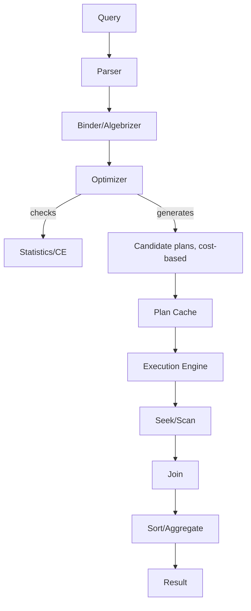
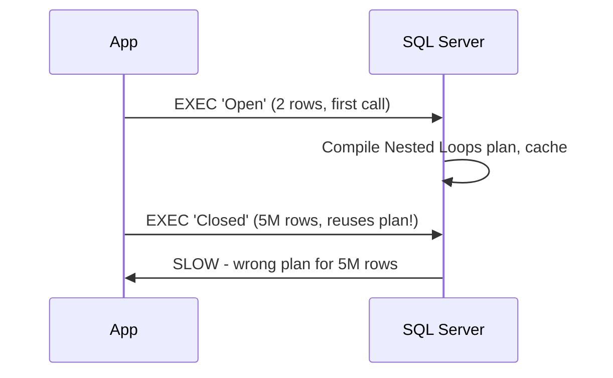
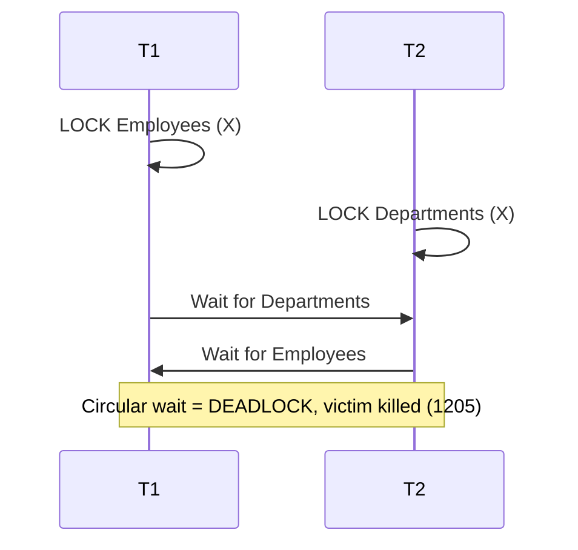

# SQL Server Interview - Quick Revision Notes

> Quick-revision notes derived from the SQL Server Interview Guide. Covers every section of the guide in the same order: Core Concepts, Intermediate, Advanced, Performance Tuning, Best Practices, Common Pitfalls, Sample Q&A, and Practical Query Challenges.

---

## Core Concepts

### RDBMS Basics & Keys

- **SQL Server** = Microsoft's RDBMS. Components: Database Engine, SQL Server Agent, SSMS, SSRS, SSIS, SSAS.
- **Primary Key**: unique, no NULL, creates clustered index by default.
- **Foreign Key**: enforces referential integrity. Does **NOT** auto-index the child column — add it yourself, else parent deletes/updates scan the child while checking the constraint.
- **Unique Key**: enforces uniqueness, allows exactly one NULL, creates a nonclustered index by default.
- **Constraints**: PRIMARY KEY, FOREIGN KEY, UNIQUE, CHECK, DEFAULT, NOT NULL, IDENTITY.
- **Computed columns**: derived from an expression; `PERSISTED` materializes on disk so it can be indexed (expression must be deterministic). Can't insert/update directly.
- **Cascading actions**: `ON DELETE/UPDATE CASCADE` propagate to children — test against real data first; an unexpected cascade can wipe more than intended.

```sql
CREATE TABLE dbo.OrdersDemo (
  OrderID INT IDENTITY(1,1) NOT NULL,
  OrderNumber NVARCHAR(30) NOT NULL,
  CustomerID INT NOT NULL,
  OrderDate DATE NOT NULL CONSTRAINT CK_Date CHECK (OrderDate <= CAST(GETDATE() AS DATE)),
  Quantity INT NOT NULL CONSTRAINT CK_Qty CHECK (Quantity > 0),
  UnitPrice MONEY NOT NULL CONSTRAINT CK_Price CHECK (UnitPrice >= 0),
  Status NVARCHAR(20) NOT NULL CONSTRAINT DF_Status DEFAULT ('Open'),
  LineTotal AS (Quantity * CONVERT(DECIMAL(18,2), UnitPrice)) PERSISTED,
  CONSTRAINT PK_OrdersDemo PRIMARY KEY CLUSTERED (OrderID),
  CONSTRAINT UQ_OrderNumber UNIQUE (OrderNumber),
  CONSTRAINT FK_Customers FOREIGN KEY (CustomerID) REFERENCES dbo.Customers(CustomerID)
    ON DELETE NO ACTION ON UPDATE NO ACTION
);
CREATE NONCLUSTERED INDEX IX_OrdersDemo_CustomerID ON dbo.OrdersDemo(CustomerID); -- index FK yourself
```

### DELETE vs TRUNCATE vs DROP

| Feature | DELETE | TRUNCATE | DROP |
|---|---|---|---|
| Type | DML | DDL | DDL |
| Scope | Rows (WHERE) | All rows | Table + structure |
| Logging | Full row-level (slow) | Minimal, page deallocation (fast) | Minimal |
| Rollback | Yes | **Yes, inside explicit tran** | Yes, inside explicit tran |
| Resets IDENTITY | No | Yes (to seed) | N/A |
| Triggers | Yes (AFTER) | No | No |
| FK | Checked per row | No active FK refs allowed | Drop dependents first |

- **Myth correction:** "TRUNCATE cannot be rolled back" is only true for an auto-committed standalone statement. Inside `BEGIN TRAN ... ROLLBACK` it **is** rolled back. Real difference vs DELETE = **logging granularity** (page deallocation vs per-row), not transactional capability.

### WHERE vs HAVING

- **WHERE**: filters rows **before** grouping; can't reference aggregates (mostly).
- **HAVING**: filters groups **after** GROUP BY/aggregation (e.g., `HAVING COUNT(*) > 1`).

### CHAR vs VARCHAR vs NCHAR/NVARCHAR

| | CHAR | VARCHAR | NCHAR | NVARCHAR |
|---|---|---|---|---|
| Length | Fixed | Variable | Fixed | Variable |
| Encoding | Non-Unicode 1B | Non-Unicode | Unicode 2B | Unicode |
| Padding | Space-padded | None | Space-padded | None |
| Best for | Fixed codes | Variable text | Fixed multilingual | Variable multilingual |

- **Gotcha:** mixing VARCHAR literals with NVARCHAR columns forces an implicit conversion that can disable an index seek. Always prefix Unicode literals with `N'...'`.

### Views (Normal, Indexed/Materialized)

- A view = a saved SELECT (virtual, no storage) except indexed views.
- **Simple**: single table. **Complex**: joins/aggregations.
- **Indexed (materialized) view**: `WITH SCHEMABINDING` + `UNIQUE CLUSTERED INDEX`. Physically persisted, **synchronously maintained on every DML** — never stale (unlike some other RDBMS materialized views needing manual refresh). Cost = write amplification.

```sql
CREATE OR ALTER VIEW dbo.vOrderTotals WITH SCHEMABINDING AS
SELECT o.OrderID, SUM(oi.Quantity * oi.UnitPrice) AS OrderTotal
FROM dbo.Orders o JOIN dbo.OrderItems oi ON o.OrderID = oi.OrderID
GROUP BY o.OrderID;
GO
CREATE UNIQUE CLUSTERED INDEX IX_vOrderTotals ON dbo.vOrderTotals(OrderID);
```

- **Restrictions**: SCHEMABINDING; deterministic expressions; fixed SET options (ANSI_NULLS, QUOTED_IDENTIFIER); no outer joins; COUNT_BIG often required; non-Enterprise may need NOEXPAND hint for auto-match.

### Stored Procedures vs Functions

| | Stored Proc | Scalar Function | Table-Valued Function |
|---|---|---|---|
| Returns | Result sets, OUTPUT, return code | Single scalar | Table |
| Usable in SELECT/JOIN | No | Yes | Yes |
| Modify data | Yes | No | No |
| Transactions | Yes | No | No |
| Error handling | Full TRY/CATCH | Limited | Limited |
| Performance | Compiled, plan cached | Slow per-row pre-2019 | Inline TVF = fast (inlined); multi-statement = slow (black box) |

```sql
CREATE OR ALTER PROCEDURE dbo.uspCreateOrder
  @orderNumber NVARCHAR(30), @customerID INT, @orderDate DATE,
  @quantity INT, @unitPrice MONEY, @newOrderID INT OUTPUT
AS BEGIN
  SET NOCOUNT ON;
  BEGIN TRY
    INSERT INTO dbo.Orders (OrderNumber, CustomerID, OrderDate, Quantity, UnitPrice)
    VALUES (@orderNumber, @customerID, @orderDate, @quantity, @unitPrice);
    SET @newOrderID = SCOPE_IDENTITY();  -- NOT @@IDENTITY (triggers pollute @@IDENTITY)
    RETURN 0;
  END TRY
  BEGIN CATCH SET @newOrderID = -1; THROW; END CATCH;
END;
```

- **Scalar UDF Inlining (2019+):** pre-2019 scalar UDFs ran row-by-row (RBAR), killing parallelism. 2019 transforms eligible UDFs into relational expressions at compile time (set-based). Rules: no TRY/CATCH, no side-effects/RAND(); check `sys.sql_modules.is_inlineable`; needs compat level 150+. Answer to "Are scalar functions always slow?" = "no longer necessarily."

### Triggers & Magic Tables

- Types: **AFTER** (post-DML, not on views), **INSTEAD OF** (replaces DML — soft deletes, updatable views), **DDL triggers**, **LOGON triggers**.
- `inserted`/`deleted` = virtual in-memory pseudo-tables:

| Operation | inserted | deleted |
|---|---|---|
| INSERT | new rows | empty |
| DELETE | empty | old rows |
| UPDATE | new values | old values |

```sql
CREATE TRIGGER trg_AuditOrders ON Orders AFTER INSERT, UPDATE, DELETE AS BEGIN
  SET NOCOUNT ON;
  INSERT INTO OrderAudit(OrderId, ActionType, ActionDate)
  SELECT COALESCE(i.OrderId, d.OrderId),
    CASE WHEN i.OrderId IS NOT NULL AND d.OrderId IS NULL THEN 'INSERT'
         WHEN i.OrderId IS NOT NULL AND d.OrderId IS NOT NULL THEN 'UPDATE'
         ELSE 'DELETE' END, SYSUTCDATETIME()
  FROM inserted i FULL OUTER JOIN deleted d ON i.OrderId = d.OrderId;
END;
```

- **Critical pitfall:** triggers fire **once per statement, not per row**. `SELECT @id = OrderId FROM inserted` silently grabs one arbitrary row on multi-row inserts. Always treat inserted/deleted as sets.
- Other: recursive triggers (guard with `TRIGGER_NESTED_LEVEL()`); run in the same transaction as DML (slow trigger blocks/rolls back caller); multi-trigger order not guaranteed (`sp_settriggerorder`); disable during ETL (`ALTER TABLE ... DISABLE TRIGGER ALL`).

### Normalization & Denormalization (1NF–BCNF)

| Level | Fixes | Rule |
|---|---|---|
| 1NF | Repeating groups | Atomic values, unique row id |
| 2NF | Partial dependency | Non-key depends on **whole** composite PK |
| 3NF | Transitive dependency | Non-key depends only on PK, not other non-keys |
| BCNF | 3NF anomalies | Every determinant is a candidate key |

- **Denormalization**: reintroduces redundancy to cut joins, speed reads (reporting/OLAP) — at write-complexity/consistency cost.


### OLTP vs OLAP

| | OLTP | OLAP |
|---|---|---|
| Purpose | Transaction processing | Analytical reporting |
| Workload | Many small fast reads/writes | Few large read-heavy queries |
| Schema | Normalized (3NF) | Denormalized (star/snowflake) |
| Indexing | Selective nonclustered for point lookups | Columnstore, wide scans, aggregates |
| Concern | Locking/blocking, deadlocks | Query concurrency, resource governance |

- **Why it matters:** separate OLTP/OLAP (read replicas, Always On readable secondaries, dedicated warehouse) so heavy analytics don't starve the transactional buffer pool/locks.

---

## Intermediate

### Joins: INNER, OUTER, CROSS, SELF

| Join | Behavior |
|---|---|
| INNER | Only matching rows |
| LEFT OUTER | All left + matches (NULL if none) |
| RIGHT OUTER | All right + matches |
| FULL OUTER | All rows both sides, NULLs where unmatched |
| CROSS | Cartesian product |
| SELF | Table joined to itself (employee → manager) |

```sql
SELECT e.EmployeeID, e.Name AS Employee, m.Name AS Manager
FROM dbo.Employees e LEFT JOIN dbo.Employees m ON e.ManagerID = m.EmployeeID;
```

### UNION vs UNION ALL

- **UNION**: de-duplicates (sort/hash distinct — costs CPU/memory).
- **UNION ALL**: keeps all rows, no dedup — prefer when dups acceptable/impossible.
- Column count and convertible types must match; `ORDER BY` only after final SELECT (applies to combined result).

### CTE vs Temp Table vs Table Variable vs View

| | CTE | Temp Table `#t` | Table Variable `@t` | View |
|---|---|---|---|---|
| Lifetime | Single statement | Session | Batch/proc scope | Permanent |
| Storage | Not materialized | tempdb physical | tempdb (lighter) | None (unless indexed) |
| Indexes | None | Yes | PK/UNIQUE inline | Only indexed view |
| Statistics | None | Full | None pre-2019 (est. 1 row!) | On base tables |
| Recursion | Yes | No | No | No |
| Recompiles | N/A | Can cause | Doesn't cause | N/A |

- **Key point:** table variables had **no statistics pre-2019** → optimizer assumed ~1 row → catastrophic plans on large sets. 2019 **table variable deferred compilation** delays compile until first exec so real row counts are known. Trap Q: "why temp table over table variable for a large set on 2016?" → estimate-of-1 causes disastrous plans; temp table has real cardinality-aware stats.

```sql
WITH EmployeeHierarchy AS (
    SELECT EmployeeID, Name, ManagerID, 1 AS Level FROM Employees WHERE ManagerID IS NULL
    UNION ALL
    SELECT e.EmployeeID, e.Name, e.ManagerID, eh.Level + 1
    FROM Employees e JOIN EmployeeHierarchy eh ON e.ManagerID = eh.EmployeeID
)
SELECT * FROM EmployeeHierarchy;
```

### Subqueries: Scalar, Correlated, EXISTS vs IN vs JOIN

- **Scalar**: must return 0/1 value per outer row.
- **Correlated**: references outer query, logically re-evaluated per row (optimizer may rewrite as join).
- **EXISTS vs IN**: EXISTS short-circuits on first match, NULL-safe; IN materializes full list, dangerous with NULLs.

```sql
-- NULL trap: NOT IN with a NULL returns ZERO rows
SELECT CustomerName FROM dbo.Customers
WHERE CustomerID NOT IN (SELECT CustomerID FROM (VALUES (100),(101),(NULL)) AS x(CustomerID));
-- Safe alternative:
SELECT c.CustomerName FROM dbo.Customers c
WHERE NOT EXISTS (SELECT 1 FROM dbo.Orders o WHERE o.CustomerID = c.CustomerID);
```

- Modern optimizer usually rewrites correlated EXISTS/IN into semi-joins — verify via plan; on older versions explicit JOIN/GROUP BY can win.

### Cursors and Why to Avoid Them

- Row-by-row (RBAR). Types: static, dynamic, **forward-only (fastest)**, keyset-driven.

```sql
DECLARE @EmployeeID INT, @Salary INT;
DECLARE EmployeeCursor CURSOR FOR SELECT EmployeeID, Salary FROM Employees;
OPEN EmployeeCursor;
FETCH NEXT FROM EmployeeCursor INTO @EmployeeID, @Salary;
WHILE @@FETCH_STATUS = 0
BEGIN
    FETCH NEXT FROM EmployeeCursor INTO @EmployeeID, @Salary;
END;
CLOSE EmployeeCursor; DEALLOCATE EmployeeCursor;
```

- Prefer set-based: `UPDATE Employees SET Salary = Salary * 1.10 WHERE Salary < 70000;`
- Legit only for genuinely procedural/order-dependent work (per-row external proc calls, state machines). Else slow, memory-heavy, holds locks longer.

### Dynamic SQL

```sql
DECLARE @sql NVARCHAR(MAX) = N'SELECT * FROM Users WHERE Id = @Id';
EXEC sp_executesql @sql, N'@Id INT', @Id = 5;
```

- Always use `sp_executesql` with parameters (no string concat of user input — SQL injection; also reusable parameterized plan). `EXEC()` on concatenated string = injection risk + fresh non-reusable plan (cache pollution).

### TRY...CATCH, THROW vs RAISERROR

```sql
BEGIN TRY
    BEGIN TRAN;
    COMMIT TRAN;
END TRY
BEGIN CATCH
    IF XACT_STATE() <> 0 ROLLBACK TRAN;
    THROW;  -- re-raises original error number/line/severity
END CATCH;
```

- `ERROR_NUMBER/MESSAGE/SEVERITY/STATE/LINE/PROCEDURE()` — valid only in CATCH.
- `XACT_STATE()`: 1 = committable, 0 = none, **-1 = doomed** (must rollback; COMMIT throws).
- **THROW (2012+)** preserves context, simpler — use in new code. RAISERROR = legacy, manual formatting.
- TRY/CATCH does **not** catch: compile/syntax errors, parse-time object-not-found, severity ≥ 20 (connection-terminating).

### Window Functions Deep Dive

| Function | Behavior |
|---|---|
| `ROW_NUMBER()` | Unique sequence, distinct even for ties |
| `RANK()` | Ties share rank, **skips** (1,2,2,4) |
| `DENSE_RANK()` | Ties share rank, **no gaps** (1,2,2,3) |
| `NTILE(n)` | n roughly-equal buckets |
| `LAG/LEAD(col,offset,default)` | Prior/following row value |
| `FIRST_VALUE/LAST_VALUE` | First/last in frame (LAST_VALUE = trap) |
| `NTH_VALUE()` | Nth value (2019+) |

```sql
SELECT *, SUM(amount) OVER (
  PARTITION BY region ORDER BY sale_date
  ROWS BETWEEN UNBOUNDED PRECEDING AND CURRENT ROW) AS running_total
FROM sales;
```

**Gotchas:**
1. **LAST_VALUE**: default frame = `RANGE ... CURRENT ROW`, so returns current row's value. Must use `ROWS BETWEEN UNBOUNDED PRECEDING AND UNBOUNDED FOLLOWING`.
2. **RANGE vs ROWS**: RANGE groups peers with same ORDER BY value (surprising with ties); ROWS is row-count based — prefer ROWS for running totals.
3. Always specify deterministic ORDER BY (with tiebreaker) in OVER().
4. Window aggregates keep row-level granularity (unlike GROUP BY collapse).
5. Can't use in WHERE/HAVING — wrap in CTE/subquery.

```sql
-- Nth highest salary
SELECT Salary FROM (
  SELECT Salary, DENSE_RANK() OVER (ORDER BY Salary DESC) AS rnk FROM Employees
) t WHERE rnk = @N;
```

### SARGability

- **SARG** = Search ARGument — a predicate the optimizer can turn into an index seek. Non-SARGable → forces scan even with a good index.

```sql
-- NOT SARGable:
SELECT * FROM Orders WHERE YEAR(OrderDate) = 2025;
-- SARGable:
SELECT * FROM Orders WHERE OrderDate >= '2025-01-01' AND OrderDate < '2026-01-01';
```

| Non-SARGable | SARGable fix |
|---|---|
| `YEAR(OrderDate) = 2025` | Range on bare column |
| `ISNULL(Status,'') = 'Open'` | `Status = 'Open' OR Status IS NULL` |
| `LTRIM(RTRIM(Name)) = 'Bob'` | Clean data at write time |
| `Column LIKE '%abc%'` | Full-text / different model |
| `CAST(VarcharCol AS INT) = 5` | Fix data types in schema |
| `Salary * 1.1 > 50000` | `Salary > 50000 / 1.1` |
| `Col1 + Col2 = @x` | `Col1 = @x - Col2` |

- **Universal rule:** never wrap the indexed column in a function/expression.

---

## Advanced

### Execution Plans & Join Operators

- **Estimated (Ctrl+L)**: optimizer's guess, doesn't run — safe on prod. **Actual (Ctrl+M)**: runs, shows real vs estimated. A large **estimated-vs-actual row mismatch** = stale/missing stats or parameter sniffing.

| Operator | Meaning |
|---|---|
| Table Scan | Reads every heap row — bad at scale |
| Index Scan | Reads whole index (OK if small/covering) |
| Index Seek | B-tree jump to matching rows — ideal |
| Key Lookup | Extra clustered-index seek per row for missing cols — expensive; fix with covering index |
| Sort | Explicit sort — often removable via index order |
| Nested Loops | Per outer row, seek inner — good for small outer + indexed inner |
| Hash Match | Builds hash from smaller input — good for large unsorted; tempdb spill risk |
| Merge Join | Zips two pre-sorted inputs — cheapest when both sorted on key |
| Parallelism | Multi-thread execution |



| Scenario | Operator | Why |
|---|---|---|
| Small outer, indexed inner | Nested Loops | Few seeks |
| Large unsorted both sides | Hash Match | No sort/index dependency |
| Both sorted on join key | Merge Join | Sequential zipper |
| Large outer + Nested Loops | Red flag | Param sniffing / stale stats |

- Capture: SSMS Ctrl+L/Ctrl+M; `SET STATISTICS IO, TIME ON`; Query Store; Extended Events (`query_post_execution_showplan`).

### Index Seek vs Scan, Key Lookup, Covering Indexes

- **Index Seek**: b-tree navigation to needed rows (O(log n)). Best for selective predicates.
- **Index Scan**: reads whole leaf level — OK when returning most rows / small table.
- **Key Lookup**: nonclustered index lacks requested columns → extra clustered/RID seek per row. At volume, Nested Loops + Key Lookup is often **worse than a table scan**. Fix with covering index.

```sql
SELECT OrderDate, CustomerName, Status FROM Orders WHERE OrderDate > '2025-01-01';
-- Non-covering -> seek + key lookup per row:
CREATE NONCLUSTERED INDEX IX_Orders_OrderDate ON Orders(OrderDate);
-- Covering:
CREATE NONCLUSTERED INDEX IX_Orders_Covering ON Orders(OrderDate) INCLUDE (CustomerName, Status);
```

- **INCLUDE vs key**: included columns live only at leaf level — don't bloat b-tree navigation, allow types not valid as keys. Key column **order matters** (leftmost-prefix rule, like a phone book); INCLUDE order does not.

### Heap Tables

- **Heap** = table with no clustered index; rows in no order, identified by RID (`FileID:PageID:SlotID`). Read by Table Scan.

```sql
CREATE TABLE dbo.StagingOrders (OrderNumber NVARCHAR(30), CustomerID INT, OrderDate DATE);
SELECT i.name, i.type_desc FROM sys.indexes i  -- index_id = 0 means heap
WHERE i.object_id = OBJECT_ID('dbo.StagingOrders');
```

- **Fast bulk inserts** (no b-tree to sort); **slow selective reads** (no ordering to seek).
- **Forwarded records**: an update growing a row past its page leaves a forwarding pointer → extra hop per access. High `forwarded_record_count` in `sys.dm_db_index_physical_stats` = needs a clustered index.
- Nonclustered indexes work on heaps (point to RID). Rule: heaps are a narrow choice (staging/log-style); most OLTP tables want a clustered index.

### Statistics & Cardinality Estimation

- Optimizer picks plans from **estimated row counts** derived from stats (histograms + density), not by scanning at compile time. Stale/missing stats = top cause of bad plans.

```sql
DBCC SHOW_STATISTICS ('dbo.Orders', 'IX_Orders_OrderDate');
UPDATE STATISTICS dbo.Orders IX_Orders_OrderDate WITH FULLSCAN;
SELECT name, is_auto_update_stats_on, is_auto_create_stats_on FROM sys.databases WHERE name = DB_NAME();
```

- Auto-update threshold: historically ~20% of rows; 2016+ compat 130+ uses lower dynamic threshold for large tables.
- **Cardinality Estimator (CE)** changed in 2014 (new vs legacy). Compat level controls which — classic "plan changed after migration" cause. Force legacy: TF 9481 or `ALTER DATABASE SCOPED CONFIGURATION SET LEGACY_CARDINALITY_ESTIMATION = ON`.
- **Ascending-key problem**: ever-growing columns (IDENTITY, timestamp) under-estimate rows newer than last stats update. Mitigate with TF 2371 / frequent updates.

### Parameter Sniffing

- SQL Server compiles & caches a plan based on **first call's parameter values**, then reuses for all calls. Usually beneficial; problematic with **skewed data**.
- Symptom: "same proc fast for most customers, 30s for one big one" (or vice versa).

```sql
CREATE OR ALTER PROCEDURE dbo.GetOrdersByStatus @Status VARCHAR(20) AS BEGIN
  SELECT * FROM Orders WHERE Status = @Status; -- 'Open'=2 rows vs 'Closed'=5M rows
END;
```

| Fix | How | Trade-off |
|---|---|---|
| `OPTION (RECOMPILE)` | Recompile every exec | No reuse, CPU cost, always optimal |
| `OPTIMIZE FOR (@x='typical')` | Pin to representative value | Good for one common case |
| `OPTIMIZE FOR UNKNOWN` | Density-based average | Safe average, avoids extremes |
| Local variable trick | Copy param to local | Same as UNKNOWN (older trick) |
| Split procs per case | IF...EXEC procA/procB | Own plan each; more code |
| Query Store Force Plan | Pin good plan | Emergency stop-gap |



### Transactions & ACID

- **Atomicity**: all-or-nothing. **Consistency**: constraints hold before/after. **Isolation**: concurrent txns don't see uncommitted state (per level). **Durability**: committed survives crash (write-ahead log).

```sql
BEGIN TRAN;
  INSERT INTO Orders VALUES (1);
  UPDATE Stock SET Qty = Qty - 1;
  SAVE TRAN Step1;
  -- ROLLBACK TRAN Step1;  -- rolls back only to savepoint
COMMIT;
```

- Savepoints allow partial rollback but **don't release locks**. Nested BEGIN TRAN just increments `@@TRANCOUNT`; only outermost COMMIT commits; any ROLLBACK rolls back everything (unless a savepoint is targeted).

### Isolation Levels & Concurrency

| Level | Dirty | Non-Repeatable | Phantom | Mechanism |
|---|---|---|---|---|
| Read Uncommitted | Yes | Yes | Yes | No read locks (NOLOCK) |
| Read Committed (default) | No | Yes | Yes | Short read locks |
| Repeatable Read | No | No | Yes | Read locks held to end |
| Serializable | No | No | No | Range locks |
| Snapshot | No | No | No | Row versioning (optimistic) |
| RCSI | No | Yes | Yes | Row versioning per-statement |

- **Dirty read**: read another txn's uncommitted change. **Non-repeatable**: re-read row differs. **Phantom**: repeated range query gains/loses rows.
- `SELECT * FROM Employees WITH (NOLOCK);` — Read Uncommitted for that query; may see dirty data.

### RCSI vs Snapshot Isolation (Optimistic Concurrency)

- Both use **row versioning** (tempdb version store) instead of locking. Difference = **snapshot scope**:

| | RCSI | Snapshot Isolation |
|---|---|---|
| Snapshot | Per **statement** | Per **transaction** (at BEGIN) |
| Enable | `SET READ_COMMITTED_SNAPSHOT ON` (transparent) | `SET ALLOW_SNAPSHOT_ISOLATION ON` + explicit `SET TRANSACTION ISOLATION LEVEL SNAPSHOT` |
| App changes | None | Yes, explicit opt-in |
| Non-repeatable reads | Still possible | Prevented |
| Write conflict | N/A | Error 3960 — must retry |
| TempDB | Version store | Larger (held for whole txn) |

```sql
ALTER DATABASE MyDB SET READ_COMMITTED_SNAPSHOT ON;   -- transparent, common

ALTER DATABASE MyDB SET ALLOW_SNAPSHOT_ISOLATION ON;
SET TRANSACTION ISOLATION LEVEL SNAPSHOT;
BEGIN TRAN;
  SELECT * FROM Orders WHERE CustomerID = 100;  -- consistent as of tran start
  SELECT * FROM Orders WHERE CustomerID = 100;  -- same snapshot
COMMIT;
```

- Readers never block writers and vice versa (big win for read-heavy mix). Cost = tempdb version store; Snapshot adds update-conflict errors your app must retry. RCSI has no conflict detection (re-reads latest committed per statement).

### Locking: Types, Granularity, and Deadlocks

| Lock | Purpose |
|---|---|
| Shared (S) | Reads |
| Exclusive (X) | Writes |
| Update (U) | Deciding to upgrade to X; prevents reader-upgrade deadlock |
| Intent (IS/IX/SIX) | Signal intent at coarser granularity |

- Granularity: row → page → table. **Lock escalation** (~5,000 locks/object) escalates to table lock to save memory — can increase blocking on large batch updates. Override: `SET (LOCK_ESCALATION = DISABLE)` (rare).
- **Deadlock**: circular wait; SQL Server kills lower-cost victim with **Error 1205**.



```sql
DBCC TRACEON (1204, 1222, -1);   -- deadlock graphs to error log
SELECT * FROM sys.dm_tran_locks;
-- Modern: system_health Extended Events session captures deadlocks by default.
```

**Prevention:** 1) consistent table/row access order; 2) short transactions; 3) narrowest lock granularity; 4) covering indexes (scans → seeks); 5) RCSI/Snapshot; 6) retry logic for 1205.

```sql
DECLARE @RetryCount INT = 3, @TryAgain BIT = 1;
WHILE @TryAgain = 1 AND @RetryCount > 0 BEGIN
    BEGIN TRY
        BEGIN TRAN;
        UPDATE Employees SET Salary = Salary + 500 WHERE EmployeeID = 1;
        UPDATE Departments SET Budget = Budget - 1000 WHERE DepartmentID = 2;
        COMMIT; SET @TryAgain = 0;
    END TRY
    BEGIN CATCH
        IF XACT_STATE() <> 0 ROLLBACK;
        IF ERROR_NUMBER() = 1205 SET @RetryCount -= 1;
        ELSE THROW;
    END CATCH
END;
```

- **Framing:** "Deadlocks are almost always a design/access-pattern issue, not a DB bug — fix is usually in app code."

### TempDB Contention & Configuration

- TempDB backs temp tables, table variables, sort/hash spills, version stores, cursor worktables — shared, instance-wide.
- Contention: **PFS/GAM/SGAM allocation page contention**, single data file serializing allocation, heavy hash/sort spills.

```sql
SELECT name, physical_name, size/128.0 AS SizeMB FROM tempdb.sys.database_files;
ALTER DATABASE tempdb MODIFY FILE (NAME = tempdev, SIZE = 4096MB, FILEGROWTH = 512MB);
SELECT * FROM sys.dm_os_waiting_tasks WHERE wait_type LIKE 'PAGELATCH%';
SELECT * FROM sys.dm_db_session_space_usage ORDER BY user_objects_alloc_page_count DESC;
```

- Best practices: multiple equally-sized data files (~1 per 4 logical CPUs, up to ~8, then reassess), pre-size generously, fastest storage, minimize temp object churn in hot paths.

### Query Store in Depth

- (2016+) Per-database "flight data recorder": persists query text, plans (with history), runtime stats — survives restarts and cache eviction.

```sql
ALTER DATABASE MyDB SET QUERY_STORE = ON;
ALTER DATABASE MyDB SET QUERY_STORE (
    OPERATION_MODE = READ_WRITE,
    CLEANUP_POLICY = (STALE_QUERY_THRESHOLD_DAYS = 30),
    MAX_STORAGE_SIZE_MB = 1024,
    QUERY_CAPTURE_MODE = AUTO);
EXEC sp_query_store_force_plan @query_id = 42, @plan_id = 101;
SELECT * FROM sys.query_store_runtime_stats ORDER BY avg_duration DESC;
```

- Uses: plan-regression detection after deploys, capacity planning, force-plan as emergency stabilizer. Pitfall: forced plan is a band-aid; can go stale — treat as temporary. Watch storage/retention.

### Columnstore Indexes for Analytics

- Store data column-by-column with heavy compression — for scan-heavy analytics, not singleton lookups.

```sql
CREATE CLUSTERED COLUMNSTORE INDEX CCI_FactSales ON dbo.FactSales;
CREATE NONCLUSTERED COLUMNSTORE INDEX NCCI_Orders ON dbo.Orders (OrderDate, CustomerID, Amount, Status);
```

- Fast because: **batch-mode execution** (~900 rows at a time), 5-10x compression (less IO), **segment elimination** (skip rowgroups via min/max metadata).
- Not for singleton lookups/frequent single-row updates (delta store, rowgroup reorg). Best for fact tables, append-mostly data, or **operational analytics** (nonclustered columnstore alongside OLTP rowstore, 2016+).

### Table Partitioning

- Splits one logical table into physical partitions (usually by date) for manageability and sometimes **partition elimination**.

```sql
CREATE PARTITION FUNCTION PF_OrderDate (DATE)
AS RANGE RIGHT FOR VALUES ('2023-01-01', '2024-01-01', '2025-01-01');
CREATE PARTITION SCHEME PS_OrderDate AS PARTITION PF_OrderDate ALL TO ([PRIMARY]);
CREATE TABLE dbo.Orders (OrderID INT, OrderDate DATE) ON PS_OrderDate(OrderDate);
```

- **Partition switching** (`ALTER TABLE ... SWITCH`) = near-instant metadata-only op → standard sliding-window archival instead of slow DELETE. Partition elimination skips partitions when WHERE restricts statically. Per-partition maintenance reduces blast radius.
- **Misconception:** partitioning is primarily a **manageability** feature, not a guaranteed query-speed feature. A good index usually helps more; partitioning without a partition-aligned filter doesn't help.

### High Availability & Disaster Recovery

| Feature | Model | Sync | Failover | Use |
|---|---|---|---|---|
| Log Shipping | Restore tx-log backups | Delayed | Manual | Cheap DR/warm standby |
| Database Mirroring (deprecated) | Log stream | Sync/async | Auto (w/ witness) | Legacy |
| Snapshot Replication | Full copy at intervals | Periodic full | N/A | Small/static data, seeding |
| Transactional Replication | Pushes committed changes | Near real-time | N/A | Reporting copies |
| Merge Replication | Bi-directional + conflict resolution | Periodic | N/A | Disconnected/mobile |
| Always On AG | Log stream to replicas | Sync/async | Auto (sync) | Modern HA/DR standard |

- **Always On Availability Groups = modern default** for HA+DR; mention first unless legacy/cost-constrained. Snapshot Replication is simplest but heaviest per sync (re-copies whole dataset) — only for small/static data or bootstrapping.

### Backup & Restore

```sql
BACKUP DATABASE MyDB TO DISK = 'C:\Backup\MyDB.bak';
RESTORE DATABASE MyDB FROM DISK = 'C:\Backup\MyDB.bak' WITH NORECOVERY;
RESTORE LOG MyDB FROM DISK = 'C:\Backup\MyDB.trn' WITH STOPAT = '2024-03-08 12:30:00', RECOVERY;
```

| Type | Captures | Role |
|---|---|---|
| Full | Entire DB | Base for all restores |
| Differential | Changes since last full | Faster than repeated fulls |
| Transaction Log | Log since last log backup | Point-in-time; truncates log (FULL/BULK_LOGGED) |

- **Recovery models:** SIMPLE (no log backups/PITR, auto-truncate), FULL (PITR, needs regular log backups or log grows), BULK_LOGGED (minimally logs bulk ops, no PITR inside a minimally-logged op).

### Database Snapshots

- Read-only point-in-time view via **copy-on-write sparse file**: first write to a source page copies the *original* page into the snapshot first. Storage cost ∝ changed data.

```sql
CREATE DATABASE MyDB_Snapshot ON (NAME = MyDB, FILENAME = 'C:\Snapshots\MyDB.ss') AS SNAPSHOT OF MyDB;
RESTORE DATABASE MyDB FROM DATABASE_SNAPSHOT = 'MyDB_Snapshot';  -- revert (discards changes since)
```

- Uses: stable reporting view, quick "undo" before risky deploys, pre-upgrade rollback.
- **Not a backup** — shares underlying disk; source loss = snapshot loss. Different from **Snapshot Isolation** (a txn isolation level using tempdb row versioning).

### Bulk Insert vs Batch Insert

- **Bulk insert** (`BULK INSERT` / `bcp`): loads external files fast; can **minimally log** under SIMPLE/BULK_LOGGED + TABLOCK + no blocking triggers/constraints.
- **Batch insert**: split a large workload into smaller transactions (few thousand rows) — bounds log growth, avoids lock escalation, allows incremental progress/retry.

```sql
BULK INSERT dbo.Orders FROM 'C:\ImportData\orders.csv'
WITH (FIELDTERMINATOR = ',', ROWTERMINATOR = '\n', FIRSTROW = 2, BATCHSIZE = 10000, TABLOCK);

DECLARE @BatchSize INT = 5000, @RowsInserted INT = 1;
WHILE @RowsInserted > 0 BEGIN
    INSERT INTO dbo.Orders (OrderNumber, CustomerID, OrderDate)
    SELECT TOP (@BatchSize) OrderNumber, CustomerID, OrderDate FROM staging.OrdersStaging s
    WHERE NOT EXISTS (SELECT 1 FROM dbo.Orders o WHERE o.OrderNumber = s.OrderNumber);
    SET @RowsInserted = @@ROWCOUNT;
END;
```

### Full-Text Search

- Inverted-index linguistic search (inflections, proximity, ranking) that `LIKE '%...%'` can't do efficiently.

```sql
CREATE FULLTEXT CATALOG ArticleFTCatalog;
CREATE FULLTEXT INDEX ON Articles (Title LANGUAGE 1033, Body LANGUAGE 1033)
  KEY INDEX PK_Articles ON ArticleFTCatalog;
SELECT * FROM Articles WHERE CONTAINS(Body, '"cloud computing"');
SELECT * FROM Articles WHERE CONTAINS(Body, '"microserv*"');            -- prefix
SELECT * FROM Articles WHERE CONTAINS(Body, 'NEAR((api, performance), 5)'); -- proximity
SELECT * FROM Articles WHERE FREETEXT(Body, 'improve api performance');    -- natural language
SELECT A.*, FT.RANK FROM CONTAINSTABLE(Articles, Body, '"microservices"') FT
JOIN Articles A ON A.Id = FT.[KEY] ORDER BY FT.RANK DESC;
```

- Use for large text/linguistic/ranked search; avoid on tiny tables, exact-match-only, extremely write-heavy tables.

### Security: Encryption, RBAC

- **TDE**: encrypts data at rest (files, backups) transparently — protects stolen disk/backup, not a compromised login.
- **Always Encrypted**: client-side column encryption; server never sees plaintext/keys — protects even from DBAs; restricted query capability (equality only w/ deterministic).
- **Column-level** (`ENCRYPTBYKEY`): symmetric (fast) vs asymmetric (slow, protects symmetric keys).
- **RBAC**: grant to roles, not individual logins. Least privilege: app logins not `db_owner`; prefer EXECUTE on procs over direct table grants (limits injection blast radius).

### Linked Servers

- Query another SQL Server / OLE DB / ODBC source as if local, via four-part name or `OPENQUERY`.

```sql
EXEC sp_addlinkedserver @server='RemoteServer', @srvproduct='', @provider='SQLNCLI', @datasrc='RemoteSqlHost\Inst';
SELECT * FROM RemoteServer.RemoteDB.dbo.Orders WHERE OrderDate > '2025-01-01';
SELECT * FROM OPENQUERY(RemoteServer, 'SELECT * FROM dbo.Orders WHERE OrderDate > ''2025-01-01''');
```

- Caveats: four-part-name queries may **not push predicates remotely** (pulls too much data) — prefer OPENQUERY for guaranteed remote filtering; distributed transactions need MSDTC; risky as a permanent high-volume app pattern — prefer ETL/replication/API.

### Service Broker

- Built-in async, transactional messaging (message types, contracts, queues, services); guaranteed in-order, exactly-once per conversation.

```sql
CREATE MESSAGE TYPE OrderMessageType VALIDATION = WELL_FORMED_XML;
CREATE CONTRACT OrderContract (OrderMessageType SENT BY INITIATOR);
CREATE QUEUE OrderQueue;
CREATE SERVICE OrderService ON QUEUE OrderQueue (OrderContract);
DECLARE @ch UNIQUEIDENTIFIER;
BEGIN DIALOG CONVERSATION @ch FROM SERVICE OrderService TO SERVICE 'OrderService' ON CONTRACT OrderContract;
SEND ON CONVERSATION @ch MESSAGE TYPE OrderMessageType ('<Order><Id>123</Id></Order>');
RECEIVE TOP(1) * FROM OrderQueue;
```

- Use: decouple slow work from the triggering transaction; in-DB pub/sub. Largely legacy/niche today — new systems use Azure Service Bus/Kafka/RabbitMQ, but recognize it in older systems.

### Log Sequence Number (LSN)

- Every log record gets a monotonically increasing LSN (e.g., `00000025:000001d0:0003`) — used for crash-recovery ordering and chaining backups. A diff/log restore is valid only if LSNs chain continuously from the preceding full — a missing link causes "backup cannot be restored... not created in the correct sequence."

```sql
SELECT DB_NAME(database_id), last_log_backup_lsn FROM sys.database_recovery_status;
SELECT database_name, first_lsn, last_lsn, checkpoint_lsn, type FROM msdb.dbo.backupset ORDER BY backup_start_date DESC;
```

### FILESTREAM

- Stores unstructured BLOBs as filesystem files, transactionally consistent + backed up with the DB. Column = `VARBINARY(MAX) FILESTREAM`, bytes live in a FILESTREAM filegroup.

```sql
EXEC sp_configure filestream_access_level, 2; RECONFIGURE;
ALTER DATABASE MyDB ADD FILEGROUP FileStreamGroup CONTAINS FILESTREAM;
ALTER DATABASE MyDB ADD FILE (NAME = FSData, FILENAME = 'C:\FSData') TO FILEGROUP FileStreamGroup;
CREATE TABLE dbo.Documents (
    DocumentID UNIQUEIDENTIFIER ROWGUIDCOL NOT NULL UNIQUE DEFAULT NEWID(),
    FileName NVARCHAR(260) NOT NULL, FileData VARBINARY(MAX) FILESTREAM NULL);
```

- vs plain VARBINARY(MAX): bypasses buffer pool, streams via Win32 APIs — better throughput for large files without bloating cache, still transactional/backed up. Many teams now choose Blob Storage/S3 + a URL row instead.

### SQL Server Agent Jobs

- Built-in scheduler; **Job** = one+ **Steps** (T-SQL, SSIS, PowerShell, CmdExec), one+ **Schedules**, per-step retry/branching, operator notifications, history in `msdb.dbo.sysjobhistory`.

```sql
EXEC msdb.dbo.sp_add_job @job_name = N'Nightly_Index_Maintenance';
EXEC msdb.dbo.sp_add_jobstep @job_name = N'Nightly_Index_Maintenance',
    @step_name = N'Rebuild', @subsystem = N'TSQL', @command = N'EXEC dbo.uspRebuildFragmentedIndexes;';
EXEC msdb.dbo.sp_add_schedule @schedule_name = N'Nightly_2AM', @freq_type = 4, @active_start_time = 020000;
EXEC msdb.dbo.sp_attach_schedule @job_name = N'Nightly_Index_Maintenance', @schedule_name = N'Nightly_2AM';
EXEC msdb.dbo.sp_add_jobserver @job_name = N'Nightly_Index_Maintenance';
```

- Use for maintenance windows (backups, index rebuild, stats) and ETL/SSIS. Always configure failure notifications + retry; review job T-SQL like app code.

### Edition Differences: Express vs Standard vs Enterprise

| | Express | Standard | Enterprise |
|---|---|---|---|
| Cost | Free | Per-core | Per-core (top) |
| Max DB size | 10 GB | Multi-TB+ | Multi-TB+ |
| Buffer pool | Small capped | Higher capped | OS-bound |
| Agent | No | Yes | Yes |
| Always On | Log shipping only | Basic AG | Full AG (multi readable secondaries, auto failover) |
| Security | Basic | TDE (2019+) | TDE, Always Encrypted w/ enclaves, advanced auditing |

- Since 2016 SP1 many **programmability** features (columnstore, partitioning, Always Encrypted, CDC) came to Standard/Express with resource caps — but **scale/HA** (multi AG secondaries, advanced auditing) stay Enterprise-gated. Verify exact caps per version.

### Azure Migration Paths

- **Azure DMS**: offline + near-zero-downtime online migrations to SQL DB / Managed Instance / VM — go-to for minimal downtime.
- **BACPAC**: schema + data in one portable file; **offline** snapshot — smaller DBs / maintenance windows.
- **SSDT/DACPAC**: **schema only** for CI-CD and drift detection.
- **DMA**: run *before* to assess compatibility gaps.

```sql
-- sqlpackage /Action:Export /SourceServerName:MyServer /SourceDatabaseName:MyDB /TargetFile:MyDB.bacpac
-- sqlpackage /Action:Import /TargetServerName:myserver.database.windows.net /TargetDatabaseName:MyDB /SourceFile:MyDB.bacpac
```

- **Managed Instance**: near-complete surface compatibility (Agent, linked servers, CLR, cross-DB) — lift-and-shift. **Azure SQL DB (PaaS)**: more restricted, fully managed.

### DBCC CHECKDB vs DBCC CHECKTABLE

- Both validate structural/logical/physical integrity. **CHECKDB** = entire database (schedule regularly); **CHECKTABLE** = one table (fast targeted re-check).

```sql
DBCC CHECKDB ('MyDB') WITH NO_INFOMSGS, ALL_ERRORMSGS;
DBCC CHECKTABLE ('dbo.Orders') WITH NO_INFOMSGS;
ALTER DATABASE MyDB SET SINGLE_USER WITH ROLLBACK IMMEDIATE;
DBCC CHECKDB ('MyDB', REPAIR_ALLOW_DATA_LOSS);   -- last resort, loses data
ALTER DATABASE MyDB SET MULTI_USER;
```

- Repair (`REPAIR_ALLOW_DATA_LOSS`) = last resort. Default reaction to corruption = **restore from last known-good backup**; use CHECKDB/CHECKTABLE to confirm scope and verify restore, not to fix in place.

---

## Performance Tuning

### Index Fragmentation & Maintenance

```sql
SELECT ips.avg_fragmentation_in_percent, ips.page_count, i.name
FROM sys.dm_db_index_physical_stats(DB_ID(), NULL, NULL, NULL, 'LIMITED') ips
JOIN sys.indexes i ON ips.object_id = i.object_id AND ips.index_id = i.index_id
WHERE ips.avg_fragmentation_in_percent > 5 ORDER BY ips.avg_fragmentation_in_percent DESC;
```

| Fragmentation | Action |
|---|---|
| < 5–10% | Leave alone |
| 10–30% | `ALTER INDEX ... REORGANIZE` (online, in-place) |
| > 30% | `ALTER INDEX ... REBUILD` (from scratch; ONLINE=ON in Enterprise/Azure) |

```sql
ALTER INDEX ALL ON dbo.Orders REORGANIZE;
ALTER INDEX IX_Orders_OrderDate ON dbo.Orders REBUILD WITH (ONLINE = ON, FILLFACTOR = 90);
```

- **Fill factor**: leaves free space per page (90 = 10% free) to absorb inserts before page splits — trades storage now for fewer splits later. Default (100/0) packs full — fine for static/append-only, bad for random mid-range inserts.
- Rebuild refreshes stats (full scan) as a side effect; don't rely on it alone. `DBCC DBREINDEX` deprecated — use `ALTER INDEX`.

### Query Optimization Checklist

- Prefer index seeks; ensure SARGable predicates.
- Avoid `SELECT *` (less IO, narrower covering indexes, fewer Key Lookups).
- Prefer JOIN over correlated subqueries when equivalent; verify with plan.
- Watch estimated-vs-actual mismatches (stats/sniffing).
- Avoid implicit conversions (type mismatch, missing `N'...'`).
- Covering indexes for hot queries.
- Batch large DML; keep transactions short.
- Consider `OPTION (RECOMPILE)` only after confirming sniffing.

```sql
-- Safe large-scale delete (avoids giant tran/log growth/lock escalation)
WHILE 1 = 1 BEGIN
    DELETE TOP (10000) FROM dbo.StaleAudit WHERE CreatedAt < DATEADD(YEAR, -2, GETDATE());
    IF @@ROWCOUNT = 0 BREAK;
END;
```

### DMVs and Monitoring Tools

```sql
SELECT * FROM sys.dm_exec_requests WHERE status = 'running';   -- executing requests
SELECT * FROM sys.dm_exec_query_stats ORDER BY total_worker_time DESC; -- top CPU (cache lifetime)
SELECT * FROM sys.dm_os_waiting_tasks;    -- wait types (blocking/contention)
SELECT * FROM sys.dm_tran_locks;          -- lock state
SELECT * FROM sys.dm_db_index_usage_stats; -- index usage, find unused indexes
```

- **Profiler**: legacy/heavy, deprecated → use **Extended Events** (lightweight, production-safe, captures deadlocks/plans). **Query Store**: modern persistent alternative to volatile plan cache DMVs.

### Real-World Troubleshooting Scenarios

| # | Symptom | Root Cause | Fix |
|---|---|---|---|
| 1 | Slow after deploy, no code change | Plan regression (stats/sniffing) | Query Store: compare/force plan, update stats |
| 2 | Blocking/deadlocks at peak | Long txns, missing indexes, inconsistent access order | Shorten txns, add indexes, consistent order, RCSI |
| 3 | High CPU, table scans | Missing index / non-SARGable | Covering index, SARGable rewrite |
| 4 | Sometimes fast/slow | Parameter sniffing on skew | RECOMPILE, OPTIMIZE FOR, split procs |
| 5 | High TempDB waits | Single tempdb file, temp churn | Add equal-sized files, reduce churn |
| 6 | Disk fills, log lagging | Large txns, rare log backups, wrong recovery model | Schedule log backups, batch, review model |
| 7 | Reports slow OLTP | Report scans/locks contend | Read replica/readable secondary, columnstore, snapshot isolation |
| 8 | Cloud logging cost spike | Excessive debug logging | Reduce verbosity, retention, filter |
| 9 | ETL/bulk load slow | Indexes/triggers active | Disable during load, batch, rebuild after |
| 10 | App connect timeout | Connection pool exhaustion | Proper disposal (using/Dispose), reduce duration, review pool size |

---

## Best Practices

- Index for actual query patterns; validate with plans + DMV usage stats.
- Prefer set-based over cursors/RBAR.
- Always parameterize dynamic SQL (`sp_executesql`).
- Use THROW over RAISERROR; check `XACT_STATE()` before COMMIT/ROLLBACK in CATCH.
- Keep triggers minimal, set-based, no external calls; prefer constraints.
- Choose isolation deliberately; consider RCSI proactively for recurring blocking.
- Covering indexes for hot reads; remove unused indexes (write cost isn't free).
- Separate OLTP and OLAP physically.
- Maintain indexes and keep statistics fresh, especially after large loads.
- Use Query Store in every production database.
- Batch large DML; avoid single giant million-row transactions.

## Common Pitfalls

- Wrapping an indexed column in a function/expression (breaks SARGability).
- Assuming TRUNCATE can never be rolled back (it can inside a tran; difference is logging granularity).
- `NOT IN` against a subquery containing NULL (returns zero rows).
- Trusting a table variable's row estimate pre-2019 (always 1 row without deferred compilation).
- Assuming scalar UDFs are always slow (often fixed by inlining on compat 150+).
- Forgetting `LAST_VALUE()`'s default frame only looks back to current row.
- Believing triggers fire per row (they fire per statement).
- Over-indexing (each nonclustered index adds write cost).
- Treating parameter sniffing as a one-time fix vs ongoing trade-off.
- Ignoring Key Lookup operators (at volume worse than scan; add INCLUDE).
- Running Profiler on production long-term (use Extended Events).
- Forgetting FKs don't auto-index the child column (scans on parent delete/update).

---

## Sample Interview Q&A (Answered)

**Q: Read Committed vs RCSI, and why enable RCSI in existing production?**
A: Default Read Committed uses short-lived shared locks — readers block writers and vice versa. RCSI keeps the same semantics (still allows non-repeatable reads) but implements via row versioning, so readers see last-committed version per statement without blocking. Enable it to eliminate reader/writer blocking transparently (database-level switch, no app code change), at the cost of tempdb version-store overhead.

**Q: Why do ROW_NUMBER/RANK/DENSE_RANK differ, and when use each?**
A: They differ on tie handling. ROW_NUMBER = unique number regardless of ties (de-dup, paging). RANK = tied rows same rank, skips numbers (1,2,2,4) — gaps reflect tied competitors. DENSE_RANK = same rank, no gaps (1,2,2,3) — distinct rank tiers (top 3 distinct prices).

**Q: End-to-end first vs second execution (plan caching)?**
A: First: parse → bind/algebrize → optimizer generates/cost-compares candidate plans from stats → chosen plan cached keyed by query-text hash (parameterized plans reused across param values = origin of parameter sniffing) → execute. Second (same text/parameterization): cache lookup, reuse if valid (no recompile trigger), skipping optimization. Ad-hoc non-parameterized SQL is expensive: each literal = different cache key = fresh compile.

**Q: Proc fast in dev/QA but slow in prod — what to check first?**
A: 1) data volume/distribution differences; 2) parameter sniffing (Query Store / dm_exec_query_stats); 3) stats freshness (AUTO_UPDATE lag after loads); 4) missing indexes / schema drift; 5) compare actual plans, focusing on estimated-vs-actual mismatches (points to 2 or 3).

**Q: Real difference between a CTE and a temp table?**
A: A CTE is not materialized — macro-like inline query text, no statistics, can't be indexed. A temp table is a real tempdb table with its own statistics and indexes, so the optimizer is cardinality-aware, and it persists across statements. Rule: CTE for one-shot readability/recursion; temp table when reused multiple times or needs indexing/stats for large row counts.

### Practical Query Challenges (Fully Solved)

```sql
-- Q1: Above-average earners
SELECT * FROM Employees WHERE Salary > (SELECT AVG(Salary) FROM Employees);

-- Q2: Second highest salary
-- a) OFFSET/FETCH (2012+)
SELECT DISTINCT Salary FROM Employees ORDER BY Salary DESC OFFSET 1 ROWS FETCH NEXT 1 ROWS ONLY;
-- b) DENSE_RANK
SELECT Salary FROM (SELECT Salary, DENSE_RANK() OVER (ORDER BY Salary DESC) rnk FROM Employees) t WHERE rnk = 2;
-- c) Correlated subquery
SELECT DISTINCT Salary FROM Employees e1
WHERE 1 = (SELECT COUNT(DISTINCT Salary) FROM Employees e2 WHERE e2.Salary > e1.Salary);

-- Q3: Top 5 paid
SELECT TOP (5) * FROM Employees ORDER BY Salary DESC;

-- Q4: Joined in last 6 months
SELECT * FROM Employees WHERE HireDate >= DATEADD(MONTH, -6, CAST(GETDATE() AS DATE));

-- Q5: Count employees per department (LEFT JOIN to include empty depts)
SELECT d.DeptName, COUNT(e.EmployeeID) AS EmpCount
FROM Departments d LEFT JOIN Employees e ON e.DeptID = d.DeptID GROUP BY d.DeptName;

-- Q6: Departments with > 5 employees
SELECT d.DeptName, COUNT(e.EmployeeID) AS EmpCount
FROM Departments d JOIN Employees e ON e.DeptID = d.DeptID
GROUP BY d.DeptName HAVING COUNT(e.EmployeeID) > 5;

-- Q7: Duplicate names
SELECT Name FROM Employees GROUP BY Name HAVING COUNT(*) > 1;

-- Q8: Employee + department name
SELECT e.Name, d.DeptName FROM Employees e JOIN Departments d ON e.DeptID = d.DeptID;

-- Q9: Departments with no employees
SELECT d.* FROM Departments d LEFT JOIN Employees e ON e.DeptID = d.DeptID WHERE e.EmployeeID IS NULL;

-- Q10: Employees whose department doesn't exist (orphaned FK)
SELECT e.* FROM Employees e LEFT JOIN Departments d ON e.DeptID = d.DeptID
WHERE e.DeptID IS NOT NULL AND d.DeptID IS NULL;

-- Q11: Customers who never ordered
SELECT c.* FROM Customers c WHERE NOT EXISTS (SELECT 1 FROM Orders o WHERE o.CustomerID = c.CustomerID);

-- Q12: Orders with customer details
SELECT o.*, c.CustomerName FROM Orders o INNER JOIN Customers c ON o.CustomerID = c.CustomerID;

-- Q13: Highest salary per department
SELECT d.DeptName, MAX(e.Salary) AS MaxSalary
FROM Departments d JOIN Employees e ON e.DeptID = d.DeptID GROUP BY d.DeptName;

-- Q14: Employee(s) with highest salary per dept (ties included -> RANK)
WITH Ranked AS (SELECT *, RANK() OVER (PARTITION BY DeptID ORDER BY Salary DESC) rnk FROM Employees)
SELECT * FROM Ranked WHERE rnk = 1;

-- Q15: Average salary per department
SELECT DeptID, AVG(Salary) AS AvgSalary FROM Employees GROUP BY DeptID;

-- Q16: Departments where avg salary > 100000
SELECT DeptID, AVG(Salary) AS AvgSalary FROM Employees GROUP BY DeptID HAVING AVG(Salary) > 100000;

-- Q17: Customer spending
SELECT c.CustomerName, SUM(oi.Quantity * oi.UnitPrice) AS TotalSpent
FROM Customers c JOIN Orders o ON o.CustomerID = c.CustomerID
JOIN OrderItems oi ON oi.OrderID = o.OrderID GROUP BY c.CustomerName;

-- Q18: Top spending customer
SELECT TOP (1) c.CustomerName, SUM(oi.Quantity * oi.UnitPrice) AS TotalSpent
FROM Customers c JOIN Orders o ON o.CustomerID = c.CustomerID
JOIN OrderItems oi ON oi.OrderID = o.OrderID GROUP BY c.CustomerName ORDER BY TotalSpent DESC;

-- Q19: Top spending customer per city (PARTITION BY + ROW_NUMBER)
WITH Spend AS (
  SELECT c.City, c.CustomerName, SUM(oi.Quantity * oi.UnitPrice) AS TotalSpent
  FROM Customers c JOIN Orders o ON o.CustomerID = c.CustomerID
  JOIN OrderItems oi ON oi.OrderID = o.OrderID GROUP BY c.City, c.CustomerName),
Ranked AS (SELECT *, ROW_NUMBER() OVER (PARTITION BY City ORDER BY TotalSpent DESC) rn FROM Spend)
SELECT City, CustomerName, TotalSpent FROM Ranked WHERE rn = 1;

-- Q20: Row numbers by salary desc
SELECT Name, Salary, ROW_NUMBER() OVER (ORDER BY Salary DESC) AS rn FROM Employees;

-- Q21/Q22: Rank / dense rank by salary
SELECT Name, Salary, RANK() OVER (ORDER BY Salary DESC) rnk,
  DENSE_RANK() OVER (ORDER BY Salary DESC) dense_rnk FROM Employees;

-- Q24: Top 3 salaries per department
WITH Ranked AS (SELECT *, DENSE_RANK() OVER (PARTITION BY DeptID ORDER BY Salary DESC) rnk FROM Employees)
SELECT * FROM Ranked WHERE rnk <= 3;

-- Q25: Highest paid per dept (one row per dept even on ties)
WITH Ranked AS (SELECT *, ROW_NUMBER() OVER (PARTITION BY DeptID ORDER BY Salary DESC) rn FROM Employees)
SELECT * FROM Ranked WHERE rn = 1;

-- Q26: Running salary total
SELECT Name, Salary,
  SUM(Salary) OVER (ORDER BY EmployeeID ROWS BETWEEN UNBOUNDED PRECEDING AND CURRENT ROW) AS RunningTotal
FROM Employees;

-- Q27: Cumulative monthly revenue
SELECT OrderMonth, SUM(Amount) OVER (ORDER BY OrderMonth ROWS BETWEEN UNBOUNDED PRECEDING AND CURRENT ROW) AS CumRevenue
FROM (SELECT DATEFROMPARTS(YEAR(OrderDate), MONTH(OrderDate), 1) AS OrderMonth, SUM(Amount) AS Amount
      FROM Orders GROUP BY DATEFROMPARTS(YEAR(OrderDate), MONTH(OrderDate), 1)) m;

-- Q28/Q29: Previous / next salary
SELECT Name, Salary, LAG(Salary) OVER (ORDER BY EmployeeID) PrevSalary,
  LEAD(Salary) OVER (ORDER BY EmployeeID) NextSalary FROM Employees;

-- Q30: Salary diff from previous
SELECT Name, Salary, Salary - LAG(Salary) OVER (ORDER BY EmployeeID) AS Difference FROM Employees;

-- Q31: Above department average
SELECT e.* FROM Employees e
WHERE e.Salary > (SELECT AVG(e2.Salary) FROM Employees e2 WHERE e2.DeptID = e.DeptID);

-- Q32: Duplicate employees via CTE
WITH Dupes AS (SELECT *, ROW_NUMBER() OVER (PARTITION BY Name, DeptID ORDER BY EmployeeID) rn FROM Employees)
SELECT * FROM Dupes WHERE rn > 1;

-- Q34: Multi-CTE composition
WITH RevenueCTE AS (
  SELECT CustomerID, SUM(Quantity * UnitPrice) AS Revenue
  FROM Orders o JOIN OrderItems oi ON oi.OrderID = o.OrderID GROUP BY CustomerID),
RankingCTE AS (SELECT *, RANK() OVER (ORDER BY Revenue DESC) rnk FROM RevenueCTE),
FinalCTE AS (SELECT * FROM RankingCTE WHERE rnk <= 10)
SELECT c.CustomerName, f.Revenue, f.rnk FROM FinalCTE f JOIN Customers c ON c.CustomerID = f.CustomerID ORDER BY f.rnk;

-- Q35/Q36: Employee hierarchy (recursive CTE, Lvl gives level)
WITH RecursiveCTE AS (
  SELECT EmployeeID, Name, ManagerID, 0 AS Lvl FROM Employees WHERE ManagerID IS NULL
  UNION ALL
  SELECT e.EmployeeID, e.Name, e.ManagerID, r.Lvl + 1
  FROM Employees e JOIN RecursiveCTE r ON e.ManagerID = r.EmployeeID)
SELECT * FROM RecursiveCTE ORDER BY Lvl;

-- Q37: Reporting path as string
WITH PathCTE AS (
  SELECT EmployeeID, Name, ManagerID, CAST(Name AS NVARCHAR(4000)) AS Path FROM Employees WHERE ManagerID IS NULL
  UNION ALL
  SELECT e.EmployeeID, e.Name, e.ManagerID, CAST(p.Path + ' > ' + e.Name AS NVARCHAR(4000))
  FROM Employees e JOIN PathCTE p ON e.ManagerID = p.EmployeeID)
SELECT Path FROM PathCTE;

-- Q38: Customers who ordered on consecutive days
WITH Ordered AS (SELECT CustomerID, OrderDate,
  LAG(OrderDate) OVER (PARTITION BY CustomerID ORDER BY OrderDate) AS PrevDate FROM Orders)
SELECT * FROM Ordered WHERE DATEDIFF(DAY, PrevDate, OrderDate) = 1;

-- Q39: Longest gap between a customer's orders
WITH Ordered AS (SELECT CustomerID, OrderDate,
  LAG(OrderDate) OVER (PARTITION BY CustomerID ORDER BY OrderDate) AS PrevDate FROM Orders),
Gaps AS (SELECT CustomerID, DATEDIFF(DAY, PrevDate, OrderDate) AS GapDays FROM Ordered WHERE PrevDate IS NOT NULL)
SELECT CustomerID, MAX(GapDays) AS LongestGap FROM Gaps GROUP BY CustomerID;

-- Q40: Calendar table for a month (recursive CTE)
WITH Calendar AS (
  SELECT CAST('2025-01-01' AS DATE) AS d
  UNION ALL SELECT DATEADD(DAY, 1, d) FROM Calendar WHERE d < '2025-01-31')
SELECT d FROM Calendar OPTION (MAXRECURSION 31);  -- default 100; 0 = unlimited

-- Q41: Top 3 customers by revenue per year
WITH Yearly AS (
  SELECT YEAR(o.OrderDate) AS Yr, c.CustomerName, SUM(oi.Quantity * oi.UnitPrice) AS Revenue
  FROM Orders o JOIN Customers c ON c.CustomerID = o.CustomerID
  JOIN OrderItems oi ON oi.OrderID = o.OrderID GROUP BY YEAR(o.OrderDate), c.CustomerName),
Ranked AS (SELECT *, RANK() OVER (PARTITION BY Yr ORDER BY Revenue DESC) rnk FROM Yearly)
SELECT * FROM Ranked WHERE rnk <= 3 ORDER BY Yr, rnk;

-- Q42: Salary increased vs previous employee
SELECT * FROM (SELECT *, Salary - LAG(Salary) OVER (ORDER BY HireDate) AS Delta FROM Employees) t WHERE Delta > 0;

-- Q43: Pivot order counts by month
SELECT CustomerID, [1] AS Jan, [2] AS Feb, [3] AS Mar
FROM (SELECT CustomerID, MONTH(OrderDate) AS Mo FROM Orders) src
PIVOT (COUNT(Mo) FOR Mo IN ([1],[2],[3])) AS pvt;

-- Q44: Unpivot monthly sales
SELECT CustomerID, Month, SalesAmount FROM MonthlySales
UNPIVOT (SalesAmount FOR Month IN (Jan, Feb, Mar)) AS unpvt;

-- Q45: Find gaps in a numeric sequence
WITH Nums AS (SELECT n FROM (VALUES (1),(2),(3),(5),(7),(8),(10)) AS x(n)),
Bounds AS (SELECT MIN(n) AS lo, MAX(n) AS hi FROM Nums),
AllNums AS (SELECT lo AS n FROM Bounds UNION ALL SELECT n + 1 FROM AllNums, Bounds WHERE n + 1 <= hi)
SELECT a.n AS MissingNumber FROM AllNums a LEFT JOIN Nums nu ON a.n = nu.n
WHERE nu.n IS NULL OPTION (MAXRECURSION 0);

-- Q46/Q47: "WHERE YEAR(OrderDate)=2025" is non-SARGable (scan). SARGable rewrite:
SELECT * FROM Orders WHERE OrderDate >= '2025-01-01' AND OrderDate < '2026-01-01';

-- Q48: DELETE vs TRUNCATE vs DROP -- see table above.

-- Q49: Clustered vs Nonclustered
-- Clustered: one per table, defines physical order; ideal for range scans/ORDER BY (surrogate key, date).
-- Nonclustered: many per table, pointer (RID/clustering key) back to row; selective lookups;
--   add INCLUDE columns to make covering and avoid Key Lookups.

-- Q50: Execution plan challenge
-- SELECT * FROM Orders O JOIN Customers C ON O.CustomerId = C.Id WHERE O.Amount > 50000
-- Indexes: 1) NC index on Orders(Amount) [INCLUDE (CustomerId) if selective] to seek filtered rows.
--          2) Index/PK on Customers(Id) (likely clustered PK) for join seek.
-- Operators: Index Seek on Orders.Amount -> Nested Loops (small outer, indexed inner) ->
--   Key Lookup for SELECT * columns (accept if few rows, or add covering index if hot/frequent).
```

---

## Summary of Additions

Topics expanded/added beyond the original notes (commonly probed at senior/lead level):

- **OLTP vs OLAP** — workload separation and indexing strategy framing.
- **SARGability** — the most common "why is this query slow" root cause.
- **Index Seek vs Scan, Key Lookup, Covering Indexes** — mechanics behind "add an index"; Key Lookup cost trap.
- **Statistics & Cardinality Estimation** — why plans go bad; CE version change, ascending-key problem.
- **Parameter Sniffing** — dedicated deep-dive with ranked fixes.
- **RCSI vs Snapshot Isolation** — full concurrency treatment (enable mechanics, conflict detection, tempdb cost).
- **TempDB Contention & Configuration** — diagnostics + file config.
- **Query Store in Depth** — force-plan, capture mode, regression detection.
- **Columnstore Indexes** — analytics workloads.
- **Table Partitioning** — switching, elimination, manageability-vs-performance correction.
- **Index Fragmentation & Maintenance** — fill factor, REBUILD/REORGANIZE thresholds.

**Contradiction resolved:** TRUNCATE **is** rollback-capable inside an explicit transaction; the real, durable difference from DELETE is **logging granularity** (page deallocation vs per-row logging), not transactional capability.
