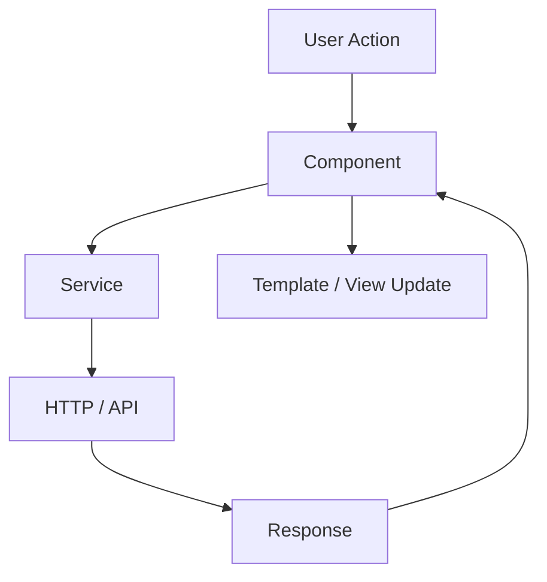
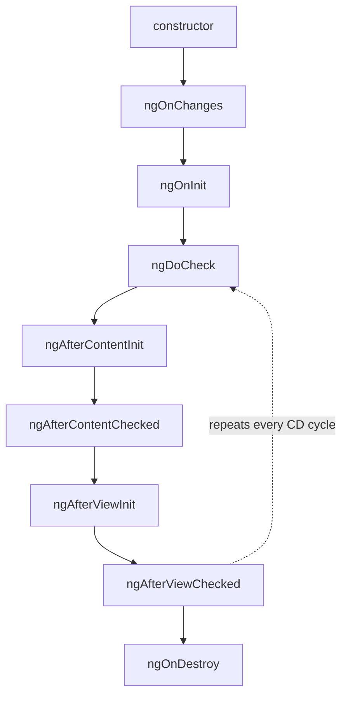
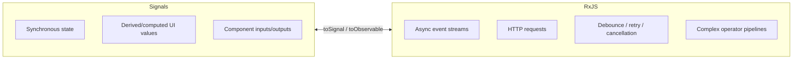
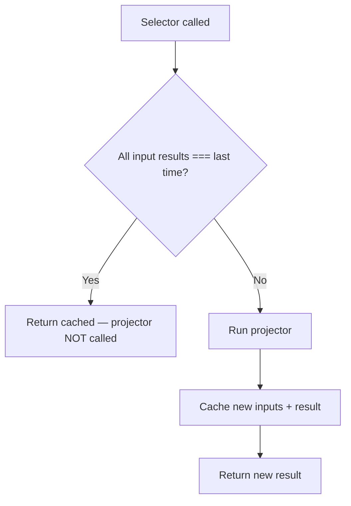
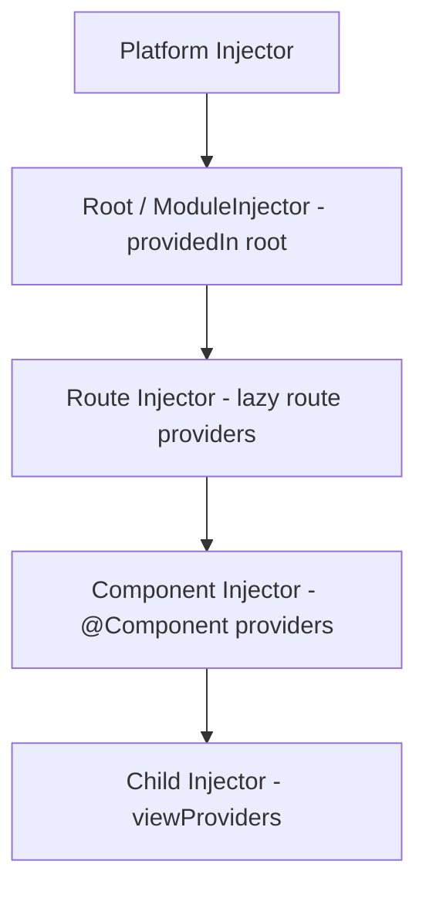
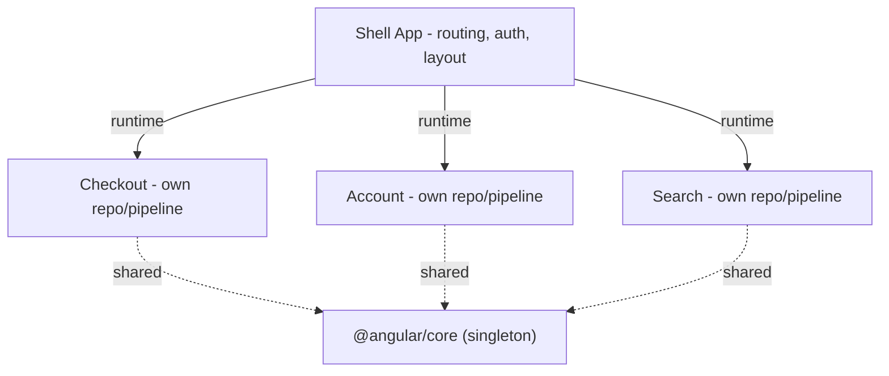
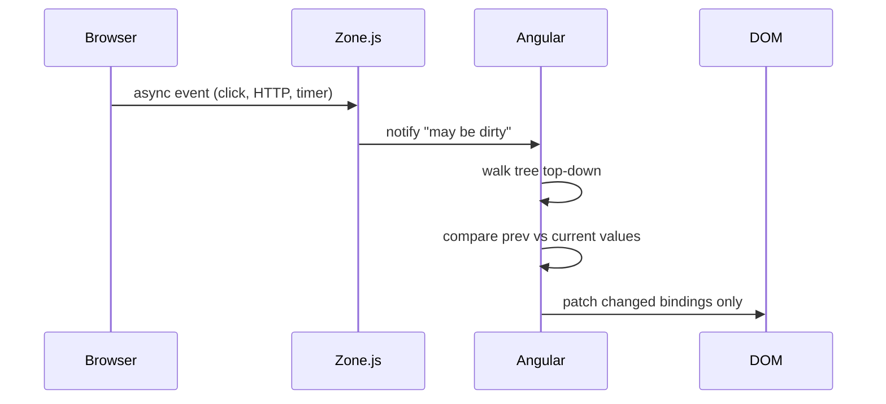
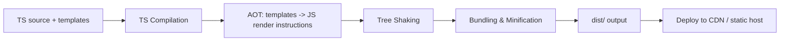
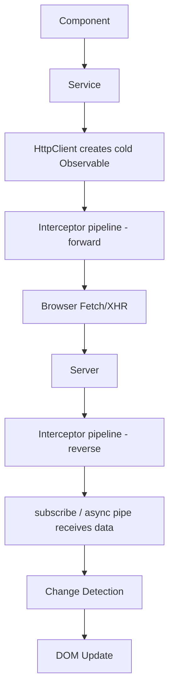
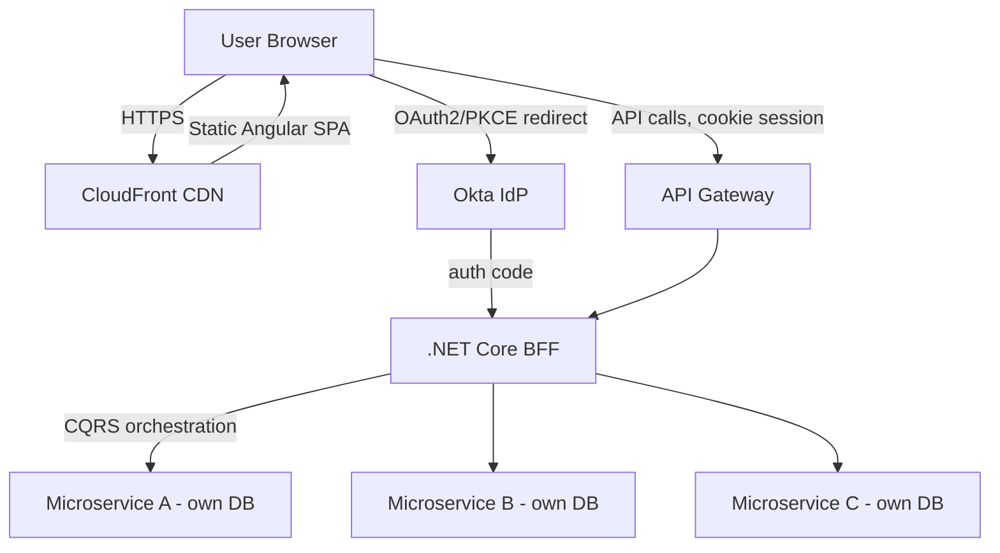

# Angular Senior/Lead Interview — Quick Revision Notes

> Fast brush-up notes derived from **L. Angular-Interview-Guide.md**. Covers every section in the same order, condensed to Q&A + tight bullets, with all key code, tables, and diagrams preserved. Baseline is "Angular 7 (2018)" notes upgraded to current Angular (v18/19-class: standalone by default, Signals, new control flow, `@defer`, zoneless CD).

---

## Core Concepts

### Angular vs AngularJS

| Aspect | AngularJS (1.x) | Angular (2+) |
|---|---|---|
| Architecture | MVC | Component-based |
| Language | JavaScript | TypeScript |
| Performance | Digest cycle, slower | AOT + Ivy, faster |
| Rendering | N/A | View Engine → **Ivy** (default since v9) |

- **Key features:** component architecture, two-way binding, directives/pipes, DI, routing, HttpClient, template-driven + reactive forms, lazy loading, AOT.
- **Ivy** = Angular's compile/render engine (default since v9). Compiles templates AOT into low-level JS instructions → smaller bundles (better tree-shaking, per-component instructions), faster compile, better debugging (inspectable component instances, precise template error mapping).
- **Follow-up:** "Angular isn't MVC — what is it?" → component/MVVM-flavored: component class = view-model, template = view, services/DI = model/business layer. No single controller layer.

### Hybrid Apps & ngUpgrade

- **Hybrid app** = AngularJS (1.x) and Angular (2+) running side by side during migration; both runtimes bootstrapped together.
- **`ngUpgrade`** (`@angular/upgrade`): `UpgradeModule` bootstraps the hybrid; `downgradeComponent`/`downgradeInjectable` bridge the two. Use AngularJS directives in Angular templates and vice versa.
- **Strategy:** migrate one route/feature/component at a time; keep `ngUpgrade` as bridge until AngularJS retired — avoid risky big-bang rewrite.
- **Why asked:** most pre-2016 enterprises lived this; signals awareness of Angular history (parallels WebForms → MVC → .NET Core).

### Architecture Overview

Classic NgModule building blocks: 1) Modules (`@NgModule`), 2) Components (`@Component`), 3) Templates & Views, 4) Directives & Pipes, 5) Services & DI, 6) Routing (`RouterModule`), 7) Forms, 8) State Management (NgRx/service).



- **Modern (v14+, default schematic v17+):** drop NgModules → **standalone components/directives/pipes**; routing via `provideRouter` in `app.config.ts` instead of `RouterModule.forRoot()`. NgModules not removed — still work in legacy code. Be ready to discuss both.

### TypeScript in Angular

- Superset of JS with static typing + OOP. Used for type safety, tooling, compile-time errors, decorators/modern ES. Maps to C# for .NET devs (interfaces, generics, `strictNullChecks` ≈ nullable ref types).
- **Why require it, not just support?** AOT/Ivy compiler relies on static types + decorator metadata to generate optimized code and power DI's type-based token resolution.

### Modules (NgModule)

```typescript
@NgModule({
  declarations: [AppComponent],   // components/directives/pipes owned here
  imports: [BrowserModule],       // modules whose exports this needs
  providers: [],                  // module-level DI (legacy; prefer providedIn:'root')
  bootstrap: [AppComponent]       // root component (root module only)
})
export class AppModule { }
```

- **`forRoot()` vs `forChild()`:** `forRoot(routes)` used **once** in root — also configures singleton `Router`, location strategy. `forChild(routes)` in feature modules — registers routes only, no router singletons. Re-calling `forRoot()` in a feature module = classic duplicate-router bug.

### Components

Component = Template (HTML) + Class (TS) + Styles (CSS/SCSS).

```typescript
@Component({
  selector: 'app-user',
  templateUrl: './user.component.html',
  styleUrls: ['./user.component.css'],
  providers: [UserService],
  viewProviders: [UserService],
  encapsulation: ViewEncapsulation.Emulated,
  changeDetection: ChangeDetectionStrategy.OnPush,
  animations: [trigger('fade', [
    state('visible', style({ opacity: 1 })),
    state('hidden', style({ opacity: 0 })),
    transition('visible <=> hidden', [animate('300ms')])
  ])],
  standalone: true,
  imports: [CommonModule],
  exportAs: 'userComp',
  host: { '(click)': 'onHostClick()', '[class.active]': 'isActive' }
})
export class UserComponent { /* ... */ }
```

| Property | Purpose |
|---|---|
| `selector` | HTML tag name |
| `template`/`templateUrl` | Inline/external HTML |
| `styles`/`styleUrls` | Inline/external CSS |
| `providers` | Services scoped to component + children (visible to projected content) |
| `viewProviders` | Services scoped to component's *view* only (not projected content) |
| `encapsulation` | CSS scoping strategy |
| `changeDetection` | `Default` or `OnPush` |
| `animations` | Component animations |
| `standalone` | Usable without NgModule |
| `imports` | Deps the standalone component's template needs |
| `exportAs` | Template ref name when used as directive |
| `host` | Bindings/listeners on host element |

**Encapsulation:** `Emulated` (default — attribute-selector scoping, not true isolation), `None` (global styles), `ShadowDom` (real Shadow DOM isolation).

- **`providers` vs `viewProviders`:** `providers` visible to own view AND `<ng-content>`-projected content; `viewProviders` visible to own template only. Classic gotcha.
- **Directive vs Component:** component renders UI + has template (`@Component`); directive changes DOM behavior, no template (`@Directive`). Every component is a directive with a template attached.

### Standalone Components (Angular 14+, default v17)

Eliminates mandatory NgModule wrapper — biggest gap vs 2018 notes.

```typescript
@Component({
  standalone: true,
  selector: 'app-user-card',
  imports: [CommonModule, RouterLink],   // import exactly what template needs
  template: `<div>{{ name }}</div>`
})
export class UserCardComponent { name = 'Jane'; }
```

```typescript
// main.ts
bootstrapApplication(AppComponent, appConfig);

// app.config.ts
export const appConfig: ApplicationConfig = {
  providers: [
    provideRouter(routes),
    provideHttpClient(withInterceptors([authInterceptor])),
    provideAnimations(),
  ]
};
```

- **Why:** simpler mental model (no "which module?"), better tree-shakability (each component declares exact deps), aligns with React/Vue/Svelte. NgModules **not deprecated** — mix incrementally (`ng generate @angular/core:standalone`).
- **Gotcha:** each standalone component must import `CommonModule` (or specific directives) itself to use `*ngIf`/`*ngFor`/pipes — no shared-module inheritance.

### UI Libraries: Angular Material vs Bootstrap

| Library | What | Notes |
|---|---|---|
| **Angular Material** | Google's official Material lib for Angular | Built on CDK, works with reactive forms, SCSS theming, accessible by default |
| **Bootstrap** | Framework-agnostic CSS framework | Not Angular-specific; use CSS classes or `ngx-bootstrap`/`ng-bootstrap` wrappers |

- Install: `ng add @angular/material` (installs pkg, theme picker, typography/animations, optional hammerjs). Same `ng add` schematic convention as `@angular/pwa`, `@angular/ssr`, `@ngrx/store`.
- **Framing:** Material for baked-in a11y/theming/Angular-native APIs; Bootstrap when org already uses Bootstrap conventions or wants CSS-only, framework-agnostic approach.

### Templates, Metadata, Decorators

- **Template** = declarative HTML view; Ivy compiles it to render/update instructions.
- **Metadata** = info attached via decorator telling Angular how to construct/wire a class.
- **Decorators** = functions attaching that metadata; without them Angular can't instantiate/resolve deps. Key: `@Component`, `@Directive`, `@Pipe`, `@NgModule`, `@Injectable`, `@Input`, `@Output`, `@HostBinding`, `@HostListener`, `@ViewChild`, `@ContentChild`.

### Data Binding

| Type | Syntax | Direction |
|---|---|---|
| Interpolation | `{{ value }}` | Component → View |
| Property | `[property]="value"` | Component → View |
| Event | `(event)="handler()"` | View → Component |
| Two-way | `[(ngModel)]="value"` | Both |

- Two-way = sugar: `[(ngModel)]="name"` → `[ngModel]="name" (ngModelChange)="name=$event"`. Custom two-way component = `@Input() value` + `@Output() valueChange`.

### Directives

1. **Component** — directive with a template.
2. **Structural** (`*ngIf`, `*ngFor`, `*ngSwitch`) — add/remove DOM. `*` desugars: `*ngIf="cond"` → `<ng-template [ngIf]="cond">`.
3. **Attribute** (`ngClass`, `ngStyle`, custom) — change appearance/behavior, no structural change.

```typescript
@Directive({ selector: '[appHighlight]' })
export class HighlightDirective {
  constructor(private el: ElementRef, private renderer: Renderer2) {}
  private setColor(color: string) {
    this.renderer.setStyle(this.el.nativeElement, 'color', color);
  }
}
```

- **`ElementRef` vs `Renderer2`:** `ElementRef.nativeElement` = direct DOM access; `Renderer2` = Angular abstraction that works under SSR/Web Workers. **Trap:** mutating `nativeElement.style` breaks under SSR — prefer `Renderer2`.

**`*ngIf` vs `[hidden]`:**

| | `*ngIf` | `[hidden]` |
|---|---|---|
| Removes from DOM? | Yes | No (`display:none`) |
| Performance | Better for expensive subtrees | Cheaper to toggle frequently |
| Re-runs lifecycle? | Yes (destroy/recreate) | No |

### New Control-Flow Syntax: @if / @for / @switch (Angular 17+)

```html
@if (isLoggedIn) { <p>Welcome back!</p> }
@else if (isGuest) { <p>Continue as guest</p> }
@else { <p>Please log in.</p> }

@for (item of items; track item.id) { <li>{{ item.name }}</li> }
@empty { <li>No items found.</li> }

@switch (status) {
  @case ('success') { <p>Success</p> }
  @case ('error') { <p>Error</p> }
  @default { <p>Unknown</p> }
}
```

- `track` is **mandatory** in `@for` (unlike optional `trackBy`) — forces identity thinking up front.
- Compiled directly by Ivy (no `<ng-template>` desugaring) → smaller code, better runtime perf.
- `@empty` is first-class (previously needed sibling `*ngIf="items.length===0"`).
- Old syntax **not** deprecated — coexists; migrate via `ng generate @angular/core:control-flow`.
- No `CommonModule` import needed — built into compiler, not directives.

### ng-container / ng-template / ng-content

| Feature | Purpose | In DOM? | Use |
|---|---|---|---|
| `ng-container` | Logical grouping | No | Avoid wrapper `<div>` with structural directives |
| `ng-template` | Deferred/conditional blueprint | No (until used) | `*ngIf...else`, reusable templates, `ngTemplateOutlet` |
| `ng-content` | Content projection (parent→child) | Yes (children only) | Cards, modals, tabs |

```html
<p *ngIf="isLoggedIn; else showLogin">Welcome back!</p>
<ng-template #showLogin><p>Please log in.</p></ng-template>
```

Multi-slot projection:

```typescript
@Component({ selector: 'app-card', template: `
  <div class="card">
    <header><ng-content select="[card-title]"></ng-content></header>
    <section><ng-content></ng-content></section>
    <footer><ng-content select="[card-footer]"></ng-content></footer>
  </div>` })
export class CardComponent {}
```

### Pipes

Transform data for **display only** — keep formatting out of the class.

```html
<p>{{ name | uppercase }}</p>
<p>{{ 1234.56 | currency:'USD' }}</p>
```

- Built-in: `uppercase`, `lowercase`, `titlecase`, `number`, `percent`, `currency`, `date`, `json`, `async`, `slice`, `decimal`.

```typescript
@Pipe({ name: 'reverse' })
export class ReversePipe implements PipeTransform {
  transform(value: string): string { return value.split('').reverse().join(''); }
}
```

- **Pure (default)** — re-runs only when input *reference*/primitive changes. Cheap, preferred.
- **Impure** (`pure: false`) — re-runs every CD cycle. Needed for `async` pipe; otherwise a perf red flag.
- **Trap: "Why not filter a list with a pipe?"** Pure pipe won't re-run on in-place array mutation (no new ref); impure pipe runs every CD cycle. Fix: filter in component (new array on demand) or use RxJS/Signals derived state.

### Services & Dependency Injection

```typescript
@Injectable({ providedIn: 'root' })
export class DataService { getData() { return 'Hello'; } }
// constructor(private dataService: DataService) { }
```

| Feature | `providedIn: 'root'` | `providers` in NgModule |
|---|---|---|
| Scope | Singleton app-wide | Scoped to module/component |
| Lazy loading | Tree-shakable, instantiated if injected | Risked duplicate instances per lazy module |
| Recommendation | Preferred default | Use for deliberate scoped/multiple instances |

- **Hierarchical DI:** injector is a tree, not one global container. Registering in a component's `providers` creates a *new* instance for that subtree — used for per-feature/per-component state isolation (e.g., wizard with independent step forms).

### The inject() Function (Angular 14+)

```typescript
@Component({ standalone: true, selector: 'app-user' })
export class UserComponent {
  private userService = inject(UserService);
  private route = inject(ActivatedRoute);
}

export const authGuard: CanActivateFn = (route, state) => {
  const auth = inject(AuthService);
  const router = inject(Router);
  return auth.isLoggedIn() ? true : router.createUrlTree(['/login']);
};
```

- Works only inside an **injection context** (constructor, field initializer, or `runInInjectionContext`).
- **Gotcha:** can't call `inject()` inside a `setTimeout`/async callback — context is gone; capture beforehand or wrap in `runInInjectionContext()`.
- Constructor injection still valid; `inject()` is additive but required for functional guards/resolvers/interceptors, and the CLI default in new standalone projects.

---

## Intermediate

### Component Lifecycle Hooks



| Hook | When | Use |
|---|---|---|
| `ngOnChanges(SimpleChanges)` | Any bound `@Input` change (before first `ngOnInit`) | React to input changes; prev vs current values |
| `ngOnInit()` | Once, after first `ngOnChanges` | Init logic, fetch data |
| `ngDoCheck()` | Every CD cycle | Custom change detection (e.g. in-place mutation) |
| `ngAfterContentInit()` | Once, after `<ng-content>` init | Access projected content first time |
| `ngAfterContentChecked()` | After each content check | React to projected content updates |
| `ngAfterViewInit()` | Once, after view + child views init | Safely access `@ViewChild`/DOM |
| `ngAfterViewChecked()` | After each view check | Rare |
| `ngOnDestroy()` | Before destroy | Clean up subscriptions/timers/listeners |

- **`constructor`** — DI only, never business logic (inputs not bound, services may not be ready).
- **`SimpleChanges`** — `.previousValue`/`.currentValue`/`.firstChange` per input.

| | `constructor` | `ngOnInit` |
|---|---|---|
| Runs | On instantiation | After input bindings set |
| Use for | DI only | API calls, init |
| Inputs available? | No | Yes |

### ViewChild / ViewChildren / ContentChild / ContentChildren

- `@ViewChild`/`@ViewChildren` → elements in **own template** (available after `ngAfterViewInit`).
- `@ContentChild`/`@ContentChildren` → elements **projected from parent** (available after `ngAfterContentInit`).
- One-liner: **"View = what I own, Content = what the parent gives me."**

```typescript
@ViewChild(MatPaginator) paginator!: MatPaginator;
@ViewChildren(ItemComponent) items!: QueryList<ItemComponent>;
```

- Uses: read DOM props/call native methods (focus/scroll/measure), call child public methods, integrate third-party UI.
- **Signal-based queries (v17.3+):** `viewChild()`, `viewChildren()`, `contentChild()`, `contentChildren()` return Signals — no `!` assertion / lifecycle-timing dance; "not yet available" becomes `| undefined` in the type; integrates with `computed()`/`effect()`.

```typescript
paginator = viewChild(MatPaginator);   // Signal<MatPaginator | undefined>
items = viewChildren(ItemComponent);   // Signal<readonly ItemComponent[]>
```

### Component Communication

| Direction | Mechanism |
|---|---|
| Parent → Child | `@Input()` |
| Child → Parent | `@Output()` + `EventEmitter` |
| Sibling/unrelated | Shared service with `Subject`/`BehaviorSubject` (or Signal) |
| Across routes | Route params, query params, navigation `state` |

- `EventEmitter` = thin wrapper over RxJS `Subject`, for `@Output()` only — **not** a general service pub/sub (use plain `Subject`/`BehaviorSubject` there).
- Prefer `@Input`/`@Output` for direct parent-child; shared service only for cross-cutting shared state (auth, cart, theme).
- **Template ref vars** (`#var`) — lightweight `@ViewChild` alternative for trivial DOM access:

```html
<input #txt />
<button (click)="print(txt.value)">Print</button>
```

### Routing and Navigation

```typescript
const routes: Routes = [
  { path: 'home', component: HomeComponent },
  { path: 'product/:id', component: ProductComponent },
  { path: '**', component: PageNotFoundComponent }   // wildcard
];
// RouterModule.forRoot(routes) / exports: [RouterModule]
```

```html
<a routerLink="/home">Home</a>
<router-outlet></router-outlet>
```

```typescript
this.router.navigate(['/home']);
this.route.snapshot.paramMap.get('id');
this.router.navigate(['/products'], { queryParams: { category: 'electronics' } });
this.route.snapshot.queryParamMap.get('category');
```

- **Snapshot gotcha:** `snapshot` captures value at navigation moment only. If same component instance is reused across param changes (`/product/1` → `/product/2`), use observable form (`this.route.paramMap.subscribe(...)` or via `switchMap`).
- **Lazy loading (module):**
```typescript
{ path: 'dashboard', loadChildren: () => import('./dashboard/dashboard.module').then(m => m.DashboardModule) }
```
- **Lazy loading standalone (v14+):** no wrapper module needed —
```typescript
{ path: 'login', loadComponent: () => import('./login/login.component').then(c => c.LoginComponent) },
{ path: 'admin', loadChildren: () => import('./admin/admin.routes').then(m => m.ADMIN_ROUTES) }
```
`admin.routes.ts` exports a plain `Routes` array.

### Route Guards

| Guard | Purpose |
|---|---|
| `CanActivate` | Protect a route (logged-in only) |
| `CanActivateChild` | Protect child routes (`/admin/*`) |
| `CanLoad` (legacy) / `CanMatch` (current) | Prevent lazy module loading |
| `CanMatch` | Gate whether route *matches* (role/flag); can fall through to another route def |
| `CanDeactivate` | Block navigation away (unsaved changes) |

- **`CanLoad` → `CanMatch`:** `CanMatch` is strictly more capable — gates non-lazy routes too and lets Angular try the next matching route config if false (A/B, feature-flag swaps). New code uses `CanMatch`.

```typescript
export const authGuard: CanActivateFn = () => {
  const auth = inject(AuthService);
  const router = inject(Router);
  return auth.isLoggedIn() || router.createUrlTree(['/login']);
};

export const formExitGuard: CanDeactivateFn<ProfileEditComponent> = (component) =>
  component.form.dirty ? confirm('Unsaved changes. Leave anyway?') : true;
```

- Class-based guards still work; functional guards are modern idiom (no extra injectable class for simple checks).

### Forms: Template-driven vs Reactive

| | Template-driven | Reactive |
|---|---|---|
| Control style | Template via `ngModel` | Class via `FormControl`/`FormGroup` |
| Scalability | Less | Enterprise standard |
| Testability | Harder (logic in template) | Easier (pure TS) |
| Dynamic fields/validation | Awkward | Natural |
| Use when | Small/simple | Complex/dynamic/conditional |

```html
<!-- template-driven -->
<form #form="ngForm"><input [(ngModel)]="name" name="name"></form>
```

```typescript
// reactive
form = new FormGroup({ name: new FormControl('') });
// FormBuilder:
form = this.fb.group({ name: ['', Validators.required] });
// validation:
form = new FormGroup({ email: new FormControl('', [Validators.required, Validators.email]) });
```

- Built-in validators: `required`, `minLength`, `maxLength`, `pattern`, `email`, `min`/`max`. Compose via array or `Validators.compose([...])`.
- **`FormGroup` vs `FormArray`:** "A `FormGroup` is a fixed, named group of controls; a `FormArray` is a dynamic, indexed collection used when the number of inputs is unknown/user-driven."
- **Dynamic validation:** `control.setValidators([...])` / `clearValidators()` / `updateValueAndValidity()` — when one field's validity depends on another.
- Validity: `form.valid`, `control.errors`, `control.touched`, `control.dirty`.
- `[ngModelOptions]="{standalone: true}"` — don't register that `ngModel` with the parent `ngForm` (UI-only field inside a `<form>`).
- **`valueChanges`** — RxJS Observable on control/group/array, emits latest value on each change. Uses: live validation, search, enable/disable buttons, autosave. **Reactive forms only** (template-driven uses `ngModelChange`).

```typescript
this.name.valueChanges.subscribe(value => console.log('Name changed:', value));
```

- Submit: `<form [formGroup]="form" (ngSubmit)="onSubmit()">`. Reset: `this.form.reset()`.
- **Custom validator** — function returning `ValidationErrors | null` (cross-field, e.g. password match):

```typescript
export function passwordsMatch(group: AbstractControl): ValidationErrors | null {
  const pass = group.get('password')?.value;
  const confirm = group.get('confirmPassword')?.value;
  return pass === confirm ? null : { passwordMismatch: true };
}
```

- Validators work **without** a `<form>` tag (inline editable fields, search boxes).

### Typed Reactive Forms (Angular 14+)

Pre-v14 forms were effectively `any` — `form.get('emial')` failed silently at runtime.

```typescript
interface ProfileForm {
  name: FormControl<string>;
  email: FormControl<string>;
  phones: FormArray<FormControl<string>>;
}
const form = new FormGroup<ProfileForm>({
  name: new FormControl('', { nonNullable: true }),
  email: new FormControl('', { nonNullable: true, validators: [Validators.email] }),
  phones: new FormArray<FormControl<string>>([])
});
form.value.name; // string | undefined — typed!
```

- Compile-time errors for typo'd control names / wrong types — big win for .NET devs.
- **`nonNullable` gotcha:** `.reset()` on `FormControl<string>` resets to `null` silently; opt into `nonNullable: true` or type as `FormControl<string | null>`.
- Escape hatches: `UntypedFormGroup`/`UntypedFormControl` for migration.

### HttpClient and Interceptors

```typescript
this.http.get('https://api.example.com/users').subscribe(r => console.log(r));
this.http.post(url, { name: 'John' }).subscribe();
this.http.put(url + '/1', updatedData).subscribe();
this.http.delete(url + '/1').subscribe();

const headers = new HttpHeaders().set('Authorization', 'Bearer token');
const params = new HttpParams().set('search', 'Angular');
```

```typescript
this.http.get(url).pipe(
  catchError(error => { console.error(error); return throwError(() => error); })
).subscribe();
```

- **JSONP** — legacy cross-domain GET via `<script>` callback; use only without CORS. Rarely used in 2026, security downsides — mention only if asked.

**Class-based interceptor:**

```typescript
@Injectable()
export class AuthInterceptor implements HttpInterceptor {
  constructor(private auth: TokenService) {}   // inject token source — keeps storage a separate decision
  intercept(req: HttpRequest<any>, next: HttpHandler): Observable<HttpEvent<any>> {
    const token = this.auth.getAccessToken();
    if (!token) return next.handle(req);        // don't send "Bearer null"
    return next.handle(req.clone({ setHeaders: { Authorization: `Bearer ${token}` } }));
  }
}
// providers: [{ provide: HTTP_INTERCEPTORS, useClass: AuthInterceptor, multi: true }]
```

- **Token storage trade-off:** `localStorage`/`sessionStorage` = simplest but XSS-readable → token theft (low-stakes only). **BFF + HttpOnly cookie** = token never in JS; interceptor sends `withCredentials: true`; defensible at enterprise scale. State the trade-off; don't present `localStorage` as best practice.
- Interceptors run in **registration order** on request, **reverse order** on response. Common chain: **Auth → Loader → Error handler**. `multi: true` for multiple.

### Functional Interceptors (Angular 15+)

```typescript
export const authInterceptor: HttpInterceptorFn = (req, next) => {
  const token = inject(AuthService).getToken();
  return next(req.clone({ setHeaders: { Authorization: `Bearer ${token}` } }));
};
// provideHttpClient(withInterceptors([authInterceptor, loaderInterceptor, errorInterceptor]))
```

- Array order = execution order. Modern idiom; only style directly supported by `provideHttpClient`. Default to this unless asked about class-based legacy.

---

## Advanced

### RxJS and Observables

- **Observable** = stream emitting 0/1/many values over time via `next`/`error`/`complete`. **Observer** = consumer.
- Lazy ("cold") — nothing runs until `.subscribe()`.

| Feature | Observable | Promise |
|---|---|---|
| Lazy | Yes | No (runs immediately) |
| Multiple values | Yes | No (single) |
| Cancelable | Yes (`unsubscribe()`) | No |
| Operators | Yes (rich) | No |

- Used in HttpClient, route params, `valueChanges`, event streams.
- **Unsubscribe / avoid leaks:** store `Subscription` + `.unsubscribe()` in `ngOnDestroy`; `takeUntil(destroy$)`; **`async` pipe** (auto sub/unsub).
- **`takeUntilDestroyed()` (v16+):** hooks into `DestroyRef` — removes manual `destroy$` Subject boilerplate:

```typescript
private destroyRef = inject(DestroyRef);
this.userService.getUsers().pipe(takeUntilDestroyed(this.destroyRef)).subscribe(...);
```
In constructor/field initializer (injection context) you can omit the arg.

### Subjects, BehaviorSubject, Multicasting

- **Multicasting** = one Observable execution shared across many subscribers (same emissions). Via `Subject`, `share`, `shareReplay`.
- **Subject** — both Observable + Observer (`.next()`); no stored value; new subscribers get only values *after* subscribing.
- **BehaviorSubject** — stores latest value, requires initial value, emits current value immediately to new subscribers.
- Rule of thumb: **Observable → read; Subject → send events; BehaviorSubject → store latest state.**

| Feature | Subject | BehaviorSubject |
|---|---|---|
| Stores previous? | No | Yes |
| Requires initial? | No | Yes |
| New subscriber gets last? | No | Yes |
| Use | Events/clicks/streams | App/auth/theme/form state |
| Emits on subscribe? | No | Yes |

- **`ReplaySubject`** — new subscribers get some/all previous values (e.g. last N chat messages).
- **`shareReplay(1)`** vs BehaviorSubject — cache/share a *source* Observable (single HTTP call) among subscribers without a manual state container.
- Best answer: "Multicasting = sharing one Observable execution with many subscribers. `BehaviorSubject` is preferred for shared state because it stores the latest value and sends it immediately to new subscribers (auth, cart, settings)."

### RxJS Operators Cheat Sheet

- `pipe()` chains operators (immutable — each returns new Observable); nothing runs until `.subscribe()`.

**Flattening operators (classic cheat sheet):**

| Operator | Behavior | Best for |
|---|---|---|
| `mergeMap` | All inner concurrently, no cancel, order not guaranteed | Parallel/independent calls |
| `switchMap` | Cancels previous inner on new value, keeps latest | Search-as-you-type, live filters |
| `concatMap` | Queues inner one after another | Ordered sequential operations |
| `exhaustMap` | Ignores new emissions while inner running | Prevent duplicate submits |

```typescript
this.searchInput.valueChanges.pipe(
  debounceTime(300),
  switchMap(term => this.http.get(`/api/search?q=${term}`))
).subscribe(r => console.log(r));
```

- **`forkJoin`** — waits for **all** to complete, emits once with array/object (like `Promise.all`). **Gotcha:** if any source never completes (Subjects, infinite streams), `forkJoin` hangs forever.
- **Pull vs Push:** pull = consumer asks (function calls, iterating arrays); push = producer sends when ready (Observables, events, Promises). Push scales better for async/UI flows.

### Angular Signals (Angular 16+)

Most-asked "what's new" senior question.

- **What:** fine-grained reactive primitive in `@angular/core` (not RxJS) — value that notifies consumers on change. Lets Angular know *exactly* which bindings depend on which state → surgical DOM updates.

```typescript
export class CounterComponent {
  count = signal(0);
  doubled = computed(() => this.count() * 2);   // auto-recompute
  increment() { this.count.update(v => v + 1); }  // or .set(v)
  constructor() { effect(() => console.log('Count:', this.count())); }  // reactive side-effect
}
```

```html
<p>Count: {{ count() }}</p>   <!-- function-call read lets compiler track deps -->
```

- **Signal inputs/outputs (v17.1+):**
```typescript
name = input.required<string>();
age = input(0);
selected = output<string>();
```
- **Why:** RxJS has a learning curve + subscription bugs; Zone.js CD can't know *which* binding changed (re-checks whole subtrees). Signals give the dependency graph → enables **zoneless CD** and fine-grained DOM patching.
- **Do NOT replace RxJS** — Signals = synchronous "always has a value" state; RxJS = async streams, orchestration (debounce/retry/cancel/combine). Interop: `toSignal()` / `toObservable()` from `@angular/core/rxjs-interop`.

```typescript
users = toSignal(this.userService.getUsers(), { initialValue: [] });
```

### RxJS vs Signals — When to Use Which



| Concern | Signals | RxJS |
|---|---|---|
| Model | Pull, always has value | Push, event stream |
| Async | No (sync only) | Yes, native |
| Cancel/retry/debounce | Not built in | Rich operators |
| Learning curve | Low | Higher |
| CD integration | Native, fine-grained, enables zoneless | Needs `async` pipe / manual CD |
| Use | View state, derived, bindings | HTTP, WebSockets, `valueChanges` |

- Framing: "Not one over the other — Signals default for component-local state/bindings, RxJS for async streams/complex composition; `toSignal`/`toObservable` bridge them."

### State Management (NgRx and Alternatives)

Increasing formality: service-based (BehaviorSubject/Signal) → RxJS `BehaviorSubject` → **NgRx** (Redux/RxJS) → Akita/NGXS/Apollo.

| NgRx Concept | Role |
|---|---|
| Store | Single source of truth |
| Actions | Plain objects describing *what happened* |
| Reducers | Pure functions computing new state |
| Effects | Side effects (API), dispatch further actions |
| Selectors | Retrieve memoized state slices |

```typescript
export const increment = createAction('INCREMENT');
const counterReducer = createReducer(initialState, on(increment, s => ({ count: s.count + 1 })));

@Injectable()
export class MyEffects {
  loadData$ = createEffect(() => this.actions$.pipe(
    ofType(loadData),
    mergeMap(() => this.http.get('/api/data').pipe(map(data => loadDataSuccess({ data }))))
  ));
  constructor(private actions$: Actions, private http: HttpClient) {}
}
export const selectCount = (state: AppState) => state.count;
```
Setup: `ng add @ngrx/store`.

| Feature | NgRx | BehaviorSubject |
|---|---|---|
| Complexity | High | Low |
| Structure | Actions/reducers/effects | Simple service |
| At scale | Optimized for large apps | Fine small/medium |
| Side effects | Effects | Service methods |

- **When NgRx:** large teams, complex cross-cutting state, strict unidirectional flow, time-travel debugging, strong conventions. Small/medium → signal/service store. Justify the choice, don't default to NgRx.

### SignalStore / NgRx Signals (Angular 17+)

`@ngrx/signals` — lighter, Signal-native alternative to Actions/Reducers/Effects:

```typescript
export const CounterStore = signalStore(
  { providedIn: 'root' },
  withState({ count: 0 }),
  withComputed(({ count }) => ({ doubled: computed(() => count() * 2) })),
  withMethods((store) => ({ increment() { patchState(store, { count: store.count() + 1 }); } }))
);
```

- Modern answer to "isn't classic NgRx overkill?" — structured/testable with far less ceremony; interoperates with classic store for global state. Classic NgRx effects still better for complex async (retries, cancellation races, saga-like flows).

### NgRx Entity Adapters, Facade Pattern, Selector Memoization

**`@ngrx/entity` — `EntityAdapter`:** normalizes collections to `{ ids, entities }` dictionary + generated CRUD helpers/selectors. Avoids O(n) array scans + manual immutable copies.

```typescript
interface UserState extends EntityState<User> { loading: boolean; selectedUserId: string | null; }
const adapter = createEntityAdapter<User>({
  selectId: (u) => u.id,
  sortComparer: (a, b) => a.name.localeCompare(b.name),
});
const initialState = adapter.getInitialState({ loading: false, selectedUserId: null });
const userReducer = createReducer(initialState,
  on(loadUsersSuccess, (s, { users }) => adapter.setAll(users, s)),
  on(addUser, (s, { user }) => adapter.addOne(user, s)),
  on(updateUser, (s, { update }) => adapter.updateOne(update, s)),
  on(deleteUser, (s, { id }) => adapter.removeOne(id, s)),
);
const { selectIds, selectEntities, selectAll, selectTotal } = adapter.getSelectors();
```

- **Why:** `selectEntities` gives O(1) lookup-by-id vs `Array.find()` scan; standardizes update semantics (`updateOne` proper immutable merge).

**Facade pattern:** wrap `Store` access behind an injectable service so components never import NgRx symbols.

```typescript
@Injectable({ providedIn: 'root' })
export class UserFacade {
  private store = inject(Store);
  users$ = this.store.select(selectAllUsers);
  loadUsers() { this.store.dispatch(loadUsers()); }
  selectUser(id: string) { this.store.dispatch(selectUser({ id })); }
}
```

- **Why:** (1) components depend on small testable API not raw Store; (2) swap implementation (→ SignalStore) by rewriting only the facade; (3) trivial to mock in tests. Trade-off: extra indirection per feature — worth it once state has >2 consumers.

**`createSelector` memoization:** caches **last input args (by `===`) + last result**. Re-invokes each input selector, compares by reference:
- All inputs `===` last time → projector **not** re-run, cached result returned.
- Any input differs → projector re-runs once, new inputs+result cached.

```typescript
export const selectFilteredUsers = createSelector(
  selectAllUsers, selectFilterText,
  (users, filterText) => users.filter(u => u.name.includes(filterText))   // projector
);
```

- Why immutability matters (same as OnPush). **Cache size = 1** — alternating argument sets (parameterized selectors) thrash the cache. Reducers that create new refs unnecessarily (`return {...state}` always) defeat memoization.



### Dependency Injection: Hierarchical Injectors Deep Dive



- Angular walks **up** the tree from the requester until it finds the token — **nearest provider wins**.
- Component `providers` → fresh instance for that subtree, shadows root registration.
- `viewProviders` differs from `providers` only in being invisible to `<ng-content>`-projected content (projected content resolves from its *own* origin injector).
- **Multi-providers** (`multi: true`, e.g. `HTTP_INTERCEPTORS`) accumulate values under one token instead of overwriting.
- **Resolution modifiers:** `@Optional()` → `null` if not found; `@Self()` → local injector only; `@SkipSelf()` → start one level up (e.g. `ControlContainer`); `@Host()` → stop at host boundary.

### Micro-Frontends / Module Federation for Angular

- **Problem:** one large app doesn't scale organizationally when multiple teams must build/deploy their own areas independently. Micro-frontends = each team owns/deploys a UI piece composed at runtime into a shell.
- **Webpack Module Federation:** a "remote" build exposes modules at runtime; the "host"/shell consumes them without compiling together (only needs a runtime manifest URL).

```javascript
// remote
new ModuleFederationPlugin({
  name: 'checkoutApp', filename: 'remoteEntry.js',
  exposes: { './CheckoutModule': './src/app/checkout/checkout.module.ts' },
  shared: ['@angular/core', '@angular/common', '@angular/router'],
});
// shell
new ModuleFederationPlugin({
  name: 'shell',
  remotes: { checkoutApp: 'checkoutApp@https://checkout.example.com/remoteEntry.js' },
  shared: ['@angular/core', '@angular/common', '@angular/router'],
});
```

- Angular standard: **`@angular-architects/module-federation`** schematic; supports dynamic remote loading:
```typescript
{ path: 'checkout', loadChildren: () => loadRemoteModule({
    type: 'module', remoteEntry: 'https://checkout.example.com/remoteEntry.js',
    exposedModule: './CheckoutModule',
  }).then(m => m.CheckoutModule) }
```



- **Mechanics:** `shared` negotiates framework as singletons across host/remotes (avoids duplicate Angular instances that break DI/routing/CD + bloat). Each remote is independently deployable. **Version skew** is the real cost — shared-dep major-version mismatch fails at *runtime*, not build time.
- **vs Nx monorepo:**

| Concern | Nx Monorepo | Module Federation |
|---|---|---|
| Team independence | Shared pipeline + lint boundaries | True independent build+deploy |
| Version coordination | Single version across repo | Runtime negotiation, skew risk |
| Breaking-change failure | Compile-time (CI) | Often runtime |
| Operational complexity | Lower (one pipeline) | Higher (per-remote pipelines, manifest hosting) |
| Best fit | Most orgs sharing a release cadence | Orgs needing independent deploy schedules |

- Framing: "Module Federation solves an *organizational/deployment* problem, not code organization — reach for Nx boundaries first; add Module Federation only when independent deploy cadence is a genuine business requirement."

---

## Performance

### Change Detection Deep Dive

- **CD** = mechanism to detect data changes and update the DOM.
- **Classic Zone.js model:** 1) Zone.js monkey-patches async APIs (`setTimeout`, Promises, DOM events, XHR/fetch) → notifies Angular. 2) CD walks the tree top-down, diffs bound expressions, patches DOM. 3) `Default` strategy checks every component on every triggering event.



- **Triggers:** DOM events, HTTP responses, `setTimeout`/`setInterval`, Promise resolution, `@Input` changes, manual (`markForCheck()`/`detectChanges()`).
- **`ChangeDetectorRef`:** `detectChanges()` runs CD synchronously now; `markForCheck()` marks this + OnPush ancestors dirty for next cycle.
- Senior answer: "Zone.js patches async APIs and notifies Angular; Angular walks the tree top-down comparing bound values, patches changed DOM. Default checks the whole tree; OnPush skips a component unless an `@Input` reference changed, an event originated within it, an `async`-piped Observable emitted, or `markForCheck()`/`detectChanges()` ran. Unidirectional, top-down, Ivy-optimized."

### Zoneless Change Detection (Angular 18+)

- Experimental `provideExperimentalZonelessChangeDetection()` (matured v19/v20) — removes Zone.js.
- **Why:** Zone.js patches nearly every async API (runtime cost, subtle bugs with third-party libs / non-patched async / Web Workers — "why didn't my UI update"); also removes bundle/parse cost. Zoneless relies on **Signals** to know exactly when to re-render — the payoff of the Signals investment.

```typescript
providers: [ provideExperimentalZonelessChangeDetection() ]
```

- **Gotcha:** state mutated *outside* a Signal write / Angular's notification (raw callback mutating a plain field) won't trigger re-render — model as Signal, call `markForCheck()`, or route through `async` pipe. Still experimental — verify GA status against the job's Angular version.

### OnPush Strategy and Pitfalls

```typescript
@Component({ selector: 'app-demo', changeDetection: ChangeDetectionStrategy.OnPush })
export class DemoComponent {}
```

OnPush checks only when: 1) `@Input` **reference** changes, 2) event originates inside the component, 3) `async`-piped Observable emits, 4) manual `markForCheck()`/`detectChanges()`.

| | Default | OnPush |
|---|---|---|
| Checks whole tree? | Yes | No |
| Performance | Slower at scale | Faster |
| Triggered by | Any change anywhere | Input ref change / own event / async emission / manual |

**#1 gotcha — reference not deep equality:**

```typescript
this.user.name = 'John';                    // ❌ mutation — ref unchanged, NOT re-checked
this.user = { ...this.user, name: 'John' };  // ✅ new ref — triggers re-check
```

- Pairs with immutable data (spread, new arrays/objects from reducers, Signals). Standard in large enterprise apps (500+ components).
- **OnPush + Signals:** reading a Signal in the template (`{{ mySignal() }}`) auto re-checks under OnPush — Signal's own notification satisfies OnPush natively. Designed to interlock.

### trackBy / track in Loops

Without `trackBy`, default identity is by object reference — replacing the array recreates DOM nodes unnecessarily.

```html
<li *ngFor="let item of items; trackBy: trackByFn">{{ item.name }}</li>
```
```typescript
trackByFn(index: number, item: any) { return item.id; }
```

- With `trackBy` keyed on `id`, Angular patches only changed items → less DOM churn.
- In `@for`, `track` is **mandatory** — forces the optimization.
- **Virtual scrolling (CDK)** — for thousands of rows, `trackBy` isn't enough; use `cdk-virtual-scroll-viewport` (renders only visible nodes + buffer):

```html
<cdk-virtual-scroll-viewport itemSize="50" class="viewport">
  <div *cdkVirtualFor="let item of items">{{ item.name }}</div>
</cdk-virtual-scroll-viewport>
```
- `trackBy` reduces *update* cost; virtual scrolling reduces *render* cost.

### Deferrable Views: @defer (Angular 17+)

Declarative lazy-loading for **template regions** — splits deferred content + its deps into a separate JS chunk loaded on trigger.

```html
@defer (on viewport) {
  <heavy-chart [data]="chartData" />
} @placeholder { <div class="skeleton"></div> }
  @loading (minimum 500ms) { <spinner /> }
  @error { <p>Failed to load chart.</p> }
```

- **Triggers:** `on idle` (default), `on viewport` (IntersectionObserver), `on interaction`, `on hover`, `on timer(2s)`, `when <condition/Signal>`.
- **Why:** targets Core Web Vitals — heavy/below-fold/rarely-used UI (charts, modals, admin widgets) no longer ships in initial bundle. Before `@defer` needed a separate lazy route or dynamic component + `ViewContainerRef.createComponent()`. First reach for "reduce initial bundle beyond route-level lazy loading."

### Lazy Loading and Preloading

```typescript
{ path: 'dashboard', loadChildren: () => import('./dashboard/dashboard.module').then(m => m.DashboardModule) }
```

- **Preloading** loads lazy modules in the background after app stabilizes so navigation feels instant:

```typescript
RouterModule.forRoot(routes, { preloadingStrategy: PreloadAllModules })
```

- Custom `PreloadingStrategy` — preload only selected routes (by role / "likely next page"). "Is preloading everything good?" → No; on constrained networks it competes with critical resources — selective preloading is more sophisticated.

### Bundle Size, Tree Shaking, Build Optimization

- **Tree shaking** — build (esbuild/webpack) removes unused/dead code.
- **Analyze:** `ng build --stats-json` then `npx webpack-bundle-analyzer dist/stats.json`. (esbuild builder may differ — verify against `angular.json` builder.)
- **Differential loading** — historically two bundles (ES2015+/ES5). Now effectively obsolete/removed as modern browsers are universal — call out as outdated for an "Angular 7" pipeline.
- **Angular DevTools** — inspect component trees + CD cycles, profile which components re-render.
- **Budgets** in `angular.json` — warn/error when bundle exceeds thresholds, enforced in CI.

### Angular CLI vs Webpack

| Aspect | Angular CLI | Webpack |
|---|---|---|
| Purpose | Scaffold/build/serve/test (`ng new/generate/build/serve/test`) | General JS module bundler |
| Config | Minimal, convention (`angular.json`) | Verbose (`webpack.config.js`) |
| Relationship | Historically used Webpack internally | Consumed *by* the CLI as a building block |

- CLI is the high-level tool; Webpack was the bundler underneath (hidden behind `@angular-devkit/build-angular:browser`) — Angular devs rarely hand-wrote `webpack.config.js` (unlike CRA `eject`). CLI has since swapped to esbuild/Vite.

### esbuild / Vite-based Application Builder (Angular 17+)

- New default builder `@angular-devkit/build-angular:application` (esbuild + Vite), replaces `browser` builder.
- **Why:** far faster cold builds/rebuilds (esbuild in Go, parallelized); `ng serve` uses **Vite** → near-instant HMR; unifies browser + server (SSR) targets into one `application` config. Webpack-specific custom loaders/plugins may lack esbuild equivalents (migration friction).
- Framing: "v17 swapped default webpack builder for esbuild/Vite, mainly for build speed. Doesn't change how you write components; does change troubleshooting + `angular.json` builder config."

### Angular Build & Runtime Lifecycle



**Build-time:** 1) TS compilation (`ngc`/Ivy, type + template errors). 2) **AOT** — templates → JS render functions at build; DI metadata pre-generated → faster startup, smaller bundles, fewer runtime errors (default, mandatory for prod; JIT is legacy). 3) Tree shaking. 4) Bundling/minification (`main.js`, `polyfills.js`, historically `runtime.js`/`styles.css`). 5) Deploy static files (IIS/Nginx/S3+CloudFront).

**Runtime:** 1) `index.html` loads `runtime.js`/`main.js`/`polyfills.js`. 2) `main.ts` bootstraps:
```typescript
platformBrowserDynamic().bootstrapModule(AppModule);   // or standalone:
bootstrapApplication(AppComponent, appConfig);
```
3) DI setup (injector tree). 4) Root component created (`<app-root>`, `constructor → ngOnInit → ngAfterViewInit`). 5) Router loads feature routes on activation.

| Feature | JIT | AOT |
|---|---|---|
| Compiled | Runtime, in browser | Build time |
| Performance | Slower | Faster |
| File size | Larger | Smaller |
| Use | Dev iteration (partly superseded) | Always for prod |

### HTTP Request Lifecycle



1) Component calls service. 2) `HttpClient.get()` returns **cold** Observable (no call yet). 3) Interceptors forward order (auth, logging, loader-start). 4) Browser Fetch/XHR sends. 5) Server responds. 6) Interceptors **reverse** order (error handling, loader-stop). 7) Observable emits → subscriber/`async` pipe. 8) CD diffs bindings, patches DOM.

---

## SSR, PWA & Cross-Cutting

### Angular Universal / SSR

- Renders initial HTML on the server (Node) before shipping to browser → faster perceived load, SEO/crawler-visible content.
- Setup: legacy `ng add @nguniversal/express-engine`; **modern (v17+): `ng add @angular/ssr`** (or select SSR in `ng new`) — `@nguniversal` folded into `@angular/ssr`/`@angular/platform-server`.
- Benefits: SEO, faster perceived load, better on slow networks/devices.

### Hydration (Angular 16+) and Event Replay (Angular 17+)

- Classic Universal problem: client bootstrap **destroyed and re-rendered** the whole DOM ("destructive rehydration") → flicker + wasted work.
- **Non-destructive hydration** (`provideClientHydration()`, stable v16/17) reuses server-rendered DOM, attaches state + listeners to existing markup.

```typescript
providers: [ provideClientHydration() ]
```

- **Event replay** (v17+) captures interactions during the "HTML painted → fully hydrated" window and replays them after hydration — clicks aren't swallowed.
- Strong senior talking point — hydration correctness distinguishes real SSR production experience.

### Progressive Web Apps and Service Workers

- **PWA** = web app with native-like capabilities: offline, background sync, push, cacheable perf, installability. Scaffold: `ng add @angular/pwa` (service worker registration, manifest, icons).
- **Service Worker** = background script: caches for offline, intercepts requests per caching strategy, enables push.

```json
{ "assetGroups": [{ "name": "app", "installMode": "prefetch", "updateMode": "prefetch",
  "resources": { "files": ["/favicon.ico", "/index.html"], "urls": ["/api/**"] } }] }
```

- Check PWA: Chrome DevTools → Lighthouse. Background sync = stores actions offline, sends on reconnect. Push = server-initiated updates via `@angular/service-worker`.
- **SwUpdate:** legacy `updates.available`/`activated`; current `updates.versionUpdates` (discriminated union: `VersionReadyEvent`, `VersionInstallationFailedEvent`) — filter for `VersionReadyEvent`. Verify against target version.

```typescript
constructor(updates: SwUpdate) {
  updates.available.subscribe(() => { if (confirm('New version. Load?')) window.location.reload(); });
}
```

### Angular Security

- Built-in: XSS protection, CSRF support, CSP support, sanitization (HTML/URL/styles).
- **XSS** — Angular auto-sanitizes interpolation + most property bindings.

```html
<p>{{ userInput }}</p>            <!-- safe: escaped -->
<p [innerHTML]="userInput"></p>   <!-- dangerous: bypasses context escaping -->
```

- **`DomSanitizer`** `bypassSecurityTrustX` = "I personally vouch this is safe" — only on content you control/validated server-side, never raw user input.
- **CSP** — restricts loadable scripts/resources: `<meta http-equiv="Content-Security-Policy" content="default-src 'self'">`.
- **CSRF** — HttpClient supports double-submit cookie (`HttpXsrfTokenExtractor`/`withXsrfConfiguration`) — works only if backend sets + validates the cookie/header pair (a client-server contract, not automatic).
- **CORS** — server-side (`Access-Control-Allow-Origin`); browser enforces same-origin, CORS headers relax it.
- **HTTP Parameter Pollution** — repeated params (`?user=admin&user=guest`) to confuse server parsing; mainly backend concern.
- **Auth:** JWTs in **HttpOnly cookies** (not `localStorage` — XSS-readable); Auth Guards on routes.

```typescript
@Injectable({ providedIn: 'root' })
export class AuthGuard implements CanActivate {
  constructor(private authService: AuthService) {}
  canActivate(): boolean { return this.authService.isLoggedIn(); }
}
```

- **Token storage:** `localStorage`/`sessionStorage` simplest but XSS→theft (low-stakes only); BFF + HttpOnly cookie keeps token out of JS (interceptor sends `withCredentials: true`) — defensible at enterprise scale. Name the trade-off, commit to a posture.
- Brute-force: rate limiting, CAPTCHA, lockout (backend); Angular surfaces UX correctly.

### Accessibility (a11y): ARIA, CDK a11y Module, Focus Management

- Often a hard compliance requirement (WCAG 2.1/2.2 AA, Section 508), not optional.
- **ARIA on custom components:** native elements (`<button>`, `<input>`) have built-in semantics; custom widgets from `<div>`/`<span>` have none — declare via `role`/`aria-*`.

```html
<div role="tablist" [attr.aria-label]="ariaLabel">
  <button role="tab" [attr.aria-selected]="tab.id === activeTabId"
          [attr.aria-controls]="'panel-' + tab.id"
          [tabindex]="tab.id === activeTabId ? 0 : -1"
          (click)="selectTab(tab.id)"
          (keydown.arrowRight)="focusNextTab()" (keydown.arrowLeft)="focusPreviousTab()">
    {{ tab.label }}
  </button>
</div>
```
Key: `role` tells assistive tech what a generic-markup widget *is*; `aria-selected` communicates visual-only state; **roving `tabindex`** (`0` active, `-1` rest + arrow-key handlers) = keyboard nav with a single Tab stop.

- **CDK `a11y` module** (`@angular/cdk/a11y`):

| Utility | Purpose |
|---|---|
| `FocusTrap` / `cdkTrapFocus` | Confines Tab focus within a container (modals) |
| `LiveAnnouncer` | Announces to screen readers via ARIA live region ("3 results found") |
| `FocusMonitor` | Detects *how* focused (mouse/keyboard/touch) — focus-visible for keyboard only |
| `InteractivityChecker` | Whether element is genuinely focusable/tabbable |
| `ListKeyManager` / `ActiveDescendantKeyManager` | Arrow-key nav for menus/autocomplete |

```typescript
private liveAnnouncer = inject(LiveAnnouncer);
onResultsLoaded(count: number) { this.liveAnnouncer.announce(`${count} results found`, 'polite'); }
```

- **Focus management for modals (3 steps to narrate):** (1) capture triggering element's focus before moving it; (2) trap focus inside + move initial focus in (`FocusTrapFactory.create(...).focusInitialElementWhenReady()`); (3) on close, restore focus to trigger.

```typescript
ngAfterViewInit() {
  this.previouslyFocusedElement = document.activeElement as HTMLElement;
  this.focusTrap = this.focusTrapFactory.create(this.containerRef.nativeElement);
  this.focusTrap.focusInitialElementWhenReady();
}
ngOnDestroy() {
  this.focusTrap?.destroy();
  this.previouslyFocusedElement?.focus();
}
```
Most home-grown modals miss steps 1 & 3 → common audit finding.

- Verification: axe-core / `@angular-eslint` a11y rules / Lighthouse catch ~1/3; manual keyboard + screen-reader (NVDA/VoiceOver) testing catches the rest.

### Deployment: Firebase and GitHub Pages

**Firebase Hosting:**
```bash
npm install -g firebase-tools
firebase login
firebase init      # select Hosting, point at dist/<project>
firebase deploy    # ng build first, then push to CDN
```
Free HTTPS, global CDN, easy custom domains, minimal config.

**GitHub Pages:**
```bash
ng add angular-cli-ghpages
ng deploy --base-href=/repo-name/
```
- `--base-href` matters — GH Pages serves from a subpath (`/repo-name/`); forgetting it = blank page with broken assets/routes.
- Framing: Firebase/GH Pages fit static SPA/demos/portfolios; not for SSR-with-custom-server, backend proxying, or enterprise compliance — that's the BFF/CloudFront case below.

---

## Enterprise Architecture Case Study (BFF + CQRS + .NET)



- **Angular frontend:** UI only, no business logic, no direct microservice access. **Auth Code Flow + PKCE** → Okta login; **never stores tokens** (no localStorage/sessionStorage); talks only to BFF. Stateless + token-free = tiny security surface.
- **CloudFront:** serves static Angular from S3, edge caching, routes `/api/*` to API Gateway, HTTPS, AWS Shield + WAF.
- **Okta (IdP):** central auth/MFA/session. Angular redirects → user authenticates → Okta returns auth code → **BFF** (not Angular) exchanges code for tokens (ID/access/refresh; refresh kept server-side).
- **API Gateway:** single public entry; validates Okta JWTs, rate-limits, routes, WAF; blocks direct microservice access.
- **BFF:** built for this frontend — token exchange, session mgmt, API aggregation/response shaping, CQRS orchestration. Stack: ASP.NET Core, `HttpClientFactory`/YARP, cookie auth. Angular calls one backend; tokens stay server-side.
- **CQRS:** commands (create/update/delete) validated/transactional → write DB; queries read-only/optimized from read models/projections. Independent read/write scaling. "CQRS allows read scalability without affecting write consistency."
- **Microservices:** one service = one responsibility = one DB; independently deployable; Clean Architecture/DDD, repository on write + read models on query. Sync HTTP internal, async SNS/SQS events.
- **Security:** zero trust, least privilege, defense in depth. Angular holds no secrets; BFF stores tokens; Gateway validates JWTs; microservices private in VPC. IAM roles, Secrets Manager, private subnets.
- **CI/CD:** FE — build → S3 → invalidate CloudFront. BE — build → Docker → ECR → ECS/EKS, blue/green or rolling + health checks.
- **Observability:** structured logs + correlation IDs, centralized logging, latency/error/throughput monitoring, distributed tracing UI → BFF → microservices.

**Q&A:** Why BFF? (security/aggregation/decoupling). Why CQRS? (independent scaling/perf/clarity). Tokens? (never in browser, server-side in BFF). API versioning? (at BFF, insulates frontend). Downstream failure? (circuit breakers, retries+backoff, graceful degradation).

- **When NOT to use:** small apps, MVPs, low-traffic — this is enterprise-scale optimized, not simple. Over-engineering a small app this way is a red flag.
- Summary: "Angular = pure UI behind CloudFront, auth centralized in Okta, API Gateway secures ingress, BFF manages tokens + orchestration, CQRS .NET microservices scale independently with strong boundaries."

---

## Testing

- **Types:** unit (components/services), integration (interactions), E2E (full flows, e.g. Cypress).
- **Jasmine** — default framework: `describe`/`it`/`expect`, assertions, spies, mocks.
- **Karma** — test runner launching a real browser, watches + re-runs (`karma.conf.js`). **v17+ CLI increasingly defaults to Jest / Web Test Runner**; Karma is maintenance-mode/deprecated. Clarify the codebase's runner. Jasmine syntax often still used under Jest (Jest is Jasmine-compatible).
- **`TestBed`** — configures test module:

```typescript
beforeEach(() => TestBed.configureTestingModule({ declarations: [MyComponent] }).compileComponents());
```

```typescript
// service
TestBed.configureTestingModule({ providers: [MyService] });
service = TestBed.inject(MyService);
expect(service.getData()).toEqual(expectedData);

// component via fixture
fixture = TestBed.createComponent(MyComponent);
expect(fixture.nativeElement.querySelector('h1').textContent).toContain('Welcome');

// mocking
spyOn(myService, 'getData').and.returnValue(of(mockData));

// async sync test
it('resolves', fakeAsync(() => { let v = false; setTimeout(() => v = true, 1000); tick(1000); expect(v).toBe(true); }));
```

- **E2E:** Protractor **deprecated + removed** from new CLI projects; ecosystem → **Cypress**, **WebdriverIO**, **Playwright** (very common in 2025-2026). Name Playwright/Cypress if asked "what today" — Protractor is gone.
- **Angular Testing Library** (`@testing-library/angular`) — query by visible text/role not implementation details; tests survive refactors better. Signals current testing philosophy.

---

## Best Practices

- Prefer **standalone components** for new code; migrate NgModules incrementally.
- Default **`OnPush`** beyond trivial components + immutable data (or Signals, which satisfy OnPush natively).
- Use **`trackBy`** / mandatory `track` for non-trivial lists.
- Prefer **`async` pipe** / Signals (`toSignal`) over manual `.subscribe()` — handles lifecycle + CD.
- Keep **components thin** — push logic/data/orchestration to services.
- Use **Reactive Forms** (ideally typed) beyond simplest cases.
- **Lazy load** by route + **`@defer`** for heavy in-page content.
- Centralize cross-cutting HTTP (auth/error/loader) in **interceptors**.
- Unsubscribe deliberately: `async` pipe → `takeUntilDestroyed()` → manual `unsubscribe()` in `ngOnDestroy`.
- Enforce **bundle budgets**; profile with DevTools + Lighthouse.
- Treat `bypassSecurityTrustX`, `[innerHTML]` on user content, `localStorage` tokens as explicit justified decisions.
- Choose state tooling proportionate to complexity; justify, don't default to NgRx.

## Common Pitfalls

- **Mutating objects/arrays in place** under OnPush — ref never changes, CD breaks.
- **Overusing impure pipes** / filtering-sorting as pipes — recomputes every CD cycle.
- **Forgetting to unsubscribe** in long-lived components/services — memory leak.
- **`route.snapshot.paramMap` when component instance is reused** across param nav — stale; use observable form.
- **Business logic in constructor** instead of `ngOnInit` — inputs/DI not ready, hurts testability.
- **Mutating `ElementRef.nativeElement`** instead of `Renderer2` — breaks under SSR.
- **`forkJoin` on a source that never completes** — hangs forever.
- **`*ngFor` without `trackBy`** on large/frequently-updated lists — DOM churn.
- **JWTs in `localStorage`** beyond low-stakes — XSS-exposed; contrast BFF/HttpOnly cookie.
- **NgRx as default** rather than deliberate choice — complexity cost.
- **Assuming Signals replace RxJS** — different problems; know the interop.
- **Forgetting `track` is mandatory in `@for`** when porting `*ngFor` — silent identity-tracking fallback.
- **Calling `inject()` outside injection context** (async callbacks) — throws; capture beforehand or `runInInjectionContext()`.

## Version Feature Comparison Table

| Feature | Angular 7 (2018) | Current Angular (2025-2026) |
|---|---|---|
| Component definition | NgModule-declared only | Standalone by default; NgModules supported |
| Bootstrap | `platformBrowserDynamic().bootstrapModule(AppModule)` | `bootstrapApplication(AppComponent, appConfig)` |
| Template control flow | `*ngIf`/`*ngFor`/`*ngSwitch` | `@if`/`@for`/`@switch` (old still valid) |
| Reactive state | RxJS only (`BehaviorSubject`) | Signals + RxJS, with interop |
| Change detection | Zone.js Default/OnPush | + experimental zoneless (Signal-driven) |
| DI | Constructor injection | + `inject()` function |
| Forms | Untyped `FormGroup`/`FormControl` | Strictly typed reactive forms |
| In-template lazy content | Route/module level only | `@defer` |
| Build tooling | Webpack via CLI | esbuild + Vite `application` builder (default v17) |
| SSR | `@nguniversal`, destructive rehydration | `@angular/ssr`, non-destructive hydration + event replay |
| E2E | Protractor | Protractor removed; Cypress/Playwright/WebdriverIO |
| Rendering engine | View Engine (Ivy in v9) | Ivy |
| HTTP interceptors | Class-based + `HTTP_INTERCEPTORS` multi | Functional via `withInterceptors()` (class still supported) |
| Route guards | Class-based `CanActivate` | Functional (`CanActivateFn`) (class still supported) |

## Sample Interview Q&A

**Q: End-to-end: user clicks a button that triggers an HTTP call under OnPush.**
A: Click is a native DOM event originating in the OnPush component's own template → CD runs for it regardless of strategy. Handler calls a service → `HttpClient.get()` returns a cold Observable (nothing yet). On `.subscribe()`/`async` pipe: forward through interceptors (auth), out via Fetch/XHR, response back through interceptors in reverse (error/logging). Observable emits; if the callback replaces an object/array reference (not mutates), OnPush picks up the new `@Input` ref (if flowing to a child) or is already checked because the event was local. CD diffs bindings, patches only changed DOM.

**Q: Signals vs BehaviorSubject for component state, and when still RxJS?**
A: For simple synchronous always-has-a-value UI state (toggle, selected tab, computed total) Signals are simpler — no subscription mgmt, templates read directly with fine-grained CD (even OnPush/zoneless). Reach for RxJS when async or operator composition is needed — debounced search, retryable HTTP, `combineLatest`/`forkJoin`, WebSockets. Bridge with `toSignal()`/`toObservable()` rather than pick one exclusively.

**Q: "Always use OnPush everywhere" — agree?**
A: Directionally yes for non-trivial components, caveat: OnPush demands immutability discipline — in-place mutation silently stops updates (worse bug than the perf problem). Pair blanket OnPush with lint/review enforcing immutable updates, or push toward Signals which sidestep the reference-equality gotcha.

**Q: `providers` vs `viewProviders`, real scenario?**
A: Both scope a service to the component subtree (new instance), but `providers` is visible to the view AND `<ng-content>`-projected content, while `viewProviders` is view-only. E.g. a reusable `TabsComponent` providing a `TabsService` to coordinate its own child `TabComponent`s: `viewProviders` hides it from arbitrary projected content (by design); `providers` exposes it. Getting it wrong causes "why can't projected content see this service" bugs.

**Q: Why does Angular never hold tokens in the Okta + API Gateway + BFF + CQRS architecture?**
A: Any token reaching browser JS is XSS-exposed — a dependency/injected script reading `localStorage`/`sessionStorage` can exfiltrate it. Keeping token exchange + storage server-side in the .NET BFF (HttpOnly secure cookies for the browser-BFF session) means even a successful XSS can't steal a bearer token — there isn't one the browser can read. Deliberate trade-off: added backend complexity for reduced token-theft blast radius — right for enterprise, overkill for a low-stakes internal tool.

**Q: Modernize an Angular 7 NgModule codebase without big-bang rewrite?**
A: Incrementally — `ng update` version-by-version (each major has migration schematics; skipping is unsupported). Once on 14+, use `ng generate @angular/core:standalone` to convert one feature area at a time (standalone + NgModule coexist). In parallel: adopt `@if`/`@for` via control-flow migration, move new state to Signals where simpler, swap `HttpInterceptor` classes for functional ones as touched. Don't flip build system (webpack→esbuild) and component model in the same change — hard to bisect regressions.

---

## Notes on Corrections/Contradictions (from guide)

- **Token storage — resolved:** interceptor injects a `TokenService` (not raw `localStorage`) so storage posture is an explicit decision; trade-off stated at both HttpClient and Security sections.
- **`ng build --prod`** is deprecated/removed — use `ng build --configuration production` (or `-c production`).
- Version-sensitive/forward-looking topics (zoneless CD, Module Federation, SwUpdate API) — verify exact stability/API against the target project's Angular version. Module Federition/a11y are conceptual/architectural knowledge relative to hands-on Angular 4/7 experience — frame honestly.
