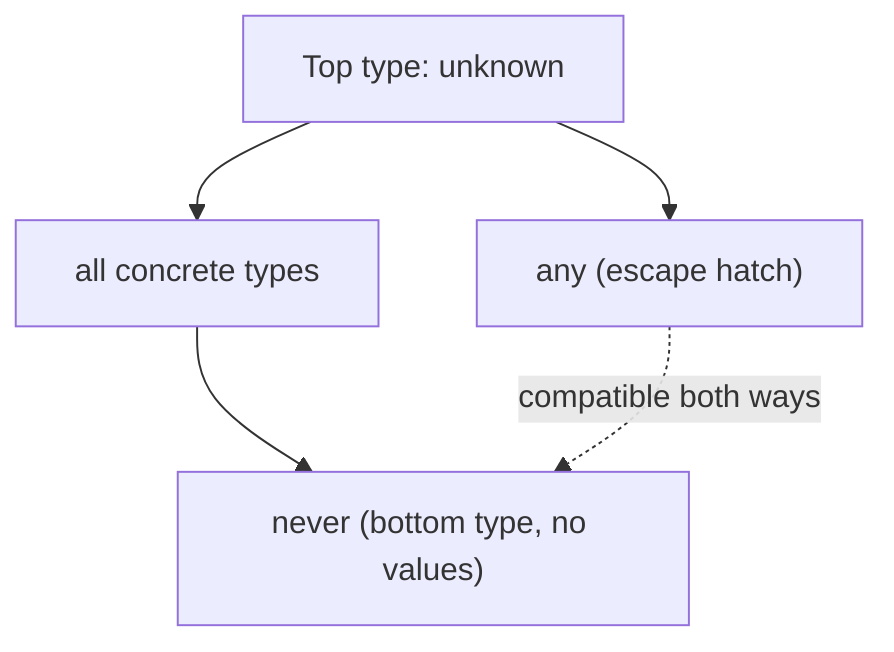
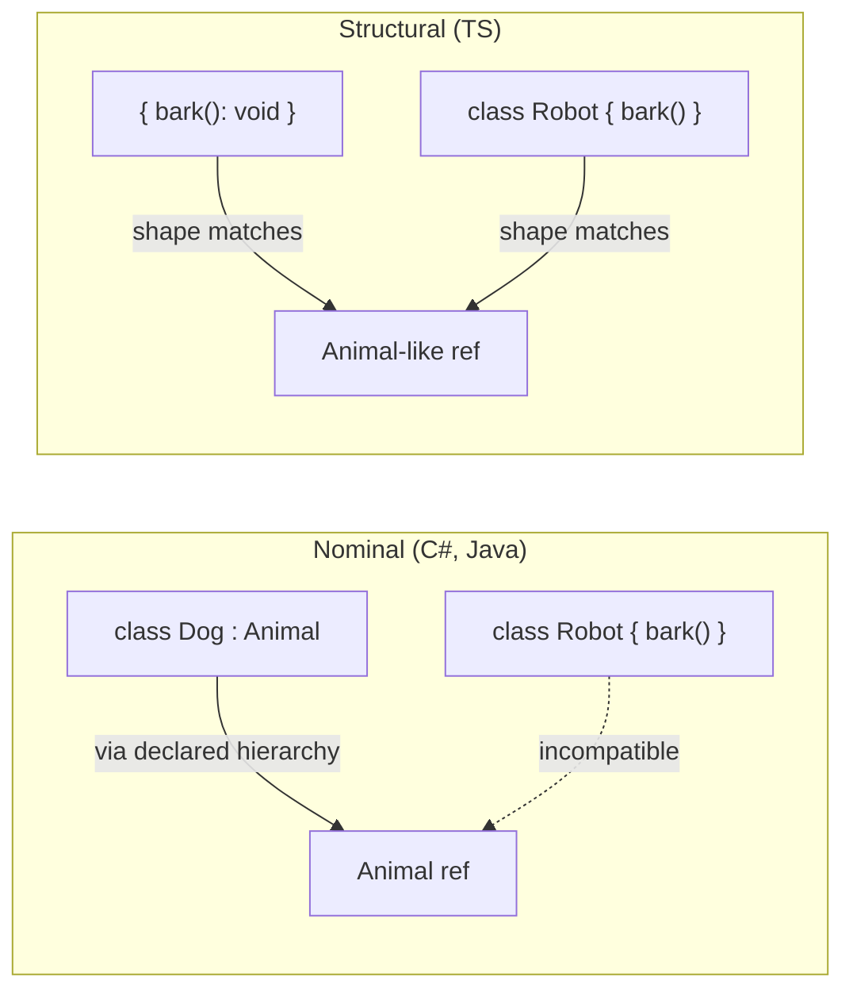
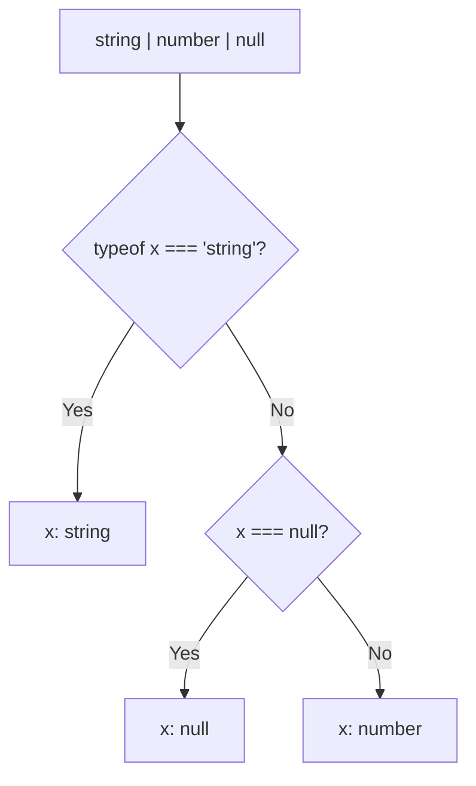

# TypeScript Interview — Quick Revision Notes (Senior / Lead)

> Quick-revision notes derived from the TypeScript Interview Guide. Covers every section and sub-topic in the same order, condensed into Q/A + tight bullets with all key code, tables, and diagrams. The notes alone should be enough to brush up each topic.

---

## 1. Core Concepts

### What is TypeScript and Why Use It

- **What:** Strongly, statically typed **superset of JavaScript** (Microsoft) that transpiles to plain JS. Adds a **structural** type system; types are **erased at compile time** — no runtime behavior change.
- **Why (with the "why"):**
  - **Static typing** → catches wrong property names, argument shapes, null/undefined misuse at compile time, not in prod.
  - **OOP features** → classes, interfaces, generics, access modifiers (but structural, not classical nominal OOP).
  - **Scalability** → makes rename/extract refactors mechanically safe across large Angular apps.
  - **DX** → IntelliSense, go-to-definition, safe auto-refactors.
  - **Self-documenting APIs** → signatures communicate contract.
- **Senior nuance:** TS's type system is **unsound by design** in places (`any`, type assertions, unchecked index access, bivariant method params) — a pragmatic trade-off for JS compatibility. Be ready to name *where* it's unsound and how to tighten it (strict flags).

### Toolchain Basics

- `npm install -g typescript`; `tsc -v`; `tsc file.ts` → emits `file.js`.
- `tsconfig.json` is central compiler config. Minimal:

```json
{ "compilerOptions": { "target": "ES6", "strict": true } }
```

- Real production config looks like:

```json
{
  "compilerOptions": {
    "target": "ES2022",
    "module": "ESNext",
    "moduleResolution": "Bundler",
    "lib": ["ES2022", "DOM"],
    "strict": true,
    "noUncheckedIndexedAccess": true,
    "exactOptionalPropertyTypes": true,
    "esModuleInterop": true,
    "skipLibCheck": true,
    "isolatedModules": true,
    "forceConsistentCasingInFileNames": true,
    "declaration": true,
    "sourceMap": true
  }
}
```

- Know *why* each strict flag matters, not just that `strict: true` exists.

### Primitive & Special Types

- **Primitives:** `string`, `number`, `boolean`, `null`, `undefined`, `bigint`, `symbol`.
- **Special:** `any` (disables checking), `unknown` (type-safe `any`), `void` (returns nothing), `never` (never returns / impossible value).

### any vs unknown vs never vs void

| Type | Meaning | Assignable **to** others? | Assignable **from** others? | Use |
|---|---|---|---|---|
| `any` | Turn off type checker | Yes, to anything | Yes, from anything | Legacy JS interop, last resort |
| `unknown` | Could be anything, prove before use | No (without narrowing) | Yes, from anything | Untrusted input (API, `JSON.parse`, catch) |
| `void` | No meaningful return | Only to `void`/`any`/`undefined` | N/A (return position) | Callback/function return type |
| `never` | Unreachable / no value satisfies it | Assignable to everything (bottom) | Nothing except `never` | Exhaustiveness, always-throw/infinite-loop |



- **Gotcha:** `any` is *both* top and bottom type simultaneously — breaks type theory on purpose, which is why it's dangerous.
- **Q: Why does `unknown` exist if we have `any`?** A: `unknown` forces narrowing before any operation, preserving soundness while still allowing "unknown yet" at I/O boundaries. Introduced TS 3.0.

### Type Inference vs Type Annotation

- Inference: `let message = "Hello";` → `string`. Annotation: `let age: number = 25;`.
- **Senior nuance:** prefer inference for locals; use **explicit annotations at module boundaries** (params, exported return types, public members) — inference at a boundary can silently widen/narrow as the impl changes, breaking consumers with no visible signal.

### Type Assertions

```typescript
let someValue: any = "Hello";
let strLength: number = (someValue as string).length;
```

- `as` = "trust me," **zero runtime validation**. `as unknown as T` (double assertion) bypasses even assertion-compatibility checks — a code smell.
- Prefer type guards / validators (`zod`, `io-ts`) whenever data crosses a runtime boundary (HTTP, `localStorage`, third-party libs).

### Type Aliases vs Interfaces

| Feature | Interface | Type Alias |
|---|---|---|
| Extending | `extends`, multiple inheritance | Via intersection `&` |
| Declaration merging | Yes | No |
| Object shapes | Yes | Yes |
| Unions/primitives/tuples | No | Yes |
| Mapped/conditional types | No | Yes |
| Perf (large unions) | Generally faster | Can be slower |

- **Correction:** "type aliases not extendable" is misleading — they compose via intersections (`type C = A & B`).
- **Default:** `interface` for public object/class contracts you expect extended/merged (DTOs, Angular `@Input` bags); `type` for unions, tuples, function signatures, mapped/conditional utilities. Both are structurally interchangeable (interface can extend a type and vice versa).

### Optional & Readonly Properties

```typescript
interface Employee { name: string; age?: number; }   // optional
interface Car { readonly model: string; }             // no reassign after creation
```

- **Gotcha:** `readonly` is **shallow** — prevents rebinding the property, not mutating a nested object/array. Use `Readonly<T>` / custom `DeepReadonly` / immer for deep immutability.

### Function & Method Overloading

```typescript
function add(a: number, b: number): number;
function add(a: string, b: string): string;
function add(a: any, b: any) { return a + b; }
```

- TS overloads are **compile-time only** — one real JS function underneath (the implementation signature isn't visible to callers).
- **vs C#:** C# overloads are genuinely distinct methods resolved by the runtime binder. TS describes *call-site shapes* for a single implementation.

---

## 2. Intermediate

### Functions: Regular vs Arrow, Default & Rest Params

| Feature | Regular | Arrow |
|---|---|---|
| `this` binding | Dynamic (caller) | Lexical (enclosing scope) |
| `arguments` object | Yes | No |
| Use in classes | Overridable methods | Callbacks needing captured `this` |
| Hoisting | Declarations hoist | `const` arrows don't |
| `new`-able | Yes | No |

```typescript
function greet(name: string = "Guest") { console.log(`Hello, ${name}`); }
function sum(...numbers: number[]) { return numbers.reduce((a, n) => a + n, 0); }
```

- **Angular gotcha:** arrow class properties (`onClick = () => {}`) bind `this` for templates but create a **new function per instance** (memory/perf) and break `@HostListener`/decorator binding, which needs a real prototype method.

### Union, Intersection & Literal Types

```typescript
let value: string | number;
type C = A & B;                       // intersection
type Direction = "North" | "South" | "East" | "West";  // literal union
```

- **Gotcha:** intersecting conflicting property types (`{ a: string } & { a: number }`) collapses that key to `never`, not an error.

### Tuples

```typescript
let person: [string, number] = ["Alice", 25];
let numbers: readonly [number, number] = [10, 20];
```

- **Labeled tuples** (docs only): `type Point = [x: number, y: number];`
- **Variadic tuples** (typed bind/curry):

```typescript
type Concat<T extends unknown[], U extends unknown[]> = [...T, ...U];
type Result = Concat<[1, 2], [3, 4]>; // [1, 2, 3, 4]
```

### ReadonlyArray\<T\> / readonly T[] as Defensive API Design

- **Problem:** a plain `T[]` param says nothing about mutation; a function can `sort()`/`push()` the caller's live array silently.

```typescript
function printTotal(prices: readonly number[]): number {
  // prices.sort(...);  // Error: sort not on readonly number[]
  return [...prices].sort((a, b) => a - b).reduce((s, p) => s + p, 0); // copy first
}
```

- `readonly T[]` ≡ `ReadonlyArray<T>` — **omits** every mutating method (`push`, `pop`, `splice`, `sort`, `reverse`, `fill`, index-assign). **Compile-time only** (no `Object.freeze`).
- A mutable `T[]` is assignable **into** `readonly T[]`, but not back (that's the direction you want for a defensive param):

```typescript
const ro: readonly number[] = [1, 2, 3]; // OK from mutable
// mutable = ro;                          // Error
```

- **Why senior:** documents intent in the signature, compiler-enforced; complements `OnPush`/immutable-state (won't be the source of an accidental mutation defeating reference-equality change detection). **Shallow** — `readonly Point[]` doesn't stop `arr[0].x = 5`; use `ReadonlyArray<Readonly<Point>>`. `map`/`filter`/`slice`/`reduce` still work (non-mutating).

### Enums, and Why Senior Devs Avoid Them

```typescript
enum Color { Red, Green, Blue }
let c: Color = Color.Green;
```

- **Problems:** numeric enums aren't type-safe against arbitrary numbers (any `number` is assignable); enums emit real runtime objects (reverse-mapping) adding bundle size unless `const enum` — but `const enum` is **unsupported under `isolatedModules`** (required by esbuild/swc/Vite/Angular 17+) and banned for ESM-only builds; they don't tree-shake cleanly.
- **Modern replacement — literal unions** (+ optional `satisfies`-checked map):

```typescript
type Color = "red" | "green" | "blue";
const ColorValues = { Red: "red", Green: "green", Blue: "blue" }
  as const satisfies Record<string, Color>;
```

- Gives exhaustiveness, zero runtime cost, full type safety.

### Structural Typing vs Nominal Typing

- **C#/Java = nominal:** identical members are still incompatible unless explicitly related; identity by declared name.
- **TypeScript = structural (compile-time duck typing):** compatible if *shapes* match, regardless of name/declared relationship.

```typescript
interface Point2D { x: number; y: number; }
class Vector { x = 0; y = 0; }
function log(p: Point2D) {}
log(new Vector());       // OK — same shape
log({ x: 1, y: 2 });     // OK
```



- **Consequences:**
  - **Excess property checks** fire only on **object literals assigned directly**: `log({x,y,z})` errors, but `const p = {x,y,z}; log(p)` compiles (structural assignability, not literal freshness). Classic gotcha.
  - **private/protected members** create a nominal-ish exception: two classes with identically-named privates from *different* declarations are NOT compatible.
  - `unique symbol` and **branded types** (`string & { __brand: "UserId" }`) simulate nominal typing to prevent mixing structurally-identical types.

### Branded/Nominal Typing — Full Worked Example

- **Problem:** `UserId` and `OrderId` both alias `string`; structural typing lets you pass one for the other silently.
- **Fix — branded type + constructor function:**

```typescript
type UserId = string & { readonly __brand: 'UserId' };
type OrderId = string & { readonly __brand: 'OrderId' };

function toUserId(raw: string): UserId {
  if (!raw) throw new Error('UserId cannot be empty');
  return raw as UserId; // the one deliberate, encapsulated assertion
}
function getUser(id: UserId): void {}

getUser(toUserId('usr_123'));  // OK
getUser(toOrderId('ord_456')); // Error: OrderId not assignable to UserId
getUser('usr_789');            // Error: raw string isn't a UserId
```

- **Why it works:** the phantom `__brand` property no real string has means the only way to make a `UserId` is via an explicit assertion, confined to one constructor per brand → the brand becomes "proof this was validated." `__brand` is **erased at runtime** (zero cost).
- **Why senior:** the practical fix for **primitive obsession** bugs (`CustomerId` vs `ProductId`, cents vs dollars) that plain `string`/`number` can't catch. TS needs branding *because* it's structural; C# gets this free via nominal types.
- **Variant:** `unique symbol` brand key avoids literal-tag collisions across modules:

```typescript
declare const userIdBrand: unique symbol;
type UserId = string & { readonly [userIdBrand]: void };
```

### Type Narrowing & Type Guards

```typescript
function isString(value: any): value is string { return typeof value === "string"; }
```

- **Full narrowing toolkit:**

| Mechanism | Example | Notes |
|---|---|---|
| `typeof` | `typeof x === "string"` | `typeof null === "object"` |
| `instanceof` | `x instanceof MyClass` | Class instances only |
| `in` | `"prop" in obj` | Narrows by key presence |
| Truthiness | `if (x)` | Careful with valid `0`/`""` |
| Equality | `if (x === "a")` | Narrows literal unions |
| Discriminant | `if (shape.kind === "circle")` | See below |
| Type predicate | `x is Foo` | Custom runtime logic |
| Assertion function | `asserts x is string` | Narrows for **rest of scope** after call |



- **Assertion functions** (most-forgotten):

```typescript
function assertIsDefined<T>(val: T): asserts val is NonNullable<T> {
  if (val == null) throw new Error("Expected value to be defined");
}
```

### Discriminated Unions & Exhaustiveness Checking

```typescript
interface Square { kind: "square"; size: number; }
interface Circle { kind: "circle"; radius: number; }
interface Triangle { kind: "triangle"; base: number; height: number; }
type Shape = Square | Circle | Triangle;

function area(shape: Shape): number {
  switch (shape.kind) {
    case "square":   return shape.size ** 2;
    case "circle":   return Math.PI * shape.radius ** 2;
    case "triangle": return (shape.base * shape.height) / 2;
    default:
      const _exhaustive: never = shape; // fails to compile if a case is missing
      return _exhaustive;
  }
}
```

- **Why:** without the `never` guard, adding a `Triangle` and forgetting a case compiles silently and returns `undefined`. Top-tier seniority signal.

### Optional Chaining & Nullish Coalescing

```typescript
obj.user?.profile?.name;   // undefined if any link missing
name ?? "Default Name";    // only null/undefined trigger the default
```

- **Gotcha:** `??` vs `||` — `0`, `""`, `false` are valid under `??` but wrongly replaced by `||`. Classic migration bug.

### strictNullChecks and the strict Family of Flags

- `strict: true` bundles (at minimum):

| Flag | Effect | Impact |
|---|---|---|
| `strictNullChecks` | null/undefined not in every type | Biggest bug-catcher; forces `T \| null` + narrowing |
| `noImplicitAny` | Errors on inferred `any` | Prevents silent holes |
| `strictFunctionTypes` | Params checked contravariantly | Prevents unsound function assignment |
| `strictBindCallApply` | Type-checks `.bind/.call/.apply` | Catches wrong-arg bugs |
| `strictPropertyInitialization` | Class props must init | Angular DI fields need `!` or ctor init |
| `noImplicitThis` | Errors on implicit-any `this` | Callbacks |
| `alwaysStrict` | Emits `"use strict"` | Mostly invisible |
| `useUnknownInCatchVariables` | `catch (e)` is `unknown` | Safe error handling (TS 4.4+) |

- **Not in `strict` but essential:**
  - `noUncheckedIndexedAccess` — `arr[i]`/`record[key]` become `T | undefined` (closes index-signature lie).
  - `exactOptionalPropertyTypes` — distinguishes `{x?: string}` from `{x?: string | undefined}`.
  - `noUnusedLocals`/`noUnusedParameters` — hygiene.
  - `noFallthroughCasesInSwitch` — catches missing `break`.
- **Q: Disable `strictNullChecks` to unblock migration — what's lost?** A: compile-time guarantees on every nullable path; every `.foo` on a possibly-null value becomes a latent `TypeError`, and modern `.d.ts` files assume it's on → worse inference.

---

## 3. Advanced (Generics & the Type System)

### Generics & Generic Constraints

```typescript
function identity<T>(arg: T): T { return arg; }
function printLength<T extends { length: number }>(arg: T) { console.log(arg.length); }

// Defaults + interdependent params (typed reducers/HTTP clients):
function get<T, K extends keyof T = keyof T>(obj: T, key: K): T[K] { return obj[key]; }
```

### Generic Variance (Covariance/Contravariance)

- Bridges C# `in`/`out` (`IEnumerable<out T>`, `IComparer<in T>`).
- **Covariance:** `Dog[]` treated as subtype of `Animal[]`. TS says yes for arrays/return positions — **technically unsound** (could push a `Cat`) but pragmatic.
- **Contravariance:** function *parameters* narrow safely in the opposite direction. Under `strictFunctionTypes`, standalone function-type params are checked contravariantly, catching the unsound case:

```typescript
type AnimalHandler = (a: Animal) => void;
type DogHandler = (d: Dog) => void;
let handler: AnimalHandler;
// handler = dogHandler; // unsound: could be called with a Cat — rejected under strict
```

- **Quirk:** **method syntax** (`fn(a: Animal): void`) is checked **bivariantly** even under `strictFunctionTypes` (backward compat); **property function syntax** (`fn: (a: Animal) => void`) is contravariant (strict). Obscure but real.
- Unlike C#, **TS has no explicit `in`/`out` annotations on user generics** — variance is inferred structurally from usage.

### keyof, typeof, and Indexed Access Types

```typescript
type User = { id: number; name: string; address: { city: string } };
type UserKeys = keyof User;                // "id" | "name" | "address"
type PersonType = typeof person;           // type from a value
type NameType = User["name"];              // string (indexed access)
type CityType = User["address"]["city"];   // string
type AllValues = User[keyof User];         // number | string | {city: string}
```

### Mapped Types

```typescript
type ReadonlyUser = { readonly [K in keyof User]: User[K] };

// Modifiers (+/-) and key remapping with `as` (TS 4.1+):
type Mutable<T> = { -readonly [K in keyof T]-?: T[K] };
type Getters<T> = { [K in keyof T as `get${Capitalize<string & K>}`]: () => T[K] };
// Getters<{name: string}> => { getName: () => string }
```

### Conditional Types & infer

```typescript
type IsString<T> = T extends string ? "yes" : "no";
type ReturnTypeOf<T> = T extends (...a: any[]) => infer R ? R : never;
```

- **Distributive over unions** (naked type param distributes):

```typescript
type ToArray<T> = T extends any ? T[] : never;
type R = ToArray<string | number>;      // string[] | number[]  (distributed)
type ToArrayND<T> = [T] extends [any] ? T[] : never;
type R2 = ToArrayND<string | number>;   // (string | number)[]  (opt-out via tuple)
```

- This is exactly how `Exclude`/`Extract`/`NonNullable` are implemented internally.

### Template Literal Types

```typescript
type Greeting = `Hello, ${string}!`;
type HandlerName = `on${Capitalize<"click" | "hover">}`;  // "onClick" | "onHover"
type Loud = Uppercase<"hello">;                           // "HELLO"

// Extract route params:
type ExtractParams<T extends string> =
  T extends `${string}:${infer P}/${infer Rest}` ? P | ExtractParams<Rest>
  : T extends `${string}:${infer P}` ? P : never;
type Params = ExtractParams<"/users/:userId/posts/:postId">; // "userId" | "postId"
```

- Intrinsic string types: `Uppercase`, `Lowercase`, `Capitalize`, `Uncapitalize`.

### Recursive Type Alias Depth Limits (TS2589)

- Compiler expands recursive/conditional types with a hard depth limit (~50 levels, implementation detail). Unbounded recursion → `TS2589: Type instantiation is excessively deep and possibly infinite`.

```typescript
type BuildTuple<N extends number, T extends unknown[] = []> =
  T['length'] extends N ? T : BuildTuple<N, [...T, unknown]>;
type Big = BuildTuple<10000>; // TS2589
```

- Also hits realistic `DeepPartial`/`DeepReadonly` over large/circular domain models (Order ↔ Customer).
- **Why:** unlike a runtime-recursive function, a recursive *type* must be **fully expanded at check time** — each level is a materialized intermediate type; unbounded recursion exhausts the depth budget (or just slows type-checking/IDE).
- **Mitigations:**
  1. **Bound with a depth counter** (tuple/lookup trick):

```typescript
type Prev = [never, 0, 1, 2, 3, 4, 5, 6, 7, 8, 9];
type DeepPartialBounded<T, D extends number = 5> =
  D extends 0 ? T
  : T extends object ? { [K in keyof T]?: DeepPartialBounded<T[K], Prev[D]> } : T;
```

  2. **Break circularity** — model the DTO/view-model shape you need (flat `customerId: string`) instead of walking a circular graph.
  3. **Prefer vetted utilities** (built-ins, `type-fest`'s `PartialDeep`).
  4. **Simplify base case** — opt out of unexpected distribution via `[T] extends [U]` to cut instantiations.
- **Why senior:** it's the cost side of type-level programming — knowing where clever types break down and how to bound them.

### Utility Types Deep Dive

| Utility | Effect | Simplified impl |
|---|---|---|
| `Partial<T>` | All optional | `{ [K in keyof T]?: T[K] }` |
| `Required<T>` | All mandatory | `{ [K in keyof T]-?: T[K] }` |
| `Readonly<T>` | All readonly | `{ readonly [K in keyof T]: T[K] }` |
| `Pick<T, K>` | Subset of keys | `{ [P in K]: T[P] }` |
| `Omit<T, K>` | Remove keys | `Pick<T, Exclude<keyof T, K>>` |
| `Record<K, T>` | Build from key union + value | `{ [P in K]: T }` |
| `NonNullable<T>` | Strip null/undefined | `T extends null\|undefined ? never : T` |
| `Extract<T, U>` | Keep members ⊆ U | `T extends U ? T : never` |
| `Exclude<T, U>` | Remove members ⊆ U | `T extends U ? never : T` |
| `ReturnType<T>` | Return type | `T extends (...a:any[])=>infer R ? R : never` |
| `Parameters<T>` | Param tuple | `T extends (...a:infer P)=>any ? P : never` |
| `InstanceType<T>` | Ctor instance | `T extends new(...a:any[])=>infer R ? R : any` |

- Interviewers ask you to *write* one from scratch (implementations above).
- **Omitted-but-common utilities:**

```typescript
type FetchedUser = Awaited<ReturnType<typeof fetchUser>>; // unwraps Promise (TS 4.5)
type DeepPartial<T> = T extends object
  ? { [K in keyof T]?: DeepPartial<T[K]> } : T;             // not built-in; common "write this"
```

### as const and satisfies

```typescript
const colors = ["red", "green", "blue"] as const; // readonly, literal elements
const person = { name: "Alice", age: 25 } satisfies { name: string; age: number };
```

- **Why `satisfies` (TS 4.9) beats an annotation:** annotation **widens** and loses literal info; `satisfies` **validates the shape but keeps the narrow inferred type**:

```typescript
const c1: Record<string, string | number> = { retries: 3 };
c1.retries; // string | number (widened)
const c2 = { retries: 3, mode: "fast" } satisfies Record<string, string | number>;
c2.retries; // number (preserved!)  c2.mode narrows to "fast"
```

- Idiomatic for typed constant config — beats `as const` alone (no shape check) or annotation alone (loses literals).

### Ambient Declarations, Triple-Slash, Module Augmentation & Declaration Merging

```typescript
declare function jQuery(selector: string): any;   // ambient (.d.ts)
/// <reference path="file.d.ts" />                  // triple-slash directive

declare module "some-library" {                    // module augmentation
  interface SomeInterface { newMethod(): void; }
}

interface Window { customProperty: string; }        // declaration merging
interface Window { anotherProperty: number; }       // Window now has both
```

- **Nuance:** triple-slash is largely legacy (matters for global ambient `.d.ts` with no imports/exports). **Module augmentation** is the modern way to extend third-party module types (e.g., add a property to Express `Request`, extend RxJS operators).

### Decorators & Metadata (Angular Relevance)

```typescript
function Log(target: any, key: string, descriptor: PropertyDescriptor) {
  const original = descriptor.value;
  descriptor.value = function (...args: any[]) {
    console.log(`Calling ${key}`, args);
    return original.apply(this, args);
  };
  return descriptor;
}
class Calculator { @Log add(a: number, b: number) { return a + b; } }
```

- **Angular:** `@Component`/`@Injectable`/`@Input` + **`reflect-metadata`** + `emitDecoratorMetadata`/`experimentalDecorators`. DI reads emitted constructor param-type metadata at runtime — *why Angular DI breaks with an interface as an injection token* (interfaces are erased → no runtime metadata; use a class or `InjectionToken`).
- **TS 5.0+ standard (Stage 3 TC39) decorators** differ from legacy `experimentalDecorators`: new decorators are plain functions receiving `(value, context)` instead of `(target, key, descriptor)`, don't rely on `reflect-metadata`, compose differently. Mixing both models in one project causes compile errors. Verify current default against your TS/Angular versions.
- `@Inject(TOKEN)` (param) and `@Input()` (property) are sugar over `Object.defineProperty`/ctor param interception.

### Module Resolution: ESM vs CommonJS

| Aspect | CommonJS | ES Modules |
|---|---|---|
| Syntax | `require`/`module.exports` | `import`/`export` |
| Loading | Sync, runtime | Static, compile-time (tree-shaking) |
| Top-level `this` | `module.exports` | `undefined` |
| Node signal | `.cjs` / `"type":"commonjs"` | `.mjs` / `"type":"module"` |
| Interop | — | `esModuleInterop`/`allowSyntheticDefaultImports` |
| `tsconfig module` | `CommonJS` | `ESNext`/`NodeNext`/`Bundler` |

- **Gotchas:**
  - `moduleResolution: "Bundler"` (TS 5.0+) for Angular/Vite/webpack (bundler resolves, supports `exports` map); `"NodeNext"` for real Node backends (matches Node's ESM resolution, mandatory file extensions in relative imports).
  - Tree-shaking needs **static, analyzable ESM** — dynamic `require()` / CJS re-export defeats it.
  - Angular CLI (esbuild since v17) expects ESM; a transitive CJS dep triggers `CommonJS or AMD dependencies can cause optimization bailouts`.

---

## 4. OOP in TypeScript

### Access Modifiers

```typescript
class Person {
  public name: string;
  private age: number;
  protected address: string;
}
```

| Modifier | Scope |
|---|---|
| `public` (default) | Anywhere |
| `private` | Same class only |
| `protected` | Class + subclasses |

- **vs C#:** TS `private`/`protected` are **compile-time only** — erased in JS; accessible via `instance["age"]` or `JSON.stringify`. For **true runtime privacy** use JS `#privateFields`:

```typescript
class Account {
  #balance = 0;                 // truly private at runtime, invisible to Object.keys()
  deposit(a: number) { this.#balance += a; }
}
```

### Inheritance, Overriding, super

```typescript
class Child extends Parent {
  greet() { super.greet(); console.log("Hello from Child"); }
}
```

- **`override` keyword (TS 4.3+)** + `noImplicitOverride`: without it, renaming/removing a base method silently orphans the subclass "override" into a new unrelated method. `override greet()` makes the compiler verify the base method exists.

### Abstract Classes vs Interfaces

| Feature | Abstract Class | Interface |
|---|---|---|
| Methods | Concrete + abstract | Signatures only |
| Instantiation | No | No (not even a "type") |
| Properties | With defaults/init logic | Type defs only |
| Multiple inheritance | No (single) | Yes (`extends A, B`) |
| Runtime existence | Yes (real JS class) | No (fully erased) |
| Constructors | Yes | No |

- **Choose:** abstract class for shared reusable implementation (template-method); interface for a pure contract, especially when unrelated classes must satisfy it (structural, multiple implementation, no single-inheritance limit).

### Multiple Interface Implementation & Interface Extension

```typescript
interface C extends A, B { c: boolean; }
class MyClass implements X, Y { /* aMethod, bMethod */ }

class AnimalBase { name = ""; }
interface Dog extends AnimalBase { breed: string; } // interface can extend a class
```

- **Gotcha:** `implements` checks only the **public** shape, doesn't enforce privates, no runtime check (erased). Don't confuse `implements` (contract check) with inheriting behavior.

### Mixins

```typescript
function Mixin<T extends new (...args: any[]) => {}>(Base: T) {
  return class extends Base { mixinMethod() { console.log("Mixin method"); } };
}
const MixedPerson = Mixin(Person);
```

- TS/JS answer to no multiple class inheritance — class-factory functions layered at runtime (like C# extension methods / default interface methods, but not a language feature).

### Private Constructors & Singletons

```typescript
class Singleton {
  private static instance: Singleton;
  private constructor() {}
  static getInstance() {
    return Singleton.instance ??= new Singleton();
  }
}
```

- **Angular:** prefer DI singletons (`@Injectable({ providedIn: 'root' })`) — injector guarantees one instance, is mockable/testable, avoids hidden global static state.

### Index Signatures

```typescript
interface Dictionary { [key: string]: string; }
```

- Pair with `noUncheckedIndexedAccess`: without it, `dict["missing"]` types as `string` though it's `undefined` at runtime → common `undefined.toUpperCase()` crashes.

### The this Type & Polymorphism

```typescript
class Fluent { setName(name: string): this { return this; } }
```

- Returning `this` makes fluent/chainable builders **subclass-safe** — a method returns the *subclass* type on a subclass instance (returning the base type would drop subclass members after chaining).

### Parameter Properties Shorthand

```typescript
class Circle {
  constructor(private radius: number) {}  // declares + assigns in one line
  area() { return Math.PI * this.radius ** 2; }
}
```

- Sugar for declaring `private radius` + `this.radius = radius`. Dominant in Angular/NestJS DI (`constructor(private http: HttpClient) {}`).

---

## 5. Error Handling

### try/catch/finally & Custom Errors

```typescript
try { throw new Error("..."); }
catch (error) { console.log(error.message); }
finally { console.log("Cleanup"); }

class CustomError extends Error {
  constructor(message: string) { super(message); this.name = "CustomError"; }
}
```

- **Gotcha:** subclassing `Error` compiled to **pre-ES2015 targets** can break `instanceof` (ES5 downlevels built-in inheritance). Fix historically: `Object.setPrototypeOf(this, CustomError.prototype)` in ctor. Not needed for `target: ES2015+`.

### Typed Catch Clauses (unknown in catch)

- Since TS 4.4 under `strict` (`useUnknownInCatchVariables`), `catch (error)` is `unknown`, not `any` — because JS can `throw` any value (`throw "x"`, `throw 42`, `throw {code:500}`).

```typescript
try { riskyOperation(); }
catch (error: unknown) {
  if (error instanceof Error) console.log(error.message); // narrowed
  else console.log("Unknown error", error);
}
```

- For structured non-Error throws, pair with a guard:

```typescript
interface ApiError { code: number; message: string; }
function isApiError(e: unknown): e is ApiError {
  return typeof e === "object" && e !== null && "code" in e && "message" in e;
}
```

---

## 6. Performance

### Compiler Performance & Type-Checking Cost

- **Project references** (`references` + `composite: true`) → split into independently type-checked/build-cached projects; incremental builds — critical in Nx/Angular monorepos.
- **`skipLibCheck: true`** → skips checking `node_modules` `.d.ts`, big build-time win; cost: won't catch errors originating in third-party types.
- Deep conditional/recursive types slow the checker / hit the depth limit — trade-off: expressive types vs IDE responsiveness.
- **`isolatedModules: true`** required by single-file transpilers (esbuild, swc, Babel) that transpile without full program info — forbids cross-file-dependent constructs (e.g., re-exporting a type without `export type`).

### Runtime Performance: Erasure, Enums, and Bundle Size

- **Types are 100% erased at runtime** — zero runtime cost for types/generics/interfaces/aliases. Q "does TS make code slower?" → No, *except* constructs that emit runtime code.
- **Emit real runtime code:** numeric/string `enum` (object + reverse map unless `const enum`), decorators + `reflect-metadata`, namespaces (IIFE); parameter properties are negligible.
- Prefer literal unions over enums; prefer `interface`/`type` over `class` when you only need a compile-time shape (every `class` emits ctor/prototype JS; `interface`/`type` emit nothing).

---

## 7. Best Practices

- Turn on `strict` (+ `noUncheckedIndexedAccess` + `exactOptionalPropertyTypes`) from day one — retrofitting is far costlier.
- Prefer `unknown` over `any` at every I/O boundary; narrow explicitly.
- Prefer literal unions over `enum`; reserve `const enum` only when you fully control the build and don't need ESM/`isolatedModules`.
- Use discriminated unions + `never` exhaustiveness for multi-variant domain modeling (API responses, NgRx actions, state machines).
- Use `satisfies` for typed constant objects/config to keep literal precision.
- Validate untrusted data at runtime with a schema lib (`zod`, `io-ts`, class-validator) — types don't exist at runtime.
- Keep boundary types explicit (params, exported return types); let inference handle internals.
- Avoid `as`; never chain `as unknown as T` without a justifying comment.
- Use `readonly`/`Readonly<T>` on inputs you won't mutate; prefer immutable updates (spread, `structuredClone`, immer), especially in change-detection-sensitive Angular code.
- Enable `noImplicitOverride` on any class hierarchy to catch silent override drift.

---

## 8. Common Pitfalls

- Using `any` to "fix the red squiggly" instead of `unknown` + narrowing.
- Assuming `readonly` is deep — it's shallow.
- Forgetting exhaustiveness checks — new variant compiles silently, returns `undefined`.
- Confusing `??` with `||` (`0`/`""`/`false`).
- Excess-property blind spot — assigning via an intermediate variable bypasses literal freshness checks.
- Relying on `private`/`protected` for runtime hiding — they're compile-time only; use `#fields`.
- `const enum` + `isolatedModules`/modern bundlers — incompatible, confusing build errors.
- Assuming index signatures guarantee presence — without `noUncheckedIndexedAccess`, `dict[key]` hides `undefined` risk.
- Assuming caught errors are always `Error` — `throw` accepts any value; `error.message` without narrowing crashes.
- Mixing legacy (`experimentalDecorators`) and standard (TS 5+) decorators.
- Over-engineering recursive conditional types that tank IDE/compiler performance for marginal gain.

---

## 9. Sample Interview Q&A

**Q: `unknown` over `any` for parsing an external API response?**
A: `any` disables checking → wrong access compiles, bug deferred to runtime. `unknown` forces narrowing (typeof/guard/`zod`) before use, so the compiler catches unsafe use of unvalidated external data at exactly the boundary where malformed-payload bugs are costliest.

**Q: Guarantee a `switch` over a discriminated union stays exhaustive?**
A: `default` branch assigns the narrowed value to a `never`-typed variable. All cases handled → union narrowed to `never` → compiles. Missing case → unhandled variant remains, `never` assignment errors → build failure instead of silent runtime bug.

**Q: `interface` vs `type` today, which do you default to?**
A: Both describe object shapes and are structurally interchangeable. Interfaces: declaration merging + `extends` multiple inheritance. Type aliases: unions, tuples, mapped/conditional types. Default `interface` for extensible/mergeable object contracts (DTOs, `@Input`s); `type` for unions, function signatures, type-level utilities.

**Q: Team wants to disable `strictNullChecks` for a legacy migration — push back?**
A: Highest-value strict flag. Off → null/undefined implicitly assignable everywhere; compiler can't distinguish guaranteed from possibly-missing across the *whole* codebase, reintroducing `cannot read property of undefined`. Third-party `.d.ts` assume it's on → worse inference. Better: incremental adoption via per-file suppressions / project-reference-scoped rollout, not a blanket disable.

**Q: Explain structural typing + a surprising result.**
A: Compares by shape, not declared name/hierarchy. Surprise: excess property checks fire only on object literals assigned directly; assign to a variable first (widened type) then pass → check doesn't fire, typo'd/extra property slips through (structural assignability, not literal freshness).

**Q: Generics in TS vs C#, and where it matters?**
A: C# generics are reified — CLR knows `T` at runtime (`typeof(T)`, runtime `is T`). TS generics are fully erased — no `T` at runtime; no `new T()` or runtime type-check against `T`. Porting C# generic factories/repositories needs an explicit constructor param (`new (...args: any[]) => T`) or runtime discriminant.

**Q: Risk of `enum` in a modern esbuild Angular app, and what instead?**
A: Non-const enums emit runtime objects with reverse mappings (bundle size, defeats tree-shaking). `const enum` inlines but is incompatible with `isolatedModules`, which esbuild (Angular 17+) requires. Idiomatic replacement: a literal union, optionally `as const satisfies Record<...>` for an iterable value list — same safety, zero runtime cost, full build-tool compatibility.

---

## 10. Summary of Additions

Sections added during consolidation and why they matter for a senior .NET-full-stack + Angular interview:

1. **any vs unknown vs never vs void** — full four-way comparison + top/bottom-type diagram.
2. **Enums, and Why Senior Devs Avoid Them** — downsides (bundle size, `const enum`/`isolatedModules`) + literal-union replacement.
3. **Structural vs Nominal Typing** — the top "coming from C#" question.
4. **strictNullChecks + strict family** — flag-by-flag breakdown incl. flags outside `strict`.
5. **Generic Variance** — bridges C# `in`/`out`.
6. **Decorators & Metadata** — Angular DI's `reflect-metadata` reliance + TS 5 standard-decorators migration risk.
7. **Module Resolution ESM vs CommonJS** — tree-shaking, esbuild/Angular 17+ warnings.
8. **Parameter Properties Shorthand** — used implicitly in source, now explicit.
9. **Typed Catch Clauses** — corrects the try/catch example under strict.
10. **Compiler & Runtime Performance** — build-time and runtime-cost questions.
11. Smaller inline: labeled/variadic tuples, key remapping, distributive conditionals, template-literal `infer`, `Awaited<T>`/`DeepPartial<T>`, `override`, `#privateFields`.

**Imprecisions flagged (corrected, not true contradictions):**
- "Type aliases not extendable" → true only for the `extends` keyword; they compose via intersections (`&`).
- No factual contradictions between duplicate Q&A pairs (keyof/infer/mapped/utility explanations) — de-duplicated and merged.

## 11. Summary of Gaps Additions (This Pass)

Three sections added from a formal gap analysis:

1. **Branded/Nominal Typing — Full Worked Example** (after Structural vs Nominal) — full pattern: `string & { readonly __brand }`, constructor function as the sole sanctioned producer (where validation lives), compiler rejecting a misused `OrderId`, plus the `unique symbol`-brand variant.
2. **ReadonlyArray\<T\> / readonly T[] as Defensive API Design** (after Tuples) — the silent `sort()`-the-caller's-array bug, compile-time-only contract (mutating methods removed, no `Object.freeze`), shallow-immutability boundary.
3. **Recursive Type Alias Depth Limits (TS2589)** (after Template Literal Types) — concrete trigger, the "types must be fully expanded at check time" mechanism, and four mitigations (depth counter, break circularity, vetted libs, opt out of distribution).

All three are self-contained, senior-level additions with working code; core-language mechanics, not Angular-version-dependent.
