# System Design Interview — Quick Revision Notes (.NET Full-Stack, Senior/Lead)

> Quick-revision notes derived from the System Design Interview Guide. Covers every section and sub-topic in the same order — enough to brush up each topic without reopening the guide.

---

## Core Concepts

### What System Design Interviews Actually Test

**Q: At senior/lead level, what are interviewers really checking?**
A: Not pattern names — they check:
- **Requirements clarification** — do you ask read/write ratio, consistency needs, latency SLAs, scale (users, RPS, data) *before* designing?
- **Trade-off reasoning** — every choice (SQL vs NoSQL, sync vs async, strong vs eventual) has a cost; can you articulate it?
- **Depth on demand** — can you zoom into any box without hand-waving?
- **Failure-mode thinking** — what happens when cache is down, queue backs up, replica lags, partition happens?
- **Pragmatism** — knowing when *not* to use a pattern (CQRS/event sourcing/microservices are often wrong for CRUD) is a stronger signal than reaching for the fanciest tool.

**Q: Standard structure for any "design X" question?**
A: **Clarify requirements → estimate scale → high-level architecture → deep-dive on 1–2 hard components → trade-offs/bottlenecks → failure modes & monitoring.**

### Scalability, Availability, Reliability — Definitions That Matter

| Term | Definition | Senior nuance |
|---|---|---|
| **Scalability** | Handle growth by adding resources | Vertical (bigger box) vs horizontal (more boxes). Horizontal is default for web-scale but adds coordination cost (state, sessions, consistency) |
| **Availability** | Responds successfully; "nines" | 99.9% ≈ 8.7 hrs/yr downtime; 99.99% ≈ 52 min/yr. Each extra nine costs disproportionately more |
| **Reliability** | Performs *correctly* over time | Distinct from availability — a system can be "up" but return wrong data (unreliable) |
| **Durability** | Data survives failures once acked | RDS multi-AZ, replication factor, WAL/journaling |
| **Fault tolerance** | Keeps operating despite component failure | Needs redundancy + no SPOF |
| **Latency vs Throughput** | Time/request vs requests/unit time | Optimizing one can hurt other (batching ↑ throughput but ↑ per-item latency) |

**Q: How to design for 99.99% availability?**
A: Eliminate SPOFs (multi-AZ/region), health checks + auto-failover, graceful degradation (serve stale cache not errors), circuit breakers to stop cascades, blast-radius-limiting deploys (canary/blue-green).

### CAP Theorem in Practice

**Q: What does CAP state?**
A: A distributed system can guarantee only **two of three** *during a network partition*: **C**onsistency (every read gets latest write), **A**vailability (every request gets non-error response), **P**artition tolerance (keeps working despite partitions).

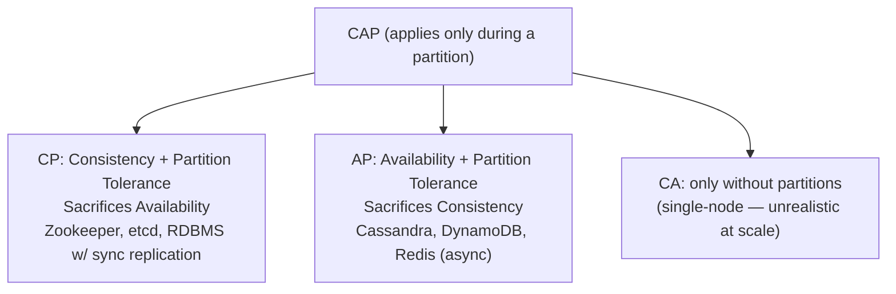

**Q: Why is PACELC the better mental model?**
A: Partitions are rare; latency is the day-to-day trade-off. **P**artition → choose **A** or **C**; **E**lse (normal op) → choose **L**atency or **C**onsistency.
- RDS synchronous multi-AZ: favors C over L (write waits for replica ack).
- CQRS+read-replica architecture = explicit **PA/EL**: normal-op takes lower latency (read replica) over strict consistency (replica lag).

**Q: Concrete AP vs CP example?**
A: "RDS read replicas are AP/eventually-consistent by design; payment write path is CP — can't risk double-charging."

### Back-of-the-Envelope Capacity Estimation

| Quantity | Rule of thumb |
|---|---|
| 1M requests/day | ≈ 12 req/sec average |
| Peak traffic | 2–5x average; design for peak |
| 1 KB × 1M req/day | ≈ 1 GB/day ≈ 30 GB/month |
| SSD read | ~tens of µs–1ms |
| Network RTT, same region | ~0.5–2 ms |
| Network RTT, cross-continent | ~100–150 ms |
| Redis GET | ~0.5–1 ms |
| SQL (indexed) | ~1–10 ms |
| SQL (unindexed/full scan) | ~100ms–seconds |

**Method:** (1) estimate DAU × req/user/day → (2) avg RPS × peak factor (~3x) → (3) storage = `record size × records/day × retention` → (4) bandwidth = `payload × RPS` → (5) decide single DB/server vs caching/replicas/sharding/CDN.

**Example:** 500K DAU × 20 req/day = 10M/day → ÷86,400 ≈ 116 RPS avg → ~350 RPS at 3x peak. Kestrel handles that easily; the **DB is the bottleneck** — which is why caching/read-replicas become necessary, not optional.

---

## Intermediate: Building Blocks

### Caching Strategy

Cache at multiple layers:

**a. In-memory** (single node, small/short-lived):
```csharp
services.AddMemoryCache();
```

**b. Distributed (Redis)** — multi-node; cache DB lookups, dropdowns, tokens. **Cache-aside pattern:**
```csharp
var cached = await _redis.GetStringAsync(key);
if (cached != null) return JsonSerializer.Deserialize<User>(cached);

var user = await _db.Users.FindAsync(id);
await _redis.SetStringAsync(key, JsonSerializer.Serialize(user));
return user;
```

**c. Response caching:**
```csharp
[ResponseCache(Duration = 60)]
```

**Q: Cache invalidation strategies? ("invalidation is the hard part")**

| Strategy | How | Trade-off |
|---|---|---|
| TTL/expiration | Auto-expire after N sec | Simple; serves stale within window |
| Write-through | Write cache + DB synchronously | Always fresh; adds write latency |
| Write-behind (write-back) | Write cache, async flush to DB | Fast writes; data loss if cache crashes pre-flush |
| Explicit invalidation on write | App deletes/updates key after DB write | Most correct; easy to miss a code path (silent staleness) |
| Event-driven invalidation | Publish event on write; subscribers evict | Scales cross-service; adds broker + eventual-consistency lag |

**Q: Cache stampede / thundering herd?**
A: Hot key expires → many concurrent misses hammer DB. Fixes: request coalescing (single in-flight fetch, others await), jittered TTLs (avoid synchronized expiry), probabilistic early refresh.

**Q: Cache-aside vs read-through?**
A: Cache-aside = caching logic in app code (common .NET with `IDistributedCache`/Redis). Read-through = cache sits in front of DB as library/proxy, fetches on miss transparently — less app code, less control. Often used interchangeably in casual talk but different responsibilities.

### Load Balancing

Needed in front of the BFF/API layer in every diagram.

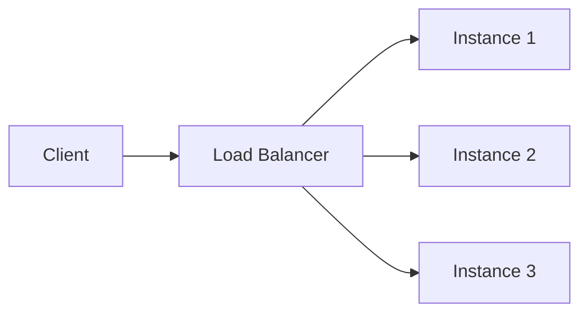

| Algorithm | Behavior | When |
|---|---|---|
| Round robin | Cycles evenly | Uniform cost, stateless |
| Least connections | Fewest active connections | Variable request duration |
| IP hash / consistent hash | Same client → same server | Sticky sessions, cache locality |
| Weighted | Proportional to capacity | Mixed instance sizes, canary rollout |

**Q: L4 vs L7?**
A: **L4** (transport, e.g. AWS NLB) routes on IP/port — fast, protocol-agnostic. **L7** (application, e.g. ALB, Nginx, YARP) routes on HTTP path/headers — enables path-based routing (used in strangler-fig) but adds overhead (terminates/inspects HTTP).

**Health checks matter as much as the algorithm** — LB must detect and stop routing to unhealthy instances (active liveness probes + passive circuit-breaking on repeated failures).

### API Gateway / BFF Pattern

**BFF (Backend for Frontend)** = UI-specific API that Angular talks to exclusively:
- AuthN/AuthZ, aggregates backend calls, shapes responses for UI, decides read vs write path (Command vs Query API).

**Q: Why BFF instead of Angular→microservices directly?**
A: Prevents Angular calling many services directly; centralizes auth (no duplicated token validation); decouples UI iteration from backend structure.

**Q: BFF vs generic API Gateway?**
A: **API Gateway** (Ocelot, YARP, APIM, Kong) = *shared, generic* front door for many consumers (mobile/web/partners) doing routing/auth/rate-limiting. **BFF** = *one per frontend/client type* (web BFF vs mobile BFF) for different response shapes. Common .NET setup: BFF *behind* a shared Gateway — Gateway handles infra concerns (TLS, WAF, global rate limits), BFF handles UI aggregation/shaping. Conflating them is a minor red flag.

### Database Read Replicas

- Horizontal scaling for read traffic; offload reporting/dashboards from primary; improve reads without changing write model.
- **Eventually consistent** — never assume immediate consistency after a write.

### Database Sharding vs Partitioning

**Partitioning** = split one large table/dataset into smaller pieces, can live on the *same* server (e.g. SQL Server partition by date) just for manageability.

**Sharding** = horizontal partitioning where shards live on *different servers/DBs* to scale writes and storage beyond one machine.

| Strategy | How | Pros | Cons |
|---|---|---|---|
| Range-based | Shard by key range (user 1–1M) | Simple, good range queries | Hotspotting if skewed (new users hit last shard) |
| Hash-based | `hash(key) % N` | Even distribution | Resharding painful — changing N remaps almost all |
| Consistent hashing | Ring-based hash | Minimal remapping on resize | More complex |
| Directory-based | Lookup service maps key→shard | Flexible, easy rebalance | Lookup is new SPOF/bottleneck |
| Geo-based | Shard by region/tenant | Data locality, compliance (GDPR) | Cross-region queries expensive |

**Cross-shard problems to raise:** joins need app-level fan-out or denormalization; transactions need sagas or 2PC (both costly); rebalancing (adding a shard) is hardest — reason consistent hashing exists.

**Q: How to shard a multi-tenant SaaS DB?**
A: Shard by `tenant_id` (geo/hash); keep each tenant on one shard to avoid cross-shard joins — biggest simplification available in tenant-based systems.

### Consistent Hashing

**Q: What problem does it solve?**
A: Naive `hash(key) % N` remaps *almost every* key when adding/removing a node → cache/data stampede.

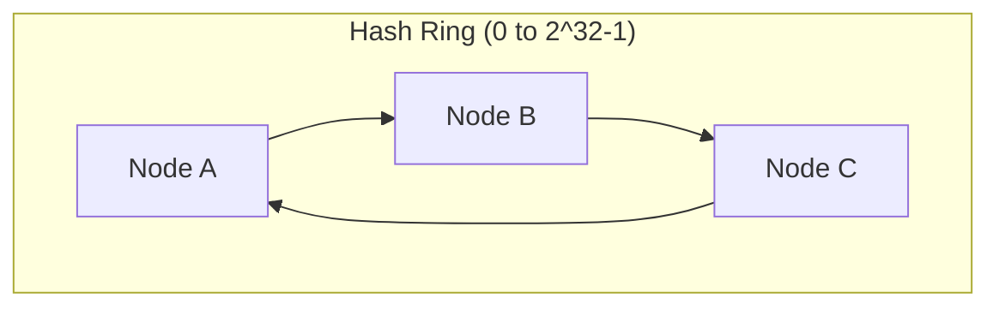

**How:** Nodes and keys hashed onto a circular ring (0 to 2^32-1). A key belongs to first node clockwise. Adding/removing a node only affects keys between it and the *previous* node — not the whole keyspace.

**Virtual nodes:** each physical node gets multiple ring positions (Redis Cluster, DynamoDB, Cassandra) to avoid uneven load with few nodes.

**Where it appears:** Redis Cluster client-side sharding, distributed cache partitioning, LB session affinity, CDN edge-node selection. Signal wanted: *why* it beats modulo, not the ring math.

### Message Queues & Event-Driven Architecture

**Q: Why decouple with a queue vs direct calls?**
A: Producer/consumer scale independently; consumer downtime doesn't block producer (buffering); natural retry/backoff + dead-letter; fan-out (one event → many subscribers) without producer knowing consumers.

**Queue vs Topic/Pub-Sub:**

| | Point-to-point queue | Pub/Sub (topic) |
|---|---|---|
| Consumers | One processes each msg (competing consumers) | Every subscriber gets a copy |
| Example | Azure SB Queue, SQS | Azure SB Topic, Kafka, RabbitMQ fanout |
| Use case | Work distribution (process an order) | Broadcast state change (OrderPlaced → Billing, Shipping, Analytics) |

**Kafka vs RabbitMQ vs Azure Service Bus:**

| | Kafka | RabbitMQ | Azure Service Bus |
|---|---|---|---|
| Model | Distributed log, partitioned, consumer offset | Traditional broker (smart broker/dumb consumer) | Managed broker (queues+topics), enterprise |
| Throughput | Very high (millions/sec) | Moderate-high | Moderate |
| Retention | Retains (replay possible) | Removed once acked | Time-boxed |
| Ordering | Per-partition | Per-queue (mostly) | FIFO sessions |
| Best for | Event streaming, event sourcing, telemetry | Task queues, RPC, complex routing | Enterprise .NET-native, hybrid cloud |
| .NET fit | Confluent.Kafka | RabbitMQ.Client / MassTransit | Azure.Messaging.ServiceBus |

**Q: Delivery guarantees?**
A: Most brokers = **at-least-once** by default (redelivered if ack lost) → **consumers must be idempotent**. True exactly-once is expensive/rare; pragmatic senior answer = "design for at-least-once + idempotent handlers."

---

## Advanced Architecture Patterns

### CQRS + BFF + Read Replicas (Reference Architecture)

**30-sec pitch:** CQRS separates writes and reads. Command APIs do business logic and write to primary RDS; Query APIs serve read-only from RDS replicas. Angular only talks to a BFF (auth, response shaping, routes read vs write). Improves scalability, performance, and separation of UI/domain logic.

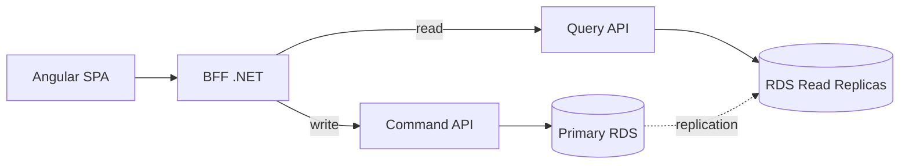

| Layer | Responsibility |
|---|---|
| Angular | UI only, no business logic, calls only BFF |
| BFF | AuthN/AuthZ, aggregates, shapes responses, decides read vs write |
| Command APIs | Business rules, validation, transactions, write to primary RDS |
| Query APIs | Read-only, optimized queries, read from replicas |
| Primary RDS | All writes |
| Read Replicas | All reads |

**Why each piece:** CQRS — writes complex/transactional/strong-consistency, reads frequent/perf-critical/scale faster; separating optimizes each. Replicas — horizontal read scaling, offload reporting, no write-model change. BFF — UI-specific, aggregates, centralizes auth, stops Angular calling many services.

**Q: Read-after-write consistency (replicas are eventually consistent)?**
A: After a write, either (a) return the command response directly (don't re-query) or (b) temporarily read from primary via BFF for that follow-up read. **Never assume replicas are immediately consistent.**

**.NET talking points:** separate Command/Query APIs and separate `DbContext`s; writes = EF Core with change tracking; reads = `.AsNoTracking()` or Dapper; BFF never hits DB directly (always via Command/Query APIs).

**Follow-ups:**
- **"True CQRS?"** — No, *pragmatic* CQRS (separate paths/scaling over same logical DB). Full = event-driven projections in separate read store, added later if read patterns diverge.
- **"Why not Angular→Query APIs directly?"** — Couples UI to backend, duplicates auth, makes UI fragile/expensive.
- **"When avoid?"** — Small CRUD apps / simple admin panels.
- **"How scale?"** — Angular via CDN; BFF/Query APIs scale horizontally; replicas added independently; write side stays controlled.

**Red flags to avoid:** Angular→microservices directly; BFF containing business logic; claiming replicas strongly consistent; single API doing reads+writes at scale.

**Closing line:** "CQRS with a BFF lets us scale reads safely, keep writes consistent, and give the UI exactly what it needs without coupling to backend complexity."

### Monolith → Microservices Migration (Strangler Fig)

**1. Start with why** — validate need first. Valid reasons: independent deploy (Orders/Billing/Inventory), different scale needs (Search vs Admin), team autonomy, tech heterogeneity. If none, **a modular monolith may be enough** (say this — signals maturity).

**2. Identify boundaries (DDD bounded contexts)** — Orders, Payments, Catalog, Shipping, each own model. Look at: separate teams? schemas? modules that change together?
> "I use domain & change boundaries (DDD bounded contexts) to decide microservices, not controllers or tables."

**3. Strangler Fig — never big-bang rewrite:**
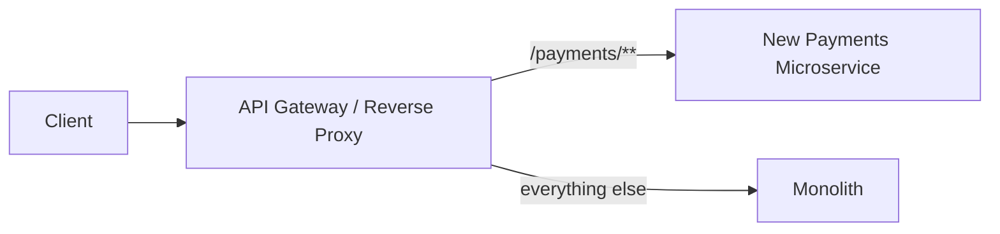
Gateway in front (YARP/Ocelot/Nginx/APIM) → route all to monolith initially → extract one capability (Payments) → route `/payments/**` to new service, rest to monolith → repeat until monolith is hollow.

**4. Prepare the monolith (modularize first)** — separate projects (`MyApp.Orders`, etc.), clear interfaces (app services, events), tests around critical flows. Makes extraction close to "cut & paste + adapt."

**5. Extract one service end-to-end** (e.g. Orders): new repo + own CI/CD; separate data (new DB/schema, or temp: same DB but only that service writes its tables); expose API (`POST /orders`); update callers via gateway; turn off old monolith code once stable; repeat.

**6. Data migration (hardest part):** DB-per-service is the goal. Path: shared DB with isolated ownership → move gradually via ETL/one-time migration or CDC/event streams. For cross-service consistency, **prefer event-driven/eventual consistency over distributed transactions**; use Outbox + Saga/process-manager for complex workflows (Order+Payment+Inventory).

**7. Platform components while extracting:** API Gateway (routing/auth/rate-limit/shaping); service comms (REST/gRPC + broker RabbitMQ/Kafka/Service Bus); observability (Serilog+ELK/App Insights, correlation IDs/tracing, metrics/health checks); CI/CD per service.

**8. Deployment & risk:** start with one small low-risk module (Notifications); feature toggles; canary/blue-green; rollback plan (gateway flips back to monolith fast).

**9. Pitfalls:** too fine-grained → chatty/high-latency; shared DB forever → distributed monolith; no observability → debugging nightmare; tech explosion → ops complexity.

**Short version:** "No big-bang rewrite. Identify bounded contexts, modularize monolith, put API gateway in front, follow Strangler Fig to extract one capability at a time into ASP.NET Core microservices with own data. Some may share DB initially; long-term each owns its schema. Add centralized logging/tracing/CI-CD per service, prefer async event-driven + eventual consistency. Incremental = lower risk, deliver value while migrating."

### CQRS & Event Sourcing (Full Pattern)

**Full CQRS:** write and read sides use *physically different stores/schemas*. Write side = source-of-truth (often event stream); read side = denormalized "projections" per query, updated async by consuming events.

**Event Sourcing:** store the *sequence of events* (`OrderCreated`, `ItemAdded`, `OrderShipped`) not current state. Current state = replay events (or snapshot + recent events).

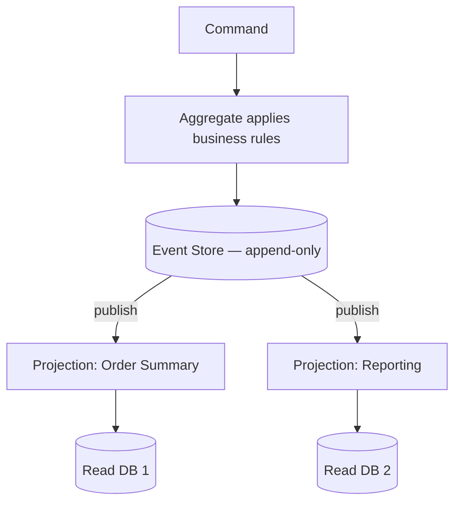

**Trade-offs (what's really tested):**

| Benefit | Cost |
|---|---|
| Full audit trail / temporal queries | Significant complexity (underestimated) |
| Read models tailored per query | Eventual consistency between write and every read model |
| Natural fit for event-driven integration | Replaying large streams needs snapshotting |
| Decouples read scaling from write scaling | Event schema evolution = ongoing versioning tax |

**Guidance:** don't default to it. Earns complexity when audit/temporal is first-class, or read requirements too varied for one write model. For most systems (incl. the CQRS+BFF+RDS above), pragmatic CQRS with sync replicas is right — full event sourcing is the escalation path, not the start.

### Outbox Pattern & Transactional Messaging

**Q: Problem it solves?**
A: The **dual-write problem** — must update DB *and* publish an event atomically, but a DB transaction and a broker publish can't share one ACID transaction. Publish-first + DB fail = consumers act on a phantom event; DB-first + publish fail = downstream never learns.

**Solution:** Write the event to an `Outbox` table *in the same DB transaction* as the business change. A separate background process (or CDC like Debezium) polls the outbox, publishes to the broker, marks sent.

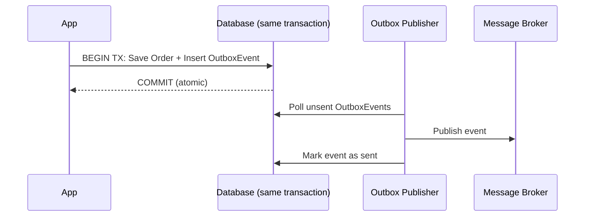

**.NET notes:** EF Core `SaveChangesAsync()` writes business entity + `OutboxMessage` row in one transaction. A `BackgroundService`/Hangfire job (or CDC) polls, publishes to Kafka/RabbitMQ/Service Bus, updates status. Guarantees **at-least-once** → consumer must be idempotent (publisher may retry).

### Sagas / Distributed Transactions

**Q: Why not 2PC (two-phase commit)?**
A: Works but all participants hold locks until every participant votes commit → doesn't scale across services/network, tight coupling + availability risk (one slow service blocks all). Virtually no modern microservices use 2PC.

**Saga:** break distributed transaction into a sequence of local transactions, each with a **compensating action** to undo if a later step fails.

| Style | How | Trade-off |
|---|---|---|
| **Choreography** | Each service publishes events; others react (no coordinator) | Simple for few steps; hard to trace as steps grow |
| **Orchestration** | Central orchestrator calls each step, issues compensations | Clear/testable/traceable; orchestrator is a new component to build/scale/monitor |

**Worked example — Order+Payment+Inventory:**
1. Order created (`Pending`) → publishes `OrderCreated`
2. Payment charges → `PaymentCompleted`/`PaymentFailed`
3. If completed: Inventory reserves → `StockReserved`/`StockUnavailable`
4. If unavailable: compensate — Payment refunds, Order → `Cancelled`

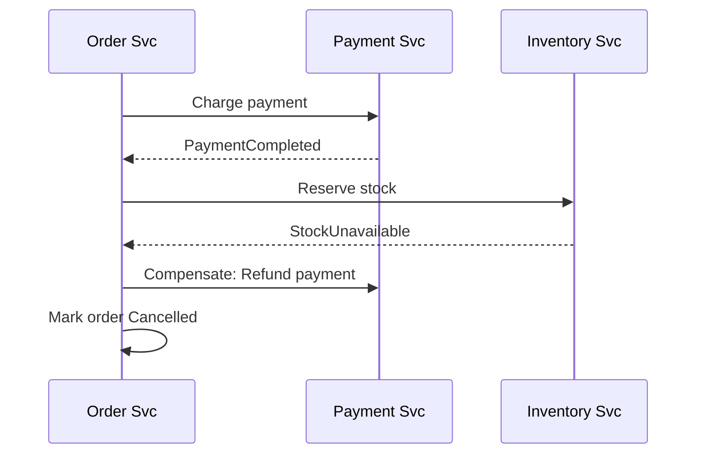

**Q: What if a compensating action itself fails?**
A: Honest hard part. Compensations must be retried (idempotent + backoff); if retries exhaust → dead-letter queue for manual/ops intervention. No fully automatic answer to "what if undo also fails" — acknowledging this is a strong signal.

### Resilience Patterns: Circuit Breaker, Retry, Bulkhead (Polly)

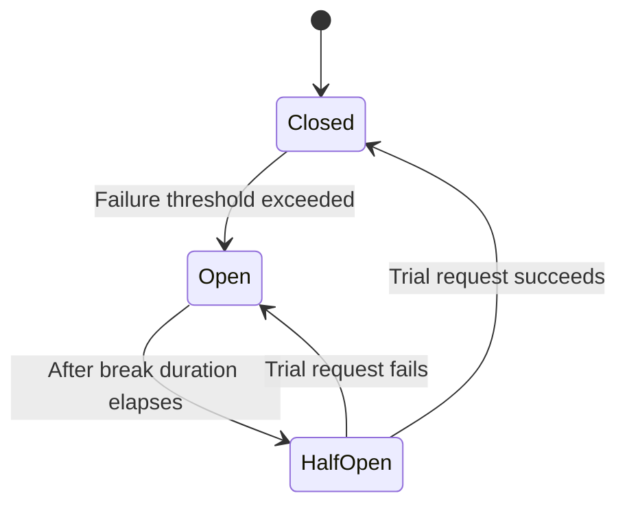

- **Retry** — re-attempt transient failures, with **exponential backoff + jitter** (jitter avoids synchronized retry storms).
- **Circuit Breaker** — after N failures, "open" and fail fast for a cooldown instead of hammering a struggling dependency; then allow a trial ("half-open") request.
- **Bulkhead isolation** — cap concurrent calls/resources per dependency so one slow downstream can't exhaust thread/connection pool and take down unrelated features.
- **Timeout** — always pair with the above; retry/breaker without timeout just waits longer to fail.

**Polly v8 (resilience pipelines):**
```csharp
var pipeline = new ResiliencePipelineBuilder<HttpResponseMessage>()
    .AddRetry(new RetryStrategyOptions<HttpResponseMessage>
    {
        MaxRetryAttempts = 3,
        BackoffType = DelayBackoffType.Exponential,
        UseJitter = true
    })
    .AddCircuitBreaker(new CircuitBreakerStrategyOptions<HttpResponseMessage>
    {
        FailureRatio = 0.5,
        SamplingDuration = TimeSpan.FromSeconds(30),
        BreakDuration = TimeSpan.FromSeconds(15)
    })
    .AddTimeout(TimeSpan.FromSeconds(5))
    .Build();
```
Integrates with `HttpClientFactory` via `Microsoft.Extensions.Http.Resilience` → `AddStandardResilienceHandler()`.

**Framing:** "I wrap outbound calls with Polly: retry w/ exp backoff+jitter for transient faults, circuit breaker to fail fast, timeout to never wait forever, bulkhead so a slow third-party can't starve threads for unrelated features."

### Idempotency Keys

**Q: Why needed?**
A: At-least-once delivery (Outbox/queues) + retries (Polly) mean the *same* operation can fire more than once; non-idempotent handlers ("charge card", "send email") double-execute.

**Pattern:** Client generates a unique key (GUID) per logical operation, sends in header (`Idempotency-Key`). Server stores completed keys + responses in a fast store (Redis/DB unique index) for a retention window. On retry with same key → return cached response, don't re-execute.

```csharp
[HttpPost("payments")]
public async Task<IActionResult> ChargeCard(
    [FromHeader(Name = "Idempotency-Key")] string idempotencyKey,
    PaymentRequest request)
{
    var existing = await _idempotencyStore.GetAsync(idempotencyKey);
    if (existing is not null) return Ok(existing.Response); // replay, don't re-execute

    var result = await _paymentService.ChargeAsync(request);
    await _idempotencyStore.SaveAsync(idempotencyKey, result);
    return Ok(result);
}
```

**Where it matters:** payment APIs, order creation, any non-idempotent POST, message consumers on at-least-once queues.

**Q: Isn't a DB unique constraint enough?**
A: Sometimes, if there's a natural business key (`OrderId` unique prevents dup orders). Idempotency keys are the general solution when there's no natural key, or when you must return the *exact original response* on retry (not just prevent a dup row).

### Rate Limiting Algorithms

| Algorithm | How | Pros | Cons |
|---|---|---|---|
| Fixed window counter | Count per fixed window, reset at boundary | Simple, cheap | Edge bursts allow 2x (100 at 11:59:59 + 100 at 12:00:01) |
| Sliding window log | Store every timestamp, count in rolling window | Accurate | Memory-heavy at high volume |
| Sliding window counter | Weighted avg of current+previous window | Good accuracy, low memory | Slight approximation |
| Token bucket | Bucket refills at fixed rate; request consumes token; empty = reject/queue | Allows controlled bursts, smooths | Slightly complex |
| Leaky bucket | Requests queue, processed at fixed output rate | Smooths bursts to constant rate | Adds latency for bursty clients |

**.NET built-in** (`Microsoft.AspNetCore.RateLimiting`, since .NET 7): Fixed Window, Sliding Window, Token Bucket, Concurrency:
```csharp
builder.Services.AddRateLimiter(options =>
{
    options.AddTokenBucketLimiter("api", opt =>
    {
        opt.TokenLimit = 100;
        opt.TokensPerPeriod = 20;
        opt.ReplenishmentPeriod = TimeSpan.FromSeconds(10);
    });
});
```

**Q: Distributed rate limiting (10 pods behind LB)?**
A: In-memory per-instance counters don't enforce a *global* limit. Use Redis (`INCR` + `EXPIRE`, or a Lua script for atomicity) as shared counter so the limit holds across all instances.

---

## Kestrel & ASP.NET Core Server Internals

**Q: What is Kestrel?**
A: Default cross-platform web server for ASP.NET Core — high-performance, event-driven, async, built on .NET Socket APIs, using IOCP (Windows) / epoll/kqueue (Linux/macOS). Handles thousands of concurrent connections with low overhead.

**Q: Why created?**
A: Pre-.NET Core used IIS + `System.Web` (thread-per-request → thread starvation, Windows-coupled, slow for real-time). Kestrel = platform-independent, async I/O from the ground up, raw perf like Node/Nginx, no `System.Web`/IIS pipeline overhead.

**Features:** cross-platform (incl. containers); async pipeline (few threads, no thread-per-request); high perf (top TechEmpower); HTTP/1.1, HTTP/2, HTTP/3 (QUIC) + built-in TLS termination; WebSockets; endpoint routing (bind multiple URLs).

**Internal flow:**
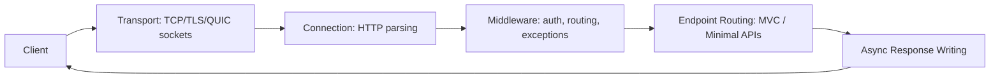

**Concurrency:** event-loop-based (like Node but multiple loops); IOCP / epoll/kqueue; minimal threads → high throughput; async avoids blocking ThreadPool. 10K connections → few active threads, all I/O async via callbacks + async/await. **This is why async code makes APIs faster — Kestrel reuses threads efficiently.**

**Configure:**
```csharp
var builder = WebApplication.CreateBuilder(args);
builder.WebHost.ConfigureKestrel(options =>
{
    options.Limits.MaxRequestBodySize = 10 * 1024 * 1024; // 10 MB
    options.Limits.KeepAliveTimeout = TimeSpan.FromMinutes(2);
    options.Limits.RequestHeadersTimeout = TimeSpan.FromSeconds(30);
    options.ListenAnyIP(5000);
    options.ListenAnyIP(5001, listenOptions => { listenOptions.UseHttps(); });
});
var app = builder.Build();
app.Run();
```

**Standalone vs Reverse Proxy:** Standalone (Client→Kestrel→ASP.NET) for dev/containers/simple. Reverse proxy (Client→Nginx/Apache/IIS→Kestrel) recommended for prod — better security, load balancing, connection handling, static files, protects Kestrel from direct exposure.

**Performance features:** zero-copy memory (`Span<T>`, `Memory<T>`, pipelines API); optimized header/body parsing (no unnecessary allocations); HTTP/2 multiplexing; IIS Integration Middleware. **Memory:** memory pools, shared buffers, reusable arrays → less GC pressure.

**Interview Q&A:**
- **Faster than IIS/System.Web?** Async I/O, minimal pipeline, no `System.Web`, lightweight, event-driven.
- **Expose Kestrel directly to internet?** No — Nginx/IIS/cloud LB reverse proxy for prod. In containers (AKS/EKS+ingress, App Service) the "reverse proxy" is the ingress controller/platform LB; principle (don't expose raw) still holds.
- **Thread starvation?** No thread-per-request; async I/O + event loop → far fewer threads.
- **Runs on Windows?** Yes — but uses cross-platform async I/O, not legacy Windows APIs.
- **`MinRequestBodyDataRate`/`MinResponseDataRate`?** Kestrel enforces a min data rate (default ~240 B/s) to stop slow-client (slowloris) attacks holding connections open. Raise/disable (`= null`) for legitimately slow clients (large mobile uploads); never disable public-facing without another mitigation (WAF/proxy timeout).
- **HTTP/2 vs HTTP/3 (QUIC)?** HTTP/2 multiplexes over one TCP connection but suffers TCP head-of-line blocking (one lost packet stalls all streams). HTTP/3 over QUIC (UDP) multiplexes at transport layer → lost packet stalls only its own stream (latency win on lossy/mobile). Trade-off: QUIC/UDP can be blocked by firewalls allowing only TCP 443 → keep HTTP/2 fallback.

**Summary:** "Kestrel is ASP.NET Core's default high-perf web server — async I/O, event-driven, memory-efficient pipelines, thousands of concurrent connections. Supports HTTP/1.1/2/3, TLS, WebSockets, cross-platform. In prod I run it behind a reverse proxy (Nginx/IIS/ingress) for security, LB, static files, connection management. Async-first → far better perf than IIS/System.Web."

---

## API Performance Optimization

### 1. Reduce I/O & DB Latency
- **Indexing** — composite indexes for frequent filters; avoid `SELECT *`; analyze slow queries (Query Store / `EXPLAIN`).
- **Pagination & projection** — avoid huge datasets; `Select()` projections in EF Core.
- **Async EF Core:**
```csharp
var data = await _dbContext.Users.Where(x => x.IsActive).ToListAsync();
```
Prevents thread starvation under Kestrel.

### 2. Caching at Multiple Layers
See Caching Strategy above (in-memory, Redis cache-aside, response caching, invalidation, stampede).

### 3. Reduce Serialization Time
- `System.Text.Json` over `Newtonsoft.Json`; pre-defined DTO response types; don't serialize EF entities directly.
- STJ is **source-generator-capable** (`JsonSerializerContext`) since .NET 6+ → avoids reflection, meaningful win at high throughput. Name it if asked "how to go even faster than default STJ."

### 4. Async & Non-Blocking
Kestrel is optimized for async. Avoid `.Result`/`.Wait()` (blocks thread pool). Async all the way down (no sync-over-async).

### 5. Minimize Middleware & Pipeline Overhead
Keep only required middleware (routing, auth, structured logging). Disable unused services, verbose prod logging, large exception stack traces.

### 6. Compression, HTTP/2, gRPC
- **Response compression:** `services.AddResponseCompression();`
- **gRPC internal** — 5–10x faster than REST, binary. Speed from HTTP/2 + Protobuf + strong typing (no reflection JSON parsing). Trade-off: harder to debug (not human-readable), weak browser support (needs grpc-web + proxy), less familiar tooling. Senior answer: **gRPC for internal service-to-service, REST/JSON (or GraphQL) for public/browser-facing.**

### 7. Improve Architecture
- **CQRS for high-read** — reads from read DB, commands from write DB.
- **Background processing** — Hangfire, Azure Functions, `BackgroundService`; API returns fast, work continues async.

### 8. Connection Pooling & HttpClientFactory
Prevents socket exhaustion:
```csharp
services.AddHttpClient("external", c => { c.Timeout = TimeSpan.FromSeconds(5); });
```
DBs: minimal DB contexts, avoid long-running transactions.

### 9. Reduce Payload Size
Compress JSON, remove unused fields, lightweight DTOs, OData/filtering APIs if needed.

### 10. Profiling & Monitoring
Tools: App Insights, New Relic, CloudWatch, Datadog, MiniProfiler, EF Core logging (N+1). Track: latency (p50/p90/p99), slow SQL, serialization time, GC pauses.

**Summary:** "Optimize at multiple layers — DB (indexes/projections/pagination), caching, async, Kestrel tuning, minimized middleware, payload optimization, observability. At high scale add CQRS, background processing, gRPC. Performance is cross-layer, not a single fix."

---

## Scalability & Performance Deep Dive

Ties the perf tips into a "where's the bottleneck" model for "the API is slow, debug it."

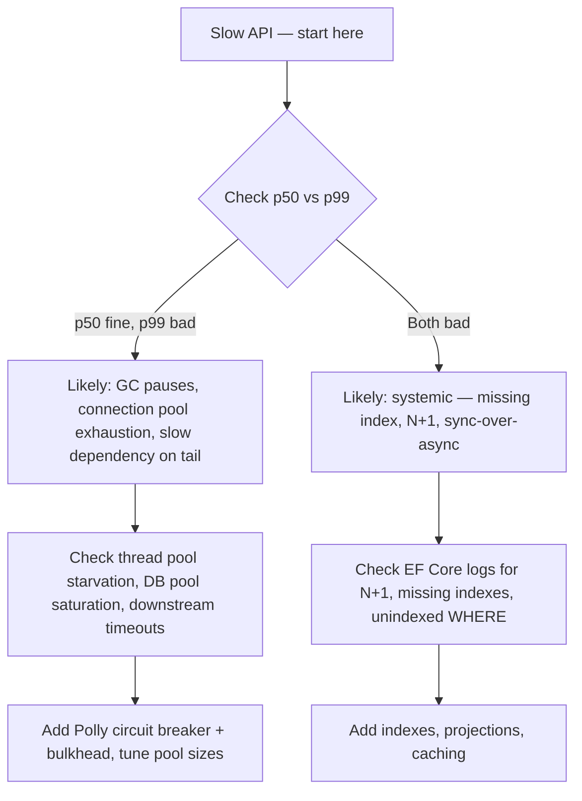

**Q: Vertical vs horizontal scaling?**
A: Vertical (bigger instance) — simpler, no distributed complexity, but hard ceiling + SPOF. Horizontal (more instances) — standard for internet-scale but needs stateless app (externalize state to Redis/DB), LB, and introduces distributed problems (consistency, distributed caching, session affinity). Senior answer: default horizontal for customer-facing scale, but don't over-engineer a low-traffic internal tool.

**Q: N+1 query problem?**
A: Most common EF Core perf bug — iterating a collection and lazy-loading a related entity per item → N+1 round trips instead of 1. Fix: eager load (`.Include()`), projection (`.Select()`), or single batched query. `AsSplitQuery()` for one-to-many `Include` to avoid cartesian-product explosion — know single vs split query trade-off.

---

## Best Practices

- Validate business need before microservices/CQRS/event sourcing — complexity earned, not defaulted.
- **Async all the way down**; never mix `.Result`/`.Wait()`.
- Cache at the layer closest to client that's still correct (CDN > response cache > distributed cache > in-memory > DB).
- Treat replicas & distributed caches as **eventually consistent by default** — design read-after-write explicitly.
- Make queue/webhook/retry consumers **idempotent** — at-least-once is realistic default.
- Put resilience (retry/CB/timeout/bulkhead) around every outbound call to a dependency you don't control.
- Observability (structured logs, correlation IDs, tracing, p50/p90/p99) not optional at scale — build in day one.
- Prefer modular monolith with clean boundaries over premature microservices — a legitimate end-state.
- When sharding, choose a shard key keeping related data (and transactions) together.

## Common Pitfalls

- Microservices too fine-grained → chatty/high-latency.
- Shared DB forever → distributed monolith.
- No observability → debugging nightmare.
- Tech stack explosion → ops complexity.
- Assuming replicas/distributed caches are strongly consistent (explicit red flag).
- `.Result`/`.Wait()` on async → thread pool starvation under Kestrel.
- Retrying non-idempotent ops (charge card) without idempotency key → duplicate side effects.
- Circuit breaker/retry without a timeout → fail slower, not fail fast.
- Sharding key not matching query/transaction patterns → expensive cross-shard fan-out.
- Reaching for Kafka/event sourcing/full CQRS when a simpler pattern ships faster with less operational tax.

---

## Worked Examples

Each: requirements → estimation → high-level design → deep dive → trade-offs.

### Design a URL Shortener

**Requirements:** shorten long→short code; redirect short→original; ~100M new URLs/month; ~10:1 read:write; low-latency redirects.

**Estimation:** 100M writes/mo ≈ 40 writes/sec; reads ≈ 400/sec. URL+metadata ≈ 500B → 100M×500B ≈ 50GB/mo (archive old links).

**Short-code generation:**

| Approach | How | Trade-off |
|---|---|---|
| Base62 of auto-increment ID | `id=125 → "cb"` | Simple, no collisions; reveals volume, needs centralized ID gen (or per-node range allocator) |
| Hash URL (MD5/SHA)+truncate | First 6–8 chars | No counter; collisions possible → check-and-retry or longer code |
| Random string + collision check | Random 6–7 chars, check DB | Simple; wasted lookups as keyspace fills |

Senior answer: **base62 of a distributed ID generator** (Snowflake-style, or pre-allocated ID ranges per node) — avoids central bottleneck and collision handling.

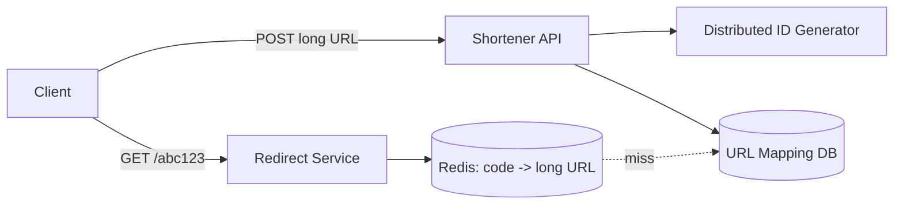

**Deep dive — redirect is hot path:** cache code→URL in Redis (read-through/cache-aside); DB only on miss. **301 vs 302:** 301 (permanent) → browser caches client-side (fewer hits but lose analytics, can't change destination); 302 (temporary) → every click hits your service (enables analytics/A-B) at more load. Most shorteners use **302** to retain click tracking.

**Trade-offs to raise:** vanity/custom domains need uniqueness check; expiring/rate-limiting link creation to prevent abuse (ties to Rate Limiting).

### Design a Rate Limiter Service

**Requirements:** limit per client (API key/IP) to N/window; work across many instances (distributed); low added latency.

**Design:** centralize counter in Redis (not per-instance memory) → global limit across instances. Use **token bucket** (absorbs bursts, enforces avg rate).

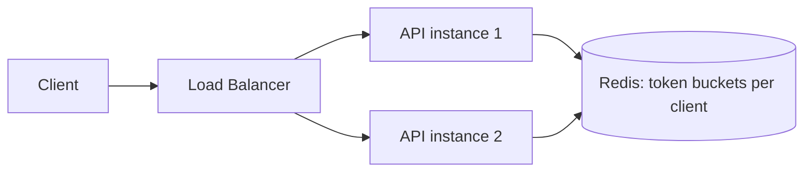

**Senior detail:** use a single Redis **Lua script** (or `MULTI`/`EXEC`) to read-and-decrement atomically — separate `GET` then `SET` is a race (two requests both read "1 left," both proceed, bucket goes negative).

**Q: What when Redis is down?**
A: Critical failure-mode question. **Fail open** (allow all — abuse risk) vs **fail closed** (reject all — outage risk). Most systems **fail open** for rate limiting — its job is abuse protection, not a hard security boundary; an outage-caused spike beats rejecting 100% of legit traffic.

**Where to enforce:** at API Gateway/edge (cheapest, stops abuse before backend compute); per-service/endpoint limits layer on top (e.g. stricter on an expensive search endpoint).

### Design a Notification System

**Requirements:** multi-channel (push/email/SMS) triggered by many services' events; must not block upstream; per-channel retries/failures; huge fan-out ("notify all followers").

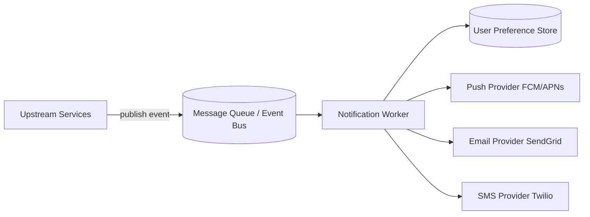

**Why a queue:** triggering service (Orders) shouldn't block on delivery or know about SMS outages — order completes instantly, delivery/retries happen independently.

**Deep dive — fan-out at scale ("1M followers"):** don't create 1M messages synchronously. Publish one "fan-out" event → a dedicated fan-out worker expands into per-user work items (into a second queue) → keeps originating request fast, isolates expensive work into a scalable background process.

**Per-channel resilience:** each channel has own failure modes/provider rate limits → wrap each provider call in its own Polly policy (retry+CB) so an SMS outage doesn't stall email/push. Dead-letter queues per channel + alerting.

**Preferences & idempotency:** check prefs (opt-outs, quiet hours, channel) before sending — cache this lookup. Idempotency key per (event, channel) so redelivered messages don't duplicate.

**Trade-off:** real-time push vs batched/digest — immediate maximizes immediacy but risks fatigue + cost; batching ("5 new comments") trades latency for UX + lower cost. Clarify the requirement, don't assume.

---

## Closing the Gap: Additional Prep

### Expanding the Worked-Example Repertoire

Practice these six (requirements→estimation→design→deep dive→trade-offs):

- **News Feed (Twitter/Instagram):** fan-out-on-write (precompute each follower's feed — fast reads, expensive for celebrities) vs fan-out-on-read (assemble at request time — cheap writes, expensive reads). Senior: **hybrid** — write for normal users, read (or celebrity path) for high-follower accounts.
- **Chat System (WhatsApp):** WebSocket/long-lived connections; presence service (online/typing); message persistence + delivery guarantees (sent/delivered/read); group fan-out. Deep-dive: route a message to a recipient on any of thousands of stateless connection servers → a **connection-registry** (Redis `userId → serverId`).
- **Ride-Sharing Dispatch (Uber):** geospatial matching at scale — nearest available driver. Senior: **geohashing/quadtree** to index driver locations (fast spatial query, not full scan); frequent location updates → location store optimized for high write throughput, not strong consistency.
- **Distributed Key-Value Store (mini-DynamoDB):** consistent hashing (partitioning), replication factor (durability), read/write quorums (`R`/`W`, tunable consistency), vector clocks or last-write-wins (conflict resolution).
- **Video Streaming (Netflix):** chunked encoding at multiple bitrates; CDN edge delivery (caching content applies); adaptive bitrate (client picks quality by measured bandwidth); metadata/recommendation service decoupled from video-serving path.
- **E-Commerce Checkout/Inventory:** prevent overselling under concurrent checkouts → application of Sagas + Idempotency Keys: reserve inventory (with TTL for abandonment), charge payment, confirm reservation; compensating actions (release reservation) on failure; idempotency keys so retried checkout doesn't double-charge/reserve.

### Mapping Patterns to AWS Managed Services

| Generic pattern | AWS equivalent | Notes |
|---|---|---|
| Distributed cache (Redis, cache-aside) | **ElastiCache** (Redis/Memcached) | Same patterns; removes op burden of running Redis |
| Message queue (point-to-point) | **SQS** | At-least-once default (idempotency applies); native DLQ |
| Pub/Sub (fan-out) | **SNS** (often SNS → many SQS) | SNS fans out; SQS per-subscriber for durable independent consumers |
| CDN / edge caching | **CloudFront** | Fronts S3/ALB/API Gateway; "cache closest to client" AWS-native |
| Load balancer (L7) | **ALB** | Path/header routing — AWS tool for Strangler Fig routing |
| Load balancer (L4) | **NLB** | Ultra-low-latency, protocol-agnostic (raw TCP/UDP) |
| Read replicas | **RDS Read Replicas** / **Aurora Replicas** | Same eventual-consistency caveat |
| Orchestrated Sagas | **Step Functions** | Managed saga orchestrator — state machine w/ compensating actions declaratively |
| Event streaming (Kafka) | **Kinesis Data Streams** (or **MSK** for Kafka compat) | Kinesis = simpler ops; MSK = exact Kafka semantics/tooling |
| Serverless background/event work | **Lambda** | Outbox polling publisher = Lambda on schedule (EventBridge Scheduler) |
| Rate limiter shared counter | **ElastiCache (Redis)** | "10 pods behind LB" → shared Redis, not per-instance memory |

### Running the Interview: Time-Boxing & Whiteboard Mechanics

**45-min time-box:**

| Phase | Time | Doing |
|---|---|---|
| Requirements clarification | ~5 min | Scale (DAU/RPS), read:write, consistency, latency SLAs — don't skip even under pressure |
| Back-of-envelope estimation | ~5 min | Capacity method; state assumptions out loud |
| High-level architecture | ~15–20 min | Boxes & arrows; narrate why each exists, don't draw silently |
| Deep dive on 1–2 components | ~15–20 min | Interviewer steers ("how does X work") — use detailed pattern content |
| Trade-offs/failure modes/wrap-up | ~5–10 min | Name what you'd do differently at 10x, + one unaddressed failure mode |

**Whiteboard fluency:** practice sketching CQRS+BFF, Strangler Fig, Saga sequence diagrams in the actual tool (Excalidraw/Miro/CoderPad/HackerRank) — fluent boxes/arrows/labels at speed while talking is a distinct skill; rehearse, don't assume it transfers from reading.

**Narrate continuously.** Silence while thinking is the #1 reason a technically-correct design still reads "junior." Say what you're considering and why you reject alternatives ("I could shard by user ID, but I'll shard by tenant ID to keep each tenant's data — and transactions — on one shard").

### Multi-Tenant Data Isolation & PII Handling

Maps to a real story: a Dealership Management System with multiple partner dealers, state/county rules, compliance = inherently multi-tenant + PII-adjacent.

**Isolation models:**

| Model | Isolation | Cost/Complexity | Fits |
|---|---|---|---|
| Silo (DB-per-tenant) | Strongest — separate DB | Highest (migrations/scaling/backups multiply) | Regulatory hard-isolation, or wildly different tenant scale |
| Pooled (shared DB, `TenantId` + row filter) | Logical, in app/ORM | Lowest, but a missed filter = data-leak risk | Most SaaS at moderate-large scale (matches shard-by-tenant-ID) |
| Bridge (schema-per-tenant) | Middle — same DB, separate schema | Moderate — easier per-tenant backup than pooled | Middle tenant count needing per-tenant customization |

**PII/compliance:** encryption at rest (RDS/DynamoDB encryption, KMS keys) + in transit (TLS everywhere); field-level encryption/tokenization for most sensitive fields (not just DB-level); audit logging of who accessed which tenant's data when.

**#1 failure mode — cross-tenant leak:** name the specific mechanism preventing tenant A's request returning tenant B's data — a **global query filter with fail-closed default** (queries throw rather than silently return unfiltered data if tenant context isn't set), not just "we add a WHERE clause."

---

## Sample Interview Q&A

- **Kestrel faster than IIS?** Async I/O, minimal pipeline, no `System.Web`, lightweight, event-driven.
- **Expose Kestrel to internet?** No — reverse proxy (Nginx/IIS/ingress) for prod.
- **Kestrel thread starvation?** No thread-per-request; async I/O + event loop → far fewer threads.
- **CQRS w/ shared RDS+replicas "true" CQRS?** No — pragmatic CQRS (separate read/write paths over same logical store). Full CQRS/event sourcing w/ separate projections is the escalation path.
- **Why not Angular→Query APIs directly?** Couples UI to backend, duplicates auth, makes UI fragile/expensive.
- **When avoid microservices entirely?** No genuinely independent scaling/deploy/team needs — well-modularized monolith is defensible.
- **Availability vs consistency: partition vs normal op?** CAP applies during partition (choose A or C). Normal op → latency vs consistency (PACELC): sync multi-AZ adds latency for consistency; async replication (RDS replicas) favors latency at cost of staleness.
- **Make a payment API safe to retry?** Require idempotency key per attempt; store completed keys + response; retry with same key → cached response, not re-charge. Combine w/ Polly retries + DB unique constraint on business key (defense-in-depth).
- **Circuit breaker is open — what to tell users vs on-call?** Users: graceful degraded response (cached/stale, or clear "temporarily unavailable" not raw 500), not a hung request. On-call: alert on circuit **state transitions** (not just error rate) so they know it's a downstream issue, not your bug — cuts diagnosis time.
- **Scale URL shortener redirect to 50K reads/sec?** Cache aggressively (Redis, CDN/edge for hot links); redirect path never touches write DB; add read replica/dedicated read store if cache-miss volume alone exceeds one DB. Should be nearly all cache hits given skewed read:write.
