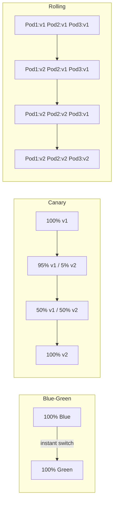
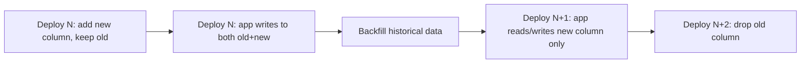
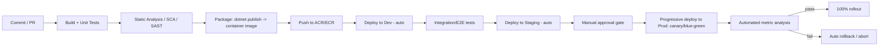
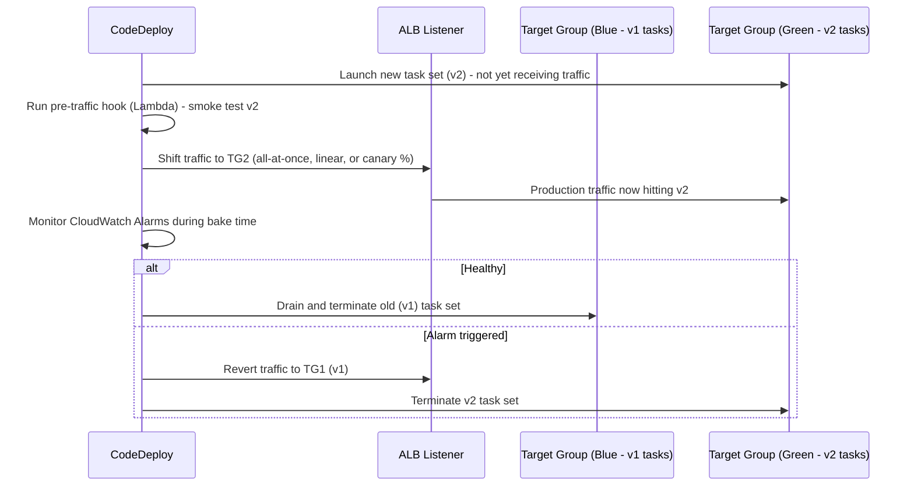

# Deployment Strategies — Quick Revision Notes

> Fast brush-up notes derived from the Deployment Strategies Interview Guide. Covers every section in the same order: Core Concepts, Feature Flags, Intermediate, Advanced (incl. AWS), Best Practices, Pitfalls, Sample Q&A, and Summaries.

---

## 1. Core Concepts

### What "Deployment Strategy" Actually Means

- **Answers 3 questions at once:** ship changes with **no downtime**, **limit blast radius** when it breaks, **roll back fast**.
- Every strategy is a trade-off between **infra cost**, **deploy speed**, and **risk exposure** — no single "best". Choice depends on: statefulness, compliance, team maturity (monitoring/automation), cost tolerance.
- Interviewers probe real operational experience: traffic-shifting mechanics, session affinity, DB compatibility windows, observability — not just definitions.

### Blue-Green Deployment

**Q: How does it work?**
- Two identical envs: **Blue** (current prod) + **Green** (new version).
- Green deployed/tested in isolation (smoke tests, synthetic traffic) while Blue serves all traffic.
- Once Green verified, switch traffic Blue→Green **atomically** (router/LB/DNS/CNAME swap).
- Rollback = flip traffic back to Blue.

**Advantages:** zero downtime at cutover; instant rollback (switch, not redeploy); full validation of Green on prod-like infra before real users hit it.

**Disadvantages:**
- **Expensive** — 2x infrastructure (even if brief).
- Needs reliable traffic switch; **DNS switching suffers TTL/caching delays** (common gotcha).
- DB/schema state is shared → "two identical envs" breaks down with a shared stateful store. Really blue-green at the **app tier only**.

**AWS Elastic Beanstalk example:**
```bash
eb create green-environment
eb swap-environment-cnames --source-environment blue-environment --destination-environment green-environment
```
Walkthrough (banking): Blue v1.0 live → deploy v2.0 to Green → test Green → swap to Green → misbehaves? swap back instantly.

**Follow-ups to expect:**
- In-flight requests during swap? → **connection draining / graceful shutdown**.
- Database? → usually **shared**, so it's app-tier blue-green only.
- Session state? → **sticky sessions break blue-green** → prefer stateless + distributed cache/session store.

### Canary Deployment

**Q: How does it work?**
- Deploy new version to small slice (5–10%).
- Monitor error rate, latency, business metrics.
- Healthy → progressively increase (5% → 25% → 50% → 100%).
- Problems at any stage → halt + roll back that slice.

**Advantages:** minimal blast radius; **data-driven** (real prod signals gate promotion, not just synthetic tests); gradual controlled exposure.

**Disadvantages:** slower to 100% (staged, each needs a soak/bake period); needs real traffic-splitting infra (service mesh, weighted ingress, API gateway) + strong observability at a statistically meaningful sample.

**Netflix example:** deploy v2.0 to 5% → monitor → 50% → 100%.

**K8s Deployment (canary version label):**
```yaml
apiVersion: apps/v1
kind: Deployment
metadata:
  name: my-app
spec:
  replicas: 10
  selector:
    matchLabels:
      app: my-app
  template:
    metadata:
      labels:
        app: my-app
        version: canary
    spec:
      containers:
      - name: my-app
        image: my-app:v2.0
        ports:
        - containerPort: 80
```

**Weighted split via Ingress (intent only — see accuracy note):**
```yaml
apiVersion: networking.k8s.io/v1
kind: Ingress
metadata:
  name: my-app-ingress
spec:
  rules:
  - http:
      paths:
      - path: /my-app
        backend:
          service:
            name: my-app
            port:
              number: 80
        weight: 20 # Send 20% traffic to Canary
```

> **Accuracy flag:** Vanilla K8s `Ingress` (networking.k8s.io/v1) does **not** support a `weight` field. Real weighted canary needs an ingress controller extension (**NGINX** `nginx.ingress.kubernetes.io/canary-weight`), a **service mesh** (Istio VirtualService), or a progressive-delivery controller (**Flagger / Argo Rollouts**). The YAML shows intent, not a working manifest.

**Follow-ups:**
- Split increments & bake time? → **SLO-based automated gates**, not gut feel.
- Which users see canary? → random sampling vs **sticky-by-user-id** (consistency matters for UX).
- Auto-rollback trigger? → error-rate/latency SLO breach auto-aborts via controller (Flagger/Argo), not a human watching.

### Rolling Deployment

- Old instances replaced by new **incrementally**, a few at a time (K8s `Deployment` default `RollingUpdate` with `maxSurge`/`maxUnavailable`).
- **No second env** → cheaper than blue-green.
- **Rollback not instant** — reverse the incremental process; time ∝ fleet size.
- Mid-rollout **two versions run simultaneously** → needs **N/N+1 compatibility** (API/schema backward compat mandatory during transition).
- Good default for **stateless** services where cost > instant rollback.

### Comparison Table: Blue-Green vs Canary vs Rolling vs Recreate

| Strategy | Infra Cost | Rollout Speed | Rollback Speed | Risk Exposure | Traffic Splitting? | Typical Use Case |
|---|---|---|---|---|---|---|
| **Recreate** (stop old, start new) | Low | Fast | Slow (redeploy old) | High (downtime) | No | Dev/test, non-critical batch |
| **Rolling** | Low–Med | Medium | Medium (reverse rollout) | Medium | No (LB drains) | Default stateless microservices, cost-sensitive |
| **Blue-Green** | High (2x) | Fast cutover | Instant (flip back) | Low (fully tested first) | Yes (router/DNS/LB) | Regulated/critical, instant clean rollback |
| **Canary** | Med (small extra fleet) | Slow (staged) | Fast (stop + drain canary) | Lowest (limited blast) | Yes (weighted) | High-traffic consumer apps, validated rollout |



---

## 2. Feature Flags / Feature Toggles

### What Is a Feature Toggle

- Decouples **deployment** from **release**: code ships dark (disabled), turned on independently (users, %, envs) with **no redeploy**.
- Underlies **trunk-based development** + **continuous delivery** — merge/deploy incomplete/risky work as long as it's flag-guarded.
- Lets teams: gradually roll out to specific users; test in prod without affecting everyone; instantly disable on issue (no redeploy).

### Why Use Feature Toggles

- **Risk-free deploys** — off by default, enabled progressively.
- **Instant rollback** — disable flag (much faster MTTR than deployment-level rollback).
- **A/B testing** — enable per cohort, measure impact.
- **Continuous delivery** — ship incomplete work behind a flag, flip on when ready.

### Implementing with LaunchDarkly in .NET

1. Create LaunchDarkly account/project → get SDK key.
2. Install SDK:
```bash
dotnet add package LaunchDarkly.ServerSdk
```
3. Config key in `appsettings.json`:
```json
{
  "LaunchDarkly": {
    "SdkKey": "your-launchdarkly-sdk-key"
  }
}
```
> **Secrets gap:** never commit a real key. Use **Azure Key Vault**, **User Secrets** (dev), or env vars/App Configuration; bind via `IConfiguration`.

4. Initialize client:
```csharp
using LaunchDarkly.Sdk;
using LaunchDarkly.Sdk.Server;
using Microsoft.Extensions.Configuration;
using System;

public class LaunchDarklyService : IDisposable
{
    private readonly LdClient _ldClient;

    public LaunchDarklyService(IConfiguration configuration)
    {
        var sdkKey = configuration["LaunchDarkly:SdkKey"];
        _ldClient = new LdClient(sdkKey);
    }

    public bool IsFeatureEnabled(string featureFlagKey, string userKey)
    {
        var user = User.WithKey(userKey);
        return _ldClient.BoolVariation(featureFlagKey, user, false); // default false
    }

    public void Dispose() => _ldClient.Dispose();
}
```
> **Lifetime gotcha:** `LdClient` holds a persistent streaming connection + caches → must be a **singleton** (`services.AddSingleton<LaunchDarklyService>()`). Per-request construction exhausts connections and adds multi-second startup latency (it blocks briefly on initial connect).

5. Use in controller:
```csharp
using Microsoft.AspNetCore.Mvc;

[Route("api/feature")]
[ApiController]
public class FeatureController : ControllerBase
{
    private readonly LaunchDarklyService _ldService;

    public FeatureController(LaunchDarklyService ldService) => _ldService = ldService;

    [HttpGet("dark-mode")]
    public IActionResult GetFeatureStatus()
    {
        string featureFlagKey = "dark-mode";
        string userKey = "user-123"; // dynamic, from authenticated user
        bool isEnabled = _ldService.IsFeatureEnabled(featureFlagKey, userKey);
        return Ok(new { message = isEnabled
            ? "Dark Mode is ENABLED for you!"
            : "Dark Mode is DISABLED for you." });
    }
}
```

### Testing Feature Toggles

1. In dashboard, create flag `dark-mode`, target user `user-123`.
2. Call `GET http://localhost:5000/api/feature/dark-mode`.
3. Enabled → `{ "message": "Dark Mode is ENABLED for you!" }`; Disabled → `... DISABLED ...`.

### Real-World Use Cases

- **Facebook Dark Mode** — limited rollout before GA.
- **Netflix UI** — A/B testing UI variants across segments.
- **Amazon promotions** — discounts scoped to Prime members.

### Feature Flags in a Microservices Architecture

Cross-service consistency problems absent in a monolith:
- **Centralize flag evaluation** — shared platform (LaunchDarkly, Azure App Config Feature Management, Unleash, Split) so all services agree on state/targeting/audit.
- **Propagate flag context consistently** — same targeting context (user/tenant/region) passed to all downstream services (header or trace context) so evaluation is identical. Classic bug: Service A shows new checkout UI but Service B still validates old contract.
- **Version/contract compatibility** — flag "on" in Service A often needs Service B to already support the new contract → flags have a **dependency graph** (use prerequisite flags where supported).
- **Local caching + streaming updates** — SDK caches locally + push updates; don't call flag service synchronously per request (network hop + SPOF).
- **Kill switches** especially important — a bad release can cascade through the call graph; disable one feature without a coordinated multi-service rollback.
- **Flag lifecycle/cleanup governance** matters more at scale — stale flags = distributed tech debt + security-audit problem.

### Feature Flag Types and Anti-Patterns

| Flag Type | Lifespan | Purpose |
|---|---|---|
| **Release flag** | Short (days–weeks) | Decouple deploy from release; remove after full rollout |
| **Experiment flag** (A/B) | Medium | Drive experimentation/analytics; remove after experiment |
| **Ops / kill switch** | Long-lived | Circuit-breaker for feature/dependency; kept permanently |
| **Permission / entitlement** | Permanent | Gate by plan/tier (Prime-only) — business logic, not deploy mechanism |

**Anti-patterns:**
- **Flag debt** — never removing release flags → dead `if` branches + combinatorial test explosion.
- **Flags wrapping non-idempotent side effects** (toggling mid-transaction that already wrote half its state) — flags gate *behavior*, don't flip inside a unit of work.
- **Testing only on/off in isolation** — flag *interaction* bugs are real at scale.

---

## 3. Intermediate Topics

### Zero-Downtime Database Migrations

Most commonly-missed topic. Blue-green/canary/rolling all assume the **DB is shared** across old+new during transition.

**Core rule: expand/contract (parallel change):**
1. **Expand** — add new schema element (column/table) without removing/renaming old. Both old+new code work.
2. **Migrate/backfill** — backfill new structure; dual-write if needed (old code writes old+new, or background sync).
3. **Contract** — once all instances run new code and verified, drop old element in a **later, separate** deploy.



**Rules of thumb:**
- Never breaking-rename in one step → "add new" → "migrate" → "remove old" across deploys.
- Additive (`ADD COLUMN` nullable, new table) generally safe mid-rollout.
- Destructive (`DROP COLUMN`, `NOT NULL` w/o default, rename) waits until **100%** of fleet runs code that no longer references old shape.
- **EF Core:** avoid `Database.Migrate()` on startup in multi-instance rolling deploys — racing instances deadlock/corrupt. Run migrations as a **separate single pre-deploy step** (CI/CD job) before new version takes traffic.
- Large migrations (indexes, backfills) done **online/incrementally** (batched, `CREATE INDEX` concurrently) to avoid locking prod tables.
- Blue-green: Blue+Green usually share the **same DB** → "blue-green for the DB" is a different, harder problem (read replicas + cutover, or append-only during transition). Don't conflate app-tier and DB-tier blue-green.

### Rollback Strategy for Stateful Services

Trivial for stateless; the hard question is **what happens to state?**
- **Schema compatibility** — rollback only clean if *previous* code runs against *current* schema. Why destructive migrations must lag code by a full contract cycle.
- **Message queue / event state** — new required field in a Kafka/Service Bus event → rolling back consumer breaks on in-flight messages. Use **schema versioning / tolerant readers** (ignore unknown fields).
- **Cache poisoning** — new shape written to shared Redis → old code crashes. **Version cache keys** (`user:v2:{id}`).
- **Idempotency for replays** — rollback = replay/retry → use idempotency keys (payment/order APIs) to avoid double-charge/double-write.
- **StatefulSets in K8s** — rollback is ordered, one-at-a-time; check PV data compatible with older container image (different from a `Deployment`).
- **Feature-flag-first rollback** — fastest/safest is disabling the flag guarding the risky path; infra rollback is the fallback for issues flags can't cover (bad image, not bad logic).

### Deployment in Kubernetes / AKS / EKS

- **Deployment object** — default `RollingUpdate` with `maxSurge` (extra pods above desired) + `maxUnavailable` (how many down). Tunes speed vs headroom vs availability.
- **Readiness vs liveness probes** — rolling update routes traffic only to pods passing **readiness**; a pod can be alive but not ready (warming caches/connections). Misconfigured probes = #1 cause of "zero-downtime deploy caused a blip": traffic sent too early, or `livenessProbe` kills slow-starting .NET pods (cold JIT/ReadyToRun) before ready.
- **PodDisruptionBudget (PDB)** — min healthy replicas during voluntary disruptions (node drains, upgrades).
- **Managed clusters:**
  - **AKS** — Azure LB / Application Gateway Ingress Controller (AGIC) for weighted routing; Azure DevOps + GitHub Actions have AKS deploy tasks (`kubectl`, Helm, `azure/k8s-deploy`).
  - **EKS** — AWS ALB Ingress Controller or App Mesh/Istio; often CodeDeploy native Blue/Green + Canary for ECS/EKS, or Argo Rollouts.
  - Both support **Flagger / Argo Rollouts** as progressive-delivery controllers — what most real canary/blue-green uses in 2026 (not hand-rolled Ingress weights).
- **Helm / Kustomize** — templating for env-specific manifests. Avoid config drift: single templated source + per-env values files, promoted via CI, not hand-edited.

---

## 4. Advanced Topics

### Progressive Delivery

- Umbrella term (Weaveworks/James Governor) = **canary + feature flags + automated analysis** combined. Use it in a senior interview to show currency.
- **Automated analysis/gating** — Flagger / Argo Rollouts watch Prometheus/Datadog metrics during canary and auto-promote or abort (no human watching).
- **Combines with flags** — canary the *infra* (new pods) while flag-gating the *feature* — two independent risk levers.
- **Traffic mirroring/shadowing** — copy prod traffic to new version without returning its response (validate under real load, zero user risk).
- **Q: Progressive delivery vs canary?** → Canary is a *technique*; progressive delivery is the *practice* of automating canary analysis, flags, and rollback decisions end-to-end.

### GitOps

- **Definition** — desired state declared in Git (manifests, Helm values, Kustomize); a controller (**ArgoCD**, **Flux**) continuously reconciles live cluster to Git, instead of CI imperatively running `kubectl apply`.
- **Why it matters** — Git = single audit trail + rollback = `git revert` the manifest, controller reconciles automatically. Stronger/more auditable than "re-run old pipeline".
- **Push vs pull** — CI/CD *pushes* (CI holds cluster creds = security surface); GitOps controllers *pull* from Git and reconcile from inside the cluster (no external system needs prod creds — compliance win).
- **Drift detection** — detects/auto-corrects manual `kubectl` changes ("config drift") — valuable in regulated envs.
- Ties to canary: **Argo Rollouts** + ArgoCD makes canary/blue-green a GitOps-native declarative resource (`Rollout` CRD replacing `Deployment`).

### Deployment Strategies: Microservices vs Monolith

| Aspect | Monolith | Microservices |
|---|---|---|
| **Unit of deployment** | Whole app, one artifact | Each service independently |
| **Blue-green cost** | One large env duplicated (simple, expensive to double) | Per-service (cheaper each, but coordinating N versions is complex) |
| **Canary granularity** | Coarse — whole app | Fine — one service without touching others |
| **Contract/versioning risk** | Low (in-process calls) | High — every boundary needs backward/forward-compatible contracts during independent rollouts |
| **Rollback blast radius** | All-or-nothing | Roll back just the offending service |
| **DB migration coordination** | Single DB, single path (still expand/contract) | Many DBs (DB-per-service); cross-service consistency during partial rollout (sagas/eventual consistency) |
| **Deployment frequency** | Lower (big, risky) | Higher (small, isolated) — a primary reason to adopt microservices |
| **Tooling complexity** | Lower — one pipeline | Higher — mesh, distributed tracing near-mandatory |

**Key point:** microservices don't change deployment *strategies* in kind — blue-green/canary/rolling still apply — but multiply the **coordination problem**: you must design for N/N+1 compatibility **continuously**, not just during a deploy window, because some services are always ahead of others.

### Dark Launches / Shadow Traffic / A-B Testing at Infra Level

- **Dark launch** — run new code in prod but don't expose output to users (e.g., run new recommendation engine in parallel, log + compare offline). A *validation* technique — distinct from canary (exposes real users) and from a flag (on/off switch, not shadow comparison).
- **Traffic mirroring/shadowing** — infra-level dark launch: LB/mesh duplicates a request to old+new; only old response returned to client. Istio + some API gateways support natively (`mirror` in VirtualService).
- **A/B testing vs canary** — canary = *risk mitigation* (temporary, converges to 0/100%); A/B = *experimentation* (can run indefinitely, both variants "correct", measuring a business metric not safety). Don't conflate.

### CI/CD Pipeline Design for .NET (Azure DevOps / GitHub Actions)



- **Immutable artifacts** — build once, promote the *same* image through Dev→Staging→Prod. Never rebuild per env (kills "different bits in prod" bugs).
- **Env-specific config, not env-specific builds** — `appsettings.{Environment}.json`, Azure App Config, env vars/ConfigMaps/Secrets injected at deploy time.
- **Approval gates** — Azure DevOps/GitHub Actions environments with required reviewers before prod — standard for regulated .NET shops.
- **Migrations as a pipeline stage** — run once, before new version takes traffic.

### AWS-Specific Deployment Mechanics

Guide is otherwise Kubernetes-centric; this grounds the same strategies in AWS-native mechanics + how Terraform/CDKTF drives them.

#### AWS CodeDeploy — Blue/Green for EC2, ECS, Lambda

Managed deploy orchestrator; blue/green means something different per compute target:

| Target | Blue / Green meaning | Traffic-shift mechanism | Rollback |
|---|---|---|---|
| **EC2** | Blue = existing ASG/fleet; Green = fresh replacement fleet | Re-register instances behind existing ELB/Target Group, or swap Target Groups | Terminate Green; Blue keeps serving until cutover completes |
| **ECS** | Blue = current task set (task def revision); Green = new task set on same service | ALB listener rule shifts between two Target Groups (one per task set) — all-at-once, linear, or canary | CodeDeploy reroutes ALB listener back to Blue TG |
| **Lambda** | Blue = current aliased version; Green = new published version | **Alias traffic shifting** — weighted routing shifts % of invocations | Alias weight reverts to 100% original |

- **CloudWatch Alarms = automated abort trigger** for all three — bad deploy auto-halts + rolls back mid-shift. Direct AWS analog to Flagger/Argo automated canary analysis.

#### ECS Blue/Green in Detail



- Native via the **`CODE_DEPLOY` deployment controller** on the service (vs default **`ECS` rolling-update controller** = ECS's `RollingUpdate` equivalent: no second TG, no traffic-shift granularity, just incremental task replacement).
- Traffic-shift options mirror Flagger/Argo: **Canary** (10% for N min, then 100%), **Linear** (fixed increments on a timer), **AllAtOnce** (relies on hooks + alarms).
- **Pre/post-traffic Lambda hooks** — validation (smoke tests, synthetic checks) before real traffic reaches Green, and after shift — AWS-native "automated analysis gate".

#### Route 53 Weighted Routing for Gradual Traffic Shifting

DNS-layer alternative (vs CodeDeploy's compute/target-group layer); best when envs are coarsely separated (separate stacks/regions, cutover above the LB level):
```
Record: api.example.com
  → Weighted record A (Blue stack ALB)   weight = 90
  → Weighted record B (Green stack ALB)  weight = 10
```
- Route 53 resolves each query probabilistically per weight → ~10% of *new* connections land on Green.
- **DNS TTL/caching gotcha applies:** clients/resolvers with cached Blue IP won't re-resolve until TTL expires → shift is gradual and "fuzzy" at the edges, not precise/instant (unlike ALB/mesh-layer splits that shift *connections* precisely).
- Pair with **Route 53 health checks** to pull a failing weighted record out of rotation — coarser DNS-layer safety net vs CodeDeploy's alarm-driven abort.
- Typical use: **cross-region blue-green** (`us-east-1` → newly deployed `us-west-2`) where there's no single shared LB.

#### Terraform/CDKTF Driving Deployment Orchestration

Terraform is a *provisioning* tool, not a deploy *orchestrator* — but plays a specific role:
- **Terraform provisions the machinery** — CodeDeploy App/DeploymentGroup, ECS `deployment_controller`, ALB listener rules + both Target Groups, Lambda alias `routing_config`, Route 53 weighted records. **Terraform lays the rails; CodeDeploy/CI drives the train.**
```hcl
resource "aws_codedeploy_deployment_group" "ecs_bluegreen" {
  app_name               = aws_codedeploy_app.order_api.name
  deployment_group_name  = "order-api-dg"
  service_role_arn       = aws_iam_role.codedeploy.arn
  deployment_config_name = "CodeDeployDefault.ECSLinear10PercentEvery1Minute"

  deployment_style {
    deployment_type   = "BLUE_GREEN"
    deployment_option = "WITH_TRAFFIC_CONTROL"
  }

  blue_green_deployment_config {
    terminate_blue_instances_on_deployment_success {
      action                           = "TERMINATE"
      termination_wait_time_in_minutes = 5
    }
  }

  ecs_service {
    cluster_name = aws_ecs_cluster.main.name
    service_name = aws_ecs_service.order_api.name
  }

  load_balancer_info {
    target_group_pair_info {
      target_group { name = aws_lb_target_group.blue.name }
      target_group { name = aws_lb_target_group.green.name }
      prod_traffic_route { listener_arns = [aws_lb_listener.https.arn] }
    }
  }
}
```
- **What Terraform does NOT do** — it doesn't perform the live traffic shift or watch CloudWatch Alarms mid-deploy (that's CodeDeploy's runtime job). Running `terraform apply` per code release is the **wrong model** (junior mistake). Correct split: Terraform manages **infrastructure** (rarely changes); CI/CD (GitHub Actions) triggers a CodeDeploy deployment / updates ECS task def / Lambda alias per release. Two cadences, two mechanisms.
- **CDKTF** — express same resources in TypeScript/C#; build a reusable "blue-green ECS service" construct shared across services (DRY, same argument as reusable GitHub Actions workflows).
- **Interviewer angle — "Does Terraform do your blue-green deploys?"** → **No, not directly.** Terraform/CDKTF provisions/updates the deployment infra declaratively; the actual progressive traffic shift at release time is executed by CodeDeploy (or a pipeline step updating alias/Route 53 weights), driven from CI/CD — not a `terraform apply` per release.

---

## 5. Best Practices

- **Automate the rollback decision** — SLO-based analysis (Flagger, Argo Rollouts, or pipeline gates on App Insights/Datadog), not humans watching dashboards.
- **Decouple deploy from release with flags** where risk is in *logic*; reserve deployment-strategy rollback for *runtime/infra* risk (bad image, crash loops, resource exhaustion).
- **Design for N/N+1 compatibility always** — rolling/canary/blue-green imply coexisting versions; API contracts + DB schemas must tolerate it beyond deploy day.
- **Treat DB migrations as a separate ordered stage** (expand/contract), never bundled into app startup in multi-instance deploys.
- **Instrument before you need it** — canary is worthless without per-version metrics (error rate, latency, business KPIs) segmented by version/cohort.
- **Practice rollback** (game days/chaos), don't just plan it.
- **Keep flag lifecycle hygiene** — track age, alert on stale, remove release flags promptly.
- **Prefer immutable infra/artifacts** — build once, promote, don't mutate in place.

## 6. Common Pitfalls

- DNS-based blue-green + forgetting **TTL/client caching** → cutover isn't truly instant for all clients.
- **EF Core auto-migrations on every instance startup** during rolling deploy → race conditions/partial-migration states.
- Confusing **canary** (risk mitigation, 0/100%) with **A/B testing** (experimentation, indefinite).
- Treating flags as free → **flag debt**, untested combinations, flags left long after rollout/experiment ended.
- Assuming blue-green gives a clean DB story "for free" — it doesn't; DB is usually shared and needs its own expand/contract.
- **Misconfigured K8s readiness probes** → traffic to unready pods → user-facing errors during a "zero-downtime" deploy.
- Rolling back app code **without schema/message/cache compatibility** for the older version → rollback itself causes an outage.
- Copy-pasting **Ingress YAML with a bare `weight` field** and assuming vanilla K8s supports canary weighting — it doesn't (need controller/mesh/progressive-delivery tool).

## 7. Sample Interview Q&A

**Q: Deploy a breaking DB schema change with zero downtime?**
A: Never in one step. Expand/contract: (1) add new column/table additively while old code works; (2) deploy new code that dual-writes old+new or backfills async; (3) once 100% of instances need only the new shape, deploy again to stop writing old; (4) later deploy drops old column. Each step independently deployable + rollback-safe because the schema is always a superset both versions tolerate.

**Q: Blue-green gives instant rollback — what's the catch?**
A: The instant-rollback claim is **app-tier only**. If Blue+Green share a DB (common), data Green wrote that Blue can't handle (new schema/message formats) isn't undone by switching traffic back. True safe rollback needs schema/API already backward-compatible — the switch is easy; the compatibility discipline is hard.

**Q: When choose canary over blue-green, or vice versa?**
A: **Canary** for smallest blast radius with strong per-cohort metrics + traffic-splitting — high-traffic consumer services where a small % affected is acceptable for gradual confidence. **Blue-green** for a clean fully-tested cutover with instant total rollback and tolerance for duplicate infra — regulated envs (banking) where partial exposure to any user is unacceptable but full pre-switch validation is achievable. Cost-sensitive mature teams often default to **rolling** — slightly slower rollback, much lower cost.

**Q: How do feature flags change incident response?**
A: Sub-second "rollback" lever without touching the pipeline — disable the flag, risky path stops for all users, no redeploy, no waiting for a rolling/canary reversal. First response for a *logic* bug behind a flag; full deployment rollback still needed for issues flags don't cover (bad binary, crash loops, infra misconfig).

**Q: Feature-flag evaluation — microservices vs monolith?**
A: Monolith = single in-process call, consistent state. Microservices = one request hits multiple services, each must evaluate the flag *consistently* → propagate targeting context (user/tenant ID) across boundaries (headers/trace context) + rely on a centralized platform so services agree on state instead of each caching independently and drifting.

**Q: What to monitor to promote/abort a canary?**
A: Golden signals segmented by version — error rate, p95/p99 latency, saturation (CPU/mem/thread pool) — plus ≥1 business metric (conversion, checkout completion), compared **statistically** between canary and baseline, not eyeballed. Ideally wired to Flagger/Argo Rollouts with SLO thresholds that auto-abort, not a human on-call.

---

## 8. Summary of Additions

`[new content]` sections added as standard senior/lead topics missing from original notes (which covered only blue-green, canary, LaunchDarkly):
- **Comparison Table** — side-by-side trade-offs.
- **Feature Flags in Microservices** — answers the dangling source question.
- **Feature Flag Types & Anti-Patterns** — release/experiment/ops/permission + flag debt.
- **Zero-Downtime DB Migrations** — biggest gap; strategies assume a compatible shared DB.
- **Rollback for Stateful Services** — schema/queue/cache compatibility during rollback.
- **K8s / AKS / EKS** — probes, PDBs, managed-cluster specifics.
- **Progressive Delivery** — 2026 umbrella term (canary + flags + automated analysis).
- **GitOps** — ArgoCD/Flux declarative deploy + `git revert` rollback.
- **Microservices vs Monolith** — trade-off comparison.
- **Dark Launches / Shadow Traffic / A-B** — validation vs rollout vs experimentation.
- **CI/CD Pipeline for .NET** — build-once/promote-everywhere, approval gates, migration stage.

**Accuracy flags (corrections to source, not contradictions):**
1. K8s `Ingress` with bare `weight: 20` is invalid on vanilla K8s — needs NGINX canary annotations, Istio, or Flagger/Argo Rollouts.
2. LaunchDarkly `appsettings.json` stores the SDK key directly — use Key Vault/User Secrets/env vars instead.

## 9. Summary of [gaps] Additions (This Pass)

Guide was entirely Kubernetes-centric with no AWS-native equivalents and no tie to the candidate's IaC (Terraform/CDKTF). Added:
1. **AWS-Specific Deployment Mechanics** — AWS-native alternatives to every K8s mechanism: **CodeDeploy** blue/green across EC2/ECS/Lambda (each with a different "blue/green" + traffic-shift), deeper **ECS blue/green** (`CODE_DEPLOY` controller, dual Target Groups behind ALB, pre/post-traffic Lambda hooks, CloudWatch-Alarm auto-rollback = analog to Flagger/Argo), and **Route 53 weighted routing** (DNS-layer, with the TTL/caching gotcha). Plus a **Terraform/CDKTF** subsection: it provisions the *rails* (CodeDeploy config, Target Groups, Lambda alias routing, Route 53 records) declaratively but does **not** execute the live traffic shift — that's CodeDeploy's runtime job, triggered from CI/CD per release, not a `terraform apply` per deploy. Senior AWS interviews expect this distinction to be crisp (IaC provisions the mechanism; a separate orchestrator/pipeline drives the release).
