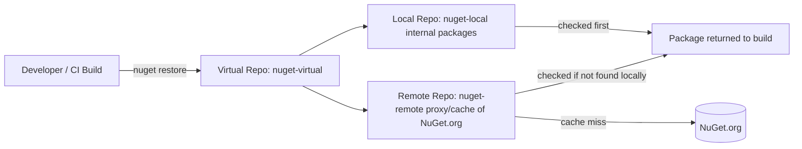
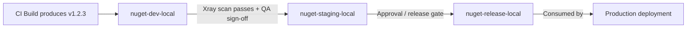

# JFrog Artifactory — Quick Revision Notes

> Quick-revision notes derived from the JFrog Artifactory Senior .NET Interview Guide. Covers every section and sub-topic in the same order, condensed into Q/A pairs, tight bullets, and the key code/config/diagrams. Focus is on the "why" and trade-offs, not just definitions.

---

## Core Concepts

### What is JFrog Artifactory

**Q: What is Artifactory in one line?**
A: A **universal binary repository manager** — stores, versions, and distributes build artifacts (packages, containers, libraries) securely and with access control; the single source of truth for "what got built and what got shipped."

- Senior framing: it's not "a place to put NuGet packages" — it's the **artifact provenance and supply-chain control point** between source control and production.
- Every production binary should trace back to the exact commit, build, and dependency set that produced it.

### Why Use It

- **Central repository** for binaries, Docker images, Helm charts, etc.
- **Multi-package-type**: Maven, npm, NuGet, PyPI, Docker, Helm, RPM — one platform instead of many single-purpose registries.
- **Caching/proxying** of external registries (Maven Central, npm, NuGet.org, Docker Hub) — less third-party dependence, faster builds.
- Integrates with Jenkins, GitHub Actions, GitLab CI, Azure DevOps.
- Security: access control, Xray scanning, license compliance.
- Deploy as **Cloud (SaaS)** or **On-Prem (self-hosted)**.

**Q: Why not point builds directly at NuGet.org / npmjs.com?**
A:
- **Supply-chain risk** — public outage, yanked package, or malicious dependency (typosquatting, dependency confusion). A private proxy/cache gives control + fallback.
- **Compliance** — regulated industries need an auditable, access-controlled store; prod can't point at the open internet.
- **Performance** — caching means CI doesn't re-download the same package every build (huge at scale).

### Key Features

1. **Repository Management** — local/remote/virtual repos; fine-grained access control per repo and per path (permission targets).
2. **Universal Binary Repository** — native dependency semantics per package type.
3. **Build Integration** — Jenkins, Azure DevOps, GitHub Actions, Bitbucket; artifact storage, versioning, build-info.
4. **Security & Compliance** — Xray; access tokens, LDAP, SSO, RBAC.
5. **HA & Scalability** — multi-node clustering, geo-replication.

---

## Repository Types

### Local, Remote, Virtual Repositories

| Type | Purpose | Example | Who writes |
|---|---|---|---|
| **Local** | Stores your internally built artifacts | NuGet repo with your `.nupkg` files | Your CI (push) |
| **Remote** | Proxy/cache of an external registry | Caches NuGet.org / npm | Artifactory (pull-through); read-only to consumers |
| **Virtual** | Aggregates local + remote behind one URL | One feed serving internal + cached public NuGet | N/A — routing/aggregation layer, no physical storage |

**Key interview point:** developers and CI should almost always point at a **virtual** repo, never local/remote directly. One stable URL regardless of backend reorg; enables transparent promotion and proxying.

### Resolution Order in Virtual Repositories

- A virtual repo resolves requests by checking members **in a configured order** — **local first** is the recommended pattern, then remote/cached.
- Why it matters:
  1. **Correctness** — internal name colliding with a public one; order decides which wins.
  2. **Dependency confusion attacks** (hot 2024–2026 topic) — attacker publishes a malicious public package with the same name as your private one. If remote is checked before local (or names aren't scoped), the build silently pulls the attacker's package.
- **Mitigations:**
  - Resolve local before remote.
  - Use scoped/prefixed internal names (e.g., `Contoso.*`).
  - Use include/exclude patterns on remote repos to block your internal namespace from external resolution.



### NuGet-Specific Repository Setup for .NET Teams

- **Local repo** `nuget-local` — packages your teams publish.
- **Remote repo** `nuget-remote` — points at `https://api.nuget.org/v3/index.json` to proxy/cache public packages.
- **Virtual repo** `nuget` — combines both; the single feed URL every `NuGet.Config` and CI job references.

```xml
<?xml version="1.0" encoding="utf-8"?>
<configuration>
  <packageSources>
    <clear />
    <add key="corp-artifactory" value="https://artifactory.example.com/artifactory/api/nuget/v3/nuget" />
  </packageSources>
  <packageSourceCredentials>
    <corp-artifactory>
      <add key="Username" value="%ARTIFACTORY_USER%" />
      <add key="ClearTextPassword" value="%ARTIFACTORY_API_KEY%" />
    </corp-artifactory>
  </packageSourceCredentials>
</configuration>
```

```bash
dotnet nuget push my-package.1.0.0.nupkg -s corp-artifactory -k %ARTIFACTORY_API_KEY%
```

- **Gotcha — v2 vs v3:** Artifactory supports legacy NuGet v2 and modern v3 (JSON, faster) endpoints. Always prefer **v3** (`api/nuget/v3/<repo>`) for modern `dotnet` CLI; v2 is slower and only for legacy `nuget.exe`.

---

## Using Artifactory in a Pipeline

### Manual Upload/Download Examples

Upload a Maven artifact via cURL:
```bash
curl -u user:password -T my-app.jar \
  "http://artifactory.example.com/artifactory/libs-release-local/com/myapp/my-app/1.0.0/my-app-1.0.0.jar"
```

Pull a Docker image:
```bash
docker login artifactory.example.com
docker pull artifactory.example.com/my-repo/my-image:latest
```

### JFrog CLI

```bash
# Install
curl -fL https://getcli.jfrog.io | sh
# Configure credentials (interactive)
./jfrog config add
# Upload an artifact
./jfrog rt upload "build/*.jar" libs-release-local/
```

**Q: Why prefer JFrog CLI over raw curl/docker?**
A: Handles retries/checksums, supports **build-info collection** (`build-collect-env`, `build-publish`), and integrates Xray scanning (`build-scan`) in one consistent tool across package types.

### GitHub Actions Example

```yaml
name: Build and Deploy to JFrog
on: push
jobs:
  build:
    runs-on: ubuntu-latest
    steps:
      - name: Checkout Code
        uses: actions/checkout@v3
      - name: Setup JFrog CLI
        run: |
          curl -fL https://getcli.jfrog.io | sh
          ./jfrog config add my-artifactory --url=https://artifactory.example.com --user=${{ secrets.ARTIFACTORY_USER }} --password=${{ secrets.ARTIFACTORY_PASSWORD }}
      - name: Build and Upload Artifact
        run: |
          ./jfrog rt upload "dist/*.jar" my-repo/
```

- **Best practice note:** raw `--password` in CI works but isn't ideal. Prefer the official `jfrog/setup-jfrog-cli` Action with **OIDC token exchange** (no long-lived secret stored in GitHub).

### Azure DevOps / dotnet CLI Integration

Two patterns (Azure DevOps is more likely than GH Actions in a .NET shop):
1. **Azure Artifacts + Artifactory as upstream** — Azure Artifacts feed with Artifactory NuGet virtual repo as upstream (less common, adds a hop).
2. **Direct Artifactory integration (typical enterprise)** — JFrog Azure DevOps extension task or plain CLI YAML:

```yaml
steps:
  - task: NuGetAuthenticate@1
  - script: |
      dotnet restore --source https://artifactory.example.com/artifactory/api/nuget/v3/nuget
      dotnet build
      dotnet nuget push "**/*.nupkg" -s https://artifactory.example.com/artifactory/api/nuget/v3/nuget -k $(ARTIFACTORY_API_KEY)
    displayName: 'Restore, Build, Push to Artifactory'
```

**Q: How do you avoid hardcoding the API key in YAML?**
A: Azure DevOps variable groups backed by **Azure Key Vault**, or service connections, injected as masked pipeline secrets — never committed.

---

## Intermediate Topics

### Artifact Promotion Between Environments

**Q: How do you promote dev → staging → prod without rebuilding?**
A: **Build once, promote many.** Build the binary once, then move/copy/tag that exact artifact through repos representing pipeline stages. Guarantees what's tested is what ships (no rebuild drift).

- Typical layout: `nuget-dev-local` → `nuget-staging-local` → `nuget-release-local` (or property/tag-based promotion in one repo, e.g. `promotion.status=released`).



**Mechanics:**
- `jfrog rt build-promote` or **Promotion API** (`POST /api/build/promote/{buildName}/{buildNumber}`) moves/copies artifacts + build-info, optionally adds properties.
- Gate promotion on **Xray results** (no critical CVEs) and/or manual approval — release governance without re-running the build.
- Same physical artifact (same SHA256) moves through → true immutability for audits ("prove prod = what was scanned and approved").

### Retention and Cleanup Policies

**Q: How do you control storage cost?**
A: Local repos accumulate snapshots + cached artifacts indefinitely by default → cost + slow search/indexing. Approaches:

- **Retention/cleanup policies** (native in modern Artifactory) — e.g., "delete artifacts older than N days with no downloads in M days" for non-release repos.
- **AQL (Artifactory Query Language) cleanup scripts** — classic portable approach, run on schedule:
```sql
items.find({
  "repo": "nuget-dev-local",
  "created": {"$before": "30d"}
})
```
  then feed results into a delete op.
- **Remote cache eviction** — evict unused cached artifacts (pure cache hygiene, not compliance).
- **Exempt release repos** — cleanup should exclude `*-release-local`; only prune dev/snapshot/staging.
- Respect legal/compliance retention minimums (SOX, industry rules) before deleting audit-relevant artifacts — a deliberate, documented decision.

### Build-Info, Provenance, and SBOM

- **Build-info** — JSON blob captured per build: artifacts produced, dependencies resolved (with checksums), CI job/VCS revision, env vars, commits/issues. Published via `jfrog rt build-publish` or automatically with build-aware CLI commands.
- Powers **promotion**, **build comparison** ("what changed between build 41 and 42"), and **full traceability** from prod binary → source commit.
- **SBOM (Software Bill of Materials)** — Xray/Artifactory generate SBOMs (CycloneDX/SPDX) from build-info + dependency graph; increasingly a hard compliance requirement for gov/enterprise sales.
- **Provenance** — build-info + SBOM + signing gives a chain of custody: commit → build → deps resolved → artifact → scan → promotion → deployment. This is what **SLSA** compliance requires; live 2025–2026 topic (SolarWinds, npm/PyPI compromises).

---

## Advanced Topics

### JFrog Xray — Security & License Scanning

- Performs **recursive dependency-graph analysis** — unpacks the artifact and walks the full transitive tree, matching each component against CVE + license databases.
- Two integration points:
  1. **Repo-level scanning** — continuous; catches newly-disclosed CVEs in *already-stored* artifacts.
  2. **Build-level scanning** (`jfrog rt build-scan`) — scans a build's dep graph in CI; can **fail the pipeline** on policy violations (critical CVE, disallowed license).
- **Why repo-level matters more than expected:** a package clean at build time can get a CVE disclosed 6 months later. Continuous scanning re-flags it; a one-off build-time check (`dotnet list package --vulnerable`) never would.
- **License compliance:** flag/block copyleft (GPL, AGPL) incompatible with closed-source products — common trick question ("how do you stop someone pulling in a GPL library?").
- **Gotcha:** Xray is a **paid add-on**, not in free/base tiers.

### Immutability, Versioning, and Reproducible Builds

- Local repos should be **immutable for release artifacts** — once `my-app-1.0.0.nupkg` is published, never overwrite with different bytes under the same version. Enforced by repo config (disallow overwrite) + semver discipline.
- **Snapshot/pre-release** repos (Maven `-SNAPSHOT`, NuGet `-beta`/`-ci`) are expected to be mutable — that's the point.
- Why immutability matters: if `1.0.0` can silently change, you lose the ability to reason about what's deployed — cache poisoning (one server caches old 1.0.0, another pulls new) and unreliable rollback.
- **Checksums** (SHA-1/SHA-256) per artifact detect tampering/accidental overwrite — ties into supply-chain integrity and makes build-info/provenance work.
- **Reproducible builds** (stretch topic): ideal is same commit + locked deps → bit-for-bit identical artifact. Artifactory doesn't guarantee this (it's a build-tooling concern — deterministic compilation, `packages.lock.json`), but immutable storage + build-info makes *verifying* reproducibility possible.

### Access Tokens, Identity, and Securing Feeds

- **API Keys (legacy)** — deprecated by JFrog in favor of access tokens; migrate off.
- **Access Tokens** — scoped, expiring, revocable JWT tokens scoped to identity/repo/permission — the modern recommended CI credential.
- **OIDC / platform-native identity** — current best practice: OIDC trust between Artifactory and the CI provider; pipeline exchanges a short-lived OIDC token for a short-lived access token **at runtime** — no long-lived secret stored at all. Kills "secrets sprawl."
- **RBAC / Permission Targets** — permissions per repo (or repo path pattern) to users/groups, not globally. Least-privilege: CI service accounts get **write** only to the specific local repo they publish to, **read** only on the virtual repo they consume.
- **LDAP/SSO (SAML/OIDC for humans)** — centralizes identity so artifact access follows corporate offboarding/lifecycle (audit: prove a terminated employee's access was revoked everywhere).
- **Gotcha:** rotating a shared service-account password across a dozen pipelines is painful/risky; scoped short-lived per-pipeline tokens or OIDC avoid it entirely.

### Terraform Provider for Artifactory and CDKTF-Driven Provisioning

**Q: How would you provision a new team's Artifactory repos without touching the UI?**
A: Use the **`jfrog/artifactory` Terraform provider** — every Artifactory object (repos, permission targets, retention) becomes a first-class Terraform resource, reasoned about as code.

```hcl
terraform {
  required_providers {
    artifactory = {
      source  = "jfrog/artifactory"
      version = "~> 12.0"   # verify current major version at implementation time
    }
  }
}

provider "artifactory" {
  url          = "https://artifactory.example.com/artifactory"
  access_token = var.artifactory_access_token   # short-lived/scoped token, not a shared password
}

resource "artifactory_local_nuget_repository" "nuget_local" {
  key = "nuget-local"
}

resource "artifactory_remote_nuget_repository" "nuget_remote" {
  key               = "nuget-remote"
  url               = "https://api.nuget.org/v3/index.json"
  feed_context_path = "api/v3"
}

resource "artifactory_virtual_nuget_repository" "nuget_virtual" {
  key          = "nuget"
  repositories = [
    artifactory_local_nuget_repository.nuget_local.key,
    artifactory_remote_nuget_repository.nuget_remote.key,
  ]
  # resolution order matches local-first (dependency-confusion defense)
}

resource "artifactory_permission_target" "order_team_nuget" {
  name = "order-team-nuget-publish"
  repo {
    repositories = [artifactory_local_nuget_repository.nuget_local.key]
    actions {
      users {
        name        = "svc-order-ci"
        permissions = ["read", "write", "annotate"]
      }
    }
  }
}
```

**Why it matters (senior):**
- **Repeatable, reviewable provisioning** — the local/remote/virtual repo triple becomes a PR-reviewed module, not a manual runbook.
- **Permission targets as code** — least-privilege RBAC is easier to enforce/audit as a versioned resource than a UI checkbox grid.
- **Drift detection** — `terraform plan` surfaces out-of-band UI changes (GitOps value applied to repo config).
- **Consistency across environments** — one parameterized module provisions dev/staging/release repos identically.
- **CDKTF** — same provider consumable via CDKTF bindings (TS/C#), so Artifactory provisioning lives in the same codebase/language as the rest of the IaC (e.g., a "new-service onboarding" construct that provisions ECS service + IAM role + Artifactory repo + permission target together).

**Follow-up: "Benefit over clicking the UI once?"** → Not the one-time cost (UI is faster for one ad hoc repo) — it's **repeatability at scale** (40th team like the 1st, zero drift), **audit trail** (PR history vs tribal knowledge), and **tying repo lifecycle to the same review/approval gate** as all other infra.

### High Availability & Scalability

- **Multi-node clustering** — nodes behind a load balancer sharing a common DB + filestore (or HA storage), for failover and horizontal read/write scaling.
- **Geo-replication** — push- or pull-based repo replication across regions so distributed teams/CI read from a local instance instead of crossing continents; reduces latency + provides DR redundancy.
- **Filestore separation (verify per version/edition):** Artifactory typically separates metadata (DB) from binary storage (filestore — local disk, NFS, cloud object store like S3/Azure Blob). Matters for HA/DR planning and backup/failover design questions.

---

## Best Practices

- Point developers/CI at **virtual** repos, never local/remote directly.
- Enforce **local-first resolution order** to defend against dependency confusion.
- Use **scoped internal package naming** (company prefix) to reduce collisions.
- Treat release/local repos as **immutable** — no overwriting published versions.
- **Build once, promote many** — never rebuild per environment.
- Gate promotion on **Xray results** (no critical CVEs, no disallowed licenses) as automated policy.
- Use **short-lived scoped tokens or OIDC federation** for CI, not long-lived shared passwords/API keys.
- Apply **least-privilege RBAC** per repo/permission target.
- Set **retention/cleanup policies** on dev/snapshot repos; exempt + document release repos.
- Capture/publish **build-info** on every CI build for traceability, promotion, comparison.
- Prefer **JFrog CLI** / official CI extensions over raw curl — free retries, checksums, build-info, Xray.

## Common Pitfalls

- Pointing CI at a **remote** repo (bypasses caching) or **local** repo (bypasses aggregation) instead of virtual — breaks the abstraction.
- Misconfigured resolution order letting a public package shadow an internal one (dependency confusion).
- Treating Xray as optional — supply-chain blind spot; at minimum gate release promotion on a scan.
- Letting dev/snapshot repos grow unbounded — storage cost + degraded search/index.
- Allowing overwrite on release repos — breaks the immutable = trusted guarantee, causes "worked yesterday" incidents.
- Storing long-lived passwords/API keys in pipeline YAML or unscoped secrets — should be masked, scoped, ideally OIDC short-lived.
- Forgetting the **v2 vs v3 NuGet protocol** distinction and using the slower legacy v2 endpoint.
- Assuming HA/clustering and Xray are in every license tier — often paid add-ons; confirm licensing.

---

## Artifactory vs Azure Artifacts vs Nexus

| Dimension | JFrog Artifactory | Azure Artifacts | Sonatype Nexus |
|---|---|---|---|
| Package breadth | Very broad (Maven, npm, NuGet, PyPI, Docker, Helm, RPM, Go, Conan...) | Narrower (npm, NuGet, Maven, Python, universal); tied to Azure DevOps | Broad, similar to Artifactory |
| Multi-cloud/on-prem | Strong — SaaS or self-hosted, cloud-agnostic | Azure DevOps-native; weaker outside Azure | Strong — self-hosted or cloud |
| Security scanning | Xray (deep recursive, paid) | Basic; leans on Defender for DevOps / GHAS | Nexus IQ/Lifecycle (paid), comparable to Xray |
| CI/CD ecosystem fit | Broadest (Jenkins, GH Actions, Azure DevOps, GitLab, Bitbucket) | Best only if all-in on Azure DevOps | Broad, similar to Artifactory |
| HA / geo-replication | Enterprise clustering + geo-replication (paid) | Managed by MS; no user geo-replication | Nexus HA in Pro tier |
| Typical fit | Large orgs, polyglot, multi-cloud/hybrid, strong governance | Teams all-in on Azure DevOps wanting zero extra infra | Cost-sensitive, Artifactory-like breadth, different pricing |
| Licensing | Per-feature tiers (Xray, HA, geo paid) | Bundled with Azure DevOps, per-GB + retention | Free/OSS core; paid Pro for IQ/HA |

**Answer interviewers want:** "It depends on org footprint." 100% Azure DevOps and no polyglot/multi-cloud need → Azure Artifacts is simpler, zero extra infra. Artifactory/Nexus earn their complexity with **multiple CI systems, multiple package ecosystems, multi-cloud/on-prem, or deep security/compliance (Xray/IQ) + governed promotion** that Azure Artifacts lacks natively.

---

## Advantages and Disadvantages

**Advantages**
- Multiple package types; caching/proxying for faster builds; CI/CD integration; Xray security scanning; HA & scalability via clustering.

**Disadvantages**
- Paid licenses for advanced features (Xray, HA, geo-replication).
- Setup complexity for self-hosted.
- Extra storage for large repos (mitigated by cleanup/retention policies).

## Popular Use Cases

- **CI/CD Pipelines** — storing/managing build artifacts.
- **Docker Image Management** — private container registry.
- **Dependency Management** — proxy for external repos.
- **Security & Compliance** — vulnerability scanning.

---

## Sample Interview Q&A

**Q: Difference between local/remote/virtual, and which does `NuGet.Config` point at?**
A: Local stores what you own; remote proxies/caches an external registry; virtual aggregates both behind one stable URL. Point developers/CI at the **virtual** repo — insulates from backend reorg, one feed for internal + cached public packages.

**Q: How to prevent a dependency confusion attack?**
A: Resolution order checks **local before remote**, use a company-prefixed internal naming convention, and optionally set include/exclude patterns on the remote repo to block your internal namespace from public resolution.

**Q: Explain "build once, promote many."**
A: Build once in CI, then move/copy that same artifact (build-info + checksum intact) through dev → staging → release stages, gated by Xray and/or approvals. Guarantees staging binary is byte-for-byte what ships to prod — no rebuild drift.

**Q: How to keep storage costs down?**
A: Retention/cleanup policies (or AQL scripts) on dev/snapshot repos by age + download activity, remote cache eviction for unused artifacts, and exempt release/audit repos from auto-deletion.

**Q: Role of Xray and where it plugs in?**
A: Recursive dependency-graph vuln + license scanning — continuously at repo level (catches newly disclosed CVEs in stored artifacts) and at build time (`build-scan`), where it can fail a pipeline or block promotion on policy violations (critical CVEs, disallowed licenses like GPL in closed-source).

**Q: How should CI authenticate — what's wrong with shared user/password in YAML?**
A: Prefer scoped short-lived access tokens, or OIDC federation so no long-lived secret is stored. A shared password is a single point of compromise, hard to rotate without downtime across pipelines, and usually over-privileged vs least-privilege RBAC.

**Q: When choose Artifactory over Azure Artifacts in an all-Azure-DevOps shop?**
A: When you need polyglot support beyond Azure Artifacts, multi-cloud/on-prem, deeper security/license scanning (Xray), or governed multi-stage promotion — otherwise Azure Artifacts is the lower-overhead default.

**Q: What guarantees immutability of a released NuGet package, and why care?**
A: Repo config disallowing overwrite + semver discipline (never reuse a version) + checksum verification. Deployments, rollbacks, and audits all assume "1.0.0" = exactly one set of bytes forever; mutable release artifacts break reproducibility and mask tampering.

**Q: What is build-info and how does it relate to SBOM/provenance?**
A: Per-build metadata — artifacts produced, deps resolved (checksums), source revision, environment. Foundation for promotion, build comparison, and generating an SBOM (CycloneDX/SPDX) — full chain-of-custody from commit to deployed artifact; increasingly a compliance requirement (SLSA, gov SBOM mandates).

---

## Summary of Additions

`[new content]` sections added to the original generic overview for a senior .NET interview:
1. **Resolution Order in Virtual Repositories** — dependency confusion attacks.
2. **NuGet-Specific Repository Setup** — concrete `NuGet.Config`, v2 vs v3 protocol.
3. **Azure DevOps / dotnet CLI Integration** — the more relevant Azure DevOps YAML pattern + credential handling.
4. **Artifact Promotion Between Environments** — "build once, promote many."
5. **Retention and Cleanup Policies** — policy mechanics + AQL example.
6. **Build-Info, Provenance, and SBOM** — supply-chain traceability/compliance (SLSA, SBOM mandates).
7. **JFrog Xray** — mechanism, repo-level vs build-level, license angle, licensing-tier gotcha.
8. **Immutability, Versioning, Reproducible Builds** — deployment safety/rollback reasoning.
9. **Access Tokens, Identity, Securing Feeds** — API keys vs access tokens vs OIDC, least-privilege RBAC.
10. **Artifactory vs Azure Artifacts vs Nexus** — "why not just use X" comparison.

**Contradictions flagged:** None — source was internally consistent; thin areas were supplemented, not corrected.

## Summary of gaps Additions (This Pass)

Follow-up gap analysis flagged that all repo/permission-target setup was described as manual UI config with no IaC connection — a real gap given Terraform/CDKTF tooling. Added:
1. **Terraform Provider for Artifactory and CDKTF-Driven Provisioning** — `jfrog/artifactory` provider as the mechanism to provision local/remote/virtual NuGet repos + permission targets as code, mirroring the repo-triple pattern. Connected to least-privilege RBAC (permission targets as reviewable code), "build once, promote many" (parameterized dev/staging/release modules), GitOps drift detection (`terraform plan`), and CDKTF (Artifactory provisioning in the same codebase/language as the rest of the IaC).
