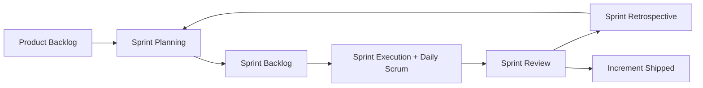
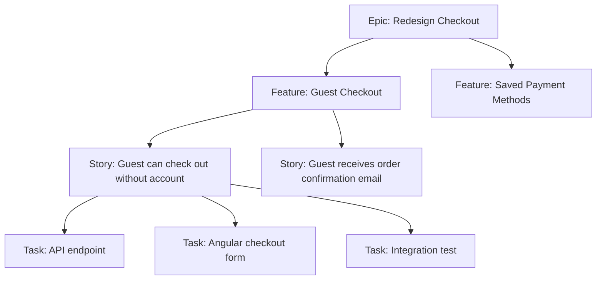
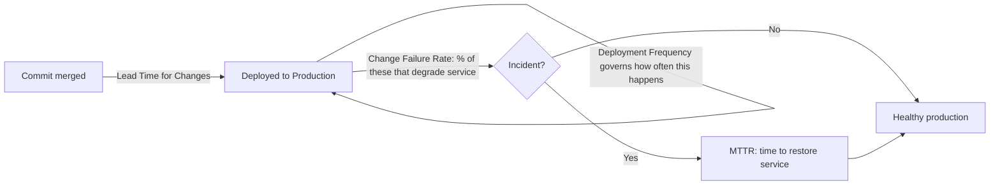
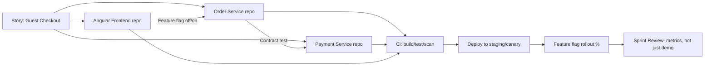
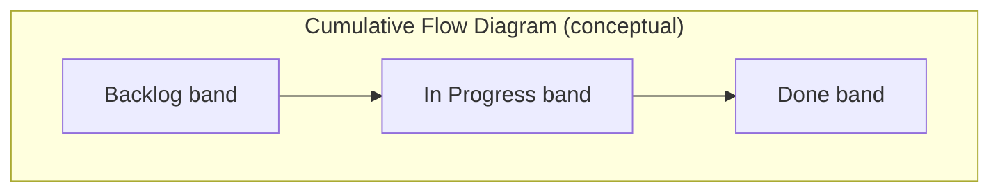

# Agile Interview — Quick Revision Notes (Senior .NET Full-Stack / Lead)

> Quick-revision notes derived from the Agile Interview Guide. Covers every section in the same order — Core, Intermediate, Advanced Concepts, Best Practices, Anti-Patterns, Pitfalls, Metrics Dashboards, and Sample Q&A. Enough to brush up each topic without opening the guide.

---

## Core Concepts

### What is Agile?

**Q: What is Agile?**
A: An iterative, incremental approach — work delivered in small cycles (sprints) with continuous feedback, collaboration, and adaptability. It's a *mindset/set of values* (Agile Manifesto), not a process. Scrum, Kanban, XP, SAFe are *frameworks that implement* it.

- **Manifesto (4 values):** individuals & interactions > processes & tools; working software > comprehensive docs; customer collaboration > contract negotiation; responding to change > following a plan.
- **Senior nuance:** show Agile is a *philosophy*, not rigid process. Know when by-the-book Scrum is wrong — e.g. a small legacy-maintenance team is better served by Kanban than sprints.

### What is Scrum?

**Q: What is Scrum?**
A: An Agile framework running fixed-length sprints (1–4 weeks, usually 2). Defines:

- **Roles:** Product Owner, Scrum Master, Developers (Scrum Guide 2020+ — PO & SM are part of the Scrum Team, not separate).
- **Artifacts:** Product Backlog, Sprint Backlog, Increment.
- **Events:** Sprint Planning, Daily Scrum, Sprint Review, Sprint Retrospective, and the Sprint itself (container event).



### What is a User Story?

**Q: What is a user story?**
A: A lightweight description of a feature from the end user's perspective — captures requirements to *drive a conversation*, not an exhaustive spec. It's a placeholder for a conversation, not a contract.

**Format:**
```
As a [user/role], I want [feature/capability], so that [benefit/value].
```

- **Senior nuance:** acceptance criteria (often Given/When/Then / Gherkin) is what makes a story testable and "done."

```gherkin
Given a registered user on the login page
When they submit valid credentials
Then they are redirected to the dashboard
And a session token is issued
```

### Functional vs Technical (Non-Functional) Requirements

- **Functional** = *what* the system does (login, add to cart, generate report, reset password).
- **Non-Functional / Technical** = *how well* it performs — quality attributes & constraints (API < 500ms, encryption at rest/in transit, 10k concurrent users, mandated Angular + .NET stack).

| Aspect | Functional | Non-Functional |
|---|---|---|
| Answers | What does it do? | How well does it do it? |
| Example | User can reset password | Reset email sends within 2s |
| Testing | Behavioral/acceptance | Load, security, performance, chaos |
| Owner (typical) | BA / PO | Architect / Tech Lead |
| Visibility to user | Directly visible | Invisible unless violated |

### Who Defines Functional vs Technical Requirements

- **Functional:** BA or PO, with stakeholder/end-user input.
- **Technical:** Architect, Tech Lead, or Dev Team — based on system design, NFRs, platform constraints.
- **Senior nuance:** not a hard wall. Devs should push back on functional requirements with technical implications ("won't scale past X users without redesign"); POs should grasp enough constraint to prioritize NFR work. Best seniors *translate* business → technical and surface trade-offs *early*, before the sprint.

### Core Scrum Ceremonies

- **Sprint Planning** — team selects items from refined/prioritized backlog, plans the sprint. Produces **Sprint Goal + Sprint Backlog**.
- **Daily Standup (Daily Scrum)** — ≤15 min timeboxed sync. Classic 3 questions: done yesterday? / doing today? / blockers?
  - **Senior nuance:** the 3-question format is now considered dated by the Scrum Guide itself — modern framing inspects progress toward the *Sprint Goal* and re-plans, not a status report to the SM. Mentioning this signals you keep current.
- **Sprint Review** — end-of-sprint demo to stakeholders; inspect product & adapt backlog. A collaborative working session, not just a demo.
- **Sprint Retrospective** — after review, before next planning. What went well / didn't / concrete improvement actions for the *process* (not the product).

### Definition of Done (DoD)

**Q: What is DoD?**
A: A shared, team-agreed checklist that a backlog item is truly complete and potentially shippable. Typical .NET/Angular DoD:

- Code complete and merged to main/trunk
- Unit tests written and passing (coverage threshold met)
- Code review / PR approved
- Integration tests pass in CI
- No new critical/high static-analysis or security findings (SonarQube etc.)
- Deployed & verified in test/staging
- Acceptance criteria verified
- Docs/README/API contract updated if applicable

- **Gotcha:** DoD is a *team-wide, per-increment* standard applied to every story. Renegotiating it story-by-story signals a maturity problem.

### Backlog Refinement

Ongoing process ("grooming") of reviewing, clarifying, splitting, estimating, re-prioritizing items *before* they enter a sprint. Recurring event (e.g. weekly) — keeps the top of the backlog always "sprint-ready."

### Agile vs Waterfall

| Aspect | Agile | Waterfall |
|---|---|---|
| Delivery | Iterative, incremental | Sequential, at the end |
| Requirements | Evolve, embrace change | Fixed upfront, change costly |
| Feedback loop | Continuous (every sprint) | Only at end / milestones |
| Risk | Found & mitigated early | Found late, expensive |
| Documentation | Lightweight, just enough | Heavy, comprehensive upfront |
| Best fit | Uncertain/evolving, digital products | Fixed-scope, regulatory, hardware-coupled |

---

## Intermediate Concepts

### Story Point Estimation

Relative (not absolute) sizing by complexity, effort, uncertainty, risk — not hours. Uses Fibonacci-like scale (1,2,3,5,8,13,21…) because widening gaps force meaningful differentiation of larger, less-understood items.

- **Why relative, not hours:** humans are bad at absolute time, good at relative comparison. Decouples estimate from any single dev's speed — matters once velocity is used team-wide.

### Handling Changing Requirements

Agile expects change. Managed via **backlog reprioritization by the PO** — changes become new/modified backlog items, re-ranked against everything else, not injected into a locked sprint. Team is protected *within* the active sprint; the *backlog* absorbs change *between* sprints.

### Definition of Ready (DoR)

Criteria a story must meet *before* it enters a sprint:

- Clear, testable acceptance criteria
- Dependencies identified & ideally resolved/sequenced
- Estimated by the team
- Small enough to finish in a sprint
- UX/designs attached if relevant
- No open questions blocking implementation

### DoD vs DoR — Why Both Matter

Classic interview trap — candidates often know only one.

| | DoR | DoD |
|---|---|---|
| Applies to | Story *before* entering sprint | Story/increment *after* work complete |
| Purpose | Prevent starting ill-defined work | Prevent calling unfinished work "done" |
| Owned by | Team, enforced by PO+team in refinement | Team, enforced in review/PR/CI |
| Failure mode | Mid-sprint churn, blocked stories, re-estimation | Non-shippable "done" work, hidden tech debt, QA surprises |

- **Lead judgment:** DoR failures = *refinement* discipline problem; DoD failures = *quality/engineering* discipline problem. Diagnosing which is broken (and fixing the right ceremony) is core lead judgment.

### Epic vs Feature vs Story vs Task

- **Epic** — large initiative, multi-sprint/release, maps to a business goal ("Redesign checkout flow").
- **Feature** — functional grouping within an epic, still possibly multi-sprint ("Guest checkout").
- **Story** — user-focused, sprint-sized, with acceptance criteria ("As a guest, I want to check out without an account").
- **Task** — technical, implementation-level sub-unit of a story ("Add `GuestCheckoutController` endpoint", "Write EF Core migration").



### INVEST Principle for User Stories

- **I**ndependent — deliverable without hard sequencing on others
- **N**egotiable — details open for discussion, not a rigid contract
- **V**aluable — clear value to user/business
- **E**stimable — enough clarity to size it
- **S**mall — fits comfortably in a sprint
- **T**estable — clear, verifiable acceptance criteria

### Cross-Functional Teams

A team with all skills to take a feature idea → production without external dependency each increment — devs, QA, UX/UI, DevOps, sometimes embedded DBAs/SREs.

- **Point:** minimize *hand-off latency* and *queueing* between specialties (each hand-off = wait time + context loss).
- **When full cross-functionality isn't possible** (shared DBA/security team): embed a rotating liaison or build explicit SLAs — don't ignore the constraint.

### Agile Documentation Philosophy

"Just enough" docs over comprehensive upfront specs — "working software over comprehensive documentation" is *not* "no documentation." In a .NET/Angular shop: living API contracts (OpenAPI/Swagger), ADRs for significant decisions, and story-level acceptance criteria *replace* large requirement docs — lighter, more current, closer to the code.

---

## Advanced Concepts

### Scrum vs Kanban

| Aspect | Scrum | Kanban |
|---|---|---|
| Cadence | Fixed-length sprints | Continuous flow, no fixed iteration |
| Roles | Defined (PO, SM, Dev Team) | No prescribed roles |
| Ceremonies | Planning, standup, review, retro | Optional; often standup + replenishment |
| Commitment | Commit to a sprint's items | Pull work as capacity frees |
| Key constraint | Sprint length/capacity | **WIP limits** per column |
| Change mid-cycle | Discouraged | Naturally accommodated |
| Best fit | Plannable feature work | Support/ops/maintenance, unpredictable inflow |
| Core metric | Velocity (points/sprint) | Cycle/lead time, throughput |

### Scrum vs Kanban vs SAFe vs Scrumban

Tests whether you can pick the right framework rather than cargo-culting Scrum.

| Framework | Best for | Trade-off |
|---|---|---|
| **Scrum** | Product teams, plannable scope | Rigid cadence poor for interrupt-driven work |
| **Kanban** | Support/maintenance/ops, unpredictable inbound | No built-in cadence for retros/planning unless added |
| **Scrumban** | Scrum→flow transition, or mixed planned + unplanned support | Hybrid (sprints + WIP limits); can feel like "neither" if untuned |
| **SAFe** | Large orgs (50+ eng, multi-team), portfolio alignment | Heavyweight; risks "Waterfall in Agile clothing" if PI Planning bloats |

- **Follow-up to expect:** "When would you *not* use Scrum?" → production-support/BAU with constant interrupts fits Kanban + WIP limits + SLA classes of service better than 2-week commitments. Early-stage discovery/spike work also often fits Kanban flow.

### Handling Scope Change Mid-Sprint

Avoid during an active sprint (protected commitment). If truly required:

1. PO re-evaluates priority vs the sprint goal.
2. Team discusses impact (capacity, dependencies, risk).
3. Either defer to *next* sprint, or *swap out* a lower-value item — never just pile on.

- **Gotcha:** candidates who say "we just squeeze it in." Correct instinct = trade-off, not addition; protect sprint integrity and sustainable pace.

### Velocity and Its Use

Story points completed per sprint, averaged over recent sprints. Used for: planning (how much to pull in), release forecasting, capacity/staffing conversations.

- **Big gotcha:** velocity is a *team-specific, relative planning tool* — never a productivity/performance metric, never comparable across teams (points calibrated differently). Comparing people/teams by velocity is a textbook anti-pattern and a red flag.

### Velocity vs Throughput vs Cycle Time

| Metric | Definition | Framework | Tells you |
|---|---|---|---|
| **Velocity** | Story points per sprint | Scrum | Capacity for *planning* (same team only) |
| **Throughput** | # items (any size) per unit time | Kanban/flow | Delivery-rate predictability, estimation-independent |
| **Cycle Time** | Work *start* → *done* | Kanban/flow | Responsiveness/flow efficiency; what customers feel |
| **Lead Time** | Work *requested* → *delivered* | Both | End-to-end responsiveness, includes queue time |

- **Little's Law:** `WIP = Throughput × Cycle Time`.
- **Why it matters:** velocity can look great while cycle time balloons (busy, but items sit half-done from too much WIP). WIP limits are the lever to fix it.

### Managing Technical Debt in Agile

- Add debt items *explicitly* to the backlog — invisible debt never gets prioritized.
- Allocate dedicated capacity (common: reserve 10–20% per sprint, or periodic tech-debt sprints).
- Improve quality continuously (reviews, static analysis — SonarQube/Roslyn, automated tests) over big-bang cleanup.
- Tie debt to business impact ("slows feature X by Y%") so a PO can prioritize it.
- **Senior nuance:** *quantify and communicate* debt in terms a PO cares about (velocity drag, incident rate, onboarding time), not just "it's messy."

### Backlog Prioritization

PO orders items by: business value, risk, dependencies, customer needs.

### Prioritization Frameworks (WSJF, MoSCoW, Kano, RICE)

- **WSJF** (heavy in SAFe): `WSJF = Cost of Delay / Job Size`. Cost of Delay = user/business value + time criticality + risk reduction/opportunity enablement. Favors high-value, low-effort, time-sensitive work.
- **MoSCoW** — Must / Should / Could / Won't have. Good for scope negotiation & MVP definition.
- **Kano** — Basic (expected), Performance (more is better), Delighters (unexpected), Indifferent/Reverse. Good for UX-driven prioritization.
- **RICE** — `Score = (Reach × Impact × Confidence) / Effort`. Popular in product-led orgs; forces explicit confidence estimation → surfaces assumption risk.
- **Angle:** naming WSJF signals SAFe/scaled-Agile exposure (common in enterprise .NET).

### Agile Metrics

- Velocity
- Burn-down chart (remaining work vs time)
- Cycle time
- Lead time
- Sprint predictability (committed vs completed)

*(See flow metrics/Little's Law above, DORA below, and dashboards later.)*

### DORA Metrics

Framework-agnostic way engineering *organizations* measure delivery performance — measures outcomes at the *pipeline* level (works for Scrum, Kanban, anything). Origin: **DORA** (DevOps Research and Assessment, now Google Cloud) — years of large-scale survey data identified four metrics correlating with high performers.

| Metric | Definition | Measures |
|---|---|---|
| **Deployment Frequency** | How often you successfully release to prod | Batch size / cadence (elite: on-demand, multiple/day; low: < once/month) |
| **Lead Time for Changes** | Commit merged → running in prod | Pipeline speed (commit-to-prod — distinct from Agile story lead time) |
| **Change Failure Rate** | % of prod deployments needing remediation (rollback/hotfix/patch) | Deployment quality/risk — failures *after* reaching prod, not test bugs |
| **MTTR (Mean Time to Recovery)** | Time to restore service after a prod incident | Resilience/operational recovery — a reliability metric |



- **Two axes:** **throughput** (Deployment Frequency + Lead Time) and **stability** (Change Failure Rate + MTTR). Key finding: elite orgs are strong on *both* simultaneously — speed and stability are NOT a trade-off. Reframes "slow down to be safe" as *low* maturity.
- **Ties to Agile:**
  - Great velocity can mask poor MTTR — velocity says nothing about what happens after "Done."
  - **Retros** should track DORA trends, not just velocity/burn-down (surfaces "busy but fragile").
  - **Backlog health:** rising Change Failure Rate / MTTR = a prioritization signal → generates tech-debt/reliability backlog items with real priority, not a separate "ops problem."
  - **Deployment Frequency = batch-size health:** low frequency = large risky batches → leading indicator of future Change Failure Rate.
  - **Framing:** "Velocity = predictable at starting/finishing work in a sprint. DORA = whether that work is safe and fast to ship. A lead needs both."

### Handling Blockers

- Raise immediately in standup — don't wait.
- Collaborate first (pair up, unblock via peers).
- Escalate via Scrum Master if external/organizational (another team, infra access, vendor).

### Role of the Developer in Estimation

- Actively participate in planning poker / estimation.
- Provide technical complexity/risk the PO can't ("touches legacy payment integration — hidden 5, not a 2").
- Break stories into technical tasks during planning.

### Estimation Techniques Beyond Planning Poker

- **Planning Poker** — discussion-driven consensus; good for calibration & surfacing hidden complexity.
- **T-Shirt Sizing (XS–XL)** — fast, coarse; good for early epic-level sizing.
- **Affinity Estimation / Silent Grouping** — team silently buckets stories by relative size, then discusses outliers only — fast for large backlogs (50+ stories).
- **Bucket System** — predefined point buckets; very large-scale (SAFe PI Planning).
- **#NoEstimates** — provocative counter-approach: slice stories to similar small size, forecast via *throughput* not points. Cite to show awareness of the estimation debate.

### When Sprint Goals Are Not Achieved

- Analyze root cause in retro — don't just note & move on.
- Distinguish *planning/estimation* failures (over-commit, poor refinement) vs *execution* (unexpected complexity, blockers, absence) vs *external* (dependency delays, environments).
- Adjust future planning specifically (tighten DoR, buffer known risks) — address the actual root cause, not generic "estimate more conservatively."
- If repeated, it's a systemic signal for the SM, not a one-off retro item.

### Real-World Challenge: PO Adds Urgent Work Mid-Sprint

- Discuss impact openly (capacity, commitments, risk to sprint goal).
- Evaluate true priority vs what's committed — "urgent" doesn't auto-override the sprint.
- Resolution is a *trade*, not an addition: swap a lower-priority item, or defer — unless genuinely sprint-goal-threatening.
- **Senior nuance:** distinguish "urgent business request" from "production incident/hotfix." The latter legitimately interrupts (most DoD/process carves out a P1 exception); the former still goes through the trade-off conversation.

### Agile in a Microservices / CI-CD Context

- **Story slicing across service boundaries:** a vertical slice ("guest checkout") may span multiple services/repos. Slice so each is deliverable & independently testable within *one* service where possible; use **contract tests (e.g. Pact)** to decouple cross-service deps instead of lockstep releases.
- **Trunk-based dev + feature flags** replace long-lived branches — lets a story be "done" (merged, deployed) without being *released* (exposed), decoupling deployment from release → true continuous delivery within a sprint.
- **DoD expands:** passes pipeline gates (build, unit, integration, security scan), deployed to staging/canary, verified behind a feature flag — not just "code complete."
- **Sprint Review as release gate weakens** — with CI/CD software may already be in prod; review shifts to validating outcomes/metrics (A/B results, adoption) over a first-time demo.
- **Cross-team dependency management** dominates once a story needs coordinated changes in 3+ services owned by different teams — the problem SAFe PI Planning / dependency boards target.



### Scaling Agile: SAFe, LeSS, and Spotify Model

- **SAFe** — adds Program (Agile Release Train, PI Planning every 8–12 weeks) & Portfolio layers on team-level Scrum/Kanban. Strength: coordinates many teams; Weakness: can reintroduce Waterfall-like upfront planning if PI Planning is mishandled.
- **LeSS** — extends Scrum's rules to multiple teams sharing one Product Backlog & one Sprint; deliberately minimizes added process/roles (opposite of SAFe). Favors "descaling."
- **Spotify Model (Squads/Tribes/Chapters/Guilds)** — organizational topology, not a prescriptive framework: autonomous cross-functional squads by domain, chapters/guilds for skill communities. Spotify itself moved away from parts of it — don't over-cite as current best practice.
- **Practical take:** the scaling problem is really a *dependency-management & communication* problem — the framework matters less than whether the org visibly manages cross-team deps (dependency boards, PI Planning, Scrum-of-Scrums) rather than discovering them mid-sprint.

---

## Best Practices

- Keep sprints protected — no mid-sprint scope injection except genuine incidents.
- Make tech debt visible on the backlog with business-impact framing.
- Enforce DoR before Planning and DoD before "done" — both, consistently, not case-by-case.
- Use velocity only for the *same team's* forward planning — never cross-team or as a productivity metric.
- Slice stories vertically (thin end-to-end) not horizontally (all-UI then all-API) so each delivers value.
- Automate DoD verification (CI gates) over manual checklist honesty.
- Keep retros action-oriented — track action items to completion; not venting sessions.
- In scaled contexts, make cross-team dependencies visible early (dependency boards, PI Planning) not at integration time.

## Agile Anti-Patterns

- **Water-Scrum-Fall** — Scrum ceremonies bolted onto upfront big design + end hardening/UAT; sprints become status theater.
- **Zombie Scrum** — going through the motions with no real inspect-and-adapt; retro actions change nothing.
- **Velocity as productivity metric / point inflation** — inflating points to show "improvement" or comparing teams → incentivizes gaming.
- **Standup as status report to management** — turns Daily Scrum into top-down reporting, killing psychological safety.
- **PO-as-bottleneck / absent PO** — either approves every micro-decision (bottleneck) or is unavailable (team guesses); both break the collaborative role.
- **Scope creep as "just one more thing"** — harmless-seeming additions that cumulatively blow the sprint goal; fix = consistent trade-off discipline.
- **Retrospective without action** — repeatedly naming problems without owners/deadlines.
- **Estimation theater** — planning poker for form's sake while a delivery date is already committed externally.
- **Copy-pasted "Agile at scale"** — adopting SAFe/LeSS ceremonies wholesale without solving the underlying dependency/communication problem.

## Common Pitfalls

- Treating story points as hours (breaks relative estimation & cross-team comparability).
- Sprint Review as "just a demo" instead of inspect-and-adapt with stakeholders.
- Skipping refinement → under-specified stories in planning (DoR violated).
- Conflating DoD with acceptance criteria — DoD is story-agnostic & team-wide; acceptance criteria are story-specific.
- Ignoring tech debt until a prod incident, vs continuously tracking/paying it down.
- Using Scrum dogmatically for flow-based work (support/ops) that fits Kanban better.
- Overloading a sprint because "the team said yes" under pressure, ignoring capacity/velocity.

## Agile Metrics Dashboards and Reporting to Leadership

Realistic lead question: "How do you report team health to a VP who doesn't care about story points?"

- Translate team metrics → business-facing ones: **predictability** (committed vs delivered %), **lead time to production**, **defect escape rate** — not raw point counts.
- Beware **Goodhart's Law** ("when a measure becomes a target it ceases to be a good measure") — publishing velocity → point inflation; prefer throughput/cycle-time trends (harder to game).
- **Cumulative Flow Diagrams (CFDs)** — undervalued; visually show leadership *where work is stuck* (widening "in progress" band = bottleneck) without needing them to understand story points.



---

## Sample Interview Q&A

**Q: Introduce Scrum to a team doing ad-hoc, unstructured development?**
A: Start with pain points, not ceremonies (missed deadlines, unclear priorities, rework). Introduce a lightweight backlog, a short 1–2 week cadence, a real DoD, and retros from day one so the process self-corrects. Avoid big-bang adoption of every artifact; earn trust with a few working sprints before adding ceremony weight.

**Q: Velocity flat for 3 sprints but the team says they're busier than ever — what do you investigate?**
A: Check if "busier" = more WIP, not more throughput (look at cycle time & WIP, not velocity). Check hidden work (unplanned interrupts, prod support) not on the board. Check point inflation/estimation drift. Check context-switching (too many concurrent stories/person). Velocity is a lagging aggregate — cycle time & WIP diagnose the cause.

**Q: Stakeholder wants fixed date + fixed scope, but org runs Scrum?**
A: Fixed date + scope + quality = "iron triangle" conflict — something flexes. Negotiate an MVP scope upfront (MoSCoW), commit the date against that reduced scope, use the backlog to absorb "nice to haves" cut as the date approaches, verified sprint-by-sprint via velocity forecasting rather than one upfront estimate.

**Q: How do you know DoD is honored, not just on a wiki?**
A: Automate as much as possible into CI/CD gates (tests, coverage, security, static analysis) — enforced by pipeline, not self-reported. For non-automatable parts (e.g. QA review), enforce via board workflow (can't reach Done without a QA column + checklist) and audit sporadically in retro if escaped defects appear.

**Q: PO prioritizing backlog vs SM facilitating — where do responsibilities overlap/conflict?**
A: PO owns the *what/why* (value, priority, outcomes); SM owns the *how* (process health, impediments, coaching). Conflict when a PO dictates *how* the team works (mandating overtime) or an SM makes prioritization calls that belong to the PO. Keep them separated even when one person wears both hats on small teams (itself a known risk worth naming).

**Q: Handle a team member who consistently underestimates their tasks?**
A: Treat it as calibration, not performance, in a 1:1 first — check their breakdown process (missing testing/review/deployment effort?). Use retro planned-vs-actual data to make the pattern concrete. Pair them in estimation to calibrate against group consensus. Avoid public callouts — estimation accuracy is a team-learning problem, and points are meant to be relative/team-calibrated anyway.

---

## Summary of Additions (from source guide)

`[new content]` sections added to close 2026 senior/lead .NET interview gaps: DoD vs DoR contrast; Scrum vs Kanban vs SAFe vs Scrumban; Velocity vs Throughput vs Cycle Time (Little's Law); Prioritization Frameworks (WSJF/MoSCoW/Kano/RICE); Estimation beyond Planning Poker; Agile in Microservices/CI-CD; Scaling Agile (SAFe/LeSS/Spotify); Agile Anti-Patterns; Metrics Dashboards & Leadership Reporting. **Contradictions flagged:** none — the two source sections were complementary.

`[gaps]` addition: **DORA Metrics** — four metrics (Deployment Frequency, Lead Time for Changes, Change Failure Rate, MTTR), Google/DORA origin, throughput-vs-stability framing (elites strong on both), and the connection back to velocity blind spots, retros, backlog health, and deployment-batch-size.
