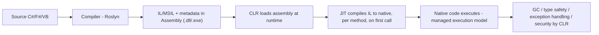
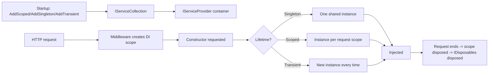
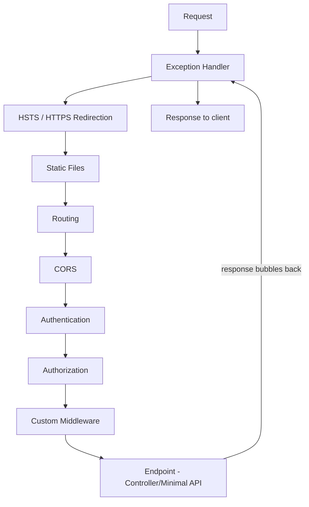
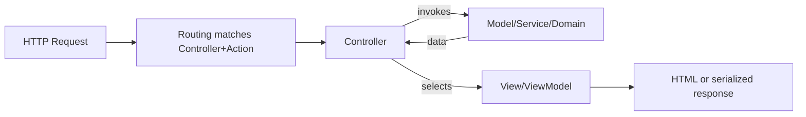
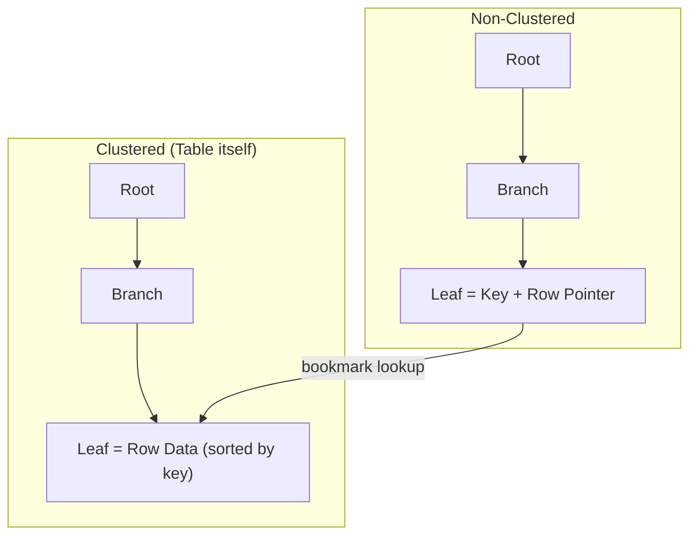
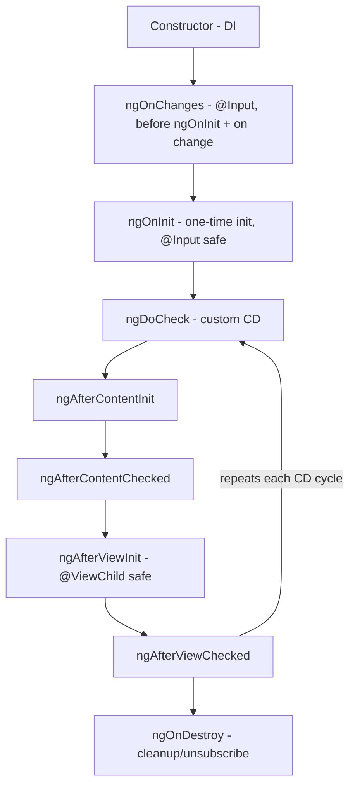
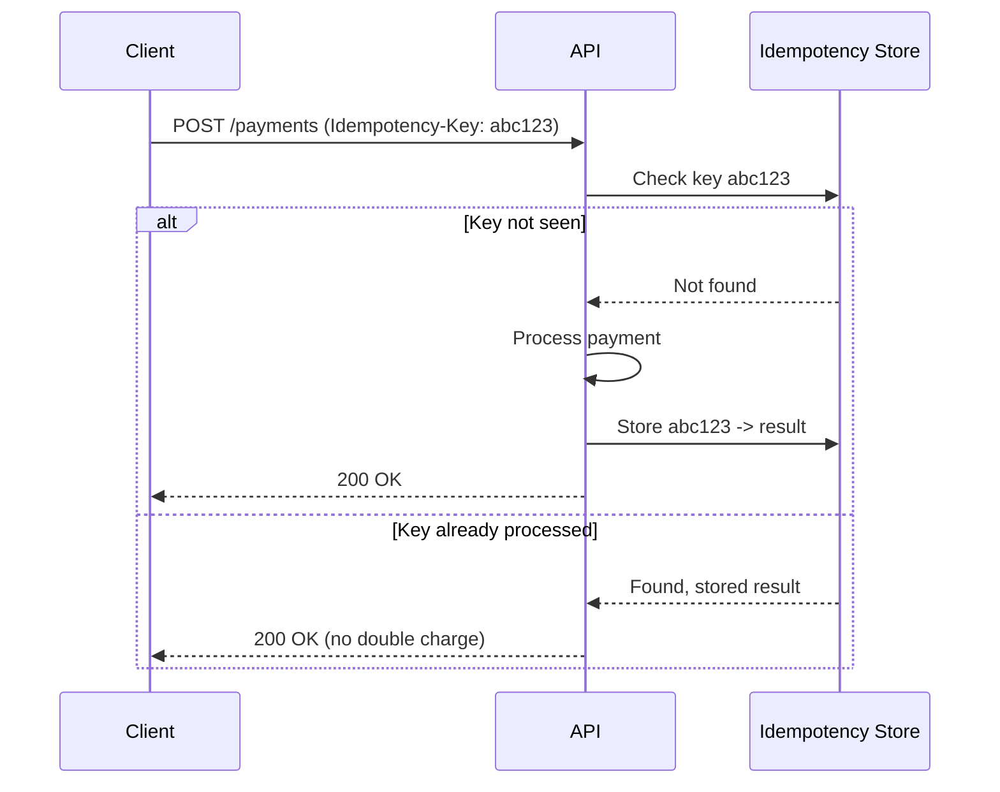

# Interview Questions — Senior .NET Full-Stack: Quick Revision Notes

> Quick-revision notes derived from the Senior .NET Full-Stack Interview Guide. Covers every section and topic in the same order — background, C#/OOP, async/concurrency, .NET Core/middleware, auth & API design, design patterns/SOLID, EF Core, SQL, Angular/TypeScript, coding round, and senior-level gap topics. Enough to brush up each topic without opening the full guide.

---

## 1. Tell Me About Yourself / Project Experience

**Q: How to answer "tell me about yourself"?**
A: A 90-second "walk", not a fact dump. Interviewer tests communication + seniority signaling.
- **Frame**: years of experience, primary stack (.NET/C#, Angular, SQL Server, Azure/AWS), and the *kind* of systems you build (high-throughput APIs, data-heavy LOB, e-commerce, integrations).
- **Depth signal**: 1-2 projects where you *owned* architecture, a hard problem (scaling/tricky bug/migration) + outcome with numbers ("p95 800ms→120ms", "infra cost -30%").
- **Current role**: scope (IC vs leading, mentoring, review ownership, architecture decisions).
- **Close with intent**: why looking, how the role fits your trajectory.
- Tailor concrete metrics/names to your real resume.
- Follow-ups: "hardest technical decision?", "what would you do differently?", "a technical disagreement and how it resolved?"

**Q: Responsibilities in current project?**
A: Talk **ownership, not tasks**: system design, API contracts, DB schema, code-review gatekeeping, mentoring, CI/CD ownership, incident response. Seniors influence decisions vs just executing tickets. Mention cross-team work (QA, DevOps, product).

**Q: Tech stack — backend/frontend/DevOps?**
A: Give the rundown *and the why*:
- **Backend**: C#/ASP.NET Core Web API, EF Core, SQL Server/PostgreSQL, message broker (RabbitMQ/Azure Service Bus/Kafka).
- **Frontend**: Angular version, state approach (NgRx / services+RxJS / signals), UI library.
- **DevOps**: CI/CD (Azure DevOps, GitHub Actions, Jenkins), Docker/Kubernetes, cloud, monitoring (App Insights, Grafana/Prometheus, ELK).
- Have one real trade-off ready (e.g., "NgRx over services+RxJS because state was shared across 12+ components; Redux DevTools debugging mattered more than boilerplate").

---

## 2. C# Language & OOP

### .NET — what it is and how it works

**Q: What is .NET and how does it work?**
A: A general-purpose platform = runtime + base class libraries + tooling. Multiple languages (C#, F#, VB.NET) compile to a common format on a shared execution engine.



- **Managed execution model**: CLR (not the raw OS) controls memory (alloc + GC), type safety (verified IL, no arbitrary pointers outside `unsafe`), uniform structured exception handling, security.
- **Senior nuance — tiered compilation**: Tier 0 = fast minimally-optimized JIT to start quickly; hot methods re-JIT at Tier 1 with full optimizations (startup latency vs steady-state throughput, resolved automatically). **Native AOT** (.NET 8+) compiles fully ahead of time, skipping JIT at runtime — great for cold starts/CLI/containers, but loses reflection-heavy/runtime-codegen features.

**Q: What is the CLR?**
A: The managed execution engine that hosts and runs compiled assemblies. Responsibilities:
- **JIT compilation** — IL→native per method, tiered.
- **Memory management** — owns managed heap, runs generational GC.
- **Type safety/verification** — no illegal casts/stray memory outside `unsafe`.
- **Structured exception handling** — uniform across all CLR languages.
- **GC hosting, thread/AppDomain management, interop** (P/Invoke, COM).
- Implementations: **CoreCLR** (cross-platform, modern .NET), **Mono** (mobile/Unity historically), **Native AOT** (no CLR/JIT at runtime). "CLR" ≠ "Windows".

**Q: What are assemblies?**
A: The fundamental unit of **deployment, versioning, and type-scoping** — a `.dll`/`.exe` containing IL code, metadata (enables reflection), a manifest (name, version, culture, references), optional embedded resources.
- **Assembly vs namespace vs module**: namespace = logical compile-time naming, no physical existence; assembly = physical deployable unit. One assembly holds many namespaces; a namespace *can* span assemblies. Orthogonal, despite the common 1:1 convention.
- **Loading/isolation**: .NET Core replaced GAC/strong-naming/AppDomain with **`AssemblyLoadContext`** — side-by-side loading of multiple versions of the same assembly in one process (robust plugin architectures without binding-redirect hell).
- Why it matters: metadata-driven **Reflection** powers DI auto-registration, EF entity scanning, JSON serializers, AutoMapper.

### Strings, types, constructors

**Q: What is a string? Why immutable?**
A: `string` = sealed reference type (`System.String`), sequence of UTF-16 chars, heap-stored despite value-like syntax. Immutable because:
- **Thread safety** — lock-free reads, no torn reads.
- **Interning/caching** — CLR interns literals; a mutable literal would corrupt all shared references.
- **Hashing reliability** — used as dictionary/hashset keys; a mutating key would break its bucket.
- **Security** — can't alter a validated value (filename, SQL fragment) after checks.
- Every "mutation" (`+=`, `.Replace()`, `.ToUpper()`) allocates a **new** string → concatenation in a loop is O(n²) allocations. Fix: `StringBuilder` (mutable internal buffer, materializes once on `.ToString()`), or `string.Create`/`Span<char>`.

**Q: .NET Framework vs .NET Core (and .NET 5+)?**

| Aspect | .NET Framework | .NET Core (→ .NET 5+) |
|---|---|---|
| Platform | Windows only | Cross-platform |
| Open source | Partially | Fully (GitHub) |
| Deployment | Machine-wide GAC | Self-contained/framework-dependent, side-by-side |
| Performance | Slower JIT, older GC | Faster (Server GC, tiered comp, ReadyToRun) |
| Modularity | Monolithic (System.Web) | NuGet, pay-for-what-you-use |
| Web stack | ASP.NET (System.Web, IIS-coupled) | ASP.NET Core (Kestrel, decoupled) |
| Future | Maintenance only | Active, yearly releases |
| Containers | Poor (heavy) | Excellent (Docker-first) |

- Since .NET 5, "Core" rebranded to just ".NET". Framework 4.8 = last version, security patches only. Even releases (8, 10) = LTS (3 yr); odd (7, 9) = STS (18 mo). (Verify LTS cadence vs target; as of 2026 .NET 10 is current LTS.)
- Follow-up (migrate legacy → .NET 8?): risks = `System.Web` removal, third-party lib compatibility; use .NET Upgrade Assistant + incremental strangler-fig, not big-bang.

**Q: Value types vs reference types?**

| | Value Types | Reference Types |
|---|---|---|
| Examples | `int`, `struct`, `enum`, `bool`, `DateTime` | `class`, `string`, `object`, arrays, delegates |
| Storage | Stack / inline in container | Heap; variable holds a reference |
| Assignment | Copies the value | Copies the reference (shared object) |
| Default | Zeroed (`0`, `false`) | `null` |
| Passed to methods | By value (copy) | Reference copied; mutations visible, reassignment not |

- Gotcha: a `struct` with reference-type fields still shallow-copies (referenced object shared). **Boxing** a value type → heap allocation + copy (hot-path perf trap).

**Q: Constructors — parameterized vs non-parameterized?**
A: Initializes state at creation; class name, no return type.
- **Default (non-param)**: no args; defining *any* constructor removes the auto-generated default.
- **Parameterized**: enforces required state can't be skipped.
- **Chaining**: `this(...)` (same class), `base(...)` (parent).
- **Static constructor**: runs once before first instance/static access; no modifiers/params.
- **Primary constructors (C# 12)**: `public class Person(string name, int age) { }`.

```csharp
public class Employee
{
    public string Name { get; }
    public decimal Salary { get; }
    public Employee() : this("Unknown", 0) { }   // chaining
    public Employee(string name, decimal salary) { Name = name; Salary = salary; }
}
```

### OOP core

**Q: Overloading vs overriding?**

| | Overloading | Overriding |
|---|---|---|
| Definition | Same name, different signature, same class | Subclass redefines base `virtual`/`abstract`, same signature |
| Polymorphism | Compile-time (static) | Runtime (dynamic) |
| Keywords | None | `virtual`+`override` or `abstract`+`override` |
| Return type | Can differ | Must match (or covariant since C# 9) |
| Resolved by | Compiler (arg types) | CLR (runtime type) |

```csharp
class Shape { public virtual double Area() => 0; }
class Circle : Shape { public double Radius; public override double Area() => Math.PI * Radius * Radius; }
class Calculator { public int Add(int a,int b)=>a+b; public double Add(double a,double b)=>a+b; }
```

- **`new` vs `override` gotcha**: `new` *hides* base member (resolved by static type of reference); `override` = true polymorphism (resolved by runtime type).
```csharp
Shape s = new Circle();
s.Area();  // override → Circle.Area(); with 'new' → Shape.Area() (0), since s is statically Shape
```

**Q: Four OOP pillars with project examples?**
- **Encapsulation**: private fields + public methods; `Order.AddItem()` enforces rules ("can't add to a shipped order") in one place.
- **Abstraction**: hide detail behind interface; `IPaymentGateway` with Stripe/PayPal impls.
- **Inheritance**: `BaseRepository<T>` CRUD extended by `OrderRepository`. Note: **favor composition over inheritance** (avoids fragile base class).
- **Polymorphism**: `IEnumerable<IShape>` with per-shape `Area()` → Strategy/Open-Closed.

**Q: Interface vs abstract class?**

| | Interface | Abstract Class |
|---|---|---|
| Multiple inheritance | Many | Only one |
| Members | Contract (C# 8+ default impls) | Abstract + concrete, fields, ctors |
| State | No instance fields | Can hold state |
| Access modifiers | Implicitly public | Full support |
| Use case | "Can-do" (`IDisposable`, `IComparable`) | "Is-a" shared base (`Stream`, `Controller`) |
| Versioning | Adding member breaks implementers (unless default impl) | Adding concrete method is safe |

- Rule: "Interfaces = what an object *can do*; abstract classes = what it *is*, with shared implementation." C# 8 default interface methods blur this — mention unprompted for currency.

**Q: Collections in C#?**
A: `System.Collections` (non-generic, legacy, boxing) vs `System.Collections.Generic` (type-safe, preferred).

| Collection | Backing | Ordered? | Dupes? | Use |
|---|---|---|---|---|
| `List<T>` | Dynamic array | Yes | Yes | General ordered list |
| `Dictionary<K,V>` | Hash table | No | Unique keys | O(1) avg lookup |
| `HashSet<T>` | Hash table | No | No | Membership/set ops |
| `Queue<T>` | Circular buffer | FIFO | Yes | Task queues, BFS |
| `Stack<T>` | Array | LIFO | Yes | Undo, DFS |
| `LinkedList<T>` | Doubly-linked | Yes | Yes | Mid-list insert/remove |
| `ConcurrentDictionary<K,V>` | Thread-safe hash | No | Unique keys | Multi-threaded caches |
| `ImmutableList<T>` | Persistent tree/array | Yes | Yes | Functional/thread-safe, lock-free |

- Gotcha: `Dictionary` not thread-safe for concurrent writes → `ConcurrentDictionary`/locking. Mutating while iterating throws `InvalidOperationException` ("Collection was modified"); fix with `.ToList()` snapshot or `RemoveAll`.

**Q: LINQ with example + nuances?**
A: Unified declarative query over in-memory (`IEnumerable<T>`, LINQ-to-Objects) and remote (`IQueryable<T>`, EF→SQL).
```csharp
var seniorDevs = employees.Where(e => e.YearsExperience >= 8)
    .OrderByDescending(e => e.YearsExperience)
    .Select(e => new { e.Name, e.YearsExperience }).ToList();
```
- **Deferred execution**: query builds an iterator/expression tree; runs only on enumeration (`ToList`, `foreach`). Gotcha: re-executes each loop unless materialized.
- **`IEnumerable` vs `IQueryable`**: `IEnumerable` runs in memory; `IQueryable` builds an expression tree the provider translates to SQL. Filter *before* materializing (`.Where()` before `.ToList()`) pushes work to the DB; after pulls everything into memory (big EF perf trap).
- **Multiple enumeration**: enumerating twice re-runs the whole pipeline; cache with `.ToList()`/`.ToArray()` when reused.

---

## 3. Async, Threading & Concurrency

**Q: What is the GC and how does it work?**
A: Automatic memory manager for the **managed heap**; reclaims objects unreachable from any root (locals, statics, GC handles, stack). Generational, mark-and-compact.
- **Gen 0**: short-lived, collected often & fast.
- **Gen 1**: buffer between 0 and 2.
- **Gen 2**: long-lived (static caches), collected rarely, most expensive.
- **LOH**: objects ≥ 85,000 bytes; collected only in Gen 2; not compacted by default (fragmentation) — `GCSettings.LargeObjectHeapCompactionMode` can force it.
- **Algorithm**: mark live graph from roots; unreachable = garbage; Gen 0/1 **compact** survivors (cheap because small).
- **Modes**: Workstation vs Server GC (one heap+thread/core, better throughput); Background/concurrent GC reduces Gen 2 pauses.
- Gotchas: `IDisposable`/`using` still needed for **unmanaged** resources (handles, sockets, DB connections); finalizers are a safety net (Gen-2 cost). Leaks still happen — unsubscribed `+=` handlers, unbounded static collections, captured closures in long-lived caches. Avoid `GC.Collect()` in production. `Span<T>`/`stackalloc` avoid heap allocation on hot paths.

**Q: Delegates and their types?**
A: Type-safe function pointer — holds a reference to method(s) with matching signature.
- **Single-cast**: custom `delegate`, or built-in `Action<T...>` (void), `Func<T...,TResult>` (returns), `Predicate<T>` (`bool`).
- **Multicast**: `+=`/`-=` chain; invoked in order; only the **last** return value is observed (gotcha) → mostly `void`/events.
- **Events**: `event` keyword restricts external code to `+=`/`-=` only (encapsulation).
```csharp
public delegate int Operation(int a, int b);
Operation add = (a, b) => a + b;
Action<string> log = Console.WriteLine;
log += msg => File.AppendAllText("log.txt", msg);   // multicast
log("Both handlers run");
```
- Relation to Rx: events = delegates with restricted access; `IObservable<T>` generalizes push-based into composable, LINQ-queryable streams (analog of Angular RxJS).

**Q: async/await explained?**
A: Sugar over the **Task-based Asynchronous Pattern (TAP)**; compiler rewrites an `async` method into a state machine. Non-blocking code that reads sequentially.
```csharp
public async Task<Order> GetOrderAsync(int id)
{
    var order = await _dbContext.Orders.FindAsync(id);   // yields thread while I/O in flight
    return await _pricingService.EnrichAsync(order);
}
```
- **Mental model**: `await` does NOT create a thread. It registers a continuation and **releases** the current thread back to the pool (or UI message loop) during the (usually I/O) wait, resuming later.
- Gotchas:
  - **`async void`** — only for top-level event handlers; exceptions can't be awaited/caught → crashes process.
  - **`ConfigureAwait(false)`** — in library code, avoids capturing context (less overhead, avoids deadlock). ASP.NET Core has no `SynchronizationContext` by default.
  - **Deadlock classic**: `.Result`/`.Wait()` on async in a context with a `SynchronizationContext` (old ASP.NET, UI) deadlocks. Rule: "async all the way".
  - **`Task` vs `ValueTask<T>`** — `ValueTask` avoids heap alloc when result is often synchronous (cache hit); don't await twice or store it.
  - **Exceptions** captured into the returned Task, rethrown on `await`; always error-handle fire-and-forget tasks.

**Q: Multithreading vs Async?**

| | Multithreading | Async |
|---|---|---|
| Goal | Parallelism (multiple CPU-bound at once) | Concurrency (don't block on I/O) |
| Threads | Uses multiple OS threads | Frees current thread during wait |
| Best for | CPU-bound (image proc, compute) | I/O-bound (DB, HTTP, file) |
| Tools | `Thread`, `Task.Run`, `Parallel.For`, PLINQ | `async`/`await`, `Task`, `ValueTask` |
| Cost | Expensive (creation/context switch), limited by cores | Cheap; scales to thousands on small pool |

- Key insight: `async` = **not wasting a thread on waiting**, not creating threads. `Task.Run` uses a pool thread — reserve for CPU-bound offload (keep UI responsive), NOT for wrapping I/O that already has async APIs (wrapping `SaveChangesAsync` in `Task.Run` burns a thread for nothing).
- Parallelize CPU work: `Parallel.ForEach`/`For` or PLINQ (`.AsParallel()`); watch shared-state safety, over-subscription, diminishing returns beyond core count.

**Q: readonly vs const?**

| | `const` | `readonly` |
|---|---|---|
| Assigned | Compile time | Runtime (declaration or ctor) |
| Storage | Inlined at every call site | Actual field, once at construction |
| Static? | Implicitly static | Instance or `static readonly` |
| Types | Primitives/string/enum (compile-time) | Any type |
| Versioning | Changing in a referenced assembly needs **recompiling all consumers** (inlined) | No recompile needed (resolved at runtime) |

- The versioning row is the real answer interviewers fish for (multi-assembly/NuGet gotcha).

**Q: abstract vs virtual?**

| | `abstract` | `virtual` |
|---|---|---|
| Base body | None | Has default body |
| Must override? | Yes (first concrete derived) | Optional |
| Base instantiable? | No (class must be abstract) | Yes |
| Use case | Force every subtype to define behavior | Default that subtypes may customize |

**Q: Extension methods?**
A: "Add" methods to existing/sealed/unowned types without inheritance — `static` method in a `static` class with `this` on first param.
```csharp
public static class StringExtensions
{
    public static bool IsNullOrBlank(this string? value) => string.IsNullOrWhiteSpace(value);
}
if (userInput.IsNullOrBlank()) { ... }
```
- Pure sugar: compiler rewrites to `StringExtensions.IsNullOrBlank(userInput)`. All of LINQ is extensions on `IEnumerable<T>`.
- Gotcha: resolved at **compile time** by static type; **instance methods always win**; callable on `null` (it's a static call).

---

## 4. .NET Core / ASP.NET Core & Middleware

**Q: What is DI and how does it work internally?**
A: Achieves **Inversion of Control** — a class declares dependencies (ctor params) rather than constructing them; container injects at runtime. Decouples from concretes → testability + centralized lifetime management.
Internals (`Microsoft.Extensions.DependencyInjection`):
1. Register into `IServiceCollection` (`AddScoped<IFoo,Foo>()`) = list of `ServiceDescriptor` (service type, impl/factory, lifetime).
2. `.Build()` → `IServiceProvider`.
3. Per resolution: look up descriptor, recursively resolve ctor params (walk graph), apply lifetime rules.
4. ASP.NET Core creates a **scope per HTTP request** (via middleware), disposed at request end → "Scoped" = per request.



**Q: Service lifetimes?**

| Lifetime | Created | Use | Gotcha |
|---|---|---|---|
| **Transient** | Every request/injection | Lightweight stateless (validator, mapper) | Wasteful if expensive to build |
| **Scoped** | Once per request/scope | `DbContext`, unit-of-work | Captive dependency if resolved from a singleton |
| **Singleton** | Once per app lifetime | Config, caches, `HttpClientFactory`, logging | Must be thread-safe; never hold a Scoped dep |

- **Captive dependency**: a Singleton taking a Scoped dep (e.g., `DbContext`) holds that one instance forever across all requests/threads → concurrency exceptions, stale data, leaks. `ValidateScopes=true` (Development) throws at resolution. Fix: inject `IServiceScopeFactory`, create a scope per operation.

**Q: Request pipeline / middleware?**
A: Request handling = **pipeline of middleware**. Each can: work before `await next(context)`, work after next returns, or short-circuit (never call `next`). This is **Chain of Responsibility**, configured in `Program.cs` via `app.Use...()` in registration order.



- **Order matters**: `UseAuthentication()` before `UseAuthorization()`; `UseCors()` before authz and after routing; `UseExceptionHandler()` **first** to wrap everything.
```csharp
public class RequestTimingMiddleware
{
    private readonly RequestDelegate _next;
    private readonly ILogger<RequestTimingMiddleware> _logger;
    public RequestTimingMiddleware(RequestDelegate next, ILogger<RequestTimingMiddleware> logger)
    { _next = next; _logger = logger; }
    public async Task InvokeAsync(HttpContext context)
    {
        var sw = Stopwatch.StartNew();
        await _next(context);
        sw.Stop();
        _logger.LogInformation("{Method} {Path} took {Elapsed}ms",
            context.Request.Method, context.Request.Path, sw.ElapsedMilliseconds);
    }
}
// app.UseMiddleware<RequestTimingMiddleware>();
```
- Minimal API inline: `app.Use(async (context, next) => { ... await next(); ... });`

**Q: MVC architecture?**
A: Model-View-Controller separation; ASP.NET routing/controllers build on it.


- **Model**: domain/data — entities, DTOs, ViewModels, business rules. No HTTP knowledge.
- **View**: presentation (Razor); in an API-only backend there's no rendered View — controller returns JSON.
- **Controller**: thin traffic cop — receives request, delegates to service, returns view or `IActionResult`. No business logic.
- Senior framing: for Web API, "MVC" narrows to Model+Controller but uses the same `ControllerBase`/model-binding/filters infra. Discipline that matters in review: **thin controller, fat service**. Frontend parallel: Angular component (orchestration) + template (presentation) + service/state (model).

**Q: Filters vs middleware?**
A: Filters = MVC/Web-API hooks running **inside** action invocation (after routing), with MVC context (action args, model binding, `ActionResult`).

| Filter | Runs | Use |
|---|---|---|
| Authorization | First, before model binding | Custom auth |
| Resource | Around model binding | Caching short-circuits |
| Action | Before/after action | Logging, validation, result modification |
| Exception | On exception | MVC-scoped error handling |
| Result | Before/after result execution | Formatting/wrapping responses |

- Middleware = transport-level, framework-agnostic (works for non-MVC); filters = MVC-level with rich metadata (`ActionExecutingContext`). Rule: middleware for cross-cutting infra (auth, CORS, raw logging); filters when you need MVC context (model state, action args).

**Q: Validation in API?**
- **Data annotations** (`[Required]`, `[StringLength]`, `[Range]`, `[RegularExpression]`) — auto-validated by model binding.
- **FluentValidation** — preferred at senior level for complex, composable, testable rules decoupled from the DTO.
- **Domain validation** — business rules ("total ≤ credit limit") belong in the service/domain layer, not attributes.
- `[ApiController]` auto short-circuits invalid model state to `400` with `ProblemDetails` — no manual `ModelState.IsValid` needed.

**Q: Eager vs Lazy loading (EF)?** — See EF section (#40). (Duplicate in source under both EF and .NET Core headings.)

**Q: Async/Await (duplicate)?** — See section 3. (Source repeated it multiple times; consolidated.)

---

## 5. Authentication, Authorization & API Design

**Q: Explain REST in ASP.NET Core.**
A: An architectural *style* (Fielding), not a protocol. Six constraints:
1. **Client-Server** separation.
2. **Statelessness** — every request self-contained; no server session state → horizontal scalability.
3. **Cacheability** — `Cache-Control`, `ETag`.
4. **Uniform Interface** — URIs + standard verbs (`GET/POST/PUT/PATCH/DELETE`), self-descriptive representations.
5. **Layered System** — client can't tell if it hits origin or intermediary (gateway/proxy/CDN).
6. **Code on Demand** (optional, rare).
- ASP.NET realizes it via attribute routing, verb→CRUD mapping, `IActionResult`/`ActionResult<T>` for proper status codes (`200`, `201 Created`+Location, `204`, `400`, `404`, `409`), content negotiation (`Accept`), model binding + validation.
- **Richardson Maturity Model**: L0 = single RPC endpoint; L1 = resource URIs; L2 = proper verbs + status codes (where most real APIs sit); L3 = **HATEOAS** (hypermedia links). Honest senior stance: most APIs are "RESTish" at L2 by choice, not ignorance.

**Q: JWT authentication / login flow / logging identity from claims?**
A:
1. User submits credentials to login endpoint.
2. Server validates (ASP.NET Identity, Entra ID, Auth0).
3. Server issues a **JWT** — `header.payload.signature` (base64url):
   - **Header**: algorithm (`HS256`/`RS256`), type.
   - **Payload/claims**: `sub`, `role`, `exp`, custom (tenant, permissions).
   - **Signature**: HMAC/RSA over header+payload with server key — prevents tampering (client can *read* payload but can't *forge* signature).
4. Client stores token (memory/secure storage — **not** `localStorage` due to XSS), sends `Authorization: Bearer <token>`.
5. `UseAuthentication()` validates signature+expiry, populates `HttpContext.User` (`ClaimsPrincipal`).
6. Read identity via `User.FindFirst(ClaimTypes.NameIdentifier)` or `IHttpContextAccessor`.
- **Refresh tokens**: short-lived access + longer-lived refresh (server-side/httpOnly cookie) to re-issue without re-login.
- Gotcha: JWTs are **signed, not encrypted** (`JWS` not `JWE`) — never put secrets/PII in the payload.

**Q: Authentication vs Authorization?**

| | Authentication | Authorization |
|---|---|---|
| Answers | "Who are you?" | "What can you do?" |
| When | First | After authN, using its identity |
| Middleware | `UseAuthentication()` | `UseAuthorization()` (after) |
| Mechanisms | Password, JWT, OAuth2/OIDC, API keys, certs | Roles, Policies, Claims |

**Q: Why CORS?**
A: Browsers enforce **Same-Origin Policy**; JS on `app.example.com` can't call `api.example.com` unless the API opts in via **CORS** headers (`Access-Control-Allow-Origin`).
- It's **browser-enforced**, NOT a server security boundary — Postman/curl/server-to-server ignore CORS. Real security still needs auth/authz.
- **Preflight**: non-simple requests (custom headers, non-GET/POST, JSON) trigger an `OPTIONS` check first.
```csharp
builder.Services.AddCors(options =>
    options.AddPolicy("Frontend", policy =>
        policy.WithOrigins("https://app.example.com")
              .AllowAnyHeader().AllowAnyMethod().AllowCredentials()));
app.UseCors("Frontend");
```

**Q: Attribute routing?**
A: Routes declared on controllers/actions via attributes — modern Web API default.
```csharp
[ApiController]
[Route("api/[controller]")]
public class OrdersController : ControllerBase
{
    [HttpGet("{id:int}")] public async Task<ActionResult<OrderDto>> GetById(int id) { ... }
    [HttpGet] public async Task<ActionResult<IEnumerable<OrderDto>>> GetAll([FromQuery] OrderFilter f) { ... }
    [HttpPost] public async Task<ActionResult<OrderDto>> Create([FromBody] CreateOrderRequest r) { ... }
}
```
- Benefits: routes next to code, route constraints (`{id:int}`), compose with prefixes + versioning.

**Q: API versioning?**

| Strategy | Example | Trade-off |
|---|---|---|
| URI segment | `/api/v1/orders` | Explicit, cache-friendly; clutters URLs |
| Query string | `?api-version=1.0` | Easy to add; easy to forget |
| Header | `Api-Version: 1.0` | Clean URLs; less discoverable |
| Media type | `Accept: ...;v=1.0` | RESTfully correct; most friction |

- Use `Asp.Versioning.Mvc` (successor to `Microsoft.AspNetCore.Mvc.Versioning`) for negotiation, deprecation headers (`Sunset`, `Deprecation`), `ApiVersionReader`. **Backward-compat discipline**: additive changes (new optional fields) need no bump; breaking changes do, with deprecation window + consumer comms.

**Q: Exception handling in .NET Core?**
A: Layered:
1. **Global middleware** (`UseExceptionHandler()`/`IExceptionHandler` in .NET 8+) — catch unhandled, log with correlation id, return `ProblemDetails` (RFC 7807), no stack traces to clients.
2. **Domain exceptions** (`OrderNotFoundException`) map to specific status codes, not generic 500s.
3. **Try/catch at the boundary, not everywhere** — let exceptions propagate to the single handler.
4. **Result-pattern alternative** (`Result<T>`/`OneOf<T>`) for expected failures, reserving exceptions for truly exceptional cases.
```csharp
app.UseExceptionHandler(errApp => errApp.Run(async context =>
{
    var ex = context.Features.Get<IExceptionHandlerFeature>()?.Error;
    context.Response.StatusCode = ex switch
    {
        NotFoundException => StatusCodes.Status404NotFound,
        ValidationException => StatusCodes.Status400BadRequest,
        _ => StatusCodes.Status500InternalServerError
    };
    await context.Response.WriteAsJsonAsync(new ProblemDetails
    { Status = context.Response.StatusCode, Title = ex?.Message ?? "Unexpected error", Instance = context.TraceIdentifier });
}));
```

**Q: Improve ASP.NET performance?**
A: By layer:
- **Data access**: indexing, avoid N+1, `AsNoTracking()`, projection to DTOs, pagination, compiled queries.
- **Caching**: `IMemoryCache` (single instance), Redis (scaled-out), response/output caching, cache-aside with TTLs + invalidation.
- **Async all the way**; `IAsyncEnumerable<T>` for streaming.
- **Pooling**: `HttpClientFactory` (avoids socket exhaustion), DB connection pooling.
- **Serialization**: `System.Text.Json` + source-generated contexts.
- **Compression & payload size**, gRPC for internal calls.
- **Horizontal scaling, CDN, minimize middleware work.**
- **Profile before optimizing**: `dotnet-trace`, App Insights — **measure, don't assume** (the real senior differentiator).

---

## 6. Design Patterns & SOLID

**Q: Design patterns (general)?**
- **Creational**: Singleton, Factory Method, Abstract Factory, Builder.
- **Structural**: Adapter, Decorator, Facade, Proxy.
- **Behavioral**: Strategy, Observer, Chain of Responsibility (= ASP.NET Core middleware), Template Method, Mediator (`MediatR`).
- Senior signal: tie 2-3 to real usage ("Strategy to swap pricing algorithms per region, no if/else ladder"; "Repository + Unit of Work around EF Core to keep persistence out of business logic").

**Q: Singleton pattern?**
```csharp
public sealed class ConfigurationCache
{
    private static readonly Lazy<ConfigurationCache> _instance = new(() => new ConfigurationCache());
    public static ConfigurationCache Instance => _instance.Value;
    private ConfigurationCache() { /* load config once */ }
}
```
- `Lazy<T>` = thread-safe on-demand init, no manual locking. In ASP.NET Core, **prefer DI Singleton (`AddSingleton`)** over static GoF — testable/mockable, lifetime-managed, no hidden global state.
- Gotcha: must be thread-safe, must never capture Scoped deps (captive dependency).

**Q: SOLID principles?**

| Principle | Statement | Why |
|---|---|---|
| **S**RP | One reason to change | Small, testable, less ripple |
| **O**CP | Open for extension, closed for modification | New behavior via new code, not editing tested code |
| **L**SP | Subtypes substitutable for base | Prevents surprising overrides (`Square:Rectangle` breaking invariants) |
| **I**SP | Many small interfaces > one large | No forced stub methods |
| **D**IP | Depend on abstractions, not concretes | Enables DI/testability |

- **DIP deep dive** (two parts): (1) high-level modules depend on **abstractions**, not low-level concretes; (2) abstractions don't depend on details; details depend on abstractions.
```csharp
// Violates DIP
public class OrderService { private readonly SqlOrderRepository _repo = new(); }
// Follows DIP
public interface IOrderRepository { Order GetById(int id); }
public class OrderService
{
    private readonly IOrderRepository _repo;
    public OrderService(IOrderRepository repo) => _repo = repo;   // injected, not constructed
}
```
- **DI = mechanism; DIP = principle it fulfills.** Distinguishing them explicitly is a senior tell.

---

## 7. Entity Framework (Core)

**Q: What is EF Core?**
A: Microsoft's ORM — maps CLR entities to relational rows, translates LINQ→SQL via `IQueryable<T>`, tracks changes, generates INSERT/UPDATE/DELETE on `SaveChanges()`. Sits on ADO.NET.

**Q: Code First vs Database First — preference?**

| | Code First | Database First |
|---|---|---|
| Source of truth | C# entities + `DbContext` | Existing schema |
| Evolution | Migrations generate SQL diffs | Scaffold regenerates model |
| Best for | Greenfield, schema in source control | Legacy DBs, DBA-owned schemas, gated changes |
| Version control | Excellent (migrations in PRs) | Weaker |

- Preference: **Code First + Migrations** for active dev (schema co-located with code, reviewable, repeatable via `database update` in CI/CD). Database First when DBAs own schema independently or working against a large legacy DB. Say "context-dependent" — itself a senior signal.

**Q: How do migrations work?**
1. Change entities/config.
2. `dotnet ef migrations add <Name>` — diffs current model vs snapshot, generates `Up()`/`Down()`.
3. `dotnet ef database update` (or `context.Database.Migrate()` at startup) applies pending SQL, records in `__EFMigrationsHistory`.
4. `Down()` rolls back.
- Gotcha: auto-migrating at startup is convenient but risky in multi-instance/blue-green (races, old code vs new schema mid-rollout). **Production**: run migrations as a separate gated CI/CD step *before* instances start.

**Q: Eager vs Lazy loading?**

| | Eager | Lazy |
|---|---|---|
| Mechanism | `.Include()`/`.ThenInclude()` upfront | Auto-loaded on nav access; needs proxies + `virtual` navs |
| Query runs | Immediately | On first access (maybe outside DbContext scope) |
| Gotcha | Over-fetching | **N+1 problem** — one query per loop iteration |
| Explicit (3rd option) | `context.Entry(e).Collection(x=>x.Items).Load()` | — |

- Senior stance: **disable lazy loading by default**; use `.Include()` or **projection (`.Select()`) to DTOs** (avoids over-fetching columns + change-tracking overhead too).

**Q: EF performance improvements?**
- `AsNoTracking()` for read-only.
- Projection (`.Select()`) to DTOs.
- Avoid N+1 (`.Include()` deliberately or single projected query).
- Compiled queries (`EF.CompileAsyncQuery`) for hot shapes (micro-opt; measure).
- Batching (auto in modern EF) — but don't call `SaveChanges()` per row in a loop.
- Split queries (`.AsSplitQuery()`) for multi-collection `.Include()` (avoids cartesian explosion; more round trips).
- Bulk ops: `ExecuteUpdateAsync`/`ExecuteDeleteAsync` (EF 7+) or bulk-extensions libs.
- Indexing at DB layer (EF can't fix a missing index); review execution plans.
- Pooled `DbContext` (`AddDbContextPool`) under high volume.

**Q: DbContext lifetime & usage?**
A: Registered **Scoped** by default — one per request, disposed at request end. Because:
- **Not thread-safe** — never share across threads/requests.
- **Unit-of-work** — change tracker accumulates changes, flushed on `SaveChanges()`; request scope aligns with transaction boundary.
- Kept alive too long → stale entities, memory growth, concurrency exceptions (ties to captive dependency).
- Background workers: create a scope per unit of work via `IServiceScopeFactory.CreateScope()`, don't inject `DbContext` into a singleton.

---

## 8. SQL

**Q: Types of joins?**

| Join | Returns |
|---|---|
| `INNER` | Rows matching in both |
| `LEFT OUTER` | All left + matching right (NULLs) |
| `RIGHT OUTER` | All right + matching left |
| `FULL OUTER` | All from both, NULLs elsewhere |
| `CROSS` | Cartesian product |
| `SELF` | Table joined to itself |
```sql
SELECT e.Name AS Employee, m.Name AS Manager
FROM Employees e
LEFT JOIN Employees m ON e.ManagerId = m.EmployeeId;   -- self join
```

**Q: Indexes — clustered vs non-clustered?**
A: On-disk B-tree structure locating rows without full scans (trades write cost/storage for read speed).

| | Clustered | Non-Clustered |
|---|---|---|
| Physical order | Determines row storage order (table *is* the index leaf) | Separate structure; leaf = key + row pointer |
| Count | One per table | Many |
| Lookup | Direct (leaf = row) | Extra bookmark lookup unless covered |
| Default | PK gets clustered (SQL Server) | Explicit for hot predicates |
| Write cost | Maintains physical order (fragmentation) | Adds overhead, less than reordering |


- **Covering index**: non-clustered with `INCLUDE`-d columns avoids bookmark lookup — key tuning tool.

**Q: Stored procedures vs views vs functions?**

| | Stored Proc | View | Function |
|---|---|---|---|
| Modify data? | Yes (DML/DDL) | No (limited updatable) | No side effects, no DML |
| Parameters? | Yes | No (use inline TVF) | Yes |
| In a SELECT? | No | Yes | Yes |
| Multiple result sets? | Yes | No | No |
| Transactions? | Yes | No | No |
| Use | Business logic, batch | Reuse complex query, restrict visibility | Reusable computation / parameterized virtual table |

- Gotcha: scalar UDFs called per-row over a large table = perf trap (historically not inlined); SQL Server 2019+ has **scalar UDF inlining** — still check execution plans.

**Q: CTE?**
A: Named temporary result set with `WITH`, scoped to the following statement; improves readability, enables **recursion**.
```sql
WITH OrgChart AS (
    SELECT EmployeeId, ManagerId, Name, 0 AS Level FROM Employees WHERE ManagerId IS NULL
    UNION ALL
    SELECT e.EmployeeId, e.ManagerId, e.Name, oc.Level + 1
    FROM Employees e INNER JOIN OrgChart oc ON e.ManagerId = oc.EmployeeId
)
SELECT * FROM OrgChart ORDER BY Level;
```
- Gotcha: not materialized/cached — may be re-evaluated per reference (optimizer-dependent). For heavy reuse, a temp table (computed once) can win.

**Q: Magic tables?**
A: `INSERTED` and `DELETED` — auto-populated in-memory tables available **only in trigger bodies**:
- `INSERT` → only `INSERTED`.
- `DELETE` → only `DELETED`.
- `UPDATE` → both (`DELETED`=old, `INSERTED`=new).
```sql
CREATE TRIGGER trg_Orders_AuditUpdate ON Orders AFTER UPDATE AS
BEGIN
    INSERT INTO OrderAudit (OrderId, OldStatus, NewStatus, ChangedAt)
    SELECT i.OrderId, d.Status, i.Status, GETUTCDATE()
    FROM INSERTED i JOIN DELETED d ON i.OrderId = d.OrderId
    WHERE i.Status <> d.Status;
END;
```

**Q: Temp tables & types and scope?**

| Type | Syntax | Scope | Visible to |
|---|---|---|---|
| Local temp | `#Temp` | Current session, auto-dropped at session end | Creating connection (+ nested procs) |
| Global temp | `##Temp` | All sessions | Any connection until creator ends + no refs |
| Table variable | `@Temp` | Batch/proc scope | Only declaring batch/proc; not nested/dynamic SQL |

- Table variables historically had no statistics (assumed 1 row) → bad plans on larger sets; SQL Server 2019+ **deferred compilation** narrows the gap. Temp tables support indexes/constraints/statistics — preferred beyond small sets. Both live in `tempdb`.

**Q: SQL performance tuning checklist?**
- **Execution plans first** — `SET STATISTICS IO, TIME ON`; actual vs estimated rows, scan vs seek, expensive sorts/hash joins.
- **Indexing** — narrow ever-increasing unique clustered key, covering non-clustered for hot predicates; avoid over-indexing.
- **SARGability** — don't wrap indexed columns in functions (`WHERE YEAR(OrderDate)=2026`) or force implicit conversions; use range predicates.
- **Parameter sniffing** — `OPTION (RECOMPILE)`, hints, or local variables.
- **Statistics freshness** — auto-update on, or scheduled updates.
- **Avoid `SELECT *`** — enables covering indexes.
- **Batch large DML** — avoid log blowups + lock escalation.
- **Set-based over cursors** — RBAR is orders of magnitude slower.

**Q: Second highest salary?**
```sql
-- 1. OFFSET-FETCH (handles ties by row, use DISTINCT for value)
SELECT DISTINCT Salary FROM Employees ORDER BY Salary DESC OFFSET 1 ROWS FETCH NEXT 1 ROWS ONLY;
-- 2. DENSE_RANK (correct for "second-highest distinct value", generalizes to Nth)
WITH RankedSalaries AS (SELECT Salary, DENSE_RANK() OVER (ORDER BY Salary DESC) AS Rnk FROM Employees)
SELECT DISTINCT Salary FROM RankedSalaries WHERE Rnk = 2;
-- 3. Subquery (portable, doesn't generalize past 2nd)
SELECT MAX(Salary) FROM Employees WHERE Salary < (SELECT MAX(Salary) FROM Employees);
```
- Why it matters: Approach 1 without `DISTINCT` returns the 2nd *row* not *value* (ties bug). Approach 2 is most semantically correct + generalizes. Approach 3 is portable but only "2nd".

**Q: Rank vs Dense_Rank vs Row_Number?**

| Function | On ties | Gaps? |
|---|---|---|
| `ROW_NUMBER()` | Unique arbitrary number | N/A |
| `RANK()` | Same rank | Yes (1,2,2,4) |
| `DENSE_RANK()` | Same rank | No (1,2,2,3) |
```sql
SELECT Name, Salary,
  ROW_NUMBER() OVER (ORDER BY Salary DESC) AS RowNum,
  RANK()       OVER (ORDER BY Salary DESC) AS Rnk,
  DENSE_RANK() OVER (ORDER BY Salary DESC) AS DenseRnk
FROM Employees;
```
- `ROW_NUMBER` for pagination/uniqueness; `RANK` when ties "use up" slots (leaderboard); `DENSE_RANK` for distinct-tier semantics.

**Q: Exception handling in SQL?**
```sql
BEGIN TRY
    BEGIN TRANSACTION;
    UPDATE Accounts SET Balance = Balance - 100 WHERE AccountId = 1;
    UPDATE Accounts SET Balance = Balance + 100 WHERE AccountId = 2;
    COMMIT TRANSACTION;
END TRY
BEGIN CATCH
    IF XACT_STATE() <> 0 ROLLBACK TRANSACTION;
    INSERT INTO ErrorLog (Message, Procedure, ErrorLine, CreatedAt)
    VALUES (ERROR_MESSAGE(), ERROR_PROCEDURE(), ERROR_LINE(), GETUTCDATE());
    THROW;   -- re-throw preserving original error (SQL Server 2012+)
END CATCH;
```
- Functions: `ERROR_MESSAGE/NUMBER/SEVERITY/LINE/PROCEDURE()`. `XACT_STATE()`: 1 = committable, -1 = uncommittable (must rollback) — checking it is the senior detail. `THROW` (modern, preserves details) vs `RAISERROR` (legacy).

**Q: Truncate vs Delete vs Drop?**

| | DELETE | TRUNCATE | DROP |
|---|---|---|---|
| Logging | Row-by-row | Minimal (deallocates pages) | Removes object |
| WHERE | Yes | No (all rows) | N/A |
| Triggers | Yes | No | N/A |
| Identity reset | No | Yes | N/A |
| Rollback | Yes | Yes (within transaction, in SQL Server) | Yes (within transaction) |
| Locking | Row-level | Table-level | Table-level |
| Speed (large) | Slow | Fast | Fast |

- Myth to correct: **TRUNCATE is minimally logged, not unlogged**, and *can* be rolled back inside an explicit transaction in SQL Server.

**Q: Triggers?**
A: Special stored proc that auto-fires on DML (`INSERT/UPDATE/DELETE`) or DDL events.
- **AFTER (FOR)**: after the action; common for auditing.
- **INSTEAD OF**: replaces the action; makes non-updatable views updatable.
- Uses: auditing, cross-table rules not expressible as `CHECK`, denormalized aggregates.
- Caution: "invisible" side effects, hard to debug/profile — prefer explicit app logic or `CHECK`/`FK` constraints. Watch **recursive triggers** and **multi-row DML** — triggers fire **once per statement**, so write set-based logic against `INSERTED`/`DELETED`, not row-at-a-time.

---

## 9. Angular / TypeScript

**Q: What is Angular? Architecture?**
A: Google's opinionated TypeScript SPA framework.
- **Components**: `@Component` class + template + styles; compose a tree.
- **Modules (`NgModule`)**: historic grouping unit. **Angular 14+ / default v17+ = standalone components** (import directly, NgModule optional/legacy). State currency: "Modern Angular defaults to standalone; NgModules for legacy/migration." (Verify target's version.)
- **Services**: injectable, usually singleton (`providedIn: 'root'`), hold logic/state/HTTP, decoupled via DI.
- **Directives**: extend HTML (see below).
- **Pipes**: transform display (`{{ price | currency }}`).

**Q: Lifecycle hooks?**

- `ngOnChanges` fires **before** `ngOnInit`, only for `@Input`, only on changed *reference* (not mutation of same ref — shallow comparison gotcha).
- `@ViewChild` guaranteed populated in `ngAfterViewInit`, not `ngOnInit` (classic `undefined` bug).
- `ngOnDestroy` **must** unsubscribe manual RxJS subs (unless `async` pipe) — top production leak.

**Q: Routing, lazy loading, guards, CanActivate vs CanDeactivate?**
A: Routing maps paths→components via `RouterModule.forRoot/forChild` (or standalone `provideRouter()`); supports params, nested routes, named outlets.
**Lazy loading** = separate bundles loaded on route activation (startup perf).
```typescript
export const routes: Routes = [
  { path: 'orders', loadComponent: () => import('./orders/orders.component').then(m => m.OrdersComponent) },
  { path: 'admin', loadChildren: () => import('./admin/admin.module').then(m => m.AdminModule) }  // legacy module
];
```

| Guard | Purpose |
|---|---|
| `CanActivate` | Block entering (auth) |
| `CanActivateChild` | Child routes |
| `CanDeactivate` | Block leaving (unsaved changes) |
| `Resolve` | Pre-fetch data before activation |
| `CanMatch` | Whether route config even matches (feature flags) |

- Angular 15+: guards as plain functions (`CanActivateFn`), less boilerplate.
```typescript
export const authGuard: CanActivateFn = (route, state) => {
  const auth = inject(AuthService); const router = inject(Router);
  return auth.isLoggedIn() ? true : router.createUrlTree(['/login']);
};
```

**Q: ViewChild?**
A: Direct reference to a child component/directive/DOM element for imperative access when `@Input`/`@Output` isn't enough.
```typescript
export class ParentComponent implements AfterViewInit {
  @ViewChild(ChildComponent) child!: ChildComponent;
  @ViewChild('searchInput') inputRef!: ElementRef<HTMLInputElement>;
  ngAfterViewInit(): void {
    this.child.doSomething();               // only safe here
    this.inputRef.nativeElement.focus();
  }
}
```
- For `*ngIf`-conditional children use `{ static: false }` (default) and guard against `undefined`.

**Q: Interceptors & global exception handling?**
A: `HttpInterceptor` sits in every `HttpClient` request/response — Angular's middleware equivalent.
```typescript
export const authInterceptor: HttpInterceptorFn = (req, next) => {
  const token = inject(AuthService).getToken();
  const authReq = token ? req.clone({ setHeaders: { Authorization: `Bearer ${token}` } }) : req;
  return next(authReq).pipe(
    catchError((err: HttpErrorResponse) => {
      if (err.status === 401) inject(Router).navigate(['/login']);
      return throwError(() => err);
    })
  );
};
```
- Uses: auth headers, global error/toast, logging, retry, spinner via request counting.
- Non-HTTP errors: override Angular's `ErrorHandler` at root to centrally log uncaught errors.

**Q: let vs var vs const — reassign in TypeScript?**

| | `var` | `let` | `const` |
|---|---|---|---|
| Scope | Function | Block | Block |
| Hoisting | Hoisted as `undefined` | TDZ until declaration | Same as `let` |
| Re-declaration | Allowed | No | No |
| Reassignment | Yes | Yes | **No (binding)** |

- `const` = **reference immutability, not deep**: object properties still mutable.
```typescript
const user = { name: 'Alice' };
user.name = 'Bob';        // fine - mutation
user = { name: 'Carol' }; // error - reassignment
```
- True deep immutability: `readonly` (compile-time only), `Object.freeze()` (runtime shallow), immutable libs.

**Q: ng-template vs ng-content?**

| | `ng-content` | `ng-template` |
|---|---|---|
| Purpose | Content projection (parent injects into child slot) | Template fragment not rendered by default |
| Rendered now? | Yes | No — inert until instantiated |
| Use | Reusable wrappers (Card) | Conditional/deferred, structural-directive internals, "empty state" |

```html
<app-card><h3>Custom Title</h3></app-card>   <!-- projected into <ng-content> -->

<ng-template #noResults><p>No results found.</p></ng-template>
<div *ngIf="results.length > 0; else noResults"><!-- list --></div>
```
- `*ngIf`/`*ngFor` desugar to `ng-template` — understanding it explains why structural directives work.

**Q: Directives and types?**
- **Component**: directive with a template (every `@Component` is a directive with a view).
- **Structural**: change DOM structure — `*ngIf`, `*ngFor`, `*ngSwitch` (via `TemplateRef`/`ViewContainerRef`).
- **Attribute**: change appearance/behavior — `ngClass`, `ngStyle`, custom `[appHighlight]`.
```typescript
@Directive({ selector: '[appHighlight]', standalone: true })
export class HighlightDirective {
  @Input() appHighlight = 'yellow';
  @HostListener('mouseenter') onEnter() { this.el.nativeElement.style.backgroundColor = this.appHighlight; }
  @HostListener('mouseleave') onLeave() { this.el.nativeElement.style.backgroundColor = ''; }
  constructor(private el: ElementRef) {}
}
```

**Q: DI in Angular, decorators?**
A: Hierarchical DI rooted in the **component/module injector tree** (not HTTP scope).
- `providedIn: 'root'` = app-wide singleton.
- Component-level `providers` = new instance per component (shared with children) — Angular's "scoped".
- Resolution walks up the injector tree; `NullInjectorError` if nothing provides it.
- **Decorators**: metadata annotations processed by the compiler — `@Component`, `@Injectable`, `@Input`, `@Output`, `@ViewChild`, `@HostListener`, `@Directive`, `@Pipe`, `@NgModule`.

**Q: Promises vs Observables?**

| | Promise | Observable |
|---|---|---|
| Values | Exactly one | Zero, one, or many over time |
| Eager/lazy | Eager (runs on creation) | Lazy (needs `.subscribe()`) |
| Cancellable? | No | Yes (`unsubscribe`, `takeUntil`) |
| Operators | `.then/.catch`, `all/race` | Rich (`map`, `switchMap`, `debounceTime`, `retry`, ...) |
| Angular use | One-off async, async/await | HTTP, form valueChanges, event/WebSocket streams |

- Angular favors Observables for HTTP: composability. Type-ahead pattern:
```typescript
this.searchControl.valueChanges.pipe(
  debounceTime(300), distinctUntilChanged(),
  switchMap(term => this.api.search(term))   // cancels previous in-flight
).subscribe(results => this.results = results);
```
- Convert: `from(promise)` → Observable; `firstValueFrom(observable)` (replaces deprecated `.toPromise()`) → Promise.

**Q: State management & parent/child communication?**
- **Parent → Child**: `@Input()`.
- **Child → Parent**: `@Output()` + `EventEmitter`.
- **Siblings/distant**: shared service (`BehaviorSubject`/signal) or state library.
```typescript
@Output() itemSelected = new EventEmitter<Item>();
selectItem(item: Item) { this.itemSelected.emit(item); }
// <app-item-list (itemSelected)="onItemSelected($event)"></app-item-list>
```
- By scale: local class fields → service with `BehaviorSubject`/**Signals** (modern, 16+/17) → **NgRx** (large apps, complex state, time-travel, at boilerplate cost). Signals increasingly replace `BehaviorSubject` state services.

**Q: Unit testing in Angular?**
- **Jasmine + Karma** historically; modern CLI moving to **Jest** or Web Test Runner/Vitest (verify current default).
- `TestBed.configureTestingModule()`, mock deps via `providers: [{ provide: AuthService, useValue: mock }]`.
- Pyramid: unit (services/logic), component (shallow render), thin E2E (Cypress/Playwright, replaced Protractor).
- **Marble testing** (`TestScheduler`) for timing-dependent RxJS.

**Q: Error handling in Angular?**
1. **HTTP-level**: `catchError()` in interceptors/pipes → user-friendly messages/retry.
2. **App-level uncaught**: custom `ErrorHandler` at root → log to Sentry/App Insights.
3. **Template-level**: defensive `*ngIf`/`?.`/`@if` for async data not yet arrived.
4. **Form-level**: reactive forms validation state (`invalid`, `errors`, `touched`).

---

## 10. Coding Round

**Q: Find common elements in two integer arrays?**
A: State naive first, then optimize (framing = senior signal).
- **Naive nested loop**: O(n×m) time, O(1) extra.
- **Optimal hash set**: O(n+m) time, O(min(n,m)) space.
```csharp
public static List<int> FindCommonElements(int[] arr1, int[] arr2)
{
    var (smaller, larger) = arr1.Length <= arr2.Length ? (arr1, arr2) : (arr2, arr1);
    var set = new HashSet<int>(smaller);
    var result = new List<int>();
    var seen = new HashSet<int>();   // avoid duplicate output
    foreach (var num in larger)
        if (set.Contains(num) && seen.Add(num)) result.Add(num);
    return result;
}
```
- LINQ one-liner: `arr1.Intersect(arr2).ToList()` (dedups, ~O(n+m) via set) — mention but note less explicit about dedup/complexity.
- Follow-ups:
  - **Sorted arrays** → two-pointer, O(n+m) time, O(1) space.
  - **Preserve multiplicity** → `Dictionary<int,int>` counts, decrement on match.
  - **Too big for memory** → external sort + stream-merge, or Bloom filter pre-filter.
```csharp
public static List<int> FindCommonSorted(int[] a, int[] b)
{
    var result = new List<int>(); int i = 0, j = 0;
    while (i < a.Length && j < b.Length)
    {
        if (a[i] == b[j]) { result.Add(a[i]); i++; j++; }
        else if (a[i] < b[j]) i++;
        else j++;
    }
    return result;
}
```

---

## 11. Senior-Level Topics (Gap Analysis)

**Q: Design for idempotency in a distributed API?**
A: Repeating a request produces the same effect as once — critical for POST/PATCH (GET/PUT are idempotent by HTTP semantics).
- **Pattern**: client sends unique **idempotency key** (GUID) in a header; server persists `(key → result)` on first process; on retry with same key, returns **stored** result (no double-charge). Needs a TTL and atomic check/write (unique constraint or distributed lock) for concurrent retries.


**Q: Distributed transactions / consistency across microservices?**
A: ACID doesn't span service/DB boundaries.
- **Saga**: sequence of local transactions, each with a **compensating action** to undo on later failure (reserve inventory → charge → if fail, release). **Orchestrated** (central coordinator) or **choreographed** (event-driven, decentralized, harder to trace).
- **Outbox**: avoids dual-write problem — write the event into an `Outbox` table in the **same transaction** as the business change; a background publisher reads and publishes with retry (at-least-once, atomic).
- Accept **eventual consistency**; design UX/states around it ("order placed" vs "confirmed").

**Q: Caching strategy & invalidation?**
- **Cache-aside** (common): check cache → miss → read DB, populate, return. Can go briefly stale.
- **Write-through**: cache + DB together (in sync, higher write latency).
- **Write-behind**: cache now, DB async (fast, risk loss on node fail).
- **Invalidation**: TTL expiry (simple, eventually consistent), explicit on write (precise, more code), or versioned keys (`UpdatedAt`/version in key so stale keys naturally miss).
- Hard part: cache invalidation. Distributed caches (Redis) → **thundering herd** (mass simultaneous misses hammer DB); mitigate with request coalescing/locks or staggered TTLs (jitter).

**Q: API backward compatibility / breaking-change management?**
- Prefer **additive, non-breaking** changes (new optional fields/endpoints).
- Unavoidable breaking change: ship new version alongside old, mark old deprecated (`Deprecation`/`Sunset` headers), communicate a sunset date, monitor old-version usage.
- **Contract testing** (Pact) catches accidental breaks in CI.
- **Consumer-driven contracts** as governance so backend teams know what "breaking" means per consumer.

**Q: Observability beyond logging?**
A: Three pillars:
- **Logs**: structured JSON, correlated with a trace/request id across services (`ILogger` scopes, Serilog/Seq, OpenTelemetry).
- **Metrics**: RED (rate/errors/duration) + resources → Prometheus/Grafana/Azure Monitor, alerts tied to SLOs.
- **Distributed tracing**: single trace id propagated across hops (OpenTelemetry / W3C Trace Context) — pinpoints latency/failure; essential past 2-3 services.
- Tie to **SLIs/SLOs/error budgets** for reliability maturity.

**Q: Horizontal scalability & statelessness for ASP.NET Core?**
- **Stateless services**: no in-process session tying a client to an instance; session state → distributed store (Redis), so any instance serves any request.
- **Sticky sessions** = anti-pattern (reintroduces coupling, complicates autoscaling/rolling deploys).
- **DB as bottleneck**: read replicas, connection-pool sizing (N instances × pool ≤ DB max connections — real incident cause), caching before scaling the DB.
- **Autoscaling triggers**: CPU/memory naive; better = queue depth (workers) or latency/concurrency (APIs).

**Q: CI/CD for .NET + Angular?**
- **Build**: restore → build → unit test (coverage gate) → static analysis (SonarQube/Roslyn) → package (container) → publish.
- **Deploy**: env promotion (dev→staging→prod) with gates, migrations as a distinct gated step, blue-green/canary, post-deploy smoke tests, fast rollback.
- **Frontend**: Angular prod builds (AOT, tree-shaking, bundle budget checks), CDN with content-hashed cache-busting.
- **Trunk-based dev + feature flags** favored over long-lived GitFlow branches.

**Q: Angular Signals (16+/17+)?**
A: Reactive primitive in Angular core — fine-grained synchronous reactivity without RxJS subscription lifecycle, enabling **zoneless change detection** (no `zone.js`).
- `signal()` = writable state; `computed()` = derived value (declarative); `effect()` = side effect on dependency change (like React's `useMemo`/`useEffect`).
- **Don't replace RxJS** for async streams (HTTP, WebSockets) — interop via `toSignal()`/`toObservable()`. Framing: **Signals for synchronous state; Observables for asynchronous streams.**
```typescript
export class CartComponent {
  itemCount = signal(0);
  total = computed(() => this.itemCount() * this.pricePerItem);
  constructor() { effect(() => console.log(`Cart now has ${this.itemCount()} items`)); }
}
```

---

## 12. Summary of Additions

Senior/system-design topics added beyond the original definitional list:
1. **Idempotency** — idempotency-key pattern for retries/duplicates.
2. **Distributed transactions** — Saga & Outbox patterns, eventual consistency.
3. **Caching strategy & invalidation** — cache-aside/write-through/write-behind, thundering herd.
4. **API backward compatibility** — deprecation policy, contract testing, consumer comms.
5. **Observability** — logs/metrics/tracing, SLO-driven alerting.
6. **Horizontal scalability & statelessness** — connection pool sizing, autoscaling signals.
7. **CI/CD** — build/deploy pipelines, migrations as a gated step, trunk-based dev.
8. **Angular Signals** — modern reactivity replacing pre-Signals `BehaviorSubject` framing.

## 13. Contradictions / Ambiguities Flagged

- No factual contradictions across the source lists — they were duplicative (same questions repeated across "general", ".NET Core/API", second "SQL" passes), not conflicting. Duplicates merged (Eager/Lazy loading under both EF and .NET Core; Async/Await and Clustered/Non-Clustered indexes appeared twice).
- Points marked **(verify)** depend on framework/tool versions at interview time: current .NET LTS cadence, table-variable statistics in the SQL Server version used, current default Angular testing tool (Jasmine/Karma vs Jest).
