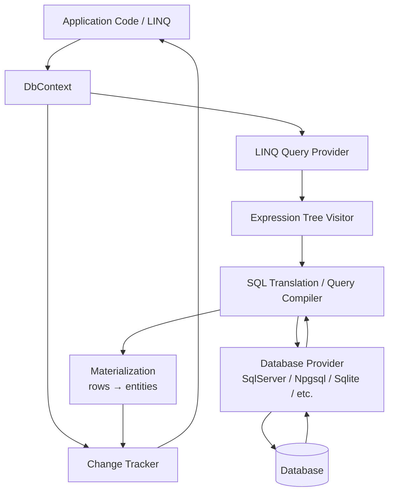
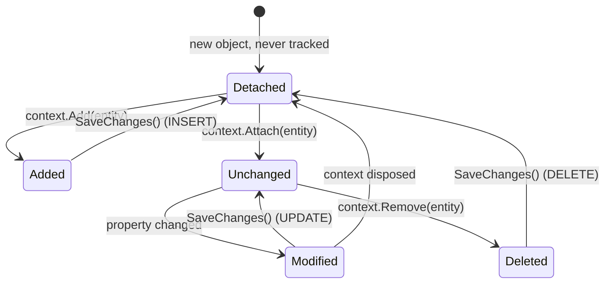
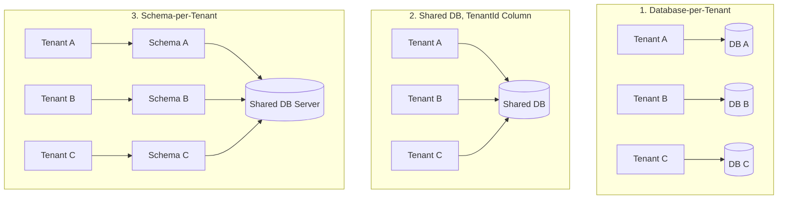

# EF Core – Quick Revision Notes

> Quick-revision notes derived from the EF Core Senior/Lead Interview Guide. Covers every section in the same order (EF Core 8/9 idioms). Enough to brush up each topic without opening the full guide.

---

## 1. Core Concepts

### 1.1 What is EF Core and Why It Exists

**Q: What is EF Core?**
A: Microsoft's ORM for .NET — work with a relational DB via C# objects instead of raw SQL. Handles SQL generation, connection management, change tracking, relationship mapping.

```sql
-- Without EF Core
SELECT * FROM Users WHERE Id = 1
```
```csharp
// With EF Core
var user = context.Users.Find(1);
```

**Why it exists (the "why"):**
- Removes boilerplate SQL + manual row↔object mapping.
- Centralizes schema evolution via migrations (version control for the DB).
- LINQ, strongly-typed, refactor-safe (rename property → compiler errors, not silently broken SQL strings).
- **Trade-off:** you lose some query control and add an abstraction layer — which is why a senior must know *when to drop to raw SQL/Dapper*.

### 1.2 DbContext

**Q: What is DbContext?**
A: The central class — a combined **Unit of Work** + **Repository**-like abstraction representing a session with the DB.

```csharp
public class AppDbContext : DbContext
{
    public AppDbContext(DbContextOptions<AppDbContext> options) : base(options) { }
    public DbSet<User> Users { get; set; }
}
```

**Responsibilities:** manages connection, executes queries (LINQ→SQL), tracks changes (Change Tracker), persists via `SaveChanges`, manages transactions.

**Key points:**
- One instance = one unit of work / one logical DB session.
- **Not thread-safe** — never share across concurrent operations/requests.
- ASP.NET Core: register **Scoped** (one per HTTP request) via `AddDbContext<T>`.
- Lightweight but not free (wraps connection, model cache lookup, change tracker) → hence **pooling** exists (§6.1).

### 1.3 Entity, DbSet, and Conventions

An **entity** is a POCO mapped to a table — no DB logic inside it.

```csharp
public class User
{
    public int Id { get; set; }      // PK by convention
    public string Name { get; set; }
    public string Email { get; set; }
}
```

**Conventions:** class name → pluralized table (`User`→`Users`); `Id` or `<Class>Id` → PK.

**DbSet<T>** = a queryable/updatable gateway (an `IQueryable<T>` entry point), *not* the data itself.

```csharp
context.Users.Add(new User { Name = "John" });   // INSERT (staged)
var users = context.Users.ToList();               // SELECT
var user = context.Users.First(u => u.Id == 1);
user.Name = "Updated";                            // UPDATE (staged, tracked)
context.Users.Remove(user);                       // DELETE (staged)
context.SaveChanges();                             // flush all above
```

**`Find()` vs `FirstOrDefault()` (classic trap):**
- `Find()` checks the change tracker **first** by PK — returns tracked entity without hitting the DB.
- `First()`/`FirstOrDefault()` **always** issues a query, regardless of tracking state.

**`Add()` vs `Attach()`:**
- `Add()` → marks entity (and untracked graph) `Added` → `INSERT`.
- `Attach()` → marks `Unchanged` (tracked, no DB hit) — for an entity with a known key you want tracked without re-inserting.
- Bug: `Add()` on an already-existing entity → duplicate-key insert. Fix: `Attach()` + set state, or `Update()`.

### 1.4 EF Core Architecture



- **LINQ provider** captures the *expression tree* (not C# delegates) → translates the expression. That's why arbitrary C# methods often can't be translated.
- **Database provider** (SqlServer, Npgsql/PostgreSQL, Sqlite, InMemory for tests) supplies SQL dialect + type mappings.
- Materialized rows go to the **Change Tracker** if tracking is enabled.

### 1.5 LINQ, Query Translation, and Deferred Execution

```csharp
var query = context.Users.Where(u => u.Id > 5); // no SQL yet — expression tree
var list = query.ToList();                        // SQL executes NOW
```

**Deferred execution:** query isn't sent to DB until a **terminal operator**: `ToList()`, `ToArray()`, `First()`, `FirstOrDefault()`, `Single()`, `Count()`, `Any()`, `Sum()`, foreach, etc.

**LINQ → SQL mapping:**

| LINQ | SQL |
|---|---|
| `Where` | `WHERE` |
| `Select` | `SELECT` (projection) |
| `First`/`FirstOrDefault` | `SELECT TOP(1)` / `LIMIT 1` |
| `Any` | `EXISTS` |
| `Count` | `COUNT` |
| `OrderBy`/`Skip`/`Take` | `ORDER BY` / `OFFSET` / `FETCH NEXT` |

**Projection = performance tool:** `context.Users.Select(u => u.Name).ToList();` fetches only the `Name` column.

**Gotcha (spot-the-bug):** `.ToList()` too early materializes everything, then further LINQ runs client-side in memory.
```csharp
context.Users.ToList().Where(u => u.IsActive);   // BAD — whole table in memory, then filter
context.Users.Where(u => u.IsActive).ToList();   // GOOD — filter translated to SQL
```

---

## 2. Change Tracking

### 2.1 Entity States and the Change Tracker

EF tracks every materialized entity (unless told not to): original values, current values, explicit state.



| State | Meaning | SQL on SaveChanges |
|---|---|---|
| `Added` | New, not in DB | `INSERT` |
| `Modified` | Tracked, changed values | `UPDATE` |
| `Deleted` | Marked for removal | `DELETE` |
| `Unchanged` | Tracked, no changes | none |
| `Detached` | Not tracked | none |

```csharp
var user = context.Users.First(u => u.Id == 1);
user.Name = "Updated Name";
context.SaveChanges();  // UPDATE Users SET Name=... WHERE Id=1 — no explicit "update" call
```

**Interview traps:**
- ❌ "EF updates every column." ✔ Only **changed** columns (snapshot diff), unless configured otherwise.
- ❌ "Tracking is free." ✔ Real memory/CPU cost — per-entity snapshot + `DetectChanges()` walks the whole graph (O(n)) on every `SaveChanges()`.

### 2.2 Change Tracker Internals — Snapshots vs Proxies

- **Snapshot-based (default):** internal snapshot of original values per entity; `DetectChanges()` compares current vs snapshot. Works with plain POCOs but is a full-graph scan — costly with thousands of tracked entities.
- **Notification-based (proxies):** entities implement `INotifyPropertyChanged`/`INotifyPropertyChanging` (or `UseChangeTrackingProxies()`) → EF notified on mutation, no rescan. Faster for large sets, but requires the interfaces or runtime proxy types (virtual properties, no sealed classes, harder to unit-test with `new`).
- `DetectChanges()` runs automatically before `SaveChanges()` and most tracked queries. Optimization: `context.ChangeTracker.AutoDetectChangesEnabled = false` around a bulk in-memory loop, then call `DetectChanges()` once.
- `ChangeTracker.Entries()` inspects all tracked entities — used for generic audit logging (e.g., set `CreatedAt`/`ModifiedAt` by iterating `ChangeTracker.Entries<IAuditable>()`).

### 2.3 AsNoTracking vs AsNoTrackingWithIdentityResolution

```csharp
context.Users.AsNoTracking().ToList();  // no snapshot, no tracker entries
```

- `AsNoTracking()` — fastest read; each row is an independent object even if the same entity appears twice via joins (no identity resolution). Fine for flat single-entity reads.
- `AsNoTrackingWithIdentityResolution()` — still untracked, but **deduplicates** entities with the same key within one result. Use for read-only graphs with `Include()` where you need correct object identity (e.g., binding a UI tree) without change-tracking cost.
- **Rule:** default `AsNoTracking()` for all read-only/GET endpoints; pay for tracking only when you'll call `SaveChanges()`.

### 2.4 SaveChanges Internals

**What happens:**
1. `DetectChanges()` walks the graph, diffing snapshots.
2. Builds `INSERT`/`UPDATE`/`DELETE` commands respecting **FK dependency order** (parents before dependents on insert; dependents before parents on delete).
3. Executes inside an **implicit transaction** (unless one is open).
4. Commits on success; rolls back entirely on failure and throws (`DbUpdateException`, `DbUpdateConcurrencyException`).
5. On success: `Added`→`Unchanged` (DB-generated keys populated back), `Deleted`→`Detached`.

**Async matters (not just style):**
```csharp
await context.SaveChangesAsync();
```
Frees the thread during I/O → critical for ASP.NET Core throughput (avoids thread-pool starvation). **Forgetting `await`** = real bug: the `Task` fires, control returns before the write is durable; an unawaited faulted task can swallow exceptions.

---

## 3. Relationships and Loading Strategies

### 3.1 Relationship Types & Configuration

Supports 1:1, 1:many, many:many — by convention or Fluent API (preferred over data annotations for anything non-trivial: composite keys, shadow FK mapping, etc.).

```csharp
public class User { public int Id { get; set; } public string Name { get; set; } public List<Order> Orders { get; set; } }
public class Order { public int Id { get; set; } public int UserId { get; set; } public User User { get; set; } }

modelBuilder.Entity<Order>()
    .HasOne(o => o.User)
    .WithMany(u => u.Orders)
    .HasForeignKey(o => o.UserId);
```

**Key point:** a navigation property ≠ a foreign key. FK column enforces referential integrity at DB level; nav property is a code convenience. EF Core 5+ supports many-to-many without an explicit join entity (auto shadow join table) — but model the join entity explicitly if it carries payload data (e.g., `EnrolledAt`).

### 3.2 Eager, Lazy, and Explicit Loading

EF does **not** load related data by default — opt in.

| Strategy | Mechanism | Round Trips | API Fit |
|---|---|---|---|
| Eager | `.Include(u => u.Orders)` | 1 (more with split) | ✅ Preferred |
| Lazy | Proxy auto-loads on access | 1 per access (N+1 risk) | ❌ Avoid |
| Explicit | `context.Entry(user).Collection(u => u.Orders).Load()` | 1 per call, controlled | ✅ Targeted |

```csharp
context.Users.Include(u => u.Orders).ToList();               // Eager
user.Orders;                                                 // Lazy (needs Proxies + UseLazyLoadingProxies())
context.Entry(user).Collection(u => u.Orders).Load();        // Explicit
```

**Rule:** default to eager (or projection) for web APIs. Lazy is dangerous — hides DB calls behind property access, invisible in code review.

### 3.3 Split Queries vs Single Query for Collection Includes

Multiple collection `Include()`s → default **single query** with JOINs → **cartesian explosion** (10 Orders × 5 Addresses = up to 50 rows of duplicated User data).

```csharp
context.Users.Include(u => u.Orders).Include(u => u.Addresses).ToList();                 // single query (default)
context.Users.Include(u => u.Orders).Include(u => u.Addresses).AsSplitQuery().ToList();  // split query
```

**Trade-offs:**
- **Single:** one round trip (low latency for small graphs), but risks huge duplicated sets + slow transfer for large fan-outs. Naturally consistent (one atomic query).
- **Split:** one query per collection → avoids multiplication, far less data for large collections, but multiple round trips + a small window where data could change between queries (wrap in an explicit transaction if consistency matters — usually fine for reads).
- Configure globally (`UseQuerySplittingBehavior(QuerySplittingBehavior.SplitQuery)`) or per-query (`.AsSplitQuery()`/`.AsSingleQuery()`). EF **logs a warning** for multi-collection Includes without an explicit choice — a good interview callout.

### 3.4 The N+1 Problem — Spotting and Fixing It

**N+1:** 1 query for N parents, then N more queries (one per row) for related data — usually lazy loading in a loop, or per-item querying instead of batching.

```csharp
var users = context.Users.ToList();
foreach (var user in users) { user.Orders.Count(); }  // lazy-load trigger per iteration
```

**How to spot it (senior signal):**
- Enable query logging (`.LogTo(Console.WriteLine, LogLevel.Information)`) or APM (App Insights, MiniProfiler, Datadog) → repeating identical query with only param changing.
- SQL Profiler / extended events → burst of near-identical `SELECT ... WHERE UserId=@p0`.
- Code-review heuristic: nav-collection access inside a `foreach`/`Select` over a queried list, with lazy loading on = red flag.

**Fixes (preference order):**
1. **Eager load:** `.Include(u => u.Orders)`.
2. **Project** for aggregates: `.Select(u => new { u.Id, OrderCount = u.Orders.Count() })` → single SQL with correlated subquery/`GROUP BY`, no client loop.
3. **Disable lazy loading** in API projects → forces explicit `Include()`, makes N+1 visible at review time.

```csharp
var users = context.Users.Include(u => u.Orders).AsNoTracking().ToList();  // Fix
```

---

## 4. Migrations

### 4.1 Migration Fundamentals

Migrations = version control for schema (like Git commits, but DDL).

```powershell
Add-Migration InitialCreate
Update-Database
# CLI: dotnet ef migrations add InitialCreate ; dotnet ef database update
```

**Internals:**
1. EF compares current model snapshot vs last recorded snapshot (`*.Designer.cs`/snapshot file).
2. Generates a migration class with `Up()`/`Down()` (`MigrationBuilder` calls: `AddColumn`, `DropColumn`, `CreateTable`...).
3. `Update-Database` runs pending migrations in order, recording each in `__EFMigrationsHistory`.

```csharp
migrationBuilder.AddColumn<string>(name: "Email", table: "Users", nullable: true);
```

**Traps:**
- ❌ Manual schema edits → model/DB drift; EF's snapshot comparison becomes unreliable.
- ❌ "One migration per code change" is not a hard rule — batch logically-related changes per feature/PR.
- ✔ `EnsureCreated()` runs without migrations, but tests/prototypes only — no incremental evolution, can't coexist with migrations.

### 4.2 Migrations in a Team / CI-CD Workflow

- **Never call `Database.Migrate()` at app startup in production** (beyond single-instance toys) — multiple instances/pods racing concurrent migrations. Prefer a dedicated pipeline migration step (one-shot job running `dotnet ef database update` or idempotent SQL) **before** deploying the new app version.
- **Generate idempotent SQL scripts** for review/audit:
  ```powershell
  dotnet ef migrations script --idempotent -o migrate.sql
  ```
  Guarded by `__EFMigrationsHistory` checks, safe to re-run, DBA-reviewable.
- **Backward-compatible ("expand/contract") changes** for zero-downtime (old + new versions run simultaneously):
  - Add nullable column: safe.
  - Add NOT NULL: phased — add nullable → backfill → add constraint later.
  - Rename column: EF diff generates `DROP`+`ADD` (**data loss!**) unless you use `migrationBuilder.RenameColumn(...)` — hand-edit for renames.
  - Drop column: deprecate first (stop reading/writing, deploy), then drop later.
- **Merge conflicts in migrations:** resolve by rebasing/regenerating on the merged snapshot — not hand-merging files. Only before applied to a shared/prod env.
- **PR discipline:** always review generated `Up`/`Down` SQL (`Script-Migration`) — silent `DROP COLUMN`/`DROP TABLE` is the top cause of migration data loss.
- **Environment safety:** per-env connection strings, least-privilege DB accounts (app has no schema-alter rights in prod; migration step uses separate elevated credential), validate against production-like volume (instant on 100 rows can lock a 100M-row table for minutes).

### 4.3 Migration Disaster Recovery Scenarios

| Scenario | Root Cause | Recovery | Prevention |
|---|---|---|---|
| Migration applied, code rolled back | DB ahead of code → "Invalid column name" | Re-deploy matching app version; or `Update-Database PreviousMigration` if reversible | Blue-green; don't roll back code without DB state |
| Column dropped, data lost | `DropColumn` ran in prod | Restore backup, re-add, reinsert | Deprecate first; back up before prod migrations |
| Migration fails halfway | Long migration interrupted | Check `__EFMigrationsHistory`, reconcile to last step, re-run | Test on staging; small atomic migrations |
| Conflicting migrations (two devs) | Parallel branches both added | Rebase, one combined migration, delete conflicts (pre-prod) | One migration per branch; PR review; sync often |
| Emergency hotfix schema change | No time for pipeline | Apply SQL manually (controlled), then backfill matching EF migration | Avoid hotfix DB changes; always backfill |
| Migration locks table/downtime | Column with default locks big table | Cancel; nullable → batched backfill → NOT NULL | Phase large changes; avoid blocking DDL on hot tables |
| Applied to wrong environment | Prod run against QA or vice versa | Restore from correct backup, re-apply correct | Env-specific conn strings, CI/CD safeguards |
| Manual DB change, no migration | DBA changed schema directly | `Add-Migration SyncWithDb`, validate SQL | No manual changes — migrations are source of truth |
| Unexpected SQL (rename→drop+recreate) | Diff can't tell rename from drop+add | Hand-edit to `RenameColumn` | Always review generated code |

**What interviewers want to hear:** "I review generated migration SQL," "I test against staging with prod-like volume," "I avoid destructive migrations / prefer expand-contract," "schema and code stay in sync via CI/CD, not manual changes."

---

## 5. Intermediate Topics

### 5.1 Concurrency Handling

**Optimistic concurrency** out of the box via a concurrency token / row-version.

```csharp
public class User
{
    public int Id { get; set; }
    public string Name { get; set; }
    [Timestamp] public byte[] RowVersion { get; set; }
}
```

- On `UPDATE`/`DELETE`, EF includes the original `RowVersion` in the `WHERE`.
- If another txn changed the row → 0 rows match → EF detects 0 affected → throws `DbUpdateConcurrencyException`.
- **Resolution strategies:** *database wins* (reload, discard local), *client wins* (reapply local + retry with fresh version), or *merge UI*. Catch `DbUpdateConcurrencyException`, inspect `ex.Entries`, call `entry.OriginalValues.SetValues(entry.GetDatabaseValues())` before retry.
- `[Timestamp]` is SQL Server-specific (`rowversion`). Elsewhere: `[ConcurrencyCheck]`, `.IsRowVersion()`/`.IsConcurrencyToken()` (Fluent), or a shadow property.

### 5.2 Transactions

```csharp
using var tx = context.Database.BeginTransaction();
context.SaveChanges();
tx.Commit();
```

- `SaveChanges()` **already wraps its own ops in an implicit transaction** — explicit txn only needed to span **multiple** `SaveChanges()` calls, or mix EF with raw ADO.NET/Dapper, atomically.
- Keep transactions **short** — long-running ones under load cause lock contention/deadlocks/timeouts. Batch bulk ops instead of one giant txn.
- **Distributed transactions — avoid them:** spanning two DBs or DB + message queue needs a coordinator (MSDTC) / two-phase commit — slow, fragile, often unsupported by cloud DBs and modern brokers. Modern alternatives:
  - **Saga pattern:** sequence of local transactions, each with a compensating action (reserve inventory → charge payment → if charge fails, release reservation).
  - **Outbox pattern:** write the domain change + an "event to publish" row in the *same* local transaction; background process publishes it (eventual consistency).

### 5.3 Shadow Properties

A property in the EF model (maps to a DB column) but **not** declared on the CLR entity. EF tracks its value internally.

```csharp
modelBuilder.Entity<Order>().Property<DateTime>("LastModified");
context.Entry(order).Property("LastModified").CurrentValue = DateTime.UtcNow;
```

**Where they appear:**
- FK properties when you model only the navigation without an explicit FK property.
- Audit columns (`CreatedAt`, `ModifiedBy`) tracked by EF/interceptors without cluttering the domain model.
- Discover via `context.Model.FindEntityType(typeof(Order)).GetProperties()` (answer to "how do you find hidden/shadow columns?").

### 5.4 Value Converters and Owned Types

**Value Converters** — map a CLR type to/from a different storage type (enum↔string, value object↔primitive):
```csharp
modelBuilder.Entity<Order>().Property(o => o.Status).HasConversion<string>();  // enum as string
modelBuilder.Entity<Order>().Property(o => o.Amount)
    .HasConversion(v => v.Value, v => new Money(v));                            // custom
```

**Owned Types** (`OwnsOne`/`OwnsMany`) — value object with no independent identity/table; properties map as columns on the owner's table (or separate table via `ToTable`):
```csharp
public class Address { public string Street { get; set; } public string City { get; set; } }
modelBuilder.Entity<User>().OwnsOne(u => u.Address);  // → Address_Street, Address_City on Users
```

- No separate identity; always loaded/saved with the owner; can't be queried independently; supports nesting.
- EF Core 7+: map an owned type/entity to a **JSON column** (`ToJson()`) — hybrid relational/document modeling:
```csharp
modelBuilder.Entity<User>().OwnsOne(u => u.Address, a => a.ToJson());
```

### 5.5 Global Query Filters

A `Where` predicate auto-applied to every query for an entity type — unless bypassed. Canonical uses: **soft delete**, **multi-tenancy**.

```csharp
modelBuilder.Entity<User>().HasQueryFilter(u => !u.IsDeleted);
modelBuilder.Entity<Order>().HasQueryFilter(o => o.TenantId == _currentTenantService.TenantId);
```

- Applies automatically to LINQ, `Include()`d navigations, and relationship-generated queries — no need to remember `.Where()` at every call site (that's the point).
- Bypass with `.IgnoreQueryFilters()` (e.g., admin "show deleted" screen).
- **Gotchas:** filters referencing a service/DbContext field (current tenant ID) are evaluated per-query at translation time using the context's current field value → works per-request with a scoped context, but beware caching a DbContext or compiled query across tenants. Filters can only reference entity properties, related-entity nav properties, or DbContext fields/properties — not arbitrary external state.

### 5.6 Multi-Tenancy Architectures — Which One Would You Choose?

Global query filter is the **EF mechanism** for shared-DB multi-tenancy, but the architectural question is one level up. Three standard architectures:



| Dimension | DB-per-Tenant | Shared DB + `TenantId` | Schema-per-Tenant |
|---|---|---|---|
| **Data isolation** | Strongest (physical) | Weakest (one missing filter leaks data; query filter mitigates, not eliminates) | Medium (schema boundary) |
| **Cost / efficiency** | Most expensive (N DBs) | Cheapest (one DB, one pool) | Middle |
| **Ops complexity** | High (migrate every DB) | Low (one migration run) | High (migrate every schema, weak tooling) |
| **Blast radius** | Smallest (one tenant) | Largest (all tenants) | Medium |
| **Noisy neighbor** | None | Real | Reduced but shares server CPU/IO |
| **Per-tenant customization** | Easiest | Hardest (EAV/JSON) | Possible but awkward |
| **Onboarding new tenant** | Slowest (provision DB) | Fastest (new `TenantId`) | Medium (new schema DDL) |
| **Regulatory/compliance** | Best (drop DB = clean delete; per-region residency) | Worst (delete rows across tables; shared region) | Medium |
| **EF Core support** | Straightforward (conn string per tenant) | Best native (`HasQueryFilter`) | Workable via `HasDefaultSchema()`, weaker tooling |

**How to answer "which would you choose":**
- **Start with business/compliance constraint, not tech.** Enterprise/regulated tenants (healthcare, finance, gov) or "one tenant big enough to affect others" → **DB-per-tenant** despite ops cost.
- **High-volume, low-touch SaaS (thousands–millions of small tenants)** → **shared DB + `TenantId`**; DB-per-tenant is an ops nightmare at that scale; query filters (§5.5) make isolation risk *manageable* (not eliminated).
- **Schema-per-tenant** is least common in new EF designs (weak tooling) — mention for completeness, be honest it's a narrower fit.
- **Hybrid is a valid senior answer:** shared DB for the long tail of small/free tenants, dedicated DB for large/enterprise once justified — common real-world evolution.
- **Always mention shared-DB mitigation:** query filter is necessary but not sufficient → pair with cross-tenant isolation integration tests, code-review discipline on `IgnoreQueryFilters()`, and DB-level row-level security as a backstop.

**Follow-up: "when a shared-DB tenant outgrows the model?"** → hybrid-migration: move that tenant's rows to a dedicated DB without downtime (extract, transform tenant-scoped rows, re-point connection resolution, backfill/verify, cut over). Far easier if designed for from day one (consistent `TenantId` on every table, no cross-tenant FKs).

---

## 6. Advanced Topics

### 6.1 DbContext Pooling

```csharp
builder.Services.AddDbContextPool<AppDbContext>(options =>
    options.UseSqlServer(connectionString), poolSize: 128);
```

- Instead of allocating a new context per request, EF maintains a pool; on request start an instance is rented and its state **reset** (change tracker cleared); on disposal it returns to the pool instead of being GC'd.
- **Benefit:** reduces allocation overhead of the context + its internal services (helps at high request volume).
- **Constraints/gotchas:**
  - Constructor may take **only** `DbContextOptions<T>` — no other scoped per-request services (the context now outlives a single DI scope).
  - Need scoped services inside (e.g., `ICurrentUserService`)? Inject via method call or mutable property set per request, not via constructor.
  - Any custom static/instance state you add must be explicitly reset (not automatic) — classic pooling bug: stale state leaking across requests.
  - Helps CPU/allocation, **not** query performance — no fewer round trips.

### 6.2 Compiled Queries

```csharp
private static readonly Func<AppDbContext, int, User> _getUserById =
    EF.CompileQuery((AppDbContext ctx, int id) => ctx.Users.FirstOrDefault(u => u.Id == id));
var user = _getUserById(context, 5);

private static readonly Func<AppDbContext, int, Task<User>> _getUserByIdAsync =
    EF.CompileAsyncQuery((AppDbContext ctx, int id) => ctx.Users.FirstOrDefault(u => u.Id == id));
```

- EF already caches the expression-tree→SQL translation per unique query shape (why the *first* execution of a shape is pricier). `EF.CompileQuery` skips even that internal cache lookup by binding the delegate once ahead of time.
- **When it matters:** hot-path queries run thousands+ times/sec where microseconds of cache lookup are measurable — **not** a "use everywhere" recommendation. For typical CRUD, internal caching is enough; reach for this only after profiling.
- Must have a **stable shape** — params can vary, LINQ structure cannot (no dynamically-built `Where`).

### 6.3 EF Core Interceptors

Hook into EF's pipeline: command execution, `SaveChanges`, connection open/close, transaction events. Used for cross-cutting concerns (audit, soft-delete, logging, multi-tenancy, retry).

```csharp
public class AuditSaveChangesInterceptor : SaveChangesInterceptor
{
    public override InterceptionResult<int> SavingChanges(
        DbContextEventData eventData, InterceptionResult<int> result)
    {
        var context = eventData.Context;
        foreach (var entry in context.ChangeTracker.Entries<IAuditable>())
        {
            if (entry.State == EntityState.Added)
                entry.Entity.CreatedAt = DateTime.UtcNow;
            if (entry.State is EntityState.Added or EntityState.Modified)
                entry.Entity.ModifiedAt = DateTime.UtcNow;
        }
        return result;
    }
}
options.AddInterceptors(new AuditSaveChangesInterceptor());
```

- **`ISaveChangesInterceptor`** — before/after `SaveChanges`; audit columns, soft-delete conversion (turn `Remove()` into `IsDeleted=true` + `Modified`), domain-event dispatch after commit.
- **`DbCommandInterceptor`** — inspect/modify raw `DbCommand`; query tagging, hints, logging exact SQL + params.
- **`DbConnectionInterceptor`** — hook connection open/close; diagnostics, enforce read-only replicas.
- vs `SaveChanges()` override (simpler for single-context logic) — interceptors preferred for logic across multiple context types + composability/testability without subclassing.

### 6.4 Bulk Operations — ExecuteUpdate / ExecuteDelete

EF Core 7+ set-based ops translate directly to a single `UPDATE`/`DELETE`, bypassing the change tracker (no load into memory, no `SELECT` first).

```csharp
await context.Users
    .Where(u => u.LastLoginDate < cutoff)
    .ExecuteUpdateAsync(setters => setters
        .SetProperty(u => u.IsActive, false)
        .SetProperty(u => u.ModifiedAt, DateTime.UtcNow));

await context.Orders
    .Where(o => o.Status == OrderStatus.Cancelled && o.CreatedAt < cutoff)
    .ExecuteDeleteAsync();
```
```sql
UPDATE Users SET IsActive = 0, ModifiedAt = @p0 WHERE LastLoginDate < @p1;
```

- **No change tracking** — bypass `SaveChanges()` entirely, execute immediately, don't respect tracked in-memory modifications to the same rows (gotcha: `ExecuteUpdate` on rows you've modified-but-not-saved hits the DB directly → surprising results).
- **`SaveChanges`-based interceptors DO NOT run** — audit columns/soft-delete via `SaveChangesInterceptor` are bypassed; set audit fields explicitly in `SetProperty`; soft-delete via `ExecuteUpdate` setting the flag, not `ExecuteDelete`.
- **Global query filters still apply** to the `Where` (unless `.IgnoreQueryFilters()`).
- The modern answer to "how do you update one column on 100k rows without loading them all?"

### 6.5 EF Core vs Dapper — Choosing Deliberately

| Dimension | EF Core | Dapper |
|---|---|---|
| Abstraction | Full ORM (LINQ, tracking, migrations, mapping) | Micro-ORM (you write SQL, it maps results) |
| Productivity | High for CRUD-heavy domain | Lower (hand-written SQL) |
| Performance ceiling | Good; overhead from tracking/materialization/translation | Near-ADO.NET raw |
| Query control | LINQ must translate; complex SQL (CTEs, window fns, hints) awkward/impossible | Full — any SQL the DB supports |
| Schema evolution | Migrations (tracked, versioned) | None built-in (pair with a migration tool) |
| Testability | InMemory/SQLite for integration tests | Needs a real DB / testcontainers |
| Best fit | Transactional/CRUD writes needing tracking & concurrency | Reporting, analytics, high-throughput reads, hand-tuned SQL |

**Senior answer: "both, deliberately"** — EF Core for the transactional write-side (tracking, concurrency tokens, migrations); Dapper (or raw ADO.NET, or EF's `FromSqlRaw`/`SqlQuery<T>`) for read-heavy reporting where hand-tuned SQL + minimal overhead win. Mix in one codebase, often sharing the connection via `context.Database.GetDbConnection()`.

---

## 7. Performance Best Practices

**Do:**
- `AsNoTracking()` / `AsNoTrackingWithIdentityResolution()` for read-only queries.
- Project (`Select`) to fetch only needed columns.
- Paginate (`OrderBy().Skip().Take()`) — always `OrderBy` before `Skip`/`Take` (order otherwise undefined, page contents vary).
- Proper indexes, especially on FKs used in joins/filters.
- `AsSplitQuery()` for multi-collection `Include()`s.
- `ExecuteUpdate`/`ExecuteDelete` for set-based bulk writes.
- Query logging (`.LogTo(...)`) / APM in non-prod to catch N+1s + expensive SQL early.
- `ToQueryString()` on an `IQueryable` to inspect generated SQL without executing.

**Don't:**
- `.ToList()` before filtering (`.Where` after runs in memory).
- Lazy loading in API projects.
- Load full graphs with `Include()` when a projection would do.
- Loop DB calls — fix `foreach (id) context.Users.Find(id)` with `context.Users.Where(u => ids.Contains(u.Id)).ToList()`.
- Long transactions across bulk ops — batch.
- Assume EF is inherently slow — usually bad LINQ, over-tracking, or missing indexes.

---

## 8. Common Pitfalls / Real Production Mistakes

| # | Mistake | Problem | Fix |
|---|---|---|---|
| 1 | Lazy loading in APIs | N+1 | `Include()` / projections |
| 2 | Forgetting `AsNoTracking()` on GETs | High mem/CPU | No-tracking for reads |
| 3 | `ToList()` too early | In-memory filtering | Filter before materializing |
| 4 | Loading entire graphs | Cartesian explosion | Projections, split queries |
| 5 | Sharing one `DbContext` across requests | Threading bugs, corruption | Scoped lifetime |
| 6 | Ignoring generated SQL | Hidden perf issues | Logging / `ToQueryString()` |
| 7 | Manual DB changes, no migration | Schema drift | Migrations only |
| 8 | Looping DB calls | N+1 | Batch with `Contains`/`In` |
| 9 | Missing indexes on FKs | Slow joins | Add indexes |
| 10 | Large transactions | Locks/timeouts | Keep short, batch |
| 11 | Not handling concurrency | Silent overwrites | RowVersion/tokens |
| 12 | Overusing EF for reporting | Slow analytics | Dapper/raw SQL |
| 13 | Forgetting pagination | Huge result sets | `Skip()`/`Take()` + `OrderBy` |
| 14 | Assuming EF always slow | Misattributed cause | Bad LINQ is slow, not EF |
| 15 | No monitoring | Blind to regressions | Query logging + APM |
| 16 | `SaveChanges` interceptors for audit + using `ExecuteUpdate`/`Delete` | Audit silently skipped | Set audit fields in `SetProperty`, or accept bypass |
| 17 | Scoped per-request services in pooled `DbContext` ctor | Stale state leaks | Only `DbContextOptions<T>` in ctor; pass state via method/property |

---

## 9. Troubleshooting Scenarios (Interview Style)

**API slow fetching users with orders** — N+1 via lazy loading. Fix: `context.Users.Include(u => u.Orders).AsNoTracking().ToList();`. Say "eager loading" + "N+1."

**GET APIs high memory** — unnecessary tracking. Fix: `AsNoTracking()`. Phrase: "no-tracking for read-only."

**Duplicate records inserted** — `Add()` on an already-existing entity. Fix: `Attach()` (or `Update()` for `Modified`).

**Data not saved, no exception** — forgot to `await SaveChangesAsync()` (fire-and-forget). Fix: always `await`; enable `CA2007`/`VSTHRD` analyzers.

**Deadlocks during bulk updates** — one giant long-running txn. Fix: batch, short txns, or `ExecuteUpdate`.

**Huge SQL with joins times out** — over-using `Include()` → cartesian explosion. Fix: project, or `AsSplitQuery()`. Keyword: "projection over Include."

**Query differs prod vs dev** — different DB versions/indexes/collation. Fix: compare execution plans, review indexes, check `ToQueryString()` across envs.

**Two users overwrite each other** — missing concurrency control. Fix: `[Timestamp]`/`RowVersion` + handle `DbUpdateConcurrencyException`.

**"Could not be translated"** — LINQ calls a method EF can't translate to SQL.
```csharp
.Where(u => CustomMethod(u.Name))  // runtime error, not compile time
```
Fix: rewrite with translatable expressions/EF functions, or materialize (`AsEnumerable()`/`ToList()`) then apply client-side — trade-off: more data in memory, so filter in SQL first.

**Very slow repeated queries** — query compilation/translation on a hot path. Fix: `EF.CompileQuery` after profiling confirms it.

**Memory leak / cross-request state under load** — `DbContext` as Singleton instead of Scoped (or pooled context with per-request state). Fix: `AddDbContext` defaults to Scoped; no `Singleton` override; pooled → no request-specific state on the instance.

**Pagination inconsistent** — missing `OrderBy()` before `Skip()`/`Take()`. Fix: always sort by a stable key before paging.

**API returns too much sensitive data** — returning entities instead of DTOs. Fix: project to DTOs; never serialize EF entities from a controller (avoids over-posting/circular refs).

**Reporting queries slow** — ORM overhead unsuitable for heavy aggregation. Fix: Dapper/raw SQL.

**Migration fails in production** — manual DB changes or missing ordering. Fix: never edit prod DB manually; apply sequentially via pipeline; see §4.3.

---

## 10. Sample Interview Q&A

**Q: When does EF Core execute a query?**
A: At a terminal operation (`ToList()`, `First()`/`FirstOrDefault()`, `Single()`, `Count()`, `Any()`, foreach). Before that it's an unexecuted expression tree — deferred execution.

**Q: What is deferred execution and why does it matter?**
A: LINQ builds an expression tree; nothing hits the DB until a terminal op. Chaining `Where`/`Select` before materializing composes into a *single* SQL query; calling `.ToList()` early then chaining switches to slow LINQ-to-Objects.

**Q: What happens during `SaveChanges()`?**
A: `DetectChanges()` diffs against snapshots → ordered INSERT/UPDATE/DELETE respecting FK order → implicit transaction → commit or rollback + throw (`DbUpdateException`/`DbUpdateConcurrencyException`).

**Q: Is `DbContext` thread-safe?**
A: No. One operation/request = one instance; concurrent use throws `InvalidOperationException` or corrupts state. Register Scoped.

**Q: `Find()` vs `FirstOrDefault()`?**
A: `Find()` checks the tracker by PK first, queries only on cache miss; `FirstOrDefault()` always queries.

**Q: What is the Change Tracker?**
A: Subsystem recording each tracked entity's original + current values plus `EntityState`, used to compute the minimal SQL at `SaveChanges()`.

**Q: When to use `AsNoTracking()`?**
A: Any read-only scenario (GETs, reports, dashboards). Saves memory + `DetectChanges()` CPU.

**Q: What is the N+1 problem?**
A: One query for parents, then one per parent for related data — typically lazy loading in a loop. Fix: `Include` or projections.

**Q: Eager vs Lazy vs Explicit?**
A: Eager (`Include()`) loads up front, preferred for APIs. Lazy loads on first access via proxy — hides DB calls, dangerous. Explicit loads on demand (`context.Entry(...).Collection(...).Load()`) — controlled/conditional.

**Q: Does EF always load all columns?**
A: No — only columns needed for the shape. A `Select` projection pulls only referenced columns; a full entity query pulls all mapped columns.

**Q: What is a shadow property?**
A: Exists in the model/DB column but not on the CLR class; tracked internally, accessed via `context.Entry(e).Property("Name")`.

**Q: What is optimistic concurrency and how to implement?**
A: Detects conflicting concurrent updates via a version/timestamp column instead of locking. Implement via `[Timestamp]`/`[ConcurrencyCheck]`/`.IsRowVersion()`; conflict throws `DbUpdateConcurrencyException`, handled by reload + discard or reapply.

**Q: How does EF handle transactions?**
A: `SaveChanges()` wraps its SQL in an implicit transaction. Multi-`SaveChanges()` atomicity → explicit `BeginTransaction()`.

**Q: `Add()` vs `Attach()`?**
A: `Add()` → `Added` → `INSERT`. `Attach()` → `Unchanged` (tracked, no write) — start tracking a known-existing entity without re-inserting.

**Q: What is a compiled query and when do you need it?**
A: A LINQ query pre-bound via `EF.CompileQuery`/`CompileAsyncQuery` to skip EF's internal per-call cache lookup — for very hot, very frequent shapes. Not default; only after profiling.

**Q: Can EF generate bad SQL?**
A: Yes — poor LINQ (large `Include` graphs, client-evaluation, missing projections) → inefficient/untranslatable queries. Framework isn't inherently slow; misuse is.

**Q: How to debug/inspect generated SQL?**
A: `.LogTo(Console.WriteLine, LogLevel.Information)` for full logging, or `.ToQueryString()` without executing. `EnableSensitiveDataLogging` shows param values in dev (never in prod — leaks data).

**Q: `Include()` vs projection?**
A: `Include()` loads the full related graph (all columns) + enables tracking/updates. Projection (`Select`) fetches only needed fields as a DTO — faster/lighter but not update-able. Projection for reads, `Include()` when mutating related data.

**Q: Can EF work without migrations?**
A: Yes via `EnsureCreated()` — tests/prototypes only; can't evolve schema incrementally, can't mix with migrations.

**Q: EF Core vs EF6?**
A: EF Core = ground-up rewrite — cross-platform (.NET Core/5+), modular, faster, modern features (owned types, JSON columns, `ExecuteUpdate`/`Delete`, interceptors). EF6 = Windows/.NET Framework, legacy (supported for existing apps, not new dev).

**Q: Does EF support stored procedures?**
A: Yes — `FromSqlRaw`/`FromSqlInterpolated` for entity-shaped results; `ExecuteSqlRaw`/`ExecuteSqlInterpolatedAsync` for non-queries. EF Core 7+ can map SPs for insert/update/delete (verify provider version).

**Q: How does EF prevent SQL injection?**
A: LINQ-translated queries + `FromSqlInterpolated`/parameterized `FromSqlRaw` use parameterized SQL (values as params, not concatenated). Risk returns only if you manually concatenate into `FromSqlRaw` — use `FromSqlInterpolated` or explicit `SqlParameter`s.

**Q: Biggest EF performance killer?**
A: Over-fetching (full graphs/entities vs projection) combined with unnecessary tracking — they multiply on large result sets.

**Q: Can you mix EF Core and Dapper?**
A: Yes, common — EF for transactional writes, Dapper for high-perf reporting, possibly sharing the `DbConnection` via `context.Database.GetDbConnection()`.

---

## 11. One-Minute Interview Summaries

**Fundamentals:** EF Core is an ORM to work with relational DBs via C# objects. `DbContext` manages the session, tracks changes, translates LINQ→SQL through a provider pipeline, executes only at a terminal op (deferred execution). Supports migrations (schema versioning), relationships (nav properties/FKs), and loading strategies (eager/lazy/explicit) — eager + projections preferred for APIs. `SaveChanges()` applies all tracked changes in an implicit transaction.

**Production reality:** Most issues = over-tracking, over-fetching, lazy-loading misuse, ignoring generated SQL — not the framework. Fixes: `AsNoTracking()` for reads, projections over `Include()` where no mutation, `AsSplitQuery()` for multi-collection includes, `ExecuteUpdate`/`ExecuteDelete` for bulk writes, RowVersion optimistic concurrency, and disciplined staged/reviewed migrations — never manual prod DB edits.
