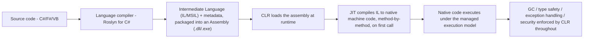
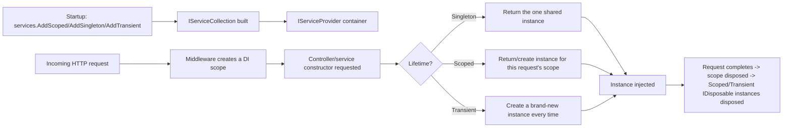
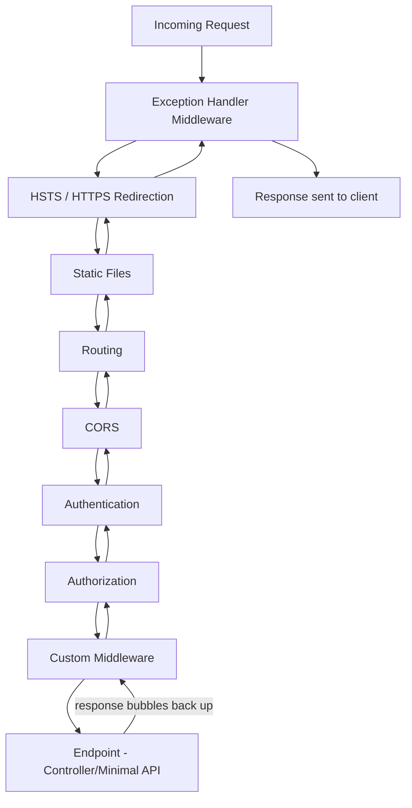
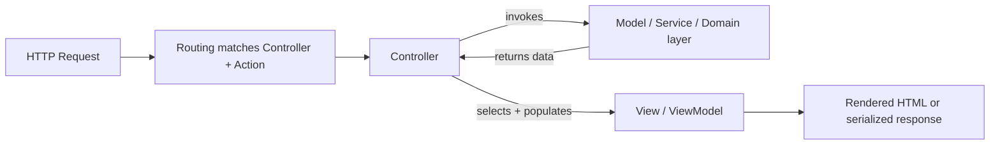
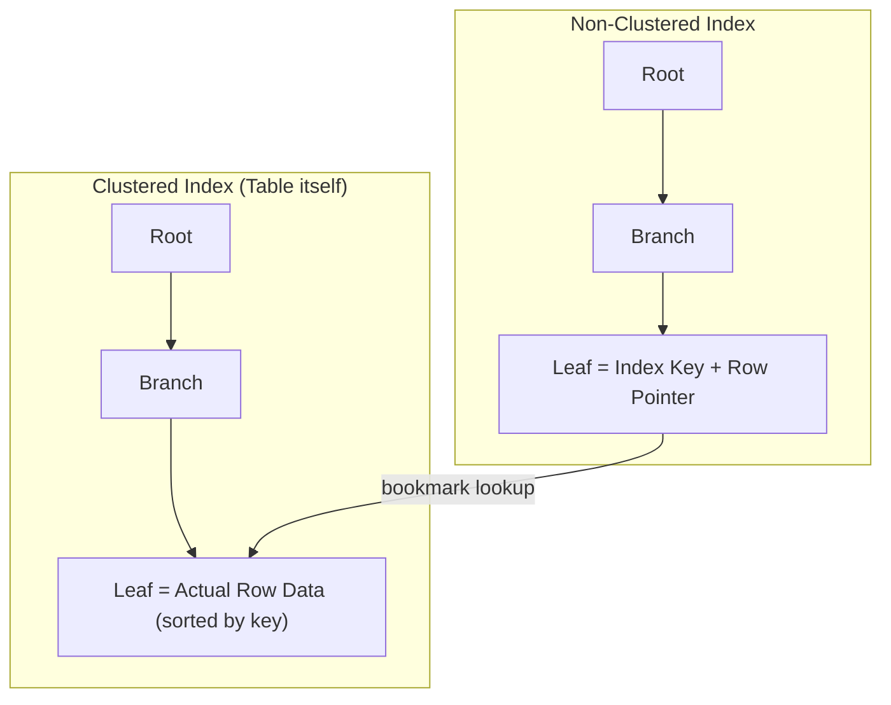
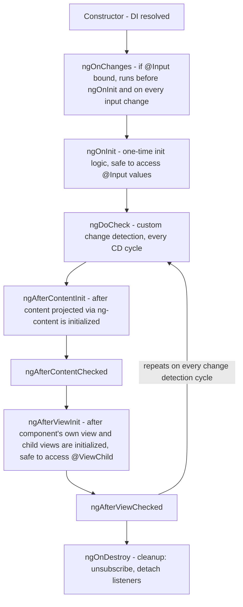
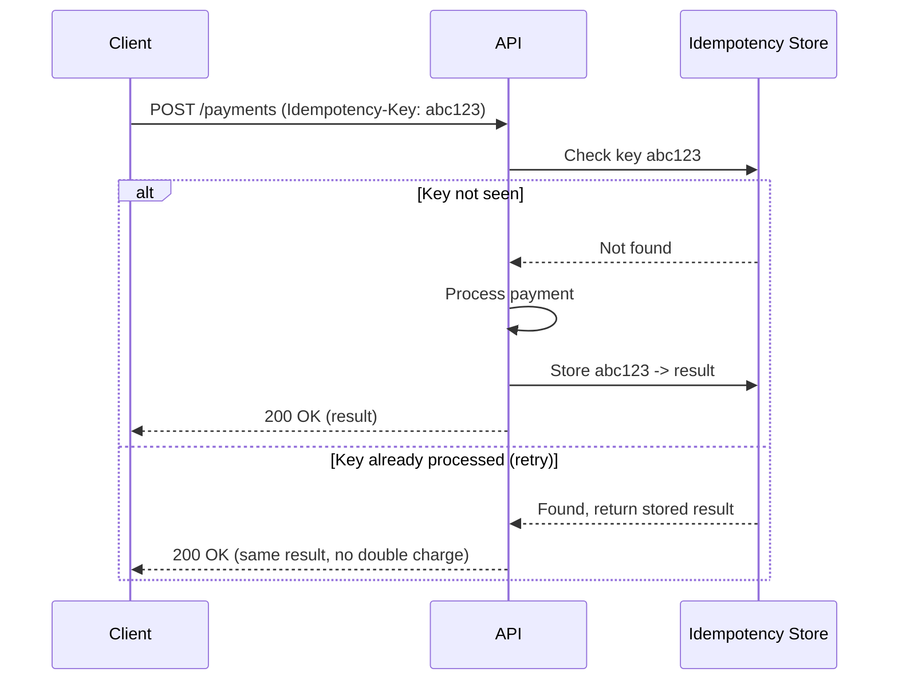

# Interview Questions — Interview Revision Notes

> Quick-revision Q&A derived from `S. Interview-Questions-Interview-Guide.md`. Covers every section of the source.

## Tell Me About Yourself / Project Experience

### Tell me briefly about yourself and your project experience

**Q: How should you structure a "tell me about yourself" answer in a senior .NET interview?**

A: As a 90-second narrative, not a resume recital:

- Frame: years of experience, primary stack, and the kind of systems you build.
- Depth signal: 1-2 projects where you owned architecture/design decisions, with a concrete outcome/metric.
- Current role: your scope (IC vs lead, mentoring, architecture ownership).
- Close with intent: why you're looking and how the role fits your trajectory.

Expect follow-ups like "What was the hardest technical decision you made?" or "Who did you disagree with technically and how was it resolved?"

### Responsibilities in current project

**Q: How should you describe your responsibilities on a current project?**

A: Frame it around ownership, not tasks — system design, API contracts, DB schema decisions, code review gatekeeping, mentoring, CI/CD ownership, production incident response. Mention cross-team responsibilities (QA, DevOps, product) to signal full-stack/lead maturity; interviewers listen for whether you influence decisions or just execute tickets.

### Tech stack you are working on – Backend / Frontend / DevOps

**Q: How do you answer "what's your tech stack" at a senior level?**

A: Give a concise rundown plus the "why" behind each choice:

- Backend: C#/ASP.NET Core version, EF Core, SQL Server/PostgreSQL, message broker if used.
- Frontend: Angular version, state approach (NgRx/services+RxJS/Signals), UI library.
- DevOps: CI/CD tool, containerization, cloud, monitoring stack.

Have one real trade-off ready for "why X over Y?" (e.g., choosing NgRx over plain services+RxJS because state was shared across 12+ components).

## C# Language & OOP

### What is .NET and how does it work?

**Q: What is .NET, and what's the compile/execution pipeline?**

A: .NET is a runtime + base class libraries + tooling that lets multiple languages (C#, F#, VB.NET) compile to a common IL format and run on a shared execution engine.



The "managed execution model" means the CLR (not the OS) controls memory/GC, type safety, structured exception handling, and security boundaries.

**Q: What's tiered compilation and Native AOT?**

A: Tiered compilation: Tier 0 does a fast, minimally-optimized JIT pass for quick startup; hot methods are re-JITted at Tier 1 with full optimization once proven to matter. Native AOT (.NET 8+) compiles straight to native code ahead of time, skipping the CLR/JIT step — good for serverless cold starts/CLI/containers, at the cost of losing reflection-heavy/dynamic-codegen features.

### What is CLR (Common Language Runtime)?

**Q: What does the CLR actually do?**

A: The managed execution engine that hosts and runs compiled assemblies:

- JIT compilation (IL → native, per method, tiered).
- Memory management (managed heap + generational GC).
- Type safety/verification (blocks illegal casts/stray memory access outside `unsafe`).
- Structured exception handling (uniform across all CLR languages).
- GC hosting, thread/AppDomain management, and interop (P/Invoke, COM).

**Q: Name the different CLR implementations.**

A: CoreCLR (cross-platform, modern .NET), Mono (historically mobile/Unity), and Native AOT (no CLR/JIT at runtime at all — compiles ahead of time).

### What are Assemblies in .NET?

**Q: What is an assembly, and how does it differ from a namespace?**

A: An assembly is the physical unit of deployment/versioning/type-scoping — a `.dll`/`.exe` containing IL code, metadata, a manifest (name/version/culture/references), and optional embedded resources. A namespace is a purely logical, compile-time naming construct with no physical existence — one assembly can contain many namespaces, and (rarely) one namespace can span multiple assemblies.

**Q: How does .NET Core handle assembly loading/isolation?**

A: `AssemblyLoadContext` replaced the Framework-era GAC/strong-naming/AppDomain model, enabling side-by-side loading of multiple versions of the same assembly in one process — the mechanism behind robust plugin architectures. Metadata-driven Reflection (powering DI auto-registration, EF Core convention scanning, JSON serializers, AutoMapper) walks assemblies looking for types/attributes.

### What is a string in C#? Why is it immutable?

**Q: Why is `string` immutable in C#?**

A: `string` is a sealed reference type (heap-allocated, UTF-16). Immutability gives:

- Thread safety (no locking needed for concurrent reads).
- Safe string interning (a mutable literal would corrupt every reference to it).
- Reliable hashing (mutable dictionary/hashset keys would break their bucket).
- Security (validated values can't be altered post-check via reference).

Every "mutation" (`+=`, `.Replace()`, `.ToUpper()`) allocates a new string — why heavy concatenation in a loop is O(n²) allocations, and why `StringBuilder`/`Span<char>` are the fix.

**Q: How does `StringBuilder` avoid the immutability performance cost?**

A: It pre-allocates/grows an internal mutable char buffer and only materializes an immutable `string` once, on `.ToString()`.

### Difference between .NET Framework & .NET Core (and .NET 7/8/9)

**Q: How does .NET Framework compare to modern .NET (Core/5+)?**

A:

| Aspect | .NET Framework | .NET Core (→ .NET 5+) |
|---|---|---|
| Platform | Windows only | Cross-platform |
| Open source | Partially | Fully |
| Deployment | GAC, machine-wide | Self-contained/side-by-side |
| Performance | Slower JIT, older GC | Faster (tiered JIT, ReadyToRun) |
| Modularity | Monolithic | NuGet-based |
| Web stack | ASP.NET (IIS-coupled) | ASP.NET Core (Kestrel) |
| Future | Maintenance only | Active, yearly releases |
| Containers | Poor | Excellent |

Since .NET 5, "Core" was dropped from the name — .NET Framework 4.8 is the last version (security patches only). Even releases (8, 10) are LTS; odd releases (7, 9) are STS. (Verify current LTS cadence at interview time.)

### What are Value Types vs Reference Types?

**Q: Value types vs reference types — key differences and a gotcha?**

A: Value types (`int`, `struct`, `enum`, `bool`) live on the stack/inline and copy the full value on assignment; reference types (`class`, `string`, arrays) live on the heap and copy only the reference. Gotcha: a struct with reference-type fields still only shallow-copies (the referenced object is shared); boxing a value type into `object` allocates on the heap — a hot-path perf trap.

### What are constructors? Parameterized vs Non-parameterized

**Q: Parameterized vs non-parameterized constructors, and related follow-ups?**

A: A constructor initializes object state, shares the class name, has no return type. Defining any constructor suppresses the compiler's auto-generated default one. Related: constructor chaining (`this(...)`/`base(...)`), static constructors (run once, before first use, no modifiers/params), and primary constructors (C# 12: `public class Person(string name, int age) {}`).

```csharp
public class Employee
{
    public string Name { get; }
    public decimal Salary { get; }

    public Employee() : this("Unknown", 0) { }         // chaining
    public Employee(string name, decimal salary)
    {
        Name = name;
        Salary = salary;
    }
}
```

### Method Overloading vs Method Overriding

**Q: Overloading vs overriding — differences and the classic gotcha?**

A: Overloading = same name, different signature, resolved at compile-time; overriding = subclass redefines a `virtual`/`abstract` base method with the same signature, resolved at runtime by actual object type.

```csharp
class Shape
{
    public virtual double Area() => 0;
}
class Circle : Shape
{
    public double Radius;
    public override double Area() => Math.PI * Radius * Radius;   // overriding
}
class Calculator
{
    public int Add(int a, int b) => a + b;
    public double Add(double a, double b) => a + b;                // overloading
}
```

Gotcha — `new` vs `override`: `new` hides the base member (resolved by static reference type); `override` gives true polymorphism (resolved by runtime type):

```csharp
Shape s = new Circle();
s.Area();  // override → Circle.Area() called (polymorphic)
           // if Circle used "new" instead of "override" → Shape.Area() called (0)
```

### Explain OOP concepts with real project examples

**Q: Give project-grounded examples of the four OOP pillars.**

A:

- Encapsulation: `Order.AddItem()` instead of exposing a public mutable `List<Item>`, enforcing business rules in one place.
- Abstraction: `IPaymentGateway` with `Stripe`/`PayPal` implementations — callers don't care which is wired up.
- Inheritance: `BaseRepository<T>` extended by `OrderRepository`; note composition is often preferred over inheritance in modern design.
- Polymorphism: `IEnumerable<IShape>` where `Area()` differs per concrete shape — enables Strategy/Open-Closed.

### Difference between Interface and Abstract Class

**Q: Interface vs abstract class — how do you frame the distinction?**

A: "Interfaces define what an object can do; abstract classes define what an object is, with shared implementation." A class can implement many interfaces but inherit only one abstract class; interfaces traditionally hold no instance fields (until recent C# added static members), and since C# 8 default implementations blur the pure-contract line on behavior; abstract classes can mix abstract/concrete members and hold instance state. Interfaces = "can-do" capability contracts (`IDisposable`); abstract classes = "is-a" shared base (`Stream`).

### What are Collections in C#?

**Q: Compare the common generic collection types.**

A:

| Collection | Backing | Ordered | Duplicates | Use |
|---|---|---|---|---|
| `List<T>` | Dynamic array | Yes | Yes | General ordered list |
| `Dictionary<K,V>` | Hash table | No | Unique keys | O(1) lookup |
| `HashSet<T>` | Hash table | No | No | Membership/set ops |
| `Queue<T>` | Circular buffer | FIFO | Yes | Task queues, BFS |
| `Stack<T>` | Array | LIFO | Yes | Undo, DFS |
| `LinkedList<T>` | Doubly-linked | Yes | Yes | Mid-list insert (rare in practice) |
| `ConcurrentDictionary<K,V>` | Thread-safe hash table | No | Unique keys | Multi-threaded caches |
| `ImmutableList<T>` | Persistent tree/array | Yes | Yes | Functional/lock-free |

Gotcha: `Dictionary<K,V>` isn't thread-safe for concurrent writes; mutating a collection while iterating throws `InvalidOperationException` (fix: `.ToList()` snapshot or `RemoveAll`).

### Explain LINQ with a simple example

**Q: What is LINQ, and what nuances signal seniority?**

A: A unified declarative query syntax over `IEnumerable<T>` (LINQ to Objects, in-memory) and `IQueryable<T>` (EF Core, translated to SQL).

```csharp
var seniorDevs = employees
    .Where(e => e.YearsExperience >= 8)
    .OrderByDescending(e => e.YearsExperience)
    .Select(e => new { e.Name, e.YearsExperience })
    .ToList();
```

Key nuances: deferred execution (query doesn't run until enumerated); `IEnumerable` runs in-memory vs `IQueryable` builds an expression tree translated to SQL — filtering before `.ToList()` pushes work to the DB; multiple enumeration re-runs the whole pipeline (cache with `.ToList()`/`.ToArray()` when reused).

## Async, Threading & Concurrency

### What is the Garbage Collector? How does it work?

**Q: How does the .NET GC work (generations, LOH, modes)?**

A: Automatic memory manager for the managed heap; reclaims objects unreachable from any root.

- Gen 0: short-lived, collected frequently/fast.
- Gen 1: buffer between Gen 0 and Gen 2.
- Gen 2: long-lived, collected rarely, most expensive.
- LOH: objects ≥85,000 bytes, collected only on Gen 2, not compacted by default.

Mark phase walks the live-object graph from roots; Gen 0/1 collections compact survivors. Workstation vs Server GC (per-core heaps/threads for throughput); Background/concurrent GC reduces Gen 2 pause times.

**Q: What are senior-level GC gotchas to raise proactively?**

A:

- `using`/`IDisposable` still needed for unmanaged resources — GC doesn't know about them; finalizers are a safety net, not a strategy.
- Memory leaks still happen: forgotten `+=` event subscriptions, unbounded static collections, captured closures in long-lived caches.
- Never call `GC.Collect()` manually in production — forces an expensive full collection.
- `Span<T>`/`stackalloc` avoid heap allocation entirely in the hottest paths.

### What are Delegates? Types of delegates

**Q: What is a delegate, and what are the built-in generic forms?**

A: A type-safe function pointer — holds a reference to one or more methods with a matching signature. Built-ins: `Action<T...>` (no return), `Func<T...,TResult>` (returns a value), `Predicate<T>` (returns bool).

```csharp
public delegate int Operation(int a, int b);

Operation add = (a, b) => a + b;
Func<int,int,int> subtract = (a, b) => a - b;

// Multicast
Action<string> log = Console.WriteLine;
log += msg => File.AppendAllText("log.txt", msg);
log("Both handlers run");
```

**Q: What's the multicast delegate gotcha, and how do events relate?**

A: If multiple methods are chained via `+=` and any return a value, only the last invoked method's return value is observed — so multicast is mainly used with `void` delegates like events. `event` restricts external code to `+=`/`-=` only, preventing outsiders from invoking/clearing the handler list. Rx's `IObservable<T>` generalizes the same push-based pattern into a composable stream (the .NET analog of Angular's RxJS `Observable`).

### Explain Async-Await & Asynchronous Programming in C#

**Q: What's the mental model for `async`/`await`?**

A: Syntactic sugar over the Task-based Asynchronous Pattern; the compiler rewrites the method into a state machine. `await` does not create a new thread — it registers a continuation and releases the current thread back to the pool while the operation is in flight, resuming on a captured context or pool thread when done.

```csharp
public async Task<Order> GetOrderAsync(int id)
{
    var order = await _dbContext.Orders.FindAsync(id);
    var enriched = await _pricingService.EnrichAsync(order);
    return enriched;
}
```

**Q: What are the key async gotchas a senior dev should raise?**

A:

- `async void` should be avoided outside top-level event handlers — exceptions can't be awaited/caught and can crash the process.
- `ConfigureAwait(false)` in library code avoids capturing the original context, reducing overhead/deadlock risk.
- Classic deadlock: blocking on async with `.Result`/`.Wait()` in a context with a `SynchronizationContext` (old ASP.NET, UI apps) — the continuation needs the same captured, blocked context. ASP.NET Core has no such context by default but "async all the way" is still best practice.
- `ValueTask<T>` avoids a heap allocation when the result is often already available synchronously (cache hits) — but must not be awaited twice or stored, unlike `Task`.
- Exceptions in async methods are captured into the returned `Task` and rethrown on `await`; fire-and-forget tasks should still be wrapped with error handling.

### Multithreading vs Async — what's the difference?

**Q: Multithreading vs async/await — what's actually different?**

A:

| | Multithreading | Async |
|---|---|---|
| Goal | Parallelism (CPU-bound, simultaneous) | Concurrency (don't block during I/O wait) |
| Threads | Actively uses multiple OS threads | Frees the current thread during the wait |
| Best for | CPU-bound work | I/O-bound work |
| Tools | `Thread`, `Task.Run`, `Parallel.For` | `async`/`await`, `Task`, `ValueTask` |
| Cost | Thread creation/context switch is expensive | Cheap — no thread "spent" waiting |

Key insight: async isn't about creating threads, it's about not wasting a thread on waiting. `Task.Run` should be reserved for offloading CPU-bound work, not for wrapping already-async I/O calls (wrapping `SaveChangesAsync()` in `Task.Run` burns a pool thread for nothing).

### readonly vs constant (`const`)

**Q: `const` vs `readonly` — and what's the real production gotcha?**

A:

| | `const` | `readonly` |
|---|---|---|
| Assigned | Compile time | Runtime |
| Storage | Inlined at every call site | Actual field, set once |
| Static? | Implicitly static | Can be instance or static |
| Types | Primitives/string/enum only | Any type |

Gotcha: changing a `const` in a referenced assembly requires recompiling **all** consumers (the value is inlined at their compile time); changing a `readonly` value doesn't — resolved at runtime. This is the real interview-worthy detail for multi-assembly/NuGet scenarios.

### Abstract vs Virtual

**Q: `abstract` vs `virtual` — key differences?**

A: `abstract` has no base implementation and mandates override in the first concrete subclass (base class can't be instantiated); `virtual` has a default body that overriding is optional for, and the base class can be instantiated. Use `abstract` when there's no sensible default; `virtual` when most subtypes can reuse a default.

### Extension Methods + Example

**Q: How do extension methods work, and what's the resolution gotcha?**

A: Static methods in a static class with `this` on the first parameter, letting you "add" methods to types you don't own without inheritance.

```csharp
public static class StringExtensions
{
    public static bool IsNullOrBlank(this string? value) =>
        string.IsNullOrWhiteSpace(value);
}

// usage
if (userInput.IsNullOrBlank()) { ... }
```

The compiler rewrites the call to a static method call (this is how all of LINQ's `.Where()`/`.Select()` are implemented on `IEnumerable<T>`). Gotcha: resolved at compile time by static type, always lower priority than an instance method of the same signature, and callable on a `null` reference without throwing (since it's really just a static call).

## .NET Core / ASP.NET Core & Middleware

### What is Dependency Injection in .NET Core? How does it work internally?

**Q: What is DI, and how does `Microsoft.Extensions.DependencyInjection` work internally?**

A: DI achieves Inversion of Control: a class declares dependencies (constructor params) rather than constructing them; a container supplies them at runtime.

1. Services registered into `IServiceCollection` as `ServiceDescriptor` entries (type, implementation/factory, lifetime).
2. `.Build()` compiles this into an `IServiceProvider`.
3. On resolution: looks up the descriptor, recursively resolves constructor parameters, applies lifetime rules.
4. ASP.NET Core creates a new DI scope per HTTP request (via middleware), disposed at request end — why Scoped == "per request."



### Service Lifetimes — Transient, Scoped, Singleton

**Q: Compare Transient, Scoped, and Singleton lifetimes.**

A:

| Lifetime | Created | Use | Gotcha |
|---|---|---|---|
| Transient | New every request | Cheap, stateless services | Wasteful if construction is expensive |
| Scoped | One per HTTP request/scope | `DbContext`, unit-of-work | Captive dependency if resolved from a Singleton |
| Singleton | One for app lifetime | Config, caches, logging | Must be thread-safe; must never hold a Scoped dependency |

**Q: What's the "captive dependency" bug and its fix?**

A: A Singleton that takes a Scoped dependency (e.g., `DbContext`) in its constructor gets injected once and holds that instance forever across every request/user/thread — causing concurrency exceptions, stale data, connection leaks. ASP.NET Core's container throws at resolution time by default in Development (`ValidateScopes = true`) to catch this. Fix: inject `IServiceScopeFactory` into the singleton and create a new scope per operation.

### Explain the Request Pipeline in .NET Core. What is Middleware and how does it execute?

**Q: How does the ASP.NET Core middleware pipeline execute?**

A: The whole request is modeled as a pipeline of middleware — each can act before calling `next(context)`, act after it returns, or short-circuit entirely (e.g., return 401 without calling `next`). This is the Chain of Responsibility pattern, configured via `app.Use...()` calls in `Program.cs`, in registration order.



Order matters: `UseAuthentication()` before `UseAuthorization()`; `UseCors()` after routing and before authorization; exception-handling middleware registered first so it wraps everything downstream.

**Q: Show a custom middleware example.**

A:

```csharp
public class RequestTimingMiddleware
{
    private readonly RequestDelegate _next;
    private readonly ILogger<RequestTimingMiddleware> _logger;

    public RequestTimingMiddleware(RequestDelegate next, ILogger<RequestTimingMiddleware> logger)
    {
        _next = next;
        _logger = logger;
    }

    public async Task InvokeAsync(HttpContext context)
    {
        var sw = Stopwatch.StartNew();
        await _next(context);                     // call the rest of the pipeline
        sw.Stop();
        _logger.LogInformation("{Method} {Path} took {Elapsed}ms",
            context.Request.Method, context.Request.Path, sw.ElapsedMilliseconds);
    }
}

// Program.cs
app.UseMiddleware<RequestTimingMiddleware>();
```

Minimal-API style also allows inline middleware: `app.Use(async (context, next) => { ... await next(); ... });`.

### Explain the MVC architecture

**Q: How does MVC map to ASP.NET Core, especially for a pure Web API?**

A:



Model = domain/data layer (entities, DTOs, business rules), knows nothing about HTTP. View = presentation (Razor in classic MVC; in an API-only backend the "view" role shifts to the client and controllers return JSON). Controller = thin traffic cop between HTTP and the service layer. For a pure API, "MVC" narrows to Model+Controller, but the framework still routes through the same infrastructure (`ControllerBase`, model binding, filters). Discipline that matters: "thin controller, fat service."

### Filters in MVC — where do they fit vs Middleware?

**Q: Middleware vs MVC filters — when do you use each?**

A: Filters run inside the MVC action-invocation part of the pipeline (after routing), with access to MVC-specific context (action arguments, model binding, `ActionResult`).

| Filter type | Runs | Use |
|---|---|---|
| Authorization | First, before model binding | Custom auth beyond `[Authorize]` |
| Resource | Around model binding | Caching short-circuits |
| Action | Before/after action executes | Logging, validation |
| Exception | On exception | MVC-scoped error handling |
| Result | Before/after result executes | Response formatting |

Rule of thumb: middleware for cross-cutting infra (auth, CORS, raw request/response logging); filters when you need MVC-specific context.

### Validation in API

**Q: How do you approach API validation at a senior level?**

A:

- Data annotations (`[Required]`, `[StringLength]`, `[Range]`) — auto-validated by model binding; `[ApiController]` auto-returns `400` with `ProblemDetails` on invalid model state.
- FluentValidation preferred for complex, composable, testable rules decoupled from the DTO.
- Domain-level validation (business rules like credit-limit checks) belongs in the service layer, not attributes — attributes are for shape/format only.

### Eager Loading vs Lazy Loading (EF) / Async vs Await

**Q: Why do these two items in this section just point elsewhere?**

A: The source flags these as duplicates from the original raw question lists: Eager vs Lazy Loading is answered in depth under Entity Framework, and Async/Await is answered in depth under Async, Threading & Concurrency — both appeared multiple times across the original grab-bag lists and were consolidated to avoid repeating the same answer.

## Authentication, Authorization & API Design

### Explain REST API in ASP.NET (Core)

**Q: What are REST's defining constraints, and how does ASP.NET Core realize them?**

A: Six constraints (Fielding): Client-Server separation, Statelessness (every request self-contained — what enables horizontal scaling behind a load balancer), Cacheability (`Cache-Control`/`ETag`), Uniform Interface (URIs + standard verbs, self-descriptive JSON), Layered System (client can't tell if there's a gateway/proxy in front), Code on Demand (rarely used).

ASP.NET Core realizes these via attribute routing (URIs→resources), HTTP verbs mapping to CRUD, `IActionResult`/proper status codes, content negotiation, and model binding/validation.

**Q: What is the Richardson Maturity Model, and where do most real APIs sit?**

A: Level 0: single RPC-style endpoint. Level 1: multiple resource URIs. Level 2: proper verbs + status codes — where almost all real-world "REST APIs" actually sit. Level 3: adds HATEOAS (responses include hypermedia links for discoverable next actions). Honest senior answer: most APIs are "RESTish" at Level 2 by deliberate trade-off, not ignorance.

### Login mechanism / What is JWT Authentication? / Logging user identity via JWT claims

**Q: Walk through the JWT login flow end to end.**

A:

1. User submits credentials to a login endpoint.
2. Server validates against an identity store.
3. Server issues a JWT: `header.payload.signature` (base64url) — header (algorithm), payload/claims (`sub`, `role`, `exp`, custom claims), signature (HMAC/RSA over header+payload, prevents tampering but payload is still readable, not confidential).
4. Client sends it as `Authorization: Bearer <token>` (avoid `localStorage` due to XSS risk).
5. `UseAuthentication()` validates signature+expiry per request, populates `HttpContext.User` (`ClaimsPrincipal`).
6. Code reads identity via `User.FindFirst(ClaimTypes.NameIdentifier)` or `IHttpContextAccessor`.

Refresh tokens (long-lived, stored server-side/httpOnly cookie) re-issue short-lived access tokens without forcing re-login. Gotcha: JWTs are signed (JWS) but not encrypted by default (JWE) — never put secrets/PII in the payload.

### Authentication vs Authorization

**Q: Authentication vs authorization — how do they differ in ASP.NET Core?**

A: Authentication answers "who are you?" (`UseAuthentication()`, runs first — password/JWT/OAuth2/OIDC/API keys); authorization answers "what are you allowed to do?" (`UseAuthorization()`, runs after, via Roles/Policies/Claims).

### Why CORS?

**Q: What problem does CORS solve, and what's the common misconception?**

A: Browsers enforce the Same-Origin Policy; CORS is the server's opt-in (`Access-Control-Allow-Origin` etc.) telling the browser which origins may read a cross-origin response. Misconception: CORS is browser-enforced, not a server security boundary — non-browser clients (Postman, curl, server-to-server) are entirely unaffected; real security still needs auth/authz. Preflight `OPTIONS` requests check permissions before non-simple requests are sent.

```csharp
builder.Services.AddCors(options =>
    options.AddPolicy("Frontend", policy =>
        policy.WithOrigins("https://app.example.com")
              .AllowAnyHeader()
              .AllowAnyMethod()
              .AllowCredentials()));
// ...
app.UseCors("Frontend");
```

### Attribute Routing

**Q: What is attribute routing, and what are its benefits?**

A: Routes declared directly on controllers/actions via attributes instead of a central route table.

```csharp
[ApiController]
[Route("api/[controller]")]
public class OrdersController : ControllerBase
{
    [HttpGet("{id:int}")]
    public async Task<ActionResult<OrderDto>> GetById(int id) { ... }

    [HttpGet]
    public async Task<ActionResult<IEnumerable<OrderDto>>> GetAll([FromQuery] OrderFilter filter) { ... }

    [HttpPost]
    public async Task<ActionResult<OrderDto>> Create([FromBody] CreateOrderRequest request) { ... }
}
```

Benefits: discoverability (routes live with the code), route constraints (`{id:int}`), clean composition with `[Route]` prefixes and versioning.

### Versioning in API

**Q: What are the API versioning strategies, and how do you manage breaking changes?**

A:

| Strategy | Example | Trade-off |
|---|---|---|
| URI segment | `/api/v1/orders` | Explicit/cacheable; clutters URLs |
| Query string | `?api-version=1.0` | Easy to add; easy to forget |
| Header | `Api-Version: 1.0` | Clean URLs; less discoverable |
| Media type | `Accept: application/json;v=1.0` | RESTfully correct; rare |

`Asp.Versioning.Mvc` handles version negotiation + deprecation headers (`Sunset`, `Deprecation`). Senior discipline: additive-only changes don't need a version bump; breaking changes do, and should ship with a deprecation window and consumer communication plan.

### Exception Handling Approach (in .NET Core)

**Q: What's a senior-level layered exception-handling approach?**

A:

1. Global exception middleware (`UseExceptionHandler()`/`IExceptionHandler` in .NET 8+) catches everything unhandled, logs with a correlation id, returns standardized `ProblemDetails` (never leaking stack traces in prod).
2. Domain/business exceptions (`OrderNotFoundException`) map to specific status codes rather than generic 500s.
3. Try/catch at the boundary only — don't catch-and-rethrow deep in the call stack.
4. Result-pattern alternative (`Result<T>`/`OneOf<T>`) for expected failure paths, reserving exceptions for truly unexpected conditions.

```csharp
app.UseExceptionHandler(errApp => errApp.Run(async context =>
{
    var feature = context.Features.Get<IExceptionHandlerFeature>();
    var ex = feature?.Error;
    context.Response.StatusCode = ex switch
    {
        NotFoundException => StatusCodes.Status404NotFound,
        ValidationException => StatusCodes.Status400BadRequest,
        _ => StatusCodes.Status500InternalServerError
    };
    await context.Response.WriteAsJsonAsync(new ProblemDetails
    {
        Status = context.Response.StatusCode,
        Title = ex?.Message ?? "An unexpected error occurred",
        Instance = context.TraceIdentifier
    });
}));
```

### How do you improve performance in an ASP.NET application?

**Q: How would you structure a "how do you improve API performance" answer?**

A: By layer:

- Data access: indexing, avoid N+1, `AsNoTracking()`, projection to DTOs, pagination, compiled queries.
- Caching: `IMemoryCache` (single instance) / Redis (scaled-out), response/output caching, cache-aside with sane TTLs.
- Async all the way; `IAsyncEnumerable<T>` for streaming.
- `HttpClientFactory` instead of `new HttpClient()` per call; DB connection pooling.
- `System.Text.Json` over `Newtonsoft.Json` for most workloads; source-generated contexts for AOT.
- Response compression, trimmed DTOs, gRPC for internal service calls.
- Horizontal scaling, load balancing, CDN, minimal per-request middleware work.
- Profile before optimizing (`dotnet-trace`, App Insights) — measure, don't assume.

## Design Patterns & SOLID

### Design Patterns (general)

**Q: How should you talk about design patterns in an interview?**

A: Name patterns you've actually used, categorized — Creational (Singleton, Factory Method, Abstract Factory, Builder), Structural (Adapter, Decorator, Facade, Proxy), Behavioral (Strategy, Observer, Chain of Responsibility — ASP.NET Core middleware itself, Template Method, Mediator/`MediatR`). Tie 2-3 to real usage rather than reciting the GoF list, e.g., "Strategy pattern to swap pricing algorithms per region" or "Repository + Unit of Work around EF Core for testability."

### Singleton Pattern

**Q: Implement Singleton, and how should it be used in ASP.NET Core?**

A:

```csharp
public sealed class ConfigurationCache
{
    private static readonly Lazy<ConfigurationCache> _instance =
        new(() => new ConfigurationCache());

    public static ConfigurationCache Instance => _instance.Value;

    private ConfigurationCache() { /* load config once */ }
}
```

`Lazy<T>` gives thread-safe, on-demand init without manual locking. In ASP.NET Core, prefer DI `AddSingleton` over the classic static-instance GoF pattern — equally single-instance but testable/mockable. Gotcha: singletons must be thread-safe and must never capture Scoped dependencies (captive dependency).

### SOLID Principles (especially Dependency Inversion Principle)

**Q: State the SOLID principles and why each matters.**

A:

| Principle | Statement | Why |
|---|---|---|
| Single Responsibility | One reason to change | Smaller, testable, less ripple |
| Open/Closed | Open for extension, closed for modification | New behavior via new code, not edits |
| Liskov Substitution | Subtypes substitutable for base | Prevents surprising overrides breaking invariants |
| Interface Segregation | Many small interfaces > one large | Avoids forced stub implementations |
| Dependency Inversion | High/low-level modules both depend on abstractions | Enables DI/testability |

**Q: What's the two-part DIP definition, and how does it differ from DI?**

A: (1) High-level modules should depend on abstractions, not concrete low-level modules. (2) Abstractions shouldn't depend on details; details should depend on abstractions.

```csharp
// Violates DIP: OrderService directly depends on SqlOrderRepository
public class OrderService
{
    private readonly SqlOrderRepository _repo = new();
}

// Follows DIP: both depend on the IOrderRepository abstraction
public interface IOrderRepository { Order GetById(int id); }

public class OrderService
{
    private readonly IOrderRepository _repo;
    public OrderService(IOrderRepository repo) => _repo = repo;
}
```

DI is the mechanism; DIP is the principle it fulfills — conflating the two is a mid-vs-senior tell.

## Entity Framework (Core)

### What is Entity Framework?

**Q: What is EF Core, at a mechanical level?**

A: Microsoft's ORM: maps CLR entities to relational rows, translates LINQ to SQL via `IQueryable<T>` providers, tracks changes on retrieved entities, generates insert/update/delete SQL on `SaveChanges()`. Sits atop ADO.NET, abstracting connection/command/reader plumbing.

### Code First vs Database First — which do you prefer & why?

**Q: Code First vs Database First — trade-offs and a defensible preference?**

A:

| | Code First | Database First |
|---|---|---|
| Source of truth | C# entities + `DbContext` | Existing DB schema |
| Evolution | Migrations generate SQL diffs | Scaffold regenerates model from DB |
| Best for | Greenfield, schema under source control | Legacy DBs, DBA-owned schemas |
| VCS friendliness | Excellent (migrations are code) | Weaker |

Preference: Code First with Migrations for active feature development (schema changes co-located with code, reviewable in PR, repeatable via `dotnet ef database update` in CI/CD). Database First when a DBA team owns schema independently or in strict change-control enterprises — the "right" answer is context-dependent, and saying so is itself a senior signal.

### How Migrations Work in Code First

**Q: Walk through the EF Core migrations lifecycle, and the production gotcha.**

A:

1. Change entity classes/`DbContext` config.
2. `dotnet ef migrations add <Name>` — diffs current model snapshot vs previous, generates `Up()`/`Down()`.
3. `dotnet ef database update` (or `Database.Migrate()` at startup) applies pending migrations, records them in `__EFMigrationsHistory`.
4. `Down()` allows rollback.

Gotcha: auto-applying migrations at app startup is risky in multi-instance/blue-green deployments (race conditions, rolling-deploy schema mismatch). Production-grade: run migrations as a separate, gated CI/CD step before instances start.

### Eager Loading vs Lazy Loading

**Q: Eager vs lazy loading in EF Core, and the N+1 trap?**

A:

| | Eager | Lazy |
|---|---|---|
| Mechanism | `.Include()`/`.ThenInclude()` | Auto-loads on nav-property access (needs proxies + `virtual`) |
| When query runs | Immediately | On first access, possibly outside original context scope |
| Gotcha | Over-fetching | N+1 — a loop-triggered query per iteration, invisible in code |

Explicit Loading is a third option: `context.Entry(entity).Collection(e => e.Items).Load()`. Senior stance: disable lazy loading by default; prefer eager `.Include()` or projection (`.Select()` to DTOs) — projection also avoids over-fetching columns and change-tracking overhead.

### EF Performance Improvements

**Q: List the main EF Core performance levers.**

A:

- `AsNoTracking()` for read-only queries.
- Projection (`.Select()`) to DTOs instead of full entity graphs.
- Avoid N+1 via deliberate `.Include()` or single projected queries.
- Compiled queries (`EF.CompileAsyncQuery`) for extremely hot repeated shapes.
- Batching — but watch for `SaveChanges()` per-row-in-a-loop killing the benefit.
- Split queries (`.AsSplitQuery()`) for multi-collection `.Include()` chains to avoid cartesian explosion.
- Bulk ops: `ExecuteUpdateAsync`/`ExecuteDeleteAsync` (EF Core 7+) or bulk-extensions libraries, not `SaveChanges()`.
- DB-layer indexing (EF can't fix a missing index).
- `AddDbContextPool` to reduce context-construction allocation overhead.

### DB Context Lifetime & Usage

**Q: Why is `DbContext` registered Scoped by default?**

A: It's not thread-safe (never share one instance across threads/requests concurrently); it's a unit-of-work (change tracker accumulates changes and flushes together on `SaveChanges()`, naturally aligning with a request/transaction boundary). Keeping it alive too long (e.g., accidentally singleton) causes stale tracked entities, memory growth, concurrency exceptions — ties to the captive-dependency gotcha. For background workers, create scopes explicitly via `IServiceScopeFactory.CreateScope()` per unit of work.

## SQL

### Types of Joins

**Q: List the SQL join types and what each returns.**

A:

| Join | Returns |
|---|---|
| `INNER JOIN` | Only matching rows in both tables |
| `LEFT JOIN` | All left rows + matches (NULLs otherwise) |
| `RIGHT JOIN` | All right rows + matches |
| `FULL JOIN` | All rows both sides, NULLs where unmatched |
| `CROSS JOIN` | Cartesian product |
| `SELF JOIN` | A table joined to itself |

```sql
SELECT e.Name AS Employee, m.Name AS Manager
FROM Employees e
LEFT JOIN Employees m ON e.ManagerId = m.EmployeeId;   -- self join example
```

### What are Indexes? Clustered vs Non-Clustered

**Q: Clustered vs non-clustered indexes — how do they differ?**

A:

| | Clustered | Non-Clustered |
|---|---|---|
| Physical order | Determines row storage order — the table *is* the index | Separate structure; leaf holds key + pointer back to the row |
| Count | Exactly one | Many |
| Lookup | Direct | Extra bookmark lookup unless query is covered |
| Default | PK gets one by default in SQL Server | Created explicitly for hot predicates |



A covering index (`INCLUDE`d columns) avoids the bookmark lookup entirely — a key perf-tuning tool.

### Stored Procedures vs Views vs Functions

**Q: Compare stored procedures, views, and functions.**

A:

| | Stored Proc | View | Function |
|---|---|---|---|
| Modify data | Yes | No (usually) | No |
| Parameters | Yes | No | Yes |
| Callable in SELECT | No | Yes | Yes |
| Multiple result sets | Yes | No | No |
| Transaction control | Yes | No | No |

Gotcha: scalar UDFs called row-by-row over large tables are a classic perf trap (historically not inlined); SQL Server 2019+ added scalar UDF inlining to mitigate this in many cases — check execution plans rather than assume.

### CTE (Common Table Expression)

**Q: What's a CTE, and its recursion/re-evaluation gotcha?**

A: A named temporary result set (`WITH`), scoped to the statement that follows — improves readability over nested subqueries and enables recursive queries (org-chart traversal).

```sql
WITH OrgChart AS (
    SELECT EmployeeId, ManagerId, Name, 0 AS Level
    FROM Employees WHERE ManagerId IS NULL
    UNION ALL
    SELECT e.EmployeeId, e.ManagerId, e.Name, oc.Level + 1
    FROM Employees e
    INNER JOIN OrgChart oc ON e.ManagerId = oc.EmployeeId
)
SELECT * FROM OrgChart ORDER BY Level;
```

Gotcha: a CTE isn't materialized like a temp table — referencing it multiple times in the outer query may re-evaluate it each time (optimizer-dependent); a temp table can outperform it when reused many times.

### Magic Tables

**Q: What are `INSERTED`/`DELETED`, and how are they populated per trigger type?**

A: Special in-memory tables available only inside trigger bodies. `INSERT` trigger → only `INSERTED`; `DELETE` trigger → only `DELETED`; `UPDATE` trigger → both (`DELETED`=old, `INSERTED`=new), enabling column-level change detection.

```sql
CREATE TRIGGER trg_Orders_AuditUpdate ON Orders
AFTER UPDATE AS
BEGIN
    INSERT INTO OrderAudit (OrderId, OldStatus, NewStatus, ChangedAt)
    SELECT i.OrderId, d.Status, i.Status, GETUTCDATE()
    FROM INSERTED i
    JOIN DELETED d ON i.OrderId = d.OrderId
    WHERE i.Status <> d.Status;
END;
```

### Temp Tables & Types, and Their Scope

**Q: Compare `#temp`, `##global temp`, and table variables.**

A:

| Type | Syntax | Scope |
|---|---|---|
| Local temp table | `#TempTable` | Current session only |
| Global temp table | `##TempTable` | All sessions until creator ends and no one else references it |
| Table variable | `@TempTable` | Batch/procedure scope only |

Table variables historically had no statistics (optimizer assumed 1 row) — SQL Server 2019+ added deferred compilation to narrow the gap (verify against the version in use). Temp tables support indexes/constraints/statistics more fully; both live in `tempdb`.

### SQL Performance Tuning

**Q: What's a senior checklist for SQL performance tuning?**

A:

- Execution plans first — actual vs estimated rows, scan vs seek, expensive operators.
- Indexing strategy — narrow ever-increasing clustered key, covering non-clustered indexes, avoid over-indexing.
- Avoid SARGability killers — don't wrap indexed columns in functions (`WHERE YEAR(OrderDate)=2026`); use range predicates instead.
- Parameter sniffing awareness — mitigate with `OPTION (RECOMPILE)`, hints, or local variables.
- Keep statistics fresh.
- Avoid `SELECT *`.
- Batch large DML to avoid log bloat/lock escalation.
- Set-based over cursors (RBAR is almost always replaceable).

### Query for Second Highest Salary

**Q: Show three approaches to find the second-highest salary, and their trade-offs.**

A:

```sql
-- Approach 1: OFFSET-FETCH (clean, handles ties by row, not value)
SELECT DISTINCT Salary
FROM Employees
ORDER BY Salary DESC
OFFSET 1 ROWS FETCH NEXT 1 ROWS ONLY;

-- Approach 2: DENSE_RANK (correctly handles duplicate salaries as a single "rank")
WITH RankedSalaries AS (
    SELECT Salary, DENSE_RANK() OVER (ORDER BY Salary DESC) AS Rnk
    FROM Employees
)
SELECT DISTINCT Salary FROM RankedSalaries WHERE Rnk = 2;

-- Approach 3: Subquery (classic, portable to almost any RDBMS)
SELECT MAX(Salary) AS SecondHighest
FROM Employees
WHERE Salary < (SELECT MAX(Salary) FROM Employees);
```

Approach 1 without `DISTINCT` returns the second-highest row, not necessarily a distinct value, if there are ties at the top. Approach 2 is the most semantically correct for "Nth highest distinct value" and generalizes cleanly. Approach 3 is portable but doesn't generalize past "2nd."

### Rank vs Dense Rank (vs Row_Number)

**Q: `ROW_NUMBER()` vs `RANK()` vs `DENSE_RANK()` — behavior on ties?**

A:

| Function | Ties | Gaps after ties |
|---|---|---|
| `ROW_NUMBER()` | Unique arbitrary number even for ties | N/A |
| `RANK()` | Same rank | Yes (1,2,2,4) |
| `DENSE_RANK()` | Same rank | No (1,2,2,3) |

```sql
SELECT Name, Salary,
       ROW_NUMBER() OVER (ORDER BY Salary DESC) AS RowNum,
       RANK()       OVER (ORDER BY Salary DESC) AS Rnk,
       DENSE_RANK() OVER (ORDER BY Salary DESC) AS DenseRnk
FROM Employees;
```

Pick by intent: `ROW_NUMBER` for pagination/uniqueness, `RANK` when ties should "use up" ranks, `DENSE_RANK` for "how many distinct tiers" semantics.

### Exception Handling in SQL

**Q: Show a T-SQL TRY/CATCH pattern with correct rollback and rethrow.**

A:

```sql
BEGIN TRY
    BEGIN TRANSACTION;

    UPDATE Accounts SET Balance = Balance - 100 WHERE AccountId = 1;
    UPDATE Accounts SET Balance = Balance + 100 WHERE AccountId = 2;

    COMMIT TRANSACTION;
END TRY
BEGIN CATCH
    IF XACT_STATE() <> 0
        ROLLBACK TRANSACTION;

    INSERT INTO ErrorLog (Message, Procedure, ErrorLine, CreatedAt)
    VALUES (ERROR_MESSAGE(), ERROR_PROCEDURE(), ERROR_LINE(), GETUTCDATE());

    THROW;   -- re-throw to caller after logging, preserving original error info (SQL Server 2012+)
END CATCH;
```

`XACT_STATE()` distinguishes a committable transaction (1) from an uncommittable one (-1) — checking before blindly `ROLLBACK` is the senior-level detail. `THROW` (preferred) vs legacy `RAISERROR`.

### Truncate vs Delete (vs Drop)

**Q: `DELETE` vs `TRUNCATE` vs `DROP`, and the common misconception?**

A:

| | `DELETE` | `TRUNCATE` | `DROP` |
|---|---|---|---|
| Logging | Row-by-row | Minimal | Removes object |
| `WHERE` | Supported | Not supported | N/A |
| Triggers | Fire | Don't fire | N/A |
| Identity reset | No | Yes | N/A |
| Rollback | Fully | Rollback-able within a transaction | Rollback-able within a transaction |

Misconception to correct: TRUNCATE is not "unloggable" — it's minimally logged, and in SQL Server it *can* be rolled back inside an explicit transaction, contrary to the oversimplified myth.

### Triggers

**Q: AFTER vs INSTEAD OF triggers, and the senior caution around using them?**

A: AFTER (FOR) triggers fire after the action completes (most common for auditing); INSTEAD OF triggers fire in place of the action (e.g., making a non-updatable view updatable). Senior caution: triggers are invisible side effects, harder to reason about/debug/profile — prefer explicit application logic or `CHECK`/`FK` constraints where possible, reserving triggers for cases like audit trails. Triggers fire once per statement, not once per row — logic must be set-based against `INSERTED`/`DELETED`, never assumed row-at-a-time.

## Angular / TypeScript

### What is Angular? Explain Angular Architecture (Components, Modules, Services)

**Q: What are Angular's core architectural building blocks?**

A: Components (TypeScript class + template/styles, composing the app tree); Modules (`NgModule`, historically the grouping/compilation unit — since Angular 17+, standalone components are the default and NgModules are increasingly optional/legacy); Services (injectable, typically `providedIn: 'root'` singletons for logic/state/HTTP); Directives (extend HTML behavior); Pipes (transform display values, e.g., `{{ price | currency }}`). Verify which model (standalone vs NgModule) the target company's codebase is actually on.

### Angular Lifecycle Hooks

**Q: Walk through the Angular component lifecycle and its interview-critical gotchas.**

A:



- `ngOnChanges` fires before `ngOnInit`, only for `@Input()`-bound properties, only on reference changes (not in-place mutation — shallow comparison).
- `ngAfterViewInit` is when `@ViewChild` is guaranteed populated — accessing it in `ngOnInit` is a classic `undefined` bug.
- `ngOnDestroy` is where you must unsubscribe manual RxJS subscriptions (unless using the `async` pipe) to avoid memory leaks.

### Routing in Angular, Lazy Loading (with Modules), Guards, CanActivate vs CanDeactivate

**Q: How does Angular routing/lazy-loading/guards work?**

A: Routing maps URLs to components via `RouterModule`/`provideRouter()`. Lazy loading splits the app into on-demand chunks.

```typescript
// Modern standalone lazy loading (Angular 17+)
export const routes: Routes = [
  {
    path: 'orders',
    loadComponent: () => import('./orders/orders.component').then(m => m.OrdersComponent)
  },
  {
    // legacy module-based lazy loading, still valid/common in enterprise codebases
    path: 'admin',
    loadChildren: () => import('./admin/admin.module').then(m => m.AdminModule)
  }
];
```

| Guard | Purpose |
|---|---|
| `CanActivate` | Block entering a route |
| `CanActivateChild` | Same for child routes |
| `CanDeactivate` | Block leaving (unsaved changes) |
| `Resolve` | Pre-fetch data before activation |
| `CanMatch` | Feature-flagged route matching |

Since Angular 15+, guards are commonly plain functions (`CanActivateFn`):

```typescript
export const authGuard: CanActivateFn = (route, state) => {
  const auth = inject(AuthService);
  const router = inject(Router);
  return auth.isLoggedIn() ? true : router.createUrlTree(['/login']);
};
```

### ViewChild Implementation

**Q: What is `@ViewChild` for, and when is it safe to use?**

A: Gives a component direct imperative access to a child component/directive/DOM element in its own template.

```typescript
@Component({ /* ... */ })
export class ParentComponent implements AfterViewInit {
  @ViewChild(ChildComponent) child!: ChildComponent;
  @ViewChild('searchInput') inputRef!: ElementRef<HTMLInputElement>;

  ngAfterViewInit(): void {
    this.child.doSomething();          // only safe here, not in ngOnInit
    this.inputRef.nativeElement.focus();
  }
}
```

Only safe in/after `ngAfterViewInit`. For conditionally-rendered content (`*ngIf`), be defensive about `undefined`.

### Interceptors, Global Exception Handling (interceptors & catchError())

**Q: What does an `HttpInterceptor` do, and how do you handle global errors?**

A: Sits in the middle of every `HttpClient` request/response — Angular's analog of ASP.NET Core middleware.

```typescript
export const authInterceptor: HttpInterceptorFn = (req, next) => {
  const token = inject(AuthService).getToken();
  const authReq = token
    ? req.clone({ setHeaders: { Authorization: `Bearer ${token}` } })
    : req;

  return next(authReq).pipe(
    catchError((err: HttpErrorResponse) => {
      if (err.status === 401) {
        inject(Router).navigate(['/login']);
      }
      return throwError(() => err);
    })
  );
};
```

Common uses: auth headers, global error/toast handling, request/response logging, retry logic, loading-spinner counting. For non-HTTP errors, override Angular's root `ErrorHandler` to centrally log uncaught exceptions.

### `let` vs `var` vs `const` — and Can You Reassign Values in TypeScript?

**Q: `var`/`let`/`const` differences, and can a `const` object be mutated?**

A:

| | `var` | `let` | `const` |
|---|---|---|---|
| Scope | Function | Block | Block |
| Hoisting | Hoisted as `undefined` | TDZ until declared | Same as `let` |
| Re-declare | Allowed | No | No |
| Reassign | Yes | Yes | No (binding) |

`const` gives reference immutability, not deep immutability:

```typescript
const user = { name: 'Alice' };
user.name = 'Bob';       // fine — mutating the object, not reassigning the binding
user = { name: 'Carol' }; // compile error — cannot reassign a const
```

For true deep immutability: `readonly` (compile-time only), `Object.freeze()` (shallow, runtime), or an immutable library.

### `ng-template` vs `ng-content`

**Q: `ng-content` vs `ng-template` — what's the difference and how do structural directives relate?**

A: `ng-content` is content projection — a parent injects markup into a child's defined slot, rendered immediately. `ng-template` defines an inert fragment rendered only when explicitly instantiated (`*ngIf`/`*ngFor`/`ngTemplateOutlet`).

```html
<!-- ng-content: parent projects content into child's slot -->
<app-card>
  <h3>Custom Title</h3>
</app-card>

<!-- ng-template: defined but only rendered when referenced -->
<ng-template #noResults>
  <p>No results found.</p>
</ng-template>
<div *ngIf="results.length > 0; else noResults">
  <!-- results list -->
</div>
```

`*ngIf`/`*ngFor` are sugar that desugars to `ng-template` under the hood.

### Directives and Types

**Q: What are the three categories of Angular directives?**

A: Component directives (every `@Component` is a directive with a view); Structural directives (change DOM structure: `*ngIf`, `*ngFor`, custom ones via `TemplateRef`/`ViewContainerRef`); Attribute directives (change appearance/behavior without adding/removing DOM: `ngClass`, `ngStyle`, custom).

```typescript
@Directive({ selector: '[appHighlight]', standalone: true })
export class HighlightDirective {
  @Input() appHighlight = 'yellow';
  @HostListener('mouseenter') onEnter() {
    this.el.nativeElement.style.backgroundColor = this.appHighlight;
  }
  @HostListener('mouseleave') onLeave() {
    this.el.nativeElement.style.backgroundColor = '';
  }
  constructor(private el: ElementRef) {}
}
```

### Dependency Injection in Angular, Decorators

**Q: How does Angular's DI/injector tree work, and what are decorators?**

A: `providedIn: 'root'` is effectively app-wide singleton; component-level `providers` gives a new instance per component (shared with children unless redeclared); resolution walks up the injector tree to root, throwing `NullInjectorError` if nothing provides the token. Decorators (`@Component`, `@Injectable`, `@Input`, etc.) are metadata annotations processed by Angular's compiler, letting DI/compiler reflect on class metadata.

### Promises vs Observables

**Q: Promise vs Observable — key differences and why Angular favors Observables for HTTP?**

A:

| | Promise | Observable |
|---|---|---|
| Values | Exactly one | Zero, one, or many over time |
| Execution | Eager | Lazy (until `.subscribe()`) |
| Cancellable | No | Yes (`unsubscribe()`, `takeUntil()`) |
| Operators | Limited | Rich (`map`, `switchMap`, `debounceTime`, etc.) |

Composability wins: `switchMap` cancels an in-flight request when superseded (type-ahead).

```typescript
this.searchControl.valueChanges.pipe(
  debounceTime(300),
  distinctUntilChanged(),
  switchMap(term => this.api.search(term))   // cancels previous in-flight search automatically
).subscribe(results => this.results = results);
```

Convert: `from(promise)` → Observable; `firstValueFrom(observable)` → Promise (replaces deprecated `.toPromise()`).

### State Management Inside Components, Services, Parent ↔ Child Communication

**Q: How do components communicate, and what are the state-management options by scale?**

A: Parent→Child: `@Input()`. Child→Parent: `@Output()` + `EventEmitter`. Distant/sibling: shared service exposing state via `BehaviorSubject`/signal.

```typescript
// Child
@Output() itemSelected = new EventEmitter<Item>();
selectItem(item: Item) { this.itemSelected.emit(item); }

// Parent template
<app-item-list (itemSelected)="onItemSelected($event)"></app-item-list>
```

By scale: local component fields; service with `BehaviorSubject`/Signals (small/medium apps); NgRx (large apps, complex cross-cutting state, time-travel debugging) at the cost of boilerplate. Signals are increasingly replacing `BehaviorSubject` services for simpler reactivity.

### Unit Testing in Angular (have you used it?)

**Q: What's the expected shape of an Angular testing answer?**

A: Jasmine+Karma historically default; many projects now use Jest or Web Test Runner/Vitest (verify current CLI default). `TestBed.configureTestingModule()` with mocked providers. Testing pyramid: unit tests for services, shallow-render component tests, thin E2E layer (Cypress/Playwright, replacing deprecated Protractor). Marble testing (`TestScheduler`) for timing-dependent RxJS logic.

### Error Handling in Angular

**Q: What's a layered Angular error-handling approach?**

A:

1. HTTP-level: `catchError()` in interceptors/pipes.
2. App-level uncaught errors: custom root `ErrorHandler` logging to a monitoring service.
3. Template-level: `*ngIf`/optional chaining/`@if` to guard against undefined async data.
4. Form-level: reactive forms' built-in validation state (`invalid`, `errors`, `touched`).

## Coding Round

### Given Two Integer Arrays, Find Common Elements (Logic Writing)

**Q: Solve "find common elements between two arrays" — naive vs optimal, plus follow-ups.**

A: Naive nested loop: O(n×m) time. Optimal hash-set approach: O(n+m) time, O(min(n,m)) space.

```csharp
public static List<int> FindCommonElements(int[] arr1, int[] arr2)
{
    // Put the smaller array into the HashSet to minimize memory (O(min(n,m)) space)
    var (smaller, larger) = arr1.Length <= arr2.Length ? (arr1, arr2) : (arr2, arr1);

    var set = new HashSet<int>(smaller);
    var result = new List<int>();
    var seen = new HashSet<int>();   // avoid duplicate common elements in the output

    foreach (var num in larger)
    {
        if (set.Contains(num) && seen.Add(num))
        {
            result.Add(num);
        }
    }

    return result;
}
```

LINQ one-liner (less explicit about complexity/dedup control): `arr1.Intersect(arr2).ToList();`

Follow-ups:

- Sorted arrays → two-pointer, O(n+m) time, O(1) space:

```csharp
public static List<int> FindCommonSorted(int[] a, int[] b)
{
    var result = new List<int>();
    int i = 0, j = 0;
    while (i < a.Length && j < b.Length)
    {
        if (a[i] == b[j]) { result.Add(a[i]); i++; j++; }
        else if (a[i] < b[j]) i++;
        else j++;
    }
    return result;
}
```

- Multiset intersection (preserve duplicate multiplicity) → `Dictionary<int,int>` counting, decrementing as consumed.
- Arrays too large for memory → external sort + stream-merge, or a Bloom filter pre-filter for approximate membership.

## Gap Analysis — Senior-Level Topics Not in the Original List

### How would you design for idempotency in a distributed API?

**Q: How do you make a POST/PATCH endpoint idempotent under retries?**

A: Client generates a unique idempotency key (GUID) per logical operation, sent as a header (`Idempotency-Key`). Server persists `(key → result)` on first processing; on retry with the same key, short-circuits and returns the stored result instead of re-executing (e.g., avoiding a double charge). Storage needs a TTL and atomic check-and-write (unique constraint or distributed lock) to handle racing retries.



### How do you handle distributed transactions / data consistency across microservices?

**Q: How do you handle consistency once a transaction spans multiple services?**

A:

- Saga pattern: sequence of local transactions, each with a compensating action to undo it on later failure (orchestrated via a central coordinator, or choreographed via events).
- Outbox pattern: write the event to an `Outbox` table in the same local transaction as the business change, then a separate publisher reads and publishes it — solving the "dual write" problem, guaranteeing at-least-once delivery without losing atomicity.
- Accept eventual consistency across service boundaries as the norm; design business states around it (e.g., "order placed" vs "order confirmed").

### What's your caching strategy, and how do you handle invalidation?

**Q: Compare caching strategies and invalidation approaches.**

A:

- Cache-aside (most common): check cache, on miss read DB and populate.
- Write-through: writes go to cache+DB together (sync, higher write latency).
- Write-behind: writes hit cache immediately, DB updated async (fast, risk of loss on failure).
- Invalidation: TTL expiry (simple), explicit invalidation on write (precise, more code paths), versioned/keyed entries.
- Watch for thundering herd (many simultaneous misses on expiry hammering the DB) — mitigate with request coalescing/locks or jittered TTLs.

### How do you approach API backward compatibility and breaking-change management, beyond just "versioning"?

**Q: What's the process around API versioning that goes beyond the mechanism itself?**

A: Prefer additive, non-breaking changes. When a breaking change is unavoidable: ship the new version alongside the old, mark old as deprecated (`Deprecation`/`Sunset` headers), communicate a sunset date, monitor old-version usage before removal. Contract testing (e.g., Pact) catches accidental breaking changes in CI. Consider consumer-driven contracts as a governance model across teams.

### How do you approach observability (beyond basic logging)?

**Q: What are the three pillars of observability, and why do they matter?**

A:

- Logs: structured (JSON), correlated with a trace/request id across services.
- Metrics: RED method (rate/errors/duration) + resource metrics, exported to Prometheus/Grafana/Azure Monitor, alerting tied to SLOs.
- Distributed tracing: a single trace id propagated across every service hop (OpenTelemetry/W3C Trace Context) to pinpoint latency/failure across a call chain — essential past 2-3 services.

Tie back to SLIs/SLOs/error budgets if the conversation moves toward reliability engineering.

### How would you approach horizontal scalability and statelessness for an ASP.NET Core API?

**Q: What makes an ASP.NET Core API horizontally scalable?**

A: Stateless services (session state, if needed, goes to Redis, not in-process `IMemoryCache`); avoid sticky sessions (anti-pattern, complicates autoscaling/rolling deploys); treat the database as the eventual bottleneck (read replicas, connection pool sizing = N instances × pool size must not exceed DB max connections, caching before scaling the DB); autoscale on queue depth or request latency/concurrency rather than naive CPU/memory alone.

### CI/CD practices for a .NET + Angular full-stack app

**Q: What does a mature CI/CD setup look like for a .NET + Angular app?**

A: Build pipeline: restore → build → unit test with coverage gate → static analysis (SonarQube/Roslyn analyzers) → package (container image) → publish artifact. Deployment pipeline: environment promotion with approval gates, migrations as a distinct gated step, blue-green/canary deploys, automated post-deploy smoke tests, a rehearsed rollback path. Frontend: Angular AOT builds, tree-shaking, bundle-size budget checks, CDN delivery with content-hashed filenames. Trunk-based development + feature flags is generally favored over long-lived GitFlow branches.

### Angular Signals — the modern reactivity model (Angular 16+/17+)

**Q: What are Angular Signals, and how do they relate to RxJS?**

A: `signal()`, `computed()`, `effect()` are a reactive primitive built into Angular core — fine-grained, synchronous reactivity without RxJS subscription-lifecycle overhead, enabling zoneless change detection. `computed()` derives values declaratively; `effect()` runs side effects on dependency change (conceptually like React's `useMemo`/`useEffect`). Signals don't replace RxJS for genuinely async streams (HTTP, WebSockets) — they interop via `toSignal()`/`toObservable()`. Framing: Signals for synchronous state, Observables for asynchronous streams.

```typescript
@Component({ /* standalone */ })
export class CartComponent {
  itemCount = signal(0);
  total = computed(() => this.itemCount() * this.pricePerItem);

  constructor() {
    effect(() => console.log(`Cart now has ${this.itemCount()} items`));
  }
}
```

## Contradictions / Ambiguities Flagged

### Contradictions / Ambiguities Flagged

**Q: Were any direct factual contradictions found across the source's raw question lists, and what's still version-dependent?**

A: No direct contradictions — the original raw lists were duplicative rather than conflicting (e.g., Eager/Lazy Loading and Async/Await each appeared under multiple headings and were merged into single consolidated answers). A few points remain explicitly flagged as **verify against the target company's stack/version** rather than stated as absolute fact: current .NET LTS cadence, table-variable statistics behavior in the SQL Server version in use, and the current default Angular testing tool (Jasmine/Karma vs Jest) in the CLI version used.
