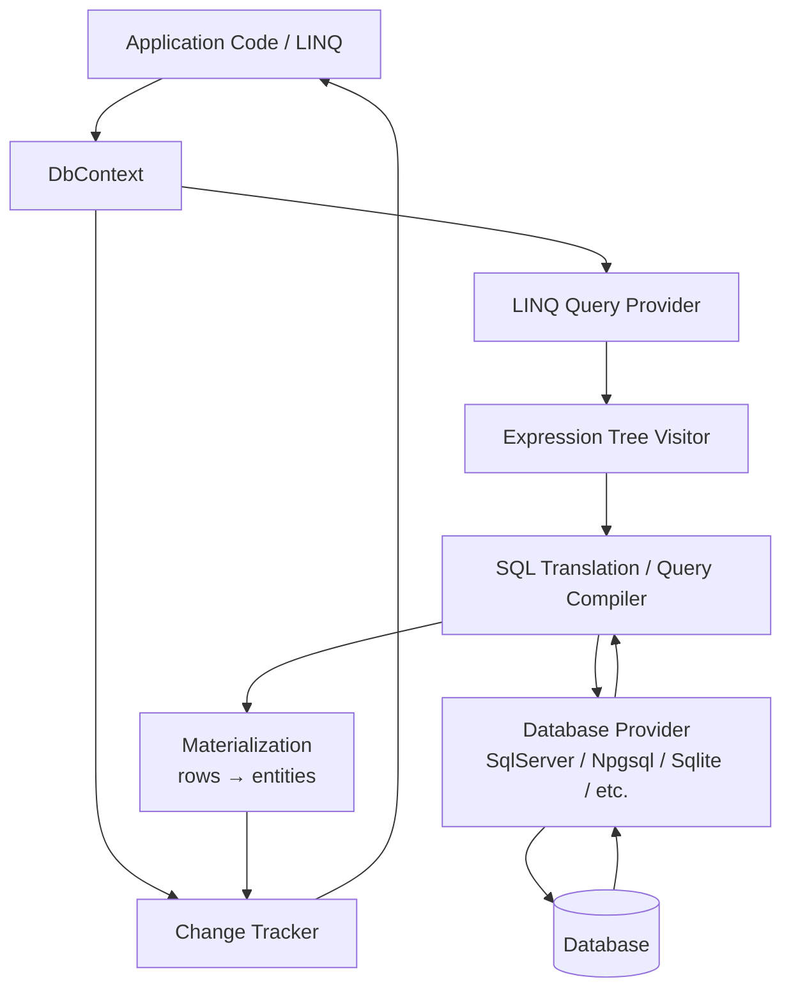
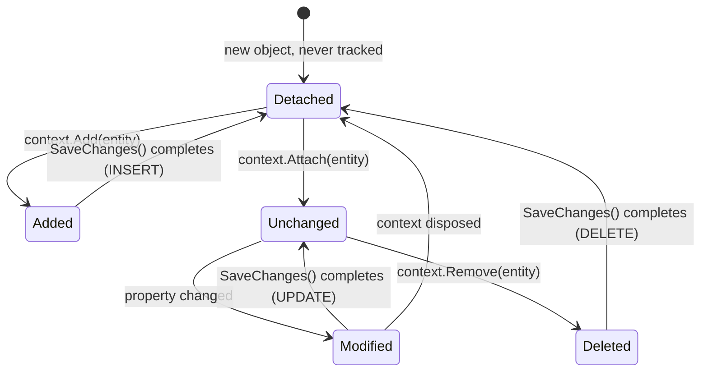
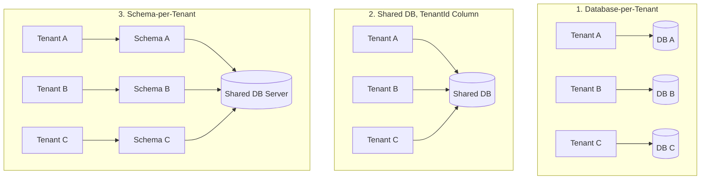

# EF Core — Interview Revision Notes

> Quick-revision Q&A derived from `T. EF-Core-Interview-Guide.md`. Covers every section of the source.

## 1. Core Concepts

### 1.1 What is EF Core and Why It Exists

**Q: What is EF Core?**

A: Microsoft's ORM for .NET. It lets you work with a relational database using C# objects instead of raw SQL, handling SQL generation, connection management, change tracking, and relationship mapping for you.

```sql
SELECT * FROM Users WHERE Id = 1
```

```csharp
var user = context.Users.Find(1);
```

**Q: Why does EF Core exist — what's the "why" an interviewer wants?**

A:

- Removes repetitive boilerplate SQL and manual row↔object mapping.
- Centralizes schema evolution via migrations (version control for the DB).
- Provides a LINQ-based, strongly-typed query surface that's refactor-safe (rename a property, get compiler errors instead of silently broken SQL strings).
- Trade-off: you give up some query control and add an abstraction layer — which is exactly why senior engineers must know when to drop to raw SQL/Dapper.

### 1.2 DbContext

**Q: What is DbContext and what does it do?**

A: The central class of EF Core — a Unit of Work + Repository-like abstraction combined. It represents a session with the database.

```csharp
public class AppDbContext : DbContext
{
    public AppDbContext(DbContextOptions<AppDbContext> options) : base(options) { }

    public DbSet<User> Users { get; set; }
}
```

Responsibilities:

- Opens/manages the underlying connection
- Executes queries (via the LINQ provider → SQL translation pipeline)
- Tracks entity changes (Change Tracker)
- Persists changes as SQL (`SaveChanges`)
- Manages transactions

**Q: Is DbContext thread-safe, and what lifetime should it use in ASP.NET Core?**

A: No, it is not thread-safe — never share one instance across concurrent operations or requests. One `DbContext` instance = one unit of work / one logical database session. Register with **Scoped** lifetime (one instance per HTTP request) via `AddDbContext<T>`. It's lightweight to construct but not free — it wraps a connection, model cache lookup, and change tracker; that's why pooling exists (see §6.1).

### 1.3 Entity, DbSet, and Conventions

**Q: What is an "entity" in EF Core, and how does convention-based mapping work?**

A: A POCO mapped to a table — no database logic should live inside it. By convention: class name → table name (pluralized, e.g. `User` → `Users`), and `Id`/`<ClassName>Id` → primary key.

```csharp
public class User
{
    public int Id { get; set; }        // Primary key by convention
    public string Name { get; set; }
    public string Email { get; set; }
}
```

**Q: What is DbSet<T>?**

A: A queryable/updatable gateway to a table — not the data itself, it's an `IQueryable<T>` entry point.

```csharp
context.Users.Add(new User { Name = "John" });   // INSERT (staged)
var users = context.Users.ToList();               // SELECT
var user = context.Users.First(u => u.Id == 1);
user.Name = "Updated";                            // UPDATE (staged, tracked)
context.Users.Remove(user);                       // DELETE (staged)
context.SaveChanges();                             // flush everything above
```

**Q: Find() vs FirstOrDefault() — what's the difference?**

A: `Find()` checks the change tracker first by primary key — if the entity is already tracked, it returns it without hitting the DB. `FirstOrDefault()`/`First()` always issue a query, regardless of tracking state.

**Q: Add() vs Attach() — and what's the classic bug here?**

A: `Add()` marks the entity (and its untracked graph) as `Added` → generates `INSERT`. `Attach()` marks the entity as `Unchanged` (tracked, no DB hit) — used when you already have an entity with a known key and want EF to track it without re-inserting. Bug: calling `Add()` on an entity that already exists in the DB causes a duplicate-key insert; fix is `Attach()` + explicitly setting state, or `Update()`.

### 1.4 EF Core Architecture

**Q: Walk through the EF Core architecture/pipeline.**

A:



- The LINQ provider captures your expression tree (it translates the *expression*, not executing C# delegates against the DB — which is why arbitrary C# methods often can't be translated).
- The database provider (SqlServer, Npgsql for PostgreSQL, Sqlite, InMemory for tests) supplies the provider-specific SQL dialect and type mappings.
- Materialized rows are handed to the Change Tracker if tracking is enabled.

### 1.5 LINQ, Query Translation, and Deferred Execution

**Q: What is deferred execution?**

A: A query is not sent to the database until a terminal operator is invoked — `ToList()`, `ToArray()`, `First()`, `FirstOrDefault()`, `Single()`, `Count()`, `Any()`, `Sum()`, foreach enumeration, etc.

```csharp
var query = context.Users.Where(u => u.Id > 5);
// No SQL executed yet — query is an expression tree (IQueryable<User>)

var list = query.ToList();
// SQL executes NOW
```

**Q: How does common LINQ map to SQL?**

A:

| LINQ | SQL Equivalent |
|---|---|
| `Where` | `WHERE` |
| `Select` | `SELECT` (projection) |
| `First`/`FirstOrDefault` | `SELECT TOP(1)` / `LIMIT 1` |
| `Any` | `EXISTS` |
| `Count` | `COUNT` |
| `OrderBy`/`Skip`/`Take` | `ORDER BY` / `OFFSET` / `FETCH NEXT` |

**Q: Why is projection a performance tool, not just syntax sugar?**

A: Selecting only needed columns reduces data pulled from the DB.

```csharp
var names = context.Users.Select(u => u.Name).ToList(); // only Name column fetched
```

**Q: What's the "spot the bug" trap with .ToList() and subsequent LINQ calls?**

A: Calling `.ToList()` too early materializes the full result set into memory; any further LINQ (`.Where`, `.OrderBy`) after that runs client-side in memory, not as SQL.

```csharp
// BAD — pulls entire table into memory, then filters in-process
context.Users.ToList().Where(u => u.IsActive);

// GOOD — filter translated to SQL, only matching rows come back
context.Users.Where(u => u.IsActive).ToList();
```

## 2. Change Tracking

### 2.1 Entity States and the Change Tracker

**Q: What does the Change Tracker do?**

A: EF Core tracks every entity it materializes (unless told not to), recording original values, current values, and an explicit state.



**Q: What are the entity states and their resulting SQL?**

A:

| State | Meaning | SQL on SaveChanges |
|---|---|---|
| `Added` | New entity, not yet in DB | `INSERT` |
| `Modified` | Tracked entity with changed property values | `UPDATE` |
| `Deleted` | Marked for removal | `DELETE` |
| `Unchanged` | Tracked, no detected changes | none |
| `Detached` | Not tracked by this context at all | none |

```csharp
var user = context.Users.First(u => u.Id == 1);
user.Name = "Updated Name";
context.SaveChanges();
// UPDATE Users SET Name = 'Updated Name' WHERE Id = 1
// No explicit "update" call needed — EF diffs current vs original values.
```

**Q: Two common interview traps about change tracking — what are the corrections?**

A:

- "EF updates every column automatically" is **false** — EF generates `UPDATE` statements only for changed columns (based on snapshot comparison), unless configured for full-column updates.
- "Tracking is free" is **false** — a snapshot of original values is kept per tracked entity, and every `SaveChanges()` call walks the entire tracked graph to detect changes (`DetectChanges()`), which is O(n) in tracked entities.

### 2.2 Change Tracker Internals — Snapshots vs Proxies

**Q: What are the two change-detection strategies in EF Core?**

A:

- **Snapshot-based tracking (default):** EF keeps an internal snapshot of original property values captured at query time (or `Attach`/`Add` time). `DetectChanges()` compares current vs snapshot values. Works with plain POCOs but is a full-graph scan — potentially expensive with thousands of tracked entities.
- **Notification-based tracking (proxies):** If entities implement `INotifyPropertyChanged`/`INotifyPropertyChanging` (or you use EF's dynamic proxies via `UseChangeTrackingProxies()`), EF is notified immediately on mutation and doesn't need to rescan the whole graph. Faster for very large tracked sets, but requires implementing the interfaces or accepting runtime-generated proxy types (gotchas: virtual properties required, no `sealed` classes, harder to unit test with `new Entity()`).

**Q: When is DetectChanges() called, and can you control it?**

A: It's called automatically before `SaveChanges()` and before most tracked LINQ queries. You can call it manually, and disable auto-detection (`context.ChangeTracker.AutoDetectChangesEnabled = false`) around a bulk in-memory operation, calling `DetectChanges()` once at the end for a meaningful speedup in tight loops.

**Q: What is ChangeTracker.Entries() useful for?**

A: Inspecting/iterating all tracked entities and their states — useful for generic audit logging (e.g., setting `CreatedAt`/`ModifiedAt` in a `SaveChanges` override by iterating `ChangeTracker.Entries<IAuditable>()`).

### 2.3 AsNoTracking vs AsNoTrackingWithIdentityResolution

**Q: What does AsNoTracking() do, and when should you use it?**

A: Fastest read path — no snapshot kept, no change tracker entries; every row is materialized as an independent object even if the same entity appears twice via joins (no identity resolution). Fine for flat, single-entity read APIs.

```csharp
context.Users.AsNoTracking().ToList();   // no snapshot kept, no change tracker entries
```

**Q: How does AsNoTrackingWithIdentityResolution() differ?**

A: Still untracked (no snapshots, no `SaveChanges` participation), but EF deduplicates entities with the same key within a single query result — if `User` appears twice via a join it's materialized once, both references pointing to the same object. Use when projecting graphs with `Include()` for read-only display purposes where correct object identity matters (e.g., binding to a UI tree) without paying full change-tracking cost.

**Q: What's the rule of thumb for tracking on reads?**

A: Default to `AsNoTracking()` for all read-only/GET endpoints; only pay for tracking when you intend to call `SaveChanges()` against those entities.

### 2.4 SaveChanges Internals

**Q: What happens internally when you call SaveChanges()?**

A:

1. `DetectChanges()` walks the tracked graph, diffing snapshots.
2. EF builds the set of `INSERT`/`UPDATE`/`DELETE` commands needed, respecting FK dependency order (inserts of parents before dependents, deletes of dependents before parents).
3. All commands execute inside an implicit transaction (unless one is already open).
4. Commits on success; rolls back entirely on failure (constraint violation, concurrency conflict) and throws (`DbUpdateException`, `DbUpdateConcurrencyException`).
5. On success, `Added` entities transition to `Unchanged` (DB-generated key values populated back), `Deleted` entities become `Detached`.

```csharp
context.SaveChanges();
```

**Q: Why does await matter for SaveChangesAsync()?**

A: `SaveChangesAsync` frees the thread while waiting on I/O — critical for ASP.NET Core throughput under load (avoids thread-pool starvation). Forgetting `await`: the `Task` is fired, control returns immediately, and the request can complete before the write is durable — worse, an unawaited faulted task can go unobserved and swallow exceptions.

```csharp
await context.SaveChangesAsync();
```

## 3. Relationships and Loading Strategies

### 3.1 Relationship Types & Configuration

**Q: What relationship types does EF Core support, and how are they configured?**

A: One-to-One, One-to-Many, and Many-to-Many, discovered by convention or configured via Fluent API (preferred over data annotations beyond trivial cases — it's the only way to express things like composite keys or `ExecuteUpdate` shadow FK mapping).

```csharp
public class User
{
    public int Id { get; set; }
    public string Name { get; set; }
    public List<Order> Orders { get; set; }
}

public class Order
{
    public int Id { get; set; }
    public int UserId { get; set; }
    public User User { get; set; }
}
```

```csharp
modelBuilder.Entity<Order>()
    .HasOne(o => o.User)
    .WithMany(u => u.Orders)
    .HasForeignKey(o => o.UserId);
```

**Q: Is a navigation property the same as a foreign key?**

A: No. The FK column enforces referential integrity at the DB level; the navigation property is a code convenience for object-graph traversal. Since EF Core 5.0, many-to-many is supported without an explicit join entity (a shadow join table is created automatically) — but for a join table with payload data (e.g., `EnrolledAt`), model the join entity explicitly.

### 3.2 Eager, Lazy, and Explicit Loading

**Q: What are the three loading strategies, and which should you default to for APIs?**

A: EF Core does not load related data by default — you opt in.

| Strategy | Mechanism | DB Round Trips | API Suitability |
|---|---|---|---|
| Eager | `.Include(u => u.Orders)` | 1 (or more with split query) | Preferred for APIs |
| Lazy | Proxy auto-loads on navigation access | 1 per access (N+1 risk) | Avoid in APIs |
| Explicit | `context.Entry(user).Collection(u => u.Orders).Load()` | 1 per explicit call, controlled | Fine for targeted, conditional loading |

```csharp
// Eager
context.Users.Include(u => u.Orders).ToList();

// Lazy (requires Microsoft.EntityFrameworkCore.Proxies + UseLazyLoadingProxies())
user.Orders; // triggers a DB call the moment this is touched

// Explicit
context.Entry(user).Collection(u => u.Orders).Load();
```

A: Default to eager loading (or better, projection) for web APIs; lazy loading is dangerous because it hides DB calls behind ordinary property access, making performance bugs invisible in code review.

### 3.3 Split Queries vs Single Query for Collection Includes

**Q: What is the cartesian-explosion problem with multiple collection Includes?**

A: By default, `Include()`ing multiple collection navigations generates a single query with `JOIN`s — if a `User` has 10 `Orders` and 5 `Addresses`, the single-query approach returns up to 50 rows of duplicated `User` data to reconstruct the graph client-side.

```csharp
// Single query (default) — one round trip, but row count = Orders × Addresses
context.Users
    .Include(u => u.Orders)
    .Include(u => u.Addresses)
    .ToList();

// Split query — one query per collection Include, avoids the multiplication
context.Users
    .Include(u => u.Orders)
    .Include(u => u.Addresses)
    .AsSplitQuery()
    .ToList();
```

**Q: What are the trade-offs between single query and split query?**

A:

- **Single query:** one round trip (lower latency for small graphs), but risks huge duplicated result sets and slower transfer for large fan-out collections. Atomic/consistent by nature without an explicit transaction.
- **Split query:** avoids row explosion, transfers far less data for large collections, but issues multiple round trips — separate queries mean a small window where data could change between them if not wrapped in an explicit transaction (usually acceptable for reads).
- Configure globally (`UseSqlServer(connStr, o => o.UseQuerySplittingBehavior(QuerySplittingBehavior.SplitQuery))`) or per-query with `.AsSplitQuery()`/`.AsSingleQuery()`. EF Core logs a warning if you use multiple collection `Include`s without explicitly choosing a splitting behavior.

### 3.4 The N+1 Problem — Spotting and Fixing It

**Q: What is the N+1 problem?**

A: 1 query to fetch N parent rows, then N additional queries (one per row) to fetch related data — typically caused by lazy loading inside a loop, or naive per-item querying instead of batching.

```csharp
// N+1 — 1 query for users, then 1 query per user for Orders
var users = context.Users.ToList();
foreach (var user in users)
{
    user.Orders.Count();   // lazy-load trigger per iteration
}
```

**Q: How do you spot N+1 in the wild?**

A:

- Enable EF Core query logging (`.LogTo(Console.WriteLine, LogLevel.Information)`) or use an APM tool (Application Insights, MiniProfiler, Datadog) and look for a repeating identical query pattern with only the parameter value changing.
- SQL Server Profiler / extended events showing a burst of near-identical `SELECT ... WHERE UserId = @p0` statements.
- Code review heuristic: any property access on a navigation collection inside a `foreach`/`Select` over a queried list is a red flag if lazy loading is enabled.

**Q: What are the fixes, in order of preference?**

A:

1. Eager load what you need: `.Include(u => u.Orders)`.
2. Project instead of loading full graphs when you only need aggregates: `.Select(u => new { u.Id, OrderCount = u.Orders.Count() })` — translates to a single SQL query with a correlated subquery/`GROUP BY`, no client loop.
3. Disable lazy loading entirely in API projects (don't reference `Microsoft.EntityFrameworkCore.Proxies`/don't call `UseLazyLoadingProxies()`), forcing explicit `Include()` everywhere.

```csharp
// Fix
var users = context.Users
    .Include(u => u.Orders)
    .AsNoTracking()
    .ToList();
```

## 4. Migrations

### 4.1 Migration Fundamentals

**Q: What are migrations, and what happens internally when you run them?**

A: Version control for your database schema — analogous to Git commits, but for DDL.

```powershell
Add-Migration InitialCreate
Update-Database
```

(or CLI equivalents: `dotnet ef migrations add InitialCreate`, `dotnet ef database update`)

1. EF compares the current model snapshot against the last recorded model snapshot (stored in the `Migrations` folder's `*.Designer.cs`/snapshot file).
2. Generates a migration class with `Up()`/`Down()` methods containing `MigrationBuilder` calls (`AddColumn`, `DropColumn`, `CreateTable`, etc.).
3. `Update-Database` executes pending migrations in order, recording each in the `__EFMigrationsHistory` table.

```csharp
migrationBuilder.AddColumn<string>(
    name: "Email",
    table: "Users",
    nullable: true);
```

**Q: What are the classic migration traps?**

A:

- Editing the database schema manually, bypassing migrations, causes model/DB drift and makes EF's snapshot comparison unreliable.
- "One migration per code change" is not a hard rule — batch logically-related schema changes into a coherent migration per feature/PR.
- EF Core can run without migrations (`EnsureCreated()`), but that's for tests/prototypes only — no incremental schema evolution, and cannot coexist with migrations on the same model.

### 4.2 Migrations in a Team / CI-CD Workflow

**Q: Should you call Database.Migrate() from application startup in production?**

A: Never, beyond a single-instance toy app — with multiple instances/pods scaling up simultaneously you can get concurrent migration attempts racing each other. Prefer a dedicated migration step in the CI/CD pipeline (a one-shot job/container running `dotnet ef database update` or an idempotent SQL script) that runs before the new app version is deployed.

**Q: How do you make migrations safe for review/audit in prod?**

A: Generate idempotent SQL scripts instead of trusting `Update-Database` blindly:

```powershell
dotnet ef migrations script --idempotent -o migrate.sql
```

This produces a script guarded by checks against `__EFMigrationsHistory`, safe to re-run, and reviewable by a DBA before execution.

**Q: What is the expand/contract pattern for zero-downtime schema changes, and how does it apply to common changes?**

A: When old and new app versions may run simultaneously (rolling deployment), a migration must not break the currently-running old version.

- Adding a nullable column: safe.
- Adding a NOT NULL column: do it in phases — add nullable, backfill, then add constraint in a later migration/deploy.
- Renaming a column: EF Core's default diffing generates `DROP` + `ADD` (data loss!) for a perceived rename unless you explicitly use `migrationBuilder.RenameColumn(...)` — always hand-edit generated migrations for renames.
- Dropping a column: deprecate first (stop reading/writing it in code, deploy), then drop in a subsequent migration once nothing depends on it.

**Q: How do you resolve migration merge conflicts between two branches?**

A: Rebase — regenerate the migration on top of the merged model snapshot rather than hand-merging two migration files; delete the redundant one and regenerate if needed, but only before either has been applied to a shared/prod environment.

**Q: What's the PR review discipline for migrations?**

A: Always review the generated `Up`/`Down` SQL (via `Script-Migration` or reading the generated file) before merging — silently-generated `DROP COLUMN`/`DROP TABLE` is the single most common cause of migration-related data loss incidents.

**Q: What environment-safety practices matter for migrations?**

A: Separate connection strings/credentials per environment, least-privilege DB accounts for the app (no schema-alter rights in prod for the running app identity — the migration step uses a separate elevated credential), and staging validation against production-like data volume before applying to prod (a migration instant on a 100-row staging table can lock a 100M-row prod table for minutes).

### 4.3 Migration Disaster Recovery Scenarios

**Q: Walk through real production migration disaster scenarios and their recovery/prevention.**

A:

| Scenario | Root Cause | Recovery | Prevention |
|---|---|---|---|
| Migration applied but app code rolled back | DB schema ahead of running code → "Invalid column name" errors | Re-deploy matching app version (preferred); or `Update-Database PreviousMigration` if reversible | Blue-green deploys; never roll back code without considering DB state |
| Column dropped, data lost | `DropColumn` migration ran in prod | Restore from backup, re-add column, reinsert data if possible | Never drop directly — deprecate first; always back up before prod migrations |
| Migration fails halfway | Long/complex migration interrupted mid-execution | Check `__EFMigrationsHistory`, manually reconcile schema to last successful step, re-run | Test on staging, keep migrations small and atomic where the DB engine allows |
| Conflicting migrations from two devs | Parallel branches both added migrations | Rebase, generate one combined migration, delete conflicting ones (only pre-prod) | One migration per feature branch; review in PRs; sync frequently |
| Emergency hotfix needs schema change | No time for standard pipeline | Apply SQL manually (controlled), then immediately generate/backfill a matching EF migration to resync the model | Avoid hotfix DB changes; always backfill migrations afterward |
| Migration causes table lock/downtime | Adding a column with a default value locks a large table | Cancel; apply in steps — nullable column → batched backfill → add NOT NULL constraint | Plan large schema changes in phases; avoid blocking DDL on hot tables |
| Migration applied to wrong environment | Prod migration run against QA or vice versa | Restore DB from correct backup, re-apply correct migrations | Environment-specific connection strings, CI/CD safeguards, least-privilege creds |
| Manual DB change without migration | DBA changed schema directly | `Add-Migration SyncWithDb`, carefully validate generated SQL | No manual DB changes — EF migrations are the single source of truth |
| Migration generates unexpected SQL (e.g., rename → drop+recreate) | EF's model diff can't distinguish "rename" from "drop old, add new" | Hand-edit migration to use `RenameColumn` explicitly | Always review generated migration code before applying |

**Q: What do interviewers want to hear about migration discipline?**

A: "I always review generated migration SQL," "I test migrations against staging with production-like data volume," "I avoid destructive migrations and prefer expand/contract," "I keep DB schema and code in sync via CI/CD, not manual changes."

## 5. Intermediate Topics

### 5.1 Concurrency Handling

**Q: How does EF Core support optimistic concurrency?**

A: Via a concurrency token/row-version column.

```csharp
public class User
{
    public int Id { get; set; }
    public string Name { get; set; }

    [Timestamp]
    public byte[] RowVersion { get; set; }
}
```

- On `UPDATE`/`DELETE`, EF includes the original `RowVersion` value in the `WHERE` clause.
- If another transaction already updated the row (row version changed), zero rows match → EF detects 0 affected rows and throws `DbUpdateConcurrencyException`.

**Q: What resolution strategies exist for a concurrency conflict?**

A: "Database wins" (reload and discard local changes), "client wins" (re-apply local values and retry with the fresh row version), or a merge UI presenting both versions to the user. Handle by catching `DbUpdateConcurrencyException`, inspecting `ex.Entries`, and calling `entry.OriginalValues.SetValues(entry.GetDatabaseValues())` before retrying (database-wins) or re-applying original values + re-save (client-wins).

**Q: Is [Timestamp] portable across database providers?**

A: No — `[Timestamp]` is SQL Server-specific (`rowversion` type). On providers without a native rowversion type, use `[ConcurrencyCheck]` on any column, or configure `.IsRowVersion()`/`.IsConcurrencyToken()` via Fluent API, or use a `uint`/`byte[]` shadow property with a computed value.

### 5.2 Transactions

**Q: Does SaveChanges() need an explicit transaction?**

A: No — `SaveChanges()` already wraps its own operations in an implicit transaction. You only need an explicit transaction when you must span multiple `SaveChanges()` calls (or mix EF operations with raw ADO.NET/Dapper calls) atomically.

```csharp
using var tx = context.Database.BeginTransaction();
context.SaveChanges();
tx.Commit();
```

**Q: Why keep transactions short?**

A: Long-running transactions under load are the classic cause of lock contention/deadlocks/timeouts in production. Batch large bulk operations instead of wrapping everything in one giant transaction.

**Q: Why avoid distributed transactions, and what's the modern alternative?**

A: Spanning a transaction across two different databases or a DB + message queue requires a distributed transaction coordinator (e.g., MSDTC) or two-phase commit — slow, fragile, often unsupported by cloud-managed databases and modern brokers. The modern alternative is the **Saga pattern** — a sequence of local transactions, each with a compensating action if a later step fails (e.g., "reserve inventory" → "charge payment" → if charge fails, compensate by "release inventory reservation"). For most systems, prefer eventual consistency via the **outbox pattern** (write the domain change and an "event to publish" row in the same local transaction, then a background process publishes it) over distributed transactions.

### 5.3 Shadow Properties

**Q: What is a shadow property?**

A: A property that exists in the EF model and maps to a database column but is not declared on the CLR entity class — EF tracks its value internally.

```csharp
modelBuilder.Entity<Order>()
    .Property<DateTime>("LastModified");

// Access via the change tracker API, not a C# property:
context.Entry(order).Property("LastModified").CurrentValue = DateTime.UtcNow;
```

**Q: Where do shadow properties show up in real code, and how do you discover them?**

A:

- Foreign key properties are often shadow properties when you model only the navigation property without an explicit FK property on the dependent class.
- Common for audit columns (`CreatedAt`, `ModifiedBy`) tracked by EF/interceptors but not wanted cluttering the domain model.
- Discoverable via `context.Model.FindEntityType(typeof(Order)).GetProperties()`.

### 5.4 Value Converters and Owned Types

**Q: What is a Value Converter, and when do you use one?**

A: Maps a CLR type to/from a different type for storage (e.g., enum ↔ string, or a custom value object ↔ primitive).

```csharp
modelBuilder.Entity<Order>()
    .Property(o => o.Status)
    .HasConversion<string>();   // store enum as string instead of int

// Custom converter
modelBuilder.Entity<Order>()
    .Property(o => o.Amount)
    .HasConversion(
        v => v.Value,                     // to provider
        v => new Money(v));               // from provider
```

**Q: What are Owned Types, and how do they map to storage?**

A: `OwnsOne`/`OwnsMany` model a value object with no independent identity/table of its own; by default its properties map as columns on the owner's table (or a separate table with `ToTable` for `OwnsMany`).

```csharp
public class Address
{
    public string Street { get; set; }
    public string City { get; set; }
}

modelBuilder.Entity<User>()
    .OwnsOne(u => u.Address);
// Produces columns: Address_Street, Address_City on Users table
```

- Owned types have no separate identity — always loaded/saved with the owner, can't be queried independently, support nesting.
- Since EF Core 7+, you can map an owned type (or a whole entity) to a JSON column via `ToJson()`:

```csharp
modelBuilder.Entity<User>()
    .OwnsOne(u => u.Address, a => a.ToJson());
```

### 5.5 Global Query Filters

**Q: What is a global query filter, and what are the canonical use cases?**

A: A `Where` predicate automatically applied to every query for a given entity type unless explicitly bypassed. Canonical use cases: soft delete and multi-tenancy.

```csharp
modelBuilder.Entity<User>()
    .HasQueryFilter(u => !u.IsDeleted);

// Multi-tenant example
modelBuilder.Entity<Order>()
    .HasQueryFilter(o => o.TenantId == _currentTenantService.TenantId);
```

- Applies automatically to LINQ queries, `Include()`d navigations, and even queries generated via relationships — no need to remember `.Where(u => !u.IsDeleted)` at every call site.
- Bypass explicitly with `.IgnoreQueryFilters()` when you genuinely need everything (e.g., an admin "show deleted records" screen).

**Q: What gotchas should you raise about global query filters in an interview?**

A: Filters referencing a service/DbContext field (like current tenant ID) are evaluated per-query at translation time using the context instance's current field value — a filter capturing `this.TenantId` works correctly per-request with a scoped context, but be wary of caching a `DbContext` or compiled query across tenants. Also, global filters can only reference properties on the entity itself, related entity properties (via navigation), or fields/properties on the `DbContext` — not arbitrary external state.

### 5.6 Multi-Tenancy Architectures — Which One Would You Choose?

**Q: What is the broader architectural question behind multi-tenancy, beyond the global-query-filter mechanism?**

A: Global query filters (§5.5) only answer "how do you scope queries by tenant within a shared database." The senior-level question is "which multi-tenancy architecture would you choose, and why?" — a system-design trade-off one level up. The three standard architectures:



**Q: How do the three architectures compare across key dimensions?**

A:

| Dimension | DB-per-Tenant | Shared DB + `TenantId` column | Schema-per-Tenant |
|---|---|---|---|
| **Data isolation** | Strongest — physically separate databases | Weakest — a single missing/bypassed query filter leaks another tenant's data; global query filter (§5.5) mitigates but doesn't eliminate | Medium — schema boundary provides real DB-level separation without a full separate database |
| **Cost / resource efficiency** | Most expensive — N databases, N sets of connections/backups/compute | Cheapest — one database, one connection pool, shared compute | Middle — one server, but N schemas each with their own table set |
| **Operational complexity** | High — migrations must run against every tenant database individually | Low — one schema, one migration run, one monitoring dashboard | High — migrations must run against every schema; weak tooling for "run this migration against N schemas" |
| **Blast radius of a bug/incident** | Smallest — affects exactly one tenant | Largest — a bad migration/lock contention/noisy neighbor/data-leak bug can affect all tenants | Medium — schema-level issue affects one tenant; server-level outage affects all (same as shared-DB at infra level) |
| **"Noisy neighbor" risk** | None | Real risk — one tenant's heavy load can degrade performance for all others | Reduced vs shared-table but still shares the server's CPU/IO/connection budget |
| **Per-tenant customization** | Easiest — each DB can have a different schema version | Hardest — all tenants share one schema; needs EAV tables/JSON columns for flexibility | Possible but awkward — schemas *can* diverge but usually kept identical for tooling sanity |
| **Onboarding a new tenant** | Slowest — provisioning a new database has real latency/cost | Fastest — just a new `TenantId` value | Medium — provisioning a new schema is lighter than a new DB but still a DDL operation |
| **Regulatory/compliance fit** | Best — dropping a tenant's DB is a clean, auditable deletion; satisfies data residency by region-placing DBs | Worst — deleting "all of tenant X's data" means deleting rows across every table correctly; residency very difficult | Medium — dropping a schema is cleaner than deleting rows, but still within one physical server/region |
| **EF Core support quality** | Straightforward — different connection string per tenant via tenant-resolution middleware | Best native support — exactly what `HasQueryFilter()` (§5.5) is built for | Workable via `HasDefaultSchema()` set dynamically, but weaker tooling than the other two |

**Q: How do you actually answer "which would you choose" at senior level?**

A:

- Start with the business/compliance constraint, not the technology. Enterprise customers with contractual/regulatory data-isolation requirements (healthcare, finance, government), or a tenant big enough that its load must never affect others → **DB-per-tenant** despite operational cost.
- High-volume, low-touch-per-tenant SaaS (thousands to millions of small tenants) → **shared DB with TenantId** is almost always pragmatic — DB-per-tenant at that scale is an operational nightmare (imagine migrations against 50,000 databases).
- **Schema-per-tenant** is least commonly chosen in new EF Core designs because EF's tooling story for it is weaker than the other two — more often seen in legacy systems or platforms with better native support. Mention for completeness, but it's a narrower-fit choice today.
- **Hybrid approaches are valid**: shared DB for the long tail of small/free-tier tenants, with a migration path to a dedicated database for large/enterprise tenants once they justify the operational cost.
- Always mention mitigation for shared-DB's biggest weakness: global query filters (§5.5) are necessary but not sufficient — pair with defense-in-depth (integration tests asserting cross-tenant isolation, code review discipline around `IgnoreQueryFilters()`, and a DB-level safeguard like row-level security in PostgreSQL/SQL Server as backstop).

**Q: Follow-up — "What happens when a shared-DB tenant outgrows the shared model?"**

A: This is the hybrid-migration scenario: move one tenant's rows into a dedicated database without downtime — a real data-migration project (extract, transform tenant-scoped rows, re-point that tenant's connection resolution, backfill/verify, cut over). This path is far easier to have designed for from day one (e.g., keeping `TenantId` consistently on every table, avoiding cross-tenant foreign keys) than to retrofit after the fact.

## 6. Advanced Topics

### 6.1 DbContext Pooling

**Q: What is DbContext pooling, and how do you configure it?**

A: Instead of allocating a new `DbContext` (and its internal services) per request, EF Core maintains a pool; on request start an instance is rented and its state is reset (change tracker cleared, etc.); on disposal it's returned to the pool instead of being GC'd.

```csharp
builder.Services.AddDbContextPool<AppDbContext>(options =>
    options.UseSqlServer(connectionString), poolSize: 128);
```

**Q: What are the benefits and constraints/gotchas of pooling?**

A:

- Benefit: reduces allocation overhead for the `DbContext` and its internal service dependencies (useful at high request volume). Helps CPU/allocation overhead, not query performance — doesn't reduce round trips or SQL cost.
- Your `DbContext` constructor must only take a `DbContextOptions<T>` — no other injected scoped services with per-request state, because the instance now outlives a single logical DI scope (it's reused across requests).
- If you need other scoped services inside the context (e.g., `ICurrentUserService`), inject via a method call or a mutable property set at the start of each request/use, not via the constructor.
- Any static/instance state added to your derived `DbContext` class must be explicitly reset — a classic pooling bug is stale state leaking from one request into the next.

### 6.2 Compiled Queries

**Q: What is a compiled query, and how do you create one?**

A: A LINQ query pre-bound via `EF.CompileQuery`/`EF.CompileAsyncQuery` to skip EF's internal per-call query-cache lookup.

```csharp
private static readonly Func<AppDbContext, int, User> _getUserById =
    EF.CompileQuery((AppDbContext ctx, int id) =>
        ctx.Users.FirstOrDefault(u => u.Id == id));

var user = _getUserById(context, 5);

// Async version
private static readonly Func<AppDbContext, int, Task<User>> _getUserByIdAsync =
    EF.CompileAsyncQuery((AppDbContext ctx, int id) =>
        ctx.Users.FirstOrDefault(u => u.Id == id));
```

**Q: When does a compiled query actually matter, and what constraint does it impose?**

A: EF Core already caches the compiled expression-tree-to-SQL translation internally per unique query shape (why the *first* execution of a given LINQ shape is more expensive than subsequent ones) — `EF.CompileQuery` skips even that internal cache lookup by binding the delegate once, ahead of time. It matters for hot-path queries executed extremely frequently (thousands+ times/sec); not a general "use this everywhere" recommendation — reach for it only after profiling shows compilation/lookup overhead is meaningful. Compiled queries must have a stable shape — parameters can vary, but the LINQ structure itself cannot (no dynamically-built `Where` clauses).

### 6.3 EF Core Interceptors

**Q: What are EF Core interceptors, and what do they hook into?**

A: They let you hook into EF Core's pipeline at specific points: command execution, `SaveChanges`, connection open/close, transaction events.

```csharp
public class AuditSaveChangesInterceptor : SaveChangesInterceptor
{
    public override InterceptionResult<int> SavingChanges(
        DbContextEventData eventData, InterceptionResult<int> result)
    {
        var context = eventData.Context;
        foreach (var entry in context.ChangeTracker.Entries<IAuditable>())
        {
            if (entry.State == EntityState.Added)
                entry.Entity.CreatedAt = DateTime.UtcNow;
            if (entry.State is EntityState.Added or EntityState.Modified)
                entry.Entity.ModifiedAt = DateTime.UtcNow;
        }
        return result;
    }
}

// Registration
options.AddInterceptors(new AuditSaveChangesInterceptor());
```

**Q: What are the main interceptor types, and when do you prefer interceptors over a SaveChanges() override?**

A:

- **`ISaveChangesInterceptor`** — hook before/after `SaveChanges`/`SaveChangesAsync`; classic use: automatic audit columns, soft-delete conversion (turn a `Remove()` into setting `IsDeleted = true` + state `Modified` instead of an actual `DELETE`), domain event dispatching after successful commit.
- **`DbCommandInterceptor`** — inspect/modify the raw `DbCommand` before execution; useful for query tagging, injecting query hints, or logging exact SQL with parameter values.
- **`DbConnectionInterceptor`** — hook connection open/close; useful for connection-level diagnostics or enforcing read-only replicas for certain contexts.
- Compare to the older `SaveChanges()` override (still valid, simpler for single-context-type logic) — interceptors are preferred when cross-cutting logic must apply across multiple `DbContext` types, or you want composability/testability without subclassing.

### 6.4 Bulk Operations — ExecuteUpdate / ExecuteDelete

**Q: What problem do ExecuteUpdate/ExecuteDelete solve, and how do they work?**

A: Traditionally, updating/deleting many rows required loading entities into memory, mutating them, and calling `SaveChanges()` — full change tracking overhead plus a `SELECT` before every `UPDATE`/`DELETE`. EF Core 7 introduced set-based bulk operations that translate directly to a single `UPDATE`/`DELETE` statement, bypassing the change tracker entirely.

```csharp
// Bulk update — single SQL UPDATE, no entities loaded into memory
await context.Users
    .Where(u => u.LastLoginDate < cutoff)
    .ExecuteUpdateAsync(setters => setters
        .SetProperty(u => u.IsActive, false)
        .SetProperty(u => u.ModifiedAt, DateTime.UtcNow));

// Bulk delete — single SQL DELETE
await context.Orders
    .Where(o => o.Status == OrderStatus.Cancelled && o.CreatedAt < cutoff)
    .ExecuteDeleteAsync();
```

Generated SQL is roughly:

```sql
UPDATE Users SET IsActive = 0, ModifiedAt = @p0 WHERE LastLoginDate < @p1;
```

**Q: What are the key gotchas with ExecuteUpdate/ExecuteDelete?**

A:

- No change tracking involved — they bypass `SaveChanges()` entirely, execute immediately, and don't respect currently-tracked in-memory modifications to the same rows (ordering gotcha: if tracked entities are modified but not yet saved, an `ExecuteUpdate` on overlapping rows can produce surprising results).
- `SaveChanges`-based interceptors (§6.3) do NOT run for `ExecuteUpdate`/`ExecuteDelete` — if you rely on a `SaveChangesInterceptor` for audit columns or soft-delete conversion, bulk ops bypass that logic; set audit fields explicitly in `SetProperty`, and do soft-delete via `ExecuteUpdate` setting the flag rather than `ExecuteDelete`.
- Global query filters still apply to the `Where` clause building the target set, unless you `.IgnoreQueryFilters()`.
- This is the correct modern answer to "how do you avoid loading 100k rows into memory just to update one column on all of them."

### 6.5 EF Core vs Dapper — Choosing Deliberately

**Q: How do EF Core and Dapper compare across key dimensions?**

A:

| Dimension | EF Core | Dapper |
|---|---|---|
| Abstraction | Full ORM — LINQ, change tracking, migrations, relationship mapping | Micro-ORM — you write SQL, it maps results to objects |
| Productivity | High for CRUD-heavy domain logic | Lower — you write/maintain SQL by hand |
| Performance ceiling | Good, but overhead from tracking/materialization/translation | Near-ADO.NET raw performance |
| Query control | LINQ must translate cleanly; complex SQL (CTEs, window functions, hints) can be awkward or impossible | Full control — any SQL the DB supports |
| Schema evolution | Migrations give tracked, versioned schema history | No built-in schema management — pair with a separate migration tool (or use EF's migrations even if Dapper does the querying) |
| Testability | `InMemory`/SQLite provider enables reasonably realistic integration tests | Requires a real DB (or test containers) — no query-translation layer to fake |
| Best fit | Transactional/CRUD business logic, aggregate writes needing change tracking & concurrency tokens | Reporting, analytics, dashboards, high-throughput read paths, complex hand-tuned SQL |

**Q: What's the senior-level framing of "EF Core vs Dapper"?**

A: It isn't "EF vs Dapper," it's "both, deliberately": use EF Core for the transactional write-side of the domain where change tracking, concurrency tokens, and migrations pay off; drop to Dapper (or raw ADO.NET, or EF's `FromSqlRaw`/`SqlQuery<T>`) for read-heavy reporting/analytics paths where hand-tuned SQL and minimal overhead matter more than productivity. Many production systems mix both within the same codebase, often the same `DbContext`'s underlying connection reused by Dapper via `context.Database.GetDbConnection()`.

## 7. Performance Best Practices

**Q: What should you do for EF Core performance?**

A:

- Use `AsNoTracking()` (or `AsNoTrackingWithIdentityResolution()`) for read-only queries.
- Project (`Select`) to fetch only needed columns instead of full entities.
- Use pagination (`OrderBy().Skip().Take()`) — always `OrderBy` before `Skip`/`Take`, otherwise row order (and page contents) is undefined and can vary between calls.
- Use proper indexes, especially on foreign keys used in joins/filters.
- Use `AsSplitQuery()` for multi-collection `Include()`s.
- Use `ExecuteUpdate`/`ExecuteDelete` for set-based bulk writes.
- Enable query logging (`.LogTo(...)`) or APM instrumentation in non-prod to catch N+1s and unexpectedly expensive SQL before they ship.
- Use `ToQueryString()` on an `IQueryable` to inspect the generated SQL without executing it.

**Q: What should you avoid for EF Core performance?**

A:

- Calling `.ToList()` before filtering (`.Where` after `.ToList()` runs in memory).
- Using lazy loading in API projects.
- Loading entire object graphs with `Include()` when a projection would do.
- Looping DB calls (classic N+1: `foreach (var id in ids) context.Users.Find(id);` → fix with `context.Users.Where(u => ids.Contains(u.Id)).ToList()`).
- Running long transactions across bulk operations — batch instead.
- Assuming EF Core itself is inherently slow — most "EF is slow" complaints trace back to bad LINQ, over-tracking, or missing indexes, not the framework.

## 8. Common Pitfalls / Real Production Mistakes

**Q: What are the most common real-world EF Core production mistakes and their fixes?**

A:

| # | Mistake | Problem | Fix |
|---|---|---|---|
| 1 | Lazy loading in APIs | N+1 queries | `Include()` or projections |
| 2 | Forgetting `AsNoTracking()` on GET APIs | High memory/CPU | No-tracking for reads |
| 3 | `ToList()` too early | Filters run in memory | Filter before materializing |
| 4 | Loading entire entity graphs | Huge joins/cartesian explosion | Projections, split queries |
| 5 | Sharing one `DbContext` across requests | Threading bugs, data corruption | Scoped lifetime |
| 6 | Ignoring generated SQL | Hidden perf issues | Review via logging/`ToQueryString()` |
| 7 | Manual DB changes, no migration | Schema drift | Migrations only, single source of truth |
| 8 | Looping DB calls | N+1 | Batch fetch with `Contains`/`In` |
| 9 | Missing indexes on FKs | Slow joins | Add DB indexes |
| 10 | Large transactions | Locks/timeouts | Keep transactions short, batch |
| 11 | Not handling concurrency conflicts | Silent overwrites | RowVersion/concurrency tokens |
| 12 | Overusing EF for reporting | Slow analytics | Dapper/raw SQL for reporting |
| 13 | Forgetting pagination | Huge result sets | `Skip()`/`Take()` with `OrderBy` |
| 14 | Assuming EF is always slow | Misattributed root cause | Bad LINQ is slow, not EF itself |
| 15 | No monitoring on EF queries | Blind to regressions | Query logging + APM |
| 16 | Relying on `SaveChanges`-based interceptors for audit fields while also using `ExecuteUpdate`/`ExecuteDelete` | Audit logic silently skipped for bulk ops | Set audit fields explicitly in `SetProperty`, or accept bulk ops bypass hooks |
| 17 | Registering scoped, per-request services in a pooled `DbContext` constructor | Stale state leaks across requests | Only `DbContextOptions<T>` in ctor; pass per-request state via method/property |

## 9. Troubleshooting Scenarios (Interview Style)

**Q: API is slow fetching users with orders — diagnose and fix.**

A: Root cause is N+1 via lazy loading.

```csharp
// Problem — N+1 via lazy loading
var users = context.Users.ToList();
foreach (var user in users) { user.Orders.Count(); }

// Fix
var users = context.Users.Include(u => u.Orders).AsNoTracking().ToList();
```

Say: "eager loading" and "N+1 problem."

**Q: GET APIs are consuming high memory — diagnose and fix.**

A: Root cause: unnecessary tracking. Fix: `AsNoTracking()`. Key phrase: "no-tracking queries for read-only operations."

**Q: Duplicate records are inserted unexpectedly — diagnose and fix.**

A: Cause: `Add()` called on an entity that already exists in the DB. Fix: `Attach()` (or `Update()` if it should be marked `Modified`) instead of `Add()`.

**Q: Data isn't saved and no exception is thrown — diagnose and fix.**

A: Cause: forgot to `await SaveChangesAsync()` (fire-and-forget task). Fix: always `await` it, and enable analyzers (`CA2007`/`VSTHRD` rules) that flag un-awaited tasks.

**Q: Deadlocks occur during bulk updates — diagnose and fix.**

A: Cause: one giant long-running transaction. Fix: batch processing, short transactions, or `ExecuteUpdate` for set-based writes that avoid loading rows at all.

**Q: Huge SQL with multiple joins times out — diagnose and fix.**

A: Cause: over-using `Include()` → cartesian explosion. Fix: project instead of including, or use `AsSplitQuery()`. Interview keyword: "projection over Include."

**Q: A query behaves differently in prod vs dev — diagnose and fix.**

A: Cause: different DB versions/indexes/collation. Fix: compare execution plans, review indexes, check `ToQueryString()` output against both environments.

**Q: Two users overwrite each other's updates — diagnose and fix.**

A: Cause: missing concurrency control. Fix: `[Timestamp]`/`RowVersion` + handle `DbUpdateConcurrencyException`.

**Q: Runtime exception "could not be translated" — diagnose and fix.**

A: Cause: LINQ expression calls a method EF can't translate to SQL (e.g., a custom C# method, complex string formatting).

```csharp
.Where(u => CustomMethod(u.Name))   // throws at runtime, not compile time
```

Fix: rewrite using translatable expressions/EF functions, or materialize first (`AsEnumerable()`/`ToList()`) then apply the custom method client-side — trade-off is pulling more data into memory, so filter as much as possible in SQL first.

**Q: Very slow repeated queries — diagnose and fix.**

A: Cause: query compilation/translation overhead on a hot path. Fix: `EF.CompileQuery` after confirming via profiling that this is the actual bottleneck.

**Q: Memory leak / weird cross-request state under load — diagnose and fix.**

A: Cause: `DbContext` registered as Singleton instead of Scoped (or pooled context with per-request state leaking). Fix: `services.AddDbContext<AppDbContext>()` defaults to Scoped; verify no explicit `ServiceLifetime.Singleton` override; if pooled, ensure no request-specific state stored on the context instance.

**Q: Pagination returns inconsistent data — diagnose and fix.**

A: Cause: missing `OrderBy()` before `Skip()`/`Take()` — row order isn't guaranteed without it. Fix: always sort by a stable key before paging.

**Q: API returns too much sensitive data — diagnose and fix.**

A: Cause: returning entities directly instead of DTOs. Fix: project to DTOs; never serialize EF entities straight out of a controller (also avoids over-posting/circular-reference serialization issues).

**Q: Reporting queries are slow — diagnose and fix.**

A: Cause: ORM overhead unsuitable for heavy aggregation. Fix: Dapper or raw SQL for reporting/analytics paths.

**Q: A migration fails in production — diagnose and fix.**

A: Cause: manual DB changes or missing migration ordering. Fix: never manually edit prod DB; apply migrations sequentially via the pipeline; see §4.3 for the full disaster-recovery table.

## 10. Sample Interview Q&A

**Q: When does EF Core execute a query?**

A: At a terminal operation — `ToList()`, `First()`/`FirstOrDefault()`, `Single()`, `Count()`, `Any()`, foreach enumeration, etc. Before that, the query is just an unexecuted expression tree (`IQueryable<T>`) — this is deferred execution.

**Q: What is deferred execution, and why does it matter?**

A: LINQ builds up the query as an expression tree; nothing is sent to the database until a terminal operation runs. It matters because chaining multiple `Where`/`Select` calls composes into a single SQL query if done before materializing — but calling `.ToList()` early and then chaining LINQ afterward switches you to slow, memory-hungry LINQ-to-Objects execution.

**Q: What happens internally during SaveChanges()?**

A: `DetectChanges()` diffs tracked entities against their snapshots → EF builds ordered INSERT/UPDATE/DELETE commands respecting FK dependency order → executes them in an implicit transaction → commits on success or rolls back and throws (`DbUpdateException`/`DbUpdateConcurrencyException`) on failure.

**Q: Is DbContext thread-safe?**

A: No. One logical operation/request should use one `DbContext` instance; concurrent use from multiple threads throws `InvalidOperationException` (or produces corrupted state). Register as Scoped in DI.

**Q: Find() vs FirstOrDefault()?**

A: `Find()` checks the change tracker by primary key first and only queries the DB on a cache miss; `FirstOrDefault()` always issues a query regardless of tracking state.

**Q: What is the Change Tracker?**

A: The subsystem that records each tracked entity's original and current property values plus its `EntityState`, used to compute the minimal set of SQL statements needed at `SaveChanges()` time.

**Q: When should AsNoTracking() be used?**

A: Any read-only scenario — GET endpoints, reports, dashboards — anywhere you won't call `SaveChanges()` against the returned entities. Saves memory and the `DetectChanges()` CPU cost.

**Q: What is the N+1 problem?**

A: One query to fetch a parent set, then one additional query per parent row to fetch related data — typically from lazy loading inside a loop. Fixed via eager loading (`Include`) or projections.

**Q: Eager vs Lazy vs Explicit loading?**

A: Eager (`Include()`) loads related data in the same/split query up front — preferred for APIs. Lazy loads on first property access via a dynamic proxy — dangerous, hides DB calls in ordinary code. Explicit loads on demand via `context.Entry(...).Collection(...).Load()` — controlled, useful for conditional graph loading.

**Q: Does EF Core always load all columns?**

A: No — only columns needed to materialize the shape you asked for. A `Select` projection to an anonymous type/DTO only pulls the referenced columns; a full entity query pulls all mapped columns.

**Q: What is a shadow property?**

A: A property that exists in the EF model/DB column but isn't declared on the CLR entity class — EF tracks its value internally, accessible via `context.Entry(e).Property("Name")`.

**Q: What is optimistic concurrency, and how do you implement it?**

A: A strategy that detects conflicting concurrent updates using a version/timestamp column rather than locking rows. Implemented via `[Timestamp]`/`[ConcurrencyCheck]`/`.IsRowVersion()`; a conflicting update throws `DbUpdateConcurrencyException`, which you handle by reloading and either discarding or reapplying changes.

**Q: How does EF Core handle transactions?**

A: `SaveChanges()` wraps its generated SQL in an implicit transaction automatically. For multi-`SaveChanges()` atomicity, use an explicit `context.Database.BeginTransaction()`.

**Q: Add() vs Attach()?**

A: `Add()` marks the entity `Added` → `INSERT`. `Attach()` marks it `Unchanged` (tracked, no DB write) — used to start tracking an entity you know already exists without re-inserting it.

**Q: What is a compiled query, and when do you actually need one?**

A: A LINQ query pre-bound via `EF.CompileQuery`/`EF.CompileAsyncQuery` to skip EF's internal per-call query-cache lookup, squeezing out extra performance on very hot, very frequently repeated query shapes. Not a default optimization — reach for it only after profiling shows the internal caching EF already does isn't enough.

**Q: Can EF Core generate bad SQL?**

A: Yes — poorly structured LINQ (large `Include` graphs, avoidable client-evaluation, missing projections) can generate inefficient or even untranslatable queries. The framework isn't inherently slow; misuse is the usual root cause.

**Q: How do you debug/inspect EF Core-generated SQL?**

A: `.LogTo(Console.WriteLine, LogLevel.Information)` for full query logging, or call `.ToQueryString()` on an `IQueryable` to get the SQL without executing it. Also useful: `IncludeSensitiveData` config option in dev to see parameter values in logs (never enable in prod — leaks data into logs).

**Q: Include() vs projection — which is "better"?**

A: `Include()` loads the full related-entity graph (all columns of the included type) and enables tracking/updates on it. Projection (`Select`) fetches only the fields you actually need and is materialized as a DTO/anonymous type — faster and lighter, but not updatable as a tracked entity. Use projection for read paths, `Include()` when you need to mutate/save the related data.

**Q: Can EF Core work without migrations?**

A: Yes, via `EnsureCreated()` — but it's for tests/prototypes only; it can't evolve an existing schema incrementally and can't be mixed with migrations on the same model.

**Q: Difference between EF Core and EF6?**

A: EF Core is a ground-up rewrite — cross-platform (.NET Core/5+), modular, generally faster, supports modern patterns (owned types, JSON columns, `ExecuteUpdate`/`ExecuteDelete`, interceptors) that EF6 never got. EF6 remains Windows/.NET Framework-oriented and is effectively legacy at this point (still supported for existing apps, not for new development).

**Q: Does EF Core support stored procedures?**

A: Yes — via `FromSqlRaw`/`FromSqlInterpolated` for queries returning entity-shaped results, or `context.Database.ExecuteSqlRaw`/`ExecuteSqlInterpolatedAsync` for non-query procedure calls. EF Core 7+ also supports mapping stored procedures directly for insert/update/delete operations on an entity (verify exact version support for your provider).

**Q: How does EF Core prevent SQL injection?**

A: All LINQ-translated queries and `FromSqlInterpolated`/parameterized `FromSqlRaw` calls use parameterized SQL commands by default — values are sent as command parameters, not concatenated into the SQL text. The risk reappears only if you manually concatenate raw strings into `FromSqlRaw` — always use `FromSqlInterpolated` or explicit `SqlParameter`s instead.

**Q: What's the biggest EF Core performance killer?**

A: Over-fetching (loading full graphs/entities when a projection would do) combined with unnecessary change tracking — the two multiply together on large result sets.

**Q: Can you mix EF Core and Dapper?**

A: Yes, and it's common in production — EF Core for transactional/write-side domain logic, Dapper for high-performance reporting/read paths, potentially sharing the same underlying `DbConnection` via `context.Database.GetDbConnection()`.

## 11. One-Minute Interview Summaries

**Q: Give a one-minute summary of EF Core fundamentals.**

A: EF Core is an ORM that lets developers work with relational databases using C# objects. `DbContext` manages the database session, tracks entity changes via the change tracker, translates LINQ into SQL through a provider-specific pipeline, and executes it only at a terminal operation (deferred execution). It supports migrations for schema versioning, relationships via navigation properties/foreign keys, and multiple loading strategies (eager/lazy/explicit), with eager loading and projections preferred for APIs. `SaveChanges()` applies all tracked changes inside an implicit transaction.

**Q: Give a one-minute summary of EF Core production reality.**

A: Most EF Core production issues trace back to over-tracking, over-fetching, lazy-loading misuse, and ignoring generated SQL — not the framework itself. The fixes are consistently the same: `AsNoTracking()` for reads, projections over `Include()` where you don't need to mutate the graph, `AsSplitQuery()` for multi-collection includes, `ExecuteUpdate`/`ExecuteDelete` for bulk writes, RowVersion-based optimistic concurrency for conflicting writes, and disciplined, reviewed, staged migrations for schema changes — never manual production DB edits.
