# .NET Web API — Senior/Lead Interview Guide

Audience: 10-year .NET full-stack developer prepping for senior/lead-level interviews. Fundamentals are assumed; the focus is on nuance, trade-offs, "why", gotchas, and interviewer follow-ups.

## Table of Contents

1. [Core Concepts](#core-concepts)
   - [REST Architectural Principles](#rest-architectural-principles)
   - [Web API vs WCF vs MVC vs gRPC vs GraphQL](#web-api-vs-wcf-vs-mvc-vs-grpc-vs-graphql)
   - [SOAP vs REST](#soap-vs-rest)
   - [HTTP Methods, Status Codes, and Idempotency](#http-methods-status-codes-and-idempotency)
   - [Controllers, IActionResult, ActionResult\<T\>](#controllers-iactionresult-actionresultt)
   - [Routing: Attribute vs Conventional](#routing-attribute-vs-conventional)
   - [Parameter Binding: FromRoute/FromQuery/FromBody/FromHeader](#parameter-binding-fromroutefromqueryfrombodyfromheader)
   - [File Upload & Download (IFormFile)](#file-upload--download-iformfile)
   - [Content Negotiation](#content-negotiation)
2. [Intermediate](#intermediate)
   - [Dependency Injection & Service Lifetimes](#dependency-injection--service-lifetimes)
   - [SOLID Principles](#solid-principles)
   - [Middleware Pipeline](#middleware-pipeline)
   - [Request Lifecycle End-to-End](#request-lifecycle-end-to-end)
   - [Model Validation](#model-validation)
   - [Action Filters & Filter Pipeline](#action-filters--filter-pipeline)
   - [PUT vs PATCH (JSON Patch)](#put-vs-patch-json-patch)
   - [Exception Handling](#exception-handling)
   - [CORS](#cors)
   - [Repository Pattern & DTOs](#repository-pattern--dtos)
   - [IHttpClientFactory & Resilient HTTP Calls](#ihttpclientfactory--resilient-http-calls)
3. [Advanced](#advanced)
   - [API Versioning Strategies](#api-versioning-strategies)
   - [\[new content\] REST Maturity Model (Richardson) & HATEOAS Trade-offs](#new-content-rest-maturity-model-richardson--hateoas-trade-offs)
   - [\[new content\] Problem Details (RFC 7807/9457) for Error Responses](#new-content-problem-details-rfc-79079457-for-error-responses)
   - [\[new content\] Idempotency Keys for POST/PUT](#new-content-idempotency-keys-for-postput)
   - [\[new content\] Pagination Strategies: Offset vs Cursor](#new-content-pagination-strategies-offset-vs-cursor)
   - [\[new content\] Long-Running Operations: 202 Accepted + Polling](#new-content-long-running-operations-202-accepted--polling)
   - [\[new content\] OpenAPI/Swagger: Contract-First vs Code-First](#new-content-openapiswagger-contract-first-vs-code-first)
   - [\[new content\] Minimal APIs vs Controllers](#new-content-minimal-apis-vs-controllers)
   - [\[new content\] Rate Limiting with Built-in ASP.NET Core Middleware](#new-content-rate-limiting-with-built-in-aspnet-core-middleware)
   - [Authentication & Authorization (JWT, OAuth2, OIDC)](#authentication--authorization-jwt-oauth2-oidc)
   - [\[gaps\] OAuth2 Grant Types — Which One Fits Which Client](#gaps-oauth2-grant-types--which-one-fits-which-client)
   - [\[new content\] API Keys vs OAuth2 Scopes — When to Use Which](#new-content-api-keys-vs-oauth2-scopes--when-to-use-which)
   - [HATEOAS](#hateoas)
   - [Microservices vs Monolithic Architecture](#microservices-vs-monolithic-architecture)
   - [API Gateway Pattern](#api-gateway-pattern)
   - [CQRS](#cqrs)
   - [Background Jobs & IHostedService/BackgroundService](#background-jobs--ihostedservicebackgroundservice)
   - [WebSockets & SignalR](#websockets--signalr)
   - [Circuit Breaker & Resiliency (Polly)](#circuit-breaker--resiliency-polly)
   - [gRPC vs REST vs GraphQL](#grpc-vs-rest-vs-graphql)
   - [OData](#odata)
4. [System Design & Scalability](#system-design--scalability)
   - [Database Sharding vs Partitioning](#database-sharding-vs-partitioning)
   - [Feature Flags & Safe Rollout](#feature-flags--safe-rollout)
   - [Zero-Downtime Deployment: Blue-Green & Canary](#zero-downtime-deployment-blue-green--canary)
   - [The Outbox Pattern](#the-outbox-pattern)
   - [Eventual Consistency & Compensating Transactions](#eventual-consistency--compensating-transactions)
5. [Deployment & Observability](#deployment--observability)
   - [Health Checks](#health-checks)
   - [Dockerizing a .NET Web API](#dockerizing-a-net-web-api)
   - [Application Insights (Monitoring & Telemetry)](#application-insights-monitoring--telemetry)
6. [Performance](#performance)
   - [Response Compression](#response-compression)
   - [Response Caching, Output Caching & Distributed Cache (Redis)](#response-caching-output-caching--distributed-cache-redis)
   - [\[new content\] ETags & Conditional Requests](#new-content-etags--conditional-requests)
   - [Query & EF Core Performance](#query--ef-core-performance)
   - [Soft Delete Pattern](#soft-delete-pattern)
   - [Async/Await Pitfalls](#asyncawait-pitfalls)
7. [Security](#security)
   - [Securing a Web API — Full Checklist](#securing-a-web-api--full-checklist)
   - [SSL/TLS Fundamentals](#ssltls-fundamentals)
   - [Token Revocation & Refresh Tokens](#token-revocation--refresh-tokens)
   - [Two-Factor Authentication](#two-factor-authentication)
8. [Best Practices](#best-practices)
9. [Common Pitfalls](#common-pitfalls)
10. [Sample Interview Q&A](#sample-interview-qa)
11. [Summary of Additions](#summary-of-additions)
    - [Contradictions Flagged](#contradictions-flagged)
    - [Summary of \[gaps\] Additions (This Pass)](#summary-of-gaps-additions-this-pass)

---

## Core Concepts

### REST Architectural Principles

REST (Representational State Transfer), defined by Roy Fielding, is an architectural style — not a protocol or standard — for designing networked applications with an emphasis on scalability, simplicity, and performance over HTTP.

| Principle | Definition | Key Benefit |
|---|---|---|
| Client-Server | Client (UI/UX) and server (data, business logic) evolve independently | Independent development, separation of concerns |
| Statelessness | Every request carries all info needed to process it; server holds no session state | Easier horizontal scaling, simpler server design |
| Cacheable | Responses declare cacheability (`Cache-Control`, `ETag`) | Reduced load, lower latency |
| Uniform Interface | Resource-based URLs, standard HTTP verbs, self-descriptive messages, resource representations | Predictable client-server interaction |
| Layered System | Client is unaware of intermediate layers (gateway, load balancer, auth server) | Security, scalability, flexible infra |
| Code-on-Demand (optional) | Server can ship executable code (e.g., JS) to the client | Rarely used in pure APIs |

**Uniform Interface constraints in practice:**
- Resource-based URLs — nouns, not verbs: `GET /users/123`, never `/getUserById`.
- Standard HTTP methods: `GET` (read), `POST` (create), `PUT` (replace), `PATCH` (partial update), `DELETE` (remove).
- Self-descriptive messages — status codes and headers communicate intent so no out-of-band information is required to interpret a response.

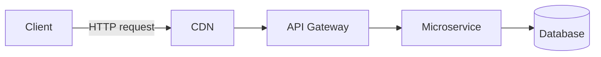

**Interviewer follow-up:** *"Is a truly stateless API always desirable?"* Not always — it forces every request to re-authenticate (e.g., re-validate a JWT each call, or requiring the client to resend context), which trades server simplicity for a bit of client/network overhead. Statelessness is about the *protocol*, not about forbidding all persisted state (a database is stateful; the *API interaction* is not).

### Web API vs WCF vs MVC vs gRPC vs GraphQL

| Feature | Web API (ASP.NET Core) | WCF | MVC | gRPC | GraphQL |
|---|---|---|---|---|---|
| Protocol | HTTP only | HTTP, TCP, MSMQ, Named Pipes | HTTP | HTTP/2 | HTTP |
| Payload | JSON/XML | SOAP/XML (configurable) | HTML/JSON (Views + JSON) | Protobuf (binary) | JSON (flexible shape) |
| Lightweight | Yes | No (heavier config/runtime) | Yes | Yes (binary, multiplexed) | Depends on resolver complexity |
| Hosting | Self-host / IIS / containers | IIS / Windows Service | Self-host / IIS | Self-host / containers | Self-host / IIS |
| Best for | Public/internal REST APIs | Legacy enterprise SOAP integration | Server-rendered web apps | Internal low-latency microservice-to-microservice calls | Client-driven flexible queries, BFF layers |

**Note:** WCF is legacy; there's no first-class WCF in modern .NET (only [CoreWCF](https://github.com/CoreWCF/CoreWCF) as a community-maintained port for migration scenarios). Rarely comes up except in "why are we migrating off WCF" discussions.

### SOAP vs REST

| Feature | SOAP | REST |
|---|---|---|
| Messaging | XML-based, strict envelope/contract (WSDL) | JSON/XML, flexible |
| Performance | Slower (verbose XML, strict parsing) | Faster, lightweight |
| Security | Built-in WS-Security | Relies on OAuth2/JWT + HTTPS |
| Complexity | High — requires formal contracts | Simple, convention-driven |
| Statefulness | Can support stateful operations (WS-*) | Stateless by design |

### HTTP Methods, Status Codes, and Idempotency

| Method | Usage | Idempotent | Safe |
|---|---|---|---|
| GET | Retrieve | Yes | Yes |
| POST | Create | No (by default — see idempotency keys below) | No |
| PUT | Replace whole resource | Yes | No |
| PATCH | Partial update | No (technically not guaranteed idempotent unless designed to be) | No |
| DELETE | Remove | Yes (deleting twice = same end state) | No |

Common status codes an interviewer expects fluently:

| Code | Meaning |
|---|---|
| 200 OK | Success |
| 201 Created | Resource created (include `Location` header) |
| 202 Accepted | Request accepted, processing async (see long-running ops) |
| 204 No Content | Success, no body (typical for DELETE/PUT) |
| 400 Bad Request | Malformed/invalid request |
| 401 Unauthorized | Not authenticated |
| 403 Forbidden | Authenticated but not authorized |
| 404 Not Found | Resource doesn't exist |
| 409 Conflict | State conflict (e.g., concurrency, duplicate) |
| 422 Unprocessable Entity | Semantically invalid (validation failure), distinct from 400 |
| 429 Too Many Requests | Rate limit exceeded |
| 500 Internal Server Error | Unhandled server fault |
| 503 Service Unavailable | Downstream dependency down / overloaded |

**Gotcha interviewers probe:** PUT is defined as idempotent by the HTTP spec — calling it N times must produce the same server state as calling it once. PATCH is *not guaranteed* idempotent (e.g., a PATCH that says "increment counter by 1" is not idempotent even though PATCH-with-full-replacement-semantics could be). Don't conflate "idempotent" with "safe" — GET is both; PUT/DELETE are idempotent but not safe (they mutate state).

### Controllers, IActionResult, ActionResult\<T\>

```csharp
[ApiController]
[Route("api/products")]
public class ProductsController : ControllerBase
{
    [HttpGet]
    public IEnumerable<string> Get() => new[] { "Laptop", "Mobile" };

    [HttpGet("{id}")]
    public IActionResult GetProduct(int id)
    {
        if (id <= 0) return BadRequest("Invalid ID");
        return Ok(new { id, name = "Laptop" });
    }
}
```

`[ApiController]` gives you: automatic 400 on invalid `ModelState`, `[FromBody]` inference for complex types, problem-details-shaped error responses, and attribute-routing requirement.

| Feature | `IActionResult` | `ActionResult<T>` |
|---|---|---|
| Return type | Any HTTP response shape | Strongly typed + still allows `Ok()`/`NotFound()` |
| Swagger/OpenAPI inference | Poor — needs `[ProducesResponseType]` | Better — compiler knows `T`, tooling infers schema |
| Recommended for | Mixed-result actions | Most modern controller actions |

**Follow-up:** Prefer `ActionResult<T>` in new code — it gives OpenAPI generators (Swashbuckle/NSwag) a concrete return type to document without extra attributes, while still letting you `return NotFound()` or `return BadRequest()`.

**Legacy note — `IHttpActionResult` vs `IActionResult`:** these are often conflated but belong to different frameworks entirely.

| | `IHttpActionResult` | `IActionResult` |
|---|---|---|
| Framework | ASP.NET Web API 2 (`System.Web.Http`, pre-Core, classic `System.Web`/IIS pipeline) | ASP.NET Core (`Microsoft.AspNetCore.Mvc`) |
| Namespace | `System.Web.Http` | `Microsoft.AspNetCore.Mvc` |
| Execution model | `ExecuteAsync()` returns an `HttpResponseMessage` | Framework calls `ExecuteResultAsync()` against `ActionContext`, writing directly into the Core response pipeline |
| Status today | Legacy — tied to classic .NET Framework Web API, not usable in ASP.NET Core | Current — the standard return-type family for Core controllers |

```csharp
// Legacy ASP.NET Web API 2 (System.Web.Http) — IHttpActionResult
public IHttpActionResult GetProduct(int id)
{
    if (id <= 0) return BadRequest("Invalid ID");
    return Ok(new { Id = id, Name = "Laptop" });
}
```

**Why this still comes up in interviews:** it's a quick litmus test for whether a candidate has touched (or migrated off) a legacy .NET Framework Web API 2 codebase — a very common "modernize this" engagement for a 10-year dev. The two types look almost identical (same helper method names — `Ok()`, `BadRequest()`, `NotFound()`) precisely because ASP.NET Core's MVC team deliberately preserved the ergonomics while rebuilding the execution pipeline underneath; know that they are **not source-compatible** — a straight find-and-replace during migration won't compile without also changing the `using` directives and base class (`ApiController` → `ControllerBase`).

### Routing: Attribute vs Conventional

| Feature | Convention-Based Routing | Attribute Routing |
|---|---|---|
| Location | `Program.cs` / `Startup.cs` | On controller/action |
| Flexibility | Less — good for MVC views | More — required for Web APIs |
| Example | `{controller}/{action}/{id?}` | `[Route("api/products/{id}")]` |

Modern Web APIs almost exclusively use attribute routing since it colocates the route with the action and supports route constraints, versioning tokens, and explicit HTTP verb binding.

```csharp
var builder = WebApplication.CreateBuilder(args);
builder.Services.AddControllers();
var app = builder.Build();

app.UseHttpsRedirection();
app.UseRouting();
app.UseAuthentication();
app.UseAuthorization();
app.MapControllers();
app.Run();
```

### Parameter Binding: FromRoute/FromQuery/FromBody/FromHeader

| Attribute | Source | Example |
|---|---|---|
| `[FromRoute]` | URL route segment | `/api/products/1` |
| `[FromQuery]` | Query string | `/api/products?id=1` |
| `[FromBody]` | Request body (JSON) | `{ "id": 1, "name": "Laptop" }` |
| `[FromHeader]` | HTTP header | `Authorization: Bearer <token>` |
| `[FromForm]` | Form/multipart body | File uploads, form posts |

**Gotcha:** Only **one** `[FromBody]` parameter is allowed per action — the body stream can only be read once. If you need multiple pieces of complex data, wrap them in a single DTO.

### File Upload & Download (IFormFile)

Referenced only as a `[FromForm]` binding source above — worth a full example since "handle a file upload" is a near-guaranteed practical coding question.

```csharp
[HttpPost("upload")]
public async Task<IActionResult> Upload(IFormFile file)
{
    if (file is null || file.Length == 0) return BadRequest("No file uploaded.");

    var filePath = Path.Combine("uploads", file.FileName);
    using var stream = new FileStream(filePath, FileMode.Create);
    await file.CopyToAsync(stream);

    return Ok(new { file.FileName, file.Length });
}

[HttpGet("download/{fileName}")]
public IActionResult Download(string fileName)
{
    var filePath = Path.Combine("uploads", fileName);
    if (!System.IO.File.Exists(filePath)) return NotFound();

    var fileBytes = System.IO.File.ReadAllBytes(filePath);
    return File(fileBytes, "application/octet-stream", fileName);
}
```

**Senior-level details worth adding unprompted:**
- `IFormFile` buffers to memory/temp disk by default — for large files, stream directly (`Request.Form.Files` with a streaming `MultipartReader`, or `file.OpenReadStream()`) instead of loading the full byte array into memory, and enforce a request body size limit (`[RequestSizeLimit]` / `Kestrel.Limits.MaxRequestBodySize`) to avoid a trivial DoS via huge uploads.
- Never trust `file.FileName` as a filesystem path as-is — it comes from the client and can contain path-traversal sequences (`../../etc/passwd`); always sanitize/regenerate the filename (e.g., a GUID) server-side before writing to disk.
- Validate content type/extension **and** inspect the actual file bytes (magic-number/signature check) for anything security-sensitive — a client can freely lie about `Content-Type`.
- For genuinely large files or high-throughput scenarios, prefer streaming straight to blob storage (Azure Blob/S3) over the app server's local disk — keeps the API stateless and avoids disk-space/instance-affinity problems in a horizontally scaled deployment.
- `File(bytes, contentType, fileName)` is fine for small files; for larger downloads return a stream-backed `FileStreamResult` (`File(stream, ...)` or `PhysicalFile(...)`) so the framework streams the response instead of buffering the whole file into memory first.

### Content Negotiation

Content negotiation lets the same endpoint return different representations based on the `Accept` header.

```csharp
builder.Services.AddControllers().AddXmlSerializerFormatters();
```

```http
GET /api/products
Accept: application/xml
```

- `Accept` — what the *client* wants back.
- `Content-Type` — what format the *current request/response body* actually is.
- If no formatter matches the `Accept` header and no default is configured, ASP.NET Core returns `406 Not Acceptable` (worth knowing — many candidates assume it silently falls back to JSON always; by default it *does* fall back unless you set `ReturnHttpNotAcceptable = true`).

---

## Intermediate

### Dependency Injection & Service Lifetimes

```csharp
public interface IProductService { List<string> GetProducts(); }
public class ProductService : IProductService
{
    public List<string> GetProducts() => new() { "Laptop", "Mobile" };
}

builder.Services.AddScoped<IProductService, ProductService>();
```

| Lifetime | Created | Typical use | Risk |
|---|---|---|---|
| Singleton | Once per app | Logging, config, caches | Must be thread-safe; cannot safely hold scoped deps |
| Scoped | Once per request | `DbContext`, unit-of-work, per-request state | Captive dependency if injected into a singleton |
| Transient | Every resolution | Lightweight, stateless services | Can be wasteful if expensive to construct |

`TryAddSingleton<T>` registers only if nothing is already registered for that service type — useful in library/extension-method code so you don't clobber a consumer's existing registration; `AddSingleton<T>` always adds a new registration (can result in multiple registrations resolved via `IEnumerable<T>`).

**"Very common interview question" flagged in the source notes, answered in full:**

> Why can't a Singleton depend on a Scoped service (e.g., `DbContext`)?

`DbContext` is Scoped by design — it represents a single unit of work tied to one request and is **not thread-safe**. A Singleton lives for the entire application lifetime and is shared across all concurrent requests. If you inject a Scoped service directly into a Singleton's constructor, the DI container throws `InvalidOperationException: Cannot consume scoped service from singleton` (when validation is enabled) — and even if it didn't throw, you'd get race conditions and stale/shared state across unrelated requests.

**Correct fix — `IServiceScopeFactory`:**

```csharp
public class MyLoggerService
{
    private readonly IServiceScopeFactory _scopeFactory;
    public MyLoggerService(IServiceScopeFactory scopeFactory) => _scopeFactory = scopeFactory;

    public void LogToDatabase(string message)
    {
        using var scope = _scopeFactory.CreateScope();
        var dbContext = scope.ServiceProvider.GetRequiredService<MyDbContext>();
        dbContext.Logs.Add(new Log { Message = message });
        dbContext.SaveChanges();
    }
}
```

This manually creates a new scope inside the singleton, so the resolved `DbContext` lives only for the duration of that unit of work — safe and correctly isolated. Best practice for loggers specifically: keep them Singleton, stateless, thread-safe, and prefer the built-in `ILogger<T>` abstraction over hand-rolled logger services when possible.

### SOLID Principles

SOLID is the baseline vocabulary interviewers expect fluently by year 10 — less "define the acronym" and more "show me where you've applied it in an ASP.NET Core app you already know cold" (hint: Dependency Injection itself, covered above, *is* an application of Dependency Inversion).

| Principle | Definition | ASP.NET Core Example |
|---|---|---|
| **S** — Single Responsibility | A class should have one reason to change | Separate `ProductsController` (HTTP concerns) from `ProductService` (business logic) from `ProductRepository` (persistence) |
| **O** — Open/Closed | Open for extension, closed for modification | Add a new `IDiscountStrategy` implementation instead of editing an `if/else` chain inside a `PricingService` |
| **L** — Liskov Substitution | A subtype must be usable anywhere its base type is expected, without surprising behavior | Any `IPaymentGateway` implementation (Stripe, PayPal) must honor the same contract/exceptions as another — swapping one in shouldn't break callers |
| **I** — Interface Segregation | Prefer several small, client-specific interfaces over one large general-purpose one | Split a bloated `IRepository` with 20 methods into `IReadRepository<T>` / `IWriteRepository<T>` so read-only consumers don't depend on write methods they never call |
| **D** — Dependency Inversion | High-level modules should depend on abstractions, not concrete low-level implementations | Constructor-inject `ILogger`/`IProductService` interfaces, never `new` up a concrete dependency inside a class |

**Dependency Inversion, concretely:**

```csharp
public interface ILogger { void Log(string message); }

public class ConsoleLogger : ILogger
{
    public void Log(string message) => Console.WriteLine(message);
}

public class UserService
{
    private readonly ILogger _logger;
    public UserService(ILogger logger) => _logger = logger; // depends on the abstraction, not ConsoleLogger
}
```

`UserService` never references `ConsoleLogger` directly — swap in a `SerilogLogger` or a test `FakeLogger` with zero changes to `UserService`. This is exactly what ASP.NET Core's built-in DI container operationalizes at scale: the entire [Dependency Injection & Service Lifetimes](#dependency-injection--service-lifetimes) section above is DIP in practice, not a separate concept.

**Senior framing an interviewer wants to hear:** SOLID isn't a checklist to recite — the pointed test is whether you can name a real violation you refactored (e.g., a repository interface you split because half its consumers only ever read, or a controller you slimmed down because it had grown three unrelated reasons to change) and explain the trade-off (more interfaces/indirection vs. easier testing and isolated change). Reciting the acronym with no story attached reads as junior.

### Middleware Pipeline

Middleware are pipeline components that inspect/modify the request, optionally short-circuit, call `next()`, then can modify the response on the way back out.

```csharp
public class CustomMiddleware
{
    private readonly RequestDelegate _next;
    public CustomMiddleware(RequestDelegate next) => _next = next;

    public async Task Invoke(HttpContext context)
    {
        Console.WriteLine("Request: " + context.Request.Path);
        await _next(context);
    }
}

app.UseMiddleware<CustomMiddleware>();
```

**Key rule:** order matters — middleware executes top-down on the way in, bottom-up on the way out.

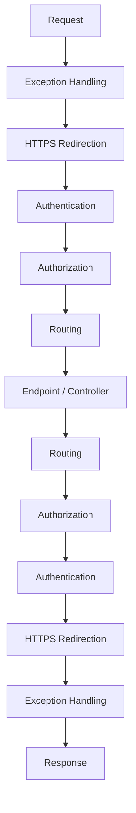

**Middleware vs Filters — a very common trap:** Middleware is global to the HTTP pipeline and framework-agnostic; filters are MVC/API-specific and run *inside* the MVC action invocation pipeline (after routing has selected a controller/action), giving them access to `ActionExecutingContext`/model-bound arguments that raw middleware doesn't have.

### Request Lifecycle End-to-End

The full journey of a request, useful as a whiteboard answer:

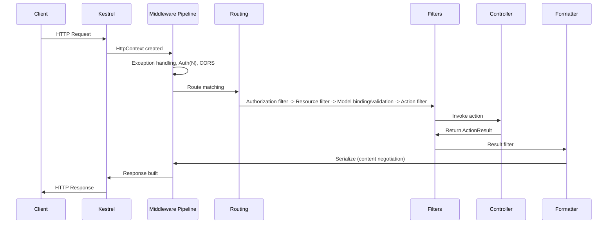

1. **HTTP Client** sends URL, method, headers, optional body.
2. **Kestrel** — cross-platform server built into ASP.NET Core; parses raw HTTP, builds `HttpContext`, has **no business logic**. In production it typically sits behind IIS/Nginx/a cloud load balancer acting as a reverse proxy for TLS termination, process management, and protecting Kestrel from direct exposure.
3. **Middleware pipeline** — exception handling, logging, authentication, authorization, CORS, routing (order matters, executes top-down/bottom-up).
4. **Authentication middleware** — identifies *who* the user is (populates `HttpContext.User`); does not check permissions. Failure doesn't necessarily stop the pipeline — the user is just treated as anonymous unless a later step requires auth.
5. **Authorization middleware** — checks *what* the user can do; enforces `[Authorize]`, roles, policies, claims. Failure returns 401/403 and the controller never executes.
6. **Routing** — matches URL + verb + route template to a specific controller/action (or minimal API endpoint) and determines parameter binding sources.
7. **Filters** — Authorization Filters → Resource Filters → Model Binding/Validation → Action Filters (before/after action) → Exception Filters (catch controller-level exceptions) → Result Filters (before/after response formatting).
8. **Model binding & validation** — binds request data to action parameters; if invalid and the controller has `[ApiController]`, a `400 Bad Request` is auto-returned before your action code even runs.
9. **Controller** — receives validated input, orchestrates services/domain logic, returns an `ActionResult` (not a raw HTTP response).
10. **Action result execution** — the framework converts `Ok()`/`NotFound()`/etc. into an actual status code + selects a formatter.
11. **Response formatting / content negotiation** — chooses JSON (default) or XML (if enabled) based on `Accept`.
12. **HTTP response** — travels back out through the middleware pipeline in reverse order, then Kestrel sends it to the client.

**One-line interview-gold summary:** *ASP.NET Core processes requests through Kestrel → Middleware → Routing → Filters → Controller → Formatters → Middleware → Client.*

### Model Validation

```csharp
public class Product
{
    [Required] public string Name { get; set; }
    [Range(1, 10000)] public decimal Price { get; set; }
}

[HttpPost]
public IActionResult AddProduct([FromBody] Product product)
{
    if (!ModelState.IsValid) return BadRequest(ModelState);
    return Ok("Product Added");
}
```

With `[ApiController]`, the explicit `ModelState.IsValid` check above is actually **redundant** — the framework auto-returns `400` with a `ValidationProblemDetails` body before the action runs. Interviewers sometimes probe whether you know this (many devs write dead code checking `ModelState.IsValid` inside `[ApiController]`-decorated controllers). It's still useful to know when you *opt out* via `[ApiController(SuppressModelStateInvalidFilter = true)]` for custom validation-response shaping.

FluentValidation is the common senior-level upgrade over Data Annotations for complex/conditional rules, better testability, and separation from the model itself.

### Action Filters & Filter Pipeline

```csharp
public class LogActionFilter : ActionFilterAttribute
{
    public override void OnActionExecuting(ActionExecutingContext context)
    {
        Console.WriteLine($"Action {context.ActionDescriptor.DisplayName} is executing");
    }
}

[LogActionFilter]
public class ProductsController : ControllerBase
{
    [HttpGet] public IActionResult Get() => Ok("Product List");
}
```

Filter types and their scope, in execution order:

| Filter Type | Runs | Typical Use |
|---|---|---|
| Authorization Filters | First, before anything else | `[Authorize]` enforcement |
| Resource Filters | Before/after model binding | Short-circuit caching, expensive pre-checks |
| Action Filters | Before/after action execution | Logging, timing, mutation of arguments/results |
| Exception Filters | On unhandled exception from action | Centralized error shaping (controller-scoped) |
| Result Filters | Before/after result execution (formatting) | Response header injection, wrapping |

### PUT vs PATCH (JSON Patch)

| Feature | PUT | PATCH |
|---|---|---|
| Purpose | Replace entire resource | Partial update |
| Idempotent | Yes | Not guaranteed (depends on operation semantics) |
| Body | Full resource representation | Only changed fields (or JSON Patch document) |

```csharp
[HttpPatch("{id}")]
public async Task<IActionResult> UpdateProduct(int id, [FromBody] JsonPatchDocument<Product> patchDoc)
{
    var product = await _context.Products.FindAsync(id);
    if (product == null) return NotFound();

    patchDoc.ApplyTo(product, ModelState);
    if (!ModelState.IsValid) return BadRequest(ModelState);

    await _context.SaveChangesAsync();
    return Ok(product);
}
```

**Gotcha:** `JsonPatchDocument<T>` (RFC 6902) requires `Content-Type: application/json-patch+json` and a body like `[{ "op": "replace", "path": "/price", "value": 1500 }]` — many teams instead accept a plain partial DTO (merge-patch style, RFC 7396) for simplicity, trading strict patch semantics for developer ergonomics. Know both exist and be ready to justify your choice.

### Exception Handling

```csharp
public class ExceptionMiddleware
{
    private readonly RequestDelegate _next;
    public ExceptionMiddleware(RequestDelegate next) => _next = next;

    public async Task Invoke(HttpContext context)
    {
        try { await _next(context); }
        catch (Exception ex)
        {
            context.Response.StatusCode = 500;
            await context.Response.WriteAsync($"Error: {ex.Message}");
        }
    }
}
app.UseMiddleware<ExceptionMiddleware>();
```

This pattern from the raw notes is functional but **not senior-grade** — it leaks exception messages to clients (information disclosure) and returns plain text instead of a structured, machine-readable error body. See [\[new content\] Problem Details](#new-content-problem-details-rfc-79079457-for-error-responses) below for the production-grade replacement using `IExceptionHandler` (.NET 8+) and RFC 7807/9457.

### CORS

```csharp
builder.Services.AddCors(options =>
{
    options.AddPolicy("AllowSpecificOrigin", policy =>
        policy.WithOrigins("https://frontend.com")
              .AllowAnyMethod()
              .AllowAnyHeader());
});
app.UseCors("AllowSpecificOrigin");
```

CORS is a **browser-enforced** same-origin policy relaxation — it does nothing to protect server-to-server calls (curl, Postman, another backend ignore CORS entirely). Setting `Access-Control-Allow-Origin: *` combined with `AllowCredentials()` is invalid by spec and a common misconfiguration flagged in security reviews — never combine wildcard origin with credentialed requests.

### Repository Pattern & DTOs

```csharp
public interface IProductRepository { List<Product> GetAll(); }
public class ProductRepository : IProductRepository
{
    private readonly AppDbContext _context;
    public ProductRepository(AppDbContext context) => _context = context;
    public List<Product> GetAll() => _context.Products.AsNoTracking().ToList();
}
```

```csharp
public class ProductDTO
{
    public string Name { get; set; }
    public decimal Price { get; set; }
}
var productDto = _mapper.Map<ProductDTO>(product);
```

**Senior-level nuance on Repository Pattern:** EF Core's `DbSet<T>` / `DbContext` **already is** a unit-of-work + repository abstraction. Wrapping it in a hand-rolled generic repository is a well-known anti-pattern debate — it often adds an indirection layer that doesn't reduce coupling (you're just hiding `IQueryable` behind another interface) and can strip away EF Core's `Include`, projection, and compiled-query capabilities unless carefully designed. Justify repository usage by a real cross-cutting need (e.g., swapping persistence technology, simplifying test doubles) rather than "best practice" cargo-culting — expect this to be probed in system design rounds.

DTOs matter for: hiding internal/DB-only fields, decoupling API contract from persistence schema (so a column rename doesn't break clients), and preventing over-posting/mass-assignment vulnerabilities (binding directly to EF entities lets a malicious client set fields like `IsAdmin` that were never intended to be client-writable).

### IHttpClientFactory & Resilient HTTP Calls

```csharp
builder.Services.AddHttpClient<IProductService, ProductService>();

public class ProductService : IProductService
{
    private readonly HttpClient _httpClient;
    public ProductService(HttpClient httpClient) => _httpClient = httpClient;
    public async Task<string> GetData() => await _httpClient.GetStringAsync("https://api.example.com/products");
}
```

Introduced in ASP.NET Core 2.1 (`Microsoft.Extensions.Http`), `IHttpClientFactory` solves the classic **socket exhaustion** problem: a naively `new HttpClient()`'d-per-request instance disposes its underlying `HttpClientHandler`/socket but the OS can leave sockets in `TIME_WAIT`, exhausting available ports under load. Conversely, a single long-lived static `HttpClient` singleton doesn't respect DNS changes (it caches the resolved connection indefinitely). `IHttpClientFactory` pools and recycles `HttpMessageHandler` instances on a rotation (default 2 minutes) — giving you connection reuse *and* DNS responsiveness. It also enables named/typed clients and integrates with Polly for retries/circuit breakers.

---

## Advanced

### API Versioning Strategies

API versioning manages breaking changes to a contract without breaking existing consumers — essential once an API has external or cross-team consumers.

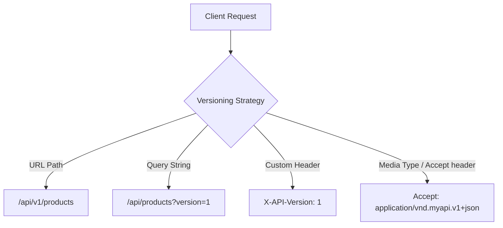

| Strategy | Example | Pros | Cons |
|---|---|---|---|
| URL Path | `GET /api/v1/products` | Explicit, cacheable, easy to test/curl, visible in logs | "Pollutes" the URL; version isn't really a resource property |
| Query String | `GET /api/products?version=1` | Simple to add | Easy to forget/omit, less RESTfully "pure," caching keys get messy |
| Header | `X-API-Version: 1` | Keeps URL clean | Invisible to casual browsing/curl without extra flags, harder to test manually |
| Media Type (Accept) | `Accept: application/vnd.myapi.v1+json` | Most "RESTfully correct" (versioning the representation, not the resource) | Most complex to implement and document; poor tooling support |

```csharp
builder.Services.AddApiVersioning(options =>
{
    options.AssumeDefaultVersionWhenUnspecified = true;
    options.DefaultApiVersion = new ApiVersion(1, 0);
    options.ReportApiVersions = true;
    options.ApiVersionReader = new UrlSegmentApiVersionReader();
});

[ApiController]
[Route("api/v{version:apiVersion}/products")]
[ApiVersion("1.0")]
public class ProductsV1Controller : ControllerBase
{
    [HttpGet] public IActionResult Get() => Ok(new { Message = "Product list from V1" });
}
```

**Practical recommendation for senior discussion:** URL path versioning wins in most real-world APIs for discoverability and cache-friendliness; header/media-type versioning is more "correct" per REST purists but rarely worth the operational complexity unless you're building a public API product with a strict deprecation SLA. Always pair versioning with **NuGet package `Asp.Versioning.Mvc`** (the modern, maintained successor to `Microsoft.AspNetCore.Mvc.Versioning`, which is deprecated) — flagging this because the source notes reference the old package name.

**Best practices:** deprecate gradually (`Sunset` header, `api-supported-versions` response header via `ReportApiVersions`), document each version in OpenAPI, avoid accumulating too many live versions, and consider an API gateway (Kong, Azure API Management, AWS API Gateway) to manage routing/deprecation centrally.

### [new content] REST Maturity Model (Richardson) & HATEOAS Trade-offs

Interviewers at senior level often ask "how RESTful is your API, really?" — this is the framework to answer with.

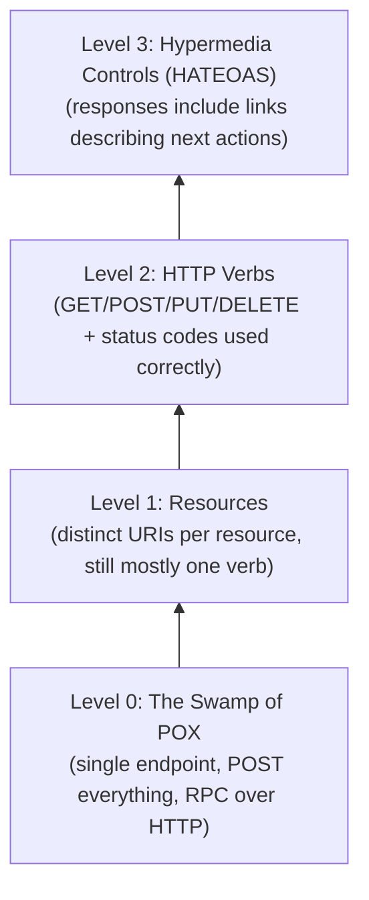

- **Level 0** — one URL, one HTTP verb (usually POST), the "envelope" carries an operation name (basically RPC/SOAP-in-disguise over HTTP).
- **Level 1** — separate URIs per resource (`/orders`, `/customers`) but still often single-verb-heavy.
- **Level 2** — proper use of HTTP verbs and status codes; **this is where the overwhelming majority of production "REST" APIs actually live**, and it's a perfectly legitimate, pragmatic target.
- **Level 3** — HATEOAS: responses embed hypermedia links telling the client what it can do next (state transitions discoverable at runtime, not hardcoded in client code).

**HATEOAS trade-off analysis (what a senior candidate should articulate, not just define):**

| Pro | Con |
|---|---|
| Decouples client from hardcoded URL construction | Significant added complexity for server and client |
| Enables server-driven workflow changes without client redeploys | Almost no client SDKs/mobile teams actually consume the links dynamically in practice |
| Self-documenting, discoverable API surface | Bigger payloads, more serialization work |
| Fits well for APIs with real state machines (order: pending → shipped → delivered, where allowed actions change) | Most CRUD APIs don't have enough state-dependent behavior to justify it |

**Honest senior take:** HATEOAS is intellectually elegant and heavily tested in interviews, but rarely fully implemented in industry — most teams stop at Level 2 and version explicitly instead of relying on hypermedia-driven discovery. Where it *does* pay off: complex order/workflow APIs where "what can I do next" genuinely varies by resource state, and you want to avoid client-side business logic determining valid transitions.

### [new content] Problem Details (RFC 7807/9457) for Error Responses

The source notes' exception-handling middleware returns raw exception messages as plain text — a real anti-pattern in production (information disclosure, and inconsistent shape between error types). The modern, standardized answer is **RFC 7807 Problem Details for HTTP APIs** (obsoleted/updated by RFC 9457, functionally the same shape).

```json
{
  "type": "https://example.com/probs/insufficient-funds",
  "title": "Insufficient funds",
  "status": 400,
  "detail": "Your balance is 30, but the transfer requires 50.",
  "instance": "/transfers/abc-123",
  "traceId": "00-4bf9...-01"
}
```

ASP.NET Core 8+ has **built-in support** via `AddProblemDetails()` and `IExceptionHandler`:

```csharp
builder.Services.AddProblemDetails(options =>
{
    options.CustomizeProblemDetails = ctx =>
    {
        ctx.ProblemDetails.Extensions["traceId"] = ctx.HttpContext.TraceIdentifier;
    };
});

builder.Services.AddExceptionHandler<GlobalExceptionHandler>();

// GlobalExceptionHandler.cs
public class GlobalExceptionHandler : IExceptionHandler
{
    private readonly ILogger<GlobalExceptionHandler> _logger;
    public GlobalExceptionHandler(ILogger<GlobalExceptionHandler> logger) => _logger = logger;

    public async ValueTask<bool> TryHandleAsync(HttpContext httpContext, Exception exception, CancellationToken ct)
    {
        _logger.LogError(exception, "Unhandled exception");

        httpContext.Response.StatusCode = StatusCodes.Status500InternalServerError;
        await httpContext.Response.WriteAsJsonAsync(new ProblemDetails
        {
            Status = StatusCodes.Status500InternalServerError,
            Title = "An unexpected error occurred",
            Type = "https://httpstatuses.io/500"
        }, cancellationToken: ct);

        return true; // exception handled — don't rethrow
    }
}

// Program.cs
app.UseExceptionHandler();
```

**Why this matters at senior level:** consistent, structured, machine-parseable errors are what let API consumers write generic error-handling code instead of string-matching messages; `[ApiController]`'s automatic `400`s already return `ValidationProblemDetails` (a Problem Details subtype) — using the same shape for *all* errors (validation, business rule violations, unhandled exceptions) gives a uniform contract across the whole API surface, which is exactly what interviewers are checking for when they ask "how do you handle errors consistently across dozens of endpoints."

### [new content] Idempotency Keys for POST/PUT

POST is not idempotent by HTTP spec — calling `POST /orders` twice due to a client retry (timeout, network blip) can create two orders. This is a classic "how do you avoid duplicate side effects on retry" senior interview question (explicitly flagged as a sample question in the source notes but never answered there).

**Pattern: client-supplied idempotency key**

```http
POST /payments
Idempotency-Key: 7b6a5e2e-3f1a-4b8e-9c2d-5a6f7e8d9c0b
Content-Type: application/json

{ "amount": 100, "currency": "USD" }
```

```csharp
[HttpPost]
public async Task<IActionResult> CreatePayment(
    [FromHeader(Name = "Idempotency-Key")] string idempotencyKey,
    [FromBody] PaymentRequest request)
{
    if (string.IsNullOrEmpty(idempotencyKey))
        return BadRequest("Idempotency-Key header is required.");

    var existing = await _cache.GetAsync<PaymentResult>(idempotencyKey);
    if (existing != null)
        return Ok(existing); // return the original result, don't reprocess

    var result = await _paymentService.ProcessAsync(request);

    // Store result keyed by idempotency key with a TTL (e.g., 24h)
    await _cache.SetAsync(idempotencyKey, result, TimeSpan.FromHours(24));

    return Ok(result);
}
```

**Implementation nuances that separate senior answers from junior ones:**
- The idempotency key must be stored **atomically with the operation's side effect** (ideally in the same DB transaction, or via a dedicated idempotency-keys table with a unique constraint) — a Redis cache-only approach has a race window between "check" and "process + store."
- Key scope should include enough context to avoid collisions across unrelated resources/users (e.g., hash of `userId + key`).
- Decide behavior on **concurrent** requests with the same key still in flight — typically return `409 Conflict` or `425 Too Early` rather than double-processing.
- This is the same core idea as the **outbox pattern** for event-driven consistency and ties into "exactly-once vs at-least-once" delivery semantics mentioned later in these notes — idempotency is what makes at-least-once delivery *behave like* exactly-once from the caller's perspective.

### [new content] Pagination Strategies: Offset vs Cursor

Thin/missing in the original notes — pagination design is a near-guaranteed senior API-design question.

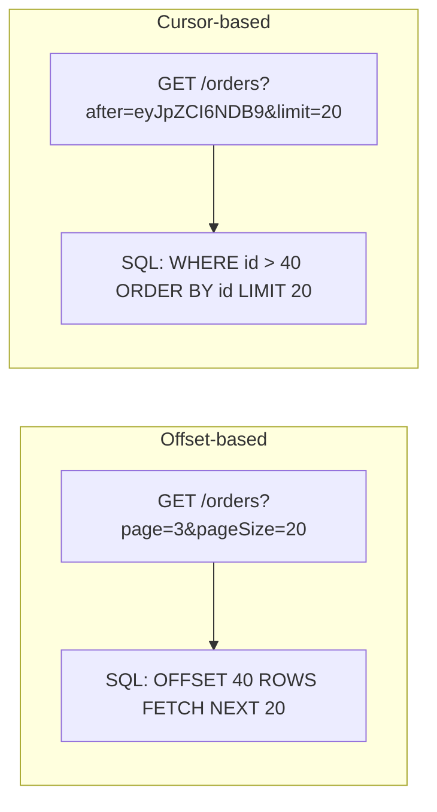

| Aspect | Offset-based (`page`/`pageSize` or `skip`/`take`) | Cursor-based (`after`/`before` opaque token) |
|---|---|---|
| Implementation | Trivial — `Skip(n).Take(m)` | Slightly more work — encode last-seen sort key |
| Performance at scale | Degrades — `OFFSET 100000` still scans/discards prior rows | Consistently fast — indexed `WHERE id > X` seek |
| Consistency under concurrent writes | **Unstable** — inserts/deletes shift subsequent pages (duplicate or skipped rows) | Stable — cursor is relative to a specific row, immune to shifts before it |
| Random page access ("jump to page 5") | Supported | Not naturally supported (sequential only) |
| Typical use | Admin UIs, small-to-medium datasets, "total pages" display needed | Infinite scroll, feeds, large/high-write datasets, public APIs (GitHub, Stripe, Slack all use cursor pagination) |

```csharp
// Cursor-based pagination example
[HttpGet]
public async Task<IActionResult> GetOrders([FromQuery] string? after, [FromQuery] int limit = 20)
{
    var query = _context.Orders.OrderBy(o => o.Id).AsQueryable();

    if (!string.IsNullOrEmpty(after))
    {
        var cursorId = DecodeCursor(after); // base64-decode opaque token
        query = query.Where(o => o.Id > cursorId);
    }

    var items = await query.Take(limit + 1).ToListAsync();
    var hasMore = items.Count > limit;
    items = items.Take(limit).ToList();

    return Ok(new
    {
        data = items,
        nextCursor = hasMore ? EncodeCursor(items.Last().Id) : null
    });
}
```

**Follow-up interviewers ask:** "Why not just use `page` numbers for a public API?" — because concurrent inserts/deletes make offset pagination *silently* return duplicate or missing rows to the client mid-scroll, which is invisible until a customer complains data is "missing," and it's far cheaper on the DB (no `OFFSET` scan cost) to seek via an indexed cursor column.

### [new content] Long-Running Operations: 202 Accepted + Polling

Flagged as sample interview Q10 in the source ("How to handle long-running work triggered by API?") with only a one-line pointer ("background queue, durable functions, polling or webhooks") — expanding to a full answer.

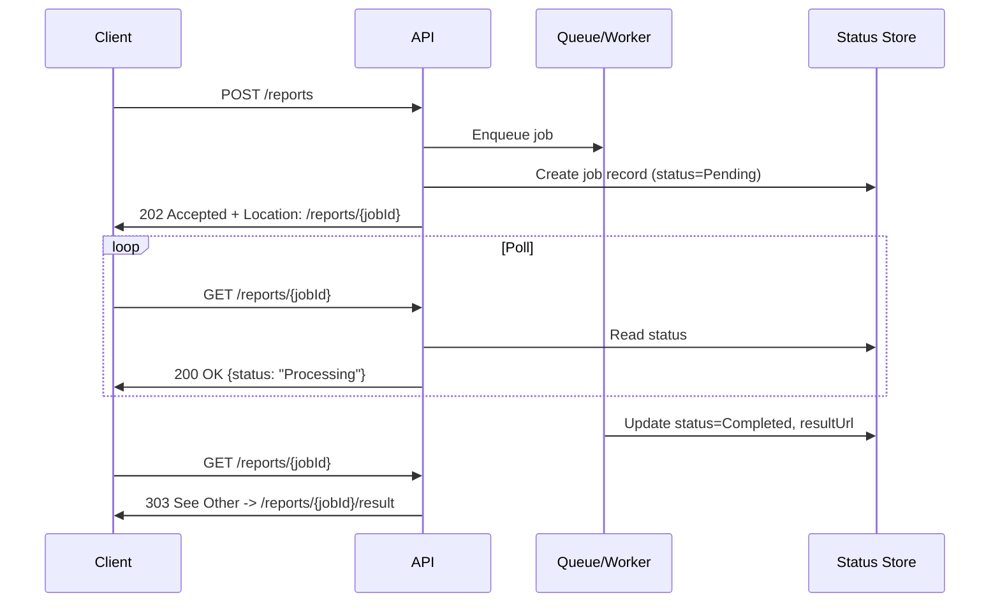

```csharp
[HttpPost("reports")]
public async Task<IActionResult> GenerateReport([FromBody] ReportRequest request)
{
    var jobId = Guid.NewGuid();
    await _jobStore.CreateAsync(jobId, JobStatus.Pending);
    await _queue.EnqueueAsync(new GenerateReportJob(jobId, request));

    return Accepted(new Uri($"/reports/{jobId}", UriKind.Relative), new { jobId, status = "Pending" });
}

[HttpGet("reports/{jobId}")]
public async Task<IActionResult> GetReportStatus(Guid jobId)
{
    var job = await _jobStore.GetAsync(jobId);
    if (job is null) return NotFound();

    if (job.Status == JobStatus.Completed)
        return Ok(new { status = "Completed", resultUrl = $"/reports/{jobId}/result" });

    return Ok(new { status = job.Status.ToString() });
}
```

**Key design points a senior candidate should raise unprompted:**
- `202 Accepted` response includes a `Location` header pointing to a status resource — this is the HTTP-idiomatic way to represent "accepted, not yet done."
- Alternative to client polling: **webhooks** (server calls back a client-registered URL on completion) — better for infrequent, high-latency jobs; avoids polling load, but requires the client to expose a public endpoint and you to handle retries/signature verification on the callback.
- For internal system design discussions, mention this is functionally the same shape as **Azure Durable Functions' async HTTP APIs pattern** or AWS Step Functions with a status-check endpoint.
- Idempotency matters here too — if `POST /reports` is retried, you don't want to enqueue duplicate jobs; combine with the idempotency-key pattern above.

### [new content] OpenAPI/Swagger: Contract-First vs Code-First

The source notes only cover *enabling* Swashbuckle — missing the senior-level design decision entirely.

```csharp
builder.Services.AddSwaggerGen();
app.UseSwagger();
app.UseSwaggerUI(c => c.SwaggerEndpoint("/swagger/v1/swagger.json", "My API v1"));
```

| Approach | How it works | Pros | Cons |
|---|---|---|---|
| **Code-first** (Swashbuckle/NSwag generate spec from C# attributes/XML docs) | Write controllers → reflection generates `swagger.json` | Fast to start, spec always matches implementation | Spec is a byproduct, not a design artifact; easy to accidentally break consumers since nothing forces you to think about the contract before coding |
| **Contract-first** (author `.yaml`/`.json` OpenAPI spec first, generate server stubs/client SDKs from it) | Design the contract → use tools (`NSwag`, `OpenAPI Generator`, `Kiota`) to scaffold code | Forces API design review before implementation; enables parallel frontend/backend work off a shared contract; better for public APIs with SLAs | Slower initial setup; risk of spec/implementation drift if not enforced in CI |

**Senior-level nuance:** for internal microservices moving fast, code-first is usually pragmatic. For public APIs, APIs with external partners, or APIs where breaking changes have real business cost, contract-first (with contract tests / Pact-style consumer-driven contract testing, and CI checks that the generated spec matches the committed contract) is the more defensible choice — this is exactly the kind of trade-off senior interviewers want you to articulate rather than just naming both terms.

**.NET 9 update worth knowing:** Microsoft has deprecated/removed the built-in `Microsoft.AspNetCore.OpenApi`-adjacent Swashbuckle bundling from some new project templates in favor of the `Microsoft.AspNetCore.OpenApi` package for spec generation, pairing it with Scalar or Swagger UI separately for the interactive doc viewer — worth a quick "current tooling" check before an interview since this space moves fast (verify against the exact .NET version in the job's stack).

### [new content] Minimal APIs vs Controllers

Minimal APIs (introduced .NET 6, matured through .NET 8/9) are referenced once in passing in the source notes ("Minimal APIs vs Controllers when relevant") without any comparison — a genuine gap given how often this comes up now.

```csharp
// Minimal API
var app = WebApplication.Create(args);

app.MapGet("/api/products/{id}", async (int id, IProductService service) =>
{
    var product = await service.GetByIdAsync(id);
    return product is not null ? Results.Ok(product) : Results.NotFound();
})
.WithName("GetProduct")
.WithOpenApi();

app.Run();
```

| Aspect | Controllers (`ControllerBase` + `[ApiController]`) | Minimal APIs (`MapGet`/`MapPost`/route groups) |
|---|---|---|
| Ceremony | More boilerplate, class-per-resource convention | Terse, function-per-endpoint |
| Performance | Slightly higher overhead (MVC filter pipeline, model binding reflection) | Lower allocation/latency — leaner pipeline, good for high-throughput microservices |
| Filters/cross-cutting concerns | Mature filter pipeline (Action/Resource/Exception/Result filters) | Has its own filter pipeline (`IEndpointFilter`, .NET 7+) but less mature ecosystem/tooling |
| Model binding & validation | Automatic, attribute-driven, well-documented | Manual/explicit; built-in validation support arrived later and is less feature-complete than `[ApiController]`'s |
| Organization at scale | Natural via controllers/areas | Needs discipline — route groups (`MapGroup`) and extension methods to avoid a giant `Program.cs` |
| Best fit | Large teams, complex APIs, heavy use of filters/conventions, OData/versioning library maturity | Microservices, small focused APIs, latency-sensitive services, "just a few endpoints" services, serverless/functions-style workloads |

**Senior framing:** this isn't "one replaces the other" — both compile to the same underlying `Endpoint`/routing infrastructure in ASP.NET Core, so the choice is about team ergonomics and codebase scale, not capability. A common real-world pattern is Minimal APIs for small internal utility services and Controllers for the large, filter-heavy, versioned public-facing API.

### [new content] Rate Limiting with Built-in ASP.NET Core Middleware

The source notes only reference the third-party `AspNetCoreRateLimit` NuGet package. Since **.NET 7**, ASP.NET Core ships a **built-in rate limiting middleware** (`Microsoft.AspNetCore.RateLimiting`) that should be the default recommendation today — worth flagging because using a third-party package when a maintained first-party option exists is exactly the kind of "is this dev current" signal interviewers look for.

```csharp
using System.Threading.RateLimiting;

builder.Services.AddRateLimiter(options =>
{
    options.AddFixedWindowLimiter("fixed", opt =>
    {
        opt.PermitLimit = 100;
        opt.Window = TimeSpan.FromMinutes(1);
        opt.QueueLimit = 0;
        opt.QueueProcessingOrder = QueueProcessingOrder.OldestFirst;
    });

    options.AddTokenBucketLimiter("token", opt =>
    {
        opt.TokenLimit = 50;
        opt.TokensPerPeriod = 10;
        opt.ReplenishmentPeriod = TimeSpan.FromSeconds(10);
    });

    options.OnRejected = async (context, token) =>
    {
        context.HttpContext.Response.StatusCode = StatusCodes.Status429TooManyRequests;
        await context.HttpContext.Response.WriteAsync("Too many requests. Try again later.", token);
    };
});

app.UseRateLimiter();

app.MapGet("/api/products", () => Ok("data")).RequireRateLimiting("fixed");
```

| Algorithm (built-in) | Behavior |
|---|---|
| Fixed Window | N requests per fixed time window; resets sharply at window boundary (can allow bursts at boundary edges) |
| Sliding Window | Smoother than fixed window; tracks segments within the window |
| Token Bucket | Tokens refill at a steady rate; allows short bursts up to bucket capacity |
| Concurrency Limiter | Limits concurrent in-flight requests rather than a rate over time — good for protecting expensive/limited resources (e.g., a downstream DB connection pool) |

**Distributed caveat (senior-level catch):** the built-in middleware's counters are **in-memory per instance** by default — behind a load balancer with multiple pods/instances, each instance enforces its own limit, so the *effective* global limit is `perInstanceLimit × instanceCount`. For a true global limit across horizontally scaled instances, you need a distributed store (Redis-backed counters, e.g., via `RedisRateLimiting` community package, or push rate limiting to an API Gateway/Azure API Management/Kong that sits in front of all instances).

**Alternatives to (or defenses alongside) rate limiting:**

| Alternative | Description | When to reach for it |
|---|---|---|
| Queue-based throttling | Accept every request but place it on a queue and process at a controlled rate, rather than rejecting with `429` | Workloads where you'd rather delay than drop (e.g., report generation, batch processing) |
| Web Application Firewall (WAF) | Edge security layer (Azure Front Door WAF, AWS WAF, Cloudflare) that blocks malicious/bot traffic via rules before it ever reaches your app | Defense against volumetric attacks, bad bots, known attack signatures — complements, doesn't replace, app-level rate limiting |
| CAPTCHA challenges | Force a human-verification step before allowing a sensitive action (login, signup, checkout) | High-value endpoints being credential-stuffed or scraped, where blocking by rate alone produces too many false positives/negatives |
| Cloud API Gateway rate limiting (Azure APIM, AWS API Gateway, Kong) | Enforce limits centrally at the edge, across all backend instances, using the gateway's own distributed counters | Multi-instance/multi-service deployments where you want one global limit without wiring your own Redis-backed counter (ties directly into the distributed caveat above) |

**Senior framing:** these aren't mutually exclusive with `Microsoft.AspNetCore.RateLimiting` — a mature production setup layers them: WAF/CAPTCHA at the edge for abuse and bots, a cloud API gateway for centralized per-client/per-tier quotas across instances, and the in-process ASP.NET Core middleware as a last line of defense protecting an individual instance's own resources (DB connection pool, CPU) even if something upstream misbehaves or is misconfigured.

### Authentication & Authorization (JWT, OAuth2, OIDC)

**JWT (JSON Web Token)** — stateless bearer token, sent as `Authorization: Bearer <token>`.

```csharp
builder.Services.AddAuthentication(JwtBearerDefaults.AuthenticationScheme)
    .AddJwtBearer(options =>
    {
        options.TokenValidationParameters = new TokenValidationParameters
        {
            ValidateIssuer = true,
            ValidateAudience = true,
            ValidateLifetime = true,
            ValidateIssuerSigningKey = true,
            ValidIssuer = "yourdomain.com",
            ValidAudience = "yourdomain.com",
            IssuerSigningKey = new SymmetricSecurityKey(Encoding.UTF8.GetBytes(secretKey))
        };
    });
```

| | Pros | Cons |
|---|---|---|
| JWT | No server-side session storage; scales well in distributed/microservices systems | Leaked token is valid until expiry; revocation is hard by design (see below) |

**OAuth 2.0** — an *authorization* framework (not authentication by itself); grants scoped access via tokens instead of sharing credentials. Commonly paired with **OpenID Connect (OIDC)**, which layers *authentication* (identity, ID tokens) on top of OAuth2's authorization primitives. Interviewers frequently probe this distinction: **OAuth2 answers "what can this app do on my behalf," OIDC answers "who is this user."**

```csharp
builder.Services.AddAuthentication(JwtBearerDefaults.AuthenticationScheme)
    .AddJwtBearer(options =>
    {
        options.Authority = "https://your-identity-provider.com";
        options.Audience = "your-api";
    });
```

**Azure AD (Entra ID) SSO flow** (from source notes, retained and lightly condensed):

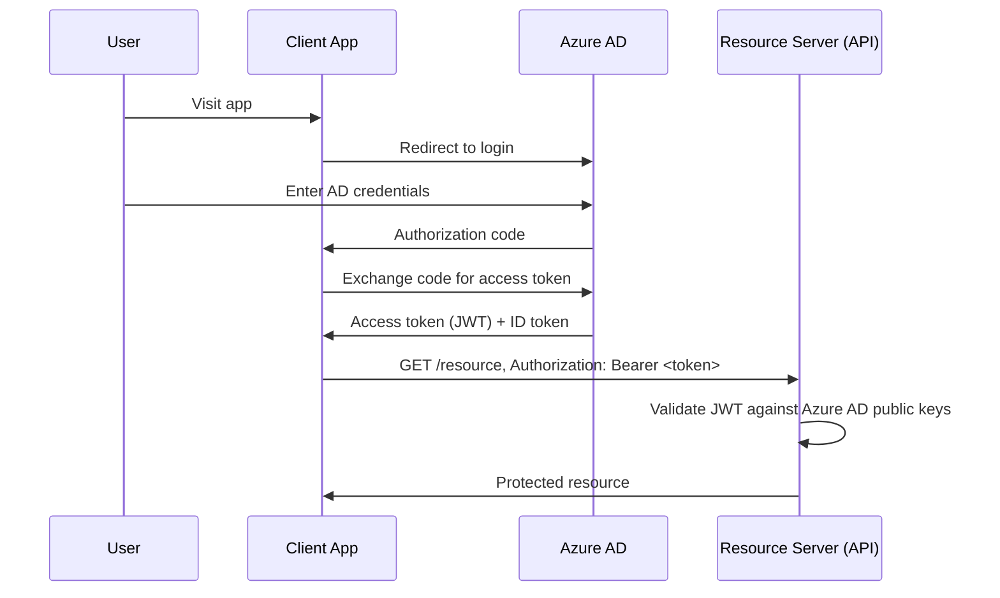

```csharp
builder.Services.AddAuthentication("Bearer")
    .AddMicrosoftIdentityWebApi(builder.Configuration.GetSection("AzureAd"));

builder.Services.AddAuthorization();
```

**Role-based vs claims-based authorization:**

```csharp
[Authorize(Roles = "Admin")]
[HttpGet("secure-data")]
public IActionResult GetSecureData() => Ok("Only Admin can access this!");
```

```csharp
[Authorize]
[HttpGet]
public IActionResult GetUserClaims()
{
    var email = User.FindFirst(ClaimTypes.Email)?.Value;
    return Ok($"User Email: {email}");
}
```

Claims-based authorization is the more general/flexible mechanism — roles are really just a special-cased claim type (`ClaimTypes.Role`). For anything beyond simple role checks, use **policy-based authorization** (`[Authorize(Policy = "MinimumAge")]` backed by an `IAuthorizationHandler`) so authorization logic isn't scattered as string role checks across controllers.

### [gaps] OAuth2 Grant Types — Which One Fits Which Client

The source notes name OAuth2/OIDC and show the authorization code flow, but "which grant type would you use for X client" is asked as a direct, standalone question far more often than a generic "explain OAuth2" — interviewers want to see you map client *type* to grant type deliberately, not just recite flow diagrams.

**The client-type-to-grant-type decision, as a senior candidate should frame it:**

| Grant Type | Client Type It Fits | Why | Key Mechanic |
|---|---|---|---|
| **Authorization Code + PKCE** | SPAs (browser-based JS apps), native/mobile apps | The client is "public" — it cannot safely hold a client secret (secret would be visible in browser JS or extractable from a mobile app binary). PKCE (Proof Key for Code Exchange) replaces the client secret with a dynamically generated code verifier/challenge pair, preventing an intercepted authorization code from being redeemed by an attacker | Browser/app redirects to the authorization server → user authenticates → auth server redirects back with a code → client exchanges code + `code_verifier` for tokens. PKCE is now recommended for **all** Authorization Code flows, even confidential clients, under OAuth 2.1 |
| **Client Credentials** | Machine-to-machine (M2M) — backend service calling another backend service, no user in the loop | There's no end user to authenticate — the *application itself* is the identity being authorized. The client is "confidential" (a backend service that can safely store a secret) | Service presents `client_id` + `client_secret` (or a signed JWT assertion) directly to the token endpoint → gets an access token scoped to that service's permissions, no redirect/browser involved at all |
| **Device Code** | Devices with limited/no input capability — smart TVs, CLI tools, IoT devices | The device can't render a browser-based login redirect or accept complex text input (e.g., a TV remote can't type a password) | Device displays a short code + a URL; user opens that URL on a *separate* device (phone/laptop) with a normal browser, enters the code, authenticates there; the original device polls the token endpoint until the user completes the flow |
| Implicit — **deprecated** | (formerly) SPAs, before PKCE was widely supported | Returned the access token directly in the URL fragment after redirect, skipping the code-exchange step | **Removed in OAuth 2.1.** Tokens in a URL fragment are exposed to browser history, referrer leaks, and any script running on the page — Authorization Code + PKCE achieves the same public-client use case far more securely and is now universally recommended instead |
| Resource Owner Password Credentials (ROPC) — **deprecated** | (formerly) first-party apps that wanted to collect username/password directly | Client collects the user's raw credentials and exchanges them directly for a token | **Removed in OAuth 2.1.** Requires the client app to handle raw passwords (defeats the purpose of delegated authorization, trains users to enter credentials into arbitrary apps, no support for MFA/social login/passkeys). Only ever justifiable as a legacy migration bridge, never for new development |

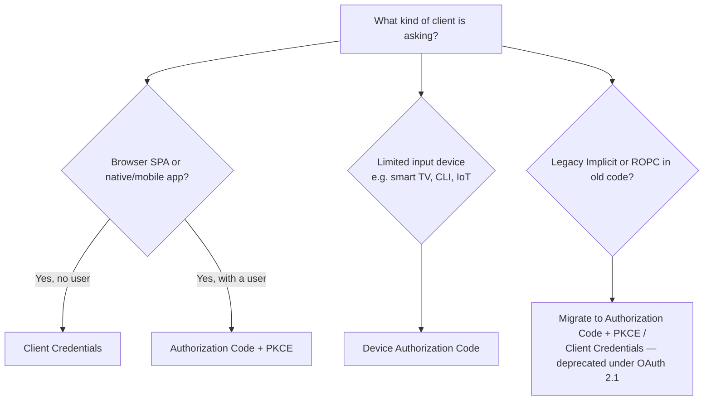

**Follow-up interviewers ask, answered directly:**
- *"Why does PKCE matter even for a confidential client, not just public ones?"* — Under OAuth 2.1 guidance, PKCE is recommended universally because it protects against authorization-code-interception attacks regardless of client type, and using one flow consistently everywhere reduces the number of distinct security mechanisms your system has to get right.
- *"Why not just use Client Credentials for a SPA calling your API?"* — Because Client Credentials requires a client secret embedded in the client, and a SPA's entire codebase is delivered to and inspectable in the browser — there is no way to keep a secret confidential there. Any "solution" that embeds a secret in frontend JS is not actually secret.
- *"What identifies the *user* vs the *application* in each flow?"* — Authorization Code (+PKCE) and Device Code both end with tokens tied to a specific authenticated end user (plus the client's own identity). Client Credentials tokens represent only the application/service itself — there is no end-user identity in the resulting token at all, which is why it's wrong to use Client Credentials for anything that needs per-user authorization or audit trails.
- **.NET implementation note:** ASP.NET Core's `AddJwtBearer`/`Microsoft.Identity.Web` validate whichever access token arrives regardless of which grant type produced it — the grant type is a concern of the *token issuance* side (the authorization server / identity provider config), not the resource server's validation code, which is a nuance worth stating precisely rather than conflating "which grant type" with "how does my API validate the token."

### [new content] API Keys vs OAuth2 Scopes — When to Use Which

The source notes cover API-key middleware and OAuth2 separately but never compare *when* to choose one over the other — a common senior API-security design question.

| | API Keys | OAuth2 (scopes) |
|---|---|---|
| Identifies | An application/client (often not a specific end-user) | A specific user or service, with delegated, granular permissions |
| Granularity | Usually all-or-nothing per key | Fine-grained via scopes (`read:orders`, `write:orders`) |
| Rotation/revocation | Manual, often requires redeploy or a key-management endpoint | Short-lived access tokens + refresh tokens; revoke by invalidating refresh token or shortening TTL |
| Typical use case | Server-to-server, internal tooling, simple third-party integrations, metering/billing identification | User-delegated access, public APIs, "login with X," anything needing per-user consent/audit |
| Security posture | Weaker — a static secret, often over-privileged if not scoped carefully | Stronger — short-lived tokens, standardized flows, consent screens, PKCE for public clients |

```csharp
public class ApiKeyMiddleware
{
    private readonly RequestDelegate _next;
    public ApiKeyMiddleware(RequestDelegate next) => _next = next;

    public async Task Invoke(HttpContext context)
    {
        if (!context.Request.Headers.TryGetValue("X-API-KEY", out var key) || key != "expected-key")
        {
            context.Response.StatusCode = StatusCodes.Status401Unauthorized;
            await context.Response.WriteAsync("Unauthorized");
            return;
        }
        await _next(context);
    }
}
```

**Senior guidance:** API keys are fine for identifying *which system* is calling (rate limiting buckets, billing/metering, simple internal service-to-service auth inside a trusted network) but are a poor substitute for OAuth2 when you need per-user permissions, consent, or auditability — many real breaches trace back to an over-scoped, long-lived API key checked into a config file. Prefer OAuth2 client-credentials grant over a bare API key even for machine-to-machine calls when the ecosystem already has an identity provider, since it gives you short-lived tokens and centralized revocation for free.

### HATEOAS

```json
{
  "id": 1,
  "name": "Laptop",
  "price": 1200,
  "links": [
    { "rel": "self", "href": "/api/products/1" },
    { "rel": "update", "href": "/api/products/1", "method": "PUT" },
    { "rel": "delete", "href": "/api/products/1", "method": "DELETE" }
  ]
}
```

```csharp
public class ProductResource
{
    public int Id { get; set; }
    public string Name { get; set; }
    public decimal Price { get; set; }
    public List<LinkResource> Links { get; set; } = new();
}
public class LinkResource
{
    public string Rel { get; set; }
    public string Href { get; set; }
    public string Method { get; set; }
}
```

See the expanded [REST Maturity Model & HATEOAS Trade-offs](#new-content-rest-maturity-model-richardson--hateoas-trade-offs) section above for the full trade-off discussion expected at senior level.

### Microservices vs Monolithic Architecture

| Aspect | Monolithic | Microservices |
|---|---|---|
| Architecture | Single deployable codebase/process | Independent services, each its own codebase/deploy unit |
| Scalability | Scale the whole app (coarse-grained) | Scale individual services independently (fine-grained) |
| Deployment | One deploy pipeline, one artifact | Independent deploys per service — faster iteration per team, but more moving parts |
| Data ownership | Usually one shared database | Each service typically owns its own data store — cross-service joins become cross-service API calls |
| Team topology | Works well for a single team/small org | Aligns with Conway's Law — separate teams own separate services |
| Operational overhead | Low — one thing to build, test, monitor, deploy | High — service discovery, distributed tracing, network reliability, versioned contracts between services |
| Transactions | Native ACID transactions across the whole app | Distributed transactions are hard — usually solved with the [Outbox Pattern](#the-outbox-pattern) / sagas / eventual consistency, not two-phase commit |
| Failure isolation | A bug can take down the whole app | A failing service can be isolated (with circuit breakers/bulkheads) without necessarily taking down the rest |

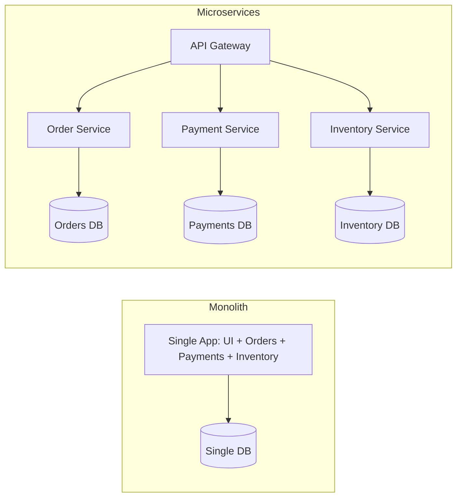

**"When would you choose a monolith over microservices?" — a direct, frequently-asked senior question, answered plainly:**
- **Small team, low complexity** — microservices' operational tax (deployment pipelines × N, distributed tracing, service mesh, network-partition handling) isn't worth paying until team size and domain complexity justify splitting ownership.
- **Early-stage product / unclear domain boundaries** — splitting into services before you understand where the real seams are tends to produce the worst outcome: a "distributed monolith" (services that are still tightly coupled but now pay network-call latency and deployment-coordination costs for every change).
- **Lower operational overhead is a genuine business win**, not just a cop-out — fewer moving parts means less to monitor, secure, and debug, which is often the *correct* engineering trade-off, not merely the lazy one.
- A pragmatic middle path many senior engineers advocate: build a **well-modularized monolith** (clean internal boundaries, e.g., separate class libraries/bounded contexts) so a future extraction into microservices — if and when scale/team growth actually demands it — is a refactor, not a rewrite. This is the same instinct behind the **strangler fig pattern** for incremental migration off a legacy monolith.

**Interviewer follow-up:** *"What's a 'distributed monolith' and how do you avoid becoming one?"* It's microservices in name only — services still share a database, deploy in lockstep, or call each other synchronously in long chains, so you inherit microservices' operational complexity without gaining independent scalability or deployability. Avoid it by enforcing per-service data ownership (no shared DB), designing for asynchronous/event-driven communication where possible, and drawing service boundaries around actual business capabilities (bounded contexts), not arbitrary technical layers.

### API Gateway Pattern

An API Gateway is a single entry point that fronts multiple backend/microservices, centralizing routing, auth, rate limiting, and observability.

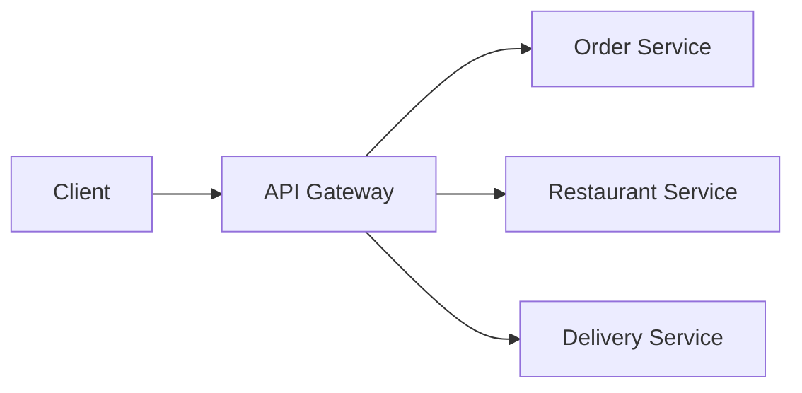

| Concern | Handled by Gateway |
|---|---|
| Centralized routing | `/api/orders` → Order Service, `/api/restaurants` → Restaurant Service |
| Security | Auth/authz, API key validation at the edge |
| Load balancing | Distributes across service instances |
| Rate limiting | Enforced once, centrally, rather than per-service |
| Monitoring/logging | Single choke point for cross-service telemetry |

Options: **Ocelot** (.NET-native, lightweight, good for smaller setups), **YARP** (Microsoft's modern reverse-proxy toolkit, more flexible/performant, increasingly the default .NET-native choice), or managed cloud options (Azure API Management, AWS API Gateway, Kong). **Backend-for-Frontend (BFF)** is a related, narrower pattern — a gateway tailored to one specific client (e.g., a mobile BFF aggregating/shaping responses differently than a web BFF) rather than a generic one-size-fits-all gateway.

### CQRS

Command Query Responsibility Segregation separates read (query) and write (command) models, often to scale/optimize them independently.

```csharp
public record CreateProductCommand(string Name, decimal Price) : IRequest<Product>;
public record GetProductQuery(int Id) : IRequest<Product>;

public class GetProductHandler : IRequestHandler<GetProductQuery, Product>
{
    private readonly DbContext _context;
    public GetProductHandler(DbContext context) => _context = context;

    public async Task<Product> Handle(GetProductQuery request, CancellationToken cancellationToken)
        => await _context.Products.FindAsync(request.Id);
}
```

```csharp
[HttpGet("{id}")]
public async Task<IActionResult> Get(int id, [FromServices] IMediator mediator)
    => Ok(await mediator.Send(new GetProductQuery(id)));
```

**Senior-level nuance:** CQRS does *not* require MediatR, event sourcing, or separate physical databases — those are optional escalations. The core idea is simply "don't force reads and writes through the same model/DTO shape when their concerns diverge" (e.g., a write model enforcing invariants vs. a read model that's a flattened, denormalized projection for a UI grid). Full CQRS + event sourcing + separate read/write stores is a heavyweight pattern justified by real scale/complexity — using it by default ("because MediatR") is a common junior/mid-level overengineering trap that senior interviewers probe for.

### Background Jobs & IHostedService/BackgroundService

`IHostedService` runs background tasks that start with the app and stop gracefully on shutdown (namespace `Microsoft.Extensions.Hosting`).

```csharp
public class MyBackgroundService : IHostedService
{
    private readonly ILogger<MyBackgroundService> _logger;
    private Timer _timer;
    public MyBackgroundService(ILogger<MyBackgroundService> logger) => _logger = logger;

    public Task StartAsync(CancellationToken cancellationToken)
    {
        _logger.LogInformation("Hosted Service Started");
        _timer = new Timer(DoWork, null, TimeSpan.Zero, TimeSpan.FromSeconds(10));
        return Task.CompletedTask;
    }

    private void DoWork(object state) => _logger.LogInformation($"Running at: {DateTime.Now}");

    public Task StopAsync(CancellationToken cancellationToken)
    {
        _timer?.Change(Timeout.Infinite, 0);
        return Task.CompletedTask;
    }
}

builder.Services.AddHostedService<MyBackgroundService>();
```

**Preferred modern approach — `BackgroundService`** (abstract base class implementing `IHostedService`, simplifies the loop):

```csharp
public class Worker : BackgroundService
{
    protected override async Task ExecuteAsync(CancellationToken stoppingToken)
    {
        while (!stoppingToken.IsCancellationRequested)
        {
            Console.WriteLine("Running background task...");
            await Task.Delay(5000, stoppingToken);
        }
    }
}
```

Use for: periodic polling/cleanup, queue consumers, cache refresh, email sending. For durable, resumable, or scheduled (cron-like) work with retry/dashboards, **Hangfire** or **Quartz.NET** are the common upgrades over hand-rolled `BackgroundService` loops:

```csharp
builder.Services.AddHangfire(config => config.UseSqlServerStorage(connectionString));
app.UseHangfireDashboard();
app.UseHangfireServer();

BackgroundJob.Enqueue(() => Console.WriteLine("Background job executed"));
RecurringJob.AddOrUpdate("daily-cleanup", () => Console.WriteLine("Recurring job executed"), Cron.Daily);
```

**Gotcha:** `IHostedService`/`BackgroundService` instances are registered as **Singleton** by the hosting infrastructure — so the same rule about not directly injecting Scoped services (like `DbContext`) applies here too; use `IServiceScopeFactory` inside `ExecuteAsync` exactly as shown earlier for singleton loggers.

### WebSockets & SignalR

Raw WebSockets:

```csharp
app.UseWebSockets();
app.Use(async (context, next) =>
{
    if (context.Request.Path == "/ws" && context.WebSockets.IsWebSocketRequest)
    {
        var socket = await context.WebSockets.AcceptWebSocketAsync();
        // handle communication
    }
    else await next();
});
```

**SignalR** — ASP.NET Core's real-time abstraction over WebSockets (falling back to Server-Sent Events / long polling when WebSockets aren't available), removing most of the low-level protocol handling:

```csharp
public class ChatHub : Hub
{
    public async Task SendMessage(string user, string message)
        => await Clients.All.SendAsync("ReceiveMessage", user, message);
}
app.MapHub<ChatHub>("/chatHub");
```

```javascript
const connection = new signalR.HubConnectionBuilder().withUrl("/chatHub").build();
connection.on("ReceiveMessage", (user, message) => console.log(`${user}: ${message}`));
connection.start();
```

**When asked "WebSockets vs SignalR vs SSE vs polling":** raw WebSockets for full control/cross-platform non-.NET clients or a custom protocol; SignalR when both ends are .NET-friendly (or you want its group/user-management, automatic reconnection, and scale-out via Redis/Azure SignalR backplane) and you want bidirectional messaging with less boilerplate; Server-Sent Events for simple server→client push only (no client→server channel needed, works over plain HTTP, simpler infra); long polling as the lowest-common-denominator fallback.

### Circuit Breaker & Resiliency (Polly)

```csharp
builder.Services.AddHttpClient("ExternalAPI")
    .AddTransientHttpErrorPolicy(p => p.CircuitBreakerAsync(2, TimeSpan.FromSeconds(30)));
```

```csharp
[HttpGet("external")]
public async Task<IActionResult> CallExternalAPI()
{
    var client = _httpClientFactory.CreateClient("ExternalAPI");
    var response = await client.GetAsync("https://external-api.com/data");
    return Ok(await response.Content.ReadAsStringAsync());
}
```

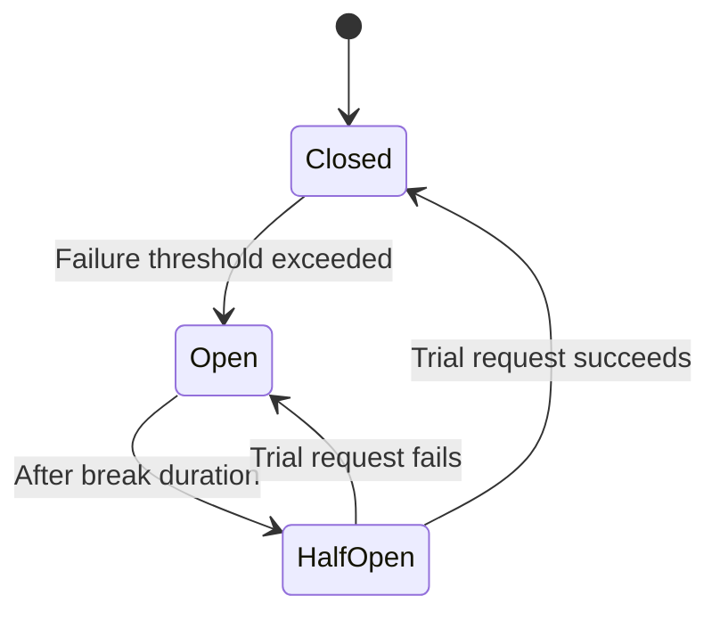

Circuit Breaker prevents cascading failures by "opening" (short-circuiting calls immediately, without even attempting them) after a failure threshold, then periodically allowing a trial request through (**Half-Open**) to test recovery before fully closing again. Note that **.NET 8 introduced `Microsoft.Extensions.Resilience`/`Microsoft.Extensions.Http.Resilience`**, a first-party wrapper around Polly v8's new pipeline API — worth mentioning as the current idiomatic approach over hand-wiring Polly policies directly, since it standardizes resilience config via `AddStandardResilienceHandler()` on `IHttpClientFactory`.

Related resiliency patterns interviewers pair with circuit breaker:
- **Retry** — re-attempt transient failures, ideally with exponential backoff + jitter to avoid thundering herd.
- **Bulkhead isolation** — cap concurrent calls to a dependency so one slow/failing downstream can't exhaust threads/connections needed by unrelated calls.
- **Timeout** — bound how long you wait before giving up, independent of circuit breaker state.
- **Fallback** — return a cached/default value when the primary call fails, for graceful degradation.

### gRPC vs REST vs GraphQL

| Feature | REST | gRPC | GraphQL |
|---|---|---|---|
| Protocol | HTTP/1.1 or HTTP/2 | HTTP/2 (mandatory) | HTTP (any version) |
| Payload | JSON/XML (text) | Protobuf (binary) | JSON |
| Contract | OpenAPI (often optional/generated after the fact) | `.proto` file (mandatory, strongly typed, code-generated) | GraphQL schema (mandatory, strongly typed) |
| Streaming | Limited (SSE, chunked) | Native bidirectional streaming | Subscriptions (via WebSockets, bolted on) |
| Browser support | Native | Requires grpc-web proxy (browsers can't do raw HTTP/2 trailers-based gRPC directly) | Native |
| Overfetching/underfetching | Common (fixed shape per endpoint) | N/A (RPC-style, defined per method) | Solved by design — client specifies exact fields needed |
| Best for | Public APIs, broad client compatibility, simplicity | Internal service-to-service, low-latency/high-throughput, polyglot microservices | Client-driven UIs (mobile/web) aggregating multiple backend sources, BFF layers |

```protobuf
syntax = "proto3";
service ProductService {
  rpc GetProduct (ProductRequest) returns (ProductResponse);
}
```

```csharp
builder.Services.AddGraphQLServer().AddQueryType<Query>();
```

**Senior framing for "which would you pick":** REST for anything public-facing or consumed by unknown/diverse clients (max compatibility, human-debuggable, cacheable by intermediaries via standard HTTP semantics); gRPC for internal microservice-to-microservice calls where you control both ends and want speed + strong contracts (common in a service mesh); GraphQL when the client's data-shape needs vary a lot and you want to avoid either (a) chatty multiple round-trips or (b) an explosion of bespoke REST endpoints for every UI variant — but be ready to discuss its downsides: harder HTTP-level caching (single `POST /graphql` endpoint defeats CDN caching by URL), N+1 query risk in resolvers (mitigated with DataLoader-style batching), and more complex authorization (field-level, not just endpoint-level).

### OData

OData layers standardized query capabilities (filter, sort, select, expand, paginate) onto a REST endpoint via query string conventions.

```csharp
builder.Services.AddControllers().AddOData(options => options.Select().Filter().OrderBy());

[EnableQuery]
[HttpGet]
public IQueryable<Product> Get() => _context.Products;
```

```http
GET /api/products?$filter=price gt 100&$orderby=name
```

**Trade-off:** OData gives consumers powerful ad-hoc querying for free, but it also means clients can construct arbitrarily expensive queries against your database (unbounded `$expand` depth, filters on unindexed columns) — production use requires guardrails (`$top` max page size enforcement, query cost limits, disabling `$expand` on large collections) or it becomes a self-inflicted DoS vector. This is a common senior follow-up: "what could go wrong if you exposed OData without limits?"

---

## System Design & Scalability

Senior interviews increasingly spend a full round on distributed-systems judgment rather than API syntax — this section answers the scalability/consistency questions the source notes flagged as sample questions but never actually worked through.

### Database Sharding vs Partitioning

| Aspect | Partitioning | Sharding |
|---|---|---|
| Scope | Splits one logical table's data across multiple physical structures **within the same database/instance** | Splits data across **multiple separate database instances/servers** |
| Goal | Manageability and query performance on a single large table (e.g., partition by date range) | Horizontal scalability — spreads load and storage across machines when a single DB instance can't handle the volume/throughput |
| Transparency | Usually transparent to the application — the DB engine routes queries to the right partition | The application (or a routing/proxy layer) typically must know which shard holds a given row, via a shard key |
| Cross-partition/shard queries | Relatively cheap — same instance, same query engine | Expensive/hard — often requires fan-out queries or a separate aggregation layer; joins across shards are a known pain point |
| Complexity | Lower — mostly a DBA/schema-design concern | Higher — affects application code, connection routing, rebalancing when adding shards, and transaction scope |
| Common approach in .NET/SQL Server | Table partitioning (`PARTITION BY RANGE`), partitioned indexes | Sharding key baked into connection-routing logic (e.g., `TenantId % N` or consistent hashing), often via a middleware/proxy (Citus for Postgres, Vitess for MySQL) or hand-rolled multi-`DbContext` routing |

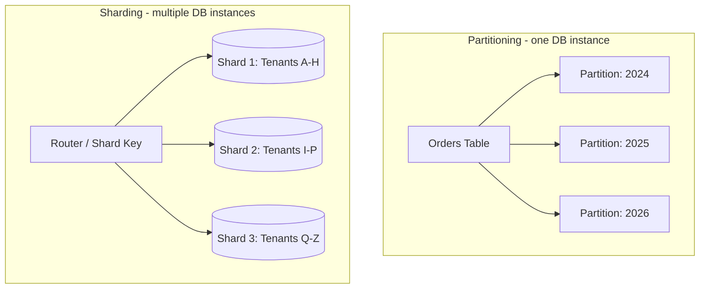

**Senior trade-off framing:** reach for partitioning first — it solves "this one table is too big/slow" without touching application code. Reach for sharding only when a *single database instance's* total capacity (storage, IOPS, connections) is the actual bottleneck, because sharding pushes real complexity into the application: choosing a shard key that avoids hotspots, handling cross-shard queries/joins/transactions, and rebalancing when you add shards later. A common real-world middle ground is a shard key that also happens to be a natural partition boundary (e.g., `TenantId` for a multi-tenant SaaS), letting you shard by tenant while each shard's tables are internally partitioned by date.

### Feature Flags & Safe Rollout

Feature flags decouple **deployment** (code reaching production) from **release** (a feature becoming visible/active for users) — a foundational technique for safe, gradual rollout that the source notes flagged as a sample question without ever answering.

```csharp
if (await _featureManager.IsEnabledAsync("NewCheckoutFlow"))
{
    return await _newCheckoutService.ProcessAsync(order);
}
return await _legacyCheckoutService.ProcessAsync(order);
```

```csharp
builder.Services.AddFeatureManagement(); // Microsoft.FeatureManagement
```

**Implementing safely — what a senior answer covers beyond "use an SDK":**
- **Gradual / percentage rollout** — enable for 1% → 10% → 50% → 100% of traffic (or targeted user segments) rather than a global on/off switch, watching error rates/metrics at each step.
- **Kill switch** — a flag must be checkable and flippable *without a redeploy*, so a bad feature can be disabled in seconds during an incident, not via a rollback deploy.
- **Flag hygiene/debt** — flags are meant to be temporary; stale flags accumulate as untested combinatorial branches in the code and should be removed once a rollout completes (a common real-world pitfall worth naming unprompted).
- **Consistent bucketing** — the same user should consistently land in the same variant across requests (hash the user/session ID into the rollout percentage, not a fresh random roll per request) or you get a confusing, inconsistent experience.
- Common tooling: `Microsoft.FeatureManagement` (config-driven, simple), or a dedicated platform (LaunchDarkly, Azure App Configuration feature flags, Unleash) when you need targeting rules, analytics, and cross-service flag consistency.

### Zero-Downtime Deployment: Blue-Green & Canary

Another sample question left unanswered in the source notes — "how do you deploy without downtime" is a standard senior/lead operational-maturity check.

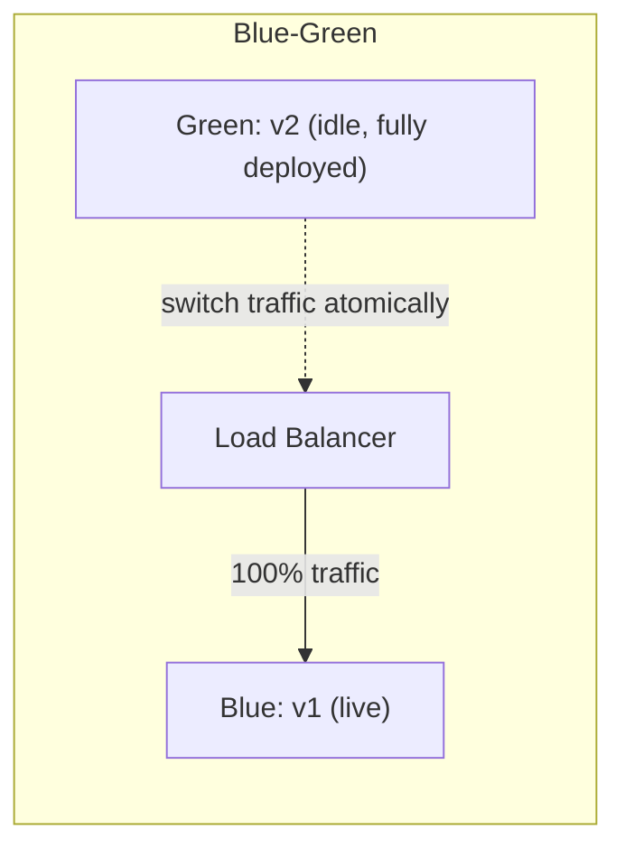

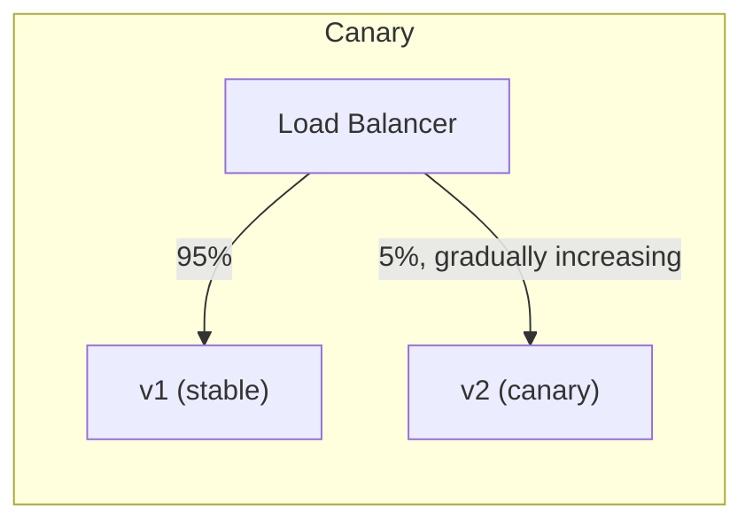

| Strategy | How it works | Rollback speed | Cost |
|---|---|---|---|
| **Blue-Green** | Two full environments; deploy v2 to the idle one, run health/smoke checks, then flip the load balancer/router to send 100% traffic to v2 atomically | Instant — flip the router back to blue | Double the infrastructure while both environments exist |
| **Canary** | Deploy v2 alongside v1; route a small percentage of traffic to v2, watch metrics/errors, gradually increase to 100% | Fast — reduce v2's traffic share back to 0% | Lower — no full duplicate environment, but needs traffic-splitting infra |
| **Rolling update** | Replace instances of v1 with v2 one (or a few) at a time behind a load balancer | Slower — requires redeploying the previous version | Low — no duplicate environment, standard in Kubernetes deployments |

**Key mechanics a senior candidate should name unprompted:**
- **Readiness probes** — the load balancer/orchestrator must only route traffic to an instance once it reports ready (not just "process started"); this is what actually prevents a "half-deployed" instance from serving errors during rollout. See [Health Checks](#health-checks) below for the concrete implementation.
- **Backward-compatible DB migrations** — the riskiest part of "zero downtime" is usually the database, not the app tier: a migration must be compatible with *both* the old and new code version during the rollout window (e.g., add a new nullable column and backfill in a later deploy, rather than a single deploy that renames/drops a column the old version still reads).
- **Graceful shutdown** — draining in-flight requests before terminating an old instance (`IHostApplicationLifetime`/`SIGTERM` handling), not just killing the process.
- Canary is strictly better than blue-green for *catching* a bad deploy early (small blast radius, real production traffic, gradual exposure) but requires more infrastructure sophistication (metrics-driven automated promotion/rollback); blue-green is simpler to reason about but an issue only surfaces after 100% of traffic has already flipped.

### The Outbox Pattern

Named once elsewhere in this guide as shorthand for "event-driven consistency" but never actually defined — here's the full picture, since "what is the outbox pattern" is asked directly.

**The problem it solves:** you need to update your database *and* publish a message/event (e.g., to Kafka/RabbitMQ) as a single atomic unit of work — but a database and a message broker are two separate systems with no shared transaction. Writing to the DB and then publishing the event as two separate steps risks a **dual-write problem**: the DB commit succeeds but the publish fails (or vice versa), leaving the system inconsistent (e.g., an order is created but no `OrderCreated` event ever reaches the shipping service).

**The fix:** write the event to an `OutboxMessages` table in the **same database transaction** as the business data change, then a separate background process reads unpublished rows from that table and publishes them to the broker, marking them processed on success.

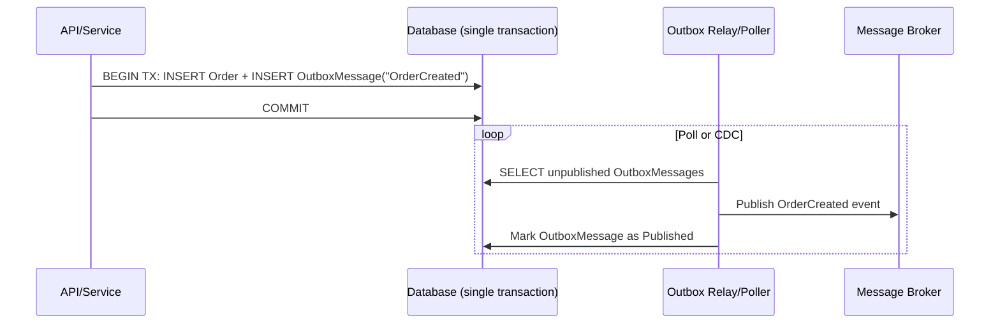

```csharp
public class OutboxMessage
{
    public Guid Id { get; set; }
    public string Type { get; set; }
    public string Payload { get; set; } // serialized event
    public DateTime CreatedAt { get; set; }
    public DateTime? ProcessedAt { get; set; }
}

// Inside the same DbContext SaveChanges transaction as the business entity:
_context.Orders.Add(order);
_context.OutboxMessages.Add(new OutboxMessage
{
    Id = Guid.NewGuid(),
    Type = "OrderCreated",
    Payload = JsonSerializer.Serialize(new { order.Id, order.CustomerId }),
    CreatedAt = DateTime.UtcNow
});
await _context.SaveChangesAsync(); // atomic: both rows commit together, or neither does
```

**Senior-level nuances:**
- The relay/poller (a `BackgroundService`, or a change-data-capture pipeline like Debezium) delivers the event **at-least-once** — it can crash after publishing but before marking the row processed, causing a re-publish. Consumers must be **idempotent** (ties directly into the [idempotency keys](#new-content-idempotency-keys-for-postput) discussion above) — this is the exact mechanism behind "exactly-once delivery" claims in most real systems: it's actually at-least-once delivery plus idempotent consumers, not a true distributed exactly-once guarantee.
- This is what makes the outbox pattern the standard building block for **sagas** (a sequence of local transactions across services, each triggered by the previous step's event) — the alternative to distributed two-phase-commit transactions, which don't scale across microservices/heterogeneous data stores.
- Trade-off vs. simpler approaches: it adds a table, a relay process, and eventual (not immediate) event delivery — only justified when you actually need DB-write-and-event-publish atomicity across a network boundary; for a monolith with no message broker, it's unnecessary ceremony.

### Eventual Consistency & Compensating Transactions

Flagged as a direct sample design question in the source notes ("describe designing for eventual consistency") with no worked answer — this is the natural follow-on to the outbox pattern above.

In a distributed system, you generally cannot get the strong consistency of a single-database ACID transaction across multiple services — each service commits its own local transaction, and the overall multi-service operation becomes consistent only *eventually*, as events propagate and downstream services catch up.

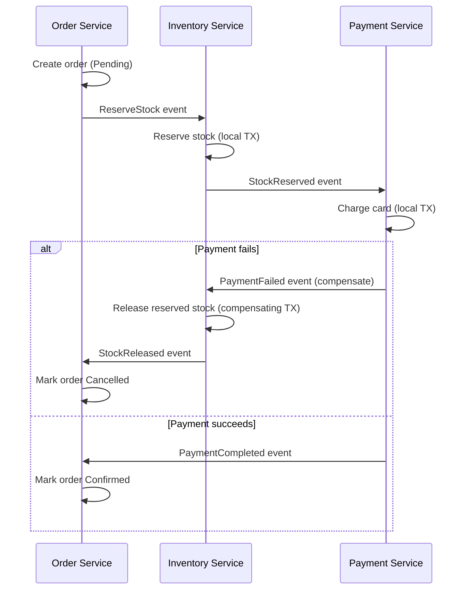

**Compensating transactions** are the distributed-systems answer to "how do you roll back" when there's no shared transaction to roll back — instead of an automatic rollback, each service that already committed a local change performs an explicit, business-meaningful *undo* action if a later step in the workflow fails (release reserved stock, refund a charge, cancel a shipment). This is the core mechanic of the **Saga pattern**.

**What a senior candidate should raise unprompted:**
- **User-visible implications** — the UI must be honest about interim states ("Order placed — confirming payment" rather than implying instant, final success), because the system genuinely doesn't know the final outcome yet at the moment the initial request returns.
- **Read models can lag** — a query hitting a read replica or a denormalized projection immediately after a write may not yet reflect it; design UX and APIs (e.g., returning the just-written entity from the write path itself, not a subsequent read) to avoid confusing "I just saved it but it's not there" bugs.
- **Compensations aren't always possible** — some actions (sending an email, an irreversible external side effect) can't be undone; the design has to prevent triggering those until the workflow reaches a point of no realistic failure, or accept the (rare) inconsistency as a business cost.
- **Idempotency and the outbox pattern are what make sagas reliable** — every step and every compensation must tolerate being retried/re-delivered without double-effecting, which is exactly why these three topics (outbox, idempotency, eventual consistency) are usually asked together rather than in isolation.

---

## Deployment & Observability

### Health Checks

Load balancers, Kubernetes, and container orchestrators need a cheap, standard way to ask "is this instance actually able to serve traffic" — ASP.NET Core's built-in health checks middleware answers that.

```csharp
builder.Services.AddHealthChecks()
    .AddDbContextCheck<AppDbContext>()
    .AddCheck<RedisHealthCheck>("redis")
    .AddUrlGroup(new Uri("https://downstream-api.com/health"), name: "downstream-api");

app.MapHealthChecks("/health");
```

```http
GET /health
```

**Senior-level detail beyond "enable `AddHealthChecks()`":**
- Split **liveness** (is the process alive/should it be restarted?) from **readiness** (is it ready to receive traffic — DB reachable, caches warm?) using separate endpoints/tags (`MapHealthChecks("/health/live", ...)` vs `/health/ready`) — conflating them causes Kubernetes to restart a healthy-but-still-starting pod, or keep routing traffic to a pod whose DB connection is down.
- A readiness check that pings a downstream dependency (like the `AddUrlGroup` example above) can itself become a cascading-failure vector if that dependency is slow/down — bound it with a timeout and treat "downstream degraded" as `Degraded`, not necessarily `Unhealthy`, depending on whether that dependency is actually required to serve the request.
- Health check UI dashboards (`AspNetCore.HealthChecks.UI`) are useful for a small ops team eyeballing status, but the check *endpoints* are what orchestrators/load balancers actually consume — don't conflate the dashboard with the mechanism.
- Ties directly into the [Zero-Downtime Deployment](#zero-downtime-deployment-blue-green--canary) readiness-probe discussion above — this is the concrete implementation of that "readiness probe."

### Dockerizing a .NET Web API

Containerizing is table-stakes for a senior candidate — expect at minimum a multi-stage Dockerfile discussion, not just "I ran `dotnet publish`."

```dockerfile
# Build stage
FROM mcr.microsoft.com/dotnet/sdk:8.0 AS build
WORKDIR /src
COPY . .
RUN dotnet restore
RUN dotnet publish -c Release -o /app/publish

# Runtime stage
FROM mcr.microsoft.com/dotnet/aspnet:8.0 AS runtime
WORKDIR /app
COPY --from=build /app/publish .
EXPOSE 8080
ENTRYPOINT ["dotnet", "MyWebAPI.dll"]
```

```bash
docker build -t mywebapi .
docker run -p 5000:8080 mywebapi
```

**Why the multi-stage build matters (the detail a single-stage Dockerfile misses):** building with the full `sdk` image but shipping the much smaller `aspnet` runtime image keeps the final image lean (no compilers/build tooling in production) and reduces attack surface. Other points worth raising:
- Pin exact base image tags (`aspnet:8.0`, not `latest`) for reproducible builds.
- Run as a **non-root user** in the final image (the official .NET images since .NET 8 default to a non-root `app` user) rather than root, for container security hardening.
- `.dockerignore` your `bin`/`obj`/`.git` folders so the build context (and thus image layers) stay small.
- Externalize configuration via environment variables/mounted secrets — never bake connection strings/API keys into the image.
- Pair with [Health Checks](#health-checks) above for container orchestrator liveness/readiness probes, and expect Kubernetes (not just raw `docker run`) to be the actual follow-up question in a senior interview — the Dockerfile is table-stakes, orchestration is where the interesting trade-offs live (resource limits, HPA scaling on CPU/custom metrics, config via `ConfigMap`/`Secret`).

### Application Insights (Monitoring & Telemetry)

The source notes mention Application Insights directly (distinct from the generic OpenTelemetry references elsewhere in this guide) — worth its own concrete example since it's still the default APM choice for teams already on Azure.

```csharp
builder.Services.AddApplicationInsightsTelemetry(builder.Configuration["ApplicationInsights:ConnectionString"]);
```

```csharp
public class ProductsController : ControllerBase
{
    private readonly TelemetryClient _telemetry;
    public ProductsController(TelemetryClient telemetry) => _telemetry = telemetry;

    [HttpGet]
    public IActionResult Get()
    {
        _telemetry.TrackEvent("ProductsListRequested");
        return Ok("Success");
    }
}
```

**What Application Insights gives you out of the box** once wired in: automatic request/dependency tracking (incoming HTTP requests, outgoing SQL/HTTP calls timed and correlated), exception tracking, live metrics, and — critically for microservices — **distributed request correlation** (an `Operation Id` that ties a single logical user request together across service hops, so you can see an end-to-end trace in the Application Map rather than isolated per-service logs).

**Senior framing vs. the OpenTelemetry mentions elsewhere in this guide:** Application Insights was historically a proprietary SDK/pipeline; current-generation Application Insights is now built on the **OpenTelemetry** standard under the hood (via the Azure Monitor OpenTelemetry Distro), so "Application Insights" today effectively means "OpenTelemetry instrumentation, exported to Azure Monitor" rather than a competing technology — worth stating precisely if asked to contrast them, since treating them as two unrelated tools is a dated understanding. Custom events/metrics (`TrackEvent`, `TrackMetric`, `TrackDependency`) remain useful for business-level telemetry (e.g., "checkout completed", "search returned zero results") that generic auto-instrumentation won't capture — reserve them for signals a dashboard/alert actually needs, not everything, or you drown the useful signal in noise (and run up ingestion cost).

---

## Performance

### Response Compression

```csharp
builder.Services.AddResponseCompression(options =>
{
    options.Providers.Add<BrotliCompressionProvider>();
    options.Providers.Add<GzipCompressionProvider>();
});
app.UseResponseCompression();
```

```http
Accept-Encoding: gzip, deflate, br
```

Reduces payload size and network time; costs CPU to compress. Brotli generally compresses better than Gzip for text (JSON) at comparable/better speed on modern CPUs — prefer it as the primary provider with Gzip as fallback for older clients. **Gotcha:** compression is usually *not* worth it for already-compressed content (images, video) or very small payloads (compression overhead can exceed savings) — and it should generally sit **behind** HTTPS/response caching in the pipeline; double-check ordering (`UseResponseCompression()` should be registered early, before static files/MVC).

### Response Caching, Output Caching & Distributed Cache (Redis)

**In-process response caching:**

```csharp
builder.Services.AddResponseCaching();
app.UseResponseCaching();

[ResponseCache(Duration = 60, Location = ResponseCacheLocation.Client)]
[HttpGet]
public IActionResult Get() => Ok("Cached Data");
```

**Note:** `[ResponseCache]` / `AddResponseCaching()` mostly manipulates HTTP caching *headers* — it doesn't necessarily cache the response server-side unless configured to, and it fully respects `Vary`/`Cache-Control` semantics, meaning misconfigured headers can silently disable caching. **Output Caching** (new in .NET 7, `AddOutputCache()`/`UseOutputCache()`) is the more powerful, actual server-side cache-the-response-body feature, supporting custom cache policies, tag-based eviction, and pluggable storage — this is the modern recommendation over relying solely on `ResponseCache` attributes:

```csharp
builder.Services.AddOutputCache(options =>
{
    options.AddPolicy("Products", policy => policy.Expire(TimeSpan.FromSeconds(60)).Tag("products"));
});
app.UseOutputCache();

app.MapGet("/api/products", () => Ok(products)).CacheOutput("Products");

// Later, on a write:
await outputCacheStore.EvictByTagAsync("products", cancellationToken);
```

**Distributed cache (Redis) — cache-aside pattern:**

```csharp
builder.Services.AddStackExchangeRedisCache(options =>
{
    options.Configuration = "redis:6379";
    options.InstanceName = "app_";
});

var value = await cache.GetStringAsync("product_10");
if (value is null)
{
    value = await FetchFromDbAndSerialize();
    await cache.SetStringAsync("product_10", value, new DistributedCacheEntryOptions
    {
        AbsoluteExpirationRelativeToNow = TimeSpan.FromMinutes(10)
    });
}
```

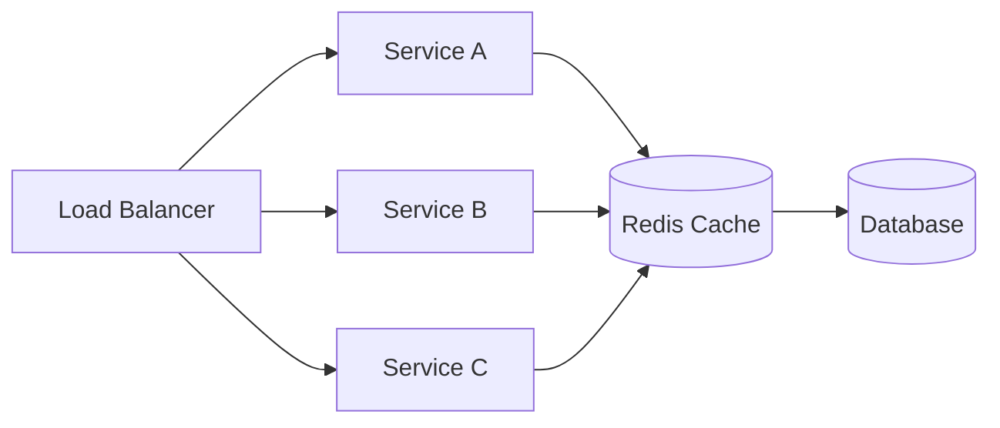

**Why Redis matters in microservices (from source notes, retained):** as instance count scales (1 → 10 → 100 containers), in-memory (`IMemoryCache`) caches diverge — each instance has separate memory, so a cache hit on instance A is a cache miss on instance B. Redis provides one shared cache all instances read from, keeping cached state consistent across the fleet.

**Common interview pitfalls (retained from source, they're genuinely good):**

| Pitfall | Description | Mitigation |
|---|---|---|
| Cache Stampede | Cache expires; many concurrent requests all hit the DB simultaneously | Distributed locks, cache warming, randomized/jittered TTLs |
| Cache Invalidation | DB updated but cache still has stale value | Delete-on-write, write-through caching, event-driven invalidation |
| Storing Too Much Data | Treating Redis as a general datastore instead of a cache | Cache only hot/frequently-accessed data; set TTLs |
| Serialization Problems | Large/complex object graphs serialized inefficiently | Use compact formats (MessagePack) or trimmed DTOs, not full entity graphs |
| Redis as Primary Store | Relying on Redis durability for critical data | Treat Redis as disposable — losing it should degrade, not break, the app |
| Connection Mismanagement | Creating new Redis connections per call | Reuse a shared `IConnectionMultiplexer` singleton |

### [new content] ETags & Conditional Requests

Missing from the source notes entirely — ETags are a standard, senior-expected performance/consistency mechanism that complements (and sometimes replaces) explicit response caching, and are also the backbone of optimistic concurrency for PUT/PATCH.

```csharp
[HttpGet("{id}")]
public async Task<IActionResult> GetProduct(int id)
{
    var product = await _context.Products.FindAsync(id);
    if (product is null) return NotFound();

    var etag = $"\"{product.RowVersion.ToBase64()}\"";
    Response.Headers.ETag = etag;

    if (Request.Headers.IfNoneMatch == etag)
        return StatusCode(StatusCodes.Status304NotModified);

    return Ok(product);
}

[HttpPut("{id}")]
public async Task<IActionResult> UpdateProduct(int id, [FromBody] Product update)
{
    var product = await _context.Products.FindAsync(id);
    if (product is null) return NotFound();

    var currentEtag = $"\"{product.RowVersion.ToBase64()}\"";
    if (Request.Headers.IfMatch != currentEtag)
        return StatusCode(StatusCodes.Status412PreconditionFailed); // someone else updated it first

    // apply update, DB concurrency token check enforces this at the data layer too
    await _context.SaveChangesAsync();
    return NoContent();
}
```

- **`ETag` + `If-None-Match`** — conditional GET: server returns `304 Not Modified` (no body) if the client's cached copy is still current, saving bandwidth without a full response.
- **`ETag` + `If-Match`** — optimistic concurrency for writes: reject the update with `412 Precondition Failed` if the resource changed since the client last read it (directly analogous to EF Core's `[ConcurrencyCheck]`/`RowVersion` pattern, but expressed at the HTTP layer, which is what interviewers want to see connected).
- This is the standards-based alternative/complement to bespoke "version" fields in a request body, and plays nicely with CDNs/reverse proxies that understand HTTP caching semantics natively.

### Query & EF Core Performance

```csharp
var products = _context.Products.AsNoTracking().ToList();
```

Senior-level EF Core performance checklist (expanding the source's brief mentions):
- **`AsNoTracking()`** for read-only queries — skips change-tracking snapshot overhead.
- **Avoid N+1 queries** — use `.Include()`/`.ThenInclude()` for eager loading, or projections (`.Select(x => new Dto {...})`) to fetch only needed columns instead of full entities.
- **Compiled queries** (`EF.CompileAsyncQuery`) for extremely hot, repeated query shapes.
- **Split queries** (`.AsSplitQuery()`) to avoid cartesian-explosion joins when eager-loading multiple collection navigations.
- **Diagnose slow queries** via `.ToQueryString()` to inspect generated SQL, EF Core's built-in query logging, or `EXPLAIN`/execution plans on the DB side; watch for missing indexes on filter/join columns.
- **Pagination at the DB level**, not in memory — `Skip/Take` (or cursor-based, see above) must happen *before* `ToList()`, not after materializing the full table.
- **Dapper/raw ADO.NET** for genuine hotspots where EF's abstraction overhead (change tracking, LINQ-to-SQL translation) measurably matters — don't reach for this by default, profile first.

### Soft Delete Pattern

Deleting rows outright loses audit history and can cascade-break foreign keys; **soft delete** (an `IsDeleted` flag instead of a physical `DELETE`) is the default in most production systems with any compliance/audit requirement.

```csharp
public class Product
{
    public int Id { get; set; }
    public string Name { get; set; }
    public bool IsDeleted { get; set; }
}

[HttpDelete("{id}")]
public async Task<IActionResult> SoftDelete(int id)
{
    var product = await _context.Products.FindAsync(id);
    if (product is null) return NotFound();

    product.IsDeleted = true;
    await _context.SaveChangesAsync();
    return NoContent();
}
```

Naively filtering every query by hand (`.Where(p => !p.IsDeleted)`) doesn't scale — it's easy to forget on one query and leak "deleted" rows into a response. The senior-grade fix is an **EF Core global query filter**, applied once in `OnModelCreating`:

```csharp
protected override void OnModelCreating(ModelBuilder modelBuilder)
{
    modelBuilder.Entity<Product>().HasQueryFilter(p => !p.IsDeleted);
}
```

Every LINQ query against `Products` now automatically excludes soft-deleted rows — including `Include()`d navigations — with no per-query boilerplate. Use `.IgnoreQueryFilters()` explicitly for the rare admin/audit query that needs to see deleted rows.

**Trade-offs to raise unprompted:**
- Unique constraints/indexes need to account for soft-deleted rows (e.g., re-adding a "deleted" username shouldn't collide with the original) — often solved with a filtered/partial unique index (`WHERE IsDeleted = 0`).
- Foreign-key relationships to a soft-deleted parent still resolve — decide whether children should also cascade-flag as deleted or remain independently visible.
- Soft delete is not a substitute for a real data-retention/purge policy — plan a background job or compliance process for eventually hard-deleting rows past a retention window, or the table grows unbounded with dead rows forever.
- For true GDPR/"right to be forgotten" requirements, soft delete alone is insufficient — you may need to actually scrub PII fields even while retaining the row for audit-trail continuity.

### Async/Await Pitfalls

- **`Task.Run` in ASP.NET Core request handlers is almost always wrong** — it just moves work to another thread pool thread while the original request-handling thread pool is already the right place for async I/O; it doesn't add parallelism for a single request and can make thread pool starvation worse under load.
- **Blocking on async code** (`.Result`, `.Wait()`, `.GetAwaiter().GetResult()`) inside a request risks deadlocks in contexts with a synchronization context (less of an issue in ASP.NET Core, which has no `SynchronizationContext` by default — unlike classic ASP.NET/WCF/WinForms — but still wastes a thread pool thread blocking on I/O, and remains an anti-pattern for testability/composability).
- **`ConfigureAwait(false)`** matters most in *library* code with no dependency on a captured context (avoids resuming on the original context unnecessarily); largely a non-issue for ASP.NET Core application/controller code since there's no `SynchronizationContext` to capture, but still good hygiene in shared libraries consumed by contexts that *do* have one (e.g., WPF/WinForms callers).
- **`ValueTask` vs `Task`**: `ValueTask<T>` avoids a heap allocation when the result is available synchronously (e.g., cache hit) — valuable in hot paths with frequent synchronous completion, but **must not be awaited twice or stored/awaited concurrently** (unlike `Task`, which is safe to await multiple times) — a subtle gotcha interviewers like to probe.
- **Deadlock classic case:** synchronous-over-async chains that block a thread waiting on a `Task` that itself needs that same thread (or a starved thread pool) to complete — mitigated in ASP.NET Core by the absence of a captured `SynchronizationContext`, but thread pool starvation from widespread blocking calls is still a real production issue under load.

---

## Security

### Securing a Web API — Full Checklist

| Measure | Purpose |
|---|---|
| Authentication (JWT/OAuth2/API keys) | Controls who can access the API |
| Authorization (roles/claims/policies) | Controls what an authenticated caller can do |
| CORS | Prevents unauthorized cross-origin browser calls |
| Rate limiting | Prevents abuse and DoS |
| Input validation & sanitization | Prevents injection (SQL, XSS) |
| HTTPS/TLS everywhere | Encrypts data in transit |
| Secrets management (Key Vault, env vars) | Prevents credential leakage |
| Security headers (HSTS, CSP, X-Content-Type-Options) | Defense-in-depth against browser-based attacks |

**SQL Injection prevention:**

```csharp
// BAD
string query = "SELECT * FROM users WHERE username = '" + userInput + "'";

// GOOD — parameterized
var command = new SqlCommand("SELECT * FROM users WHERE username = @username", connection);
command.Parameters.AddWithValue("@username", userInput);
```

EF Core's LINQ provider parameterizes queries automatically — raw SQL via `FromSqlRaw` is the risk area; always prefer `FromSqlInterpolated` or explicit parameters there.

**XSS prevention:** encode/escape any user-supplied content rendered as HTML (`@Html.Encode`); for APIs specifically, the bigger XSS risk is usually the *frontend* trusting API responses without escaping — but APIs should still validate/sanitize stored input to avoid becoming a stored-XSS vector for other consumers.

**Model validation via Data Annotations:**

```csharp
public class User
{
    [Required][StringLength(50)] public string Username { get; set; }
    [EmailAddress] public string Email { get; set; }
}
```

### SSL/TLS Fundamentals

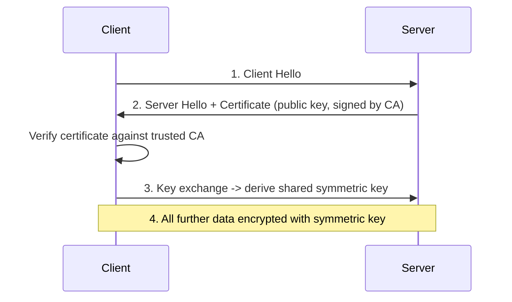

Key points (retained/consolidated from source notes — technically accurate and interview-relevant):
- **"SSL" is colloquial; TLS is the actual protocol in use today** — SSL is deprecated/insecure, but the term persists in casual usage.
- **Three guarantees:** confidentiality (encryption), authentication (server identity via CA-signed certificate), integrity (tamper detection).
- **Protects data in transit only**, not at rest — encryption at rest is a separate concern (DB/disk encryption).
- **Handshake happens once per connection**; subsequent traffic uses the negotiated symmetric key (asymmetric crypto for the handshake, symmetric for bulk transfer — the standard hybrid approach, worth stating explicitly since "why not just use asymmetric for everything" is a natural follow-up: symmetric is orders of magnitude faster for bulk data).
- **TLS termination** commonly happens at a load balancer/IIS/reverse proxy, with the backend receiving plain HTTP internally within a trusted network boundary — a very common real-world architecture worth being able to describe.
- **HSTS** (`Strict-Transport-Security: max-age=31536000; includeSubDomains`) forces browsers to only ever use HTTPS for a domain, closing the window for a downgrade attack on the very first request.

### Token Revocation & Refresh Tokens

**The fundamental JWT revocation problem:** JWTs are stateless and self-contained by design — the server doesn't check a database on every request, which is the whole point of using them. This means a compromised/leaked JWT remains valid until it expires, and there's no built-in way to invalidate it early.

```csharp
public class TokenService
{
    private static readonly List<string> _blacklistedTokens = new();
    public void RevokeToken(string token) => _blacklistedTokens.Add(token);
    public bool IsTokenRevoked(string token) => _blacklistedTokens.Contains(token);
}
```

**Why the naive in-memory blacklist above is inadequate for production (answering what the notes left implicit):** a `static List<string>` is per-instance — in a horizontally scaled deployment, revoking a token on instance A does nothing for instances B/C. The production-correct approach uses a **shared, distributed revocation store** (Redis, with TTL matching the token's remaining lifetime so entries self-expire) checked in a validation-pipeline hook, or — more commonly — **avoids the problem altogether** by:
1. **Keeping access token lifetimes short** (minutes, not hours/days) so leaked-token exposure windows are small.
2. **Using refresh tokens** for long-lived sessions, stored server-side (DB) so they *can* be revoked/rotated on demand — the access token itself stays stateless and short-lived.

```csharp
[HttpPost("refresh-token")]
public async Task<IActionResult> RefreshToken([FromBody] TokenRequest request)
{
    var user = await _context.Users.SingleOrDefaultAsync(u => u.RefreshToken == request.RefreshToken);
    if (user == null || user.RefreshTokenExpiry < DateTime.UtcNow)
        return Unauthorized();

    var newAccessToken = GenerateJwtToken(user);
    user.RefreshToken = GenerateRefreshToken(); // rotate on use — prevents replay of an old refresh token
    await _context.SaveChangesAsync();

    return Ok(new { Token = newAccessToken, RefreshToken = user.RefreshToken });
}

private string GenerateRefreshToken() => Convert.ToBase64String(RandomNumberGenerator.GetBytes(64));
```

**Refresh token rotation** (issuing a new refresh token on every use and invalidating the old one) is the current best practice — it lets you detect token theft (if a *stolen* refresh token is replayed after the legitimate client already rotated it, you know it was compromised and can revoke the whole family).

### Two-Factor Authentication

```csharp
var token = await _userManager.GenerateTwoFactorTokenAsync(user, TokenOptions.DefaultPhoneProvider);
await _smsService.SendSmsAsync(user.PhoneNumber, $"Your verification code is {token}");

var isValid = await _userManager.VerifyTwoFactorTokenAsync(user, TokenOptions.DefaultPhoneProvider, inputToken);
if (!isValid) return Unauthorized();
```

Worth noting for a senior discussion: SMS-based 2FA is the weakest common option (vulnerable to SIM-swapping); TOTP apps (Google Authenticator/Authy) or WebAuthn/FIDO2 passkeys are stronger and increasingly preferred for API/account security in 2025-2026-era systems.

---

## Best Practices

- Design resource-oriented URLs (nouns), use HTTP verbs and status codes correctly, and be consistent about pluralization/casing across the whole API surface.
- Use DTOs at API boundaries — never bind directly to EF entities (over-posting/mass-assignment risk, tight coupling to schema).
- Version from day one for any API with external or cross-team consumers — retrofitting versioning onto a "v1-only" API already in production is painful.
- Return Problem Details (RFC 7807/9457) for all error responses, not ad hoc shapes per endpoint.
- Make POST/PUT idempotent where the operation's business meaning allows it, and use idempotency keys where it doesn't.
- Prefer cursor-based pagination for any collection that's large, high-write, or public-facing.
- Use `IHttpClientFactory` for all outbound HTTP; never `new HttpClient()` per call, never a bare static singleton either.
- Keep controllers thin — orchestration only; business logic belongs in services/domain layer, not in the controller action.
- Use structured logging (`ILogger` + Serilog/structured sinks) with correlation IDs propagated across service boundaries; pair with distributed tracing (OpenTelemetry) for cross-service debugging.
- Enforce HTTPS everywhere, HSTS in production, and never disable certificate validation "temporarily" (it never gets re-enabled).
- Fail closed on authorization — default-deny, explicit allow, not the reverse.
- Load-test and profile before optimizing — `dotnet-counters`/`dotnet-trace`, not guesswork.
- Treat your API as a product: document it (OpenAPI), give it an SLA/deprecation policy, and design for backward compatibility as the default expectation.

## Common Pitfalls

- Assuming PATCH is idempotent by default — it isn't unless you design it to be.
- Leaking raw exception messages/stack traces to clients via unhandled-exception middleware.
- Wildcard CORS (`AllowAnyOrigin`) combined with credentials — invalid and a real security hole if it somehow works.
- Injecting a Scoped service (`DbContext`) directly into a Singleton — runtime exception or, worse, silent shared-state bugs if validation is disabled.
- Offset-based pagination on a frequently-mutated, large table — silently duplicated/missing rows for the client.
- Treating Redis (or any cache) as a system of record instead of a disposable optimization layer.
- Rate limiting counters that are in-memory-per-instance in a horizontally scaled deployment, creating a false sense of a "global" limit.
- Exposing OData or unrestricted `$filter`/`$expand` without page-size caps or query cost limits.
- Blocking on async code (`.Result`/`.Wait()`) inside request-handling paths, wasting thread pool capacity under load.
- Repository-pattern-wrapping EF Core's `DbContext` without a concrete justification, losing `IQueryable` composability for no real gain.
- Forgetting that `[ApiController]` already auto-validates `ModelState` — writing redundant (or worse, contradictory) manual checks.
- Assuming a JWT can be "logged out" server-side without a revocation store or short expiry + refresh-token strategy in place.

## Sample Interview Q&A

**Q: Explain the ASP.NET Core request pipeline and where middleware fits.**
A: Kestrel receives the raw request and builds `HttpContext`, which flows through an ordered middleware pipeline (exception handling → HTTPS redirection → routing → authentication → authorization → custom middleware), then into endpoint execution (controller/minimal API), through filters, and back out through the same middleware in reverse. Order matters — middleware only sees what runs before it, and `Use` continues the pipeline while `Run` terminates it (short-circuits).

**Q: How do you avoid socket exhaustion when using `HttpClient`?**
A: Use `IHttpClientFactory` (named or typed clients) instead of `new HttpClient()` per call or a naive static singleton — it pools and recycles `HttpMessageHandler`s on a rotation, giving connection reuse without the DNS-staleness problem of a permanent singleton handler.

**Q: How would you diagnose a slow EF Core query in production?**
A: Capture the generated SQL via `.ToQueryString()` or query logging, run `EXPLAIN`/execution plan on the DB, check for missing indexes on filter/join/order-by columns, look for N+1 patterns (missing `.Include()` or projections causing lazy-load storms), and confirm `AsNoTracking()` is used for read-only paths.

**Q: When would you choose gRPC over REST?**
A: Internal service-to-service calls where both ends are under your control, low latency and high throughput matter, you want strongly-typed contracts (`.proto`) with generated clients, and/or you need native bidirectional streaming. REST remains the default for public APIs and broad client compatibility.

**Q: How do you design idempotent retries for a payment API?**
A: Require a client-supplied idempotency key per logical operation; store the key with the operation's result atomically (same transaction or a unique-constrained table); on retry with the same key, return the stored result instead of reprocessing; handle the concurrent-in-flight case explicitly (409/425) rather than racing.

**Q: How do you handle a long-running operation triggered by a POST?**
A: Return `202 Accepted` with a `Location` header pointing to a status resource, enqueue the work to a background processor, and let the client poll the status endpoint (or register a webhook for completion notification) — never block the original HTTP request on the full duration of the work.

**Q: What's the difference between authentication and authorization, and where does each fail in the pipeline?**
A: Authentication (who you are) runs first and populates `HttpContext.User`; failure typically results in an anonymous identity rather than immediately stopping the pipeline. Authorization (what you can do) runs after and enforces `[Authorize]`/roles/policies; failure returns 401 (not authenticated) or 403 (authenticated but forbidden) and the controller action never executes.

**Q: Why can't you inject `DbContext` into a Singleton service?**
A: `DbContext` is registered Scoped (one unit of work per request, not thread-safe); a Singleton lives for the app's lifetime and is shared across concurrent requests, so direct injection causes a lifetime-validation exception or, if unvalidated, race conditions/shared state corruption. Fix: inject `IServiceScopeFactory` and create a scope per operation inside the singleton.

**Q: Offset vs cursor pagination — when would you pick each?**
A: Offset (`page`/`pageSize`) is simplest and fine for smaller, relatively static datasets where "jump to page N" and total-page-count UI matter (e.g., admin back-office grids). Cursor-based pagination is preferred for large, high-write, or public-facing collections (feeds, APIs like Stripe/GitHub) because it's immune to row-shift artifacts from concurrent inserts/deletes and performs a consistent indexed seek instead of a discarding `OFFSET` scan.

**Q: How do you keep an API backward compatible while evolving it?**
A: Version explicitly (URL path is the pragmatic default), add fields rather than changing/removing them within a version, treat removals/type changes as breaking and gate them behind a new version, publish a deprecation timeline with `Sunset`/`Deprecation` headers, and validate compatibility with consumer-driven contract tests in CI.

---

## Summary of Additions

The following `[new content]` sections were added because they are frequently probed in current (2025-2026) senior .NET Web API interviews but were missing or only thinly referenced in the original notes:

- **REST Maturity Model (Richardson) & HATEOAS Trade-offs** — the source only defined HATEOAS mechanically; senior interviews expect the maturity-level framework plus an honest pros/cons discussion of whether HATEOAS is worth implementing in practice.
- **Problem Details (RFC 7807/9457) for Error Responses** — the source's exception middleware leaked raw exception messages as plain text; this is the standardized, production-grade replacement using .NET 8's `IExceptionHandler`.
- **Idempotency Keys for POST/PUT** — explicitly asked as a sample question in the source notes ("how to implement retries without causing duplicate side effects") but never answered; now fully answered with implementation detail.
- **Pagination Strategies: Offset vs Cursor** — completely absent from the source despite being a near-guaranteed API-design question at senior level.
- **Long-Running Operations: 202 Accepted + Polling** — flagged as a sample question ("how to handle long-running work") with only a one-line pointer in the source; now fully expanded with flow diagram and code.
- **OpenAPI/Swagger: Contract-First vs Code-First** — the source only showed how to *enable* Swashbuckle; the actual design trade-off (which interviewers care about) was missing.
- **Minimal APIs vs Controllers** — mentioned once in passing in the source with no comparison, despite being one of the most common modern .NET API design questions since .NET 6/7/8.
- **Rate Limiting with Built-in ASP.NET Core Middleware** — the source only referenced the third-party `AspNetCoreRateLimit` package; the first-party `Microsoft.AspNetCore.RateLimiting` middleware (since .NET 7) is now the expected default answer.
- **API Keys vs OAuth2 Scopes — When to Use Which** — the source covered each mechanism separately but never contrasted them, which is exactly the comparative question senior interviewers ask.
- **ETags & Conditional Requests** — entirely missing from the source; ties directly into caching, bandwidth savings, and optimistic concurrency for writes, all high-value senior topics.

### Contradictions Flagged

- The source notes reference `Microsoft.AspNetCore.Mvc.Versioning` for API versioning; this package is deprecated in favor of `Asp.Versioning.Mvc` / `Asp.Versioning.Mvc.ApiExplorer` — flagged inline in the [API Versioning Strategies](#api-versioning-strategies) section rather than treated as a factual contradiction between notes, since it's a package-lifecycle change over time rather than two notes disagreeing with each other.
- No direct factual contradictions were found between different passages of the source notes on the same topic (e.g., the two near-duplicate REST-principles blocks and the several duplicate PUT-vs-PATCH / CORS / rate-limiting / API-versioning explanations were consistent with each other and have been merged/de-duplicated rather than flagged as conflicts).

## Summary of [gaps] Additions (This Pass)

This pass added targeted content identified by a formal gap-analysis review, tagged `[gaps]` to distinguish it from the earlier `[new content]` pass:

1. **OAuth2 Grant Types — Which One Fits Which Client** — the existing content named Authorization Code, Client Credentials, and Device Code only in passing while showing flow diagrams for authentication generally; "which grant type fits which client type" (SPA vs native/mobile vs machine-to-machine vs limited-input device) is one of the most frequently asked *direct* OAuth2 questions at senior level, and the guide had no explicit client-to-grant-type mapping. Also calls out Implicit and ROPC as deprecated under OAuth 2.1, which is current and easy to get wrong if working from older reference material.
